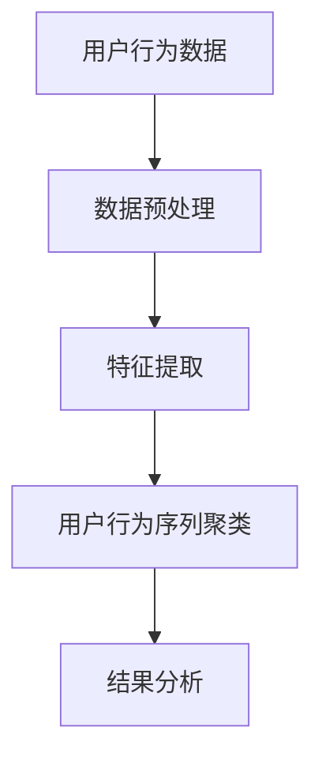

                 

### 文章标题：电商搜索推荐中的AI大模型用户行为序列聚类技术

> 关键词：电商搜索推荐、AI大模型、用户行为序列、聚类技术、个性化推荐

> 摘要：本文深入探讨了电商搜索推荐系统中AI大模型与用户行为序列聚类技术的结合。文章首先概述了AI大模型和用户行为序列聚类技术的基本概念和应用，随后详细分析了电商搜索推荐中的用户行为分析。通过介绍用户行为序列聚类算法的基本原理，本文进一步阐述了基于深度学习的用户行为序列聚类算法的设计和实现。最后，本文通过具体应用案例展示了用户行为序列聚类技术在电商搜索推荐系统中的实际应用，并对系统优化与评估方法进行了深入探讨。

### 目录

#### 第一部分：AI大模型与用户行为序列聚类技术概述

##### 第1章：AI大模型与用户行为序列聚类技术概述

- 1.1 AI大模型概述
  - AI大模型的定义与特点
  - 大模型在电商搜索推荐中的应用

- 1.2 用户行为序列聚类技术概述
  - 用户行为序列聚类技术的基本概念
  - 聚类技术在电商搜索推荐中的应用

##### 第2章：电商搜索推荐中的用户行为分析

- 2.1 用户行为数据的收集与处理
  - 用户行为数据来源
  - 数据预处理方法

- 2.2 用户行为特征提取
  - 用户行为特征提取方法
  - 用户行为特征的量化

##### 第3章：用户行为序列聚类算法原理

- 3.1 聚类算法基本原理
  - K-means算法
  - DBSCAN算法
  - 层次聚类算法

- 3.2 基于深度学习的用户行为序列聚类算法
  - 序列模型介绍
  - 深度聚类模型设计
  - 算法原理与伪代码

##### 第4章：用户行为序列聚类算法性能评估

- 4.1 评价指标
  - 聚类评价指标介绍
  - 性能评估方法

- 4.2 实验设计与结果分析
  - 实验设计方法
  - 实验结果分析

##### 第5章：AI大模型用户行为序列聚类应用案例

- 5.1 案例一：基于用户行为的个性化推荐系统
  - 系统架构设计
  - 算法实现与效果评估

- 5.2 案例二：用户行为分析驱动的营销策略优化
  - 营销策略设计
  - 用户行为分析在营销策略中的应用

#### 第二部分：用户行为序列聚类技术在电商搜索推荐中的应用

##### 第6章：电商搜索推荐系统中的用户行为序列聚类技术

- 6.1 搜索推荐系统概述
  - 搜索推荐系统的基本架构
  - 用户行为序列在搜索推荐系统中的作用

- 6.2 基于用户行为的搜索结果排序
  - 搜索结果排序算法
  - 用户行为序列在排序算法中的应用

##### 第7章：电商搜索推荐系统优化与评估

- 7.1 系统优化方法
  - 模型调整与优化策略
  - 数据处理与特征工程

- 7.2 系统评估与改进
  - 评估指标与评估方法
  - 系统改进策略

##### 第8章：AI大模型用户行为序列聚类技术展望

- 8.1 技术发展趋势
  - AI大模型用户行为序列聚类技术的未来发展方向
  - 新算法和新应用的探索

- 8.2 应用领域拓展
  - 用户行为序列聚类技术在其他领域中的应用
  - 跨领域应用的可能性

#### 附录

- 附录A：相关算法与工具
  - K-means算法详解
  - DBSCAN算法详解
  - 主流深度学习框架使用指南

- 附录B：代码与数据资源
  - 用户行为序列聚类算法实现代码
  - 电商搜索推荐系统数据集下载

#### Mermaid 流程图



#### 核心算法原理讲解（伪代码）

```python
# K-means算法伪代码
initialize K个初始聚类中心
while not converged do
    # 分配步骤
    for each data point x do
        assign x to the nearest cluster center
    end
    # 更新步骤
    for each cluster do
        compute the mean of the points in the cluster
        update the cluster center
    end
end

# DBSCAN算法伪代码
initialize
    for each point p in the dataset do
        if p has not been visited then
            visit p
            compute the neighborhood of p
            if p is a core point then
                expand the cluster
            else if p is a border point then
                check the neighborhood of p
            else if p is a noise point then
                ignore p
            end
        end
    end
```

---

在接下来的部分，我们将详细探讨每个章节的内容，逐步展开对电商搜索推荐中AI大模型用户行为序列聚类技术的全面解析。我们首先从AI大模型和用户行为序列聚类技术的基本概念入手，为后续的深入讨论打下坚实的基础。

