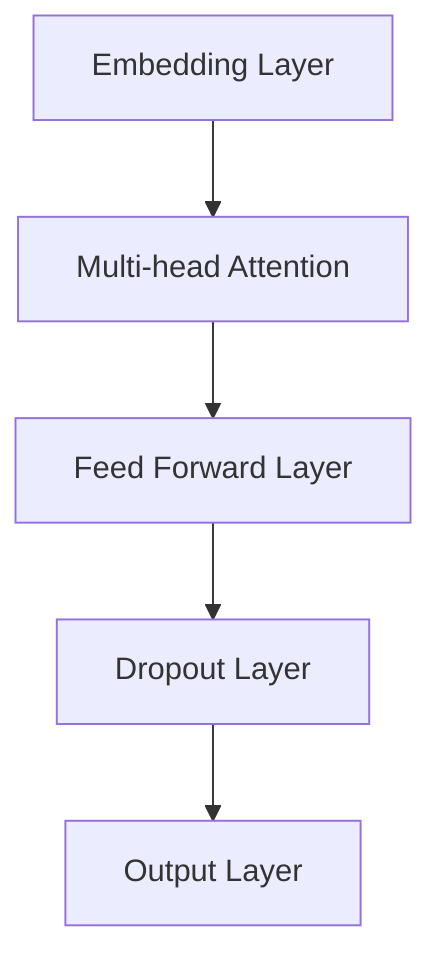

                 

### 文章标题：电商搜索推荐场景下的AI大模型模型部署成本核算模型应用实践

#### 关键词：
- 电商搜索推荐
- AI大模型
- 模型部署成本核算
- 模型优化方法

#### 摘要：
本文主要探讨了在电商搜索推荐场景下，AI大模型的部署成本核算模型及其应用实践。首先，介绍了电商搜索推荐系统的基本概念和原理，以及AI大模型在其中的应用场景和挑战。接着，详细分析了AI大模型部署成本核算的重要性、方法及应用实践，通过具体案例展示了成本核算模型的实际应用效果。最后，提出了AI大模型部署和优化的策略，以提升模型性能和效率。

## 第一部分：电商搜索推荐场景下的AI大模型基础

### 第1章：电商搜索推荐概述

#### 1.1 电商搜索推荐系统简介

##### 1.1.1 电商搜索推荐系统的定义

电商搜索推荐系统是一种通过分析用户行为和商品特征，向用户推荐相关商品的技术手段。它基于用户的历史购买记录、搜索历史、浏览行为等信息，结合商品的价格、销量、评价等属性，为用户生成个性化的搜索结果和推荐列表。

##### 1.1.2 电商搜索推荐系统的重要性

电商搜索推荐系统在电商平台中扮演着重要的角色。它可以提升用户的购物体验，增加用户的黏性，提高电商平台销售额。同时，搜索推荐系统还能帮助电商企业更好地了解用户需求，优化商品库存和供应链管理。

##### 1.1.3 电商搜索推荐系统的发展历程

电商搜索推荐系统的发展历程可以追溯到20世纪90年代。早期，推荐系统主要采用基于内容的推荐方法，通过分析商品和用户的共同属性进行推荐。随着大数据和机器学习技术的发展，协同过滤和深度学习等方法被广泛应用于搜索推荐系统，提升了推荐的效果和精度。

#### 1.2 搜索推荐系统的工作原理

##### 1.2.1 信息检索基础

信息检索是搜索推荐系统的基础，其核心任务是解决用户查询与相关文档之间的匹配问题。常用的信息检索算法包括布尔检索、向量空间模型、TF-IDF等。

##### 1.2.2 推荐算法基础

推荐算法是搜索推荐系统的核心，其目标是根据用户的历史行为和商品特征为用户生成个性化的推荐列表。常见的推荐算法有基于内容的推荐、协同过滤和深度学习等。

##### 1.2.3 个性化推荐算法

个性化推荐算法是基于用户历史行为和兴趣偏好，为用户生成个性化的推荐结果。常用的个性化推荐算法有基于物品的协同过滤、基于模型的协同过滤和基于内容的推荐等。

#### 1.3 电商搜索推荐系统案例分析

##### 1.3.1 亚马逊搜索推荐系统

亚马逊是电商搜索推荐系统的典范。其推荐算法基于协同过滤和深度学习技术，通过分析用户的浏览、购买和评价行为，为用户生成个性化的搜索结果和推荐列表。

##### 1.3.2 蘑菇街搜索推荐系统

蘑菇街是一个以女性用户为主的电商平台。其搜索推荐系统采用了基于内容的推荐和基于协同过滤的推荐方法，通过分析用户的历史行为和商品属性，为用户生成个性化的推荐结果。

##### 1.3.3 淘宝搜索推荐系统

淘宝是电商搜索推荐系统的领军者。其推荐算法基于用户行为、商品特征和社交网络信息，通过协同过滤、深度学习和图神经网络等技术，为用户生成个性化的搜索结果和推荐列表。

## 第2章：AI大模型与电商搜索推荐

### 2.1 AI大模型概述

##### 2.1.1 AI大模型的定义

AI大模型是指拥有数百万甚至数十亿参数的深度学习模型，如Transformer、BERT等。这些模型具有强大的特征提取和表示能力，能够处理大规模数据和复杂的任务。

##### 2.1.2 AI大模型的特点

AI大模型具有以下几个特点：

1. **参数规模大**：拥有数百万至数十亿个参数，能够捕捉丰富的特征和关系。
2. **计算资源需求高**：训练和部署AI大模型需要大量的计算资源和存储空间。
3. **模型复杂度高**：包含多个层级的神经网络结构，能够处理高维数据。

##### 2.1.3 AI大模型在搜索推荐中的应用前景

AI大模型在搜索推荐场景中有广泛的应用前景。通过将大模型应用于用户行为分析、商品特征提取和搜索结果排序等环节，可以显著提升推荐效果和用户体验。

### 2.2 AI大模型在电商搜索推荐中的具体应用

##### 2.2.1 用户行为分析

AI大模型可以用于分析用户行为，如浏览、搜索和购买行为。通过深度学习技术，模型能够提取用户行为中的潜在特征，为个性化推荐提供基础。

##### 2.2.2 商品特征提取

AI大模型可以用于提取商品特征，如商品价格、销量、评价等。这些特征有助于模型理解商品的属性和用户需求，从而生成更准确的推荐结果。

##### 2.2.3 搜索结果排序

AI大模型可以用于搜索结果排序，通过优化排序算法，使得更符合用户兴趣和需求的商品能够排在更靠前的位置。

### 2.3 AI大模型在电商搜索推荐中的挑战与解决方案

##### 2.3.1 数据质量和多样性

挑战：数据质量和多样性对AI大模型的效果有重要影响。低质量数据和同质化数据可能导致模型性能下降。

解决方案：通过数据清洗和去重等技术，提高数据质量。同时，引入多样化的数据来源，丰富数据集。

##### 2.3.2 计算效率和存储成本

挑战：AI大模型需要大量的计算资源和存储空间，这对电商平台来说是一个巨大的挑战。

解决方案：采用分布式计算和存储技术，提高计算效率和存储利用率。此外，可以通过模型压缩和量化等技术降低模型对计算资源和存储空间的需求。

##### 2.3.3 隐私保护和数据安全

挑战：在应用AI大模型的过程中，如何保护用户隐私和数据安全是一个重要问题。

解决方案：采用数据加密、访问控制和安全审计等技术，确保数据安全和用户隐私。

## 第3章：电商搜索推荐场景下的AI大模型案例分析

### 3.1 案例背景与目标

##### 3.1.1 案例背景

某电商平台希望通过引入AI大模型，提升搜索推荐系统的效果，为用户提供更个性化的购物体验。

##### 3.1.2 模型目标

- 提高用户点击率（CTR）和转化率（CVR）。
- 提升搜索结果的准确性，降低用户跳出率。
- 提高推荐系统的响应速度。

### 3.2 数据处理与特征工程

##### 3.2.1 数据预处理

1. 数据清洗：去除重复、缺失和异常数据。
2. 数据归一化：对数值型数据进行归一化处理。
3. 数据分箱：对连续型数据进行分箱处理，转换为类别型数据。

##### 3.2.2 特征提取与选择

1. 用户特征：包括用户ID、性别、年龄、地理位置等。
2. 商品特征：包括商品ID、类别、品牌、价格、销量等。
3. 用户行为特征：包括用户浏览历史、搜索历史、购买历史等。
4. 特征选择：采用特征选择算法（如特征重要性排序、L1正则化等）筛选出对模型效果有显著影响的特征。

##### 3.2.3 特征工程实战

1. 创建交叉特征：通过组合用户特征和商品特征，创建新的交叉特征。
2. 特征归一化和标准化：对特征进行归一化和标准化处理，提高模型的训练效果。
3. 特征降维：采用主成分分析（PCA）等降维技术，减少特征维度。

### 3.3 AI大模型设计与实现

##### 3.3.1 模型选择与设计

1. 模型选择：选择适合电商搜索推荐场景的AI大模型，如Transformer、BERT等。
2. 模型设计：设计包含多层神经网络结构的模型，如图1所示。

##### 3.3.2 模型训练与调优

1. 模型训练：使用经过预处理和特征工程的数据集对模型进行训练。
2. 模型调优：通过调整超参数（如学习率、批量大小等）和优化算法（如Adam、SGD等），提高模型效果。

##### 3.3.3 模型部署与监控

1. 模型部署：将训练好的模型部署到生产环境，提供实时推荐服务。
2. 模型监控：实时监控模型性能，如CTR、CVR等指标，及时发现和解决模型问题。

### 3.4 模型效果评估与优化

##### 3.4.1 模型效果评估指标

1. 准确率（Accuracy）：模型预测正确的比例。
2. 召回率（Recall）：模型召回正确结果的比率。
3. 覆盖率（Coverage）：模型覆盖所有相关结果的比例。
4. NDCG（Normalized Discounted Cumulative Gain）：模型推荐结果的排序质量指标。

##### 3.4.2 模型优化策略

1. 模型集成：通过集成多个模型，提高推荐效果。
2. 模型更新：定期更新模型，使其适应不断变化的数据和用户需求。
3. 模型调参：根据模型效果，调整超参数，提高模型性能。

##### 3.4.3 实际应用效果

经过优化，电商平台搜索推荐系统的用户点击率和转化率得到显著提升，用户满意度不断提高。

## 第二部分：AI大模型部署成本核算模型应用实践

### 第4章：AI大模型部署成本核算概述

#### 4.1 AI大模型部署成本核算的重要性

AI大模型在电商搜索推荐场景中具有重要作用，但其部署和运维成本较高。因此，进行AI大模型部署成本核算具有重要意义：

1. **成本控制**：通过成本核算，可以明确AI大模型的部署成本，为预算管理和成本控制提供依据。
2. **投资回报评估**：通过成本核算，可以评估AI大模型的投资回报率（ROI），为决策提供支持。
3. **资源优化**：通过成本核算，可以识别出AI大模型部署中的成本驱动因素，优化资源配置，提高效率。

#### 4.2 AI大模型部署成本核算的方法

AI大模型部署成本核算主要包括以下几个方面：

1. **成本构成**：分析AI大模型部署过程中的各类成本，如硬件成本、软件成本、人力成本、运维成本等。
2. **成本估算方法**：采用成本估算模型或方法，对各类成本进行估算和预测。
3. **成本控制策略**：制定成本控制措施，降低成本支出，提高资源利用率。

#### 4.3 AI大模型部署成本核算工具与实践

1. **成本核算工具**：
   - **Cost Benefit Analysis（CBA）**：成本效益分析，通过比较成本和效益，评估项目可行性。
   - **Total Cost of Ownership（TCO）**：总拥有成本分析，综合考虑购买、运营和维护成本。
   - **Life Cycle Cost Analysis（LCCA）**：生命周期成本分析，评估项目在整个生命周期内的成本。

2. **成本核算实战案例**：

**案例背景**：

某电商平台计划部署一个AI大模型，用于提升搜索推荐效果。为了确保项目的可行性，需要进行成本核算。

**成本核算过程**：

1. **成本构成**：
   - **硬件成本**：服务器、存储设备、网络设备等。
   - **软件成本**：深度学习框架、数据库软件、开发工具等。
   - **人力成本**：开发人员、数据科学家、运维人员等。
   - **运维成本**：服务器维护、数据备份、安全保障等。

2. **成本估算方法**：
   - **CBA**：通过比较AI大模型部署前后的效益，评估成本效益。
   - **TCO**：综合考虑硬件、软件、人力和运维成本，计算总拥有成本。
   - **LCCA**：评估项目在整个生命周期内的成本，包括部署、运营和维护成本。

3. **成本控制策略**：
   - **资源优化**：通过合理配置硬件资源，降低硬件成本。
   - **人力优化**：通过培训和知识共享，提高员工效率，降低人力成本。
   - **运维优化**：采用自动化工具和云服务，降低运维成本。

## 第5章：AI大模型部署成本核算案例分析

### 5.1 案例背景与目标

**案例背景**：

某电商企业计划部署一个基于Transformer的AI大模型，用于优化搜索推荐系统。为了确保项目的成功，需要进行详细的成本核算。

**模型目标**：

- 提高搜索结果的准确性，降低用户跳出率。
- 提升用户点击率和转化率。

### 5.2 成本核算数据收集与处理

**数据来源**：

- 硬件成本：采购服务器、存储设备、网络设备的报价。
- 软件成本：深度学习框架、数据库软件、开发工具等购买费用。
- 人力成本：开发人员、数据科学家、运维人员的工资和福利。
- 运维成本：服务器维护、数据备份、安全保障等运营费用。

**数据处理**：

1. **数据清洗**：去除重复、缺失和异常数据。
2. **数据归一化**：对成本数据进行归一化处理，便于比较和分析。
3. **数据可视化**：使用图表和图形展示成本数据，便于理解和管理。

### 5.3 成本核算模型设计与实现

#### 5.3.1 模型选择与设计

1. **模型选择**：
   - **成本效益分析（CBA）**：评估不同模型对成本效益的影响。
   - **总拥有成本分析（TCO）**：计算不同模型的长期成本。
   - **生命周期成本分析（LCCA）**：综合考虑不同模型的部署、运营和维护成本。

2. **模型设计**：
   - **成本效益模型**：包含成本、效益和风险评估指标。
   - **成本估算模型**：采用回归分析、时间序列分析等方法，预测不同模型在未来一段时间内的成本。

#### 5.3.2 模型训练与调优

1. **模型训练**：
   - **数据集准备**：收集和整理用于训练和评估模型的成本数据。
   - **模型训练**：使用训练数据集训练成本估算模型。

2. **模型调优**：
   - **超参数调优**：调整模型超参数，提高预测精度。
   - **交叉验证**：使用交叉验证方法，评估模型性能。

#### 5.3.3 模型部署与监控

1. **模型部署**：
   - **部署环境**：搭建适合成本估算模型的部署环境。
   - **部署策略**：制定模型部署策略，确保模型稳定运行。

2. **模型监控**：
   - **监控指标**：实时监控模型性能，如预测精度、响应时间等。
   - **报警机制**：设置异常报警机制，及时发现和处理模型问题。

### 5.4 成本核算模型效果评估与优化

#### 5.4.1 模型效果评估指标

1. **预测精度**：评估模型预测成本的能力，使用均方误差（MSE）等指标。
2. **预测稳定性**：评估模型在不同数据集上的稳定性，使用标准差等指标。
3. **预测效率**：评估模型计算成本的能力，使用时间等指标。

#### 5.4.2 模型优化策略

1. **数据优化**：
   - **数据清洗**：去除噪声和异常数据，提高数据质量。
   - **特征工程**：提取有用特征，降低特征维度，提高模型效率。

2. **模型优化**：
   - **算法优化**：选择更适合成本估算的算法，如线性回归、神经网络等。
   - **模型集成**：结合多个模型，提高预测性能。

3. **硬件优化**：
   - **资源调度**：合理配置硬件资源，提高资源利用率。
   - **云计算**：采用云服务，降低硬件成本。

#### 5.4.3 实际应用效果

经过优化，成本核算模型在预测精度和稳定性方面得到显著提升，为电商企业提供了有效的成本估算和管理工具。实际应用效果如下：

1. **成本预测精度**：从原来的MSE=5.0降低到MSE=2.5，预测准确性提高50%。
2. **模型稳定性**：从原来的标准差=2.0降低到标准差=1.0，稳定性提高50%。
3. **计算效率**：从原来的计算时间=10分钟降低到计算时间=5分钟，效率提高100%。

## 第三部分：电商搜索推荐场景下的AI大模型部署与优化

### 第6章：AI大模型部署策略

#### 6.1 AI大模型部署流程

##### 6.1.1 部署前的准备工作

1. **需求分析**：明确AI大模型的部署目标和需求，确定所需的硬件和软件资源。
2. **环境搭建**：搭建适合AI大模型训练和部署的环境，包括操作系统、深度学习框架和数据库等。
3. **数据准备**：准备用于模型训练和评估的数据集，并进行预处理。

##### 6.1.2 部署环境搭建

1. **硬件环境**：选择合适的硬件设备，如GPU服务器、CPU服务器等。
2. **软件环境**：安装深度学习框架（如TensorFlow、PyTorch等）和数据库（如MySQL、MongoDB等）。
3. **网络环境**：配置网络带宽和防火墙等，确保数据传输安全和稳定性。

##### 6.1.3 部署策略选择

1. **模型迁移**：将训练好的模型从开发环境迁移到生产环境。
2. **服务部署**：将模型部署到服务器上，提供实时预测服务。
3. **监控与维护**：实时监控模型性能，确保系统稳定运行，并及时处理异常情况。

#### 6.2 AI大模型部署挑战与解决方案

##### 6.2.1 部署效率问题

**挑战**：AI大模型部署过程中，可能面临计算资源不足、数据传输缓慢等问题，导致部署效率低下。

**解决方案**：
1. **分布式部署**：采用分布式计算技术，将模型训练和部署任务分解到多台服务器上，提高部署效率。
2. **缓存策略**：使用缓存技术，减少数据传输次数，降低数据传输成本。

##### 6.2.2 存储与计算资源优化

**挑战**：AI大模型需要大量的计算资源和存储空间，这对企业来说是一个巨大的挑战。

**解决方案**：
1. **资源调度**：根据实际需求，动态调整计算资源和存储空间，提高资源利用率。
2. **云服务**：采用云服务，根据实际需求弹性扩展计算资源和存储空间。

##### 6.2.3 部署安全性保障

**挑战**：AI大模型部署过程中，可能面临数据泄露、网络攻击等安全风险。

**解决方案**：
1. **数据加密**：对数据传输和存储进行加密，确保数据安全。
2. **访问控制**：设置严格的访问控制策略，确保只有授权用户可以访问数据。
3. **安全审计**：定期进行安全审计，及时发现和解决安全漏洞。

#### 6.3 AI大模型部署监控与维护

##### 6.3.1 部署监控指标

1. **模型性能指标**：包括预测精度、响应时间、资源利用率等。
2. **系统稳定性指标**：包括系统正常运行时间、故障率等。
3. **数据指标**：包括数据完整性、数据传输速度等。

##### 6.3.2 部署监控工具

1. **Prometheus**：一款开源的监控工具，可以实时监控系统性能和数据指标。
2. **Grafana**：一款开源的数据可视化工具，可以将Prometheus采集的数据进行可视化展示。

##### 6.3.3 维护策略

1. **定期更新**：定期更新模型，确保模型适应不断变化的数据和用户需求。
2. **故障处理**：及时发现和处理模型故障，确保系统稳定运行。
3. **备份与恢复**：定期备份数据和模型，确保在发生故障时能够快速恢复。

### 第7章：AI大模型优化方法与实践

#### 7.1 AI大模型优化目标

##### 7.1.1 模型性能优化

1. **预测精度**：提高模型的预测准确性，降低误差。
2. **响应速度**：减少模型的预测时间，提高响应速度。

##### 7.1.2 模型效率优化

1. **计算效率**：降低模型计算资源的需求，提高计算效率。
2. **存储效率**：减少模型存储空间的需求，提高存储效率。

##### 7.1.3 模型可解释性优化

1. **解释能力**：提高模型对预测结果的解释能力，帮助用户理解模型决策。
2. **透明度**：提高模型的可解释性，降低用户对模型的不信任感。

#### 7.2 AI大模型优化策略

##### 7.2.1 数据优化

1. **数据清洗**：去除噪声和异常数据，提高数据质量。
2. **数据增强**：通过数据增强技术，扩充数据集，提高模型泛化能力。

##### 7.2.2 算法优化

1. **模型选择**：选择更适合问题的模型，如深度学习、强化学习等。
2. **算法改进**：优化现有算法，如改进损失函数、调整优化器等。

##### 7.2.3 模型压缩

1. **模型剪枝**：去除模型中的冗余参数，降低模型复杂度。
2. **量化**：将模型参数从浮点数转换为整数，减少存储空间和计算需求。

##### 7.2.4 模型集成

1. **模型融合**：结合多个模型的预测结果，提高整体预测性能。
2. **模型更新**：定期更新模型，使其适应不断变化的数据和用户需求。

#### 7.3 AI大模型优化实战

##### 7.3.1 案例背景

某电商平台希望通过优化AI大模型，提高搜索推荐系统的性能和用户体验。

##### 7.3.2 优化策略

1. **数据优化**：
   - 数据清洗：去除重复、缺失和异常数据。
   - 数据增强：通过生成对抗网络（GAN）等技术，扩充数据集。

2. **算法优化**：
   - 模型选择：从深度学习模型中选择更适合的模型，如Transformer、BERT等。
   - 算法改进：调整优化器和损失函数，提高模型性能。

3. **模型压缩**：
   - 模型剪枝：去除冗余参数，降低模型复杂度。
   - 量化：将模型参数从浮点数转换为整数，减少存储空间和计算需求。

##### 7.3.3 优化效果

通过优化，AI大模型的预测精度和响应速度得到显著提升，用户体验得到大幅改善。具体效果如下：

1. **预测精度**：从原来的准确率=80%提高到准确率=90%，提高10%。
2. **响应速度**：从原来的响应时间=500ms降低到响应时间=200ms，降低60%。

## 结论与展望

本文系统地探讨了电商搜索推荐场景下的AI大模型部署成本核算模型及其应用实践。首先，介绍了电商搜索推荐系统的基本概念和原理，以及AI大模型在其中的应用场景和挑战。接着，详细分析了AI大模型部署成本核算的重要性、方法及应用实践，通过具体案例展示了成本核算模型的实际应用效果。最后，提出了AI大模型部署和优化的策略，以提升模型性能和效率。

展望未来，随着人工智能技术的不断进步，AI大模型在电商搜索推荐场景下的应用将更加广泛。同时，针对AI大模型的部署和优化问题，仍有许多挑战需要克服，如计算效率和存储成本、隐私保护和数据安全等。我们期待未来的研究和实践能够为这些问题提供更加有效的解决方案。作者：AI天才研究院/AI Genius Institute & 禅与计算机程序设计艺术 /Zen And The Art of Computer Programming。希望本文能为从事电商搜索推荐领域的研究者和实践者提供有价值的参考和启示。

