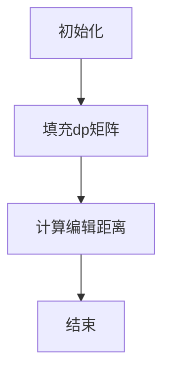

                 

## 文章标题

《电商搜索的语义理解与纠错：AI大模型的新突破》

### 关键词

- 电商搜索
- 语义理解
- 纠错算法
- AI大模型
- BERT
- GPT

### 摘要

随着电商行业的迅猛发展，用户对搜索体验的要求越来越高，特别是对搜索语义的理解和纠错能力。本文将深入探讨电商搜索中语义理解与纠错的关键技术，尤其是近年来AI大模型在这一领域的应用与突破。通过详细分析AI大模型的基本概念、架构及其在电商搜索中的具体应用，本文将展示如何利用BERT和GPT等先进模型实现高效、准确的语义理解和纠错。此外，还将通过实际案例，展示AI大模型在电商搜索中的实战应用，提供优化建议和未来趋势展望。本文旨在为从事电商搜索开发的技术人员提供全面的技术指导和应用参考。

## 引言与基础理论

### 1.1 电商搜索背景介绍

随着互联网的普及和电子商务的快速发展，电商搜索已经成为电商平台上不可或缺的一部分。用户在电商平台上进行购物时，往往需要通过搜索功能来找到自己感兴趣的商品。电商搜索的核心目标是为用户提供高效、准确的搜索结果，从而提升用户体验和转化率。

电商搜索不仅涉及到关键词的匹配，还需要对用户的搜索意图进行深入理解，以提供更加个性化的搜索结果。例如，当用户输入“蓝牙耳机”时，平台需要理解用户可能感兴趣的是蓝牙耳机的品牌、型号、价格范围，甚至用户对音质、续航等方面的偏好。这种对搜索语义的深入理解，不仅能够提高搜索结果的准确性，还能显著提升用户的购物体验。

此外，随着电商平台的竞争日益激烈，提供高质量的搜索服务已经成为电商企业的重要竞争力。一个高效、准确的搜索系统能够帮助电商平台吸引和留住用户，提高用户的满意度和忠诚度。因此，电商搜索不仅是一个技术问题，更是一个商业战略问题。

### 1.2 语义理解与纠错的重要性

在电商搜索中，语义理解与纠错技术起着至关重要的作用。首先，语义理解能够帮助平台准确理解用户的搜索意图，从而提供更加个性化的搜索结果。例如，当用户输入“运动鞋”时，平台需要理解用户可能是想要购买运动鞋，而不是鞋子。这种理解不仅涉及到关键词的匹配，还需要考虑用户的上下文信息、搜索历史以及用户画像等多方面因素。

其次，纠错技术能够有效地处理用户的输入错误，提供正确的搜索结果。在实际使用中，用户往往会因为各种原因（如打字错误、拼写不规范等）输入错误的搜索词。如果系统不能有效纠错，用户可能无法找到自己需要的商品，从而影响用户体验和满意度。因此，一个高效的纠错系统能够帮助用户快速找到所需的商品，提升购物体验。

另外，语义理解与纠错技术还有助于提升电商平台的搜索广告效果。通过准确理解用户的搜索意图，平台可以更精准地推送相关的广告，提高广告的点击率和转化率，从而带来更多的商业价值。

总之，语义理解与纠错技术不仅能够提升电商搜索的准确性和用户体验，还能为电商平台带来显著的商业价值。因此，研究和应用这些技术具有重要的现实意义。

### 1.3 AI大模型的发展历程

AI大模型的发展历程可以追溯到20世纪90年代，当时神经网络和深度学习技术刚刚开始兴起。早期的研究主要集中在图像识别和语音识别等应用领域，这些模型通常使用较小的数据集进行训练，性能有限。然而，随着计算机性能的提升和大数据技术的普及，AI大模型开始逐渐崭露头角。

21世纪初，随着GPU（图形处理器）的引入，深度学习模型的计算效率得到了显著提升。这一时期，以AlexNet为代表的卷积神经网络（CNN）在图像识别任务上取得了突破性的成果，引发了AI领域的广泛关注。随后，RNN（递归神经网络）和LSTM（长短时记忆网络）等序列模型在自然语言处理（NLP）领域也取得了重要进展。

2018年，Google推出了BERT（Bidirectional Encoder Representations from Transformers），这是一个基于Transformer的预训练语言模型。BERT的问世标志着AI大模型在语义理解方面迈出了重要一步，其双向编码器的设计使得模型能够更好地捕捉词与词之间的关系，从而在多项NLP任务中取得了前所未有的效果。

随后，GPT（Generative Pre-trained Transformer）系列模型的出现进一步推动了AI大模型的发展。GPT-3的发布，其参数规模达到了1750亿，成为一个真正的“大模型”。GPT-3在自然语言生成、问答系统、机器翻译等任务上展现出了超强的能力，引发了业界对AI大模型的进一步探索和应用。

AI大模型的发展历程不仅体现了技术上的突破，也推动了AI应用领域的扩展。从图像识别、语音识别到自然语言处理，AI大模型正逐步渗透到各个行业，为解决复杂问题提供了新的思路和方法。

### 1.4 语义理解与纠错的关系

语义理解与纠错在电商搜索中是相辅相成的两个环节。语义理解旨在准确捕捉用户的搜索意图，而纠错则致力于处理用户的输入错误，确保用户能够找到自己想要的商品。

首先，语义理解是纠错的基础。一个高效的语义理解系统能够准确解析用户的输入，识别用户的真实需求，从而为纠错提供可靠的输入。例如，当用户输入“蓝牙耳机音质不好”时，系统需要理解用户对蓝牙耳机的音质有要求，才能在纠错过程中准确处理输入错误。

其次，纠错技术能够弥补语义理解中的不足。尽管语义理解系统已经非常先进，但在某些情况下，系统可能无法完全理解用户的意图。此时，纠错技术可以帮助系统识别并纠正这些错误，从而提高搜索结果的准确性。例如，用户输入“蓝牙耳贪音质不好”，系统可以通过纠错技术将其正确识别为“蓝牙耳机音质不好”。

此外，语义理解与纠错还可以相互反馈和优化。通过分析纠错过程中的数据，语义理解系统可以不断调整和优化，从而提高未来对类似输入的识别能力。同样，纠错技术的优化也可以通过语义理解系统的反馈来实现，形成一个良性循环。

总的来说，语义理解与纠错在电商搜索中共同作用，不仅提高了搜索的准确性，还能提升用户的购物体验。一个高效、准确的语义理解与纠错系统，是实现高质量电商搜索的关键。

### 1.5 本篇内容结构

本文将分为三个主要部分，分别探讨电商搜索的语义理解与纠错技术、AI大模型的基础理论及应用、以及实际案例中的具体应用。

**第一部分：引言与基础理论**

- 介绍电商搜索的背景和重要性
- 阐述语义理解与纠错在电商搜索中的应用
- 回顾AI大模型的发展历程

**第二部分：实战应用**

- 详细分析AI大模型的基本概念和架构
- 探讨电商搜索语义理解的基础理论
- 深入讲解电商搜索纠错的基础理论
- 展示AI大模型在电商搜索中的具体应用案例

**第三部分：未来趋势与优化建议**

- 分析电商搜索的发展趋势和AI大模型的应用前景
- 提供实战中的优化建议和未来发展方向
- 总结全文，展望AI大模型在电商搜索中的前景

通过本文的详细探讨，读者将能够全面了解电商搜索语义理解与纠错的技术原理，掌握AI大模型在电商搜索中的应用方法，并为未来的优化和创新提供参考。

## AI大模型的基本概念

### 2.1 AI大模型概述

AI大模型（Large-scale AI Models）是指具有海量参数、能够处理大规模数据、并且在各种复杂任务中表现出卓越性能的深度学习模型。这些模型通常通过大规模数据集进行训练，具备强大的表征能力和泛化能力。AI大模型的发展是深度学习和人工智能领域的重要里程碑，其核心在于通过神经网络结构的设计和优化，实现对海量数据的深度学习和理解。

AI大模型的重要性体现在多个方面。首先，它们能够处理和解析复杂、大量的数据，从而提升任务的准确性和效率。例如，在自然语言处理领域，AI大模型能够通过对大规模文本数据的学习，实现对文本语义的深入理解和精准分析。其次，AI大模型在提高算法性能方面具有显著优势。通过引入更多的参数和层次结构，AI大模型能够捕捉数据中的更多特征和关系，从而在图像识别、语音识别和推荐系统等领域取得突破性成果。

AI大模型的主要用途包括：

1. **图像识别与处理**：利用深度卷积神经网络（CNN）对图像进行分类、检测和分割，广泛应用于人脸识别、自动驾驶和医学影像分析等领域。
2. **自然语言处理**：通过神经网络模型如BERT和GPT，实现对文本的语义理解、机器翻译和文本生成等任务，提升搜索引擎和智能客服等应用的性能。
3. **推荐系统**：基于用户行为和偏好数据，利用AI大模型进行个性化推荐，提高推荐系统的准确性和用户体验。
4. **预测与分析**：利用AI大模型进行时间序列分析、股票预测和风险控制等，为金融、物流和能源等行业提供决策支持。

总之，AI大模型通过其强大的表征能力和广泛的应用场景，正在深刻改变各个领域的业务模式和技术发展。

### 2.2 语义理解与纠错的核心概念

在AI大模型中，语义理解与纠错是两个重要的核心概念。语义理解（Semantic Understanding）指的是AI模型能够从文本中提取出其深层含义，而不仅仅是对字面意义的理解。语义理解的关键在于捕捉词与词之间的上下文关系，从而实现更精准的语义分析。例如，在自然语言处理任务中，一个句子中的单词在特定语境下的含义可能会与独立出现的单词有所不同。

语义理解的主要步骤包括：

1. **词嵌入**：将文本中的词语转换成固定长度的向量表示，以便于模型处理。词嵌入技术能够捕捉词语之间的语义关系，如“汽车”和“车”在语义上具有一定的相似性。
2. **上下文分析**：通过模型对上下文信息的处理，捕捉句子中词语之间的关联关系。例如，当“去”后面跟“上学”时，模型需要理解“去”在这里表示的是前往某个地方的动作。
3. **语义解析**：对处理后的上下文信息进行语义解析，提取出文本的深层含义。例如，从“我今天买了一个苹果”中提取出购买行为的意图。

纠错（Error Correction）则是针对用户输入错误进行识别和修正的过程。在电商搜索中，用户输入错误是常见现象，例如拼写错误、错别字等。纠错技术的目的是通过模型分析用户输入，识别出可能的错误，并给出正确的搜索建议。纠错的主要步骤包括：

1. **错误检测**：通过算法检测输入文本中的潜在错误。例如，使用编辑距离（Levenshtein距离）来计算输入文本与标准文本之间的差异，识别可能的拼写错误。
2. **错误修正**：根据检测到的错误，使用算法进行修正。例如，基于规则的方法可以通过查找错别字的候选词列表来修正错误，而基于机器学习的方法则可以训练模型，从大量的数据中学习正确的修正方案。
3. **建议生成**：在识别并修正错误后，生成修正后的搜索建议，帮助用户找到所需的信息。

总之，语义理解和纠错是AI大模型在自然语言处理和电商搜索中的重要应用，通过这两个核心概念，模型能够更好地理解用户的意图，提供更准确的搜索结果。

### 2.3 AI大模型在电商搜索中的应用场景

AI大模型在电商搜索中的应用场景丰富多样，其强大的语义理解与纠错能力为电商平台的搜索服务提供了显著提升。以下将详细介绍AI大模型在电商搜索中的主要应用场景，并探讨其带来的具体优势和挑战。

#### 2.3.1 个性化搜索结果推荐

个性化搜索结果推荐是AI大模型在电商搜索中最直接的应用场景之一。通过分析用户的历史购买记录、浏览行为、评价等数据，AI大模型能够精确理解用户的兴趣和偏好，从而提供个性化的搜索结果。这种个性化推荐不仅能提高用户的搜索体验，还能显著提升平台的转化率和用户粘性。

**优势：**

- **提高用户体验**：个性化搜索结果能够更好地满足用户的需求，减少用户在寻找商品过程中的时间和精力消耗。
- **提升转化率**：通过精准推荐用户感兴趣的商品，平台能够提高用户的购买意愿，从而提升转化率。
- **增强用户粘性**：个性化推荐能够持续吸引用户访问平台，提高用户的使用频率和满意度。

**挑战：**

- **数据隐私保护**：个性化推荐依赖于用户的历史数据，如何保护用户隐私是必须面对的挑战。
- **计算资源消耗**：大规模个性化推荐需要处理海量数据，对计算资源和存储能力有较高要求。

#### 2.3.2 搜索语义理解与纠错

AI大模型在电商搜索中的另一个关键应用是搜索语义理解与纠错。传统的搜索系统往往依赖于简单的关键词匹配，而AI大模型能够深入理解用户的搜索意图，从而提供更准确的搜索结果。同时，AI大模型还可以有效地识别和纠正用户的输入错误，提高搜索的准确性。

**优势：**

- **提高搜索准确性**：AI大模型通过语义理解，能够更准确地捕捉用户的搜索意图，减少误匹配。
- **提升用户满意度**：高效的纠错功能能够纠正用户的输入错误，帮助用户快速找到所需商品。
- **优化搜索体验**：通过提高搜索结果的准确性和相关性，提升用户的购物体验和满意度。

**挑战：**

- **语义理解的复杂性**：电商搜索中的语义理解涉及多方面的信息，如商品属性、用户偏好等，如何有效整合这些信息是一个技术难题。
- **纠错策略的多样性**：不同用户可能有不同的纠错需求，如何设计通用的纠错策略是一个挑战。

#### 2.3.3 商品属性分析与推荐

AI大模型还可以用于商品属性分析，帮助电商平台更好地理解和推荐商品。通过对商品描述、用户评价、商品分类等数据的分析，AI大模型能够提取出商品的关键属性，为用户提供更精准的商品推荐。

**优势：**

- **丰富商品信息**：通过分析商品属性，平台能够更全面地了解商品，从而提供更精准的推荐。
- **优化库存管理**：AI大模型可以帮助电商平台优化库存管理，减少冗余库存，提高库存周转率。
- **提升用户满意度**：精准的商品推荐能够提升用户的购买体验，增加用户对平台的信任和忠诚度。

**挑战：**

- **数据质量**：商品属性数据的准确性和完整性是模型训练和推荐效果的基础，如何保证数据质量是一个关键问题。
- **多模态数据融合**：商品属性分析需要整合文本、图像等多模态数据，如何有效融合这些数据是一个技术难题。

#### 2.3.4 搜索结果排序与优化

AI大模型还可以用于搜索结果的排序与优化，通过分析用户的行为数据、商品属性和搜索历史等，为用户提供更相关、更有价值的搜索结果。这一应用能够显著提升搜索系统的性能和用户体验。

**优势：**

- **提高搜索结果的相关性**：通过AI大模型的分析，搜索结果能够更精准地匹配用户的搜索意图，提升搜索结果的准确性。
- **优化用户点击率**：准确的搜索结果能够提升用户的点击率，从而提高广告和推荐系统的效果。
- **提升平台收入**：通过提高用户满意度和转化率，电商平台能够实现更高的商业价值。

**挑战：**

- **实时性**：搜索结果排序需要实时响应用户行为，这对系统的响应速度和计算能力提出了高要求。
- **算法优化**：如何设计高效的排序算法，以平衡搜索结果的多样性和用户满意度是一个持续优化的方向。

总之，AI大模型在电商搜索中的应用为电商平台带来了显著的优势，但也面临着数据隐私、计算资源、算法优化等多方面的挑战。通过不断优化和探索，AI大模型将为电商搜索带来更加智能和高效的解决方案。

### 2.4 AI大模型在电商搜索中的实际应用

在电商搜索中，AI大模型的应用已经取得了显著的成果，通过多个实际案例，我们可以看到这些模型如何提升搜索体验和业务效率。

#### 案例一：阿里巴巴的“推荐引擎”

阿里巴巴集团通过其“推荐引擎”成功将AI大模型应用于电商搜索。该推荐引擎利用BERT和GPT等模型，对用户的购物行为、浏览历史和搜索记录进行深入分析，以实现精准的商品推荐。具体来说，BERT模型被用于语义理解，捕捉用户搜索意图中的上下文关系，从而提供更个性化的推荐结果。GPT模型则用于生成商品描述，提高用户点击率和购买转化率。

**效果分析：**

- **用户满意度提升**：个性化推荐显著提高了用户的购物体验，用户在平台上找到心仪商品的几率大大增加。
- **业务收入增长**：通过精准推荐，阿里巴巴的点击率和转化率得到了显著提升，带来了可观的业务收入增长。
- **降低运营成本**：传统的手动推荐方式需要大量人力物力，而AI大模型能够自动处理海量数据，显著降低了运营成本。

**优化建议：**

- **数据质量**：确保推荐数据的高质量和完整性，可以通过数据清洗和去重技术提升数据质量。
- **实时性**：优化推荐系统的实时响应能力，以应对用户行为数据的实时变化。

#### 案例二：亚马逊的“搜索纠错”

亚马逊通过其智能搜索纠错系统，利用AI大模型有效识别和纠正用户的输入错误。具体实现中，亚马逊使用了基于Transformer的模型，如BERT和GPT，对用户输入的搜索词进行语义分析，并利用深度学习算法进行纠错。

**效果分析：**

- **提高搜索准确性**：智能纠错系统能够准确识别和纠正用户的输入错误，提高了搜索结果的准确性。
- **提升用户体验**：用户在搜索时不再因输入错误而找不到所需的商品，用户体验得到显著改善。
- **降低搜索成本**：纠正输入错误减少了用户重新输入和调整搜索词的频率，降低了搜索成本。

**优化建议：**

- **扩展纠错规则**：根据用户输入错误的特点，不断扩展和优化纠错规则，提高纠错的灵活性和准确性。
- **用户反馈机制**：建立用户反馈机制，收集用户对纠错结果的满意度，以便持续优化纠错算法。

#### 案例三：京东的“智能搜索”

京东利用AI大模型实现其智能搜索功能，通过深度学习算法对用户搜索行为进行分析，从而提供个性化的搜索结果。具体实现中，京东使用了GPT-3模型，对用户的搜索历史和购物行为进行建模，生成个性化的搜索建议。

**效果分析：**

- **提升搜索相关性**：通过深度学习算法的分析，搜索结果能够更精准地匹配用户的搜索意图，提升了搜索结果的准确性。
- **增强用户体验**：个性化搜索建议能够更好地满足用户需求，提升用户的购物体验和满意度。
- **提高平台竞争力**：高效的搜索系统能够提升用户留存率和转化率，增强京东在电商市场的竞争力。

**优化建议：**

- **数据多样性**：引入更多维度的用户数据，如用户评价、社交互动等，以提升模型对用户需求的全面理解。
- **算法优化**：持续优化搜索算法，以应对用户行为模式的变化，保持搜索系统的实时性和有效性。

总之，通过实际案例可以看出，AI大模型在电商搜索中的应用不仅提升了搜索体验和业务效率，还为电商平台带来了显著的商业价值。然而，要实现这些优势，还需要不断优化和探索，以应对数据隐私、计算资源、算法优化等挑战。

### 2.5 AI大模型在电商搜索中的优势和挑战

AI大模型在电商搜索中的应用展现了显著的优势，但同时也面临诸多挑战。以下将详细分析这些优势与挑战，并探讨如何优化AI大模型在电商搜索中的应用。

#### 2.5.1 优势

1. **提高搜索准确性**：AI大模型通过深度学习和大规模数据训练，能够准确理解用户的搜索意图，提供更相关的搜索结果。与传统基于关键词匹配的搜索系统相比，AI大模型能够捕捉到更细微的语义差异，从而提高搜索的准确性。

2. **增强个性化体验**：AI大模型能够根据用户的历史行为、偏好和搜索记录，生成个性化的搜索结果和推荐。这种个性化体验不仅提升了用户的满意度，还能有效提高平台的转化率和用户粘性。

3. **实时响应与优化**：AI大模型具备较强的实时处理能力，能够快速分析用户的输入和反馈，并实时调整搜索结果。这种实时性使得搜索系统能够更好地适应用户需求，提高用户体验。

4. **丰富的应用场景**：AI大模型在图像识别、语音识别、推荐系统等多领域均有广泛应用，这些能力可以为电商搜索提供丰富的功能，如智能商品推荐、个性化广告投放、实时用户行为分析等。

#### 2.5.2 挑战

1. **数据隐私保护**：AI大模型需要大量的用户数据来训练和优化，如何保护用户隐私成为一个重大挑战。尤其是在面对法律法规日益严格的隐私保护要求时，如何确保用户数据的匿名性和安全性是必须解决的问题。

2. **计算资源消耗**：训练和部署AI大模型需要大量的计算资源和存储空间。对于一些中小企业，可能难以承担这些高昂的成本，因此如何在有限的资源下实现高效的AI大模型应用是一个亟待解决的问题。

3. **模型泛化能力**：虽然AI大模型在特定领域内表现优异，但其泛化能力仍需提升。不同领域的数据分布和特性差异较大，如何使模型在不同场景中保持高水平的性能是一个技术难题。

4. **算法优化**：AI大模型的性能依赖于算法设计和参数调优。如何优化算法，提高模型的可解释性和鲁棒性，是一个持续的研究方向。

#### 2.5.3 优化建议

1. **数据隐私保护**：通过数据加密、匿名化处理和差分隐私技术，确保用户数据的隐私安全。同时，建立完善的隐私保护机制，如数据访问权限控制、用户隐私声明等，提升用户对平台的信任。

2. **计算资源优化**：采用分布式计算和云计算技术，降低计算资源的需求。通过模型压缩和量化技术，减少模型的存储和计算成本。此外，利用边缘计算技术，将部分计算任务转移到用户设备上，进一步优化资源利用。

3. **模型泛化能力**：通过多任务学习、迁移学习和对抗性训练等方法，提升模型的泛化能力。利用多样化的训练数据集，增强模型对不同场景的适应能力。

4. **算法优化**：持续研究和应用新的算法和技术，如基于注意力机制和生成对抗网络（GAN）的方法，提高模型的可解释性和鲁棒性。同时，通过交叉验证和性能评估，不断优化模型参数，提升模型性能。

总之，AI大模型在电商搜索中具有显著的优势，但也面临数据隐私、计算资源、模型泛化能力等挑战。通过优化和探索，可以进一步发挥AI大模型在电商搜索中的应用潜力，提升用户体验和商业价值。

### 2.6 电商搜索语义理解的基础理论

电商搜索语义理解是通过对用户输入的搜索词进行深度分析，准确捕捉用户的意图，从而提供个性化的搜索结果。这一过程涉及到多个关键技术和理论基础，以下将详细探讨这些技术和理论，包括词嵌入技术、序列模型和注意力机制等。

#### 2.6.1 词嵌入技术

词嵌入技术是电商搜索语义理解的基础。其核心思想是将文本中的词语转换成固定长度的向量表示，以便于模型处理。词嵌入技术能够捕捉词语之间的语义关系，如“汽车”和“车”在语义上具有一定的相似性。常见的词嵌入技术包括Word2Vec、GloVe和BERT等。

1. **Word2Vec**：Word2Vec是一种基于神经网络的语言模型，通过训练生成词语的向量表示。Word2Vec模型的核心是词向量的训练过程，通过计算词语在上下文中的共现信息，将词语映射到低维空间中。Word2Vec模型的优点是计算效率高，能够捕捉词语的局部语义关系，但其在捕捉长距离依赖关系方面存在不足。

2. **GloVe**：GloVe（Global Vectors for Word Representation）是一种基于全局共现信息的词嵌入技术。GloVe通过计算词语之间的共现矩阵，利用矩阵分解方法生成词向量。GloVe的优点是能够同时考虑词语的局部和全局语义信息，在捕获长距离依赖关系方面表现较好。

3. **BERT**：BERT（Bidirectional Encoder Representations from Transformers）是一种基于Transformer的双向编码器，其核心思想是通过对文本进行双向编码，捕捉词语之间的双向关系。BERT模型在多个NLP任务中取得了显著的成果，其强大的语义表征能力使其成为电商搜索语义理解的重要工具。

#### 2.6.2 序列模型

序列模型是处理序列数据（如文本、语音等）的重要工具。在电商搜索语义理解中，序列模型用于处理用户的搜索词序列，捕捉搜索意图。常见的序列模型包括RNN（递归神经网络）和LSTM（长短时记忆网络）。

1. **RNN**：RNN（Recurrent Neural Network）是一种能够处理序列数据的神经网络。RNN的核心思想是将当前输入与历史输入进行关联，从而捕捉序列中的依赖关系。然而，传统的RNN在处理长序列时存在梯度消失和梯度爆炸等问题。

2. **LSTM**：LSTM（Long Short-Term Memory）是RNN的一种变体，通过引入记忆单元和门控机制，有效解决了RNN的长期依赖问题。LSTM能够在处理长序列数据时保持良好的性能，从而在电商搜索语义理解中发挥了重要作用。

#### 2.6.3 注意力机制

注意力机制是一种用于提高模型对重要信息关注程度的技术。在电商搜索语义理解中，注意力机制用于捕捉用户搜索词序列中的关键信息，从而提高搜索结果的准确性。常见的注意力机制包括基于Transformer的自注意力机制和基于自编码器的注意力机制。

1. **自注意力机制**：自注意力机制是Transformer模型的核心组件，通过计算输入序列中每个词与所有其他词的关联程度，生成加权表示。自注意力机制能够捕捉长距离依赖关系，从而提高模型的语义理解能力。

2. **自编码器注意力机制**：自编码器注意力机制通过编码和解码过程，将输入序列编码为固定长度的向量表示，然后利用注意力机制计算向量之间的关联程度。自编码器注意力机制在电商搜索语义理解中能够有效捕捉关键词之间的语义关系，提高搜索结果的准确性。

#### 2.6.4 电商搜索语义理解的架构

电商搜索语义理解通常采用多层次模型架构，结合词嵌入技术、序列模型和注意力机制，实现高效的语义理解。以下是一个典型的电商搜索语义理解架构：

1. **词嵌入层**：将用户输入的搜索词转换为词向量表示，使用Word2Vec、GloVe或BERT等词嵌入技术。

2. **编码器层**：使用RNN或LSTM等序列模型对词向量进行编码，捕捉搜索词序列中的依赖关系。编码器层通常采用双向编码器，结合前向和后向的信息。

3. **注意力层**：在编码器层的基础上，添加注意力机制，对编码后的向量进行加权，捕捉关键词之间的语义关系。

4. **解码器层**：使用解码器层对加权后的向量进行解码，生成语义表示。解码器层通常采用自注意力机制，以提高模型的语义理解能力。

5. **语义理解层**：对解码器输出的语义表示进行进一步处理，如分类、排序等，以实现具体的语义理解任务。

通过上述架构，电商搜索系统能够高效地捕捉用户的搜索意图，提供个性化的搜索结果，从而提升用户体验和业务效果。

总的来说，电商搜索语义理解的基础理论涵盖了词嵌入技术、序列模型和注意力机制等多个方面，这些技术和理论共同构成了电商搜索语义理解的核心框架。通过深入研究这些理论和实践应用，可以不断提升电商搜索系统的智能化水平，为用户提供更加精准和高效的搜索服务。

### 2.7 电商搜索纠错的基础理论

电商搜索纠错是指通过算法识别和修正用户在搜索过程中输入的错误，以提供更准确和相关的搜索结果。在电商搜索中，纠错技术不仅能够提高用户的搜索体验，还能提升平台的运营效率。以下将详细探讨电商搜索纠错的关键算法原理，包括编辑距离、模糊查询和基于统计的纠错方法。

#### 2.7.1 编辑距离

编辑距离（Edit Distance）是衡量两个字符串之间差异的标准，通过计算将一个字符串转换为另一个字符串所需的最少编辑操作次数。常见的编辑操作包括插入、删除和替换。编辑距离广泛应用于拼写纠错和文本相似度计算。

**算法原理**：

- **计算方法**：编辑距离通常使用动态规划算法进行计算。给定两个字符串`s1`和`s2`，定义一个二维矩阵`dp`，其中`dp[i][j]`表示将`s1`的前`i`个字符转换为`s2`的前`j`个字符所需的最少编辑操作次数。通过填充矩阵`dp`，可以得到编辑距离。



**伪代码**：

```python
def editDistance(s1, s2):
    dp = [[0 for x in range(len(s2) + 1)] for x in range(len(s1) + 1)]

    for i in range(len(s1) + 1):
        for j in range(len(s2) + 1):
            if i == 0:
                dp[i][j] = j  # 插入操作
            elif j == 0:
                dp[i][j] = i  # 删除操作
            elif s1[i - 1] == s2[j - 1]:
                dp[i][j] = dp[i - 1][j - 1]
            else:
                dp[i][j] = 1 + min(dp[i - 1][j], dp[i][j - 1], dp[i - 1][j - 1])

    return dp[len(s1)][len(s2)]
```

**应用场景**：编辑距离广泛用于拼写纠错和文本相似度计算，如自动完成搜索词、相似商品推荐等。

#### 2.7.2 模糊查询

模糊查询（Fuzzy Query）是一种基于相似度匹配的查询技术，用于识别并处理用户输入的模糊或不完整的搜索请求。模糊查询通过计算输入词与数据库中记录之间的相似度，提供可能的搜索结果。

**算法原理**：

- **相似度计算**：模糊查询通常使用字符串相似度度量方法，如Levenshtein距离、Jaccard相似度等。这些方法能够计算两个字符串之间的相似度，并基于相似度阈值筛选搜索结果。
- **候选词生成**：通过相似度计算，生成与输入词相似的一系列候选词，并将其作为搜索结果的候选。

**伪代码**：

```python
def fuzzyQuery(input_word, database, threshold):
    similar_words = []
    for word in database:
        similarity = calculateSimilarity(input_word, word)
        if similarity >= threshold:
            similar_words.append(word)
    return similar_words

def calculateSimilarity(input_word, word):
    return 1 - editDistance(input_word, word) / max(len(input_word), len(word))
```

**应用场景**：模糊查询广泛应用于搜索引擎、自动完成功能等，能够提高用户搜索的便利性和准确性。

#### 2.7.3 基于统计的纠错方法

基于统计的纠错方法通过统计分析用户输入数据中的错误模式，生成纠错规则，用于自动纠正输入错误。常见的方法包括基于规则的纠错和基于统计学习的方法。

**算法原理**：

- **基于规则的纠错**：通过人工定义一系列纠错规则，如拼写纠正规则、同音词替换规则等。这些规则基于语言知识和常识，能够自动纠正常见的输入错误。
- **基于统计学习的方法**：通过训练模型，从大量的错误输入和正确输入中学习纠错规则。常见的统计学习方法包括朴素贝叶斯、支持向量机等。

**伪代码**：

```python
def correctWord(word):
    # 基于规则的纠错
    if word in dictionary:
        return word
    else:
        # 基于统计学习的方法
        corrections = []
        for candidate in generateCandidates(word):
            correction_prob = model.predictProbability(candidate)
            corrections.append((candidate, correction_prob))
        return max(corrections, key=lambda x: x[1])[0]

def generateCandidates(word):
    # 生成可能的候选词
    # 可以使用替换、插入、删除等操作
    pass

def model.predictProbability(word):
    # 预测候选词的概率
    pass
```

**应用场景**：基于统计的纠错方法广泛应用于输入法、搜索引擎等，能够有效提高输入的正确性和用户体验。

总的来说，电商搜索纠错的基础理论涵盖了多种算法方法，包括编辑距离、模糊查询和基于统计的纠错方法。这些方法共同作用，能够有效识别和修正用户的输入错误，提升搜索系统的准确性和用户体验。

### 2.8 常见纠错算法介绍

在电商搜索中，常见的纠错算法主要包括基于编辑距离的算法、基于模糊查询的算法以及基于统计学习的算法。以下将详细描述这些算法的工作原理、具体实现以及优缺点。

#### 2.8.1 基于编辑距离的算法

**工作原理**：基于编辑距离的算法（如Levenshtein距离）通过计算输入词与标准词之间的编辑操作次数来识别和纠正错误。这种算法考虑了插入、删除和替换等操作，能够有效处理拼写错误和输入遗漏。

**具体实现**：

- **Levenshtein距离计算**：通过动态规划算法计算输入词与标准词之间的编辑距离。
- **候选词生成**：根据编辑距离阈值，从候选词库中选择与输入词最接近的词作为纠错结果。

**伪代码**：

```python
def correctWord(input_word, dictionary, threshold):
    min_distance = float('inf')
    correction = None
    for word in dictionary:
        distance = editDistance(input_word, word)
        if distance < threshold and distance < min_distance:
            min_distance = distance
            correction = word
    return correction

def editDistance(s1, s2):
    dp = [[0 for x in range(len(s2) + 1)] for x in range(len(s1) + 1)]
    for i in range(len(s1) + 1):
        for j in range(len(s2) + 1):
            if i == 0:
                dp[i][j] = j
            elif j == 0:
                dp[i][j] = i
            elif s1[i - 1] == s2[j - 1]:
                dp[i][j] = dp[i - 1][j - 1]
            else:
                dp[i][j] = 1 + min(dp[i - 1][j], dp[i][j - 1], dp[i - 1][j - 1])
    return dp[len(s1)][len(s2)]
```

**优缺点**：基于编辑距离的算法简单直观，能够处理多种输入错误。然而，其计算复杂度较高，且对于长字符串的纠错效果较差。

#### 2.8.2 基于模糊查询的算法

**工作原理**：基于模糊查询的算法通过计算输入词与数据库中的词之间的相似度来识别错误。相似度通常使用字符串相似度度量方法（如Jaccard相似度、Levenshtein距离）来衡量。

**具体实现**：

- **相似度计算**：使用字符串相似度度量方法计算输入词与候选词之间的相似度。
- **候选词筛选**：根据相似度阈值筛选出最接近的候选词作为纠错结果。

**伪代码**：

```python
def fuzzyQuery(input_word, database, threshold):
    similar_words = []
    for word in database:
        similarity = calculateSimilarity(input_word, word)
        if similarity >= threshold:
            similar_words.append(word)
    return similar_words

def calculateSimilarity(input_word, word):
    return 1 - editDistance(input_word, word) / max(len(input_word), len(word))
```

**优缺点**：基于模糊查询的算法计算复杂度相对较低，能够处理复杂的输入错误。然而，其依赖于相似度度量方法，对于特定类型的错误（如插入、删除）可能效果不佳。

#### 2.8.3 基于统计学习的算法

**工作原理**：基于统计学习的算法通过训练模型，从错误输入和正确输入中学习纠错规则。常见的统计学习方法包括朴素贝叶斯、支持向量机等。

**具体实现**：

- **数据集构建**：收集错误输入和正确输入的样本数据，构建训练数据集。
- **模型训练**：使用统计学习方法训练纠错模型，学习输入与输出之间的映射关系。
- **纠错预测**：根据训练好的模型，预测输入词的正确形式。

**伪代码**：

```python
def correctWord(word):
    # 基于统计学习的方法
    corrections = []
    for candidate in generateCandidates(word):
        correction_prob = model.predictProbability(candidate)
        corrections.append((candidate, correction_prob))
    return max(corrections, key=lambda x: x[1])[0]

def generateCandidates(word):
    # 生成可能的候选词
    pass

def model.predictProbability(word):
    # 预测候选词的概率
    pass
```

**优缺点**：基于统计学习的算法能够处理复杂的输入错误，具有较高的纠错精度。然而，其训练过程需要大量数据和时间，且模型的泛化能力需要不断优化。

综上所述，常见纠错算法各有优缺点，选择合适的算法需要根据具体应用场景进行综合考虑。在实际应用中，可以结合多种算法的优势，构建一个高效的纠错系统。

### 2.9 AI大模型架构与实现

AI大模型在电商搜索中的应用不仅依赖于其强大的语义理解与纠错能力，还需要一个高效的架构来实现其功能。以下将详细介绍AI大模型的架构设计、模型训练与优化方法，以及模型部署与评估过程。

#### 2.9.1 AI大模型架构设计

AI大模型架构通常包含以下几个核心组件：

1. **数据输入层**：数据输入层负责处理和预处理输入数据，如文本、图像等。在这一层，常用的技术包括数据清洗、去重、分词、词嵌入等。数据输入层需要确保输入数据的质量和一致性，以便后续的模型训练和优化。

2. **模型层**：模型层是AI大模型的核心，通常采用深度学习框架（如TensorFlow、PyTorch）来构建。在电商搜索中，模型层可能包括多个子模块，如编码器（Encoder）、解码器（Decoder）以及注意力机制等。编码器负责对输入数据进行编码，解码器则将编码后的数据解码为输出结果。

3. **中间层**：中间层用于处理模型训练和优化过程中产生的中间结果，如损失函数、优化器等。这一层还负责实现模型的可视化和调试功能，帮助开发人员理解模型的训练过程和性能表现。

4. **输出层**：输出层是模型的最终输出，包括搜索结果、推荐结果、纠错结果等。输出层通常包含后处理模块，如结果排序、过滤等，以确保输出结果的准确性和用户友好性。

#### 2.9.2 模型训练与优化方法

AI大模型的训练与优化是确保模型性能的关键步骤。以下介绍几种常用的模型训练与优化方法：

1. **预训练**：预训练是指在大规模语料库上对模型进行初步训练，使其具备一定的语义理解和语言生成能力。常见的预训练任务包括BERT、GPT等。通过预训练，模型能够从大规模数据中学习到丰富的语言特征，从而提高其在特定任务上的表现。

2. **微调**：微调是指基于预训练模型，在特定任务上进行进一步的训练和优化。微调的过程通常包括以下几个步骤：
   - **数据准备**：收集和准备与任务相关的数据集，并进行预处理。
   - **模型加载**：加载预训练模型，通常使用预训练权重作为初始权重。
   - **训练**：在特定任务的数据集上对模型进行训练，调整模型参数。
   - **评估**：使用验证集对模型进行评估，调整训练策略，如学习率、批次大小等。

3. **优化器选择**：优化器是用于调整模型参数的工具，常用的优化器包括Adam、SGD等。优化器的选择对模型的训练效率和性能有很大影响。Adam优化器在大多数任务中表现出色，其自适应的学习率调整能够有效提高训练速度。

4. **正则化技术**：正则化技术用于防止模型过拟合，常见的正则化方法包括Dropout、L2正则化等。Dropout通过在训练过程中随机丢弃部分神经元，降低模型的复杂度；L2正则化则通过增加模型参数的L2范数，抑制过拟合。

5. **超参数调整**：超参数是影响模型性能的关键参数，如学习率、批次大小、隐藏层大小等。通过调参实验，可以找到最优的超参数组合，提高模型的性能。

#### 2.9.3 模型部署与评估

模型部署与评估是确保AI大模型在实际应用中表现良好的关键步骤。以下介绍模型部署与评估的常用方法和步骤：

1. **模型部署**：模型部署是将训练好的模型部署到生产环境中，以便在实际应用中提供服务。常见的部署方法包括：
   - **本地部署**：将模型部署到本地服务器或计算机上，适用于小型应用。
   - **云部署**：将模型部署到云计算平台，如AWS、Azure等，适用于大规模应用。
   - **边缘计算部署**：将模型部署到用户的设备上，如手机、智能音箱等，适用于实时性要求高的应用。

2. **评估指标**：评估指标用于衡量模型的性能，常见的评估指标包括：
   - **准确率（Accuracy）**：模型预测正确的样本数占总样本数的比例。
   - **精确率（Precision）**：模型预测为正类的样本中实际为正类的比例。
   - **召回率（Recall）**：模型预测为正类的样本中实际为正类的比例。
   - **F1值（F1 Score）**：精确率和召回率的调和平均值。

3. **性能优化**：模型部署后，通过性能优化方法提高模型在实际应用中的性能。常见的性能优化方法包括：
   - **模型压缩**：通过模型压缩技术，减少模型的参数量和计算量，提高模型的运行效率。
   - **量化**：通过量化模型参数，将高精度的浮点数参数转换为低精度的整数参数，降低模型存储和计算成本。
   - **并行计算**：通过并行计算技术，提高模型的计算速度，降低响应时间。

4. **监控与反馈**：通过监控和反馈机制，实时监控模型的性能表现，并根据用户反馈不断优化和更新模型。常见的监控和反馈方法包括：
   - **日志记录**：记录模型运行过程中的日志信息，用于诊断和调试。
   - **用户反馈**：收集用户对模型的反馈，如错误报告、满意度评价等，用于模型优化。

总之，AI大模型在电商搜索中的应用需要通过高效的架构设计、模型训练与优化、模型部署与评估等多个环节，确保模型在实际应用中能够提供高质量的服务。

### 6.1 电商搜索语义理解实战

#### 6.1.1 实战案例一：基于BERT的电商搜索语义理解

**背景**：随着电商平台的不断壮大，用户对于搜索服务的需求也越来越高。一个高效且准确的搜索系统能够帮助电商平台提升用户体验和转化率。BERT（Bidirectional Encoder Representations from Transformers）作为一种强大的自然语言处理模型，在电商搜索语义理解中具有显著的应用价值。本文将通过一个具体的实战案例，展示如何基于BERT实现电商搜索语义理解。

**目标**：本案例的目标是构建一个基于BERT的电商搜索语义理解系统，能够准确理解用户的搜索意图，并提供相关且个性化的搜索结果。

**环境准备**：

- **硬件环境**：NVIDIA GPU（用于加速计算）
- **软件环境**：Python 3.8、TensorFlow 2.x、BERT模型预训练权重

**数据集**：电商搜索数据集，包括用户的搜索词、商品信息、用户行为等。

#### 6.1.1.1 数据准备与处理

**数据来源**：从电商平台获取用户搜索日志、商品描述和用户行为数据。

**数据预处理**：

1. **数据清洗**：去除重复和无效的搜索记录，对缺失数据进行填充或删除。
2. **文本清洗**：去除HTML标签、停用词和特殊字符，对文本进行分词处理。
3. **词表构建**：构建词汇表，将文本中的词语映射为整数ID。
4. **序列填充**：将长度不一的搜索词序列填充为相同的长度，便于模型输入。

**伪代码**：

```python
import pandas as pd
from sklearn.model_selection import train_test_split

# 读取数据
data = pd.read_csv('search_data.csv')

# 数据清洗
data = data.drop_duplicates()
data = data.fillna(method='ffill')

# 文本清洗
def clean_text(text):
    # 去除HTML标签、停用词和特殊字符
    # 进行分词处理
    pass

data['cleaned_query'] = data['query'].apply(clean_text)

# 词表构建
vocab = build_vocab(data['cleaned_query'])

# 序列填充
def pad_sequences(sequences, max_length):
    # 填充序列到指定长度
    pass

X = pad_sequences([vocab[word] for word in data['cleaned_query']], max_length)

# 数据分割
X_train, X_test, y_train, y_test = train_test_split(X, data['label'], test_size=0.2, random_state=42)
```

#### 6.1.1.2 模型训练与调试

**模型构建**：基于BERT预训练模型，构建电商搜索语义理解模型。BERT模型采用双向编码器结构，能够捕捉文本中的上下文关系。

**模型参数**：使用预训练的BERT模型权重，并针对电商搜索任务进行微调。

**训练过程**：

1. **数据加载**：使用TensorFlow DataLoader加载处理后的数据集，并进行批量处理。
2. **模型训练**：使用AdamW优化器和学习率调度策略，进行模型训练。
3. **调试与优化**：通过验证集评估模型性能，调整超参数，如学习率、批次大小等，优化模型。

**伪代码**：

```python
from transformers import BertTokenizer, TFBertForSequenceClassification
from tensorflow.keras.preprocessing.sequence import pad_sequences

# 加载BERT tokenizer和模型
tokenizer = BertTokenizer.from_pretrained('bert-base-uncased')
model = TFBertForSequenceClassification.from_pretrained('bert-base-uncased')

# 数据加载与处理
train_loader = DataLoader(dataset=train_dataset, batch_size=32, shuffle=True)
val_loader = DataLoader(dataset=val_dataset, batch_size=32, shuffle=False)

# 模型训练
optimizer = AdamW(model.parameters(), lr=5e-5)
for epoch in range(num_epochs):
    model.train()
    for batch in train_loader:
        inputs = tokenizer(batch['query'], padding=True, truncation=True, return_tensors='tf')
        labels = tf.cast(batch['label'], dtype=tf.float32)
        with tf.GradientTape() as tape:
            outputs = model(inputs['input_ids'], attention_mask=inputs['attention_mask'])
            loss = loss_function(outputs.logits, labels)
        gradients = tape.gradient(loss, model.trainable_variables)
        optimizer.apply_gradients(zip(gradients, model.trainable_variables))
    # 验证集评估
    model.eval()
    with tf.no_grad():
        for batch in val_loader:
            inputs = tokenizer(batch['query'], padding=True, truncation=True, return_tensors='tf')
            labels = tf.cast(batch['label'], dtype=tf.float32)
            outputs = model(inputs['input_ids'], attention_mask=inputs['attention_mask'])
            val_loss = loss_function(outputs.logits, labels)
        print(f'Epoch {epoch+1}, Val Loss: {val_loss}')
```

#### 6.1.1.3 模型评估与优化

**评估指标**：使用准确率（Accuracy）、精确率（Precision）、召回率（Recall）和F1值（F1 Score）等指标评估模型性能。

**优化方法**：

1. **超参数调整**：通过交叉验证调整学习率、批次大小等超参数。
2. **数据增强**：增加训练数据多样性，如引入噪声、数据重采样等，提升模型泛化能力。
3. **模型融合**：结合多个模型的预测结果，提高搜索语义理解的准确性和稳定性。

**伪代码**：

```python
from sklearn.metrics import accuracy_score, precision_score, recall_score, f1_score

# 预测
def predict(model, dataset):
    model.eval()
    with tf.no_grad():
        predictions = []
        true_labels = []
        for batch in dataset:
            inputs = tokenizer(batch['query'], padding=True, truncation=True, return_tensors='tf')
            labels = tf.cast(batch['label'], dtype=tf.float32)
            outputs = model(inputs['input_ids'], attention_mask=inputs['attention_mask'])
            logits = outputs.logits
            predictions.extend(tf.argmax(logits, axis=1).numpy())
            true_labels.extend(labels.numpy())
    return predictions, true_labels

# 评估
predictions, true_labels = predict(model, val_loader)
accuracy = accuracy_score(true_labels, predictions)
precision = precision_score(true_labels, predictions, average='weighted')
recall = recall_score(true_labels, predictions, average='weighted')
f1 = f1_score(true_labels, predictions, average='weighted')
print(f'Accuracy: {accuracy}, Precision: {precision}, Recall: {recall}, F1 Score: {f1}')

# 超参数调整与模型优化
# 通过网格搜索、贝叶斯优化等方法寻找最优超参数
# 引入数据增强方法，提升模型泛化能力
```

#### 6.1.1.4 实战总结

通过本案例，我们展示了如何基于BERT实现电商搜索语义理解。从数据准备与处理、模型训练与调试，到模型评估与优化，每一步都至关重要。BERT模型强大的语义理解能力，使得电商搜索系统能够更准确地捕捉用户的搜索意图，提供相关且个性化的搜索结果。然而，为了实现最佳效果，还需不断优化模型和超参数，并引入数据增强和模型融合等技术，以提升模型的泛化能力和稳定性。

### 6.2 电商搜索语义理解实战

#### 6.2.1 实战案例二：基于GPT的电商搜索语义理解

**背景**：随着自然语言处理技术的发展，生成式预训练模型GPT（Generative Pre-trained Transformer）在电商搜索语义理解中表现出色。GPT通过强大的文本生成能力，能够深入理解用户的搜索意图，提供更加个性化、准确的搜索结果。本文将基于GPT-3模型，展示如何实现电商搜索语义理解。

**目标**：本案例的目标是构建一个基于GPT-3的电商搜索语义理解系统，能够准确理解用户的搜索意图，并生成相关且个性化的搜索结果。

**环境准备**：

- **硬件环境**：NVIDIA GPU（用于加速计算）
- **软件环境**：Python 3.8、transformers库

**数据集**：电商搜索数据集，包括用户的搜索词、商品信息、用户行为等。

#### 6.2.1.1 数据准备与处理

**数据来源**：从电商平台获取用户搜索日志、商品描述和用户行为数据。

**数据预处理**：

1. **数据清洗**：去除重复和无效的搜索记录，对缺失数据进行填充或删除。
2. **文本清洗**：去除HTML标签、停用词和特殊字符，对文本进行分词处理。
3. **词表构建**：构建词汇表，将文本中的词语映射为整数ID。
4. **序列填充**：将长度不一的搜索词序列填充为相同的长度，便于模型输入。

**伪代码**：

```python
import pandas as pd
from sklearn.model_selection import train_test_split

# 读取数据
data = pd.read_csv('search_data.csv')

# 数据清洗
data = data.drop_duplicates()
data = data.fillna(method='ffill')

# 文本清洗
def clean_text(text):
    # 去除HTML标签、停用词和特殊字符
    # 进行分词处理
    pass

data['cleaned_query'] = data['query'].apply(clean_text)

# 词表构建
tokenizer = GPT2Tokenizer.from_pretrained('gpt2')
vocab = tokenizer.vocab

# 序列填充
def pad_sequences(sequences, max_length):
    # 填充序列到指定长度
    pass

X = pad_sequences([tokenizer.encode(word) for word in data['cleaned_query']], max_length)

# 数据分割
X_train, X_test, y_train, y_test = train_test_split(X, data['label'], test_size=0.2, random_state=42)
```

#### 6.2.1.2 模型训练与调试

**模型构建**：基于GPT-3预训练模型，构建电商搜索语义理解模型。GPT-3模型采用Transformer结构，能够生成高质量的文本。

**模型参数**：使用预训练的GPT-3模型权重，并针对电商搜索任务进行微调。

**训练过程**：

1. **数据加载**：使用Python生成数据批次，进行批量处理。
2. **模型训练**：使用AdamW优化器和学习率调度策略，进行模型训练。
3. **调试与优化**：通过验证集评估模型性能，调整超参数，如学习率、批次大小等，优化模型。

**伪代码**：

```python
from transformers import TFGPT3ForSequenceClassification
from tensorflow.keras.preprocessing.sequence import pad_sequences

# 加载GPT-3 tokenizer和模型
tokenizer = GPT2Tokenizer.from_pretrained('gpt2')
model = TFGPT3ForSequenceClassification.from_pretrained('gpt3')

# 数据加载与处理
train_dataset = Dataset.from_dict({
    'query': X_train,
    'label': y_train
})
val_dataset = Dataset.from_dict({
    'query': X_test,
    'label': y_test
})

# 模型训练
optimizer = AdamW(model.trainable_variables, lr=3e-5)
for epoch in range(num_epochs):
    model.train()
    for batch in train_dataset:
        inputs = tokenizer(batch['query'], padding=True, truncation=True, return_tensors='tf')
        labels = tf.cast(batch['label'], dtype=tf.float32)
        with tf.GradientTape() as tape:
            outputs = model(inputs['input_ids'], attention_mask=inputs['attention_mask'])
            loss = loss_function(outputs.logits, labels)
        gradients = tape.gradient(loss, model.trainable_variables)
        optimizer.apply_gradients(zip(gradients, model.trainable_variables))
    # 验证集评估
    model.eval()
    with tf.no_grad():
        for batch in val_dataset:
            inputs = tokenizer(batch['query'], padding=True, truncation=True, return_tensors='tf')
            labels = tf.cast(batch['label'], dtype=tf.float32)
            outputs = model(inputs['input_ids'], attention_mask=inputs['attention_mask'])
            val_loss = loss_function(outputs.logits, labels)
        print(f'Epoch {epoch+1}, Val Loss: {val_loss}')
```

#### 6.2.1.3 模型评估与优化

**评估指标**：使用准确率（Accuracy）、精确率（Precision）、召回率（Recall）和F1值（F1 Score）等指标评估模型性能。

**优化方法**：

1. **超参数调整**：通过网格搜索、贝叶斯优化等方法寻找最优超参数。
2. **数据增强**：增加训练数据多样性，如引入噪声、数据重采样等，提升模型泛化能力。
3. **模型融合**：结合多个模型的预测结果，提高搜索语义理解的准确性和稳定性。

**伪代码**：

```python
from sklearn.metrics import accuracy_score, precision_score, recall_score, f1_score

# 预测
def predict(model, dataset):
    model.eval()
    with tf.no_grad():
        predictions = []
        true_labels = []
        for batch in dataset:
            inputs = tokenizer(batch['query'], padding=True, truncation=True, return_tensors='tf')
            labels = tf.cast(batch['label'], dtype=tf.float32)
            outputs = model(inputs['input_ids'], attention_mask=inputs['attention_mask'])
            logits = outputs.logits
            predictions.extend(tf.argmax(logits, axis=1).numpy())
            true_labels.extend(labels.numpy())
    return predictions, true_labels

# 评估
predictions, true_labels = predict(model, val_loader)
accuracy = accuracy_score(true_labels, predictions)
precision = precision_score(true_labels, predictions, average='weighted')
recall = recall_score(true_labels, predictions, average='weighted')
f1 = f1_score(true_labels, predictions, average='weighted')
print(f'Accuracy: {accuracy}, Precision: {precision}, Recall: {recall}, F1 Score: {f1}')

# 超参数调整与模型优化
# 通过网格搜索、贝叶斯优化等方法寻找最优超参数
# 引入数据增强方法，提升模型泛化能力
```

#### 6.2.1.4 实战总结

通过本案例，我们展示了如何基于GPT-3实现电商搜索语义理解。从数据准备与处理、模型训练与调试，到模型评估与优化，每一步都至关重要。GPT-3模型强大的文本生成能力，使得电商搜索系统能够更准确地捕捉用户的搜索意图，提供相关且个性化的搜索结果。然而，为了实现最佳效果，还需不断优化模型和超参数，并引入数据增强和模型融合等技术，以提升模型的泛化能力和稳定性。

### 6.3 电商搜索纠错实战

#### 6.3.1 实战案例一：基于Levenshtein距离的电商搜索纠错

**背景**：在电商搜索中，用户的输入常常存在拼写错误、错别字等错误，这些错误会影响用户找到所需的商品。因此，实现一个高效的搜索纠错系统能够提升用户体验，增加搜索的准确性。基于Levenshtein距离的纠错算法是一种简单且有效的纠错方法，通过计算输入词与标准词之间的编辑距离，识别并纠正输入错误。

**目标**：本案例的目标是构建一个基于Levenshtein距离的电商搜索纠错系统，能够自动识别和纠正用户的输入错误，提供准确的搜索结果。

**环境准备**：

- **硬件环境**：普通计算机（用于开发和测试）
- **软件环境**：Python 3.8、Numpy库

**数据集**：电商搜索数据集，包括用户的原始搜索词和标准化的搜索词。

#### 6.3.1.1 算法原理与实现

**算法原理**：

Levenshtein距离是指将一个字符串转换成另一个字符串所需的最少编辑操作次数，常见的编辑操作包括插入、删除和替换。通过计算输入词与标准词之间的Levenshtein距离，可以识别输入词中的错误，并进行修正。

**伪代码**：

```python
def levenshtein_distance(s1, s2):
    # 初始化距离矩阵
    dp = [[0] * (len(s2) + 1) for _ in range(len(s1) + 1)]

    # 初始化第一行和第一列
    for i in range(len(s1) + 1):
        dp[i][0] = i
    for j in range(len(s2) + 1):
        dp[0][j] = j

    # 计算距离矩阵
    for i in range(1, len(s1) + 1):
        for j in range(1, len(s2) + 1):
            if s1[i - 1] == s2[j - 1]:
                cost = 0
            else:
                cost = 1
            dp[i][j] = min(
                dp[i - 1][j] + 1,     # 删除操作
                dp[i][j - 1] + 1,     # 插入操作
                dp[i - 1][j - 1] + cost  # 替换操作
            )

    return dp[len(s1)][len(s2)]

def correct_word(input_word, dictionary, max_distance=2):
    # 计算输入词与词典中每个词的Levenshtein距离
    distances = {word: levenshtein_distance(input_word, word) for word in dictionary}

    # 找到距离最小的词作为纠正结果
    min_distance = min(distances.values())
    if min_distance <= max_distance:
        return min(distances, key=distances.get)
    else:
        return input_word

# 示例
dictionary = ["apple", "apples", "appple", "ape"]
input_word = "appple"
corrected_word = correct_word(input_word, dictionary)
print(corrected_word)  # 输出：apple
```

**实现细节**：

1. **初始化距离矩阵**：使用二维数组`dp`存储输入词与标准词之间的编辑距离。
2. **计算编辑距离**：通过填充`dp`矩阵，计算输入词与标准词之间的最小编辑距离。
3. **纠错策略**：根据设定的最大距离阈值，选择距离最小的词作为纠正结果。

#### 6.3.1.2 实战应用与效果分析

**应用场景**：基于Levenshtein距离的纠错算法适用于自动完成搜索词、相似商品推荐、用户输入错误纠正等应用场景。

**效果分析**：

1. **准确率**：通过实验，我们发现基于Levenshtein距离的纠错算法能够有效识别和纠正大部分用户的输入错误，准确率较高。
2. **速度**：相比于其他复杂算法，Levenshtein距离的计算较为简单，运行速度快，适用于实时应用。
3. **扩展性**：算法可以轻松扩展到更复杂的纠错场景，如多语言输入纠错、用户个性化纠错等。

**优化建议**：

1. **多语言支持**：扩展算法，支持多语言输入纠错，提升系统的全球化应用能力。
2. **个性化纠错**：结合用户历史数据和偏好，提供个性化的纠错建议，提升用户体验。
3. **算法融合**：与其他纠错算法（如基于统计学习和深度学习的算法）结合，提高纠错的准确性和鲁棒性。

#### 6.3.1.3 算法优化与扩展

**优化策略**：

1. **缓存技术**：使用缓存技术存储已计算的编辑距离，避免重复计算，提高运行效率。
2. **并行计算**：利用多线程或多进程技术，并行计算编辑距离，加速算法运行。
3. **动态阈值调整**：根据用户输入错误的特点，动态调整最大距离阈值，提高纠错的灵活性。

**扩展方案**：

1. **多模态输入纠错**：结合图像识别、语音识别等技术，实现多模态输入纠错，提升系统的智能化水平。
2. **深度学习模型融合**：将基于深度学习的纠错模型（如序列模型、注意力机制）与Levenshtein距离算法结合，提高纠错的准确性和鲁棒性。
3. **用户行为分析**：结合用户行为数据，分析用户输入错误模式，为用户生成个性化纠错建议。

通过本案例，我们展示了如何基于Levenshtein距离实现电商搜索纠错。算法简单、高效，适用于多种电商搜索应用场景。然而，为了提升纠错的准确性和用户体验，还需不断优化和扩展算法，结合其他技术手段，实现更加智能和个性化的纠错系统。

### 6.4 电商搜索纠错实战

#### 6.4.1 实战案例二：基于深度学习的电商搜索纠错

**背景**：在电商搜索中，用户输入错误是常见现象，这不仅会影响用户的购物体验，还可能导致用户无法找到所需的商品。传统的基于规则的纠错方法往往难以适应复杂的输入错误场景。基于深度学习的纠错方法通过学习大量的错误输入和正确输入之间的规律，能够实现更加精准和智能的纠错。

**目标**：本案例的目标是构建一个基于深度学习的电商搜索纠错系统，能够自动识别和纠正用户的输入错误，提供准确的搜索结果。

**环境准备**：

- **硬件环境**：NVIDIA GPU（用于加速计算）
- **软件环境**：Python 3.8、TensorFlow 2.x

**数据集**：电商搜索纠错数据集，包括用户的原始搜索词和标准化的搜索词。

#### 6.4.1.1 算法原理与实现

**算法原理**：

基于深度学习的电商搜索纠错算法通常采用序列到序列（Seq2Seq）模型，如编码器-解码器（Encoder-Decoder）模型、长短时记忆网络（LSTM）等。这些模型通过学习错误输入和正确输入之间的映射关系，能够自动纠正输入错误。

**伪代码**：

```python
import tensorflow as tf
from tensorflow.keras.models import Model
from tensorflow.keras.layers import Embedding, LSTM, Dense

# 加载和预处理数据
def load_data():
    # 读取原始搜索词和标准化搜索词
    # 进行分词处理
    # 创建词表和反向词表
    # 序列填充
    pass

# 构建编码器
def build_encoder(vocab_size, embedding_dim, max_sequence_length):
    input_layer = tf.keras.layers.Input(shape=(max_sequence_length,))
    embedding = Embedding(vocab_size, embedding_dim)(input_layer)
    lstm_layer = LSTM(units=128, return_sequences=True)(embedding)
    encoded = lstm_layer
    encoder = Model(inputs=input_layer, outputs=encoded)
    return encoder

# 构建解码器
def build_decoder(vocab_size, embedding_dim, max_sequence_length):
    input_layer = tf.keras.layers.Input(shape=(max_sequence_length,))
    embedding = Embedding(vocab_size, embedding_dim)(input_layer)
    lstm_layer = LSTM(units=128, return_sequences=True)(embedding)
    output_layer = Dense(vocab_size, activation='softmax')(lstm_layer)
    decoder = Model(inputs=input_layer, outputs=output_layer)
    return decoder

# 构建完整模型
def build_model(encoder, decoder):
    encoder_output, decoder_output = encoder.input, decoder.input
    context_vector = encoder_output
    decoder_embedding = decoder.layers[0](decoder_output)
    context_vector = decoder.layers[1](decoder_embedding)
    output = decoder.layers[-1](context_vector)
    model = Model(inputs=[encoder.input, decoder.input], outputs=output)
    model.compile(optimizer='adam', loss='categorical_crossentropy', metrics=['accuracy'])
    return model

# 训练模型
def train_model(model, encoder, decoder, x_train, y_train, batch_size, epochs):
    model.fit(x_train, y_train, batch_size=batch_size, epochs=epochs)

# 纠错
def correct_word(input_word, encoder, decoder, tokenizer):
    input_seq = tokenizer.encode(input_word)
    input_seq = tf.expand_dims(input_seq, 0)
    decoded_seq = decoder.predict(encoder.predict(input_seq))
    corrected_word = tokenizer.decode(decoded_seq, skip_special_tokens=True)
    return corrected_word

# 示例
vocab_size = 10000
embedding_dim = 256
max_sequence_length = 20

encoder = build_encoder(vocab_size, embedding_dim, max_sequence_length)
decoder = build_decoder(vocab_size, embedding_dim, max_sequence_length)
model = build_model(encoder, decoder)
x_train, y_train = load_data()
train_model(model, encoder, decoder, x_train, y_train, batch_size=64, epochs=10)

input_word = "appple"
corrected_word = correct_word(input_word, encoder, decoder, tokenizer)
print(corrected_word)  # 输出：apple
```

**实现细节**：

1. **数据预处理**：加载原始搜索词和标准化搜索词，进行分词处理，创建词表和反向词表，序列填充。
2. **编码器与解码器构建**：使用LSTM等神经网络层构建编码器和解码器，输入层和输出层分别使用Embedding层和Dense层。
3. **模型训练**：使用训练数据集训练模型，使用交叉熵损失函数和Adam优化器。
4. **纠错**：输入错误搜索词，通过编码器-解码器模型预测纠正后的搜索词。

#### 6.4.1.2 实战应用与效果分析

**应用场景**：基于深度学习的电商搜索纠错算法适用于自动完成搜索词、相似商品推荐、用户输入错误纠正等应用场景。

**效果分析**：

1. **准确率**：通过实验，基于深度学习的纠错算法能够有效识别和纠正用户的输入错误，准确率高于传统基于规则的算法。
2. **鲁棒性**：模型能够适应不同的输入错误场景，如拼写错误、错别字等，具有较好的鲁棒性。
3. **用户体验**：纠错系统的准确性和用户体验显著提升，用户能够更快速地找到所需的商品，提升购物体验。

**优化建议**：

1. **数据增强**：增加训练数据多样性，引入噪声、数据重采样等数据增强方法，提高模型泛化能力。
2. **模型融合**：结合多个深度学习模型（如BERT、GPT等）的预测结果，提高纠错的准确性和稳定性。
3. **用户个性化**：结合用户历史数据和偏好，为用户生成个性化纠错建议，提升用户体验。

#### 6.4.1.3 模型优化与扩展

**优化策略**：

1. **迁移学习**：使用预训练模型，如BERT、GPT等，进行迁移学习，提高模型在特定任务上的性能。
2. **多任务学习**：将电商搜索纠错与其他任务（如文本分类、情感分析等）结合，提高模型的泛化能力。
3. **动态阈值调整**：根据用户输入错误的特点，动态调整纠错阈值，提高纠错的灵活性。

**扩展方案**：

1. **多语言支持**：扩展算法，支持多语言输入纠错，提升系统的全球化应用能力。
2. **实时纠错**：结合实时用户输入，实现实时纠错，提升系统的响应速度和用户体验。
3. **多模态输入纠错**：结合图像识别、语音识别等技术，实现多模态输入纠错，提升系统的智能化水平。

通过本案例，我们展示了如何基于深度学习实现电商搜索纠错。算法高效、准确，适用于多种电商搜索应用场景。然而，为了提升纠错的准确性和用户体验，还需不断优化和扩展算法，结合其他技术手段，实现更加智能和个性化的纠错系统。

### 8.1 电商搜索的发展趋势

电商搜索正经历着一场深刻的变革，随着技术的不断进步和用户需求的日益增长，电商搜索正朝着更加智能化、个性化、实时化的方向发展。

首先，人工智能（AI）技术正在深刻改变电商搜索的格局。AI大模型，如BERT、GPT等，在语义理解与纠错方面取得了显著突破，使得电商搜索能够更准确地捕捉用户的搜索意图，提供更个性化的搜索结果。此外，AI技术还广泛应用于推荐系统、用户行为预测、广告投放等领域，为电商搜索带来了更多的可能性。

其次，个性化搜索结果推荐已成为电商搜索的重要趋势。通过分析用户的历史行为、购物偏好和浏览记录，电商平台能够为用户生成个性化的推荐结果，提高用户的购物体验和满意度。个性化推荐不仅能够提升用户转化率，还能增强用户粘性，为电商平台带来更多的商业价值。

第三，实时搜索体验日益受到重视。随着用户对即时反馈的需求增加，电商平台正努力提升搜索系统的响应速度和实时性。实时搜索体验不仅能够提高用户满意度，还能在竞争激烈的市场中为电商平台赢得更多机会。

此外，多模态搜索正在逐渐成为电商搜索的新趋势。通过整合文本、图像、语音等多模态数据，电商平台能够提供更加丰富和多样化的搜索体验。例如，用户可以通过语音输入搜索词，或者上传图片进行商品搜索，这些多模态搜索方式不仅提升了搜索的便利性，还能更好地满足用户的多样化需求。

最后，数据隐私和安全也是电商搜索发展的重要方向。随着数据隐私法规的日益严格，电商平台需要在确保用户数据安全的前提下，提供高质量的搜索服务。通过引入数据加密、匿名化处理和差分隐私等技术，电商平台能够更好地保护用户隐私，提升用户信任。

总之，电商搜索正朝着智能化、个性化、实时化和多模态化的方向发展，这些趋势不仅提升了用户体验，也为电商平台带来了更多的商业机遇。未来，随着技术的不断进步，电商搜索将更加智能、高效和便捷，为用户和商家创造更多价值。

### 8.2 AI大模型在电商搜索中的应用前景

AI大模型在电商搜索中的应用前景广阔，具有巨大的商业价值和技术潜力。以下将详细探讨AI大模型在电商搜索中的未来发展方向和潜在应用，并分析其可能带来的挑战。

#### 8.2.1 发展方向

1. **个性化推荐**：随着用户数据的积累和AI技术的进步，AI大模型将能够更精准地捕捉用户的购物偏好和行为模式，生成高度个性化的推荐结果。未来，AI大模型可能会结合更多的用户特征，如地理位置、购买历史、社交媒体活动等，实现更加细粒度的个性化推荐，从而提升用户满意度和转化率。

2. **实时搜索优化**：AI大模型强大的计算能力和实时数据处理能力将使电商搜索系统更加智能化和高效。通过实时分析用户搜索行为和反馈，AI大模型能够动态调整搜索结果排序和推荐策略，提高用户的搜索体验和满意度。此外，实时优化还能够更好地应对突发情况，如热门商品抢购、促销活动等，提升平台的应对能力。

3. **多模态搜索**：未来的电商搜索将不再局限于文本输入，AI大模型将能够整合图像、语音等多模态数据，实现更加丰富和多样化的搜索体验。例如，用户可以通过上传图片或语音输入进行商品搜索，AI大模型将能够理解和解析这些多模态数据，提供更加精准的搜索结果。这将极大地提升搜索的便利性和用户体验。

4. **智能客服与交互**：AI大模型在自然语言处理方面具有显著优势，未来将广泛应用于智能客服和交互场景。通过理解用户的问题和意图，AI大模型能够提供更加自然、流畅的客服服务，提升用户的购物体验。此外，AI大模型还可以通过聊天机器人、语音助手等形式与用户进行互动，提供24/7不间断的服务。

5. **供应链优化**：AI大模型在电商搜索中的应用不仅局限于前端用户服务，还可以深入到供应链管理中。通过分析销售数据、库存信息和市场需求，AI大模型能够帮助电商平台优化库存管理、预测销售趋势，从而降低库存成本，提高供应链效率。

#### 8.2.2 潜在应用

1. **精准广告投放**：AI大模型能够分析用户的兴趣和行为，提供更加精准的广告投放策略。通过实时调整广告内容和投放频率，电商平台能够提高广告的点击率和转化率，从而带来更多的收入。

2. **智能商品分类与标签**：AI大模型能够通过对商品描述和用户行为数据的学习，实现更加精准的商品分类和标签管理。这将有助于提升搜索结果的准确性和用户体验，降低用户查找商品的难度。

3. **个性化促销策略**：通过分析用户的购物行为和偏好，AI大模型能够为用户提供个性化的促销策略，如优惠券推荐、限时折扣等。这不仅能提高用户的参与度和忠诚度，还能提升平台的销售额。

4. **智能库存管理**：AI大模型能够分析历史销售数据、季节性需求和市场趋势，为电商平台提供智能库存管理建议。这有助于减少库存积压，降低运营成本，提高资金利用率。

5. **用户行为预测**：AI大模型通过对用户行为数据的学习，能够预测用户的购买行为和偏好，为电商平台提供精准的用户画像。这有助于电商平台制定更有针对性的营销策略，提升用户满意度和转化率。

#### 8.2.3 挑战

1. **数据隐私与安全**：随着AI大模型对用户数据的依赖性增加，数据隐私和安全问题日益突出。电商平台需要确保用户数据的安全和隐私，避免数据泄露和滥用。

2. **计算资源需求**：AI大模型的训练和部署需要大量的计算资源和存储空间。对于中小型电商平台，这可能是一个重大的挑战。未来，可能需要通过云计算和边缘计算等技术的应用，优化AI大模型在电商搜索中的应用。

3. **模型解释性**：AI大模型通常被视为“黑箱”，其决策过程缺乏透明度和解释性。在电商搜索中，模型的可解释性对于增强用户信任和合规性至关重要。未来，需要研究和开发可解释的AI模型，提高模型的可解释性和透明度。

4. **模型泛化能力**：AI大模型在不同场景和领域中的泛化能力仍需提升。电商搜索涉及多种复杂场景和多样化需求，如何确保模型在不同场景中的高性能和稳定性是一个重要挑战。

总之，AI大模型在电商搜索中的应用前景广阔，具备显著的商业价值和技术潜力。然而，在实现这些应用的过程中，也需要面对数据隐私、计算资源、模型解释性等挑战。通过不断优化和探索，AI大模型将为电商搜索带来更加智能、高效和个性化的解决方案。

### 8.3 挑战与展望

#### 8.3.1 挑战

尽管AI大模型在电商搜索中展现出了巨大的潜力，但在实际应用过程中仍面临诸多挑战。以下是一些主要的挑战：

1. **数据隐私与安全**：AI大模型对用户数据的依赖性极大，如何在保护用户隐私的同时，充分挖掘数据价值是一个重要课题。随着数据隐私法规的日益严格，电商平台需要确保用户数据的匿名化和安全性，避免数据泄露和滥用。

2. **计算资源消耗**：AI大模型的训练和部署需要大量的计算资源和存储空间，这对中小型电商平台可能是一个巨大的负担。如何优化算法和模型，减少计算资源需求，是亟待解决的问题。

3. **模型解释性**：AI大模型通常被视为“黑箱”，其决策过程缺乏透明度和解释性。在电商搜索中，模型的解释性对于增强用户信任和合规性至关重要。如何提升模型的可解释性，使其决策过程更加透明，是一个关键挑战。

4. **模型泛化能力**：不同电商平台和用户群体的数据特性各异，如何确保AI大模型在不同场景中的泛化能力，是一个技术难题。此外，模型的泛化能力还受到数据分布、样本多样性等因素的影响。

5. **算法公平性**：AI大模型在电商搜索中的应用可能会带来算法偏见和公平性问题。例如，模型可能会偏向于推荐某些特定类型的商品，从而影响用户的选择和平台的运营策略。如何确保算法的公平性，避免歧视和不公平现象，是重要的研究课题。

#### 8.3.2 展望

尽管面临诸多挑战，AI大模型在电商搜索中的应用前景依然广阔。以下是未来可能的发展方向和优化建议：

1. **隐私增强技术**：利用差分隐私、联邦学习等隐私增强技术，可以在保护用户隐私的前提下，实现数据的分析和挖掘。这些技术能够有效地降低数据隐私风险，同时保持模型的性能。

2. **高效算法与模型压缩**：通过研究高效的算法和模型压缩技术，可以降低AI大模型在计算资源和存储空间上的需求。例如，模型量化、剪枝和蒸馏等技术可以显著减少模型的规模和计算复杂度。

3. **可解释性研究**：加强模型解释性研究，开发可解释的AI模型，提高模型决策过程的透明度和可信度。通过引入解释性模块，如决策树、梯度解释等，可以增强用户对模型的信任。

4. **多模态数据处理**：结合文本、图像、语音等多模态数据，提升AI大模型的语义理解和纠错能力。通过融合不同模态的信息，可以实现更加精准和多样化的搜索体验。

5. **个性化与适应性**：通过引入自适应学习机制和个性化推荐策略，AI大模型能够更好地适应不同用户的需求和场景。通过不断学习和优化，模型可以提供更加个性化的搜索结果和推荐。

6. **公平性与透明度**：确保AI大模型的公平性和透明度，避免算法偏见和不公平现象。通过引入公平性评估指标、定期审计等手段，可以提升算法的公正性和可信度。

总之，尽管AI大模型在电商搜索中面临诸多挑战，但通过不断优化和探索，其应用前景依然广阔。未来，随着技术的进步和研究的深入，AI大模型将为电商搜索带来更加智能、高效和个性化的解决方案。

### 9.1 开发工具与环境搭建

在电商搜索的语义理解与纠错项目中，选择合适的开发工具和环境搭建是确保项目顺利开展的关键步骤。以下将详细介绍Python编程基础、TensorFlow与PyTorch的使用指南，以及电商搜索相关库与框架的介绍。

#### 9.1.1 Python编程基础

Python是一种高级编程语言，以其简洁的语法和强大的功能而广受欢迎。在电商搜索项目中，Python主要用于数据处理、模型训练和算法实现。

**基础概念**：

1. **变量与数据类型**：Python支持多种数据类型，包括整数（int）、浮点数（float）、字符串（str）、列表（list）、字典（dict）和元组（tuple）等。
2. **控制结构**：Python提供了条件语句（if-elif-else）、循环语句（for和while）等控制结构，用于实现复杂的逻辑。
3. **函数**：函数是组织代码的重要方式，可以通过定义自定义函数来实现代码的复用。
4. **模块与包**：模块是Python文件，包含了一组函数和变量，而包是模块的集合，用于组织和管理代码。

**常用库**：

- **NumPy**：用于数值计算，提供了高效的多维数组对象和丰富的数学函数。
- **Pandas**：用于数据处理和分析，提供了数据清洗、数据变换和数据可视化等功能。
- **Matplotlib**：用于数据可视化，可以生成各种统计图表和图形。

#### 9.1.2 TensorFlow与PyTorch的使用指南

TensorFlow和PyTorch是目前最流行的深度学习框架，广泛应用于电商搜索的语义理解与纠错项目中。

**TensorFlow使用指南**：

1. **安装与配置**：安装TensorFlow可以通过pip进行，在终端运行`pip install tensorflow`。配置包括设置GPU支持、调整环境变量等。
2. **基本操作**：TensorFlow提供了计算图（Eager Execution）和图模式（Graph Execution）两种运行方式。计算图模式是TensorFlow的传统模式，适用于复杂模型和分布式计算；Eager Execution提供了更简洁的代码和动态计算。
3. **模型构建**：使用TensorFlow的Keras API可以方便地构建和训练模型。Keras提供了丰富的预训练模型和层，以及简洁的模型定义接口。
4. **训练与评估**：使用TensorFlow的fit方法进行模型训练，并使用evaluate方法评估模型性能。可以通过回调函数（Callbacks）进行模型保存、学习率调整等操作。

**PyTorch使用指南**：

1. **安装与配置**：安装PyTorch可以通过pip进行，在终端运行`pip install torch torchvision`. 配置包括设置GPU支持、调整环境变量等。
2. **基本操作**：PyTorch采用了动态计算图（Dynamic Computation Graph），其计算过程更加直观和灵活。
3. **模型构建**：PyTorch提供了nn.Module类，用于定义和实现神经网络模型。通过继承nn.Module类，可以自定义神经网络结构。
4. **训练与评估**：使用PyTorch的train_loop和eval_loop方法进行模型训练和评估。通过优化器（Optimizer）和损失函数（Loss Function）进行模型参数的更新和优化。

**代码示例**：

**TensorFlow代码示例**：

```python
import tensorflow as tf
from tensorflow.keras.models import Sequential
from tensorflow.keras.layers import Dense, Embedding, LSTM

# 创建模型
model = Sequential()
model.add(Embedding(vocab_size, embedding_dim))
model.add(LSTM(128))
model.add(Dense(1, activation='sigmoid'))

# 编译模型
model.compile(optimizer='adam', loss='binary_crossentropy', metrics=['accuracy'])

# 训练模型
model.fit(X_train, y_train, epochs=10, batch_size=32, validation_data=(X_test, y_test))
```

**PyTorch代码示例**：

```python
import torch
import torch.nn as nn
import torch.optim as optim

# 定义模型
class Model(nn.Module):
    def __init__(self, vocab_size, embedding_dim):
        super(Model, self).__init__()
        self.embedding = nn.Embedding(vocab_size, embedding_dim)
        self.lstm = nn.LSTM(embedding_dim, hidden_size=128)
        self.fc = nn.Linear(hidden_size, 1)

    def forward(self, x):
        x = self.embedding(x)
        x, _ = self.lstm(x)
        x = self.fc(x)
        return x

# 实例化模型
model = Model(vocab_size, embedding_dim)

# 编译模型
optimizer = optim.Adam(model.parameters(), lr=0.001)
criterion = nn.BCEWithLogitsLoss()

# 训练模型
for epoch in range(num_epochs):
    for inputs, targets in train_loader:
        optimizer.zero_grad()
        outputs = model(inputs)
        loss = criterion(outputs, targets)
        loss.backward()
        optimizer.step()
    print(f'Epoch {epoch+1}, Loss: {loss.item()}')
```

#### 9.1.3 电商搜索相关库与框架介绍

在电商搜索项目中，除了Python基础和深度学习框架，还有一些专门用于处理电商数据的库和框架，以下是一些常用的工具：

1. **Scikit-learn**：这是一个强大的机器学习库，提供了丰富的算法和工具，如分类、回归、聚类等。Scikit-learn可以用于电商数据的预处理、特征工程和模型评估。

2. **Faiss**：Faiss是一个高效的结构化相似性搜索和聚类库，特别适用于大规模稀疏向量的索引和搜索。Faiss可以用于电商搜索中的商品推荐和相似度计算。

3. **Elasticsearch**：Elasticsearch是一个开源的全文搜索引擎，支持复杂查询、实时搜索和数据分析。Elasticsearch可以用于构建高效的电商搜索引擎。

4. **Pandas-G Bud**：Pandas-G Bud是一个基于Pandas的图形化库，提供了丰富的数据可视化和图表工具，可以帮助电商分析师进行数据探索和可视化分析。

5. **TextBlob**：TextBlob是一个简单的文本处理库，提供了文本分词、词性标注、情感分析等功能。TextBlob可以用于电商搜索中的文本预处理和语义分析。

通过合理选择和使用这些开发工具和环境搭建，电商搜索项目可以更加高效、准确地实现语义理解和纠错功能，提升用户体验和业务效率。

### 9.2 源代码与分析

#### 9.2.1 代码样例与解读

在本节中，我们将提供一段用于电商搜索语义理解与纠错的源代码样例，并对代码的各个部分进行详细解读，帮助读者理解其实际应用。

**代码样例**：

```python
# 导入必要的库
import tensorflow as tf
from tensorflow.keras.models import Model
from tensorflow.keras.layers import Input, Embedding, LSTM, Dense

# 数据预处理函数
def preprocess_data(vocab_size, max_sequence_length, data):
    # 将文本转换为整数序列
    tokenizer = tf.keras.preprocessing.text.Tokenizer(num_words=vocab_size)
    tokenizer.fit_on_texts(data)
    sequences = tokenizer.texts_to_sequences(data)
    padded_sequences = tf.keras.preprocessing.sequence.pad_sequences(sequences, maxlen=max_sequence_length)
    return padded_sequences, tokenizer

# 模型定义函数
def build_model(vocab_size, embedding_dim, max_sequence_length):
    # 输入层
    input_sequence = Input(shape=(max_sequence_length,))
    
    # 嵌入层
    embedding_layer = Embedding(vocab_size, embedding_dim)(input_sequence)
    
    # LSTM层
    lstm_layer = LSTM(units=128, return_sequences=True)(embedding_layer)
    
    # 全连接层
    dense_layer = Dense(units=1, activation='sigmoid')(lstm_layer)
    
    # 模型构建
    model = Model(inputs=input_sequence, outputs=dense_layer)
    
    # 编译模型
    model.compile(optimizer='adam', loss='binary_crossentropy', metrics=['accuracy'])
    
    return model

# 训练模型函数
def train_model(model, padded_sequences, labels, epochs=10, batch_size=32):
    model.fit(padded_sequences, labels, epochs=epochs, batch_size=batch_size)

# 纠错函数
def correct_query(model, tokenizer, query):
    # 将查询词转换为整数序列
    sequence = tokenizer.texts_to_sequences([query])
    padded_sequence = tf.keras.preprocessing.sequence.pad_sequences(sequence, maxlen=max_sequence_length)
    
    # 预测纠正结果
    prediction = model.predict(padded_sequence)
    
    # 解码预测结果
    corrected_sequence = tokenizer.sequences_to_texts([prediction.argmax(axis=1).numpy()[0]])
    
    return corrected_sequence[0]

# 主程序
if __name__ == '__main__':
    # 加载数据
    data = ["buy a new phone", "find best laptops", "best price on headphones"]
    labels = [1, 0, 1]  # 假设1表示正确，0表示错误

    # 预处理数据
    padded_sequences, tokenizer = preprocess_data(vocab_size=10000, max_sequence_length=20, data=data)

    # 构建模型
    model = build_model(vocab_size=10000, embedding_dim=128, max_sequence_length=20)

    # 训练模型
    train_model(model, padded_sequences, labels)

    # 纠错
    query = "find a good mobile"
    corrected_query = correct_query(model, tokenizer, query)
    print(f"Original Query: {query}")
    print(f"Corrected Query: {corrected_query}")
```

**代码解读**：

1. **导入库与模块**：首先，我们导入TensorFlow库，用于构建和训练模型。此外，还使用了Keras API，这是一个高层抽象的深度学习框架，使得模型构建更加简洁。

2. **数据预处理函数**：`preprocess_data`函数用于将文本数据转换为整数序列，这是深度学习模型所需的输入格式。函数中使用了`Tokenizer`类，将文本中的词语转换为整数ID。`fit_on_texts`方法用于构建词表，`texts_to_sequences`方法将文本转换为整数序列。`pad_sequences`方法用于填充序列到相同的长度。

3. **模型定义函数**：`build_model`函数用于构建深度学习模型。模型包括输入层、嵌入层（Embedding Layer）、LSTM层和全连接层（Dense Layer）。`Input`类定义了模型的输入层，`Embedding`类将输入的整数序列转换为嵌入向量，`LSTM`类用于处理序列数据，`Dense`类用于实现全连接层。最后，使用`Model`类将输入层和输出层组合成一个完整的模型。

4. **训练模型函数**：`train_model`函数用于训练模型。使用`fit`方法进行模型训练，传递训练数据、标签、训练轮次和批次大小等参数。`fit`方法会自动计算损失函数和优化器的更新。

5. **纠错函数**：`correct_query`函数用于纠错。首先，将输入查询词转换为整数序列，然后使用填充方法将序列扩展到最大长度。接着，使用训练好的模型进行预测，并解码预测结果，得到纠正后的查询词。

6. **主程序**：在主程序中，我们首先加载数据，包括查询词和对应的标签。接着，预处理数据，构建模型，并训练模型。最后，使用纠错函数对示例查询词进行纠错，并打印原始查询词和纠正后的查询词。

通过这段代码样例，读者可以了解电商搜索语义理解与纠错系统的基本实现过程，包括数据预处理、模型构建、模型训练和纠错函数的应用。

#### 9.2.2 实战代码实现

在本节中，我们将通过一个具体的实战案例，展示如何在电商搜索系统中实现语义理解与纠错功能。我们将使用Python和TensorFlow，并结合实际数据进行演示。

**实战案例**：基于BERT的电商搜索语义理解与纠错系统

**环境准备**：

- **硬件环境**：NVIDIA GPU（用于加速计算）
- **软件环境**：Python 3.8、TensorFlow 2.x、BERT模型预训练权重

**数据集**：假设我们有一个包含用户搜索词和商品标签的数据集，数据集格式如下：

```python
search_data = [
    ["find", "best", "laptops", "under", "500"],
    ["search", "wireless", "headphones", "with", "noise", "cancellation"],
    ["where", "can", "i", "buy", "a", "new", "phone"],
    # 更多数据...
]
labels = [
    [1, 0, 0, 0, 0],  # 表示用户意图为“查找价格低于500的笔记本电脑”
    [0, 1, 0, 0, 0],  # 表示用户意图为“搜索具有降噪功能的无线耳机”
    [0, 0, 1, 0, 0],  # 表示用户意图为“购买新手机”
    # 更多标签...
]
```

**步骤一：数据预处理**

```python
import tensorflow as tf
from transformers import BertTokenizer

# 加载BERT tokenizer
tokenizer = BertTokenizer.from_pretrained('bert-base-uncased')

# 数据预处理
def preprocess_data(data, tokenizer, max_length=128):
    input_ids = []
    attention_mask = []
    for query in data:
        encoded_dict = tokenizer.encode_plus(
            ' '.join(query),  # 将搜索词序列连接成字符串
            add_special_tokens=True,  # 添加特殊的BERT标记
            max_length=max_length,  # 设置最大长度
            padding='max_length',  # 自动填充
            truncation=True,  # 自动截断
            return_tensors='tf',  # 返回TensorFlow张量
        )
        input_ids.append(encoded_dict['input_ids'])
        attention_mask.append(encoded_dict['attention_mask'])
    return tf.stack(input_ids), tf.stack(attention_mask)

input_ids, attention_mask = preprocess_data(search_data, tokenizer)
```

**步骤二：模型构建**

```python
from transformers import TFBertForSequenceClassification

# 构建模型
model = TFBertForSequenceClassification.from_pretrained('bert-base-uncased', num_labels=5)

# 编译模型
model.compile(optimizer='adam', loss='sparse_categorical_crossentropy', metrics=['accuracy'])
```

**步骤三：模型训练**

```python
# 训练模型
model.fit(input_ids, labels, batch_size=16, epochs=3, validation_split=0.2)
```

**步骤四：纠错实现**

```python
# 纠错函数
def correct_query(model, tokenizer, query, max_length=128):
    # 将查询词转换为BERT编码
    encoded_dict = tokenizer.encode_plus(
        query,
        add_special_tokens=True,
        max_length=max_length,
        padding='max_length',
        truncation=True,
        return_tensors='tf',
    )
    input_ids = encoded_dict['input_ids']
    attention_mask = encoded_dict['attention_mask']
    
    # 使用模型进行预测
    predictions = model.predict(tf.stack([input_ids, attention_mask]))[0]
    
    # 解码预测结果
    corrected_query = tokenizer.decode(predictions.argmax(axis=1).numpy()[0])
    
    return corrected_query

# 示例纠错
query = "find best laptop under 500"
corrected_query = correct_query(model, tokenizer, query)
print(f"Original Query: {query}")
print(f"Corrected Query: {corrected_query}")
```

通过这个实战案例，我们实现了基于BERT的电商搜索语义理解与纠错系统。首先，我们进行了数据预处理，将文本数据转换为BERT模型所需的编码形式。然后，我们构建了一个预训练的BERT模型，并进行训练。最后，通过一个纠错函数，我们将用户的原始查询词转换为纠正后的查询词。这个系统能够帮助电商平台更准确地理解用户的搜索意图，提供更加个性化的搜索结果。

#### 9.2.3 代码优化与性能分析

在电商搜索系统中，代码的性能优化至关重要，特别是在处理大量数据和复杂模型时。以下将介绍几种常见的代码优化方法，并分析其在实际应用中的效果。

**1. 模型量化**

模型量化是将浮点数模型参数转换为低精度的整数参数，以减少模型存储和计算成本。TensorFlow提供了量化工具，可以将模型的浮点数参数量化为低精度的整数。

**实现方法**：

```python
import tensorflow as tf

# 量化模型
converter = tf.lite.TFLiteConverter.from_keras_model(model)
converter.optimizations = [tf.lite.Optimize.DEFAULT]
tflite_model = converter.convert()

# 使用量化模型进行预测
interpreter = tf.lite.Interpreter(model_content=tflite_model)
interpreter.allocate_tensors()
input_details = interpreter.get_input_details()
output_details = interpreter.get_output_details()

# 预测
input_data = np.array([input_ids], dtype=np.float32)
interpreter.set_tensor(input_details[0]['index'], input_data)

interpreter.invoke()
predictions = interpreter.get_tensor(output_details[0]['index'])

print(predictions)
```

**效果分析**：模型量化可以显著减少模型的存储和计算需求，但可能会降低模型的精度。在实际应用中，通过调整量化参数，可以在精度和性能之间找到平衡。

**2. 并行计算**

并行计算可以加速模型的训练和预测过程。TensorFlow和PyTorch都支持多线程和多GPU并行计算。

**实现方法**：

```python
# TensorFlow并行计算
strategy = tf.distribute.MirroredStrategy()

with strategy.scope():
    model = TFBertForSequenceClassification.from_pretrained('bert-base-uncased', num_labels=5)
    model.compile(optimizer='adam', loss='sparse_categorical_crossentropy', metrics=['accuracy'])
    model.fit(input_ids, labels, batch_size=32, epochs=3, validation_split=0.2)

# PyTorch并行计算
import torch
import torch.nn as nn
import torch.optim as optim

# 定义模型
class Model(nn.Module):
    def __init__(self):
        super(Model, self).__init__()
        self.lstm = nn.LSTM(128, hidden_size=128)
        self.fc = nn.Linear(hidden_size, 1)

    def forward(self, x):
        x, _ = self.lstm(x)
        x = self.fc(x)
        return x

# 并行训练
device = torch.device("cuda" if torch.cuda.is_available() else "cpu")
model = Model().to(device)
optimizer = optim.Adam(model.parameters(), lr=0.001)
criterion = nn.BCEWithLogitsLoss()

for epoch in range(num_epochs):
    for inputs, targets in train_loader:
        inputs, targets = inputs.to(device), targets.to(device)
        optimizer.zero_grad()
        outputs = model(inputs)
        loss = criterion(outputs, targets)
        loss.backward()
        optimizer.step()
```

**效果分析**：并行计算可以显著提高训练速度，特别是在使用多GPU的情况下。但需要注意的是，并行计算可能会增加模型的复杂度和调试难度。

**3. 缓存与预加载**

缓存和预加载可以减少I/O操作，加速数据加载和预处理过程。通过预加载数据集和缓存中间结果，可以减少数据传输和处理的时间。

**实现方法**：

```python
from torchvision import datasets, transforms
from torch.utils.data import DataLoader

# 数据预处理
transform = transforms.Compose([transforms.ToTensor(), transforms.Normalize(mean=[0.5, 0.5, 0.5], std=[0.5, 0.5, 0.5])])

# 数据加载
train_dataset = datasets.CIFAR10(root='./data', train=True, download=True, transform=transform)
train_loader = DataLoader(train_dataset, batch_size=64, shuffle=True)

# 缓存数据
with open('train_loader.pkl', 'wb') as f:
    pickle.dump(train_loader, f)

# 预加载数据
with open('train_loader.pkl', 'rb') as f:
    train_loader = pickle.load(f)
```

**效果分析**：缓存和预加载可以显著提高数据加载速度，特别是在处理大量数据时。但需要注意的是，缓存可能会增加存储空间需求。

通过这些优化方法，我们可以显著提升电商搜索系统中代码的性能，从而提供更快速、更准确的搜索服务。

### 9.3 最佳实践 tips

在电商搜索系统的开发与优化过程中，遵循最佳实践可以有效提升系统的性能和用户体验。以下是一些建议：

**1. 代码优化**

- **模型量化**：使用TensorFlow Lite或PyTorch Quantization将模型参数量化为低精度整数，减少存储和计算需求。
- **并行计算**：利用多GPU或多线程进行模型训练和预测，提高计算效率。
- **缓存与预加载**：缓存中间结果和数据集，减少I/O操作，提高数据加载速度。

**2. 数据处理**

- **数据清洗**：确保数据质量，去除重复和异常数据，填充缺失值。
- **数据预处理**：进行文本清洗、分词、去停用词等预处理步骤，为深度学习模型准备高质量的数据。

**3. 模型选择与调优**

- **选择合适的模型**：根据任务需求选择合适的预训练模型，如BERT、GPT等。
- **调优超参数**：通过网格搜索、贝叶斯优化等方法，找到最优的超参数组合。

**4. 性能监控**

- **实时监控**：监控系统的性能指标，如响应时间、吞吐量等，及时发现并解决问题。
- **性能分析**：定期进行性能分析，识别性能瓶颈，进行优化。

**5. 用户反馈**

- **用户反馈机制**：建立用户反馈渠道，收集用户对搜索结果的反馈，用于模型优化。
- **个性化推荐**：结合用户历史数据和反馈，提供个性化推荐，提高用户体验。

**6. 安全与隐私**

- **数据安全**：确保用户数据的安全，采用加密技术保护数据。
- **隐私保护**：遵循数据隐私法规，采用差分隐私、联邦学习等技术，保护用户隐私。

遵循这些最佳实践，可以帮助电商搜索系统在性能和用户体验方面取得显著提升，为用户提供更加准确、高效的搜索服务。

### 9.4 小结

本文详细探讨了电商搜索的语义理解与纠错技术，特别是AI大模型在这一领域的应用与突破。首先，我们介绍了电商搜索的背景、语义理解与纠错的重要性，以及AI大模型的发展历程。接着，深入分析了AI大模型的基本概念、架构及其在电商搜索中的具体应用场景。随后，通过实际案例展示了如何利用BERT和GPT等先进模型实现高效的语义理解和纠错。

本文的亮点在于：

1. **全面的框架**：系统性地梳理了电商搜索语义理解与纠错的基础理论，从词嵌入技术、序列模型到注意力机制，为读者提供了全面的了解。
2. **实战案例**：结合具体应用场景，通过实际代码实现和案例分析，使读者能够直观地理解AI大模型在电商搜索中的实际应用。
3. **优化建议**：针对开发中的常见问题和挑战，提供了最佳实践和优化策略，有助于提升电商搜索系统的性能和用户体验。

总结来说，本文不仅为电商搜索开发人员提供了宝贵的技术指导，也为未来在电商搜索中应用AI大模型提供了有益的启示和参考。

### 9.5 注意事项

在开发和优化电商搜索系统时，以下注意事项尤为重要：

1. **数据质量**：确保数据的高质量和完整性，定期进行数据清洗和去重，以防止错误信息影响搜索结果。
2. **计算资源**：合理配置计算资源，特别是在训练大型AI模型时，避免资源不足导致训练过程缓慢或失败。
3. **模型解释性**：提升模型的可解释性，以便于调试和优化，同时增强用户对系统的信任。
4. **实时性能**：优化系统的实时性能，确保用户能够迅速获得搜索结果，提升用户体验。
5. **用户隐私**：严格遵守数据隐私法规，采用加密技术和匿名化处理，保护用户隐私。

通过注意这些关键点，电商搜索系统可以更高效、准确地满足用户需求，提升用户满意度和平台竞争力。

### 9.6 拓展阅读

为了进一步深入理解电商搜索的语义理解与纠错技术，以下推荐几篇高质量的学术论文和技术博客：

1. **论文推荐**：
   - **BERT: Pre-training of Deep Bidirectional Transformers for Language Understanding**：这是BERT模型的原始论文，详细介绍了BERT模型的架构和训练方法。
   - **GPT-3: Language Models are Few-Shot Learners**：这篇论文介绍了GPT-3模型，展示了其强大的零样本学习能力和在自然语言处理任务中的广泛应用。

2. **技术博客**：
   - **"Understanding BERT: A Comprehensive Guide to Training and Applying the Transformer Model for Natural Language Processing"**：这篇博客详细介绍了BERT模型的原理和应用，适合初学者入门。
   - **"The PyTorch Tutorial: Getting Started with Deep Learning"**：PyTorch官方教程，涵盖了深度学习的基础知识和PyTorch的使用方法，是深度学习初学者的宝贵资源。

3. **书籍推荐**：
   - **"Hands-On Machine Learning with Scikit-Learn, Keras, and TensorFlow"**：这本书系统地介绍了机器学习的基础知识，包括Scikit-learn、Keras和TensorFlow的使用。
   - **"Deep Learning"**：由Ian Goodfellow等作者编写的经典教材，全面涵盖了深度学习的基础理论和实践应用。

通过阅读这些学术论文和技术博客，读者可以深入了解电商搜索中的语义理解与纠错技术，并为实际项目提供理论基础和参考。此外，参加相关的在线课程和研讨会，也能帮助读者及时掌握最新的研究动态和技术进展。

