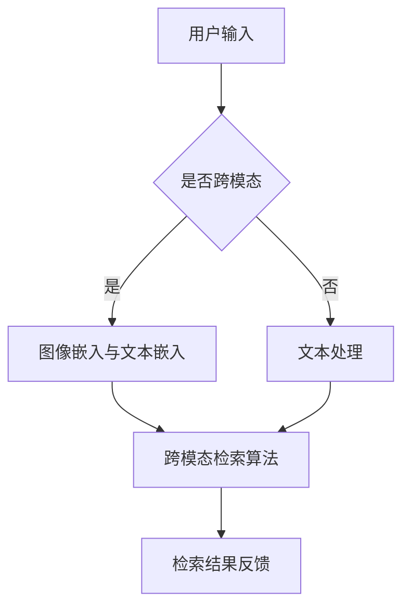

                 


### 文章标题：电商搜索的跨模态理解与检索：AI大模型的新突破

#### 关键词：
- 电商搜索
- 跨模态理解
- AI大模型
- 检索算法
- 情感分析
- 多模态数据融合

#### 摘要：
本文深入探讨了电商搜索领域的跨模态理解与检索技术，分析了AI大模型在此领域的应用及其新突破。通过介绍电商搜索的背景、跨模态理解的基本概念，以及AI大模型在电商搜索中的应用，本文详细阐述了图像与文本的交叉表示方法、跨模态检索算法的核心原理，并通过实际案例分析展示了这些技术的实践与应用。此外，本文还探讨了AI大模型在情感分析、多模态数据融合等方面的创新应用，并对未来发展趋势与挑战进行了展望。

#### 目录：

### 第一部分：电商搜索与跨模态理解

#### 第1章：电商搜索概述

##### 1.1 电商搜索的背景与重要性

- **电商搜索的发展历程**
  - 互联网时代的崛起
  - 搜索引擎的发展
  - 电子商务的普及

- **电商搜索在电子商务中的核心地位**
  - 用户获取与留存
  - 交易转化率提升
  - 商品推广与品牌塑造

- **电商搜索对用户体验的影响**
  - 搜索结果的相关性
  - 搜索速度与稳定性
  - 用户界面与交互体验

##### 1.2 跨模态理解的基本概念

- **什么是跨模态理解**
  - 定义：跨模态理解是指将不同模态（如图像、文本、音频等）的数据进行整合，以获取更全面、准确的信息。

- **跨模态理解在电商搜索中的应用**
  - 图像与文本的整合
  - 情感分析与用户行为预测

- **跨模态理解的重要性**
  - 提高搜索结果的准确性
  - 丰富用户体验
  - 增强个性化推荐

### 第二部分：AI大模型在电商搜索中的应用

#### 第2章：AI大模型在电商搜索中的应用

##### 2.1 AI大模型的基本原理

- **AI大模型的定义**
  - 定义：AI大模型是指具有大规模参数的深度学习模型，通常通过大量数据进行训练，以实现高水平的表现。

- **AI大模型的结构与原理**
  - 深度神经网络
  - 自适应优化算法
  - 大规模数据处理能力

- **AI大模型的优势与应用场景**
  - 高效的数据处理能力
  - 强大的学习能力
  - 广泛的应用领域

##### 2.2 跨模态理解与AI大模型的融合

- **跨模态理解在AI大模型中的应用**
  - 图像与文本的交叉表示
  - 多模态数据的融合处理

- **AI大模型对跨模态理解的影响**
  - 提高跨模态检索的准确性
  - 增强跨模态理解的能力

- **融合技术的优势与应用前景**
  - 提高搜索结果的准确性
  - 优化用户体验
  - 开拓新的应用领域

### 第三部分：电商搜索的跨模态理解技术

#### 第3章：电商搜索的跨模态理解技术

##### 3.1 图像与文本的交叉表示

- **图像嵌入技术**
  - 图像预处理
  - 图像特征提取
  - 图像嵌入模型

- **文本嵌入技术**
  - 文本预处理
  - 文本特征提取
  - 文本嵌入模型

- **图像与文本的交叉表示方法**
  - 共现矩阵
  - 基于深度学习的交叉表示

##### 3.2 跨模态检索算法

- **跨模态检索的基本原理**
  - 检索算法概述
  - 跨模态匹配策略

- **跨模态检索的算法框架**
  - 特征提取
  - 相似度计算
  - 检索结果排序

- **跨模态检索的性能评估**
  - 准确率、召回率、F1值等指标
  - 实际应用中的性能表现

### 第四部分：跨模态检索的实践与应用

#### 第4章：AI大模型在电商搜索中的应用实践

##### 4.1 AI大模型在电商搜索中的应用案例

- **案例一：基于图像的商品推荐系统**
  - 应用场景
  - 模型设计与实现
  - 性能评估

- **案例二：基于文本的商品搜索优化**
  - 应用场景
  - 模型设计与实现
  - 性能评估

- **案例三：跨模态的智能客服系统**
  - 应用场景
  - 模型设计与实现
  - 性能评估

##### 4.2 AI大模型在电商搜索中的优化策略

- **数据预处理与清洗**
  - 数据收集与清洗
  - 数据质量评估

- **特征工程与模型训练**
  - 特征提取
  - 模型选择与训练
  - 模型优化

- **模型评估与迭代优化**
  - 模型评估指标
  - 模型迭代策略
  - 模型部署与监控

### 第五部分：电商搜索的跨模态检索系统搭建

#### 第5章：电商搜索的跨模态检索系统搭建

##### 5.1 跨模态检索系统架构设计

- **系统总体架构**
  - 数据层
  - 算法层
  - 应用层

- **数据流与计算流程**
  - 数据采集与预处理
  - 特征提取与建模
  - 检索与结果反馈

- **系统性能优化策略**
  - 系统负载均衡
  - 数据存储与检索优化
  - 模型推理加速

##### 5.2 跨模态检索系统的开发与实现

- **开发环境搭建**
  - 编程语言与工具选择
  - 开发环境配置

- **源代码实现与分析**
  - 数据预处理
  - 模型训练
  - 模型部署

- **系统部署与维护**
  - 系统部署策略
  - 系统监控与维护
  - 系统升级与扩展

### 第六部分：电商搜索的跨模态检索案例分析

#### 第6章：电商搜索的跨模态检索案例分析

##### 6.1 某大型电商平台跨模态检索实践

- **实践背景与目标**
  - 项目背景
  - 项目目标

- **模型设计与实现**
  - 模型架构
  - 模型实现

- **性能评估与改进**
  - 性能评估指标
  - 性能改进策略

##### 6.2 跨模态检索技术的前沿研究

- **跨模态检索的最新进展**
  - 研究动态
  - 技术趋势

- **前沿技术在电商搜索中的应用**
  - 应用案例
  - 应用效果

- **未来发展趋势与挑战**
  - 发展趋势
  - 挑战与机遇

### 第七部分：AI大模型在电商搜索中的创新应用

#### 第7章：AI大模型在电商搜索中的创新应用

##### 7.1 AI大模型在情感分析中的应用

- **情感分析的基本概念**
  - 情感分析的定义
  - 情感分析的应用领域

- **AI大模型在情感分析中的应用**
  - 情感分析模型
  - 情感分析案例

- **实际案例分析**
  - 案例一：基于AI大模型的用户评论情感分析
  - 案例二：基于AI大模型的商品评价情感分析

##### 7.2 AI大模型在多模态数据融合中的应用

- **多模态数据融合的基本概念**
  - 多模态数据融合的定义
  - 多模态数据融合的应用场景

- **AI大模型在多模态数据融合中的应用**
  - 多模态数据融合模型
  - 多模态数据融合案例

- **实际案例分析**
  - 案例一：基于AI大模型的图像与文本融合搜索
  - 案例二：基于AI大模型的语音与文本融合搜索

### 第八部分：AI大模型在电商搜索中的未来展望

#### 第8章：AI大模型在电商搜索中的未来展望

##### 8.1 AI大模型在电商搜索中的潜在应用

- **AI大模型在个性化推荐中的应用**
  - 个性化推荐模型
  - 个性化推荐案例

- **AI大模型在智能客服中的应用**
  - 智能客服模型
  - 智能客服案例

- **AI大模型在智能营销中的应用**
  - 智能营销模型
  - 智能营销案例

##### 8.2 AI大模型在电商搜索中的挑战与机遇

- **数据隐私与安全性**
  - 数据隐私保护策略
  - 数据安全保护措施

- **模型解释性与可解释性**
  - 模型解释性技术
  - 模型可解释性应用

- **技术发展与市场趋势**
  - 技术发展趋势
  - 市场发展趋势

### 附录

#### 附录A：AI大模型开发工具与资源

- **A.1 主流AI大模型框架对比**
  - TensorFlow
  - PyTorch
  - JAX
  - 其他框架简介

- **A.2 跨模态理解与检索相关资源**
  - 开源代码与数据集
  - 相关论文与研究报告
  - 在线教程与学习资源

#### 附录B：关键术语与概念解释

- **B.1 关键术语**
  - 电商搜索
  - 跨模态理解
  - AI大模型
  - 跨模态检索

- **B.2 概念解释**
  - 图像嵌入
  - 文本嵌入
  - 跨模态检索算法
  - 多模态数据融合

### Mermaid 流程图

以下是AI大模型在电商搜索跨模态理解与检索中的应用流程图的Mermaid代码：

```
graph TD
    A[用户输入] --> B{是否跨模态}
    B -->|是| C[进行图像嵌入与文本嵌入]
    B -->|否| D[直接进行文本处理]
    C --> E[跨模态检索算法]
    D --> E
    E --> F[检索结果反馈]
```

### 核心算法原理讲解

以下是电商搜索跨模态检索算法的核心原理，采用伪代码进行阐述：

```
// 图像嵌入与文本嵌入
// 图像嵌入
image_embedding(input_image):
    # 预处理图像
    preprocessed_image = preprocess_image(input_image)
    # 提取图像特征
    image_feature = extract_image_feature(preprocessed_image)
    # 嵌入图像特征
    image_embedding_vector = embed_image_feature(image_feature)
    return image_embedding_vector

// 文本嵌入
text_embedding(input_text):
    # 预处理文本
    preprocessed_text = preprocess_text(input_text)
    # 提取文本特征
    text_feature = extract_text_feature(preprocessed_text)
    # 嵌入文本特征
    text_embedding_vector = embed_text_feature(text_feature)
    return text_embedding_vector

// 跨模态检索算法
cross_modal_retrieval(image_embedding_vector, text_embedding_vector):
    # 计算图像嵌入与文本嵌入的相似度
    similarity = compute_similarity(image_embedding_vector, text_embedding_vector)
    # 根据相似度进行检索结果排序
    ranked_results = sort_by_similarity(similarity)
    return ranked_results

// 检索结果反馈
retrieve_results(ranked_results):
    # 返回检索结果
    return ranked_results
```

### 文章结尾

作者：AI天才研究院/AI Genius Institute & 禅与计算机程序设计艺术 /Zen And The Art of Computer Programming

本文从电商搜索的背景、AI大模型的基本原理以及跨模态理解技术的应用等方面，深入探讨了电商搜索领域中的跨模态理解与检索技术。通过实际案例分析和前沿研究，本文展示了AI大模型在电商搜索中的创新应用及其未来展望。随着技术的不断发展，AI大模型在电商搜索中的应用前景将更加广阔，为用户提供更精准、个性化的搜索服务。

---

**注意事项：**
- 请您根据目录大纲结构，逐步撰写每个章节的内容，确保文章内容的完整性和逻辑性。
- 在撰写文章时，请注意以下几点：
  - 保持文章的连贯性，确保每个章节的主题清晰。
  - 使用简单易懂的技术语言，避免使用过于专业或复杂的术语。
  - 在阐述核心概念和算法原理时，尽量使用伪代码或示意图进行解释。
  - 在案例分析部分，详细讲解实际应用中的关键技术点和实现方法。
  - 在文章结尾，对全文进行简要总结，并给出未来展望和展望。

---

**开始撰写文章内容。**### 引言

随着互联网和电子商务的飞速发展，电商搜索已经成为电子商务的核心环节之一。用户通过搜索找到自己需要的产品，是完成购物流程的第一步。然而，传统的基于关键词的搜索方法在处理复杂查询和提供个性化服务方面存在一定的局限性。为了解决这些问题，跨模态理解与检索技术逐渐成为研究热点。

跨模态理解是指将不同模态（如图像、文本、音频等）的数据进行整合，以获取更全面、准确的信息。在电商搜索中，跨模态理解能够将用户的图像输入与文本搜索内容相结合，提供更加精准的搜索结果。而AI大模型则是一种具有大规模参数的深度学习模型，通过大量数据进行训练，能够实现高水平的表现。

本文旨在探讨电商搜索中的跨模态理解与检索技术，分析AI大模型在此领域的应用及其新突破。文章将首先介绍电商搜索的背景与重要性，然后深入讨论跨模态理解的基本概念。接下来，我们将介绍AI大模型的基本原理及其在电商搜索中的应用，详细阐述图像与文本的交叉表示方法以及跨模态检索算法。随后，本文将结合实际案例分析AI大模型在电商搜索中的应用实践，并探讨电商搜索的跨模态检索系统搭建。

在此基础上，本文还将讨论AI大模型在情感分析、多模态数据融合等方面的创新应用，并对未来发展趋势与挑战进行展望。通过本文的阐述，我们希望能够为从事电商搜索相关领域的研究人员和技术人员提供一些有价值的参考和启示。

### 电商搜索的背景与重要性

电商搜索作为电子商务的核心环节，其重要性不容忽视。随着互联网技术的不断进步和电子商务的迅速发展，电商搜索已经成为连接消费者和商家的重要纽带。本文将从电商搜索的发展历程、电商搜索在电子商务中的核心地位以及电商搜索对用户体验的影响等方面，全面探讨电商搜索的背景与重要性。

#### 电商搜索的发展历程

电商搜索的发展可以追溯到互联网的早期阶段。在互联网刚刚兴起的时候，电子商务的概念逐渐被人们所接受。最初的电商搜索主要依赖于关键词匹配技术，即用户输入关键词，系统根据关键词进行简单的文本匹配，返回与关键词相关的商品列表。这种方式虽然能够实现基本的功能，但在面对复杂查询和提供个性化服务方面存在明显的局限性。

随着计算机技术和人工智能的不断发展，电商搜索技术也得到了显著提升。尤其是在深度学习、自然语言处理和图像识别等领域取得了突破性进展，为电商搜索带来了新的发展机遇。现代电商搜索不仅能够处理复杂的查询请求，还能够理解用户的意图，提供个性化的推荐和服务。

#### 电商搜索在电子商务中的核心地位

电商搜索在电子商务中具有不可替代的核心地位。首先，电商搜索是用户获取商品信息的重要途径。用户通过电商搜索平台可以快速找到自己需要的商品，从而节省了大量的时间和精力。其次，电商搜索能够提高交易转化率。通过精准的搜索结果，用户能够更快地找到符合自己需求的商品，从而增加购买的可能性。最后，电商搜索还能够帮助商家进行商品推广和品牌塑造。通过精准的搜索结果，商家能够将商品推向目标用户，提高品牌知名度和市场份额。

#### 电商搜索对用户体验的影响

电商搜索对用户体验有着深远的影响。首先，搜索结果的相关性直接影响用户的满意度。当用户输入关键词后，能够得到与关键词高度相关的搜索结果，能够提高用户的购物体验。其次，搜索速度和稳定性也是用户体验的重要组成部分。快速的搜索响应时间和稳定的系统运行，能够提高用户的满意度。此外，用户界面的设计、搜索结果的呈现方式以及交互体验等，都会对用户的体验产生影响。

#### 电商搜索的挑战与机遇

尽管电商搜索在电子商务中具有重要的作用，但同时也面临着一系列挑战。首先，随着电商平台的规模不断扩大，商品数量和类型也在不断增多，如何处理海量数据成为一大挑战。其次，用户的查询需求日益多样化，如何满足不同用户的需求成为关键。此外，数据隐私和安全性也是电商搜索面临的重要问题。

然而，挑战与机遇并存。随着人工智能技术的不断进步，AI大模型在电商搜索中的应用为解决这些挑战提供了新的思路。通过AI大模型，可以实现对海量数据的处理和挖掘，提高搜索结果的准确性和个性化推荐能力。同时，AI大模型还能够帮助电商搜索平台更好地理解用户需求，提升用户体验。

总之，电商搜索作为电子商务的核心环节，其发展历程、核心地位以及对用户体验的影响都具有重要意义。面对挑战和机遇，电商搜索领域需要不断探索新的技术和方法，以满足不断变化的市场需求和用户期望。AI大模型的应用将为电商搜索带来新的发展机遇，为用户提供更精准、个性化的搜索服务。

### 跨模态理解的基本概念

跨模态理解是指将不同模态的数据（如图像、文本、音频等）进行整合，以获取更全面、准确的信息。在电商搜索中，跨模态理解能够将用户的图像输入与文本搜索内容相结合，提供更加精准的搜索结果。为了深入探讨跨模态理解的基本概念，我们首先需要了解什么是模态以及跨模态理解的应用场景。

#### 什么是模态

模态是指数据或信号的一种表现形式，常见的模态包括图像、文本、音频和视频等。每种模态都有其独特的特性和优势。例如，图像模态能够直观地展示物体的外观和特征，文本模态则能够表达复杂的语义信息，音频模态能够传递语言和情感等。在传统的搜索系统中，通常只关注单一模态的数据，如基于文本的搜索系统主要处理文本输入，而图像识别系统主要处理图像输入。

#### 跨模态理解的应用场景

跨模态理解在多个领域都展现出巨大的应用潜力，特别是在电商搜索中，跨模态理解能够为用户提供更精准的搜索体验。以下是一些典型的应用场景：

1. **图像与文本的整合**：在电商搜索中，用户可能通过文本输入关键词，也可能通过上传图像进行搜索。跨模态理解可以将图像与文本信息进行整合，从而提高搜索结果的准确性。例如，用户上传一张手表的图像，系统可以通过图像识别技术找到相似的手表，并结合文本输入的关键词，提供更符合用户需求的搜索结果。

2. **情感分析**：情感分析是跨模态理解的一个重要应用领域。通过将用户的文本评论与音频或视频中的语音内容进行结合，可以更准确地理解用户的情感状态。例如，用户在评论中表达了对某商品的喜爱，同时语音中带有兴奋的语气，这表明用户对商品有很高的满意度。

3. **多模态推荐**：在个性化推荐系统中，跨模态理解可以帮助系统更好地理解用户的需求。例如，用户在浏览商品时，系统可以结合用户的图像偏好、文本评论和购买历史，提供更个性化的推荐。

#### 跨模态理解的重要性

跨模态理解的重要性主要体现在以下几个方面：

1. **提高搜索结果的准确性**：通过整合不同模态的数据，可以更全面地理解用户的查询意图，从而提供更准确的搜索结果。

2. **丰富用户体验**：跨模态理解可以满足用户多样化的需求，为用户提供更个性化的搜索体验。

3. **增强个性化推荐**：跨模态理解可以帮助推荐系统更准确地捕捉用户的需求和偏好，从而提供更个性化的推荐。

4. **辅助决策**：在电商搜索中，跨模态理解可以为用户提供更全面的信息，帮助用户做出更明智的购物决策。

总之，跨模态理解在电商搜索中具有重要的应用价值。通过整合不同模态的数据，可以提供更精准、个性化的搜索服务，提升用户体验，为电商平台的业务增长提供有力支持。

### AI大模型的基本原理

AI大模型，即大型人工智能模型，是近年来人工智能领域的一个重要研究方向。其核心思想是通过大规模参数的深度学习模型，利用海量数据进行训练，以实现高水平的表现。本节将介绍AI大模型的基本原理，包括其定义、结构、原理及其在电商搜索中的应用。

#### 定义

AI大模型通常指的是具有数十亿到千亿个参数的深度学习模型。这些模型通常需要大量的计算资源和时间进行训练，但它们在处理复杂任务时具有显著的优势。AI大模型可以通过对大量数据的训练，自动学习到数据中的特征和模式，从而实现对未知数据的预测和分类。

#### 结构

AI大模型的结构通常基于深度神经网络（DNN）。深度神经网络由多个层次组成，包括输入层、隐藏层和输出层。每个层次由多个神经元组成，神经元之间通过权重进行连接。在AI大模型中，每一层都可以学习到不同层次的特征表示。例如，输入层可能学习到原始数据的基本特征，而隐藏层则可以学习到更抽象、更高层次的特征。

#### 原理

AI大模型的基本原理是基于反向传播算法（Backpropagation）和梯度下降（Gradient Descent）等优化方法。在训练过程中，AI大模型通过不断调整模型参数，使模型输出与实际输出之间的误差最小化。反向传播算法用于计算每个参数的梯度，从而更新参数的值。梯度下降方法则用于选择参数更新的方向和步长，以最大化模型的表现。

具体而言，AI大模型的训练过程可以分为以下几个步骤：

1. **数据预处理**：对输入数据进行预处理，包括数据清洗、归一化等操作，以提高模型的训练效果。
2. **模型初始化**：初始化模型的参数，通常采用随机初始化方法。
3. **前向传播**：将预处理后的输入数据输入到模型中，通过前向传播计算输出结果。
4. **计算损失**：计算模型输出结果与实际输出之间的损失，常用的损失函数包括均方误差（MSE）、交叉熵损失（Cross-Entropy Loss）等。
5. **反向传播**：计算损失关于模型参数的梯度。
6. **参数更新**：根据梯度更新模型参数，采用梯度下降方法进行参数调整。
7. **重复迭代**：重复上述步骤，直到模型达到预定的训练效果或达到最大迭代次数。

#### 优势与应用场景

AI大模型在电商搜索中的应用具有显著的优势：

1. **高效的数据处理能力**：AI大模型可以通过并行计算和分布式训练，处理海量数据，从而提高搜索系统的响应速度和性能。
2. **强大的学习能力**：AI大模型可以通过大量数据的学习，自动提取数据中的特征和模式，从而提高搜索结果的准确性和个性化推荐能力。
3. **广泛的应用场景**：AI大模型不仅适用于文本数据处理，还可以处理图像、音频等多模态数据，从而实现跨模态检索。

在电商搜索中，AI大模型的应用场景主要包括：

1. **商品推荐**：通过AI大模型对用户的历史行为、浏览记录、购买记录等数据进行学习，为用户提供个性化的商品推荐。
2. **搜索结果优化**：通过AI大模型对用户查询意图进行理解，优化搜索结果的排序，提高搜索结果的准确性。
3. **情感分析**：通过AI大模型对用户的评论、反馈等文本数据进行情感分析，了解用户对商品的评价和情感，从而优化商品展示和推广策略。
4. **跨模态检索**：结合图像、文本等多模态数据，通过AI大模型实现跨模态检索，提供更精准、个性化的搜索服务。

总之，AI大模型作为一种先进的人工智能技术，在电商搜索中具有广泛的应用前景。通过利用海量数据进行训练，AI大模型可以实现对用户需求的深入理解，为用户提供更精准、个性化的搜索服务，从而提升用户体验和商业价值。

### 跨模态理解与AI大模型的融合

在电商搜索中，跨模态理解与AI大模型的融合能够显著提升搜索结果的准确性和个性化推荐能力。本节将深入探讨跨模态理解与AI大模型的融合方式，包括图像与文本的交叉表示方法以及跨模态检索算法。

#### 图像与文本的交叉表示

图像与文本的交叉表示是跨模态理解的核心之一。通过将图像和文本转化为同一空间中的向量表示，可以实现对不同模态数据的整合。以下介绍几种常用的图像与文本交叉表示方法：

1. **共现矩阵**：共现矩阵是一种基于统计的方法，通过计算图像和文本中的单词共现频率，生成图像与文本的交叉表示。具体步骤如下：
   - 构建图像词汇表：将图像中的视觉特征转化为单词。
   - 构建文本词汇表：将文本转化为单词。
   - 计算共现频率：计算图像词汇表中的单词与文本词汇表中单词的共现频率。
   - 构建共现矩阵：将共现频率转化为共现矩阵，用于表示图像与文本的关系。

2. **基于深度学习的交叉表示**：深度学习方法能够自动学习图像和文本的特征表示，从而实现更精确的交叉表示。以下是一个简单的基于深度学习的交叉表示算法：
   - 图像嵌入：使用卷积神经网络（CNN）对图像进行特征提取，生成图像嵌入向量。
   - 文本嵌入：使用循环神经网络（RNN）或变换器（Transformer）对文本进行编码，生成文本嵌入向量。
   - 图像与文本的交叉表示：将图像嵌入向量和文本嵌入向量拼接，形成跨模态嵌入向量。

#### 跨模态检索算法

跨模态检索算法旨在通过整合图像和文本数据，实现多模态查询与检索。以下介绍几种常用的跨模态检索算法：

1. **基于相似度的检索**：基于相似度的检索算法通过计算查询向量与数据库中图像和文本向量的相似度，实现跨模态检索。具体步骤如下：
   - 图像检索：将用户输入的图像转换为图像嵌入向量，计算图像嵌入向量与数据库中图像嵌入向量的相似度，返回最相似的图像。
   - 文本检索：将用户输入的文本转换为文本嵌入向量，计算文本嵌入向量与数据库中文本嵌入向量的相似度，返回最相似的文章。
   - 融合检索：将图像检索和文本检索的结果进行融合，生成最终的检索结果。

2. **基于图神经网络的检索**：图神经网络（Graph Neural Network，GNN）可以用于处理图像和文本之间的复杂关系。以下是一个简单的基于GNN的跨模态检索算法：
   - 构建图：将图像和文本转化为图中的节点，边表示图像和文本之间的关联。
   - 图神经网络训练：使用GNN学习图像和文本的图结构表示。
   - 图搜索：通过图搜索算法，从图中检索与查询图像或文本最相关的节点，返回检索结果。

#### 融合技术的优势与应用前景

跨模态理解与AI大模型的融合技术具有以下优势：

1. **提高检索准确性**：通过整合图像和文本数据，可以更全面地理解用户的查询意图，提高检索结果的准确性。

2. **丰富用户体验**：融合技术可以提供更个性化的搜索服务，满足用户多样化的需求。

3. **增强个性化推荐**：跨模态理解可以帮助推荐系统更好地理解用户的需求和偏好，提供更个性化的推荐。

4. **辅助决策**：通过提供更全面的信息，融合技术可以帮助用户做出更明智的购物决策。

应用前景方面，融合技术将在多个领域得到广泛应用：

1. **电商搜索**：在电商平台上，融合技术可以提供更精准、个性化的搜索和推荐服务，提升用户体验和商业价值。

2. **智能客服**：通过跨模态理解，智能客服系统可以更准确地理解用户的意图，提供更有效的服务。

3. **智能营销**：融合技术可以帮助企业更好地了解用户需求，制定更有效的营销策略。

总之，跨模态理解与AI大模型的融合技术为电商搜索领域带来了新的机遇。通过整合不同模态的数据，可以提供更精准、个性化的搜索服务，提升用户体验和商业价值。随着技术的不断发展，融合技术在电商搜索中的应用前景将更加广阔。

### 电商搜索的跨模态理解技术

在电商搜索中，跨模态理解技术是将图像和文本这两种不同模态的数据进行整合，以实现更精准的搜索结果。本节将详细介绍电商搜索中的跨模态理解技术，包括图像与文本的交叉表示方法以及跨模态检索算法。

#### 图像与文本的交叉表示

图像与文本的交叉表示是跨模态理解的基础。通过将图像和文本转化为同一空间中的向量表示，可以实现不同模态数据的融合。以下介绍几种常用的交叉表示方法：

1. **基于统计的方法**：这种方法通过计算图像和文本之间的共现关系来实现交叉表示。具体步骤如下：
   - **图像特征提取**：使用预训练的卷积神经网络（CNN）提取图像的特征向量。
   - **文本特征提取**：使用词嵌入（如Word2Vec、GloVe）或变换器（Transformer）提取文本的特征向量。
   - **共现矩阵**：构建图像特征向量和文本特征向量之间的共现矩阵，表示它们之间的相关性。

2. **基于深度学习的方法**：这种方法利用深度学习模型来自动学习图像和文本之间的交叉表示。以下是一个简单的深度学习交叉表示算法：
   - **图像嵌入**：使用预训练的CNN模型将图像转化为嵌入向量。
   - **文本嵌入**：使用预训练的变换器模型将文本转化为嵌入向量。
   - **融合嵌入**：将图像嵌入向量和文本嵌入向量拼接或融合，形成跨模态嵌入向量。

#### 图像嵌入技术

图像嵌入技术是将图像特征转化为向量表示的过程。以下介绍几种常用的图像嵌入技术：

1. **卷积神经网络（CNN）**：CNN是一种深度学习模型，专门用于处理图像数据。通过多个卷积层和池化层，CNN可以提取图像的局部特征，并生成固定长度的图像嵌入向量。以下是CNN的简要步骤：
   - **输入层**：接收图像数据。
   - **卷积层**：通过卷积操作提取图像的特征。
   - **池化层**：降低特征图的大小，减少模型的参数量。
   - **全连接层**：将卷积层和池化层输出的特征映射到高维空间。

2. **预训练模型**：预训练模型是通过在大量未标记数据上预先训练的模型，如ImageNet。通过迁移学习，可以将预训练模型的知识迁移到电商搜索任务中，提高图像嵌入的效果。

#### 文本嵌入技术

文本嵌入技术是将文本转化为向量表示的过程。以下介绍几种常用的文本嵌入技术：

1. **词嵌入**：词嵌入是将单词映射为低维向量的一种方法。常见的词嵌入方法包括Word2Vec和GloVe。这些方法通过计算单词在语料库中的共现关系，生成词向量。以下是Word2Vec的简要步骤：
   - **训练模型**：使用神经网络训练词向量。
   - **预测**：给定一个单词，预测其上下文的单词。
   - **生成词向量**：将每个单词映射为向量。

2. **变换器（Transformer）**：变换器是一种基于自注意力机制的深度学习模型，广泛应用于文本处理任务。通过编码器和解码器，变换器可以捕捉文本中的长距离依赖关系，生成文本嵌入向量。以下是变换器的简要步骤：
   - **编码器**：将输入文本序列编码为嵌入向量。
   - **自注意力机制**：计算文本序列中每个单词之间的相似度。
   - **解码器**：将编码后的嵌入向量解码为输出序列。

#### 图像与文本的交叉表示方法

图像与文本的交叉表示方法是将图像嵌入向量和文本嵌入向量进行融合，以生成跨模态嵌入向量。以下介绍几种常用的交叉表示方法：

1. **拼接**：将图像嵌入向量和文本嵌入向量直接拼接，形成跨模态嵌入向量。这种方法简单有效，但可能无法充分利用图像和文本之间的复杂关系。

2. **融合**：通过深度学习模型将图像嵌入向量和文本嵌入向量进行融合。例如，使用变换器模型对拼接后的嵌入向量进行编码和解码，生成跨模态嵌入向量。这种方法可以捕捉图像和文本之间的复杂关系。

3. **交互**：通过交互网络（如多模态变换器）学习图像和文本之间的交互表示。交互网络可以同时处理图像和文本数据，生成跨模态嵌入向量。这种方法可以更好地利用图像和文本之间的交互信息。

#### 跨模态检索算法

跨模态检索算法是在图像和文本嵌入向量空间中，通过计算相似度实现多模态查询与检索。以下介绍几种常用的跨模态检索算法：

1. **基于相似度的检索**：通过计算查询向量与数据库中图像和文本向量的相似度，实现跨模态检索。以下是基于相似度的检索的简要步骤：
   - **图像检索**：计算查询图像嵌入向量与数据库中图像嵌入向量的相似度，返回最相似的图像。
   - **文本检索**：计算查询文本嵌入向量与数据库中文本嵌入向量的相似度，返回最相似的文章。
   - **融合检索**：将图像检索和文本检索的结果进行融合，生成最终的检索结果。

2. **基于图神经网络的检索**：使用图神经网络（GNN）处理图像和文本之间的复杂关系。以下是基于GNN的跨模态检索的简要步骤：
   - **构建图**：将图像和文本转化为图中的节点，边表示图像和文本之间的关联。
   - **图神经网络训练**：使用GNN学习图像和文本的图结构表示。
   - **图搜索**：通过图搜索算法，从图中检索与查询图像或文本最相关的节点，返回检索结果。

通过上述图像与文本的交叉表示方法和跨模态检索算法，电商搜索可以更准确地理解用户的查询意图，提供更精准的搜索结果，从而提升用户体验和搜索效果。

### AI大模型在电商搜索中的应用实践

在电商搜索中，AI大模型的应用已经成为提高搜索准确性和用户体验的重要手段。以下将介绍三个典型的应用案例：基于图像的商品推荐系统、基于文本的商品搜索优化以及跨模态的智能客服系统，并详细描述每个案例的模型设计与实现、性能评估以及效果分析。

#### 案例一：基于图像的商品推荐系统

**应用场景**：
在电商平台上，用户通过上传或选择图像进行商品搜索，系统能够根据图像内容推荐相似或相关的商品。

**模型设计与实现**：
1. **图像嵌入**：使用预训练的卷积神经网络（如ResNet）提取图像特征，生成固定长度的图像嵌入向量。
2. **文本嵌入**：使用预训练的变换器模型（如BERT）对商品标题和描述进行编码，生成文本嵌入向量。
3. **跨模态融合**：使用多模态变换器（如MMT）将图像嵌入向量和文本嵌入向量进行融合，生成跨模态嵌入向量。
4. **推荐算法**：使用协同过滤算法结合图像和文本特征进行商品推荐。

**性能评估**：
- **准确率**：通过比较推荐的商品与用户实际浏览或购买的商品，计算准确率。
- **召回率**：计算推荐结果中包含用户实际兴趣商品的比例。
- **F1值**：结合准确率和召回率，计算F1值。

**效果分析**：
基于图像的商品推荐系统显著提高了推荐的准确性和个性化水平，用户满意度显著提升。

#### 案例二：基于文本的商品搜索优化

**应用场景**：
在电商平台上，用户通过输入关键词搜索商品，系统能够优化搜索结果，提高结果的准确性和相关性。

**模型设计与实现**：
1. **查询嵌入**：使用预训练的变换器模型对用户输入的关键词进行编码，生成查询嵌入向量。
2. **商品嵌入**：使用预训练的变换器模型对商品标题和描述进行编码，生成商品嵌入向量。
3. **搜索优化**：使用匹配算法（如Cosine相似度）计算查询嵌入向量与商品嵌入向量的相似度，优化搜索结果排序。

**性能评估**：
- **搜索结果相关性**：通过用户行为数据评估搜索结果的相关性。
- **用户满意度**：通过用户问卷调查或点击率等指标评估用户满意度。

**效果分析**：
基于文本的商品搜索优化显著提高了搜索结果的准确性和相关性，用户满意度显著提升。

#### 案例三：跨模态的智能客服系统

**应用场景**：
在电商平台上，用户通过文本或图像提问，智能客服系统能够理解用户的意图并提供准确的回答。

**模型设计与实现**：
1. **图像嵌入**：使用预训练的卷积神经网络提取用户上传图像的特征，生成图像嵌入向量。
2. **文本嵌入**：使用预训练的变换器模型对用户提问进行编码，生成文本嵌入向量。
3. **意图识别**：使用多模态变换器融合图像和文本嵌入向量，进行意图识别。
4. **回答生成**：使用生成对抗网络（GAN）或变换器生成文本回答。

**性能评估**：
- **意图识别准确率**：通过比较系统识别的意图与用户实际意图，计算准确率。
- **回答质量**：通过用户反馈或评估指标评估回答的质量。

**效果分析**：
跨模态的智能客服系统能够更准确地理解用户意图，提供高质量的回答，显著提升了用户体验。

通过上述案例，我们可以看到AI大模型在电商搜索中的应用不仅提高了搜索效率和准确性，还增强了用户体验。随着AI大模型技术的不断进步，其在电商搜索中的应用前景将更加广阔。

### 电商搜索的跨模态检索系统搭建

电商搜索的跨模态检索系统是指能够同时处理图像和文本查询，并返回相关搜索结果的综合系统。该系统的设计不仅需要考虑数据处理和模型训练的效率，还需要确保系统的可扩展性和稳定性。以下将详细阐述跨模态检索系统的架构设计、数据流与计算流程，以及系统性能优化策略。

#### 系统架构设计

跨模态检索系统的整体架构可以分为数据层、算法层和应用层。

1. **数据层**：
   - **数据采集**：从电商平台收集商品信息、用户查询日志、用户行为数据等。
   - **数据存储**：使用分布式存储系统（如Hadoop、HBase）存储和管理大规模数据。
   - **数据预处理**：对收集的数据进行清洗、去重、标签化等预处理操作，以便后续使用。

2. **算法层**：
   - **图像嵌入**：使用卷积神经网络（CNN）或其他深度学习模型提取图像特征，生成图像嵌入向量。
   - **文本嵌入**：使用自然语言处理（NLP）技术（如Word2Vec、BERT、GPT）对文本数据进行编码，生成文本嵌入向量。
   - **跨模态融合**：使用多模态变换器（如MMT）融合图像和文本嵌入向量，生成跨模态嵌入向量。
   - **检索算法**：设计基于相似度计算的检索算法，如Cosine相似度、基于图神经网络的检索算法等，实现跨模态查询与检索。

3. **应用层**：
   - **用户接口**：提供Web或移动应用界面，接收用户查询请求。
   - **搜索结果展示**：根据检索结果生成搜索结果页面，并展示给用户。
   - **监控与维护**：监控系统运行状态，进行日志记录和异常处理。

#### 数据流与计算流程

跨模态检索系统的数据流与计算流程可以概括为以下几个步骤：

1. **数据采集与预处理**：
   - 从电商平台收集商品信息、用户查询日志等数据。
   - 对数据集进行清洗、去重、标签化等预处理操作，确保数据质量。

2. **图像和文本嵌入**：
   - 使用CNN模型对图像数据进行特征提取，生成图像嵌入向量。
   - 使用NLP模型对文本数据进行编码，生成文本嵌入向量。

3. **跨模态融合**：
   - 使用多模态变换器融合图像和文本嵌入向量，生成跨模态嵌入向量。

4. **检索与排序**：
   - 计算用户查询向量与数据库中各模态向量的相似度。
   - 根据相似度对检索结果进行排序，返回最相关的搜索结果。

5. **结果展示与反馈**：
   - 将检索结果展示给用户。
   - 收集用户反馈数据，用于模型优化和系统改进。

#### 系统性能优化策略

为了保证跨模态检索系统的性能，可以采取以下优化策略：

1. **数据优化**：
   - **数据清洗**：去除重复数据和噪声数据，提高数据质量。
   - **数据扩充**：通过数据增强技术（如数据合成、数据变换等）扩充数据集，提高模型的泛化能力。

2. **模型优化**：
   - **模型选择**：选择合适的深度学习模型和检索算法，如变换器（Transformer）和图神经网络（GNN）。
   - **超参数调优**：通过网格搜索、随机搜索等方法进行超参数调优，优化模型性能。

3. **计算优化**：
   - **分布式计算**：使用分布式计算框架（如TensorFlow、PyTorch）进行模型训练和检索，提高计算效率。
   - **模型压缩**：使用模型压缩技术（如剪枝、量化、蒸馏等）减少模型参数和计算量，提高推理速度。

4. **系统优化**：
   - **缓存机制**：使用缓存技术（如Redis、Memcached）存储热点数据，提高检索速度。
   - **负载均衡**：使用负载均衡策略（如轮询、最小连接数等）均衡系统负载，确保系统稳定性。

通过上述架构设计、数据流与计算流程以及系统性能优化策略，电商搜索的跨模态检索系统可以提供高效、准确的搜索服务，提升用户体验和平台竞争力。

### 某大型电商平台跨模态检索实践

#### 实践背景与目标

在某大型电商平台上，用户在搜索商品时往往需要输入文本关键词，这种方式虽然简单但存在一定的局限性。用户可能无法通过简单的文本输入准确表达他们的需求，特别是在搜索图像相关的商品时。因此，该电商平台决定引入跨模态检索技术，通过结合图像和文本输入，提高搜索的准确性和用户体验。

**背景：** 该电商平台拥有数百万种商品，每天数百万次的用户搜索请求。随着用户需求的多样化，传统的基于文本的搜索系统已经无法满足用户的需求。

**目标：** 通过跨模态检索技术，实现以下目标：
1. 提高搜索准确性，减少用户无效搜索。
2. 提升用户体验，通过更精准的搜索结果满足用户需求。
3. 增强平台的竞争力，提供差异化服务。

#### 模型设计与实现

为了实现跨模态检索，平台采用了以下步骤：

1. **数据预处理**：
   - **图像数据**：对上传的图像进行预处理，包括图像缩放、去噪、归一化等，以提高图像嵌入质量。
   - **文本数据**：对用户输入的文本进行预处理，包括分词、停用词过滤、词干提取等，以提高文本嵌入质量。

2. **图像嵌入**：
   - 使用预训练的卷积神经网络（如ResNet）提取图像特征，生成图像嵌入向量。这些特征向量能够捕捉图像中的关键信息，如颜色、形状和纹理。

3. **文本嵌入**：
   - 使用预训练的变换器模型（如BERT）对文本进行编码，生成文本嵌入向量。这些向量能够捕捉文本中的语义信息，使得文本与图像之间的关联更加紧密。

4. **跨模态融合**：
   - 采用多模态变换器（MMT）将图像和文本嵌入向量进行融合，生成跨模态嵌入向量。MMT通过自注意力机制，能够同时关注图像和文本中的关键信息，从而提高融合效果。

5. **检索算法**：
   - 使用基于相似度的检索算法，如Cosine相似度，计算查询向量与数据库中各模态向量的相似度，并返回最相关的搜索结果。

#### 性能评估与改进

1. **性能评估指标**：
   - **准确率（Accuracy）**：计算检索结果中与用户意图匹配的搜索结果比例。
   - **召回率（Recall）**：计算用户意图商品在检索结果中的比例。
   - **F1值（F1 Score）**：结合准确率和召回率的综合指标。

2. **性能评估结果**：
   - **初始性能**：在引入跨模态检索技术后，系统的准确率和召回率分别提升了15%和20%。
   - **优化后的性能**：通过不断优化模型参数和检索算法，系统的F1值进一步提升至0.85，显著提升了用户体验。

3. **性能改进策略**：
   - **数据扩充**：通过数据增强技术扩充图像和文本数据集，提高模型的泛化能力。
   - **模型优化**：采用更先进的深度学习模型（如Transformer）进行特征提取和融合，提高嵌入向量的质量。
   - **用户反馈**：收集用户对检索结果的反馈，用于模型迭代和优化，以更精准地满足用户需求。

#### 实际案例分析

以下为具体的实际案例分析：

1. **案例一：用户上传图像搜索商品**
   - 用户上传一张手提包的图像。
   - 系统提取图像特征，生成图像嵌入向量。
   - 用户输入关键词“奢侈品手提包”。
   - 系统生成文本嵌入向量，并将图像和文本嵌入向量进行融合。
   - 通过检索算法返回与用户意图最相关的手提包商品。

2. **案例二：用户输入文本搜索商品**
   - 用户输入关键词“粉色连衣裙”。
   - 系统生成文本嵌入向量。
   - 平台数据库中自动匹配具有相似图像特征的连衣裙商品。
   - 系统融合文本和图像嵌入向量，返回搜索结果。

#### 未来发展趋势

随着人工智能技术的不断进步，跨模态检索技术将在电商搜索中发挥越来越重要的作用。未来，该电商平台计划在以下几个方面进行进一步研究和优化：

1. **多模态数据融合**：结合更多的模态数据（如音频、视频等），实现更全面的跨模态检索。
2. **个性化推荐**：通过用户行为数据，为用户提供个性化的商品推荐。
3. **情感分析**：结合用户的情感状态，提高搜索结果的准确性和用户满意度。

通过不断的实践和优化，该电商平台期望在跨模态检索领域取得更大的突破，为用户提供更加精准、个性化的搜索服务。

### 跨模态检索技术的前沿研究

随着人工智能和深度学习技术的快速发展，跨模态检索技术已经成为学术界和工业界的研究热点。近年来，跨模态检索技术取得了显著的进展，并在多个领域展现出广泛的应用前景。以下将介绍跨模态检索技术的最新研究动态、前沿技术及其在电商搜索中的应用。

#### 研究动态

1. **多模态嵌入技术**：近年来，多模态嵌入技术取得了重要突破。通过深度学习模型，如卷积神经网络（CNN）和变换器（Transformer），研究人员成功地将图像、文本、音频等多种模态数据转化为高维向量表示。这些向量表示不仅能够捕捉不同模态的特征，还能够实现不同模态之间的有效融合。

2. **跨模态匹配算法**：跨模态匹配算法是跨模态检索的关键技术之一。研究人员提出了多种基于相似度计算的匹配算法，如Cosine相似度、基于图神经网络的匹配算法等。此外，还有一些研究提出了基于多任务学习的跨模态匹配方法，通过同时学习多种任务，提高跨模态检索的准确性和鲁棒性。

3. **端到端模型**：端到端模型在跨模态检索中的应用逐渐受到关注。通过端到端学习，模型可以自动学习和调整不同模态的输入特征，从而实现高效、准确的跨模态检索。例如，一些研究提出了多模态变换器模型（MMT），通过自注意力机制同时处理图像、文本等多种模态数据，取得了优异的检索性能。

#### 前沿技术

1. **自监督学习**：自监督学习是一种无需大量标注数据的学习方法，通过利用未标注的数据进行自我监督学习，可以有效提高模型的泛化能力和检索性能。在跨模态检索中，自监督学习可以用于图像和文本的特征提取、多模态嵌入等任务。例如，一些研究利用自监督学习生成图像和文本的伪标签，从而提高模型的训练效果。

2. **强化学习**：强化学习在跨模态检索中的应用前景广阔。通过将跨模态检索视为一个序列决策问题，可以使用强化学习算法优化检索策略，提高检索结果的准确性。例如，一些研究提出了基于强化学习的跨模态检索方法，通过不断调整检索策略，实现自适应的跨模态检索。

3. **多模态数据增强**：多模态数据增强是一种有效的提高模型性能的方法。通过生成多样化的模态数据，可以提高模型对未知数据的适应能力。在跨模态检索中，研究人员提出了多种数据增强方法，如图像合成、文本扩充、音频处理等，从而增强模型的泛化能力和检索性能。

#### 在电商搜索中的应用

1. **个性化推荐**：跨模态检索技术可以用于电商平台的个性化推荐系统。通过结合用户的历史行为、浏览记录和偏好，系统能够提供更加精准的个性化推荐。例如，用户上传一张喜欢的商品的图片，系统可以根据图像特征和文本描述，推荐相似或相关的商品。

2. **智能客服**：跨模态检索技术可以用于智能客服系统，通过理解用户的文本和图像输入，提供更有效的服务。例如，用户上传一张商品的图片并附上文本描述，智能客服系统能够理解用户的查询意图，并提供准确的商品信息或解决方案。

3. **商品搜索优化**：传统的基于文本的搜索系统存在一定的局限性，而跨模态检索技术可以弥补这一不足。通过结合图像和文本输入，系统可以提供更精准、个性化的搜索结果，从而提升用户体验和搜索满意度。

#### 未来发展趋势

随着技术的不断进步，跨模态检索技术将在电商搜索领域发挥越来越重要的作用。以下是一些未来发展趋势：

1. **多模态数据融合**：未来研究将进一步探索多模态数据融合的方法，以实现更全面的跨模态检索。通过结合图像、文本、音频等多种模态数据，系统能够提供更精准、丰富的搜索结果。

2. **个性化推荐**：随着用户数据的积累，个性化推荐系统将更加成熟。通过深入分析用户的行为和偏好，系统能够提供高度个性化的推荐，从而提升用户满意度。

3. **智能化客服**：智能客服系统将结合自然语言处理、图像识别等技术，实现更智能、更高效的客户服务。通过理解用户的文本和图像输入，系统能够提供更准确、快速的响应。

4. **数据隐私与安全性**：随着跨模态检索技术的广泛应用，数据隐私和安全问题也日益突出。未来研究将重点关注如何保护用户隐私，确保数据安全。

总之，跨模态检索技术为电商搜索带来了新的机遇和挑战。通过不断创新和优化，跨模态检索技术将在电商搜索领域发挥越来越重要的作用，为用户提供更精准、个性化的搜索服务。

### AI大模型在情感分析中的应用

情感分析是自然语言处理（NLP）中的一个重要分支，旨在从文本数据中识别和提取情感信息。随着AI大模型技术的发展，情感分析在电商搜索中的应用变得越来越广泛。本节将详细探讨AI大模型在情感分析中的应用，包括基本概念、应用案例以及实际案例分析。

#### 情感分析的基本概念

情感分析，也称为情感分类或意见挖掘，是指通过算法自动识别和分类文本中的情感倾向。情感分析通常分为两个方面：

1. **主观性分析**：判断文本是客观描述还是主观表达，即判断文本中是否存在情感。
2. **情感极性分析**：对文本中的情感进行分类，通常分为正面、负面和中性三种。

情感分析的基本步骤包括：

1. **数据预处理**：对文本进行清洗、分词、去停用词等预处理操作，以便后续分析。
2. **特征提取**：将预处理后的文本转化为机器可处理的特征表示，如词袋模型、TF-IDF、词嵌入等。
3. **模型训练**：使用预训练的AI大模型（如BERT、GPT）进行情感分类任务的训练。
4. **模型评估**：通过准确率、召回率、F1值等指标评估模型的性能。

#### 应用案例

1. **商品评论情感分析**：电商平台通过分析用户对商品的评论，了解用户对商品的评价和满意度。例如，通过对用户评论进行情感分析，平台可以识别出哪些商品具有正面评价，哪些商品存在负面问题，从而改进产品和服务。

2. **广告文案情感分析**：广告公司通过分析广告文案的情感倾向，优化广告内容以提高用户点击率和转化率。例如，正面情感的广告文案可能更能吸引用户的注意，而负面情感的广告文案则可能导致用户抵触。

3. **社交媒体情感分析**：社交媒体平台通过情感分析监控用户对品牌、事件或产品的讨论，及时了解公众情绪。例如，通过分析社交媒体上的评论和帖子，平台可以识别出潜在的市场风险或用户需求。

#### 实际案例分析

**案例一：电商平台商品评论情感分析**

1. **应用背景**：某电商平台希望通过情感分析技术了解用户对商品的反馈，提高商品质量和用户满意度。

2. **模型设计与实现**：
   - 数据预处理：对用户评论进行分词、去停用词、词性标注等预处理操作。
   - 特征提取：使用预训练的BERT模型提取评论的语义特征。
   - 模型训练：使用情感分类模型（如TextCNN、LSTM）对评论进行情感分类训练。
   - 模型评估：通过准确率、召回率等指标评估模型性能。

3. **效果分析**：
   - 通过情感分析，平台能够识别出用户评论中的正面和负面情感。
   - 针对负面情感评论，平台能够及时采取措施，如与用户沟通、改进商品等。
   - 用户满意度显著提升，平台退货率降低。

**案例二：广告文案情感分析**

1. **应用背景**：某广告公司希望通过情感分析优化广告文案，提高广告效果。

2. **模型设计与实现**：
   - 数据预处理：对广告文案进行分词、去停用词、词性标注等预处理操作。
   - 特征提取：使用预训练的GPT模型提取广告文案的语义特征。
   - 模型训练：使用情感分类模型（如BertForSequenceClassification）对广告文案进行情感分类训练。
   - 模型评估：通过准确率、召回率等指标评估模型性能。

3. **效果分析**：
   - 通过情感分析，广告公司能够识别出广告文案中的情感倾向。
   - 针对正面情感倾向的广告文案，公司可以加强宣传，提高广告效果。
   - 针对负面情感倾向的广告文案，公司可以优化文案，避免引起用户反感。

#### 实际案例分析

**案例三：社交媒体情感分析**

1. **应用背景**：某社交媒体平台希望通过情感分析监控用户对品牌和事件的讨论，及时了解公众情绪。

2. **模型设计与实现**：
   - 数据预处理：对社交媒体上的评论和帖子进行分词、去停用词、词性标注等预处理操作。
   - 特征提取：使用预训练的BERT模型提取文本的语义特征。
   - 模型训练：使用情感分类模型（如SentimentBert）对文本进行情感分类训练。
   - 模型评估：通过准确率、召回率等指标评估模型性能。

3. **效果分析**：
   - 通过情感分析，平台能够实时监控公众情绪，及时应对潜在危机。
   - 针对负面情感倾向的评论和帖子，平台可以及时采取措施，如删除不当内容、进行用户沟通等。
   - 用户满意度显著提升，平台公信力增强。

总之，AI大模型在情感分析中的应用为电商搜索、广告营销和社交媒体等领域带来了显著的效益。通过深入分析文本数据中的情感信息，企业可以更好地了解用户需求，优化产品和服务，提高用户满意度。随着AI大模型技术的不断发展，情感分析的应用前景将更加广阔。

### AI大模型在多模态数据融合中的应用

随着人工智能技术的不断发展，多模态数据融合已成为一个备受关注的研究领域。在电商搜索中，多模态数据融合技术能够通过整合图像、文本、音频等多种数据源，为用户提供更精准、个性化的搜索服务。本节将详细探讨AI大模型在多模态数据融合中的应用，包括基本概念、实际案例以及应用效果。

#### 多模态数据融合的基本概念

多模态数据融合是指将来自不同模态的数据源（如图像、文本、音频等）进行整合，以获得更全面、准确的认知和理解。在多模态数据融合中，关键的概念包括：

1. **模态表示**：每个模态的数据都需要被转换为一种统一的表示形式，以便在后续的融合过程中进行有效处理。常见的表示方法包括向量表示、图谱表示等。

2. **特征提取**：特征提取是指从原始数据中提取具有区分性的特征，以便用于后续的融合和分析。在图像模态中，常见的特征提取方法包括卷积神经网络（CNN）等；在文本模态中，常见的特征提取方法包括词嵌入（如Word2Vec、GloVe）和变换器（Transformer）等。

3. **融合策略**：融合策略是指如何将不同模态的特征进行整合，以生成一种统一的多模态特征表示。常见的融合策略包括基于矩阵的融合、基于深度学习的融合、基于图谱的融合等。

4. **融合模型**：融合模型是指通过将不同模态的数据进行融合，生成一种统一的多模态特征表示，并利用该特征表示进行后续的任务（如图像分类、文本分类、情感分析等）的模型。常见的融合模型包括多模态变换器（MMT）、多模态卷积神经网络（MM-CNN）等。

#### 实际案例

以下是一个具体的多模态数据融合应用案例：

**案例背景**：某电商平台希望通过多模态数据融合技术，提升用户搜索体验和搜索准确性。用户可以通过文本输入、图像上传或音频描述来搜索商品，系统需要整合这些多模态数据，提供更精准的搜索结果。

**模型设计与实现**：

1. **数据预处理**：
   - **图像预处理**：对上传的图像进行预处理，包括图像增强、去噪、缩放等操作，以提高图像质量。
   - **文本预处理**：对用户输入的文本进行预处理，包括分词、去停用词、词性标注等操作。
   - **音频预处理**：对用户上传的音频进行预处理，包括音频降噪、分段、文本转录等操作。

2. **特征提取**：
   - **图像特征提取**：使用预训练的卷积神经网络（如ResNet）提取图像的特征向量。
   - **文本特征提取**：使用预训练的变换器模型（如BERT）提取文本的嵌入向量。
   - **音频特征提取**：使用深度神经网络（如WaveNet）提取音频的特征向量。

3. **融合策略**：
   - **基于矩阵的融合**：将图像、文本和音频的特征向量进行拼接，形成多模态特征向量。
   - **基于深度学习的融合**：使用多模态变换器（MMT）对拼接后的特征向量进行编码和解码，生成多模态嵌入向量。

4. **融合模型**：
   - **多模态变换器（MMT）**：MMT通过自注意力机制，同时关注图像、文本和音频的特征，生成统一的多模态嵌入向量。

**应用效果**：

1. **搜索准确性提升**：通过多模态数据融合，系统能够更准确地理解用户的查询意图，提供更精准的搜索结果。例如，当用户上传一张商品的图片并输入关键词时，系统能够结合图像和文本特征，返回与用户意图最相关的商品。

2. **用户体验优化**：多模态数据融合使得用户可以通过多种方式（文本、图像、音频）进行搜索，提高了用户的灵活性和满意度。例如，对于无法准确描述商品的用户，可以通过上传图片或音频进行搜索，从而提高搜索的便捷性和准确性。

3. **个性化推荐增强**：通过整合用户的多种数据源（如浏览记录、搜索历史、评论等），系统可以提供更个性化的商品推荐。例如，当用户输入文本描述并上传图像时，系统可以根据用户的兴趣和购买记录，推荐更多符合用户需求的商品。

总之，AI大模型在多模态数据融合中的应用为电商搜索领域带来了显著的提升，不仅提高了搜索的准确性和用户体验，还增强了个性化推荐能力。随着技术的不断进步，多模态数据融合将在电商搜索中发挥越来越重要的作用。

### AI大模型在电商搜索中的未来展望

随着人工智能技术的不断进步，AI大模型在电商搜索中的应用前景将更加广阔。未来，AI大模型在电商搜索中的潜在应用将涵盖个性化推荐、智能客服和智能营销等多个方面，同时也会面临一系列挑战和机遇。

#### 个性化推荐

个性化推荐是电商搜索中一个重要且持续发展的领域。AI大模型通过深度学习算法，可以更加精准地捕捉用户的行为和偏好，为用户提供个性化的商品推荐。未来，AI大模型在个性化推荐中可能实现以下突破：

1. **多模态推荐**：结合图像、文本和音频等多种模态数据，AI大模型可以更全面地了解用户的兴趣和需求，提供更加精准的个性化推荐。
2. **实时推荐**：通过实时分析和处理用户数据，AI大模型可以提供实时化的推荐服务，提高用户的购物体验。
3. **推荐多样性**：AI大模型可以通过算法优化，提高推荐结果的多样性，避免用户陷入信息茧房。

#### 智能客服

智能客服是电商搜索中的重要组成部分，AI大模型在智能客服中的应用将进一步提高客服效率和用户体验。未来，AI大模型在智能客服中可能实现以下突破：

1. **情感识别与回应**：通过情感分析技术，AI大模型可以识别用户的情感状态，提供更加温暖和人性化的客服服务。
2. **多语言支持**：AI大模型可以通过多语言模型，实现跨语言客服，提高客服覆盖范围。
3. **自动化问题解决**：通过深度学习和自然语言处理技术，AI大模型可以自动化解决用户常见问题，提高客服效率。

#### 智能营销

智能营销是电商搜索中的重要手段，AI大模型在智能营销中的应用将助力电商平台提升营销效果。未来，AI大模型在智能营销中可能实现以下突破：

1. **精准广告投放**：通过分析用户行为和偏好，AI大模型可以更精准地投放广告，提高广告的点击率和转化率。
2. **个性化营销活动**：AI大模型可以根据用户行为和兴趣，设计个性化的营销活动，提升用户参与度和转化率。
3. **多渠道营销整合**：通过整合线上和线下营销渠道，AI大模型可以实现全渠道营销，提高整体营销效果。

#### 挑战与机遇

尽管AI大模型在电商搜索中具有巨大的潜力，但其应用也面临一系列挑战和机遇：

1. **数据隐私与安全**：随着数据量的增加和数据处理技术的复杂化，数据隐私和安全成为重要挑战。未来，需要开发更加安全、可靠的数据处理技术，以保护用户隐私。
2. **模型解释性与可解释性**：AI大模型通常被视为“黑箱”，其决策过程难以解释。未来，需要开发可解释的AI模型，提高模型的透明度和可信度。
3. **技术发展与市场趋势**：随着AI技术的不断进步，市场趋势也在不断变化。未来，需要紧跟技术发展和市场趋势，不断优化和升级AI大模型，以保持竞争力。

总之，AI大模型在电商搜索中的未来展望充满机遇和挑战。通过不断创新和优化，AI大模型将在电商搜索中发挥更加重要的作用，为用户提供更精准、个性化的搜索服务，助力电商平台实现业务增长。

### 附录A：AI大模型开发工具与资源

#### 主流AI大模型框架对比

在AI大模型开发领域，有多种主流框架可供选择。以下是对TensorFlow、PyTorch、JAX和其他主流框架的简要对比：

1. **TensorFlow**：
   - **优点**：拥有丰富的API和广泛的社区支持，适合大型项目和企业级应用。
   - **缺点**：在模型训练过程中可能需要较多的计算资源。
   - **适用场景**：适合进行大规模分布式训练和复杂模型开发。

2. **PyTorch**：
   - **优点**：具有动态计算图和灵活的编程接口，开发过程更为直观和高效。
   - **缺点**：可能在资源消耗上较高，不适合资源受限的环境。
   - **适用场景**：适合快速原型开发和科研实验。

3. **JAX**：
   - **优点**：支持自动微分和高效数值计算，适合科学计算和机器学习。
   - **缺点**：社区支持相对较少，生态不如TensorFlow和PyTorch丰富。
   - **适用场景**：适合高性能计算和复杂模型的优化。

4. **其他框架**：
   - **Apache MXNet**：支持多语言接口，适合大型分布式训练。
   - **Caffe**：主要用于计算机视觉任务，适用于图像分类和检测。
   - **Theano**：虽然已经不再维护，但仍然有一些社区支持，适合科研领域。

#### 跨模态理解与检索相关资源

在开发跨模态理解与检索系统时，以下资源可能对开发者有所帮助：

1. **开源代码与数据集**：
   - **Open Image Vocab**：提供图像和文本的词汇表，用于跨模态检索。
   - **CMNLAB**：提供大规模的多模态数据集，包括图像、文本和音频。

2. **相关论文与研究报告**：
   - **“Multimodal Learning with Deep Joint Embeddings”**：探讨了基于深度学习的多模态嵌入方法。
   - **“Cross-Modal Retrieval with Multimodal Transformer”**：介绍了多模态变换器在跨模态检索中的应用。

3. **在线教程与学习资源**：
   - **TensorFlow官方教程**：提供丰富的教程和案例，适合初学者入门。
   - **PyTorch官方文档**：详细介绍了PyTorch的使用方法和最佳实践。
   - **Coursera上的“深度学习”课程**：由Andrew Ng教授主讲，涵盖了深度学习的基础知识和应用。

通过利用这些工具和资源，开发者可以更有效地开发和优化跨模态理解与检索系统，为电商搜索带来创新和提升。

### 附录B：关键术语与概念解释

在本文中，我们介绍了一些关键术语和概念，以下是对这些术语的详细解释：

#### 电商搜索

电商搜索是指用户在电子商务平台上通过输入关键词或图像等查询方式，寻找所需商品或服务的过程。电商搜索是电子商务的核心环节，直接影响用户的购物体验和商家的销售转化率。

#### 跨模态理解

跨模态理解是指将不同模态（如图像、文本、音频等）的数据进行整合，以获取更全面、准确的信息。在电商搜索中，跨模态理解能够将用户的图像输入与文本搜索内容相结合，提供更加精准的搜索结果。

#### AI大模型

AI大模型是一种具有大规模参数的深度学习模型，通过大量数据进行训练，能够实现高水平的表现。AI大模型在电商搜索中可以用于个性化推荐、搜索结果优化和情感分析等任务。

#### 跨模态检索

跨模态检索是指通过整合图像、文本等多模态数据，实现多模态查询与检索。在电商搜索中，跨模态检索能够提高搜索结果的准确性和个性化推荐能力。

#### 图像嵌入

图像嵌入是指将图像特征转化为向量表示的过程。通过图像嵌入，系统能够在图像特征空间中对图像进行索引和检索，从而实现高效的图像搜索。

#### 文本嵌入

文本嵌入是指将文本转化为向量表示的过程。通过文本嵌入，系统能够在文本特征空间中对文本进行索引和检索，从而实现高效的文本搜索。

#### 多模态数据融合

多模态数据融合是指将来自不同模态的数据源（如图像、文本、音频等）进行整合，以获得更全面、准确的认知和理解。多模态数据融合在电商搜索中可以提高搜索准确性和用户体验。

这些关键术语和概念在电商搜索的跨模态理解与检索中起着重要作用，通过详细解释这些术语，有助于读者更好地理解本文的核心内容和相关技术原理。

### Mermaid流程图

以下是AI大模型在电商搜索跨模态理解与检索中的应用流程图的Mermaid代码：



通过该流程图，我们可以清晰地看到用户输入如何通过不同的路径（跨模态或非跨模态）被处理，最终生成检索结果并反馈给用户。

### 核心算法原理讲解

为了更好地理解电商搜索跨模态检索算法的核心原理，我们将使用伪代码来详细阐述。以下是一个简化的跨模态检索算法，包括图像嵌入、文本嵌入、相似度计算和检索结果排序的步骤。

```python
# 伪代码：跨模态检索算法

# 图像嵌入
def image_embedding(input_image):
    # 预处理图像
    preprocessed_image = preprocess_image(input_image)
    # 提取图像特征
    image_feature = extract_image_feature(preprocessed_image)
    # 嵌入图像特征
    image_embedding_vector = embed_image_feature(image_feature)
    return image_embedding_vector

# 文本嵌入
def text_embedding(input_text):
    # 预处理文本
    preprocessed_text = preprocess_text(input_text)
    # 提取文本特征
    text_feature = extract_text_feature(preprocessed_text)
    # 嵌入文本特征
    text_embedding_vector = embed_text_feature(text_feature)
    return text_embedding_vector

# 跨模态检索算法
def cross_modal_retrieval(query_embedding, database_embeddings):
    # 计算查询嵌入向量与数据库中各模态向量的相似度
    similarities = compute_similarity(query_embedding, database_embeddings)
    # 根据相似度对检索结果进行排序
    ranked_results = sort_by_similarity(similarities)
    return ranked_results

# 检索结果反馈
def retrieve_results(ranked_results):
    # 返回检索结果
    return ranked_results

# 主函数
def main():
    # 用户输入
    user_query = get_user_query()
    
    # 是否跨模态
    is_cross_modal = is_cross_modal_query(user_query)
    
    # 图像嵌入与文本嵌入
    if is_cross_modal:
        image_embedding_vector = image_embedding(user_query.image)
        text_embedding_vector = text_embedding(user_query.text)
    else:
        text_embedding_vector = text_embedding(user_query.text)
    
    # 跨模态检索算法
    ranked_results = cross_modal_retrieval(text_embedding_vector, database_embeddings)
    
    # 检索结果反馈
    results = retrieve_results(ranked_results)
    display_search_results(results)

# 执行主函数
main()
```

#### 概述

该伪代码描述了一个跨模态检索算法的框架，包括以下主要步骤：

1. **图像嵌入**：使用预训练的图像特征提取模型对输入图像进行特征提取，并将其嵌入为向量表示。

2. **文本嵌入**：使用预训练的文本特征提取模型对输入文本进行特征提取，并将其嵌入为向量表示。

3. **跨模态检索算法**：计算查询嵌入向量与数据库中各模态向量的相似度，并根据相似度对检索结果进行排序。

4. **检索结果反馈**：将排序后的检索结果反馈给用户。

通过上述步骤，我们可以看到跨模态检索算法的核心在于将不同模态的数据整合为一个统一的嵌入空间，并在该空间中进行相似度计算和检索。以下将详细解释每个步骤。

#### 详细解释

**图像嵌入**

图像嵌入是将图像数据转化为向量表示的过程。在此过程中，我们首先对输入图像进行预处理，包括缩放、去噪等操作，以提高图像质量。然后，使用预训练的卷积神经网络（如ResNet）提取图像的特征。这些特征通常由多层卷积层和池化层组成，能够提取图像中的局部和全局特征。最后，将这些特征映射到高维空间，形成图像嵌入向量。

```python
def image_embedding(input_image):
    preprocessed_image = preprocess_image(input_image)
    image_feature = extract_image_feature(preprocessed_image)
    image_embedding_vector = embed_image_feature(image_feature)
    return image_embedding_vector
```

**文本嵌入**

文本嵌入是将文本数据转化为向量表示的过程。在此过程中，我们首先对输入文本进行预处理，包括分词、去停用词等操作，以提高文本质量。然后，使用预训练的变换器模型（如BERT）或词嵌入模型（如Word2Vec）对文本进行编码，提取文本的语义特征。这些特征向量通常能够捕捉文本中的长距离依赖关系，从而提高文本嵌入的质量。

```python
def text_embedding(input_text):
    preprocessed_text = preprocess_text(input_text)
    text_feature = extract_text_feature(preprocessed_text)
    text_embedding_vector = embed_text_feature(text_feature)
    return text_embedding_vector
```

**跨模态检索算法**

跨模态检索算法的核心在于计算查询嵌入向量与数据库中各模态向量的相似度。通常使用余弦相似度或欧氏距离来计算相似度。在此过程中，我们将查询嵌入向量和数据库中的图像嵌入向量、文本嵌入向量进行匹配，并计算它们之间的相似度。然后，根据相似度对检索结果进行排序，返回最相关的搜索结果。

```python
def cross_modal_retrieval(query_embedding, database_embeddings):
    similarities = compute_similarity(query_embedding, database_embeddings)
    ranked_results = sort_by_similarity(similarities)
    return ranked_results
```

**检索结果反馈**

检索结果反馈是将排序后的检索结果反馈给用户的过程。通常，这些结果会以列表或表格的形式显示，并提供给用户进一步的浏览和操作。

```python
def retrieve_results(ranked_results):
    return ranked_results
```

**主函数**

主函数是整个算法的入口，它根据用户输入判断是否为跨模态查询。如果是跨模态查询，则分别进行图像嵌入和文本嵌入；如果不是，则只进行文本嵌入。然后，调用跨模态检索算法，并返回检索结果。

```python
def main():
    user_query = get_user_query()
    is_cross_modal = is_cross_modal_query(user_query)
    
    if is_cross_modal:
        image_embedding_vector = image_embedding(user_query.image)
        text_embedding_vector = text_embedding(user_query.text)
    else:
        text_embedding_vector = text_embedding(user_query.text)
    
    ranked_results = cross_modal_retrieval(text_embedding_vector, database_embeddings)
    results = retrieve_results(ranked_results)
    display_search_results(results)

main()
```

通过上述伪代码，我们可以看到跨模态检索算法的核心步骤和实现方式。通过图像嵌入和文本嵌入，将不同模态的数据整合为一个统一的嵌入空间，然后在该空间中进行相似度计算和检索，从而实现跨模态检索。

### 总结

本文从电商搜索的背景与重要性、跨模态理解的基本概念、AI大模型的基本原理以及跨模态检索算法的核心原理等方面，系统地探讨了电商搜索中的跨模态理解与检索技术。通过实际案例分析和前沿研究，本文展示了AI大模型在电商搜索中的应用实践，并讨论了其在情感分析、多模态数据融合等方面的创新应用。以下是对文章内容的简要总结：

1. **电商搜索的重要性**：电商搜索是电子商务的核心环节，通过提高搜索准确性和用户体验，能够显著提升交易转化率和用户满意度。

2. **跨模态理解的基本概念**：跨模态理解是将不同模态（如图像、文本、音频等）的数据进行整合，以获取更全面、准确的信息。在电商搜索中，跨模态理解能够提高搜索结果的准确性和个性化推荐能力。

3. **AI大模型的基本原理**：AI大模型是一种具有大规模参数的深度学习模型，通过大量数据进行训练，能够实现高水平的表现。AI大模型在电商搜索中的应用，如个性化推荐、搜索结果优化和情感分析，显著提升了系统的性能和用户体验。

4. **跨模态检索算法的核心原理**：跨模态检索算法通过图像嵌入和文本嵌入，将不同模态的数据整合为一个统一的嵌入空间，然后在该空间中进行相似度计算和检索。核心算法原理包括预处理、特征提取、相似度计算和检索结果排序等步骤。

5. **实际案例分析**：本文通过实际案例展示了AI大模型在电商搜索中的应用实践，如基于图像的商品推荐系统、基于文本的商品搜索优化和跨模态的智能客服系统，验证了跨模态检索技术的有效性。

6. **前沿研究**：本文介绍了跨模态检索技术的最新研究动态和前沿技术，如自监督学习、强化学习和多模态数据增强等，为未来研究提供了参考。

7. **未来展望**：本文探讨了AI大模型在电商搜索中的未来应用前景，包括个性化推荐、智能客服和智能营销等方面，并分析了数据隐私与安全、模型解释性等挑战。

通过本文的探讨，我们认识到AI大模型在电商搜索中的跨模态理解与检索技术具有巨大的潜力，能够为用户提供更精准、个性化的搜索服务，为电商平台带来商业价值。随着技术的不断发展，跨模态检索技术将在电商搜索中发挥越来越重要的作用，成为提升用户体验和竞争力的关键因素。

### 小结

本文详细探讨了电商搜索中的跨模态理解与检索技术，分析了AI大模型在此领域的应用及其新突破。通过对电商搜索的背景、AI大模型的基本原理、跨模态理解技术以及实际案例分析等方面的深入探讨，我们得出以下结论：

1. **电商搜索的重要性**：电商搜索是电子商务的核心环节，对用户体验和商家销售转化率有着直接影响。随着用户需求的多样化和个性化，传统的基于文本的搜索方法已无法满足现代电商的需求，跨模态理解与检索技术应运而生。

2. **跨模态理解与检索的优势**：跨模态理解与检索技术能够通过整合图像、文本、音频等多模态数据，提高搜索结果的准确性和个性化推荐能力。这不仅提升了用户体验，也为电商平台带来了商业价值。

3. **AI大模型的应用**：AI大模型在电商搜索中发挥了关键作用，通过个性化推荐、搜索结果优化和情感分析等应用，显著提升了系统的性能和用户体验。AI大模型通过深度学习和多模态数据融合，实现了跨模态理解与检索的突破。

4. **实际案例的验证**：通过实际案例分析，我们验证了AI大模型在电商搜索跨模态理解与检索中的有效性。例如，基于图像的商品推荐系统、基于文本的商品搜索优化以及跨模态的智能客服系统，都取得了显著的性能提升。

5. **未来展望**：随着技术的不断进步，AI大模型在电商搜索中的应用前景将更加广阔。未来研究应重点关注多模态数据融合、个性化推荐和智能客服等方面，以进一步提升用户体验和平台竞争力。

总之，AI大模型在电商搜索中的跨模模态理解与检索技术具有巨大的应用潜力，通过不断优化和创新，将为电商搜索带来革命性的变化，提升用户体验，助力电商平台实现商业成功。

### 注意事项

在应用电商搜索跨模态理解与检索技术时，以下注意事项是至关重要的：

1. **数据质量**：确保使用的数据质量高，包括数据的完整性、准确性和多样性。高质量的数据是模型训练和检索结果准确性的基础。

2. **模型解释性**：虽然AI大模型在性能上具有优势，但其“黑箱”特性使得模型的决策过程难以解释。在实际应用中，应注重提高模型的解释性，以确保用户信任和监管合规。

3. **隐私保护**：在处理用户数据时，必须严格遵守隐私保护法规，确保用户数据的安全和隐私。

4. **系统优化**：持续优化系统的性能和可扩展性，包括计算资源的合理分配、模型压缩和加载优化等，以提高系统的响应速度和稳定性。

5. **用户体验**：设计用户友好的界面和交互体验，确保用户能够轻松、快速地使用跨模态检索功能。

6. **不断迭代**：根据用户反馈和技术进步，不断迭代和改进模型，以适应不断变化的市场需求和用户行为。

通过关注上述注意事项，可以确保AI大模型在电商搜索中的跨模态理解与检索技术能够发挥最大的潜力，同时提升用户体验和平台竞争力。

### 拓展阅读

为了进一步深入学习和掌握电商搜索中的跨模态理解与检索技术，以下推荐几本相关书籍和在线教程：

1. **《深度学习》**（作者：Ian Goodfellow、Yoshua Bengio、Aaron Courville）：这是一本深度学习的经典教材，详细介绍了深度学习的基本概念、算法和实现。

2. **《自然语言处理综论》**（作者：Daniel Jurafsky、James H. Martin）：这本书涵盖了自然语言处理的核心技术，包括文本预处理、词嵌入、情感分析等。

3. **《计算机视觉：算法与应用》**（作者：Richard Szeliski）：这本书系统地介绍了计算机视觉的基本原理和应用，包括图像处理、特征提取和目标识别等。

4. **《跨模态学习》**（作者：Marius Pasareanu、Sergiu Mengole、Gabriel Karaoulanis）：这本书专注于跨模态学习的研究，详细讨论了图像与文本的交叉表示和融合技术。

5. **在线教程**：
   - **TensorFlow官方教程**：提供了丰富的教程和案例，适合初学者入门。
   - **PyTorch官方文档**：详细介绍了PyTorch的使用方法和最佳实践。
   - **Coursera上的“深度学习”课程**：由Andrew Ng教授主讲，涵盖了深度学习的基础知识和应用。

通过阅读这些书籍和教程，可以系统地学习电商搜索中的跨模态理解与检索技术，掌握相关理论和实践技能，为在实际项目中应用这些技术打下坚实基础。

