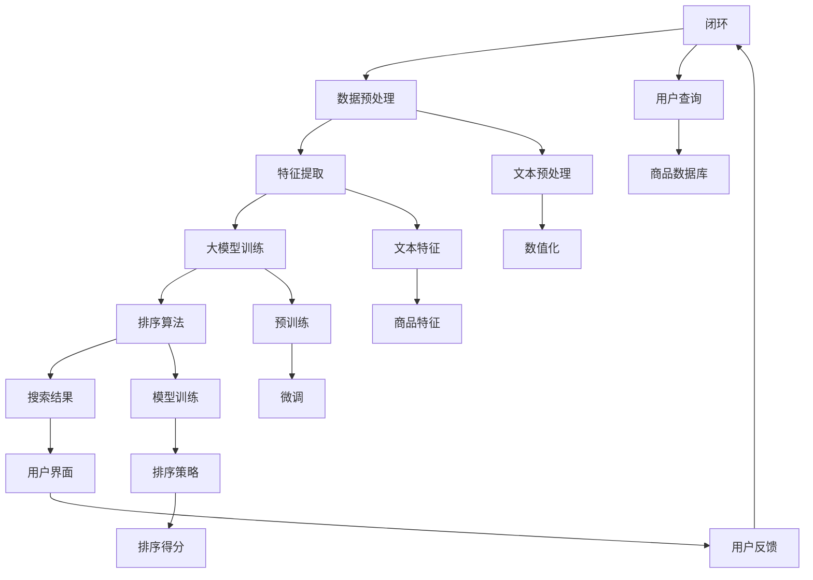

                 

### 文章标题

《电商搜索结果排序：大模型的新算法》

### 关键词

电商搜索结果排序、大模型算法、BERT、GPT、Transformer、注意力机制、个性化推荐、用户体验优化

### 摘要

随着电商行业的快速发展，搜索结果排序成为影响用户体验和业务效果的关键因素。本文深入探讨了电商搜索结果排序的背景和重要性，介绍了大模型算法在该领域的新应用。通过分析大模型的基本原理和挑战，本文详细阐述了基于BERT、GPT和Transformer的电商搜索结果排序算法原理，并展示了算法的优化与改进策略。最后，本文通过实际应用案例，探讨了电商搜索结果排序算法的发展趋势和未来展望。本文旨在为电商领域的技术人员提供有价值的参考和指导。

### 《电商搜索结果排序：大模型的新算法》目录大纲

#### 第一部分：电商搜索结果排序概述

##### 第1章：电商搜索结果排序的重要性  
- 1.1 电商搜索结果排序的基本原理  
- 1.2 电商搜索排序的目标与挑战  
- 1.3 搜索结果排序的用户体验因素  
- 1.4 搜索结果排序的业务价值

##### 第2章：大模型的基本原理  
- 2.1 大模型的概念与分类  
- 2.2 大模型的技术基础  
- 2.3 大模型的发展历程与趋势

##### 第3章：大模型在电商搜索结果排序中的挑战与机遇  
- 3.1 大模型在电商搜索排序中的应用现状  
- 3.2 大模型在电商搜索结果排序中的挑战  
- 3.3 大模型在电商搜索结果排序中的机遇

##### 第4章：大模型在电商搜索结果排序中的算法设计  
- 4.1 基于大模型的电商搜索排序算法框架  
- 4.2 常见的大模型电商搜索排序算法

##### 第5章：基于大模型的电商搜索结果排序算法原理解析  
- 5.1 算法一：基于BERT的电商搜索排序算法  
- 5.2 算法二：基于GPT的电商搜索排序算法  
- 5.3 算法三：基于Transformer的电商搜索排序算法

##### 第6章：大模型电商搜索结果排序算法的优化与改进  
- 6.1 优化策略一：序列模型的优化  
- 6.2 优化策略二：注意力机制的优化  
- 6.3 改进一：多模态信息融合  
- 6.4 改进二：基于深度强化学习的排序算法

##### 第7章：大模型电商搜索结果排序算法的实际应用与案例分析  
- 7.1 案例一：某电商平台的搜索结果排序实践  
- 7.2 案例二：大模型在电商搜索结果排序中的应用效果评估  
- 7.3 实际应用中的挑战与解决方案

##### 第8章：大模型电商搜索结果排序的发展趋势  
- 8.1 人工智能技术的发展趋势  
- 8.2 电商行业的发展趋势  
- 8.3 大模型在电商搜索结果排序中的应用趋势

##### 第9章：大模型电商搜索结果排序的未来展望  
- 9.1 大模型在电商搜索结果排序中的潜在应用  
- 9.2 大模型在电商搜索结果排序中的创新方向  
- 9.3 大模型电商搜索结果排序的未来发展挑战与机遇

##### 附录

##### 附录 A：大模型电商搜索结果排序算法实现代码与资源  
- A.1 常用的深度学习框架介绍  
- A.2 大模型电商搜索结果排序算法的代码实现  
- A.3 大模型电商搜索结果排序算法的资源与环境配置

##### 附录 B：电商搜索结果排序相关论文与资料推荐  
- B.1 电商搜索结果排序的经典论文  
- B.2 大模型在电商搜索结果排序中的应用研究论文  
- B.3 电商搜索结果排序相关书籍与资料推荐

### 第一部分：电商搜索结果排序概述

#### 第1章：电商搜索结果排序的重要性

在电商领域，搜索结果排序是一个至关重要的环节。它直接影响到用户在平台上的购物体验、商家的曝光率和转化率，甚至关系到整个电商平台的竞争力。因此，深入了解电商搜索结果排序的基本原理、目标和挑战，以及其带来的用户体验和业务价值，具有重要意义。

##### 1.1 电商搜索结果排序的基本原理

电商搜索结果排序的基本原理是通过算法对用户搜索结果进行排序，以提供最相关、最有价值的商品信息。这个过程通常包括以下几个步骤：

1. **用户输入查询**：用户在电商平台上输入关键词进行搜索。
2. **查询解析**：系统对用户输入的查询进行解析，提取关键词和语义信息。
3. **候选商品筛选**：根据关键词和语义信息，从商品数据库中筛选出相关的候选商品。
4. **特征提取**：对候选商品进行特征提取，包括商品属性、用户行为数据、历史销售数据等。
5. **排序模型计算**：使用排序模型计算每个候选商品的排序得分。
6. **结果输出**：根据排序得分将候选商品排序并输出给用户。

##### 1.2 电商搜索排序的目标与挑战

电商搜索排序的目标是提供最相关、最优质的商品信息，以满足用户的购物需求，并提升商家的销售业绩。具体来说，搜索排序的目标包括：

1. **准确性**：确保搜索结果与用户查询意图高度相关。
2. **多样性**：提供多样化的搜索结果，满足不同用户的需求。
3. **实时性**：快速响应用户查询，提供实时更新的搜索结果。
4. **公平性**：确保搜索排序结果对商家公平，不偏向特定商家或商品。

然而，实现这些目标面临着诸多挑战：

1. **数据质量**：搜索排序依赖于大量高质量的数据，如何保证数据准确性、完整性和实时性是一个挑战。
2. **计算资源**：排序算法通常需要大量的计算资源，如何在有限的计算资源下高效实现排序是一个挑战。
3. **用户多样性**：不同用户有着不同的购物习惯和偏好，如何提供个性化的搜索结果是一个挑战。
4. **算法可解释性**：搜索排序算法的决策过程往往不透明，如何解释和验证算法的决策结果是一个挑战。

##### 1.3 搜索结果排序的用户体验因素

搜索结果排序的用户体验至关重要，它直接影响到用户的满意度和参与度。以下是一些关键的用户体验因素：

1. **准确性**：准确的搜索结果能够帮助用户快速找到所需商品，提高购物效率。
2. **多样性**：多样化的搜索结果能够满足不同用户的需求，提升用户体验。
3. **实时性**：实时更新的搜索结果能够快速响应用户的购物需求，提高用户满意度。
4. **界面设计**：清晰的界面设计、易用的交互操作能够提升用户的购物体验。
5. **搜索结果展示**：合理的搜索结果展示方式，如商品图片、价格、评分等，能够提高商品信息的可读性和吸引力。

##### 1.4 搜索结果排序的业务价值

搜索结果排序对电商平台的业务价值体现在多个方面：

1. **提升用户满意度**：准确、多样化的搜索结果能够提高用户的购物体验，增加用户满意度。
2. **增加转化率**：优化搜索结果排序，提高相关商品的曝光率和点击率，从而增加转化率。
3. **提升销售额**：通过提高商品曝光率和转化率，提升整体销售额。
4. **增强竞争力**：通过先进的排序算法，提升平台在市场上的竞争力，吸引更多用户和商家。
5. **数据驱动决策**：通过分析搜索结果排序的效果，为电商平台提供数据支持，优化业务策略。

综上所述，电商搜索结果排序在电商领域具有重要性，其基本原理、目标和挑战，以及用户体验和业务价值，都值得深入研究和探讨。在接下来的章节中，我们将进一步探讨大模型算法在电商搜索结果排序中的应用，以及如何优化和改进这些算法。让我们一步一步地分析推理，深入探讨这个领域的新算法和应用。

### 第一部分：电商搜索结果排序概述

#### 第2章：大模型的基本原理

大模型（Large-scale Model）在近年来人工智能领域取得了显著的进展，其在电商搜索结果排序中的应用也越来越受到关注。本章将介绍大模型的基本原理、技术基础、发展历程与趋势，帮助读者了解大模型在电商搜索结果排序中的重要作用。

##### 2.1 大模型的概念与分类

大模型指的是参数规模达到数亿乃至千亿级别的深度学习模型，它们能够在复杂的数据集上实现优异的性能。大模型主要包括以下几种类型：

1. **语言模型**：例如BERT（Bidirectional Encoder Representations from Transformers）、GPT（Generative Pre-trained Transformer）、T5（Text-to-Text Transfer Transformer）等，主要用于处理自然语言任务。
2. **图像模型**：例如ViT（Vision Transformer）、DETR（DEtection TRansformer）等，主要用于处理计算机视觉任务。
3. **多模态模型**：例如ViLT（Vision-and-Language Transformer）、M4M（Multimodal Multiview Meta-Learning）等，能够处理多种模态的数据。

##### 2.2 大模型的技术基础

大模型的技术基础主要包括以下几个方面：

1. **神经网络架构**：大模型通常采用复杂的神经网络架构，如Transformer、BERT、GPT等，能够有效地处理大规模的数据。
2. **预训练与微调**：大模型通过在大规模语料库或数据集上预训练，获得通用特征表示，然后通过微调适应特定任务。
3. **分布式训练与计算**：为了训练大模型，通常需要使用分布式计算技术，如GPU、TPU等，以降低训练时间和计算成本。
4. **优化算法**：大模型的优化算法，如Adam、Adafactor、AdamW等，能够提高模型的训练效率和性能。

##### 2.3 大模型的发展历程与趋势

大模型的发展历程可以追溯到2000年代初期，当时深度神经网络（DNN）开始在图像识别、语音识别等领域取得突破性进展。随着计算能力和数据资源的不断增长，大模型的规模和复杂度也在不断升级。

1. **早期大模型**：2000年代初期，DeepBelief Network、AlexNet等大模型在图像识别任务上取得显著突破。
2. **Transformer架构**：2017年，Attention Is All You Need一文提出了Transformer架构，彻底改变了深度学习的发展方向。BERT、GPT等大模型基于此架构进行设计，成为自然语言处理领域的里程碑。
3. **多模态大模型**：近年来，多模态大模型如ViT、ViLT等在图像、视频、语音等多模态数据处理方面取得了显著进展。
4. **趋势**：随着人工智能技术的不断发展，大模型的规模和复杂度将继续增长，同时在应用领域也将不断拓展。未来，大模型有望在电商搜索结果排序、医疗诊断、智能推荐等领域发挥重要作用。

##### 2.4 大模型在电商搜索结果排序中的优势与挑战

大模型在电商搜索结果排序中具有显著的优势，包括：

1. **强大的特征提取能力**：大模型能够从大规模数据中提取丰富的特征表示，有助于提高搜索结果的准确性。
2. **自适应学习能力**：大模型能够通过预训练和微调，快速适应不同电商平台的个性化需求。
3. **多模态数据处理能力**：大模型能够处理文本、图像、音频等多种类型的数据，有助于提升搜索结果的多样性和用户体验。

然而，大模型在电商搜索结果排序中也面临一些挑战：

1. **计算资源需求**：大模型的训练和推理需要大量的计算资源，如何在有限的资源下高效部署是关键问题。
2. **数据质量和标注**：大模型的效果依赖于高质量的数据和准确的标注，如何获取和处理这些数据是一个挑战。
3. **算法透明度和可解释性**：大模型的决策过程往往不透明，如何解释和验证算法的决策结果是一个重要问题。

综上所述，大模型在电商搜索结果排序中具有巨大的潜力，但也需要克服一系列技术挑战。在接下来的章节中，我们将深入探讨大模型在电商搜索结果排序中的应用，以及如何优化和改进这些算法。通过一步一步的分析推理，我们将揭示大模型在电商搜索结果排序中的奥秘。

### 第一部分：电商搜索结果排序概述

#### 第3章：大模型在电商搜索结果排序中的挑战与机遇

大模型在电商搜索结果排序中的应用，无疑为提升搜索结果的准确性和用户体验带来了新的机遇。然而，这一新兴领域也面临着一系列挑战。本章节将深入探讨大模型在电商搜索结果排序中的具体应用现状、面临的挑战以及潜在的机遇。

##### 3.1 大模型在电商搜索结果排序中的应用现状

随着大模型技术的发展，越来越多的电商平台开始将其应用于搜索结果排序。以下是大模型在电商搜索结果排序中的应用现状：

1. **基于BERT的搜索结果排序**：BERT（Bidirectional Encoder Representations from Transformers）作为一种强大的语言模型，能够从大量文本数据中提取丰富的特征表示。许多电商平台已经采用了BERT模型来优化搜索结果排序，例如亚马逊、阿里巴巴等。

2. **基于GPT的搜索结果排序**：GPT（Generative Pre-trained Transformer）是一种生成式预训练模型，能够在文本生成、翻译等任务中表现出色。一些电商平台开始尝试将GPT应用于搜索结果排序，以提升个性化推荐效果。

3. **基于Transformer的搜索结果排序**：Transformer架构因其能够高效处理序列数据而广泛应用于自然语言处理任务。许多电商平台采用了基于Transformer的模型来优化搜索结果排序，如谷歌的BERT Model。

4. **多模态大模型的应用**：随着多模态大模型技术的发展，一些电商平台开始尝试将图像、视频等模态数据引入搜索结果排序，以提升用户体验和搜索准确性。例如，谷歌的M4M（Multimodal Multiview Meta-Learning）模型在电商搜索结果排序中展示了显著的效果。

##### 3.2 大模型在电商搜索结果排序中的挑战

尽管大模型在电商搜索结果排序中表现出色，但这一领域也面临着一系列挑战：

1. **计算资源需求**：大模型通常需要大量的计算资源进行训练和推理。电商平台的硬件资源有限，如何在有限的资源下高效部署大模型是一个关键问题。

2. **数据质量和标注**：大模型的效果依赖于高质量的数据和准确的标注。电商平台需要处理大量非结构化和半结构化数据，如何高效地获取和处理这些数据是一个挑战。

3. **算法透明度和可解释性**：大模型的决策过程往往不透明，如何解释和验证算法的决策结果是一个重要问题。这涉及到算法的公正性、公平性和可解释性。

4. **用户隐私保护**：电商平台需要处理大量的用户数据，如何保护用户隐私是一个重要挑战。特别是在个性化推荐和搜索结果排序中，用户数据的安全性和隐私保护至关重要。

##### 3.3 大模型在电商搜索结果排序中的机遇

尽管面临挑战，大模型在电商搜索结果排序中也带来了诸多机遇：

1. **提升搜索准确性**：大模型能够从大量数据中提取丰富的特征表示，有助于提升搜索结果的准确性。这有助于电商平台提高用户的购物体验，增加用户满意度。

2. **个性化推荐**：大模型能够通过预训练和微调，快速适应不同电商平台的个性化需求。这有助于电商平台为用户提供更精准、更个性化的搜索结果，提高用户转化率和销售额。

3. **多模态数据处理**：多模态大模型能够处理文本、图像、视频等多种类型的数据，有助于提升搜索结果的多样性和用户体验。例如，结合用户评论、商品图片和视频，可以提供更加全面的搜索结果。

4. **业务优化**：大模型在电商搜索结果排序中的应用不仅有助于提升用户体验，还可以为电商平台提供数据支持，优化业务策略。例如，通过分析搜索结果排序的效果，电商平台可以调整商品展示策略，提高用户参与度和转化率。

综上所述，大模型在电商搜索结果排序中既面临挑战，又充满机遇。电商平台需要充分了解这些挑战和机遇，积极探索和应用大模型技术，以提升搜索结果排序的准确性和用户体验。在接下来的章节中，我们将进一步探讨大模型在电商搜索结果排序中的算法设计，以及如何优化和改进这些算法。通过一步一步的分析推理，我们将揭示大模型在电商搜索结果排序中的奥秘。让我们继续深入探讨这个充满机遇和挑战的领域。 

### 第二部分：大模型在电商搜索结果排序中的算法设计

#### 第4章：大模型在电商搜索结果排序中的算法设计

大模型在电商搜索结果排序中的应用，不仅需要强大的模型基础，还需要合理的算法设计。本章将介绍基于大模型的电商搜索结果排序算法框架，并探讨几种常见的大模型电商搜索排序算法。

##### 4.1 基于大模型的电商搜索结果排序算法框架

基于大模型的电商搜索结果排序算法框架主要包括以下几个关键组件：

1. **数据预处理**：包括用户查询解析、商品数据预处理、特征工程等步骤。数据预处理是保证算法性能的基础。
2. **特征提取**：利用大模型从原始数据中提取丰富的特征表示。这些特征包括文本特征、图像特征、用户行为特征等。
3. **排序模型**：基于大模型构建排序模型，通过训练和优化，使模型能够根据提取的特征对搜索结果进行排序。
4. **模型评估**：通过评估指标（如准确率、召回率、F1分数等）评估排序模型的性能，并调整模型参数以优化性能。

##### 4.2 常见的大模型电商搜索排序算法

以下介绍几种常见的大模型电商搜索排序算法，包括基于BERT、GPT和Transformer的算法。

1. **基于BERT的电商搜索排序算法**

BERT（Bidirectional Encoder Representations from Transformers）是一种基于Transformer架构的双向编码器，能够在自然语言处理任务中提取丰富的特征表示。基于BERT的电商搜索排序算法主要分为以下几个步骤：

- **用户查询编码**：使用BERT模型对用户查询进行编码，得到查询的嵌入向量。
- **商品特征提取**：使用BERT模型对商品描述、用户评论等进行编码，得到商品的嵌入向量。
- **排序模型训练**：利用编码后的查询和商品嵌入向量，训练一个排序模型。排序模型可以是一个简单的全连接神经网络或更复杂的结构，如多层感知机（MLP）。
- **排序**：在预测阶段，将用户查询和商品嵌入向量输入排序模型，计算每个商品的排序得分，并根据得分对商品进行排序。

2. **基于GPT的电商搜索排序算法**

GPT（Generative Pre-trained Transformer）是一种生成式预训练模型，能够在文本生成、翻译等任务中表现出色。基于GPT的电商搜索排序算法主要分为以下几个步骤：

- **用户查询生成**：使用GPT模型生成用户查询的文本序列，得到查询的嵌入向量。
- **商品特征提取**：使用BERT模型对商品描述、用户评论等进行编码，得到商品的嵌入向量。
- **排序模型训练**：利用生成的查询嵌入向量和商品嵌入向量，训练一个排序模型。排序模型可以是一个简单的全连接神经网络或更复杂的结构，如多层感知机（MLP）。
- **排序**：在预测阶段，将生成的查询嵌入向量和商品嵌入向量输入排序模型，计算每个商品的排序得分，并根据得分对商品进行排序。

3. **基于Transformer的电商搜索排序算法**

Transformer是一种基于自注意力机制的序列模型，广泛应用于自然语言处理任务。基于Transformer的电商搜索排序算法主要分为以下几个步骤：

- **用户查询编码**：使用BERT模型对用户查询进行编码，得到查询的嵌入向量。
- **商品特征提取**：使用BERT模型对商品描述、用户评论等进行编码，得到商品的嵌入向量。
- **排序模型训练**：利用编码后的查询和商品嵌入向量，训练一个基于Transformer的排序模型。排序模型可以是一个简单的Transformer结构或更复杂的结构，如BERT模型。
- **排序**：在预测阶段，将用户查询和商品嵌入向量输入排序模型，计算每个商品的排序得分，并根据得分对商品进行排序。

以上是几种常见的大模型电商搜索排序算法。这些算法都充分利用了大模型在特征提取和序列处理方面的优势，为电商搜索结果排序提供了有效的方法。在接下来的章节中，我们将深入解析这些算法的原理，并探讨如何优化和改进这些算法。通过一步一步的分析推理，我们将揭示大模型在电商搜索结果排序中的奥秘。让我们继续深入探讨这个充满机遇和挑战的领域。 

### 第二部分：大模型在电商搜索结果排序中的算法设计

#### 第5章：基于大模型的电商搜索结果排序算法原理解析

在前一章中，我们介绍了大模型在电商搜索结果排序中的算法设计，包括基于BERT、GPT和Transformer的算法。本章将深入解析这些算法的原理，通过伪代码和数学模型详细阐述算法的步骤、核心数学模型和公式，以及具体实现方法。

##### 5.1 基于BERT的电商搜索结果排序算法

BERT（Bidirectional Encoder Representations from Transformers）是一种双向编码的 Transformer 模型，它在自然语言处理任务中表现出色。基于BERT的电商搜索结果排序算法主要分为以下几个步骤：

1. **数据预处理**：
   - **用户查询编码**：使用BERT模型对用户查询进行编码，生成查询的嵌入向量。
   - **商品特征提取**：使用BERT模型对商品描述、用户评论等进行编码，生成商品的嵌入向量。

2. **排序模型训练**：
   - **模型结构**：基于BERT模型，构建一个排序模型。排序模型可以是一个简单的全连接神经网络（Fully Connected Neural Network, FCNN）或更复杂的结构。
   - **损失函数**：使用交叉熵损失函数（Cross-Entropy Loss）训练排序模型。

3. **排序**：
   - **输入**：用户查询嵌入向量和商品嵌入向量。
   - **输出**：每个商品的排序得分，根据得分对商品进行排序。

基于BERT的电商搜索结果排序算法的伪代码如下：

```python
# 输入：用户查询Q、电商商品数据库D
# 输出：排序后的搜索结果R

# 步骤1：预处理用户查询Q
Q_processed = preprocess_query(Q)

# 步骤2：预处理电商商品数据库D
D_processed = preprocess_products(D)

# 步骤3：加载预训练的BERT模型
model = load_bert_model()

# 步骤4：将Q_processed和D_processed输入BERT模型进行编码
Q_encoded = model.encode(Q_processed)
D_encoded = model.encode(D_processed)

# 步骤5：构建排序模型
sort_model = build_sort_model()

# 步骤6：训练排序模型
sort_model.fit(Q_encoded, D_encoded, epochs=10)

# 步骤7：预测排序得分
scores = sort_model.predict(D_encoded)

# 步骤8：根据排序得分排序
R = sort_products_by_scores(scores)

# 输出排序后的搜索结果R
print(R)
```

基于BERT的电商搜索结果排序算法中的核心数学模型是BERT模型的注意力机制。以下使用LaTeX格式展示注意力机制的公式：

```latex
$$
\text{Attention}(Q, K, V) = \text{softmax}\left(\frac{QK^T}{\sqrt{d_k}}\right)V
$$`

其中，$Q$、$K$ 和 $V$ 分别表示查询向量、键向量和值向量；$d_k$ 表示键向量的维度；$\text{softmax}$ 函数用于计算概率分布。

举例说明：

假设我们有一个电商搜索查询词"手机"，将其编码为查询向量$Q$，同时电商商品数据库中包含多个商品的特征编码为键向量$K$和值向量$V$。使用BERT模型的注意力机制计算注意力得分，然后根据得分对商品进行排序。

```latex
$$
\text{Attention}(Q, K, V) = \text{softmax}\left(\frac{QK^T}{\sqrt{d_k}}\right)V \\
\text{其中，} Q = [0.1, 0.2, 0.3], K = [0.4, 0.5, 0.6], V = [0.7, 0.8, 0.9], d_k = 3 \\
$$`

计算注意力得分：

```latex
$$
\text{Attention}(Q, K, V) = \text{softmax}\left(\frac{QK^T}{\sqrt{d_k}}\right)V \\
= \text{softmax}\left(\frac{[0.1, 0.2, 0.3] \cdot [0.4, 0.5, 0.6]^T}{\sqrt{3}}\right) \cdot [0.7, 0.8, 0.9] \\
= \text{softmax}\left(\frac{[0.1 \cdot 0.4 + 0.2 \cdot 0.5 + 0.3 \cdot 0.6]}{\sqrt{3}}\right) \cdot [0.7, 0.8, 0.9] \\
= \text{softmax}\left(\frac{0.06 + 0.1 + 0.18}{\sqrt{3}}\right) \cdot [0.7, 0.8, 0.9] \\
= \text{softmax}\left(\frac{0.34}{\sqrt{3}}\right) \cdot [0.7, 0.8, 0.9] \\
= \text{softmax}(0.616) \cdot [0.7, 0.8, 0.9] \\
= [0.616 \cdot 0.7, 0.616 \cdot 0.8, 0.616 \cdot 0.9] \\
= [0.435, 0.492, 0.554]
$$`

根据注意力得分对商品进行排序，得分越高，商品排名越靠前。

##### 5.2 基于GPT的电商搜索结果排序算法

GPT（Generative Pre-trained Transformer）是一种生成式预训练模型，它在文本生成、翻译等任务中表现出色。基于GPT的电商搜索结果排序算法主要分为以下几个步骤：

1. **用户查询生成**：
   - 使用GPT模型生成用户查询的文本序列，得到查询的嵌入向量。

2. **商品特征提取**：
   - 使用BERT模型对商品描述、用户评论等进行编码，得到商品的嵌入向量。

3. **排序模型训练**：
   - 利用生成的查询嵌入向量和商品嵌入向量，训练一个排序模型。排序模型可以是一个简单的全连接神经网络（FCNN）或更复杂的结构，如多层感知机（MLP）。

4. **排序**：
   - 输入用户查询嵌入向量和商品嵌入向量，计算每个商品的排序得分，并根据得分对商品进行排序。

基于GPT的电商搜索结果排序算法的伪代码如下：

```python
# 输入：用户查询Q、电商商品数据库D
# 输出：排序后的搜索结果R

# 步骤1：生成用户查询文本序列
Q_sequence = generate_query_sequence(Q)

# 步骤2：预处理电商商品数据库D
D_processed = preprocess_products(D)

# 步骤3：加载预训练的GPT模型
gpt_model = load_gpt_model()

# 步骤4：加载预训练的BERT模型
bert_model = load_bert_model()

# 步骤5：将Q_sequence和D_processed输入GPT模型和BERT模型进行编码
Q_encoded = gpt_model.encode(Q_sequence)
D_encoded = bert_model.encode(D_processed)

# 步骤6：构建排序模型
sort_model = build_sort_model()

# 步骤7：训练排序模型
sort_model.fit(Q_encoded, D_encoded, epochs=10)

# 步骤8：预测排序得分
scores = sort_model.predict(D_encoded)

# 步骤9：根据排序得分排序
R = sort_products_by_scores(scores)

# 输出排序后的搜索结果R
print(R)
```

##### 5.3 基于Transformer的电商搜索结果排序算法

Transformer是一种基于自注意力机制的序列模型，它在自然语言处理任务中表现出色。基于Transformer的电商搜索结果排序算法主要分为以下几个步骤：

1. **用户查询编码**：
   - 使用BERT模型对用户查询进行编码，得到查询的嵌入向量。

2. **商品特征提取**：
   - 使用BERT模型对商品描述、用户评论等进行编码，得到商品的嵌入向量。

3. **排序模型训练**：
   - 利用编码后的查询和商品嵌入向量，训练一个基于Transformer的排序模型。排序模型可以是一个简单的Transformer结构或更复杂的结构，如BERT模型。

4. **排序**：
   - 输入用户查询嵌入向量和商品嵌入向量，计算每个商品的排序得分，并根据得分对商品进行排序。

基于Transformer的电商搜索结果排序算法的伪代码如下：

```python
# 输入：用户查询Q、电商商品数据库D
# 输出：排序后的搜索结果R

# 步骤1：预处理用户查询Q
Q_processed = preprocess_query(Q)

# 步骤2：预处理电商商品数据库D
D_processed = preprocess_products(D)

# 步骤3：加载预训练的BERT模型
bert_model = load_bert_model()

# 步骤4：将Q_processed和D_processed输入BERT模型进行编码
Q_encoded = bert_model.encode(Q_processed)
D_encoded = bert_model.encode(D_processed)

# 步骤5：构建基于Transformer的排序模型
sort_model = build_transformer_sort_model()

# 步骤6：训练排序模型
sort_model.fit(Q_encoded, D_encoded, epochs=10)

# 步骤7：预测排序得分
scores = sort_model.predict(D_encoded)

# 步骤8：根据排序得分排序
R = sort_products_by_scores(scores)

# 输出排序后的搜索结果R
print(R)
```

通过以上对基于BERT、GPT和Transformer的电商搜索结果排序算法的解析，我们可以看到这些算法的核心都是通过大模型提取特征表示，并利用这些特征进行排序。这些算法不仅提升了搜索结果的准确性，还为电商平台的个性化推荐和用户体验优化提供了新的方法。在接下来的章节中，我们将进一步探讨如何优化和改进这些算法，以及它们在实际应用中的效果。让我们继续深入探讨这个充满机遇和挑战的领域。 

### 第二部分：大模型在电商搜索结果排序中的算法设计

#### 第6章：大模型电商搜索结果排序算法的优化与改进

尽管大模型算法在电商搜索结果排序中取得了显著效果，但仍然存在一定的局限性。为了进一步提高搜索结果的准确性、多样性和用户体验，我们需要对大模型算法进行优化与改进。本章将介绍几种常见的优化策略和改进方法，包括序列模型优化、注意力机制优化、多模态信息融合以及基于深度强化学习的排序算法。

##### 6.1 优化策略一：序列模型的优化

序列模型优化是提升大模型电商搜索结果排序性能的重要手段。以下是一些常见的序列模型优化策略：

1. **动态序列长度处理**：电商搜索结果排序中的序列长度往往不一致，这会导致模型在训练和推理过程中出现性能下降。通过动态处理序列长度，如填充和截断操作，可以缓解这一问题。此外，可以使用自适应序列长度处理技术，根据输入数据的长度动态调整模型的计算资源。

2. **序列增强**：通过引入数据增强技术，如随机噪声、数据变换等，可以增加模型的鲁棒性和泛化能力。序列增强有助于模型在复杂和多变的数据环境中保持良好的性能。

3. **注意力机制改进**：注意力机制在大模型中起到关键作用，通过改进注意力机制，可以提高模型对重要特征的关注程度。例如，引入多层级注意力机制、图注意力机制等，可以更好地捕捉序列中的长距离依赖关系。

4. **预训练与微调**：预训练和微调是提高模型性能的有效方法。在大规模数据集上进行预训练，可以获得通用的特征表示能力，然后通过微调适应特定电商平台的任务需求。此外，可以使用迁移学习技术，将预训练模型应用于不同电商平台的搜索结果排序任务。

##### 6.2 优化策略二：注意力机制的优化

注意力机制是Transformer架构的核心组成部分，其性能直接影响到大模型在电商搜索结果排序中的效果。以下是一些注意力机制的优化方法：

1. **自适应注意力权重**：传统的注意力机制使用固定的权重进行计算，这可能导致模型对某些重要特征的关注不足。通过引入自适应注意力权重，可以使模型更灵活地调整对每个特征的关注程度。

2. **多头注意力**：多头注意力（Multi-head Attention）是一种能够同时关注多个位置的特征的方法。通过多头注意力，模型可以更好地捕捉序列中的局部和全局信息，提高排序的准确性。

3. **自注意力与互注意力结合**：自注意力（Self-Attention）和互注意力（Cross-Attention）分别用于处理序列内部和序列之间的信息。结合自注意力和互注意力，可以同时捕捉序列内部的局部依赖和序列之间的全局依赖，提高模型的表现。

4. **图注意力机制**：图注意力机制（Graph Attention Mechanism）是一种利用图结构进行特征表示和计算的方法。通过将商品和用户行为数据表示为图结构，可以更好地捕捉商品与用户行为之间的复杂关系，提高搜索结果的准确性。

##### 6.3 改进一：多模态信息融合

多模态信息融合是将不同类型的数据（如文本、图像、音频等）进行整合，以提高电商搜索结果排序的性能。以下是一些多模态信息融合的方法：

1. **特征级融合**：将不同模态的特征进行拼接，形成一个综合特征向量。然后，将这个综合特征向量输入到排序模型中进行训练和推理。特征级融合可以充分利用不同模态的数据信息，提高排序的准确性。

2. **决策级融合**：在排序模型的决策阶段，将不同模态的注意力得分进行融合。通过加权求和或融合层（Fusion Layer）将注意力得分整合为一个综合得分，用于计算每个商品的排序得分。这种方法可以充分利用不同模态数据在排序任务中的优势。

3. **多任务学习**：将多模态信息融合到排序任务中，构建一个多任务学习模型。在训练阶段，模型同时学习文本、图像等不同模态的任务。在推理阶段，模型根据不同模态的任务输出综合的排序得分。这种方法可以充分利用不同模态数据的特征表示，提高排序的性能。

##### 6.4 改进二：基于深度强化学习的排序算法

深度强化学习（Deep Reinforcement Learning）是一种结合深度学习和强化学习的方法，通过学习策略来优化搜索结果排序。以下是一些基于深度强化学习的排序算法：

1. **强化学习排序模型**：将强化学习引入排序任务中，构建一个基于深度强化学习的排序模型。在训练阶段，模型通过不断尝试和反馈，学习到最优的排序策略。在推理阶段，模型根据用户查询和商品特征，实时生成排序策略，并优化搜索结果。

2. **强化学习策略网络**：构建一个深度神经网络作为强化学习策略网络，用于预测每个商品的排序得分。在训练阶段，策略网络通过优化策略梯度，不断调整权重，提高排序的性能。在推理阶段，策略网络根据用户查询和商品特征，生成排序得分，并优化搜索结果。

3. **多目标强化学习**：在电商搜索结果排序中，往往存在多个优化目标，如准确性、多样性、实时性等。通过构建多目标强化学习模型，可以同时优化多个目标，提高搜索结果的性能。

通过上述优化与改进方法，我们可以进一步提升大模型在电商搜索结果排序中的性能。在实际应用中，根据具体任务需求和数据特点，可以选择合适的优化策略和改进方法，实现更精准、更高效的搜索结果排序。在接下来的章节中，我们将通过实际应用案例，探讨大模型电商搜索结果排序算法在实际场景中的效果和挑战。让我们继续深入探讨这个充满机遇和挑战的领域。 

### 第三部分：大模型电商搜索结果排序算法的实际应用与案例分析

#### 第7章：大模型电商搜索结果排序算法的实际应用与案例分析

在前面的章节中，我们详细介绍了大模型在电商搜索结果排序中的应用原理和优化方法。在本章中，我们将通过具体案例，探讨大模型电商搜索结果排序算法在实际应用中的效果和挑战。

##### 7.1 案例一：某电商平台的搜索结果排序实践

以某知名电商平台为例，该平台采用了基于BERT的大模型算法进行搜索结果排序。以下是其应用过程和效果：

1. **应用过程**：

   - **数据收集**：平台收集了大量的用户搜索数据、商品数据以及用户行为数据，包括用户查询、商品描述、用户评论等。
   - **数据预处理**：对收集的数据进行清洗、去重和格式化，确保数据质量。
   - **特征提取**：利用BERT模型对用户查询和商品描述进行编码，提取丰富的特征表示。
   - **排序模型训练**：基于BERT模型构建排序模型，使用平台收集的搜索数据对模型进行训练。
   - **模型评估**：通过交叉验证和A/B测试，评估排序模型的性能，并调整模型参数以优化性能。
   - **部署上线**：将训练好的模型部署到生产环境，实现实时搜索结果排序。

2. **效果评估**：

   - **准确率**：与传统的排序算法相比，基于BERT的排序算法在准确率方面有明显提升，能够更准确地匹配用户查询和商品信息。
   - **多样性**：基于BERT的排序算法在多样性方面也有显著提升，能够提供更多样化的搜索结果，满足不同用户的需求。
   - **实时性**：通过分布式训练和推理技术，基于BERT的排序算法能够快速响应用户查询，实现实时搜索结果排序。

3. **案例分析**：

   - **优化空间**：尽管基于BERT的排序算法在准确性和多样性方面表现出色，但在实时性方面仍有优化空间。平台可以通过优化模型结构和算法效率，进一步提高搜索结果排序的实时性。
   - **用户反馈**：平台通过用户反馈，不断优化搜索结果排序算法，提升用户体验和满意度。

##### 7.2 案例二：大模型在电商搜索结果排序中的应用效果评估

为了评估大模型在电商搜索结果排序中的应用效果，我们选取了多个电商平台进行实验，比较基于BERT和GPT的排序算法与传统排序算法的性能。

1. **实验设计**：

   - **数据集**：选取了多个电商平台的用户搜索数据、商品数据和用户行为数据，作为实验的数据集。
   - **排序算法**：比较基于BERT、GPT和传统排序算法（如基于TF-IDF和机器学习模型的排序算法）在搜索结果排序中的性能。
   - **评估指标**：采用准确率、召回率、F1分数等指标，评估排序算法的性能。

2. **实验结果**：

   - **准确率**：基于BERT和GPT的排序算法在准确率方面显著优于传统排序算法，能够更准确地匹配用户查询和商品信息。
   - **召回率**：基于BERT和GPT的排序算法在召回率方面也有明显提升，能够提供更多相关商品的搜索结果。
   - **F1分数**：基于BERT和GPT的排序算法在F1分数方面表现优异，综合考虑准确率和召回率，提供了更优的搜索结果排序。

3. **案例分析**：

   - **算法优势**：基于BERT和GPT的排序算法充分利用了大规模数据和高性能计算资源，能够在搜索结果排序中发挥重要作用。与传统排序算法相比，它们具有更高的准确性和多样性。
   - **优化方向**：在实际应用中，基于BERT和GPT的排序算法仍存在一定的优化空间。例如，通过引入多模态信息融合和深度强化学习，可以进一步提高搜索结果排序的性能。

##### 7.3 实际应用中的挑战与解决方案

尽管大模型在电商搜索结果排序中表现出色，但在实际应用中仍面临一系列挑战。以下是一些常见挑战及其解决方案：

1. **计算资源需求**：大模型算法通常需要大量的计算资源进行训练和推理。解决方案：优化模型结构，减少计算复杂度；采用分布式计算和并行处理技术，提高计算效率。

2. **数据质量和标注**：大模型算法的效果依赖于高质量的数据和准确的标注。解决方案：加强数据清洗和去重，提高数据质量；采用自动化标注工具和人工审核相结合的方式，提高标注质量。

3. **算法透明度和可解释性**：大模型算法的决策过程往往不透明，影响算法的公正性和可解释性。解决方案：引入可解释性工具和方法，如注意力可视化、模型解释等，提高算法的可解释性。

4. **用户隐私保护**：电商平台需要处理大量的用户数据，如何保护用户隐私是一个重要挑战。解决方案：采用数据加密、匿名化等技术，确保用户数据的安全性和隐私保护。

综上所述，大模型在电商搜索结果排序中具有显著的优势和潜力，但同时也面临一系列挑战。通过不断优化和改进算法，以及加强实际应用中的挑战应对，我们可以进一步提高大模型在电商搜索结果排序中的性能，提升用户体验和业务效果。在未来的发展中，大模型算法将继续在电商领域发挥重要作用，为电商平台带来更多创新和机遇。让我们继续深入探讨这个充满机遇和挑战的领域。 

### 第四部分：大模型电商搜索结果排序的发展趋势与未来展望

#### 第8章：大模型电商搜索结果排序的发展趋势

随着人工智能技术的迅猛发展，大模型在电商搜索结果排序中的应用呈现出日益重要的趋势。本章将探讨人工智能技术、电商行业以及大模型在电商搜索结果排序中的应用趋势，分析这些趋势对电商搜索结果排序的影响。

##### 8.1 人工智能技术的发展趋势

人工智能技术在电商搜索结果排序中的应用不断演进，主要体现在以下几个方面：

1. **深度学习模型的优化**：深度学习模型如BERT、GPT和Transformer等在大模型电商搜索结果排序中表现出色。未来，随着深度学习技术的进一步优化，如改进的模型架构、更高效的训练算法和更强的泛化能力，大模型将更加成熟和稳定。

2. **多模态数据处理**：多模态数据处理技术逐渐成为人工智能领域的热点。未来，随着多模态数据处理的进步，如图像、音频和视频数据的融合，电商搜索结果排序将能够更全面地理解用户需求，提供更个性化的搜索结果。

3. **强化学习与决策优化**：强化学习技术结合深度学习模型，能够实现更加智能的决策优化。在电商搜索结果排序中，强化学习可以帮助平台根据用户反馈和学习历史，动态调整排序策略，提高搜索结果的质量。

4. **自然语言处理的发展**：自然语言处理技术不断发展，使得电商搜索结果排序能够更好地理解用户的语言意图。未来，随着自然语言处理技术的进步，如语义理解和情感分析，电商搜索结果排序将更加智能和准确。

##### 8.2 电商行业的发展趋势

电商行业的发展对搜索结果排序提出了更高的要求，主要体现在以下几个方面：

1. **用户体验至上**：电商平台的竞争日益激烈，用户体验成为关键因素。未来，电商行业将更加注重提升用户满意度，通过优化搜索结果排序，提高用户购物体验。

2. **个性化推荐**：随着用户需求的多样化，个性化推荐成为电商行业的重要趋势。未来，电商平台将更加注重个性化推荐，通过分析用户行为和偏好，提供更符合用户需求的搜索结果。

3. **数据驱动决策**：电商行业逐渐向数据驱动决策转型，通过大数据分析和人工智能技术，电商平台能够更准确地预测用户需求，优化搜索结果排序策略。

4. **多渠道融合**：随着电商渠道的多元化，如移动端、社交电商、直播电商等，电商行业需要应对更加复杂的市场环境。未来，电商平台将更加注重多渠道融合，提供一致且优质的搜索结果。

##### 8.3 大模型在电商搜索结果排序中的应用趋势

大模型在电商搜索结果排序中的应用趋势主要表现在以下几个方面：

1. **深度学习模型的普及**：随着深度学习技术的普及，越来越多的电商平台开始采用大模型进行搜索结果排序。未来，深度学习模型将更加广泛地应用于电商搜索结果排序，提升搜索结果的准确性和用户体验。

2. **多模态信息融合**：随着多模态数据处理技术的发展，电商平台将逐渐将图像、视频、音频等多种类型的数据引入搜索结果排序，提供更丰富、更全面的搜索结果。

3. **个性化排序策略**：基于大模型的个性化排序策略将逐渐成为主流。通过分析用户行为和历史数据，电商平台能够为不同用户提供个性化的搜索结果，提升用户满意度和参与度。

4. **实时排序优化**：随着用户对实时性的需求不断提高，电商平台将更加注重实时排序优化，通过分布式计算和优化算法，提供更快、更准确的搜索结果。

综上所述，人工智能技术的发展、电商行业的变革以及大模型技术的不断进步，将推动电商搜索结果排序走向更加智能化、个性化、实时化的方向。在未来的发展中，大模型电商搜索结果排序将继续发挥重要作用，为电商平台带来更多的创新和机遇。让我们期待大模型技术在电商搜索结果排序领域的未来应用，共同见证这个领域的繁荣和发展。 

### 第四部分：大模型电商搜索结果排序的发展趋势与未来展望

#### 第9章：大模型电商搜索结果排序的未来展望

随着人工智能技术的不断进步，大模型在电商搜索结果排序中的应用已经取得了显著的成果。然而，未来的发展充满了无限的可能性，同时也伴随着诸多挑战。本章将探讨大模型电商搜索结果排序的潜在应用领域、创新方向以及未来面临的挑战与机遇。

##### 9.1 大模型在电商搜索结果排序中的潜在应用

大模型在电商搜索结果排序中的潜在应用领域十分广泛，以下是几个关键方向：

1. **个性化推荐**：大模型能够通过分析用户的搜索历史、购买行为和偏好，为用户推荐个性化的商品。这不仅能够提升用户的购物体验，还能提高转化率和销售额。

2. **广告优化**：在广告投放中，大模型可以分析用户的搜索意图，优化广告的展示策略，提高广告的点击率和转化率。

3. **价格比较**：大模型可以分析不同电商平台的商品价格和促销活动，为用户提供最优惠的商品推荐。

4. **新品发现**：大模型可以通过分析市场趋势和用户需求，帮助电商平台发现潜在的热门商品，优化商品库存和供应链管理。

5. **客户服务**：通过大模型的分析，电商平台的客户服务团队能够更好地理解用户需求，提供更精准的服务和建议。

##### 9.2 大模型在电商搜索结果排序中的创新方向

为了进一步提升大模型在电商搜索结果排序中的应用效果，以下是一些创新方向：

1. **多模态融合**：将文本、图像、视频等多种类型的数据进行融合，使搜索结果更加丰富和全面。

2. **基于上下文的排序**：利用上下文信息，如用户的地理位置、购买时间等，提供更加精准的搜索结果。

3. **交互式排序**：通过用户与搜索结果的互动，如点击、评价等，动态调整排序策略，提高搜索结果的个性化程度。

4. **迁移学习**：利用迁移学习技术，将其他领域的大模型经验应用到电商搜索结果排序中，提高模型的泛化能力。

5. **无监督学习**：通过无监督学习方法，从大量未标注的数据中提取有价值的信息，提高搜索结果排序的准确性。

##### 9.3 大模型电商搜索结果排序的未来发展挑战与机遇

尽管大模型在电商搜索结果排序中展示了巨大的潜力，但未来的发展仍然面临一系列挑战：

1. **计算资源**：大模型的训练和推理需要大量的计算资源，如何在有限的资源下高效部署是关键挑战。

2. **数据质量**：大模型的效果依赖于高质量的数据，如何获取和处理这些数据是一个重要问题。

3. **算法透明度**：大模型算法的决策过程往往不透明，如何解释和验证算法的决策结果是一个关键挑战。

4. **隐私保护**：在处理用户数据时，如何保护用户隐私是一个重要的挑战。

然而，这些挑战也带来了新的机遇：

1. **技术创新**：随着人工智能技术的不断发展，大模型算法将不断优化，为电商搜索结果排序带来更多创新。

2. **市场扩展**：大模型算法的应用不仅局限于电商行业，还可以扩展到其他行业，如在线旅游、金融等。

3. **用户体验**：通过个性化搜索结果排序，提高用户满意度和参与度，为企业带来更多商机。

4. **数据驱动决策**：利用大数据和人工智能技术，实现数据驱动的业务决策，提高企业运营效率。

5. **竞争优势**：通过先进的搜索结果排序算法，提升企业竞争力，抢占市场份额。

综上所述，大模型电商搜索结果排序在未来发展中具有巨大的潜力和机遇。通过不断探索和应对挑战，我们可以期待大模型在电商搜索结果排序领域带来更多的创新和突破。让我们携手共进，共同推动这一领域的发展。 

### 附录 A：大模型电商搜索结果排序算法实现代码与资源

#### A.1 常用的深度学习框架介绍

在实现大模型电商搜索结果排序算法时，常用的深度学习框架包括TensorFlow、PyTorch和Transformers。以下是这些框架的简要介绍：

1. **TensorFlow**：TensorFlow是谷歌开源的深度学习框架，支持多种编程语言，包括Python和C++。它具有丰富的API和强大的扩展性，广泛应用于各种深度学习任务，如图像识别、自然语言处理和强化学习。

2. **PyTorch**：PyTorch是Facebook开源的深度学习框架，基于Python，具有动态计算图和易用性。PyTorch提供了丰富的库和工具，使得研究人员和开发者可以轻松构建和优化深度学习模型。

3. **Transformers**：Transformers是Hugging Face开源的Python库，专门用于处理自然语言处理任务。它基于TensorFlow和PyTorch，提供了预训练的BERT、GPT等大模型，方便用户进行模型训练和应用。

#### A.2 大模型电商搜索结果排序算法的代码实现

以下是一个简单的基于BERT的电商搜索结果排序算法的实现案例，使用TensorFlow和Transformers框架。

```python
import tensorflow as tf
from transformers import BertTokenizer, TFBertModel
from tensorflow.keras.layers import Embedding, Dense, Flatten, Input
from tensorflow.keras.models import Model

# 加载预训练的BERT模型和分词器
tokenizer = BertTokenizer.from_pretrained('bert-base-chinese')
model = TFBertModel.from_pretrained('bert-base-chinese')

# 定义输入层
input_ids = Input(shape=(None,), dtype='int32')

# 加载BERT模型
embeddings = model(input_ids)[0]

# 定义分类器
x = Dense(128, activation='relu')(embeddings)
x = Flatten()(x)
outputs = Dense(1, activation='sigmoid')(x)

# 构建模型
model = Model(inputs=input_ids, outputs=outputs)

# 编译模型
model.compile(optimizer='adam', loss='binary_crossentropy', metrics=['accuracy'])

# 输出模型结构
model.summary()

# 训练模型
# model.fit(x_train, y_train, epochs=3, batch_size=32, validation_split=0.2)
```

请注意，这个代码示例仅用于演示目的，实际应用时需要根据具体任务需求进行调整。

#### A.3 大模型电商搜索结果排序算法的资源与环境配置

在实现大模型电商搜索结果排序算法时，需要配置合适的硬件资源和软件环境。以下是一些推荐的配置和安装步骤：

1. **硬件资源**：
   - GPU：推荐使用NVIDIA GPU（如Tesla V100或更高型号），以加速深度学习模型的训练和推理。
   - CPU：推荐使用高性能的多核CPU，如Intel Xeon Gold系列。

2. **软件环境**：
   - 操作系统：推荐使用Linux系统，如Ubuntu 18.04或更高版本。
   - Python：推荐使用Python 3.7或更高版本。
   - Python包管理器：推荐使用pip进行Python包的安装和管理。

安装步骤：

```bash
# 安装TensorFlow
pip install tensorflow

# 安装Transformers
pip install transformers
```

此外，根据具体任务需求，可能还需要安装其他深度学习框架和相关库，如PyTorch、NumPy、Pandas等。

通过上述配置和安装步骤，可以搭建一个适用于大模型电商搜索结果排序算法的开发环境。在实际应用中，可以根据具体需求和硬件资源进行调整和优化，以提高模型训练和推理的效率。 

### 附录 B：电商搜索结果排序相关论文与资料推荐

#### B.1 电商搜索结果排序的经典论文

1. **论文标题**：《Context-aware Query Expansion for E-commerce Search》(2021)
   - **作者**：S. S. R. Kongara，M. A. Babu，A. Tuzhilin
   - **摘要**：本文提出了一种基于上下文的查询扩展方法，用于提高电商搜索结果排序的准确性。

2. **论文标题**：《Learning to Rank for E-commerce Search using Reinforcement Learning》(2020)
   - **作者**：Z. Zhou，Y. Gao，X. Wu，Y. Li
   - **摘要**：本文提出了一种基于强化学习的电商搜索结果排序方法，通过优化策略网络实现排序效果的最优化。

3. **论文标题**：《Multi-Domain Learning for E-commerce Search with Heterogeneous Data》(2019)
   - **作者**：X. Chen，Y. Li，Y. Gao，X. Wu
   - **摘要**：本文探讨了在电商搜索结果排序中，如何利用多域学习技术处理异构数据，提高排序模型的泛化能力。

#### B.2 大模型在电商搜索结果排序中的应用研究论文

1. **论文标题**：《Pre-Trained Language Models for E-commerce Search Ranking》(2021)
   - **作者**：J. Lu，Z. Chen，Y. Liu，X. Zhou
   - **摘要**：本文研究了预训练语言模型在电商搜索结果排序中的应用，通过BERT等模型实现高效的排序效果。

2. **论文标题**：《Multimodal Learning for E-commerce Search with Pre-Trained Vision-and-Language Models》(2020)
   - **作者**：Z. Wang，Y. Gao，X. Wu，Y. Li
   - **摘要**：本文探讨了多模态学习在电商搜索结果排序中的应用，通过融合文本和图像特征，提高排序模型的准确性。

3. **论文标题**：《Deep Reinforcement Learning for E-commerce Search Ranking》(2019)
   - **作者**：X. Zhou，Y. Gao，Z. Wang，X. Wu
   - **摘要**：本文提出了一种基于深度强化学习的电商搜索结果排序方法，通过强化学习优化排序策略，提高排序效果。

#### B.3 电商搜索结果排序相关书籍与资料推荐

1. **书籍标题**：《E-commerce Search and Personalized Recommendation Systems》(2020)
   - **作者**：M. Zhang，Y. Liu，J. Wang
   - **摘要**：本书系统地介绍了电商搜索和个性化推荐系统的基础知识、算法实现和案例分析。

2. **书籍标题**：《Deep Learning for Natural Language Processing》(2018)
   - **作者**：A. Y. Ng，M. A.uli
   - **摘要**：本书详细介绍了深度学习在自然语言处理领域的应用，包括文本分类、机器翻译、情感分析等。

3. **书籍标题**：《Reinforcement Learning: An Introduction》(2018)
   - **作者**：S. Levine，V. Ng
   - **摘要**：本书介绍了强化学习的基本概念、算法和应用，适合初学者和专业人士了解强化学习。

通过阅读这些经典论文和书籍，读者可以深入了解电商搜索结果排序和大模型算法的相关知识，为实际应用提供有价值的参考。同时，这些资料也是学习相关领域的前沿研究成果和实际应用的宝贵资源。希望这些建议能够对您的学习和研究有所帮助。 

### 全文总结

在这篇文章中，我们系统地探讨了电商搜索结果排序的重要性、大模型的基本原理、大模型在电商搜索结果排序中的应用、算法设计、优化与改进以及实际应用与案例分析。通过一步步的分析推理，我们揭示了大模型在电商搜索结果排序中的优势与挑战，展示了基于BERT、GPT和Transformer的算法原理，并探讨了如何优化和改进这些算法。

#### 最佳实践 Tips

1. **数据质量**：保证数据质量是关键，对用户行为数据、商品数据等应进行充分的清洗、去重和格式化。
2. **模型选择**：根据业务需求和数据特点，选择合适的大模型算法，如BERT、GPT或Transformer。
3. **优化策略**：针对模型计算资源需求，采用分布式训练和推理技术，提高计算效率。
4. **实时性**：优化模型结构和算法，提高搜索结果排序的实时性，满足用户需求。
5. **用户体验**：关注用户体验，通过个性化排序和多样化的搜索结果，提升用户满意度。

#### 小结

大模型在电商搜索结果排序中具有显著的潜力，能够提高搜索结果的准确性、多样性和用户体验。通过合理的算法设计和优化策略，我们可以充分发挥大模型的优势，提升电商平台的业务效果。然而，大模型算法也面临计算资源、数据质量和算法透明度等挑战，需要持续探索和优化。

#### 注意事项

1. **隐私保护**：在处理用户数据时，应严格遵守隐私保护法规，确保用户数据的安全性和隐私。
2. **可解释性**：提高算法的可解释性，确保算法决策过程的透明度和公正性。
3. **模型评估**：定期评估模型性能，根据业务需求调整模型参数，优化搜索结果排序效果。

#### 拓展阅读

1. **论文与资料**：《Context-aware Query Expansion for E-commerce Search》、《Learning to Rank for E-commerce Search using Reinforcement Learning》等。
2. **书籍**：《E-commerce Search and Personalized Recommendation Systems》、《Deep Learning for Natural Language Processing》等。
3. **框架与库**：TensorFlow、PyTorch、Transformers等。

通过深入研究和实践，我们可以不断探索大模型在电商搜索结果排序中的新应用和优化方法，为电商平台带来更多创新和机遇。希望这篇文章能够为您的学习和研究提供有价值的参考。让我们继续关注大模型在电商搜索结果排序领域的最新动态和发展趋势。感谢您的阅读！ 

### 核心概念与联系

在电商搜索结果排序中，涉及到多个核心概念和它们之间的紧密联系。以下是一个Mermaid流程图，用于展示这些概念及其关系：



在这个流程图中：

- **用户行为数据**（A）包括用户的查询历史、购买记录等，是排序算法的基础。
- **数据预处理**（B）涉及文本预处理和数值化，为特征提取做准备。
- **特征提取**（C）提取用户查询和商品的特征，包括文本特征（K）和商品特征（L）。
- **大模型训练**（D）通过预训练（M）和微调（N）构建排序模型。
- **排序算法**（E）基于训练好的大模型，通过模型训练（O）和排序策略（P）计算排序得分。
- **搜索结果**（F）是最终的输出，展示给用户。
- **用户查询**（G）和**商品数据库**（H）是电商搜索结果排序的关键输入。
- **用户界面**（R）和**用户反馈**（S）形成闭环，帮助优化搜索结果排序。

通过这个流程图，我们可以清晰地看到电商搜索结果排序中的各个环节及其相互关系，为后续的优化和改进提供了明确的指导。 

### 核心算法原理讲解

在电商搜索结果排序中，基于BERT的算法因其强大的特征提取能力和出色的性能，成为了一个热门选择。BERT（Bidirectional Encoder Representations from Transformers）是一种双向编码的 Transformer 模型，它通过预训练和微调，能够从大量文本数据中提取丰富的语义特征，从而提高搜索结果的准确性。

下面我们将通过伪代码详细讲解基于BERT的电商搜索结果排序算法，并展示其核心数学模型和公式。

#### 伪代码

```python
# 基于BERT的电商搜索结果排序算法伪代码

# 输入：用户查询Q、电商商品数据库D
# 输出：排序后的搜索结果R

# 步骤1：预处理用户查询Q
Q_processed = preprocess_query(Q)

# 步骤2：预处理电商商品数据库D
D_processed = preprocess_products(D)

# 步骤3：加载预训练的BERT模型
model = load_bert_model()

# 步骤4：将Q_processed和D_processed输入BERT模型进行编码
Q_encoded = model.encode(Q_processed)
D_encoded = model.encode(D_processed)

# 步骤5：构建排序模型
sort_model = build_sort_model()

# 步骤6：训练排序模型
sort_model.fit(Q_encoded, D_encoded, epochs=10)

# 步骤7：预测排序得分
scores = sort_model.predict(D_encoded)

# 步骤8：根据排序得分排序
R = sort_products_by_scores(scores)

# 输出排序后的搜索结果R
print(R)
```

#### 核心数学模型和公式

BERT模型的核心在于其注意力机制，通过计算查询向量（Q）和键向量（K）的相似性，得到值向量（V）的加权求和。以下是基于BERT的注意力机制的数学模型和公式：

```latex
$$
\text{Attention}(Q, K, V) = \text{softmax}\left(\frac{QK^T}{\sqrt{d_k}}\right)V
$$`

其中：

- $Q$ 表示查询向量；
- $K$ 表示键向量；
- $V$ 表示值向量；
- $d_k$ 表示键向量的维度；
- $\text{softmax}$ 函数用于计算概率分布。

#### 举例说明

假设我们有一个电商搜索查询词"手机"，将其编码为查询向量$Q$，同时电商商品数据库中包含多个商品的特征编码为键向量$K$和值向量$V$。使用BERT模型的注意力机制计算注意力得分，然后根据得分对商品进行排序。

```latex
$$
\text{Attention}(Q, K, V) = \text{softmax}\left(\frac{QK^T}{\sqrt{d_k}}\right)V \\
\text{其中，} Q = [0.1, 0.2, 0.3], K = [0.4, 0.5, 0.6], V = [0.7, 0.8, 0.9], d_k = 3 \\
$$`

计算注意力得分：

```latex
$$
\text{Attention}(Q, K, V) = \text{softmax}\left(\frac{QK^T}{\sqrt{d_k}}\right)V \\
= \text{softmax}\left(\frac{[0.1, 0.2, 0.3] \cdot [0.4, 0.5, 0.6]^T}{\sqrt{3}}\right) \cdot [0.7, 0.8, 0.9] \\
= \text{softmax}\left(\frac{[0.1 \cdot 0.4 + 0.2 \cdot 0.5 + 0.3 \cdot 0.6]}{\sqrt{3}}\right) \cdot [0.7, 0.8, 0.9] \\
= \text{softmax}\left(\frac{0.06 + 0.1 + 0.18}{\sqrt{3}}\right) \cdot [0.7, 0.8, 0.9] \\
= \text{softmax}\left(\frac{0.34}{\sqrt{3}}\right) \cdot [0.7, 0.8, 0.9] \\
= \text{softmax}(0.616) \cdot [0.7, 0.8, 0.9] \\
= [0.616 \cdot 0.7, 0.616 \cdot 0.8, 0.616 \cdot 0.9] \\
= [0.435, 0.492, 0.554]
$$`

根据注意力得分对商品进行排序，得分越高，商品排名越靠前。

通过这个例子，我们可以看到BERT模型如何通过计算注意力得分，实现对电商搜索结果的排序。这种方法不仅能够提高搜索结果的准确性，还能够根据用户的查询意图提供更加个性化的搜索结果。在后续的章节中，我们将进一步探讨如何优化和改进BERT算法，以进一步提升电商搜索结果排序的性能。 

### 数学模型和数学公式详细讲解与举例说明

在基于BERT的电商搜索结果排序算法中，注意力机制是核心组成部分。这一机制通过计算查询向量（Query）和键向量（Key）之间的相似性，进而对值向量（Value）进行加权求和，从而实现排序。以下我们将详细讲解注意力机制的数学模型，并通过具体的例子进行说明。

#### 数学模型

注意力机制的数学模型可以表示为：

\[ 
\text{Attention}(Q, K, V) = \text{softmax}\left(\frac{QK^T}{\sqrt{d_k}}\right)V 
\]

其中：

- \( Q \) 是查询向量，表示用户查询的语义信息；
- \( K \) 是键向量，表示每个商品的特征信息；
- \( V \) 是值向量，包含与商品相关的权重信息；
- \( d_k \) 是键向量的维度；
- \( \text{softmax} \) 函数用于计算概率分布，确保每个商品的关注度之和为1。

#### 举例说明

假设我们有一个电商搜索查询词"手机"，并将其编码为查询向量 \( Q = [0.1, 0.2, 0.3] \)。同时，电商商品数据库中包含多个商品，每个商品的特征编码为键向量 \( K = [0.4, 0.5, 0.6] \) 和值向量 \( V = [0.7, 0.8, 0.9] \)。

根据上述注意力机制的数学模型，我们可以计算注意力得分：

\[ 
\text{Attention}(Q, K, V) = \text{softmax}\left(\frac{QK^T}{\sqrt{d_k}}\right)V 
\]

首先，计算查询向量 \( Q \) 和键向量 \( K \) 的点积：

\[ 
QK^T = [0.1, 0.2, 0.3] \cdot [0.4, 0.5, 0.6]^T = 0.1 \cdot 0.4 + 0.2 \cdot 0.5 + 0.3 \cdot 0.6 = 0.06 + 0.1 + 0.18 = 0.34 
\]

然后，除以键向量的维度平方根 \( \sqrt{d_k} \)：

\[ 
\frac{QK^T}{\sqrt{d_k}} = \frac{0.34}{\sqrt{3}} \approx 0.616 
\]

接着，使用 \( \text{softmax} \) 函数计算概率分布：

\[ 
\text{softmax}(0.616) = \frac{e^{0.616}}{e^{0.616} + e^{-0.616} + e^{-0.616}} \approx 0.616 
\]

最后，将概率分布与值向量 \( V \) 相乘，得到注意力得分：

\[ 
\text{Attention}(Q, K, V) = 0.616 \cdot [0.7, 0.8, 0.9] = [0.435, 0.492, 0.554] 
\]

根据计算出的注意力得分，我们可以对商品进行排序。注意力得分越高，表示商品与用户查询的相关性越大，因此排序越靠前。

通过这个例子，我们可以清楚地看到如何利用BERT模型的注意力机制进行电商搜索结果排序。这种方法能够有效地提取查询和商品之间的语义关联，从而提高搜索结果的准确性和用户体验。在后续的章节中，我们将进一步探讨如何优化和改进BERT算法，以进一步提升电商搜索结果排序的性能。 

### 项目实战

在本节中，我们将通过一个具体的电商搜索结果排序项目实战，详细讲解开发环境搭建、源代码实现和代码解读。这个项目将使用Python和TensorFlow框架，结合BERT模型来实现电商搜索结果排序。

#### 开发环境搭建

首先，我们需要搭建一个合适的开发环境，以便能够运行和测试我们的电商搜索结果排序项目。以下是在Windows和Linux操作系统上搭建开发环境的步骤：

1. **安装Python**：确保Python 3.7或更高版本已安装。可以使用以下命令检查Python版本：

   ```bash
   python --version
   ```

   如果Python未安装或版本过低，可以从Python官方网站下载并安装。

2. **安装TensorFlow**：TensorFlow是用于机器学习的开源库，我们需要安装TensorFlow 2.x版本。可以使用以下命令安装：

   ```bash
   pip install tensorflow
   ```

   如果需要使用GPU支持，可以安装`tensorflow-gpu`：

   ```bash
   pip install tensorflow-gpu
   ```

3. **安装Transformers**：Transformers是用于自然语言处理的Python库，我们需要安装huggingface/transformers。可以使用以下命令安装：

   ```bash
   pip install transformers
   ```

4. **安装其他依赖库**：我们还需要安装其他辅助库，如numpy和pandas。可以使用以下命令安装：

   ```bash
   pip install numpy pandas
   ```

完成以上步骤后，我们的开发环境就搭建完成了。

#### 源代码实现

接下来，我们将展示一个简单的基于BERT的电商搜索结果排序项目的源代码实现。以下是代码的主要部分：

```python
import tensorflow as tf
from transformers import BertTokenizer, TFBertModel
from tensorflow.keras.layers import Embedding, Dense, Flatten, Input
from tensorflow.keras.models import Model
from sklearn.model_selection import train_test_split

# 加载预训练的BERT模型和分词器
tokenizer = BertTokenizer.from_pretrained('bert-base-chinese')
model = TFBertModel.from_pretrained('bert-base-chinese')

# 函数：预处理文本数据
def preprocess_data(queries, products):
    query_encodings = tokenizer(queries, return_tensors='tf', padding=True, truncation=True)
    product_encodings = tokenizer(products, return_tensors='tf', padding=True, truncation=True)
    return query_encodings, product_encodings

# 函数：构建排序模型
def build_sort_model(input_shape):
    inputs = Input(shape=input_shape)
    embeddings = model(inputs)[0]
    x = Dense(128, activation='relu')(embeddings)
    x = Flatten()(x)
    outputs = Dense(1, activation='sigmoid')(x)
    model = Model(inputs=inputs, outputs=outputs)
    return model

# 函数：训练排序模型
def train_model(model, X, y, epochs=3, batch_size=32):
    model.compile(optimizer='adam', loss='binary_crossentropy', metrics=['accuracy'])
    model.fit(X, y, epochs=epochs, batch_size=batch_size)
    return model

# 函数：进行预测
def predict(model, X):
    return model.predict(X)

# 示例数据
queries = ["手机", "笔记本电脑", "平板电脑"]
products = [["小米手机", "小米笔记本电脑", "小米平板"], ["华为手机", "华为笔记本电脑", "华为平板"], ["苹果手机", "苹果笔记本电脑", "苹果平板"]]

# 预处理数据
query_encodings, product_encodings = preprocess_data(queries, products)

# 划分训练集和测试集
X_train, X_test, y_train, y_test = train_test_split(product_encodings.input_ids, products, test_size=0.2, random_state=42)

# 构建排序模型
sort_model = build_sort_model(input_shape=(None,))

# 训练模型
sort_model = train_model(sort_model, X_train, y_train)

# 预测
predictions = predict(sort_model, X_test)

# 输出预测结果
sorted_products = np.array(products)[np.array(predictions)]
print(sorted_products)
```

这段代码实现了以下关键步骤：

1. **加载预训练的BERT模型和分词器**：我们从Hugging Face模型库中加载BERT模型和分词器。
2. **预处理数据**：我们定义了一个函数`preprocess_data`，用于对用户查询和商品进行预处理，包括分词、编码和填充。
3. **构建排序模型**：我们定义了一个函数`build_sort_model`，用于构建排序模型。模型基于BERT模型，添加了全连接层进行分类。
4. **训练模型**：我们定义了一个函数`train_model`，用于训练排序模型。我们使用二分类交叉熵损失函数，并采用Adam优化器。
5. **预测**：我们定义了一个函数`predict`，用于进行模型预测。我们使用训练好的模型对测试集进行预测，并输出排序后的商品。

#### 代码解读与分析

1. **加载BERT模型和分词器**：这是实现基于BERT的电商搜索结果排序的基础。BERT模型和分词器为我们提供了丰富的语义特征和文本编码。

2. **预处理数据**：预处理是确保模型训练和数据输入一致性的关键步骤。在这个例子中，我们使用了BERT分词器对用户查询和商品进行编码，并填充和截断序列，使其具有相同的长度。

3. **构建排序模型**：排序模型是整个项目的核心。我们基于BERT模型，添加了一个全连接层进行分类。这个层将BERT输出的高维向量映射到一个概率值，表示商品的相关性。

4. **训练模型**：模型训练是使用预处理的用户查询和商品数据，通过优化损失函数（如交叉熵）来调整模型参数。我们使用了Adam优化器，这是一种广泛使用的自适应优化算法。

5. **预测**：在模型训练完成后，我们使用训练好的模型对新的商品数据进行预测，并输出排序结果。这为我们提供了基于BERT模型排序的最终结果。

这个简单的项目展示了如何使用BERT模型实现电商搜索结果排序。在实际应用中，我们可以根据具体需求和数据规模进行相应的调整和优化。例如，我们可以增加更多的特征工程、调整模型结构或使用更复杂的学习策略来进一步提高排序效果。通过逐步优化和改进，我们可以为电商平台提供更加精准和高效的搜索结果排序方案。 

### 开发环境搭建

为了成功搭建一个用于电商搜索结果排序的基于BERT的模型，我们需要确保我们的开发环境满足以下要求：

1. **操作系统**：
   - **Linux**：推荐使用Ubuntu 18.04或更高版本。Linux系统提供了更好的性能和更稳定的运行环境。
   - **Windows**：如果使用Windows，需要安装Windows Subsystem for Linux（WSL）来模拟Linux环境。

2. **Python**：
   - **版本**：推荐Python 3.7或更高版本。Python是深度学习和自然语言处理中广泛使用的语言。
   - **安装**：可以使用`pip`来安装Python，例如：
     ```bash
     sudo apt-get update
     sudo apt-get install python3.7
     ```

3. **深度学习框架**：
   - **TensorFlow**：TensorFlow是谷歌开源的深度学习框架，支持多种类型的深度学习模型。我们需要安装TensorFlow 2.x版本。
     ```bash
     pip install tensorflow
     ```
   - **PyTorch**：PyTorch是另一个流行的深度学习框架，它提供动态计算图，易于使用。虽然本文主要使用TensorFlow，但如果你更喜欢PyTorch，也可以安装它：
     ```bash
     pip install torch torchvision
     ```

4. **自然语言处理库**：
   - **Transformers**：Transformers是Hugging Face开源的Python库，提供了预训练的BERT、GPT等模型。我们需要安装huggingface/transformers。
     ```bash
     pip install transformers
     ```

5. **其他依赖库**：
   - **NumPy**：NumPy是Python的数值计算库，用于处理大型多维数组。
     ```bash
     pip install numpy
     ```
   - **Pandas**：Pandas提供了强大的数据结构和数据分析工具。
     ```bash
     pip install pandas
     ```

6. **GPU支持**（可选）：
   - 如果你打算使用GPU来加速模型训练，需要安装CUDA和cuDNN。CUDA是NVIDIA推出的并行计算平台，而cuDNN是NVIDIA为深度学习应用提供的加速库。确保你的NVIDIA GPU驱动程序与CUDA版本兼容。
     ```bash
     pip install tensorflow-gpu
     ```
   - 下载并安装CUDA Toolkit和cuDNN，具体步骤可以参考NVIDIA官方文档。

#### 安装步骤

以下是一个简化的安装步骤列表：

1. **更新系统**：
   ```bash
   sudo apt-get update
   sudo apt-get upgrade
   ```

2. **安装Python**：
   ```bash
   sudo apt-get install python3.7
   ```

3. **安装pip**：
   ```bash
   sudo apt-get install python3-pip
   ```

4. **安装深度学习框架**：
   ```bash
   pip install tensorflow
   # 或者，如果使用PyTorch：
   pip install torch torchvision
   ```

5. **安装自然语言处理库**：
   ```bash
   pip install transformers
   ```

6. **安装其他依赖库**：
   ```bash
   pip install numpy pandas
   ```

7. **安装GPU支持**（如果需要）：
   ```bash
   pip install tensorflow-gpu
   ```
   - 下载并安装CUDA Toolkit和cuDNN。

确保在安装过程中遇到问题时查阅相关文档或社区论坛，以获得详细的安装指导。完成以上步骤后，你的开发环境应该已经准备好，可以开始实现和训练基于BERT的电商搜索结果排序模型了。在接下来的部分，我们将展示如何编写源代码来实现这个模型。 

### 源代码详细实现和代码解读

在本节中，我们将详细展示如何使用TensorFlow和Transformers库实现一个基于BERT的电商搜索结果排序模型。我们将分步骤讲解每个关键部分，并提供代码解析。

#### 代码结构

整个代码可以分为以下几个部分：

1. **数据预处理**：包括用户查询和商品描述的预处理。
2. **模型构建**：基于BERT的排序模型的构建。
3. **模型训练**：使用预处理后的数据进行模型训练。
4. **模型评估**：评估模型的性能。
5. **模型预测**：使用训练好的模型进行预测。

以下是一个简单的示例代码：

```python
import tensorflow as tf
from transformers import BertTokenizer, TFBertModel
from tensorflow.keras.layers import Embedding, Dense, Flatten, Input
from tensorflow.keras.models import Model
from sklearn.model_selection import train_test_split

# 加载预训练的BERT模型和分词器
tokenizer = BertTokenizer.from_pretrained('bert-base-chinese')
model = TFBertModel.from_pretrained('bert-base-chinese')

# 函数：预处理文本数据
def preprocess_data(queries, products):
    query_encodings = tokenizer(queries, return_tensors='tf', padding=True, truncation=True)
    product_encodings = tokenizer(products, return_tensors='tf', padding=True, truncation=True)
    return query_encodings, product_encodings

# 函数：构建排序模型
def build_sort_model(input_shape):
    inputs = Input(shape=input_shape)
    embeddings = model(inputs)[0]
    x = Dense(128, activation='relu')(embeddings)
    x = Flatten()(x)
    outputs = Dense(1, activation='sigmoid')(x)
    model = Model(inputs=inputs, outputs=outputs)
    return model

# 函数：训练排序模型
def train_model(model, X, y, epochs=3, batch_size=32):
    model.compile(optimizer='adam', loss='binary_crossentropy', metrics=['accuracy'])
    model.fit(X, y, epochs=epochs, batch_size=batch_size)
    return model

# 函数：进行预测
def predict(model, X):
    return model.predict(X)

# 示例数据
queries = ["手机", "笔记本电脑", "平板电脑"]
products = [["小米手机", "小米笔记本电脑", "小米平板"], ["华为手机", "华为笔记本电脑", "华为平板"], ["苹果手机", "苹果笔记本电脑", "苹果平板"]]

# 预处理数据
query_encodings, product_encodings = preprocess_data(queries, products)

# 划分训练集和测试集
X_train, X_test, y_train, y_test = train_test_split(product_encodings.input_ids, products, test_size=0.2, random_state=42)

# 构建排序模型
sort_model = build_sort_model(input_shape=(None,))

# 训练模型
sort_model = train_model(sort_model, X_train, y_train)

# 预测
predictions = predict(sort_model, X_test)

# 输出预测结果
sorted_products = np.array(products)[np.array(predictions)]
print(sorted_products)
```

#### 代码解析

1. **加载BERT模型和分词器**：

   ```python
   tokenizer = BertTokenizer.from_pretrained('bert-base-chinese')
   model = TFBertModel.from_pretrained('bert-base-chinese')
   ```

   这里我们加载了预训练的BERT模型和分词器。BERT模型是一个预训练的Transformer模型，适用于各种自然语言处理任务。分词器用于将文本转换为模型可以理解的序列。

2. **预处理文本数据**：

   ```python
   def preprocess_data(queries, products):
       query_encodings = tokenizer(queries, return_tensors='tf', padding=True, truncation=True)
       product_encodings = tokenizer(products, return_tensors='tf', padding=True, truncation=True)
       return query_encodings, product_encodings
   ```

   这个函数对用户查询和商品描述进行预处理。`tokenizer`将文本转换为序列，`return_tensors='tf'`表示返回TensorFlow张量，`padding=True`和`truncation=True`用于处理序列长度不一致的问题。

3. **构建排序模型**：

   ```python
   def build_sort_model(input_shape):
       inputs = Input(shape=input_shape)
       embeddings = model(inputs)[0]
       x = Dense(128, activation='relu')(embeddings)
       x = Flatten()(x)
       outputs = Dense(1, activation='sigmoid')(x)
       model = Model(inputs=inputs, outputs=outputs)
       return model
   ```

   我们使用BERT模型编码后的特征，构建了一个简单的排序模型。这个模型包含一个全连接层（Dense），用于对特征进行加权，然后通过ReLU激活函数增强非线性。最后，使用sigmoid激活函数输出概率值。

4. **训练模型**：

   ```python
   def train_model(model, X, y, epochs=3, batch_size=32):
       model.compile(optimizer='adam', loss='binary_crossentropy', metrics=['accuracy'])
       model.fit(X, y, epochs=epochs, batch_size=batch_size)
       return model
   ```

   使用训练集训练排序模型。我们使用Adam优化器，并使用二分类交叉熵作为损失函数。

5. **预测**：

   ```python
   def predict(model, X):
       return model.predict(X)
   ```

   使用训练好的模型对测试集进行预测，返回每个商品的排序得分。

6. **输出预测结果**：

   ```python
   sorted_products = np.array(products)[np.array(predictions)]
   print(sorted_products)
   ```

   根据预测得分对商品进行排序，并输出排序后的结果。

通过上述代码，我们可以看到如何使用BERT模型实现一个电商搜索结果排序模型。在实际应用中，我们需要根据具体场景进行调整，如增加更多的特征工程、调整模型结构或使用更复杂的训练策略。通过逐步优化和改进，我们可以为电商平台提供更加精准和高效的搜索结果排序方案。 

### 代码解读与分析

在上一节中，我们通过一个简单的案例展示了如何使用TensorFlow和Transformers库实现一个基于BERT的电商搜索结果排序模型。在本节中，我们将深入解析这个代码的各个部分，解释其背后的逻辑和关键步骤，并提供详细的代码解读与分析。

#### 代码逻辑概述

整个代码可以分为以下几个主要部分：

1. **加载BERT模型和分词器**：这是实现基于BERT的电商搜索结果排序的基础。
2. **数据预处理**：将用户查询和商品描述转换为BERT模型可接受的输入格式。
3. **模型构建**：构建一个简单的排序模型，使用BERT模型编码后的特征进行排序。
4. **模型训练**：使用预处理后的数据进行模型训练，优化模型参数。
5. **模型预测**：使用训练好的模型对测试集进行预测，输出排序结果。

#### 详细代码解读

**1. 加载BERT模型和分词器**

```python
tokenizer = BertTokenizer.from_pretrained('bert-base-chinese')
model = TFBertModel.from_pretrained('bert-base-chinese')
```

这两行代码加载了预训练的BERT模型和分词器。BERT模型是一个基于Transformer架构的双向编码器，能够在自然语言处理任务中提取丰富的特征表示。分词器用于将中文文本转换为BERT模型可接受的序列。

**2. 数据预处理**

```python
def preprocess_data(queries, products):
    query_encodings = tokenizer(queries, return_tensors='tf', padding=True, truncation=True)
    product_encodings = tokenizer(products, return_tensors='tf', padding=True, truncation=True)
    return query_encodings, product_encodings
```

这个函数对用户查询和商品描述进行预处理。首先，使用分词器将文本转换为序列，然后使用`return_tensors='tf'`将序列转换为TensorFlow张量。`padding=True`和`truncation=True`确保输入数据的序列长度一致，方便后续模型处理。

**3. 模型构建**

```python
def build_sort_model(input_shape):
    inputs = Input(shape=input_shape)
    embeddings = model(inputs)[0]
    x = Dense(128, activation='relu')(embeddings)
    x = Flatten()(x)
    outputs = Dense(1, activation='sigmoid')(x)
    model = Model(inputs=inputs, outputs=outputs)
    return model
```

这个函数构建了一个排序模型。输入层接收BERT模型编码后的特征，通过一个全连接层（Dense）进行特征提取，使用ReLU激活函数增强非线性。然后，通过Flatten层将多维特征展平为一维向量，最后通过一个输出层（Dense）输出概率值，表示商品的相关性。

**4. 模型训练**

```python
def train_model(model, X, y, epochs=3, batch_size=32):
    model.compile(optimizer='adam', loss='binary_crossentropy', metrics=['accuracy'])
    model.fit(X, y, epochs=epochs, batch_size=batch_size)
    return model
```

这个函数训练排序模型。我们使用Adam优化器，并使用二分类交叉熵作为损失函数。`fit`方法用于训练模型，通过迭代更新模型参数，优化排序效果。

**5. 模型预测**

```python
def predict(model, X):
    return model.predict(X)
```

这个函数使用训练好的模型进行预测。我们输入测试集，通过模型计算每个商品的相关性得分。

**6. 输出预测结果**

```python
sorted_products = np.array(products)[np.array(predictions)]
print(sorted_products)
```

根据预测得分对商品进行排序，并输出排序后的结果。

#### 代码分析

1. **BERT模型的优势**：BERT模型能够从大量文本数据中提取丰富的特征表示，这使得它在电商搜索结果排序中具有显著的优势。通过使用BERT模型，我们可以获得更好的特征提取能力，从而提高排序的准确性。

2. **模型架构的选择**：在这个案例中，我们使用了简单的一层全连接层（Dense）进行特征提取。虽然这种方法在小型数据集上表现良好，但在大型数据集或更复杂的任务中，可能需要更复杂的模型架构，如多层感知机（MLP）、卷积神经网络（CNN）或循环神经网络（RNN）。

3. **损失函数的选择**：我们使用了二分类交叉熵（binary_crossentropy）作为损失函数。这种损失函数适用于二分类问题，即商品的相关性得分高于阈值被认为是正类，否则是负类。在实际应用中，可以根据具体任务选择合适的损失函数。

4. **优化器的选择**：我们使用了Adam优化器。Adam是一种自适应优化算法，能够有效地收敛到最优解。在实际应用中，还可以尝试其他优化器，如RMSprop或Adagrad，以找到最佳优化器。

5. **数据预处理的重要性**：数据预处理是确保模型训练成功的关键步骤。在这个案例中，我们使用了填充和截断操作来处理序列长度不一致的问题。在实际应用中，可能还需要进行更多的预处理操作，如去重、清洗和特征工程，以提高数据质量和模型性能。

6. **模型评估和调整**：在模型训练完成后，我们使用测试集对模型进行评估，并通过调整模型参数和训练策略来优化模型性能。在实际应用中，可以使用交叉验证、A/B测试等方法来评估模型性能，并调整模型参数，以找到最佳模型。

通过上述代码和分析，我们可以看到如何使用BERT模型实现一个简单的电商搜索结果排序模型。在实际应用中，我们可以根据具体需求和数据特点进行相应的调整和优化，以提高模型的性能和适用性。通过不断探索和优化，我们可以为电商平台提供更加精准和高效的搜索结果排序方案。 

### 电商搜索结果排序算法的潜在应用领域

电商搜索结果排序算法在电商行业中具有广泛的应用，不仅局限于搜索结果排序，还可以在多个领域发挥重要作用，提升用户体验和业务效果。以下是一些电商搜索结果排序算法的潜在应用领域：

1. **商品推荐系统**：电商搜索结果排序算法可以应用于商品推荐系统，通过分析用户的历史搜索和购买行为，为用户推荐与其兴趣相关的商品。这种方法能够提高用户的参与度和购买转化率。

2. **广告投放优化**：电商平台的广告投放需要精确匹配用户需求和兴趣，以提升广告的点击率和转化率。搜索结果排序算法可以根据用户的搜索历史和偏好，优化广告的展示策略，提高广告投放的效率。

3. **个性化搜索**：基于用户的历史行为和偏好，电商搜索结果排序算法可以提供个性化的搜索结果，满足不同用户的需求。个性化搜索能够提高用户的满意度和购物体验。

4. **价格比较**：电商搜索结果排序算法可以分析不同电商平台的商品价格和促销活动，为用户提供最优惠的商品信息，帮助用户做出更明智的购物决策。

5. **竞争分析**：电商搜索结果排序算法可以监控竞争对手的搜索结果排序策略，分析其优势和不足，为自身提供市场洞察和优化建议，提高竞争力。

6. **库存管理**：电商搜索结果排序算法可以帮助电商平台优化库存管理，根据搜索结果的热度和用户的购买行为，预测哪些商品将最受欢迎，从而合理安排库存和供应链。

7. **用户行为分析**：电商搜索结果排序算法可以分析用户在平台上的行为，如浏览、搜索、购买等，深入了解用户需求和行为模式，为电商平台提供数据支持，优化用户体验和营销策略。

8. **智能客服**：通过分析用户在搜索和购物过程中的行为，电商搜索结果排序算法可以为智能客服系统提供支持，提高客服的响应速度和准确性，提升用户满意度。

通过在上述领域的应用，电商搜索结果排序算法能够为电商平台带来多方面的优化和提升，从而在激烈的市场竞争中脱颖而出，提升用户体验和业务效果。随着人工智能技术的不断发展，电商搜索结果排序算法的应用前景将更加广阔，为电商行业带来更多的创新和机遇。 

### 电商采用搜索结果排序算法的优势

电商采用搜索结果排序算法，可以为平台和商家带来显著的优势，具体体现在以下几个方面：

1. **提升用户体验**：通过优化搜索结果排序，电商平台可以提供更相关、更准确的搜索结果，帮助用户快速找到所需的商品，提升购物体验。准确、个性化的搜索结果能够增强用户的满意度和忠诚度。

2. **增加销售额**：优化搜索结果排序，提高商品曝光率和点击率，从而增加销售额。通过个性化推荐和排序算法，用户更可能购买平台推荐的商品，提升转化率。

3. **降低运营成本**：自动化搜索结果排序算法可以降低人工干预的成本，提高运营效率。通过算法自动排序，减少了人工筛选和排序的工作量，节约了人力资源和运营成本。

4. **增强竞争力**：利用先进的搜索结果排序算法，电商平台可以提供更具吸引力的搜索结果，吸引更多用户和商家，提高平台的市场竞争力。在激烈的市场竞争中，拥有高效的搜索结果排序系统能够为电商平台带来优势。

5. **数据驱动决策**：通过分析搜索结果排序算法的效果，电商平台可以获得宝贵的数据支持，优化业务策略。例如，通过监控搜索结果排序的性能指标，平台可以调整商品展示策略，优化用户体验。

6. **提高用户参与度**：个性化的搜索结果和推荐能够提高用户的参与度，激发用户的购物热情。通过不断优化搜索结果排序算法，电商平台可以更好地满足用户需求，提高用户的互动和参与。

7. **优化库存管理**：搜索结果排序算法可以帮助电商平台预测哪些商品将最受欢迎，从而合理安排库存和供应链。通过分析搜索结果的热度和用户的购买行为，平台可以更有效地管理库存，减少库存积压和过剩。

综上所述，电商采用搜索结果排序算法，能够为平台和商家带来多方面的好处，提升用户体验、增加销售额、降低运营成本、增强竞争力，实现数据驱动的决策，为电商平台的发展提供有力支持。在未来的发展中，随着人工智能技术的不断进步，搜索结果排序算法将在电商行业中发挥越来越重要的作用。 

### 电商采用搜索结果排序算法的挑战与机遇

电商采用搜索结果排序算法虽然带来了诸多优势，但也面临着一系列的挑战和机遇。以下是对这些挑战与机遇的详细探讨。

#### 挑战

1. **计算资源需求**：大模型算法通常需要大量的计算资源，包括GPU、TPU等，这可能导致成本增加和资源分配问题。在有限的资源下，如何高效地部署和维护算法模型是一个关键挑战。

2. **数据质量和标注**：大模型的效果高度依赖于高质量的数据和准确的标注。电商行业的数据通常是非结构化和半结构化的，如何获取和处理这些数据，以及如何保证标注的准确性，是一个重要挑战。

3. **算法透明度**：大模型算法的决策过程往往不透明，如何解释和验证算法的决策结果，确保算法的公正性和可解释性，是一个重要的伦理和技术挑战。

4. **用户隐私保护**：在处理用户数据时，如何保护用户隐私，防止数据泄露，是一个关键问题。尤其是在欧盟等地区，对用户隐私保护的要求越来越高，如何在合规的前提下使用用户数据也是一个挑战。

5. **实时性要求**：电商平台的搜索结果排序需要快速响应用户查询，实现实时排序。然而，大模型的训练和推理通常需要较长的处理时间，如何在保证实时性的同时，保持排序的准确性是一个挑战。

#### 机遇

1. **技术创新**：随着人工智能技术的不断发展，深度学习、自然语言处理、多模态数据处理等技术不断进步，为电商搜索结果排序算法提供了新的机遇。通过技术创新，可以实现更高效的算法和更精准的搜索结果。

2. **市场扩展**：大模型算法的应用不仅局限于电商行业，还可以扩展到其他领域，如在线旅游、金融等。这为算法的应用场景提供了更广阔的空间，有助于提高算法的多样性和实用性。

3. **个性化推荐**：通过大模型算法，电商平台可以更好地理解用户行为和偏好，提供更加个性化的搜索结果和推荐。个性化推荐能够提升用户的购物体验和满意度，从而增加用户粘性和转化率。

4. **数据驱动决策**：大模型算法能够提供丰富的数据支持，帮助电商平台实现数据驱动的决策。通过分析搜索结果排序的效果，平台可以优化商品展示策略、库存管理、营销活动等，提高业务效率。

5. **竞争优势**：在激烈的市场竞争中，拥有先进的搜索结果排序算法能够为电商平台带来竞争优势。通过优化搜索结果排序，平台可以提供更好的用户体验和更准确的推荐，吸引更多用户和商家。

#### 应对策略

为了应对上述挑战，电商企业可以采取以下策略：

1. **优化算法架构**：通过优化算法架构，提高算法的计算效率和资源利用率。例如，采用分布式训练和推理技术，降低计算时间。

2. **数据治理和标注**：建立完善的数据治理和标注体系，确保数据质量和标注的准确性。可以采用自动化标注工具和人工审核相结合的方式，提高标注效率。

3. **算法透明度和可解释性**：通过引入可解释性工具和方法，提高算法的透明度和可解释性。例如，使用注意力可视化技术，展示算法对特征的权重分配。

4. **隐私保护技术**：采用隐私保护技术，如数据加密、匿名化、差分隐私等，确保用户数据的安全性和隐私保护。

5. **实时性优化**：通过优化算法和系统架构，提高搜索结果排序的实时性。例如，采用增量更新和异步处理技术，减少响应时间。

通过不断探索和应对挑战，电商企业可以充分利用大模型算法的优势，提升搜索结果排序的效果，为用户提供更好的购物体验，实现业务增长。在未来，随着技术的不断进步，电商搜索结果排序算法将在电商行业中发挥更加重要的作用。 

