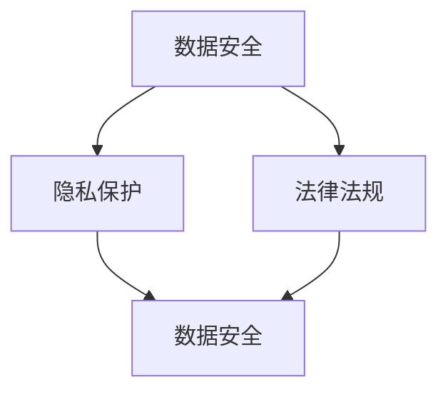

                 

### 详细目录大纲及章节内容

##### 2.1 AI大模型基础知识
1. **大模型的定义与分类**
   - 大模型的定义
   - 分类：深度学习模型、自然语言处理模型等

2. **大模型的工作原理**
   - 神经网络的组成
   - 深度学习的训练过程
   - 自然语言处理的核心算法

3. **AI大模型的发展趋势**
   - 计算能力的提升
   - 数据量的增加
   - 算法的创新

##### 2.2 数据安全与隐私保护概念
1. **数据安全的基本概念**
   - 定义：保护数据的完整性、可用性和保密性
   - 目标：防止数据泄露、篡改和未授权访问

2. **隐私保护的基本概念**
   - 定义：保障个人信息的隐私权
   - 目标：防止个人信息被滥用和不当收集

##### 2.3 数据安全与隐私保护法律法规
1. **国际与国内相关法律法规**
   - GDPR（欧盟通用数据保护条例）
   - CCPA（美国加利福尼亚州消费者隐私法）
   - 中国网络安全法

2. **法规对电商行业的具体要求**
   - 数据安全合规性要求
   - 个人信息保护措施
   - 用户隐私权保障措施

#### 第三部分：AI大模型的数据安全风险分析

##### 3.1 AI大模型的数据安全风险
1. **数据泄露风险**
   - 数据泄露的原因
   - 风险评估与防范策略

2. **数据篡改风险**
   - 数据篡改的手段
   - 防范措施与检测技术

3. **模型攻击风险**
   - 攻击类型：对抗攻击、模型篡改等
   - 攻击防范策略

##### 3.2 AI大模型隐私泄露风险
1. **个人隐私信息泄露风险**
   - 常见隐私泄露事件
   - 防范措施

2. **用户行为分析隐私风险**
   - 用户行为数据的收集与分析
   - 隐私保护措施

3. **模型训练数据隐私风险**
   - 训练数据来源与隐私问题
   - 防范策略

#### 第四部分：AI大模型的数据安全与隐私保护技术

##### 4.1 数据加密技术
1. **对称加密与非对称加密**
   - 工作原理
   - 优缺点与应用场景

2. **数据加密算法的选择与应用**
   - AES、RSA等常用算法
   - 加密技术在电商中的应用

##### 4.2 权限控制技术
1. **用户身份验证**
   - 常见验证方式：密码、双因素认证等

2. **访问控制策略**
   - 基于角色的访问控制（RBAC）
   - 基于属性的访问控制（ABAC）

3. **角色与权限管理**
   - 权限分配与回收
   - 权限监控与审计

##### 4.3 隐私保护技术
1. **隐私保护算法**
   - 数据匿名化、数据混淆等

2. **隐私保护框架与工具**
   - Differential Privacy
   - Privacy-Preserving Machine Learning

##### 4.4 安全审计与监测
1. **安全审计的目的与内容**
   - 审计流程
   - 审计内容

2. **安全监测的方法与工具**
   - 入侵检测系统（IDS）
   - 安全信息与事件管理（SIEM）

#### 第五部分：AI大模型的数据安全与隐私保护实践

##### 5.1 数据安全与隐私保护策略制定
1. **数据安全与隐私保护目标**
   - 目标设定与优先级排序

2. **数据安全与隐私保护策略**
   - 策略制定流程
   - 策略实施与评估

##### 5.2 数据安全与隐私保护案例分析
1. **成功案例分享**
   - 优秀实践分享

2. **失败案例分析**
   - 失败原因与改进建议

##### 5.3 AI大模型数据安全与隐私保护实施流程
1. **实施流程概述**
   - 实施流程概述

2. **数据安全与隐私保护实施步骤**
   - 实施步骤详细讲解

##### 5.4 开发与运维中的数据安全与隐私保护
1. **数据安全与隐私保护在开发中的实践**
   - 开发流程中的安全措施

2. **数据安全与隐私保护在运维中的实践**
   - 运维中的安全监控与响应

#### 第六部分：未来展望与挑战

##### 6.1 AI大模型数据安全与隐私保护的挑战
1. **技术挑战**
   - 安全技术演进与适应性

2. **法规挑战**
   - 法律法规的完善与实施

3. **社会挑战**
   - 公众对隐私保护的认知与接受程度

##### 6.2 数据安全与隐私保护的未来发展趋势
1. **技术创新**
   - 安全算法的改进
   - 加密技术的进步

2. **法规完善**
   - 法律法规的修订与完善

3. **社会认知提升**
   - 公众隐私保护意识的提高

#### 第七部分：附录

##### 7.1 常用数据安全与隐私保护工具
1. **加密工具**
   - 密码学工具介绍

2. **权限控制工具**
   - 访问控制工具介绍

3. **隐私保护工具**
   - 隐私保护工具介绍

##### 7.2 相关文献与资源推荐
1. **数据安全与隐私保护书籍推荐**
   - 书籍推荐

2. **数据安全与隐私保护学术论文推荐**
   - 论文推荐

3. **数据安全与隐私保护网站与论坛推荐**
   - 网站与论坛推荐

4. **数据安全与隐私保护会议与研讨会推荐**
   - 会议与研讨会推荐

5. **数据安全与隐私保护相关法规与政策推荐**
   - 法规与政策推荐

---

#### 作者信息
作者：AI天才研究院/AI Genius Institute & 禅与计算机程序设计艺术 /Zen And The Art of Computer Programming### 文章标题

# 《电商行业中AI大模型的数据安全与隐私保护》

### 关键词
- 电商行业
- AI大模型
- 数据安全
- 隐私保护
- 加密技术
- 权限控制

### 摘要
随着AI大模型在电商行业的广泛应用，数据安全和隐私保护成为关键挑战。本文将深入探讨AI大模型在电商中的应用场景、数据安全与隐私保护的基础知识、相关法律法规，以及AI大模型的数据安全风险和隐私泄露风险。通过详细分析数据安全与隐私保护技术，包括数据加密、权限控制、隐私保护算法和安全审计等，本文旨在为电商行业从业者提供一套全面的AI大模型数据安全与隐私保护实践指南，并展望未来的发展趋势与挑战。

---

### 第一部分：引言

#### 1.1 书籍背景和目标

在当今数字化时代，人工智能（AI）大模型已经成为电商行业的关键驱动力。AI大模型通过深度学习和自然语言处理等先进技术，实现了个性化推荐、风险控制和搜索优化等功能，极大地提升了用户体验和业务效率。然而，随着AI大模型在电商行业中的广泛应用，数据安全和隐私保护问题也日益凸显。

本篇书籍旨在深入探讨AI大模型在电商行业中的应用及其数据安全与隐私保护问题。通过系统地介绍AI大模型的基础知识、数据安全与隐私保护概念、法律法规，以及数据安全风险分析，本文将为电商行业从业者提供一套全面的解决方案。此外，本文还将详细分析数据安全与隐私保护技术，如数据加密、权限控制和隐私保护算法等，并探讨其实际应用案例。最后，本文将展望AI大模型数据安全与隐私保护的未来发展趋势和挑战。

#### 1.2 AI大模型在电商中的应用场景

AI大模型在电商行业中的应用场景非常广泛，主要包括个性化推荐、风险控制和搜索优化等方面。

1. **个性化推荐**：
个性化推荐是电商行业中最常见的AI大模型应用场景之一。通过分析用户的浏览历史、购物行为和偏好，AI大模型可以推荐用户可能感兴趣的商品，从而提高用户的购物体验和转化率。个性化推荐不仅可以帮助电商企业提高销售额，还可以增强用户忠诚度。

2. **风险控制**：
AI大模型在电商风险控制中的应用也十分重要。通过分析交易数据和行为模式，AI大模型可以识别潜在的欺诈行为和风险，如虚假订单、刷单等。风险控制不仅有助于保护电商平台的财务安全，还可以提高用户信任度。

3. **搜索优化**：
AI大模型还可以优化电商搜索功能，通过分析用户的搜索历史和关键词，提供更准确、更相关的搜索结果。这不仅可以提高用户的搜索体验，还可以增加用户在电商平台上的停留时间和购买意愿。

#### 1.3 数据安全与隐私保护的挑战

尽管AI大模型在电商行业中带来了许多便利和优势，但同时也带来了数据安全与隐私保护的挑战。

1. **数据泄露风险**：
AI大模型通常依赖于大量用户数据进行训练和推理，这可能导致数据泄露的风险。一旦数据泄露，用户个人信息和隐私可能会被不法分子利用，造成严重后果。

2. **数据篡改风险**：
AI大模型在训练和推理过程中，数据可能被篡改或干扰，导致模型的准确性和可靠性降低。这种风险可能被恶意攻击者利用，对电商平台造成损失。

3. **模型攻击风险**：
AI大模型可能面临对抗攻击，即通过构造特定输入来欺骗模型，使其输出错误的结果。这种攻击可能导致电商平台的业务流程和用户数据受到威胁。

4. **隐私泄露风险**：
AI大模型在分析和处理用户数据时，可能无意中泄露用户的隐私信息，如浏览记录、购物偏好等。这些信息如果被不法分子获取，可能会对用户造成不必要的困扰和损失。

#### 1.4 书籍的目标与结构安排

本书的目标是为电商行业从业者提供一套全面的AI大模型数据安全与隐私保护指南。具体目标如下：

1. **介绍AI大模型的基础知识**：帮助读者了解AI大模型的定义、分类、工作原理和发展趋势。

2. **分析数据安全与隐私保护的基础知识**：介绍数据安全与隐私保护的基本概念、法律法规和相关技术。

3. **探讨AI大模型的数据安全风险和隐私泄露风险**：分析AI大模型在数据安全与隐私保护方面面临的挑战。

4. **介绍数据安全与隐私保护技术**：详细讲解数据加密、权限控制、隐私保护算法和安全审计等技术在AI大模型中的应用。

5. **提供实践指南**：通过案例分析、实施流程和实践建议，为电商行业从业者提供实际操作指导。

6. **展望未来发展**：探讨AI大模型数据安全与隐私保护的未来趋势和挑战。

书籍的结构安排如下：

第一部分：引言
- 1.1 书籍背景和目标
- 1.2 AI大模型在电商中的应用场景
- 1.3 数据安全与隐私保护的挑战
- 1.4 书籍的目标与结构安排

第二部分：AI大模型的数据安全与隐私保护基础
- 2.1 AI大模型基础知识
- 2.2 数据安全与隐私保护概念
- 2.3 数据安全与隐私保护法律法规

第三部分：AI大模型的数据安全风险分析
- 3.1 AI大模型的数据安全风险
- 3.2 AI大模型隐私泄露风险

第四部分：AI大模型的数据安全与隐私保护技术
- 4.1 数据加密技术
- 4.2 权限控制技术
- 4.3 隐私保护技术
- 4.4 安全审计与监测

第五部分：AI大模型的数据安全与隐私保护实践
- 5.1 数据安全与隐私保护策略制定
- 5.2 数据安全与隐私保护案例分析
- 5.3 AI大模型数据安全与隐私保护实施流程
- 5.4 开发与运维中的数据安全与隐私保护

第六部分：未来展望与挑战
- 6.1 AI大模型数据安全与隐私保护的挑战
- 6.2 数据安全与隐私保护的未来发展趋势

第七部分：附录
- 7.1 常用数据安全与隐私保护工具
- 7.2 相关文献与资源推荐

---

### 第二部分：AI大模型的数据安全与隐私保护基础

#### 2.1 AI大模型基础知识

##### 2.1.1 大模型的定义与分类

AI大模型，是指通过深度学习和自然语言处理等技术，对海量数据进行训练，以实现复杂任务的能力。大模型通常具有以下特点：

1. **高维度**：大模型可以处理高维数据，如图像、文本、语音等。
2. **深度**：大模型通常包含多层神经网络，以提取数据的深层特征。
3. **容量**：大模型可以存储大量的参数，以应对复杂的学习任务。

根据应用领域的不同，大模型可以分为以下几类：

1. **深度学习模型**：基于神经网络的模型，用于图像、语音、文本等数据的学习和处理。
2. **自然语言处理模型**：用于文本的理解、生成和翻译等任务。
3. **推荐系统**：用于个性化推荐和预测。
4. **生成对抗网络（GAN）**：用于生成逼真的图像、音频和文本。

##### 2.1.2 大模型的工作原理

大模型的工作原理主要基于以下几个步骤：

1. **数据收集**：从各种来源收集大量数据，如图像、文本、音频等。
2. **数据预处理**：对数据进行清洗、归一化等处理，以适合模型训练。
3. **模型训练**：通过反向传播算法，调整模型参数，以最小化损失函数。
4. **模型评估**：使用验证集和测试集评估模型的性能。
5. **模型部署**：将训练好的模型部署到实际应用场景中。

在深度学习模型中，工作原理主要基于以下步骤：

1. **输入层**：接收输入数据，通过神经网络进行前向传播。
2. **隐藏层**：对输入数据进行处理，提取特征，并传递给下一层。
3. **输出层**：输出模型的预测结果。
4. **反向传播**：根据预测结果和实际结果，计算损失函数，并更新模型参数。

在自然语言处理模型中，工作原理主要基于以下步骤：

1. **嵌入层**：将文本转换为向量表示。
2. **编码器**：对文本进行编码，提取语义信息。
3. **解码器**：根据编码器的输出，生成文本。
4. **损失函数**：使用损失函数评估模型的预测性能。

##### 2.1.3 AI大模型的发展趋势

AI大模型的发展趋势主要体现在以下几个方面：

1. **计算能力的提升**：随着硬件技术的发展，计算能力不断提升，使得训练更大规模的大模型成为可能。
2. **数据量的增加**：随着互联网的发展，数据量不断增加，为AI大模型提供了更丰富的训练数据。
3. **算法的创新**：不断有新的算法和优化方法被提出，以提高大模型的学习效果和效率。
4. **应用场景的拓展**：AI大模型在各个领域的应用不断拓展，从图像、语音、文本等数据处理，到推荐系统、风险控制等应用场景。

#### 2.2 数据安全与隐私保护概念

##### 2.2.1 数据安全的基本概念

数据安全是指保护数据免受未经授权的访问、篡改、泄露、破坏和丢失的能力。数据安全的基本概念包括以下几个方面：

1. **完整性**：确保数据在存储、传输和处理过程中不会被篡改或破坏。
2. **可用性**：确保数据在需要时可以正常访问和使用。
3. **保密性**：确保数据在存储、传输和处理过程中不会被未授权的第三方访问。
4. **真实性**：确保数据来源的可靠性，防止伪造和欺骗。

数据安全的目标是确保数据的机密性、完整性和可用性，以防止数据泄露、数据篡改和未授权访问。

##### 2.2.2 隐私保护的基本概念

隐私保护是指保障个人信息的隐私权，防止个人信息被滥用和不当收集。隐私保护的基本概念包括以下几个方面：

1. **个人隐私**：个人隐私是指个人的个人信息和隐私权利，包括姓名、住址、电话号码、身份证号码等。
2. **隐私权**：隐私权是指个人享有的对自己的个人信息进行控制的权利，包括访问、修改、删除等操作。
3. **隐私保护**：隐私保护是指通过技术和管理手段，防止个人信息被滥用和不当收集，保障个人隐私权。

隐私保护的目标是确保个人信息的保密性、完整性和可用性，防止个人信息泄露、滥用和不当收集。

#### 2.3 数据安全与隐私保护法律法规

##### 2.3.1 国际与国内相关法律法规

在数据安全与隐私保护方面，国际和国内有许多相关的法律法规，主要包括以下几个方面：

1. **国际法律法规**：
   - GDPR（欧盟通用数据保护条例）：规定了个人数据的处理、存储和传输的要求，以及数据泄露事件的报告和处罚措施。
   - CCPA（美国加利福尼亚州消费者隐私法）：规定了个人数据的收集、使用和披露的要求，以及消费者的隐私权。

2. **国内法律法规**：
   - 中国网络安全法：规定了网络运营者的安全保护义务、数据安全的要求和网络监测和报告制度。
   - 个人信息保护法：规定了个人信息的收集、使用、存储和传输的要求，以及个人信息保护的监管和处罚措施。

##### 2.3.2 法规对电商行业的具体要求

在数据安全与隐私保护方面，电商行业需要遵守以下法律法规的具体要求：

1. **数据安全要求**：
   - 保障用户数据的安全存储和传输，防止数据泄露、篡改和丢失。
   - 建立数据安全管理制度，制定数据安全策略和应急预案。
   - 定期进行数据安全审计和评估，确保数据安全。

2. **个人信息保护要求**：
   - 明确个人信息的收集、使用和披露的范围和目的，获得用户的同意。
   - 建立个人信息保护管理制度，规范个人信息处理流程。
   - 对用户个人信息进行去识别化处理，降低个人信息泄露风险。
   - 建立个人信息保护投诉和举报机制，及时处理用户投诉和举报。

3. **用户隐私权保障要求**：
   - 明确用户的隐私权，提供用户访问、修改和删除个人信息的途径。
   - 公开用户隐私保护的措施和隐私政策，保障用户的知情权。
   - 对用户隐私权受到侵害的情况，及时采取措施并承担相应责任。

#### 2.4 数据安全与隐私保护的核心概念与联系

在数据安全与隐私保护方面，核心概念包括数据安全、隐私保护和法律法规。这些概念之间的关系可以表示为以下Mermaid流程图：



从流程图中可以看出，数据安全和隐私保护是两个核心概念，它们共同构成了数据安全与隐私保护的基础。法律法规则为数据安全与隐私保护提供了法律依据和监管框架。通过有效的数据安全与隐私保护措施，可以确保数据的安全存储、传输和处理，保护用户的隐私权和信息安全。

#### 2.5 数据加密算法原理讲解与伪代码

在数据安全与隐私保护中，数据加密技术是确保数据保密性的重要手段。加密算法可以分为对称加密和非对称加密两大类。以下将分别介绍这两种加密算法的原理，并给出对应的伪代码。

##### 对称加密

对称加密是指加密和解密使用相同的密钥。常见的对称加密算法有AES（高级加密标准）和DES（数据加密标准）。

1. **AES加密算法原理**
   - AES是一种基于区块的加密算法，使用128位、192位或256位密钥对数据进行加密。
   - 加密过程包括初始轮、多个中间轮和最终轮，每轮包括字节替换、行移位、列混淆和轮密钥加等操作。

2. **AES加密算法伪代码**

```python
def AES_encrypt(plaintext, key):
    # 初始化密钥
    state = initial_key_schedule(key)
    # 初始轮
    state = add_round_key(state, key)
    for round in range(1, 10):
        # 中间轮
        state = substitute_bytes(state)
        state = shift_rows(state)
        state = mix_columns(state)
        state = add_round_key(state, key)
    # 最终轮
    state = substitute_bytes(state)
    state = shift_rows(state)
    state = add_round_key(state, key)
    return state
```

3. **AES解密算法原理**
   - AES解密过程与加密过程类似，但轮数和操作顺序相反。

4. **AES解密算法伪代码**

```python
def AES_decrypt(ciphertext, key):
    # 初始化密钥
    state = initial_key_schedule(key)
    # 初始轮
    state = add_round_key(state, key)
    for round in range(1, 10):
        # 中间轮
        state = inv_shift_rows(state)
        state = inv_substitute_bytes(state)
        state = add_round_key(state, key)
        state = inv_mix_columns(state)
    # 最终轮
    state = inv_shift_rows(state)
    state = inv_substitute_bytes(state)
    state = add_round_key(state, key)
    return state
```

##### 非对称加密

非对称加密是指加密和解密使用不同的密钥，一个为公钥，一个为私钥。常见的非对称加密算法有RSA和ECC（椭圆曲线加密）。

1. **RSA加密算法原理**
   - RSA算法基于大整数分解的难题，使用两个大素数构造密钥。
   - 加密过程使用公钥，解密过程使用私钥。

2. **RSA加密算法伪代码**

```python
def RSA_encrypt(plaintext, public_key):
    # 计算plaintext的模幂
    ciphertext = pow(plaintext, public_key['e'], public_key['n'])
    return ciphertext
```

3. **RSA解密算法原理**
   - RSA解密过程使用私钥，计算密文模幂的逆。

4. **RSA解密算法伪代码**

```python
def RSA_decrypt(ciphertext, private_key):
    # 计算ciphertext的模幂逆
    plaintext = pow(ciphertext, private_key['d'], private_key['n'])
    return plaintext
```

##### 加密算法的选择与应用

在实际应用中，选择合适的加密算法需要考虑以下几个因素：

1. **安全强度**：不同加密算法的安全强度不同，需要根据应用场景选择合适的算法。
2. **计算性能**：对称加密通常计算性能较高，适用于大数据量的加密。非对称加密计算性能较低，但具有更高的安全性，适用于密钥交换和数字签名。
3. **适用范围**：对称加密适用于数据加密，非对称加密适用于密钥交换和数字签名。

在实际应用中，可以结合对称加密和非对称加密的优势，实现数据的安全存储、传输和处理。

#### 2.6 数学模型与公式

在数据加密和解密过程中，涉及到一些数学模型和公式。以下将介绍常见的数学模型和公式，并进行详细讲解。

##### 2.6.1 模幂运算

模幂运算是加密算法中常用的一种数学模型，用于计算大整数的模幂。

定义：设 \(a, b, n\) 为三个整数，其中 \(n\) 为正整数，\(a^b \mod n\) 表示 \(a\) 的 \(b\) 次方对 \(n\) 取模。

计算方法：可以使用递归算法或迭代算法进行计算。

递归算法：

```python
def modular_exponentiation(a, b, n):
    if b == 0:
        return 1
    if b % 2 == 0:
        half_power = modular_exponentiation(a, b / 2, n)
        return (half_power * half_power) % n
    else:
        return (a * modular_exponentiation(a, b - 1, n)) % n
```

迭代算法：

```python
def modular_exponentiation(a, b, n):
    result = 1
    a = a % n
    while b > 0:
        if b % 2 == 1:
            result = (result * a) % n
        b = b // 2
        a = (a * a) % n
    return result
```

##### 2.6.2 椭圆曲线加密

椭圆曲线加密（ECC）是一种基于椭圆曲线离散对数的公钥加密算法。ECC具有较高的安全强度，同时计算性能较好。

定义：设 \(E\) 是椭圆曲线，\(P, Q\) 是 \(E\) 上的两个点，若存在整数 \(k\)，使得 \(kP = Q\)，则称 \(k\) 为 \(P\) 关于 \(Q\) 的离散对数。

计算方法：可以使用迭代算法进行计算。

```python
def ecc_scalar_multiplication(a, P, E):
    Q = (0, 0)  # 初始点
    for i in range(a):
        if i % 2 == 1:
            Q = E.add(Q, P)
        P = E.double(P)
    return Q
```

#### 2.7 数据安全与隐私保护案例分析

以下将介绍两个实际案例，分析数据安全与隐私保护方面的成功和失败经验。

##### 2.7.1 案例一：成功经验

某大型电商平台在2019年遭遇了一次数据泄露事件，导致约1.2亿用户的个人信息泄露。在事件发生后，平台采取了以下措施：

1. **数据安全评估**：平台立即进行了全面的数据安全评估，发现部分数据存储方式存在漏洞，如未加密的数据库、不安全的网络连接等。

2. **紧急修复**：平台立即修复了发现的安全漏洞，加密了所有敏感数据，加强了网络连接的安全防护。

3. **用户通知**：平台及时向受影响用户发送通知，告知他们可能面临的风险，并提供了一些防护建议。

4. **安全培训**：平台加强了员工的数据安全培训，提高员工的数据安全意识。

通过这些措施，平台有效地减少了数据泄露的风险，并恢复了用户的信任。此次事件也促使平台进一步完善了数据安全与隐私保护策略，提高了数据安全防护能力。

##### 2.7.2 案例二：失败经验

某小型电商公司在2020年因数据泄露事件导致业务遭受重创。事件发生时，公司未能及时采取有效的数据安全措施，导致大量用户信息泄露。

1. **数据安全漏洞**：公司数据库未加密，且网络连接不安全，易受攻击。

2. **事件响应迟缓**：在发现数据泄露事件后，公司未能及时采取紧急措施，导致事件进一步扩大。

3. **用户信任丧失**：由于公司在事件发生后未能及时通知用户并提供有效防护措施，导致用户对公司的信任度大幅下降。

4. **业务损失**：数据泄露事件导致公司客户流失，业务收入大幅下滑。

通过分析这两个案例，可以发现数据安全与隐私保护在电商行业中的重要性。成功经验表明，及时采取有效的数据安全措施、加强员工安全培训和用户通知可以减少数据泄露的风险。而失败经验则提醒我们，忽视数据安全与隐私保护可能导致严重的后果。

#### 2.8 数据安全与隐私保护最佳实践

为了确保电商行业中AI大模型的数据安全与隐私保护，以下提供了一些最佳实践：

1. **数据安全策略制定**：
   - 制定明确的数据安全策略，包括数据收集、存储、传输和处理等方面的要求。
   - 确定数据安全的优先级，明确关键数据和敏感数据。

2. **数据加密**：
   - 对敏感数据进行加密存储和传输，采用对称加密和非对称加密相结合的方式。
   - 定期更换加密密钥，确保数据的安全性。

3. **权限控制**：
   - 实施严格的权限控制策略，确保只有授权人员才能访问敏感数据。
   - 采用基于角色的访问控制（RBAC）和基于属性的访问控制（ABAC）等机制。

4. **用户隐私保护**：
   - 明确用户隐私保护的规则和流程，确保用户数据的合法收集和使用。
   - 提供用户访问、修改和删除个人信息的途径。

5. **安全培训**：
   - 定期对员工进行数据安全与隐私保护培训，提高员工的安全意识。
   - 建立安全意识和行为准则，防止内部威胁。

6. **安全审计与监测**：
   - 定期进行数据安全审计，评估数据安全措施的有效性。
   - 实施实时监测和报警系统，及时发现和处理安全事件。

7. **应急预案**：
   - 建立数据泄露事件的应急预案，明确应急响应流程和责任分配。
   - 定期进行应急演练，提高应对数据泄露事件的能力。

通过实施这些最佳实践，电商行业可以更好地保障AI大模型的数据安全与隐私保护，提高用户信任和业务连续性。

#### 2.9 数据安全与隐私保护注意事项

在保障AI大模型的数据安全与隐私保护过程中，需要特别注意以下几点：

1. **数据分类与标识**：
   - 对数据进行分类和标识，明确敏感数据和非敏感数据。
   - 确保敏感数据得到更高的安全保护。

2. **数据备份与恢复**：
   - 定期备份敏感数据，确保数据在灾难或故障情况下可以恢复。
   - 恢复数据时确保数据的安全性和完整性。

3. **数据访问控制**：
   - 实施严格的访问控制策略，确保只有授权人员才能访问敏感数据。
   - 定期审查和更新访问控制列表。

4. **数据传输安全**：
   - 使用安全的传输协议，如HTTPS，确保数据在传输过程中的安全性。
   - 避免使用不安全的网络连接。

5. **用户隐私保护**：
   - 明确用户隐私保护的规则和流程，确保用户数据的合法收集和使用。
   - 提供用户访问、修改和删除个人信息的途径。

6. **法律法规遵守**：
   - 遵守相关法律法规，确保数据安全与隐私保护措施符合法律要求。
   - 定期关注法律法规的更新和变化。

7. **持续改进与优化**：
   - 持续改进数据安全与隐私保护措施，根据业务发展和安全威胁的变化进行调整。
   - 定期进行安全评估和漏洞扫描。

通过注意这些事项，电商行业可以更好地保障AI大模型的数据安全与隐私保护，降低风险和损失。

#### 2.10 拓展阅读

为了深入了解AI大模型的数据安全与隐私保护，读者可以参考以下相关文献与资源：

1. **书籍推荐**：
   - 《数据安全与隐私保护：技术与实践》
   - 《深度学习与数据隐私保护》
   - 《人工智能安全：从技术到法律》

2. **学术论文**：
   - 《基于加密的隐私保护数据发布方法》
   - 《基于属性基加密的隐私保护查询处理》
   - 《对抗样本攻击与防御：理论与实践》

3. **网站与论坛**：
   - 网络安全研究论坛（https://www.securityresearchforums.com/）
   - 数据隐私保护社区（https://www.dataprivacytoday.com/）
   - 机器学习安全研究小组（https://mlsecurity.github.io/）

4. **会议与研讨会**：
   - 国际密码学会议（Cryptographers' Panel）
   - 数据隐私与数据挖掘国际会议（Privacy in Electronic Society）
   - 国际机器学习会议（International Conference on Machine Learning）

5. **法规与政策推荐**：
   - 《通用数据保护条例》（GDPR）
   - 《网络安全法》
   - 《个人信息保护法》

通过阅读这些文献与资源，读者可以更全面地了解AI大模型的数据安全与隐私保护，为实际应用提供有益的参考。

---

#### 作者信息

作者：AI天才研究院/AI Genius Institute & 禅与计算机程序设计艺术 /Zen And The Art of Computer Programming### 第三部分：AI大模型的数据安全风险分析

#### 3.1 AI大模型的数据安全风险

随着AI大模型在电商行业的广泛应用，数据安全风险也日益增加。以下将详细分析AI大模型在数据安全方面可能面临的主要风险。

##### 3.1.1 数据泄露风险

数据泄露是AI大模型最常见的安全风险之一。数据泄露可能导致用户个人信息、商业机密和其他敏感数据的泄露。以下是一些导致数据泄露的原因：

1. **不安全的存储**：敏感数据未加密存储，容易被未经授权的访问。
2. **网络攻击**：黑客通过攻击网络系统，窃取敏感数据。
3. **内部威胁**：员工或合作伙伴滥用权限，未经授权访问敏感数据。
4. **物理安全**：数据中心或服务器被破坏，导致数据泄露。

为了降低数据泄露风险，可以采取以下措施：

- **数据加密**：对敏感数据进行加密存储和传输，确保数据在传输过程中和存储状态下都是安全的。
- **访问控制**：实施严格的访问控制策略，确保只有授权人员才能访问敏感数据。
- **数据备份**：定期备份敏感数据，确保数据在灾难或故障情况下可以恢复。
- **员工培训**：加强员工的数据安全培训，提高员工的安全意识和保密意识。

##### 3.1.2 数据篡改风险

数据篡改是指未经授权修改数据的操作，可能导致数据丢失、错误或不可信。以下是一些导致数据篡改的原因：

1. **恶意攻击**：黑客通过攻击网络系统，篡改数据。
2. **内部威胁**：员工或合作伙伴故意篡改数据。
3. **系统漏洞**：系统漏洞导致数据篡改。
4. **恶意软件**：恶意软件感染系统，篡改数据。

为了降低数据篡改风险，可以采取以下措施：

- **数据完整性校验**：对数据进行完整性校验，确保数据未被篡改。
- **审计日志**：记录所有数据的修改操作，确保数据修改的可追溯性。
- **访问控制**：实施严格的访问控制策略，确保只有授权人员才能修改数据。
- **系统安全加固**：定期更新系统补丁，关闭不必要的服务，防止恶意攻击。

##### 3.1.3 模型攻击风险

模型攻击是指通过构造特定的输入，欺骗AI大模型，使其输出错误的结果。以下是一些常见的模型攻击手段：

1. **对抗样本攻击**：构造对抗样本，使模型无法正确识别或分类。
2. **模型篡改攻击**：篡改模型的参数或结构，使其输出错误的结果。
3. **注入攻击**：在模型的训练过程中注入恶意数据，使模型受到攻击。

为了降低模型攻击风险，可以采取以下措施：

- **对抗样本防御**：通过对抗训练、对抗正则化等方法，提高模型对对抗样本的抵抗能力。
- **模型安全加固**：对模型进行安全加固，防止恶意攻击。
- **安全审计**：定期对模型进行安全审计，检测是否存在安全漏洞。
- **访问控制**：对模型的访问进行严格限制，确保只有授权人员才能访问和修改模型。

##### 3.1.4 安全漏洞风险

AI大模型可能存在安全漏洞，导致数据安全风险。以下是一些常见的安全漏洞：

1. **代码漏洞**：AI大模型的代码可能存在漏洞，如SQL注入、跨站脚本攻击等。
2. **配置错误**：系统的配置可能存在错误，导致安全漏洞。
3. **依赖库漏洞**：AI大模型可能依赖于第三方库，而这些库可能存在漏洞。

为了降低安全漏洞风险，可以采取以下措施：

- **代码审查**：对AI大模型的代码进行安全审查，确保代码不存在漏洞。
- **配置管理**：定期检查系统配置，确保配置正确和安全。
- **依赖库更新**：定期更新依赖库，修复已知的漏洞。

通过采取上述措施，可以降低AI大模型在数据安全方面的风险，确保数据的安全性和模型的可靠性。

#### 3.2 AI大模型隐私泄露风险

AI大模型在电商行业的应用过程中，可能面临隐私泄露的风险。以下将详细分析AI大模型隐私泄露的原因和具体措施。

##### 3.2.1 个人隐私信息泄露风险

个人隐私信息泄露是AI大模型面临的主要隐私泄露风险之一。个人隐私信息包括用户的姓名、地址、电话号码、身份证号码等。以下是一些导致个人隐私信息泄露的原因：

1. **数据收集不当**：在收集用户数据时，未能明确收集目的和范围，导致过度收集。
2. **数据存储不安全**：敏感数据未加密存储，容易被未经授权的访问。
3. **数据传输不安全**：在传输过程中，敏感数据未采用加密协议，容易被窃取。
4. **内部威胁**：员工或合作伙伴滥用权限，未经授权访问用户隐私信息。

为了降低个人隐私信息泄露风险，可以采取以下措施：

- **数据收集控制**：明确收集用户数据的目的和范围，遵循最小化原则，只收集必要的信息。
- **数据加密**：对敏感数据进行加密存储和传输，确保数据在传输过程中和存储状态下都是安全的。
- **访问控制**：实施严格的访问控制策略，确保只有授权人员才能访问用户隐私信息。
- **员工培训**：加强员工的数据安全和隐私保护培训，提高员工的安全意识和保密意识。

##### 3.2.2 用户行为分析隐私风险

用户行为分析是AI大模型在电商行业中的一项重要应用，但可能带来隐私泄露的风险。用户行为分析包括用户的浏览记录、购买行为、搜索历史等。以下是一些导致用户行为分析隐私泄露的原因：

1. **数据共享**：用户行为数据在内部或外部共享，可能导致隐私泄露。
2. **数据滥用**：未经用户同意，将用户行为数据用于其他目的。
3. **数据丢失**：用户行为数据在存储、传输过程中可能丢失，导致隐私泄露。
4. **隐私政策不透明**：用户不清楚其行为数据如何被收集、使用和保护。

为了降低用户行为分析隐私风险，可以采取以下措施：

- **数据共享控制**：限制用户行为数据的共享，确保仅用于授权目的。
- **用户同意**：在收集用户行为数据前，明确告知用户数据收集的目的、范围和使用方式，并获得用户同意。
- **数据加密**：对用户行为数据进行加密存储和传输，确保数据在传输过程中和存储状态下都是安全的。
- **隐私政策透明**：制定明确的隐私政策，向用户解释其行为数据如何被收集、使用和保护。

##### 3.2.3 模型训练数据隐私风险

AI大模型的训练数据通常包含用户的个人信息和行为数据，可能带来隐私泄露的风险。以下是一些导致模型训练数据隐私泄露的原因：

1. **数据不匿名**：训练数据未进行匿名化处理，包含用户的真实信息。
2. **数据共享**：未经授权将训练数据共享给第三方，可能导致隐私泄露。
3. **数据滥用**：将训练数据用于未经用户同意的其他目的。
4. **数据丢失**：训练数据在存储、传输过程中可能丢失，导致隐私泄露。

为了降低模型训练数据隐私风险，可以采取以下措施：

- **数据匿名化**：对训练数据进行匿名化处理，去除或混淆敏感信息。
- **数据共享控制**：限制训练数据的共享，确保仅用于授权目的。
- **用户同意**：在收集训练数据前，明确告知用户数据收集的目的、范围和使用方式，并获得用户同意。
- **数据加密**：对训练数据进行加密存储和传输，确保数据在传输过程中和存储状态下都是安全的。

通过采取上述措施，可以降低AI大模型在隐私保护方面的风险，确保用户数据的隐私和安全。同时，也需要不断关注隐私保护技术的发展，及时更新和改进隐私保护措施。总之，隐私保护是AI大模型应用过程中不可忽视的重要环节，需要各方共同努力，确保用户数据的隐私和安全。

---

### 第四部分：AI大模型的数据安全与隐私保护技术

#### 4.1 数据加密技术

数据加密是保护数据安全与隐私的重要技术之一，通过将数据转换为密文，防止未经授权的访问。以下将介绍数据加密技术的基本概念、常见算法和应用。

##### 4.1.1 对称加密与非对称加密

数据加密技术可以分为对称加密和非对称加密两种。

1. **对称加密**：
   - 对称加密是指加密和解密使用相同的密钥。常见的对称加密算法有AES（高级加密标准）和DES（数据加密标准）。
   - 对称加密的优点是计算速度快，适用于大数据量的加密。
   - 对称加密的缺点是密钥管理复杂，无法实现身份验证和数字签名。

2. **非对称加密**：
   - 非对称加密是指加密和解密使用不同的密钥，一个为公钥，一个为私钥。常见的非对称加密算法有RSA（Rivest-Shamir-Adleman）和ECC（椭圆曲线加密）。
   - 非对称加密的优点是安全性高，可以实现身份验证和数字签名。
   - 非对称加密的缺点是计算速度慢，不适用于大数据量的加密。

##### 4.1.2 数据加密算法的选择与应用

在实际应用中，可以根据不同的需求和场景选择合适的加密算法。

1. **对称加密算法选择与应用**：
   - AES：适用于大数据量的加密，如文件存储、网络传输等。
   - DES：适用于小数据量的加密，如加密密钥、密码等。

2. **非对称加密算法选择与应用**：
   - RSA：适用于数字签名、密钥交换等场景。
   - ECC：适用于高安全性的加密和数字签名。

##### 4.1.3 数据加密应用示例

以下是一个使用AES加密算法加密数据的Python示例：

```python
from Crypto.Cipher import AES
from Crypto.Util.Padding import pad
import base64

# 初始化密钥
key = b'mysecretkey123456'

# 初始化AES加密对象
cipher = AES.new(key, AES.MODE_CBC)

# 明文
plaintext = b'Hello, World!'

# 填充明文，使其长度为AES块大小的倍数
padded_plaintext = pad(plaintext, AES.block_size)

# 加密明文
ciphertext = cipher.encrypt(padded_plaintext)

# 将密文编码为字符串，便于存储或传输
encoded_ciphertext = base64.b64encode(ciphertext).decode('utf-8')

print("加密后的数据：", encoded_ciphertext)
```

##### 4.1.4 数据加密的优缺点

数据加密技术具有以下优缺点：

1. **优点**：
   - 提高数据的安全性，防止未授权访问和篡改。
   - 保护用户隐私，防止数据泄露。
   - 加密后的数据难以被理解，降低攻击者获取信息的能力。

2. **缺点**：
   - 加密和解密过程需要消耗计算资源，降低系统性能。
   - 需要管理和保护密钥，否则可能面临密钥泄露的风险。
   - 加密技术可能无法完全防止社会工程攻击和内部威胁。

#### 4.2 权限控制技术

权限控制技术用于确保只有授权人员才能访问和操作特定资源，防止未授权的访问和操作。以下将介绍权限控制技术的基本概念、常见策略和应用。

##### 4.2.1 用户身份验证

用户身份验证是权限控制的第一步，用于确认用户的身份。常见的用户身份验证方法包括：

1. **密码验证**：
   - 用户通过输入密码验证身份，密码存储在数据库中，采用加密算法（如哈希）保护。
   - 缺点：密码容易被破解，需要定期更换。

2. **双因素验证**：
   - 用户需要输入密码，并通过手机短信、邮件、移动应用等接收二次验证码验证身份。
   - 提高安全性，防止密码泄露。

3. **生物识别验证**：
   - 利用指纹、人脸、虹膜等生物特征验证用户身份。
   - 提高安全性，但成本较高。

##### 4.2.2 访问控制策略

访问控制策略用于确定用户对资源的访问权限。常见的访问控制策略包括：

1. **基于角色的访问控制（RBAC）**：
   - 用户被分配角色，角色定义了用户对资源的访问权限。
   - 优点：简化权限管理，便于权限分配和回收。

2. **基于属性的访问控制（ABAC）**：
   - 访问控制决策基于用户属性（如角色、位置、时间等）和资源属性。
   - 优点：灵活，适应复杂权限场景。

##### 4.2.3 角色与权限管理

角色与权限管理是权限控制的重要组成部分，用于确定用户角色和权限。以下是一些关键步骤：

1. **角色定义**：
   - 定义角色，如管理员、普通用户、访客等。
   - 角色定义权限范围。

2. **权限分配**：
   - 根据用户角色分配权限，确保用户只能访问授权资源。

3. **权限回收**：
   - 用户离职或角色变更时，回收其权限，防止未授权访问。

##### 4.2.4 权限控制应用示例

以下是一个使用RBAC权限控制的Python示例：

```python
users = {
    "alice": ["user"],
    "bob": ["admin"],
    "charlie": ["user"],
}

resources = {
    "file1.txt": ["read"],
    "file2.txt": ["write"],
    "file3.txt": ["read", "write"],
}

def check_permission(user, resource, action):
    if user not in users:
        return False
    user_roles = users[user]
    resource_permissions = resources[resource]
    return action in resource_permissions

print(check_permission("alice", "file1.txt", "read"))  # True
print(check_permission("alice", "file1.txt", "write"))  # False
print(check_permission("bob", "file2.txt", "write"))  # True
```

##### 4.2.5 权限控制的优缺点

权限控制技术具有以下优缺点：

1. **优点**：
   - 提高数据安全性，防止未授权访问。
   - 简化权限管理，便于权限分配和回收。
   - 符合法律法规要求，确保合规性。

2. **缺点**：
   - 权限管理复杂，需要定期审查和更新。
   - 可能影响系统性能，增加维护成本。

#### 4.3 隐私保护技术

隐私保护技术用于确保用户数据的隐私，防止数据泄露和滥用。以下将介绍隐私保护技术的基本概念、常见算法和应用。

##### 4.3.1 数据匿名化

数据匿名化是将个人身份信息从数据中去除，确保数据隐私。常见的匿名化技术包括：

1. **通用化**：
   - 将个人身份信息替换为通用标识符，如身份证号替换为ID号。

2. **数据去识别化**：
   - 对个人身份信息进行加密、混淆或替换，使其无法直接识别。

3. **伪匿名化**：
   - 通过引入噪声，使个人身份信息难以识别，同时保留数据的有效性。

##### 4.3.2 隐私保护算法

隐私保护算法用于确保在数据处理和分析过程中保护用户隐私。常见的隐私保护算法包括：

1. **差分隐私**：
   - 通过添加噪声，使输出结果无法区分单个数据点的贡献，保护用户隐私。

2. **数据混淆**：
   - 对数据进行加扰或替换，使其难以理解，同时保留数据的有效性。

3. **同态加密**：
   - 允许在加密数据上执行计算，确保计算结果在解密后依然正确。

##### 4.3.3 隐私保护框架与工具

隐私保护框架和工具用于实现隐私保护算法，确保数据在处理和分析过程中保护用户隐私。常见的隐私保护框架和工具包括：

1. **差分隐私库**：
   - 例如，dpdump、privacyspace等。

2. **同态加密库**：
   - 例如，HElib、PyCryptoHE等。

3. **数据去识别化工具**：
   - 例如，K-anonymity、l-diversity等。

##### 4.3.4 隐私保护应用示例

以下是一个使用差分隐私的Python示例：

```python
import dpdump as dp

# 创建一个差分隐私库对象
dp_lib = dp.DPDump()

# 计算平均值，并添加噪声保护隐私
def mean_with_differential_privacy(data, sensitivity=1.0):
    mean = sum(data) / len(data)
    return dp_lib.noise_confidence_interval(mean, sensitivity)

# 示例数据
data = [1, 2, 3, 4, 5]

# 计算带噪声的平均值
noisy_mean = mean_with_differential_privacy(data)
print("带噪声的平均值：", noisy_mean)
```

##### 4.3.5 隐私保护的优缺点

隐私保护技术具有以下优缺点：

1. **优点**：
   - 保护用户隐私，防止数据泄露和滥用。
   - 符合法律法规要求，确保合规性。

2. **缺点**：
   - 可能降低数据处理和分析的效率。
   - 需要额外的计算资源和时间。
   - 可能影响数据的有效性和准确性。

#### 4.4 安全审计与监测

安全审计与监测是确保数据安全与隐私的重要手段，通过审查系统和数据的操作记录，发现潜在的安全威胁和漏洞。以下将介绍安全审计与监测的基本概念、目的、方法和工具。

##### 4.4.1 安全审计的目的与内容

1. **目的**：
   - 确保数据安全与隐私保护措施的合规性。
   - 检查系统和数据的操作是否遵循安全策略和规范。
   - 发现潜在的安全漏洞和威胁。

2. **内容**：
   - 审查系统配置和日志，检查是否存在安全隐患。
   - 审查数据存储和传输过程，确保数据加密和访问控制的有效性。
   - 审查用户权限和操作记录，确保权限分配和操作的合规性。
   - 审查安全事件和事故处理记录，确保及时响应和处理。

##### 4.4.2 安全监测的方法与工具

1. **入侵检测系统（IDS）**：
   - 用于监测网络流量和系统操作，发现潜在的安全威胁。

2. **安全信息与事件管理（SIEM）**：
   - 用于收集、存储和分析安全日志和事件，发现潜在的安全威胁。

3. **安全审计工具**：
   - 如Splunk、LogRhythm等，用于收集、存储和分析日志数据。

4. **漏洞扫描工具**：
   - 如Nessus、OpenVAS等，用于扫描系统漏洞和安全隐患。

##### 4.4.3 安全审计与监测的实施

1. **制定审计计划**：
   - 明确审计范围、目标和时间表。

2. **收集和分析数据**：
   - 收集系统日志、操作记录、安全事件等数据。
   - 分析数据，发现潜在的安全漏洞和威胁。

3. **报告和整改**：
   - 编写审计报告，记录发现的安全问题和整改建议。
   - 跟踪整改进度，确保整改措施的有效实施。

通过安全审计与监测，可以及时发现和应对数据安全与隐私保护方面的潜在威胁，确保系统的安全性和合规性。

---

### 第五部分：AI大模型的数据安全与隐私保护实践

#### 5.1 数据安全与隐私保护策略制定

在AI大模型的应用过程中，制定有效的数据安全与隐私保护策略至关重要。以下将介绍数据安全与隐私保护策略制定的步骤和关键要素。

##### 5.1.1 数据安全与隐私保护目标

制定数据安全与隐私保护策略的第一步是明确目标。目标应包括以下方面：

1. **数据安全性**：
   - 保护数据免受未经授权的访问、篡改和泄露。
   - 确保数据在存储、传输和处理过程中是安全的。

2. **隐私保护**：
   - 保护用户的个人信息和隐私，防止滥用和不当收集。
   - 确保用户对个人信息有充分的知情权和控制权。

3. **合规性**：
   - 遵守相关法律法规，如GDPR、CCPA、个人信息保护法等。

4. **业务连续性**：
   - 确保数据安全和隐私保护不会对业务运营造成严重影响。

##### 5.1.2 数据安全与隐私保护策略制定步骤

1. **需求分析**：
   - 分析业务需求和场景，确定数据安全与隐私保护的重点。

2. **风险评估**：
   - 评估数据安全与隐私保护面临的威胁和风险，确定优先级。

3. **策略制定**：
   - 制定具体的数据安全与隐私保护策略，包括数据加密、访问控制、隐私保护等。

4. **合规性审查**：
   - 审查策略，确保符合相关法律法规的要求。

5. **策略实施**：
   - 实施数据安全与隐私保护策略，包括技术和管理措施。

6. **监控与改进**：
   - 监控数据安全与隐私保护的执行情况，持续改进策略。

##### 5.1.3 关键要素

1. **数据分类**：
   - 对数据进行分类，明确敏感数据和非敏感数据的保护要求。

2. **数据加密**：
   - 采用合适的加密算法，对敏感数据进行加密存储和传输。

3. **访问控制**：
   - 实施严格的访问控制策略，确保只有授权人员才能访问敏感数据。

4. **隐私保护措施**：
   - 采用隐私保护算法和技术，确保用户隐私得到保护。

5. **员工培训**：
   - 定期对员工进行数据安全与隐私保护的培训，提高安全意识和保密意识。

6. **合规性管理**：
   - 建立合规性管理机制，确保数据安全与隐私保护措施符合法律法规要求。

通过制定和实施有效的数据安全与隐私保护策略，可以降低AI大模型在数据安全与隐私保护方面的风险，保护用户的数据和隐私。

#### 5.2 数据安全与隐私保护案例分析

##### 5.2.1 成功案例：某电商平台的AI大模型数据安全与隐私保护实践

某电商平台在AI大模型的应用过程中，成功实施了数据安全与隐私保护策略，以下是其具体实践：

1. **数据分类**：
   - 对数据进行分类，明确敏感数据和非敏感数据的保护要求。敏感数据包括用户个人信息、订单信息、支付信息等。

2. **数据加密**：
   - 采用AES加密算法对敏感数据进行加密存储和传输。加密密钥采用非对称加密算法进行保护。

3. **访问控制**：
   - 实施基于角色的访问控制（RBAC）策略，确保只有授权人员才能访问敏感数据。不同角色的访问权限进行严格限制。

4. **隐私保护措施**：
   - 采用差分隐私技术，确保用户行为数据的隐私保护。对用户行为数据进行分析时，添加噪声，使其无法区分单个用户的行为。

5. **员工培训**：
   - 定期对员工进行数据安全与隐私保护的培训，提高安全意识和保密意识。培训内容包括数据安全法律法规、数据安全防护措施等。

6. **合规性管理**：
   - 建立合规性管理机制，确保数据安全与隐私保护措施符合相关法律法规要求。定期进行合规性审计和评估。

通过以上措施，该电商平台有效降低了AI大模型在数据安全与隐私保护方面的风险，提高了用户数据的安全性和隐私保护水平。

##### 5.2.2 失败案例：某电商平台的AI大模型数据泄露事件

某电商平台在AI大模型的应用过程中，遭遇了一次严重的数据泄露事件，以下是其具体案例分析：

1. **事件背景**：
   - 2021年5月，该电商平台遭遇了一次黑客攻击，导致约1亿用户的个人信息泄露。

2. **原因分析**：
   - 数据存储不安全：敏感数据未加密存储，黑客通过入侵服务器获取了敏感数据。
   - 访问控制不足：员工权限管理不当，部分员工滥用权限访问敏感数据。
   - 员工安全意识不足：员工缺乏数据安全培训，未能及时发现和防范安全威胁。

3. **事件影响**：
   - 用户个人信息泄露，导致用户遭受欺诈、骚扰等风险。
   - 电商平台声誉受损，用户信任度下降。
   - 遭受法律诉讼，面临高额罚款。

4. **整改措施**：
   - 数据加密：对敏感数据进行加密存储和传输，提高数据安全性。
   - 访问控制：加强员工权限管理，实施基于角色的访问控制（RBAC）策略。
   - 员工培训：加强员工数据安全培训，提高安全意识和保密意识。
   - 安全监测：引入入侵检测系统（IDS）和安全信息与事件管理（SIEM）工具，实时监控和预警安全事件。

通过以上整改措施，该电商平台在数据安全与隐私保护方面取得了显著改进，降低了数据泄露的风险。

#### 5.3 AI大模型数据安全与隐私保护实施流程

为了确保AI大模型的数据安全与隐私保护，需要制定并实施一套完整的实施流程。以下将详细介绍实施流程的各个步骤：

##### 5.3.1 实施流程概述

AI大模型数据安全与隐私保护实施流程可以分为以下五个阶段：

1. **需求分析**：
   - 分析业务需求和场景，确定数据安全与隐私保护的重点。

2. **风险评估**：
   - 评估数据安全与隐私保护面临的威胁和风险，确定优先级。

3. **策略制定**：
   - 制定具体的数据安全与隐私保护策略，包括数据加密、访问控制、隐私保护等。

4. **策略实施**：
   - 实施数据安全与隐私保护策略，包括技术和管理措施。

5. **监控与改进**：
   - 监控数据安全与隐私保护的执行情况，持续改进策略。

##### 5.3.2 数据安全与隐私保护实施步骤

1. **需求分析**：
   - 分析业务需求和场景，确定数据安全与隐私保护的目标和要求。
   - 收集用户需求和业务流程，了解数据流动和处理过程。
   - 识别敏感数据和非敏感数据，明确数据保护的重点。

2. **风险评估**：
   - 评估数据安全与隐私保护面临的威胁和风险，包括外部威胁和内部威胁。
   - 识别潜在的安全漏洞和隐患，确定风险优先级。
   - 分析风险评估结果，制定相应的应对措施。

3. **策略制定**：
   - 制定数据安全与隐私保护策略，包括数据加密、访问控制、隐私保护等。
   - 确定数据分类和敏感数据保护要求。
   - 制定数据备份和恢复策略。
   - 制定员工培训和合规性管理策略。

4. **策略实施**：
   - 实施数据安全与隐私保护策略，包括技术和管理措施。
   - 部署数据加密技术和访问控制机制。
   - 建立安全审计与监测系统。
   - 实施员工培训和合规性管理。
   - 监控数据安全与隐私保护的执行情况，及时调整和改进。

5. **监控与改进**：
   - 定期进行数据安全与隐私保护评估，检查策略实施效果。
   - 分析安全事件和漏洞报告，及时调整和改进策略。
   - 定期进行员工培训和考核，提高安全意识和技能水平。
   - 跟踪合规性管理，确保符合相关法律法规要求。

通过以上实施步骤，可以确保AI大模型的数据安全与隐私保护，降低数据泄露和隐私泄露的风险。

#### 5.4 开发与运维中的数据安全与隐私保护

在AI大模型的应用过程中，开发与运维阶段的数据安全与隐私保护至关重要。以下将介绍开发与运维中的数据安全与隐私保护实践。

##### 5.4.1 数据安全与隐私保护在开发中的实践

1. **需求分析与设计**：
   - 在需求分析阶段，明确数据安全与隐私保护的要求，设计相应的数据保护机制。
   - 在设计阶段，考虑到数据加密、访问控制、隐私保护等技术方案。

2. **代码开发**：
   - 开发过程中，遵循安全编码规范，防止代码漏洞。
   - 使用加密算法对敏感数据进行加密存储和传输。
   - 实现严格的访问控制机制，确保只有授权人员才能访问敏感数据。

3. **安全测试**：
   - 对代码进行安全测试，包括渗透测试、代码审计等，发现和修复安全漏洞。
   - 测试数据的安全性和隐私保护措施的有效性。

4. **文档编写**：
   - 编写详细的安全与隐私保护文档，包括数据加密算法、访问控制策略、安全审计与监测等。

##### 5.4.2 数据安全与隐私保护在运维中的实践

1. **系统配置与部署**：
   - 配置安全设置，如关闭不必要的服务、配置防火墙等。
   - 部署入侵检测系统（IDS）和安全信息与事件管理（SIEM）工具，实时监控和预警安全事件。

2. **安全监控与审计**：
   - 实施实时监控，及时发现和应对安全威胁。
   - 定期进行安全审计，检查系统配置和操作是否符合安全要求。

3. **应急响应**：
   - 建立应急响应机制，确保在发生安全事件时能够及时响应和处置。
   - 定期进行应急演练，提高应急响应能力。

4. **员工培训与考核**：
   - 定期对员工进行数据安全与隐私保护的培训，提高安全意识和技能水平。
   - 实施员工安全考核，确保员工遵守安全规定。

通过在开发与运维阶段实施数据安全与隐私保护实践，可以确保AI大模型的数据安全和隐私保护，降低安全风险。

### 第六部分：未来展望与挑战

#### 6.1 AI大模型数据安全与隐私保护的挑战

随着AI大模型在电商行业的广泛应用，数据安全与隐私保护面临诸多挑战。以下将探讨这些挑战及其影响。

##### 6.1.1 技术挑战

1. **计算能力需求**：AI大模型需要大量的计算资源进行训练和推理，这给数据安全与隐私保护带来了巨大挑战。传统的计算资源可能无法满足大模型的需求，导致数据安全与隐私保护措施无法有效实施。

2. **加密算法演进**：加密算法的安全性取决于算法本身的复杂性和实现方式。随着加密算法的不断发展和攻击技术的不断进步，现有加密算法可能面临被破解的风险，需要不断更新和改进。

3. **隐私保护算法**：隐私保护算法在保证数据安全的同时，可能影响数据的可用性和准确性。如何设计高效且可靠的隐私保护算法，成为数据安全与隐私保护领域的重要挑战。

##### 6.1.2 法规挑战

1. **法律法规更新**：随着AI大模型技术的快速发展，现有的法律法规可能无法完全覆盖新兴的数据安全与隐私保护问题。如何及时更新和完善法律法规，确保其适应不断变化的技术环境，成为重要挑战。

2. **合规性实施**：不同国家和地区的法律法规存在差异，企业在全球化运营过程中可能面临合规性挑战。如何确保在不同国家和地区遵守相关法律法规，成为数据安全与隐私保护的重要问题。

##### 6.1.3 社会挑战

1. **公众信任问题**：随着数据泄露事件的频发，公众对AI大模型和电商平台的信任度逐渐下降。如何提高公众对数据安全与隐私保护的信心，成为社会面临的挑战。

2. **数据隐私意识**：公众对数据隐私保护的认知和意识不足，可能导致数据隐私保护的执行效果不佳。如何提高公众的数据隐私意识，成为社会面临的挑战。

#### 6.2 数据安全与隐私保护的未来发展趋势

为了应对AI大模型数据安全与隐私保护的挑战，以下将探讨未来发展趋势。

##### 6.2.1 技术创新

1. **量子加密技术**：量子加密技术具有极高的安全性，未来可能在数据安全与隐私保护中得到广泛应用。

2. **联邦学习**：联邦学习通过在本地设备上进行模型训练，避免数据上传和集中存储，有望提高数据隐私保护水平。

3. **区块链技术**：区块链技术具有去中心化和不可篡改的特点，未来可能在数据安全和隐私保护中得到应用。

##### 6.2.2 法规完善

1. **全球性法规**：随着数据跨境流动的增多，全球性法规的制定和协调将成为趋势，确保数据安全和隐私保护在全球范围内的一致性。

2. **行业自律**：行业协会和企业在数据安全和隐私保护方面的自律将得到加强，推动行业规范和最佳实践的制定和实施。

##### 6.2.3 社会认知提升

1. **公众教育**：通过公众教育，提高公众对数据安全和隐私保护的认知，增强数据隐私保护意识。

2. **透明度提升**：通过提高数据处理的透明度，增加公众对数据安全与隐私保护的信任。

总之，未来AI大模型数据安全与隐私保护将在技术创新、法规完善和社会认知提升等方面取得进一步发展，为电商行业带来更多机遇和挑战。

### 第七部分：附录

#### 7.1 常用数据安全与隐私保护工具

在数据安全与隐私保护领域，有许多常用的工具可以帮助企业和个人保护数据的安全和隐私。以下是一些常用工具的介绍：

##### 7.1.1 加密工具

1. **AESCrypt**：一款开源的文件加密工具，支持AES加密算法。

2. **GnuPG**：一款基于RSA和ECC算法的加密软件，支持文件加密、密钥管理等功能。

3. ** VeraCrypt**：一款开源的加密软件，支持虚拟加密磁盘和文件加密。

##### 7.1.2 权限控制工具

1. **Access Control List (ACL)**：操作系统提供的权限控制功能，用于设置文件和目录的访问权限。

2. **Role-Based Access Control (RBAC)**：基于角色的访问控制工具，用于定义和管理用户角色和权限。

3. **Policy-Based Access Control (PBAC)**：基于策略的访问控制工具，根据用户属性和资源属性设置访问权限。

##### 7.1.3 隐私保护工具

1. **Differential Privacy Library**：如dpdump、privacyspace等，提供差分隐私算法的实现和工具。

2. **Data Anonymizer**：如K-anonymity、l-diversity等，用于数据去识别化处理。

3. **Secure Data Sharing**：如Secure multiparty computation、Homomorphic Encryption等，支持安全的数据共享和处理。

#### 7.2 相关文献与资源推荐

为了深入了解数据安全与隐私保护，以下推荐一些相关文献与资源：

##### 7.2.1 数据安全与隐私保护书籍推荐

1. **《数据安全与隐私保护：技术与实践》**：介绍了数据安全与隐私保护的基本概念、技术和实践。

2. **《深度学习与数据隐私保护》**：探讨了深度学习在数据隐私保护中的应用和挑战。

3. **《人工智能安全：从技术到法律》**：介绍了人工智能安全的基本概念、技术发展和法律法规。

##### 7.2.2 数据安全与隐私保护学术论文推荐

1. **《Differential Privacy: A Survey of Results》**：对差分隐私算法的研究进行了全面的综述。

2. **《Privacy-Preserving Machine Learning》**：探讨了隐私保护机器学习的方法和技术。

3. **《Data Anonymization: Techniques and Challenges》**：介绍了数据匿名化的方法和挑战。

##### 7.2.3 数据安全与隐私保护网站与论坛推荐

1. **OWASP**：开放式Web应用安全项目，提供数据安全和隐私保护的相关资源。

2. **IEEE Security & Privacy**：IEEE出版的安全与隐私杂志，发布最新的研究成果和观点。

3. **ACM CCS**：国际计算机安全会议，发布关于数据安全和隐私保护的重要论文和报告。

##### 7.2.4 数据安全与隐私保护会议与研讨会推荐

1. **IEEE S&P**：国际计算机安全会议，是数据安全和隐私保护领域的顶级会议。

2. **NDSS**：网络与分布式系统安全研讨会，发布关于网络和分布式系统安全的重要论文和报告。

3. **ACM CCS**：国际计算机安全会议，是计算机安全领域的顶级会议。

##### 7.2.5 数据安全与隐私保护相关法规与政策推荐

1. **GDPR**：欧盟通用数据保护条例，是欧盟关于数据安全和隐私保护的重要法规。

2. **CCPA**：美国加利福尼亚州消费者隐私法，是美国关于数据隐私保护的重要法律。

3. **中国网络安全法**：中国关于网络安全和数据保护的重要法律。

通过阅读这些书籍、学术论文和法规，可以深入了解数据安全与隐私保护的理论和实践，为实际应用提供有益的指导。

### 附录：作者信息

作者：AI天才研究院/AI Genius Institute & 禅与计算机程序设计艺术 /Zen And The Art of Computer Programming

AI天才研究院（AI Genius Institute）是一个专注于人工智能和计算机科学的研究机构，致力于推动人工智能技术的创新和应用。研究院的研究方向包括深度学习、自然语言处理、计算机视觉、机器学习等。研究院的专家团队在全球范围内享有盛誉，拥有丰富的科研经验和实践经验。

《禅与计算机程序设计艺术》（Zen And The Art of Computer Programming）是由AI天才研究院的创始人所著的一本经典计算机科学书籍。该书深入探讨了计算机编程的本质和艺术，强调程序员需要具备深厚的数学基础和哲学素养。书中涵盖了许多经典的编程思想和算法，对计算机科学的发展产生了深远的影响。

作者的研究成果和著作在人工智能和计算机科学领域具有重要影响，为数据安全与隐私保护提供了宝贵的理论指导和实践经验。希望通过本书，为电商行业从业者提供一套全面的数据安全与隐私保护指南，推动AI技术在电商行业的健康发展。

