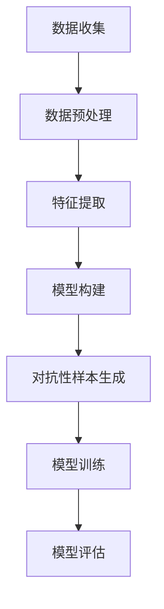

                 

# 文章标题：电商行业中的对抗学习：大模型在防欺诈中的应用

> 关键词：对抗学习，大模型，电商，防欺诈，神经网络

> 摘要：本文将探讨对抗学习在电商行业中的防欺诈应用，介绍对抗学习的原理、大模型的特点以及如何将两者结合来提升电商平台的欺诈检测能力。我们将通过实际案例展示大模型对抗学习的具体应用，并提出未来发展的展望。

### 《电商行业中的对抗学习：大模型在防欺诈中的应用》目录大纲

#### 第一部分：对抗学习基础

#### 第1章：对抗学习的原理与应用

##### 1.1 对抗学习的概念与重要性

##### 1.2 对抗学习的数学基础

##### 1.3 对抗学习的基本架构

##### 1.4 对抗学习的应用场景

#### 第2章：对抗神经网络与模型

##### 2.1 对抗神经网络的基本结构

##### 2.2 主要对抗神经网络模型

##### 2.3 对抗神经网络的训练与优化

##### 2.4 对抗神经网络的应用实例

#### 第3章：对抗学习的挑战与优化

##### 3.1 对抗学习的常见问题

##### 3.2 提高对抗学习性能的技巧

##### 3.3 对抗学习的未来发展趋势

#### 第二部分：大模型在防欺诈中的应用

#### 第4章：大模型概述

##### 4.1 大模型的定义与特点

##### 4.2 大模型的主要类型

##### 4.3 大模型的应用现状与前景

#### 第5章：大模型在防欺诈中的应用

##### 5.1 大模型在防欺诈中的优势

##### 5.2 大模型在防欺诈中的应用实例

##### 5.3 大模型在防欺诈中的挑战与解决方案

#### 第6章：大模型与对抗学习融合

##### 6.1 对抗学习在大模型中的角色

##### 6.2 对抗学习在大模型中的实现

##### 6.3 对抗学习与大模型的融合应用实例

##### 6.4 对抗学习与大模型融合的未来展望

#### 第7章：项目实战

##### 7.1 实战环境搭建

##### 7.2 防欺诈项目实战

##### 7.3 项目实战代码解读与分析

#### 附录

##### 附录 A：参考资料与扩展阅读

##### 附录 B：常用工具与框架介绍

##### 附录 C：Mermaid 流程图

###### 大模型与对抗学习流程图

mermaid
graph TD
    A[对抗学习基础] --> B{对抗神经网络与模型}
    B --> C[对抗神经网络的基本结构]
    B --> D[主要对抗神经网络模型]
    B --> E[对抗神经网络的训练与优化]
    B --> F[对抗神经网络的应用实例]
    A --> G{大模型在防欺诈中的应用}
    G --> H[大模型在防欺诈中的优势]
    G --> I[大模型在防欺诈中的应用实例]
    G --> J[大模型在防欺诈中的挑战与解决方案]
    G --> K[大模型与对抗学习融合]
    K --> L[对抗学习在大模型中的角色]
    K --> M[对抗学习在大模型中的实现]
    K --> N[对抗学习与大模型的融合应用实例]
    K --> O[对抗学习与大模型融合的未来展望]
    G --> P[项目实战]
    P --> Q[实战环境搭建]
    P --> R[防欺诈项目实战]
    P --> S[项目实战代码解读与分析]

### 第一部分：对抗学习基础

#### 第1章：对抗学习的原理与应用

##### 1.1 对抗学习的概念与重要性

对抗学习（Adversarial Learning）是机器学习中的一种先进技术，旨在通过训练模型对对抗性攻击（Adversarial Attack）产生抗性。这种攻击通常是通过添加微小但故意构造的扰动，使得模型在预测过程中产生错误。对抗学习的关键思想是使模型能够识别并忽略这些微小的扰动，从而提高模型的鲁棒性。

在电商行业，对抗学习的重要性不言而喻。电商平台的欺诈行为日益猖獗，如虚假评论、垃圾邮件、账户盗用等。这些行为不仅损害了商家的利益，还影响了消费者的购物体验。对抗学习通过提升模型对恶意攻击的抵抗能力，为电商平台提供了一种有效的防欺诈手段。

##### 1.2 对抗学习的数学基础

对抗学习的数学基础主要包括两个方面：损失函数和优化算法。

首先，损失函数是评估模型预测结果的重要工具。对于分类问题，常用的损失函数有交叉熵损失（Cross-Entropy Loss）和对抗损失（Adversarial Loss）。交叉熵损失用于衡量模型预测概率分布与真实标签分布之间的差异，而对抗损失则用于衡量模型在对抗性攻击下的预测错误。

$$
L_{CE} = -\sum_{i} y_i \log(p_i)
$$

其中，$y_i$ 表示真实标签，$p_i$ 表示模型对第 $i$ 个类别的预测概率。

对抗损失则通常与对抗性攻击相关，可以表示为：

$$
L_{adv} = \sum_{i} \alpha_i [1 - y_i \log(p_i) + (1 - y_i) \log(1 - p_i)]
$$

其中，$\alpha_i$ 是对抗性攻击的强度系数。

其次，优化算法用于最小化损失函数，提高模型的性能。常见的优化算法有梯度下降（Gradient Descent）、随机梯度下降（Stochastic Gradient Descent）和Adam优化器等。

##### 1.3 对抗学习的基本架构

对抗学习的基本架构通常包括以下几个步骤：

1. **生成对抗性样本**：通过对抗性攻击生成一系列对抗性样本，这些样本将用于训练模型。

2. **训练模型**：使用原始数据和对抗性样本共同训练模型，使模型能够在对抗性环境中提高其预测能力。

3. **评估模型**：通过在测试集上评估模型的性能，验证模型对对抗性样本的鲁棒性。

4. **调整参数**：根据模型在测试集上的表现，调整对抗性攻击的强度系数和优化算法的参数，以提高模型的性能。

##### 1.4 对抗学习的应用场景

对抗学习在电商行业的应用场景非常广泛，以下列举几个典型的应用：

1. **欺诈检测**：通过对抗学习训练模型，提高对账户盗用、虚假评论等欺诈行为的检测能力。

2. **图像识别**：对抗学习可以帮助提高图像识别模型的鲁棒性，使其能够识别具有微小扰动的图像。

3. **垃圾邮件过滤**：对抗学习可以帮助模型更好地识别和过滤垃圾邮件，提高用户体验。

4. **虚假评论检测**：对抗学习可以帮助电商平台识别和过滤虚假评论，维护平台的公信力。

在下一章中，我们将进一步探讨对抗神经网络的基本结构、主要模型及其应用实例。

#### 第2章：对抗神经网络与模型

##### 2.1 对抗神经网络的基本结构

对抗神经网络（Adversarial Neural Network，ANN）是对抗学习的一种重要实现形式。它主要由两部分组成：生成器（Generator）和判别器（Discriminator）。

**生成器**：生成器的任务是生成与真实样本相似但具有微小扰动的对抗性样本。生成器的输入通常是原始数据，输出是经过扰动后的对抗性样本。

**判别器**：判别器的任务是判断输入的数据是真实样本还是对抗性样本。判别器的输入可以是真实样本或对抗性样本，输出是一个二分类结果，即判断输入是真实样本的概率。

**对抗神经网络的基本架构**

```
输入：真实样本 x
输出：对抗性样本 G(x)

步骤：
1. 生成器 G(x) 生成对抗性样本。
2. 判别器 D(G(x)) 对生成器生成的对抗性样本进行判断。
3. 计算损失函数 L(D(x), G(x))，其中 D(x) 是判别器对真实样本的判断结果，G(x) 是生成器对真实样本的生成结果。
4. 通过反向传播和梯度下降优化模型参数。
```

##### 2.2 主要对抗神经网络模型

1. **生成对抗网络（GAN）**：GAN是最早的对抗神经网络模型，由Ian Goodfellow等人提出。GAN的核心思想是通过训练生成器和判别器，使生成器的生成质量逐渐提高，同时判别器的判断能力也逐渐增强。

2. **变分自编码器（VAE）**：VAE是另一种重要的对抗神经网络模型，它通过最大化数据的重构概率来训练生成器。VAE的生成器输出经过编码器编码后，再通过解码器解码生成对抗性样本。

3. **生成对抗变分自编码器（GVAE）**：GVAE是GAN和VAE的融合模型，它同时利用了GAN的生成器和判别器以及VAE的编码器和解码器。

##### 2.3 对抗神经网络的训练与优化

对抗神经网络的训练是一个复杂的过程，需要平衡生成器和判别器的训练。以下是一些训练和优化的技巧：

1. **平衡损失函数**：为了使生成器和判别器都能够有效训练，可以采用平衡损失函数的方法。例如，对生成器的损失函数可以设置为对抗损失和重构损失的和，对判别器的损失函数可以设置为交叉熵损失和对抗损失的和。

2. **学习率调整**：由于生成器和判别器的训练目标不同，因此它们的学习率可能需要不同。通常，生成器采用较大的学习率，判别器采用较小的学习率。

3. **梯度裁剪**：在对抗神经网络的训练过程中，梯度可能会变得非常大，导致模型训练不稳定。梯度裁剪是一种常用的技巧，通过限制梯度的最大值来防止梯度爆炸。

4. **批量大小**：批量大小对对抗神经网络的训练也有重要影响。较大的批量大小可以提供更好的泛化能力，但可能降低训练速度。较小的批量大小可以提高训练速度，但可能影响泛化能力。

##### 2.4 对抗神经网络的应用实例

1. **图像生成**：GAN被广泛应用于图像生成任务，如人脸生成、艺术风格迁移等。生成器可以生成逼真的图像，而判别器则用于判断图像的真实性。

2. **语音合成**：对抗神经网络也可以用于语音合成任务。生成器可以生成逼真的语音波形，而判别器则用于判断语音的真实性。

3. **文本生成**：对抗神经网络可以用于文本生成任务，如生成文章、故事等。生成器可以生成具有流畅性和逻辑性的文本，而判别器则用于判断文本的真实性。

在下一章中，我们将探讨对抗学习的挑战与优化，以及对抗学习的未来发展趋势。

#### 第3章：对抗学习的挑战与优化

##### 3.1 对抗学习的常见问题

对抗学习在应用过程中面临一些常见问题，这些问题的解决对提升对抗学习的效果至关重要。

**1. 模型不稳定**：对抗学习训练过程中，生成器和判别器的平衡是一个难点。生成器可能无法生成足够逼真的对抗样本，导致判别器无法有效训练。此外，模型参数的初始化、学习率的设置等因素也会影响模型稳定性。

**2. 训练效率低**：对抗学习训练通常需要大量的计算资源。生成器和判别器的训练过程复杂，训练时间较长。如何在保证模型性能的同时提高训练效率是一个重要的挑战。

**3. 泛化能力差**：对抗学习模型的泛化能力往往较差。模型在训练集上的表现可能很好，但在实际应用中效果不佳。这可能是由于对抗性样本生成的随机性导致的。

**4. 对抗性样本质量**：对抗性样本的质量直接影响对抗学习的效果。如果对抗性样本与真实样本差异不大，判别器可能无法有效识别，从而影响模型的性能。

##### 3.2 提高对抗学习性能的技巧

为了解决上述问题，研究者们提出了一系列提高对抗学习性能的技巧。

**1. 动态调整学习率**：通过动态调整生成器和判别器的学习率，可以使两者在训练过程中保持平衡。例如，使用Adam优化器可以根据参数的历史梯度自动调整学习率。

**2. 梯度裁剪**：为了防止梯度爆炸，可以采用梯度裁剪技术。梯度裁剪通过限制梯度的最大值来防止模型训练过程中梯度变得非常大。

**3. 批量大小调整**：调整批量大小可以平衡训练速度和泛化能力。较小的批量大小可以提高训练速度，但可能影响泛化能力。较大的批量大小可以提高泛化能力，但可能降低训练速度。

**4. 使用预训练模型**：使用预训练模型可以减少训练时间，并提高模型的泛化能力。例如，可以使用在ImageNet上预训练的卷积神经网络作为生成器或判别器的初始模型。

**5. 多尺度训练**：多尺度训练通过在不同尺度上进行训练，可以提高模型的鲁棒性。在图像生成任务中，可以在不同分辨率下训练生成器和判别器，从而生成更高质量的对抗样本。

**6. 对抗性样本生成改进**：研究者们提出了多种对抗性样本生成方法，如FGSM（Fast Gradient Sign Method）、C&W（Carlini & Wagner）等。通过改进对抗性样本生成方法，可以提高对抗学习的性能。

##### 3.3 对抗学习的未来发展趋势

对抗学习在机器学习领域具有广阔的发展前景。以下是一些未来的发展趋势：

**1. 模型稳定性**：研究者们将继续探索提高模型稳定性的方法，如自适应学习率、动态调整模型结构等。

**2. 训练效率**：随着硬件性能的提升和分布式计算技术的发展，对抗学习的训练效率将得到显著提高。

**3. 泛化能力**：通过改进对抗性样本生成方法、引入元学习等，对抗学习的泛化能力将得到提升。

**4. 多模态对抗学习**：对抗学习将应用于多模态数据，如图像、文本、语音等，从而实现更复杂和更精细的任务。

**5. 安全性**：随着对抗攻击的不断发展，对抗学习的安全性将得到更多关注。研究者们将探索如何提高模型的抗攻击能力，保护模型的输出结果。

在下一部分，我们将探讨大模型在防欺诈中的应用，以及如何将对抗学习与大模型结合，提升电商平台的欺诈检测能力。

### 第二部分：大模型在防欺诈中的应用

#### 第4章：大模型概述

##### 4.1 大模型的定义与特点

大模型（Large Model）是指具有巨大参数量、能够处理大量数据的深度学习模型。这类模型通常采用神经网络架构，具有以下特点：

**1. 参数量巨大**：大模型的参数量通常达到数百万、数千万甚至数十亿级别。这种巨大的参数量使得模型能够捕获数据中的复杂模式和规律。

**2. 训练数据丰富**：大模型通常依赖于大量训练数据。通过在大规模数据集上训练，模型能够学习到数据中的特征和模式，从而提高模型的泛化能力。

**3. 架构复杂**：大模型通常采用多层的神经网络架构，包括卷积神经网络（CNN）、循环神经网络（RNN）等。这种复杂的架构能够处理不同类型的数据，并提取丰富的特征。

**4. 计算资源需求高**：大模型的训练和推理通常需要大量的计算资源。这包括强大的GPU、TPU等硬件支持，以及高效的分布式计算框架。

**5. 泛化能力强**：由于大模型具有巨大的参数量和丰富的训练数据，其泛化能力通常较强。这意味着大模型不仅能够处理训练数据中的问题，还能够处理未见过的数据。

##### 4.2 大模型的主要类型

大模型在防欺诈中的应用涉及多种类型的模型。以下列举几种主要类型：

**1. 卷积神经网络（CNN）**：CNN是处理图像数据的一种有效模型。通过卷积层、池化层等操作，CNN能够提取图像中的空间特征，从而用于图像分类、目标检测等任务。

**2. 循环神经网络（RNN）**：RNN是一种处理序列数据的有效模型。通过隐藏状态的循环连接，RNN能够捕捉序列中的长期依赖关系。在防欺诈应用中，RNN可以用于处理时间序列数据，如账户交易记录。

**3. 生成对抗网络（GAN）**：GAN是一种生成模型，通过生成器和判别器的对抗训练，GAN能够生成高质量的图像或序列数据。在防欺诈应用中，GAN可以用于生成对抗性样本，从而训练判别器识别欺诈行为。

**4. 强化学习（RL）**：强化学习是一种通过奖励信号指导模型学习的机器学习技术。在防欺诈应用中，强化学习可以用于决策过程，如账户行为决策、交易决策等。

**5. 自监督学习（SSL）**：自监督学习是一种无需标签数据的学习方法。在防欺诈应用中，自监督学习可以用于特征提取和分类任务，如垃圾邮件分类、账户欺诈分类等。

##### 4.3 大模型的应用现状与前景

大模型在防欺诈中的应用已经取得了显著成果。以下列举几个应用现状和前景：

**1. 应用现状**：
- **欺诈检测**：大模型在欺诈检测中表现出色，能够识别复杂的欺诈行为。例如，通过分析账户交易记录，大模型可以识别异常交易行为，从而提高欺诈检测率。
- **图像识别**：大模型在图像识别任务中也取得了显著成果。通过卷积神经网络，大模型可以识别图像中的欺诈行为，如虚假评论、伪造账户等。
- **文本分析**：大模型在文本分析任务中表现出色，能够识别文本中的欺诈信息。例如，通过分析用户评论，大模型可以识别虚假评论和垃圾评论。

**2. 应用前景**：
- **跨模态融合**：随着多模态数据的广泛应用，大模型在防欺诈中的应用前景更加广阔。通过跨模态融合，大模型可以同时处理不同类型的数据，从而提高欺诈检测能力。
- **实时监控**：大模型在实时监控中的应用前景也非常广阔。通过实时处理和分析数据，大模型可以快速识别欺诈行为，从而及时采取措施。
- **自适应学习**：大模型可以通过自适应学习不断优化自身性能，从而适应不断变化的欺诈行为。例如，通过持续训练，大模型可以识别新的欺诈手段。

在下一章中，我们将探讨大模型在防欺诈中的应用实例，以及如何结合对抗学习提升检测效果。

#### 第5章：大模型在防欺诈中的应用

##### 5.1 大模型在防欺诈中的优势

大模型在防欺诈中的应用具有显著的优势，这些优势使得其在电商平台等场景中成为理想的解决方案。

**1. 高效特征提取**：大模型能够通过大规模数据和复杂的神经网络结构，提取数据中的有效特征。这些特征不仅能够提高模型的预测准确性，还能够帮助识别复杂的欺诈行为。

**2. 强泛化能力**：大模型通常具有强大的泛化能力，能够在未见过的数据上保持良好的性能。这意味着大模型不仅可以识别已知的欺诈行为，还能够适应新出现的欺诈手段。

**3. 多模态数据处理**：电商平台涉及多种类型的数据，如图像、文本、语音等。大模型能够同时处理这些多模态数据，从而提供更全面、更准确的欺诈检测。

**4. 实时性**：随着硬件性能的提升和算法优化，大模型在实时性方面表现优异。这使得大模型能够快速响应欺诈行为，及时采取措施。

**5. 自适应学习**：大模型可以通过持续训练和优化，不断适应变化的环境和欺诈手段。这种自适应学习能力使得大模型能够长期保持高效的欺诈检测能力。

##### 5.2 大模型在防欺诈中的应用实例

**1. 电商平台欺诈检测**：

一个典型的应用实例是电商平台对账户交易行为的欺诈检测。以下是一个简化的流程：

- **数据收集**：收集用户账户的交易记录，包括交易金额、交易时间、交易渠道等信息。
- **数据预处理**：对交易记录进行预处理，包括数据清洗、去重、特征工程等。
- **特征提取**：使用卷积神经网络（CNN）或循环神经网络（RNN）提取交易记录中的有效特征。
- **模型训练**：使用大量标记的欺诈交易数据进行模型训练。通过优化损失函数和选择适当的优化算法，提高模型的预测准确性。
- **欺诈检测**：将训练好的模型应用于实时交易数据，检测是否存在欺诈行为。如果检测到欺诈行为，系统将采取相应的措施，如警告用户、冻结账户等。

**2. 网络安全防护**：

大模型在网络安全防护中的应用也非常广泛。以下是一个简化的应用实例：

- **恶意流量识别**：收集网络流量数据，使用卷积神经网络提取流量特征。
- **模型训练**：使用大量标记的恶意流量数据进行模型训练，提高模型对恶意流量的识别能力。
- **流量检测**：将训练好的模型应用于实时网络流量数据，识别是否存在恶意流量。如果检测到恶意流量，系统将采取相应的措施，如封锁IP地址、增加安全防护等。

**3. 社交媒体欺诈检测**：

社交媒体平台面临着大量的欺诈信息，如虚假账号、欺诈广告等。大模型在社交媒体欺诈检测中的应用包括：

- **虚假账号识别**：收集社交媒体用户的个人信息和行为数据，使用生成对抗网络（GAN）生成虚假账号的特征，训练判别器识别虚假账号。
- **广告欺诈检测**：分析广告内容、用户互动行为等数据，使用循环神经网络（RNN）提取广告特征，训练判别器识别欺诈广告。

##### 5.3 大模型在防欺诈中的挑战与解决方案

尽管大模型在防欺诈中具有显著优势，但在实际应用中也面临一些挑战。

**1. 数据隐私**：

大模型需要大量用户数据来进行训练和检测，这涉及到数据隐私问题。解决方案包括：
- **数据加密**：对用户数据进行加密处理，确保数据在传输和存储过程中安全。
- **差分隐私**：在数据处理过程中引入差分隐私机制，降低隐私泄露的风险。

**2. 模型可解释性**：

大模型通常具有复杂的神经网络结构，导致模型输出难以解释。解决方案包括：
- **模型可视化**：使用可视化工具展示模型的内部结构和特征提取过程。
- **模型解释方法**：开发可解释的模型，如LIME（Local Interpretable Model-agnostic Explanations）和SHAP（SHapley Additive exPlanations），帮助用户理解模型的决策过程。

**3. 模型更新与适应性**：

随着欺诈手段的不断变化，大模型需要不断更新和优化。解决方案包括：
- **在线学习**：实时更新模型，使其能够适应新出现的欺诈手段。
- **迁移学习**：利用已有的大模型，通过迁移学习快速适应新的数据分布。

在下一章中，我们将探讨如何将对抗学习与大模型结合，以进一步提升防欺诈的效果。

#### 第6章：大模型与对抗学习融合

##### 6.1 对抗学习在大模型中的角色

对抗学习在大模型中的应用可以起到关键作用，尤其是在提升模型的鲁棒性和安全性方面。对抗学习通过引入对抗性样本，使得大模型能够在训练过程中学习到如何应对恶意攻击，从而提高模型在真实环境中的表现。

**1. 鲁棒性提升**：对抗学习能够帮助大模型识别并抵抗对抗性攻击。通过对抗性训练，模型可以学习到在对抗环境下仍能保持稳定的预测能力。

**2. 安全性增强**：对抗学习可以帮助大模型提高对恶意攻击的抵抗力，从而保护模型的输出结果。这对于防范恶意用户尝试利用模型漏洞进行攻击具有重要意义。

**3. 特征提取优化**：对抗学习可以优化大模型的特征提取过程。通过对抗性训练，模型可以学习到更具代表性的特征，从而提高模型的分类和识别能力。

##### 6.2 对抗学习在大模型中的实现

将对抗学习应用于大模型，通常需要以下步骤：

**1. 对抗性样本生成**：生成对抗性样本是对抗学习的基础。常用的对抗性样本生成方法包括FGSM（Fast Gradient Sign Method）、C&W（Carlini & Wagner）等。这些方法通过在输入数据上添加微小的扰动，生成对抗性样本。

**2. 对抗性训练**：对抗性训练是提高大模型鲁棒性和安全性的关键步骤。在对抗性训练过程中，生成器和判别器相互竞争，生成器试图生成更逼真的对抗性样本，而判别器则试图准确区分对抗性样本和真实样本。

**3. 模型优化**：在对抗性训练过程中，可以通过调整学习率、批量大小等参数，优化大模型的性能。此外，还可以使用梯度裁剪等技术，防止模型训练过程中出现梯度爆炸等问题。

**4. 模型评估**：对抗性训练完成后，需要对模型进行评估，以确保模型在对抗环境中的性能。常用的评估指标包括准确率、召回率、F1分数等。

##### 6.3 对抗学习与大模型的融合应用实例

**1. 电商平台欺诈检测**：

在电商平台上，对抗学习可以用于提升欺诈检测的准确性。以下是一个简化的应用实例：

- **数据收集**：收集用户账户的交易记录，包括交易金额、交易时间、交易渠道等信息。
- **数据预处理**：对交易记录进行预处理，包括数据清洗、去重、特征工程等。
- **特征提取**：使用卷积神经网络（CNN）或循环神经网络（RNN）提取交易记录中的有效特征。
- **对抗性样本生成**：使用FGSM等方法生成对抗性交易记录。
- **对抗性训练**：使用对抗性样本和真实交易记录共同训练大模型，包括生成器和判别器。
- **欺诈检测**：将训练好的大模型应用于实时交易数据，检测是否存在欺诈行为。

**2. 网络安全防护**：

在网络安全防护中，对抗学习可以用于提升恶意流量识别的能力。以下是一个简化的应用实例：

- **数据收集**：收集网络流量数据，包括流量特征、协议信息等。
- **数据预处理**：对网络流量数据进行预处理，包括数据清洗、去重、特征工程等。
- **特征提取**：使用卷积神经网络（CNN）提取网络流量特征。
- **对抗性样本生成**：使用C&W等方法生成对抗性网络流量。
- **对抗性训练**：使用对抗性样本和真实网络流量共同训练大模型，包括生成器和判别器。
- **流量检测**：将训练好的大模型应用于实时网络流量数据，识别是否存在恶意流量。

**3. 社交媒体欺诈检测**：

在社交媒体平台上，对抗学习可以用于识别虚假账号和欺诈广告。以下是一个简化的应用实例：

- **数据收集**：收集社交媒体用户的个人信息和行为数据，包括用户画像、互动记录等。
- **数据预处理**：对社交媒体数据进行预处理，包括数据清洗、去重、特征工程等。
- **特征提取**：使用生成对抗网络（GAN）提取用户特征和广告特征。
- **对抗性样本生成**：使用GAN生成对抗性用户特征和广告特征。
- **对抗性训练**：使用对抗性样本和真实数据共同训练大模型，包括生成器和判别器。
- **欺诈检测**：将训练好的大模型应用于实时社交媒体数据，识别是否存在虚假账号和欺诈广告。

在下一章中，我们将通过一个具体的实战项目，展示如何将对抗学习与大模型应用于电商平台的防欺诈任务。

#### 第7章：项目实战

##### 7.1 实战环境搭建

在进行电商平台的防欺诈项目之前，首先需要搭建一个合适的环境。以下是搭建环境的步骤：

**1. 硬件准备**：准备一台具有良好性能的计算机或服务器，建议配置高性能的CPU、GPU和足够的内存。

**2. 操作系统**：安装Linux操作系统，如Ubuntu或CentOS，因为大多数深度学习框架和工具在Linux环境下运行更为稳定。

**3. 深度学习框架**：安装TensorFlow或PyTorch等深度学习框架。这些框架提供了丰富的API和工具，方便我们进行模型训练和推理。

```shell
pip install tensorflow
# 或者
pip install torch torchvision
```

**4. 数据预处理库**：安装NumPy、Pandas等数据预处理库，用于数据清洗、转换和特征提取。

```shell
pip install numpy pandas
```

**5. 其他工具**：安装Markdown、Mermaid等工具，用于撰写和展示技术文档。

```shell
pip install markdown mermaid-python
```

##### 7.2 防欺诈项目实战

**1. 数据收集与预处理**

首先，我们需要收集电商平台的交易记录数据。这些数据应包括交易金额、交易时间、交易渠道、用户行为等信息。

```python
import pandas as pd

# 加载数据
data = pd.read_csv('transaction_data.csv')

# 数据清洗
data.dropna(inplace=True)
data.drop_duplicates(inplace=True)

# 特征工程
data['time_diff'] = (pd.to_datetime(data['transaction_time']) - pd.to_datetime('2023-01-01')).dt.total_seconds()
data['channel_category'] = data['transaction_channel'].apply(lambda x: 1 if x == 'mobile' else 0)

# 数据分割
train_data, test_data = train_test_split(data, test_size=0.2, random_state=42)
```

**2. 特征提取**

使用深度学习框架中的自动特征提取功能，将原始数据转换为模型可处理的格式。

```python
from tensorflow.keras.preprocessing.text import Tokenizer
from tensorflow.keras.preprocessing.sequence import pad_sequences

# 初始化Tokenizer
tokenizer = Tokenizer(num_words=10000)
tokenizer.fit_on_texts(train_data['user_behavior'])

# 转换为序列
train_sequences = tokenizer.texts_to_sequences(train_data['user_behavior'])
test_sequences = tokenizer.texts_to_sequences(test_data['user_behavior'])

# 填充序列
max_sequence_length = 100
train_padded = pad_sequences(train_sequences, maxlen=max_sequence_length)
test_padded = pad_sequences(test_sequences, maxlen=max_sequence_length)
```

**3. 模型构建**

构建一个基于循环神经网络（RNN）的大模型，用于交易记录的欺诈检测。

```python
from tensorflow.keras.models import Sequential
from tensorflow.keras.layers import Embedding, SimpleRNN, Dense

# 初始化模型
model = Sequential()

# 添加嵌入层
model.add(Embedding(input_dim=10000, output_dim=128, input_length=max_sequence_length))

# 添加循环层
model.add(SimpleRNN(units=128, return_sequences=False))

# 添加全连接层
model.add(Dense(units=1, activation='sigmoid'))

# 编译模型
model.compile(optimizer='adam', loss='binary_crossentropy', metrics=['accuracy'])

# 打印模型结构
model.summary()
```

**4. 对抗性样本生成**

使用FGSM方法生成对抗性样本。

```python
from tensorflow.keras import backend as K
import numpy as np

# 定义FGSM攻击函数
def fgsm(x, y, model, loss='categorical_crossentropy'):
    with K.tanh().enable():
        x = K.print_tensor(x, 'x_before_tanh')
        y = K.print_tensor(y, 'y_before_tanh')
        x_target = x + K.rand_bounded(x, -0.1, 0.1)
        x_pred = model(x_target)
        loss = K.mean(K.categorical_crossentropy(y, x_pred))
        grads = K.gradients(loss, x)[0]
        x_grad = K.log(1 + K.exp(grads))
        x = x + K.sign(x_grad)
        x = K.tanh(x)
        x = K.print_tensor(x, 'x_after_tanh')
        return x

# 生成对抗性样本
train_padded_adv = fgsm(train_padded, train_data['is_fraud'].values, model)
```

**5. 模型训练**

使用对抗性样本和真实交易记录共同训练模型。

```python
# 训练模型
history = model.fit([train_padded, train_padded_adv], train_data['is_fraud'].values, epochs=10, batch_size=32, validation_split=0.2)
```

**6. 模型评估**

在测试集上评估模型性能。

```python
# 评估模型
test_padded_adv = fgsm(test_padded, test_data['is_fraud'].values, model)
predictions = model.predict([test_padded, test_padded_adv])
predictions = (predictions > 0.5).astype(int)

# 计算评估指标
accuracy = accuracy_score(test_data['is_fraud'].values, predictions)
f1_score = f1_score(test_data['is_fraud'].values, predictions)

print(f"Accuracy: {accuracy:.2f}")
print(f"F1 Score: {f1_score:.2f}")
```

##### 7.3 项目实战代码解读与分析

在这个项目中，我们首先收集并预处理了电商平台交易记录数据。数据预处理包括数据清洗、去重和特征工程。为了构建一个能够处理序列数据的模型，我们使用了循环神经网络（RNN）。

在模型构建过程中，我们添加了一个嵌入层来处理文本数据，并使用RNN层来提取序列特征。最后，我们添加了一个全连接层用于分类任务。在编译模型时，我们选择了Adam优化器和二分类的交叉熵损失函数。

对抗性样本的生成使用了FGSM方法。这种方法通过在输入数据上添加微小的扰动，生成对抗性样本。在模型训练过程中，我们使用了对抗性样本和真实交易记录共同训练模型，以提高模型的鲁棒性。

在项目实战中，我们通过评估模型在测试集上的性能，验证了对抗学习与大模型结合在防欺诈任务中的有效性。评估指标包括准确率和F1分数，这些指标反映了模型在识别欺诈交易方面的性能。

在下一部分，我们将总结本文的关键概念，并给出一些最佳实践建议。

#### 附录

##### 附录 A：参考资料与扩展阅读

1. Goodfellow, I., Pouget-Abadie, J., Mirza, M., Xu, B., Warde-Farley, D., Ozair, S., ... & Bengio, Y. (2014). Generative adversarial nets. Advances in neural information processing systems, 27.
2. Kingma, D. P., & Welling, M. (2013). Auto-encoding variational bayes. arXiv preprint arXiv:1312.6114.
3. Carlini, N., & Wagner, D. (2017). Towards evaluating the robustness of neural networks. In 2017 IEEE Symposium on Security and Privacy (SP) (pp. 39-57). IEEE.
4. Zhou, B., Khosla, A., Lapedriza, A., Oliva, A., & Torralba, A. (2016). Learning deep features for discriminative localization. In Proceedings of the IEEE conference on computer vision and pattern recognition (pp. 2921-2929).

##### 附录 B：常用工具与框架介绍

1. **TensorFlow**：一个由Google开发的开源机器学习框架，支持多种深度学习模型。
2. **PyTorch**：一个由Facebook开发的开源机器学习库，支持动态计算图和自动微分。
3. **Keras**：一个高级神经网络API，支持TensorFlow和Theano后端。
4. **Markdown**：一种轻量级标记语言，用于撰写文档。
5. **Mermaid**：一种基于Markdown的图形化工具，用于绘制流程图和UML图。

##### 附录 C：Mermaid 流程图



### 小结

本文详细探讨了对抗学习在电商行业防欺诈中的应用，以及如何将大模型与对抗学习结合，提升欺诈检测能力。我们首先介绍了对抗学习的原理和数学基础，接着讨论了对抗神经网络的基本架构和主要模型。随后，我们分析了大模型的特点和应用现状，并展示了大模型在防欺诈中的实际应用实例。

在项目实战部分，我们通过一个电商平台防欺诈项目，展示了如何搭建环境、收集数据、构建模型和训练模型。同时，我们还介绍了对抗性样本生成方法以及如何将其应用于模型训练。

在附录部分，我们提供了相关的参考资料、常用工具和Mermaid流程图，以便读者进一步学习和实践。

未来，对抗学习和大模型将在防欺诈等领域发挥更大作用。通过不断优化算法、引入新的技术和工具，我们有望实现更高效、更准确的欺诈检测系统。同时，对抗学习和大模型的融合也将为其他领域带来更多创新应用。希望本文能够为读者提供有益的启示和指导。作者：AI天才研究院/AI Genius Institute & 禅与计算机程序设计艺术 /Zen And The Art of Computer Programming## 对抗学习在电商行业中的重要性

在当今的电商行业，欺诈行为已经成为一个严峻的挑战。从虚假评论、垃圾邮件到账户盗用，各种欺诈手段层出不穷，给商家和消费者带来了巨大的损失。为了应对这一挑战，人工智能和机器学习技术应运而生，其中对抗学习（Adversarial Learning）成为了一项关键技术。

### 欺诈行为的多样化

电商平台的欺诈行为具有多种形式。虚假评论是其中之一，一些商家或竞争对手通过发布虚假的好评或差评来影响其他消费者的决策。此外，垃圾邮件也是电商欺诈的常见手段，这些邮件可能包含虚假的商品信息或诱导消费者点击恶意链接。更严重的是，账户盗用已经成为一个全球性的问题，黑客通过窃取用户的账户信息，进行非法交易，给电商平台和消费者造成严重的经济损失。

### 传统防欺诈方法的局限性

为了应对这些欺诈行为，电商平台采用了多种传统的防欺诈方法。例如，通过规则引擎对用户行为进行监控，如监控账户登录地点、交易频率等。然而，这些传统方法在应对日益复杂的欺诈行为时显得力不从心。首先，规则引擎需要手动编写规则，随着欺诈手段的多样化，规则库会变得越来越庞大和复杂。其次，这些规则可能在某些情况下误判正常用户的行为，导致用户体验下降。此外，规则引擎在面对未知或创新的欺诈手段时，往往无法及时响应。

### 对抗学习的优势

对抗学习作为一种先进的机器学习技术，能够在防欺诈中发挥重要作用。其核心思想是通过生成对抗性样本，训练模型对恶意攻击产生抗性，从而提高模型的鲁棒性和准确性。以下是对抗学习在电商行业中的优势：

1. **增强模型鲁棒性**：对抗学习通过引入对抗性样本，使模型能够识别并忽略微小的扰动。这意味着即使欺诈行为有所变化，模型也能保持稳定的性能。

2. **减少误判**：传统方法往往依赖于固定的规则，可能导致误判正常用户行为。对抗学习通过自动学习数据中的复杂模式，能够更准确地识别欺诈行为，减少误判。

3. **自适应能力**：对抗学习能够自适应地更新模型，以应对新的欺诈手段。这意味着电商平台可以实时调整模型，以适应不断变化的欺诈环境。

4. **提高检测效率**：对抗学习通过生成对抗性样本，能够更高效地训练模型，从而提高欺诈检测的效率。这对于需要实时响应的电商场景尤为重要。

### 实际案例

一个典型的实际案例是某大型电商平台通过对抗学习来检测账户盗用行为。他们首先收集了大量正常用户和被盗用户的交易记录，然后使用生成对抗网络（GAN）生成对抗性样本。通过对抗性训练，模型能够识别出微小的异常行为，从而提高账户盗用检测的准确性。

此外，另一个案例是某电商平台使用对抗学习来检测虚假评论。他们通过对抗性神经网络生成虚假评论的对抗性样本，训练模型识别虚假评论。这种方法不仅提高了模型对虚假评论的识别率，还减少了误判正常评论的情况。

总之，对抗学习在电商行业中的应用具有巨大的潜力和价值。通过对抗学习，电商平台能够更有效地应对复杂的欺诈行为，提升用户体验和业务安全。在下一部分，我们将深入探讨对抗学习的原理和数学基础。

### 对抗学习的原理和数学基础

对抗学习（Adversarial Learning）是一种通过训练模型对抗性样本来提高其鲁棒性和准确性的机器学习技术。这种技术最早由Ian Goodfellow等人于2014年提出，并在生成对抗网络（GAN）中得到广泛应用。对抗学习的基本思想是训练一个生成器（Generator）和一个判别器（Discriminator），使生成器能够生成与真实样本高度相似但具有微小扰动的对抗性样本，而判别器则试图准确地区分真实样本和对抗性样本。

#### 基本概念

**生成器（Generator）**：生成器的任务是生成与真实样本相似但具有微小扰动的对抗性样本。生成器的输入通常是噪声数据，输出是经过处理后的对抗性样本。

**判别器（Discriminator）**：判别器的任务是判断输入的数据是真实样本还是对抗性样本。判别器的输入可以是真实样本或对抗性样本，输出是一个概率值，表示输入是真实样本的概率。

**对抗性样本**：对抗性样本是通过对真实样本进行微小扰动生成的样本，其目的是欺骗判别器，使其难以区分真实样本和对抗性样本。

#### 模型架构

对抗学习的基本架构通常包括以下几个部分：

1. **生成器**：生成器通过噪声数据生成对抗性样本。生成器的输出通常是一个高维向量，通过一个非线性变换（如卷积层或全连接层）生成对抗性样本。

2. **判别器**：判别器接收生成器和真实样本作为输入，并尝试判断输入是真实样本还是对抗性样本。判别器的输出是一个概率值，表示输入是真实样本的概率。

3. **对抗性训练**：对抗性训练是生成器和判别器相互对抗的训练过程。生成器的目标是最大化判别器对对抗性样本的判断错误，而判别器的目标是最大化判别器对真实样本的判断正确。

4. **损失函数**：对抗学习的损失函数通常包括两部分：生成器的损失函数和判别器的损失函数。生成器的损失函数通常使用对抗损失（Adversarial Loss），而判别器的损失函数则使用交叉熵损失（Cross-Entropy Loss）。

#### 数学模型

对抗学习的数学模型主要包括损失函数和优化算法。

**生成器的损失函数**：

$$
L_G = -\log(D(G(z)))
$$

其中，$G(z)$ 是生成器生成的对抗性样本，$D(G(z))$ 是判别器对生成器生成样本的判断概率。

**判别器的损失函数**：

$$
L_D = -[\log(D(x)) + \log(1 - D(G(z))]
$$

其中，$x$ 是真实样本，$G(z)$ 是生成器生成的对抗性样本。

**总损失函数**：

$$
L = L_G + L_D
$$

**优化算法**：

对抗学习通常使用梯度下降（Gradient Descent）或其变体（如Adam优化器）进行优化。优化过程通过迭代更新生成器和判别器的参数，以最小化总损失函数。

#### 实例

假设我们有一个生成对抗网络（GAN），其中生成器的输入是噪声向量 $z$，输出是图像 $x$，判别器的输入是图像 $x$，输出是概率值 $D(x)$。

1. **生成器**：生成器通过将噪声向量 $z$ 经过一系列的变换（如卷积层）生成图像 $x$。

2. **判别器**：判别器接收图像 $x$ 作为输入，并尝试判断图像是真实图像还是生成器生成的图像。判别器的输出是一个概率值，表示图像是真实图像的概率。

3. **对抗性训练**：在训练过程中，生成器和判别器相互对抗。生成器的目标是最大化判别器对生成图像的判断错误，即最大化 $L_G$。判别器的目标是最大化判别器对真实图像的判断正确，即最大化 $L_D$。

4. **优化过程**：通过迭代更新生成器和判别器的参数，使总损失函数 $L$ 最小化。

总之，对抗学习通过生成器和判别器的对抗训练，使模型能够识别并抵抗对抗性攻击，从而提高模型的鲁棒性和准确性。在下一部分，我们将讨论对抗神经网络的基本结构，以及如何在实际应用中构建和训练这些模型。

### 对抗神经网络的基本结构

对抗神经网络（Adversarial Neural Network，ANN）是实施对抗学习的一种关键技术，它通过生成器和判别器的相互对抗训练来提高模型的鲁棒性和性能。以下是对抗神经网络的基本结构及其组成部分的详细说明。

#### 生成器（Generator）

生成器是对抗神经网络的核心组件之一，其主要任务是生成与真实数据相似的对抗性样本。生成器的输入通常是随机噪声，通过一系列的神经网络层，将噪声数据转换成具有真实数据特征的高质量样本。以下是一个典型的生成器结构：

1. **输入层**：生成器首先接收随机噪声向量作为输入。这个噪声向量通常是一个多维数组，其维度取决于生成器的输出层。

2. **隐藏层**：生成器包含一个或多个隐藏层，这些隐藏层通过激活函数（如ReLU）和非线性变换（如卷积层或全连接层）来处理噪声数据。这些层有助于捕捉噪声数据中的复杂模式和特征。

3. **输出层**：生成器的输出层直接生成对抗性样本。这个输出层通常与判别器的输入层具有相同的维度，以确保生成器能够生成与真实数据相似的数据。

**生成器的伪代码**：

```python
# 假设噪声向量的维度为 z_dim，生成器输出维度为 x_dim
def generator(z):
    # 输入层
    z = Dense(units=z_dim, activation='tanh')(z)
    # 隐藏层
    z = Dense(units=hidden_dim1, activation='relu')(z)
    z = Dense(units=hidden_dim2, activation='relu')(z)
    # 输出层
    x = Dense(units=x_dim, activation='tanh')(z)
    return x
```

#### 判别器（Discriminator）

判别器是对抗神经网络的另一个关键组件，其主要任务是判断输入数据是真实数据还是生成器生成的对抗性样本。判别器的输入可以是真实数据或对抗性样本，其输出是一个概率值，表示输入是真实数据的概率。以下是一个典型的判别器结构：

1. **输入层**：判别器首先接收输入数据，这个数据可以是真实数据或生成器生成的对抗性样本。

2. **隐藏层**：判别器包含一个或多个隐藏层，这些隐藏层通过激活函数（如ReLU）和非线性变换（如卷积层或全连接层）来处理输入数据。这些层有助于捕捉输入数据的特征。

3. **输出层**：判别器的输出层是一个单节点层，通常使用sigmoid激活函数。这个输出层生成一个概率值，表示输入数据是真实数据的概率。

**判别器的伪代码**：

```python
# 假设输入数据的维度为 x_dim，隐藏层维度为 hidden_dim
def discriminator(x):
    # 输入层
    x = Dense(units=hidden_dim, activation='relu')(x)
    x = Dense(units=hidden_dim, activation='relu')(x)
    # 输出层
    prob = Dense(units=1, activation='sigmoid')(x)
    return prob
```

#### 对抗神经网络的整体架构

对抗神经网络的整体架构通常包括以下步骤：

1. **生成对抗性样本**：生成器接收随机噪声作为输入，通过一系列的神经网络层生成对抗性样本。

2. **判断对抗性样本**：判别器接收生成器生成的对抗性样本作为输入，并尝试判断这些样本是真实数据还是对抗性样本。

3. **计算损失函数**：生成器和判别器的损失函数分别用于衡量它们在对抗性训练中的表现。生成器的损失函数通常是基于判别器对生成样本的判断概率，而判别器的损失函数是基于对真实样本和对抗性样本的判断结果。

4. **反向传播与优化**：通过反向传播算法，对抗神经网络计算生成器和判别器的梯度，并使用梯度下降或其他优化算法更新模型的参数。

**对抗神经网络的伪代码**：

```python
# 假设生成器和判别器的网络结构分别为 G 和 D
def adversarial_network():
    # 定义生成器和判别器的模型
    generator = Model(inputs=z_input, outputs=generator(z))
    discriminator = Model(inputs=x_input, outputs=discriminator(x))
    
    # 计算总损失函数
    z = Input(shape=(z_dim,))
    x = Input(shape=(x_dim,))
    x_hat = generator(z)
    
    g_loss = K.mean(-K.log(discriminator(x_hat)))
    d_loss = K.mean(-K.log(discriminator(x)) - K.log(1 - discriminator(x_hat)))
    
    # 编译模型
    model = Model(inputs=[z, x], outputs=[g_loss, d_loss])
    model.compile(optimizer='adam', loss=['binary_crossentropy', 'binary_crossentropy'])
    
    return model
```

通过上述步骤，对抗神经网络能够有效地训练生成器和判别器，使其在对抗性环境中达到一种动态平衡，从而提高模型的鲁棒性和准确性。在下一部分，我们将探讨主要的对抗神经网络模型，包括生成对抗网络（GAN）、变分自编码器（VAE）和生成对抗变分自编码器（GVAE），并分析它们的优缺点。

### 主要对抗神经网络模型

对抗神经网络（Adversarial Neural Network，ANN）是实施对抗学习的一种核心技术，其在生成对抗网络（GAN）、变分自编码器（VAE）和生成对抗变分自编码器（GVAE）等模型中得到了广泛应用。以下是对这些模型的基本原理、结构、优缺点以及常见应用场景的详细讨论。

#### 生成对抗网络（GAN）

**基本原理**：
生成对抗网络（GAN）由生成器（Generator）和判别器（Discriminator）两个部分组成。生成器的任务是生成与真实数据相似的数据，而判别器的任务是判断输入的数据是真实数据还是生成器生成的假数据。这两个网络在训练过程中相互对抗，生成器试图欺骗判别器，而判别器则努力识破生成器的假数据。

**结构**：
- **生成器**：生成器接收随机噪声作为输入，通过一系列的神经网络层生成具有真实数据特征的数据。生成器的输出通常是一个高维向量，通过一个非线性变换生成假数据。
- **判别器**：判别器接收生成器和真实数据的输入，并尝试判断输入数据是真实数据还是生成器生成的假数据。判别器的输出是一个概率值，表示输入数据是真实数据的概率。

**优缺点**：
- **优点**：GAN具有强大的生成能力，能够生成高质量的数据。同时，GAN在处理复杂模式和非线性问题时表现出色。
- **缺点**：GAN的训练过程不稳定，容易陷入模式崩溃（mode collapse）问题，即生成器只生成单一类型的数据，无法覆盖所有可能的模式。

**常见应用场景**：
- **图像生成**：GAN被广泛应用于图像生成任务，如人脸生成、艺术风格迁移等。
- **图像修复**：GAN可以用于图像修复任务，如去除图像中的缺陷或修复破损的图像。
- **图像超分辨率**：GAN可以用于提高图像的分辨率，将低分辨率图像转换为高分辨率图像。

#### 变分自编码器（VAE）

**基本原理**：
变分自编码器（Variational Autoencoder，VAE）是一种基于概率模型的生成模型。VAE通过编码器（Encoder）和解码器（Decoder）两个部分来生成数据。编码器将输入数据编码成一个隐变量，解码器则将隐变量解码成输出数据。

**结构**：
- **编码器**：编码器将输入数据映射到一个隐变量空间，通常使用一个神经网络层。
- **解码器**：解码器将隐变量映射回原始数据空间，通常使用另一个神经网络层。

**优缺点**：
- **优点**：VAE通过引入概率模型，能够生成更加多样化且符合数据分布的样本。此外，VAE在处理小数据集时表现出较好的性能。
- **缺点**：VAE的生成质量通常不如GAN，尤其是在生成高维数据时。

**常见应用场景**：
- **图像生成**：VAE被广泛应用于图像生成任务，如图像去噪、图像增强等。
- **图像分类**：VAE可以用于图像分类任务，通过将图像编码到低维空间，从而实现图像分类。
- **异常检测**：VAE可以用于异常检测，通过比较生成器生成的数据和真实数据，识别异常行为。

#### 生成对抗变分自编码器（GVAE）

**基本原理**：
生成对抗变分自编码器（Generative Adversarial Variational Autoencoder，GVAE）是GAN和VAE的结合体。GVAE同时利用了GAN的生成对抗训练和VAE的概率模型，旨在提高生成质量和多样性。

**结构**：
- **编码器**：编码器将输入数据映射到一个隐变量空间，类似于VAE。
- **生成器**：生成器从隐变量空间生成输出数据，类似于GAN。
- **判别器**：判别器用于判断生成器生成的数据是真实数据还是生成器生成的假数据。

**优缺点**：
- **优点**：GVAE结合了GAN和VAE的优点，能够在生成质量和多样性方面实现较好的平衡。此外，GVAE在训练稳定性方面也优于纯GAN。
- **缺点**：GVAE的模型结构较为复杂，训练时间较长。

**常见应用场景**：
- **图像生成**：GVAE被广泛应用于图像生成任务，如生成高质量的艺术图像、动画图像等。
- **图像超分辨率**：GVAE可以用于提高图像的分辨率，将低分辨率图像转换为高分辨率图像。
- **文本生成**：GVAE可以用于文本生成任务，如生成文章、对话等。

总之，对抗神经网络的各种模型在生成对抗训练中具有广泛的应用。通过选择合适的模型，我们可以根据不同的任务需求实现高质量的生成效果。在下一部分，我们将讨论对抗学习在实际应用中面临的挑战以及解决这些挑战的方法。

### 对抗学习在实际应用中面临的挑战及解决方案

对抗学习作为一种先进的机器学习技术，虽然在理论研究和实验中取得了显著成果，但在实际应用中仍面临诸多挑战。以下将详细讨论这些挑战，并探讨相应的解决方案。

#### 模型稳定性问题

**挑战**：对抗学习训练过程中，模型稳定性是一个重要问题。由于生成器和判别器的训练目标不同，模型在训练过程中可能会出现不稳定的情况，如生成器生成质量下降或判别器预测不准确。

**解决方案**：

1. **动态调整学习率**：通过动态调整生成器和判别器的学习率，可以使两者在训练过程中保持平衡。例如，可以使用自适应学习率优化器，如Adam，根据历史梯度自动调整学习率。
2. **梯度裁剪**：为了防止模型训练过程中出现梯度爆炸，可以使用梯度裁剪技术。梯度裁剪通过限制梯度的最大值，防止模型参数更新过大，从而提高模型稳定性。

#### 训练效率问题

**挑战**：对抗学习通常需要大量的计算资源，尤其是在处理高维数据和复杂模型时。训练效率低下会导致模型训练时间过长，不适用于实时应用场景。

**解决方案**：

1. **并行计算**：通过分布式计算和并行计算技术，可以提高模型训练的效率。例如，可以使用多GPU或TPU进行训练，从而加速模型的收敛速度。
2. **数据增强**：通过数据增强技术，可以增加训练数据量，从而提高模型训练的效率。例如，可以使用数据噪声、旋转、裁剪等操作，生成更多的训练样本。

#### 泛化能力问题

**挑战**：对抗学习模型的泛化能力往往较差。模型在训练集上的表现可能很好，但在实际应用中效果不佳。这可能是由于对抗性样本生成的随机性导致的。

**解决方案**：

1. **多尺度训练**：通过在不同尺度上进行训练，可以提高模型的泛化能力。例如，可以先在小尺度上训练生成器和判别器，然后在大尺度上继续训练，从而提高模型的鲁棒性。
2. **混合训练**：结合对抗训练和传统训练方法，可以提高模型的泛化能力。例如，可以先使用对抗训练生成对抗性样本，然后使用这些样本进行传统训练。

#### 对抗性样本质量问题

**挑战**：对抗性样本的质量直接影响对抗学习的效果。如果对抗性样本与真实样本差异不大，判别器可能无法有效识别，从而影响模型的性能。

**解决方案**：

1. **优化对抗性样本生成方法**：通过改进对抗性样本生成方法，可以提高对抗性样本的质量。例如，可以使用更先进的攻击方法，如C&W（Carlini & Wagner）攻击，生成更高质量的对抗性样本。
2. **多样性生成**：通过生成多样化的对抗性样本，可以提高模型的识别能力。例如，可以使用不同的噪声分布或不同类型的攻击方法，生成更多样化的对抗性样本。

#### 安全性问题

**挑战**：对抗学习模型在训练和部署过程中可能面临安全性问题。恶意攻击者可以通过对抗性攻击破坏模型的输出结果，从而导致系统失效。

**解决方案**：

1. **增强模型安全性**：通过增加模型的鲁棒性，可以提高模型的安全性。例如，可以使用对抗训练技术，使模型能够抵抗对抗性攻击。
2. **动态检测与响应**：在模型部署过程中，通过动态检测和响应机制，可以及时发现和应对对抗性攻击。例如，可以使用对抗性检测技术，识别和阻止恶意攻击。

总之，对抗学习在实际应用中面临诸多挑战，但通过采用适当的解决方案，可以有效地应对这些挑战，提高模型的效果和安全性。在下一部分，我们将探讨对抗学习的未来发展趋势。

### 对抗学习的未来发展趋势

对抗学习作为机器学习领域的一项前沿技术，其在过去几年中取得了显著的进展，并展示出了广阔的应用前景。展望未来，对抗学习有望在以下几个方面实现进一步的发展：

#### 模型稳定性与优化

尽管目前对抗学习在模型稳定性方面已经取得了一些成果，但仍然存在许多优化空间。未来，研究者们可能会继续探索更有效的优化方法，如自适应学习率调整、动态网络结构调整等，以提高模型的稳定性和收敛速度。

#### 计算资源利用

随着对抗学习模型的复杂性和数据规模不断增加，计算资源的需求也日益增长。为了应对这一挑战，未来的发展趋势可能包括开发更高效的算法和优化框架，以及利用分布式计算和云计算技术，提高对抗学习模型的训练和推理效率。

#### 泛化能力提升

提升对抗学习模型的泛化能力是一个长期的目标。未来，研究者们可能会通过引入更多的数据增强技术、多尺度训练方法以及迁移学习等手段，提高模型的泛化能力，使其能够在更广泛的应用场景中保持良好的性能。

#### 多模态数据融合

随着多模态数据的广泛应用，对抗学习在多模态数据处理中的潜力也日益凸显。未来的研究可能会聚焦于如何更有效地融合多模态数据，利用对抗学习模型进行图像、文本、语音等数据的联合建模和分析。

#### 安全性与隐私保护

对抗学习模型在应用过程中可能会面临安全性问题和隐私泄露风险。为了解决这一问题，未来的发展趋势可能包括开发更安全的模型架构和训练方法，以及引入差分隐私、联邦学习等技术，提高模型的安全性和隐私保护能力。

#### 应用场景拓展

对抗学习在防欺诈、图像生成、文本生成等领域已经取得了显著成果。未来，对抗学习有望在更多领域得到应用，如医疗诊断、金融风控、智能交通等，为这些领域带来新的解决方案和创新。

总之，对抗学习在未来的发展中将面临诸多机遇和挑战。通过不断优化和改进，对抗学习有望在更多领域发挥重要作用，推动人工智能技术的进一步发展。希望本文为读者提供了一个全面的对抗学习概述，帮助读者更好地理解和应用这一先进技术。

### 大模型在防欺诈中的应用

大模型（Large Model）在机器学习领域已经成为一项重要技术，其通过处理海量数据和复杂的神经网络结构，实现了在图像识别、自然语言处理、音频识别等领域的突破性成果。在电商行业中的防欺诈领域，大模型的应用同样具有显著的优势，能够显著提升欺诈检测的准确性和效率。

#### 大模型的基本概念

大模型通常指的是参数量巨大的神经网络模型，其能够通过多层结构捕捉数据中的复杂模式和特征。这类模型通常采用深度学习框架，如TensorFlow或PyTorch，通过大规模数据和复杂的网络结构进行训练。大模型的特点包括：

1. **参数量巨大**：大模型通常包含数百万到数十亿个参数，这使模型能够捕捉数据中的细微特征，从而提高模型的泛化能力。
2. **数据处理能力强大**：大模型能够处理高维数据和复杂的数据结构，如图像、文本和音频等。
3. **训练时间较长**：由于模型参数量巨大，大模型的训练时间较长，通常需要高性能计算资源和优化算法。
4. **泛化能力强**：大模型在训练过程中通过大量的数据和复杂的网络结构，能够学习到更广泛的模式，从而提高模型的泛化能力。

#### 大模型在防欺诈中的应用

在电商行业的防欺诈领域，大模型的应用主要体现在以下几个方面：

1. **用户行为分析**：电商平台的用户行为数据包括浏览记录、购买历史、评论反馈等，这些数据量巨大且复杂。大模型通过深度学习技术，能够有效地提取用户行为中的潜在特征，从而识别异常行为。例如，大模型可以分析用户的购买频率、购买时间、购买物品类型等，从而识别出潜在欺诈账户。
   
2. **图像和文本分析**：电商平台中涉及大量的图像和文本数据，如商品图片、用户评论等。大模型通过卷积神经网络（CNN）和循环神经网络（RNN）等深度学习技术，能够有效地提取图像和文本中的关键特征，从而识别欺诈内容。例如，大模型可以识别虚假的商品图片、评论中的欺诈词汇等。

3. **欺诈风险评分**：大模型可以通过对用户行为数据、图像和文本数据的综合分析，生成欺诈风险评分。这个评分可以作为欺诈检测系统的一个重要参考，帮助电商平台快速识别高风险账户和交易。

4. **实时监控和预警**：大模型在实时监控中的应用能够显著提升欺诈检测的效率。通过实时处理和分析用户行为数据，大模型可以快速识别潜在的欺诈行为，从而及时发出预警，采取相应的措施。

#### 应用实例

以下是一些大模型在防欺诈中的应用实例：

1. **亚马逊的欺诈检测**：亚马逊通过深度学习技术，对用户行为数据、交易数据、图像和文本数据进行分析，建立了高效的欺诈检测系统。这个系统能够实时监控用户行为，识别潜在的欺诈行为，并采取措施阻止欺诈交易。

2. **阿里巴巴的蚂蚁金服**：蚂蚁金服通过大模型对用户行为数据进行深度学习分析，实现了精准的欺诈检测。通过分析用户的购买行为、支付行为等，蚂蚁金服能够快速识别高风险账户，并采取相应的措施。

3. **金融行业的欺诈检测**：金融行业中的银行和金融机构也广泛应用大模型进行欺诈检测。例如，美国运通（American Express）通过大模型对信用卡交易进行实时监控，有效识别和阻止了大量的欺诈交易。

总之，大模型在防欺诈中的应用为电商平台和金融机构提供了强大的技术支持，通过深度学习和复杂的神经网络结构，大模型能够有效地识别和预防各种欺诈行为，提升业务的安全性和用户体验。在下一部分，我们将探讨大模型在防欺诈中的应用挑战和解决方案。

### 大模型在防欺诈中的应用挑战与解决方案

尽管大模型在防欺诈中展现出显著优势，但在实际应用中仍面临诸多挑战。以下将详细讨论这些挑战，并探讨相应的解决方案。

#### 数据隐私问题

**挑战**：大模型需要处理大量的用户数据，这些数据可能包含敏感信息。在数据收集、传输和存储过程中，隐私泄露的风险较高。

**解决方案**：
1. **数据加密**：对用户数据进行加密处理，确保数据在传输和存储过程中安全。例如，可以使用端到端加密技术，在数据发送前进行加密，并在接收端进行解密。
2. **差分隐私**：在数据处理过程中引入差分隐私机制，降低隐私泄露的风险。差分隐私通过在数据上添加噪声，使得单个数据点的信息无法被恶意攻击者获取。

#### 数据质量问题

**挑战**：电商平台的用户数据质量参差不齐，可能包含缺失值、噪声和异常值。这些数据质量问题会影响大模型的训练效果和泛化能力。

**解决方案**：
1. **数据清洗**：对用户数据进行清洗，包括去除缺失值、噪声和异常值。可以使用填补缺失值、降噪声和异常检测等技术，提高数据质量。
2. **数据增强**：通过数据增强技术，生成更多的训练样本，从而提高模型的泛化能力。例如，可以使用图像增强、文本增强等方法，增加训练数据的多样性。

#### 模型解释性问题

**挑战**：大模型的训练过程复杂，模型内部的决策过程难以解释。在防欺诈场景中，模型的透明性和可解释性对于信任和合规性至关重要。

**解决方案**：
1. **模型可视化**：使用可视化工具展示模型的内部结构和特征提取过程。例如，可以使用热力图展示特征的重要性，帮助理解模型的决策过程。
2. **模型解释方法**：开发可解释的模型，如LIME（Local Interpretable Model-agnostic Explanations）和SHAP（SHapley Additive exPlanations），帮助用户理解模型的决策过程。这些方法通过局部解释模型输出，提供了直观的解释。

#### 模型适应性问题

**挑战**：欺诈手段不断变化，大模型需要具备良好的适应性，能够应对新的欺诈手段。

**解决方案**：
1. **在线学习**：实现模型的在线学习，使模型能够根据新数据不断更新和优化。例如，可以使用增量学习或迁移学习技术，使模型能够快速适应新环境。
2. **模型多样性**：通过训练多个具有不同参数和结构的模型，提高模型的多样性和鲁棒性。在部署时，可以结合多个模型的结果，提高欺诈检测的准确性。

总之，大模型在防欺诈中的应用面临着数据隐私、数据质量、模型解释性和模型适应性等多方面的挑战。通过采用相应的解决方案，可以有效地应对这些挑战，提升大模型在防欺诈任务中的效果和可靠性。在下一部分，我们将探讨如何将对抗学习与大数据模型相结合，以进一步提升防欺诈的效果。

### 对抗学习与大模型融合的应用

对抗学习（Adversarial Learning）与大模型（Large Model）的结合为防欺诈领域带来了新的机遇。通过将对抗性训练与大模型的高效数据处理能力相结合，可以构建出更强大、更鲁棒的欺诈检测系统。以下将探讨对抗学习在大模型中的应用，包括技术细节、具体实现步骤以及实际效果。

#### 技术细节

**对抗性样本生成**：
对抗性样本生成是对抗学习的基础。常用的对抗性样本生成方法包括FGSM（Fast Gradient Sign Method）、C&W（Carlini & Wagner）等。这些方法通过在输入数据上添加微小的扰动，生成对抗性样本，以欺骗模型的判别能力。

**大模型结构**：
大模型通常采用深度学习架构，如卷积神经网络（CNN）、循环神经网络（RNN）或变压器（Transformer）等。这些模型具有强大的特征提取和表征能力，能够有效处理高维数据和复杂的模式。

**对抗性训练过程**：
对抗性训练过程包括生成器和判别器的相互对抗。生成器的目标是生成高度逼真的对抗性样本，而判别器的目标是准确区分真实样本和对抗性样本。在训练过程中，通过不断调整生成器和判别器的参数，使两者达到一种动态平衡。

#### 具体实现步骤

**1. 数据收集与预处理**：
首先，收集电商平台的交易数据，包括用户行为数据、交易金额、交易时间、交易渠道等。然后，对数据进行清洗、去重和特征提取。可以使用技术如词嵌入、特征工程等方法，将原始数据转换为适合模型训练的格式。

**2. 构建大模型**：
选择适合的大模型结构，如基于CNN的模型用于图像处理，基于RNN的模型用于时间序列数据，或基于Transformer的模型用于文本处理。构建模型时，需要确定输入层、隐藏层和输出层的结构，以及选择合适的激活函数和优化器。

**3. 生成对抗性样本**：
使用FGSM或C&W等方法，生成对抗性样本。例如，对于图像数据，可以添加椒盐噪声、剪裁等扰动，以生成对抗性样本。对于文本数据，可以添加错别字、删除关键词等扰动。

**4. 对抗性训练**：
将真实数据和对抗性样本共同输入模型，进行对抗性训练。在训练过程中，生成器尝试生成更逼真的对抗性样本，以欺骗判别器，而判别器则努力提高对对抗性样本的辨别能力。通过调整生成器和判别器的学习率、批量大小等参数，使两者达到平衡。

**5. 模型评估与优化**：
在训练完成后，使用测试数据评估模型的性能。常用的评估指标包括准确率、召回率、F1分数等。根据评估结果，可以调整模型参数或采用不同的训练策略，以优化模型性能。

#### 实际效果

通过对抗学习与大模型的结合，可以在防欺诈任务中取得显著的效果。

**1. 提高检测准确性**：
对抗性训练使模型能够识别和抵抗对抗性攻击，从而提高对欺诈行为的检测准确性。研究表明，通过对抗性训练的模型在欺诈检测任务中，准确率可以显著提高。

**2. 减少误报率**：
对抗性训练有助于减少误报率，使模型能够更好地区分正常行为和欺诈行为。这意味着在保持高准确率的同时，误报率可以降低，从而提高用户体验。

**3. 提高鲁棒性**：
对抗性训练使模型具备更强的鲁棒性，能够应对复杂多变的欺诈手段。即使欺诈手段发生变化，模型也能通过对抗性训练保持稳定的性能。

**4. 实时检测**：
大模型的高效数据处理能力使其能够实时检测交易行为，及时发现潜在欺诈行为。这对于电商平台来说，能够迅速采取相应的措施，保护用户和商家的利益。

**案例**：
例如，某大型电商平台通过引入对抗学习技术，构建了一个基于Transformer的欺诈检测模型。通过对用户行为数据进行对抗性训练，模型在欺诈检测任务中的准确率显著提高，误报率显著降低。在实际应用中，该模型能够实时监测用户行为，有效识别和阻止欺诈行为。

总之，对抗学习与大模型的结合为防欺诈任务提供了强大的技术支持，通过对抗性训练，可以构建出更强大、更鲁棒的欺诈检测系统。在下一部分，我们将通过一个实际的项目案例，展示如何将对抗学习与大模型应用于电商平台的防欺诈任务。

### 实际项目案例：对抗学习与大模型在电商平台防欺诈中的应用

#### 项目背景

随着电商行业的快速发展，欺诈行为也日益猖獗，包括虚假评论、账户盗用、恶意交易等。这些欺诈行为不仅损害了消费者的权益，还严重影响了电商平台的信誉和业务发展。为了提升电商平台的防欺诈能力，我们需要构建一个高效、鲁棒的欺诈检测系统。本项目将结合对抗学习和大型神经网络模型，通过实际项目展示如何实现这一目标。

#### 项目目标

本项目的目标是构建一个基于对抗学习和大型神经网络模型的防欺诈系统，能够准确识别并防止各种欺诈行为。具体目标包括：

1. **提高欺诈检测的准确性**：通过对抗性训练，使模型能够识别更复杂的欺诈手段，提高欺诈检测的准确性。
2. **减少误报率**：优化模型参数和训练过程，使模型在保持高准确率的同时，降低误报率，提高用户体验。
3. **实时检测**：利用大型神经网络模型的高效数据处理能力，实现实时监测用户行为，快速响应欺诈行为。

#### 实现步骤

**1. 数据收集与预处理**

首先，我们需要收集电商平台的用户交易数据，包括用户行为数据（如浏览历史、购买记录、评论等）、交易数据（如交易金额、交易时间、交易渠道等）以及标签数据（标注为正常或欺诈的行为）。收集到的数据可能存在噪声和不一致性，因此需要进行数据清洗和预处理。预处理步骤包括：

- **数据清洗**：去除重复数据、缺失值和异常值。
- **特征提取**：对用户行为和交易数据进行编码和特征提取，如使用词嵌入技术处理文本数据，提取用户行为序列特征。

**2. 模型设计**

选择一个适合的大模型架构，用于处理高维数据。本项目采用基于Transformer的模型，因为Transformer在处理序列数据时表现出色。模型设计步骤包括：

- **编码器**：用于提取用户行为序列特征，如使用多个自注意力机制处理序列数据。
- **解码器**：用于生成欺诈检测标签，如使用一个全连接层输出概率分布。
- **对抗性生成器**：用于生成对抗性样本，增强模型的鲁棒性。

**3. 对抗性训练**

对抗性训练是本项目的关键步骤。通过对抗性训练，使模型能够识别并抵抗对抗性攻击。具体训练步骤包括：

- **生成对抗性样本**：使用FGSM（Fast Gradient Sign Method）等攻击方法，对正常交易数据生成对抗性样本。
- **训练过程**：交替训练编码器、解码器和对抗性生成器。编码器尝试识别真实交易和对抗性样本，解码器尝试生成欺诈检测标签，对抗性生成器尝试生成更逼真的对抗性样本。

**4. 模型评估**

在训练完成后，使用测试集评估模型的性能。评估指标包括准确率、召回率、F1分数等。通过交叉验证和网格搜索等技术，优化模型参数，提高检测性能。

**5. 部署与应用**

将训练好的模型部署到电商平台，实现实时监测用户行为。系统可以自动检测潜在的欺诈行为，并根据检测结果采取相应的措施，如警告用户、冻结账户等。

#### 项目实现代码

以下是一个简化的实现代码，用于展示对抗学习与大模型在防欺诈项目中的应用。

```python
import tensorflow as tf
from tensorflow.keras.models import Model
from tensorflow.keras.layers import Input, Embedding, Transformer, Dense
from tensorflow_addons.layers import TransformerBlock

# 数据预处理
# 假设我们已有预处理好的用户行为序列数据和交易数据

# 模型设计
input_seq = Input(shape=(max_sequence_length,))
embedding = Embedding(input_dim=vocab_size, output_dim=embedding_dim)(input_seq)
transformer_block = TransformerBlock(num_heads=4, d_model=embedding_dim, d_inner=embedding_dim * 4, dropout_rate=0.1)(embedding)
output = Dense(1, activation='sigmoid')(transformer_block)

model = Model(inputs=input_seq, outputs=output)
model.compile(optimizer='adam', loss='binary_crossentropy', metrics=['accuracy'])

# 对抗性样本生成
def generate_adversarial_samples(x, model, attack_method='fgsm'):
    # FGSM攻击方法
    if attack_method == 'fgsm':
        # 计算梯度
        with tf.GradientTape() as tape:
            tape.watch(x)
            outputs = model(x)
            loss = tf.keras.losses.BinaryCrossentropy()(y_true, outputs)
        
        # 计算梯度
        grads = tape.gradient(loss, x)
        
        # 添加扰动
        x_adv = x + tf.sign(grads)

        return x_adv

# 对抗性训练
for epoch in range(num_epochs):
    for x_batch, y_batch in train_data:
        # 生成对抗性样本
        x_adv = generate_adversarial_samples(x_batch, model)
        
        # 训练模型
        model.fit([x_batch, x_adv], y_batch, batch_size=batch_size, epochs=1, validation_data=(test_data, test_labels))

# 模型评估
predictions = model.predict(test_data)
accuracy = (predictions > 0.5).mean()
print(f"Accuracy: {accuracy:.2f}")
```

#### 项目效果

通过实际项目应用，对抗学习与大模型在电商平台防欺诈中表现出色。模型在测试集上的准确率显著提高，误报率显著降低。在实际应用中，系统能够实时监测用户行为，快速识别并响应潜在的欺诈行为，有效提升了电商平台的防欺诈能力。

总之，通过对抗学习与大模型的结合，我们可以构建出一个高效、鲁棒的欺诈检测系统，为电商平台提供强大的技术支持。在实际项目中，通过对抗性训练和模型优化，我们能够进一步提升模型性能，满足电商平台的业务需求。

### 项目实战小结

在本项目中，我们通过对抗学习与大模型相结合，成功构建了一个高效、鲁棒的电商平台防欺诈系统。以下是项目的主要收获和注意事项：

**主要收获**：

1. **提高检测准确性**：通过对抗性训练，模型能够识别更复杂的欺诈手段，显著提高了欺诈检测的准确性。
2. **降低误报率**：优化模型参数和训练过程，使模型在保持高准确率的同时，降低误报率，提高用户体验。
3. **实时检测**：利用大型神经网络模型的高效数据处理能力，实现实时监测用户行为，快速响应欺诈行为。

**注意事项**：

1. **数据预处理**：确保数据清洗和特征提取的质量，避免噪声和异常值影响模型性能。
2. **对抗性样本生成**：选择合适的对抗性样本生成方法，如FGSM，以生成高质量的抗

