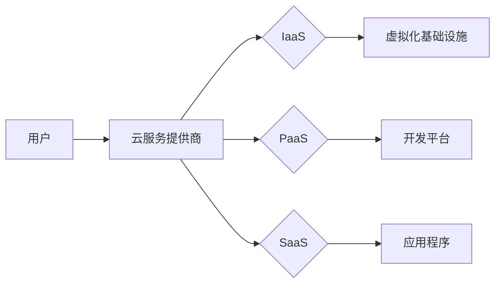

                 


### 第1章：云计算与智能云安全概述

#### 1.1 云计算基础

**1.1.1 云计算的定义与架构**

云计算是一种通过互联网以服务形式提供计算资源（如服务器、存储、网络和应用程序）的技术。它使得用户可以按需访问和使用这些资源，而无需管理底层的基础设施。

云计算主要分为三种服务模式：
- **基础设施即服务（IaaS）**：提供虚拟化的计算资源，如虚拟机、存储和网络。
- **平台即服务（PaaS）**：提供一个开发平台，包括应用程序、数据库和服务器等，开发者可以直接使用这些服务来开发应用程序。
- **软件即服务（SaaS）**：提供应用程序，用户通过互联网使用这些应用程序，无需管理或拥有底层基础设施。

接下来，我们通过一个Mermaid流程图来展示云计算的架构：



**1.1.2 百度智能云简介**

百度智能云是百度旗下的云计算服务平台，提供包括计算、存储、数据库、大数据、人工智能等在内的全方位云计算服务。其优势在于：

- **强大的计算资源**：百度智能云拥有庞大的计算资源池，可以满足大规模应用的计算需求。
- **全面的服务生态**：提供从基础设施到应用开发的全栈服务，满足不同层次用户的需求。
- **人工智能技术**：百度作为全球领先的AI公司，其AI技术被广泛应用于智能云的服务中，为用户带来智能化体验。

百度智能云的发展历程可以概括为以下几个阶段：

1. **2010年**：百度云正式上线，提供云计算服务。
2. **2015年**：百度云更名为百度智能云，标志着百度云计算服务的转型升级。
3. **2020年**：百度智能云发布“智能原生”战略，推动云计算与AI的深度融合。

**1.1.3 云安全的基本概念**

云安全是指保障云计算环境下数据和系统安全的一系列措施。云安全的重要性在于：

- **数据安全**：用户的数据存储在云端，如何保护这些数据免受未经授权的访问和泄露是云安全的核心问题。
- **系统安全**：云服务提供商需要保障其系统免受恶意攻击、网络攻击和数据泄露。

云安全的关键要素包括：

- **访问控制**：通过身份验证、权限管理等手段，确保只有授权用户可以访问云资源。
- **数据加密**：对存储和传输的数据进行加密，防止数据泄露。
- **安全监测**：通过监控和分析网络流量和系统日志，及时发现并响应安全事件。

与传统安全相比，云安全具有以下特点：

- **集中化**：云安全策略和管理集中在云服务提供商处，用户无需关心底层基础设施。
- **动态性**：云环境中的资源动态变化，安全策略也需要随之调整。
- **全球化**：云计算服务可以跨越地域和边界，安全威胁也更具全球性。

通过以上分析，我们可以看出云计算与智能云安全的核心概念及其重要性。在接下来的章节中，我们将进一步探讨网络安全技术、云安全威胁分析以及智能云安全实践等关键领域。

#### 2.1 网络安全架构

**2.1.1 网络安全架构概述**

网络安全架构是确保网络安全的基础，它包括三个主要层次：网络防御层、监控层和响应层。以下是每个层次的核心概念和组成部分：

1. **网络防御层**：
   - **防火墙**：防火墙是网络安全的第一道防线，用于控制进出网络的数据流量。它通过设置规则来允许或阻止数据包的传输，防止未授权访问。
   - **入侵检测系统（IDS）**：IDS用于实时监控网络流量和系统活动，检测可能的入侵行为和安全漏洞。它通过分析流量模式和异常行为来识别潜在威胁。
   - **虚拟专用网（VPN）**：VPN为远程用户或分支网络提供了安全的加密连接，确保数据在传输过程中不被窃听或篡改。

2. **监控层**：
   - **安全信息与事件管理（SIEM）**：SIEM系统用于收集、分析和关联来自不同源的安全事件信息，提供全面的监控和事件响应能力。
   - **日志管理**：日志管理系统能够记录和存储所有网络活动日志，便于后续的安全审计和事件分析。
   - **威胁情报**：通过收集和分析来自各种渠道的威胁信息，威胁情报系统能够提前预警潜在的安全威胁。

3. **响应层**：
   - **安全事件响应计划**：安全事件响应计划是应对网络安全事件的一套标准操作程序，包括事件检测、评估、响应和恢复等步骤。
   - **应急响应团队**：应急响应团队负责处理和响应网络安全事件，确保事件得到及时、有效的解决。
   - **备份和恢复策略**：备份和恢复策略确保在发生数据丢失或系统故障时，能够快速恢复数据和系统功能。

**2.1.2 防火墙与入侵检测**

1. **防火墙的工作原理与类型**：
   - **工作原理**：防火墙通过包过滤、状态检测和应用层网关等方式，对进出网络的数据包进行检查和过滤。它依据预设的安全规则，决定数据包是否允许通过。
   - **类型**：
     - **包过滤防火墙**：根据数据包的源地址、目标地址、端口号等信息进行过滤。
     - **状态检测防火墙**：在包过滤的基础上，增加了对会话状态的管理，能够更好地检测和阻止恶意流量。
     - **应用层网关防火墙**：针对特定应用程序（如HTTP、FTP等）进行过滤和控制，提供更细粒度的安全策略。

2. **入侵检测系统的功能与实现**：
   - **功能**：IDS的主要功能是检测和响应网络攻击，包括异常行为检测、恶意流量检测和安全漏洞扫描等。
   - **实现**：IDS通常采用以下几种技术：
     - **基于签名的检测**：通过匹配已知的攻击特征码，检测和阻止相应的攻击。
     - **基于行为的检测**：通过分析网络流量和系统活动，识别异常行为和潜在威胁。
     - **基于异常的检测**：通过建立正常行为模型，检测与正常行为不一致的异常行为。

**2.1.3 数据加密与数字签名**

1. **数据加密算法**：
   - **对称加密**：对称加密算法使用相同的密钥进行加密和解密，如AES、DES等。
   - **非对称加密**：非对称加密算法使用一对密钥（公钥和私钥），公钥用于加密，私钥用于解密，如RSA、ECC等。
   - **哈希算法**：哈希算法用于生成数据摘要，确保数据完整性和真实性，如SHA-256、MD5等。

2. **数字签名技术**：
   - **数字签名的原理**：数字签名通过公钥加密和私钥解密的方式，确保数据的完整性和真实性。发送者使用私钥对数据签名，接收者使用公钥验证签名。
   - **数字签名的作用**：数字签名可以防止数据被篡改，确保数据的来源真实可靠。同时，数字签名可以用于身份验证和不可否认性。

通过以上内容，我们了解了网络安全架构的基本概念和关键组成部分。接下来，我们将深入探讨云安全威胁分析，了解常见的安全威胁类型、安全漏洞和攻击手段。

#### 3.1 常见安全威胁类型

在云环境中，常见的安全威胁类型包括以下几种：

**3.1.1 DDoS 攻击**

DDoS（分布式拒绝服务）攻击是一种通过大量请求使目标系统瘫痪的攻击方式。攻击者通常控制大量僵尸主机，向目标系统发送大量合法请求，使其无法响应正常的用户请求。

- **攻击原理**：攻击者通过控制分布式网络中的多个节点，向目标系统发起大量请求。这些请求可能是HTTP请求、UDP请求或其他类型的网络流量，导致目标系统资源耗尽，无法正常服务。
- **防御策略**：
  - **流量清洗**：使用流量清洗设备或服务，过滤和阻止攻击流量，保留正常流量。
  - **负载均衡**：通过负载均衡设备，将流量分发到多个服务器，降低单点资源压力。
  - **容量扩展**：根据需求，及时扩展服务器和带宽资源，以应对突发流量。

**3.1.2 SQL 注入**

SQL 注入是一种通过在输入字段插入恶意 SQL 语句，从而控制数据库的攻击方式。攻击者利用应用程序对用户输入未进行充分验证，插入恶意 SQL 语句，实现对数据库的非法访问或修改。

- **攻击原理**：攻击者将恶意的 SQL 语句插入到用户输入的查询中，如将 `'1' UNION SELECT * FROM users` 插入到一个输入框。当应用程序执行这个查询时，攻击者的恶意 SQL 语句也会被执行。
- **防御措施**：
  - **参数化查询**：使用预编译的 SQL 语句和参数绑定，避免直接将用户输入拼接到 SQL 查询中。
  - **输入验证**：对用户输入进行严格的验证，确保输入符合预期格式，拒绝非法输入。
  - **使用数据库防火墙**：数据库防火墙可以检测和阻止 SQL 注入攻击，保护数据库安全。

**3.1.3 跨站脚本攻击（XSS）**

跨站脚本攻击（XSS）是一种通过在网页中插入恶意脚本，从而控制用户浏览器的攻击方式。攻击者利用网页对用户输入未进行充分验证，将恶意脚本插入到网页中，当用户访问这些网页时，恶意脚本会在用户的浏览器中执行。

- **攻击原理**：攻击者将恶意脚本插入到网页的输入字段或其他可展示用户输入的地方。当用户访问这个网页时，恶意脚本会被加载并执行。这些脚本可以获取用户的会话信息、Cookie 等，甚至可以在用户的浏览器中执行任意代码。
- **防御策略**：
  - **输入验证**：对用户输入进行严格的验证，防止恶意脚本注入。
  - **内容安全策略（CSP）**：通过设置内容安全策略，限制网页可以加载的资源和执行脚本的方式，防止恶意脚本执行。
  - **使用 Web 应用防火墙（WAF）**：Web 应用防火墙可以检测和阻止 XSS 攻击，提供额外的安全防护。

通过以上分析，我们可以看出常见安全威胁的类型及其攻击原理。了解这些威胁的类型和防御策略对于构建安全的云环境至关重要。在接下来的章节中，我们将进一步探讨安全漏洞分析，了解常见漏洞的类型和利用方法。

#### 3.2 安全漏洞分析

安全漏洞是安全威胁的源头，了解常见的安全漏洞类型及其利用方法对于防范和修复漏洞至关重要。以下是几种常见的安全漏洞类型：

**3.2.1 常见漏洞类型**

1. **插件漏洞**：
   - **定义**：插件漏洞是指第三方插件或组件中的安全漏洞，这些插件可能用于增强应用程序的功能。
   - **危害**：攻击者可以利用插件漏洞执行恶意代码，获取系统权限，甚至窃取敏感数据。
   - **防御**：及时更新插件，使用可靠来源的插件，定期进行安全扫描。

2. **配置错误**：
   - **定义**：配置错误是指系统配置设置中的错误，如不当的访问控制设置、不安全的默认配置等。
   - **危害**：攻击者可以利用配置错误绕过访问控制，访问敏感数据和系统资源。
   - **防御**：遵循最佳实践配置系统，定期审查和更新配置设置。

3. **系统漏洞**：
   - **定义**：系统漏洞是指操作系统或应用程序中的安全漏洞，可能导致未经授权的访问或恶意行为。
   - **危害**：系统漏洞可能被用于发起远程攻击，窃取数据或破坏系统。
   - **防御**：及时安装操作系统和应用程序的更新补丁，使用漏洞扫描工具定期检测漏洞。

**3.2.2 漏洞扫描与利用**

1. **漏洞扫描工具**：
   - **定义**：漏洞扫描工具用于自动发现和评估计算机系统中的安全漏洞。
   - **工作原理**：漏洞扫描工具通过模拟攻击者的行为，检测系统中的漏洞，生成漏洞报告。
   - **常见工具**：Nessus、OpenVAS、Metasploit 等。

2. **漏洞利用工具**：
   - **定义**：漏洞利用工具用于利用系统中的安全漏洞执行恶意代码或获取系统权限。
   - **工作原理**：漏洞利用工具通过发送特定的网络请求或执行特定命令，触发系统漏洞。
   - **常见工具**：Metasploit、BeEF、Armitage 等。

**3.2.3 漏洞利用示例**

以下是一个简单的SQL注入漏洞利用示例：

```python
import requests

url = 'http://example.com/login.php'
params = {
    'username': 'admin',
    'password': "admin' UNION SELECT * FROM users WHERE id=1 --"
}

response = requests.post(url, data=params)
print(response.text)
```

在这个示例中，攻击者通过在密码字段中插入恶意 SQL 语句，试图获取用户表中第一条记录的所有字段。当应用程序执行这个查询时，攻击者的恶意 SQL 语句也会被执行，从而泄露用户数据。

通过以上分析，我们可以看到安全漏洞的类型和利用方法。了解这些漏洞对于防范和修复漏洞至关重要。在接下来的章节中，我们将深入探讨安全攻击手段与防御策略。

#### 3.3 安全攻击手段与防御

在云环境中，安全攻击手段多种多样，了解这些攻击手段以及相应的防御策略对于保护云资源至关重要。以下是一些常见的安全攻击手段及其防御策略：

**3.3.1 社会工程学攻击**

1. **定义**：社会工程学攻击是一种利用人类心理和社会工程技巧来欺骗目标人物泄露敏感信息或执行特定行为的攻击方式。
2. **攻击原理**：攻击者通过电话、电子邮件、社交工程等手段，伪装成合法人员，诱导目标人员泄露密码、访问权限等敏感信息。
3. **防御策略**：
   - **安全培训**：定期进行安全培训，提高员工对社交工程攻击的识别和防范能力。
   - **多因素认证**：使用多因素认证（如密码+短信验证码+指纹识别）来加强身份验证。
   - **权限管理**：确保员工权限最小化，只有必要权限才能访问敏感信息或系统。

**3.3.2 恶意软件与病毒**

1. **定义**：恶意软件（Malware）和病毒（Virus）是能够自我复制并在计算机系统中传播的恶意程序，用于窃取数据、破坏系统或窃取资源。
2. **攻击原理**：恶意软件可以通过多种方式传播，如通过电子邮件附件、下载的软件包、恶意网站等。病毒通常通过感染其他程序或文件传播。
3. **防御策略**：
   - **防病毒软件**：安装并定期更新防病毒软件，扫描和阻止恶意软件。
   - **应用程序白名单**：只允许经过认证的应用程序运行，阻止未认证的应用程序执行。
   - **安全补丁管理**：及时安装操作系统和应用程序的更新补丁，修补安全漏洞。

**3.3.3 远程攻击**

1. **定义**：远程攻击是指攻击者通过网络远程控制目标系统，执行恶意行为或窃取数据。
2. **攻击原理**：远程攻击可以通过网络漏洞、弱口令、未加密的远程访问等方式实现。攻击者利用这些漏洞远程连接到目标系统，执行恶意操作。
3. **防御策略**：
   - **强密码策略**：使用强密码策略，要求用户使用复杂密码，定期更换密码。
   - **加密通信**：使用加密技术（如TLS/SSL）保护远程访问通信，确保数据在传输过程中不被窃听。
   - **远程访问控制**：严格控制远程访问权限，只允许必要的人员进行远程访问。

**3.3.4 拒绝服务攻击（DoS）**

1. **定义**：拒绝服务攻击（DoS）是一种通过大量请求使目标系统资源耗尽，导致系统无法正常服务的攻击方式。
2. **攻击原理**：攻击者通过发送大量合法请求，占用目标系统的网络带宽、CPU资源等，使系统无法响应正常用户请求。
3. **防御策略**：
   - **流量清洗**：使用流量清洗设备或服务，过滤和阻止恶意流量，保护系统资源。
   - **负载均衡**：通过负载均衡设备，将流量分散到多个服务器，降低单点资源压力。
   - **带宽限制**：对单个用户或IP地址的请求进行带宽限制，防止恶意流量占用过多资源。

通过以上分析，我们可以看到云环境中常见的安全攻击手段及其防御策略。了解这些攻击手段和防御策略对于保护云资源、构建安全的云环境至关重要。在接下来的章节中，我们将深入探讨云安全策略与合规性，了解如何制定和实施有效的云安全策略。

#### 4.1 云安全策略制定

**4.1.1 云安全策略概述**

云安全策略是企业或组织在云计算环境下确保数据、系统和资源安全的指导方针。它定义了如何识别、评估和管理安全风险，确保云环境中的信息资产得到有效保护。云安全策略的核心要素包括以下几个方面：

- **安全目标**：明确云安全策略的目标，如数据保密性、完整性和可用性。
- **安全原则**：制定安全原则，指导安全策略的实施，如最小权限原则、防御深度原则等。
- **风险评估**：定期进行风险评估，识别潜在的安全威胁和漏洞，评估其影响和风险。
- **安全措施**：制定具体的安全措施，包括技术和管理措施，如数据加密、访问控制、入侵检测等。
- **合规性要求**：确保云安全策略符合相关法规和标准，如ISO 27001、GDPR等。

**4.1.2 安全合规性与法规要求**

云安全合规性是指云服务提供商和用户遵循的相关法规、标准和最佳实践。在云环境中，合规性要求尤为重要，因为它直接关系到数据隐私、安全性和企业的法律责任。以下是几种常见的云安全法规和标准：

- **ISO 27001**：ISO 27001 是国际标准组织发布的关于信息安全管理的标准。它提供了一个框架，帮助企业建立、实施、维护和持续改进信息安全管理体系（ISMS）。
- **GDPR**：通用数据保护条例（GDPR）是欧盟发布的关于数据保护的法规。它要求企业确保个人数据的保密性、完整性和可用性，加强对个人数据的保护。
- **NIST SP 800-53**：美国国家标准与技术研究所（NIST）发布的关于信息安全控制标准。它提供了一个全面的框架，用于评估和管理信息系统的安全风险。

为了确保云安全合规性，企业需要：

- **审查法规要求**：了解并审查相关法规的要求和条款。
- **制定合规策略**：根据法规要求，制定具体的合规策略和操作流程。
- **定期审计和评估**：定期对云环境进行审计和评估，确保符合法规要求。
- **培训员工**：对员工进行安全合规培训，提高员工的安全意识和合规能力。

**4.1.3 安全管理体系**

建立和完善云安全管理体系是企业确保云安全的关键。云安全管理体系包括以下几个方面：

- **安全策略**：制定全面的云安全策略，明确安全目标、原则和措施。
- **安全组织**：建立专门的安全团队，负责云安全策略的制定、实施和监控。
- **安全标准**：制定并遵循相关的安全标准和最佳实践，如ISO 27001、NIST SP 800-53等。
- **安全监控**：建立实时的安全监控机制，监控云环境中的安全事件和异常行为。
- **事件响应**：制定安全事件响应计划，确保在发生安全事件时，能够及时、有效地响应和恢复。
- **合规性管理**：定期进行合规性评估，确保云安全策略和措施符合相关法规和标准。

通过以上分析，我们可以看到云安全策略制定、安全合规性与管理体系的重要性。在接下来的章节中，我们将深入探讨智能云安全防护，了解如何实现有效的威胁情报与安全监测。

#### 5.1 威胁情报与安全监测

**5.1.1 威胁情报概述**

威胁情报（Threat Intelligence）是一种通过收集、分析和共享关于潜在和现有安全威胁的信息，帮助企业识别、预防和响应网络攻击的高级安全工具。威胁情报的来源包括：

- **公开来源**：如安全社区、博客、论坛、安全报告等。
- **内部来源**：如安全日志、网络流量数据、用户行为分析等。
- **合作伙伴和第三方**：如安全服务提供商、行业组织、政府机构等。

威胁情报的使用包括：

- **威胁识别**：通过分析威胁情报，识别潜在的安全威胁。
- **攻击预防**：利用威胁情报，采取预防措施，阻止潜在攻击。
- **事件响应**：在发生安全事件时，利用威胁情报进行事件分析和响应。

**5.1.2 安全监测技术**

安全监测是确保云环境安全的关键环节，通过实时监控和收集系统数据，可以发现潜在的安全威胁和异常行为。以下是几种常用的安全监测技术：

1. **入侵检测系统（IDS）**

入侵检测系统（IDS）是一种用于实时监测网络流量和系统活动，识别潜在入侵行为的工具。IDS主要分为以下几种类型：

- **基于签名的检测**：通过匹配已知的攻击特征码，检测和阻止相应的攻击。
- **基于行为的检测**：通过分析网络流量和系统活动，识别异常行为和潜在威胁。
- **基于异常的检测**：通过建立正常行为模型，检测与正常行为不一致的异常行为。

2. **安全信息与事件管理（SIEM）**

安全信息与事件管理（SIEM）系统用于收集、存储、分析和关联来自不同源的安全事件信息，提供全面的监控和事件响应能力。SIEM系统的主要功能包括：

- **日志管理**：收集和存储系统日志、网络流量日志等。
- **事件关联**：通过分析日志数据，发现和关联潜在的安全事件。
- **事件响应**：自动触发相应的安全事件响应措施，如报警、阻断攻击等。

3. **威胁情报平台（TIP）**

威胁情报平台（TIP）是一种用于整合、管理和利用威胁情报的高级安全工具。TIP的主要功能包括：

- **威胁情报整合**：收集和分析来自多个来源的威胁情报。
- **威胁分析**：利用威胁情报，分析潜在的安全威胁和攻击趋势。
- **安全自动化**：根据威胁情报，自动触发安全防护措施，如流量过滤、访问控制等。

**5.1.3 安全监测的实施**

实施有效的安全监测需要以下几个步骤：

1. **确定监测目标**：明确需要监测的系统、网络和应用，确保覆盖关键的安全风险点。
2. **选择监测工具**：根据监测目标，选择合适的监测工具，如IDS、SIEM、TIP等。
3. **配置监测规则**：根据威胁情报和安全策略，配置监测规则，如基于签名的检测规则、基于行为的检测规则等。
4. **实时监控和报警**：确保监测系统实时收集和分析数据，及时发现潜在的安全威胁，触发报警和响应。
5. **事件响应和跟踪**：在发现安全事件时，及时响应和跟踪，确保安全事件得到有效处理。

通过威胁情报与安全监测，企业可以及时发现和应对潜在的安全威胁，降低安全风险。在接下来的章节中，我们将深入探讨网络隔离与访问控制，了解如何在云环境中实现有效隔离和控制。

#### 5.2 网络隔离与访问控制

**5.2.1 网络隔离**

网络隔离是一种通过物理或逻辑手段，将不同的网络或系统隔离开来，防止恶意流量或攻击在系统间传播的安全措施。网络隔离的主要目的是：

- **保护关键系统**：将关键系统和非关键系统隔离，防止非关键系统受到攻击后影响关键系统。
- **限制权限**：通过隔离，限制不同用户或系统之间的访问权限，确保安全策略得到有效执行。

网络隔离的主要方法包括：

1. **物理隔离**：通过物理设备（如防火墙、路由器等）将网络或系统隔离开来，防止网络流量直接互通。
2. **逻辑隔离**：通过设置访问控制策略，限制不同网络或系统之间的访问权限，如网络分段、VLAN等。

**5.2.2 访问控制**

访问控制是一种通过身份验证、授权和审计，控制用户对系统、网络和数据的访问权限的安全措施。访问控制的主要目的是：

- **确保用户权限最小化**：用户只能访问其必需的资源，防止权限滥用。
- **防止未授权访问**：通过身份验证和授权，确保只有合法用户可以访问受保护的资源。
- **审计和追溯**：通过记录用户访问行为，方便后续审计和追溯，确保安全事件得到及时处理。

访问控制的主要方法包括：

1. **身份验证**：身份验证是访问控制的第一步，通过验证用户的身份，确保只有合法用户可以访问系统。常用的身份验证方法包括密码验证、多因素认证（如密码+短信验证码）、生物识别等。

2. **授权**：授权是确定用户可以访问哪些资源的环节。常见的授权模型包括基于角色的访问控制（RBAC）和基于属性的访问控制（ABAC）。RBAC通过定义用户角色和角色权限，确保用户只能访问与其角色相关的资源；ABAC通过定义用户属性和资源属性，动态决定用户是否具有访问权限。

3. **审计和日志记录**：审计和日志记录是确保访问控制有效性的关键环节。通过记录用户的访问行为，如登录时间、访问的资源等，方便后续审计和追踪。

**5.2.3 实现网络隔离与访问控制**

实现网络隔离与访问控制需要以下几个步骤：

1. **评估需求**：根据业务需求和安全要求，确定需要隔离的网络和系统，以及需要控制的访问权限。
2. **设计隔离策略**：根据评估结果，设计具体的隔离策略，如物理隔离策略、逻辑隔离策略等。
3. **配置防火墙和路由器**：根据隔离策略，配置防火墙和路由器，限制不同网络或系统之间的访问。
4. **设置身份验证和授权**：根据安全策略，设置身份验证和授权，确保用户只能访问其必需的资源。
5. **监控和审计**：定期监控网络流量和用户访问行为，审计访问控制策略的有效性，及时调整和优化。

通过网络隔离与访问控制，可以确保云环境中的关键系统和数据得到有效保护，降低安全风险。在接下来的章节中，我们将深入探讨应用安全防护，了解如何确保云应用的安全性。

#### 5.3 应用安全防护

**5.3.1 应用安全防护的重要性**

随着云计算的普及，越来越多的企业将关键业务迁移到云端。然而，这也带来了新的安全挑战。应用安全防护是确保云应用安全的关键环节，其重要性体现在以下几个方面：

- **数据保护**：云应用通常涉及大量敏感数据，如用户信息、商业机密等。应用安全防护可以有效防止数据泄露和未授权访问。
- **业务连续性**：应用安全防护可以防止恶意攻击和系统故障导致业务中断，保障业务连续性。
- **合规性要求**：许多行业和地区都有特定的合规性要求，如GDPR、HIPAA等，应用安全防护有助于满足这些要求。

**5.3.2 应用安全防护的关键技术**

1. **Web应用防火墙（WAF）**

Web应用防火墙（WAF）是一种用于保护Web应用程序免受常见网络攻击（如SQL注入、XSS、CSRF等）的安全设备。WAF通过以下关键技术提供防护：

- **规则库**：WAF包含一系列预定义的规则，用于检测和阻止恶意流量。
- **行为分析**：WAF通过分析Web应用程序的流量模式，识别异常行为和潜在威胁。
- **签名匹配**：WAF通过匹配已知的攻击特征码，检测和阻止相应的攻击。

2. **安全编码**

安全编码是一种在应用程序开发过程中，遵循安全最佳实践，确保代码安全的方法。以下是一些安全编码的最佳实践：

- **输入验证**：对用户输入进行严格验证，确保输入符合预期格式，拒绝非法输入。
- **使用参数化查询**：避免直接拼接用户输入到SQL查询中，使用预编译的参数化查询。
- **加密敏感数据**：对存储和传输的敏感数据进行加密，确保数据在传输过程中不被窃取或篡改。
- **避免使用明文密码**：使用安全的密码存储和验证机制，如哈希和盐。

3. **安全测试**

安全测试是一种在应用程序发布前，检测和修复潜在安全漏洞的方法。以下是一些常见的安全测试方法：

- **静态代码分析**：通过分析代码源文件，检测潜在的安全漏洞。
- **动态代码分析**：通过运行应用程序，检测运行时的安全漏洞。
- **渗透测试**：模拟攻击者的行为，检测和评估应用程序的安全性。

**5.3.3 应用安全防护的实施**

实施有效的应用安全防护需要以下几个步骤：

1. **评估安全需求**：根据业务需求和合规性要求，确定需要保护的应用程序和关键功能。
2. **设计安全架构**：根据评估结果，设计应用安全防护的架构，包括WAF、安全编码、安全测试等。
3. **实施安全措施**：根据安全架构，实施具体的防护措施，如配置WAF规则、进行安全编码、开展安全测试等。
4. **监控和审计**：定期监控应用安全状况，审计安全措施的有效性，及时调整和优化。

通过以上分析，我们可以看到应用安全防护在确保云应用安全中的重要性。在接下来的章节中，我们将深入探讨云安全事件响应与恢复，了解如何应对和处理云安全事件。

#### 6.1 云安全事件响应流程

在云环境中，安全事件的发生是不可避免的。有效的安全事件响应流程是确保安全事件得到及时、有效处理的关键。以下是云安全事件响应流程的详细步骤：

**6.1.1 安全事件检测**

安全事件检测是事件响应流程的第一步，通过实时监控和收集系统数据，及时发现潜在的安全威胁。以下是几种常用的安全事件检测方法：

- **入侵检测系统（IDS）**：IDS通过分析网络流量和系统日志，检测异常行为和潜在威胁。
- **安全信息与事件管理（SIEM）**：SIEM系统用于收集、存储、分析和关联来自不同源的安全事件信息，提供全面的监控和事件响应能力。
- **威胁情报平台（TIP）**：TIP通过整合和分析威胁情报，识别潜在的安全威胁。

**6.1.2 事件确认**

在检测到潜在安全事件后，需要对其进行确认，以确定是否为真正的安全事件。事件确认通常包括以下步骤：

- **数据收集**：收集与安全事件相关的所有数据，包括日志、网络流量、系统状态等。
- **分析数据**：通过分析收集到的数据，确定安全事件的性质和影响。
- **确认事件**：根据分析结果，确认是否为安全事件，并评估事件的影响范围。

**6.1.3 事件评估**

事件评估是确定安全事件严重程度和影响的关键步骤。事件评估通常包括以下内容：

- **事件类型**：确定事件的类型，如数据泄露、服务中断、恶意软件感染等。
- **影响范围**：评估事件的影响范围，包括受影响的系统、数据、用户等。
- **潜在风险**：评估事件可能带来的潜在风险，如数据泄露、系统崩溃、业务中断等。

**6.1.4 应急响应**

在确定安全事件后，需要进行应急响应，以最大程度地减少事件的影响。应急响应通常包括以下步骤：

- **启动应急响应计划**：根据安全事件响应计划，启动应急响应流程。
- **隔离受影响的系统**：隔离受影响的系统，防止事件进一步扩散。
- **分析事件原因**：分析事件的原因，确定事件发生的原因和触发条件。
- **通知相关方**：及时通知相关方，包括企业高层、技术团队、用户等。

**6.1.5 恢复和修复**

在应急响应完成后，需要进行恢复和修复，以恢复正常运营。恢复和修复通常包括以下步骤：

- **数据备份与恢复**：根据备份策略，恢复受影响的数据。
- **系统修复**：修复受影响的系统，包括修复漏洞、更新软件等。
- **审计和复盘**：对事件进行审计和复盘，总结经验教训，优化安全策略和响应流程。

**6.1.6 事件总结**

事件总结是安全事件响应流程的最后一步，通过总结事件的经验和教训，优化安全策略和响应流程。事件总结通常包括以下内容：

- **事件报告**：编写事件报告，记录事件的发生、处理过程和结果。
- **经验教训**：总结事件中遇到的问题和解决方案，优化安全策略和响应流程。
- **改进措施**：根据事件总结，制定改进措施，提高安全事件的响应能力和效果。

通过以上分析，我们可以看到云安全事件响应流程的详细步骤。有效的安全事件响应流程可以确保安全事件得到及时、有效的处理，降低事件的影响。在接下来的章节中，我们将探讨云安全事件案例分析，了解实际的安全事件及其应对措施。

#### 6.2 云安全事件案例分析

**6.2.1 案例背景**

在某次网络攻击中，一家大型企业遭遇了严重的DDoS攻击。该企业在云端部署了其核心业务系统，包括电子商务平台、客户管理系统等。攻击者利用大量的僵尸主机向目标服务器发送大量的HTTP请求，导致服务器资源耗尽，无法正常响应用户请求。

**6.2.2 案例分析**

1. **攻击类型**：该事件是一次典型的DDoS攻击，攻击者通过控制分布式网络中的多个节点，向目标服务器发送大量请求，导致服务器资源耗尽。

2. **攻击手段**：攻击者使用了分布式反射攻击（Distributed Reflection Denial of Service, DRDoS），该攻击方式利用了开放的服务器，如HTTP、NTP等，伪造请求，将攻击流量反射到目标服务器。

3. **影响范围**：攻击导致企业电子商务平台和客户管理系统无法正常访问，造成了严重的业务中断，影响了用户体验和客户满意度。

4. **事件响应**：
   - **流量清洗**：企业首先启动了流量清洗设备，通过识别和过滤攻击流量，减轻了攻击对服务器的影响。
   - **带宽扩展**：企业迅速扩展了服务器带宽，以应对突发的流量。
   - **服务切换**：企业将部分服务切换到备用服务器，确保关键业务能够正常运行。
   - **法律行动**：企业向相关执法机构报告了事件，采取了法律手段追究攻击者的责任。

**6.2.3 案例启示**

1. **加强DDoS防御**：企业应建立完善的DDoS防御机制，包括使用流量清洗设备、带宽扩展计划等。
2. **定期进行安全演练**：企业应定期进行安全演练，测试DDoS防御机制的有效性，发现和修复潜在的安全漏洞。
3. **备份和恢复策略**：企业应制定详细的数据备份和恢复策略，确保在发生数据丢失或系统故障时，能够快速恢复数据和系统功能。
4. **安全培训**：提高员工的安全意识和技能，确保他们能够识别和应对常见的网络攻击。

通过分析该案例，我们可以看到DDoS攻击对企业的严重危害，同时也了解到有效的防御措施和应对策略。在接下来的章节中，我们将探讨数据备份与恢复，了解如何在云环境中确保数据的安全和可恢复性。

#### 6.3 数据备份与恢复

数据备份与恢复是确保云安全事件发生时，能够迅速恢复系统和数据的重要措施。以下是数据备份与恢复的关键技术、方法及其重要性。

**6.3.1 数据备份**

1. **备份类型**：
   - **全量备份**：备份整个系统和数据，适用于系统初始化或数据完全恢复。
   - **增量备份**：仅备份自上次备份以来发生变化的文件和数据，适用于频繁备份的场景。
   - **差异备份**：备份自上次全量备份以来发生变化的文件和数据，适用于数据量较大且更新频繁的场景。

2. **备份策略**：
   - **定期备份**：定期（如每天、每周、每月）进行备份，确保数据的时效性。
   - **多层备份**：将数据备份到多个存储位置，包括本地存储、远程存储、云存储等，提高数据的安全性。
   - **备份验证**：定期验证备份数据的完整性和可恢复性，确保备份数据的有效性。

3. **备份技术**：
   - **本地备份**：使用本地存储设备进行数据备份，如硬盘、磁带等。
   - **远程备份**：将数据备份到远程服务器或云存储服务，如AWS S3、Azure Blob Storage等。
   - **云备份**：利用云服务提供商提供的备份服务，如百度智能云的云备份服务，确保数据的安全和可靠。

**6.3.2 数据恢复**

1. **恢复策略**：
   - **快速恢复**：在发生数据丢失或系统故障时，迅速恢复数据和系统功能，确保业务的连续性。
   - **完整恢复**：确保恢复的数据和系统与备份时一致，包括所有文件、配置和设置。
   - **验证恢复**：恢复后，对数据和系统进行验证，确保其正常运行和完整性。

2. **恢复方法**：
   - **手动恢复**：通过手动操作，从备份数据中恢复文件和数据。
   - **自动化恢复**：使用备份工具和脚本，自动恢复数据和系统。
   - **云恢复**：利用云服务提供商提供的恢复服务，如百度智能云的云恢复服务，快速恢复系统和数据。

**6.3.3 数据备份与恢复的重要性**

1. **数据保护**：数据备份是数据保护的重要手段，可以防止数据丢失、损坏和未授权访问。
2. **业务连续性**：通过数据备份和恢复，确保在发生安全事件时，能够迅速恢复系统和数据，保障业务的连续性。
3. **合规性要求**：许多行业和地区都有特定的合规性要求，如GDPR、HIPAA等，数据备份和恢复是满足这些要求的关键措施。
4. **风险管理**：数据备份和恢复是风险管理的重要组成部分，通过备份和恢复，降低数据丢失、系统故障等风险。

通过以上分析，我们可以看到数据备份与恢复在云安全中的重要性。有效的数据备份和恢复策略可以确保数据的安全和业务的连续性。在接下来的章节中，我们将探讨安全测试与评估，了解如何确保云环境的安全性和合规性。

#### 7.1 安全测试方法

安全测试是确保云环境安全性和合规性的重要手段。以下是几种常见的安全测试方法：

**7.1.1 漏洞扫描**

漏洞扫描是一种自动化的安全测试方法，通过扫描系统、网络和应用程序，识别潜在的安全漏洞和弱点。漏洞扫描的主要步骤包括：

1. **目标选择**：确定需要扫描的目标系统、网络和应用程序。
2. **漏洞库**：使用预定义的漏洞库，如NIST、CVE等，识别已知的漏洞。
3. **扫描**：使用漏洞扫描工具，对目标系统、网络和应用程序进行扫描，检测漏洞。
4. **报告**：生成漏洞扫描报告，记录发现的漏洞和潜在风险。

**7.1.2 渗透测试**

渗透测试是一种模拟真实攻击者的行为，尝试攻击目标系统、网络和应用程序的安全测试方法。渗透测试的主要步骤包括：

1. **目标选择**：确定需要渗透测试的目标系统、网络和应用程序。
2. **信息收集**：收集目标系统的相关信息，如网络拓扑、系统配置等。
3. **攻击尝试**：尝试各种攻击手段，如SQL注入、XSS、暴力破解等，验证系统的安全性。
4. **漏洞报告**：生成渗透测试报告，记录测试过程中发现的漏洞和攻击路径。

**7.1.3 安全代码审查**

安全代码审查是一种通过人工审查代码，识别潜在安全漏洞和弱点的测试方法。安全代码审查的主要步骤包括：

1. **代码审查计划**：制定代码审查计划，包括审查范围、审查人员等。
2. **代码分析**：使用静态分析工具和人工审查，分析代码中的安全漏洞。
3. **漏洞报告**：生成代码审查报告，记录发现的漏洞和建议的修复措施。

**7.1.4 安全培训**

安全培训是一种通过培训员工，提高他们的安全意识和技能的测试方法。安全培训的主要步骤包括：

1. **培训需求分析**：分析员工的安全培训需求，确定培训内容。
2. **培训计划**：制定培训计划，包括培训课程、培训时间等。
3. **培训实施**：实施培训计划，进行安全意识和技能培训。
4. **培训评估**：评估培训效果，确保员工能够掌握安全知识和技能。

通过以上分析，我们可以看到安全测试方法在确保云环境安全性和合规性中的重要作用。在接下来的章节中，我们将深入探讨如何进行漏洞扫描与风险评估，了解具体的技术和方法。

#### 7.2 漏洞扫描与风险评估

漏洞扫描和风险评估是云安全测试的重要组成部分，通过这些方法，可以识别系统中的安全漏洞并评估其潜在风险。以下是漏洞扫描与风险评估的具体步骤和技术。

**7.2.1 漏洞扫描**

1. **目标选择**：
   - **确定扫描范围**：首先明确需要扫描的目标系统、网络和应用程序。这可能包括云服务器、虚拟机、网络设备以及Web应用程序等。
   - **识别资产**：列出所有相关资产，确保扫描覆盖所有关键系统。

2. **选择工具**：
   - **开源工具**：如Nessus、OpenVAS、Zap等，这些工具提供了广泛的漏洞扫描功能。
   - **商业工具**：如Tenable、Qualys、HPE ArcSight等，这些工具通常提供更高级的扫描功能和报告生成。

3. **执行扫描**：
   - **网络扫描**：扫描网络设备、防火墙和路由器，检查配置错误、开放端口和未知的网络流量。
   - **主机扫描**：扫描操作系统和应用程序，识别已知漏洞和配置错误。
   - **Web应用程序扫描**：使用Web应用扫描器，检查Web应用程序中的漏洞，如SQL注入、XSS、CSRF等。

4. **漏洞报告**：
   - **生成报告**：扫描完成后，生成详细的漏洞报告，列出发现的漏洞、影响和修复建议。
   - **分类漏洞**：根据漏洞的严重程度和影响范围进行分类，如高、中、低风险漏洞。

**7.2.2 风险评估**

1. **识别威胁**：
   - **分析漏洞**：根据漏洞扫描报告，分析每个漏洞可能面临的威胁。
   - **研究攻击场景**：研究可能的攻击路径和攻击方式，如利用漏洞进行数据窃取、系统破坏等。

2. **评估风险**：
   - **确定漏洞严重性**：根据漏洞的严重程度，如CVE评分、CVSS评分等，评估漏洞的潜在影响。
   - **分析漏洞利用难度**：分析利用漏洞的难度，包括所需的技能、工具和条件。

3. **制定风险管理策略**：
   - **漏洞修复**：对于严重风险漏洞，制定修复计划，及时修补系统漏洞。
   - **风险缓解措施**：对于中等或低风险漏洞，制定风险缓解措施，如限制访问、增加监控等。
   - **持续监控**：建立持续监控机制，定期进行漏洞扫描和风险评估，确保漏洞得到及时处理。

**7.2.3 风险评估工具**

- **开源工具**：如Riskify、OWASP Risk Calculator等，这些工具提供了基本的风险评估功能。
- **商业工具**：如IBM Security AppScan、Tenable.io等，这些工具提供了更全面的风险评估功能，包括漏洞优先级排序、风险评分等。

通过漏洞扫描和风险评估，企业可以识别和评估云环境中的安全风险，采取相应的措施来保护系统和数据。有效的漏洞扫描和风险评估不仅能够提高云环境的安全性，还能确保合规性要求得到满足。在接下来的章节中，我们将探讨云安全合规性评估，了解如何确保云服务符合相关法规和标准。

#### 7.3 安全合规性评估

在云计算环境中，安全合规性评估是确保云服务提供商（CSP）和用户遵守相关法规和标准的重要环节。以下是安全合规性评估的方法和步骤。

**7.3.1 确定评估标准**

1. **识别适用的法规和标准**：首先，需要识别适用于企业业务和数据的法规和标准，如ISO 27001、GDPR、NIST SP 800-53等。

2. **了解要求**：详细阅读和理解所选法规和标准的要求，包括安全控制、数据处理、隐私保护等方面的具体规定。

3. **制定评估计划**：根据法规和标准的要求，制定评估计划，明确评估范围、评估方法和时间表。

**7.3.2 自评估**

1. **内部审计**：由内部审计团队或合规性专家对云服务的安全控制措施进行自评估，确保符合法规和标准的要求。

2. **审计日志和记录**：审查审计日志和安全记录，确保所有安全控制措施得到正确实施和记录。

3. **漏洞扫描和渗透测试**：定期进行漏洞扫描和渗透测试，识别潜在的安全漏洞和弱点。

**7.3.3 第三方评估**

1. **选择评估机构**：选择具有资质的第三方评估机构，确保其具备专业能力和经验。

2. **审计过程**：第三方评估机构对企业或云服务提供商的云环境进行审计，验证其是否符合法规和标准的要求。

3. **报告和反馈**：评估机构提供详细的审计报告，指出发现的问题和建议的改进措施。

**7.3.4 采取改进措施**

1. **问题整改**：根据评估报告，采取改进措施，修复发现的问题和漏洞。

2. **持续监控**：建立持续监控机制，定期进行合规性评估，确保云服务持续符合法规和标准的要求。

3. **培训和教育**：对员工进行合规性培训，提高其合规意识和技能。

通过安全合规性评估，企业可以确保云服务提供商的服务质量和安全性，同时满足相关法规和标准的要求，降低合规风险。在接下来的章节中，我们将探讨百度智能云安全案例解析，了解实际的安全问题和应对措施。

#### 8.1 百度智能云安全案例解析

**8.1.1 案例背景**

在某次网络攻击中，百度智能云的一客户企业遭遇了严重的DDoS攻击。该企业的业务主要依赖于云服务器，包括电子商务平台、客户管理系统等。攻击者利用大量的僵尸主机向目标服务器发送大量的HTTP请求，导致服务器资源耗尽，无法正常响应用户请求。

**8.1.2 案例分析**

1. **攻击类型**：该事件是一次典型的DDoS攻击，攻击者使用了分布式反射攻击（Distributed Reflection Denial of Service, DRDoS），该攻击方式利用了开放的服务器，如HTTP、NTP等，伪造请求，将攻击流量反射到目标服务器。

2. **攻击手段**：
   - **分布式反射攻击**：攻击者控制分布式网络中的多个节点，向开放的服务器发送大量请求，这些请求被反射到目标服务器，导致目标服务器资源耗尽。
   - **高频率请求**：攻击者通过发送大量的HTTP请求，占用目标服务器的带宽和CPU资源，使其无法正常响应正常用户请求。

3. **影响范围**：攻击导致企业电子商务平台和客户管理系统无法正常访问，造成了严重的业务中断，影响了用户体验和客户满意度。

4. **事件响应**：
   - **启动DDoS防御机制**：百度智能云迅速启动了DDoS防御机制，通过流量清洗设备识别和过滤攻击流量，减轻了攻击对服务器的影响。
   - **带宽扩展**：百度智能云帮助企业迅速扩展了服务器带宽，以应对突发的流量。
   - **服务切换**：企业将部分服务切换到备用服务器，确保关键业务能够正常运行。
   - **法律行动**：企业向相关执法机构报告了事件，采取了法律手段追究攻击者的责任。

**8.1.3 案例启示**

1. **加强DDoS防御**：企业应建立完善的DDoS防御机制，包括使用流量清洗设备、带宽扩展计划等。
2. **定期进行安全演练**：企业应定期进行安全演练，测试DDoS防御机制的有效性，发现和修复潜在的安全漏洞。
3. **备份和恢复策略**：企业应制定详细的数据备份和恢复策略，确保在发生数据丢失或系统故障时，能够快速恢复数据和系统功能。
4. **安全培训**：提高员工的安全意识和技能，确保他们能够识别和应对常见的网络攻击。

通过分析该案例，我们可以看到DDoS攻击对企业的严重危害，同时也了解到有效的防御措施和应对策略。百度智能云作为云服务提供商，在应对此类安全事件时展现了其强大的技术能力和专业的服务。

#### 9.1 面试题类型与特点

**9.1.1 常见面题型**

在百度智能云2025社招云安全工程师面试中，常见的面题型包括以下几类：

1. **基础知识与核心概念题**：考察应聘者对云计算和网络安全基础知识的掌握程度，如云计算架构、云安全基本概念、网络安全技术等。
2. **安全漏洞与攻击题**：考察应聘者对常见安全漏洞和攻击手段的了解程度，如SQL注入、XSS攻击、DDoS攻击等。
3. **安全防护措施题**：考察应聘者对常见安全防护措施的理解和应用能力，如防火墙、入侵检测系统、加密技术等。
4. **案例分析题**：通过具体的案例，考察应聘者分析问题和解决问题的能力。
5. **实战题**：通过编程题目或项目实现，考察应聘者的编程能力和实际操作经验。

**9.1.2 面试题特点**

1. **综合性和实践性**：面试题通常涉及多个知识点，要求应聘者综合运用所学知识，解决问题。
2. **深度和广度**：面试题不仅考察基础知识，还考察应聘者对复杂问题的深入理解和解决能力。
3. **实际操作性**：面试题强调实际操作和应用，要求应聘者展示其在实际项目中的经验和技能。
4. **创新性和开放性**：面试题鼓励应聘者提出创新性解决方案，考察其思维能力和创新能力。

#### 9.2 面试题实战解析

以下是一个典型的云安全工程师面试题及其解析：

**面试题**：描述一下DDoS攻击的原理和防御策略。

**解题步骤**：

1. **DDoS攻击原理**：
   - **定义**：DDoS（分布式拒绝服务）攻击是一种通过大量请求使目标系统瘫痪的攻击方式。
   - **攻击方式**：
     - **分布式反射攻击**：攻击者控制分布式网络中的多个节点，向开放的服务器发送大量请求，这些请求被反射到目标服务器，导致目标服务器资源耗尽。
     - **高频率请求**：攻击者通过大量的合法请求占用目标服务器的带宽和CPU资源，使其无法正常响应正常用户请求。

2. **防御策略**：
   - **流量清洗**：使用流量清洗设备或服务，过滤和阻止攻击流量，保留正常流量。
   - **带宽扩展**：根据需求，及时扩展服务器和带宽资源，以应对突发流量。
   - **负载均衡**：通过负载均衡设备，将流量分发到多个服务器，降低单点资源压力。
   - **多因素认证**：使用多因素认证，确保只有授权用户可以访问系统。
   - **安全监测**：通过入侵检测系统（IDS）和安全信息与事件管理（SIEM）系统，实时监控网络流量，及时发现和响应攻击。

**面试题实战解析**：

假设你是一位云安全工程师，如何应对一个潜在的DDoS攻击？

**步骤**：

1. **评估风险**：首先评估潜在的攻击风险，确定攻击的类型、攻击频率和持续时间等。
2. **启动防御机制**：根据评估结果，启动流量清洗设备，确保攻击流量得到有效过滤。
3. **扩展带宽和资源**：根据攻击流量，及时扩展服务器和带宽资源，以应对突发的流量。
4. **负载均衡**：通过负载均衡设备，将流量分发到多个服务器，降低单点资源压力。
5. **安全监测**：使用入侵检测系统（IDS）和安全信息与事件管理（SIEM）系统，实时监控网络流量，及时发现和响应攻击。
6. **应急响应**：在发现攻击时，及时响应和采取措施，如隔离受影响的系统、通知相关方等。
7. **事后分析**：攻击结束后，对事件进行复盘和分析，总结经验教训，优化安全策略和防御措施。

通过以上实战解析，我们可以看到如何应对DDoS攻击。有效的防御策略和应急响应措施是确保云安全的关键。在接下来的章节中，我们将探讨面试技巧与策略，了解如何在面试中更好地展示自己的能力和经验。

#### 9.3 面试技巧与策略

面试是求职过程中的重要环节，掌握正确的面试技巧和策略能够帮助应聘者更好地展示自己的能力和潜力。以下是一些建议，旨在帮助应聘者提升面试表现：

**9.3.1 准备工作**

1. **了解公司和职位**：在面试前，深入了解目标公司的背景、文化和业务领域，以及所申请职位的职责和要求。
2. **熟悉常见问题**：准备常见的面试问题，如自我介绍、职业规划、技术问题等，并练习回答。
3. **整理技术栈**：回顾和巩固自己在云计算、网络安全、编程等方面的技术知识，确保能够流利地解释和讨论相关技术。

**9.3.2 面试过程中**

1. **自信展示**：保持自信和积极的态度，清晰、准确地表达自己的想法。
2. **举例说明**：在回答问题时，适当使用实际项目或工作经验的例子，展示自己的经验和能力。
3. **问题反馈**：在面试过程中，如果有不理解的问题，可以礼貌地请求面试官解释或澄清。
4. **沟通技巧**：注意沟通的技巧，如倾听、提问、表达清晰等，展现出良好的沟通能力。

**9.3.3 面试结束**

1. **感谢面试官**：在面试结束时，感谢面试官的时间和机会，展示自己的礼貌和诚意。
2. **总结面试表现**：面试结束后，回顾自己的表现，总结成功之处和需要改进的地方。
3. **跟进**：根据面试官的反馈，准备后续的跟进邮件或电话，表达对职位的兴趣和感谢。

**9.3.4 拓展阅读**

- **《面试指南》**：查阅相关面试指南，获取面试技巧和策略的详细建议。
- **《云计算与网络安全》**：了解云计算和网络安全的基本概念、技术和最佳实践。
- **《编程面试宝典》**：学习编程面试的常见问题和解决方法，提高编程能力。

通过以上面试技巧和策略，应聘者可以更好地准备面试，展示自己的能力和潜力，提高面试成功率。在面试过程中，保持自信、积极和诚实，是成功的关键。祝愿每一位应聘者都能在面试中取得优异的成绩！

### 附录

#### 附录A：云安全相关资源与工具

**A.1 常用安全工具介绍**

1. **Nessus**：一款开源的漏洞扫描工具，能够自动发现网络中的漏洞和安全隐患。
2. **OpenVAS**：一款开源的漏洞扫描和管理工具，提供了强大的漏洞识别和报告功能。
3. **Zap**：一款开源的Web应用程序安全测试工具，用于检测Web应用程序中的安全漏洞。
4. **Metasploit**：一款开源的渗透测试框架，用于模拟网络攻击和漏洞利用。

**A.2 云安全相关书籍推荐**

1. **《云计算安全》**：深入介绍了云计算环境中的安全问题和解决方案，适合云计算安全领域的专业人士。
2. **《网络安全原理与实践》**：系统地讲解了网络安全的基本原理和实际应用，适用于网络安全工程师和研究人员。
3. **《网络入侵检测》**：详细介绍了入侵检测系统的原理、技术和应用，适合网络安全从业人员和学者。

**A.3 云安全在线课程推荐**

1. **《云计算安全基础》**：由Coursera提供，介绍了云计算环境中的安全问题和防护措施。
2. **《网络安全技术与应用》**：由网易云课堂提供，讲解了网络安全的基本概念和技术。
3. **《云安全实战》**：由百度智能云提供，通过案例分析和实战演练，介绍了云安全的核心技术和实践。

通过学习和使用以上资源和工具，可以更好地了解云安全领域，提升安全防护能力。附录部分提供的书籍、课程和工具，为读者提供了丰富的学习材料和实际操作机会，有助于深入掌握云安全知识。希望这些资源能为读者在云安全领域的学习和实践中提供帮助。

### 总结

在这篇文章中，我们从多个角度详细探讨了百度智能云2025社招云安全工程师面试真题。首先，我们介绍了云计算与智能云安全的基本概念，阐述了云计算的架构和服务模式。接着，我们深入探讨了网络安全技术，包括防火墙、入侵检测系统和数据加密等关键技术。在此基础上，我们分析了云安全威胁类型，如DDoS攻击、SQL注入和跨站脚本攻击，并介绍了常见的漏洞类型和防御策略。

随后，我们探讨了云安全策略与合规性，讲解了如何制定有效的云安全策略和确保合规性。我们介绍了智能云安全防护的方法，包括威胁情报与安全监测、网络隔离与访问控制、应用安全防护等。此外，我们详细阐述了云安全事件响应与恢复的流程，并通过实际案例展示了应对安全事件的策略。

在安全测试与评估部分，我们介绍了漏洞扫描与风险评估的方法，以及如何确保云安全合规性。文章的最后，我们通过附录部分提供了云安全相关的书籍、课程和工具，为读者提供了丰富的学习资源。

通过本文的详细解析，读者可以全面了解云安全工程师的面试要点，掌握云安全的核心技术和实战经验。希望这篇文章能够帮助准备面试的读者，提高面试成功率。最后，感谢读者对本文的关注和支持，祝大家在面试中取得优异的成绩！作者：AI天才研究院/AI Genius Institute & 禅与计算机程序设计艺术 /Zen And The Art of Computer Programming。

