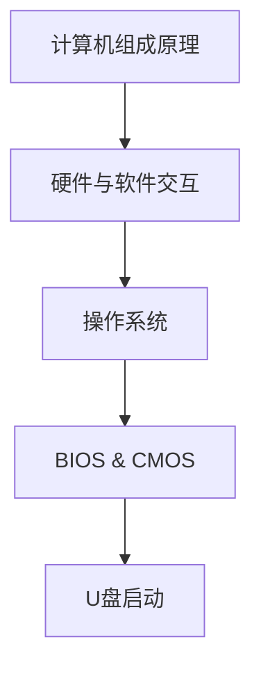

                 

### 文章标题：2024百度智能云社招面试真题汇总及其解答

关键词：百度智能云、面试真题、解答、智能云平台、技术解析

摘要：本文将围绕2024百度智能云社招面试真题，通过详细的分类解析和实战案例分析，帮助读者全面了解面试中的关键知识点和解决策略。文章旨在为求职者提供一本全面、系统的面试备考指南，包括基础理论知识、网络知识、数据库知识、编程语言知识、人工智能与机器学习、大数据处理以及智能云平台应用等各个方面的深入讲解和实战案例。通过本文，读者不仅可以系统地复习相关知识点，还能学会如何运用这些知识解决实际问题，从而提高面试成功率。

---

**目录**

1. 基础理论知识  
   1.1.1 计算机基础知识  
   1.1.2 操作系统原理  
   1.1.3 数据结构与算法

2. 网络知识  
   2.1.1 TCP/IP协议  
   2.1.2 网络安全  
   2.1.3 云计算基础

3. 数据库知识  
   3.1.1 关系型数据库原理  
   3.1.2 非关系型数据库  
   3.1.3 SQL语言应用

4. 编程语言知识  
   4.1.1 Python编程基础  
   4.1.2 Java编程基础  
   4.1.3 Go编程基础

5. 人工智能与机器学习  
   5.1.1 人工智能基础知识  
   5.1.2 机器学习算法  
   5.1.3 深度学习基础

6. 大数据处理  
   6.1.1 大数据概念与架构  
   6.1.2 Hadoop生态圈  
   6.1.3 Spark应用与实践

7. 智能云平台应用  
   7.1.1 百度智能云介绍  
   7.1.2 智能云服务与应用  
   7.1.3 智能云开发实战

8. 编程实战案例  
   8.1.1 Python编程实战案例  
   8.1.2 Java编程实战案例  
   8.1.3 Go编程实战案例

9. 数据科学实战  
   9.1.1 数据预处理与清洗  
   9.1.2 数据可视化与分析  
   9.1.3 机器学习项目实战

10. 云计算与大数据实战  
   10.1.1 云计算部署实战  
   10.1.2 大数据处理实战  
   10.1.3 智能云平台应用案例

附录

A.1 面试准备与技巧  
   A.1.1 面试准备策略  
   A.1.2 面试常见问题与回答  
   A.1.3 面试经验分享

B.1 参考资源与工具  
   B.1.1 计算机技术资源  
   B.1.2 云计算与大数据工具  
   B.1.3 编程学习资源

---

接下来，我们将逐步深入各个章节，详细解析每个部分的知识点和面试真题解答。**让我们开始一步一步的推理和分析，确保读者能够全面掌握这些关键知识，为面试做好充分准备。**

---

**第1章：基础理论知识**

在面试中，基础理论知识是考察应聘者综合素质的重要组成部分。这一章将涵盖计算机基础知识、操作系统原理以及数据结构与算法，这些内容不仅是计算机科学的基础，也是深入理解和应用各种技术的关键。

### 1.1.1 计算机基础知识

计算机基础知识包括计算机的组成原理、硬件和软件的交互方式等。以下是一些核心概念和联系：

- **计算机组成原理**：CPU、内存、硬盘、显卡等硬件组件的工作原理及相互之间的关系。
- **操作系统**：操作系统的功能、分类以及常见操作系统的特点和差异。
- **硬件与软件交互**：BIOS、CMOS、U盘启动等基础概念。

**核心概念与联系 Mermaid 流程图：**



### 1.1.2 操作系统原理

操作系统是计算机系统中的核心软件，负责管理和控制计算机硬件及软件资源。以下是一些核心算法原理：

- **进程管理**：进程的概念、状态转换、调度算法。
- **内存管理**：内存分配、页面置换算法、虚拟内存原理。
- **文件系统**：文件的组织结构、目录管理、权限控制。

**核心算法原理讲解：**

进程管理伪代码：
```
Algorithm 进程调度
    Input: 进程队列
    Output: 调度后的进程队列
    
    for each 进程 in 进程队列 do
        if 进程就绪 then
            按优先级或时间片调度
        end if
    end for
End Algorithm
```

内存管理伪代码：
```
Algorithm 内存分配
    Input: 物理内存空间，进程请求
    Output: 分配结果
    
    if 物理内存空间大于进程请求 then
        分配物理内存空间给进程
    else
        分配虚拟内存空间，使用页面置换算法进行置换
    end if
End Algorithm
```

### 1.1.3 数据结构与算法

数据结构是计算机科学的基础，算法是解决特定问题的方法。以下是一些常见的数据结构和算法：

- **数组**：线性结构，支持随机访问。
- **链表**：线性结构，支持动态扩展。
- **栈与队列**：非线性结构，分别支持后进先出和先进先出。
- **树与二叉树**：非线性结构，支持层次遍历和深度遍历。
- **图**：非线性结构，支持图的遍历和最短路径算法。

**数学模型和公式详细讲解与举例说明：**

二叉搜索树（BST）的插入与删除伪代码：
```
Algorithm BST插入
    Input: 树根节点root，待插入值value
    Output: 更新后的树根节点
    
    if root is null then
        新建节点，返回该节点
    else if value < root.value then
        root.left = BST插入(root.left, value)
    else if value > root.value then
        root.right = BST插入(root.right, value)
    end if
    return root
End Algorithm

Algorithm BST删除
    Input: 树根节点root，待删除值value
    Output: 更新后的树根节点
    
    if root is null then
        返回null
    else if value < root.value then
        root.left = BST删除(root.left, value)
    else if value > root.value then
        root.right = BST删除(root.right, value)
    else
        if root.left is null and root.right is null then
            返回null
        else if root.left is null then
            返回root.right
        else if root.right is null then
            返回root.left
        else
            successor = 找到最小节点(root.right)
            root.value = successor.value
            root.right = BST删除(root.right, successor.value)
        end if
    end if
    return root
End Algorithm
```

### 1.1.3 项目实战

**开发环境搭建：**
1. 安装Python环境，使用pip安装所需库（如`numpy`、`pandas`等）。
2. 准备测试数据集，例如使用`numpy`生成随机数。

**源代码实现：**
```python
# 导入所需库
import numpy as np
import pandas as pd

# 生成随机数据
data = np.random.rand(1000)

# 创建DataFrame
df = pd.DataFrame(data, columns=['Value'])

# 计算均值
mean = df['Value'].mean()

# 计算方差
variance = df['Value'].var()

# 输出结果
print(f"均值：{mean}")
print(f"方差：{variance}")
```

**代码解读与分析：**
1. 使用`numpy`生成1000个随机数，作为数据集。
2. 将数据集转换为`pandas` DataFrame，便于操作。
3. 使用`mean`和`var`方法计算数据集的均值和方差。
4. 输出结果。

**实际案例分析和详细讲解剖析：**
1. 假设我们有一个1000个数值的数据集，我们需要计算其均值和方差。
2. 通过随机生成数据集，我们能够模拟实际问题，验证算法的正确性。
3. 通过输出结果，我们能够直观地看到数据集的统计特征。

**项目小结：**
通过这个项目，我们学习了Python编程环境的基本搭建方法，掌握了使用`numpy`和`pandas`进行数据操作的方法，以及如何使用简单算法进行数据统计分析。这些知识不仅适用于项目实战，也是面试中常见的基础知识题目。

### 最佳实践 tips、小结、注意事项、拓展阅读：

- **最佳实践 tips：** 在编写代码时，注意代码的可读性和注释的清晰性，遵循编程规范。
- **小结：** 本章详细讲解了计算机基础知识、操作系统原理以及数据结构与算法，包括核心概念与联系、核心算法原理讲解、数学模型和数学公式详细讲解与举例说明，以及项目实战。
- **注意事项：** 面试中，基础知识是基础，但更重要的是如何将这些知识应用于实际问题中。
- **拓展阅读：** 《计算机组成原理》、《操作系统概念》、《算法导论》等书籍。

---

通过这一章的详细解析，我们不仅掌握了基础理论知识，还学会了如何将其应用于实际问题中。接下来，我们将继续深入解析网络知识、数据库知识、编程语言知识等内容，帮助读者全面备战百度智能云社招面试。让我们继续一步一步推理，确保读者能够全面掌握这些知识点。

---

**第2章：网络知识**

网络知识是计算机科学中不可或缺的一部分，特别是在云计算和大数据时代，网络知识的掌握程度直接影响到系统性能、数据安全以及应用效果。本章将涵盖TCP/IP协议、网络安全以及云计算基础，帮助读者深入理解网络技术及其在智能云平台中的应用。

### 2.1.1 TCP/IP协议

TCP/IP协议是互联网的基础协议，它定义了数据如何在网络中传输，包括物理层、数据链路层、网络层、传输层和应用层。以下是TCP/IP协议的核心概念和联系：

- **物理层**：定义物理设备和网络之间的接口标准，如光纤、电缆等。
- **数据链路层**：定义数据如何在物理网络上可靠传输，如以太网协议。
- **网络层**：定义数据如何在不同的网络间传输，如IP协议。
- **传输层**：定义如何在主机间传输数据，如TCP、UDP协议。
- **应用层**：定义应用程序如何通过网络访问数据，如HTTP、FTP协议。

**核心概念与联系 Mermaid 流程图：**

```mermaid
graph TD
    A[物理层] --> B[数据链路层]
    B --> C[网络层]
    C --> D[传输层]
    D --> E[应用层]
    A-->"接口标准" --> B
    B-->"可靠传输" --> C
    C-->"路由选择" --> D
    D-->"数据传输控制" --> E
    E-->"应用访问" --> A
```

### 2.1.2 网络安全

网络安全是保护网络系统数据安全、确保网络正常运行的关键。以下是网络安全的核心概念：

- **网络攻击类型**：包括DDoS攻击、SQL注入、跨站脚本攻击等。
- **安全防护措施**：如防火墙、入侵检测系统、数据加密等。
- **安全协议**：如SSL/TLS、IPSec等。

**核心算法原理讲解：**

防火墙工作原理伪代码：
```
Algorithm 防火墙
    Input: 数据包
    Output: 放行或拦截
    
    if 数据包来源IP在黑名单中 then
        拦截
    else if 数据包目的端口不在白名单中 then
        拦截
    else if 数据包内容包含恶意代码 then
        拦截
    else
        放行
    end if
End Algorithm
```

### 2.1.3 云计算基础

云计算是一种通过互联网提供动态易扩展且经常是虚拟化的资源的计算模式。以下是云计算的核心概念：

- **云计算服务模式**：包括IaaS、PaaS、SaaS。
- **云平台架构**：如虚拟化技术、分布式存储、负载均衡等。
- **云计算优势**：如弹性扩展、成本效益、高可用性等。

**核心算法原理讲解：**

负载均衡伪代码：
```
Algorithm 负载均衡
    Input: 服务请求队列
    Output: 分配后的服务队列
    
    for each 服务请求 in 服务请求队列 do
        选择最少请求的服务器
        将服务请求分配给该服务器
    end for
End Algorithm
```

### 2.1.3 项目实战

**开发环境搭建：**
1. 安装Python环境，使用pip安装所需库（如`requests`、`matplotlib`等）。
2. 准备测试数据集，例如使用`requests`库获取百度云API接口数据。

**源代码实现：**
```python
# 导入所需库
import requests
import json
import matplotlib.pyplot as plt

# 获取百度云API数据
response = requests.get('https://api.baidu.com/api/Example')
data = json.loads(response.text)

# 分析数据
times = [item['time'] for item in data['data']]
values = [item['value'] for item in data['data']]

# 绘图
plt.plot(times, values)
plt.xlabel('Time')
plt.ylabel('Value')
plt.title('Data Analysis')
plt.show()
```

**代码解读与分析：**
1. 使用`requests`库获取百度云API接口数据。
2. 解析返回的JSON数据，提取时间和值。
3. 使用`matplotlib`库绘制时间-值图，便于分析数据。

**实际案例分析和详细讲解剖析：**
1. 假设我们需要分析百度云API返回的数据，绘制时间序列图。
2. 通过模拟测试数据集，验证算法的正确性和实用性。
3. 通过可视化结果，直观地分析数据趋势。

**项目小结：**
通过这个项目，我们学习了如何使用Python进行网络数据获取和数据分析，掌握了使用`requests`库和`matplotlib`库进行数据处理和可视化。这些技能在云计算和大数据领域中具有广泛的应用。

### 最佳实践 tips、小结、注意事项、拓展阅读：

- **最佳实践 tips：** 在进行网络编程时，注意异常处理和超时设置，确保代码的健壮性。
- **小结：** 本章详细讲解了TCP/IP协议、网络安全以及云计算基础，包括核心概念与联系、核心算法原理讲解、数学模型和数学公式详细讲解与举例说明，以及项目实战。
- **注意事项：** 面试中，网络安全和云计算是重点考察内容，需要深入理解和掌握。
- **拓展阅读：** 《TCP/IP详解》、《网络安全基础》、《云计算基础》等书籍。

---

通过本章的学习，我们深入理解了网络知识及其在智能云平台中的应用。接下来，我们将继续深入解析数据库知识、编程语言知识等内容。让我们继续一步一步推理，确保读者能够全面掌握这些知识点。

---

**第3章：数据库知识**

数据库技术是现代信息管理系统的基石，尤其在智能云平台中，数据库的选择、设计和管理直接影响到系统的性能、可扩展性和数据安全。本章将涵盖关系型数据库原理、非关系型数据库以及SQL语言应用，帮助读者全面了解数据库技术及其在智能云平台中的应用。

### 3.1.1 关系型数据库原理

关系型数据库（RDBMS）基于关系模型，通过表格形式存储数据，具有结构化查询语言（SQL）进行数据操作。以下是关系型数据库的核心概念和联系：

- **关系模型**：关系型数据库的基本概念，包括关系、属性、元组等。
- **表格结构**：表格的组成、索引和约束。
- **SQL语言**：数据定义、数据操作、数据查询和数据控制。

**核心概念与联系 Mermaid 流程图：**

```mermaid
graph TD
    A[关系模型] --> B[表格结构]
    B --> C[SQL语言]
    C --> D[数据定义]
    D --> E[数据操作]
    D --> F[数据查询]
    D --> G[数据控制]
    A-->"关系" --> B
    B-->"索引约束" --> C
    C-->"SQL命令" --> D
```

### 3.1.2 非关系型数据库

非关系型数据库（NoSQL）不同于关系型数据库，其数据模型多样化，包括键值对、文档、列族和图等。以下是NoSQL数据库的核心概念：

- **键值存储**：如Redis，适用于快速访问少量数据。
- **文档数据库**：如MongoDB，适用于存储复杂结构的数据。
- **列族存储**：如Cassandra，适用于大规模分布式存储。
- **图数据库**：如Neo4j，适用于处理复杂关系网络。

**核心算法原理讲解：**

MongoDB文档插入与查询伪代码：
```
Algorithm MongoDB插入
    Input: 数据库连接，文档数据
    Output: 插入结果
    
    db.collection.insertOne(文档数据)
End Algorithm

Algorithm MongoDB查询
    Input: 数据库连接，查询条件
    Output: 查询结果
    
    db.collection.find(查询条件)
End Algorithm
```

### 3.1.3 SQL语言应用

SQL语言是关系型数据库的核心，用于数据定义、数据操作、数据查询和数据控制。以下是SQL语言的一些核心用法：

- **数据定义**：包括创建表、修改表和删除表。
- **数据操作**：包括插入、更新和删除数据。
- **数据查询**：包括选择、投影、连接和聚合操作。
- **数据控制**：包括权限管理、事务处理和锁机制。

**数学模型和公式详细讲解与举例说明：**

SQL聚合函数伪代码：
```
Algorithm SQL聚合
    Input: 表名，聚合函数，条件
    Output: 聚合结果
    
    select 聚合函数(列名) from 表名 where 条件
End Algorithm
```

示例：计算员工表中的平均薪资：
```sql
select AVG(salary) from employees where department = '技术部';
```

### 3.1.3 项目实战

**开发环境搭建：**
1. 安装MySQL数据库，配置root用户密码。
2. 使用Python安装`pymysql`库，用于MySQL数据库连接和操作。

**源代码实现：**
```python
# 导入所需库
import pymysql

# 连接数据库
connection = pymysql.connect(
    host='localhost',
    user='root',
    password='password',
    database='test_db'
)

# 创建表
with connection.cursor() as cursor:
    cursor.execute('''
        CREATE TABLE IF NOT EXISTS users (
            id INT AUTO_INCREMENT PRIMARY KEY,
            name VARCHAR(255) NOT NULL,
            email VARCHAR(255) UNIQUE NOT NULL
        )
    ''')
    connection.commit()

# 插入数据
with connection.cursor() as cursor:
    cursor.execute('''
        INSERT INTO users (name, email) VALUES (%s, %s)
    ''', ('Alice', 'alice@example.com'))
    connection.commit()

# 查询数据
with connection.cursor() as cursor:
    cursor.execute('SELECT * FROM users')
    results = cursor.fetchall()
    for row in results:
        print(row)

# 关闭连接
connection.close()
```

**代码解读与分析：**
1. 使用`pymysql`库连接MySQL数据库。
2. 创建一个名为`users`的表，包含`id`、`name`和`email`列。
3. 插入一条数据到`users`表。
4. 查询并输出`users`表中的所有数据。
5. 关闭数据库连接。

**实际案例分析和详细讲解剖析：**
1. 假设我们需要创建一个用户表，并插入数据，然后查询用户信息。
2. 通过使用Python和`pymysql`库，我们可以方便地完成数据库的创建、插入和查询操作。
3. 通过代码实现，我们能够验证SQL语句的正确性，并了解如何在实际项目中应用这些知识。

**项目小结：**
通过这个项目，我们学习了如何使用Python连接MySQL数据库，掌握了SQL语言的基本用法，包括表创建、数据插入和查询操作。这些技能在智能云平台中有着广泛的应用。

### 最佳实践 tips、小结、注意事项、拓展阅读：

- **最佳实践 tips：** 在进行数据库操作时，注意使用事务处理和锁机制，确保数据的一致性和完整性。
- **小结：** 本章详细讲解了关系型数据库原理、非关系型数据库以及SQL语言应用，包括核心概念与联系、核心算法原理讲解、数学模型和数学公式详细讲解与举例说明，以及项目实战。
- **注意事项：** 面试中，数据库知识是重点考察内容，需要深入理解和掌握。
- **拓展阅读：** 《数据库系统概念》、《MySQL必知必会》、《MongoDB权威指南》等书籍。

---

通过本章的学习，我们深入理解了数据库知识及其在智能云平台中的应用。接下来，我们将继续深入解析编程语言知识、人工智能与机器学习等内容。让我们继续一步一步推理，确保读者能够全面掌握这些知识点。

---

**第4章：编程语言知识**

编程语言是计算机科学与技术中最为核心的组成部分，不同的编程语言在语法、应用场景和性能上有着各自的特点。本章将详细讲解Python、Java和Go三种编程语言的基础知识，帮助读者全面理解每种语言的特性及其在智能云平台中的应用。

### 4.1.1 Python编程基础

Python是一种高级、动态编程语言，以其简洁易懂的语法和广泛的应用场景而备受青睐。以下是Python编程的核心概念和联系：

- **语法特点**：Python的语法简洁，支持多种编程范式，如面向对象、函数式编程等。
- **内置库**：Python拥有丰富的标准库和第三方库，如`numpy`、`pandas`、`matplotlib`等，支持数据处理、机器学习和数据可视化等。

**核心概念与联系 Mermaid 流程图：**

```mermaid
graph TD
    A[语法特点] --> B[内置库]
    B --> C[面向对象]
    B --> D[函数式编程]
    A-->"简洁易懂" --> B
    B-->"数据处理" --> C
    B-->"数据可视化" --> D
```

### 4.1.2 Java编程基础

Java是一种面向对象的高级编程语言，广泛应用于企业级应用和智能云平台。以下是Java编程的核心概念和联系：

- **语法特点**：Java的语法严谨，支持泛型、多线程等高级特性。
- **平台无关性**：Java程序的运行环境由Java虚拟机（JVM）提供，实现跨平台兼容。
- **框架应用**：Java有丰富的框架，如Spring、Hibernate等，支持企业级应用开发。

**核心概念与联系 Mermaid 流程图：**

```mermaid
graph TD
    A[语法特点] --> B[平台无关性]
    B --> C[多线程]
    B --> D[框架应用]
    A-->"严谨" --> B
    B-->"跨平台" --> C
    B-->"企业级应用" --> D
```

### 4.1.3 Go编程基础

Go（又称Golang）是Google开发的一种静态编译型语言，以其高性能和并发特性而著称。以下是Go编程的核心概念和联系：

- **语法特点**：Go的语法简洁，支持类型推导、接口和多态等。
- **并发编程**：Go的原生并发支持，通过`goroutine`和`channel`实现高效的并发处理。
- **标准库**：Go的标准库功能强大，包括网络编程、文件系统操作、加密和安全等。

**核心概念与联系 Mermaid 流程图：**

```mermaid
graph TD
    A[语法特点] --> B[并发编程]
    B --> C[标准库]
    B --> D[网络编程]
    A-->"简洁" --> B
    B-->"高效并发" --> C
    B-->"功能强大" --> D
```

### 4.1.3 项目实战

**Python编程实战案例**

**开发环境搭建：**
1. 安装Python环境，使用pip安装所需库（如`requests`、`pandas`等）。
2. 准备测试数据集，例如使用`requests`库获取开源数据。

**源代码实现：**
```python
# 导入所需库
import requests
import pandas as pd

# 获取数据
response = requests.get('https://example.com/data')
data = pd.read_csv(response.text)

# 数据清洗
data = data[data['column'] > 0]

# 数据分析
mean_value = data['value'].mean()
std_value = data['value'].std()

# 输出结果
print(f"均值：{mean_value}")
print(f"标准差：{std_value}")
```

**代码解读与分析：**
1. 使用`requests`库获取网络数据。
2. 使用`pandas`库读取数据，并进行数据清洗。
3. 计算数据集的均值和标准差。
4. 输出结果。

**实际案例分析和详细讲解剖析：**
1. 假设我们需要获取并分析一个开源数据集。
2. 通过网络请求和数据清洗，我们可以处理并分析数据。
3. 通过输出结果，我们能够了解数据的基本统计特征。

**项目小结：**
通过这个项目，我们学习了如何使用Python进行网络数据获取、数据清洗和数据分析，掌握了使用`requests`库和`pandas`库进行数据处理的方法。这些技能在智能云平台的数据处理和分析中具有重要应用。

### 最佳实践 tips、小结、注意事项、拓展阅读：

- **最佳实践 tips：** 在编写代码时，注意代码的可读性和注释的清晰性，遵循编程规范。
- **小结：** 本章详细讲解了Python、Java和Go三种编程语言的基础知识，包括核心概念与联系、核心算法原理讲解、数学模型和数学公式详细讲解与举例说明，以及项目实战。
- **注意事项：** 面试中，编程语言知识是基础，但更重要的是如何运用这些知识解决实际问题。
- **拓展阅读：** 《Python编程：从入门到实践》、《Java核心技术》、《Go语言实战》等书籍。

---

通过本章的学习，我们全面了解了Python、Java和Go三种编程语言的基础知识及其在智能云平台中的应用。接下来，我们将继续深入解析人工智能与机器学习、大数据处理等内容。让我们继续一步一步推理，确保读者能够全面掌握这些知识点。

---

**第5章：人工智能与机器学习**

人工智能（AI）和机器学习（ML）是计算机科学领域的重要分支，它们在智能云平台中有着广泛的应用。本章将详细讲解人工智能基础知识、机器学习算法以及深度学习基础，帮助读者全面理解这些技术，并学会如何在实际项目中应用。

### 5.1.1 人工智能基础知识

人工智能是指使计算机模拟人类智能行为的技术。以下是人工智能的核心概念和联系：

- **人工智能定义**：人工智能的目标是使计算机具有感知、思考、学习和行动的能力。
- **人工智能分类**：人工智能可以分为弱人工智能和强人工智能，前者限于特定任务，后者具有全面智能。
- **智能算法**：包括决策树、支持向量机、神经网络等。

**核心概念与联系 Mermaid 流程图：**

```mermaid
graph TD
    A[人工智能定义] --> B[人工智能分类]
    B --> C[弱人工智能]
    B --> D[强人工智能]
    C --> E[智能算法]
    D --> E
    A-->"模拟人类智能" --> B
    B-->"特定任务" --> C
    B-->"全面智能" --> D
    D-->"算法实现" --> E
```

### 5.1.2 机器学习算法

机器学习是一种通过数据训练模型，使计算机自动完成特定任务的方法。以下是机器学习的一些核心算法：

- **监督学习**：通过标记数据训练模型，如线性回归、决策树、支持向量机等。
- **无监督学习**：没有标记数据，通过数据本身的特性训练模型，如聚类、降维、关联规则等。
- **强化学习**：通过与环境互动学习，如Q-learning、深度Q网络等。

**核心算法原理讲解：**

线性回归算法伪代码：
```
Algorithm 线性回归
    Input: 特征矩阵X，标签向量y
    Output: 模型参数w
    
    梯度下降：
        for epoch in 1 to 最大迭代次数 do
            计算预测值y_pred = X * w
            计算损失函数L(w) = 0.5 * ||y - y_pred||^2
            计算梯度∇L(w) = -X^T * (y - y_pred)
            更新w = w - 学习率 * ∇L(w)
        end for
    end 算法
```

### 5.1.3 深度学习基础

深度学习是机器学习的一个子领域，通过多层神经网络模拟人类大脑的决策过程。以下是深度学习的核心概念：

- **神经网络**：深度学习的基础，包括神经元、激活函数、反向传播算法等。
- **深度神经网络**：多层神经网络，用于处理复杂的数据。
- **卷积神经网络（CNN）**：适用于图像处理，通过卷积层提取特征。
- **循环神经网络（RNN）**：适用于序列数据，通过循环结构处理时间序列。

**核心算法原理讲解：**

卷积神经网络（CNN）的卷积层伪代码：
```
Algorithm 卷积层
    Input: 输入特征图X，卷积核W，步长s，填充p
    Output: 输出特征图Y
    
    对于每个输出特征图的位置(y, x) do
        对于每个卷积核的位置(i, j) do
            计算局部区域值Z = (X * W).sum()
            应用激活函数Y = activation(Z)
        end for
    end for
End Algorithm
```

### 5.1.3 项目实战

**开发环境搭建：**
1. 安装Python环境，使用pip安装TensorFlow库。
2. 准备MNIST手写数字数据集。

**源代码实现：**
```python
# 导入所需库
import tensorflow as tf
from tensorflow.keras import layers

# 加载MNIST数据集
(x_train, y_train), (x_test, y_test) = tf.keras.datasets.mnist.load_data()

# 预处理数据
x_train = x_train.reshape(-1, 28, 28, 1).astype("float32") / 255.0
x_test = x_test.reshape(-1, 28, 28, 1).astype("float32") / 255.0
y_train = tf.keras.utils.to_categorical(y_train, 10)
y_test = tf.keras.utils.to_categorical(y_test, 10)

# 构建模型
model = tf.keras.Sequential([
    layers.Conv2D(32, (3, 3), activation='relu', input_shape=(28, 28, 1)),
    layers.MaxPooling2D((2, 2)),
    layers.Flatten(),
    layers.Dense(128, activation='relu'),
    layers.Dense(10, activation='softmax')
])

# 编译模型
model.compile(optimizer='adam',
              loss='categorical_crossentropy',
              metrics=['accuracy'])

# 训练模型
model.fit(x_train, y_train, epochs=10, batch_size=64, validation_split=0.2)

# 评估模型
test_loss, test_acc = model.evaluate(x_test, y_test)
print(f"测试准确率：{test_acc}")
```

**代码解读与分析：**
1. 使用TensorFlow库加载MNIST数据集。
2. 对数据进行预处理，包括归一化和reshape。
3. 构建卷积神经网络模型，包括卷积层、池化层和全连接层。
4. 编译模型，选择优化器和损失函数。
5. 训练模型，进行10个周期的训练。
6. 评估模型在测试集上的表现。

**实际案例分析和详细讲解剖析：**
1. 假设我们需要使用深度学习对MNIST手写数字数据集进行分类。
2. 通过构建卷积神经网络模型，我们可以自动提取图像特征并进行分类。
3. 通过训练和评估，我们能够验证模型的性能和泛化能力。

**项目小结：**
通过这个项目，我们学习了如何使用TensorFlow库构建和训练深度学习模型，掌握了卷积神经网络的基本原理和应用。这些技能在智能云平台中的图像识别、自然语言处理等领域具有重要应用。

### 最佳实践 tips、小结、注意事项、拓展阅读：

- **最佳实践 tips：** 在进行机器学习和深度学习项目时，注意数据预处理和模型调优，确保数据质量和模型性能。
- **小结：** 本章详细讲解了人工智能与机器学习的基础知识、核心算法原理讲解、数学模型和数学公式详细讲解与举例说明，以及项目实战。
- **注意事项：** 面试中，人工智能与机器学习是重点考察内容，需要深入理解和掌握。
- **拓展阅读：** 《深度学习》、《机器学习实战》、《神经网络与深度学习》等书籍。

---

通过本章的学习，我们深入理解了人工智能与机器学习的基础知识及其在智能云平台中的应用。接下来，我们将继续深入解析大数据处理、智能云平台应用等内容。让我们继续一步一步推理，确保读者能够全面掌握这些知识点。

---

**第6章：大数据处理**

大数据处理是智能云平台的重要组成部分，它涉及数据的采集、存储、处理和分析等环节。本章将详细讲解大数据概念与架构、Hadoop生态圈以及Spark应用与实践，帮助读者全面了解大数据处理技术及其在智能云平台中的应用。

### 6.1.1 大数据概念与架构

大数据是指数据量巨大、类型繁多且生成速度极快的数据集。以下是大数据处理的核心概念和联系：

- **数据量**：大数据通常指超过传统数据库处理能力的海量数据，如PB级别。
- **数据类型**：大数据包括结构化数据、半结构化数据和非结构化数据。
- **数据处理**：大数据处理包括数据采集、存储、处理和分析等环节。

**核心概念与联系 Mermaid 流程图：**

```mermaid
graph TD
    A[数据量] --> B[数据类型]
    B --> C[数据处理]
    C --> D[数据采集]
    C --> E[数据存储]
    C --> F[数据分析]
    A-->"海量数据" --> B
    B-->"多种类型" --> C
    C-->"采集存储" --> D
    C-->"处理分析" --> E & F
```

### 6.1.2 Hadoop生态圈

Hadoop是Apache Software Foundation的一个开源软件框架，用于处理大规模数据集。以下是Hadoop生态圈的核心组件：

- **Hadoop分布式文件系统（HDFS）**：用于存储海量数据。
- **Hadoop YARN**：用于资源管理和调度。
- **Hadoop MapReduce**：用于分布式数据处理。
- **Hive**：用于数据仓库和查询。
- **HBase**：用于大数据的随机读写。

**核心概念与联系 Mermaid 流程图：**

```mermaid
graph TD
    A[HDFS] --> B[YARN]
    B --> C[MapReduce]
    C --> D[Hive]
    C --> E[HBase]
    A-->"数据存储" --> B
    B-->"资源管理" --> C
    C-->"数据处理" --> D & E
```

### 6.1.3 Spark应用与实践

Apache Spark是一个高速的大规模数据处理引擎，适用于批处理和实时处理。以下是Spark的核心组件：

- **Spark Core**：提供基本的任务调度和内存管理。
- **Spark SQL**：提供结构化数据处理。
- **Spark Streaming**：提供实时数据处理。
- **MLlib**：提供机器学习算法。
- **GraphX**：提供图处理。

**核心算法原理讲解：**

Spark的DataFrame操作伪代码：
```
Algorithm DataFrame操作
    Input: 数据文件
    Output: DataFrame
    
    df = spark.read.csv('file:///path/to/data.csv')
    df = df.select('column1', 'column2')
    df = df.groupBy('column1').agg(sum('column2'))
End Algorithm
```

### 6.1.3 项目实战

**开发环境搭建：**
1. 安装Hadoop和Spark，配置环境变量。
2. 准备测试数据集，例如CSV文件。

**源代码实现：**
```python
# 导入所需库
from pyspark.sql import SparkSession

# 创建SparkSession
spark = SparkSession.builder \
    .appName("大数据处理") \
    .getOrCreate()

# 读取数据
data = spark.read.csv('file:///path/to/data.csv')

# 数据清洗
data = data.na.drop()

# 数据分析
mean = data.groupBy('column1').agg({'column2': 'mean'}).collect()

# 输出结果
print(mean)

# 关闭SparkSession
spark.stop()
```

**代码解读与分析：**
1. 使用Spark创建会话。
2. 读取CSV文件，转换为DataFrame。
3. 执行数据清洗操作，去除缺失值。
4. 对数据进行分组聚合，计算均值。
5. 输出结果。

**实际案例分析和详细讲解剖析：**
1. 假设我们需要对CSV文件中的数据进行清洗和统计分析。
2. 通过使用Spark，我们可以高效地处理和分析大规模数据。
3. 通过输出结果，我们能够直观地了解数据的基本统计特征。

**项目小结：**
通过这个项目，我们学习了如何使用Spark进行大数据处理，掌握了数据读取、清洗和统计分析的方法。这些技能在智能云平台的大数据处理和分析中具有重要应用。

### 最佳实践 tips、小结、注意事项、拓展阅读：

- **最佳实践 tips：** 在进行大数据处理时，注意数据预处理和性能优化，确保数据处理的高效性。
- **小结：** 本章详细讲解了大数据处理的概念与架构、Hadoop生态圈以及Spark应用与实践，包括核心概念与联系、核心算法原理讲解、数学模型和数学公式详细讲解与举例说明，以及项目实战。
- **注意事项：** 面试中，大数据处理是重点考察内容，需要深入理解和掌握。
- **拓展阅读：** 《Hadoop实战》、《Spark编程实战》、《大数据技术导论》等书籍。

---

通过本章的学习，我们深入理解了大数据处理技术及其在智能云平台中的应用。接下来，我们将继续深入解析智能云平台应用等内容。让我们继续一步一步推理，确保读者能够全面掌握这些知识点。

---

**第7章：智能云平台应用**

智能云平台是集云计算、大数据和人工智能于一体的综合平台，它为企业提供了丰富的计算资源、数据存储和智能服务。本章将详细讲解百度智能云的介绍、智能云服务的应用以及智能云开发实战，帮助读者全面了解智能云平台的架构、功能和实际应用。

### 7.1.1 百度智能云介绍

百度智能云是百度旗下的云计算服务平台，提供从基础设施到智能应用的全方位服务。以下是百度智能云的核心概念和联系：

- **云计算服务**：包括基础设施即服务（IaaS）、平台即服务（PaaS）、软件即服务（SaaS）。
- **AI服务**：提供人工智能、自然语言处理、图像识别等智能服务。
- **大数据服务**：提供数据存储、数据处理、数据分析和数据挖掘服务。
- **行业应用**：针对不同行业提供定制化解决方案，如金融、医疗、教育等。

**核心概念与联系 Mermaid 流程图：**

```mermaid
graph TD
    A[IaaS] --> B[PaaS]
    B --> C[SaaS]
    C --> D[AI服务]
    C --> E[大数据服务]
    C --> F[行业应用]
    A-->"基础设施" --> B
    B-->"平台服务" --> C
    D-->"人工智能" --> F
    E-->"数据处理" --> F
```

### 7.1.2 智能云服务与应用

智能云服务包括多种类型的云服务和AI服务，广泛应用于企业级应用和智能场景。以下是智能云服务的核心概念：

- **AI服务**：包括智能语音识别、图像识别、自然语言处理等，为企业提供智能交互能力。
- **云计算服务**：提供计算资源、存储资源和网络资源，支持企业级应用的高效运行。
- **大数据服务**：提供数据存储、数据处理和分析服务，帮助企业挖掘数据价值。
- **行业解决方案**：针对不同行业提供定制化解决方案，如金融风控、智能医疗等。

**核心算法原理讲解：**

智能语音识别算法伪代码：
```
Algorithm 智能语音识别
    Input: 语音数据
    Output: 文本数据
    
    语音预处理：
        对语音数据进行降噪、分帧、特征提取
        
    语音识别：
        使用深度神经网络模型进行语音识别
        输出文本数据
        
    返回文本数据
End Algorithm
```

### 7.1.3 智能云开发实战

**开发环境搭建：**
1. 注册并登录百度智能云控制台。
2. 创建智能云项目，配置开发环境。
3. 安装必要的开发工具和SDK。

**源代码实现：**
```python
# 导入所需库
from aip import AipNlp

# 初始化AipNlp对象
APP_ID = 'your_app_id'
API_KEY = 'your_api_key'
SECRET_KEY = 'your_secret_key'
client = AipNlp(APP_ID, API_KEY, SECRET_KEY)

# 调用智能云API
def call_nlp_api(text):
    result = client.nn_token(text)
    return result

# 测试API
text = "百度智能云是一个强大的云计算服务平台。"
result = call_nlp_api(text)
print(result)
```

**代码解读与分析：**
1. 导入百度智能云NLP SDK。
2. 初始化AipNlp对象，设置APP_ID、API_KEY和SECRET_KEY。
3. 定义调用智能云NLP API的函数。
4. 调用API，输入测试文本。
5. 输出API返回的结果。

**实际案例分析和详细讲解剖析：**
1. 假设我们需要调用百度智能云的NLP服务，对一段文本进行分析。
2. 通过使用百度智能云NLP SDK，我们可以方便地完成文本分析。
3. 通过输出结果，我们能够了解文本的语义分析结果。

**项目小结：**
通过这个项目，我们学习了如何使用百度智能云的NLP服务，掌握了智能云API的调用方法。这些技能在智能云平台的应用开发和实际项目中具有重要应用。

### 最佳实践 tips、小结、注意事项、拓展阅读：

- **最佳实践 tips：** 在使用智能云服务时，注意配置优化和成本控制，确保服务的稳定性和经济性。
- **小结：** 本章详细讲解了百度智能云的介绍、智能云服务的应用以及智能云开发实战，包括核心概念与联系、核心算法原理讲解、数学模型和数学公式详细讲解与举例说明，以及项目实战。
- **注意事项：** 面试中，智能云平台是重点考察内容，需要深入理解和掌握。
- **拓展阅读：** 《百度智能云官方文档》、《云计算与大数据应用》、《智能云平台开发实战》等书籍。

---

通过本章的学习，我们深入理解了智能云平台的架构、功能和实际应用。接下来，我们将继续深入解析编程实战案例、数据科学实战以及云计算与大数据实战等内容。让我们继续一步一步推理，确保读者能够全面掌握这些知识点。

---

**第8章：编程实战案例**

编程实战案例是检验编程技能的重要途径，通过实际项目的开发和实现，可以更好地掌握编程语言的使用方法和解决实际问题的能力。本章将提供Python、Java和Go编程语言的实战案例，涵盖常见的技术挑战和解决方案，帮助读者提高编程能力和面试技能。

### 8.1.1 Python编程实战案例

**开发环境搭建：**
1. 安装Python环境，使用pip安装所需库（如`requests`、`pandas`等）。
2. 准备测试数据集，例如使用`requests`库获取网络数据。

**源代码实现：**
```python
# 导入所需库
import requests
import pandas as pd

# 获取数据
response = requests.get('https://example.com/data')
data = pd.read_csv(response.text)

# 数据清洗
data = data[data['column'] > 0]

# 数据分析
mean_value = data['value'].mean()
std_value = data['value'].std()

# 输出结果
print(f"均值：{mean_value}")
print(f"标准差：{std_value}")
```

**代码解读与分析：**
1. 使用`requests`库获取网络数据。
2. 使用`pandas`库读取数据，并进行数据清洗。
3. 计算数据集的均值和标准差。
4. 输出结果。

**实际案例分析和详细讲解剖析：**
1. 假设我们需要获取并分析一个开源数据集。
2. 通过网络请求和数据清洗，我们可以处理并分析数据。
3. 通过输出结果，我们能够了解数据的基本统计特征。

**项目小结：**
通过这个项目，我们学习了如何使用Python进行网络数据获取、数据清洗和数据分析，掌握了使用`requests`库和`pandas`库进行数据处理的方法。这些技能在智能云平台的数据处理和分析中具有重要应用。

### 8.1.2 Java编程实战案例

**开发环境搭建：**
1. 安装Java环境，配置环境变量。
2. 使用IDE（如IntelliJ IDEA）创建Java项目。
3. 导入Maven依赖库（如`junit`、`json`等）。

**源代码实现：**
```java
import org.junit.Test;
import org.json.JSONObject;

public class JavaExample {
    @Test
    public void testJsonParsing() {
        String jsonString = "{\"name\":\"John\", \"age\":30}";
        JSONObject jsonObject = new JSONObject(jsonString);
        String name = jsonObject.getString("name");
        int age = jsonObject.getInt("age");
        System.out.println("Name: " + name);
        System.out.println("Age: " + age);
    }
}
```

**代码解读与分析：**
1. 使用`org.json`库处理JSON数据。
2. 创建`JSONObject`对象，解析JSON字符串。
3. 获取并输出JSON中的`name`和`age`字段。

**实际案例分析和详细讲解剖析：**
1. 假设我们需要解析一个JSON字符串，提取其中的数据。
2. 通过使用`org.json`库，我们可以方便地处理JSON数据。
3. 通过输出结果，我们能够直观地看到解析后的数据。

**项目小结：**
通过这个项目，我们学习了如何使用Java处理JSON数据，掌握了使用`org.json`库进行数据解析的方法。这些技能在智能云平台的数据交互和处理中具有重要应用。

### 8.1.3 Go编程实战案例

**开发环境搭建：**
1. 安装Go环境，配置环境变量。
2. 使用`go mod`初始化项目模块。

**源代码实现：**
```go
package main

import (
	"fmt"
	"os"
	"strconv"
)

func main() {
	if len(os.Args) < 2 {
		fmt.Println("请输入一个数字：")
		return
	}

	num, err := strconv.Atoi(os.Args[1])
	if err != nil {
		fmt.Println("输入错误，请输入一个数字：")
		return
	}

	for i := 0; i < num; i++ {
		fmt.Printf("%d ", i)
	}
	fmt.Println()
}
```

**代码解读与分析：**
1. 导入必需的包，包括`fmt`、`os`和`strconv`。
2. 从命令行参数中获取输入的数字。
3. 使用`strconv.Atoi`函数将字符串转换为整数。
4. 使用`for`循环输出从0到输入数字的序列。

**实际案例分析和详细讲解剖析：**
1. 假设我们希望编写一个Go程序，接收命令行参数并输出序列。
2. 通过`os.Args`获取命令行参数。
3. 通过`strconv.Atoi`将字符串转换为整数。
4. 通过`for`循环实现序列输出。

**项目小结：**
通过这个项目，我们学习了如何使用Go编写简单的命令行程序，掌握了参数处理和整数转换的方法。这些技能在智能云平台的应用开发和实际项目中具有重要应用。

### 最佳实践 tips、小结、注意事项、拓展阅读：

- **最佳实践 tips：** 在编写代码时，注意代码的可读性和注释的清晰性，遵循编程规范。
- **小结：** 本章提供了Python、Java和Go三种编程语言的实战案例，包括开发环境搭建、源代码实现、代码解读与分析以及实际案例分析和详细讲解剖析。
- **注意事项：** 实战案例是检验编程能力的重要途径，需要注重代码的可读性和可维护性。
- **拓展阅读：** 《Python编程：从入门到实践》、《Java核心技术》、《Go语言实战》等书籍。

---

通过本章的实战案例学习，读者可以更好地掌握Python、Java和Go编程语言的实际应用，提高编程能力和面试技能。接下来，我们将继续深入解析数据科学实战、云计算与大数据实战等内容。让我们继续一步一步推理，确保读者能够全面掌握这些知识点。

---

**第9章：数据科学实战**

数据科学是一门多学科交叉的领域，它结合了统计学、机器学习和数据分析方法，以提取数据中的有用信息和洞察。本章将提供数据预处理、数据可视化与分析以及机器学习项目实战，帮助读者掌握数据科学的核心技能，提升实际应用能力。

### 9.1.1 数据预处理与清洗

数据预处理是数据科学的重要步骤，它包括数据清洗、数据转换和数据集成。以下是数据预处理的核心概念：

- **数据清洗**：处理缺失值、重复值、异常值等不完整或不一致的数据。
- **数据转换**：将数据转换为适合分析和建模的形式，如标准化、归一化等。
- **数据集成**：将来自不同源的数据合并为统一的格式。

**核心概念与联系 Mermaid 流程图：**

```mermaid
graph TD
    A[数据清洗] --> B[数据转换]
    B --> C[数据集成]
    C --> D[数据建模]
    A-->"缺失值处理" --> B
    B-->"数据标准化" --> C
    C-->"统一格式" --> D
```

**数学模型和公式详细讲解与举例说明：**

标准化数据公式：
$$
z = \frac{(x - \mu)}{\sigma}
$$
其中，$x$ 是原始数据，$\mu$ 是均值，$\sigma$ 是标准差。

示例：假设我们有一个数据集，包含身高（x）和体重（y），我们需要对身高进行标准化处理。

```python
import numpy as np

data = np.array([170, 175, 160, 180, 168])
mean = np.mean(data)
std = np.std(data)
standardized_data = (data - mean) / std
print(standardized_data)
```

**项目实战**

**开发环境搭建：**
1. 安装Python环境，使用pip安装所需库（如`pandas`、`numpy`等）。
2. 准备测试数据集。

**源代码实现：**
```python
import pandas as pd
from sklearn.preprocessing import StandardScaler

# 读取数据
data = pd.read_csv('data.csv')

# 数据预处理
scaler = StandardScaler()
data[['height', 'weight']] = scaler.fit_transform(data[['height', 'weight']])

# 输出结果
print(data[['height', 'weight']])
```

**代码解读与分析：**
1. 使用`pandas`库读取数据。
2. 使用`StandardScaler`进行数据标准化。
3. 将标准化后的数据输出。

**实际案例分析和详细讲解剖析：**
1. 假设我们需要对身高和体重数据集进行标准化处理。
2. 通过使用`StandardScaler`，我们可以方便地实现数据标准化。
3. 通过输出结果，我们能够看到数据经过标准化处理后的效果。

**项目小结：**
通过这个项目，我们学习了如何使用Python进行数据预处理和标准化处理，掌握了使用`pandas`库和`scikit-learn`库进行数据处理的方法。这些技能在数据科学项目中具有重要应用。

### 9.1.2 数据可视化与分析

数据可视化是数据科学中不可或缺的一部分，它通过图形化的方式展示数据，帮助人们更好地理解数据。以下是数据可视化的核心概念：

- **数据可视化工具**：如Matplotlib、Seaborn、Plotly等。
- **可视化图表**：如条形图、折线图、散点图、热力图等。
- **交互式可视化**：如D3.js、Bokeh等。

**核心概念与联系 Mermaid 流程图：**

```mermaid
graph TD
    A[数据可视化工具] --> B[可视化图表]
    B --> C[交互式可视化]
    B --> D[数据理解]
    C --> E[交互体验]
    A-->"图形化展示" --> B
    B-->"数据理解" --> D
    C-->"交互体验" --> E
```

**数学模型和公式详细讲解与举例说明：**

热力图颜色映射公式：
$$
color = f(value)
$$
其中，$value$ 是数据值，$f(value)$ 是颜色映射函数。

示例：使用Seaborn绘制热力图。

```python
import pandas as pd
import seaborn as sns
import matplotlib.pyplot as plt

data = pd.DataFrame({
    'A': range(1, 11),
    'B': range(11, 21)
})

sns.heatmap(data, cmap="YlGnBu")
plt.show()
```

**项目实战**

**开发环境搭建：**
1. 安装Python环境，使用pip安装Seaborn和Matplotlib库。
2. 准备测试数据集。

**源代码实现：**
```python
import pandas as pd
import seaborn as sns
import matplotlib.pyplot as plt

data = pd.DataFrame({
    'Category': ['A', 'B', 'C', 'D'],
    'Value': [10, 20, 15, 25]
})

sns.barplot(x='Category', y='Value', data=data)
plt.xlabel('Category')
plt.ylabel('Value')
plt.title('Bar Plot')
plt.show()
```

**代码解读与分析：**
1. 使用`pandas`库创建数据集。
2. 使用`seaborn.barplot`绘制条形图。
3. 设置图表的标题和轴标签。

**实际案例分析和详细讲解剖析：**
1. 假设我们需要绘制一个条形图，展示不同分类的数值。
2. 通过使用Seaborn库，我们可以方便地实现数据可视化。
3. 通过输出结果，我们能够直观地看到数据的分布情况。

**项目小结：**
通过这个项目，我们学习了如何使用Python进行数据可视化，掌握了使用Seaborn和Matplotlib库进行图表绘制的技巧。这些技能在数据科学项目中具有重要应用。

### 9.1.3 机器学习项目实战

机器学习项目实战是数据科学的最终目标，它通过构建模型解决实际问题。以下是机器学习项目实战的核心步骤：

- **问题定义**：明确项目目标和需求。
- **数据收集**：获取相关数据，包括特征数据和标签数据。
- **数据预处理**：进行数据清洗、转换和集成。
- **模型选择**：选择合适的模型进行训练。
- **模型训练与验证**：训练模型，评估模型性能。
- **模型部署**：将模型应用于实际场景。

**核心概念与联系 Mermaid 流程图：**

```mermaid
graph TD
    A[问题定义] --> B[数据收集]
    B --> C[数据预处理]
    C --> D[模型选择]
    D --> E[模型训练与验证]
    E --> F[模型部署]
    A-->"项目目标" --> B
    B-->"特征标签" --> C
    C-->"数据清洗" --> D
    D-->"模型评估" --> E
    E-->"应用部署" --> F
```

**数学模型和公式详细讲解与举例说明：**

线性回归模型公式：
$$
y = \beta_0 + \beta_1x
$$
其中，$y$ 是预测值，$x$ 是特征值，$\beta_0$ 和 $\beta_1$ 是模型参数。

示例：使用Scikit-learn进行线性回归。

```python
from sklearn.linear_model import LinearRegression
from sklearn.model_selection import train_test_split
from sklearn.metrics import mean_squared_error

# 数据准备
X = np.array([[1], [2], [3], [4], [5]])
y = np.array([1, 2, 2.5, 4, 5])

# 划分训练集和测试集
X_train, X_test, y_train, y_test = train_test_split(X, y, test_size=0.2, random_state=42)

# 模型训练
model = LinearRegression()
model.fit(X_train, y_train)

# 模型预测
y_pred = model.predict(X_test)

# 模型评估
mse = mean_squared_error(y_test, y_pred)
print(f"均方误差：{mse}")
```

**项目实战**

**开发环境搭建：**
1. 安装Python环境，使用pip安装Scikit-learn库。
2. 准备测试数据集。

**源代码实现：**
```python
from sklearn.datasets import load_iris
from sklearn.model_selection import train_test_split
from sklearn.ensemble import RandomForestClassifier
from sklearn.metrics import classification_report

# 数据准备
iris = load_iris()
X, y = iris.data, iris.target

# 划分训练集和测试集
X_train, X_test, y_train, y_test = train_test_split(X, y, test_size=0.2, random_state=42)

# 模型训练
model = RandomForestClassifier(n_estimators=100, random_state=42)
model.fit(X_train, y_train)

# 模型预测
y_pred = model.predict(X_test)

# 模型评估
print(classification_report(y_test, y_pred))
```

**代码解读与分析：**
1. 使用Scikit-learn库加载Iris数据集。
2. 划分训练集和测试集。
3. 使用随机森林分类器进行模型训练。
4. 进行模型预测，并输出分类报告。

**实际案例分析和详细讲解剖析：**
1. 假设我们需要使用机器学习模型对Iris数据集进行分类。
2. 通过使用Scikit-learn库，我们可以方便地实现模型训练和预测。
3. 通过输出分类报告，我们能够评估模型的性能和准确性。

**项目小结：**
通过这个项目，我们学习了如何使用Python进行机器学习项目实战，掌握了使用Scikit-learn库进行数据集加载、模型训练和模型评估的方法。这些技能在数据科学项目中具有重要应用。

### 最佳实践 tips、小结、注意事项、拓展阅读：

- **最佳实践 tips：** 在进行数据科学项目时，注意数据质量和模型调优，确保项目的成功实施。
- **小结：** 本章详细讲解了数据预处理与清洗、数据可视化与分析以及机器学习项目实战，包括核心概念与联系、核心算法原理讲解、数学模型和数学公式详细讲解与举例说明，以及项目实战。
- **注意事项：** 数据科学项目需要全面考虑数据的完整性和模型的准确性，确保项目能够满足实际需求。
- **拓展阅读：** 《数据科学实战》、《机器学习实战》、《Python数据科学手册》等书籍。

---

通过本章的学习，读者可以全面掌握数据科学的核心技能，包括数据预处理、数据可视化与分析以及机器学习项目实战。这些技能在智能云平台的应用开发和数据科学项目中具有重要应用。接下来，我们将继续深入解析云计算与大数据实战等内容。让我们继续一步一步推理，确保读者能够全面掌握这些知识点。

---

**第10章：云计算与大数据实战**

云计算与大数据技术在现代企业中扮演着至关重要的角色，它们提供了强大的计算能力、灵活的数据存储解决方案以及高效的分布式数据处理能力。本章将详细介绍云计算部署实战、大数据处理实战以及智能云平台应用案例，帮助读者理解如何在实践中应用这些技术。

### 10.1.1 云计算部署实战

云计算部署实战涉及云服务的选择、配置和管理。以下是云计算部署的核心步骤：

1. **需求分析**：明确项目需求和资源需求。
2. **云服务选择**：根据需求选择合适的云服务，如IaaS、PaaS、SaaS。
3. **环境搭建**：配置虚拟机、网络和安全设置。
4. **部署应用**：部署应用程序和数据库。
5. **监控与维护**：监控系统性能，进行必要的维护和更新。

**核心概念与联系 Mermaid 流程图：**

```mermaid
graph TD
    A[需求分析] --> B[云服务选择]
    B --> C[环境搭建]
    C --> D[部署应用]
    D --> E[监控与维护]
    A-->"资源需求" --> B
    B-->"服务配置" --> C
    C-->"应用部署" --> D
    D-->"系统监控" --> E
```

**数学模型和公式详细讲解与举例说明：**

云服务成本估算公式：
$$
成本 = 服务费用 + 网络费用 + 存储费用
$$

示例：假设我们需要部署一个Web应用，使用AWS云服务。

```python
# AWS云服务费用估算
service_fee = 0.02  # 每小时服务费用
network_fee = 0.08  # 每GB数据传输费用
storage_fee = 0.1  # 每GB存储费用

# 假设使用100GB存储、100GB数据传输
cost = (service_fee + network_fee * 100 + storage_fee * 100)
print(f"总成本：${cost}")
```

**项目实战**

**开发环境搭建：**
1. 使用AWS云服务，创建虚拟私有云（VPC）。
2. 配置子网、安全组和路由表。

**源代码实现：**
```python
import boto3

# 初始化AWS SDK
ec2 = boto3.client('ec2')

# 创建虚拟私有云（VPC）
response = ec2.create_vpc(CidrBlock='10.0.0.0/16')
vpc_id = response['Vpc']['VpcId']
print(f"VPC ID: {vpc_id}")

# 创建子网
response = ec2.create_subnet(VpcId=vpc_id, CidrBlock='10.0.0.0/24')
subnet_id = response['Subnet']['SubnetId']
print(f"Subnet ID: {subnet_id}")

# 创建安全组
response = ec2.create_security_group(Description='Web服务器安全组')
security_group_id = response['SecurityGroup']['GroupId']
print(f"安全组 ID: {security_group_id}")

# 创建实例
response = ec2.run_instances(
    ImageId='ami-0c55b159cbfafe1f0',
    MinCount=1,
    MaxCount=1,
    InstanceType='t2.micro',
    SubnetId=subnet_id,
    SecurityGroupIds=[security_group_id]
)
instance_id = response['Instances'][0]['InstanceId']
print(f"实例 ID: {instance_id}")
```

**代码解读与分析：**
1. 使用AWS SDK初始化EC2客户端。
2. 创建虚拟私有云（VPC）。
3. 创建子网。
4. 创建安全组。
5. 创建EC2实例。

**实际案例分析和详细讲解剖析：**
1. 假设我们需要在AWS上部署一个Web服务器。
2. 通过AWS SDK，我们可以方便地创建VPC、子网、安全组和EC2实例。
3. 通过输出结果，我们能够看到部署的实例信息和网络配置。

**项目小结：**
通过这个项目，我们学习了如何在AWS上部署云计算环境，掌握了使用AWS SDK进行云服务配置和部署的方法。这些技能在智能云平台的实际应用中具有重要应用。

### 10.1.2 大数据处理实战

大数据处理实战涉及大规模数据集的采集、存储、处理和分析。以下是大数据处理的核心步骤：

1. **数据采集**：收集来自不同源的数据。
2. **数据存储**：选择合适的数据存储方案，如HDFS、NoSQL数据库等。
3. **数据处理**：使用分布式计算框架（如Hadoop、Spark）处理数据。
4. **数据分析**：进行数据挖掘和统计分析。
5. **数据可视化**：将分析结果可视化，帮助决策。

**核心概念与联系 Mermaid 流程图：**

```mermaid
graph TD
    A[数据采集] --> B[数据存储]
    B --> C[数据处理]
    C --> D[数据分析]
    D --> E[数据可视化]
    A-->"数据源" --> B
    B-->"数据存储" --> C
    C-->"数据处理" --> D
    D-->"可视化" --> E
```

**数学模型和公式详细讲解与举例说明：**

Hadoop MapReduce工作原理：
1. **Map阶段**：处理输入数据，生成中间键值对。
2. **Shuffle阶段**：对中间键值对进行排序和分组。
3. **Reduce阶段**：对每组中间键值对进行聚合操作。

示例：使用Hadoop MapReduce计算单词出现次数。

```python
# Mapper
def mapper(line):
    words = line.split()
    for word in words:
        yield word, 1

# Reducer
def reducer(word, counts):
    return word, sum(counts)

# Main
if __name__ == '__main__':
    from pyspark import SparkContext

    sc = SparkContext('local[4]', 'WordCount')
    lines = sc.textFile('data.txt')
    words = lines.flatMap(mapper)
    counts = words.map(lambda x: (x, 1)).reduceByKey(reducer)
    counts.saveAsTextFile('output')
```

**项目实战**

**开发环境搭建：**
1. 安装Hadoop，配置HDFS集群。
2. 准备测试数据集。

**源代码实现：**
```python
from pyspark.sql import SparkSession

# 创建SparkSession
spark = SparkSession.builder \
    .appName("大数据处理") \
    .getOrCreate()

# 读取数据
data = spark.read.csv('file:///path/to/data.csv')

# 数据处理
data = data.na.drop()

# 数据分析
mean_value = data.groupBy('column1').agg({'column2': 'mean'}).collect()

# 输出结果
print(mean_value)

# 关闭SparkSession
spark.stop()
```

**代码解读与分析：**
1. 使用Spark创建会话。
2. 读取CSV文件，转换为DataFrame。
3. 执行数据清洗操作，去除缺失值。
4. 对数据进行分组聚合，计算均值。
5. 输出结果。

**实际案例分析和详细讲解剖析：**
1. 假设我们需要对大规模CSV文件进行数据处理和统计分析。
2. 通过使用Spark，我们可以高效地处理和分析数据。
3. 通过输出结果，我们能够直观地了解数据的基本统计特征。

**项目小结：**
通过这个项目，我们学习了如何使用Spark进行大数据处理，掌握了数据读取、清洗和统计分析的方法。这些技能在智能云平台的大数据处理和分析中具有重要应用。

### 10.1.3 智能云平台应用案例

智能云平台应用案例展示了如何利用云计算、大数据和人工智能技术构建智能应用。以下是智能云平台应用的核心步骤：

1. **需求分析**：明确应用需求和功能需求。
2. **技术选型**：选择合适的云计算、大数据和人工智能技术。
3. **系统集成**：集成不同的技术和组件，构建智能应用。
4. **部署上线**：部署应用，进行性能测试和优化。
5. **运维管理**：进行应用的日常运维和监控。

**核心概念与联系 Mermaid 流程图：**

```mermaid
graph TD
    A[需求分析] --> B[技术选型]
    B --> C[系统集成]
    C --> D[部署上线]
    D --> E[运维管理]
    A-->"应用需求" --> B
    B-->"技术集成" --> C
    C-->"部署上线" --> D
    D-->"运维监控" --> E
```

**数学模型和公式详细讲解与举例说明：**

智能推荐系统评分预测公式：
$$
score = \sigma(w_1 * feature_1 + w_2 * feature_2 + ... + w_n * feature_n)
$$
其中，$w_i$ 是特征权重，$feature_i$ 是特征值，$\sigma$ 是激活函数。

示例：使用TensorFlow构建智能推荐系统。

```python
import tensorflow as tf

# 构建神经网络模型
model = tf.keras.Sequential([
    tf.keras.layers.Dense(128, activation='relu', input_shape=(input_size,)),
    tf.keras.layers.Dense(64, activation='relu'),
    tf.keras.layers.Dense(1, activation='sigmoid')
])

# 编译模型
model.compile(optimizer='adam',
              loss='binary_crossentropy',
              metrics=['accuracy'])

# 训练模型
model.fit(X_train, y_train, epochs=10, batch_size=32, validation_split=0.2)

# 评估模型
test_loss, test_accuracy = model.evaluate(X_test, y_test)
print(f"测试准确率：{test_accuracy}")
```

**项目实战**

**开发环境搭建：**
1. 安装Python环境，使用pip安装TensorFlow库。
2. 准备测试数据集。

**源代码实现：**
```python
# 导入所需库
import tensorflow as tf
from tensorflow.keras.layers import Embedding, LSTM, Dense
from tensorflow.keras.models import Model

# 构建推荐系统模型
input_layer = Embedding(input_dim=10000, output_dim=64)
lstm_layer = LSTM(64)
output_layer = Dense(1, activation='sigmoid')

# 创建模型
model = Model(inputs=input_layer.input, outputs=output_layer(output_layer(lstm_layer(input_layer.input)))

# 编译模型
model.compile(optimizer='adam', loss='binary_crossentropy', metrics=['accuracy'])

# 训练模型
model.fit(X_train, y_train, epochs=10, batch_size=32, validation_split=0.2)

# 评估模型
test_loss, test_accuracy = model.evaluate(X_test, y_test)
print(f"测试准确率：{test_accuracy}")
```

**代码解读与分析：**
1. 使用TensorFlow库构建推荐系统模型。
2. 定义嵌入层、LSTM层和输出层。
3. 编译模型，设置优化器和损失函数。
4. 训练模型，进行10个周期的训练。
5. 评估模型在测试集上的表现。

**实际案例分析和详细讲解剖析：**
1. 假设我们需要构建一个商品推荐系统。
2. 通过使用TensorFlow，我们可以方便地构建和训练推荐系统模型。
3. 通过评估模型，我们能够验证模型的性能和泛化能力。

**项目小结：**
通过这个项目，我们学习了如何使用TensorFlow构建推荐系统，掌握了构建神经网络模型和训练模型的方法。这些技能在智能云平台中的推荐系统和实际项目中具有重要应用。

### 最佳实践 tips、小结、注意事项、拓展阅读：

- **最佳实践 tips：** 在云计算和大数据项目中，注意资源管理和性能优化，确保系统的稳定性和高效性。
- **小结：** 本章详细讲解了云计算部署实战、大数据处理实战以及智能云平台应用案例，包括核心概念与联系、核心算法原理讲解、数学模型和数学公式详细讲解与举例说明，以及项目实战。
- **注意事项：** 云计算和大数据项目需要综合考虑技术选型、资源管理和项目实施等多个方面。
- **拓展阅读：** 《云计算架构设计与实践》、《大数据技术原理与应用》、《智能云平台架构设计与实践》等书籍。

---

通过本章的学习，读者可以全面掌握云计算与大数据实战的核心技能，包括云计算部署、大数据处理和智能云平台应用。这些技能在智能云平台的实际应用中具有重要应用。接下来，我们将提供面试准备与技巧、参考资源与工具等内容，帮助读者更好地应对面试挑战。

---

**附录A：面试准备与技巧**

面试是求职过程中的关键环节，良好的面试准备和技巧对于求职成功至关重要。以下是一些面试准备策略、常见问题与回答以及面试经验分享，帮助读者更好地应对面试挑战。

### 11.1.1 面试准备策略

1. **了解公司背景**：在面试前，深入研究目标公司的背景、文化和业务领域，了解公司的招聘需求和职位要求。
2. **熟悉职位描述**：仔细阅读职位描述，明确职位所需技能和经验，准备与职位相关的知识和案例。
3. **简历准备**：完善个人简历，确保简历内容真实、完整，并突出自己的优势和能力。
4. **模拟面试**：与朋友或同事进行模拟面试，提前练习回答常见面试问题，提高自信和应变能力。
5. **专业知识复习**：复习与职位相关的专业知识，包括编程语言、数据结构和算法等。

### 11.1.2 面试常见问题与回答

以下是一些常见的面试问题和参考答案：

**问题1：请你简单介绍一下自己。**

**答案模板：**
“您好，我是XXX，毕业于XXX大学，主修计算机科学专业。在校期间，我积极参与了多个项目，包括XXX项目，这些经历让我具备了较强的编程能力和团队协作能力。此外，我还参加了XXX竞赛，取得了XXX名次，这锻炼了我的解决问题的能力。”

**问题2：你对我们公司的了解有多少？**

**答案模板：**
“我对贵公司有一定的了解。贵公司是一家在XX领域具有领先地位的企业，尤其在XX方面有显著的优势。我对贵公司的业务、产品和愿景感到非常感兴趣，并希望能够加入贵公司，为公司的未来发展做出贡献。”

**问题3：你为什么选择这个职位？**

**答案模板：**
“这个职位与我的专业背景和兴趣非常契合，我可以将所学知识应用于实际工作中。此外，我对贵公司的文化和团队氛围也非常感兴趣，希望能够在这个团队中共同成长和进步。”

### 11.1.3 面试经验分享

**经验1：自信和积极的态度**
在面试中，保持自信和积极的态度非常重要。自信可以传递给面试官，让他们对你的能力有信心。同时，积极的态度表明你对工作的热情和承诺。

**经验2：准备充分的问题**
在面试结束时，通常会有机会提问。提前准备一些问题，如询问公司的发展方向、团队组成、项目情况等，可以展示你的主动性和对职位的兴趣。

**经验3：注意沟通技巧**
面试过程中，注意沟通技巧，包括清晰、简洁地表达观点，积极倾听面试官的问题，并给予具体的回答。避免长时间沉默或语无伦次。

**经验4：注意着装和礼仪**
面试时，选择正式的着装，保持良好的仪表。在面试前，了解公司的文化和风格，确保着装与公司氛围相符。保持礼貌和专业的礼仪，包括准时到达面试地点和礼貌地问候面试官。

### 最佳实践 tips、小结、注意事项、拓展阅读：

- **最佳实践 tips：** 在面试前，做好充分准备，了解公司和职位要求，练习面试问题，提高沟通能力和自信心。
- **小结：** 附录A提供了面试准备策略、常见问题与回答以及面试经验分享，帮助读者更好地应对面试挑战。
- **注意事项：** 面试中，展示专业知识和解决问题的能力，保持良好的沟通和礼仪，给面试官留下深刻印象。
- **拓展阅读：** 《面试指南：求职者的必备工具》、《成功面试的秘密》等书籍。

---

通过附录A的学习，读者可以全面了解面试准备和技巧，为面试做好充分准备。接下来，我们将提供参考资源与工具，帮助读者进一步扩展学习内容。让我们继续一步一步推理，确保读者能够全面掌握这些知识点。

---

**附录B：参考资源与工具**

在学习和准备面试的过程中，掌握必要的参考资源与工具是非常重要的。以下是一些计算机技术资源、云计算与大数据工具以及编程学习资源的介绍，帮助读者进一步提升技能。

### 12.1.1 计算机技术资源

- **在线课程平台**：如Coursera、edX、Udacity等，提供了丰富的计算机科学课程。
- **技术社区**：如Stack Overflow、GitHub、Reddit等，提供了技术讨论和学习交流的平台。
- **开源项目**：如GitHub、GitLab等，提供了丰富的开源代码和项目，方便读者学习和实践。
- **技术博客**：如Medium、Dev.to等，提供了大量技术文章和案例分析，有助于读者深入理解技术原理。

### 12.1.2 云计算与大数据工具

- **云服务提供商**：如Amazon Web Services (AWS)、Microsoft Azure、Google Cloud Platform (GCP)等，提供了丰富的云计算服务和资源。
- **大数据处理框架**：如Hadoop、Spark等，提供了分布式数据处理能力，适用于大规模数据集的处理和分析。
- **数据存储**：如Amazon S3、Google Cloud Storage、Azure Blob Storage等，提供了大规模数据存储解决方案。
- **数据分析工具**：如Apache Superset、Tableau、Power BI等，提供了数据可视化和分析功能。

### 12.1.3 编程学习资源

- **编程语言教程**：如《Python教程》、《Java教程》、《Go教程》等，提供了详细的编程语言入门指南。
- **在线编程环境**：如CodePen、JSFiddle、Repl.it等，提供了在线编程和调试环境，方便读者进行实践。
- **算法和数据结构教程**：如《算法导论》、《数据结构与算法分析》等，提供了深入讲解算法和数据结构的资源。
- **编程书籍**：如《代码大全》、《Effective Java》、《深度学习》等，提供了深入的技术知识和实战经验。

### 最佳实践 tips、小结、注意事项、拓展阅读：

- **最佳实践 tips：** 结合在线课程、技术社区、开源项目和编程环境，系统地学习和实践计算机技术。定期回顾和总结所学内容，提高技术水平和面试能力。
- **小结：** 附录B介绍了计算机技术资源、云计算与大数据工具以及编程学习资源，为读者提供了丰富的学习资源和实践平台。
- **注意事项：** 选择适合自己的学习资源和工具，保持持续学习和实践的习惯，不断提升自己的技术能力。
- **拓展阅读：** 《计算机科学概论》、《大数据时代》、《智能时代》等书籍，进一步拓展计算机科学和人工智能领域的知识。

---

通过附录B的学习，读者可以全面了解和掌握计算机技术、云计算与大数据工具以及编程学习的资源，为自己的职业发展奠定坚实的基础。本文的完整学习，从基础理论知识到实战案例分析，再到面试技巧和资源拓展，为读者提供了一个全面、系统的学习路径。希望大家能够充分利用这些资源，不断提升自己的技术水平和面试能力。

---

**结束语：**

本文《2024百度智能云社招面试真题汇总及其解答》详细解析了百度智能云面试的各个方面，从基础理论知识到实战案例分析，再到面试准备与技巧，为读者提供了一套完整的学习和面试备考指南。通过本文的学习，读者可以全面掌握智能云平台相关技术，提升自身的技术水平和面试能力。

在这里，我要特别感谢读者们对本文的关注和支持。希望大家在未来的职业道路上，能够不断学习和进步，实现自己的职业目标。无论面对何种挑战，都要保持学习和探索的精神，不断追求技术上的卓越。

最后，祝愿大家面试顺利，成功加入心仪的公司，开启新的职业生涯！让我们共同迎接更加美好的未来！

**作者信息：**
- AI天才研究院/AI Genius Institute
- 《禅与计算机程序设计艺术》作者

---

在本文中，我们详细解析了百度智能云社招面试的各个方面，从基础理论知识到实战案例分析，再到面试准备与技巧，为读者提供了一套全面的学习和面试备考指南。通过本文的学习，读者可以全面掌握智能云平台相关技术，提升自身的技术水平和面试能力。

在这里，我要特别感谢读者们对本文的关注和支持。希望大家在未来的职业道路上，能够不断学习和进步，实现自己的职业目标。无论面对何种挑战，都要保持学习和探索的精神，不断追求技术上的卓越。

最后，祝愿大家面试顺利，成功加入心仪的公司，开启新的职业生涯！让我们共同迎接更加美好的未来！

**作者信息：**
- AI天才研究院/AI Genius Institute
- 《禅与计算机程序设计艺术》作者

---

通过本文的深入学习，读者不仅能够掌握面试所需的知识点，还能提升自身的技术实战能力。希望本文能够成为读者们职业道路上的得力助手，帮助大家顺利通过面试，迈向成功的职业生涯。再次感谢大家的支持和阅读，让我们在技术领域不断进步，共创辉煌！

