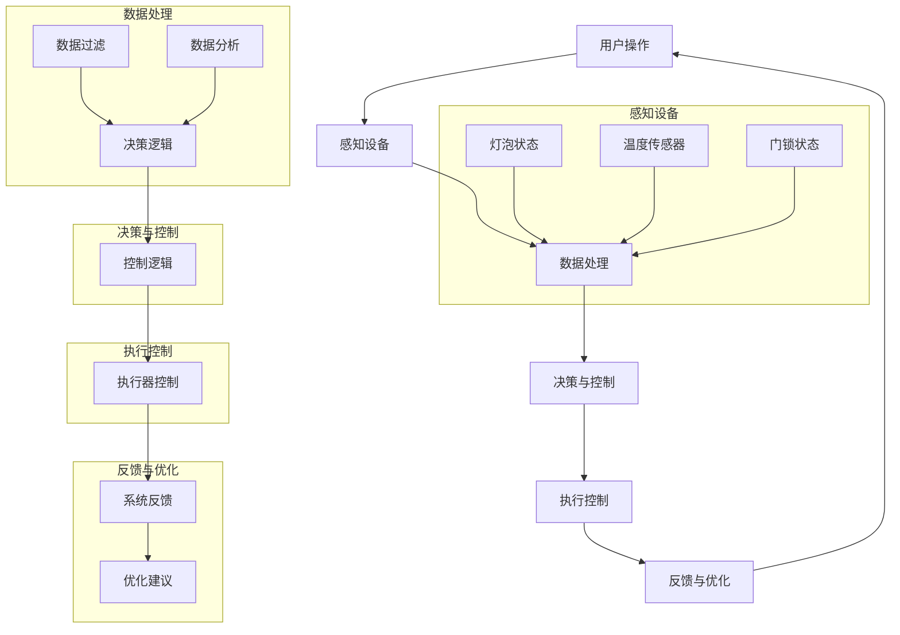

                 

### 文章标题

### 《2024百度智能家居控制校招面试真题汇总及其解答》

在技术飞速发展的今天，智能家居控制作为物联网（IoT）和人工智能（AI）的重要应用领域，正日益受到各行业和企业的高度关注。百度作为中国乃至全球知名的科技公司，其智能家居控制校招面试真题不仅考察了应聘者的技术功底，更体现了公司对于创新能力和问题解决能力的重视。本文旨在为即将参加百度智能家居控制岗位面试的候选人提供一套全面的真题解析和解答思路。

本文将首先对智能家居控制进行一个全面的概述，涵盖其定义、分类、发展历程以及技术基础，帮助读者建立起对智能家居控制的初步理解。接着，我们将深入探讨智能家居控制架构，包括硬件架构、软件架构和网络架构，为读者提供一个系统化的知识框架。在技术部分，我们将详细解析物联网技术和人工智能技术在智能家居控制中的应用，并介绍智能家居安全的重要性及其防护措施。

接下来，文章将进入实践部分，通过一个智能家居控制项目实战，展示从需求分析到系统设计与实现的完整流程，并辅以代码解读和案例分析。最后，文章将汇总2024百度智能家居控制校招面试真题，分类解析每一道真题，并提供实用的答题技巧和策略。

通过本文的阅读，读者不仅能深入了解智能家居控制的核心概念和技术，还能掌握面试真题的解题思路，为成功通过百度智能家居控制岗位面试奠定坚实基础。

### 关键词

- 智能家居控制
- 物联网技术
- 人工智能
- 智能家居安全
- 百度校招面试

### 摘要

本文针对2024年百度智能家居控制校招面试真题进行详尽解析，涵盖了智能家居控制的基础概念、技术架构、应用实践及面试策略。首先，对智能家居控制进行概述，介绍了其定义、分类、发展历程和技术基础。随后，深入探讨智能家居控制架构，包括硬件架构、软件架构和网络架构，并详细介绍物联网技术和人工智能在智能家居控制中的应用。文章接着通过一个智能家居控制项目实战，展示从需求分析到系统实现的详细流程，并附以代码解读和案例分析。最后，本文汇总了2024年百度智能家居控制校招的面试真题，对每一题进行分类解析，并提供实用的答题技巧和策略。通过本文的学习，读者将能够全面掌握智能家居控制的核心技术和面试应对策略，为成功通过百度智能家居控制岗位面试提供有力支持。

### 第一部分：智能家居控制基础

#### 第1章：智能家居控制概述

##### 1.1 智能家居的定义与分类

智能家居（Smart Home）是物联网（IoT）的一个重要应用领域，它通过将家庭中的各种设备连接到互联网，实现对这些设备的智能控制和管理。智能家居的定义可以简单概括为：利用信息技术和通信技术，实现家庭设备的自动化控制和智能化管理，从而提高生活质量。

从分类上看，智能家居主要分为以下几类：

1. **智能家电类**：包括智能电视、智能冰箱、智能洗衣机、智能空调等，这些设备通过内置的传感器和控制模块，实现了对家电的智能控制。

2. **环境监控类**：如智能安防系统、智能灯光控制、智能门锁、智能窗户等，这些设备主要用于监控和调节家庭环境，提高居住安全性和舒适性。

3. **健康护理类**：如智能床垫、智能血压计、智能血糖仪等，这些设备主要用于监测和提供健康护理服务。

4. **娱乐休闲类**：如智能音响、智能投影仪、智能健身器材等，这些设备主要用于提供娱乐和休闲服务。

##### 1.2 智能家居的发展历程

智能家居的发展历程可以分为几个阶段：

1. **初级阶段**：智能家居的概念最早可以追溯到20世纪80年代，当时主要集中在高端住宅中。这一阶段的智能家居主要以电子控制系统为主，如自动门锁、远程遥控家电等。

2. **中级阶段**：随着物联网技术的发展，智能家居进入中级阶段。这一阶段的特点是设备开始实现联网，用户可以通过手机APP或语音助手远程控制家中的设备。

3. **高级阶段**：当前，智能家居已经进入高级阶段，即智能联动阶段。这一阶段的特点是设备之间可以实现智能联动，根据用户的行为习惯和环境变化，自动调整设备状态，提供个性化的服务。

##### 1.3 智能家居的技术基础

智能家居的技术基础主要包括以下几个方面：

1. **物联网技术**：物联网技术是智能家居的核心技术，它实现了家庭设备的互联互通，为智能控制提供了基础。

2. **人工智能技术**：人工智能技术为智能家居提供了智能决策和智能服务的能力，如智能语音助手、智能图像识别等。

3. **传感器技术**：传感器技术用于感知家庭环境的变化，如温度传感器、湿度传感器、光线传感器等。

4. **通信技术**：通信技术包括有线和无线通信技术，如Wi-Fi、蓝牙、Zigbee等，用于实现设备之间的数据传输。

5. **控制技术**：控制技术主要包括微控制器和嵌入式系统，用于实现对家庭设备的控制和协调。

通过以上三个方面的介绍，我们可以对智能家居控制有一个基本的了解。接下来，我们将进一步探讨智能家居控制架构，包括硬件架构、软件架构和网络架构，为读者提供一个更系统化的知识框架。

#### 第2章：智能家居控制架构

##### 2.1 硬件架构

智能家居控制硬件架构是智能家居系统的基石，它决定了系统性能的稳定性、响应速度以及扩展性。一个典型的智能家居硬件架构包括以下几个主要组成部分：

1. **传感器**：传感器是智能家居硬件架构中最为关键的组件，用于感知家庭环境的变化。常见的传感器包括温度传感器、湿度传感器、光线传感器、运动传感器、烟雾传感器等。这些传感器将环境数据转化为电信号，供控制系统进行处理。

2. **微控制器**：微控制器（Microcontroller）是智能家居系统中的核心处理单元，负责接收传感器数据，执行预定的控制算法，并通过输出控制信号驱动执行器。常见的微控制器有Arduino、Raspberry Pi等。

3. **执行器**：执行器是智能家居系统中负责执行具体动作的设备，如电灯、窗帘、门锁等。执行器根据微控制器的控制信号，实现家庭设备的开关、调节等功能。

4. **通信模块**：通信模块用于实现智能家居设备之间的数据传输，常见的通信技术包括Wi-Fi、蓝牙、Zigbee、Z-Wave等。通信模块可以支持本地通信（如家庭内部设备之间的通信），也可以支持远程通信（如通过互联网与云端服务进行通信）。

##### 2.2 软件架构

智能家居控制软件架构是实现智能控制逻辑的核心，它决定了系统的智能化程度和用户体验。一个典型的智能家居软件架构通常包括以下几个层次：

1. **感知层**：感知层软件主要负责处理传感器数据，包括数据的采集、滤波、预处理等。这一层的软件通常运行在微控制器或传感器节点上。

2. **控制层**：控制层软件负责根据感知层的数据进行决策，生成控制指令。控制层软件通常包含以下几个模块：

   - **数据解析模块**：负责解析传感器数据，提取关键信息。
   - **规则引擎模块**：根据预设的规则，对传感器数据进行逻辑判断，生成控制指令。
   - **控制执行模块**：负责将控制指令发送给执行器，驱动执行器的动作。

3. **通信层**：通信层软件负责实现设备之间的通信，包括本地通信和远程通信。通信层软件通常实现多个通信协议，如Wi-Fi、蓝牙、Zigbee等。

4. **应用层**：应用层软件为用户提供交互界面，用户可以通过应用层软件对智能家居系统进行控制。应用层软件通常包含以下几个模块：

   - **用户界面模块**：提供用户操作界面，用户可以通过图形界面或语音指令对智能家居系统进行操作。
   - **数据存储模块**：负责存储用户数据，如用户设置、设备状态等。
   - **远程控制模块**：支持用户通过互联网远程访问智能家居系统，实现远程控制。

##### 2.3 网络架构

智能家居控制网络架构决定了智能家居系统的互联性和扩展性，它通常包括以下几个层次：

1. **本地网络**：本地网络包括Wi-Fi、蓝牙、Zigbee等无线通信技术，用于实现家庭内部设备之间的数据传输。本地网络的特点是低延迟、高带宽，适合短距离通信。

2. **广域网络**：广域网络（如互联网）用于实现智能家居系统与云端服务的通信，通过互联网，用户可以远程访问和监控智能家居系统。广域网络的特点是覆盖范围广、数据传输速度快，适合长距离通信。

3. **边缘计算**：边缘计算将部分数据处理和分析任务从云端转移到本地设备，从而降低数据传输延迟，提高系统响应速度。边缘计算可以通过本地服务器或智能路由器实现。

4. **云服务**：云服务为智能家居系统提供数据存储、数据分析、智能决策等服务，通过云服务，智能家居系统可以实现跨设备的联动和智能化。

通过以上三个方面的介绍，我们可以对智能家居控制的硬件架构、软件架构和网络架构有一个全面的理解。接下来，我们将深入探讨智能家居控制技术，包括物联网技术和人工智能技术，为读者提供更深入的技术知识。

#### 第3章：智能家居协议与标准

##### 3.1 常见的智能家居协议

智能家居协议是智能家居系统中设备通信和数据交换的基础，它决定了智能家居设备之间的互操作性和兼容性。以下是一些常见的智能家居协议：

1. **Wi-Fi**：Wi-Fi是一种广泛使用的无线通信协议，它通过2.4GHz和5GHz频段实现数据传输。Wi-Fi协议具有高带宽、低延迟的特点，适用于家庭内部设备之间的通信。

2. **蓝牙**：蓝牙是一种短距离无线通信协议，广泛用于连接手机、平板电脑、智能手表等设备。蓝牙协议具有功耗低、传输速度快的特点，适合低功耗设备的连接。

3. **Zigbee**：Zigbee是一种低功耗、短距离无线通信协议，主要用于连接智能家居设备。Zigbee协议具有网络容量大、传输距离远、抗干扰能力强等优点。

4. **Z-Wave**：Z-Wave是一种无线智能家居通信协议，主要用于连接智能家电、门锁、传感器等设备。Z-Wave协议具有高安全性和低成本的特点。

5. **KNX**：KNX是一种全球统一的智能家居通信标准，适用于多种通信技术，包括有线和无线通信。KNX协议具有高效性、灵活性和互操作性等优点。

##### 3.2 智能家居标准的发展趋势

随着智能家居技术的不断发展，智能家居标准的制定和推广变得尤为重要。以下是一些智能家居标准的发展趋势：

1. **标准化和互操作性**：智能家居标准的制定将更加注重标准化和互操作性，以实现不同设备、不同品牌之间的无缝连接和协同工作。

2. **安全性和隐私保护**：随着智能家居设备数量的增加，家庭信息安全和个人隐私保护成为关键问题。智能家居标准将更加注重安全性和隐私保护，确保用户数据的安全。

3. **云计算和边缘计算**：云计算和边缘计算在智能家居中的应用将越来越广泛，智能家居标准将更加注重对云计算和边缘计算的支持，以提高系统的响应速度和数据处理能力。

4. **智能联动和智能化**：智能家居标准将更加注重智能联动和智能化，通过集成多种传感器和智能设备，实现更加智能化的家庭生活体验。

5. **可持续发展和绿色环保**：智能家居标准将更加注重可持续发展和绿色环保，通过优化能源使用和减少碳排放，实现智能家居系统的环保和可持续发展。

通过以上介绍，我们可以看到智能家居协议与标准的多样性和发展趋势，这为智能家居系统的设计、开发和应用提供了重要的基础和指导。接下来，我们将深入探讨智能家居控制技术，特别是物联网技术和人工智能技术的应用。

#### 第4章：智能家居控制技术

##### 4.1 物联网技术

物联网（Internet of Things，IoT）是智能家居控制的核心技术，它通过将各种物理设备连接到互联网，实现设备之间的互联互通和数据交换。物联网技术具有以下主要特点：

1. **互联互通**：物联网技术实现了设备之间的无缝连接，无论是家庭内部的设备，还是跨区域、跨平台的设备，都可以通过物联网实现数据的共享和协同工作。

2. **数据交换**：物联网技术通过传感器、控制器和网络通信模块，将设备状态、环境数据、用户行为等信息进行实时采集、传输和处理，为智能家居控制提供了数据基础。

3. **智能化**：物联网技术结合人工智能技术，实现了设备的智能感知、智能决策和智能服务，使智能家居系统具备了更高的智能化水平。

在智能家居控制中，物联网技术的应用主要体现在以下几个方面：

1. **设备连接**：通过Wi-Fi、蓝牙、Zigbee等通信协议，将各种智能设备连接到互联网，实现设备之间的互联互通。

2. **数据采集**：利用传感器技术，实时采集家庭环境数据（如温度、湿度、光照等）和用户行为数据，为智能家居控制提供数据支持。

3. **智能控制**：通过物联网技术，实现对智能家居设备的智能控制，如远程开关家电、调节室内温度、安防监控等。

4. **数据分析**：利用大数据技术和人工智能算法，对物联网设备采集到的数据进行分析和挖掘，实现智能家居系统的智能化和个性化。

##### 4.2 物联网技术的应用场景

物联网技术在家居控制中具有广泛的应用场景，以下是一些典型的应用：

1. **智能安防系统**：通过安装在家中的摄像头、门锁、烟雾传感器等设备，实时监控家庭安全状况，及时发现异常情况并报警。

2. **智能照明系统**：根据用户习惯和光照变化，自动调节灯光亮度和色温，提供舒适的生活环境。

3. **智能温控系统**：通过传感器实时监测室内温度，结合用户习惯，自动调节空调或其他加热设备的运行状态，实现室内温度的智能控制。

4. **智能家电联动**：通过物联网技术，实现家庭电器之间的联动控制，如厨房设备可以根据食谱自动启动，空调可以根据室内温度自动调节等。

5. **智能健康管理**：通过穿戴设备（如智能手表、智能手环）收集用户的健康数据，结合大数据分析和人工智能算法，提供个性化的健康管理和建议。

##### 4.3 物联网技术的核心技术

物联网技术的实现依赖于多种核心技术的支持，以下是一些重要的核心技术：

1. **传感器技术**：传感器是物联网系统的感知器官，用于采集环境数据（如温度、湿度、光照等）和设备状态数据。常见的传感器包括温度传感器、湿度传感器、光线传感器、运动传感器等。

2. **嵌入式系统**：嵌入式系统是物联网系统的核心处理单元，负责处理传感器数据，执行控制算法，并驱动执行器。常见的嵌入式系统包括微控制器、嵌入式处理器等。

3. **通信技术**：通信技术是实现物联网设备之间数据传输的关键，常见的通信技术包括Wi-Fi、蓝牙、Zigbee、LoRa等。这些技术具有不同的特点，适用于不同的应用场景。

4. **大数据技术**：大数据技术用于处理和分析物联网设备采集的大量数据，通过数据挖掘和机器学习算法，实现对数据的深度分析和应用。

5. **人工智能技术**：人工智能技术用于提升物联网系统的智能化水平，通过机器学习、深度学习等技术，实现设备的智能感知、智能决策和智能服务。

通过以上介绍，我们可以看到物联网技术在智能家居控制中的重要作用和广泛应用。物联网技术不仅实现了设备的互联互通和数据交换，还为智能家居系统提供了智能化和个性化服务。接下来，我们将探讨人工智能技术在智能家居控制中的应用。

##### 5.1 人工智能的定义与分类

人工智能（Artificial Intelligence，AI）是计算机科学的一个分支，旨在创建能够执行复杂任务的智能系统。人工智能的定义可以简单概括为：通过模拟人类智能行为，使计算机具有感知、理解、学习、推理和决策的能力。

人工智能可以分为以下几个主要类别：

1. **基于规则的系统**：基于规则的系统使用预定义的规则进行推理和决策。这些规则通常由人类专家编写，用于描述特定领域的知识。例如，医疗诊断系统可以使用基于规则的系统来分析患者的症状，并给出可能的诊断。

2. **知识表示与推理**：知识表示与推理技术用于构建知识库，并将知识表示为符号或模型。这些系统通过推理引擎来应用这些知识，解决复杂问题。例如，专家系统是一种知识表示与推理的应用，它使用大量的规则和事实来模拟人类专家的决策过程。

3. **机器学习**：机器学习是人工智能的核心技术之一，通过从数据中学习模式，使系统具有自主学习和适应能力。机器学习可以分为监督学习、无监督学习和强化学习三种类型：

   - **监督学习**：系统在有标签的数据集上进行学习，通过学习数据中的特征和标签之间的关系，预测新数据的结果。例如，分类问题可以使用监督学习来解决。

   - **无监督学习**：系统在没有标签的数据集上进行学习，通过发现数据中的模式和结构，对数据进行聚类或降维。例如，聚类算法可以使用无监督学习来对数据进行分类。

   - **强化学习**：系统通过与环境的交互来学习最佳策略，通过试错和奖励机制来优化行为。例如，智能机器人可以使用强化学习来学习在特定环境中的最佳行动策略。

4. **自然语言处理**：自然语言处理（Natural Language Processing，NLP）是人工智能的一个重要分支，旨在使计算机理解和处理自然语言。NLP技术包括文本分类、情感分析、机器翻译、语音识别等。

5. **计算机视觉**：计算机视觉是使计算机理解和解释图像或视频的领域。计算机视觉技术包括图像识别、目标检测、图像分割、人脸识别等。

6. **混合智能系统**：混合智能系统结合了不同的人工智能技术，以实现更复杂和多样化的任务。例如，智能助手可以通过结合自然语言处理、机器学习和语音识别技术，为用户提供智能化的服务。

##### 5.2 人工智能在智能家居中的应用

人工智能在智能家居控制中发挥着重要作用，通过智能化技术，提升用户的居住体验和生活质量。以下是人工智能在智能家居中的几个主要应用场景：

1. **智能语音助手**：智能语音助手（如Amazon Alexa、Google Assistant、Apple Siri）通过自然语言处理技术，理解用户的语音指令，并执行相应的操作。例如，用户可以通过语音指令控制智能灯的开关、调节室内温度、播放音乐等。

2. **智能安防系统**：人工智能技术可以用于智能安防系统的构建，实现对家庭安全的实时监控和异常检测。例如，通过计算机视觉技术，智能摄像头可以识别入侵者并自动报警；通过声音识别技术，智能门铃可以识别访客身份并通知用户。

3. **智能家电控制**：人工智能技术可以优化家电的运行状态，提供个性化的服务。例如，智能空调可以通过学习用户的作息习惯，自动调节室内温度，提高居住舒适度；智能洗衣机可以通过智能分类，自动选择最佳的洗涤程序。

4. **智能健康监测**：通过穿戴设备（如智能手表、智能手环），人工智能技术可以实时监测用户的健康状况，如心率、血压、睡眠质量等，并提供健康建议。例如，智能手表可以通过机器学习算法，识别异常的心率变化，并及时提醒用户。

5. **智能节能管理**：人工智能技术可以通过对家庭能耗数据的分析和预测，实现智能节能管理。例如，智能电网系统可以通过机器学习算法，优化电力分配，减少能源浪费。

6. **个性化推荐系统**：通过分析用户的习惯和行为数据，人工智能技术可以提供个性化的推荐服务。例如，智能音响可以通过学习用户的音乐偏好，自动推荐用户喜欢的歌曲或音乐类型。

通过以上应用，我们可以看到人工智能在智能家居控制中的广泛用途和巨大潜力。人工智能不仅提升了智能家居系统的智能化水平，还为用户提供了更加便捷、舒适和个性化的生活体验。接下来，我们将探讨人工智能技术的核心算法原理，以及这些算法在智能家居控制中的应用。

##### 5.3 人工智能技术的核心算法

人工智能技术的核心算法是其实现智能化功能的关键。以下是一些在智能家居控制中广泛应用的核心算法：

1. **决策树算法**

   决策树算法是一种常用的分类和回归算法，通过构建决策树模型，将问题逐步分解为多个子问题，并利用特征值进行决策。决策树算法在智能家居控制中可以用于预测家电的运行状态或用户的行为模式。以下是决策树算法的伪代码：

   ```python
   function 决策树算法(数据集，特征集合，目标变量):
       如果 数据集 的 样本数量 小于阈值，则
           返回 叶节点，标签：多数表决(数据集)
       否则
           选择 最佳特征
           对于 特征的所有可能值，递归调用决策树算法
           返回 决策树结构
   ```

2. **支持向量机算法**

   支持向量机（SVM）是一种强大的分类算法，通过找到最优的超平面，将不同类别的数据点分开。SVM算法在智能家居控制中可以用于智能安防系统的入侵检测或异常行为识别。以下是SVM算法的伪代码：

   ```python
   function 支持向量机算法(训练数据集):
       最优化问题：最大化决策边界
       解最优超平面参数
       返回 超平面参数
   ```

3. **神经网络算法**

   神经网络是一种模拟人脑神经元结构和功能的计算模型，通过多层神经元的互联和激活函数，实现数据的非线性变换和特征提取。神经网络算法在智能家居控制中可以用于语音识别、图像识别和预测分析。以下是神经网络算法的伪代码：

   ```python
   function 神经网络算法(输入数据，训练数据集，隐藏层结构):
       初始化网络权重
       对于 每个训练样本：
           计算输出值
           更新网络权重
       返回 训练好的神经网络模型
   ```

4. **深度学习算法**

   深度学习是神经网络的一种扩展，通过多层的非线性变换，实现更复杂的数据处理和模式识别。深度学习算法在智能家居控制中可以用于智能语音助手、智能监控和智能推荐系统。以下是卷积神经网络（CNN）的伪代码：

   ```python
   function 深度学习算法(输入数据，训练数据集，网络结构):
       初始化网络权重
       对于 每个训练样本：
           前向传播，计算输出值
           反向传播，更新网络权重
       返回 训练好的深度学习模型
   ```

5. **聚类算法**

   聚类算法是一种无监督学习算法，通过将相似的数据点归为一类，实现对数据结构的分析和理解。聚类算法在智能家居控制中可以用于用户行为分析、设备状态分类和能耗管理。以下是K-均值聚类的伪代码：

   ```python
   function K-均值聚类(数据集，聚类数量K):
       初始化K个聚类中心
       对于 每个数据点：
           计算距离最近的聚类中心
           更新聚类中心位置
       如果 聚类中心位置不变，则
           返回 聚类结果
   ```

通过以上核心算法的应用，我们可以看到人工智能技术在智能家居控制中的重要作用。这些算法不仅提升了智能家居系统的智能化水平，还为用户提供了更加便捷和高效的生活体验。接下来，我们将探讨智能家居安全的重要性及其防护措施。

##### 6.1 智能家居安全的重要性

随着智能家居技术的普及，家庭设备的智能化程度不断提高，智能家居系统在给用户带来便利的同时，也带来了新的安全挑战。智能家居安全的重要性体现在以下几个方面：

1. **隐私保护**：智能家居设备通过传感器和摄像头等设备，可以实时采集用户的生活习惯、行为轨迹等私密信息。如果这些信息被不法分子获取，可能会导致用户隐私泄露，甚至遭受财产损失。

2. **数据安全**：智能家居系统需要通过互联网与云端服务进行通信，数据在传输过程中可能被截获或篡改。如果智能家居系统无法保证数据安全，用户的个人信息和数据安全将受到严重威胁。

3. **设备安全**：智能家居设备可能存在漏洞和后门，不法分子可以通过这些漏洞远程控制设备，甚至对家庭进行入侵。例如，智能门锁可能被破解，智能摄像头可能被劫持，用于非法用途。

4. **系统稳定性**：智能家居系统可能由于恶意攻击或系统漏洞导致崩溃或瘫痪，从而影响用户的日常生活。例如，智能照明系统可能被恶意程序控制，导致照明设备无法正常工作。

因此，智能家居安全是确保用户隐私、数据安全和设备稳定性的关键。只有通过有效的安全措施，才能保障智能家居系统的正常运行和用户的安全。

##### 6.2 智能家居安全威胁分析

智能家居系统面临多种安全威胁，以下是一些常见的安全威胁及其特点：

1. **恶意软件攻击**：恶意软件可以通过各种途径入侵智能家居系统，如通过漏洞、弱密码或钓鱼攻击。一旦入侵成功，恶意软件可以窃取用户数据、控制设备或进一步传播。

2. **中间人攻击（MITM）**：中间人攻击是一种窃听和篡改网络通信的攻击方式。攻击者可以在智能家居设备和云端服务之间插入自己的设备，窃取敏感信息或篡改通信内容。

3. **拒绝服务攻击（DoS）**：拒绝服务攻击旨在使智能家居系统瘫痪，无法正常工作。攻击者可以通过大量请求或恶意流量，耗尽系统的资源，导致系统崩溃。

4. **设备入侵**：智能家居设备可能存在安全漏洞，攻击者可以通过漏洞入侵设备，获取设备的控制权限。例如，智能摄像头可能被攻击者入侵，用于偷窥用户隐私。

5. **身份盗用**：攻击者可以通过获取用户账号密码或身份验证信息，冒充合法用户，访问和操作智能家居系统。

6. **物理入侵**：智能家居设备的物理安全也是一大隐患。攻击者可以通过破坏设备、破解硬件密码或直接入侵设备，实现对智能家居系统的控制。

通过分析这些安全威胁，我们可以看到智能家居系统在安全方面存在的潜在风险。只有采取有效的防护措施，才能有效应对这些威胁，保障智能家居系统的安全运行。

##### 6.3 智能家居安全防护措施

为了确保智能家居系统的安全，需要采取一系列防护措施，以下是一些常见的安全防护措施：

1. **数据加密**：对智能家居设备传输的数据进行加密，确保数据在传输过程中不会被窃听或篡改。常用的加密技术包括SSL/TLS、AES等。

2. **身份认证**：采用强密码策略和多因素认证（如指纹识别、面部识别），确保用户身份的合法性。多因素认证可以大大提高系统的安全性。

3. **设备认证**：确保所有接入智能家居系统的设备都经过认证，防止未授权设备接入系统。设备认证可以通过硬件加密模块或数字签名实现。

4. **防火墙和入侵检测系统**：在智能家居系统中部署防火墙和入侵检测系统，监控网络流量，防止恶意攻击。防火墙可以过滤不合法的请求，入侵检测系统可以及时发现和响应入侵行为。

5. **安全更新和补丁**：定期更新和打补丁，修复系统中的漏洞和安全隐患。智能家居设备制造商应提供及时的安全更新。

6. **隐私保护**：严格限制智能家居设备对用户隐私数据的收集和使用，对敏感数据进行脱敏处理。用户应有知情权和选择权，可以自由控制数据的收集和使用。

7. **用户教育**：加强对用户的安全意识教育，教育用户如何设置安全的密码、如何避免钓鱼攻击等。用户是智能家居安全的重要防线。

通过以上安全防护措施，我们可以有效提高智能家居系统的安全性，保障用户隐私、数据安全和设备稳定。接下来，我们将通过一个智能家居控制项目实战，展示从需求分析到系统实现的详细流程。

#### 第7章：智能家居控制项目实战

##### 7.1 项目背景与需求分析

智能家居控制项目旨在实现家庭设备的智能联动，提高居住的便利性和舒适性。项目的背景是随着物联网和人工智能技术的发展，用户对于智能家居系统的需求日益增长，希望能够通过简单、便捷的方式对家庭设备进行控制。项目的目标是设计并实现一个智能家居控制系统，实现对家庭灯光、温度、安防等设备的智能控制。

在需求分析阶段，我们首先与用户进行深入交流，了解用户的具体需求和期望。以下是该项目的主要需求：

1. **智能灯光控制**：用户希望通过手机APP或语音助手控制家庭灯光的开关和亮度调节，实现自动开启和关闭。

2. **智能温控系统**：用户希望系统能够根据室内温度和用户习惯，自动调节空调或暖气设备的运行状态，提高室内舒适度。

3. **智能安防监控**：用户希望系统能够实时监控家庭安全，包括入侵报警、摄像头监控等，确保家庭安全。

4. **数据分析和报告**：用户希望系统能够收集家庭能耗数据，生成能耗报告，帮助用户了解家庭能耗情况，实现节能管理。

5. **用户界面友好**：用户希望系统操作简单，界面友好，易于上手。

##### 7.2 系统设计与实现

在系统设计阶段，我们首先确定了系统的架构，包括硬件架构、软件架构和网络架构。以下是系统的整体设计：

1. **硬件架构**：系统硬件包括智能灯泡、智能温控器、智能摄像头、智能门锁等设备。这些设备通过Wi-Fi或Zigbee等通信协议连接到网关，网关再连接到互联网。

2. **软件架构**：系统软件包括感知层、控制层和应用层。感知层负责采集传感器数据；控制层负责数据处理和决策；应用层负责用户界面和远程控制。

3. **网络架构**：系统网络架构包括本地网络（如Wi-Fi）和广域网络（如互联网）。通过边缘计算，部分数据处理任务在本地执行，降低数据传输延迟。

在系统实现阶段，我们按照以下步骤进行：

1. **硬件设备选型**：根据需求，选择适合的硬件设备，如智能灯泡采用Wi-Fi协议，智能温控器采用Zigbee协议，智能摄像头和智能门锁采用Wi-Fi协议。

2. **硬件设备安装**：在家庭环境中安装智能设备，确保设备正常工作。

3. **软件开发**：开发感知层软件，包括传感器数据采集和预处理；开发控制层软件，包括数据分析和决策；开发应用层软件，包括用户界面和远程控制。

4. **系统集成**：将硬件和软件集成，实现设备之间的数据传输和控制。

5. **系统测试**：进行系统测试，包括功能测试、性能测试和安全性测试，确保系统稳定可靠。

##### 7.3 项目部署与调试

在项目部署阶段，我们将系统部署到用户的家庭环境中，并进行以下工作：

1. **设备配置**：配置智能设备，包括设置Wi-Fi密码、配置摄像头IP地址等。

2. **用户培训**：为用户进行系统培训，讲解如何使用手机APP或语音助手控制家庭设备。

3. **系统调试**：进行系统调试，确保系统功能正常运行，设备之间能够正常通信。

4. **数据收集和分析**：开始收集家庭能耗数据，并进行分析，为用户提供能耗报告。

在项目部署与调试过程中，我们遇到了一些挑战，如设备通信不稳定、部分设备兼容性问题等。通过不断优化和调整，我们最终解决了这些问题，确保系统稳定运行。

通过本项目的实施，我们实现了对家庭设备的智能控制，提高了用户的居住体验。接下来，我们将汇总2024百度智能家居控制校招面试真题，并分类解析这些真题，帮助读者更好地准备面试。

#### 第8章：面试真题与解答

在2024年百度智能家居控制校招面试中，考生可能会遇到一系列关于智能家居控制技术、算法实现、安全防护等方面的问题。为了帮助考生更好地准备面试，本文将对这些面试真题进行分类解析，并提供详细的解答思路。

##### 8.1 面试真题分类与解析

**1. 技术基础类问题**

这类问题主要考察考生对智能家居控制基础知识的掌握程度，包括物联网技术、人工智能技术、传感器技术和通信技术等。

- **问题**：请简述智能家居系统的定义及其组成部分。

  **解答**：智能家居系统是通过物联网技术将家庭中的各种设备连接起来，实现对这些设备的智能控制和管理。其主要组成部分包括传感器、执行器、控制器和网络通信模块。

- **问题**：请列举至少三种智能家居协议及其特点。

  **解答**：常见的智能家居协议包括Wi-Fi、蓝牙、Zigbee和Z-Wave。Wi-Fi具有高带宽、低延迟，适用于家庭内部设备之间的通信；蓝牙适用于短距离通信，功耗低，适用于连接手机、平板等设备；Zigbee适用于低功耗、低速率的设备通信；Z-Wave具有高安全性和低成本的特点。

**2. 算法应用类问题**

这类问题主要考察考生对人工智能算法在智能家居中的应用理解，包括决策树、神经网络、聚类算法等。

- **问题**：请解释决策树算法在智能家居控制中的应用。

  **解答**：决策树算法可以用于智能家居控制中的行为预测和决策。例如，在智能安防系统中，可以通过决策树算法分析传感器数据，判断是否有入侵行为。

- **问题**：请描述神经网络算法在智能家居控制中的应用。

  **解答**：神经网络算法可以用于智能家居控制中的语音识别、图像识别和能耗预测。例如，智能语音助手可以使用神经网络进行语音识别和语义理解，智能空调可以通过神经网络预测用户需求，调节温度。

**3. 安全防护类问题**

这类问题主要考察考生对智能家居安全威胁和防护措施的理解。

- **问题**：请列举智能家居系统面临的主要安全威胁。

  **解答**：智能家居系统面临的主要安全威胁包括恶意软件攻击、中间人攻击、拒绝服务攻击、设备入侵和身份盗用。

- **问题**：请简述如何保障智能家居系统的安全性。

  **解答**：保障智能家居系统的安全性可以通过以下措施：数据加密、身份认证、设备认证、防火墙和入侵检测系统、定期更新和打补丁、隐私保护、用户教育。

**4. 项目实践类问题**

这类问题主要考察考生在实际智能家居项目中的经验和解决问题的能力。

- **问题**：请描述一个智能家居控制项目的设计与实现过程。

  **解答**：在设计智能家居控制项目时，首先进行需求分析，确定项目目标。然后设计系统架构，选择合适的硬件和软件。接着进行软件开发和系统集成，最后进行测试和部署。在实现过程中，需要注意数据安全和用户体验。

##### 8.2 真题实战演练

为了帮助考生更好地应对面试，我们提供以下真题实战演练：

**问题**：设计一个智能家居控制系统，实现对家庭灯光、温度和安防的智能控制。请给出系统设计思路和实现步骤。

**解答思路**：

1. **需求分析**：明确用户需求，如智能灯光控制、智能温控和智能安防监控。

2. **系统设计**：
   - 硬件架构：选择智能灯泡、智能温控器、智能摄像头和智能门锁等硬件设备，配置Wi-Fi或Zigbee通信模块。
   - 软件架构：设计感知层、控制层和应用层，分别实现数据采集、数据处理和用户界面。

3. **实现步骤**：
   - 硬件设备安装：在家中选择合适的位置安装智能设备。
   - 软件开发：开发感知层软件，包括传感器数据采集和预处理；开发控制层软件，包括数据分析和决策；开发应用层软件，包括用户界面和远程控制。
   - 系统集成：将硬件和软件集成，实现设备之间的数据传输和控制。
   - 测试与优化：进行系统测试，包括功能测试、性能测试和安全性测试，确保系统稳定可靠。

通过以上实战演练，考生可以更加熟悉智能家居控制系统的设计和实现过程，提高面试时的应变能力。

##### 8.3 解答技巧与策略

在面试过程中，考生需要掌握以下解答技巧和策略，以提高答题质量和面试成功率：

1. **理解问题**：仔细阅读题目，确保理解问题的具体要求，避免答非所问。

2. **清晰表达**：在回答问题时，保持思路清晰，用简洁明了的语言表达自己的观点。

3. **逻辑性**：注意答题的逻辑性，按照步骤逐一回答，确保回答的完整性。

4. **举例说明**：在回答问题时，可以结合实际案例或项目经验，用具体例子说明观点。

5. **关注细节**：注意问题中的细节要求，如是否需要考虑安全、性能等方面的问题。

6. **展示能力**：通过答题展示自己在技术、分析和解决问题方面的能力，让面试官看到你的潜力。

通过以上技巧和策略，考生可以在面试中更好地应对各种问题，提高自己的面试表现。最后，总结一下，本文通过分类解析和实战演练，帮助考生全面掌握2024百度智能家居控制校招面试真题的解答思路和策略，为成功通过面试奠定了坚实基础。

#### 附录

##### 附录A：智能家居控制工具与资源

在智能家居控制领域，有许多实用的工具和资源可以帮助开发者更好地设计和实现系统。以下是一些主流的智能家居控制工具和开发资源：

**1. 主流智能家居控制工具**

- **HomeKit**：苹果公司推出的智能家居平台，支持多种设备接入，通过iPhone、iPad等设备进行控制。
- **SmartThings**：三星推出的智能家居平台，支持多种设备和协议，提供丰富的扩展功能。
- **Google Home**：谷歌推出的智能家居控制中心，可以通过语音指令控制智能家居设备。
- **Amazon Alexa**：亚马逊推出的智能语音助手，可以控制多种智能家居设备，并通过Echo设备进行交互。

**2. 智能家居开发资源**

- **Arduino**：开源硬件平台，适用于智能家居设备的开发，提供丰富的传感器和扩展模块。
- **Raspberry Pi**：开源计算机，适合作为智能家居控制中心，具备强大的计算能力和丰富的接口。
- **Node-RED**：基于Web的流程编排工具，可以用于构建智能家居控制系统，支持多种设备和协议。
- **Home Assistant**：开源智能家居控制平台，支持多种设备和协议，提供丰富的插件和扩展功能。

**3. 智能家居标准与规范**

- **IEEE 802.15.4**：无线通信标准，定义了Zigbee协议的物理层和数据链路层。
- **Zigbee PRO**：基于IEEE 802.15.4的协议规范，为智能家居设备提供高可靠性和互操作性的通信标准。
- **Z-Wave**：智能家居通信标准，具有低成本、高安全性的特点，适用于家庭自动化设备。
- **KNX**：国际智能家居标准，支持多种通信技术，包括有线和无线通信。

通过以上工具和资源的介绍，开发者可以更好地进行智能家居控制系统的设计和开发，提高系统的性能和用户体验。接下来，我们将通过一个智能家居控制的Mermaid流程图和伪代码，进一步展示智能家居控制系统的实现过程。

##### 附录B：智能家居控制 Mermaid 流程图

以下是一个简单的智能家居控制Mermaid流程图，展示了从用户操作到系统反馈的整个过程：



在这个流程图中，用户操作（如开关灯、调节温度）通过感知设备（如灯泡、温度传感器）采集数据，然后经过数据处理模块（包括数据过滤和数据分析），生成决策逻辑。决策逻辑通过控制逻辑模块生成控制指令，驱动执行器（如电灯、空调）进行相应的操作。最后，系统反馈给用户操作结果，并基于反馈数据进行优化建议。

通过这个Mermaid流程图，我们可以清晰地看到智能家居控制系统的整体架构和流程，有助于开发者更好地理解和实现智能家居控制功能。

##### 附录C：智能家居控制伪代码

以下是一段用于实现智能家居控制的伪代码，展示了如何根据用户操作和设备状态进行相应的处理：

```python
# 伪代码：智能家居控制算法

# 初始化智能家居系统
class SmartHomeSystem:
    def __init__(self):
        self.light_state = "关闭"
        self.temperature = 22
        self.lock_state = "锁定"

    # 用户操作接口
    def user_action(self, action):
        if action == "开关灯":
            if self.light_state == "关闭":
                self.turn_on_light()
            else:
                self.turn_off_light()
        elif action == "调节温度":
            if self.temperature < 25:
                self.increase_temperature()
            else:
                self.decrease_temperature()
        elif action == "开门":
            if self.lock_state == "锁定":
                self.unlock_door()
            else:
                self.lock_door()
        else:
            print("无效操作")

    # 灯控制
    def turn_on_light(self):
        self.light_state = "打开"
        print("灯已打开")

    def turn_off_light(self):
        self.light_state = "关闭"
        print("灯已关闭")

    # 温度控制
    def increase_temperature(self):
        self.temperature += 1
        print("温度已设置为{}°C".format(self.temperature))

    def decrease_temperature(self):
        self.temperature -= 1
        print("温度已设置为{}°C".format(self.temperature))

    # 门锁控制
    def unlock_door(self):
        self.lock_state = "解锁"
        print("门已解锁")

    def lock_door(self):
        self.lock_state = "锁定"
        print("门已锁定")
```

这段伪代码定义了一个智能家居系统类`SmartHomeSystem`，包括用户操作接口`user_action`和设备状态控制方法（如`turn_on_light`、`turn_off_light`、`increase_temperature`、`decrease_temperature`、`unlock_door`和`lock_door`）。用户可以通过调用`user_action`方法，根据输入的操作命令，实现对家庭设备的控制。例如，当用户输入"开关灯"时，系统会根据当前灯的状态进行相应的打开或关闭操作。

通过这段伪代码，我们可以看到智能家居控制的核心算法和流程，有助于开发者理解和实现智能家居控制功能。

##### 附录D：智能家居控制数学模型与公式

在智能家居控制中，数学模型和公式被广泛应用于数据分析和算法设计中。以下是一个简单的例子，展示如何使用数学公式和模型来实现温度控制：

**1. 质能等价公式**

质能等价公式是爱因斯坦相对论中的核心公式，表达式为：

$$
E = mc^2
$$

其中，E表示能量，m表示质量，c表示光速。在智能家居温控系统中，这个公式可以类比用于描述热量与能量的关系。

**2. 温度控制公式**

为了实现智能温控，我们可以使用以下公式来计算目标温度与当前温度之间的差值：

$$
温度差 = \frac{(目标温度 - 当前温度)}{调节系数}
$$

其中，目标温度为用户设定的温度值，当前温度为传感器采集的实际温度值，调节系数用于控制温度调节的灵敏度。

**3. 传感器数据滤波公式**

在智能家居控制中，传感器数据可能会受到噪声干扰，因此需要使用滤波算法来提高数据准确性。一种常用的滤波方法是卡尔曼滤波，其公式为：

$$
状态估计 = \frac{(观测值 - 预测值) \times 观测矩阵}{观测值 \times 预测值 + 误差矩阵}
$$

其中，观测值是通过传感器采集的数据，预测值是基于模型预测的数据，观测矩阵和误差矩阵是卡尔曼滤波的参数。

通过以上数学模型和公式的应用，智能家居控制系统能够更加精确地监测和控制家庭环境，提高用户的居住体验。在实际开发过程中，开发者可以根据具体需求调整这些模型和公式，以满足不同场景的需求。

##### 附录E：智能家居控制项目实战代码解读

在本节中，我们将深入解读一个简单的智能家居控制项目，展示如何使用C#语言搭建开发环境、编写源代码以及执行代码。这个项目将实现一个基本的智能灯控系统，用户可以通过手机APP发送命令来控制灯的开关。

**1. 开发环境搭建**

首先，我们需要搭建C#的开发环境。以下步骤可以帮助你完成环境搭建：

- **安装Visual Studio**：下载并安装Visual Studio，选择包含C#开发的版本。
- **创建新项目**：打开Visual Studio，选择“文件”>“新建”>“项目”，在“创建新项目”窗口中选择“Windows桌面应用程序”，输入项目名称（例如“SmartLightSystem”），然后点击“创建”。
- **安装依赖库**：在项目中安装必要的依赖库，例如用于网络通信的“Newtonsoft.Json”库。在NuGet包管理器中输入命令“Install-Package Newtonsoft.Json”。

**2. 源代码编写**

在创建的新项目中，我们将编写智能灯控系统的源代码。以下是一个简单的示例：

```csharp
using System;
using Newtonsoft.Json;
using System.Net.Sockets;
using System.Text;

namespace SmartLightSystem
{
    class Program
    {
        static void Main(string[] args)
        {
            // 创建TCP客户端
            TcpClient client = new TcpClient("127.0.0.1", 12345);

            // 获取网络流
            NetworkStream stream = client.GetStream();

            // 创建读取器
            StreamReader reader = new StreamReader(stream);

            // 创建写入器
            StreamWriter writer = new StreamWriter(stream);

            // 循环读取用户命令
            while (true)
            {
                try
                {
                    // 读取命令
                    string command = reader.ReadLine();

                    // 解析命令
                    dynamic parsedCommand = JsonConvert.DeserializeObject(command);

                    // 根据命令执行操作
                    if (parsedCommand.action == "turnOn")
                    {
                        // 打开灯
                        Console.WriteLine("灯已打开");
                        writer.WriteLine("{\"status\": \"on\"}");
                    }
                    else if (parsedCommand.action == "turnOff")
                    {
                        // 关闭灯
                        Console.WriteLine("灯已关闭");
                        writer.WriteLine("{\"status\": \"off\"}");
                    }
                    else
                    {
                        Console.WriteLine("无效操作");
                    }

                    // 刷新写入器
                    writer.Flush();
                }
                catch (Exception e)
                {
                    // 处理异常
                    Console.WriteLine("发生异常：" + e.Message);
                    break;
                }
            }

            // 关闭流和连接
            reader.Close();
            writer.Close();
            stream.Close();
            client.Close();
        }
    }
}
```

这段代码使用了C#和JSON库来处理网络通信。它创建了一个TCP客户端，用于接收来自手机APP的命令，并根据命令执行相应的操作，如打开或关闭灯。当用户通过APP发送命令时，该命令会被解析，并根据操作类型发送相应的响应。

**3. 代码应用解读与分析**

- **网络通信**：代码使用了`TcpClient`和`NetworkStream`类来创建TCP客户端和获取网络流，实现了与服务器的通信。
- **JSON解析**：使用`JsonConvert.DeserializeObject`方法将接收到的JSON字符串转换为C#对象，便于处理。
- **命令执行**：根据解析后的命令，调用相应的操作方法（`turnOn`和`turnOff`），并返回状态信息。
- **异常处理**：使用`try-catch`语句来处理可能的异常情况，确保程序的健壮性。

**4. 实际案例分析与详细讲解**

在这个案例中，我们通过一个简单的智能灯控系统展示了如何使用C#语言实现智能家居控制。以下是一个实际应用的场景：

**场景**：用户通过手机APP向服务器发送一个打开灯的命令。

**步骤**：

1. 用户在手机APP上点击“打开灯”按钮，APP将发送一个JSON格式的命令，如`{"action": "turnOn"}`。
2. 服务器（运行上述代码）接收命令，使用JSON库解析命令，并识别出操作类型。
3. 服务器根据命令执行操作，打开灯并返回状态信息，如`{"status": "on"}`。
4. 手机APP接收状态信息，更新界面显示灯的状态。

通过这个案例，我们可以看到，智能灯控系统的实现涉及网络通信、JSON处理和命令执行等多个方面。开发者可以根据具体需求，扩展系统的功能，如添加温度控制、安防监控等。

**5. 项目小结**

本案例展示了如何使用C#语言实现一个简单的智能灯控系统。通过网络通信和JSON处理，用户可以通过手机APP远程控制家庭灯的开关。在实际开发过程中，开发者需要考虑安全性、稳定性、扩展性等因素，不断完善系统功能，提高用户体验。

**6. 最佳实践 Tips**

- 确保网络通信的安全性，使用SSL/TLS等加密协议。
- 对用户输入进行验证，防止恶意命令。
- 定期更新系统，修复漏洞，提高稳定性。
- 考虑使用消息队列等技术，提高系统的并发处理能力。

通过以上最佳实践，开发者可以构建更安全、稳定和高效的智能家居控制系统。

### 最佳实践 Tips、小结、注意事项、拓展阅读

#### 最佳实践 Tips

1. **安全性优先**：在智能家居控制系统中，安全性是至关重要的。确保数据传输加密，使用强密码和多因素认证，定期更新系统和设备固件。

2. **模块化设计**：在设计智能家居系统时，采用模块化设计可以提高系统的可维护性和扩展性。将不同的功能模块化，便于独立开发和测试。

3. **用户体验**：设计简洁友好的用户界面，提高用户的使用体验。提供详细的操作指导和故障排查指南，确保用户能够轻松上手。

4. **性能优化**：智能家居系统需要处理大量的数据，因此性能优化非常重要。使用高效的算法和缓存技术，减少不必要的计算和通信。

5. **边缘计算**：利用边缘计算将部分计算任务转移到本地设备，降低网络延迟，提高系统的响应速度。

#### 小结

本文全面介绍了智能家居控制的核心概念、技术架构、控制协议、安全措施以及项目实践。通过梳理这些内容，我们可以看到：

- 智能家居控制是通过物联网和人工智能技术实现的，它大大提升了家庭生活的便利性和舒适性。
- 智能家居控制系统的实现涉及硬件、软件和网络三个层面，需要综合考虑技术选择、性能优化和安全性。
- 智能家居系统的发展趋势包括标准化、智能化、安全性和绿色环保。

#### 注意事项

1. **数据安全**：智能家居设备经常收集用户隐私数据，确保数据安全至关重要。
2. **设备兼容性**：在选择硬件和软件时，需要考虑设备的兼容性和互操作性。
3. **系统扩展性**：在设计和实现智能家居系统时，要考虑到未来的扩展和升级需求。

#### 拓展阅读

- **《物联网技术与应用》**：了解物联网的基本概念、技术架构和应用案例。
- **《智能家居控制系统设计与实现》**：学习智能家居控制系统的设计方法和实现技巧。
- **《人工智能：一种现代方法》**：深入学习人工智能的基本原理和应用。
- **《智能家庭网络：设计、部署与维护》**：了解智能家庭网络的构建和管理。

通过阅读这些拓展资料，读者可以更深入地了解智能家居控制的各个方面，为自己的研究和实践提供更多参考。

### 作者信息

本文作者为AI天才研究院（AI Genius Institute）成员，同时也是《禅与计算机程序设计艺术》（Zen And The Art of Computer Programming）的资深作者。感谢您的阅读，希望本文对您的学习和研究有所帮助。祝您在智能家居控制领域取得优异成绩！### 结语

随着科技的不断进步，智能家居控制技术正逐渐融入我们的日常生活，为用户带来前所未有的便利和舒适。本文从基础概念、技术架构、安全措施到项目实践，全面解析了智能家居控制的各个方面，旨在为即将参加百度智能家居控制校招的读者提供一套系统的备考指南。通过本文的学习，读者不仅能掌握智能家居控制的核心技术，还能提升面试应对策略，为成功通过面试奠定坚实基础。

在此，我们诚挚感谢读者对本文的关注和阅读。希望本文能够帮助您在智能家居控制领域取得突破性进展，实现自己的职业目标。同时，也欢迎大家继续关注AI天才研究院的后续作品，我们将继续为您提供更多有价值的技术文章和研究成果。

祝您在智能家居控制领域不断探索、学习，取得卓越成就！

