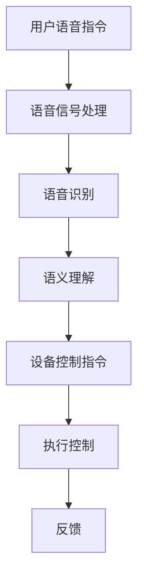
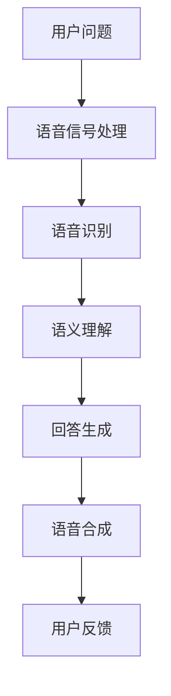
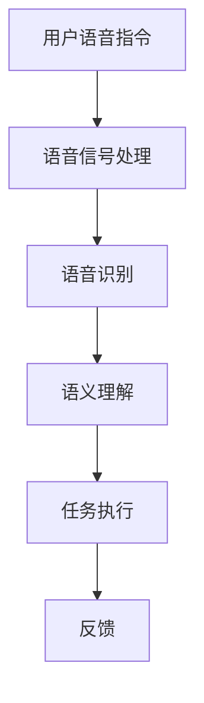
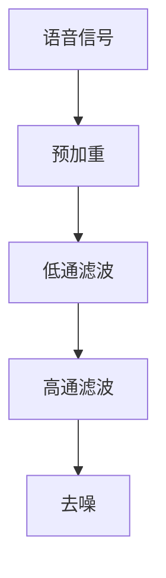
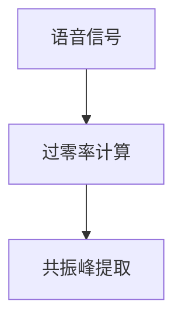
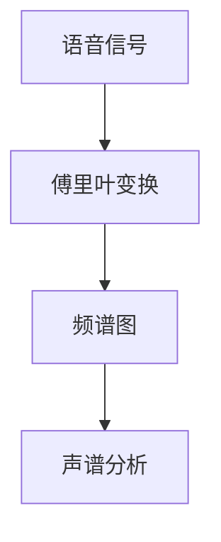
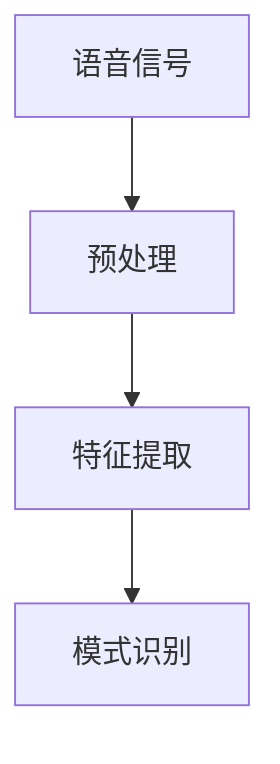
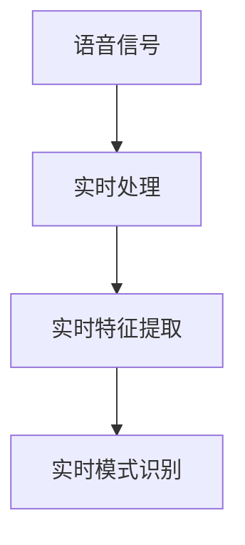
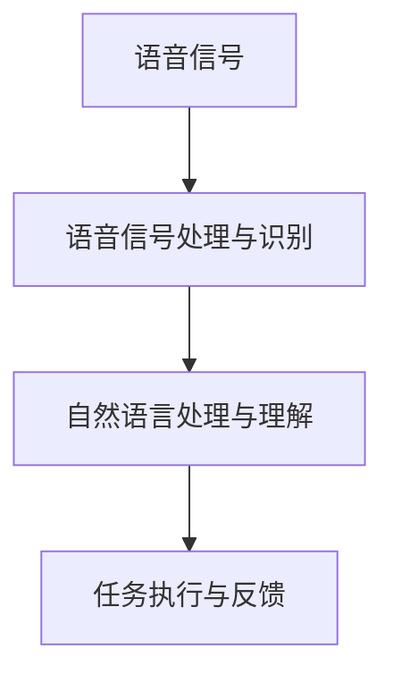

                 

### 文章标题: 《2024百度智能语音识别校招面试真题汇总及其解答》

> 关键词：智能语音识别，校招面试，真题汇总，解题思路，算法原理

> 摘要：本文旨在为2024届参加百度智能语音识别校招的应聘者提供一份详尽的面试真题汇总及其解答。文章分为六大部分：智能语音识别基础、语音信号处理技术、语音识别技术、语音合成技术、智能语音交互技术以及附录，内容涵盖了智能语音识别领域的核心知识点和面试常见问题。通过本文，读者不仅可以系统地了解智能语音识别的基本概念、原理和算法，还能掌握面试真题的解题方法和技巧，为面试做好充分准备。

### 目录大纲

1. **智能语音识别基础**
   - 1.1 智能语音识别概述
     - 1.1.1 智能语音识别的定义
     - 1.1.2 智能语音识别的应用领域
     - 1.1.3 智能语音识别的重要性
   - 1.2 智能语音识别的发展历程
     - 1.2.1 从语音识别到智能语音识别
     - 1.2.2 智能语音识别的关键技术
     - 1.2.3 智能语音识别的未来趋势

2. **语音信号处理技术**
   - 2.1 语音信号处理基础
     - 2.1.1 语音信号的分类
     - 2.1.2 语音信号的时域与频域表示
     - 2.1.3 语音信号的采集与处理
   - 2.2 语音信号处理算法
     - 2.2.1 预加重与滤波
     - 2.2.2 过零率与共振峰提取
     - 2.2.3 声谱分析

3. **语音识别技术**
   - 3.1 语音识别原理与实现
     - 3.1.1 语音识别的三步流程
     - 3.1.2 HMM模型在语音识别中的应用
     - 3.1.3 GMM和SVM在语音识别中的应用
   - 3.2 语音识别技术发展
     - 3.2.1 从规则匹配到统计模型
     - 3.2.2 从手工特征到深度学习
     - 3.2.3 语音识别的最新进展
   - 3.3 语音识别算法实现
     - 3.3.1 离线语音识别算法
     - 3.3.2 在线语音识别算法
     - 3.3.3 语音识别系统的设计

4. **语音合成技术**
   - 4.1 语音合成原理与实现
     - 4.1.1 文本到语音（TTS）的基本原理
     - 4.1.2 DNN-HMM和GMM-HMM在语音合成中的应用
     - 4.1.3 端到端语音合成（E2E）模型
   - 4.2 语音合成算法实现
     - 4.2.1 单音素合成算法
     - 4.2.2 连续语音合成算法
     - 4.2.3 语音合成系统的设计与优化

5. **智能语音交互技术**
   - 5.1 智能语音交互的概念与分类
     - 5.1.1 智能语音交互的定义
     - 5.1.2 智能语音交互的类型
     - 5.1.3 智能语音交互的应用场景
   - 5.2 智能语音交互的技术架构
     - 5.2.1 语音信号处理与识别
     - 5.2.2 自然语言处理与理解
     - 5.2.3 任务执行与反馈
   - 5.3 智能语音交互的挑战与解决方案
     - 5.3.1 语音识别的准确性
     - 5.3.2 语言理解的复杂性
     - 5.3.3 多轮对话的连贯性

6. **2024百度智能语音识别校招面试真题与解答**
   - 6.1 语音识别面试题
   - 6.2 语音合成面试题
   - 6.3 智能语音交互面试题

7. **附录**
   - 7.1 常用智能语音识别与交互工具
   - 7.2 常见面试题解析参考

8. **参考文献**

### 1. 智能语音识别基础

#### 1.1 智能语音识别概述

##### 1.1.1 智能语音识别的定义

智能语音识别是一种通过机器学习、人工智能和自然语言处理技术，将人类的语音转化为文字或命令的技术。它不仅仅是简单的语音转文字，而是一个复杂的信息处理过程，包括语音信号处理、语音识别、自然语言理解和语音生成等多个环节。

##### 1.1.2 智能语音识别的应用领域

智能语音识别技术广泛应用于各个领域，包括：

- **智能家居**：通过智能语音识别技术，用户可以使用语音控制家中的智能设备，如空调、电视、照明等。
- **智能客服**：在客户服务领域，智能语音识别技术可以自动识别用户的需求，并快速响应，提高服务效率。
- **语音助手**：如苹果的Siri、谷歌的Google Assistant等，它们可以通过语音指令帮助用户完成各种任务，如设置提醒、查询天气、发送消息等。
- **医疗领域**：医生可以通过语音识别快速记录病历，提高工作效率。
- **车载语音**：在汽车上，语音识别技术可以帮助驾驶员通过语音控制导航、播放音乐等。

##### 1.1.3 智能语音识别的重要性

智能语音识别技术具有重要的社会和经济价值：

- **提高效率**：通过语音输入，用户可以更快地完成各种任务，减少手动操作的繁琐。
- **促进智能化**：智能语音识别是推动智能设备和服务进一步发展的重要技术。
- **降低成本**：在客户服务、医疗等领域，智能语音识别可以减少人力成本，提高效率。
- **推动科技创新**：智能语音识别技术的发展推动了人工智能和自然语言处理领域的进步。

#### 1.2 智能语音识别的发展历程

##### 1.2.1 从语音识别到智能语音识别

早期的语音识别技术主要是基于规则的，即通过预先定义的规则来匹配语音信号和文字。这种方法存在很多局限性，如规则复杂、适用范围有限等。

随着计算机科学和人工智能技术的发展，统计模型和深度学习技术逐渐应用于语音识别领域。这些技术能够自动学习语音信号中的特征，并根据这些特征进行识别，大大提高了识别的准确性和鲁棒性。

智能语音识别在此基础上，进一步融合了自然语言处理技术，使得系统能够理解用户的语音指令，并生成相应的响应。

##### 1.2.2 智能语音识别的关键技术

智能语音识别的关键技术包括：

- **语音信号处理**：通过对语音信号进行预处理，如去噪、增强等，提高语音信号的质量。
- **特征提取**：从语音信号中提取出具有代表性的特征，如频谱特征、倒谱特征等。
- **模式识别**：利用模式识别算法，如隐马尔可夫模型（HMM）、高斯混合模型（GMM）、支持向量机（SVM）等，对语音信号进行分类和识别。
- **自然语言处理**：对语音信号中的文字或命令进行语义分析，理解用户的需求。
- **语音合成**：根据用户的语音指令，生成相应的语音响应。

##### 1.2.3 智能语音识别的未来趋势

未来，智能语音识别技术将继续向以下几个方向发展：

- **深度学习技术的广泛应用**：深度学习技术已经在语音识别领域取得了显著的成果，未来将继续深化应用。
- **多模态交互**：结合视觉、触觉等多种感官信息，实现更自然、更智能的语音交互。
- **个性化服务**：通过个性化推荐、用户行为分析等技术，提供更符合用户需求的语音服务。
- **实时性优化**：提高语音识别的实时性，满足高速数据处理的场景需求。
- **跨语言支持**：实现更多语言的语音识别，推动全球范围内的语音交互。

#### 1.3 智能语音识别的应用场景

##### 1.3.1 智能家居

智能家居是智能语音识别技术的重要应用场景之一。用户可以通过语音指令控制家居设备，如灯光、空调、音响等。例如，用户可以说“打开客厅的灯”，智能系统就会自动打开灯光。

##### 1.3.2 智能客服

智能客服是智能语音识别技术的另一个重要应用场景。通过智能语音识别技术，智能客服系统能够自动识别用户的问题，并生成相应的回答。这不仅提高了服务效率，还减少了人力成本。

##### 1.3.3 智能语音助手

智能语音助手是智能语音识别技术的典型应用之一。用户可以通过语音助手完成各种任务，如设置提醒、查询天气、发送消息等。智能语音助手通常与智能音箱、智能手机等设备结合使用。

#### 1.4 智能语音识别的优势与挑战

##### 1.4.1 优势

- **高效性**：智能语音识别技术可以快速处理语音信号，实现语音到文字或命令的转换，提高工作效率。
- **便捷性**：用户可以通过语音指令控制设备或执行任务，无需手动操作，提高生活便利性。
- **智能化**：智能语音识别技术结合了自然语言处理技术，能够理解用户的语音指令，实现智能对话。

##### 1.4.2 挑战

- **语音识别准确性**：尽管智能语音识别技术已经取得显著进展，但仍然存在一定误差，特别是在处理复杂语音、方言或口音时。
- **语言理解的复杂性**：自然语言处理是一个复杂的领域，智能语音识别系统需要理解用户的语音指令，并生成相应的响应，这要求系统具备强大的语言理解能力。
- **实时性**：在高速数据处理的场景下，如何提高语音识别的实时性，是一个需要解决的挑战。

### 2. 语音信号处理技术

#### 2.1 语音信号处理基础

##### 2.1.1 语音信号的分类

语音信号可以根据不同的标准进行分类：

- **按频率分布**：语音信号可以分为低频语音、高频语音和全频段语音。
- **按语音特征**：语音信号可以分为浊音、清音、鼻音、齿音等。
- **按语音产生机制**：语音信号可以分为浊音（由声带振动产生）和清音（无声带振动）。

##### 2.1.2 语音信号的时域与频域表示

语音信号可以同时用时域和频域表示：

- **时域表示**：语音信号在时间上的变化，可以用波形图表示。
- **频域表示**：语音信号在不同频率上的分布，可以用频谱图表示。

时域和频域之间的转换可以通过傅里叶变换实现。

##### 2.1.3 语音信号的采集与处理

语音信号的采集通常使用麦克风，处理过程包括：

- **采样**：将连续的语音信号转换为离散的数字信号。
- **量化**：将采样得到的信号幅度量化为数字值。
- **去噪**：去除语音信号中的噪声，提高信号质量。
- **增强**：增强语音信号中的关键信息，如语音包络、共振峰等。

#### 2.2 语音信号处理算法

##### 2.2.1 预加重与滤波

预加重是一种在信号处理过程中常用的技术，目的是提高高频成分的增益，以便更好地提取语音特征。

滤波包括低通滤波和高通滤波，用于去除低频噪声和高频噪声。

##### 2.2.2 过零率与共振峰提取

过零率是描述语音信号在时间轴上过零点的频率，是判断语音是否发声的重要指标。

共振峰提取是语音信号处理中的一项关键技术，用于提取语音信号中的共振峰频率。

##### 2.2.3 声谱分析

声谱分析是一种频域分析方法，用于分析语音信号的频谱特征。

### 3. 语音识别技术

#### 3.1 语音识别原理与实现

##### 3.1.1 语音识别的三步流程

语音识别通常包括三个主要步骤：

1. **预处理**：包括去噪、增强、分段等，目的是提高语音信号的质量。
2. **特征提取**：从预处理后的语音信号中提取出具有代表性的特征，如梅尔频率倒谱系数（MFCC）。
3. **模式识别**：使用模式识别算法，如隐马尔可夫模型（HMM）、高斯混合模型（GMM）、支持向量机（SVM）等，对提取出的特征进行分类和识别。

##### 3.1.2 HMM模型在语音识别中的应用

隐马尔可夫模型（HMM）是一种统计模型，用于描述语音信号的时间序列特征。在语音识别中，HMM模型被广泛应用于模式识别和语音合成。

HMM模型的基本概念包括：

- **状态**：表示语音信号的不同阶段。
- **转移概率**：表示从一个状态转移到另一个状态的概率。
- **观察概率**：表示在某一状态下，观察到的特征的概率。

HMM模型的工作原理如下：

1. **初始化**：根据训练数据初始化HMM模型。
2. **观察序列生成**：根据HMM模型，生成语音信号的特征序列。
3. **状态序列生成**：使用Viterbi算法，从观察序列中估计状态序列。
4. **结果输出**：根据估计的状态序列，输出识别结果。

##### 3.1.3 GMM和SVM在语音识别中的应用

高斯混合模型（GMM）是一种概率模型，用于描述语音信号的分布特征。在语音识别中，GMM模型被用于特征提取和分类。

支持向量机（SVM）是一种监督学习算法，用于分类问题。在语音识别中，SVM模型被用于语音信号的分类和识别。

GMM和SVM在语音识别中的应用步骤如下：

1. **特征提取**：使用GMM模型提取语音信号的特征。
2. **分类器训练**：使用SVM模型训练分类器。
3. **语音识别**：使用训练好的分类器对语音信号进行识别。

#### 3.2 语音识别技术发展

##### 3.2.1 从规则匹配到统计模型

早期的语音识别技术主要是基于规则的，即通过定义一系列规则来匹配语音信号和文字。这种方法存在很多局限性，如规则复杂、适用范围有限等。

随着计算机科学和人工智能技术的发展，统计模型逐渐应用于语音识别领域。统计模型能够自动学习语音信号中的特征，并根据这些特征进行识别，大大提高了识别的准确性和鲁棒性。

##### 3.2.2 从手工特征到深度学习

早期手工特征提取方法需要人工设计特征参数，如频谱特征、倒谱特征等。这种方法存在很多局限性，如特征选择困难、特征提取复杂等。

随着深度学习技术的发展，深度学习模型能够自动学习语音信号中的特征，大大简化了特征提取过程。深度学习模型在语音识别领域取得了显著的成果，如卷积神经网络（CNN）、循环神经网络（RNN）、长短时记忆网络（LSTM）等。

##### 3.2.3 语音识别的最新进展

近年来，语音识别技术取得了显著的进展，主要体现在以下几个方面：

- **端到端模型**：端到端模型能够直接将语音信号映射到文字，避免了传统的分阶段处理方法，提高了识别效率和准确性。
- **多语言识别**：通过迁移学习和多任务学习等方法，实现了多种语言的高效识别。
- **实时语音识别**：通过优化算法和数据结构，实现了实时语音识别，满足了高速数据处理的场景需求。

#### 3.3 语音识别算法实现

##### 3.3.1 离线语音识别算法

离线语音识别是指在不考虑实时性要求的情况下，对语音信号进行识别。离线语音识别算法通常包括以下步骤：

1. **预处理**：包括去噪、增强、分段等，目的是提高语音信号的质量。
2. **特征提取**：提取语音信号的特征，如频谱特征、倒谱特征等。
3. **模式识别**：使用模式识别算法，如HMM、GMM、SVM等，对提取出的特征进行分类和识别。

##### 3.3.2 在线语音识别算法

在线语音识别是指需要实时处理语音信号，并在较短的时间内输出识别结果。在线语音识别算法通常包括以下步骤：

1. **语音信号实时处理**：实时处理语音信号，包括去噪、增强、分段等。
2. **特征实时提取**：实时提取语音信号的特征，如频谱特征、倒谱特征等。
3. **实时模式识别**：使用实时模式识别算法，如HMM、GMM、SVM等，对实时提取的特征进行分类和识别。

##### 3.3.3 语音识别系统的设计

语音识别系统设计需要考虑多个方面，包括：

- **硬件选择**：根据识别任务的实时性要求，选择合适的硬件设备，如CPU、GPU等。
- **软件架构**：设计合适的软件架构，包括前端采集、后端处理、模式识别等模块。
- **算法优化**：根据硬件设备和任务需求，对算法进行优化，提高识别效率和准确性。
- **测试与评估**：设计合理的测试与评估方法，评估系统的性能和效果。

### 4. 语音合成技术

#### 4.1 语音合成原理与实现

##### 4.1.1 文本到语音（TTS）的基本原理

文本到语音（TTS）是将文本转换为自然流畅的语音的过程。TTS的基本原理包括：

1. **文本预处理**：将文本进行分词、语法分析等处理，生成语言模型。
2. **语音参数生成**：根据文本内容和语言模型，生成语音参数，如音高、音量、时长等。
3. **语音合成**：使用语音合成算法，将语音参数转换为语音信号。

##### 4.1.2 DNN-HMM和GMM-HMM在语音合成中的应用

深度神经网络（DNN）和隐马尔可夫模型（HMM）相结合的DNN-HMM模型在语音合成中具有广泛应用。

GMM-HMM模型是基于高斯混合模型的HMM，适用于基于统计特征的语音合成。

DNN-HMM模型结合了DNN和HMM的优势，通过DNN提取文本特征，HMM进行语音合成，提高了合成语音的自然度和准确性。

##### 4.1.3 端到端语音合成（E2E）模型

端到端语音合成（E2E）模型是一种将文本直接映射到语音信号的方法，避免了传统的分阶段处理方法，提高了合成效率和准确性。

E2E模型通常采用深度学习算法，如卷积神经网络（CNN）、循环神经网络（RNN）、长短时记忆网络（LSTM）等，直接将文本转换为语音信号。

#### 4.2 语音合成算法实现

##### 4.2.1 单音素合成算法

单音素合成算法是将文本中的每个音素转换为语音信号的过程。

单音素合成算法包括以下步骤：

1. **文本预处理**：将文本进行分词、音素标注等处理。
2. **音素特征提取**：提取每个音素的特征，如频谱特征、倒谱特征等。
3. **音素合成**：使用语音合成算法，将每个音素的特征转换为语音信号。

##### 4.2.2 连续语音合成算法

连续语音合成算法是将文本直接映射到连续语音信号的过程。

连续语音合成算法包括以下步骤：

1. **文本预处理**：将文本进行分词、语法分析等处理。
2. **语音参数生成**：根据文本内容和语言模型，生成语音参数，如音高、音量、时长等。
3. **语音合成**：使用语音合成算法，将语音参数转换为连续语音信号。

##### 4.2.3 语音合成系统的设计与优化

语音合成系统设计需要考虑多个方面，包括：

- **硬件选择**：根据合成任务的实时性要求，选择合适的硬件设备，如CPU、GPU等。
- **软件架构**：设计合适的软件架构，包括前端文本处理、后端语音合成等模块。
- **算法优化**：根据硬件设备和任务需求，对算法进行优化，提高合成效率和准确性。
- **测试与评估**：设计合理的测试与评估方法，评估系统的性能和效果。

### 5. 智能语音交互技术

#### 5.1 智能语音交互的概念与分类

##### 5.1.1 智能语音交互的定义

智能语音交互是一种通过语音指令与智能设备进行交互的技术。用户可以通过语音指令控制智能设备，如语音助手、智能家居设备等，实现人机交互的便捷性。

##### 5.1.2 智能语音交互的类型

智能语音交互可以分为以下类型：

- **命令式交互**：用户通过语音指令发出命令，如“打开电视”、“播放音乐”等。
- **问询式交互**：用户通过语音提问，如“今天天气怎么样？”、“什么是量子计算机？”等。
- **对话式交互**：用户与智能设备进行连续对话，如“你喜欢吃什么？”“我可以帮你点外卖。”等。

##### 5.1.3 智能语音交互的应用场景

智能语音交互广泛应用于多个领域，包括：

- **智能家居**：用户可以通过语音指令控制家中的智能设备，如灯光、空调、音响等。
- **智能客服**：通过智能语音交互技术，智能客服系统可以自动识别用户的问题，并生成相应的回答。
- **语音助手**：如苹果的Siri、谷歌的Google Assistant等，用户可以通过语音助手完成各种任务，如设置提醒、查询天气、发送消息等。
- **医疗领域**：医生可以通过语音识别快速记录病历，提高工作效率。
- **车载语音**：用户可以通过语音指令控制车载设备，如导航、播放音乐等。

#### 5.2 智能语音交互的技术架构

##### 5.2.1 语音信号处理与识别

语音信号处理与识别是智能语音交互的核心技术之一。主要包括以下步骤：

1. **语音信号采集**：使用麦克风等设备采集语音信号。
2. **语音信号预处理**：包括去噪、增强、分段等，提高语音信号的质量。
3. **语音识别**：将预处理后的语音信号转换为文字或命令。

##### 5.2.2 自然语言处理与理解

自然语言处理与理解是将语音信号中的文字或命令转换为实际意义的处理过程。主要包括以下步骤：

1. **文本预处理**：包括分词、语法分析等，生成语言模型。
2. **语义理解**：根据语言模型，理解用户的需求和意图。
3. **意图识别**：根据用户的语音指令，识别用户的意图，如查询天气、设置提醒等。

##### 5.2.3 任务执行与反馈

任务执行与反馈是将用户的语音指令转换为实际操作，并给予用户反馈的过程。主要包括以下步骤：

1. **任务执行**：根据用户的语音指令，执行相应的操作，如播放音乐、查询天气等。
2. **反馈生成**：生成相应的反馈信息，如语音响应、文字提示等，反馈给用户。

#### 5.3 智能语音交互的挑战与解决方案

##### 5.3.1 语音识别的准确性

语音识别准确性是智能语音交互的关键挑战之一。为了提高语音识别的准确性，可以采取以下措施：

1. **语音信号预处理**：通过去噪、增强等处理，提高语音信号的质量。
2. **特征提取**：采用更有效的特征提取方法，如深度学习算法，提取语音信号中的关键特征。
3. **模型优化**：通过模型优化，提高语音识别的准确性和鲁棒性。

##### 5.3.2 语言理解的复杂性

自然语言理解是一个复杂的领域，智能语音交互系统需要具备强大的语言理解能力。为了提高语言理解能力，可以采取以下措施：

1. **多语言模型**：支持多种语言，实现跨语言理解。
2. **上下文理解**：考虑上下文信息，提高对用户意图的理解。
3. **知识图谱**：构建知识图谱，增强对领域知识的理解和应用。

##### 5.3.3 多轮对话的连贯性

多轮对话的连贯性是智能语音交互的另一个挑战。为了提高多轮对话的连贯性，可以采取以下措施：

1. **对话管理**：设计合理的对话管理机制，确保对话的连贯性和流畅性。
2. **上下文保持**：保持对话上下文，确保对话的连贯性。
3. **反馈机制**：及时给予用户反馈，增强对话的互动性和连贯性。

### 6. 2024百度智能语音识别校招面试真题与解答

#### 6.1 语音识别面试题

##### 6.1.1 HMM模型的工作原理是什么？

HMM（隐马尔可夫模型）是一种统计模型，用于描述时间序列数据，如语音信号。HMM模型由两部分组成：状态序列和观测序列。

1. **状态序列**：表示语音信号在不同阶段的状态，如浊音、清音等。
2. **观测序列**：表示语音信号在不同状态下的观测结果，如语音信号的频谱特征。

HMM模型的工作原理如下：

1. **初始化**：根据训练数据初始化HMM模型，包括状态转移概率、初始状态概率、观测概率等。
2. **状态序列生成**：根据HMM模型，生成语音信号的状态序列。
3. **观测序列生成**：根据生成的状态序列，生成语音信号的观测序列。
4. **结果输出**：根据生成的观测序列，输出识别结果。

##### 6.1.2 请解释GMM和SVM在语音识别中的应用。

GMM（高斯混合模型）和SVM（支持向量机）是语音识别中常用的模型。

1. **GMM在语音识别中的应用**：

   GMM是一种概率模型，用于描述语音信号的分布特征。在语音识别中，GMM用于特征提取和分类。

   - **特征提取**：GMM可以提取语音信号中的高斯分量，作为语音特征。
   - **分类**：使用GMM特征进行分类，将语音信号映射到正确的类别。

2. **SVM在语音识别中的应用**：

   SVM是一种监督学习算法，用于分类问题。在语音识别中，SVM用于语音信号的分类和识别。

   - **特征提取**：使用GMM提取语音特征。
   - **分类器训练**：使用SVM训练分类器，将语音信号映射到正确的类别。

##### 6.1.3 请阐述深度学习在语音识别中的作用。

深度学习在语音识别中发挥着重要作用。深度学习是一种基于多层神经网络的机器学习技术，能够自动学习语音信号中的特征。

1. **特征提取**：

   深度学习能够自动提取语音信号中的高层次特征，如音素、语音单元等。这些特征比传统的手工特征更具代表性，能够提高识别的准确性和鲁棒性。

2. **分类和识别**：

   深度学习算法，如卷积神经网络（CNN）、循环神经网络（RNN）、长短时记忆网络（LSTM）等，能够将提取出的特征映射到正确的类别，实现语音信号的分类和识别。

3. **端到端模型**：

   深度学习能够实现端到端语音识别模型，直接将语音信号映射到文字，避免了传统的分阶段处理方法，提高了识别效率和准确性。

#### 6.2 语音合成面试题

##### 6.2.1 DNN-HMM和GMM-HMM的区别是什么？

DNN-HMM（深度神经网络-隐马尔可夫模型）和GMM-HMM（高斯混合模型-隐马尔可夫模型）都是语音合成中的模型，但它们有一些区别：

1. **特征提取方式**：

   - **DNN-HMM**：使用深度神经网络提取语音特征，能够自动学习语音信号中的高层次特征。
   - **GMM-HMM**：使用高斯混合模型提取语音特征，基于概率模型，能够描述语音信号的分布特征。

2. **模型结构**：

   - **DNN-HMM**：结合了深度神经网络和隐马尔可夫模型，深度神经网络用于特征提取，隐马尔可夫模型用于语音合成。
   - **GMM-HMM**：结合了高斯混合模型和隐马尔可夫模型，高斯混合模型用于特征提取，隐马尔可夫模型用于语音合成。

3. **性能表现**：

   - **DNN-HMM**：具有较好的性能表现，能够生成更自然、更清晰的语音。
   - **GMM-HMM**：在语音合成领域有较长的历史，但在处理复杂语音信号时可能不如DNN-HMM。

##### 6.2.2 端到端语音合成（E2E）的优点是什么？

端到端语音合成（E2E）是一种将文本直接映射到语音信号的语音合成方法，具有以下优点：

1. **简化流程**：E2E模型将文本到语音的转换过程简化为一个端到端的过程，避免了传统的分阶段处理方法，提高了合成效率和准确性。

2. **减少误差**：E2E模型能够直接将文本映射到语音信号，避免了中间步骤的误差积累，提高了合成的自然度和准确性。

3. **自适应调整**：E2E模型可以根据输入文本自适应调整语音参数，如音高、音量、时长等，使合成的语音更贴近用户需求。

4. **实时处理**：E2E模型能够实现实时语音合成，满足高速数据处理的场景需求。

##### 6.2.3 请简述语音合成的文本到语音（TTS）流程。

语音合成的文本到语音（TTS）流程主要包括以下几个步骤：

1. **文本预处理**：将输入文本进行分词、语法分析等处理，生成语言模型。
2. **语音参数生成**：根据语言模型和文本内容，生成语音参数，如音高、音量、时长等。
3. **语音合成**：使用语音合成算法，如DNN-HMM、GMM-HMM或E2E模型，将语音参数转换为语音信号。
4. **后处理**：对合成的语音信号进行后处理，如去噪、增强等，提高语音质量。
5. **输出**：将处理后的语音信号输出，供用户使用。

#### 6.3 智能语音交互面试题

##### 6.3.1 请解释什么是自然语言理解（NLU）？

自然语言理解（NLU，Natural Language Understanding）是自然语言处理（NLP，Natural Language Processing）的一个分支，它涉及让计算机理解和解释人类自然语言的能力。

NLU的目标是通过解析文本或语音，理解其背后的意图、情感、实体等信息，并将其转化为计算机可以理解和处理的形式。

NLU的关键技术包括：

1. **意图识别**：理解用户对话的目的或请求。
2. **实体识别**：从文本中提取关键信息，如人名、地点、时间等。
3. **情感分析**：分析文本中的情感倾向，如正面、负面或中性。
4. **上下文理解**：理解对话中的上下文信息，如上下文关联和语境推断。

##### 6.3.2 在多轮对话中，如何实现连贯的交互体验？

在多轮对话中，实现连贯的交互体验需要考虑以下几个方面：

1. **上下文保持**：系统需要记住之前的对话内容，以便在后续对话中引用和关联。
2. **意图识别**：准确识别用户的意图，并根据意图提供相关回应。
3. **多模态交互**：结合文本、语音、图像等多种模态，提供更丰富的交互体验。
4. **对话管理**：设计合理的对话管理机制，如对话状态跟踪、对话策略规划等，确保对话的连贯性和流畅性。
5. **自适应调整**：根据用户反馈和交互情况，动态调整对话内容和策略，提高用户的满意度。

##### 6.3.3 请描述智能语音交互系统的设计与实现流程。

智能语音交互系统的设计与实现流程通常包括以下步骤：

1. **需求分析**：明确系统的功能需求、性能要求和用户体验目标。
2. **系统设计**：设计系统的架构，包括前端采集、后端处理、模式识别、语音合成等模块。
3. **语音信号处理**：对采集到的语音信号进行预处理，如去噪、增强、分段等，提高语音质量。
4. **语音识别**：使用语音识别算法，如HMM、GMM、深度学习等，将语音信号转换为文字或命令。
5. **自然语言处理**：对识别结果进行语义分析，理解用户的意图和需求。
6. **任务执行**：根据用户的意图和需求，执行相应的操作，如播放音乐、查询天气等。
7. **语音合成**：根据执行结果，生成语音响应，并通过语音合成算法将其转换为语音信号。
8. **系统测试与优化**：对系统进行测试，评估其性能和效果，并进行优化。
9. **部署与维护**：将系统部署到实际场景中，并进行维护和更新。

### 7. 附录

#### 7.1 常用智能语音识别与交互工具

1. **Kaldi**：Kaldi是一个开源的语音识别工具包，提供了丰富的语音信号处理和识别算法，广泛应用于学术研究和工业应用。
2. **ESPnet**：ESPnet是一个基于深度学习的语音识别框架，支持多种语音识别算法和模型，具有较好的性能和灵活性。
3. **MaryTTS**：MaryTTS是一个开源的文本到语音（TTS）合成工具，支持多种语言和语音合成算法。

#### 7.2 常见面试题解析参考

1. **面试题类型与常见误区**：了解常见的面试题类型，如算法题、系统设计题、编程题等，以及可能出现的误区，如错误理解题意、算法错误等。
2. **解题思路与方法**：掌握常见的解题思路和方法，如分而治之、贪心算法、动态规划等，以及如何应用这些方法解决实际问题。
3. **复习建议与策略**：制定合理的复习计划，如按照知识点分类复习、做模拟面试等，以及如何应对面试中的压力和挑战。

### 8. 参考文献

1. **《语音识别技术与应用》**：这本书详细介绍了语音识别的基本概念、原理和应用，是语音识别领域的经典教材。
2. **《深度学习语音处理》**：这本书介绍了深度学习在语音处理领域的应用，包括语音信号处理、语音识别、语音合成等。
3. **《语音信号处理与识别》**：这本书详细介绍了语音信号处理和语音识别的基本原理和方法，是语音识别领域的重要参考资料。
4. **《自然语言处理综论》**：这本书全面介绍了自然语言处理的基本概念、技术和应用，是自然语言处理领域的经典教材。
5. **《智能语音交互系统设计与实现》**：这本书介绍了智能语音交互系统的设计方法和实现技术，包括语音信号处理、语音识别、自然语言处理等。

