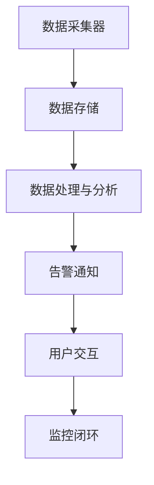
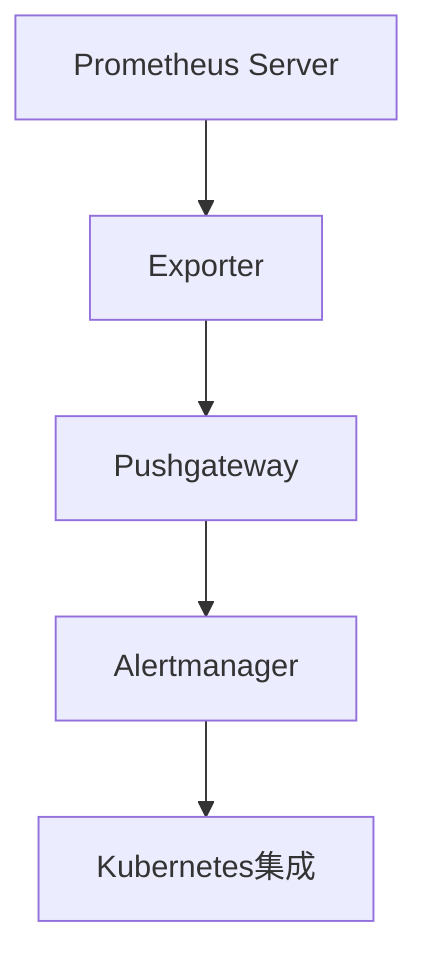

                 

# 文章标题：监控系统：Prometheus与Grafana实践

> 关键词：监控系统，Prometheus，Grafana，数据采集，数据可视化，告警机制，高可用性，云原生环境

> 摘要：本文将深入探讨Prometheus与Grafana在监控系统中的应用，从基础概念到高级实践，逐步介绍这两款开源监控工具的配置、使用和优化技巧。通过具体的案例和代码示例，帮助读者理解和掌握Prometheus与Grafana的使用方法，并了解它们在云原生环境中的实践。

## 目录大纲

### 第一部分：监控系统基础

#### 第1章：监控系统概述

- 1.1 监控系统的定义与重要性
- 1.2 监控系统的基本组件

#### 第2章：Prometheus基本原理

- 2.1 Prometheus架构
- 2.2 Prometheus数据模型
- 2.3 Prometheus数据采集

#### 第3章：Grafana介绍

- 3.1 Grafana概述
- 3.2 Grafana与Prometheus的集成

### 第二部分：Prometheus深度实践

#### 第4章：Prometheus配置与优化

- 4.1 Prometheus配置文件
- 4.2 Prometheus优化策略

#### 第5章：Prometheus告警机制

- 5.1 告警规则配置
- 5.2 告警通知策略

#### 第6章：Prometheus高可用性

- 6.1 集群部署
- 6.2 数据持久化与备份

### 第三部分：Grafana实战

#### 第7章：Grafana数据可视化

- 7.1 数据源配置
- 7.2 Dashboard设计

#### 第8章：Grafana告警管理

- 8.1 告警规则配置
- 8.2 告警通知策略

#### 第9章：Grafana插件开发

- 9.1 插件架构
- 9.2 插件开发示例

### 第四部分：案例研究

#### 第10章：Prometheus与Grafana在大型企业中的应用

- 10.1 应用场景介绍
- 10.2 部署实践
- 10.3 性能优化

#### 第11章：Prometheus与Grafana在云原生环境中的应用

- 11.1 云原生环境概述
- 11.2 Prometheus与Kubernetes集成
- 11.3 Grafana与云原生环境集成

### 第五部分：附录

#### 第12章：Prometheus与Grafana最佳实践

- 12.1 性能监控最佳实践
- 12.2 高可用性最佳实践

#### 第13章：资源与工具推荐

- 13.1 Prometheus官方文档
- 13.2 Grafana官方文档
- 13.3 Prometheus与Grafana开源社区资源

#### 第14章：常见问题与解决方案

- 14.1 Prometheus常见问题
- 14.2 Grafana常见问题
- 14.3 Prometheus与Grafana集成问题
- 14.4 云原生监控问题

### 第15章：深入理解Prometheus与Grafana的数学模型和公式

- 15.1 监控系统性能评估
- 15.2 数学公式示例
- 15.3 数学模型在监控项目中的实际应用

### 第16章：数学模型与数学公式详解

- 16.1 数学模型在监控系统中的作用
- 16.2 常见的数学公式
- 16.3 数学公式示例

### 第17章：数学模型在监控项目中的实际应用

- 17.1 服务器监控
- 17.2 网络监控
- 17.3 数据库监控
- 17.4 日志分析

### 第18章：Prometheus告警规则设计与实现

- 18.1 告警规则设计原则
- 18.2 告警规则实现步骤
- 18.3 Prometheus告警规则示例
- 18.4 告警规则测试与验证

### 第19章：Grafana Dashboard设计与实现

- 19.1 Dashboard设计原则
- 19.2 Dashboard实现步骤
- 19.3 Grafana Dashboard示例
- 19.4 Dashboard测试与优化

### 第20章：最佳实践与优化技巧

- 20.1 Prometheus与Grafana最佳实践
- 20.2 优化技巧

### 第21章：常见问题与解决方案

- 21.1 Prometheus常见问题
- 21.2 Grafana常见问题
- 21.3 Prometheus与Grafana集成问题
- 21.4 云原生监控问题

### 第22章：Prometheus与Grafana在云原生环境中的应用

- 22.1 云原生环境概述
- 22.2 Prometheus与Kubernetes集成
- 22.3 Grafana与云原生环境集成
- 22.4 Prometheus与Grafana在云原生环境中的实战
- 22.5 Prometheus与Grafana在云原生环境中的应用前景

### 第23章：总结

- 23.1 总结
- 23.2 展望

### 作者

- 作者：AI天才研究院/AI Genius Institute & 禅与计算机程序设计艺术 /Zen And The Art of Computer Programming## 第一部分：监控系统基础

### 第1章：监控系统概述

#### 1.1 监控系统的定义与重要性

监控系统是指用于监控和管理系统运行状态、性能、安全等方面的工具和技术。它可以帮助系统管理员、开发者和运维团队实时了解系统的健康状况，及时发现并处理潜在问题，从而保障系统的稳定性和可靠性。

监控系统的核心作用包括：

1. **性能监控**：监控系统的各项性能指标，如CPU使用率、内存使用率、磁盘IO速度等，帮助发现性能瓶颈和优化系统配置。
2. **状态监控**：监控系统的运行状态，如服务是否启动、网络是否通畅等，确保系统的正常运行。
3. **安全监控**：监控系统的安全事件，如登录失败、数据泄露等，及时发现并应对安全威胁。
4. **告警通知**：当系统出现异常或性能下降时，自动发送告警通知，提醒相关人员处理问题。

在现代企业中，监控系统的重要性体现在以下几个方面：

- **保障业务连续性**：监控系统可以实时监测业务系统的运行状况，确保业务连续性和稳定性。
- **提高运维效率**：通过自动化监控和告警，减少人工巡检的工作量，提高运维效率。
- **优化资源配置**：通过监控数据，分析系统性能瓶颈，优化资源配置，提高系统性能。
- **提升安全性**：监控系统可以帮助识别安全风险和漏洞，提高系统的安全性。

#### 1.2 监控系统的基本组件

监控系统通常由以下几个基本组件构成：

1. **数据采集器**：负责从被监控的系统或设备中收集性能数据、状态信息和日志等信息。常用的数据采集器包括Prometheus、Zabbix、Nagios等。
2. **数据存储**：用于存储采集到的监控数据，以便进行历史数据分析和查询。常用的数据存储方案包括InfluxDB、Elasticsearch、MySQL等。
3. **数据处理与分析**：对采集到的监控数据进行处理和分析，识别异常情况或趋势，生成监控报告。常用的数据处理与分析工具包括Grafana、Kibana等。
4. **告警通知**：当监控数据达到预设的阈值或出现异常时，自动发送告警通知，通知相关人员进行处理。常用的告警通知工具包括Alertmanager、Nexmo、Twilio等。

下面是一个简单的监控系统架构图：



通过上述组件的协同工作，监控系统可以实现对整个IT基础设施的全面监控和管理，确保系统的稳定性和可靠性。

### 第2章：Prometheus基本原理

#### 2.1 Prometheus架构

Prometheus是一个开源的监控解决方案，它提供了数据采集、数据存储、数据处理和告警通知等完整的功能。Prometheus的设计理念是简单、高效和可扩展，其架构由以下几个核心组件组成：

1. **Prometheus Server**：Prometheus服务器是监控系统的核心组件，负责接收和存储监控数据，提供查询接口和告警处理。
2. **Exporter**：Exporter是Prometheus的数据采集代理，运行在目标系统或服务上，负责定期采集监控数据并暴露给Prometheus服务器。
3. **Pushgateway**：Pushgateway用于临时存储和推送监控数据，适用于无法长期运行Exporter的场景。
4. **Alertmanager**：Alertmanager负责处理Prometheus的告警通知，将告警发送到指定的通知渠道，如邮件、短信、Slack等。
5. **Kubernetes集成**：Prometheus与Kubernetes集成，通过Kubernetes API动态发现和管理监控对象。

下面是Prometheus的架构图：



#### 2.2 Prometheus数据模型

Prometheus使用一种灵活且高效的数据模型来存储和查询监控数据，其核心概念包括：

1. **时间序列（Time Series）**：时间序列是一组按时间顺序排列的数据点，每个数据点包含一个指标（Metric）、一个标签（Labels）和一个值（Value）。
2. **指标（Metric）**：指标是监控数据的抽象表示，例如CPU使用率、内存使用率、磁盘I/O等。
3. **标签（Labels）**：标签用于对时间序列进行分类和分组，例如容器名称、服务名称、主机名等。标签可以用来创建多维度的时间序列，实现对不同维度的监控数据进行分析和过滤。
4. **样本（Sample）**：样本是时间序列中的一个具体数据点，包含指标名称、标签列表和值。

Prometheus的数据模型是一个基于时间序列的键值存储，其中每个时间序列的键由指标名称和标签列表组成，值是最后一个样本的值。

#### 2.3 Prometheus数据采集

Prometheus的数据采集主要通过Exporter实现，Exporter是一个简单的HTTP服务器，暴露一个/metrics端点，用于提供监控数据。Prometheus服务器通过轮询（scrape）的方式定期从Exporter获取监控数据。

以下是Prometheus数据采集的基本流程：

1. **配置数据源**：在Prometheus配置文件（prometheus.yml）中配置需要监控的Exporter，包括目标地址、采集间隔等。
2. **启动Prometheus服务器**：运行Prometheus服务器，加载配置文件，开始采集数据。
3. **启动Exporter**：在目标系统或服务上启动相应的Exporter，将监控数据暴露给Prometheus服务器。
4. **数据采集**：Prometheus服务器定期（scrape interval）从Exporter的/metrics端点获取监控数据，并存储到本地时间序列数据库中。
5. **数据查询**：用户可以通过PromQL（Prometheus Query Language）对存储的监控数据进行查询和分析。

以下是一个简单的Prometheus配置文件示例：

```yaml
# global
scrape_interval: 15s
evaluation_interval: 15s

# scrape配置
scrape_configs:
  - job_name: prometheus
    static_configs:
      - targets:
        - prometheus:9090

  - job_name: kubernetes-pods
    kubernetes_sd_configs:
      - role: pod
    metric relabel_configs:
      - sourceLabels: [__meta_kubernetes_pod_annotation_prometheus_io_scrape]
        action: keep
        regex: "true"
    target_label: __address__
    replacement: "localhost:9090"
    relabel_configs:
      - sourceLabels: [__meta_kubernetes_pod_annotation_prometheus_io_path]
        action: replace
        targetLabel: __metrics_path__
      - sourceLabels: [__meta_kubernetes_pod_annotation_prometheus_io_port]
        action: replace
        targetLabel: __param_port
```

通过以上配置，Prometheus将定期采集Kubernetes集群中所有Pod的监控数据，并将其存储到本地时间序列数据库中。

### 第3章：Grafana介绍

#### 3.1 Grafana概述

Grafana是一个开源的数据可视化平台，旨在帮助用户轻松地监控、分析和展示各种类型的数据。它支持多种数据源，如Prometheus、InfluxDB、Graphite等，能够与各种监控系统和时序数据库无缝集成。

Grafana的主要特点包括：

- **灵活的可视化**：支持多种图表类型和面板布局，可以自定义视觉样式，满足不同的监控需求。
- **多数据源支持**：支持多种数据源，包括Prometheus、InfluxDB、MySQL、PostgreSQL等，可以同时连接多个数据源。
- **告警管理**：集成告警管理功能，可以配置告警规则，并支持多种告警通知方式，如邮件、Slack、Webhook等。
- **插件架构**：支持插件扩展，可以自定义数据源、面板、仪表板等，提高Grafana的功能和灵活性。
- **开源社区**：拥有活跃的开源社区，提供丰富的插件和文档，便于用户交流和扩展功能。

#### 3.2 Grafana与Prometheus的集成

Grafana与Prometheus的集成是监控系统中常见且重要的环节。通过集成，用户可以在Grafana中直观地查看Prometheus采集的监控数据，并进行深入的分析和告警管理。

**集成步骤**：

1. **添加数据源**：
   - 在Grafana中添加Prometheus数据源，配置Prometheus服务器的地址和端口。
   - 确认数据源连接成功，确保Grafana可以访问Prometheus的监控数据。

2. **创建Dashboard**：
   - 在Grafana中创建一个新的Dashboard。
   - 选择Prometheus作为数据源，并设计Dashboard的布局和面板。

3. **配置面板**：
   - 添加不同类型的面板，如时间序列图表、表格、单值显示等。
   - 配置面板的查询条件和显示格式，确保监控数据的准确性和可视化效果。

4. **配置告警规则**：
   - 在Grafana中配置告警规则，根据监控数据设置告警条件和通知方式。
   - 确保告警规则生效，并测试告警通知功能。

**示例**：

以下是Grafana的Dashboard配置示例，展示了如何连接Prometheus数据源并创建一个简单的监控仪表板。

```json
{
  "dashboard": {
    "title": "Prometheus Metrics Dashboard",
    "uid": "prometheus-dashboard",
    "timezone": "UTC",
    "refresh": 15,
    "annotations": {
      "list": []
    },
    "rows": [
      {
        "title": "CPU Usage",
        "height": "250px",
        "panels": [
          {
            "type": "timeseries",
            "title": "CPU Usage",
            "caption": "CPU usage by container",
            "datasource": "Prometheus",
            "yAxis": {
              "left": {
                "label": "CPU Usage%",
                "show": true,
                "logBase": 1,
                "minValue": 0,
                "maxValue": 100,
                "autoScale": false,
                "unit": "percent"
              },
              "right": {
                "label": "Container",
                "show": true
              }
            },
            "xAxis": {
              "label": "Time",
              "show": true
            },
            "timeFrom": "now-1h",
            "timeTo": "now",
            "legend": {
              "show": true
            },
            "lines": true,
            "fill": 3,
            "points": false,
            "span": 6,
            " thresholds": [],
            "targets": [
              {
                "expr": "avg(container_cpu_usage_seconds_total{image!=\"\", container!=\"pod\"}) by (container)",
                "legendFormat": "{{container}}"
              }
            ]
          }
        ]
      }
    ],
    "schemaVersion": 16
  }
}
```

通过以上配置，Grafana将展示一个包含CPU使用率的时间序列图表，用户可以实时监控每个容器的CPU使用情况。通过添加更多面板和配置，用户可以创建一个功能齐全的监控仪表板，涵盖各种监控指标。

#### 3.3 Grafana与Prometheus集成的优势

Grafana与Prometheus的集成具有以下优势：

1. **强大的可视化能力**：Grafana提供了丰富的图表和面板类型，可以直观地展示Prometheus采集的监控数据，帮助用户快速了解系统状况。
2. **灵活的告警管理**：Grafana集成了告警管理功能，可以配置告警规则，并通过多种通知渠道（如邮件、Slack、短信等）及时通知相关人员，提高问题响应速度。
3. **易用性**：Grafana提供了直观的Web界面，用户可以轻松配置数据源、创建Dashboard和告警规则，无需编写复杂的代码。
4. **可扩展性**：Grafana支持插件扩展，用户可以根据需要自定义数据源、面板和仪表板，提高监控系统的灵活性和可定制性。
5. **开源社区支持**：Grafana和Prometheus都有活跃的开源社区，提供了丰富的插件、文档和教程，用户可以方便地学习和扩展功能。

通过Grafana与Prometheus的集成，用户可以构建一个功能强大且易于使用的监控系统，实现对各种系统和服务的全面监控和告警管理。接下来，我们将深入探讨Prometheus的配置与优化，帮助用户更好地利用这一开源监控工具。

### 第二部分：Prometheus深度实践

### 第4章：Prometheus配置与优化

#### 4.1 Prometheus配置文件

Prometheus的配置文件（prometheus.yml）是监控系统的核心，它定义了数据采集、告警规则、数据存储等关键参数。以下是一个基本的Prometheus配置文件示例：

```yaml
# global配置
global:
  scrape_interval: 15s                   # 默认采集间隔
  evaluation_interval: 30s               # 默认评估间隔
  scrape_timeout: 10s                   # 默认采集超时时间
  evaluation_timeout: 15s                # 默认评估超时时间
  external_labels:
    monitor: 'example-monitor'

# 指标存储配置
storage:
  tsdb:
    path: /var/lib/prometheus/           # 数据存储路径

# 告警管理配置
alerting:
  alertmanagers:
    - static_configs:
      - url: 'http://alertmanager:9093/api/v2/alerts'

# 监控任务配置
scrape_configs:
  - job_name: prometheus
    static_configs:
      - targets:
        - prometheus:9090

  - job_name: kubernetes-pods
    kubernetes_sd_configs:
      - role: pod
    metric_relabel_configs:
      - source_labels: [__meta_kubernetes_pod_annotation_prometheus_io_scrape]
        action: keep
        regex: "true"
    target_label: __address__
    replacement: "localhost:9090"
    relabel_configs:
      - source_labels: [__meta_kubernetes_pod_annotation_prometheus_io_path]
        action: replace
        target_label: __metrics_path__
      - source_labels: [__meta_kubernetes_pod_annotation_prometheus_io_port]
        action: replace
        target_label: __param_port
```

在这个示例中，我们配置了Prometheus的基本参数，包括采集间隔、评估间隔、存储路径、告警管理器地址以及两个监控任务：一个是内部Prometheus服务器的监控，另一个是Kubernetes集群中Pod的监控。

#### 4.2 Prometheus优化策略

为了提高Prometheus的性能和可靠性，我们需要在配置和优化方面进行一些调整。以下是一些常见的优化策略：

1. **调整采集间隔**：
   - 根据监控需求和数据变化速度，合理调整scrape_interval和evaluation_interval参数。如果数据变化较快，可以减小采集间隔，但会增大系统负载；如果数据变化较慢，可以增大采集间隔，以降低系统负载。

2. **设置采集超时时间**：
   - 根据网络环境和Exporter的健康状况，设置合理的scrape_timeout。如果超时时间设置过短，可能导致频繁的重试和性能下降；如果设置过长，可能导致采集延迟和监控数据不准确。

3. **优化存储配置**：
   - 根据数据量和查询需求，调整存储策略，如保留时间、块大小等。增加保留时间可以提高数据查询的完整性，但会占用更多存储空间；调整块大小可以提高查询性能，但会增加存储空间需求。

4. **优化告警配置**：
   - 根据告警规则和业务需求，优化alertmanager的配置，如告警通知频率、告警聚合等。合理的告警配置可以提高告警的准确性和及时性，减少误告警和漏告警。

5. **集群部署**：
   - 在高负载或大规模监控场景中，可以考虑部署Prometheus集群，实现负载均衡和高可用性。Prometheus集群由多个Prometheus服务器组成，通过Gossip协议同步数据，提高系统的可靠性。

6. **数据压缩**：
   - 在数据传输和存储过程中，可以使用压缩算法减少数据大小，提高网络带宽和存储利用率。Prometheus支持多种压缩算法，如gzip和snappy等。

7. **监控优化**：
   - 定期检查和优化监控配置，如数据采集策略、告警规则等，确保监控数据的准确性和完整性。优化监控配置可以提高系统性能和稳定性。

通过以上优化策略，我们可以提高Prometheus的性能和可靠性，确保监控数据的准确性和及时性，为运维团队提供有力的支持。

### 第5章：Prometheus告警机制

#### 5.1 告警规则配置

Prometheus的告警机制是其强大的功能之一，它通过配置告警规则，可以在监控指标超过特定阈值时自动触发告警通知。告警规则定义了告警条件、通知渠道和告警处理流程。

**告警规则配置步骤如下：**

1. **定义告警规则**：
   - 在Prometheus的配置文件（prometheus.yml）中添加告警规则部分，定义告警规则。
   - 每个告警规则由一组规则组成，规则由表达式（expr）、告警等级（labels）和注释（annotations）组成。

2. **配置告警表达式**：
   - 使用PromQL（Prometheus Query Language）定义告警条件，例如计算指标的平均值、最大值或最小值，并设置阈值。
   - 告警表达式可以包含时间范围（time range）、聚合函数（aggregation functions）和标签筛选（label filters）。

3. **设置告警等级和注释**：
   - 标签用于定义告警的等级，如严重（critical）、警告（warning）等。
   - 注释提供额外的信息，如告警摘要和通知内容，帮助告警接收者快速了解告警情况。

4. **配置通知渠道**：
   - 配置Alertmanager，用于接收和处理告警通知。
   - 在Alertmanager配置文件（alertmanager.yml）中定义告警通知渠道，如电子邮件、Slack、Webhook等。

以下是一个告警规则配置示例：

```yaml
alerting:
  alertmanagers:
    - static_configs:
        - targets:
          - alertmanager:9093

rule_files:
  - "alerts/prometheus-alerts.yml"

groups:
  - name: "example-alerts"
    rules:
      - alert: "HighCPUUsage"
        expr: (1 - (avg(rate(container_cpu_usage_seconds_total{job="kubelet", image!="", image!="kubelet", image!="POD"}[5m]) by (container)) by (container)) * 100 > 90
        for: 2m
        labels:
          severity: critical
        annotations:
          summary: "High CPU usage on {{ $labels.container }}"
          description: "Container {{ $labels.container }} has high CPU usage."
```

在这个示例中，我们定义了一个名为"HighCPUUsage"的告警规则，当容器的CPU使用率超过90%且持续时间超过2分钟时，会触发告警，并标记为严重级别（critical）。告警摘要和描述包含容器名称，帮助告警接收者快速识别告警来源。

#### 5.2 告警通知策略

告警通知策略是告警机制中至关重要的一部分，它决定了告警通知的方式、频率和内容。一个有效的告警通知策略可以确保告警信息及时、准确地传递给相关人员，从而快速响应和处理异常情况。

**告警通知策略配置步骤如下：**

1. **配置告警通知渠道**：
   - 在Alertmanager配置文件中定义告警通知渠道，如电子邮件、Slack、Webhook等。
   - 配置每个渠道的详细信息，如接收者地址、通知内容模板等。

2. **设置告警通知频率**：
   - 根据业务需求和告警严重程度，设置合理的告警通知频率。
   - 例如，对于严重级别（critical）的告警，可以设置更频繁的通知频率，如每分钟一次；对于警告级别（warning）的告警，可以设置较低的通知频率，如每小时一次。

3. **配置告警聚合**：
   - Alertmanager支持告警聚合功能，可以在同一时间段内合并相同的告警，减少重复通知。
   - 例如，当多个容器出现高CPU使用率告警时，可以合并为一个通知，避免通知爆炸。

4. **设置告警抑制**：
   - Alertmanager支持告警抑制功能，可以在特定条件下抑制重复告警，减少告警噪音。
   - 例如，当告警持续时间超过特定阈值时，可以抑制新的重复告警，直到现有告警被解决。

以下是一个Alertmanager配置示例：

```yaml
alertmanager.yml
route:
  receiver: "email-receiver"
  group_by: ['alertname']
  routes:
    - receiver: "email-receiver"
      group_by: ['alertname', 'cluster']
      match: { severity: 'critical' }

receivers:
  - name: "email-receiver"
    email_configs:
      - to: "admin@example.com"
        from: "alertmanager@example.com"
        subject: "Prometheus Alert: {{ $alert.name }} in {{ $alert.labels.cluster }}"
        template: "email.tmpl"
```

在这个示例中，我们配置了一个名为"email-receiver"的邮件接收器，当告警的严重程度为critical时，会将告警信息发送给指定的管理员邮箱。告警邮件的主题和内容包含告警名称和集群信息，帮助管理员快速识别和处理告警。

通过合理配置告警规则和通知策略，我们可以确保监控系统的告警机制高效、准确地工作，为运维团队提供及时、可靠的告警信息。

### 第6章：Prometheus高可用性

#### 6.1 集群部署

为了确保Prometheus的高可用性，尤其是在大规模监控场景中，我们可以通过部署Prometheus集群来实现。Prometheus集群由多个Prometheus服务器组成，通过Gossip协议同步数据，实现数据冗余和故障转移。

**集群部署步骤如下：**

1. **安装Prometheus**：
   - 在每个节点上安装Prometheus，并配置相同的监控任务和数据存储配置。
   - 确保每个Prometheus服务器都可以访问相同的数据存储位置，以便数据同步。

2. **配置Gossip协议**：
   - 配置Prometheus服务器使用Gossip协议同步数据。Gossip协议是一种分布式同步协议，可以确保多个Prometheus服务器之间数据的一致性。
   - 在Prometheus配置文件中添加Gossip配置，包括Gossip地址和端口。

   ```yaml
   prometheus.yml
   scrape_configs:
     - job_name: 'gossip'
       scrape_interval: 10s
       static_configs:
       - targets:
         - 192.168.1.1:9090
         - 192.168.1.2:9090
         - 192.168.1.3:9090
   ```

3. **配置告警管理器**：
   - 集群中的Prometheus服务器共享同一个告警管理器（Alertmanager），确保告警通知的一致性。
   - 配置Alertmanager，使其能够接收来自所有Prometheus服务器的告警信息。

4. **故障转移**：
   - 当主Prometheus服务器出现故障时，其他备用服务器可以自动接管监控任务和告警处理。
   - 可以通过配置负载均衡器或DNS轮询来实现故障转移。

通过以上步骤，我们可以构建一个高可用的Prometheus集群，确保监控系统的稳定性和可靠性。

#### 6.2 数据持久化与备份

在Prometheus中，数据持久化与备份是确保监控数据安全性和可用性的关键。以下是一些常用的数据持久化和备份方法：

1. **使用本地存储**：
   - Prometheus默认将数据存储在本地磁盘上，可以使用文件系统或分布式文件系统（如GlusterFS、Ceph等）进行存储。
   - 在配置文件中指定数据存储路径，例如：

   ```yaml
   storage:
     tsdb:
       path: /var/lib/prometheus
   ```

2. **使用远程存储**：
   - 为了确保数据的安全性和持久性，可以将数据存储到远程存储系统，如云存储、对象存储或分布式存储系统。
   - 在配置文件中配置远程存储的URL，Prometheus将数据定期同步到远程存储。

   ```yaml
   storage:
     tsdb:
       path: s3://my-bucket/prometheus
   ```

3. **备份策略**：
   - 定期备份Prometheus的数据存储，防止数据丢失或损坏。
   - 可以使用定时任务或自动化脚本定期备份数据，例如使用`prometheus-backup`工具或自定义备份脚本。

4. **备份存储**：
   - 选择合适的备份存储位置，确保备份数据的安全性和可访问性。
   - 可以将备份存储在本地磁盘、远程存储或云存储中，根据业务需求和成本进行选择。

通过以上方法，我们可以确保Prometheus的数据持久化和备份，确保监控系统的数据安全性和可靠性。

通过集群部署和数据持久化与备份，Prometheus可以应对大规模监控场景，确保监控系统的稳定性和可靠性。在接下来的章节中，我们将进一步探讨Grafana的配置和使用，帮助用户充分利用这一强大的监控工具。

### 第三部分：Grafana实战

### 第7章：Grafana数据可视化

Grafana是一个功能强大的数据可视化平台，它支持多种数据源和丰富的图表类型，可以帮助用户轻松地监控和分析各种监控数据。在本章中，我们将介绍如何在Grafana中配置数据源，并创建和设计Dashboard。

#### 7.1 数据源配置

在Grafana中，数据源是连接监控系统和数据存储的关键组件。以下是如何在Grafana中配置数据源的基本步骤：

1. **登录Grafana**：
   - 打开Grafana Web界面，使用管理员账号登录。

2. **创建数据源**：
   - 在Grafana仪表板页面，点击左侧菜单栏的“Data Sources”选项。
   - 点击“Add data source”按钮，选择要连接的数据源类型，如Prometheus、InfluxDB、Graphite等。

3. **配置数据源**：
   - 在“Data Source Configuration”页面中，填写数据源的详细信息，如服务器地址、端口号、认证凭据等。
   - 对于Prometheus数据源，需要填写Prometheus服务器的地址和端口，并选择适当的Prometheus版本。

   以下是一个Prometheus数据源的配置示例：

   ```json
   {
     "name": "Prometheus",
     "type": "prometheus",
     "access": "proxy",
     "url": "http://localhost:9090",
     "orgId": 1
   }
   ```

4. **测试数据源**：
   - 配置完成后，点击“Save & Test”按钮，Grafana将测试数据源连接是否成功。

5. **选择数据源**：
   - 在创建或编辑Dashboard时，选择刚刚创建的数据源。

通过以上步骤，我们成功配置了Grafana的数据源，可以开始创建Dashboard并设计监控仪表板。

#### 7.2 Dashboard设计

Dashboard是Grafana的核心功能，它将监控数据以图表、表格和面板的形式展示给用户。以下是如何设计Dashboard的基本步骤：

1. **创建Dashboard**：
   - 在Grafana仪表板页面，点击左侧菜单栏的“Dashboard”选项，然后点击“New Dashboard”按钮。
   - 选择一个预设的Dashboard模板，或从空白开始创建。

2. **选择数据源**：
   - 在创建Dashboard时，选择之前配置的数据源。

3. **添加面板**：
   - 在Dashboard编辑页面，点击左侧菜单栏的“Add Panel”按钮，选择要添加的面板类型，如时间序列图表、单值显示、统计面板等。

4. **配置面板**：
   - 在添加面板后，点击面板设置图标，配置面板的查询条件、显示格式和参数。
   - 例如，对于时间序列图表，可以配置指标名称、时间范围、图表类型等。

   以下是一个时间序列图表面板的配置示例：

   ```json
   {
     "title": "CPU Usage",
     "type": "timeseries",
     "editable": true,
     ".datasource": 1,
     "options": {
       "legend": {
         "show": true
       },
       "xAxis": {
         "show": true
       },
       "yAxis": {
         "left": {
           "show": true,
           "label": "CPU Usage%",
           "minValue": 0,
           "maxValue": 100
         }
       }
     },
     "targets": [
       {
         "expr": "avg(container_cpu_usage_seconds_total{image!=\"\", container!=\"pod\"}) by (container)",
         "legendFormat": "{{container}}"
       }
     ]
   }
   ```

5. **调整布局**：
   - 通过拖拽和调整面板大小，设计Dashboard的布局，使其既美观又易于使用。
   - 可以使用网格布局，确保面板之间的间距均匀。

6. **保存Dashboard**：
   - 完成Dashboard设计后，点击左侧菜单栏的“Save”按钮，保存Dashboard。

7. **预览和优化**：
   - 在保存前，预览Dashboard，确保所有面板和数据源工作正常。
   - 根据需要调整配置，优化视觉效果和用户体验。

通过以上步骤，我们可以创建一个功能齐全且易于使用的监控Dashboard，将Prometheus采集的监控数据以直观的方式展示给用户。在下一章中，我们将探讨如何使用Grafana进行告警管理。

### 第8章：Grafana告警管理

#### 8.1 告警规则配置

Grafana的告警管理功能可以帮助用户根据监控数据设置告警规则，并在数据达到特定阈值时自动触发告警通知。以下是告警规则配置的步骤：

1. **配置Grafana告警**：
   - 在Grafana的仪表板页面，点击左侧菜单栏的“Alerts”选项。
   - 然后点击“Create Alert”按钮。

2. **选择数据源**：
   - 在创建告警时，选择要使用的数据源。如果还没有添加数据源，请先在Grafana中添加数据源。

3. **定义告警条件**：
   - 在“Alert Definition”页面中，定义告警的名称、描述、标签等。
   - 使用PromQL（Prometheus查询语言）编写告警表达式，指定监控指标、计算方法和阈值。

   以下是一个简单的告警规则配置示例：

   ```json
   {
     "name": "High CPU Usage",
     "description": "Trigger an alert when CPU usage exceeds 90%",
     "datasource": "Prometheus",
     "evaluator": {
       "type": "threshold",
       "params": {
         "value": 90,
         "model": "avg"
       }
     },
     "for": "5m",
     "annotations": {
       "summary": "High CPU usage detected"
     },
     "labels": {
       "alertname": "HighCPUUsage",
       "severity": "critical"
     }
   }
   ```

   在这个示例中，我们定义了一个名为“High CPU Usage”的告警规则，当CPU使用率平均值超过90%且持续5分钟时，会触发告警，并标记为严重级别（critical）。

4. **配置告警通知**：
   - 在“Alert Notification”页面中，配置告警通知的方式和频率。
   - 选择通知渠道，如电子邮件、Slack、Webhook等，并填写相应的通知设置。

   以下是一个简单的告警通知配置示例：

   ```json
   {
     "name": "Email Notification",
     "type": "email",
     "settings": {
       "from": "grafana-alerts@example.com",
       "to": "admin@example.com",
       "template": "default"
     }
   }
   ```

5. **测试告警规则**：
   - 配置完成后，点击“Test”按钮，测试告警规则是否正常工作。

6. **保存告警规则**：
   - 测试通过后，点击“Save”按钮，保存告警规则。

通过以上步骤，我们成功配置了一个告警规则，并在数据达到阈值时自动发送告警通知。接下来，我们将探讨如何使用Grafana进行更复杂的告警管理。

#### 8.2 告警通知策略

告警通知策略是告警管理中的重要环节，它决定了告警通知的方式、频率和内容。以下是如何配置告警通知策略的步骤：

1. **配置告警通知规则**：
   - 在Grafana的仪表板页面，点击左侧菜单栏的“Alerts”选项，然后点击“Create Notification”按钮。
   - 在“Alert Notification”页面中，填写通知规则的名称和描述。

2. **选择通知渠道**：
   - 在“Channels”部分，选择要使用的通知渠道，如电子邮件、Slack、Webhook等。

3. **配置通知设置**：
   - 根据所选通知渠道，配置相应的通知设置，如发送者邮箱地址、接收者邮箱地址、Slack机器人Webhook URL等。

   以下是一个简单的电子邮件通知设置示例：

   ```json
   {
     "name": "Email Notification",
     "type": "email",
     "settings": {
       "from": "grafana-alerts@example.com",
       "to": "admin@example.com",
       "template": "default"
     }
   }
   ```

4. **配置告警频率**：
   - 在“Frequency”部分，配置告警通知的频率，如每分钟一次、每小时一次等。

5. **配置告警聚合**：
   - 在“Aggregate”部分，配置告警聚合规则，以减少重复通知。
   - 例如，可以设置在特定时间内仅发送一次告警，即使有多个触发条件的告警。

6. **测试通知规则**：
   - 配置完成后，点击“Test”按钮，测试通知规则是否正常工作。

7. **保存通知规则**：
   - 测试通过后，点击“Save”按钮，保存通知规则。

通过以上步骤，我们可以配置一个详细的告警通知策略，确保告警通知的及时性和准确性。在告警策略中，还可以设置告警抑制和通知通道，以减少告警噪音，提高问题响应效率。

#### 8.3 告警规则与通知策略的优化

为了提高告警管理的效率和可靠性，以下是一些优化告警规则与通知策略的建议：

1. **简化告警规则**：
   - 避免过度复杂的告警规则，确保规则易于理解和维护。
   - 使用简明的命名和描述，使告警规则更易于识别和操作。

2. **合理设置阈值**：
   - 根据监控指标的特性，合理设置告警阈值，避免误告警和漏告警。
   - 可以通过实验和数据分析，确定最佳阈值。

3. **灵活配置通知频率**：
   - 根据告警的严重程度，设置不同的通知频率。
   - 对于高严重程度的告警，可以设置更频繁的通知频率，以确保及时响应。

4. **使用告警聚合**：
   - 配置告警聚合规则，减少重复通知，提高问题响应效率。
   - 例如，可以设置在特定时间内仅发送一次告警，避免因多个触发条件的告警而产生大量通知。

5. **告警通知渠道多样化**：
   - 使用多种通知渠道，如电子邮件、Slack、短信等，确保告警通知及时传达。
   - 根据团队和个人的偏好，选择合适的通知渠道。

6. **定期审查和更新告警规则**：
   - 定期审查和更新告警规则，确保其与当前的业务需求相符。
   - 根据监控数据的分析结果，调整阈值和规则，以提高告警的准确性和及时性。

通过以上优化策略，我们可以确保Grafana告警管理的高效性和可靠性，为运维团队提供及时、准确的告警信息，提高系统的稳定性和可靠性。

### 第9章：Grafana插件开发

#### 9.1 插件架构

Grafana的插件架构是其强大功能的一部分，它允许用户扩展和定制Grafana的功能，以满足特定的监控需求。Grafana插件通常由以下几个部分组成：

1. **配置文件**：插件配置文件用于定义插件的元数据和配置选项，如插件名称、版本、数据源等。

2. **模板文件**：模板文件用于定义插件的Web界面，包括仪表板模板、面板模板、设置页面等。Grafana使用模板引擎（通常是Mustache）来渲染模板。

3. **脚本文件**：脚本文件用于处理插件的逻辑，如数据查询、数据转换、数据可视化等。Grafana支持JavaScript、TypeScript和Python等脚本语言。

4. **静态资源**：静态资源包括CSS、JavaScript、图片等，用于美化插件界面和提供额外的功能。

Grafana插件的生命周期包括安装、启动、运行和卸载等阶段。插件通过Grafana提供的API与Grafana核心功能进行交互，如数据源管理、仪表板管理、告警管理等。

#### 9.2 插件开发示例

以下是一个简单的Grafana插件开发示例，该插件将添加一个自定义面板，用于显示容器的CPU使用率。

1. **创建插件目录结构**：

```shell
mkdir grafana-plugin
cd grafana-plugin
mkdir config src static
touch config/plugin.json src/popup.html src/script.js static/css/style.css
```

2. **配置插件元数据**：

编辑`config/plugin.json`文件，添加插件的元数据，如插件名称、版本和作者信息。

```json
{
  "name": "container-cpu-plugin",
  "version": "1.0.0",
  "description": "A Grafana plugin to display container CPU usage",
  "author": "Your Name",
  "keywords": ["Grafana", "Plugin", "Container", "CPU Usage"],
  "grfanaVersion": "8.0.0"
}
```

3. **编写面板模板**：

在`src/popup.html`文件中编写面板的HTML模板。

```html
<div class="panel-container">
  <h3>Container CPU Usage</h3>
  <div class="metrics">
    {{#each series}}
      <div class="metric">
        <div class="label">{{@key}}</div>
        <div class="value">{{value}}</div>
      </div>
    {{/each}}
  </div>
</div>
```

4. **编写脚本文件**：

在`src/script.js`文件中编写JavaScript脚本，用于处理面板数据并渲染HTML模板。

```javascript
define(['jquery'], function($) {
  'use strict';

  return {
    template: '\
    <div class="panel-container">\
      <h3>Container CPU Usage</h3>\
      <div class="metrics"></div>\
    </div>',
    init: function() {
      var panel = this.$el;

      // Fetch data from the data source
      var dataSource = this.backendSrv.datasource;
      dataSource.getMetric({
        expr: 'avg(container_cpu_usage_seconds_total)',
        range: '5m'
      }).then(function(data) {
        // Render the template with the data
        var template = $('#popup-template').html();
        var compiledTemplate = _.template(template);
        panel.find('.metrics').html(compiledTemplate(data));
      });
    }
  };
});
```

5. **编写静态资源**：

在`static/css/style.css`文件中编写CSS样式，用于美化面板。

```css
.panel-container {
  font-family: Arial, sans-serif;
  color: #333;
}

.metrics .metric {
  display: flex;
  margin-bottom: 10px;
}

.metrics .metric .label {
  width: 100px;
  text-align: right;
  margin-right: 10px;
}

.metrics .metric .value {
  flex-grow: 1;
}
```

6. **安装插件**：

将插件目录上传到Grafana服务器上的`<grafana-path>/plugins/`目录，然后在Grafana Web界面中启用插件。

```shell
scp -r grafana-plugin user@grafana-server:/var/lib/grafana/plugins/
ssh user@grafana-server
sudo grafana-server -homepath /etc/grafana/grafana.ini -webroot /var/lib/grafana/plugins/ -pidfile /var/run/grafana.pid -console-log -config /etc/grafana/grafana.ini enable plugins
```

7. **创建Dashboard**：

在Grafana Web界面中，创建一个新的Dashboard，添加自定义面板，并选择`Container CPU Usage`插件。

通过以上步骤，我们成功创建了一个自定义的Grafana插件，用于显示容器的CPU使用率。这个示例展示了Grafana插件的基本开发流程，用户可以根据实际需求进行扩展和定制。

### 第9章：Grafana插件开发

#### 9.1 插件架构

Grafana的插件架构是其强大的扩展能力之一，它允许开发者为Grafana添加自定义功能。Grafana插件通常由以下几部分组成：

1. **配置文件**：`plugin.json`是插件的入口文件，定义了插件的元数据，如插件名称、版本、作者信息等。该文件还指定了插件的依赖项，如数据源、面板类型等。

   ```json
   {
     "name": "custom-panel-plugin",
     "version": "1.0.0",
     "description": "A custom Grafana panel plugin",
     "author": "Your Name",
     "keywords": ["Grafana", "Plugin", "Panel"],
     "grfanaVersion": "8.0.0",
     "dependencies": {
       "includes": ["grafana/app/plugins"],
       "pluginFiles": ["src/*.js", "src/*.css"]
     }
   }
   ```

2. **模板文件**：模板文件定义了插件的Web界面，包括仪表板面板、设置页面等。Grafana使用Mustache模板引擎来渲染这些文件。

   - `panel.html`：自定义面板的HTML模板。
   - `settings.html`：插件的设置页面。

3. **脚本文件**：脚本文件包含插件的逻辑，如数据查询、数据处理、可视化等。这些文件通常使用JavaScript或TypeScript编写。

   - `script.js`：处理面板数据并渲染模板。
   - `data.js`：提供数据查询和处理功能。

4. **静态资源**：静态资源包括CSS、JavaScript、图片等，用于美化插件界面和提供额外的功能。

   - `static/css/style.css`：插件样式。
   - `static/js/script.js`：插件脚本。

#### 9.2 插件开发步骤

1. **创建插件目录结构**：

   ```shell
   mkdir my-grafana-plugin
   cd my-grafana-plugin
   mkdir config src static
   touch config/plugin.json src/panel.html src/script.js static/css/style.css
   ```

2. **编写插件配置文件**：

   在`config/plugin.json`中填写插件的元数据。

   ```json
   {
     "name": "my-grafana-plugin",
     "version": "1.0.0",
     "description": "A simple Grafana plugin example",
     "author": "Your Name",
     "keywords": ["Grafana", "Plugin"],
     "grafanaVersion": "8.0.0"
   }
   ```

3. **编写面板模板**：

   在`src/panel.html`中编写自定义面板的HTML模板。

   ```html
   <div class="panel-container">
     <div class="panel-header">
       <h3>Custom Panel</h3>
     </div>
     <div class="panel-body">
       {{#each series}}
         <div class="panel-row">
           <div class="panel-label">{{@key}}</div>
           <div class="panel-value">{{value}}</div>
         </div>
       {{/each}}
     </div>
   </div>
   ```

4. **编写脚本文件**：

   在`src/script.js`中编写处理面板数据的JavaScript代码。

   ```javascript
   define(['app/plugins'], function(plugins) {
     'use strict';

     var plugin = {
       panelEditor: plugins.PanelEditor.extend({
         constructor: function(panel) {
           this._super(panel);
           // Initialize panel editor
         }
       }),

       panelController: plugins.PanelController.extend({
         constructor: function($scope, $injector) {
           this._super($scope, $injector);
           // Initialize panel controller
         }
       })
     };

     return plugin;
   });
   ```

5. **编写样式文件**：

   在`static/css/style.css`中编写自定义面板的CSS样式。

   ```css
   .panel-container {
     font-family: Arial, sans-serif;
     color: #333;
   }
   ```

6. **构建插件**：

   使用Grafana的插件构建工具构建插件。

   ```shell
   npm install
   npm run build
   ```

7. **部署插件**：

   将构建后的插件文件上传到Grafana的插件目录。

   ```shell
   scp -r build/* user@grafana-server:/var/lib/grafana/plugins/my-grafana-plugin
   ```

8. **启用插件**：

   在Grafana Web界面中启用插件。

   ```shell
   grafana-server -homepath /etc/grafana/grafana.ini -webroot /var/lib/grafana/plugins/ -pidfile /var/run/grafana.pid -console-log -config /etc/grafana/grafana.ini enable plugins
   ```

9. **创建Dashboard**：

   在Grafana Web界面中创建一个新的Dashboard，添加自定义面板。

通过以上步骤，我们成功创建并部署了一个

