                 

### 《知识产权与太空探索的法律问题》

> 关键词：知识产权、太空探索、法律问题、专利、商标、版权

> 摘要：本文探讨了知识产权与太空探索之间的紧密联系，分析了太空探索中的知识产权问题，包括专利、商标和版权等方面。文章通过详细阐述相关法律问题，结合实际案例，提出了预防与解决知识产权纠纷的策略，并对太空探索知识产权的未来发展趋势进行了展望。

----------------------------------------------------------------

### 第一部分：引论

#### 1.1 知识产权概述

##### 1.1.1 知识产权的定义与类型

知识产权是指个人或组织对其创造的智力成果所享有的专有权利，主要包括专利权、商标权、著作权等。其中：

- **专利权**：对发明、实用新型和外观设计等创新技术的专有权利。
- **商标权**：对商标的专有使用权。
- **著作权**：对文学、艺术和科学作品的专有权利。

##### 1.1.2 知识产权的保护范围

知识产权的保护范围主要包括以下几个方面：

- **发明创新**：涉及技术、设计、方法等方面。
- **商标标识**：涉及公司、产品、服务等的标识。
- **文学作品**：涉及书籍、音乐、电影、绘画等。

##### 1.1.3 知识产权的基本特征

知识产权具有以下基本特征：

- **专有性**：知识产权的独占性，其他人未经授权不得使用。
- **地域性**：不同国家和地区的知识产权保护范围不同。
- **时间性**：知识产权有法定保护期限，超过期限则进入公有领域。

#### 1.2 太空探索的背景与法律框架

##### 1.2.1 太空探索的历史与发展

太空探索是人类文明的一项伟大壮举。自20世纪50年代以来，人类不断向太空发射卫星、探测器和载人飞船，实现了月球、火星等星球的探测，甚至开展了星际旅行。

##### 1.2.2 国际太空法律框架概述

国际太空法律框架主要包括以下条约：

- **《外层空间条约》**：规定了外层空间的主权、探索和利用原则。
- **《救援协定》**：规定了宇航员在紧急情况下的救援和保护。
- **《责任公约》**：规定了太空活动中造成损害的责任。

##### 1.2.3 太空探索的法律挑战

太空探索面临的法律挑战包括：

- **知识产权保护**：如何保护在太空探索中产生的知识产权。
- **跨国合作**：不同国家和地区在太空探索中的合作与协调。
- **环境保护**：如何避免太空探索对地球环境造成负面影响。

----------------------------------------------------------------

### 第二部分：太空探索中的知识产权问题

#### 2.1 太空探索中的专利问题

##### 2.1.1 太空技术的专利申请与保护

专利申请是保护太空技术的重要手段。以下是专利申请的基本流程：

1. **专利需求分析**：确定需要保护的发明创新。
2. **专利检索**：通过专利数据库检索类似技术，避免侵权。
3. **撰写专利申请文件**：包括专利请求书、说明书、权利要求书等。
4. **提交专利申请**：向国家或国际专利机构提交申请。
5. **审查与答辩**：专利机构审查申请，申请人可能需要答辩。
6. **授权与保护**：专利申请被批准后，进入保护期。

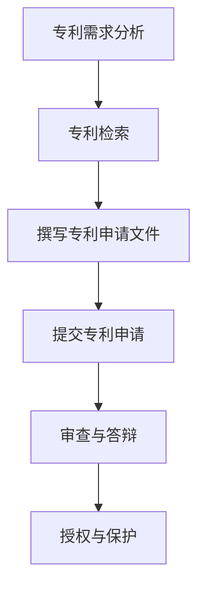

##### 2.1.2 专利检索与规避策略

专利检索是专利申请的重要环节。以下是专利检索的步骤：

1. **确定检索范围**：选择合适的专利数据库，如国家知识产权局数据库、国际专利数据库等。
2. **检索关键词**：输入相关关键词，如技术名称、发明人、申请号等。
3. **分析检索结果**：筛选出相关的专利信息，分析其技术特点、保护范围等。
4. **规避策略**：根据检索结果，调整或改进技术方案，以规避专利侵权。

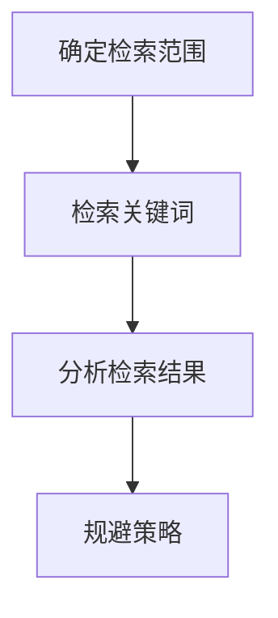

##### 2.1.3 太空专利的国际合作与冲突

太空专利的国际合作与冲突主要表现在以下几个方面：

1. **专利保护标准**：不同国家和地区对专利保护的要求和标准可能不同。
2. **专利优先权**：申请人在不同国家的专利申请可能存在优先权问题。
3. **专利纠纷**：不同国家和地区的专利机构对专利纠纷的处理可能存在差异。

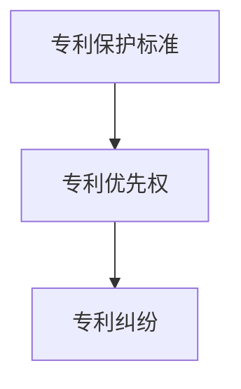

#### 2.2 太空探索中的商标问题

##### 2.2.1 太空品牌的保护

太空品牌的保护主要包括以下几个方面：

1. **商标注册**：在相关国家和地区注册商标，以取得商标专用权。
2. **商标保护**：对商标使用进行监控，防止他人侵权。
3. **品牌推广**：利用商标提升品牌知名度，增强市场竞争力。

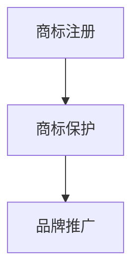

##### 2.2.2 商标侵权与保护措施

商标侵权是指未经商标权人许可，擅自使用他人商标的行为。商标侵权包括以下几种形式：

1. **完全相同侵权**：直接使用他人商标。
2. **相似侵权**：使用与他人商标相似的标识。
3. **隐形侵权**：通过变形、缩放等方式使用他人商标。

为保护商标权，可以采取以下措施：

1. **行政投诉**：向商标管理部门投诉侵权行为。
2. **法律诉讼**：通过法院诉讼追究侵权者的法律责任。
3. **维权合作**：与其他商标权人合作，共同打击侵权行为。

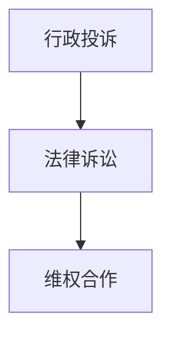

##### 2.2.3 太空商标的特殊性

太空商标的特殊性主要体现在以下几个方面：

1. **商标使用环境**：太空商标的使用环境与地球上的商标有所不同，如太空旅游、太空科研等。
2. **商标注册难度**：太空商标的注册可能面临更高的难度，如商标独特性的认定等。
3. **商标保护范围**：太空商标的保护范围可能涉及多个国家和地区。

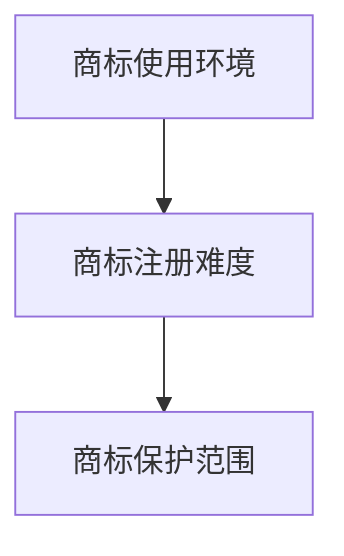

#### 2.3 太空探索中的版权问题

##### 2.3.1 太空探测数据的版权归属

太空探测数据的版权归属涉及数据生成、处理、共享等方面。以下是版权归属的主要问题：

1. **数据生成**：谁拥有数据生成的版权？
2. **数据处理**：谁拥有数据处理后的版权？
3. **数据共享**：数据共享是否涉及版权问题？

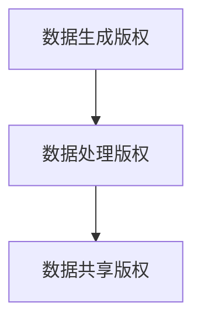

##### 2.3.2 数据共享与许可协议

数据共享是太空探测数据的重要应用之一。数据共享需要建立许可协议，明确各方的权利与义务。以下是数据共享与许可协议的主要内容：

1. **数据共享原则**：确保数据共享的公平、公正、透明。
2. **数据许可**：明确数据使用的范围、方式、期限等。
3. **版权保护**：确保数据共享过程中版权不被侵犯。

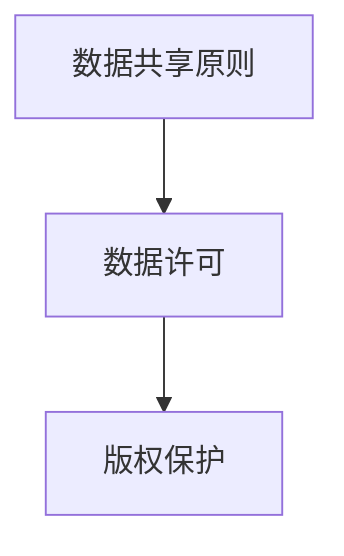

##### 2.3.3 太空影像作品的版权保护

太空影像作品是太空探索中的重要成果之一。太空影像作品的版权保护主要包括以下几个方面：

1. **作品认定**：确定影像作品是否具有独创性，符合作品标准。
2. **版权登记**：将太空影像作品进行版权登记，以取得法律保护。
3. **版权维权**：对侵犯太空影像作品版权的行为进行维权。

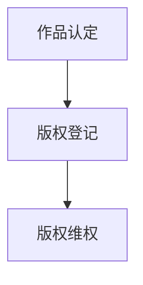

----------------------------------------------------------------

### 第三部分：太空探索中的知识产权法律问题与案例分析

#### 3.1 知识产权纠纷的预防与解决

##### 3.1.1 知识产权侵权的基本预防措施

为预防知识产权侵权，可以采取以下基本措施：

1. **专利检索**：在研发过程中，进行专利检索，避免侵权。
2. **技术创新**：通过技术创新，规避已有的专利。
3. **合同约定**：在合同中明确知识产权归属、使用权限等。
4. **维权意识**：提高知识产权意识，加强维权。

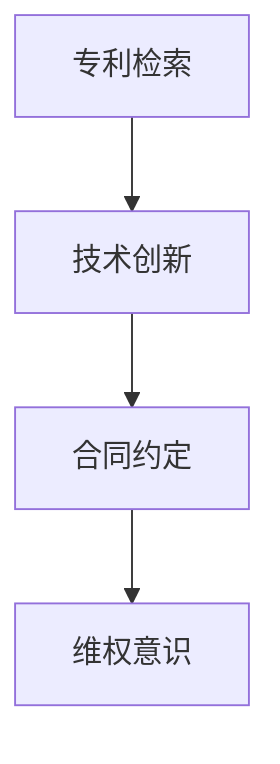

##### 3.1.2 知识产权纠纷的解决途径

知识产权纠纷的解决途径主要包括以下几种：

1. **调解与和解**：通过协商解决纠纷。
2. **民事诉讼**：向法院提起诉讼，要求侵权者停止侵权行为。
3. **仲裁**：通过仲裁机构解决纠纷。

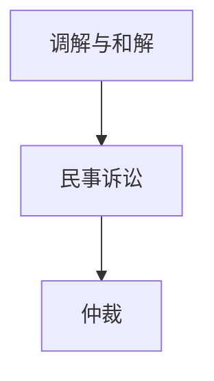

##### 3.1.3 基于专利的侵权预防

基于专利的侵权预防措施主要包括：

1. **专利布局**：进行全面的专利布局，确保技术覆盖。
2. **专利监控**：监控市场上的侵权行为。
3. **交叉许可**：与其他专利权人进行交叉许可，避免侵权。

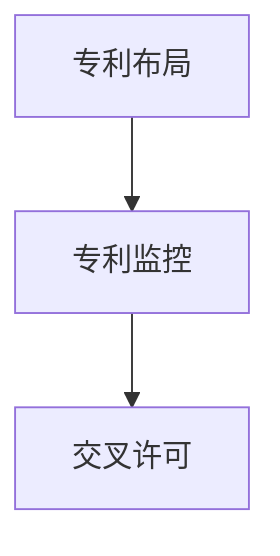

##### 3.1.4 基于商标的侵权预防

基于商标的侵权预防措施主要包括：

1. **商标注册**：在国内外进行商标注册，确保商标专用权。
2. **商标监控**：监控市场上的商标使用情况。
3. **商标维权**：对侵权行为进行维权。

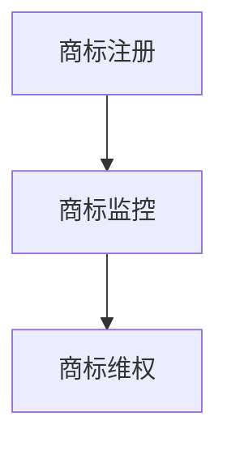

#### 3.2 案例分析

##### 3.2.1 美国太空探索技术公司（SpaceX）的知识产权策略

SpaceX作为一家领先的太空探索公司，其知识产权策略非常成功。以下是SpaceX的知识产权策略：

1. **专利布局**：SpaceX在全球范围内进行了大量的专利布局，确保其技术的领先地位。
2. **商标保护**：SpaceX对其品牌和标识进行了全球注册，以保护其品牌价值。
3. **交叉许可**：SpaceX与其他公司进行交叉许可，以降低侵权风险。

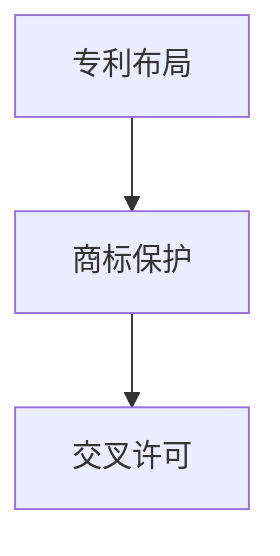

##### 3.2.2 国际空间站（ISS）的知识产权合作案例

国际空间站（ISS）是一个国际合作的太空项目，其知识产权合作具有以下特点：

1. **知识产权共享**：各国参与方在ISS项目中进行知识产权共享，以促进技术合作。
2. **知识产权管理**：建立知识产权管理委员会，负责协调和管理各参与方的知识产权问题。
3. **知识产权收益分配**：根据各国的参与程度和贡献，进行知识产权收益的分配。

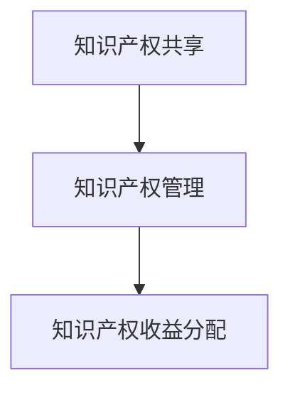

----------------------------------------------------------------

### 第四部分：未来展望与挑战

#### 4.1 太空探索知识产权的未来发展趋势

随着太空探索的不断深入，太空探索知识产权将呈现以下发展趋势：

1. **太空资源知识产权**：随着太空资源的商业开发，太空资源知识产权将成为新的研究热点。
2. **空间大数据知识产权**：太空探索过程中产生的大量数据，将引发空间大数据知识产权问题。
3. **跨国太空探索合作**：随着跨国太空探索合作的增多，知识产权保护的国际协调将成为重要议题。

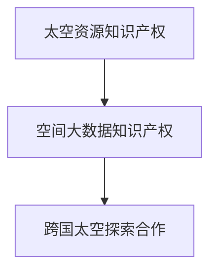

#### 4.2 太空探索知识产权法律问题面临的挑战与应对策略

太空探索知识产权法律问题面临的挑战主要包括：

1. **全球知识产权法律体系的协调**：不同国家和地区的知识产权法律存在差异，需要协调和完善。
2. **跨国太空探索合作的知识产权协调**：跨国太空探索合作中的知识产权问题需要协调和解决。
3. **太空犯罪的司法管辖难题**：太空犯罪涉及多个国家和地区，需要建立全球性的司法管辖机制。

应对策略包括：

1. **完善国际知识产权条约**：通过修订和完善国际知识产权条约，解决全球知识产权法律体系协调问题。
2. **加强跨国合作**：通过国际合作，解决跨国太空探索合作中的知识产权问题。
3. **建立全球太空犯罪司法协调机制**：建立全球太空犯罪司法协调机制，提高太空犯罪的打击力度。

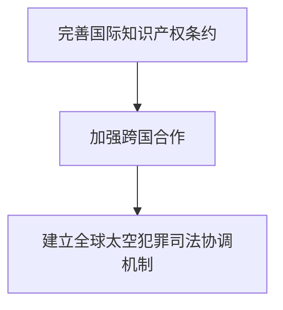

----------------------------------------------------------------

### 附录

#### 附录A：相关法律法规与国际条约

##### A.1 国际太空条约概述

- 《外层空间条约》
- 《救援协定》
- 《责任公约》

##### A.2 主要国家太空法律

- 美国：《国家航空航天政策》、《国家航空航天委员会法》
- 俄罗斯：《俄罗斯联邦太空活动法》、《俄罗斯联邦空间物体登记法》
- 欧洲：《欧洲空间法》、《欧洲空间活动基本规则》

##### A.3 国际知识产权保护相关条约

- 《伯尔尼公约》
- 《专利合作条约》
- 《商标法条约》

#### 附录B：参考资料与推荐阅读

##### B.1 知识产权与太空探索的学术文章

- "Intellectual Property Rights and Space Exploration: Challenges and Opportunities"
- "The Protection of Intellectual Property in Space: A Comparative Analysis of National and International Law"
- "Space Technology Patents: A Survey and Analysis"

##### B.2 重要的太空法律案例汇编

- "Space Law Cases: A Compendium of Judgments and Decisions"
- "Cases on International Space Law: Selected Judgments and Arbitral Awards"
- "Space Crime and Liability: Legal Cases and Analyses"

##### B.3 推荐的太空探索与知识产权书籍

- "Space Law: A Treatise on the Law of International Space Activities"
- "Intellectual Property Rights in Space: Law, Policy, and Practice"
- "The Space Economy: The Future of Globalization in the Era of Commercial Spaceflight"

### 作者信息

作者：AI天才研究院/AI Genius Institute & 禅与计算机程序设计艺术 /Zen And The Art of Computer Programming

