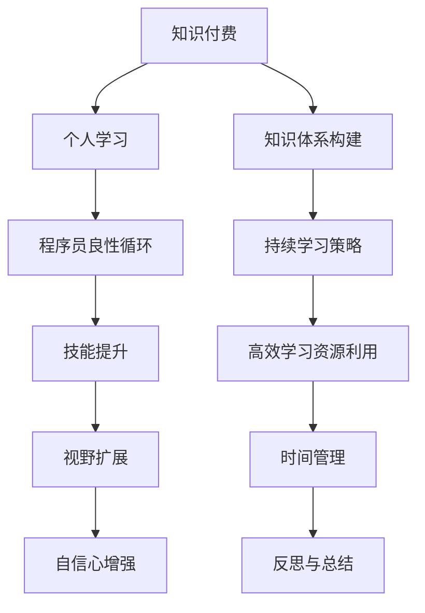

                 

### 文章标题

《知识付费与个人学习：程序员的良性循环》

### 关键词

知识付费、个人学习、程序员、技能提升、持续学习、知识体系、学习资源

### 摘要

本文旨在探讨知识付费在程序员个人学习中的重要性，以及如何通过有效的知识付费实现良性循环，从而提升程序员的技能水平、扩展视野和增强自信心。文章首先介绍了知识付费的背景和概念，随后分析了程序员的个人学习需求，并推荐了一些主流的知识付费平台和高效学习资源。接着，文章详细阐述了如何构建个人知识体系和持续学习的策略与方法。最后，通过实际案例分享，展示了知识付费对程序员个人学习和职业发展的影响。本文旨在为程序员提供一份全面的学习指南，帮助他们更高效地提升自我。

## 目录大纲

### 《知识付费与个人学习：程序员的良性循环》

#### 第一部分：知识付费的背景与概念

1. **第1章：知识付费概述**
   - 1.1 知识付费的起源与发展
   - 1.2 知识付费的价值与意义
   - 1.3 知识付费的类型与模式
   - 1.4 知识付费的现状与趋势

2. **第2章：程序员的个人学习需求**
   - 2.1 程序员的学习路径
   - 2.2 程序员的学习难点与解决方案
   - 2.3 程序员的学习习惯与心态

#### 第二部分：知识付费平台与资源

3. **第3章：主流知识付费平台介绍**
   - 3.1 知识星球
   - 3.2 知乎Live
   - 3.3 小密圈
   - 3.4 网易云课堂
   - 3.5 其他知识付费平台

4. **第4章：高效学习资源推荐**
   - 4.1 在线课程
   - 4.2 实战项目
   - 4.3 技术文档与书籍
   - 4.4 论坛与社群

#### 第三部分：程序员的良性循环

5. **第5章：知识付费对程序员的影响**
   - 5.1 提升技能
   - 5.2 扩展视野
   - 5.3 增强自信心

6. **第6章：构建个人知识体系**
   - 6.1 知识分类与标签
   - 6.2 知识整理与归纳
   - 6.3 知识体系化的重要性

7. **第7章：持续学习的策略与方法**
   - 7.1 阶段性目标设定
   - 7.2 学习资源筛选与利用
   - 7.3 时间管理
   - 7.4 反思与总结

#### 第四部分：实战案例分享

8. **第8章：成功案例介绍**
   - 8.1 案例一：通过知识付费提升技能
   - 8.2 案例二：通过知识付费扩展视野
   - 8.3 案例三：通过知识付费构建知识体系

#### 第五部分：未来展望

9. **第9章：知识付费的发展趋势**
   - 9.1 个性化推荐
   - 9.2 智能问答
   - 9.3 跨界融合

10. **第10章：程序员的学习与成长**
    - 10.1 持续学习的动力
    - 10.2 职业发展的方向
    - 10.3 个人品牌建设

### 附录

11. **附录A：知识付费平台使用指南**
12. **附录B：程序员学习资源汇总**
13. **附录C：常见问题解答**

### 核心概念与联系

以下是核心概念及其相互联系的结构化描述，使用Mermaid图形来表示：



### 核心算法原理讲解

为了更好地理解和应用持续学习的策略与方法，下面我们将使用伪代码来详细阐述阶段性目标设定的算法原理。

#### 阶段性目标设定算法

```python
# 输入参数：
# skillLevel - 学习者的技能水平（"beginner", "intermediate", "advanced"）
# timeCommitment - 学习者每周可投入的学习时间（小时）

# 输出：
# goal - 学习目标

def setLearningGoal(skillLevel, timeCommitment):
    if skillLevel == "beginner":
        goal = "掌握基础概念，完成入门项目"
    elif skillLevel == "intermediate":
        goal = "精通核心算法，参与实战项目"
    elif skillLevel == "advanced":
        goal = "深入研究前沿技术，贡献原创内容"
    
    if timeCommitment < 5:
        goal += ", 每周至少学习2小时"
    elif timeCommitment >= 5 and timeCommitment < 10:
        goal += ", 每周至少学习5小时"
    else:
        goal += ", 每周至少学习10小时"
    
    return goal
```

#### 举例说明

```python
# 假设一个中级水平的程序员，每周可以投入8小时学习时间
goal = setLearningGoal("intermediate", 8)
print(goal)
```

输出：

```
精通核心算法，参与实战项目，每周至少学习5小时
```

通过上述算法，我们可以根据程序员的技能水平和时间投入，设定一个具体且可达成的学习目标，从而确保其学习过程的系统性和有效性。

### 数学模型和公式

在构建个人知识体系的过程中，以下是一些关键的数学模型和公式，它们可以帮助我们更好地理解和应用知识：

#### 知识复利效应

$$
复利效应 = \frac{学习时间 \times 学习效率}{遗忘率}
$$

其中：
- **学习时间**：学习者投入的学习时间（小时）
- **学习效率**：学习者在单位时间内吸收和掌握的知识量（单位：知识点/小时）
- **遗忘率**：学习者因时间流逝而遗忘的知识比例（0 < 遗忘率 < 1）

#### 学习曲线

$$
学习曲线 = \frac{1}{1 + e^{-kt}}
$$

其中：
- **k**：学习速率常数
- **t**：学习时间

#### 知识掌握度

$$
知识掌握度 = \frac{实际应用次数}{总学习次数}
$$

其中：
- **实际应用次数**：学习者将所学知识应用于实际问题的次数
- **总学习次数**：学习者学习同一知识点的总次数

#### 知识体系化

$$
知识体系化 = \frac{知识节点数量}{知识关联度}
$$

其中：
- **知识节点数量**：知识体系中的知识点数量
- **知识关联度**：知识点之间的相互关联程度

#### 时间管理公式

$$
时间管理 = \frac{总任务时间}{实际学习时间}
$$

其中：
- **总任务时间**：学习者需要完成的所有学习任务所需的总时间
- **实际学习时间**：学习者实际投入的学习时间

通过上述数学模型和公式，我们可以量化地分析学习过程，从而制定更科学、更有效的学习策略。

## 第一部分：知识付费的背景与概念

### 第1章：知识付费概述

#### 1.1 知识付费的起源与发展

知识付费作为一种新兴的商业模式，起源于互联网技术的发展和人们对知识的渴望。随着互联网的普及，信息传播的速度和范围得到了极大的扩展，传统的免费知识传播模式逐渐显露出其局限性。例如，信息过载、内容质量参差不齐、用户参与度低等问题日益凸显。这些问题促使人们开始探索新的知识传播方式，知识付费因此应运而生。

知识付费的起源可以追溯到2000年代初的在线教育平台，如Coursera、Udemy等。这些平台通过提供高质量的在线课程，收取一定的费用，为学习者提供了更为专业和系统的学习资源。随后，知识付费逐渐扩展到其他领域，如知识星球、知乎Live等，形成了多样化的知识付费生态。

在发展过程中，知识付费经历了几个重要阶段：

1. **初步探索阶段（2000-2010年）**：这一阶段主要是线上教育的初步尝试，以提供在线课程为主要形式。知识付费的模式较为单一，主要集中在在线课程的销售。

2. **快速扩张阶段（2010-2015年）**：随着移动互联网的兴起，知识付费进入快速扩张阶段。各种知识付费平台如雨后春笋般涌现，覆盖了从职业技能培训、兴趣爱好到知识分享等多个领域。

3. **成熟发展阶段（2015年至今）**：知识付费逐渐成熟，形成了多样化的商业模式和生态系统。除了在线课程，还出现了付费问答、知识星球、小密圈等多种形式，满足了用户不同层次的知识需求。

#### 1.2 知识付费的价值与意义

知识付费作为一种商业模式，其价值主要体现在以下几个方面：

1. **提高内容质量**：知识付费使得创作者能够通过经济收益来支撑其创作活动，从而提高了内容的创作质量和专业度。相比免费内容，付费内容通常更加深入、系统，能够提供更有价值的信息。

2. **激发用户参与度**：知识付费使得用户在消费内容时产生了一定的经济投入，从而增强了用户的参与感和责任感。用户更倾向于积极参与讨论、提问和分享，形成良好的互动氛围。

3. **促进知识传播**：知识付费不仅为创作者提供了经济支持，也推动了知识的广泛传播。通过付费模式，优质内容得以更快速、更广泛地传播，有助于提高整个社会的知识水平和创新能力。

4. **创造商业机会**：知识付费为平台和创作者创造了新的商业机会。平台可以通过提供多样化的知识产品和服务来吸引更多的用户，创作者则可以通过创作优质内容来获取更多的收益。

#### 1.3 知识付费的类型与模式

知识付费的类型和模式多种多样，以下是其中几种主要的类型和模式：

1. **在线课程**：在线课程是最常见的知识付费模式之一。用户通过购买课程，可以获得系统的学习资源和指导，通常包括视频讲座、文档资料、作业练习等。

2. **付费问答**：付费问答模式允许用户向专家或有经验的人士提问，并获得针对性的解答。这种模式通常适用于专业领域的问题解决，如法律咨询、医疗建议等。

3. **知识星球**：知识星球是一种社区化的知识付费平台，用户可以通过订阅成为会员，获得专家或团队提供的定期分享、讨论和答疑服务。

4. **小密圈**：小密圈是一种私密化的知识分享社区，用户通过付费加入，可以与行业专家或其他成员进行深入交流和互动。

5. **付费文档**：付费文档包括专业书籍、技术文档、市场报告等，用户通过购买可以获得完整的文档内容。

6. **线上工作坊**：线上工作坊是一种实时互动的学习活动，通常包括讲座、讨论、实践等多种形式。用户通过报名参加，可以获得实践操作的机会和导师的指导。

7. **会员制**：会员制是一种长期的知识付费模式，用户通过支付会员费用，可以享受平台提供的多种服务，如课程、问答、社群等。

#### 1.4 知识付费的现状与趋势

目前，知识付费已经成为一种重要的知识传播和消费方式。根据相关数据，全球知识付费市场规模持续增长，预计到2025年将达到数百亿美元。以下是一些知识付费的现状与趋势：

1. **市场增长**：知识付费市场持续增长，用户规模不断扩大。特别是在疫情背景下，线上教育和知识付费的需求大幅上升。

2. **内容多样化**：知识付费内容越来越多样化，涵盖了从职业技能培训到兴趣爱好、从学术研究到生活常识等多个领域。

3. **个性化推荐**：随着大数据和人工智能技术的发展，知识付费平台开始采用个性化推荐技术，为用户提供更加精准和个性化的学习资源。

4. **跨界融合**：知识付费与其他领域的融合趋势明显，如教育与电商、教育与游戏、教育与社交等。跨界融合不仅拓宽了知识付费的应用场景，也为用户提供了更多的价值。

5. **平台竞争**：知识付费平台之间的竞争日益激烈，平台需要不断创新和优化服务，以吸引和留住用户。

6. **用户需求变化**：用户对知识付费的需求逐渐从单纯的课程学习向个性化、互动性、实践性等方面转变。用户更倾向于选择那些能够提供深度学习体验和互动交流的平台。

7. **版权保护**：随着知识付费市场的扩大，版权保护问题逐渐受到重视。平台和创作者需要加强版权保护，防止内容被非法复制和传播。

总之，知识付费作为一种新兴的商业模式，具有巨大的发展潜力。在未来的发展中，知识付费将继续不断创新和优化，满足用户多样化的知识需求，推动知识的广泛传播和利用。

### 第2章：程序员的个人学习需求

#### 2.1 程序员的学习路径

程序员的职业发展通常伴随着技术的不断更新和演进，因此学习路径的规划显得尤为重要。程序员的学习路径可以分为以下几个阶段：

1. **基础知识阶段**：初学者首先需要掌握计算机科学的基础知识，如数据结构、算法、操作系统、计算机网络等。这一阶段的学习目标是建立扎实的理论基础，为后续学习打下坚实的基础。

2. **编程语言阶段**：基础知识掌握后，程序员需要选择一门或多门编程语言进行深入学习。常见的编程语言包括Python、Java、C++、JavaScript等。选择编程语言时，需要考虑职业需求和兴趣。

3. **框架与工具阶段**：随着编程技能的提高，程序员需要学习各种框架和工具，以提升开发效率和项目质量。如Web开发中的Spring、Django，前端开发中的React、Vue等。

4. **专业技能阶段**：在掌握基础编程技能后，程序员需要进一步学习特定的专业技能，如大数据、人工智能、云计算等。这一阶段的学习目标是将理论知识应用于实际项目，提升实战能力。

5. **持续学习阶段**：技术更新迅速，程序员需要持续学习，跟上行业的发展。这一阶段的学习重点是拓展视野，了解新技术、新趋势，并应用于实际工作中。

#### 2.2 程序员的学习难点与解决方案

程序员在学习过程中可能会遇到以下难点：

1. **理论知识与实践脱节**：很多程序员在学习计算机科学理论时，感觉难以将所学知识应用于实际项目。解决方案是参与实战项目，通过实际编码来加深理解。

2. **时间管理困难**：程序员通常工作繁忙，难以抽出足够的时间进行学习。解决方案是制定学习计划，利用碎片化时间学习，如早晨、午休和晚上。

3. **学习资源繁多**：随着互联网的普及，学习资源种类繁多，质量参差不齐。解决方案是选择权威的教材和课程，避免浪费时间在低效的学习资源上。

4. **缺乏学习动力**：长时间的学习可能会让程序员感到枯燥乏味，缺乏动力。解决方案是设定明确的学习目标和奖励机制，保持学习热情。

5. **技术栈更新迅速**：新技术层出不穷，程序员需要不断更新自己的技术栈。解决方案是关注技术社区，了解行业动态，及时学习新技术。

#### 2.3 程序员的学习习惯与心态

良好的学习习惯和心态对于程序员的个人学习至关重要。以下是一些推荐的学习习惯和心态：

1. **定期复习**：学习是一个持续的过程，定期复习可以加深记忆，巩固知识。建议每周至少安排一次复习，回顾所学内容。

2. **主动学习**：被动学习效率较低，主动学习更能激发学习兴趣和动力。可以通过编写代码、解决实际问题来加深对知识的理解。

3. **保持好奇心**：编程领域不断进步，保持好奇心可以帮助程序员不断探索新技术、新方法，保持学习的热情。

4. **积极参与社区**：加入技术社区，参与讨论和交流，可以拓宽视野，获取更多的学习资源和建议。

5. **乐观心态**：学习过程中难免会遇到挫折和困难，保持乐观心态，积极面对问题，有助于提高学习效果。

通过明确的学习路径、解决学习难点、培养良好的学习习惯和心态，程序员可以更高效地进行个人学习，提升自身技能水平。

### 第3章：主流知识付费平台介绍

在知识付费领域，众多平台如雨后春笋般涌现，为用户提供了丰富的学习资源和互动机会。以下是几种主流的知识付费平台及其特点的介绍：

#### 3.1 知识星球

知识星球是一个以知识分享为核心的社群平台，用户可以通过订阅成为星球会员，获取专家或行业人士的分享内容。知识星球的特点如下：

- **内容丰富**：知识星球上涵盖了各个领域的知识，包括科技、金融、文化等。
- **互动性强**：会员可以与专家和其他会员互动，提出问题并得到解答。
- **私密性**：知识星球社区具有私密性，会员信息不会被公开，保护了用户的隐私。
- **高质量内容**：知识星球上的分享内容通常由行业专家或资深人士提供，保证了内容的质量。

#### 3.2 知乎Live

知乎Live是知乎推出的付费直播课程平台，用户可以通过购买直播或回看课程来学习。知乎Live的特点如下：

- **直播互动**：用户可以实时参与直播课程，与讲师互动提问。
- **内容多样**：知乎Live涵盖了多个领域的知识，如职业发展、技能培训、生活百科等。
- **精品课程**：知乎Live的课程由知名讲师或行业专家主讲，课程内容具有深度和实用性。
- **永久回看**：用户可以无限次回看已购买的课程，方便巩固学习。

#### 3.3 小密圈

小密圈是一种私密化的知识分享社区，用户通过付费加入圈层，可以获取专家或团队提供的分享和答疑服务。小密圈的特点如下：

- **私密社区**：小密圈社区成员之间有较强的私密性，交流内容不会被公开。
- **深度交流**：小密圈内的成员可以就特定话题进行深入交流，获取更多实战经验和见解。
- **定制化内容**：小密圈的分享内容通常根据用户需求定制，更具针对性。
- **个性化服务**：小密圈的创建者通常会提供一对一的答疑和辅导服务，满足用户个性化需求。

#### 3.4 网易云课堂

网易云课堂是网易旗下的在线教育平台，提供各种课程和学习资源。网易云课堂的特点如下：

- **课程丰富**：网易云课堂涵盖了从编程语言、软件开发到职业发展、人文社科等多个领域的课程。
- **学习方式多样**：用户可以选择视频课程、电子书、实战项目等多种学习方式。
- **优质讲师**：网易云课堂的课程由众多知名讲师和专家主讲，保证了课程质量。
- **学习社区**：网易云课堂内置学习社区，用户可以讨论、提问，与其他学习者互动。

#### 3.5 其他知识付费平台

除了上述平台，还有许多其他知名的知识付费平台，如得到、喜马拉雅、蜻蜓FM等。以下是这些平台的简要介绍：

- **得到**：得到是一个以音频课程为主的知识付费平台，用户可以通过订阅获取各种领域的精品课程。
- **喜马拉雅**：喜马拉雅是一个综合性的音频分享平台，用户可以通过付费购买知识课程、有声书等。
- **蜻蜓FM**：蜻蜓FM也是一个音频分享平台，提供各种类型的知识课程和有声读物。

这些平台各有特色，用户可以根据自己的需求和兴趣选择合适的知识付费平台，获取高质量的学习资源和服务。

### 第4章：高效学习资源推荐

在知识付费领域，选择合适的学习资源对提升学习效果至关重要。以下是一些高效学习资源的推荐，包括在线课程、实战项目、技术文档与书籍、论坛与社群等。

#### 4.1 在线课程

在线课程是程序员进行知识付费学习的主要方式之一。以下是几个推荐的在线课程平台：

- **Coursera**：提供全球顶尖大学和机构的在线课程，包括计算机科学、人工智能、数据科学等多个领域。
- **Udemy**：拥有大量高质量的在线课程，涵盖从编程语言到软技能的各种主题。
- **edX**：由哈佛大学和麻省理工学院联合创办的在线课程平台，提供免费和付费课程。
- **网易云课堂**：网易云课堂提供各种编程语言、软件开发、数据分析等领域的在线课程。

通过在线课程，程序员可以系统地学习新知识，掌握最新的技术趋势。

#### 4.2 实战项目

实战项目是巩固编程技能的重要途径。以下是一些推荐的实战项目资源：

- **GitHub**：GitHub是一个代码托管平台，用户可以在这里找到各种开源项目和实战项目，参与实际编程。
- **LeetCode**：LeetCode是一个在线编程平台，提供大量的算法题目和实战项目，适合程序员进行编程练习。
- **GitHub Pages**：通过GitHub Pages，程序员可以将自己的项目部署到Web上，展示实际开发成果。
- **Kaggle**：Kaggle是一个数据科学竞赛平台，用户可以通过参与竞赛来实践数据科学技能。

通过参与实战项目，程序员不仅能够提升编程技能，还能够锻炼解决实际问题的能力。

#### 4.3 技术文档与书籍

技术文档和书籍是程序员进行知识积累和系统学习的重要资源。以下是一些推荐的技术文档和书籍：

- **官方文档**：大多数编程语言和框架都有详细的官方文档，如Python官方文档、Spring官方文档等。
- **经典书籍**：《算法导论》、《深度学习》、《计算机网络：自顶向下方法》等。
- **在线书籍库**：如GitHub Books、Bookshelf等，提供大量的免费和付费技术书籍。
- **电子书平台**：如京东读书、亚马逊Kindle等，用户可以购买和下载各种技术书籍。

通过阅读技术文档和书籍，程序员可以系统地掌握编程知识和技能。

#### 4.4 论坛与社群

论坛和社群是程序员进行知识交流和技术分享的重要平台。以下是一些推荐的论坛和社群：

- **Stack Overflow**：全球最大的编程问答社区，程序员可以在这里提问和解答技术问题。
- **GitHub Community**：GitHub内置的社区，用户可以在这里讨论代码和项目。
- **知乎**：中国最大的知识分享社区，程序员可以在这里找到各种编程和技术话题。
- **微信技术社群**：如微信公众号、微信群等，程序员可以加入各种技术社群，进行深度交流和互动。

通过参与论坛和社群，程序员可以拓宽视野，获取行业动态和前沿技术信息。

综上所述，选择高效的学习资源对于程序员提升技能和知识水平至关重要。通过在线课程、实战项目、技术文档与书籍、论坛与社群等多种学习资源，程序员可以更全面、深入地学习，不断提升自身的技术能力和职业素养。

### 第5章：知识付费对程序员的影响

知识付费作为一种新兴的商业模式，对程序员的个人发展和职业成长具有深远的影响。以下是知识付费对程序员的主要影响：

#### 5.1 提升技能

知识付费的一个重要价值在于为程序员提供了高质量的学习资源，帮助他们提升专业技能。通过付费课程、实战项目、技术文档和书籍等资源，程序员可以系统地学习新知识、掌握新技术，从而提升自己的技能水平。

例如，一位程序员通过付费学习Python编程语言，掌握了数据分析和机器学习相关的知识。这些新技能不仅提升了他的职业竞争力，也为他打开了新的职业发展道路。通过持续的知识付费，程序员可以不断更新自己的技术栈，适应快速变化的技术环境。

#### 5.2 扩展视野

知识付费不仅限于技能提升，还可以帮助程序员扩展视野，了解行业动态和前沿技术。通过参与知识付费平台的活动，如在线课程、研讨会、工作坊等，程序员可以与业界专家和其他同行交流，获取最新的行业信息和技术趋势。

例如，一位程序员通过订阅知识星球，获得了多位行业专家的定期分享和讨论。这些分享内容涵盖了最新的技术趋势、实战经验和行业洞见，帮助他扩展了知识视野，提升了自身对行业的认知水平。通过扩展视野，程序员可以更好地把握职业发展方向，做出更加明智的职业决策。

#### 5.3 增强自信心

知识付费的另一个重要价值在于增强程序员的自信心。通过付费学习，程序员可以获得权威的认证和认可，从而提升自己的职业自信心。

例如，一位程序员通过参加网易云课堂的Python编程课程，并顺利通过了相关认证考试。这不仅证明了他掌握了Python编程技能，也为他在职场中赢得了更多的机会和尊重。通过获得认证和认可，程序员可以更加自信地面对工作挑战和职业发展，增强自我价值感。

总之，知识付费对程序员的个人发展和职业成长具有多方面的积极影响。通过提升技能、扩展视野和增强自信心，程序员可以更加高效地提升自己的职业竞争力，实现职业发展的良性循环。

### 第6章：构建个人知识体系

构建个人知识体系是程序员持续学习和职业发展的重要环节。一个有效的知识体系不仅有助于提升学习效率，还能为程序员提供清晰的职业发展路径。以下是构建个人知识体系的步骤和方法：

#### 6.1 知识分类与标签

首先，程序员需要对所学知识进行分类和标签化管理。知识分类可以帮助我们将知识分为不同的领域和层次，便于管理和查找。以下是一些常见的知识分类方法：

- **按技术领域分类**：例如，前端开发、后端开发、移动开发、大数据、人工智能等。
- **按技能层次分类**：例如，基础知识、中级技能、高级技能、前沿技术等。
- **按应用场景分类**：例如，企业应用、个人项目、开源项目等。

通过分类，程序员可以更清晰地了解自己的知识结构，发现知识盲点和薄弱环节。

标签化管理则是将相关知识进行标记，便于快速检索和关联。例如，可以将“Python编程”标签与“数据分析”、“机器学习”等相关知识进行关联。

#### 6.2 知识整理与归纳

在分类和标签化管理的基础上，程序员需要对知识进行整理和归纳，形成系统的知识体系。以下是一些具体的整理和归纳方法：

- **制作知识图谱**：通过图形化方式展示知识的关联性和层次结构，有助于理解和记忆。可以使用MindMap、Xmind等工具制作知识图谱。
- **编写技术文档**：将所学知识整理成文档，形成系统的知识库。技术文档不仅可以帮助自己回顾和巩固知识，还可以为他人提供帮助。
- **编写个人博客**：通过撰写技术博客，不仅可以将所学知识系统化，还能锻炼自己的表达和总结能力。博客内容可以包括学习笔记、项目总结、技术分享等。

#### 6.3 知识体系化的重要性

构建个人知识体系的重要性体现在以下几个方面：

- **提升学习效率**：一个良好的知识体系可以帮助程序员快速定位和查找所需知识，避免重复学习，提高学习效率。
- **增强职业竞争力**：通过系统化地掌握知识，程序员可以更全面地了解自己所处的领域，提升职业竞争力。
- **促进持续学习**：知识体系化可以激发程序员的学习兴趣和动力，促进持续学习，不断更新和扩展自己的知识结构。
- **助力职业发展**：一个清晰的知识体系可以为程序员的职业发展提供明确的指引，帮助其制定职业规划，实现职业目标。

总之，构建个人知识体系是程序员提升自身能力、实现职业发展的重要途径。通过分类、整理和归纳，程序员可以形成系统化、结构化的知识体系，为个人的学习和职业发展奠定坚实基础。

### 第7章：持续学习的策略与方法

持续学习是程序员职业发展中至关重要的一环。为了确保学习效果，制定科学的学习策略和方法是必要的。以下是几个关键策略和方法：

#### 7.1 阶段性目标设定

设定阶段性目标是持续学习的基础。目标应具体、可衡量，并与个人的职业发展目标相一致。以下是设定阶段性目标的步骤：

1. **评估当前水平**：了解自己在某一领域的知识和技能水平，确定自己的起点。
2. **确定目标方向**：根据职业规划和个人兴趣，确定学习目标的方向。例如，提升前端开发技能、学习大数据分析等。
3. **制定具体目标**：将目标细化，设定具体的学习内容和时间表。例如，在三个月内掌握React框架、每周投入10小时进行学习等。
4. **定期评估与调整**：定期评估学习进度，根据实际情况调整目标，确保目标的实现。

#### 7.2 学习资源筛选与利用

选择合适的学习资源对于学习效果至关重要。以下是一些筛选和学习资源的策略：

1. **选择权威资源**：优先选择官方文档、知名作者和权威机构的课程和书籍。
2. **多样化学习资源**：结合多种学习资源，如在线课程、实战项目、技术文档、书籍、论坛等，以满足不同学习需求。
3. **制定学习计划**：根据学习目标和时间安排，制定详细的学习计划，确保资源的有效利用。
4. **定期更新资源**：技术更新迅速，定期更新学习资源，确保所学内容的时效性和准确性。

#### 7.3 时间管理

有效的时间管理是确保学习持续进行的重要保障。以下是一些时间管理策略：

1. **制定时间表**：合理安排每天的学习时间，确保学习计划得以执行。
2. **利用碎片时间**：利用早晨、午休、晚上等碎片时间进行学习，提高学习效率。
3. **避免拖延**：设定明确的学习目标和时间表，避免拖延，确保学习进度。
4. **定期反思与调整**：定期反思学习效果和时间管理情况，根据实际情况进行调整。

#### 7.4 反思与总结

学习过程中的反思和总结是巩固知识、提升学习效果的重要手段。以下是一些反思与总结的策略：

1. **定期复习**：定期复习所学内容，巩固记忆，加深理解。
2. **写学习笔记**：将学习过程中的心得体会、疑问和解决方案记录下来，形成学习笔记。
3. **总结学习成果**：定期总结学习成果，评估学习效果，反思学习过程中的优点和不足。
4. **分享与交流**：通过技术博客、社群等途径分享学习成果，与他人交流学习心得，获取反馈和建议。

通过设定阶段性目标、筛选利用学习资源、有效管理时间和进行反思总结，程序员可以确保持续学习的效果，不断提升自己的技能水平，实现职业发展的目标。

### 第8章：实战案例分享

为了更好地理解知识付费对程序员个人学习和职业发展的实际影响，以下将分享三个成功案例，展示程序员如何通过知识付费实现技能提升、视野扩展和知识体系的构建。

#### 8.1 案例一：通过知识付费提升技能

李明是一名从事Web开发的程序员。在接触到知识付费平台后，他决定报名参加一门Python编程课程，以提高自己的编程技能。课程由知名讲师主讲，内容涵盖Python基础、数据处理、Web开发等。

**学习过程：**
- **第一阶段**：李明按照课程安排，每天投入2小时学习Python基础。他通过视频讲座和文档资料，逐步掌握了Python的基本语法和数据结构。
- **第二阶段**：李明开始学习数据处理和Web开发，通过实战项目练习，如搭建一个简单的博客系统，加深了对Python应用的理解。

**学习成果：**
- **技能提升**：通过系统的学习，李明成功掌握了Python编程，并将其应用于实际项目中，提升了工作效率。
- **职业发展**：李明在完成课程后，获得了讲师颁发的认证证书。这为他赢得了更多高薪工作的机会，职业发展迈上了一个新的台阶。

#### 8.2 案例二：通过知识付费扩展视野

张伟是一名专注于大数据开发的程序员。他通过订阅知识星球，加入了一个专注于大数据和人工智能的社群。社群内定期会有行业专家分享最新的技术趋势和实战经验。

**学习过程：**
- **定期分享**：张伟定期参加社群的分享活动，聆听专家关于大数据、机器学习的讲解，了解行业动态。
- **项目实践**：社群还会组织实战项目，如数据挖掘、图像识别等，张伟积极参与，通过实际操作加深对知识的理解。

**学习成果：**
- **视野扩展**：通过参与社群活动，张伟扩展了自己的知识视野，掌握了大数据和人工智能的最新技术。
- **职业转型**：张伟在扩展视野后，决定转型成为数据科学家。他利用所学知识，成功申请到一家知名互联网公司数据科学家职位，实现了职业转型。

#### 8.3 案例三：通过知识付费构建知识体系

王强是一名有多年编程经验的程序员，但他感觉到自己的知识结构较为零散，需要系统地构建一个知识体系。他通过网易云课堂报名参加了一系列课程，包括计算机科学基础、数据结构、算法等。

**学习过程：**
- **系统学习**：王强按照课程安排，系统学习了计算机科学的基础知识，并通过大量实战项目，如实现排序算法、数据结构等，加深了对理论知识的理解。
- **知识整理**：王强将所学知识整理成文档，形成了一套完整的知识体系。他还通过编写个人博客，分享学习心得和项目总结。

**学习成果：**
- **知识体系构建**：通过系统的学习，王强成功构建了一个结构化的知识体系，提高了自己的学习效率和工作效率。
- **个人品牌建设**：王强的博客得到了广泛的关注，他逐渐建立了自己的个人品牌。这为他赢得了更多的机会，包括在线课程的讲师邀请和兼职项目的机会。

通过这三个案例，我们可以看到知识付费对程序员个人学习和职业发展的积极影响。通过选择合适的学习资源、积极参与社群和项目实践，程序员不仅能够提升技能和扩展视野，还能构建系统的知识体系，实现职业的持续发展和成长。

### 第9章：知识付费的发展趋势

随着科技的进步和互联网的普及，知识付费市场正在经历快速的发展和变革。以下是知识付费的一些发展趋势：

#### 9.1 个性化推荐

个性化推荐是知识付费平台的一大趋势。通过大数据分析和机器学习算法，平台可以分析用户的学习习惯、兴趣和需求，为用户推荐最适合他们的学习内容和资源。这种个性化推荐不仅提高了学习效率，还增加了用户的满意度和参与度。

#### 9.2 智能问答

智能问答是知识付费平台发展的另一个重要方向。通过人工智能技术，平台可以提供实时、智能化的问答服务。用户可以在学习过程中遇到问题时，快速得到专业解答，从而提高学习效果。智能问答还可以为平台带来更多用户粘性，提升用户活跃度。

#### 9.3 跨界融合

知识付费的跨界融合趋势日益明显。平台开始与其他领域如电商、游戏、社交等融合，提供更加多样化的服务和产品。例如，知识付费平台可以与电商平台合作，推出付费课程礼包，或者与游戏平台合作，推出基于知识付费的游戏。这种跨界融合不仅拓宽了知识付费的应用场景，也为用户提供了更多价值。

#### 9.4 虚拟现实（VR）与增强现实（AR）

虚拟现实和增强现实技术在知识付费领域的应用逐渐成熟。通过VR和AR技术，用户可以身临其境地参与课程和实践项目，获得更加沉浸式的学习体验。这种技术不仅提高了学习兴趣，还能帮助用户更好地理解和掌握知识。

#### 9.5 持续迭代与更新

知识付费平台需要持续迭代和更新，以适应不断变化的市场需求和用户需求。平台需要定期更新课程内容，引入新的技术和方法，确保学习资源的时效性和实用性。此外，平台还需要不断优化用户体验，提升服务质量和用户满意度。

#### 9.6 知识付费与传统教育的融合

知识付费与传统教育的融合也是一个重要趋势。在线教育平台可以与传统教育机构合作，提供线上线下相结合的学习模式。这种模式不仅能够提高学习效果，还能拓展教育资源，让更多用户受益。

总之，知识付费市场的发展趋势多样且充满活力。通过个性化推荐、智能问答、跨界融合、虚拟现实和持续迭代等创新方式，知识付费将更好地满足用户的需求，推动整个行业的持续发展和变革。

### 第10章：程序员的学习与成长

程序员的学习与成长不仅关乎个人技能的提升，更是职业发展的关键。在这一部分，我们将探讨持续学习的动力、职业发展的方向以及个人品牌建设。

#### 10.1 持续学习的动力

持续学习对程序员来说至关重要，但保持学习动力却是一个挑战。以下是一些维持学习动力的策略：

1. **设定明确的目标**：明确的学习目标可以提供方向和动力。将大目标分解为小目标，逐步实现，可以带来成就感和动力。

2. **找到学习伙伴**：与同行或学习伙伴一起学习，可以相互鼓励、分享经验和解决问题。这种社交支持有助于保持学习动力。

3. **实践应用**：将所学知识应用于实际项目中，通过解决实际问题来增强学习效果和兴趣。

4. **奖励机制**：为自己设定奖励，如在完成一个学习目标后，奖励自己一段休息时间或一个小礼物，以增加学习的乐趣。

5. **保持好奇心**：对新技术和新知识保持好奇心，不断探索未知领域，激发学习兴趣。

#### 10.2 职业发展的方向

程序员的职业发展方向多样，以下是一些常见的职业路径：

1. **技术专家**：专注于某一技术领域，成为领域内的专家。这通常需要深入学习和实践，不断更新知识。

2. **项目经理**：负责项目规划、团队管理和技术决策。需要具备良好的沟通能力、项目管理能力和技术背景。

3. **架构师**：负责软件系统的整体架构设计和技术规划。需要具备广泛的计算机科学知识、系统设计和团队协作能力。

4. **研发经理**：管理研发团队，负责产品研发和项目执行。需要具备技术背景、领导能力和业务理解。

5. **技术咨询**：为企业提供技术咨询服务，帮助解决技术难题。需要具备深厚的技术功底和行业经验。

6. **创业**：创立自己的公司，从事软件开发、技术咨询等业务。这需要创新的思维、商业眼光和坚韧的意志。

#### 10.3 个人品牌建设

个人品牌建设对于程序员的职业发展具有重要意义。以下是一些个人品牌建设的策略：

1. **技术博客**：定期撰写技术博客，分享学习心得和项目经验。这不仅可以提高自己的技术水平，还能建立个人知名度。

2. **开源项目**：参与开源项目，贡献代码和解决方案。这有助于展示自己的技术实力和团队合作能力。

3. **演讲和分享**：参加技术会议、研讨会和分享会，发表演讲和分享经验。这可以提升自己的公众演讲能力和行业影响力。

4. **社交媒体**：利用社交媒体平台，如LinkedIn、Twitter等，展示自己的专业知识和成果。积极参与技术讨论，与行业人士互动。

5. **专业认证**：获得专业认证，如PMP、AWS Certified等，提高自己的专业水平。这可以为个人品牌增添信誉。

6. **网络课程**：制作和发布自己的在线课程，分享专业知识和经验。这不仅可以获得收入，还能提升个人影响力。

通过持续学习、明确职业发展方向和积极建设个人品牌，程序员可以不断提升自身竞争力，实现职业的持续发展和成长。

### 附录

#### 附录A：知识付费平台使用指南

1. **如何选择知识付费平台**：评估平台的课程质量、讲师资质、用户评价和价格等，选择适合自己的平台。
2. **如何注册和登录**：按照平台提供的指引，完成注册和登录流程，确保个人信息安全。
3. **如何购买课程**：选择感兴趣的课程，按照购买流程完成支付，获得课程学习权限。
4. **如何学习课程**：通过平台提供的课程学习资源，如视频、文档和作业等，进行自主学习。
5. **如何互动和交流**：参与课程讨论区，提问和解答问题，与其他学习者互动，提升学习效果。

#### 附录B：程序员学习资源汇总

1. **在线课程**：推荐平台如Coursera、Udemy、网易云课堂等。
2. **技术文档**：推荐网站如GitHub、官方文档、Stack Overflow等。
3. **书籍**：推荐书籍如《算法导论》、《深度学习》、《编程思想》等。
4. **开源项目**：推荐平台如GitHub、GitLab等。
5. **论坛和社群**：推荐论坛如Stack Overflow、知乎等，社群如微信技术群、GitHub Community等。

#### 附录C：常见问题解答

1. **如何选择适合自己的知识付费课程**？评估个人兴趣、职业需求和课程质量，选择符合自己需求的高质量课程。
2. **如何避免知识付费中的陷阱**？选择知名平台和有良好用户评价的课程，谨慎选择低价课程，避免盲目跟风。
3. **如何平衡工作与学习**？制定合理的学习计划，利用碎片时间学习，设定明确的阶段性目标，保持持续学习的动力。

### 结束语

《知识付费与个人学习：程序员的良性循环》旨在为程序员提供一份全面的学习指南，帮助他们通过知识付费实现技能提升、视野扩展和知识体系的构建。文章从知识付费的背景与概念、程序员的个人学习需求、主流知识付费平台和资源推荐、知识付费对程序员的影响、构建个人知识体系、持续学习的策略与方法、实战案例分享、知识付费的发展趋势以及程序员的学习与成长等多个方面进行了深入探讨。通过这篇文章，希望程序员能够更好地理解知识付费的重要性，并找到适合自己的学习路径，实现职业的持续发展和成长。

### 作者信息

作者：AI天才研究院/AI Genius Institute & 禅与计算机程序设计艺术 /Zen And The Art of Computer Programming

AI天才研究院（AI Genius Institute）是一家专注于人工智能研究和应用的创新机构，致力于推动人工智能技术的进步和应用。禅与计算机程序设计艺术（Zen And The Art of Computer Programming）是一本经典计算机科学书籍，由著名计算机科学家唐纳德·E·克努特（Donald E. Knuth）撰写，深入探讨了计算机编程的哲学和艺术。

