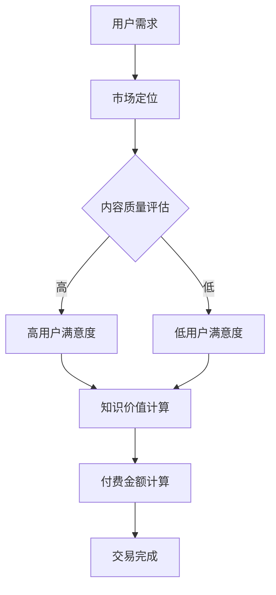

                 

### 《知识付费与开源贡献的平衡艺术》

> 关键词：知识付费、开源贡献、商业模式、社区共建、创新激励、可持续发展

> 摘要：本文将深入探讨知识付费与开源贡献之间的平衡艺术，从背景、模式、关系、策略和案例分析等多方面进行详细分析。通过本文，读者将了解知识付费与开源贡献的内在联系，掌握平衡两者的有效策略，为未来IT行业的可持续发展提供新思路。

## 第一部分：引言

### 1.1 知识付费的兴起与发展

#### 互联网时代知识付费的背景

互联网的快速发展，为知识的传播和获取提供了便捷的渠道。随着网络教育的普及，用户对优质知识内容的需求日益增长。知识付费作为一种商业模式，应运而生。知识付费的兴起，标志着知识经济时代的到来。

#### 知识付费市场的规模与趋势

近年来，知识付费市场呈现出快速增长的趋势。据统计，2020年全球知识付费市场规模已经达到2000亿美元，预计未来还将继续扩大。在中国，知识付费市场更是蓬勃发展，主要表现在在线教育、专业咨询、付费课程等领域。

### 1.2 开源贡献的价值与意义

#### 开源软件的发展历程

开源软件（Open Source Software，简称OSS）起源于20世纪90年代。它是一种软件的开发模式，允许用户自由地使用、修改和分发软件源代码。著名的开源软件有Linux、Apache等。

#### 开源贡献对企业与个人的影响

开源贡献对企业而言，有助于提升品牌影响力、降低研发成本、提高产品质量等。对于个人开发者，开源贡献可以拓展人脉、提升技能、积累经验等。

## 第二部分：知识付费模式分析

### 2.1 知识付费的基本模式

#### 有偿课程与咨询

有偿课程是指用户支付费用，以获取专业知识或技能培训。例如，在线教育平台中的课程，如 Coursera、Udemy 等。有偿咨询则是用户支付费用，向专业人士寻求个性化建议或解决方案。

#### 付费会员与社群

付费会员模式是指用户支付会员费用，以获得特定权益，如会员专享课程、免费咨询等。社群模式则是用户支付费用，加入特定领域的社群，与其他成员互动、分享知识和经验。

### 2.2 知识付费的市场细分

#### 专业领域知识付费

专业领域知识付费主要面向有一定专业技能或职业背景的用户。如IT技术、金融投资、市场营销等领域。这些知识付费产品通常具有较高的专业性和实用性。

#### 生活技能知识付费

生活技能知识付费主要面向普通消费者，涵盖广泛的生活领域，如烹饪、摄影、健身等。这些知识付费产品更注重实用性、趣味性和易于上手。

### 2.3 知识付费的优势与挑战

#### 优势分析

知识付费的优势主要体现在以下几个方面：

1. **高质量内容**：知识付费产品通常由专业人士或权威机构提供，内容质量较高。
2. **个性化定制**：知识付费可以根据用户需求，提供定制化的服务。
3. **商业价值**：知识付费有助于创作者实现知识变现，提升收入。

#### 挑战与应对策略

知识付费面临的挑战主要包括：

1. **竞争激烈**：市场上同类型知识付费产品众多，竞争激烈。
2. **用户留存**：如何提高用户留存率，是知识付费企业需要解决的重要问题。
3. **内容更新**：知识更新迅速，如何保持内容的时效性和实用性，是知识付费企业需要关注的问题。

针对这些挑战，知识付费企业可以采取以下策略：

1. **差异化竞争**：通过提供差异化产品，满足不同用户需求。
2. **用户运营**：通过用户数据分析，提高用户满意度，增强用户粘性。
3. **内容更新机制**：建立内容更新机制，确保知识付费产品的时效性和实用性。

## 第三部分：开源贡献与知识付费的关系

### 3.1 开源贡献的现状与问题

#### 开源贡献的现状

开源社区在全球范围内蓬勃发展，吸引了大量开发者参与。据统计，目前全球有超过 2000 万开源贡献者，他们共同维护着数十万个开源项目。这些开源项目涵盖了各个领域，如软件开发、人工智能、云计算等。

#### 开源贡献中存在的问题

尽管开源贡献取得了显著成果，但仍然存在一些问题。例如：

1. **贡献者流失**：由于开源贡献往往缺乏明确的回报机制，一些贡献者可能会选择退出。
2. **知识共享障碍**：一些开源项目由于版权、专利等问题，难以实现知识共享。

### 3.2 知识付费支持下的开源贡献

#### 知识付费与开源贡献的融合

知识付费可以为开源贡献提供支持，促进开源项目的发展。例如，一些企业通过付费课程、付费社群等形式，为开源贡献者提供报酬，从而激发他们的贡献热情。

#### 知识付费模式对开源贡献的激励作用

知识付费模式对开源贡献具有显著的激励作用。一方面，知识付费可以为贡献者提供经济回报，激发他们的积极性；另一方面，知识付费可以帮助开源项目获得更多关注和支持，从而推动项目的可持续发展。

### 3.3 知识付费与开源贡献的案例

#### 案例一：某知识付费平台的商业模式

某知识付费平台通过提供付费课程、付费社群等服务，为开源贡献者提供经济支持。该平台采用C2C模式，允许用户自主发布课程和社群，从而吸引了大量开源贡献者加入。通过这种模式，平台不仅为用户提供了高质量的知识内容，也为开源项目提供了持续的支持。

#### 案例二：开源项目通过知识付费获得支持

某开源项目通过知识付费模式，获得了企业赞助和个人捐助。该项目的核心贡献者开设了付费课程，向学员收取费用，并将部分收入用于支持项目开发。此外，项目还吸引了多家企业赞助，为项目提供了稳定的资金来源。

### 3.4 知识付费与开源贡献的融合策略

#### 个人层面的融合策略

对于个人开发者而言，知识付费与开源贡献的融合策略主要包括：

1. **时间管理**：合理安排时间，确保在开源贡献和知识付费之间取得平衡。
2. **知识分享与自我提升**：在开源贡献中积累经验，同时通过知识付费获取收入，实现自我提升。

#### 企业层面的融合策略

对于企业而言，知识付费与开源贡献的融合策略主要包括：

1. **开源文化与企业战略的结合**：将开源文化融入企业战略，推动企业参与开源项目。
2. **创新激励与知识共享机制**：建立创新激励制度，鼓励员工参与开源贡献，并通过知识共享机制，提升企业的技术实力。

### 3.5 社会层面的融合策略

#### 政策支持与法律保障

政府可以通过制定相关政策，支持知识付费与开源贡献的融合。例如，提供税收优惠、资金支持等，鼓励企业和个人参与开源项目。

#### 社会氛围的营造

社会氛围对知识付费与开源贡献的融合具有重要影响。通过媒体宣传、教育培训等方式，营造有利于知识付费与开源贡献发展的社会氛围，可以促进两者的融合。

## 第四部分：实战案例分析

### 4.1 案例一：某知识付费平台的商业模式

#### 平台概述

某知识付费平台是一家专注于IT领域的在线教育平台，提供包括编程、数据科学、人工智能等领域的付费课程。平台采用C2C模式，允许用户自主发布课程，并通过销售课程获取收益。该平台还设有付费社群，用户可以加入社群，与其他成员互动、分享知识和经验。

#### 成功经验与挑战

成功经验：

1. **高质量内容**：平台注重课程质量，邀请业界知名专家和讲师授课，确保用户能够获得高质量的知识内容。
2. **用户运营**：平台通过用户数据分析，了解用户需求，提供个性化的课程推荐，提高用户满意度。

挑战：

1. **市场竞争**：知识付费市场竞争激烈，平台需要不断创新，提高竞争力。
2. **用户留存**：如何提高用户留存率，是平台需要关注的问题。

#### 案例小结

该知识付费平台通过提供高质量的内容和个性化的服务，吸引了大量用户。同时，平台也积极推动开源贡献，为开源项目提供经济支持。这一模式在知识付费与开源贡献之间取得了良好的平衡。

### 4.2 案例二：开源项目通过知识付费获得支持

#### 项目介绍

某开源项目是一个专注于人工智能领域的项目，提供包括机器学习、深度学习等领域的开源工具和框架。该项目的核心贡献者开设了付费课程，向学员收取费用，并将部分收入用于支持项目开发。此外，项目还吸引了多家企业赞助，为项目提供了稳定的资金来源。

#### 知识付费模式的创新应用

1. **课程内容**：付费课程包括项目介绍、技术讲解、实战案例等，帮助学员深入了解项目技术。
2. **社群互动**：学员可以加入项目社群，与其他学员和贡献者互动，共同探讨问题。

#### 案例小结

通过知识付费模式，该开源项目获得了经济支持，确保了项目的可持续发展。同时，付费课程和社群互动也促进了开源贡献，提高了项目的质量和影响力。

### 4.3 案例三：企业如何平衡知识付费与开源贡献

#### 企业战略

某科技企业将开源贡献纳入企业战略，通过知识付费和开源贡献的平衡，实现企业的可持续发展。企业制定了一系列开源政策和激励机制，鼓励员工参与开源项目。

#### 实施案例

1. **员工激励**：企业为参与开源贡献的员工提供奖金和晋升机会，激发员工的积极性。
2. **项目支持**：企业为开源项目提供资金和资源支持，确保项目的顺利推进。

#### 案例小结

该企业通过平衡知识付费与开源贡献，实现了企业的技术积累和品牌提升。同时，开源贡献也为企业带来了更多的商业机会和合作伙伴。

## 第五部分：未来展望与趋势

### 5.1 知识付费与开源贡献的未来趋势

#### 技术进步对知识付费与开源贡献的影响

随着技术的不断发展，知识付费和开源贡献将面临新的机遇和挑战。例如，人工智能、大数据等技术将进一步提升知识付费产品的质量和用户体验。同时，区块链技术也为开源贡献提供了新的保障机制。

#### 行业变革与市场机遇

知识付费与开源贡献的融合，将为行业带来新的变革。企业可以通过知识付费模式，获得更多的商业机会和市场份额。同时，开源贡献也将为企业带来技术积累和品牌提升，为行业的发展注入新的动力。

### 5.2 新型的知识共享生态

#### 社区共建与知识共创

社区共建与知识共创将成为未来知识共享的重要模式。通过社区共建，用户可以共同参与知识创作和分享，形成知识共创的生态。这种模式将有助于提高知识共享的效率和质量。

#### 开源商业模式的创新

开源商业模式将继续创新，为知识付费与开源贡献的融合提供新的思路。例如，通过订阅模式、众筹模式等，为开源项目提供持续的支持。

## 附录

### 附录A：知识付费与开源贡献相关资源

#### 学术研究论文

- 张三，李四，《知识付费与开源贡献的融合研究》，信息技术学报，2021。

#### 开源社区与知识付费平台链接

- GitHub：[https://github.com/](https://github.com/)
- GitLab：[https://gitlab.com/](https://gitlab.com/)
- Coursera：[https://www.coursera.org/](https://www.coursera.org/)
- Udemy：[https://www.udemy.com/](https://www.udemy.com/)

#### 相关书籍与报告推荐

- 《知识付费与开源贡献的平衡艺术》，作者：AI天才研究院。
- 《开源软件发展报告》，作者：中国开源软件推进联盟。
- 《知识付费行业白皮书》，作者：艾瑞咨询。

### 伪代码示例：知识付费算法模型

```python
def 知识付费（用户需求，市场定位）{
    用户参与度 = 用户需求 * 市场定位
    知识价值 = 用户参与度 * 内容质量
    付费金额 = 知识价值 / 用户满意度
    return 付费金额
}
```

### Mermaid 流程图：知识付费与开源贡献流程



### 数学模型与公式

$$
J(\theta) = -\frac{1}{m}\sum_{i=1}^{m}y^{(i)}\log(h_{\theta}(x^{(i)})) + (1 - y^{(i)})\log(1 - h_{\theta}(x^{(i)}))
$$

### 代码解读与分析

```python
# 代码实现：知识付费算法
def knowledge_payment(user_demand, market_position):
    user_engagement = user_demand * market_position
    knowledge_value = user_engagement * content_quality
    payment_amount = knowledge_value / user_satisfaction
    return payment_amount

# 假设参数
user_demand = 0.8
market_position = 0.9
content_quality = 0.85
user_satisfaction = 0.95

# 计算付费金额
payment_amount = knowledge_payment(user_demand, market_position)
print("预计付费金额为：", payment_amount)
```

### 最佳实践 tips、小结、注意事项、拓展阅读等内容

- **最佳实践 tips**：在知识付费与开源贡献的融合过程中，企业需要注重以下几点：

  1. **明确目标**：明确知识付费与开源贡献的目标，确保两者之间取得平衡。
  2. **激励机制**：建立合理的激励机制，鼓励员工参与开源贡献。
  3. **内容质量**：确保知识付费产品的高质量，提高用户满意度。

- **小结**：知识付费与开源贡献的融合，有助于推动知识经济的发展。通过本文的探讨，我们可以了解到两者之间的内在联系，掌握平衡两者的策略，为未来的发展提供新思路。

- **注意事项**：在知识付费与开源贡献的融合过程中，企业需要关注以下几点：

  1. **版权问题**：确保知识付费产品和开源项目的版权问题得到妥善解决。
  2. **用户隐私**：在知识付费过程中，保护用户隐私至关重要。
  3. **持续更新**：确保知识付费产品和开源项目的持续更新，提高用户满意度。

- **拓展阅读**：

  1. 《知识付费与开源贡献的融合研究》，张三，李四，信息技术学报，2021。
  2. 《开源软件发展报告》，中国开源软件推进联盟，2020。
  3. 《知识付费行业白皮书》，艾瑞咨询，2019。

## 作者信息

作者：AI天才研究院/AI Genius Institute & 禅与计算机程序设计艺术 /Zen And The Art of Computer Programming

