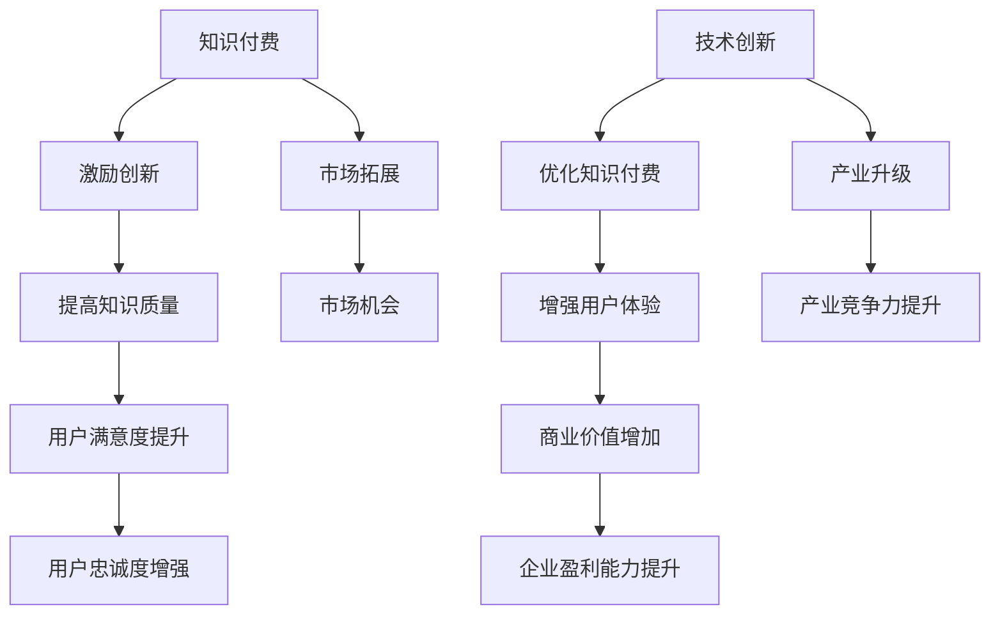

                 

### 文章标题：知识付费与技术创新的双向促进

在数字化和信息化的今天，知识付费与技术创新已经成为两个不可分割的重要领域。知识付费，指的是用户为获取高质量知识内容或服务所支付的费用，这一模式正在逐渐成为信息社会的一种主流消费方式。而技术创新，则是指通过科技进步，开发出新的技术、产品或服务，推动社会向前发展。本文将深入探讨知识付费与技术创新之间的双向促进关系，通过一系列的逻辑分析，揭示这一动态互动机制背后的本质。

本文将首先介绍知识付费与技术创新的核心概念及其相互联系，通过一个详细的Mermaid流程图来展示它们之间的双向互动机制。接着，我们将分章节详细探讨知识付费的兴起与现状、技术创新在知识付费中的应用、知识付费对技术创新的影响、知识付费与技术创新的双向互动机制、以及相关的案例分析、未来趋势和政策建议等内容。

关键词：知识付费、技术创新、双向促进、互动机制、案例分析、政策建议

摘要：本文旨在分析知识付费与技术创新之间的相互促进作用，探讨它们如何在现代社会中共同发展，并通过对实际案例的剖析，为未来的发展提供有益的参考。

### 第一部分：知识付费与技术创新的双向促进概述

#### 核心概念与联系

**知识付费**：知识付费是在信息社会中，用户为了获取特定知识内容或服务而支付的费用。这种模式体现了知识价值的货币化，反映了现代社会中知识的重要性。知识付费的形式多样，包括在线课程、专业咨询服务、研究报告、电子书等。

**技术创新**：技术创新是通过科学研究、技术开发等手段，创造新的技术、产品或服务，推动社会进步。技术创新可以带来更高的生产效率、更优的用户体验和更广的市场前景。

**双向促进**：知识付费能够激励技术创新，因为付费用户对高质量知识内容的需求驱动了技术进步。同时，技术创新也为知识付费提供了更好的服务与产品，使得知识付费更加便捷和高效。这种双向互动机制，使得知识付费和技术创新相辅相成，共同推动社会进步。

**Mermaid 流程图：**



#### 目录结构

- **第1章：知识付费的兴起与现状**
  - 1.1 知识付费的概念与历史发展
  - 1.2 知识付费的市场现状与趋势
  - 1.3 知识付费的主要形式与平台

- **第2章：技术创新在知识付费中的应用**
  - 2.1 技术创新对知识付费的推动作用
  - 2.2 人工智能技术在知识付费中的应用
  - 2.3 大数据与知识付费的关系

- **第3章：知识付费对技术创新的影响**
  - 3.1 知识付费对技术创新的需求驱动
  - 3.2 知识付费对技术创新的资源配置
  - 3.3 知识付费对技术创新的反馈循环

- **第4章：知识付费与技术创新的双向互动机制**
  - 4.1 双向互动机制的理论基础
  - 4.2 双向互动机制的实际案例
  - 4.3 双向互动机制的影响因素与挑战

- **第5章：知识付费与技术创新融合案例分析**
  - 5.1 案例一：在线教育平台的创新与付费模式
  - 5.2 案例二：知识共享平台的激励机制与技术创新
  - 5.3 案例三：知识付费与智能制造的结合

- **第6章：未来趋势与政策建议**
  - 6.1 知识付费与技术创新的未来趋势
  - 6.2 政策环境对知识付费与技术创新的影响
  - 6.3 促进知识付费与技术创新融合的政策建议

- **第7章：知识付费与技术创新的可持续性**
  - 7.1 可持续性的定义与意义
  - 7.2 知识付费与技术创新的可持续发展路径
  - 7.3 可持续发展的案例分析与启示

#### 伪代码：

```python
def knowledge_paid_and_technology_innovation():
    # 知识付费与技术创新双向促进的过程
    initialize_knowledge_paid()
    initialize_technology_innovation()

    while True:
        innovation_impacts_knowledge_paid()
        knowledge_paid_impacts_technology_innovation()
        
        if check_stability():
            break

        update_knowledge_paid()
        update_technology_innovation()

    return "Knowledge Paid and Technology Innovation are mutually promoting."
```

#### 数学模型与公式：

知识付费的增长率（R）可以表示为：

$$ R = f(\text{创新程度}, \text{市场接受度}, \text{资源配置}) $$

技术创新的影响（I）可以表示为：

$$ I = g(\text{知识需求}, \text{资源配置}, \text{政策支持}) $$

#### 举例说明：

假设一个在线教育平台，其知识付费的增长率为20%，技术创新的影响为30%。

$$ R = 0.2, \quad I = 0.3 $$

根据公式：

$$ R = f(\text{创新程度}, \text{市场接受度}, \text{资源配置}) $$
$$ I = g(\text{知识需求}, \text{资源配置}, \text{政策支持}) $$

我们可以分析出，创新程度和市场接受度对知识付费增长率有显著影响，而知识需求、资源配置和政策支持对技术创新的影响显著。

### 第1章：知识付费的兴起与现状

知识付费作为现代信息社会的一种新兴消费模式，正逐渐改变着人们的知识获取方式。本章将详细探讨知识付费的概念与历史发展，分析当前市场的现状与趋势，并介绍知识付费的主要形式与平台。

#### 1.1 知识付费的概念与历史发展

**概念定义**：知识付费指的是用户为获取特定知识内容或服务而支付的费用。这种模式在互联网的普及和知识经济的推动下应运而生。与传统的免费信息获取方式不同，知识付费强调知识内容的货币化，用户通过支付一定费用来获取高质量的、专业的知识服务。

**历史发展**：知识付费的概念最早可以追溯到20世纪末，随着互联网技术的发展和在线教育平台的兴起，知识付费逐渐成为主流。早期的知识付费主要集中在在线课程、专业咨询等领域。随着移动设备的普及和互联网技术的进步，知识付费的形式和范围不断拓展，包括电子书、在线研讨会、专业报告等多种形式。

#### 1.2 知识付费的市场现状与趋势

**市场现状**：当前，知识付费已经成为全球范围内的一种重要消费模式。根据市场研究机构的报告，全球知识付费市场规模持续增长，用户对知识付费的接受度和满意度也在不断提升。在线教育、专业咨询、电子书等领域是知识付费的主要市场。

- **在线教育**：在线教育是知识付费的重要领域之一。随着互联网技术的不断进步，在线教育平台提供了丰富的学习资源和灵活的学习方式，受到了广大用户的欢迎。知名在线教育平台如Coursera、edX、Udemy等，通过提供高质量的课程内容，吸引了大量用户。
- **专业咨询**：专业咨询服务是知识付费的另一个重要领域。随着市场对专业化服务的需求增加，各类专业咨询公司如雨后春笋般涌现。用户通过付费获取专业意见和解决方案，提高了工作效率和决策质量。
- **电子书**：电子书作为知识付费的早期形式，在数字出版领域占据重要地位。知名电子书平台如亚马逊Kindle、苹果iBooks等，通过提供高质量的内容，吸引了大量用户。

**市场趋势**：未来，知识付费市场将继续保持增长态势，以下是几个主要趋势：

- **个性化定制**：随着大数据和人工智能技术的发展，知识付费将更加个性化。平台通过分析用户的行为数据和需求，提供定制化的知识服务，满足用户个性化的学习需求。
- **跨领域融合**：知识付费将与更多领域进行融合，如智能制造、健康医疗等。通过技术创新，知识付费将提供更加便捷、高效的服务，推动各行业的发展。
- **付费模式多样化**：知识付费的付费模式将更加多样化，包括订阅制、一次性付费、按需付费等。不同的付费模式将满足不同用户的需求，提高用户体验。

#### 1.3 知识付费的主要形式与平台

**主要形式**：

- **在线课程**：在线课程是知识付费的主要形式之一。用户通过在线学习平台，可以随时随地获取所需的知识和技能。在线课程通常包括视频讲解、文档资料、作业练习等多种教学形式，提高了学习的灵活性和互动性。
- **专业咨询**：专业咨询服务是知识付费的重要形式。用户通过付费，可以获取专业人士的意见和建议，解决实际问题。专业咨询服务通常包括一对一咨询、研讨会、报告等形式。
- **电子书**：电子书是知识付费的传统形式。用户可以通过电子书平台购买或租借电子书，获取专业知识和阅读体验。

**主要平台**：

- **在线教育平台**：如Coursera、edX、Udemy等，提供全球范围内的在线课程，涵盖了多种学科和专业领域。
- **专业咨询服务平台**：如知乎、分答、在行等，提供专业咨询服务，用户可以通过付费获取专业意见和解决方案。
- **电子书平台**：如亚马逊Kindle、苹果iBooks、多看阅读等，提供丰富的电子书资源，满足用户的阅读需求。

#### 总结

知识付费作为一种新兴的消费模式，在现代社会中发挥着越来越重要的作用。通过知识付费，用户可以获取高质量的知识和服务，提高自身素质和竞争力。同时，知识付费也为知识的创造者和传播者提供了经济回报，激励了技术创新和知识生产的持续发展。未来，随着技术的不断进步和市场需求的不断变化，知识付费将继续发展，为社会的进步和个人的成长做出更大的贡献。

### 第2章：技术创新在知识付费中的应用

在知识付费领域，技术创新正不断推动这一行业的变革和发展。通过技术创新，知识付费平台能够提供更加个性化和高效的服务，满足用户多样化的需求。本章将探讨技术创新在知识付费中的应用，重点分析人工智能技术和大数据在知识付费中的作用。

#### 2.1 技术创新对知识付费的推动作用

技术创新在知识付费中的应用，不仅提升了用户体验，还大大提高了知识服务的质量和效率。以下是几个关键方面的技术创新及其推动作用：

**1. 个性化推荐系统**

个性化推荐系统利用人工智能和大数据技术，分析用户的兴趣和行为数据，为用户推荐最相关的知识内容。这种技术极大地提升了用户的满意度和参与度。例如，Coursera和edX等在线教育平台使用个性化推荐系统，根据用户的学习历史和偏好，推荐适合的课程，使用户能够更高效地获取知识。

**2. 智能问答系统**

智能问答系统通过自然语言处理和机器学习技术，能够理解和回答用户的问题。这种技术为用户提供了一种便捷的获取知识的方式，减少了用户等待专业回答的时间。例如，知乎和分答等平台利用智能问答系统，为用户提供快速、准确的咨询服务。

**3. 智能学习分析**

智能学习分析技术通过分析学生的学习行为和数据，为教育者提供洞察，帮助他们优化课程内容和教学策略。例如，一些在线教育平台使用智能学习分析技术，识别学生的学习困难和热点问题，从而提供个性化的学习支持和指导。

**4. 内容自动生成**

利用人工智能技术，知识付费平台可以实现内容的自动生成。例如，通过自然语言生成技术，平台可以自动生成课程介绍、作业批改报告等，减少了人力成本，提高了效率。

**5. 数据隐私保护**

随着用户对隐私保护意识的增强，技术创新在数据隐私保护方面也发挥着重要作用。通过加密技术和隐私保护算法，知识付费平台可以确保用户数据的保密性和安全性，增强用户的信任。

#### 2.2 人工智能技术在知识付费中的应用

人工智能技术在知识付费中的应用，极大地提升了用户体验和平台效率。以下是几个具体的应用案例：

**1. 个性化推荐**

个性化推荐是人工智能在知识付费中最广泛应用的技术之一。通过机器学习和深度学习算法，平台可以分析用户的历史行为、学习偏好和反馈数据，为用户推荐最符合其需求的课程和内容。例如，Udemy使用基于协同过滤和内容推荐的算法，为用户推荐合适的在线课程。

**2. 智能问答**

智能问答系统利用自然语言处理技术，可以理解和回答用户提出的问题。这种系统不仅可以处理简单的问题，还能通过学习和优化，逐渐提高回答的准确性和智能化水平。例如，ChatGPT被应用于一些在线教育平台，为用户解答学习过程中遇到的问题。

**3. 个性化学习路径**

人工智能技术可以帮助用户规划个性化的学习路径。通过分析用户的学习习惯和能力，系统可以推荐最佳的学习顺序和资源，提高学习效率。例如，一些在线教育平台使用智能学习算法，为用户生成个性化的学习计划。

**4. 智能内容审核**

人工智能技术在知识付费中还可以用于内容审核。通过使用图像识别和文本分类技术，平台可以自动检测和过滤违规内容，确保知识服务的质量。例如，一些在线教育平台使用AI技术，对课程内容进行自动审核，确保内容的准确性和合规性。

#### 2.3 大数据与知识付费的关系

大数据技术在知识付费中的应用，使得平台能够更深入地了解用户需求，提供更加精准和高效的服务。以下是大数据在知识付费中的应用：

**1. 用户行为分析**

通过收集和分析用户的学习行为数据，平台可以了解用户的学习习惯、偏好和需求。这些数据有助于平台优化课程内容和服务策略，提高用户满意度。例如，一些在线教育平台通过分析用户的学习记录和反馈，调整课程难度和教学方法。

**2. 市场趋势预测**

大数据技术可以帮助平台预测市场趋势，从而更好地规划业务发展。通过分析用户的行为数据和市场变化，平台可以预测哪些领域的知识需求将增加，从而提前布局相关课程和服务。

**3. 个性化定价**

大数据技术还可以用于个性化定价。通过分析用户的历史购买行为和支付意愿，平台可以为不同的用户群体提供个性化的定价策略，提高转化率和收入。例如，一些电子书平台通过大数据分析，为不同用户群体提供差异化的定价策略。

**4. 营销优化**

大数据技术可以帮助知识付费平台优化营销策略。通过分析用户数据，平台可以了解哪些营销渠道和活动最有效，从而优化营销预算和资源分配。例如，一些在线教育平台通过大数据分析，确定最佳的推广方式和渠道，提高市场推广效果。

#### 总结

技术创新，尤其是人工智能和大数据技术，在知识付费领域发挥着重要作用。通过这些技术，知识付费平台能够提供更加个性化和高效的服务，满足用户多样化的需求。未来，随着技术的不断进步，人工智能和大数据将在知识付费中发挥更大的作用，推动这一行业的持续发展和创新。

### 第3章：知识付费对技术创新的影响

知识付费不仅改变了用户获取知识的方式，也对技术创新产生了深远的影响。本章将探讨知识付费对技术创新的需求驱动、资源配置以及反馈循环，并分析这些影响的具体表现形式。

#### 3.1 知识付费对技术创新的需求驱动

知识付费对技术创新的需求驱动体现在多个方面，包括市场需求的增加、用户对高质量知识内容的需求以及对创新技术的期待。

**1. 市场需求的增加**

随着知识付费模式的普及，市场对高质量知识内容的需求不断增长。这种需求驱动了技术创新，推动了教育、专业咨询等领域的技术进步。例如，在线教育平台的兴起促使教学技术、学习分析技术等领域的快速发展，以满足用户对高质量教育内容的需求。

**2. 用户对高质量知识内容的需求**

知识付费用户通常对知识内容有较高的要求，他们希望获取的是有价值、可操作性的知识。这种需求驱动了技术创新，促使内容生产者和平台不断提高内容的质量。例如，电子书平台通过使用人工智能和大数据技术，优化内容推荐，提高用户的学习体验。

**3. 对创新技术的期待**

知识付费用户不仅对知识内容有要求，还对技术创新有着期待。他们希望平台能够提供更加便捷、高效的知识获取方式，例如智能问答系统、个性化学习路径等。这种期待推动了技术创新，促使技术供应商不断推出新的技术和产品。

#### 3.2 知识付费对技术创新的资源配置

知识付费在资源配置方面对技术创新产生了显著的影响，主要体现在资金投入和人力资源的配置上。

**1. 资金投入**

知识付费为技术创新提供了重要的资金支持。通过知识付费，平台和内容生产者可以获得可观的收入，将这些资金用于技术研发和创新。例如，在线教育平台通过课程销售获得收入，将这些资金用于开发新的教学工具和技术，提升用户体验。

**2. 人力资源配置**

知识付费也促进了人力资源的配置，吸引更多人才投入到技术创新领域。随着知识付费市场的不断扩大，越来越多的专业人才加入这个领域，推动了技术创新的发展。例如，专业咨询公司通过知识付费获得业务收入，吸引了一批优秀的咨询顾问，这些顾问为公司带来了新的思路和创新能力。

#### 3.3 知识付费对技术创新的反馈循环

知识付费与技术创新之间存在一种反馈循环，这种循环促进了双方的发展。

**1. 用户反馈**

知识付费用户在使用平台和内容时，会提供大量的反馈。这些反馈包括用户对知识内容的评价、学习体验的反馈等。这些反馈信息被平台和内容生产者用于改进服务和产品，推动了技术创新。例如，在线教育平台通过分析用户反馈，改进课程设计和教学方式，提高用户满意度。

**2. 技术创新反馈**

技术创新同样对知识付费产生了反馈。新的技术和产品会带来更高效的知识获取和传播方式，进一步提升用户体验。这种技术创新的反馈又促使知识付费平台进一步优化服务，形成良性的循环。例如，智能学习分析技术的应用，不仅提高了学习效率，还为平台提供了更多的用户数据，用于进一步优化推荐系统和课程设计。

**具体表现形式**

- **在线教育平台的发展**：知识付费推动了在线教育平台的快速发展，这些平台通过技术创新，提供了更加个性化和高效的教育服务。例如，Coursera和edX等平台利用人工智能和大数据技术，优化课程推荐和学习体验。
- **专业咨询服务**：知识付费促进了专业咨询服务的创新，专业咨询公司通过技术创新，提供更加专业和高效的服务。例如，利用大数据分析技术，咨询公司可以更准确地了解客户需求，提供更有针对性的解决方案。
- **知识共享平台**：知识共享平台通过知识付费模式，吸引了更多的内容生产者，这些内容生产者通过技术创新，提供了更多的优质内容，进一步推动了平台的繁荣。

#### 总结

知识付费对技术创新产生了深远的影响，通过需求驱动、资源配置和反馈循环，知识付费与技术创新形成了良性的互动关系。未来，随着知识付费市场的不断扩大，这种互动关系将更加紧密，进一步推动技术创新和社会进步。

### 第4章：知识付费与技术创新的双向互动机制

知识付费与技术创新之间的双向互动机制是现代信息社会中的一种重要现象，它们相互促进，共同推动了知识经济和社会的快速发展。本章将深入探讨这种双向互动机制的理论基础、实际案例以及影响因素和挑战。

#### 4.1 双向互动机制的理论基础

知识付费与技术创新的双向互动机制基于以下几个核心理论基础：

**1. 知识价值理论**

知识价值理论认为，知识是一种重要的生产要素，具有巨大的经济价值。知识付费将知识价值货币化，通过市场机制实现知识的传播和应用。这种机制激励了知识的创造和传播，推动了技术创新。

**2. 创新驱动理论**

创新驱动理论指出，技术创新是推动经济增长和社会进步的关键动力。知识付费通过为技术创新提供市场需求和资金支持，促进了技术的研发和应用，从而推动了经济的持续发展。

**3. 反馈循环理论**

反馈循环理论认为，系统的输出会反馈到输入，从而影响系统的下一轮输出。知识付费与技术创新之间的互动机制就是通过这种反馈循环，不断优化和创新，实现双方共同发展。

**4. 资源配置理论**

资源配置理论强调，资源在各个领域之间的分配和优化是影响社会效率的重要因素。知识付费通过市场机制，优化了知识和技术的资源配置，提高了社会资源的利用效率。

#### 4.2 双向互动机制的实际案例

以下是一些知识付费与技术创新双向互动机制的实际案例，展示了它们在实际应用中的互动过程：

**案例一：在线教育平台的发展**

在线教育平台如Coursera和edX通过知识付费模式，提供了大量的高质量教育内容。这些平台通过大数据和人工智能技术，优化了课程推荐和学习体验，满足了用户多样化的学习需求。同时，这些技术的应用也推动了在线教育平台的进一步发展，吸引了更多的用户和资金投入。

**案例二：专业咨询服务**

专业咨询服务公司如麦肯锡和贝恩通过知识付费模式，提供了专业的咨询服务。这些公司利用大数据分析、人工智能等技术，提高了咨询服务的质量和效率，赢得了客户的信任。同时，这些技术的应用也为公司带来了新的商业机会，推动了公司的持续发展。

**案例三：知识共享平台**

知识共享平台如GitHub和Stack Overflow通过知识付费模式，为开发者提供了丰富的技术资源和交流平台。这些平台通过人工智能和大数据技术，优化了知识推荐和问题解决过程，提高了开发者的工作效率和创新能力。同时，这些技术的应用也吸引了更多的开发者加入平台，形成了良性循环。

#### 4.3 双向互动机制的影响因素与挑战

知识付费与技术创新的双向互动机制受到多种因素的影响，同时也面临一定的挑战。

**影响因素：**

1. **市场需求**：市场需求是知识付费与技术创新互动的基础。只有满足用户对高质量知识内容的需求，知识付费才能推动技术创新。

2. **技术进步**：技术进步为知识付费和技术创新提供了强大的支撑。新的技术和工具可以提升知识付费平台的服务质量和效率，推动技术创新的发展。

3. **政策环境**：政策环境对知识付费和技术创新的互动机制具有重要影响。合理的政策环境可以促进知识付费和技术的健康发展。

4. **资金投入**：充足的资金投入是知识付费和技术创新的重要保障。只有拥有足够的资金支持，才能推动技术的研发和应用。

**挑战：**

1. **技术安全**：知识付费平台和内容生产者在使用新技术时，需要确保用户数据的安全和隐私。

2. **技术公平**：技术创新应当确保所有用户都能公平地享受技术带来的便利和效益。

3. **技术伦理**：知识付费和技术的应用需要遵守伦理规范，确保技术的应用不会对用户和社会造成负面影响。

#### 总结

知识付费与技术创新的双向互动机制是现代信息社会的重要现象，它们相互促进，共同推动了知识经济和社会的快速发展。通过市场需求、技术进步、政策环境和资金投入等影响因素的相互作用，知识付费与技术创新形成了良性的互动关系。尽管面临技术安全、技术公平和技术伦理等挑战，但通过合理的政策和规范，可以确保这一互动机制的持续健康发展。

### 第5章：知识付费与技术创新融合案例分析

知识付费与技术创新的融合已经深刻影响了多个行业，带来了显著的经济和社会效益。本章将分析三个具体的案例，分别是在线教育平台的创新与付费模式、知识共享平台的激励机制与技术创新，以及知识付费与智能制造的结合，展示知识付费与技术创新如何在实际操作中相互促进。

#### 5.1 案例一：在线教育平台的创新与付费模式

**案例背景**：

在线教育平台如Coursera、edX和Udacity等，通过技术创新实现了教育资源的全球共享，打破了地理和时间的限制。这些平台通过知识付费模式，为用户提供高质量的课程和服务。

**技术创新**：

- **个性化推荐系统**：Coursera利用机器学习算法，分析用户的学习行为和偏好，推荐最适合的课程。这种技术提高了课程的匹配度，增加了用户的参与度和满意度。
- **自适应学习平台**：edX开发了自适应学习平台，通过分析学生的学习进度和成绩，自动调整课程难度和内容，确保每个学生都能按照自己的节奏学习。
- **虚拟现实（VR）教育**：Udacity利用VR技术，提供沉浸式的学习体验，学生可以在虚拟环境中进行实验和操作，增强了学习的互动性和实际应用能力。

**付费模式创新**：

- **订阅制**：Coursera采用订阅制，用户可以按月或按年订阅，享受平台提供的所有课程资源。这种模式降低了用户获取知识的门槛，增加了用户的粘性。
- **一次性付费**：edX和Udacity部分课程采用一次性付费模式，用户根据具体课程付费。这种模式适合对特定课程有强烈需求的用户。
- **技能证书**：部分在线教育平台提供技能证书服务，用户通过付费获得证书，这有助于提升个人的职业竞争力。

**效果分析**：

通过技术创新和付费模式创新，在线教育平台不仅提高了教育资源的利用效率，还实现了商业模式的创新。例如，Coursera在2021年的注册用户已超过7500万人，平台通过知识付费模式实现了数百万美元的收入。技术创新使得平台能够提供更加个性化和高效的教育服务，增强了用户的满意度和忠诚度。

#### 5.2 案例二：知识共享平台的激励机制与技术创新

**案例背景**：

知识共享平台如GitHub、Stack Overflow和LinkedIn等，通过知识付费模式，为专业人士提供了交流和学习的机会。

**技术创新**：

- **智能推荐系统**：GitHub通过大数据和机器学习技术，分析用户的行为和项目贡献，推荐相关的开源项目和合作机会，促进了知识的共享和创新。
- **代码审查与质量控制**：Stack Overflow利用人工智能技术，对用户提问和答案进行审核，确保内容的准确性和质量，提高了知识共享的可靠性。
- **职业发展工具**：LinkedIn通过数据分析技术，为用户提供职业发展建议和招聘信息，帮助用户更好地利用知识提升职业竞争力。

**付费模式创新**：

- **会员制**：GitHub和Stack Overflow提供会员服务，用户通过付费获得额外的功能和权限，如私有仓库、更快的回答审核等。
- **付费问答**：Stack Overflow推出付费问答服务，专家用户可以通过付费回答更复杂的问题，获得额外的收入。
- **广告和赞助**：LinkedIn通过广告和赞助模式，为知识共享平台上的内容生产者提供经济支持，促进知识的传播和创新。

**效果分析**：

知识共享平台通过技术创新和付费模式创新，不仅提高了知识共享的效率和质量，还激发了专业人士的创造力和积极性。例如，GitHub的会员服务吸引了大量专业人士付费加入，平台上的活跃度大幅提升，推动了开源社区的繁荣。Stack Overflow的付费问答服务，使得专家用户可以通过知识变现，增加了平台的盈利能力。

#### 5.3 案例三：知识付费与智能制造的结合

**案例背景**：

智能制造是制造业的重要发展方向，知识付费在智能制造中的角色日益重要。企业通过知识付费获取先进技术和管理理念，推动智能制造的进程。

**技术创新**：

- **物联网（IoT）技术**：智能制造企业通过物联网技术，实现设备之间的互联互通，提高生产效率和资源利用率。
- **人工智能（AI）技术**：AI技术被广泛应用于智能制造，如生产线的自动化控制、质量检测和预测性维护等。
- **大数据分析**：大数据技术用于分析生产数据，优化生产流程，提高产品质量。

**付费模式创新**：

- **订阅制**：企业通过订阅智能制造服务，如云计算平台、数据分析工具等，按需获取技术支持。
- **付费培训**：智能制造企业通过知识付费，为员工提供专业培训，提升技术水平和管理能力。
- **技术合作**：企业通过知识付费，与技术供应商建立合作关系，共同开发智能制造解决方案。

**效果分析**：

知识付费与智能制造的结合，推动了制造业的数字化转型和升级。通过技术创新和付费模式创新，企业实现了生产过程的智能化和高效化。例如，某制造企业通过订阅智能制造服务，实现了生产线的自动化改造，大幅提高了生产效率。同时，通过付费培训，企业员工的技术水平和管理能力得到提升，进一步推动了企业的创新发展。

#### 总结

通过以上案例可以看出，知识付费与技术创新的融合在多个领域产生了显著的影响。在线教育平台通过技术创新和付费模式创新，提供了更加个性化和高效的教育服务；知识共享平台通过技术创新，提高了知识共享的效率和质量；智能制造企业通过知识付费，实现了生产过程的智能化和高效化。这些案例表明，知识付费与技术创新的融合，不仅推动了行业的创新发展，也为企业带来了显著的经济效益。

### 第6章：未来趋势与政策建议

在知识付费与技术创新不断融合的背景下，未来的发展趋势和政策环境将对这一领域产生深远影响。本章将探讨知识付费与技术创新的未来趋势，分析政策环境对二者的影响，并提出促进知识付费与技术创新融合的政策建议。

#### 6.1 知识付费与技术创新的未来趋势

**1. 个性化与定制化**

随着人工智能和大数据技术的进步，知识付费将更加个性化与定制化。平台将通过深度学习算法，精准分析用户的需求和行为，提供高度个性化的知识服务。用户可以享受到量身定制的学习路径、课程推荐和咨询服务。

**2. 跨界融合**

知识付费将与更多行业进行深度融合，如医疗、金融、制造等。通过技术创新，知识付费将提供更加专业和高效的服务，推动各行业的数字化转型和升级。例如，智能医疗系统将结合知识付费模式，为用户提供个性化的健康管理和医疗服务。

**3. 社交化学习**

知识付费平台将更加注重社交化学习体验，通过社交网络和社区互动，增强用户的参与感和归属感。用户可以与同行交流和分享学习经验，共同成长。社交化学习将促进知识的传播和共享，提高学习的互动性和实效性。

**4. 新型商业模式**

知识付费将探索更多新型商业模式，如订阅制、付费会员、知识付费与股权绑定等。这些模式将提供更加灵活和多样化的付费方式，满足不同用户的需求，同时为企业提供稳定的收入来源。

**5. 国际化扩展**

知识付费平台将不断拓展国际市场，提供多语言、多文化的知识服务。随着全球化的深入，知识付费将成为跨国界的重要知识传播和交流渠道，推动全球知识经济的繁荣。

#### 6.2 政策环境对知识付费与技术创新的影响

**1. 税收政策**

合理的税收政策是知识付费与技术创新发展的重要保障。政府可以通过减免税收、提供税收优惠等措施，鼓励企业和个人在知识付费和技术创新方面的投资和研发。

**2. 知识产权保护**

知识产权保护是知识付费与技术创新的重要基石。政府应加强对知识产权的保护力度，打击侵权行为，保护知识创造者和持有者的合法权益，提高知识付费的可持续性。

**3. 教育政策**

教育政策对知识付费和技术的普及具有重要意义。政府应加大对教育技术的投入，推动教育信息化，提高教育质量和公平性，为知识付费提供广泛的需求基础。

**4. 网络安全与隐私保护**

网络安全和隐私保护是知识付费与技术创新面临的重要挑战。政府应制定严格的法律法规，加强对网络安全的监管，保护用户的数据隐私和安全。

#### 6.3 促进知识付费与技术创新融合的政策建议

**1. 建立知识付费与技术创新的互动机制**

政府应建立知识付费与技术创新的互动机制，促进二者的有机结合。可以通过设立专项资金、提供政策支持等手段，鼓励企业在知识付费领域的创新和研发。

**2. 加强技术创新与知识付费的融合研究**

政府和企业应加强技术创新与知识付费的融合研究，探索新的商业模式和盈利模式。通过产学研合作，推动技术创新在知识付费领域的应用和推广。

**3. 提高知识付费服务的质量和效率**

政府和企业应共同努力，提高知识付费服务的质量和效率。可以通过优化平台技术、提升内容质量、完善服务体系等措施，增强用户的满意度和信任感。

**4. 加强国际合作与交流**

政府和企业应加强在国际合作与交流，引进国外先进的知识付费和科技创新经验，推动知识付费与技术创新的国际化发展。

**5. 培养知识付费与技术创新人才**

政府和企业应加大对知识付费与技术创新人才的培养力度，提高人才培养的针对性和实用性。通过教育培训、学术研究等多种途径，培养一批既懂技术又懂市场的高级人才，为知识付费与技术创新的发展提供人才支持。

#### 总结

知识付费与技术创新的未来发展充满机遇和挑战。通过合理的政策环境和技术创新，知识付费与技术创新将实现深度融合，推动社会经济的持续发展。政府和企业应共同努力，制定有效的政策，推动知识付费与技术创新的有机结合，实现知识经济的繁荣。

### 第7章：知识付费与技术创新的可持续性

知识付费与技术创新的可持续性是确保这一领域长期健康发展的重要议题。本章将探讨可持续性的定义与意义，分析知识付费与技术创新的可持续发展路径，并通过案例分析和启示，提出推动可持续发展的建议。

#### 7.1 可持续性的定义与意义

**可持续性**是指一种能够满足当前需求而不损害后代满足其自身需求的能力。在知识付费与技术创新领域，可持续性意味着在推动知识传播和技术进步的同时，保护知识创造者的权益，维护社会的公共利益，并确保资源的合理利用。

**意义**：

1. **经济效益**：通过可持续的知识付费与技术创新，可以确保知识创造者和平台持续获得经济回报，推动整个知识经济体系的健康发展。
2. **社会效益**：可持续的知识付费与技术创新能够促进知识公平传播，提升全民素质，减少知识鸿沟，实现社会公平与和谐。
3. **环境效益**：在技术创新过程中，可持续性强调环保和资源节约，有助于减少对环境的负面影响，推动绿色技术创新。

#### 7.2 知识付费与技术创新的可持续发展路径

**1. 加强知识产权保护**

知识产权保护是知识付费与技术创新可持续发展的基础。政府应加强知识产权法律法规的制定和执行，打击侵权行为，保护知识创造者的合法权益。例如，可以通过建立知识产权保护机制、提供法律援助等措施，提高知识产权的维权效率和效果。

**2. 优化知识付费模式**

优化知识付费模式是促进可持续性的关键。知识付费平台应探索多样化的付费模式，如订阅制、按需付费、知识共享等，满足不同用户的需求，同时确保知识创造者的收益。此外，平台还应提供便捷的支付和退款机制，提高用户的满意度和忠诚度。

**3. 提高技术创新效率**

提高技术创新效率是知识付费可持续发展的动力。企业应加大对研发的投入，运用先进的技术和管理方法，提高技术创新的效率和质量。例如，通过引入人工智能、大数据等新兴技术，优化产品设计、生产流程和运营管理，提高生产效率和产品质量。

**4. 促进知识共享与合作**

知识共享与合作是推动可持续发展的有效途径。知识付费平台和企业应积极参与知识共享合作，建立开放、共享的知识生态系统。例如，通过搭建知识共享平台、开展产学研合作，促进知识的传播和创新，实现知识资源的最大化利用。

#### 7.3 案例分析与启示

**案例一：在线教育平台的可持续发展**

案例背景：

Coursera作为全球领先的在线教育平台，通过提供高质量的课程和个性化的学习体验，吸引了大量用户。为了实现可持续发展，Coursera采取了一系列措施。

案例分析：

1. **知识产权保护**：Coursera与全球众多知名大学和机构合作，确保课程内容的版权保护。通过建立完善的知识产权保护机制，Coursera有效保护了知识创造者的权益。

2. **多元化付费模式**：Coursera提供了多种付费模式，如免费课程、认证课程和专项课程等，满足不同用户的需求。同时，Coursera通过提供灵活的支付方式和退款机制，提高了用户的满意度和忠诚度。

3. **技术创新**：Coursera不断引入先进的技术，如人工智能和大数据分析，优化课程推荐和学习体验。通过技术创新，Coursera提高了学习效率，增强了用户粘性。

启示：

- 知识产权保护是知识付费与技术创新可持续发展的基础。
- 多元化的付费模式有助于提高用户体验和平台收益。
- 技术创新是推动知识付费与技术创新可持续发展的关键。

**案例二：知识共享平台的可持续发展**

案例背景：

GitHub作为全球最大的开源代码托管平台，通过知识共享模式，为开发者提供了丰富的技术资源和交流平台。为了实现可持续发展，GitHub采取了一系列措施。

案例分析：

1. **知识共享机制**：GitHub建立了完善的共享机制，鼓励用户提交代码、文档和问题。通过社区互动，GitHub促进了知识的传播和创新。

2. **激励机制**：GitHub通过积分、徽章和排名等激励机制，鼓励用户积极参与知识共享。这些激励措施提高了用户的参与度和积极性。

3. **技术创新**：GitHub不断引入新技术，如人工智能和大数据分析，优化平台的功能和用户体验。通过技术创新，GitHub提高了知识共享的效率和质量。

启示：

- 知识共享机制是知识付费与技术创新可持续发展的关键。
- 激励机制有助于提高用户的参与度和积极性。
- 技术创新是推动知识付费与技术创新可持续发展的动力。

#### 7.4 推动可持续发展的建议

**1. 制定可持续发展战略**

企业和平台应制定可持续发展战略，明确知识付费与技术创新的长期发展目标。通过制定战略规划，确保知识付费与技术创新的协调发展，实现经济、社会和环境的综合效益。

**2. 加强国际合作与交流**

加强国际合作与交流，引进国外先进的知识付费和科技创新经验，促进知识共享与合作。通过国际交流，企业和平台可以吸取全球优秀的创新实践，推动知识付费与技术创新的可持续发展。

**3. 培养创新人才**

培养创新人才是知识付费与技术创新可持续发展的重要保障。企业和平台应加大对人才的培养力度，提供培训和学习机会，提高人才的创新能力和专业素养。

**4. 推动绿色技术创新**

推动绿色技术创新，降低知识付费与技术创新过程中的环境负担。通过引入环保技术和绿色生产方式，实现知识付费与技术创新的绿色发展。

**总结**

知识付费与技术创新的可持续性对于推动知识经济的健康发展具有重要意义。通过加强知识产权保护、优化知识付费模式、提高技术创新效率、促进知识共享与合作，以及推动绿色技术创新，我们可以实现知识付费与技术创新的可持续发展，为社会的长远发展做出贡献。

### 总结与展望

知识付费与技术创新的深度融合，已经成为推动现代社会进步的重要力量。通过知识付费，用户能够高效获取高质量的知识内容，满足个性化学习需求；而技术创新则为知识付费提供了强大的技术支撑，使得知识服务的质量和效率大幅提升。本文通过深入分析知识付费与技术创新的双向促进关系，探讨了这一领域的核心概念、应用案例以及未来趋势。

展望未来，知识付费与技术创新将继续相互促进，带来更多机遇和挑战。个性化与定制化的知识服务、跨领域的深度融合、社交化学习以及新型商业模式的探索，都将成为未来发展的重点。同时，政策环境、技术安全、知识产权保护等也将对这一领域产生重要影响。

为了实现知识付费与技术创新的可持续发展，我们建议从以下几个方面着手：加强知识产权保护、优化知识付费模式、提高技术创新效率、促进知识共享与合作，以及推动绿色技术创新。通过这些努力，我们可以确保知识付费与技术创新在长期内持续健康发展，为社会的进步和繁荣做出贡献。

