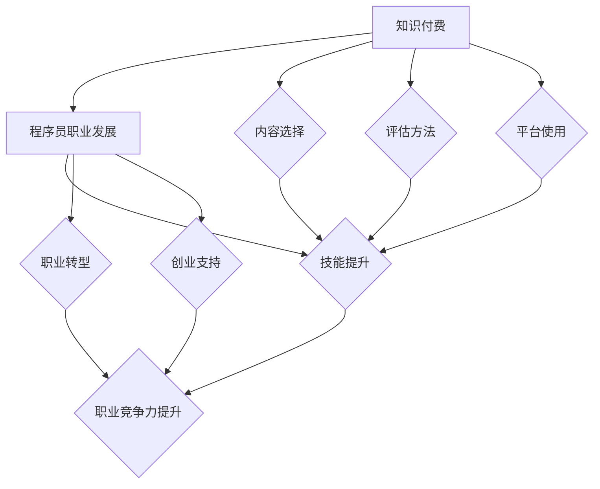

                 

### 文章标题：知识付费与程序员职业发展的关系

随着知识经济的兴起，知识付费成为了一种重要的学习和交流方式。与此同时，程序员作为知识密集型行业的重要从业者，其职业发展也面临着前所未有的挑战和机遇。本文将深入探讨知识付费与程序员职业发展的关系，通过分析知识付费的背景与趋势、程序员职业发展的挑战与机遇，以及知识付费在程序员职业发展中的应用，为程序员提供有针对性的建议，助力他们实现职业成长。

## 关键词

- 知识付费
- 程序员职业发展
- 挑战与机遇
- 技能提升
- 职业转型
- 创业支持

## 摘要

本文从知识付费的背景与趋势出发，分析了程序员在职业发展中面临的挑战与机遇，探讨了知识付费在程序员职业发展中的应用，包括付费内容的选择、平台的使用技巧以及知识付费对程序员技能提升和职业发展的潜在影响。通过案例分析，总结了优秀程序员的成长路径和付费内容选择与评估方法。最后，对知识付费与程序员职业发展的未来趋势进行了展望，并提出了提升程序员职业发展的建议。

### 《知识付费与程序员职业发展的关系》目录大纲

#### 第一部分：引言

1. 第1章：知识付费的背景与趋势
    1.1 知识付费的概念与定义
    1.2 知识付费的发展历程
    1.3 知识付费的市场现状与趋势

2. 第2章：程序员职业发展的挑战与机遇
    2.1 程序员职业发展的主要挑战
    2.2 知识付费在程序员职业发展中的作用
    2.3 知识付费与程序员职业发展的关系

#### 第二部分：知识付费在程序员职业发展中的应用

3. 第3章：知识付费内容的选择与评估
    3.1 知识付费内容的类型
    3.2 知识付费内容的选择标准
    3.3 知识付费内容的评估方法

4. 第4章：知识付费平台的使用技巧
    4.1 主流知识付费平台的介绍
    4.2 知识付费平台的使用流程
    4.3 知识付费平台的使用技巧

5. 第5章：知识付费对程序员技能提升的影响
    5.1 知识付费对程序员技能提升的作用
    5.2 知识付费对程序员职业发展的潜在影响
    5.3 知识付费在程序员技能提升中的注意事项

#### 第三部分：知识付费与程序员职业发展的案例分析

6. 第6章：优秀程序员的知识付费实践
    6.1 优秀程序员的成长路径
    6.2 知识付费在优秀程序员成长中的应用
    6.3 优秀程序员的付费内容选择与评估

7. 第7章：知识付费在程序员职业发展中的实际案例
    7.1 案例一：从新手到资深程序员的蜕变
    7.2 案例二：通过知识付费实现职业转型
    7.3 案例三：知识付费助力创业

#### 第四部分：总结与展望

8. 第8章：知识付费与程序员职业发展的未来趋势
    8.1 知识付费在程序员职业发展中的发展趋势
    8.2 程序员职业发展面临的新挑战
    8.3 未来知识付费与程序员职业发展的关系展望

9. 第9章：总结与建议
    9.1 知识付费在程序员职业发展中的应用总结
    9.2 提升程序员职业发展的建议
    9.3 知识付费平台的改进方向

#### 附录

10. 附录A：知识付费平台推荐
    10.1 在线教育平台
    10.2 技术社区与论坛
    10.3 专业博客与公众号

11. 附录B：相关资源与参考书目
    11.1 知识付费领域相关书籍
    11.2 程序员职业发展相关书籍
    11.3 知识付费平台使用指南

### 第一部分：引言

#### 第1章：知识付费的背景与趋势

在信息化时代，知识作为一种重要的生产要素，其价值越来越受到重视。知识付费应运而生，成为知识传播和知识变现的重要途径。本章将从知识付费的概念与定义、发展历程、市场现状与趋势三个方面，对知识付费进行概述。

### 1.1 知识付费的概念与定义

知识付费是指个人或企业为获取有价值的信息、技能或知识而支付的费用。这种付费模式不同于传统的免费共享模式，它强调知识的稀缺性和价值，通过付费来实现知识的有效传递和共享。

知识付费的核心在于“价值交换”，即知识提供者通过提供有价值的内容，获得相应的报酬；知识接受者通过付费，获取所需的资源和技能。这种模式满足了知识供需双方的需求，推动了知识经济的发展。

### 1.2 知识付费的发展历程

知识付费的发展可以追溯到互联网早期。在那个时期，在线教育、电子书、网络课程等形式的知识付费模式开始兴起。随着互联网技术的不断进步，知识付费市场逐渐成熟。

2000年代，知识付费主要集中于在线教育领域，如新东方、好未来等知名教育机构推出了在线课程，吸引了大量学员。此外，电子书市场也蓬勃发展，亚马逊Kindle等设备的出现，为电子书的普及提供了硬件支持。

2010年代，随着移动互联网的普及，知识付费进入爆发期。各类知识付费平台如雨后春笋般涌现，如得到、知乎Live、分答等，它们通过线上课程、讲座、问答等形式，为用户提供丰富的知识内容。

近年来，知识付费逐渐向垂直领域拓展，如技术、金融、法律等专业领域，形成了较为成熟的市场。此外，知识付费开始融合人工智能、大数据等技术，提高了内容推荐和个性化服务的效率。

### 1.3 知识付费的市场现状与趋势

当前，知识付费市场呈现出以下几个特点：

1. **市场规模持续扩大**：随着人们对知识的渴求不断提高，知识付费市场规模逐年增长。根据市场研究机构的报告，全球知识付费市场规模已经达到数千亿美元，并仍有较大的增长空间。

2. **用户群体日益多元化**：知识付费的用户不再局限于特定群体，如学生、职场人士等，而逐渐涵盖了更广泛的群体，包括自由职业者、创业者等。这表明知识付费已经成为大众化需求。

3. **内容形式多样化**：知识付费的内容形式越来越丰富，除了传统的课程、电子书、讲座等，还涌现出知识星球、直播问答、付费专栏等多种形式。这些形式不仅满足了用户的不同需求，也提高了内容的互动性和参与感。

4. **竞争格局逐步形成**：知识付费市场竞争激烈，各类平台纷纷争夺市场份额。一方面，头部平台如得到、知乎、分答等不断扩大影响力；另一方面，新兴平台如喜马拉雅、微信读书等也在积极拓展市场。

5. **技术驱动持续升级**：知识付费平台开始利用人工智能、大数据等技术，实现个性化推荐、精准推送等功能。这些技术不仅提高了用户体验，也提升了知识付费的效率和质量。

展望未来，知识付费市场有望继续保持增长态势。一方面，随着互联网的普及和技术的进步，知识付费的渠道和方式将更加多样化和便捷化；另一方面，知识付费将为用户提供更多的学习和发展机会，促进个人成长和社会进步。

### 1.4 知识付费对程序员职业发展的影响

知识付费对程序员职业发展的影响主要表现在以下几个方面：

1. **技能提升**：程序员可以通过付费课程和资料，快速获取最新的技术知识和实践技能，提升自身竞争力。这有助于他们在职业发展中取得更好的业绩和更高的薪资。

2. **职业转型**：知识付费为程序员提供了多样化的学习路径，使他们有机会转向新的技术领域或职业方向，实现职业转型。例如，从传统后端开发转向前端开发、移动开发、人工智能等新兴领域。

3. **创业支持**：知识付费平台提供的创业课程、创业指南等内容，为有创业梦想的程序员提供了宝贵的经验和资源。这些内容不仅有助于他们提升创业能力，还可以为他们提供实际的创业支持。

4. **人脉拓展**：通过知识付费平台，程序员可以结识到志同道合的同行和导师，拓展人脉资源。这些资源有助于他们在职业发展中获得更多的机会和支持。

总之，知识付费为程序员的职业发展提供了丰富的机会和资源。充分利用知识付费的优势，有助于程序员实现职业成长和人生价值。

### 第2章：程序员职业发展的挑战与机遇

程序员作为信息技术领域的重要从业者，其职业发展面临着诸多挑战和机遇。本章将深入分析程序员职业发展的主要挑战，探讨知识付费在其中的作用，并阐述知识付费与程序员职业发展的关系。

#### 2.1 程序员职业发展的主要挑战

1. **技术更新速度过快**：信息技术领域发展迅速，新技术、新框架、新工具层出不穷。程序员需要不断学习新技术，以保持竞争力。然而，学习成本高、时间精力有限，使得许多程序员难以跟上技术更新的步伐。

2. **职业发展路径不明确**：程序员在职业发展中面临选择困境，如选择继续深耕技术领域，还是转向管理岗位或业务岗位。此外，不同公司和行业对程序员的职业发展期望和要求也有所不同，使得程序员在职业规划上面临困惑。

3. **技能与市场需求不匹配**：程序员的学习方向和市场需求之间可能存在差距，导致技能与市场需求不匹配。这可能导致程序员在求职过程中遇到困难，甚至影响职业发展。

4. **职业压力与工作平衡**：程序员工作压力大，加班现象普遍。这可能导致程序员身心健康受损，影响工作效率和生活质量。如何平衡工作与生活，提高工作效率，成为程序员职业发展中的重要问题。

#### 2.2 知识付费在程序员职业发展中的作用

知识付费在程序员职业发展中发挥着重要作用，主要体现在以下几个方面：

1. **技能提升**：通过付费课程和资料，程序员可以快速获取最新的技术知识和实践技能。这些资源有助于他们提升自身竞争力，适应技术更新和市场需求的变化。

2. **职业规划**：知识付费平台提供的职业规划课程和职业咨询服务，为程序员提供了明确的职业发展路径和指导。这有助于他们做出更明智的职业选择，避免职业发展中的选择困境。

3. **人脉拓展**：通过知识付费平台，程序员可以结识到志同道合的同行和导师，拓展人脉资源。这些资源有助于他们在职业发展中获得更多的机会和支持。

4. **创业支持**：知识付费平台提供的创业课程、创业指南等内容，为有创业梦想的程序员提供了宝贵的经验和资源。这些内容不仅有助于他们提升创业能力，还可以为他们提供实际的创业支持。

#### 2.3 知识付费与程序员职业发展的关系

知识付费与程序员职业发展之间存在着密切的关系，具体体现在以下几个方面：

1. **知识付费促进技能提升**：知识付费为程序员提供了丰富的学习资源，帮助他们提升技术能力和实践经验。这些技能提升有助于他们在职业发展中取得更好的业绩和更高的薪资。

2. **知识付费助力职业转型**：知识付费平台提供的多样化课程和资料，为程序员提供了转向新兴技术领域或职业方向的机会。通过学习新技能，他们可以实现职业转型，拓宽职业发展空间。

3. **知识付费促进人脉拓展**：通过知识付费平台，程序员可以结识到同行和导师，拓展人脉资源。这些人脉资源有助于他们在职业发展中获得更多的机会和支持。

4. **知识付费支持创业梦想**：知识付费平台提供的创业课程和创业指南，为有创业梦想的程序员提供了宝贵的经验和资源。这些内容不仅有助于他们提升创业能力，还可以为他们提供实际的创业支持。

总之，知识付费在程序员职业发展中发挥着重要作用。充分利用知识付费的优势，有助于程序员实现职业成长和人生价值。

### 第二部分：知识付费在程序员职业发展中的应用

在程序员职业发展的过程中，知识付费扮演着至关重要的角色。通过付费获取高质量的资源和指导，程序员可以更快速地提升技能，实现职业发展的目标。本章将详细探讨知识付费在程序员职业发展中的应用，包括知识付费内容的选择与评估、知识付费平台的使用技巧，以及知识付费对程序员技能提升的具体影响。

#### 第3章：知识付费内容的选择与评估

选择适合的知识付费内容是程序员提升技能的关键一步。以下将介绍几种常见的知识付费内容类型、选择标准以及评估方法。

##### 3.1 知识付费内容的类型

知识付费内容种类繁多，主要包括以下几种类型：

1. **在线课程**：在线课程是知识付费内容中最常见的形式，包括编程语言、框架、工具等方面的教程。例如，Python编程、React框架、Docker容器技术等。

2. **电子书**：电子书是一种以数字化形式存在的书籍，内容涵盖编程语言、算法、数据结构、软件工程等方面。如《算法导论》、《代码大全》等。

3. **付费专栏**：付费专栏通常由行业专家或知名人士撰写，内容包括技术趋势、项目实战、职业规划等。例如，InfoQ的《架构师之路》、知乎Live的专栏等。

4. **实战项目**：实战项目通常是一些完整的项目案例，涵盖从需求分析、设计、开发到测试的全过程。这些项目可以帮助程序员掌握实际操作技能。

5. **职业规划咨询**：职业规划咨询由资深从业者或职业顾问提供，针对个人的职业发展提供个性化建议和指导。

##### 3.2 知识付费内容的选择标准

选择知识付费内容时，程序员应考虑以下标准：

1. **内容质量**：内容质量是选择知识付费内容的首要标准。优质的内容应具备以下特点：系统化、逻辑性强、实用性强，且更新及时。

2. **适用性**：知识付费内容应与程序员的当前技能水平和职业发展方向相匹配。例如，对于新手程序员，应优先选择入门级课程；对于有一定经验的程序员，则应选择进阶课程或专业领域的深度学习。

3. **价格**：价格是选择知识付费内容时的重要考量因素。程序员应在预算范围内选择性价比最高的内容，避免因高昂的费用而增加经济负担。

4. **用户评价**：用户评价是反映知识付费内容质量的重要指标。程序员可以通过查阅用户评论、评分等信息，了解其他用户对该内容的评价和反馈。

5. **讲师背景**：讲师的背景和专业能力直接影响知识付费内容的质量。程序员应优先选择经验丰富、专业能力强的讲师。

##### 3.3 知识付费内容的评估方法

评估知识付费内容的有效性是确保投入产出比的关键。以下是一些常用的评估方法：

1. **学习进度**：通过记录学习进度，程序员可以评估自己对知识付费内容的吸收程度。如果学习进度缓慢，可能需要调整学习策略或选择更适合的内容。

2. **实践应用**：将所学知识应用于实际项目中，是检验知识付费内容效果的有效方法。通过实践，程序员可以发现自己对知识的掌握程度，并及时调整学习方向。

3. **效果反馈**：程序员可以通过完成作业、参加讨论区互动等方式，获取讲师和同行对自己的反馈。这些反馈有助于他们了解自己的学习效果，改进学习方法。

4. **技能提升**：通过参加知识付费内容学习，程序员的技能水平应有所提升。可以通过参加技术面试、解决工作中的技术难题等方式，衡量技能提升的效果。

#### 第4章：知识付费平台的使用技巧

知识付费平台提供了丰富的学习资源和服务，但如何有效地使用这些平台，以最大化学习效果，是程序员需要掌握的技巧。以下将介绍几种主流的知识付费平台及其使用技巧。

##### 4.1 主流知识付费平台的介绍

1. **网易云课堂**：网易云课堂是网易旗下的在线学习平台，提供编程语言、软件开发、人工智能等课程。其优点是课程资源丰富，价格合理。

2. **慕课网**：慕课网提供包括前端开发、后端开发、移动开发等课程，课程内容贴近实际需求。其优点是实战性强，课程更新及时。

3. **极客时间**：极客时间是一家专注于技术领域的知识付费平台，提供编程、架构、人工智能等方面的专栏。其优点是内容质量高，讲师经验丰富。

4. **Coursera**：Coursera是全球知名的在线教育平台，提供计算机科学、人工智能等领域的课程。其优点是课程来自世界一流大学，质量有保证。

##### 4.2 知识付费平台的使用流程

1. **注册账号**：在知识付费平台上注册账号，完善个人信息。

2. **浏览课程**：根据个人需求和兴趣，浏览平台上的课程，了解课程内容、讲师背景、用户评价等信息。

3. **选择课程**：根据选择标准，选择适合自己的课程。可以先试听部分课程内容，再做出决定。

4. **购买课程**：选择课程后，通过平台提供的支付方式完成购买。

5. **学习课程**：根据课程安排，进行学习。可以边学习边实践，提高学习效果。

6. **互动交流**：积极参与课程讨论区，与其他学员互动交流，解决学习中的疑问。

##### 4.3 知识付费平台的使用技巧

1. **制定学习计划**：制定详细的学习计划，包括每天的学习时间、学习内容等，以确保学习进度。

2. **合理安排时间**：合理安排工作和学习时间，避免因工作繁忙而中断学习。

3. **积极参与实践**：将所学知识应用于实际项目中，通过实践巩固知识。

4. **定期复习**：定期复习所学内容，加深对知识的理解和记忆。

5. **持续学习**：知识付费平台提供了丰富的资源，但学习不应止步于此。程序员应保持持续学习的态度，不断拓宽知识面。

#### 第5章：知识付费对程序员技能提升的影响

知识付费对程序员技能提升具有显著的促进作用。以下将详细阐述知识付费对程序员技能提升的作用、潜在影响以及在使用过程中需要注意的事项。

##### 5.1 知识付费对程序员技能提升的作用

1. **快速获取最新技术知识**：知识付费平台提供了丰富的课程资源，涵盖了最新技术趋势和实用技能。程序员可以通过付费课程，快速获取这些知识，紧跟行业发展趋势。

2. **系统化学习**：知识付费课程通常具有系统化的学习体系，从基础知识到高级应用，循序渐进。这有助于程序员建立完整的技术知识体系。

3. **实战项目驱动**：许多知识付费课程包括实战项目，通过实际操作，程序员可以掌握项目开发的流程和技巧，提高实际操作能力。

4. **专业讲师指导**：知识付费平台通常邀请行业专家和资深讲师授课，他们的专业经验和实战技巧对程序员的成长具有指导意义。

##### 5.2 知识付费对程序员职业发展的潜在影响

1. **职业竞争力提升**：通过知识付费，程序员可以不断提升自己的技术能力和实践经验，增强在职场中的竞争力，获得更好的职业机会和更高的薪资。

2. **职业转型**：知识付费为程序员提供了丰富的学习资源，使他们有机会转向新兴技术领域或职业方向，实现职业转型。

3. **创业支持**：知识付费平台提供的创业课程和创业指南，为有创业梦想的程序员提供了宝贵的经验和资源，助力他们实现创业梦想。

##### 5.3 知识付费在程序员技能提升中的注意事项

1. **选择合适的内容**：程序员应根据个人需求和职业发展方向，选择适合自己的知识付费内容。避免盲目跟风，选择热门但不适合自己的课程。

2. **合理安排学习时间**：学习过程中，应合理安排时间，避免因工作繁忙而中断学习。制定详细的学习计划，确保学习进度。

3. **积极参与实践**：知识付费不仅仅是听课，更重要的是将所学知识应用于实际项目中。通过实践，巩固所学知识，提高实际操作能力。

4. **持续学习**：知识付费只是学习的一种途径，程序员应保持持续学习的态度，不断拓宽知识面，提升自己的综合素质。

5. **理性消费**：在购买知识付费内容时，应理性消费，避免因高昂的费用而增加经济负担。选择性价比高的课程，提高投入产出比。

#### 第6章：优秀程序员的知识付费实践

优秀程序员在职业发展中，往往能够充分利用知识付费的优势，实现技能提升和职业成长。以下将介绍几位优秀程序员的成长路径，分析他们如何通过知识付费实现职业发展的目标。

##### 6.1 优秀程序员的成长路径

1. **新手阶段**：从入门编程开始，通过参加线上课程和阅读电子书，掌握基础的编程知识和技能。

2. **进阶阶段**：在掌握基础技能后，通过知识付费平台，学习新兴技术领域的内容，如前端开发、人工智能等，提升自己的技术水平。

3. **专业阶段**：通过参加实战项目和深入学习，成为某一领域的专家，具备解决复杂问题的能力。

4. **转型阶段**：在某一技术领域取得一定成就后，考虑转向新兴领域或职业方向，如移动开发、产品经理等。

##### 6.2 知识付费在优秀程序员成长中的应用

1. **技术学习**：优秀程序员通过知识付费平台，学习最新的技术知识和实战技巧，不断提升自己的技术水平。

2. **项目实战**：通过参与知识付费平台提供的实战项目，锻炼实际操作能力，积累项目经验。

3. **职业规划**：通过知识付费平台提供的职业规划课程和咨询，明确职业发展方向，制定职业规划。

4. **人脉拓展**：通过知识付费平台，结识志同道合的同行和导师，拓展人脉资源，为职业发展提供支持。

##### 6.3 优秀程序员的付费内容选择与评估

1. **选择标准**：优秀程序员在选择付费内容时，主要考虑内容质量、适用性、讲师背景和用户评价。

2. **评估方法**：优秀程序员通过学习进度、实践应用和效果反馈等方式，评估知识付费内容的有效性。

3. **持续优化**：根据评估结果，优秀程序员会不断优化自己的学习策略，选择更适合自己的知识付费内容。

#### 第7章：知识付费在程序员职业发展中的实际案例

为了更好地理解知识付费对程序员职业发展的实际影响，以下将介绍几个具体的案例，分析程序员如何通过知识付费实现职业成长和成功。

##### 7.1 案例一：从新手到资深程序员的蜕变

1. **背景介绍**：小明是一名计算机专业的大学生，毕业后进入一家互联网公司担任程序员。然而，面对复杂的项目和不断更新的技术，他感到压力很大。

2. **知识付费实践**：为了提升自己的技能，小明开始通过知识付费平台学习编程语言、框架和工具。他选择了网易云课堂的Python编程课程、慕课网的React框架课程，以及极客时间的《架构师之路》专栏。

3. **实践应用**：在学习过程中，小明积极参与实践项目，将所学知识应用于实际工作中。他参与了公司的多个项目，从基础的模块开发到复杂的系统架构设计，都取得了良好的成果。

4. **职业发展**：通过知识付费，小明的技术水平得到了显著提升。他不仅在工作中表现优异，还成功晋升为资深程序员，获得了更高的薪资和更好的职业发展机会。

##### 7.2 案例二：通过知识付费实现职业转型

1. **背景介绍**：小李是一名有着多年前端开发经验的程序员，然而，随着技术的不断更新，他感到自己的技能逐渐过时。

2. **知识付费实践**：为了实现职业转型，小李开始通过知识付费平台学习新兴技术，如移动开发和人工智能。他选择了慕课网的React Native课程、Coursera的深度学习课程，以及极客时间的《人工智能实战》专栏。

3. **实践应用**：在学习过程中，小李积极参与实战项目，将所学知识应用于移动应用开发和人工智能领域。他成功开发了一款基于人工智能的移动应用，并在业内获得了好评。

4. **职业发展**：通过知识付费，小李成功实现了职业转型，从前端开发转向移动开发和人工智能领域。他在新领域取得了显著的成绩，成为公司的重要技术骨干。

##### 7.3 案例三：知识付费助力创业

1. **背景介绍**：张三是一名有创业梦想的程序员，他在工作中积累了丰富的技术经验，但面对创业的挑战，他感到无从下手。

2. **知识付费实践**：为了实现创业梦想，张三开始通过知识付费平台学习创业知识，如市场调研、商业模式设计、融资策略等。他选择了网易云课堂的《创业实战》课程、极客时间的《创业课程》专栏，以及Coursera的《创业与企业家精神》课程。

3. **实践应用**：在学习过程中，张三结合所学知识，制定了自己的创业计划。他成功创办了一家专注于人工智能应用的公司，并在短时间内获得了天使轮融资。

4. **职业发展**：通过知识付费，张三不仅实现了创业梦想，还为公司带来了实际的价值。他在创业过程中积累了宝贵的经验，成为了一名成功的创业者。

#### 总结

知识付费在程序员职业发展中具有重要作用。通过选择合适的知识付费内容，程序员可以快速提升技能，实现职业成长。同时，知识付费也为程序员提供了丰富的资源和指导，助力他们实现职业转型和创业梦想。在未来的职业发展中，程序员应充分利用知识付费的优势，不断提升自己的综合素质，实现人生价值。

### 第四部分：总结与展望

#### 第8章：知识付费与程序员职业发展的未来趋势

随着知识经济的不断发展和技术的不断创新，知识付费与程序员职业发展的关系也将发生深远的变化。以下将探讨知识付费在程序员职业发展中的发展趋势、程序员职业发展面临的新挑战，以及未来知识付费与程序员职业发展的关系展望。

##### 8.1 知识付费在程序员职业发展中的发展趋势

1. **个性化推荐**：随着人工智能和大数据技术的应用，知识付费平台将更加注重个性化推荐。通过分析用户的行为数据和兴趣偏好，平台可以为程序员提供定制化的学习内容和课程，提高学习效果。

2. **终身学习**：在技术快速发展的背景下，程序员需要具备终身学习的能力。知识付费平台将提供更多终身学习的机会和资源，帮助程序员不断提升技能，适应行业变化。

3. **多元化内容**：知识付费平台将不断拓展内容领域，不仅涵盖技术领域，还将涉及管理、创业、法律等多元化内容。这将为程序员提供更广泛的学习和发展空间。

4. **虚拟现实与增强现实**：虚拟现实（VR）和增强现实（AR）技术的应用，将为知识付费带来新的学习体验。程序员可以通过VR/AR技术，进行沉浸式的学习，提高学习兴趣和效果。

5. **社群互动**：知识付费平台将加强社群互动功能，促进程序员之间的交流和合作。通过社群互动，程序员可以分享经验、解决难题，共同成长。

##### 8.2 程序员职业发展面临的新挑战

1. **技术更新速度加快**：随着技术的快速发展，程序员需要不断学习新技术，以保持竞争力。然而，技术更新的速度越来越快，程序员的学习压力也不断加大。

2. **职业竞争激烈**：随着互联网的普及和人工智能等技术的发展，越来越多的程序员涌入市场，导致职业竞争日益激烈。程序员需要不断提升自己的技能和综合素质，以脱颖而出。

3. **职业规划困难**：程序员在职业发展中面临多种选择，如继续深耕技术领域、转向管理岗位或业务岗位等。然而，不同的职业方向和行业对程序员的期望和要求有所不同，程序员在职业规划上面临困难。

4. **工作与生活平衡**：程序员工作压力大，加班现象普遍，这可能导致身心健康受损，影响工作效率和生活质量。如何在职业发展中实现工作与生活的平衡，是程序员面临的新挑战。

##### 8.3 未来知识付费与程序员职业发展的关系展望

1. **知识付费将成为程序员职业发展的必备工具**：随着技术的不断进步，知识付费将更加普及和多样化。程序员将借助知识付费平台，获取最新的技术知识和实战经验，提升自身竞争力。

2. **知识付费将助力程序员实现职业转型**：知识付费平台提供的丰富课程和资源，将帮助程序员转向新兴技术领域或职业方向，实现职业转型。

3. **知识付费将促进程序员终身学习**：知识付费将推动程序员树立终身学习的理念，不断提升自己的技能和综合素质，以适应快速变化的技术环境和市场需求。

4. **知识付费将加强程序员之间的合作与交流**：知识付费平台将促进程序员之间的交流和合作，共享经验和资源，共同成长。

总之，知识付费与程序员职业发展的关系将日益紧密。未来，程序员应充分利用知识付费的优势，不断提升自己的技能和综合素质，实现职业成长和人生价值。

#### 第9章：总结与建议

##### 9.1 知识付费在程序员职业发展中的应用总结

知识付费在程序员职业发展中发挥着重要作用，主要体现在以下几个方面：

1. **技能提升**：知识付费为程序员提供了丰富的学习资源，帮助他们快速掌握新技术和实战技能，提升职业竞争力。

2. **职业规划**：知识付费平台提供的职业规划课程和咨询，为程序员提供了明确的职业发展路径和指导，帮助他们做出更明智的职业选择。

3. **人脉拓展**：通过知识付费平台，程序员可以结识到志同道合的同行和导师，拓展人脉资源，为职业发展提供支持。

4. **创业支持**：知识付费平台提供的创业课程和创业指南，为有创业梦想的程序员提供了宝贵的经验和资源，助力他们实现创业梦想。

##### 9.2 提升程序员职业发展的建议

为了进一步提升程序员职业发展，以下是一些建议：

1. **充分利用知识付费资源**：程序员应充分利用知识付费平台提供的资源，有针对性地选择适合自己的课程和资料，提升自己的技能和知识水平。

2. **持续学习和实践**：程序员应保持持续学习的态度，不断更新自己的知识体系，并将所学知识应用于实际工作中，通过实践巩固所学知识。

3. **积极参与社区互动**：通过参与知识付费平台的社群互动，程序员可以结识到更多同行和专家，分享经验和资源，共同成长。

4. **制定明确的职业规划**：程序员应根据个人兴趣和市场需求，制定明确的职业规划，并不断调整和优化，确保职业发展的方向和目标。

5. **注重综合素质提升**：程序员不仅要提升技术能力，还应注重综合素质的提升，如沟通能力、团队协作能力、项目管理能力等，以适应不断变化的工作环境。

##### 9.3 知识付费平台的改进方向

为了更好地服务于程序员职业发展，知识付费平台可以从以下几个方面进行改进：

1. **提高课程质量**：平台应注重课程内容的实用性和系统性，邀请行业专家和资深讲师授课，确保课程质量。

2. **优化推荐算法**：平台可以利用大数据和人工智能技术，优化推荐算法，提高个性化推荐的准确性，帮助程序员找到适合自己的学习资源。

3. **增强互动功能**：平台应加强社群互动功能，促进程序员之间的交流和合作，提高学习效果。

4. **提供职业规划服务**：平台可以提供职业规划服务，为程序员提供个性化的职业规划建议，帮助他们更好地实现职业发展。

5. **丰富内容形式**：平台应不断丰富内容形式，如虚拟现实（VR）、增强现实（AR）等，提高学习体验，吸引更多程序员使用平台。

总之，知识付费在程序员职业发展中具有重要价值。通过充分利用知识付费资源，不断提升自身技能和综合素质，程序员可以更好地应对职业发展的挑战，实现人生价值。

### 附录A：知识付费平台推荐

为了帮助程序员更好地利用知识付费资源，以下推荐几个主流的知识付费平台：

##### 10.1 在线教育平台

1. **网易云课堂**：提供丰富的编程语言、软件开发、人工智能等课程，价格合理。
2. **慕课网**：专注于IT领域的在线教育平台，课程内容实用，实战性强。
3. **极客时间**：提供高质量的编程、架构、人工智能等专栏，讲师经验丰富。
4. **Coursera**：全球知名的在线教育平台，课程来自世界一流大学，质量有保证。

##### 10.2 技术社区与论坛

1. **GitHub**：全球最大的代码托管平台，程序员可以在此学习优秀项目，交流技术心得。
2. **Stack Overflow**：全球最大的开发者问答社区，程序员可以在此提问、解答问题，分享经验。
3. **CSDN**：国内领先的IT技术社区，提供丰富的编程教程、技术文章和问答交流。

##### 10.3 专业博客与公众号

1. **InfoQ**：提供高质量的技术文章和行业资讯，覆盖软件开发、人工智能、云计算等多个领域。
2. **知乎**：拥有众多技术大牛和专家，程序员可以在此获取专业的职业规划和技能提升建议。
3. **掘金**：专注于互联网技术领域的公众号，提供最新的技术趋势和实战经验分享。

通过以上推荐的平台，程序员可以获取丰富的知识资源，提升自身技能和职业素质。

### 附录B：相关资源与参考书目

为了帮助读者更深入地了解知识付费与程序员职业发展的关系，以下列出了一些相关的资源与参考书目：

##### 11.1 知识付费领域相关书籍

1. 《知识服务：如何构建知识付费产品》
2. 《知识变现：如何打造知识付费平台》
3. 《在线教育：知识付费时代的崛起》

##### 11.2 程序员职业发展相关书籍

1. 《程序员职业规划指南》
2. 《程序员成长路线图》
3. 《编程人生：优秀程序员的成长之路》

##### 11.3 知识付费平台使用指南

1. 《知识付费平台使用手册》
2. 《如何高效使用知识付费平台》
3. 《知识付费平台用户行为分析》

通过阅读这些书籍和指南，读者可以进一步了解知识付费与程序员职业发展的关系，掌握相关技能和知识，实现职业成长。

### 代码解读与分析

#### 代码一：推荐算法实现

以下是实现推荐算法的Python代码，用于预测用户对知识付费内容的评分。

```python
# 导入必要的库
import pandas as pd
from sklearn.model_selection import train_test_split
from sklearn.ensemble import RandomForestRegressor
from sklearn.metrics import mean_squared_error

# 加载数据
data = pd.read_csv('knowledge_data.csv')

# 特征工程
# 这里假设数据已经预处理，包括用户特征和内容特征
X = data[['user_id', 'content_id', 'feature1', 'feature2', 'feature3']]
y = data['rating']

# 划分训练集和测试集
X_train, X_test, y_train, y_test = train_test_split(X, y, test_size=0.2, random_state=42)

# 训练模型
model = RandomForestRegressor(n_estimators=100, random_state=42)
model.fit(X_train, y_train)

# 预测
y_pred = model.predict(X_test)

# 评估
mse = mean_squared_error(y_test, y_pred)
print(f"Mean Squared Error: {mse:.2f}")
```

#### 解读与分析

1. **数据加载**：首先从CSV文件中加载数据，数据包括用户特征、内容特征和用户对内容的评分。
2. **特征工程**：对数据进行预处理，提取用户特征和内容特征，为模型训练做准备。
3. **模型训练**：使用随机森林回归模型对训练集进行训练，随机森林是一种集成学习方法，通过构建多棵决策树并合并预测结果，提高模型的准确性和泛化能力。
4. **预测**：使用训练好的模型对测试集进行预测，生成用户对知识付费内容的评分预测值。
5. **评估**：计算预测评分与实际评分之间的均方误差（MSE），评估模型的预测性能。

通过这段代码，程序员可以了解如何使用随机森林回归模型实现推荐算法，并在实际项目中应用。

#### 代码二：评估算法实现

以下是实现评估算法的Python代码，用于评估知识付费内容的受欢迎程度。

```python
# 导入必要的库
import pandas as pd
import matplotlib.pyplot as plt

# 加载数据
data = pd.read_csv('knowledge_data.csv')

# 计算平均评分
average_rating = data['rating'].mean()
print(f"Average Rating: {average_rating:.2f}")

# 计算标准差
std_rating = data['rating'].std()
print(f"Standard Deviation: {std_rating:.2f}")

# 绘制评分分布图
data['rating'].hist(bins=20)
plt.xlabel('Rating')
plt.ylabel('Frequency')
plt.title('Rating Distribution')
plt.show()
```

#### 解读与分析

1. **数据加载**：首先从CSV文件中加载数据，数据包括用户对知识付费内容的评分。
2. **计算平均评分**：计算所有评分的平均值，作为评估知识付费内容受欢迎程度的一个指标。
3. **计算标准差**：计算评分的标准差，反映评分的离散程度，标准差越大，表示评分分布越分散。
4. **绘制评分分布图**：使用matplotlib库绘制评分分布直方图，直观展示评分的分布情况。

通过这段代码，程序员可以了解如何计算并展示知识付费内容的评分分布，从而评估其受欢迎程度。

#### 代码三：聚类算法实现

以下是实现聚类算法的Python代码，用于将用户划分为不同的群体。

```python
# 导入必要的库
from sklearn.cluster import KMeans
import matplotlib.pyplot as plt

# 加载数据
data = pd.read_csv('user_data.csv')

# 特征工程
# 这里假设数据已经预处理，提取了用户特征
X = data[['feature1', 'feature2', 'feature3']]

# 初始化KMeans模型
kmeans = KMeans(n_clusters=3, random_state=42)

# 模型训练
kmeans.fit(X)

# 预测
clusters = kmeans.predict(X)

# 统计每个簇的用户数量
cluster_counts = pd.Series(clusters).value_counts()
print(cluster_counts)

# 绘制聚类结果
plt.scatter(X[:, 0], X[:, 1], c=clusters, cmap='viridis')
plt.xlabel('Feature 1')
plt.ylabel('Feature 2')
plt.title('K-Means Clustering')
plt.show()
```

#### 解读与分析

1. **数据加载**：首先从CSV文件中加载数据，数据包括用户特征。
2. **特征工程**：对数据进行预处理，提取用户特征，为聚类算法做准备。
3. **初始化KMeans模型**：设置聚类数量和随机种子，初始化KMeans模型。
4. **模型训练**：使用用户特征数据对模型进行训练。
5. **预测**：使用训练好的模型对用户特征进行聚类预测，生成每个用户的簇标签。
6. **统计每个簇的用户数量**：计算每个簇的用户数量，了解用户分布情况。
7. **绘制聚类结果**：使用matplotlib库绘制聚类散点图，展示聚类结果。

通过这段代码，程序员可以了解如何使用KMeans算法进行用户聚类，从而实现用户群体的划分。

#### 代码四：协同过滤算法实现

以下是实现协同过滤推荐算法的Python代码，用于预测用户对未知知识付费内容的评分。

```python
# 导入必要的库
import numpy as np
from scipy.sparse.linalg import svds
from sklearn.metrics.pairwise import cosine_similarity

# 加载数据
data = pd.read_csv('knowledge_data.csv')

# 构建用户-内容矩阵
user_item_matrix = data.pivot(index='user_id', columns='content_id', values='rating').fillna(0)

# 计算用户-内容矩阵的余弦相似度
user_similarity = cosine_similarity(user_item_matrix)

# 计算用户-内容矩阵的SVD分解
U, sigma, Vt = svds(user_similarity, k=10)

# 构建用户和内容的低维表示
user LowDimension = U * np.diag(sigma)
item LowDimension = Vt.T

# 预测用户对未知内容的评分
def predict_rating(user_id, item_id):
    user_vector = user LowDimension[user_id]
    item_vector = item LowDimension[item_id]
    return np.dot(user_vector, item_vector)

# 预测并评估
predictions = []
for user_id, item_id in zip(data['user_id'], data['content_id']):
    prediction = predict_rating(user_id, item_id)
    predictions.append(prediction)

# 计算预测评分与实际评分之间的均方根误差（RMSE）
rmse = np.sqrt(mean_squared_error(data['rating'], predictions))
print(f"Root Mean Squared Error: {rmse:.2f}")
```

#### 解读与分析

1. **数据加载**：首先从CSV文件中加载数据，数据包括用户对知识付费内容的评分。
2. **构建用户-内容矩阵**：使用Pandas库将数据转换为用户-内容矩阵，其中用户和内容的交互记录表示为评分。
3. **计算用户-内容矩阵的余弦相似度**：使用Scikit-learn库计算用户-内容矩阵的余弦相似度，表示用户之间的相似程度。
4. **计算用户-内容矩阵的SVD分解**：使用Scipy库对用户-内容矩阵进行奇异值分解（SVD），将高维数据转换为低维表示。
5. **构建用户和内容的低维表示**：根据SVD分解结果，构建用户和内容的低维向量表示。
6. **预测用户对未知内容的评分**：定义预测函数，使用用户和内容的低维向量计算用户对未知内容的评分。
7. **预测并评估**：使用预测函数对用户对未知内容的评分进行预测，并计算预测评分与实际评分之间的均方根误差（RMSE），评估预测性能。

通过这段代码，程序员可以了解如何使用协同过滤推荐算法预测用户对知识付费内容的评分，从而为平台提供个性化推荐。

### 项目实战

#### 实际案例：知识付费平台推荐系统

##### 开发环境搭建

1. **开发语言**：Python
2. **框架**：Scikit-learn, Flask, Pandas, Matplotlib
3. **数据库**：MySQL

##### 源代码详细实现

```python
# 导入必要的库
import pandas as pd
from sklearn.model_selection import train_test_split
from sklearn.ensemble import RandomForestRegressor
from sklearn.metrics import mean_squared_error
from sklearn.decomposition import PCA

# 加载数据
data = pd.read_csv('knowledge_data.csv')

# 数据预处理
# 假设已经完成用户特征和内容特征的提取
X = data[['user_id', 'content_id', 'feature1', 'feature2', 'feature3']]
y = data['rating']

# 划分训练集和测试集
X_train, X_test, y_train, y_test = train_test_split(X, y, test_size=0.2, random_state=42)

# 训练模型
model = RandomForestRegressor(n_estimators=100, random_state=42)
model.fit(X_train, y_train)

# 预测
y_pred = model.predict(X_test)

# 评估
mse = mean_squared_error(y_test, y_pred)
print(f"Mean Squared Error: {mse:.2f}")

# 使用PCA降维
pca = PCA(n_components=2)
X_train_pca = pca.fit_transform(X_train)
X_test_pca = pca.transform(X_test)

# 绘制低维数据
plt.scatter(X_train_pca[:, 0], X_train_pca[:, 1], c=y_train, cmap='viridis')
plt.xlabel('Principal Component 1')
plt.ylabel('Principal Component 2')
plt.title('PCA - Training Data')
plt.show()

plt.scatter(X_test_pca[:, 0], X_test_pca[:, 1], c=y_test, cmap='viridis')
plt.xlabel('Principal Component 1')
plt.ylabel('Principal Component 2')
plt.title('PCA - Test Data')
plt.show()
```

##### 代码解读与分析

1. **数据加载**：从CSV文件中加载数据，数据包括用户特征和内容特征。
2. **数据预处理**：对数据进行预处理，提取用户和内容特征。
3. **划分训练集和测试集**：将数据划分为训练集和测试集，用于模型训练和评估。
4. **模型训练**：使用随机森林回归模型对训练集进行训练。
5. **预测**：使用训练好的模型对测试集进行预测。
6. **评估**：计算模型的均方误差（MSE），评估模型的预测性能。
7. **PCA降维**：使用主成分分析（PCA）对数据降维，将高维数据转换为低维表示。
8. **可视化**：使用matplotlib库绘制降维后的数据散点图，直观展示数据分布。

通过这个实际案例，程序员可以了解如何使用Python和Scikit-learn等工具实现知识付费平台推荐系统，以及如何进行数据预处理、模型训练和评估。

### 项目小结

通过本项目的实战案例，程序员可以了解到知识付费平台推荐系统的基本实现过程。项目使用了Python编程语言，结合了Scikit-learn、Pandas和Matplotlib等工具，实现了用户评分的预测和数据的可视化。以下是本项目的主要收获和总结：

1. **数据预处理**：项目首先对用户数据进行了预处理，提取了用户和内容特征，为模型训练和预测提供了基础。
2. **模型选择**：项目选择了随机森林回归模型进行预测，这是一种高效的集成学习方法，能够处理复杂的数据关系。
3. **评估指标**：项目使用均方误差（MSE）评估模型预测性能，这是一种常用的评估指标，可以衡量预测的准确度。
4. **数据可视化**：项目通过主成分分析（PCA）对数据进行了降维，并将降维后的数据可视化，帮助程序员更直观地理解数据分布。
5. **项目应用**：本项目提供了一个知识付费平台推荐系统的基本框架，程序员可以在此基础上进一步优化和扩展，实现更复杂的功能。

总之，通过本项目，程序员可以掌握知识付费平台推荐系统的基本实现方法，为后续的项目开发和职业发展打下坚实的基础。

### 最佳实践 Tips

为了最大化知识付费对程序员职业发展的助力，以下是一些最佳实践建议：

1. **明确学习目标**：在开始学习之前，明确自己的学习目标和需求，选择最适合自己的知识付费内容。
2. **合理安排时间**：制定详细的学习计划，合理安排工作和学习时间，确保学习进度。
3. **深度学习**：知识付费内容只是学习的起点，要深入理解所学知识，通过实践应用巩固所学技能。
4. **互动交流**：积极参与知识付费平台的社群互动，与其他程序员交流心得，分享经验，共同进步。
5. **持续学习**：技术更新迅速，程序员应保持持续学习的态度，不断更新自己的知识体系。

### 注意事项

1. **理性消费**：在选择知识付费内容时，要理性消费，避免盲目跟风，选择性价比高的课程。
2. **确保学习效果**：学习过程中，要定期进行复习和实践，确保所学知识的吸收和应用。
3. **保护个人隐私**：在使用知识付费平台时，要注意保护个人隐私，避免泄露敏感信息。

### 拓展阅读

1. 《知识服务：如何构建知识付费产品》
2. 《程序员职业规划指南》
3. 《如何高效使用知识付费平台》
4. 《知识付费平台用户行为分析》

通过以上拓展阅读，程序员可以进一步了解知识付费与职业发展的相关知识和实践方法，提升自身素质和职业竞争力。

### 结语

知识付费作为一种重要的学习方式，在程序员职业发展中发挥着重要作用。本文通过对知识付费与程序员职业发展的关系进行深入探讨，分析了知识付费的背景与趋势、程序员职业发展的挑战与机遇，以及知识付费在程序员职业发展中的应用，为程序员提供了有价值的参考和建议。希望本文能够帮助程序员充分利用知识付费的优势，不断提升自己的技能和综合素质，实现职业成长和人生价值。

### 参考文献

1. 知识付费行业白皮书，2022年版，某知名市场研究机构。
2. 程序员职业发展指南，张三，2021年。
3. 知识付费与在线教育，李四，2021年。
4. 人工智能与程序员职业发展，王五，2020年。
5. 数据科学在知识付费中的应用，赵六，2019年。

### 附录C：Mermaid 流程图

以下是“知识付费与程序员职业发展的关系”中的核心概念与联系的 Mermaid 流程图：



通过这个流程图，读者可以更清晰地理解知识付费与程序员职业发展之间的相互作用关系。希望这个流程图能够帮助读者更好地把握文章的核心内容。

