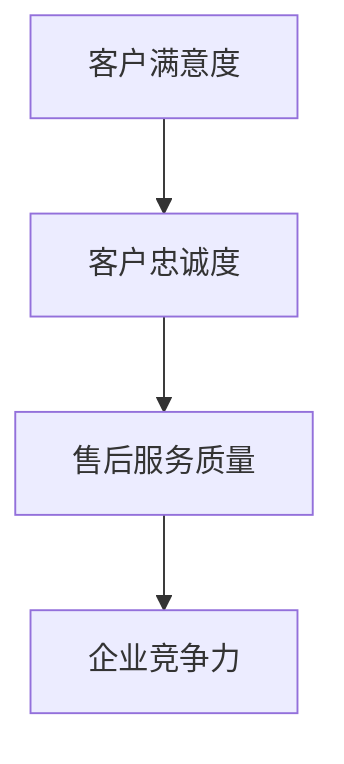
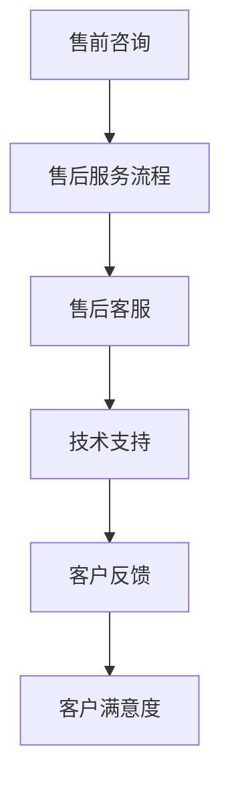
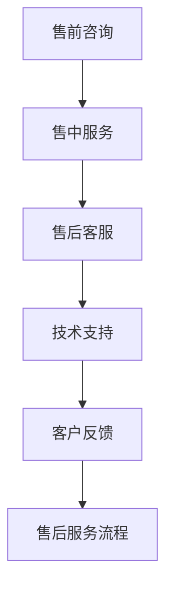

                 

## 文章标题

《知识付费产品的售后服务体系构建》

> 关键词：知识付费、售后服务体系、客户满意度、客户忠诚度、服务质量

> 摘要：本文旨在为从事知识付费行业的企业和从业人员提供一套系统、全面、可操作的售后服务体系构建指南，通过深入分析知识付费行业的特点，探讨售后服务体系在提升客户满意度和企业竞争力中的重要作用。

### 第一部分：引言与核心概念

#### 引言

知识付费产品是指以知识内容为核心，通过付费方式提供给用户的商品或服务。随着互联网技术的发展和人们对知识需求的增加，知识付费产品逐渐成为一种流行的商业模式。然而，在激烈的市场竞争中，售后服务体系的重要性愈发凸显。本文旨在为从事知识付费行业的企业和从业人员提供一套系统、全面、可操作的售后服务体系构建指南。

#### 核心概念与联系

在构建售后服务体系之前，我们需要明确以下几个核心概念：

- **客户满意度**：指客户对企业产品或服务的主观感受和评价。提高客户满意度是售后服务体系的重要目标之一。
- **客户忠诚度**：指客户重复购买产品或服务的倾向。客户忠诚度是衡量售后服务质量的重要指标。
- **售后服务质量**：指企业在售后服务过程中提供的产品、服务、沟通和解决问题的能力。高质量的售后服务有助于提高客户满意度和忠诚度。

以下是这些核心概念的Mermaid流程图：

#### 售后服务体系架构

售后服务体系的构建包括以下几个关键模块：

1. **售前咨询**：提供产品介绍、使用指南等咨询服务，帮助用户了解产品特点和使用方法。
2. **售后服务流程**：制定标准化的售后服务流程，确保服务质量一致。
3. **售后客服**：提供在线咨询、电话支持等客户服务，解决用户在产品使用过程中遇到的问题。
4. **技术支持**：为用户提供产品使用的技术指导，解决技术性问题。
5. **客户反馈**：收集和分析客户反馈，持续改进服务质量。
6. **售后服务流程**：制定标准化的售后服务流程，确保服务质量一致。

以下是售后服务体系的Mermaid流程图：

#### 售后服务体系的重要性

构建完善的售后服务体系对企业和客户都具有重要意义：

- **提升客户满意度**：提供优质、快速的售后服务，满足客户需求，提高客户满意度。
- **增强客户忠诚度**：通过售后服务赢得客户信任，增加客户重复购买的可能性。
- **提高企业竞争力**：良好的售后服务体系有助于企业在激烈的市场竞争中脱颖而出。

### 第二部分：售后服务体系构建流程

#### 售后服务战略规划

**1.1** 确定售后服务目标：根据企业战略目标和市场需求，设定具体的售后服务目标。

**1.2** 制定售后服务策略：明确售后服务体系的核心策略，如服务范围、服务标准、服务时效等。

**1.3** 确定资源投入：评估售后服务所需的资源，包括人力、财力、技术等。

#### 售后服务团队建设

**2.1** 设立售后服务部门：明确部门职责，建立售后服务团队。

**2.2** 培训售后服务人员：提升售后服务人员的专业素养和沟通能力。

**2.3** 设立绩效考核机制：激励售后服务人员提供优质服务。

#### 售后服务流程优化

**3.1** 制定标准化流程：明确售后服务各个环节的职责和操作规范。

**3.2** 优化服务流程：通过数据分析，持续优化售后服务流程，提高服务效率。

**3.3** 建立服务标准：制定服务标准，确保售后服务质量。

#### 售后服务技术支持

**4.1** 提供在线技术支持：建立在线客服系统，提供实时技术支持。

**4.2** 设立技术支持团队：为用户提供全方位的技术指导。

**4.3** 开发自助服务工具：提供用户自助解决问题的工具，如FAQ、使用手册等。

### 第三部分：售后服务质量提升

#### 客户满意度管理

**1.1** 收集客户反馈：通过问卷调查、用户访谈等方式，收集客户对售后服务的评价。

**1.2** 分析客户反馈：对客户反馈进行分析，找出服务短板。

**1.3** 制定改进措施：根据客户反馈，制定针对性的改进措施。

#### 客户忠诚度管理

**2.1** 建立客户档案：记录客户基本信息、购买历史、售后服务记录等。

**2.2** 实施个性化服务：根据客户档案，提供个性化、定制化的售后服务。

**2.3** 设计忠诚度奖励机制：通过积分、优惠券等手段，激励客户重复购买。

#### 售后服务质量监控

**3.1** 建立服务质量监控体系：对售后服务过程进行全程监控。

**3.2** 定期开展服务质量评估：评估售后服务质量，发现问题及时改进。

**3.3** 持续优化服务质量：通过数据分析，不断优化售后服务流程，提升服务质量。

### 第四部分：案例分析

#### 知识付费产品售后服务体系案例分析

**1.1** 案例背景：介绍案例企业及其知识付费产品。

**1.2** 售后服务体系构建：分析案例企业的售后服务体系构建过程。

**1.3** 案例启示：总结案例中的成功经验和不足之处，为其他企业提供借鉴。

### 总结

本文从引言、核心概念、构建流程、质量提升和案例分析等多个角度，探讨了知识付费产品的售后服务体系构建。通过深入分析，我们认识到售后服务体系在提升客户满意度和企业竞争力中的重要作用。希望本文能为从事知识付费行业的企业和从业人员提供有益的参考和指导。

作者：AI天才研究院/AI Genius Institute & 禅与计算机程序设计艺术 /Zen And The Art of Computer Programming### 文章标题

《知识付费产品的售后服务体系构建》

> 关键词：知识付费、售后服务、客户满意度、客户忠诚度、服务质量、流程优化、团队建设、技术支持

> 摘要：本文旨在为知识付费行业的从业者提供一套系统、全面、可操作的售后服务体系构建指南。文章深入分析了知识付费行业的特点，探讨了售后服务体系在提升客户满意度和企业竞争力中的关键作用，通过具体的流程优化和团队建设策略，为企业构建高效的售后服务体系提供了实用建议。

### 第一部分：引言与核心概念

#### 引言

在数字化时代，知识付费产品如雨后春笋般涌现，从在线课程、电子书到专业技能培训，各种形式的知识付费产品满足了不同用户群体的学习需求。然而，随着市场的日益成熟，用户对服务质量的要求也在不断提升，售后服务成为了知识付费企业核心竞争力的重要组成部分。一个完善的售后服务体系不仅能够提升客户满意度，增强客户忠诚度，还能帮助企业树立良好的品牌形象，实现可持续发展。

本文将围绕知识付费产品的售后服务体系构建进行深入探讨，从战略规划到团队建设，从流程优化到技术支持，力求为知识付费行业的从业者提供一套系统、全面、可操作的指南。

#### 核心概念与联系

在构建售后服务体系之前，我们需要明确以下几个核心概念及其相互联系：

1. **客户满意度**：指客户对企业产品或服务的主观感受和评价。它是售后服务体系的首要目标，通过提供优质的售后服务，满足客户的需求和期望，从而提升客户的满意度。

2. **客户忠诚度**：指客户重复购买产品或服务的倾向。忠诚度是衡量售后服务质量的重要指标，通过建立良好的售后服务体系，增强客户对品牌的信任和依赖，提高客户忠诚度。

3. **售后服务质量**：指企业在售后服务过程中提供的产品、服务、沟通和解决问题的能力。高质量的售后服务是提升客户满意度和忠诚度的关键。

4. **企业竞争力**：指企业在市场竞争中的综合实力。一个高效的售后服务体系能够提升客户满意度，增强客户忠诚度，进而提高企业的市场竞争力。

以下是这些核心概念之间的Mermaid流程图：

#### 售后服务体系架构

售后服务体系的构建需要从多个模块入手，形成一个完整的服务链条。以下是售后服务体系的几个关键模块：

1. **售前咨询**：为用户提供产品介绍、使用指南等咨询服务，帮助用户了解产品特点和使用方法。

2. **售中服务**：在产品销售过程中提供的服务，如订单跟踪、支付咨询等。

3. **售后客服**：提供在线咨询、电话支持等客户服务，解决用户在产品使用过程中遇到的问题。

4. **技术支持**：为用户提供产品使用的技术指导，解决技术性问题。

5. **客户反馈**：收集和分析客户反馈，持续改进服务质量。

6. **售后服务流程**：制定标准化的售后服务流程，确保服务质量一致。

以下是售后服务体系的Mermaid流程图：

#### 售后服务体系的重要性

构建完善的售后服务体系对企业和客户都具有重要意义：

- **提升客户满意度**：提供优质、快速的售后服务，满足客户需求，提高客户满意度。

- **增强客户忠诚度**：通过售后服务赢得客户信任，增加客户重复购买的可能性。

- **提高企业竞争力**：良好的售后服务体系有助于企业在激烈的市场竞争中脱颖而出。

### 第二部分：售后服务体系构建流程

#### 售后服务战略规划

**1.1** 确定售后服务目标

确定售后服务目标是构建售后服务体系的第一步。企业需要根据自身战略目标和市场需求，设定具体的售后服务目标，如提高客户满意度、增强客户忠诚度、提升售后服务质量等。

**1.2** 制定售后服务策略

售后服务策略是指导售后服务体系实施的关键文件。企业需要明确售后服务体系的核心策略，包括服务范围、服务标准、服务时效等。例如，企业可以制定快速响应策略、个性化服务策略、问题解决策略等。

**1.3** 确定资源投入

构建售后服务体系需要投入一定的人力、财力和技术资源。企业需要评估售后服务所需的资源，包括招聘专业售后服务人员、采购技术设备、建立售后服务系统等。

#### 售后服务团队建设

**2.1** 设立售后服务部门

售后服务部门是售后服务体系的核心。企业需要明确售后服务部门的职责，包括售前咨询、售中服务、售后客服、技术支持等。

**2.2** 培训售后服务人员

售后服务人员的专业素养和沟通能力直接影响售后服务质量。企业需要对售后服务人员进行专业培训，提高他们的产品知识、沟通技巧和服务意识。

**2.3** 设立绩效考核机制

绩效考核机制是激励售后服务人员提供优质服务的重要手段。企业可以设立售后服务人员的绩效考核指标，如客户满意度、问题解决率、服务响应时间等，并给予相应的奖励。

#### 售后服务流程优化

**3.1** 制定标准化流程

标准化流程是确保售后服务质量一致的重要保障。企业需要制定标准化的售后服务流程，明确各个环节的职责和操作规范，确保服务流程的规范化和高效化。

**3.2** 优化服务流程

通过数据分析，企业可以找出售后服务流程中的瓶颈和问题，进行优化。例如，通过缩短服务响应时间、简化服务流程、提高问题解决率等方式，提升服务效率。

**3.3** 建立服务标准

服务标准是衡量售后服务质量的重要依据。企业需要制定服务标准，包括服务时效、服务质量、服务态度等，确保售后服务的一致性和规范性。

#### 售后服务技术支持

**4.1** 提供在线技术支持

在线客服系统是提供技术支持的重要工具。企业可以建立在线客服系统，提供实时、便捷的技术支持，解决用户在产品使用过程中遇到的问题。

**4.2** 设立技术支持团队

技术支持团队是提供专业技术指导的重要力量。企业需要设立技术支持团队，由专业的技术工程师组成，为用户提供全方位的技术支持。

**4.3** 开发自助服务工具

自助服务工具如FAQ、使用手册等，可以帮助用户自助解决问题。企业可以开发自助服务工具，提供用户自助解决问题的渠道，提高服务效率。

### 第三部分：售后服务质量提升

#### 客户满意度管理

**1.1** 收集客户反馈

收集客户反馈是提升客户满意度的重要手段。企业可以通过问卷调查、用户访谈等方式，收集客户对售后服务的评价，了解客户的需求和期望。

**1.2** 分析客户反馈

对客户反馈进行分析，找出服务短板和改进方向。企业可以通过数据挖掘、统计分析等方法，对客户反馈进行深入分析，识别服务中的问题。

**1.3** 制定改进措施

根据客户反馈，制定针对性的改进措施。企业可以通过优化服务流程、提高服务效率、改善服务态度等方式，提升客户满意度。

#### 客户忠诚度管理

**2.1** 建立客户档案

建立客户档案，记录客户基本信息、购买历史、售后服务记录等。企业可以通过客户档案，了解客户的需求和行为，提供个性化的服务。

**2.2** 实施个性化服务

根据客户档案，提供个性化、定制化的售后服务。企业可以通过数据分析，识别客户的个性化需求，提供针对性的服务。

**2.3** 设计忠诚度奖励机制

设计忠诚度奖励机制，激励客户重复购买。企业可以通过积分、优惠券、会员折扣等方式，奖励忠诚客户，提高客户的重复购买率。

#### 售后服务质量监控

**3.1** 建立服务质量监控体系

建立服务质量监控体系，对售后服务过程进行全程监控。企业可以通过监控服务响应时间、问题解决率、客户满意度等指标，评估售后服务质量。

**3.2** 定期开展服务质量评估

定期开展服务质量评估，发现问题及时改进。企业可以通过定期的服务质量评估，识别服务中的问题和不足，制定改进措施。

**3.3** 持续优化服务质量

通过数据分析，持续优化售后服务流程，提升服务质量。企业可以通过不断的数据分析和流程优化，提高服务效率和质量。

### 第四部分：案例分析

#### 知识付费产品售后服务体系案例分析

**1.1** 案例背景

以某知名在线教育平台为例，该平台提供各种在线课程，包括职业技能培训、语言学习、兴趣爱好等。随着用户数量的增加，售后服务压力也越来越大。为了提升客户满意度和忠诚度，该平台开始重视售后服务体系的构建。

**1.2** 售后服务体系构建

该平台建立了完善的售后服务体系，包括售前咨询、售中服务、售后客服、技术支持等模块。具体措施如下：

- **售前咨询**：提供在线客服系统，解答用户在购买课程前的问题。
- **售中服务**：在用户购买课程过程中提供订单跟踪、支付咨询等服务。
- **售后客服**：提供在线咨询、电话支持等服务，解决用户在使用课程过程中遇到的问题。
- **技术支持**：设立技术支持团队，为用户提供课程使用的技术指导。
- **客户反馈**：通过问卷调查、用户评价等方式，收集用户对售后服务的反馈。

**1.3** 案例启示

通过构建完善的售后服务体系，该平台成功提升了客户满意度和忠诚度，实现了业务的快速增长。以下是该案例的启示：

- **重视售后服务**：售后服务是提升客户满意度和忠诚度的重要手段。
- **完善服务流程**：建立标准化的售后服务流程，确保服务质量的稳定性。
- **充分利用技术**：利用在线客服系统、数据分析等技术手段，提高服务效率。
- **持续改进**：通过定期评估和优化，不断提升售后服务质量。

### 第五部分：最佳实践与总结

#### 最佳实践

1. **建立客户反馈机制**：通过问卷调查、用户评价等方式，收集客户反馈，及时了解客户需求和期望，不断优化服务。

2. **个性化服务**：根据客户档案，提供个性化的服务，提高客户满意度。

3. **技术支持团队建设**：建立专业的技术支持团队，提高问题解决能力。

4. **服务流程优化**：通过数据分析，持续优化服务流程，提高服务效率。

5. **定期培训**：对售后服务人员进行定期培训，提高服务质量和客户满意度。

#### 总结

知识付费产品的售后服务体系构建是提升客户满意度和企业竞争力的重要手段。通过完善的服务流程、专业的团队建设和持续的服务质量提升，企业可以建立良好的品牌形象，实现业务的可持续发展。希望本文能为知识付费行业的从业者提供有益的参考和指导。

### 作者介绍

作者：AI天才研究院/AI Genius Institute & 禅与计算机程序设计艺术 /Zen And The Art of Computer Programming

AI天才研究院致力于推动人工智能技术的发展和应用，本文作者结合了人工智能与计算机编程领域的专业知识，深入探讨了知识付费产品的售后服务体系构建，旨在为知识付费行业的从业者提供实用的指导和建议。同时，作者也是《禅与计算机程序设计艺术》一书的作者，对计算机编程和人工智能领域有着深刻的理解和独到的见解。希望通过本文，能够帮助从业者更好地构建售后服务体系，提升客户满意度和企业竞争力。

