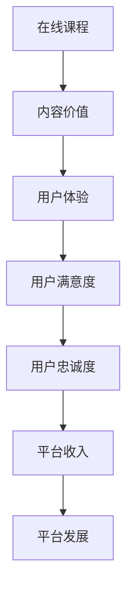
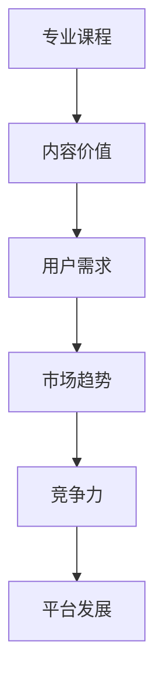
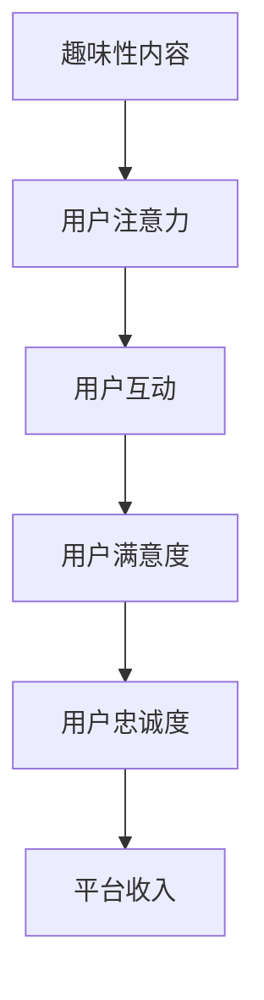

                 

# 《知识付费创业中的内容价值最大化》

> 关键词：知识付费、内容价值、创业、策略、知识产权

> 摘要：本文将深入探讨知识付费创业中的内容价值最大化。通过对知识付费行业的概述、内容价值最大化的策略分析以及成功案例的剖析，为创业者提供系统性的指导，助力其在竞争激烈的市场中实现可持续发展。

## 第一部分：知识付费行业概述

### 第1章：知识付费市场的现状与趋势

#### 1.1 知识付费的定义与历史发展

知识付费是指用户为获取专业知识和技能，通过购买或订阅形式付费给知识提供方的一种商业模式。这一模式在我国起源于20世纪末，随着互联网技术的发展和用户付费意识的增强，近年来得到了迅猛发展。

知识付费的历史发展可分为三个阶段：

1. **初级阶段（2000-2010年）**：以线下教育培训为主，如新东方、好未来等线下培训机构，通过提供线下课程实现知识付费。

2. **中级阶段（2010-2015年）**：线上教育平台兴起，如网易云课堂、慕课网等，通过在线课程实现知识付费。

3. **高级阶段（2015年至今）**：知识付费平台多元化发展，除线上教育平台外，还包括专业技能培训、娱乐类知识付费产品等。

#### 1.2 知识付费市场的规模与增长

根据相关报告，我国知识付费市场规模逐年增长。2018年市场规模约为1563亿元，预计到2023年将达到3195亿元。这一趋势表明，知识付费已成为我国教育培训行业的重要组成部分。

#### 1.3 知识付费的主要用户群体分析

知识付费的用户群体主要集中在以下几类：

1. **职场人士**：为了提升职业技能和职业发展，购买专业技能培训课程。

2. **学生**：为了学习新知识、提高学业成绩，购买线上课程。

3. **兴趣爱好者**：为了满足个人兴趣和爱好，购买娱乐类知识付费产品。

#### 1.4 知识付费行业的竞争格局

目前，知识付费行业竞争激烈，主要玩家包括：

1. **综合类知识付费平台**：如喜马拉雅、得到等，提供多元化的知识产品。

2. **垂直类知识付费平台**：如知乎Live、分答等，专注于某一领域的专业知识。

3. **线下培训机构**：如新东方、好未来等，将线下教育课程转移到线上。

#### 1.5 知识付费行业的挑战与机遇

1. **挑战**：内容同质化严重、用户注意力分散、市场竞争加剧等。

2. **机遇**：用户需求多样化、内容形式创新、产业链整合等。

### 第2章：知识付费产品的类型与特点

#### 2.1 线上教育类知识付费产品

线上教育类知识付费产品主要包括在线课程、直播课程、电子书等形式。其特点是：

1. **便捷性**：用户可以随时随地进行学习。

2. **个性化**：根据用户需求提供定制化的学习内容。

3. **互动性**：通过直播、问答等形式实现师生互动。

#### 2.2 专业技能培训类知识付费产品

专业技能培训类知识付费产品主要针对职场人士，提供专业技能培训课程。其特点是：

1. **专业性**：课程内容紧贴行业需求。

2. **实用性**：注重实战技能的培养。

3. **针对性**：针对不同职业阶段和技能水平提供课程。

#### 2.3 娱乐类知识付费产品

娱乐类知识付费产品以娱乐性为主，通过幽默、趣味的方式传授知识。其特点是：

1. **趣味性**：提高用户的学习兴趣。

2. **互动性**：通过互动游戏、问答等形式增强用户体验。

3. **传播性**：易于传播，提高品牌知名度。

#### 2.4 知识付费产品的核心要素

1. **内容质量**：优质的内容是知识付费产品的核心竞争力。

2. **用户体验**：良好的用户体验能提高用户满意度和粘性。

3. **营销策略**：有效的营销策略能吸引更多用户。

## 第二部分：内容价值最大化策略

### 第3章：内容价值的定义与评估

#### 3.1 内容价值的内涵

内容价值是指知识付费产品所蕴含的知识、技能、经验等对用户的价值。它包括以下几个方面：

1. **实用性**：内容是否能够解决用户实际问题。

2. **新颖性**：内容是否具有创新性和前瞻性。

3. **权威性**：内容是否具有权威性和专业性。

4. **吸引力**：内容是否能够吸引用户关注和阅读。

#### 3.2 内容价值的评估标准

1. **用户反馈**：用户对内容的评价和满意度。

2. **学习成果**：用户通过学习内容所取得的成果。

3. **市场接受度**：内容在市场上的认可度和接受度。

4. **经济效益**：内容为用户和企业带来的经济效益。

#### 3.3 内容价值评估的方法

1. **问卷调查**：通过问卷调查了解用户对内容的评价。

2. **学习成果评估**：通过考试、作业、实践等方式评估用户的学习成果。

3. **市场调研**：通过市场调研了解内容的接受度和市场需求。

4. **经济效益分析**：通过财务数据分析内容为企业带来的经济效益。

### 第4章：内容创造与内容运营

#### 4.1 创造有价值的内容

1. **选题策划**：根据用户需求和市场趋势确定内容选题。

2. **内容创作**：通过专业团队或个人进行内容创作。

3. **内容审核**：对内容进行严格审核，确保内容质量。

#### 4.2 内容的定位与目标人群

1. **内容定位**：明确内容的特点和定位，如实用性、专业性、趣味性等。

2. **目标人群**：确定内容的受众群体，如职场人士、学生、兴趣爱好者等。

#### 4.3 内容的运营策略

1. **内容推广**：通过多种渠道推广内容，提高内容曝光度。

2. **用户互动**：通过互动形式提高用户参与度和粘性。

3. **内容更新**：定期更新内容，保持内容的新鲜感和活力。

### 第5章：内容价值的提升策略

#### 5.1 创新内容形式

1. **多媒体形式**：结合文字、图片、音频、视频等多种形式呈现内容。

2. **互动式学习**：通过互动游戏、问答等形式增强用户体验。

3. **个性化推荐**：根据用户兴趣和需求推荐个性化内容。

#### 5.2 内容迭代与更新

1. **定期更新**：根据用户反馈和市场需求，定期更新内容。

2. **版本迭代**：对内容进行版本迭代，不断提升内容质量和用户体验。

3. **内容优化**：根据用户行为数据，对内容进行优化，提高内容价值。

#### 5.3 用户互动与社区建设

1. **用户互动**：通过论坛、社群等形式，鼓励用户互动和分享。

2. **内容共建**：鼓励用户参与内容创作和分享，形成内容共建生态。

3. **社区管理**：建立健全社区管理机制，维护社区秩序和氛围。

### 第6章：知识产权保护与内容版权

#### 6.1 知识产权保护的重要性

知识产权保护是知识付费创业的核心问题之一。保护知识产权有助于：

1. **维护内容创作者的权益**：确保内容创作者的合法权益得到保障。

2. **提升内容质量**：防止抄袭和低质量内容的出现，提高整体内容质量。

3. **保护用户权益**：防止侵权内容对用户造成损害。

#### 6.2 内容版权的法律保护

1. **著作权保护**：对文字、图片、音频、视频等原创内容进行著作权登记和保护。

2. **商标保护**：对知识付费产品的商标进行注册和保护。

3. **专利保护**：对知识付费产品的技术特点和创新点进行专利申请和保护。

#### 6.3 知识产权保护的具体措施

1. **内容审核**：建立严格的审核机制，防止侵权内容上线。

2. **版权声明**：在知识付费产品中明确版权声明，提醒用户遵守版权规定。

3. **法律维权**：对侵权行为进行法律维权，保护自身权益。

## 第三部分：知识付费创业实践

### 第7章：成功的内容价值最大化实践

#### 7.1 案例一：某知名在线教育平台的成功经验

**背景介绍**：该在线教育平台成立于2010年，以提供高质量的在线课程为主，经过多年的发展，已成为行业领导者。

**核心概念与联系**：

**核心算法原理讲解**：

- **内容价值计算**：通过用户反馈、学习成果、市场接受度等多方面因素，对内容价值进行综合评估。

- **用户体验优化**：根据用户行为数据，优化课程设计、教学方式等，提升用户体验。

- **用户满意度提升**：通过定期课程更新、用户互动等方式，提高用户满意度。

- **用户忠诚度培养**：通过会员制度、积分奖励等方式，培养用户忠诚度。

**数学模型和公式**：

$$
V_c = w_1 \cdot F_1 + w_2 \cdot F_2 + w_3 \cdot F_3
$$

其中，$V_c$为内容价值，$w_1$、$w_2$、$w_3$分别为用户反馈、学习成果、市场接受度的权重，$F_1$、$F_2$、$F_3$分别为这三个方面的具体分数。

**举例说明**：

假设某课程的用户反馈得分为80分，学习成果得分为75分，市场接受度得分为85分，则该课程的内容价值为：

$$
V_c = 0.4 \cdot 80 + 0.3 \cdot 75 + 0.3 \cdot 85 = 81
$$

#### 7.2 案例二：某技能培训平台的崛起之路

**背景介绍**：该技能培训平台成立于2016年，专注于职场技能培训，经过几年的快速发展，已成为行业领军企业。

**核心概念与联系**：

**核心算法原理讲解**：

- **内容价值计算**：根据用户需求和市场需求，对课程内容进行评估。

- **市场趋势分析**：通过大数据分析，预测市场趋势，调整课程内容。

- **竞争力分析**：通过对比竞争对手，找出差距，提升自身竞争力。

**数学模型和公式**：

$$
V_c = w_1 \cdot F_1 + w_2 \cdot F_2 + w_3 \cdot F_3
$$

其中，$V_c$为内容价值，$w_1$、$w_2$、$w_3$分别为用户需求、市场趋势、竞争力的权重，$F_1$、$F_2$、$F_3$分别为这三个方面的具体分数。

**举例说明**：

假设某课程的用户需求得分为90分，市场趋势得分为80分，竞争力得分为75分，则该课程的内容价值为：

$$
V_c = 0.4 \cdot 90 + 0.3 \cdot 80 + 0.3 \cdot 75 = 85
$$

#### 7.3 案例三：娱乐类知识付费产品的独特策略

**背景介绍**：某娱乐类知识付费产品以趣味性、互动性为核心，通过幽默、趣味的方式传授知识，迅速获得了大量用户。

**核心概念与联系**：

**核心算法原理讲解**：

- **内容创意**：通过幽默、趣味的方式设计内容，提高用户注意力。

- **互动式学习**：通过互动游戏、问答等形式，提高用户参与度。

- **用户满意度提升**：通过良好的用户体验，提高用户满意度。

- **用户忠诚度培养**：通过积分奖励、会员制度等方式，培养用户忠诚度。

**数学模型和公式**：

$$
V_c = w_1 \cdot F_1 + w_2 \cdot F_2 + w_3 \cdot F_3
$$

其中，$V_c$为内容价值，$w_1$、$w_2$、$w_3$分别为用户注意力、用户互动、用户满意度的权重，$F_1$、$F_2$、$F_3$分别为这三个方面的具体分数。

**举例说明**：

假设某课程的用户注意力得分为85分，用户互动得分为80分，用户满意度得分为90分，则该课程的内容价值为：

$$
V_c = 0.4 \cdot 85 + 0.3 \cdot 80 + 0.3 \cdot 90 = 85.5
$$

### 第8章：知识付费创业的筹备与规划

#### 8.1 创业者素质与团队组建

1. **创业者素质**：具备创新精神、执行力、领导力等素质。

2. **团队组建**：组建具备专业技能、互补性的人才团队。

#### 8.2 市场调研与目标定位

1. **市场调研**：了解市场需求、竞争对手、用户痛点等。

2. **目标定位**：明确产品定位、目标用户、市场定位等。

#### 8.3 营销策略与推广方案

1. **营销策略**：制定有效的营销策略，提高品牌知名度。

2. **推广方案**：制定具体的推广方案，包括广告投放、社交媒体推广、线上线下活动等。

### 第9章：知识付费项目的运营与管理

#### 9.1 内容开发与更新

1. **内容开发**：根据市场需求和用户反馈，持续开发高质量内容。

2. **内容更新**：定期更新内容，保持内容的新鲜度和活力。

#### 9.2 用户服务与反馈机制

1. **用户服务**：提供优质的用户服务，解决用户问题和需求。

2. **反馈机制**：建立反馈机制，及时收集用户反馈，优化产品和服务。

#### 9.3 财务管理与分析

1. **财务管理**：建立严格的财务管理制度，确保资金安全。

2. **数据分析**：通过数据分析，了解用户行为和市场趋势，优化运营策略。

### 第10章：知识付费创业中的风险与应对

#### 10.1 市场风险与应对策略

1. **市场风险**：包括市场竞争、用户需求变化等。

2. **应对策略**：通过差异化竞争、市场拓展等方式应对市场风险。

#### 10.2 技术风险与解决方案

1. **技术风险**：包括技术更新、系统稳定性等。

2. **解决方案**：通过技术升级、系统优化等方式降低技术风险。

#### 10.3 法律风险与合规管理

1. **法律风险**：包括知识产权保护、法律法规合规等。

2. **合规管理**：通过法律咨询、合规培训等方式加强合规管理。

### 第11章：知识付费创业的成功要素

#### 11.1 创新思维与执行力

1. **创新思维**：持续创新，满足用户需求。

2. **执行力**：将创新思维转化为具体行动，实现目标。

#### 11.2 用户满意度与忠诚度

1. **用户满意度**：提供优质的产品和服务，提高用户满意度。

2. **用户忠诚度**：通过会员制度、积分奖励等方式培养用户忠诚度。

#### 11.3 持续迭代与优化

1. **持续迭代**：根据用户反馈和市场变化，持续优化产品和服务。

2. **优化策略**：通过数据分析、用户调研等方式，不断优化运营策略。

## 附录

### 附录 A：知识付费创业资源与工具

#### A.1 主流知识付费平台简介

1. 喜马拉雅：提供丰富的音频课程和内容，用户规模庞大。

2. 得到：提供高质量的付费内容，涵盖多个领域。

3. 网易云课堂：提供在线课程，涉及多个领域。

#### A.2 内容创作与编辑工具

1. Canva：设计工具，适用于海报、宣传图等设计。

2. Google Docs：文档编辑工具，支持多人协作。

3. Adobe Premiere Pro：视频编辑软件，适用于视频内容的制作。

#### A.3 数据分析与用户研究工具

1. Google Analytics：网站分析工具，提供用户行为数据。

2. Tableau：数据可视化工具，适用于数据分析和报告。

3. Qualtrics：问卷调查工具，适用于用户调研。

### 附录 B：知识付费创业法律法规参考

#### B.1 知识产权相关法律法规

1. 《中华人民共和国著作权法》

2. 《中华人民共和国商标法》

3. 《中华人民共和国专利法》

#### B.2 互联网信息服务相关法律法规

1. 《互联网信息服务管理办法》

2. 《中华人民共和国网络安全法》

3. 《中华人民共和国电子商务法》

#### B.3 知识付费行业监管政策

1. 教育部等六部门《关于规范校外线上培训的实施意见》

2. 国家市场监管总局等六部门《关于规范线上教育培训市场的通知》

### 作者：AI天才研究院/AI Genius Institute & 禅与计算机程序设计艺术 /Zen And The Art of Computer Programming

