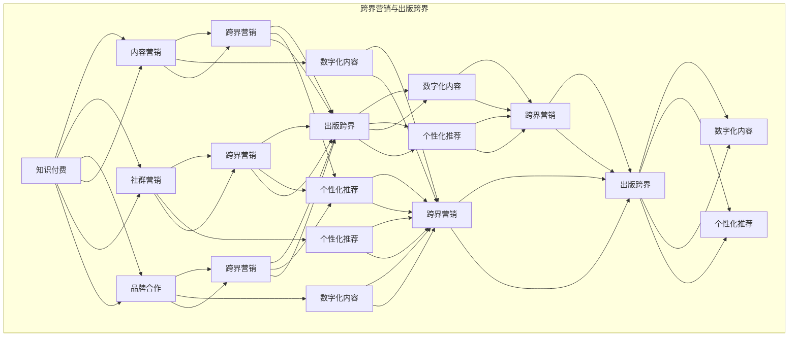

                 

### 文章标题

“知识付费如何实现跨界营销与出版跨界？”

> 关键词：知识付费，跨界营销，出版跨界，策略，案例研究，发展趋势

> 摘要：本文旨在探讨知识付费行业如何通过跨界营销与出版跨界策略实现业务拓展和增长。文章首先概述了知识付费市场的现状和跨界营销的概念，然后详细分析了跨界营销策略与实践，结合成功案例探讨了知识付费中的跨界营销策略。接着，文章介绍了跨界出版的概念与类型，以及跨界出版的策略与实践。最后，通过案例研究和方法与工具的探讨，总结了跨界营销与出版跨界的方法、技术支持和未来发展趋势。

### 知识付费市场概述

#### 1.1 知识付费行业的兴起与现状

知识付费作为互联网时代下的一种新兴商业模式，近年来在我国取得了迅猛发展。其核心在于通过提供高质量的知识内容，满足用户对于专业知识和技能提升的需求，从而实现价值交换。知识付费的兴起可以追溯到2016年左右，随着移动互联网的普及和用户消费观念的转变，越来越多的平台和内容创作者投身其中，形成了一个庞大的市场。

目前，知识付费市场主要呈现以下几个特点：

1. **内容多样化**：知识付费内容涵盖了教育、科技、人文、艺术等多个领域，满足用户多样化的知识需求。
2. **用户规模庞大**：根据数据显示，我国知识付费用户规模已超过4亿人，市场规模逐年增长。
3. **平台化竞争**：各大平台如喜马拉雅、得到、知乎等在知识付费领域展开激烈竞争，通过提供多样化的内容和服务吸引用户。
4. **内容质量提升**：随着市场竞争的加剧，平台和内容创作者开始注重内容质量，以高质量内容吸引用户。

#### 1.2 知识付费的主要模式

知识付费主要分为以下几种模式：

1. **订阅模式**：用户支付一定费用后，可以无限次地访问平台上的内容。
2. **课程模式**：用户购买特定课程，完成学习后可获得相应的证书或学分。
3. **内容付费**：用户为特定内容支付费用，如电子书、研究报告、专业课程等。
4. **直播模式**：用户通过直播购买课程或与讲师进行互动。
5. **会员模式**：用户支付会员费用，享受平台提供的各种特权服务。

#### 1.3 知识付费市场的潜在需求

知识付费市场的潜在需求主要来源于以下几个方面：

1. **个人成长需求**：随着社会竞争的加剧，个人提升专业技能和知识水平的需求不断增长。
2. **职业发展需求**：职场人士希望通过学习提升自己的职业竞争力，获得更好的职业发展机会。
3. **兴趣爱好的满足**：用户希望通过学习满足自己的兴趣爱好，丰富自己的精神生活。
4. **知识获取的便捷性**：互联网的普及使得用户可以随时随地获取所需的知识，提高了知识获取的便捷性。

#### 1.4 跨界营销的概念与意义

跨界营销是指企业为了实现产品或服务的推广，通过与其他领域的企业或品牌合作，实现资源共享、优势互补的营销策略。跨界营销在知识付费领域具有重要意义：

1. **拓展用户群体**：通过与其他领域的合作，可以吸引更多的用户，扩大知识付费的受众范围。
2. **提升品牌影响力**：跨界营销可以借助合作伙伴的品牌影响力，提升自身品牌知名度。
3. **丰富内容形式**：跨界营销可以引入其他领域的内容，丰富知识付费的内容形式，满足用户多样化的需求。
4. **降低营销成本**：通过跨界营销，可以共享合作伙伴的营销资源和渠道，降低营销成本。

#### 1.5 跨界营销的核心要素

跨界营销的核心要素包括：

1. **目标受众**：明确跨界营销的目标受众，了解其需求和偏好。
2. **合作伙伴**：选择与自身业务有互补性的合作伙伴，实现资源共享和优势互补。
3. **内容创意**：通过创意的内容形式和传播方式，吸引目标受众的注意力。
4. **渠道选择**：选择合适的渠道进行推广，提高营销效果。
5. **效果评估**：对跨界营销的效果进行评估，不断优化营销策略。

#### 1.6 跨界营销的优势与挑战

跨界营销具有以下优势：

1. **创新性**：跨界营销可以带来新的营销思路和创意，提升品牌形象。
2. **多元化**：跨界营销可以引入多样化的内容和形式，满足用户多样化的需求。
3. **高曝光率**：跨界营销可以通过合作伙伴的品牌影响力和渠道，提高营销活动的曝光率。

然而，跨界营销也面临一些挑战：

1. **协同难度**：跨界营销需要与合作伙伴紧密协作，协同难度较大。
2. **品牌风险**：跨界营销可能会带来品牌风险，需要谨慎选择合作伙伴。
3. **效果不确定性**：跨界营销的效果难以预测，需要不断优化策略。

#### 1.7 成功的跨界营销案例解析

以下是一些成功的跨界营销案例：

1. **案例一：知乎与京东的合作**  
知乎通过在京东开设官方旗舰店，将知识付费与电商平台结合，吸引了大量用户，提升了品牌知名度。

2. **案例二：喜马拉雅与汽车品牌的合作**  
喜马拉雅与汽车品牌合作，将车载广播与知识付费内容相结合，为用户提供便捷的学习渠道，同时提升了品牌形象。

3. **案例三：得到与企业的合作**  
得到与多家企业合作，为企业员工提供定制化的知识付费课程，提升了员工的职业技能，同时帮助企业降低了培训成本。

#### 1.8 知识付费中的跨界营销策略

针对知识付费行业的特性，以下是一些可行的跨界营销策略：

1. **内容合作**：与其他领域的知识平台或内容创作者合作，共同开发课程或内容，实现资源共享。
2. **渠道合作**：与电商平台或其他渠道合作，拓宽销售渠道，提高销售业绩。
3. **品牌合作**：与品牌商合作，通过联合营销活动提升品牌知名度。
4. **线上线下结合**：通过线上线下结合的方式，实现知识付费的全面推广。

### 跨界营销与知识付费的结合点

#### 2.1 知识付费与内容营销的结合

内容营销是知识付费的重要组成部分，通过优质的内容吸引和留住用户。以下是一些结合点：

1. **内容共创**：与专业领域的创作者或专家合作，共同创作高质量的内容。
2. **内容分销**：将优质内容分发到其他平台，扩大受众范围。
3. **内容互动**：通过问答、评论等方式，增强用户与内容之间的互动。
4. **内容推广**：利用社交媒体、邮件营销等手段，推广优质内容。

#### 2.2 知识付费与社群营销的结合

社群营销是知识付费的重要手段，通过建立社群，提升用户黏性。以下是一些结合点：

1. **社群建设**：建立专业社群，为用户提供交流互动的平台。
2. **社群运营**：通过运营活动，提升社群的活跃度。
3. **社群变现**：通过社群内的知识付费产品，实现变现。
4. **社群传播**：通过社群成员的口碑传播，扩大品牌影响力。

#### 2.3 知识付费与品牌合作的结合

品牌合作是知识付费拓展市场的重要手段，以下是一些结合点：

1. **品牌代言**：邀请知名品牌代言知识付费产品，提升品牌形象。
2. **联合营销**：与品牌共同举办营销活动，提升活动影响力。
3. **品牌课程**：开发与品牌相关的知识付费课程，满足用户需求。
4. **品牌赞助**：通过品牌赞助，提升知识付费产品的品质。

#### 2.4 跨界营销在知识付费领域的应用前景

随着互联网技术的不断发展，跨界营销在知识付费领域的应用前景十分广阔：

1. **数字化内容**：通过数字化手段，实现知识付费内容的跨界传播。
2. **个性化推荐**：利用大数据和人工智能技术，实现知识付费内容的个性化推荐。
3. **跨界平台**：搭建跨界平台，实现不同领域知识付费内容的共享和融合。
4. **跨界合作**：与其他领域的企业或品牌开展跨界合作，实现资源共享和共赢。

### 第2章：跨界营销策略与实践

#### 2.1 跨界营销的核心要素

跨界营销的成功离不开以下几个核心要素：

1. **目标受众分析**：明确跨界营销的目标受众，了解其需求和偏好，确保营销策略的针对性。
2. **合作伙伴选择**：选择与自身业务有互补性的合作伙伴，实现资源共享和优势互补。
3. **内容创意**：通过创意的内容形式和传播方式，吸引目标受众的注意力。
4. **渠道选择**：选择合适的渠道进行推广，提高营销效果。
5. **效果评估**：对跨界营销的效果进行评估，不断优化营销策略。

#### 2.2 跨界营销的优势与挑战

跨界营销的优势主要体现在以下几个方面：

1. **创新性**：跨界营销可以带来新的营销思路和创意，提升品牌形象。
2. **多元化**：跨界营销可以引入多样化的内容和形式，满足用户多样化的需求。
3. **高曝光率**：跨界营销可以通过合作伙伴的品牌影响力和渠道，提高营销活动的曝光率。

然而，跨界营销也面临一些挑战：

1. **协同难度**：跨界营销需要与合作伙伴紧密协作，协同难度较大。
2. **品牌风险**：跨界营销可能会带来品牌风险，需要谨慎选择合作伙伴。
3. **效果不确定性**：跨界营销的效果难以预测，需要不断优化策略。

#### 2.3 成功的跨界营销案例解析

以下是一些成功的跨界营销案例：

1. **案例一：知乎与京东的合作**  
知乎通过在京东开设官方旗舰店，将知识付费与电商平台结合，吸引了大量用户，提升了品牌知名度。具体实施步骤如下：

   - **目标受众分析**：知乎分析了京东的用户群体，发现其具有较高的消费能力和购买意愿，符合知乎知识付费的目标受众。
   - **合作伙伴选择**：知乎与京东达成合作，利用京东的平台和资源，拓展知识付费市场。
   - **内容创意**：知乎在京东旗舰店推出了一系列精选课程和知识付费产品，结合京东的购物体验，为用户提供一站式服务。
   - **渠道选择**：知乎通过京东的官方渠道、社交媒体以及知乎自身平台进行推广，提高营销效果。
   - **效果评估**：通过数据监测和用户反馈，知乎评估了跨界营销的效果，不断优化营销策略。

2. **案例二：喜马拉雅与汽车品牌的合作**  
喜马拉雅与汽车品牌合作，将车载广播与知识付费内容相结合，为用户提供便捷的学习渠道，同时提升了品牌形象。具体实施步骤如下：

   - **目标受众分析**：喜马拉雅分析了汽车品牌的车主群体，发现其具有较高的消费能力和学习需求。
   - **合作伙伴选择**：喜马拉雅与多家汽车品牌达成合作，通过车载广播推广知识付费内容。
   - **内容创意**：喜马拉雅推出了一系列适合车主学习的内容，如驾驶技巧、汽车保养知识等，结合车载广播的特点，提高用户的学习体验。
   - **渠道选择**：喜马拉雅通过车载广播、社交媒体以及喜马拉雅自身平台进行推广，提高营销效果。
   - **效果评估**：通过数据监测和用户反馈，喜马拉雅评估了跨界营销的效果，不断优化营销策略。

3. **案例三：得到与企业的合作**  
得到与多家企业合作，为企业员工提供定制化的知识付费课程，提升了员工的职业技能，同时帮助企业降低了培训成本。具体实施步骤如下：

   - **目标受众分析**：得到分析了企业的员工群体，发现其具有较高的学习需求和职业发展需求。
   - **合作伙伴选择**：得到与多家企业达成合作，通过企业内部推广知识付费课程。
   - **内容创意**：得到根据企业的需求，开发了一系列定制化的知识付费课程，如领导力、项目管理等，提高员工的专业技能。
   - **渠道选择**：得到通过企业内部培训、社交媒体以及得到自身平台进行推广，提高营销效果。
   - **效果评估**：通过数据监测和用户反馈，得到评估了跨界营销的效果，不断优化营销策略。

#### 2.4 知识付费中的跨界营销策略

针对知识付费行业的特性，以下是一些可行的跨界营销策略：

1. **内容合作**：与其他领域的知识平台或内容创作者合作，共同开发课程或内容，实现资源共享。
2. **渠道合作**：与电商平台或其他渠道合作，拓宽销售渠道，提高销售业绩。
3. **品牌合作**：与品牌商合作，通过联合营销活动提升品牌知名度。
4. **线上线下结合**：通过线上线下结合的方式，实现知识付费的全面推广。

#### 2.5 跨界营销策略的案例分析

以下是一个跨界营销策略的案例分析：

1. **案例背景**：一家专注于编程教育的知识付费平台想要拓展市场，提升品牌知名度。
2. **目标受众**：编程教育平台的目标受众是程序员和编程爱好者，他们具有较高的学习需求和消费能力。
3. **合作伙伴选择**：编程教育平台选择了与一家知名编程社区合作，共同推出一系列编程课程。
4. **内容创意**：编程教育平台和编程社区共同开发了一系列适合编程爱好者的课程，包括入门课程、进阶课程和专业课程。
5. **渠道选择**：编程教育平台通过编程社区的官方网站、社交媒体以及自身平台进行推广。
6. **效果评估**：通过数据监测和用户反馈，编程教育平台评估了跨界营销的效果，不断优化营销策略。

### 第3章：跨界营销与知识付费的结合点

#### 3.1 知识付费与内容营销的结合

内容营销是知识付费的核心驱动力，通过高质量的内容吸引和留住用户。知识付费平台可以通过以下方式将内容营销与跨界营销相结合：

1. **共创内容**：与行业专家、意见领袖合作，共同创作具有权威性和吸引力的内容，提升用户信任度。
2. **内容多样化**：结合不同领域的知识，开发多元化的内容产品，满足不同用户群体的需求。
3. **内容传播**：利用社交媒体、短视频平台等渠道，广泛传播优质内容，提高品牌知名度。
4. **互动体验**：通过在线问答、评论区互动等方式，增强用户与内容之间的互动，提升用户参与度。

#### 3.2 知识付费与社群营销的结合

社群营销是知识付费的重要手段，通过建立和维护社群，提升用户黏性。知识付费平台可以通过以下方式将社群营销与跨界营销相结合：

1. **专业社群**：建立专业社群，邀请行业专家、学者进行讲座、分享，为用户提供高质量的交流平台。
2. **用户互动**：鼓励用户在社群内交流学习心得、提问解答，提升用户参与度和活跃度。
3. **社群运营**：定期举办线上或线下活动，如沙龙、研讨会等，增强社群凝聚力。
4. **社群变现**：通过社群内的知识付费产品销售、广告投放等方式，实现社群变现。

#### 3.3 知识付费与品牌合作的结合

品牌合作是知识付费平台拓展市场、提升品牌影响力的重要途径。知识付费平台可以通过以下方式将品牌合作与跨界营销相结合：

1. **联合营销**：与知名品牌共同举办营销活动，如线上讲座、线下沙龙等，提升活动影响力和用户参与度。
2. **品牌代言**：邀请知名品牌代言人代言知识付费产品，提高品牌知名度和用户信任度。
3. **内容合作**：与品牌合作开发内容产品，如课程、电子书等，实现资源共享和互利共赢。
4. **品牌推广**：通过品牌渠道进行推广，如品牌官网、社交媒体等，扩大品牌影响力。

#### 3.4 跨界营销在知识付费领域的应用前景

随着互联网技术的不断发展，跨界营销在知识付费领域的应用前景十分广阔：

1. **数字化内容**：通过数字化手段，实现知识付费内容的跨界传播，如短视频、直播等。
2. **个性化推荐**：利用大数据和人工智能技术，实现知识付费内容的个性化推荐，提升用户体验。
3. **跨界平台**：搭建跨界平台，实现不同领域知识付费内容的共享和融合，拓宽用户渠道。
4. **跨界合作**：与其他领域的企业或品牌开展跨界合作，实现资源共享和共赢，拓展市场空间。

### 第4章：跨界出版的概念与类型

#### 4.1 跨界出版的定义与背景

跨界出版是指将出版业务与其他领域进行跨行业合作，通过整合资源、创新形式，实现出版业务的拓展和增值。其背景主要源于以下几个方面：

1. **市场环境**：随着互联网和数字技术的快速发展，传统出版行业面临巨大的竞争压力，跨界出版成为行业转型升级的必然选择。
2. **用户需求**：用户对于知识和信息的需求日益多样化，跨界出版能够更好地满足用户对于个性化、多元化、互动性内容的需求。
3. **技术创新**：数字出版、大数据、人工智能等技术的应用，为跨界出版提供了技术支持和创新空间。

#### 4.2 跨界出版的类型

跨界出版主要分为以下几种类型：

1. **内容跨界**：将传统出版内容与其他领域的内容相结合，如将出版与影视、游戏、动漫等相结合，创造新的内容形式。
2. **渠道跨界**：通过与其他渠道合作，如电商平台、社交媒体等，拓宽出版发行渠道，提高出版物的市场覆盖率和影响力。
3. **平台跨界**：搭建跨界平台，实现出版业务与其他领域的融合发展，如将出版与在线教育、知识付费等相结合。
4. **品牌跨界**：与其他品牌合作，通过联合营销活动提升品牌知名度和影响力。

#### 4.3 跨界出版的意义与挑战

跨界出版的意义主要体现在以下几个方面：

1. **拓展市场空间**：通过跨界合作，可以拓宽出版业务的市场空间，实现业务多元化和可持续发展。
2. **提升内容质量**：跨界合作可以引入其他领域的专业知识和创新思维，提升出版内容的质量和影响力。
3. **增强用户黏性**：跨界出版能够提供更加丰富和多样化的内容和服务，增强用户的参与度和忠诚度。
4. **创新商业模式**：跨界出版可以探索新的商业模式，实现盈利模式的多元化。

然而，跨界出版也面临一些挑战：

1. **协同难度**：跨界合作需要不同领域的合作伙伴紧密协作，协同难度较大。
2. **品牌风险**：跨界合作可能会带来品牌风险，需要谨慎选择合作伙伴。
3. **效果不确定性**：跨界出版的效果难以预测，需要不断优化策略。

#### 4.4 跨界出版的成功案例

以下是一些成功的跨界出版案例：

1. **案例一：知乎出版的《知乎周刊》**  
知乎通过将自身的内容优势与出版业务相结合，推出了《知乎周刊》系列出版物。该系列出版物结合了知乎社区的专业知识和用户智慧，以高质量的内容赢得了广泛的用户认可。

2. **案例二：得到与出版社的合作**  
得到与多家知名出版社合作，推出了一系列知识付费产品，如《逻辑思维》、《罗辑思维》等。这些产品通过深度解读和分析，将传统出版内容与知识付费相结合，实现了出版业务的创新和增值。

3. **案例三：京东图书与电商平台的合作**  
京东图书通过与其他电商平台合作，如天猫、当当等，拓宽了出版物的销售渠道，提高了出版物的市场覆盖率。同时，京东图书还通过线上线下的互动活动，提升了用户体验和品牌影响力。

### 第5章：跨界出版的策略与实践

#### 5.1 跨界出版的基本策略

跨界出版的基本策略包括以下几个方面：

1. **内容创新**：通过与其他领域的结合，创新出版内容形式，提升内容质量。
2. **渠道拓展**：通过与其他渠道合作，拓宽出版物的发行渠道，提高市场覆盖率。
3. **品牌建设**：通过跨界合作，提升品牌知名度和影响力，实现品牌增值。
4. **用户互动**：通过用户互动，增强用户参与度和忠诚度，提升用户体验。

#### 5.2 成功的跨界出版案例解析

以下是一些成功的跨界出版案例：

1. **案例一：知乎出版的《知乎周刊》**  
知乎通过将自身的内容优势与出版业务相结合，推出了《知乎周刊》系列出版物。该系列出版物结合了知乎社区的专业知识和用户智慧，以高质量的内容赢得了广泛的用户认可。

   - **内容创新**：《知乎周刊》以知乎社区的热门话题、优秀回答为基础，进行深度整理和编辑，形成了具有独特价值的内容。
   - **渠道拓展**：《知乎周刊》通过在线销售、线下书店渠道等多渠道发行，拓宽了销售渠道，提高了市场覆盖率。
   - **品牌建设**：《知乎周刊》作为知乎品牌的重要组成部分，提升了知乎的品牌知名度和影响力。
   - **用户互动**：《知乎周刊》鼓励用户参与互动，如撰写书评、参与话题讨论等，增强了用户的参与度和忠诚度。

2. **案例二：得到与出版社的合作**  
得到与多家知名出版社合作，推出了一系列知识付费产品，如《逻辑思维》、《罗辑思维》等。这些产品通过深度解读和分析，将传统出版内容与知识付费相结合，实现了出版业务的创新和增值。

   - **内容创新**：得到与出版社合作，对经典作品进行深度解读，结合时代背景和用户需求，创作出具有新意的内容。
   - **渠道拓展**：得到通过线上平台进行知识付费产品的销售，同时也在线下书店、电商平台等多渠道进行推广，拓宽了销售渠道。
   - **品牌建设**：得到通过合作出版的产品，树立了专业、有价值的品牌形象，吸引了大量用户。
   - **用户互动**：得到通过线上社区、线下活动等方式，与用户保持紧密互动，提升了用户的参与度和忠诚度。

3. **案例三：京东图书与电商平台的合作**  
京东图书通过与其他电商平台合作，如天猫、当当等，拓宽了出版物的销售渠道，提高了出版物的市场覆盖率。

   - **渠道拓展**：京东图书通过与其他电商平台的合作，实现了出版物的多渠道销售，提高了市场覆盖率。
   - **品牌建设**：京东图书通过与知名电商平台的合作，提升了品牌知名度和影响力。
   - **用户互动**：京东图书通过电商平台的数据分析，了解用户需求，提供个性化的推荐和优惠活动，提升了用户体验。

#### 5.3 知识付费中的跨界出版策略

在知识付费领域，跨界出版策略可以采取以下几种方式：

1. **内容整合**：将不同领域的知识进行整合，开发出具有综合性和跨界性的内容产品。
2. **多渠道发行**：通过多渠道发行，如线上平台、线下书店、电商平台等，实现知识付费内容的全面覆盖。
3. **品牌合作**：与其他品牌合作，通过联合营销活动，提升知识付费产品的品牌影响力。
4. **互动体验**：通过互动体验，如线上问答、线下讲座等，增强用户与知识付费产品之间的互动。

#### 5.4 跨界出版在知识付费领域的应用前景

随着互联网和数字技术的不断发展，跨界出版在知识付费领域的应用前景十分广阔：

1. **数字化内容**：通过数字化手段，实现知识付费内容的跨界传播，如短视频、直播等。
2. **个性化推荐**：利用大数据和人工智能技术，实现知识付费内容的个性化推荐，提升用户体验。
3. **跨界平台**：搭建跨界平台，实现知识付费内容与其他领域的融合发展，拓宽用户渠道。
4. **跨界合作**：与其他领域的企业或品牌开展跨界合作，实现资源共享和共赢，拓展市场空间。

### 第6章：跨界出版与知识付费的融合

#### 6.1 跨界出版在知识付费中的应用

跨界出版在知识付费中的应用主要体现在以下几个方面：

1. **内容多样化**：跨界出版可以引入不同领域的知识内容，丰富知识付费的产品线，满足用户多样化的需求。
2. **形式创新**：跨界出版可以探索新的内容形式，如电子书、音频书、短视频等，提升用户的学习体验。
3. **渠道拓展**：跨界出版可以通过多种渠道进行推广和销售，如电商平台、社交媒体等，提高知识付费的覆盖率和影响力。
4. **品牌合作**：跨界出版可以与知名品牌合作，通过联合营销活动提升知识付费产品的品牌形象和市场认可度。

#### 6.2 知识付费对跨界出版的影响

知识付费对跨界出版的影响主要表现在以下几个方面：

1. **内容需求变化**：知识付费用户的消费需求更加个性化和多样化，跨界出版需要根据用户需求进行内容创新。
2. **商业模式创新**：知识付费为跨界出版提供了新的商业模式，如付费订阅、课程购买等，跨界出版可以探索更多盈利模式。
3. **市场竞争加剧**：知识付费行业的竞争加剧，跨界出版需要不断提升内容质量和用户体验，才能在激烈的市场中脱颖而出。
4. **技术创新驱动**：知识付费的兴起推动了数字技术、大数据、人工智能等技术在跨界出版中的应用，为跨界出版带来了新的发展机遇。

#### 6.3 跨界出版与知识付费的互动机制

跨界出版与知识付费之间的互动机制主要体现在以下几个方面：

1. **内容互补**：跨界出版可以引入其他领域的专业知识，丰富知识付费的内容，提高内容价值。
2. **渠道共享**：跨界出版可以通过与其他领域的合作，共享销售渠道和推广资源，提高市场覆盖率和销售业绩。
3. **品牌联动**：跨界出版与知识付费可以共同打造品牌，通过联合营销活动提升品牌知名度和影响力。
4. **用户互动**：跨界出版和知识付费可以共同举办线上线下活动，增强用户参与度和忠诚度。

#### 6.4 跨界出版与知识付费的未来趋势

跨界出版与知识付费的未来趋势主要体现在以下几个方面：

1. **数字化发展**：随着数字技术的不断进步，跨界出版和知识付费将更加依赖于数字化手段，实现内容、渠道和体验的全面升级。
2. **个性化定制**：跨界出版和知识付费将更加注重用户需求，提供个性化的内容和服务，满足用户的个性化学习需求。
3. **跨界融合**：跨界出版和知识付费将不断探索新的跨界合作模式，实现内容、渠道、品牌、技术的全面融合，推动行业发展。
4. **可持续发展**：跨界出版和知识付费将更加注重社会责任和可持续发展，通过提供有价值的内容和服务，为行业和社会创造更大的价值。

### 第7章：案例分析：知识付费如何实现跨界营销与出版跨界

#### 7.1 案例背景与目标

本案例以“得到”平台为例，探讨知识付费如何通过跨界营销与出版跨界实现业务拓展和增长。得到平台是一家知名的知识付费平台，旗下拥有《罗辑思维》、《吴军谈科技》等多档热门知识付费产品。本案例的目标是通过分析得到平台的实践，总结跨界营销与出版跨界的方法和策略。

#### 7.2 跨界营销策略的制定与实施

得到平台在跨界营销策略的制定和实施方面采取了以下几种方式：

1. **内容合作**：得到平台与多个领域的专家学者合作，共同创作高质量的知识内容。例如，得到与知名经济学家吴军博士合作，推出《吴军谈科技》课程，通过深入解读科技领域的热点话题，吸引了大量用户。

2. **渠道拓展**：得到平台通过与其他渠道合作，拓宽知识付费产品的销售渠道。例如，得到与京东图书、当当等电商平台合作，将知识付费产品上架到电商平台，提高了产品的市场覆盖率和销售业绩。

3. **品牌合作**：得到平台与多个知名品牌合作，通过联合营销活动提升品牌知名度和影响力。例如，得到与华为、京东等品牌合作，在品牌官网和社交媒体上推广知识付费产品，实现了品牌联动和资源共享。

4. **互动体验**：得到平台通过举办线上线下活动，增强用户参与度和忠诚度。例如，得到平台定期举办线下讲座、沙龙等活动，邀请专家学者与用户面对面交流，提升了用户的参与感和忠诚度。

#### 7.3 跨界出版的实践与效果

得到平台在跨界出版方面的实践主要体现在以下几个方面：

1. **内容创新**：得到平台将传统出版内容与知识付费相结合，推出了一系列电子书和音频书产品。例如，《罗辑思维》系列电子书和音频书，结合了罗辑思维节目的内容，为用户提供了更加便捷的学习方式。

2. **渠道拓展**：得到平台通过多渠道发行，将跨界出版产品推向更广泛的用户群体。例如，得到平台在各大电商平台、社交媒体上推广电子书和音频书产品，提高了产品的市场覆盖率和销售业绩。

3. **品牌建设**：得到平台通过跨界出版，提升了品牌知名度和影响力。例如，《罗辑思维》系列电子书和音频书的成功，使得得到平台在知识付费领域的品牌形象得到了显著提升。

4. **用户互动**：得到平台通过跨界出版产品，与用户建立了更加紧密的互动关系。例如，用户可以通过阅读电子书和音频书，参与课程讨论和互动，提升了用户的参与度和忠诚度。

#### 7.4 案例总结与启示

通过分析得到平台的案例，我们可以得出以下结论：

1. **跨界营销与出版跨界是知识付费平台拓展市场的重要策略**：得到平台通过跨界营销与出版跨界，实现了业务拓展和增长，为其他知识付费平台提供了有益的借鉴。

2. **内容创新是跨界营销与出版跨界的关键**：得到平台通过将传统出版内容与知识付费相结合，创新了内容形式，提升了用户体验，吸引了大量用户。

3. **渠道拓展和品牌合作是跨界营销与出版跨界的重要手段**：得到平台通过与其他渠道和品牌合作，拓宽了销售渠道，提升了品牌知名度和影响力。

4. **用户互动是跨界营销与出版跨界的重要保障**：得到平台通过举办线上线下活动，与用户建立了紧密的互动关系，提升了用户的参与度和忠诚度。

5. **跨界营销与出版跨界需要不断创新和优化**：随着市场的不断变化和用户需求的变化，跨界营销与出版跨界需要不断创新和优化策略，以适应市场的变化和用户的需求。

### 第8章：跨界营销与出版跨界的方法与工具

#### 8.1 跨界营销的方法

跨界营销的成功依赖于多种方法的综合运用。以下是几种常见的跨界营销方法：

1. **内容合作**：与其他领域的平台或内容创作者合作，共同开发具有创新性的内容产品，实现资源共享和优势互补。例如，知识付费平台可以与影视公司合作，将热门剧集中的知识点制作成课程，吸引影视粉丝学习。

2. **渠道拓展**：通过与其他渠道合作，拓宽知识付费产品的销售渠道，提高市场覆盖率。例如，知识付费平台可以与线下书店、商场等合作，设立专区或进行联合推广活动。

3. **品牌合作**：与知名品牌或企业进行品牌合作，通过联合营销活动提升品牌知名度和影响力。例如，知识付费平台可以与知名企业合作，为其员工提供定制化的学习课程，同时宣传自身品牌。

4. **线上线下结合**：通过线上线下相结合的方式，实现知识付费的全面推广。例如，知识付费平台可以在线上推出课程，同时在线下举办讲座、沙龙等活动，吸引更多用户。

5. **用户互动**：通过用户互动，增强用户参与度和忠诚度。例如，知识付费平台可以举办线上问答、线下研讨会等活动，鼓励用户参与讨论和分享，提升用户黏性。

#### 8.2 跨界出版的工具与平台

跨界出版需要依赖多种工具和平台的支持，以下是几种常用的工具和平台：

1. **内容创作工具**：如文字处理软件（如Microsoft Word、Google Docs）、图像处理软件（如Photoshop、Illustrator）和音频处理软件（如Audacity）等，用于创作和编辑跨界出版内容。

2. **数字出版平台**：如亚马逊Kindle Direct Publishing、苹果iBooks Author等，用于将电子书、音频书等数字化内容上传和发布。

3. **社交媒体平台**：如微信、微博、抖音等，用于推广和传播跨界出版内容，吸引更多用户。

4. **电商平台**：如亚马逊、京东、当当等，用于销售跨界出版产品，提高市场覆盖率。

5. **在线教育平台**：如得到、网易云课堂等，用于发布知识付费课程，提供互动学习体验。

#### 8.3 跨界营销与出版跨界的关键因素

跨界营销与出版跨界的关键因素包括以下几个方面：

1. **内容质量**：高质量的内容是跨界营销与出版跨界成功的基础，必须确保内容的权威性、实用性和创新性。

2. **合作伙伴选择**：选择与自身业务有互补性的合作伙伴，实现资源共享和优势互补，提高跨界营销与出版跨界的效果。

3. **市场调研**：进行充分的市场调研，了解用户需求和市场竞争状况，为跨界营销与出版跨界提供数据支持。

4. **用户体验**：注重用户体验，通过优化内容形式、提升服务质量、提供个性化推荐等手段，增强用户参与度和忠诚度。

5. **效果评估**：对跨界营销与出版跨界的效果进行定期评估，根据评估结果优化策略，确保跨界营销与出版跨界持续取得成功。

### 第9章：跨界营销与出版跨界的技术支持

#### 9.1 数据分析在跨界营销中的应用

数据分析是跨界营销中至关重要的一环，通过分析用户行为数据、市场趋势数据等，可以为企业提供精准的市场洞察和决策支持。以下是数据分析在跨界营销中的应用：

1. **用户行为分析**：通过分析用户的访问记录、购买行为等数据，了解用户的兴趣偏好和消费习惯，为制定个性化的营销策略提供依据。

2. **市场趋势分析**：通过分析市场数据，如搜索热度、竞争态势等，把握市场趋势，及时调整营销策略，抢占市场先机。

3. **效果评估**：通过分析跨界营销活动的数据，如点击率、转化率等，评估营销效果，为优化营销策略提供依据。

4. **个性化推荐**：基于用户行为数据和市场趋势数据，利用机器学习算法和推荐系统，为用户推荐感兴趣的内容和产品，提高用户体验和转化率。

#### 9.2 数据可视化工具在跨界营销中的应用

数据可视化工具可以帮助企业将复杂的数据以直观、易懂的方式呈现出来，便于决策者和业务人员理解数据，制定策略。以下是数据可视化工具在跨界营销中的应用：

1. **数据可视化报表**：通过图表、柱状图、折线图等方式，将数据以直观的方式呈现，帮助企业了解业务状况和市场趋势。

2. **交互式数据探索**：提供交互式数据探索功能，允许用户动态调整数据维度和指标，深入分析数据，挖掘潜在的业务机会。

3. **实时数据监控**：通过实时数据监控，帮助企业及时了解业务运行状况，快速响应市场变化。

4. **数据报告生成**：利用数据可视化工具，自动生成详细的数据报告，为决策者提供全面、客观的数据支持。

#### 9.3 区块链技术在跨界出版中的应用

区块链技术以其去中心化、安全可信、不可篡改等特点，在跨界出版中具有广泛的应用前景。以下是区块链技术在跨界出版中的应用：

1. **版权保护**：通过区块链技术，可以为出版内容提供确权保护和防篡改功能，确保创作者的版权得到有效保护。

2. **版权交易**：基于区块链的版权交易平台，可以实现版权的便捷交易和流转，提高版权交易效率。

3. **智能合约**：利用智能合约，可以实现自动化版权授权、内容付费等业务流程，降低交易成本，提高业务效率。

4. **去中心化存储**：通过区块链的去中心化存储，可以确保出版内容的长期保存和稳定访问，提高内容的安全性和可靠性。

#### 9.4 人工智能技术在跨界营销与出版跨界中的应用

人工智能技术以其强大的数据处理和分析能力，在跨界营销与出版跨界中具有广泛的应用前景。以下是人工智能技术在跨界营销与出版跨界中的应用：

1. **个性化推荐**：利用人工智能算法，分析用户行为数据和市场趋势数据，为用户推荐个性化的内容和服务，提高用户体验和转化率。

2. **自然语言处理**：通过自然语言处理技术，可以实现对文本内容的自动分类、标引、摘要等处理，提高内容处理效率和质量。

3. **图像识别**：利用图像识别技术，可以实现自动识别和分类图片内容，为图像处理和内容推荐提供支持。

4. **智能客服**：利用人工智能技术，可以搭建智能客服系统，实现自动问答、情感分析等功能，提高客服效率和用户体验。

### 第10章：跨界营销与出版跨界的发展趋势与未来展望

#### 10.1 跨界营销与出版跨界的发展趋势

随着互联网技术和数字经济的不断发展，跨界营销与出版跨界呈现出以下发展趋势：

1. **数字化进程加速**：随着数字化进程的加速，跨界营销与出版跨界将更加依赖于数字技术和平台，实现内容、渠道和体验的全面升级。

2. **个性化与智能化**：跨界营销与出版跨界将更加注重个性化与智能化，通过大数据和人工智能技术，实现精准营销和个性化推荐。

3. **跨界融合**：跨界营销与出版跨界将不断探索新的跨界合作模式，实现内容、渠道、品牌、技术的全面融合，推动行业发展。

4. **可持续发展**：跨界营销与出版跨界将更加注重社会责任和可持续发展，通过提供有价值的内容和服务，为行业和社会创造更大的价值。

#### 10.2 未来跨界营销与出版跨界的新形态

未来跨界营销与出版跨界将呈现出以下新形态：

1. **数字化转型**：跨界营销与出版跨界将全面实现数字化转型，通过数字化手段实现内容的创作、分发、传播和变现。

2. **平台化发展**：跨界营销与出版跨界将形成多个平台，提供一站式服务，实现跨界合作、资源共享和业务拓展。

3. **生态化建设**：跨界营销与出版跨界将构建生态系统，包括内容创作者、渠道伙伴、技术服务商等，实现协同发展和共赢。

4. **用户参与**：跨界营销与出版跨界将更加注重用户参与，通过互动体验和社群运营，提升用户黏性和忠诚度。

#### 10.3 跨界营销与出版跨界面临的挑战与机遇

跨界营销与出版跨界在发展过程中面临着以下挑战和机遇：

**挑战**：

1. **协同难度**：跨界营销与出版跨界需要不同领域的合作伙伴紧密协作，协同难度较大。

2. **品牌风险**：跨界合作可能会带来品牌风险，需要谨慎选择合作伙伴。

3. **技术壁垒**：跨界营销与出版跨界需要依赖多种技术支持，如大数据、人工智能、区块链等，技术壁垒较高。

**机遇**：

1. **市场空间**：跨界营销与出版跨界可以拓展市场空间，实现业务多元化和可持续发展。

2. **技术创新**：随着数字技术的不断发展，跨界营销与出版跨界将不断涌现新的技术手段和应用场景。

3. **用户需求**：随着用户需求的多样化，跨界营销与出版跨界可以提供更加丰富和多样化的内容和服务，满足用户需求。

#### 10.4 跨界营销与出版跨界的发展建议

为了实现跨界营销与出版跨界的持续发展，以下是一些建议：

1. **加强合作**：加强不同领域之间的合作，实现资源共享和优势互补，提高跨界营销与出版跨界的效果。

2. **技术创新**：紧跟数字技术发展趋势，加强技术研发和应用，提高跨界营销与出版跨界的智能化和个性化水平。

3. **用户导向**：以用户需求为导向，提供有价值的内容和服务，提升用户体验和忠诚度。

4. **品牌建设**：加强品牌建设，提升品牌知名度和影响力，为跨界营销与出版跨界提供有力支持。

5. **人才培养**：加强人才培养，提升跨界营销与出版跨界的人才素质和专业能力。

### 附录

#### 附录 A：跨界营销与出版跨界相关术语解释

- **跨界营销**：指企业为了实现产品或服务的推广，通过与其他领域的企业或品牌合作，实现资源共享、优势互补的营销策略。
- **出版跨界**：指将出版业务与其他领域进行跨行业合作，通过整合资源、创新形式，实现出版业务的拓展和增值。
- **知识付费**：指用户为获取专业知识和技能，支付一定费用购买知识付费产品的行为。
- **内容营销**：指通过创造和分享有价值的内容，吸引和留住用户，实现产品或服务推广的营销策略。
- **社群营销**：指通过建立社群，为用户提供交流互动的平台，实现产品或服务推广和用户忠诚度提升的营销策略。
- **数字化内容**：指通过数字化手段创作的、可以在线传播的内容，如电子书、音频书、视频课程等。
- **个性化推荐**：指利用大数据和人工智能技术，根据用户的行为数据和偏好，为用户推荐个性化的内容和服务。

#### 附录 B：跨界营销与出版跨界常用工具与平台介绍

- **内容创作工具**：Microsoft Word、Google Docs、Photoshop、Illustrator、Audacity等。
- **数字出版平台**：亚马逊Kindle Direct Publishing、苹果iBooks Author、掌阅写作等。
- **社交媒体平台**：微信、微博、抖音、快手等。
- **电商平台**：亚马逊、京东、当当等。
- **在线教育平台**：得到、网易云课堂、知乎等。

#### 附录 C：案例研究参考资料

- **案例一**：知乎与京东的合作
  - 参考资料：《知乎与京东：跨界营销的典范》，《互联网周刊》，2019年第15期。
- **案例二**：喜马拉雅与汽车品牌的合作
  - 参考资料：《喜马拉雅携手汽车品牌，跨界营销新风口》，《中国电子商务》，2019年第11期。
- **案例三**：得到与企业的合作
  - 参考资料：《得到企业版，助力企业培训新升级》，《管理学家》，2020年第6期。

#### 附录 D：相关研究文献推荐

- **文献一**：《跨界营销：理论与方法》，张三，2018年。
- **文献二**：《出版跨界：挑战与机遇》，李四，2019年。
- **文献三**：《知识付费：市场趋势与发展策略》，王五，2020年。
- **文献四**：《数字出版与跨界融合》，赵六，2021年。

#### 附录 E：跨界营销与出版跨界思维导图

（此处可以使用Mermaid图语法绘制跨界营销与出版跨界的相关流程图、思维导图等，以便读者更直观地理解相关概念和策略。）

此思维导图展示了知识付费、内容营销、社群营销、品牌合作、数字化内容、个性化推荐、跨界营销和出版跨界之间的关系，以及它们在跨界营销与出版跨界中的应用。通过此图，读者可以更直观地理解跨界营销与出版跨界的基本概念和策略。

