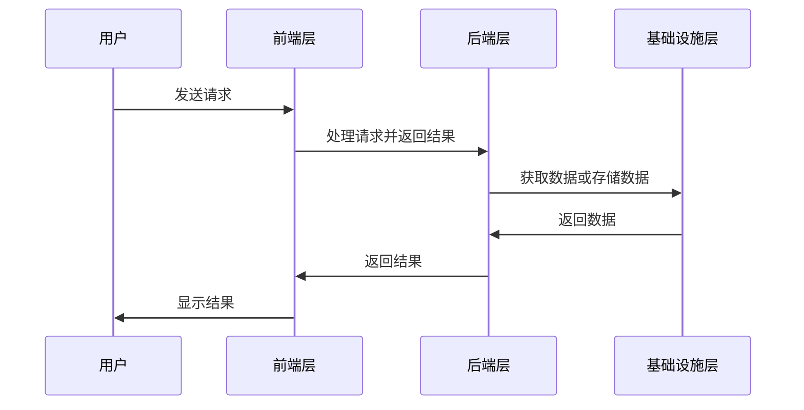
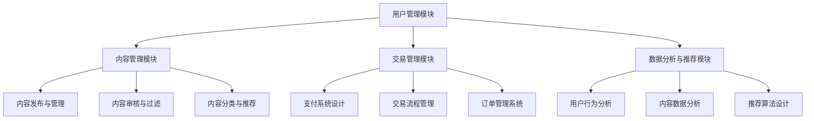
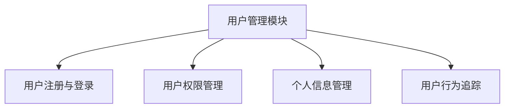
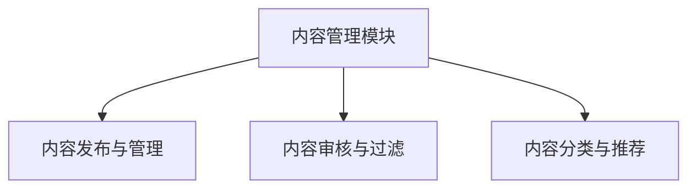
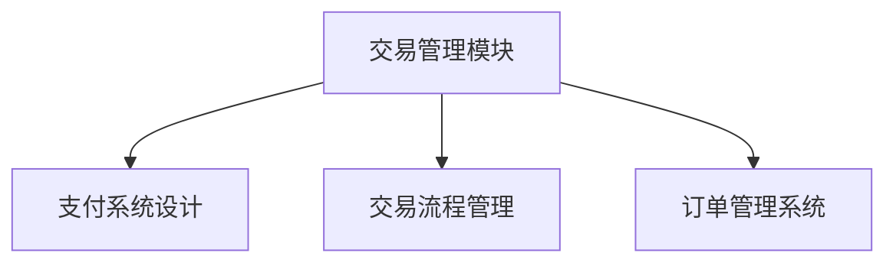
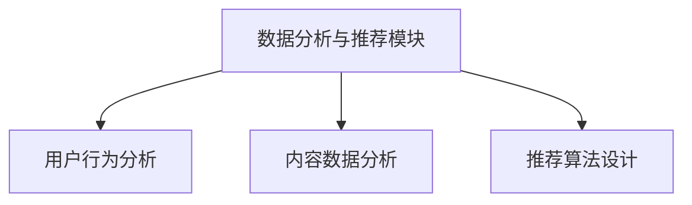

                 

# 《知识付费平台的技术架构设计》

## 关键词

知识付费、平台架构、技术栈、用户管理、内容管理、交易管理、数据分析与推荐

## 摘要

本文将深入探讨知识付费平台的技术架构设计，从概述、核心功能、技术架构、基础设施与性能优化、用户管理、内容管理、交易管理、数据分析与推荐系统设计，再到项目实战与案例分析，全面解析知识付费平台的技术实现细节。本文旨在为开发者提供一个系统、详细的知识付费平台技术架构设计指南。

## 目录大纲

### 第一部分：知识付费平台概述

#### 第1章：知识付费平台简介

1.1 知识付费的发展历程

1.2 知识付费的市场现状

1.3 知识付费平台的类型

#### 第2章：知识付费平台的核心功能

2.1 用户管理

2.2 内容管理

2.3 交易管理

2.4 数据分析与推荐

### 第二部分：知识付费平台的技术架构

#### 第3章：技术架构概述

3.1 系统架构设计原则

3.2 系统架构的分层

#### 第4章：基础设施与性能优化

4.1 基础设施选择

4.2 数据存储设计

4.3 性能优化策略

#### 第5章：用户管理模块设计

5.1 用户注册与登录

5.2 用户权限管理

5.3 用户行为追踪

#### 第6章：内容管理模块设计

6.1 内容发布与管理

6.2 内容审核与过滤

6.3 内容推荐系统

#### 第7章：交易管理模块设计

7.1 支付系统设计

7.2 交易流程管理

7.3 订单管理系统

#### 第8章：数据分析与推荐系统设计

8.1 数据收集与处理

8.2 用户行为分析

8.3 推荐算法设计

### 第三部分：项目实战与案例分析

#### 第9章：知识付费平台项目实战

9.1 项目需求分析

9.2 技术选型与架构设计

9.3 系统开发与测试

9.4 项目部署与运维

#### 第10章：案例分析

10.1 某知名知识付费平台案例分析

10.2 案例总结与启示

## 附录

### 附录A：技术栈与工具推荐

A.1 前端技术栈

A.2 后端技术栈

A.3 数据库技术栈

A.4 开发工具与平台推荐

### 附录B：参考文献

B.1 相关书籍推荐

B.2 学术论文推荐

B.3 技术博客推荐

### 附录C：知识付费平台架构图

C.1 知识付费平台架构图

C.2 用户管理模块架构图

C.3 内容管理模块架构图

C.4 交易管理模块架构图

C.5 数据分析与推荐模块架构图

接下来，我们将逐步深入探讨每个章节的核心内容，为读者提供一个完整的知识付费平台技术架构设计指南。

## 第一部分：知识付费平台概述

### 第1章：知识付费平台简介

知识付费平台是一种新兴的互联网服务模式，它允许用户通过支付一定费用来获取高质量的内容和服务。随着互联网技术的发展和人们对知识需求的增加，知识付费平台逐渐成为了互联网经济的重要组成部分。

#### 1.1 知识付费的发展历程

知识付费的发展历程可以追溯到20世纪末。当时，互联网的兴起使得信息传播变得更加便捷，人们可以通过互联网获取大量知识。然而，由于互联网上的信息质量参差不齐，用户开始对高质量的知识内容产生需求。这时，知识付费平台应运而生。

早期的知识付费平台主要以博客、电子书和在线课程等形式存在。随着移动互联网的普及，知识付费平台逐渐从PC端迁移到移动端，用户可以通过手机随时随地获取知识。

#### 1.2 知识付费的市场现状

目前，知识付费市场呈现出快速增长的趋势。根据市场研究机构的报告，全球知识付费市场规模已经达到数百亿美元，并且预计未来将继续保持高速增长。

在中国市场，知识付费已经成为一个热门话题。随着移动互联网的普及和用户消费习惯的改变，越来越多的用户愿意为知识内容付费。此外，政策环境的优化和资本市场的关注也为知识付费市场的发展提供了有力支持。

#### 1.3 知识付费平台的类型

知识付费平台根据提供的服务类型可以分为多种类型，包括：

1. **在线课程平台**：如Coursera、Udemy等，提供各种学科的在线课程。

2. **知识问答平台**：如知乎Live、分答等，用户可以通过提问和回答获取知识。

3. **电子书平台**：如亚马逊Kindle、多看阅读等，提供电子书下载和阅读服务。

4. **专业知识平台**：如普林斯顿数学研究所、哈佛商业评论等，提供专业领域的研究报告、文章和书籍。

5. **技能培训平台**：如极客时间、腾讯课堂等，提供技能培训和职业发展服务。

### 小结

知识付费平台作为一种新兴的互联网服务模式，已经成为了互联网经济的重要组成部分。通过深入理解知识付费的发展历程、市场现状和平台类型，我们可以更好地把握知识付费平台的发展趋势，为未来的技术架构设计提供有力支持。

### 第2章：知识付费平台的核心功能

知识付费平台的核心功能是其核心竞争力所在，主要包括用户管理、内容管理、交易管理和数据分析与推荐。以下将分别介绍这些核心功能。

#### 2.1 用户管理

用户管理是知识付费平台的基础功能，包括用户注册、登录、权限管理、个人信息管理、用户行为追踪等。

1. **用户注册与登录**：用户可以通过手机号、邮箱、第三方账号等多种方式注册和登录知识付费平台。注册过程中需要用户填写基本信息，如姓名、性别、年龄、职业等，以便平台提供个性化的服务。

2. **用户权限管理**：知识付费平台需要对用户进行权限管理，根据用户的角色和权限设置不同的访问权限。例如，普通用户只能浏览和购买课程，而管理员用户则有权限管理课程、用户和订单等。

3. **个人信息管理**：用户可以在个人中心查看和管理个人信息，如修改密码、绑定手机号、邮箱等。

4. **用户行为追踪**：通过追踪用户的行为数据，知识付费平台可以了解用户的使用习惯和偏好，从而提供更加个性化的服务。

#### 2.2 内容管理

内容管理是知识付费平台的核心，包括内容发布、内容审核、内容分类和内容推荐。

1. **内容发布与管理**：内容创作者可以通过平台发布自己的课程、文章、问答等内容。平台需要提供内容编辑器、多媒体支持等功能，以便创作者方便地发布内容。

2. **内容审核与过滤**：为了保证内容的质量和合规性，知识付费平台需要对发布的内容进行审核和过滤。审核流程包括内容审核、标签审核和分类审核等。

3. **内容分类**：知识付费平台需要对内容进行分类，以便用户能够快速找到感兴趣的内容。常见的分类方式包括学科分类、级别分类、类型分类等。

4. **内容推荐**：通过分析用户的行为数据、兴趣标签和内容标签，知识付费平台可以提供个性化的内容推荐，提高用户的粘性和满意度。

#### 2.3 交易管理

交易管理是知识付费平台的盈利核心，包括支付系统设计、交易流程管理和订单管理系统。

1. **支付系统设计**：知识付费平台需要集成多种支付方式，如支付宝、微信支付、银行卡支付等，以便用户方便地完成支付。

2. **交易流程管理**：交易流程管理包括订单创建、支付、发货、确认收货等环节。平台需要确保交易流程的顺畅，提高用户购物体验。

3. **订单管理系统**：订单管理系统用于管理用户订单，包括订单查询、订单状态更新、订单退款等操作。

#### 2.4 数据分析与推荐

数据分析和推荐是知识付费平台提高用户满意度和平台盈利能力的重要手段，包括用户行为分析、内容分析和推荐算法设计。

1. **用户行为分析**：通过分析用户的行为数据，如浏览记录、购买记录、互动记录等，知识付费平台可以了解用户的需求和偏好，从而提供个性化的服务。

2. **内容分析**：通过分析内容的数据，如阅读量、点赞量、评论量等，知识付费平台可以评估内容的质量和受欢迎程度，从而优化内容策略。

3. **推荐算法设计**：推荐算法是知识付费平台的核心技术，通过分析用户行为和内容数据，推荐用户感兴趣的内容，提高用户的粘性和满意度。

### 小结

知识付费平台的核心功能包括用户管理、内容管理、交易管理和数据分析与推荐。通过深入理解这些核心功能，我们可以更好地设计知识付费平台的技术架构，为用户提供优质的服务。

### 第二部分：知识付费平台的技术架构

#### 第3章：技术架构概述

知识付费平台的技术架构设计需要遵循一定的原则，并采用分层架构以实现系统的可扩展性和可维护性。以下将详细介绍技术架构的设计原则和分层架构。

#### 3.1 系统架构设计原则

1. **模块化**：将系统拆分为多个模块，每个模块负责不同的功能，实现模块间的松耦合，便于系统的开发和维护。

2. **可扩展性**：设计时需要考虑系统的可扩展性，以便在未来能够轻松地添加新功能或扩展现有功能。

3. **高可用性**：确保系统在出现故障时能够快速恢复，提供稳定的服务。

4. **安全性**：保护用户数据和交易安全，防止数据泄露和恶意攻击。

5. **高性能**：设计高效的系统架构，确保系统在处理大量用户请求时仍能保持良好的性能。

#### 3.2 系统架构的分层

知识付费平台通常采用分层架构，包括前端层、后端层和基础设施层。

1. **前端层**：负责用户界面的展示和用户交互，包括Web前端和移动应用。

2. **后端层**：负责业务逻辑处理和数据管理，包括应用层、业务逻辑层和数据层。

3. **基础设施层**：负责硬件设备、网络和存储等基础设施的建设和维护。

以下是知识付费平台的典型架构图：

#### 3.2.1 前端层

前端层通常包括Web前端和移动应用。Web前端负责处理用户在浏览器中的交互，使用HTML、CSS和JavaScript等前端技术实现。移动应用则使用原生开发或跨平台开发框架，如React Native、Flutter等，以提供更好的用户体验。

前端层的核心功能包括：

- 用户身份验证和权限管理
- 用户界面展示和交互
- 请求发送和响应处理
- 数据获取和更新

#### 3.2.2 后端层

后端层是知识付费平台的核心，负责业务逻辑处理和数据管理。后端层通常包括应用层、业务逻辑层和数据层。

- **应用层**：处理客户端的请求，进行身份验证和权限校验，调用业务逻辑层和数据层的方法，返回结果。
- **业务逻辑层**：实现具体的业务逻辑，如用户管理、内容管理、交易管理等。
- **数据层**：负责数据的存储和查询，通常使用关系型数据库或NoSQL数据库。

后端层的核心功能包括：

- 用户管理：包括用户注册、登录、个人信息管理、权限管理等。
- 内容管理：包括内容发布、内容审核、内容分类、内容推荐等。
- 交易管理：包括支付系统设计、交易流程管理、订单管理系统等。
- 数据分析与推荐：包括用户行为分析、内容分析、推荐算法设计等。

#### 3.2.3 基础设施层

基础设施层负责硬件设备、网络和存储等基础设施的建设和维护。基础设施层的核心功能包括：

- 硬件设备管理：包括服务器、存储设备、网络设备等的管理和维护。
- 网络架构设计：包括负载均衡、容灾备份、安全防护等。
- 数据存储设计：包括关系型数据库、NoSQL数据库、缓存系统等的设计和优化。

### 小结

知识付费平台的技术架构设计需要遵循模块化、可扩展性、高可用性、安全性和高性能等原则，并采用分层架构以实现系统的可扩展性和可维护性。通过深入理解系统架构的设计原则和分层架构，我们可以为知识付费平台提供稳定、高效和可靠的技术支持。

### 第4章：基础设施与性能优化

在知识付费平台的技术架构设计中，基础设施的选择和性能优化是至关重要的环节。正确的基础设施选择和性能优化策略不仅可以确保平台的稳定性和可靠性，还可以提升用户体验和平台的竞争力。

#### 4.1 基础设施选择

基础设施的选择直接影响到知识付费平台的性能、可扩展性和成本。以下是一些关键的基础设施选择因素：

1. **服务器选择**：
   - **物理服务器**：物理服务器具有更高的性能和稳定性，适合处理大量数据和高并发的业务场景。
   - **云服务器**：云服务器具有弹性扩展、低成本和高可用的优势，适合初创公司和中小型平台。

2. **网络架构**：
   - **负载均衡**：通过负载均衡器（如Nginx、HAProxy）实现流量分发，确保平台在高并发情况下稳定运行。
   - **CDN**：使用内容分发网络（如阿里云CDN、腾讯云CDN）加速静态资源的加载，提高用户体验。

3. **存储方案**：
   - **关系型数据库**：如MySQL、PostgreSQL，适合存储结构化数据，具有较好的查询性能和事务支持。
   - **NoSQL数据库**：如MongoDB、Redis，适合存储非结构化数据和高频缓存，具有更高的读写性能。

4. **缓存系统**：
   - **分布式缓存**：如Memcached、Redis，用于缓存高频访问的数据，减少数据库的压力，提升系统响应速度。

#### 4.2 数据存储设计

数据存储设计是知识付费平台基础设施的核心部分，合理的存储设计可以大幅提升系统性能。以下是一些数据存储设计的关键点：

1. **数据分片**：通过数据分片将数据分布到多个数据库实例，实现数据的水平扩展，提高系统的并发处理能力。

2. **读写分离**：通过主从复制将读操作和写操作分离，主数据库负责处理写操作，从数据库负责处理读操作，提高系统的读写性能。

3. **索引设计**：合理设计索引可以提高查询效率，减少数据库的查询时间。

4. **缓存策略**：通过缓存策略减少对数据库的访问频率，如LRU缓存算法、Redis缓存等。

#### 4.3 性能优化策略

性能优化策略旨在提升知识付费平台的响应速度和处理能力，以下是一些常见的性能优化策略：

1. **数据库优化**：
   - **查询优化**：通过优化SQL语句、索引设计和查询缓存等手段提高数据库查询效率。
   - **分库分表**：将大数据量拆分为小数据量，减少单表的数据量和查询压力。

2. **缓存优化**：
   - **缓存分层**：根据数据的重要性和访问频率，设计不同层次的缓存系统，如内存缓存、磁盘缓存等。
   - **缓存预热**：在用户访问高峰期前预热缓存，减少缓存失效对性能的影响。

3. **静态资源优化**：
   - **静态资源压缩**：使用Gzip压缩静态资源，减少网络传输的数据量。
   - **CDN加速**：使用CDN分发静态资源，提高用户访问速度。

4. **负载均衡**：
   - **反向代理**：使用反向代理服务器（如Nginx）进行负载均衡，提高平台的并发处理能力。
   - **动态调整**：根据系统的负载情况动态调整负载均衡策略，如基于CPU利用率、连接数等指标。

5. **代码优化**：
   - **异步处理**：使用异步编程减少同步IO操作，提高系统的并发处理能力。
   - **代码压缩**：使用代码压缩工具（如UglifyJS、Gzip）减少代码体积，提高加载速度。

### 小结

基础设施与性能优化是知识付费平台技术架构设计的关键部分。正确的基础设施选择和性能优化策略可以提升平台的稳定性和性能，为用户提供更好的体验。通过合理的数据存储设计和多种性能优化策略，我们可以确保知识付费平台在高并发和大量数据的情况下依然能够高效运行。

### 第5章：用户管理模块设计

用户管理模块是知识付费平台的核心模块之一，它负责用户注册、登录、权限管理、个人信息管理以及用户行为追踪等功能。以下是用户管理模块的详细设计。

#### 5.1 用户注册与登录

用户注册与登录是用户与平台交互的入口，需要保证安全性和便捷性。

1. **注册流程**：
   - 用户可以选择使用手机号、邮箱或第三方账号（如微信、QQ、微博等）进行注册。
   - 注册时，用户需要填写基本信息，如用户名、密码、手机号、邮箱等。
   - 为了确保用户身份的真实性，可以采用手机验证码或邮箱验证码进行验证。
   - 注册成功后，系统会发送一封确认邮件或短信，用户点击确认链接后完成注册。

2. **登录流程**：
   - 用户可以通过输入用户名和密码进行登录，或者使用第三方账号快速登录。
   - 系统会验证用户名和密码（或第三方账号）的正确性，登录成功后生成用户会话。
   - 为了提高安全性，可以采用HTTPS协议和SSL证书确保数据传输安全。

3. **用户状态管理**：
   - 系统需要管理用户的状态，如登录状态、在线状态、活跃状态等。
   - 可以使用Redis等分布式缓存系统来存储用户状态信息，实现高并发下的快速访问。

#### 5.2 用户权限管理

用户权限管理是确保平台安全性和功能访问控制的重要环节。

1. **角色与权限**：
   - 根据用户角色（如普通用户、管理员、内容创作者等）分配不同的权限。
   - 权限可以分为查看、编辑、删除等操作权限，以及数据访问权限。

2. **权限控制策略**：
   - 使用基于角色的访问控制（RBAC）模型，根据用户的角色和权限进行访问控制。
   - 在后端接口设计中，加入权限校验逻辑，确保用户只能访问自己有权访问的功能和数据。

3. **权限分配与修改**：
   - 管理员可以通过后台系统对用户的权限进行分配和修改。
   - 权限分配和修改需要经过严格的审核流程，防止权限滥用。

#### 5.3 用户个人信息管理

用户个人信息管理是用户在平台上的个性化需求之一。

1. **个人信息查看与编辑**：
   - 用户可以在个人中心查看和编辑个人信息，如姓名、性别、生日、地址等。
   - 修改个人信息时，需要经过身份验证，确保修改操作的合法性。

2. **头像与背景图片**：
   - 用户可以上传和更换个人头像和背景图片，提升用户体验。
   - 图片存储可以使用云存储服务，如阿里云OSS或腾讯云COS，以提高存储性能和安全性。

3. **隐私设置**：
   - 用户可以设置个人隐私，如是否公开个人信息、是否允许他人查看联系方式等。
   - 隐私设置需要提供详细的说明和操作指南，确保用户了解隐私设置的具体影响。

#### 5.4 用户行为追踪

用户行为追踪是数据分析与个性化推荐的重要数据来源。

1. **行为数据收集**：
   - 收集用户在平台上的行为数据，如浏览记录、购买记录、互动记录等。
   - 行为数据可以通过日志系统（如ELK）进行收集和存储，方便后续的数据分析和处理。

2. **数据分析与挖掘**：
   - 对用户行为数据进行分析，挖掘用户兴趣和行为模式。
   - 可以使用机器学习算法（如协同过滤、基于内容的推荐等）进行用户行为预测和推荐。

3. **个性化推荐**：
   - 根据用户行为数据和兴趣标签，提供个性化的内容推荐和活动推送。
   - 个性化推荐需要平衡用户兴趣和内容质量，确保推荐的准确性和用户体验。

### 小结

用户管理模块是知识付费平台的核心功能之一，涉及用户注册与登录、权限管理、个人信息管理和用户行为追踪等方面。通过详细的设计和优化，可以确保平台在安全性、便捷性和个性化服务方面具备良好的用户体验和竞争力。

### 第6章：内容管理模块设计

内容管理模块是知识付费平台的核心模块之一，负责内容发布、内容审核、内容分类和内容推荐等功能。以下是内容管理模块的详细设计。

#### 6.1 内容发布与管理

内容发布与管理是内容创作者与平台交互的重要环节。

1. **内容发布流程**：
   - 内容创作者可以通过平台提供的编辑器创建和发布内容，如文章、视频、音频等。
   - 发布内容时，需要填写必要的元数据，如标题、摘要、标签、分类等。
   - 平台需要对发布的内容进行审核，确保内容的合法性和质量。

2. **内容管理**：
   - 内容创作者可以查看、编辑和删除自己发布的内容。
   - 平台管理员可以对内容进行批量管理，如批量发布、批量下线、批量修改等。
   - 内容审核人员需要对发布的内容进行审核，包括内容真实性、合法性、合规性等方面的审核。

3. **内容版本管理**：
   - 平台需要实现内容版本管理，支持内容的历史版本查看和回滚。
   - 版本管理可以帮助内容创作者找回误删的内容，也可以方便平台管理员进行内容追溯和问题排查。

#### 6.2 内容审核与过滤

内容审核与过滤是确保平台内容质量的重要手段。

1. **内容审核策略**：
   - 平台需要制定内容审核策略，明确审核标准、审核流程和审核人员职责。
   - 审核标准应包括内容真实性、合法性、合规性、质量标准等方面的要求。
   - 审核流程应包括初步审核、深度审核和复审核等环节。

2. **内容过滤机制**：
   - 使用关键词过滤、机器学习算法等手段，对发布的内容进行实时监控和过滤。
   - 关键词过滤可以识别敏感词和违规内容，机器学习算法可以基于历史数据和用户反馈进行内容分类和识别。

3. **用户举报机制**：
   - 提供用户举报功能，用户可以举报不良内容和违规行为。
   - 平台需要建立举报处理机制，对用户的举报进行及时处理和反馈。

#### 6.3 内容分类

内容分类是帮助用户快速找到感兴趣内容的重要手段。

1. **分类策略**：
   - 根据内容的主题、类型、受众等因素进行分类，提供多种分类方式，如学科分类、级别分类、类型分类等。
   - 分类策略应具备灵活性和可扩展性，以适应不同类型的内容。

2. **标签管理**：
   - 为每个内容添加标签，方便用户通过标签查找内容。
   - 标签管理应具备自动化和人工干预相结合的能力，确保标签的准确性和一致性。

3. **智能推荐**：
   - 通过用户行为数据和内容标签，提供智能推荐功能，帮助用户发现更多感兴趣的内容。
   - 智能推荐算法可以基于协同过滤、基于内容的推荐等算法实现。

#### 6.4 内容推荐系统

内容推荐系统是提升用户粘性和活跃度的重要手段。

1. **推荐算法设计**：
   - 根据用户的行为数据、内容标签和平台策略，设计推荐算法，为用户推荐感兴趣的内容。
   - 可以结合协同过滤、基于内容的推荐、混合推荐等算法，提高推荐的准确性和多样性。

2. **推荐策略**：
   - 根据用户的行为和兴趣，动态调整推荐策略，提高推荐内容的针对性和用户体验。
   - 可以设置推荐频次、推荐顺序、推荐内容多样性等策略，优化推荐效果。

3. **推荐效果评估**：
   - 对推荐效果进行实时监控和评估，通过用户点击率、转化率等指标分析推荐效果。
   - 根据评估结果，优化推荐算法和推荐策略，提升推荐系统的效果。

### 小结

内容管理模块是知识付费平台的核心功能之一，涉及内容发布与管理、内容审核与过滤、内容分类和内容推荐等方面。通过详细的设计和优化，可以确保平台在内容质量、用户体验和推荐效果方面具备良好的表现，提升平台的竞争力和用户满意度。

### 第7章：交易管理模块设计

交易管理模块是知识付费平台实现盈利的核心部分，涵盖了支付系统设计、交易流程管理和订单管理系统等多个方面。以下是交易管理模块的详细设计。

#### 7.1 支付系统设计

支付系统设计是实现用户购买内容的关键环节，需要保证支付的安全性、便捷性和可靠性。

1. **支付渠道集成**：
   - 集成多种支付方式，如支付宝、微信支付、银联支付、信用卡支付等，以满足不同用户的需求。
   - 通过支付网关（如支付宝开放平台、微信支付API）与支付渠道进行对接，实现支付功能。

2. **支付流程**：
   - 用户选择购买内容后，进入支付页面，选择支付方式并输入支付密码或确认支付。
   - 支付请求通过支付网关发送到支付渠道，支付渠道验证支付密码或进行其他支付验证。
   - 支付成功后，支付渠道返回支付结果，系统更新订单状态并通知用户。

3. **支付安全性**：
   - 使用HTTPS协议和SSL证书确保支付数据传输的安全性。
   - 对支付敏感信息进行加密存储，防止数据泄露。
   - 定期进行安全审计和漏洞扫描，确保支付系统的安全性。

#### 7.2 交易流程管理

交易流程管理涉及订单的创建、支付、发货、确认收货等环节，需要确保交易流程的顺畅和用户体验。

1. **订单创建**：
   - 用户在购买内容时，系统自动生成订单，记录订单详情，如购买内容、购买价格、购买时间等。
   - 订单创建后，系统向用户发送订单确认邮件或短信，告知用户订单详情。

2. **支付确认**：
   - 用户完成支付后，系统更新订单状态为“支付成功”，并生成支付凭证。
   - 系统记录支付时间、支付金额、支付方式等信息，以便后续查询和统计。

3. **发货管理**：
   - 对于实体商品，平台需要与物流公司合作，进行发货操作。
   - 系统生成发货单，记录发货时间、物流单号等信息，并发送给用户。
   - 用户可以通过平台查询发货状态和物流信息。

4. **确认收货**：
   - 用户收到商品后，可以通过平台确认收货，系统更新订单状态为“完成”。
   - 平台可以生成订单报告，记录订单的完成情况，以便后续分析和改进。

#### 7.3 订单管理系统

订单管理系统是交易管理模块的核心，负责订单的创建、查询、修改、删除等操作。

1. **订单查询**：
   - 用户可以在个人中心查询自己的订单记录，包括订单状态、购买内容、购买价格、支付时间等信息。
   - 平台管理员可以查询所有订单，进行订单分析和统计。

2. **订单修改**：
   - 用户可以对订单进行修改操作，如修改收货地址、修改购买数量等。
   - 订单修改后，系统需要更新订单状态和相关数据。

3. **订单删除**：
   - 用户可以删除订单记录，系统需要确保删除操作的合法性和安全性。
   - 平台管理员可以进行订单删除操作，用于处理异常订单和退款等情况。

4. **订单统计与分析**：
   - 系统需要对订单数据进行统计和分析，生成订单报告，包括订单数量、销售额、退款率等指标。
   - 平台可以根据分析结果，优化交易流程和营销策略，提高平台的盈利能力和用户体验。

### 小结

交易管理模块是知识付费平台实现盈利的核心，涉及支付系统设计、交易流程管理和订单管理系统等多个方面。通过详细的设计和优化，可以确保交易流程的顺畅和用户体验，提升平台的盈利能力和用户满意度。

### 第8章：数据分析与推荐系统设计

数据分析与推荐系统设计是知识付费平台提升用户体验和盈利能力的重要手段。通过深入分析用户行为和内容数据，可以为用户提供个性化推荐，提高用户粘性和活跃度。以下是数据分析与推荐系统设计的详细说明。

#### 8.1 数据收集与处理

数据收集与处理是构建推荐系统的第一步，确保数据的准确性和完整性。

1. **用户行为数据**：
   - 收集用户在平台上的行为数据，包括浏览记录、搜索记录、点赞记录、评论记录、分享记录等。
   - 数据可以存储在日志文件中，也可以使用消息队列（如Kafka）进行实时收集和传输。

2. **内容数据**：
   - 收集平台上的内容数据，包括文章、视频、音频、课程等，包括标题、摘要、标签、分类、发布时间等。
   - 内容数据可以存储在关系型数据库（如MySQL）或NoSQL数据库（如MongoDB）中。

3. **数据处理**：
   - 对收集到的数据进行分析和清洗，去除重复、错误和缺失的数据。
   - 使用ETL（提取、转换、加载）工具，将数据转换为适合分析的形式，并存储在数据仓库中。

4. **数据存储**：
   - 使用分布式存储系统（如Hadoop、HBase）存储大规模数据，确保数据的安全性和可靠性。
   - 使用数据库索引和分区策略，提高数据查询和访问效率。

#### 8.2 用户行为分析

用户行为分析是了解用户需求和行为模式的重要手段，为个性化推荐提供数据支持。

1. **用户画像**：
   - 构建用户画像，包括用户的基本信息（如年龄、性别、职业等）、行为特征（如浏览习惯、购买偏好等）。
   - 用户画像可以帮助平台了解用户的特征和需求，为推荐算法提供输入。

2. **行为轨迹**：
   - 分析用户在平台上的行为轨迹，包括浏览路径、点击路径、购买路径等。
   - 通过行为轨迹分析，可以了解用户的兴趣和偏好，为推荐算法提供参考。

3. **行为预测**：
   - 使用机器学习算法（如回归分析、分类算法、聚类算法等）预测用户的行为和需求。
   - 通过行为预测，可以提前了解用户的兴趣变化，优化推荐策略。

#### 8.3 推荐算法设计

推荐算法设计是数据分析与推荐系统的核心，决定推荐结果的准确性和多样性。

1. **基于内容的推荐**：
   - 根据用户对内容的评价、浏览记录、收藏记录等，为用户推荐相似的内容。
   - 基于内容的推荐算法可以通过计算内容相似度（如TF-IDF、余弦相似度等）来实现。

2. **基于协同过滤的推荐**：
   - 通过分析用户之间的行为关系，为用户推荐其他用户喜欢的相似内容。
   - 协同过滤分为用户基于的协同过滤和基于项目的协同过滤，可以根据实际情况选择合适的算法。

3. **混合推荐**：
   - 结合基于内容的推荐和基于协同过滤的推荐，为用户推荐更准确、多样化的内容。
   - 混合推荐可以通过加权融合或模型集成等方法实现，提高推荐效果。

4. **推荐策略**：
   - 根据用户行为、内容特征和平台策略，动态调整推荐策略。
   - 可以设置推荐频次、推荐顺序、推荐内容多样性等策略，优化推荐效果。

#### 8.4 推荐效果评估

推荐效果评估是确保推荐系统有效性和持续改进的重要环节。

1. **评估指标**：
   - 设置评估指标，如点击率、转化率、用户满意度等，用于衡量推荐效果。
   - 可以使用A/B测试等方法，对比不同推荐算法和策略的效果。

2. **用户反馈**：
   - 收集用户对推荐内容的反馈，如点击、收藏、购买等行为。
   - 通过用户反馈，可以了解推荐效果，优化推荐算法和策略。

3. **持续优化**：
   - 根据评估结果和用户反馈，不断优化推荐算法和策略。
   - 可以使用机器学习算法的迭代和优化方法，提高推荐效果。

### 小结

数据分析与推荐系统设计是知识付费平台提升用户体验和盈利能力的关键。通过详细的数据收集与处理、用户行为分析、推荐算法设计和推荐效果评估，可以构建一个高效、准确的推荐系统，为用户提供个性化的内容和服务，提高用户满意度和平台竞争力。

### 第9章：知识付费平台项目实战

在本文的最后，我们将通过一个实际项目来展示知识付费平台的技术实现细节。这个项目将包括需求分析、技术选型与架构设计、系统开发与测试、项目部署与运维等环节。

#### 9.1 项目需求分析

我们的知识付费平台项目目标是提供一个高效、稳定和用户体验良好的在线学习平台。以下是项目的主要需求：

1. **用户功能**：
   - 用户注册、登录、个人信息管理、权限管理、用户行为追踪。
   - 用户可以在平台上浏览、搜索、购买和评价课程。
   - 用户可以参与课程讨论和互动。

2. **内容功能**：
   - 内容发布、内容审核、内容分类、内容推荐。
   - 内容创作者可以上传、编辑和管理自己的内容。
   - 管理员可以进行内容审核和管理。

3. **交易功能**：
   - 支付系统设计、交易流程管理、订单管理系统。
   - 支持多种支付方式，如支付宝、微信支付等。
   - 系统提供订单查询、退款等功能。

4. **数据分析与推荐**：
   - 用户行为数据分析、内容数据分析、个性化推荐。
   - 通过数据分析，优化平台内容和推荐策略。

#### 9.2 技术选型与架构设计

根据项目需求，我们选择以下技术栈和架构设计：

1. **前端技术栈**：
   - 使用React框架构建Web前端，实现用户界面的展示和交互。
   - 使用Ant Design组件库，提高界面开发效率。

2. **后端技术栈**：
   - 使用Spring Boot框架构建后端服务，实现业务逻辑处理和数据管理。
   - 使用MyBatis框架与MySQL数据库进行数据交互。

3. **基础设施**：
   - 使用阿里云服务器进行服务器部署。
   - 使用Nginx进行负载均衡和反向代理。
   - 使用Redis进行缓存和会话管理。

4. **数据存储**：
   - 使用MySQL数据库存储用户数据、内容数据、订单数据等。
   - 使用MongoDB数据库存储用户行为数据、推荐数据等。

5. **消息队列**：
   - 使用Kafka进行消息队列，实现实时数据传输和系统解耦。

6. **推荐系统**：
   - 使用基于内容的推荐算法和基于协同过滤的推荐算法。
   - 使用Spring Data Redis实现推荐算法的缓存和更新。

以下是知识付费平台的架构图：

#### 9.3 系统开发与测试

系统开发与测试是项目实现的关键环节，以下是开发与测试的主要步骤：

1. **需求分析与设计**：
   - 根据项目需求，进行详细的需求分析和系统设计。
   - 设计用户管理、内容管理、交易管理、数据分析与推荐等模块的接口和数据库表结构。

2. **前端开发**：
   - 使用React框架和Ant Design组件库，实现用户界面的展示和交互。
   - 完成用户注册、登录、个人信息管理、课程浏览、购买等页面的开发。

3. **后端开发**：
   - 使用Spring Boot框架，实现业务逻辑处理和数据管理。
   - 完成用户管理、内容管理、交易管理、数据分析与推荐等模块的后端服务开发。

4. **数据库设计与优化**：
   - 设计MySQL和MongoDB的数据库表结构，优化查询性能。
   - 实现数据库的备份和恢复策略。

5. **测试与调试**：
   - 使用JUnit和Mockito进行单元测试，确保代码质量。
   - 进行集成测试和系统测试，验证系统功能和性能。
   - 修复测试中发现的bug和性能问题。

#### 9.4 项目部署与运维

项目部署与运维是确保知识付费平台稳定运行的关键，以下是部署与运维的主要步骤：

1. **服务器部署**：
   - 在阿里云服务器上部署应用服务器、数据库服务器和消息队列服务器。
   - 使用Docker容器化技术，方便服务器部署和运维。

2. **配置管理**：
   - 使用Ansible或Chef等配置管理工具，自动化部署和配置服务器。
   - 确保服务器配置的一致性和安全性。

3. **持续集成与持续部署**：
   - 使用Jenkins等持续集成和持续部署工具，实现代码的自动化构建、测试和部署。
   - 确保代码质量和部署效率。

4. **监控与报警**：
   - 使用Prometheus和Grafana等监控工具，实时监控服务器性能和系统状态。
   - 设置报警机制，及时发现和处理系统异常。

5. **日志管理**：
   - 使用ELK（Elasticsearch、Logstash、Kibana）日志管理系统，收集、存储和展示系统日志。
   - 通过日志分析，排查问题并优化系统性能。

6. **备份与恢复**：
   - 定期备份数据库和系统配置，确保数据的安全性和系统的可用性。
   - 在出现数据丢失或系统故障时，快速进行数据恢复和系统恢复。

### 小结

通过以上项目实战，我们详细展示了知识付费平台的技术实现细节。从需求分析、技术选型与架构设计，到系统开发与测试，再到项目部署与运维，每个环节都至关重要。通过这个实际项目，我们可以更好地理解知识付费平台的技术架构设计，为后续的实践和优化提供参考。

### 第10章：案例分析

在本章节中，我们将分析一个知名的知识付费平台——得到App，探讨其技术架构、功能设计、用户体验以及运营策略等方面，并通过案例总结与启示，为其他知识付费平台的未来发展提供借鉴。

#### 10.1 某知名知识付费平台案例分析

得到App是由罗辑思维团队推出的一个知识付费平台，以其高质量的内容和独特的运营模式赢得了大量用户的喜爱。以下是得到App的一些关键特点：

1. **内容特色**：
   - 得到App的内容主要涉及商业、经济、人文、科技等领域，注重深度和实用性。
   - 平台拥有大量知名作者和行业专家，内容质量有保障。

2. **技术架构**：
   - 得到App采用前后端分离的架构，前端使用React框架，后端使用Spring Boot框架。
   - 平台采用分布式部署，确保高可用性和高性能。

3. **功能设计**：
   - 得到App提供丰富的功能，包括课程购买、课程学习、笔记记录、互动交流等。
   - 平台设有推荐系统，根据用户行为和兴趣为用户推荐课程。

4. **用户体验**：
   - 得到App的界面设计简洁美观，用户操作便捷。
   - 平台提供多种支付方式，支持音频、视频、图文等多种内容形式。

5. **运营策略**：
   - 得到App注重用户互动，设有问答社区，鼓励用户参与讨论。
   - 平台定期举办线下活动，增加用户粘性。

#### 10.2 案例总结与启示

通过对得到App的分析，我们可以总结出以下启示：

1. **内容质量是关键**：
   - 知识付费平台的核心在于内容，高质量的内容是吸引和留住用户的根本。

2. **技术架构要稳定**：
   - 分布式架构和前后端分离可以提高系统的性能和可靠性，适应高并发和大数据量的需求。

3. **功能设计要丰富**：
   - 除了基础的学习功能，知识付费平台还可以提供笔记记录、互动交流等增值服务，提升用户体验。

4. **用户体验要优先**：
   - 界面简洁、操作便捷、内容丰富是提升用户体验的关键。

5. **运营策略要灵活**：
   - 通过线上互动和线下活动，可以增强用户粘性，提高用户满意度。

6. **数据分析与推荐要精准**：
   - 利用大数据和机器学习技术，为用户提供个性化推荐，提高用户活跃度和留存率。

### 小结

通过分析得到App的案例，我们可以看到知识付费平台在内容质量、技术架构、功能设计、用户体验和运营策略等方面的重要性。这些经验和启示可以为其他知识付费平台的发展提供宝贵的参考和指导。

### 附录A：技术栈与工具推荐

#### A.1 前端技术栈

1. **框架与库**：
   - **React**：用于构建用户界面，具有组件化、高效性和灵活性。
   - **Vue.js**：另一种流行的前端框架，轻量级、易于上手。
   - **Angular**：由谷歌开发的框架，适用于大型单页面应用。

2. **UI库**：
   - **Ant Design**：阿里巴巴出品的设计系统，支持React、Vue.js和Angular。
   - **Material-UI**：基于Material Design的React组件库。

3. **状态管理**：
   - **Redux**：用于React的状态管理，具有明确的单一数据源和不可变数据。
   - **Vuex**：Vue.js的状态管理库，实现类似Redux的功能。
   - **MobX**：React的状态管理库，提供响应式编程模型。

#### A.2 后端技术栈

1. **框架与库**：
   - **Spring Boot**：用于构建Java后端应用，具备快速开发和自动化配置。
   - **Django**：用于构建Python后端应用，提供快速开发和丰富的功能。
   - **Express**：用于构建Node.js后端应用，轻量级、灵活。

2. **数据库**：
   - **MySQL**：关系型数据库，适合存储结构化数据。
   - **MongoDB**：NoSQL数据库，适合存储非结构化数据和进行快速查询。
   - **Redis**：内存缓存数据库，用于缓存高频访问的数据。

3. **消息队列**：
   - **Kafka**：分布式消息队列系统，支持高吞吐量和实时数据处理。
   - **RabbitMQ**：基于AMQP协议的消息队列服务器，适用于各种应用场景。

#### A.3 数据库技术栈

1. **关系型数据库**：
   - **MySQL**：广泛使用的开源关系型数据库，具有高性能和可靠性。
   - **PostgreSQL**：功能丰富的开源关系型数据库，适用于复杂查询和数据一致性要求高的情况。

2. **NoSQL数据库**：
   - **MongoDB**：文档型数据库，适用于大量非结构化数据存储和快速查询。
   - **Redis**：基于内存的键值数据库，适用于缓存和实时数据处理。

3. **缓存系统**：
   - **Memcached**：高性能分布式缓存系统，适用于缓存高频访问的数据。
   - **EhCache**：Java开发的分布式缓存框架，支持多种缓存策略。

#### A.4 开发工具与平台推荐

1. **集成开发环境（IDE）**：
   - **IntelliJ IDEA**：强大的Java和Python IDE，支持多种编程语言。
   - **Visual Studio Code**：跨平台轻量级IDE，支持多种编程语言和插件。

2. **代码管理**：
   - **Git**：版本控制系统，支持分布式开发和管理。
   - **GitHub**：基于Git的代码托管平台，提供代码协作、代码审查和项目管理功能。

3. **持续集成/持续部署（CI/CD）**：
   - **Jenkins**：开源持续集成和持续部署工具，支持多种构建和部署流程。
   - **Docker**：容器化技术，用于简化应用部署和迁移。

4. **日志管理**：
   - **ELK Stack**：由Elasticsearch、Logstash和Kibana组成的日志管理平台，适用于日志收集、存储和分析。

### 小结

通过本附录，我们为知识付费平台的技术栈与工具推荐了前端、后端、数据库和开发工具等各个方面的优秀技术和工具，这些推荐可以帮助开发者构建高效、稳定和用户友好的知识付费平台。

### 附录B：参考文献

#### B.1 相关书籍推荐

1. **《大话数据挖掘》**：作者韩军，详细介绍了数据挖掘的基本概念、算法和应用。
2. **《深度学习》**：作者Ian Goodfellow等，深度学习领域的经典教材，适合初学者和进阶者。
3. **《软件架构设计：探索大型系统的架构风格与设计模式》**：作者John A. Sonmez，介绍了软件架构设计的原则和模式。

#### B.2 学术论文推荐

1. **《在线推荐算法综述》**：作者刘知远等，对在线推荐算法进行了全面综述，包括协同过滤、基于内容的推荐和混合推荐等。
2. **《大数据技术导论》**：作者唐杰等，介绍了大数据的基本概念、技术和应用，包括数据存储、数据处理和数据分析等。
3. **《云计算技术与应用》**：作者刘鹏等，详细介绍了云计算的基本概念、架构和技术，包括虚拟化、分布式存储和云计算平台等。

#### B.3 技术博客推荐

1. **《阿里云官方博客》**：提供了丰富的云计算、大数据和人工智能领域的文章和案例，适合技术爱好者学习和参考。
2. **《美团技术博客》**：分享了美团在餐饮、团购、外卖等业务场景中的技术实践和解决方案，涵盖了前端、后端、数据库等多个方面。
3. **《美团云技术博客》**：专注于云计算和大数据领域，提供了大量关于云计算架构、大数据处理、分布式系统等的技术文章。

### 小结

参考文献为读者提供了进一步学习知识付费平台技术架构设计的相关书籍、学术论文和技术博客资源，有助于深入理解相关知识并应用于实际项目开发中。

### 附录C：知识付费平台架构图

在本附录中，我们将展示知识付费平台的详细架构图，包括用户管理模块、内容管理模块、交易管理模块、数据分析与推荐模块等。

#### C.1 知识付费平台架构图

#### C.2 用户管理模块架构图

#### C.3 内容管理模块架构图

#### C.4 交易管理模块架构图

#### C.5 数据分析与推荐模块架构图

### 小结

通过附录中的架构图，读者可以更直观地理解知识付费平台的各个模块及其之间的关系，为实际项目开发提供参考。这些架构图涵盖了用户管理、内容管理、交易管理和数据分析与推荐等核心功能，为知识付费平台的技术架构设计提供了全面的指导。

