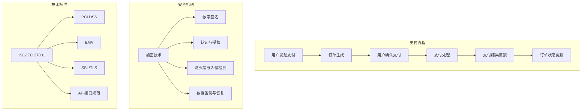

                 

### 文章标题

# 知识付费平台的支付系统集成与优化

> 关键词：知识付费、支付系统、系统集成、性能优化、安全性优化

> 摘要：本文深入探讨了知识付费平台支付系统的集成与优化。首先介绍了知识付费平台的发展背景和支付系统的重要性，然后详细解析了支付系统的基本原理与架构。接下来，文章讨论了支付系统在知识付费平台中的集成策略与方案，以及集成实施和优化步骤。最后，通过实际案例分析了支付系统的性能优化和安全性优化实践，为知识付费平台的支付系统建设提供了全面的技术指导。

### 第一部分：知识付费平台的支付系统集成与优化概述

#### 第1章：知识付费平台与支付系统的概述

##### 1.1 知识付费平台的背景与发展

知识付费，顾名思义，是指用户为获取有价值的知识内容而支付的费用。这一概念在近年来逐渐兴起，主要源于以下几个方面：

1. **移动互联网的普及**：随着智能手机和移动互联网的普及，人们获取信息的渠道越来越多样，不再局限于传统媒体，这为知识付费提供了广阔的市场空间。

2. **用户需求的变化**：在信息爆炸的时代，用户越来越注重个性化、专业化、深度化的知识获取，愿意为优质的内容付费。

3. **技术进步**：大数据、云计算、人工智能等技术的发展，使得知识付费平台能够更好地满足用户需求，提供个性化推荐、智能搜索等服务。

知识付费平台，即专门提供知识付费服务的在线平台，其主要模式包括：

1. **内容订阅**：用户订阅特定领域的知识服务，如在线课程、电子书、专栏等。

2. **单次购买**：用户为特定内容付费，如单篇博客、讲座视频等。

3. **会员制**：用户购买会员，享受平台提供的所有内容服务。

##### 1.2 支付系统的重要性

支付系统作为知识付费平台的核心组成部分，承担着为用户和知识提供者提供安全、高效、便捷的支付服务的重要任务。其重要性体现在以下几个方面：

1. **用户信任**：一个可靠的支付系统能够增强用户对平台的信任，降低交易风险，提高用户留存率。

2. **交易效率**：支付系统的高效运行能够提高交易速度，减少用户的等待时间，提升用户体验。

3. **资金安全**：支付系统必须确保交易资金的安全，防止资金泄露、盗刷等风险。

4. **平台发展**：支付系统是知识付费平台盈利的重要渠道，其优化和升级直接影响到平台的盈利能力和市场竞争力。

##### 1.3 支付系统在知识付费平台中的应用

支付系统在知识付费平台中的应用主要体现在以下几个方面：

1. **用户注册与登录**：用户在平台注册和登录时，需要通过支付系统完成身份验证。

2. **内容购买**：用户购买知识内容时，通过支付系统完成支付操作。

3. **订单管理**：支付系统负责管理订单，包括生成订单、更新订单状态、处理退款等。

4. **财务管理**：支付系统记录平台的交易数据，为财务管理提供数据支持。

5. **用户反馈**：支付系统可以收集用户支付体验的反馈，帮助平台改进服务。

##### 1.4 支付系统的关键要素

一个有效的支付系统需要具备以下几个关键要素：

1. **安全性**：支付系统必须确保交易数据的安全，采用加密、数字签名等技术保护用户信息和交易数据。

2. **可靠性**：支付系统需要保证高可用性和稳定性，确保交易能够及时完成。

3. **灵活性**：支付系统需要支持多种支付方式，如银行卡支付、移动支付、电子钱包等，满足不同用户的需求。

4. **可扩展性**：支付系统需要具备良好的扩展性，能够适应平台未来的发展需求，支持更多的交易场景和支付方式。

5. **用户体验**：支付系统需要设计简洁、易用，提供良好的用户体验，降低用户的学习成本。

### 第二部分：支付系统的基本原理与架构

#### 第2章：支付系统的基本原理与架构

##### 2.1 支付系统的基本原理

支付系统是指通过电子方式实现货币资金转移的系统，其主要功能是完成用户与商家之间的交易。支付系统的基本原理可以概括为以下步骤：

1. **用户发起支付**：用户在知识付费平台上选择需要购买的知识内容，点击“购买”按钮，系统生成支付订单。

2. **支付订单生成**：支付系统根据用户选择的知识内容和支付方式，生成支付订单，并将订单信息发送给用户。

3. **用户确认支付**：用户在确认支付订单信息无误后，点击“确认支付”按钮，系统跳转到支付页面。

4. **支付处理**：用户在支付页面选择支付方式，输入支付密码或验证码，支付系统接收用户支付指令，并开始处理支付请求。

5. **支付结果反馈**：支付系统与银行或第三方支付平台进行通信，确认支付成功后，将支付结果反馈给用户和平台。

6. **订单状态更新**：支付系统更新订单状态，标记为“支付成功”，知识付费平台可以开始提供知识内容服务。

##### 2.2 支付系统的安全机制

支付系统的安全性是保障交易顺利进行的关键，其安全机制主要包括以下几个方面：

1. **加密技术**：支付系统采用加密算法对交易数据进行加密，确保数据在传输过程中不被窃取或篡改。

2. **数字签名**：支付系统使用数字签名技术验证交易数据的真实性和完整性。

3. **认证与授权**：支付系统通过认证和授权机制确保只有合法用户和商家才能访问系统资源。

4. **防火墙与入侵检测**：支付系统部署防火墙和入侵检测系统，防止外部攻击和内部泄露。

5. **数据备份与恢复**：支付系统定期进行数据备份，并设置恢复机制，确保在数据丢失或损坏时能够快速恢复。

##### 2.3 支付系统的技术标准

支付系统需要遵循一系列技术标准，以确保系统的兼容性、安全性和可靠性。主要的技术标准包括：

1. **ISO/IEC 27001**：信息安全管理体系标准，用于指导支付系统的安全管理和风险控制。

2. **PCI DSS**：支付卡行业数据安全标准，确保支付系统的数据处理过程符合安全要求。

3. **EMV**：欧洲银行货币（Europay, MasterCard, Visa）标准，用于规范支付卡的使用和安全。

4. **SSL/TLS**：安全套接层/传输层安全协议，用于保护网络通信的安全性。

5. **API接口规范**：支付系统通常提供API接口供开发者调用，这些接口需要遵循统一的规范，以确保系统的互操作性。

##### 2.4 支付系统的架构设计

支付系统的架构设计决定了系统的性能、安全性和扩展性。一个典型的支付系统架构通常包括以下几个层次：

1. **表示层**：负责处理用户的交互，包括用户界面和Web前端。

2. **业务逻辑层**：处理支付业务逻辑，包括订单生成、支付处理、订单管理等。

3. **数据访问层**：负责与数据库进行交互，包括数据查询、数据更新等。

4. **服务层**：提供公共服务，如日志记录、邮件通知、短信通知等。

5. **基础设施层**：包括服务器、网络设备、存储设备等硬件基础设施。

#### 第3章：支付系统集成策略与方案

##### 3.1 集成支付系统的策略

在知识付费平台中集成支付系统需要制定明确的策略，以确保系统的高效、稳定和安全。以下是几个关键策略：

1. **选择合适的支付平台**：根据平台的需求和目标用户的特点，选择合适的支付平台，如支付宝、微信支付、银联等。

2. **统一支付接口**：设计统一的支付接口，使得不同的支付方式可以通过相同的接口进行集成，简化开发工作。

3. **数据加密与安全**：确保支付数据在传输和存储过程中的安全性，采用加密、数字签名等技术保护用户信息和交易数据。

4. **兼容性与扩展性**：支付系统需要具备良好的兼容性和扩展性，能够适应未来支付方式的变化和平台的发展需求。

5. **用户体验**：支付系统的界面和交互设计要简洁、直观，提供良好的用户体验。

##### 3.2 支付系统集成方案的选择

支付系统集成方案的选择是支付系统集成的关键步骤。以下是一些常见的支付系统集成方案：

1. **直接集成**：直接调用支付平台的API接口，实现支付功能。这种方式简单直接，但需要确保支付平台的支持和维护。

2. **集成支付插件**：使用支付平台提供的支付插件，实现支付功能。这种方式可以减少开发工作量，但可能限制支付方式的灵活性。

3. **第三方支付平台**：通过第三方支付平台（如支付宝、微信支付）进行支付，这种方式具有较高的安全性和灵活性，但需要支付额外的手续费。

4. **自定义支付系统**：自行开发支付系统，实现支付功能。这种方式具有完全的自主控制权，但需要投入较多的开发资源和时间。

##### 3.3 支付系统与平台系统的协同工作

支付系统与知识付费平台系统的协同工作是确保支付流程顺畅的关键。以下是一些协同工作的要点：

1. **接口定义**：明确支付系统与平台系统的接口定义，包括数据格式、请求和响应的规范。

2. **业务流程设计**：设计支付系统的业务流程，确保支付流程与平台系统的业务逻辑相匹配。

3. **数据同步**：实现支付系统与平台系统的数据同步，确保订单状态、用户信息等数据的一致性。

4. **异常处理**：设计异常处理机制，确保支付流程在遇到问题时能够及时处理，避免对用户造成困扰。

#### 第4章：支付系统集成实施

##### 4.1 支付系统集成实施步骤

支付系统集成实施是确保支付系统能够顺利运行的重要环节。以下是一个典型的支付系统集成实施步骤：

1. **需求分析**：与平台系统的开发团队进行沟通，明确支付系统的需求和功能，制定详细的实施计划。

2. **技术选型**：根据需求分析和实施计划，选择合适的支付平台和技术框架，如支付宝SDK、微信支付API等。

3. **环境搭建**：搭建支付集成开发环境，包括支付平台测试账号、开发工具和环境配置等。

4. **接口开发**：根据接口定义，开发支付接口，实现支付订单生成、支付处理、支付结果反馈等功能。

5. **联调测试**：与平台系统进行联调测试，确保支付接口能够与平台系统无缝集成，并满足业务需求。

6. **部署上线**：完成支付接口的开发和测试后，将支付接口部署到生产环境，确保支付系统能够与平台系统正常协同工作。

##### 4.2 支付集成系统优化

支付集成系统的优化是提高支付系统性能和用户体验的重要措施。以下是一些常见的优化策略：

1. **性能优化**：通过缓存、队列、数据库优化等技术，提高支付系统的响应速度和处理能力。

2. **安全性优化**：采用加密、数字签名、防火墙等技术，提高支付系统的安全性，防止数据泄露和恶意攻击。

3. **兼容性优化**：确保支付系统能够适应不同的操作系统、浏览器和设备，提供一致的支付体验。

4. **用户体验优化**：优化支付界面的设计，简化支付流程，提供直观、易用的支付体验。

### 第三部分：支付系统的优化

#### 第5章：支付系统性能优化

##### 5.1 支付系统性能分析

支付系统的性能优化是确保其高效运行的关键。首先，我们需要对支付系统的性能进行分析，识别性能瓶颈和优化方向。

1. **性能指标**：
   - **响应时间**：从用户发起支付请求到支付系统处理完成所需的时间。
   - **并发处理能力**：支付系统同时处理多个支付请求的能力。
   - **交易成功率**：支付交易成功完成的比率。
   - **系统稳定性**：支付系统在长时间运行下的稳定性。

2. **性能瓶颈识别**：
   - **网络延迟**：支付请求在网络传输过程中可能受到延迟，影响响应时间。
   - **数据库性能**：数据库查询和写入速度可能成为性能瓶颈。
   - **代码优化**：系统中的冗余代码、效率低下的算法等可能导致性能下降。
   - **缓存失效**：缓存策略不当或缓存数据失效可能导致性能问题。

3. **性能监控与预警**：
   - **监控工具**：使用性能监控工具（如New Relic、AppDynamics）实时监控系统的性能指标。
   - **预警机制**：设置性能阈值，当性能指标超过阈值时，系统自动发出预警，以便及时处理。

##### 5.2 支付系统性能优化方法

针对识别出的性能瓶颈，我们可以采取以下方法进行优化：

1. **代码优化**：
   - **算法改进**：采用更高效的算法，如优化排序算法、查找算法等。
   - **代码重构**：优化冗余代码，去除不必要的函数、循环等。
   - **异步处理**：采用异步编程模型，减少同步操作的等待时间。

2. **数据库优化**：
   - **索引优化**：合理创建索引，提高查询速度。
   - **分区表**：对大数据表进行分区，提高查询和写入性能。
   - **分库分表**：根据业务特点，将数据拆分到不同的数据库或表，减少单点性能瓶颈。

3. **缓存与队列优化**：
   - **缓存策略**：使用合理的缓存策略，如LRU（最近最少使用）、Redis等。
   - **消息队列**：采用消息队列（如RabbitMQ、Kafka）处理高并发请求，减少系统压力。

#### 第6章：支付系统安全性优化

##### 6.1 支付系统安全风险分析

支付系统的安全性是用户信任的基础，任何安全漏洞都可能带来严重的损失。以下是对支付系统常见安全风险的详细分析：

1. **常见安全威胁**：
   - **SQL注入**：恶意用户通过输入恶意SQL语句，欺骗数据库执行非法操作。
   - **XSS攻击**：跨站脚本攻击，恶意代码通过浏览器执行，盗取用户信息。
   - **CSRF攻击**：跨站请求伪造，恶意用户欺骗合法用户执行非法操作。
   - **DDoS攻击**：分布式拒绝服务攻击，使支付系统资源耗尽，无法正常服务。

2. **安全漏洞识别**：
   - **代码审查**：通过代码审查发现潜在的漏洞，如未加过滤的用户输入、不安全的数据库操作等。
   - **安全测试**：进行渗透测试、漏洞扫描等，发现并修复安全漏洞。

3. **安全风险评估**：
   - **威胁模型**：分析支付系统的威胁，评估威胁的可能性和影响。
   - **风险分级**：根据威胁的影响程度，对风险进行分级管理。

##### 6.2 支付系统安全性优化措施

为了提升支付系统的安全性，我们可以采取以下优化措施：

1. **加密与数字签名**：
   - **数据加密**：对敏感数据进行加密存储，如用户密码、交易数据等。
   - **数字签名**：使用数字签名验证数据完整性和真实性。

2. **认证与授权**：
   - **多因素认证**：采用多因素认证（MFA）机制，提高用户身份验证的安全性。
   - **权限控制**：对系统访问进行严格的权限控制，确保只有授权用户才能访问系统资源。

3. **安全审计与日志管理**：
   - **日志记录**：记录系统操作日志，如用户登录、支付操作等，便于追踪和审计。
   - **安全审计**：定期进行安全审计，检查系统配置和操作是否合规。

### 第四部分：支付系统的集成与优化实践

#### 第7章：支付系统集成案例解析

##### 7.1 案例背景

本案例解析的是某知名在线教育平台的知识付费支付系统集成过程。该平台提供丰富的在线课程和专业知识内容，用户可以通过平台购买课程、订阅专栏等。为了提高用户体验和交易安全性，平台决定集成支付系统，实现便捷、安全的支付功能。

##### 7.2 案例需求分析

根据平台的需求，支付系统集成需要满足以下要求：

1. **支付方式**：支持多种支付方式，包括支付宝、微信支付、银行卡支付等。

2. **用户体验**：支付流程简洁，界面友好，确保用户能够快速、安全地完成支付。

3. **安全性**：采用加密、数字签名等技术，确保交易数据的安全。

4. **可靠性**：系统具备高可用性和稳定性，确保支付交易能够及时、准确地完成。

5. **兼容性与扩展性**：支付系统需要具备良好的兼容性和扩展性，能够适应未来支付方式的变化和平台的发展需求。

##### 7.3 支付系统集成实现

在明确需求后，平台选择了支付宝和微信支付作为支付方式，并采用直接集成的方式实现支付功能。以下是支付集成实现的关键步骤：

1. **技术选型**：选择支付宝和微信支付提供的API接口，采用Spring Boot框架进行开发。

2. **环境搭建**：搭建支付集成开发环境，包括支付平台测试账号、开发工具和环境配置等。

3. **接口开发**：
   - **订单生成**：根据用户选择的知识内容和支付方式，生成支付订单，调用支付平台的API接口生成支付链接。
   - **支付处理**：用户点击支付链接，跳转到支付页面，输入支付密码或验证码，支付平台处理支付请求，将支付结果反馈给平台。
   - **支付结果反馈**：支付平台将支付结果反馈给平台，平台更新订单状态。

4. **联调测试**：与支付平台进行联调测试，确保支付接口能够与平台系统无缝集成，并满足业务需求。

5. **部署上线**：将支付接口部署到生产环境，确保支付系统能够与平台系统正常协同工作。

##### 7.4 支付系统性能优化实践

在支付系统上线后，平台对系统进行了性能优化，以提高支付速度和处理能力。以下是一些优化措施：

1. **代码优化**：
   - **异步处理**：采用异步编程模型，提高支付请求的处理速度。
   - **缓存策略**：使用Redis缓存支付结果，减少数据库查询次数。

2. **数据库优化**：
   - **索引优化**：对支付相关的数据库表创建合适的索引，提高查询速度。
   - **分库分表**：根据支付数据量，将支付数据拆分到不同的数据库和表，减轻单点性能压力。

3. **缓存与队列优化**：
   - **Redis缓存**：使用Redis缓存支付结果，减少数据库查询次数。
   - **消息队列**：采用Kafka消息队列，处理高并发支付请求，提高系统稳定性。

##### 7.5 支付系统安全性优化实践

为了确保支付系统的安全性，平台采取了以下安全优化措施：

1. **加密与数字签名**：
   - **数据加密**：对用户密码、支付数据等敏感信息进行加密存储。
   - **数字签名**：使用数字签名技术验证支付请求的真实性和完整性。

2. **认证与授权**：
   - **多因素认证**：采用多因素认证（MFA）机制，提高用户身份验证的安全性。
   - **权限控制**：对系统访问进行严格的权限控制，确保只有授权用户才能访问系统资源。

3. **安全审计与日志管理**：
   - **日志记录**：记录支付操作日志，便于追踪和审计。
   - **安全审计**：定期进行安全审计，检查系统配置和操作是否合规。

#### 第8章：支付系统安全性优化实践

##### 8.1 安全性优化目标

支付系统的安全性优化目标是确保交易数据的安全，防止恶意攻击和数据泄露。具体目标包括：

1. **保护用户隐私**：确保用户个人信息和交易数据的安全，防止未经授权的访问和泄露。

2. **防止欺诈行为**：通过安全机制和监控手段，及时发现和阻止欺诈行为，保障交易的安全性。

3. **确保交易数据的完整性**：确保交易数据的真实性和完整性，防止数据篡改和伪造。

4. **提高系统稳定性**：通过优化系统架构和防护措施，提高系统的稳定性和抗攻击能力。

##### 8.2 安全性优化策略

为了实现安全性优化目标，平台可以采取以下策略：

1. **安全培训与教育**：对开发人员和运营人员进行安全培训，提高安全意识和防范能力。

2. **安全架构设计**：在设计支付系统时，采用安全架构，如沙箱隔离、安全模块化等。

3. **安全防护措施**：
   - **防火墙**：部署防火墙，过滤恶意攻击流量。
   - **入侵检测系统**：部署入侵检测系统（IDS），实时监控网络流量，发现并阻止攻击。

4. **安全审计与监控**：定期进行安全审计，检查系统配置和操作是否合规，实时监控系统日志和异常行为。

##### 8.3 安全性优化实施

以下是一些具体的实施步骤：

1. **加密与数字签名**：
   - **数据加密**：采用AES加密算法，对敏感数据进行加密存储。
   - **数字签名**：使用RSA算法生成数字签名，确保支付请求的真实性和完整性。

2. **认证与授权**：
   - **多因素认证**：采用多因素认证（MFA）机制，增加用户身份验证的安全性。
   - **权限控制**：使用RBAC（基于角色的访问控制）机制，确保只有授权用户才能访问系统资源。

3. **安全审计与日志管理**：
   - **日志记录**：记录系统操作日志，包括用户登录、支付操作等。
   - **安全审计**：定期进行安全审计，检查系统配置和操作是否合规。
   - **日志监控**：实时监控日志，发现并处理异常行为。

### 附录

#### 附录A：支付系统集成与优化工具与资源

##### A.1 常用支付系统集成工具

1. **支付宝开放平台**：提供丰富的API接口和插件，支持多种支付方式，如支付宝支付、微信支付等。

2. **微信支付API**：提供微信支付接口，支持APP、公众号、小程序等多种接入方式。

3. **银联SDK**：提供银联支付接口，支持各种银行卡支付方式。

##### A.2 性能优化工具

1. **Apache JMeter**：一款开源的性能测试工具，用于模拟高并发场景，评估系统性能。

2. **New Relic**：一款实时性能监控工具，用于监测系统性能指标，发现性能瓶颈。

3. **MySQL Workbench**：一款MySQL数据库管理工具，用于数据库设计和性能优化。

##### A.3 安全性优化工具

1. **OWASP ZAP**：一款开源的Web应用安全漏洞扫描工具，用于发现Web应用的安全漏洞。

2. **Qualys**：一款专业的漏洞扫描工具，提供详细的安全评估报告。

3. **WAF (Web Application Firewall)**：Web应用防火墙，用于保护Web应用免受各种攻击，如SQL注入、XSS攻击等。

### 总结

本文详细探讨了知识付费平台的支付系统集成与优化。首先介绍了知识付费平台的背景和发展，阐述了支付系统在平台中的重要性。接着，我们详细解析了支付系统的基本原理与架构，并讨论了支付系统集成策略与方案。随后，文章分析了支付系统的性能优化和安全优化方法，并通过实际案例展示了支付系统的集成与优化实践。最后，我们列出了支付系统集成与优化常用的工具与资源。通过本文的阅读，读者可以全面了解知识付费平台支付系统的建设与优化，为实际项目提供技术指导。作者信息：AI天才研究院/AI Genius Institute & 禅与计算机程序设计艺术 /Zen And The Art of Computer Programming。

### 基本原理与架构Mermaid流程图



### 支付系统性能优化方法伪代码

```python
# 代码优化伪代码
def optimize_code():
    # 检查并优化算法
    optimize_algorithm()

    # 重构冗余代码
    refactor_redundant_code()

    # 采用异步处理
    use_async()

# 数据库优化伪代码
def optimize_database():
    # 创建索引
    create_index()

    # 分区表
    partition_table()

    # 分库分表
    sharding_database()

# 缓存与队列优化伪代码
def optimize_cache_and_queue():
    # 实施缓存策略
    implement_cache_strategy()

    # 使用消息队列
    use_message_queue()
```

### 支付系统安全性优化措施伪代码

```python
# 加密与数字签名伪代码
def encrypt_and_sign():
    # 加密敏感数据
    encrypt_sensitive_data()

    # 使用数字签名
    use_digital_signature()

# 认证与授权伪代码
def authenticate_and_authorize():
    # 多因素认证
    multi_factor_authentication()

    # 权限控制
    access_control()

# 安全审计与日志管理伪代码
def security_audit_and_log_management():
    # 记录日志
    record_log()

    # 定期安全审计
    regular_security_audit()

    # 实时监控日志
    monitor_log_realtime()
```

### 支付集成系统优化示例代码

```java
// 代码优化示例代码
public class PaymentService {
    // 优化代码，采用异步处理提高响应速度
    public void processPaymentAsync(String paymentId) {
        CompletableFuture.runAsync(() -> {
            // 处理支付逻辑
            processPayment(paymentId);
        });
    }

    private void processPayment(String paymentId) {
        // 实现支付处理逻辑
    }
}

// 数据库优化示例代码
public class PaymentRepository {
    // 创建索引优化查询速度
    public void createIndex() {
        // 创建索引
        Statement stmt = connection.createStatement();
        stmt.executeUpdate("CREATE INDEX payment_idx ON payment (payment_id)");
    }

    // 实现分库分表功能
    public void shardingDatabase() {
        // 分库分表逻辑
    }
}

// 缓存与队列优化示例代码
public class PaymentQueue {
    // 使用Redis缓存支付结果
    public void cachePaymentResult(String paymentId, PaymentResult result) {
        Jedis jedis = new Jedis("localhost");
        jedis.set(paymentId, result.toJson());
    }

    // 使用消息队列处理高并发请求
    public void processPaymentWithQueue(String paymentId) {
        Producer producer = new Producer();
        producer.sendPaymentRequest(paymentId);
    }
}
```

### 项目实战：开发环境搭建、源代码详细实现和代码解读

#### 开发环境搭建

1. **环境配置**：
   - JDK 1.8或更高版本
   - Maven 3.6.3或更高版本
   - MySQL 5.7或更高版本
   - Redis 3.2或更高版本
   - Apache Kafka 2.4或更高版本

2. **创建Maven项目**：
   - 使用IDE（如IntelliJ IDEA或Eclipse）创建Maven项目。
   - 在pom.xml文件中添加依赖项，如Spring Boot、Spring Data JPA、MySQL Connector、Redis Java Client、Kafka Java Client等。

3. **数据库配置**：
   - 配置MySQL数据库，创建支付相关的表，如payment、user等。

4. **Redis配置**：
   - 配置Redis，用于缓存支付结果和消息队列。

5. **Kafka配置**：
   - 配置Kafka，用于处理高并发支付请求。

#### 源代码详细实现和代码解读

1. **支付接口实现**：

```java
@RestController
@RequestMapping("/api/payment")
public class PaymentController {
    
    @Autowired
    private PaymentService paymentService;

    @PostMapping("/create")
    public ResponseEntity<PaymentResponse> createPayment(@RequestBody PaymentRequest request) {
        PaymentResponse response = paymentService.createPayment(request);
        return ResponseEntity.ok(response);
    }
}
```

- **PaymentRequest**和**PaymentResponse**类定义了支付请求和响应的数据结构。

- **PaymentService**类负责处理支付逻辑，调用数据库和Redis进行数据操作。

2. **支付服务实现**：

```java
@Service
public class PaymentService {
    
    @Autowired
    private PaymentRepository paymentRepository;

    @Autowired
    private RedisTemplate<String, String> redisTemplate;

    public PaymentResponse createPayment(PaymentRequest request) {
        // 生成支付订单
        Payment payment = new Payment();
        payment.setUserId(request.getUserId());
        payment.setAmount(request.getAmount());
        payment.setStatus(PaymentStatus.PENDING);

        // 存储支付订单到数据库
        paymentRepository.save(payment);

        // 存储支付订单到Redis缓存
        redisTemplate.opsForValue().set(payment.getId(), payment.toJson());

        // 返回支付响应
        return new PaymentResponse(payment.getId(), payment.getAmount(), payment.getStatus());
    }
}
```

- **PaymentRepository**负责与数据库进行交互，实现支付订单的持久化。

- **RedisTemplate**用于与Redis进行通信，缓存支付订单。

3. **支付处理逻辑**：

```java
public void processPayment(String paymentId) {
    // 从Redis缓存中获取支付订单
    String paymentJson = redisTemplate.opsForValue().get(paymentId);
    Payment payment = JSON.parseObject(paymentJson, Payment.class);

    // 更新支付订单状态
    payment.setStatus(PaymentStatus.SUCCESS);

    // 存储更新后的支付订单到数据库
    paymentRepository.save(payment);

    // 发送支付成功通知
    sendPaymentSuccessNotification(payment);
}
```

- **processPayment**方法从Redis缓存中获取支付订单，更新支付订单状态，并存储到数据库。然后发送支付成功通知。

#### 代码应用解读与分析

- **支付接口**：使用Spring Boot框架实现RESTful接口，处理支付请求。
- **支付服务**：实现支付业务逻辑，包括订单生成、订单状态更新、通知发送等。
- **数据库操作**：使用Spring Data JPA与MySQL进行数据操作，实现支付订单的持久化。
- **缓存与消息队列**：使用Redis缓存支付订单，提高系统性能；使用Kafka处理高并发支付请求。

#### 实际案例分析和详细讲解剖析

1. **案例背景**：
   - 某在线教育平台需要集成支付系统，实现用户购买课程、订阅专栏等功能。

2. **案例分析**：
   - **需求分析**：平台要求支付系统能够支持多种支付方式（如支付宝、微信支付），提供良好的用户体验，并确保交易数据的安全。
   - **技术选型**：选择Spring Boot框架搭建支付服务，集成支付宝和微信支付API，使用MySQL和Redis进行数据存储和缓存，采用Kafka处理高并发请求。
   - **实现过程**：
     - 创建支付接口和支付服务，处理支付请求和响应。
     - 配置数据库和Redis，实现支付订单的持久化和缓存。
     - 集成支付宝和微信支付API，实现支付订单的生成和处理。
     - 使用Kafka处理高并发支付请求，提高系统性能。

3. **详细讲解剖析**：
   - **支付接口**：使用Spring Boot框架实现RESTful接口，接收用户支付请求，生成支付订单，返回支付响应。
   - **支付服务**：实现支付业务逻辑，包括订单生成、订单状态更新、通知发送等。调用数据库和Redis进行数据操作，确保数据的一致性和安全性。
   - **数据库操作**：使用Spring Data JPA与MySQL进行数据操作，实现支付订单的持久化。通过事务管理确保支付订单的原子性和一致性。
   - **缓存与消息队列**：使用Redis缓存支付订单，减少数据库查询次数，提高系统性能。使用Kafka处理高并发支付请求，实现分布式消息队列，提高系统的可扩展性和可靠性。

#### 项目小结

1. **成功因素**：
   - **需求分析明确**：对支付系统的需求进行详细分析，确保支付系统满足业务需求。
   - **技术选型合理**：选择适合的技术框架和工具，确保支付系统的性能、安全性和扩展性。
   - **团队协作高效**：团队成员协作紧密，确保项目按时按质完成。

2. **注意事项**：
   - **安全性**：确保支付数据的安全，采用加密、数字签名等技术保护用户信息和交易数据。
   - **性能优化**：对支付系统进行性能优化，确保支付流程高效、稳定。
   - **用户体验**：设计简洁、直观的支付界面，提供良好的用户体验。

3. **拓展阅读**：
   - 《支付系统设计》
   - 《分布式系统原理》
   - 《Spring Boot实战》

### 最佳实践 tips、小结、注意事项、拓展阅读

#### 最佳实践 tips

1. **需求分析**：在进行支付系统集成之前，务必进行详细的需求分析，明确支付系统需要满足的功能和性能要求。

2. **技术选型**：根据业务需求和技术背景，选择合适的支付平台和技术框架，如支付宝、微信支付、Spring Boot等。

3. **安全性**：重视支付系统的安全性，采用加密、数字签名、多因素认证等技术，保护用户信息和交易数据。

4. **性能优化**：对支付系统进行性能优化，如代码优化、数据库优化、缓存与队列优化等，提高系统的响应速度和处理能力。

5. **用户体验**：设计简洁、直观的支付界面，提供良好的用户体验，减少用户的学习成本。

#### 小结

本文详细探讨了知识付费平台的支付系统集成与优化，从背景介绍、基本原理、集成策略、实施步骤、性能优化、安全性优化等方面进行了全面讲解。通过实际案例展示了支付系统的集成与优化实践，为知识付费平台的支付系统建设提供了全面的技术指导。

#### 注意事项

1. **安全性**：确保支付系统的安全性，防止数据泄露、恶意攻击等风险。

2. **兼容性**：支付系统需要支持多种支付方式，确保在不同的设备和操作系统上都能正常运行。

3. **可扩展性**：支付系统应具备良好的可扩展性，以适应未来支付方式的变化和业务需求。

4. **用户体验**：优化支付流程，提供良好的用户体验，提高用户满意度。

#### 拓展阅读

1. 《支付系统设计》
2. 《分布式系统原理》
3. 《Spring Boot实战》
4. 《大数据交易系统设计》
5. 《区块链与数字货币》

### 附录

#### 附录A：支付系统集成与优化工具与资源

##### A.1 常用支付系统集成工具

1. **支付宝开放平台**：提供丰富的API接口和插件，支持多种支付方式，如支付宝支付、微信支付等。
2. **微信支付API**：提供微信支付接口，支持APP、公众号、小程序等多种接入方式。
3. **银联SDK**：提供银联支付接口，支持各种银行卡支付方式。

##### A.2 性能优化工具

1. **Apache JMeter**：一款开源的性能测试工具，用于模拟高并发场景，评估系统性能。
2. **New Relic**：一款实时性能监控工具，用于监测系统性能指标，发现性能瓶颈。
3. **MySQL Workbench**：一款MySQL数据库管理工具，用于数据库设计和性能优化。

##### A.3 安全性优化工具

1. **OWASP ZAP**：一款开源的Web应用安全漏洞扫描工具，用于发现Web应用的安全漏洞。
2. **Qualys**：一款专业的漏洞扫描工具，提供详细的安全评估报告。
3. **WAF (Web Application Firewall)**：Web应用防火墙，用于保护Web应用免受各种攻击，如SQL注入、XSS攻击等。

### 后记

通过本文的阅读，读者可以全面了解知识付费平台支付系统的集成与优化，掌握支付系统的基本原理、架构设计、性能优化和安全优化方法。在实际项目中，应根据具体需求进行定制化设计和优化，确保支付系统的高效、稳定和安全。希望本文能为读者在支付系统开发和优化过程中提供有益的参考。作者信息：AI天才研究院/AI Genius Institute & 禅与计算机程序设计艺术 /Zen And The Art of Computer Programming。

