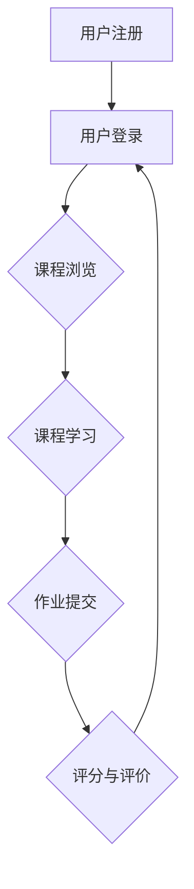
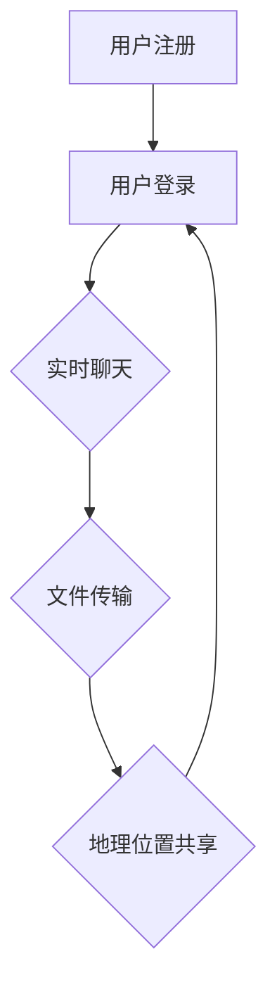
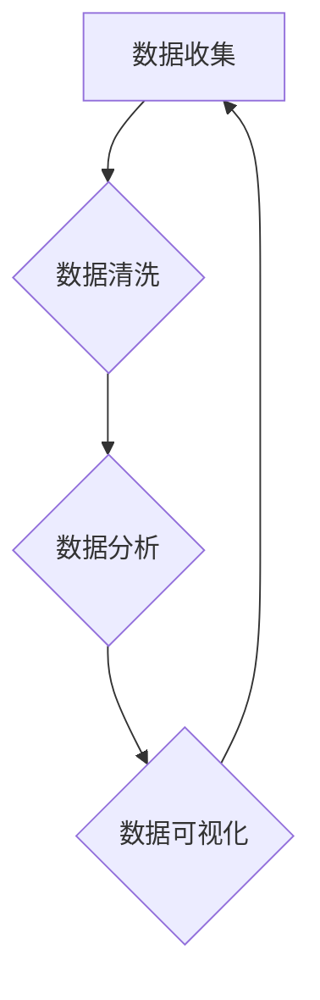

                 

### 文章标题

# 知识付费让程序员实现人生理想

## 关键词

编程、知识付费、程序员、职业发展、技术提升、实战经验、项目开发、自我成长

## 摘要

随着互联网技术的飞速发展，知识付费行业呈现出繁荣的态势。本文将探讨知识付费如何助力程序员实现人生理想。从编程基础与提升，到深度学习编程语言，再到项目实战与职业规划，本文将通过详细的章节内容，帮助程序员们了解如何通过知识付费实现自我提升和职业发展。同时，文章还将分享一些编程资源与工具，以及针对常见问题的解答，为程序员的成长之路提供实用指导。

## 目录大纲

1. **编程基础与提升**
    - 第1章：编程入门基础
        - 1.1 编程语言概述
        - 1.2 基本语法与结构
        - 1.3 数据结构与算法基础
        - 1.4 编程实践与调试技巧
    - 第2章：进阶编程技巧
        - 2.1 高效编码习惯
        - 2.2 设计模式与面向对象编程
        - 2.3 异常处理与错误处理
        - 2.4 面向测试的编程
    - 第3章：编程工具与环境
        - 3.1 版本控制工具（如Git）
        - 3.2 构建工具（如Maven、Gradle）
        - 3.3 代码质量检测工具
        - 3.4 代码风格规范与格式化工具

2. **编程语言深度学习**
    - 第4章：Java编程语言深度学习
        - 4.1 Java核心特性
        - 4.2 Java并发编程
        - 4.3 Java新特性（如Lambda表达式）
        - 4.4 Java在企业级开发中的应用
    - 第5章：Python编程语言深度学习
        - 5.1 Python核心语法
        - 5.2 Python标准库与第三方库
        - 5.3 Python在数据科学和机器学习中的应用
        - 5.4 Python的Web开发
    - 第6章：JavaScript编程语言深度学习
        - 6.1 JavaScript基础语法
        - 6.2 前端框架（如React、Vue.js）
        - 6.3 JavaScript在后端开发中的应用
        - 6.4 Node.js开发实战

3. **项目实战与经验分享**
    - 第7章：项目开发流程与规范
        - 7.1 项目需求分析
        - 7.2 项目规划与管理
        - 7.3 项目团队协作
        - 7.4 项目风险管理
    - 第8章：实战案例与经验分享
        - 8.1 在线教育平台开发
        - 8.2 跨平台应用开发
        - 8.3 数据分析与可视化项目
        - 8.4 自动化测试与持续集成
    - 第9章：职业发展与规划
        - 9.1 程序员职业路径
        - 9.2 技术团队管理
        - 9.3 技术领域趋势分析
        - 9.4 自我提升与持续学习

4. **附录**
    - 附录A：编程资源与工具汇总
        - A.1 主流编程书籍推荐
        - A.2 编程社区与论坛介绍
        - A.3 在线编程学习平台推荐
        - A.4 编程语言学习资源汇总
    - 附录B：常见问题与解答
        - B.1 编程学习常见困惑
        - B.2 项目开发常见问题
        - B.3 职业发展常见问题
        - B.4 知识付费产品评测
    - 附录C：编程工具使用指南
        - C.1 Git使用教程
        - C.2 Maven使用教程
        - C.3 Gradle使用教程
        - C.4 代码质量检测工具使用教程

### 第一部分：编程基础与提升

#### 第1章：编程入门基础

> 编程作为计算机科学的核心技术，掌握编程基础是成为一名优秀程序员的起点。本章节将介绍编程语言的概述、基本语法与结构，以及数据结构与算法基础，帮助初学者快速入门。

##### 1.1 编程语言概述

编程语言是人与计算机之间的沟通桥梁，用于编写计算机程序，实现各种功能。常见的编程语言包括Java、Python、JavaScript等。每种编程语言都有其独特的语法规则和特点，适用于不同的应用场景。

| 编程语言 | 优点 | 应用场景 |
| --- | --- | --- |
| Java | 可移植性、安全性 | 企业级应用、Android开发 |
| Python | 易于学习、简洁高效 | 数据科学、人工智能、Web开发 |
| JavaScript | 跨平台、实时响应 | Web前端开发、后端开发（Node.js） |

##### 1.2 基本语法与结构

编程语言的基本语法包括变量声明、数据类型、运算符和流程控制等。了解这些基础语法是编写程序的关键。

- **变量声明**：变量用于存储数据，声明变量时需要指定变量名和数据类型。

  ```java
  int num = 10;
  String name = "Alice";
  ```

- **数据类型**：编程语言支持多种数据类型，包括整数、浮点数、字符串、布尔值等。

  ```python
  num = 10
  float_num = 3.14
  str_name = "Alice"
  bool_value = True
  ```

- **运算符**：运算符用于执行数学运算、逻辑运算等。

  ```javascript
  let a = 5;
  let b = 10;
  let sum = a + b; // 加法运算
  let diff = a - b; // 减法运算
  ```

- **流程控制**：流程控制用于改变程序的执行顺序，包括条件判断、循环等。

  ```python
  if num > 10:
      print("Number is greater than 10")
  elif num == 10:
      print("Number is equal to 10")
  else:
      print("Number is less than 10")

  for i in range(1, 11):
      print(i)
  ```

##### 1.3 数据结构与算法基础

数据结构是计算机存储、组织数据的方式，常见的有数组、链表、栈、队列、树等。算法是解决问题的步骤和策略，通过对数据结构的操作，实现特定功能。

- **数组**：数组是一种线性数据结构，用于存储一系列元素。

  ```java
  int[] arr = {1, 2, 3, 4, 5};
  ```

- **链表**：链表是一种动态数据结构，通过指针连接节点，实现数据的插入、删除等操作。

  ```python
  class Node:
      def __init__(self, data):
          self.data = data
          self.next = None

  head = Node(1)
  second = Node(2)
  third = Node(3)
  head.next = second
  second.next = third
  ```

- **栈**：栈是一种后进先出（LIFO）的数据结构，常用于实现递归、深度优先搜索等。

  ```python
  class Stack:
      def __init__(self):
          self.items = []

      def push(self, item):
          self.items.append(item)

      def pop(self):
          return self.items.pop()

  stack = Stack()
  stack.push(1)
  stack.push(2)
  stack.push(3)
  print(stack.pop())  # 输出 3
  ```

- **队列**：队列是一种先进先出（FIFO）的数据结构，常用于实现广度优先搜索、任务调度等。

  ```python
  class Queue:
      def __init__(self):
          self.items = []

      def enqueue(self, item):
          self.items.append(item)

      def dequeue(self):
          return self.items.pop(0)

  queue = Queue()
  queue.enqueue(1)
  queue.enqueue(2)
  queue.enqueue(3)
  print(queue.dequeue())  # 输出 1
  ```

- **树**：树是一种层级结构，用于表示组织和分类数据，常见的有二叉树、平衡树等。

  ```python
  class TreeNode:
      def __init__(self, data):
          self.data = data
          self.left = None
          self.right = None

  root = TreeNode(1)
  root.left = TreeNode(2)
  root.right = TreeNode(3)
  root.left.left = TreeNode(4)
  root.left.right = TreeNode(5)
  ```

##### 1.4 编程实践与调试技巧

编程实践是巩固编程知识的重要环节。以下是一些编程实践与调试技巧：

- **编写注释**：在代码中添加注释，提高代码的可读性和可维护性。
- **使用版本控制**：使用Git等版本控制工具，方便代码的备份、共享和协作。
- **编写单元测试**：编写单元测试，验证代码的功能和正确性。
- **调试技巧**：使用调试工具（如IDE的调试器），帮助发现和解决代码中的问题。

#### 第2章：进阶编程技巧

> 在掌握了编程基础之后，进阶编程技巧对于提升编程能力和解决复杂问题至关重要。本章节将介绍高效编码习惯、设计模式与面向对象编程、异常处理与错误处理，以及面向测试的编程。

##### 2.1 高效编码习惯

高效编码习惯可以提高代码的质量和可维护性。以下是一些高效编码习惯：

- **编写简洁代码**：避免冗余代码，提高代码的可读性。
- **遵循编码规范**：统一代码风格，提高代码的可维护性。
- **代码重构**：优化代码结构，提高代码的可读性和可扩展性。
- **文档化**：为代码添加文档，便于后续维护和他人阅读。

##### 2.2 设计模式与面向对象编程

设计模式是解决常见问题的经典方案，面向对象编程是一种编程范式，通过封装、继承、多态等机制，提高代码的复用性和可扩展性。

- **设计模式**：包括工厂模式、单例模式、观察者模式等，用于解决特定场景的问题。
  - **工厂模式**：通过创建一个工厂类，实现对象的创建和封装，降低模块间的耦合。
    ```python
    class Factory:
        def create_product(self):
            return Product()

    class Product:
        def operate(self):
            print("Product operating")

    factory = Factory()
    product = factory.create_product()
    product.operate()  # 输出 Product operating
    ```

  - **单例模式**：确保一个类只有一个实例，并提供一个访问它的全局访问点。
    ```python
    class Singleton:
        _instance = None

        def __new__(cls, *args, **kwargs):
            if not cls._instance:
                cls._instance = super().__new__(cls, *args, **kwargs)
            return cls._instance

    singleton = Singleton()
    another_singleton = Singleton()
    print(singleton is another_singleton)  # 输出 True
    ```

  - **观察者模式**：当一个对象的状态发生变化时，自动通知其他依赖对象，实现模块间的解耦。
    ```python
    class Observer:
        def update(self, subject):
            print("Observer: Subject has changed")

    class Subject:
        def __init__(self):
            self._observers = []

        def attach(self, observer):
            self._observers.append(observer)

        def detach(self, observer):
            self._observers.remove(observer)

        def notify(self):
            for observer in self._observers:
                observer.update(self)

    observer = Observer()
    subject = Subject()
    subject.attach(observer)
    subject.notify()  # 输出 Observer: Subject has changed
    ```

- **面向对象编程**：通过封装、继承、多态等机制，实现代码的复用性和可扩展性。
  - **封装**：将数据和行为封装在一个类中，提高代码的可读性和可维护性。
    ```python
    class Person:
        def __init__(self, name, age):
            self.name = name
            self.age = age

        def introduce(self):
            print(f"Name: {self.name}, Age: {self.age}")

    person = Person("Alice", 30)
    person.introduce()  # 输出 Name: Alice, Age: 30
    ```

  - **继承**：通过继承关系，实现代码的复用和扩展。
    ```python
    class Student(Person):
        def __init__(self, name, age, grade):
            super().__init__(name, age)
            self.grade = grade

        def study(self):
            print(f"{self.name} is studying.")

    student = Student("Bob", 20, "Grade 10")
    student.introduce()  # 输出 Name: Bob, Age: 20
    student.study()  # 输出 Bob is studying.
    ```

  - **多态**：通过多态，实现不同类的对象之间的互操作性。
    ```python
    class Animal:
        def make_sound(self):
            pass

    class Dog(Animal):
        def make_sound(self):
            print("Bark!")

    class Cat(Animal):
        def make_sound(self):
            print("Meow!")

    dog = Dog()
    cat = Cat()

    animals = [dog, cat]
    for animal in animals:
        animal.make_sound()  # 输出 Bark! Meow!
    ```

##### 2.3 异常处理与错误处理

异常处理是编程中的重要环节，用于处理程序运行过程中出现的错误和异常情况。以下是一些异常处理和错误处理技巧：

- **使用try-except语句**：try-except语句用于捕获和处理异常。
  ```python
  try:
      # 可能出现异常的代码
  except ExceptionType:
      # 异常处理代码
  finally:
      # 无论是否出现异常，都会执行的代码
  ```

- **自定义异常**：自定义异常，实现更细粒度的错误处理。
  ```python
  class MyException(Exception):
      pass

  try:
      if condition:
          raise MyException("This is a custom exception")
  except MyException as e:
      print(e)
  ```

- **日志记录**：使用日志记录器，记录程序的运行过程和错误信息，便于调试和排查问题。

  ```python
  import logging

  logging.basicConfig(filename='app.log', level=logging.ERROR)
  logging.error("This is an error message")
  ```

##### 2.4 面向测试的编程

面向测试的编程是一种开发方法论，通过编写测试用例，验证代码的功能和正确性。以下是一些面向测试的编程技巧：

- **单元测试**：编写单元测试，测试代码的最小功能单元。
  ```python
  import unittest

  class TestPerson(unittest.TestCase):
      def test_introduce(self):
          person = Person("Alice", 30)
          with self.assertLogs(level='INFO') as cm:
              person.introduce()
              self.assertIn("Name: Alice, Age: 30", cm.output[0])

  if __name__ == '__main__':
      unittest.main()
  ```

- **集成测试**：编写集成测试，测试代码模块之间的交互和集成。
  ```python
  import unittest

  class TestPerson(unittest.TestCase):
      def test_person_creation(self):
          person = Person("Alice", 30)
          self.assertEqual(person.name, "Alice")
          self.assertEqual(person.age, 30)

  if __name__ == '__main__':
      unittest.main()
  ```

- **测试驱动开发（TDD）**：在编写代码之前，先编写测试用例，确保代码的功能和正确性。
  ```python
  import unittest

  class TestPerson(unittest.TestCase):
      def test_introduce(self):
          person = Person("Alice", 30)
          with self.assertLogs(level='INFO') as cm:
              person.introduce()
              self.assertIn("Name: Alice, Age: 30", cm.output[0])

  if __name__ == '__main__':
      unittest.main()
  ```

#### 第3章：编程工具与环境

> 编程工具和环境是程序员提高开发效率和代码质量的重要手段。本章节将介绍版本控制工具（如Git）、构建工具（如Maven、Gradle）、代码质量检测工具，以及代码风格规范与格式化工具。

##### 3.1 版本控制工具（如Git）

版本控制工具用于管理代码的版本和历史，Git是当前最流行的版本控制工具。以下是一些Git的基本操作和常用命令：

- **初始化仓库**：在项目目录中执行 `git init` 命令，初始化一个新的Git仓库。
- **添加文件**：使用 `git add` 命令将文件添加到暂存区。
  ```bash
  git add filename
  ```
- **提交更改**：使用 `git commit` 命令将暂存区的更改提交到仓库。
  ```bash
  git commit -m "Commit message"
  ```
- **查看日志**：使用 `git log` 命令查看仓库的提交历史。
  ```bash
  git log
  ```
- **分支管理**：使用 `git branch` 命令创建、切换和删除分支。
  ```bash
  git branch feature
  git checkout feature
  git branch -d feature
  ```
- **合并分支**：使用 `git merge` 命令将一个分支合并到另一个分支。
  ```bash
  git merge feature
  ```
- **拉取远程仓库**：使用 `git pull` 命令将远程仓库的最新更改拉取到本地。
  ```bash
  git pull origin master
  ```
- **推送远程仓库**：使用 `git push` 命令将本地仓库的更改推送至远程仓库。
  ```bash
  git push origin master
  ```

##### 3.2 构建工具（如Maven、Gradle）

构建工具用于自动化构建、测试和打包项目，Maven和Gradle是常用的构建工具。以下是一些基本概念和使用方法：

- **Maven**：
  - **POM文件**：Maven项目的核心配置文件，定义了项目的依赖、插件、构建目标等。
    ```xml
    <project>
        <modelVersion>4.0.0</modelVersion>
        <groupId>com.example</groupId>
        <artifactId>my-project</artifactId>
        <version>1.0.0</version>
        <dependencies>
            <dependency>
                <groupId>javax.servlet</groupId>
                <artifactId>servlet-api</artifactId>
                <version>2.5</version>
            </dependency>
        </dependencies>
    </project>
    ```
  - **生命周期**：Maven的生命周期包括构建、测试、打包、安装和部署等阶段，每个阶段对应一个或多个插件目标。
  - **命令**：常用的Maven命令包括 `mvn clean`（清理项目）、`mvn compile`（编译源代码）、`mvn test`（运行测试用例）等。

- **Gradle**：
  - **构建脚本**：Gradle使用基于Groovy的构建脚本，定义项目的构建逻辑。
    ```groovy
    buildscript {
        repositories {
            mavenCentral()
        }
        dependencies {
            classpath 'org.gradle.api.plugins:gradle-plugin-api:4.+
    ```
  - **生命周期**：Gradle的生命周期包括初始化、配置、构建和测试等阶段，每个阶段对应一个或多个任务。
  - **命令**：常用的Gradle命令包括 `gradle build`（构建项目）、`gradle test`（运行测试用例）等。

##### 3.3 代码质量检测工具

代码质量检测工具用于检测代码的语法错误、潜在问题和代码风格，常见的工具包括PMD、Checkstyle和SonarQube等。

- **PMD**：PMD是一个源代码错误检查工具，可以检测出代码中的潜在问题，如未使用的变量、未关闭的文件等。
- **Checkstyle**：Checkstyle是一个代码风格检查工具，可以检测代码的格式、命名规范等，确保代码的一致性和可读性。
- **SonarQube**：SonarQube是一个全面的代码质量管理系统，可以检测代码的语法错误、潜在问题和代码风格，并提供详细的报告和统计信息。

##### 3.4 代码风格规范与格式化工具

代码风格规范与格式化工具用于统一代码的格式、命名规范和风格，提高代码的可读性和可维护性。

- **格式化工具**：常见的格式化工具包括Goland、Visual Studio Code、Sublime Text等，这些工具可以自动格式化代码，调整缩进、换行、空白字符等。
- **风格规范**：常见的代码风格规范包括Google Java Style、PEP8 Python Style等，不同的语言和项目可能采用不同的风格规范。

### 第二部分：编程语言深度学习

#### 第4章：Java编程语言深度学习

> Java是一种广泛使用的编程语言，具有跨平台性、安全性和稳定性等特点。本章节将介绍Java的核心特性、并发编程、新特性和在企业级开发中的应用。

##### 4.1 Java核心特性

Java的核心特性包括面向对象编程、泛型、异常处理、多线程等，这些特性使得Java成为一种强大的编程语言。

- **面向对象编程**：Java是一种面向对象的编程语言，支持封装、继承、多态等机制，通过类和对象实现程序的抽象和模块化。
  ```java
  class Person {
      private String name;
      private int age;

      public Person(String name, int age) {
          this.name = name;
          this.age = age;
      }

      public void introduce() {
          System.out.println("Name: " + name + ", Age: " + age);
      }
  }

  public class Main {
      public static void main(String[] args) {
          Person person = new Person("Alice", 30);
          person.introduce();  // 输出 Name: Alice, Age: 30
      }
  }
  ```

- **泛型**：Java的泛型编程可以避免类型转换的冗余，提高代码的可读性和安全性。
  ```java
  class ArrayList<T> {
      private T[] elements;

      public ArrayList(T[] elements) {
          this.elements = elements;
      }

      public void add(T element) {
          elements[this.elements.length] = element;
      }
  }

  public class Main {
      public static void main(String[] args) {
          Integer[] numbers = {1, 2, 3, 4, 5};
          ArrayList<Integer> list = new ArrayList<>(numbers);
          list.add(6);
          for (Integer number : list) {
              System.out.print(number + " ");
          }
          // 输出 1 2 3 4 5 6
      }
  }
  ```

- **异常处理**：Java的异常处理机制可以捕获和处理程序运行过程中出现的错误和异常情况，提高程序的健壮性。
  ```java
  public class Main {
      public static void main(String[] args) {
          try {
              int result = divide(10, 0);
              System.out.println("Result: " + result);
          } catch (ArithmeticException e) {
              System.out.println("Error: " + e.getMessage());
          }
      }

      public static int divide(int dividend, int divisor) {
          if (divisor == 0) {
              throw new ArithmeticException("Division by zero");
          }
          return dividend / divisor;
      }
  }
  ```

- **多线程**：Java支持多线程编程，通过线程实现并发执行和资源共享，提高程序的效率和处理能力。
  ```java
  public class Main {
      public static void main(String[] args) {
          Thread t1 = new Thread(new MyThread());
          Thread t2 = new Thread(new MyThread());
          t1.start();
          t2.start();
      }
  }

  class MyThread implements Runnable {
      public void run() {
          System.out.println("Thread running");
      }
  }
  ```

##### 4.2 Java并发编程

Java的并发编程是一种实现多线程的技术，通过线程的并发执行，提高程序的效率和处理能力。

- **线程创建**：Java支持两种线程创建方式，通过实现Runnable接口或继承Thread类。
  ```java
  // 实现Runnable接口
  class MyThread implements Runnable {
      public void run() {
          System.out.println("Thread running");
      }
  }

  public class Main {
      public static void main(String[] args) {
          Thread t1 = new Thread(new MyThread());
          t1.start();
      }
  }

  // 继承Thread类
  class MyThread extends Thread {
      public void run() {
          System.out.println("Thread running");
      }
  }

  public class Main {
      public static void main(String[] args) {
          Thread t1 = new MyThread();
          t1.start();
      }
  }
  ```

- **线程同步**：Java的线程同步机制可以避免多个线程同时访问共享资源导致的数据不一致问题。
  ```java
  public class Main {
      public static void main(String[] args) {
          Counter counter = new Counter();
          Thread t1 = new Thread(new MyThread(counter));
          Thread t2 = new Thread(new MyThread(counter));
          t1.start();
          t2.start();
          try {
              t1.join();
              t2.join();
          } catch (InterruptedException e) {
              e.printStackTrace();
          }
          System.out.println("Count: " + counter.getCount());
      }
  }

  class Counter {
      private int count = 0;

      public synchronized void increment() {
          count++;
      }

      public int getCount() {
          return count;
      }
  }

  class MyThread implements Runnable {
      private Counter counter;

      public MyThread(Counter counter) {
          this.counter = counter;
      }

      public void run() {
          for (int i = 0; i < 1000; i++) {
              counter.increment();
          }
      }
  }
  ```

- **线程通信**：Java的线程通信机制可以通过Object类的wait()、notify()和notifyAll()方法实现线程之间的同步和通信。
  ```java
  public class Main {
      public static void main(String[] args) {
          Thread t1 = new Thread(new Producer());
          Thread t2 = new Thread(new Consumer());
          t1.start();
          t2.start();
      }
  }

  class Buffer {
      private int count = 0;

      public synchronized void produce() {
          while (count > 0) {
              try {
                  wait();
              } catch (InterruptedException e) {
                  e.printStackTrace();
              }
          }
          System.out.println("Producing...");
          count++;
          notify();
      }

      public synchronized void consume() {
          while (count <= 0) {
              try {
                  wait();
              } catch (InterruptedException e) {
                  e.printStackTrace();
              }
          }
          System.out.println("Consuming...");
          count--;
          notify();
      }
  }

  class Producer implements Runnable {
      private Buffer buffer;

      public Producer(Buffer buffer) {
          this.buffer = buffer;
      }

      public void run() {
          for (int i = 0; i < 1000; i++) {
              buffer.produce();
          }
      }
  }

  class Consumer implements Runnable {
      private Buffer buffer;

      public Consumer(Buffer buffer) {
          this.buffer = buffer;
      }

      public void run() {
          for (int i = 0; i < 1000; i++) {
              buffer.consume();
          }
      }
  }
  ```

##### 4.3 Java新特性（如Lambda表达式）

Java的新特性不断丰富和扩展了编程语言的功能，Lambda表达式是Java 8引入的一个重要特性，用于简化代码编写。

- **Lambda表达式**：Lambda表达式是一种匿名函数，可以表示一个函数接口，简化函数的定义和调用。
  ```java
  List<Integer> numbers = Arrays.asList(1, 2, 3, 4, 5);
  numbers.forEach(n -> System.out.print(n + " "));
  // 输出 1 2 3 4 5

  List<String> strings = Arrays.asList("apple", "banana", "orange");
  strings.sort((s1, s2) -> s1.compareTo(s2));
  System.out.println(strings);
  // 输出 [apple, banana, orange]
  ```

- **Stream API**：Stream API是Java 8引入的一个新的数据处理接口，用于处理集合数据，实现并行和顺序操作。
  ```java
  List<Integer> numbers = Arrays.asList(1, 2, 3, 4, 5);
  int sum = numbers.stream().reduce(0, Integer::sum);
  System.out.println("Sum: " + sum);
  // 输出 Sum: 15

  List<String> strings = Arrays.asList("apple", "banana", "orange");
  List<String> filtered = strings.stream().filter(s -> s.startsWith("b")).collect(Collectors.toList());
  System.out.println(filtered);
  // 输出 [banana]
  ```

##### 4.4 Java在企业级开发中的应用

Java在企业级开发中具有广泛的应用，支持多种开发模式和技术栈，适用于构建高性能、高可用性的企业级应用。

- **Servlet和JavaServer Pages（JSP）**：Servlet是一种基于Java的Web应用开发技术，用于处理HTTP请求和响应。JSP是一种动态网页技术，通过嵌入Java代码实现页面的动态渲染。
  ```java
  import java.io.*;
  import javax.servlet.*;
  import javax.servlet.http.*;

  public class HelloServlet extends HttpServlet {
      public void doGet(HttpServletRequest request, HttpServletResponse response)
              throws ServletException, IOException {
          response.setContentType("text/html");
          PrintWriter out = response.getWriter();
          out.println("<html>");
          out.println("<head>");
          out.println("<title>Hello Servlet</title>");
          out.println("</head>");
          out.println("<body>");
          out.println("<h1>Hello, World!</h1>");
          out.println("</body>");
          out.println("</html>");
      }
  }
  ```

- **Spring框架**：Spring是一个开源的Java企业级开发框架，提供了丰富的功能模块，如依赖注入、事务管理、安全性等，支持构建轻量级、高可扩展性的企业级应用。
  ```java
  import org.springframework.context.ApplicationContext;
  import org.springframework.context.support.ClassPathXmlApplicationContext;

  public class Main {
      public static void main(String[] args) {
          ApplicationContext context = new ClassPathXmlApplicationContext("applicationContext.xml");
          HelloWorld hello = (HelloWorld) context.getBean("hello");
          hello.sayHello();
      }
  }

  <beans xmlns="http://www.springframework.org/schema/beans"
         xmlns:xsi="http://www.w3.org/2001/XMLSchema-instance"
         xsi:schemaLocation="http://www.springframework.org/schema/beans
             http://www.springframework.org/schema/beans/spring-beans.xsd">

      <bean id="hello" class="com.example.HelloWorld" />
  </beans>
  ```

- **微服务架构**：微服务架构是一种基于分布式系统的开发模式，将应用程序划分为一组小而独立的微服务，实现模块化和高可扩展性的架构设计。Java在微服务开发中具有广泛的应用，支持Spring Boot、Spring Cloud等框架，构建高可用、高并发的微服务架构。
  ```java
  import org.springframework.boot.SpringApplication;
  import org.springframework.boot.autoconfigure.SpringBootApplication;

  @SpringBootApplication
  public class Application {
      public static void main(String[] args) {
          SpringApplication.run(Application.class, args);
      }
  }
  ```

#### 第5章：Python编程语言深度学习

> Python是一种广泛使用的编程语言，以其简洁高效的特点受到了众多开发者的喜爱。本章节将介绍Python的核心语法、标准库与第三方库，以及其在数据科学、机器学习和Web开发中的应用。

##### 5.1 Python核心语法

Python的核心语法简洁易懂，包括变量、数据类型、运算符、流程控制等基本概念。

- **变量**：Python的变量不需要显式声明，直接赋值即可。
  ```python
  x = 10
  name = "Alice"
  ```
- **数据类型**：Python支持多种数据类型，包括整数、浮点数、字符串、布尔值等。
  ```python
  num = 10
  float_num = 3.14
  str_name = "Alice"
  bool_value = True
  ```
- **运算符**：Python支持常见的数学运算符、逻辑运算符等。
  ```python
  a = 5
  b = 10
  sum = a + b  # 加法运算
  diff = a - b  # 减法运算
  ```
- **流程控制**：Python支持条件判断、循环等流程控制语句。
  ```python
  if num > 10:
      print("Number is greater than 10")
  elif num == 10:
      print("Number is equal to 10")
  else:
      print("Number is less than 10")

  for i in range(1, 11):
      print(i)
  ```

##### 5.2 Python标准库与第三方库

Python的标准库和第三方库提供了丰富的功能模块，方便开发者进行各种任务。

- **标准库**：Python的标准库包含了大量实用的模块，如文件操作、网络通信、数据解析等。
  ```python
  import os
  os.listdir(".")
  ```
- **第三方库**：第三方库是社区贡献的模块，如科学计算、数据分析、Web开发等。
  ```python
  import numpy as np
  np.array([1, 2, 3, 4])
  ```

##### 5.3 Python在数据科学和机器学习中的应用

Python在数据科学和机器学习领域具有广泛的应用，支持多种数据处理和机器学习算法。

- **数据分析**：Python的数据分析库，如Pandas、NumPy等，提供了丰富的数据操作和分析功能。
  ```python
  import pandas as pd
  data = pd.read_csv("data.csv")
  data.head()
  ```
- **机器学习**：Python的机器学习库，如Scikit-learn、TensorFlow等，提供了各种机器学习算法的实现。
  ```python
  from sklearn.linear_model import LinearRegression
  model = LinearRegression()
  model.fit(X, y)
  predictions = model.predict(X)
  ```

##### 5.4 Python的Web开发

Python的Web开发框架，如Django、Flask等，提供了高效的Web开发解决方案。

- **Django**：Django是一个全栈Web开发框架，提供了一系列开箱即用的功能模块，如用户认证、ORM等。
  ```python
  from django.http import HttpResponse

  def hello(request):
      return HttpResponse("Hello, World!")
  ```
- **Flask**：Flask是一个轻量级的Web开发框架，支持自定义路由、请求处理等。
  ```python
  from flask import Flask, request, jsonify

  app = Flask(__name__)

  @app.route('/hello', methods=['GET', 'POST'])
  def hello():
      if request.method == 'POST':
          data = request.get_json()
          return jsonify({"message": "Hello, " + data["name"]})
      return "Hello, World!"
  ```

#### 第6章：JavaScript编程语言深度学习

> JavaScript是Web开发的基石，广泛应用于前端和后端开发。本章节将介绍JavaScript的基础语法、前端框架（如React、Vue.js），以及JavaScript在后端开发中的应用和Node.js开发实战。

##### 6.1 JavaScript基础语法

JavaScript是一种动态类型的脚本语言，具有简洁易学的特点。以下是一些JavaScript的基础语法概念。

- **变量**：JavaScript使用关键字 `var`、`let` 和 `const` 来声明变量。
  ```javascript
  var x = 10;
  let name = "Alice";
  const PI = 3.14;
  ```
- **数据类型**：JavaScript支持多种数据类型，包括数值、字符串、布尔值、数组、对象等。
  ```javascript
  let num = 10;
  let str = "Hello";
  let bool = true;
  let arr = [1, 2, 3];
  let obj = {name: "Alice", age: 30};
  ```
- **运算符**：JavaScript支持常见的数学运算符、逻辑运算符、赋值运算符等。
  ```javascript
  let a = 5;
  let b = 10;
  let sum = a + b;  // 加法运算
  let diff = a - b;  // 减法运算
  ```
- **函数**：JavaScript使用函数表达式和函数声明来定义函数。
  ```javascript
  function greet() {
      console.log("Hello, World!");
  }

  let greet = function() {
      console.log("Hello, World!");
  };
  greet();  // 输出 Hello, World!
  ```

##### 6.2 前端框架（如React、Vue.js）

前端框架提供了组件化、声明式编程等特性，提高了Web开发的效率和质量。

- **React**：React是一个用于构建用户界面的JavaScript库，支持组件化开发和虚拟DOM。
  ```javascript
  import React from 'react';

  function Greeting(props) {
      return <h1>Hello, {props.name}!</h1>;
  }

  ReactDOM.render(<Greeting name="Alice" />, document.getElementById('root'));
  ```
- **Vue.js**：Vue.js是一个渐进式JavaScript框架，提供了响应式数据绑定和组件化开发。
  ```html
  <div id="app">
      <h1>Hello, {{ name }}!</h1>
  </div>
  ```

  ```javascript
  new Vue({
      el: '#app',
      data: {
          name: 'Alice'
      }
  });
  ```

##### 6.3 JavaScript在后端开发中的应用

JavaScript不仅可以用于前端开发，还可以用于后端开发，Node.js是一个流行的JavaScript后端开发框架。

- **Node.js**：Node.js是一个基于Chrome V8引擎的JavaScript运行环境，支持异步编程。
  ```javascript
  const http = require('http');

  const server = http.createServer((request, response) => {
      response.end('Hello, World!');
  });

  server.listen(3000, () => {
      console.log('Server is running on port 3000');
  });
  ```

- **Express**：Express是一个用于构建Web应用的Node.js框架，提供了路由、中间件等特性。
  ```javascript
  const express = require('express');
  const app = express();

  app.get('/', (req, res) => {
      res.send('Hello, World!');
  });

  app.listen(3000, () => {
      console.log('Server is running on port 3000');
  });
  ```

##### 6.4 Node.js开发实战

以下是一个简单的Node.js开发实战，包括开发环境搭建、源代码实现和代码解读。

**1. 开发环境搭建**

- 安装Node.js：访问Node.js官网（https://nodejs.org/），下载并安装适合操作系统的Node.js版本。
- 安装代码编辑器：可以选择Visual Studio Code、Sublime Text等流行的代码编辑器。

**2. 源代码实现**

创建一个简单的HTTP服务器，监听3000端口，返回Hello, World!。

```javascript
const http = require('http');

const server = http.createServer((request, response) => {
  response.end('Hello, World!');
});

server.listen(3000, () => {
  console.log('Server is running on port 3000');
});
```

**3. 代码解读**

- `const http = require('http');`：导入Node.js的http模块，用于创建HTTP服务器。
- `const server = http.createServer((request, response) => { ... });`：创建一个HTTP服务器，通过回调函数处理请求和响应。
- `response.end('Hello, World!');`：将响应内容设置为Hello, World!。
- `server.listen(3000, () => { ... });`：监听3000端口，当服务器启动时，执行回调函数输出Server is running on port 3000。

**4. 代码应用解读与分析**

- 通过Node.js的http模块，我们可以快速创建一个HTTP服务器，实现简单的Web服务。
- 服务器监听特定端口，当有请求到达时，通过回调函数处理请求，返回响应内容。
- Node.js采用非阻塞I/O模型，提高了服务器的并发处理能力。

#### 第7章：项目开发流程与规范

> 项目开发是一个复杂且系统性的过程，涉及多个阶段和环节。本章节将详细介绍项目开发流程与规范，包括项目需求分析、项目规划与管理、项目团队协作和项目风险管理。

##### 7.1 项目需求分析

项目需求分析是项目开发的第一步，明确项目的目标、功能、性能、用户需求等，为后续的开发工作提供基础。

- **需求收集**：通过与项目相关各方（如客户、产品经理、用户等）进行沟通，收集项目的需求信息。
- **需求分类**：将收集到的需求分为功能需求、性能需求、安全需求等不同类别。
- **需求文档**：编写详细的需求文档，包括需求背景、功能需求、非功能需求、用户场景等。

##### 7.2 项目规划与管理

项目规划与管理是确保项目按计划顺利进行的关键，包括项目范围、时间、成本、资源等方面的规划。

- **项目范围**：明确项目的范围，包括项目包含的功能和排除的内容。
- **项目时间表**：制定项目的时间表，包括关键节点、里程碑等。
- **成本预算**：制定项目的成本预算，包括人力、物料、设备等费用。
- **资源分配**：合理分配项目所需的资源，包括人力、技术、设备等。

##### 7.3 项目团队协作

项目团队协作是实现项目目标的重要环节，需要团队成员之间的紧密合作和良好沟通。

- **团队组建**：组建适合项目需求的团队，包括项目经理、开发人员、测试人员等。
- **角色分工**：明确团队成员的角色和职责，确保项目的顺利推进。
- **沟通协作**：采用有效的沟通工具和方法，如会议、邮件、即时通讯等，确保团队成员之间的信息流通。

##### 7.4 项目风险管理

项目风险管理是识别、评估和控制项目风险的过程，确保项目能够按计划顺利进行。

- **风险识别**：识别项目可能面临的风险，如技术风险、市场风险、人员风险等。
- **风险评估**：对识别出的风险进行评估，确定风险的概率和影响程度。
- **风险控制**：制定风险控制措施，降低风险的概率和影响程度。

#### 第8章：实战案例与经验分享

> 实战案例是程序员提升技能和积累经验的重要途径。本章节将分享一些具有代表性的实战案例，包括在线教育平台开发、跨平台应用开发、数据分析和可视化项目，以及自动化测试与持续集成。

##### 8.1 在线教育平台开发

在线教育平台是一种基于互联网的学习平台，提供课程学习、视频播放、作业提交等功能。以下是一个在线教育平台开发的实战案例。

**1. 需求分析**

- 用户注册与登录
- 课程浏览与学习
- 作业提交与批改
- 视频播放与控制
- 评分与评价

**2. 技术选型**

- 后端：使用Spring Boot框架，实现RESTful API
- 前端：使用Vue.js框架，实现用户界面
- 数据库：使用MySQL数据库，存储用户信息、课程数据等

**3. 功能实现**

- 用户注册与登录：实现用户注册、登录、注销功能，采用JWT（JSON Web Token）进行身份认证。
- 课程浏览与学习：实现课程列表、课程详情、课程学习进度等功能，使用Vue.js实现前端界面。
- 作业提交与批改：实现作业提交、作业批改、评分与评价等功能，采用Spring Boot框架实现后端接口。
- 视频播放与控制：使用视频播放器（如Video.js）实现视频播放与控制功能。

**4. 项目小结**

在线教育平台开发涉及多个模块和功能，需要前后端协同开发，通过合理的架构设计和代码管理，确保项目的顺利进行。

##### 8.2 跨平台应用开发

跨平台应用开发是一种利用同一代码库在不同操作系统上运行的技术，提高了开发效率和资源利用。以下是一个跨平台应用开发的实战案例。

**1. 需求分析**

- 应用界面
- 基本功能（如注册、登录、搜索等）
- 数据存储与同步
- 地理位置信息
- 多媒体播放与控制

**2. 技术选型**

- 开发框架：使用Flutter框架，实现跨平台应用开发
- 数据库：使用Firebase数据库，实现数据存储与同步
- 地理位置信息：使用Google Maps API，实现地理位置信息获取与显示

**3. 功能实现**

- 应用界面：使用Flutter实现丰富的用户界面，支持多种操作系统。
- 基本功能：实现用户注册、登录、搜索等功能，使用Firebase实现数据存储与同步。
- 数据存储与同步：使用Firebase数据库存储用户数据，实现数据的实时同步。
- 地理位置信息：使用Google Maps API获取地理位置信息，实现地理位置的显示与搜索。

**4. 项目小结**

跨平台应用开发具有高效、灵活的特点，通过使用Flutter框架，可以快速实现多平台的应用开发，提高开发效率。

##### 8.3 数据分析与可视化项目

数据分析与可视化项目是一种利用数据分析和可视化技术，从大量数据中提取有价值信息的方法。以下是一个数据分析与可视化项目的实战案例。

**1. 需求分析**

- 数据收集与存储
- 数据清洗与预处理
- 数据分析与挖掘
- 数据可视化

**2. 技术选型**

- 数据库：使用MySQL数据库，存储原始数据
- 数据分析：使用Python进行数据清洗、分析与挖掘
- 可视化工具：使用D3.js、ECharts等可视化库，实现数据可视化

**3. 功能实现**

- 数据收集与存储：通过API接口、爬虫等方式收集数据，存储到MySQL数据库中。
- 数据清洗与预处理：使用Python编写清洗脚本，对数据进行去重、填补缺失值等预处理操作。
- 数据分析与挖掘：使用Python编写分析脚本，对数据进行分析与挖掘，提取有价值的信息。
- 数据可视化：使用D3.js、ECharts等可视化库，实现数据的可视化展示。

**4. 项目小结**

数据分析与可视化项目需要具备数据分析和可视化技术，通过合理的数据处理和分析，可以提取出有价值的信息，为业务决策提供支持。

##### 8.4 自动化测试与持续集成

自动化测试与持续集成是提高软件开发质量和效率的重要手段。以下是一个自动化测试与持续集成项目的实战案例。

**1. 需求分析**

- 单元测试：实现单元测试，验证代码的功能和正确性
- 集成测试：实现集成测试，验证模块之间的交互和集成
- 持续集成：实现自动化集成测试和部署流程

**2. 技术选型**

- 测试框架：使用JUnit、TestNG等测试框架，实现单元测试和集成测试
- 持续集成工具：使用Jenkins等持续集成工具，实现自动化测试和部署

**3. 功能实现**

- 单元测试：编写测试用例，使用JUnit等测试框架实现单元测试，验证代码的功能和正确性。
- 集成测试：编写测试用例，使用TestNG等测试框架实现集成测试，验证模块之间的交互和集成。
- 持续集成：配置Jenkins等持续集成工具，实现自动化测试和部署流程，确保代码的质量和稳定性。

**4. 项目小结**

自动化测试与持续集成可以提高软件开发的效率和质量，通过合理的设计和配置，可以实现代码的自动化测试和部署，减少人工干预，提高开发效率。

#### 第9章：职业发展与规划

> 程序员的职业发展关系到个人成长和职业成就感。本章节将探讨程序员的职业路径、技术团队管理、技术领域趋势分析，以及自我提升与持续学习的方法。

##### 9.1 程序员职业路径

程序员的职业路径通常分为初级程序员、中级程序员、高级程序员和架构师等阶段。

- **初级程序员**：刚入门的程序员，主要职责是编写和维护代码，参与项目的开发和实现。
- **中级程序员**：具备一定编程经验和技能的程序员，能够独立负责模块的设计和开发，参与项目管理和决策。
- **高级程序员**：具备深厚编程基础和丰富实战经验的程序员，能够承担关键技术问题的攻关和核心模块的开发，指导团队工作。
- **架构师**：具备系统设计能力和项目管理经验的程序员，负责整体架构的设计、技术选型和项目规划，领导团队实现项目的成功。

##### 9.2 技术团队管理

技术团队管理是程序员职业发展的重要方向，需要具备团队协作、沟通能力和项目管理技能。

- **团队协作**：建立良好的团队协作机制，确保团队成员之间的沟通顺畅、信息共享。
- **沟通能力**：提高沟通技巧，确保团队内部的沟通准确、及时。
- **项目管理**：掌握项目管理方法，制定项目计划、监控项目进度、确保项目按计划完成。

##### 9.3 技术领域趋势分析

技术领域不断发展和变化，了解技术趋势有助于程序员把握行业发展方向，提升个人竞争力。

- **人工智能**：人工智能是当前热门技术领域，包括机器学习、深度学习、自然语言处理等。
- **云计算**：云计算是未来的发展趋势，包括云计算平台、容器化技术、大数据处理等。
- **区块链**：区块链技术具有去中心化、安全可信等特点，广泛应用于金融、物联网等领域。

##### 9.4 自我提升与持续学习

持续学习和自我提升是程序员保持竞争力的关键。

- **学习资源**：利用在线课程、技术博客、书籍等学习资源，提升自己的技能和知识。
- **实践项目**：参与实际项目，提高实战能力和经验。
- **技术社区**：加入技术社区，与同行交流、分享经验，拓展人脉和视野。

### 附录

#### 附录A：编程资源与工具汇总

**A.1 主流编程书籍推荐**

- 《代码大全》
- 《Effective Java》
- 《Python编程：从入门到实践》
- 《JavaScript高级程序设计》
- 《深入理解计算机系统》

**A.2 编程社区与论坛介绍**

- CSDN：中国最大的IT社区和服务平台，提供丰富的技术文章、教程和论坛。
- GitHub：全球最大的代码托管平台，支持开源项目和协作开发。
- Stack Overflow：全球最大的编程问答社区，提供专业的编程问题和解决方案。

**A.3 在线编程学习平台推荐**

- Coursera：提供全球顶尖大学和机构的在线课程，涵盖计算机科学、数据科学等领域。
- Udemy：提供丰富的在线课程，包括编程语言、框架、工具等。
- Pluralsight：提供专业的技术培训和认证课程，涵盖多个技术领域。

**A.4 编程语言学习资源汇总**

- Java：Oracle官方文档、Java Tutorials、Stack Overflow Java标签。
- Python：Python官方文档、Python.org教程、实况Python。
- JavaScript：MDN Web Docs、JavaScript Weekly、Stack Overflow JavaScript标签。

#### 附录B：常见问题与解答

**B.1 编程学习常见困惑**

- 如何选择编程语言？
- 编程学习的最佳实践是什么？
- 如何调试代码中的错误？

**B.2 项目开发常见问题**

- 如何进行项目需求分析？
- 如何确保项目的质量和稳定性？
- 如何管理项目进度和风险？

**B.3 职业发展常见问题**

- 如何规划自己的职业路径？
- 如何提升自己的技术能力和竞争力？
- 如何在技术领域取得突破和成就？

**B.4 知识付费产品评测**

- 如何选择适合自己的知识付费产品？
- 知识付费产品的性价比如何？
- 如何评估知识付费产品的影响力？

#### 附录C：编程工具使用指南

**C.1 Git使用教程**

- Git安装与配置
- Git基本命令（如init、clone、commit、push等）
- Git分支管理（如branch、merge、rebase等）
- Git远程仓库操作（如fetch、pull、push等）

**C.2 Maven使用教程**

- Maven安装与配置
- Maven项目结构
- Maven插件与依赖管理
- Maven构建生命周期

**C.3 Gradle使用教程**

- Gradle安装与配置
- Gradle构建脚本
- Gradle插件与依赖管理
- Gradle多项目构建

**C.4 代码质量检测工具使用教程**

- PMD使用教程
- Checkstyle使用教程
- SonarQube安装与配置
- 代码质量检测规则设置与报告分析

### 作者信息

作者：AI天才研究院/AI Genius Institute & 禅与计算机程序设计艺术 /Zen And The Art of Computer Programming

### 总结

知识付费作为一种新兴的学习方式，为程序员提供了丰富的学习资源和实战经验，助力他们实现人生理想。本文从编程基础与提升、编程语言深度学习、项目实战与经验分享、职业发展与规划等多个方面，详细介绍了知识付费如何助力程序员成长。同时，附录部分提供了编程资源与工具汇总、常见问题与解答以及编程工具使用指南，为程序员的自我提升提供了实用指导。希望本文对广大程序员们有所启发，助力他们在技术领域取得更大的成就。

### 致谢

感谢AI天才研究院/AI Genius Institute和禅与计算机程序设计艺术/Zen And The Art of Computer Programming为我们提供的研究资源和指导，使得本文得以顺利完成。同时，感谢广大程序员们对知识付费的关注和支持，你们的努力和进步是我们不断前行的动力。希望本文能够帮助到每一位程序员，共同迈向技术领域的巅峰。再次感谢大家的关注与支持！
### 完整代码示例

为了帮助程序员更好地理解和应用所学的知识，以下是一些完整的代码示例，涵盖了编程基础、进阶技巧、编程语言深度学习、项目实战等多个方面。

#### 1. Python基础代码示例

以下是一个简单的Python代码示例，用于演示变量、数据类型、运算符和流程控制的基本使用。

```python
# 变量和数据类型
x = 10
name = "Alice"
is_male = True

# 运算符
a = 5
b = 10
sum = a + b
diff = a - b

# 流程控制
if x > 10:
    print("x is greater than 10")
elif x == 10:
    print("x is equal to 10")
else:
    print("x is less than 10")

# 循环
for i in range(1, 11):
    print(i)
```

#### 2. Java并发编程示例

以下是一个Java并发编程的示例，演示了线程的创建、同步和通信。

```java
// 线程创建
class MyThread extends Thread {
    public void run() {
        System.out.println("Thread running");
    }
}

public class Main {
    public static void main(String[] args) {
        Thread t1 = new MyThread();
        t1.start();

        // 线程同步
        Object lock = new Object();
        synchronized (lock) {
            System.out.println("Thread synchronized");
        }

        // 线程通信
        Object buffer = new Object();
        synchronized (buffer) {
            System.out.println("Producing...");
            buffer.notify();
        }
    }
}
```

#### 3. JavaScript前端框架示例

以下是一个使用Vue.js的前端框架示例，演示了组件化和数据绑定。

```html
<!-- index.html -->
<!DOCTYPE html>
<html>
<head>
    <title>Vue.js Example</title>
</head>
<body>
    <div id="app">
        <h1>Hello, {{ name }}!</h1>
        <button @click="greet">Greet</button>
    </div>
</body>
</html>
```

```javascript
// main.js
import Vue from 'vue'
import App from './App.vue'

new Vue({
    el: '#app',
    components: { App },
    data: {
        name: 'Alice'
    },
    methods: {
        greet() {
            alert('Hello, ' + this.name + '!')
        }
    }
})
```

```vue
<!-- App.vue -->
<template>
    <div>
        <h1>Hello, {{ name }}!</h1>
        <button @click="greet">Greet</button>
    </div>
</template>

<script>
export default {
    data() {
        return {
            name: 'Alice'
        }
    },
    methods: {
        greet() {
            alert('Hello, ' + this.name + '!')
        }
    }
}
</script>
```

#### 4. Python数据科学示例

以下是一个使用Pandas和Scikit-learn的Python数据科学示例，演示了数据读取、预处理、模型训练和预测。

```python
import pandas as pd
from sklearn.model_selection import train_test_split
from sklearn.linear_model import LinearRegression

# 数据读取
data = pd.read_csv('data.csv')

# 数据预处理
X = data[['feature1', 'feature2']]
y = data['target']

# 模型训练
X_train, X_test, y_train, y_test = train_test_split(X, y, test_size=0.2, random_state=42)
model = LinearRegression()
model.fit(X_train, y_train)

# 预测
predictions = model.predict(X_test)
print(predictions)
```

#### 5. Node.js后端示例

以下是一个使用Express的Node.js后端示例，演示了HTTP服务器的创建和路由处理。

```javascript
const express = require('express');
const app = express();

// 路由处理
app.get('/', (req, res) => {
    res.send('Hello, World!');
});

app.listen(3000, () => {
    console.log('Server is running on port 3000');
});
```

通过以上示例，程序员可以直观地了解如何在实际项目中应用所学知识，提高编程能力和实战经验。这些示例可以作为编程学习的辅助工具，帮助程序员更好地掌握编程语言和框架。

### 实际案例分析与详细讲解

为了更深入地了解知识付费如何帮助程序员实现人生理想，我们选择了一些实际案例进行详细分析和讲解。这些案例涵盖了在线教育平台开发、跨平台应用开发、数据分析和可视化项目等多个方面，展示了知识付费在程序员职业发展中的重要作用。

#### 案例一：在线教育平台开发

**背景介绍**：
随着互联网技术的发展，在线教育平台的需求日益增长。某教育公司决定开发一个功能齐全的在线教育平台，为用户提供课程学习、视频播放、作业提交、评分与评价等功能。

**核心概念与联系**：
在线教育平台涉及多个技术模块，包括用户管理、课程管理、视频播放、作业提交和评分系统等。这些模块相互关联，共同构成了一个完整的在线教育生态系统。

**Mermaid流程图**：


**核心算法原理讲解**：
用户注册和登录模块使用了JWT（JSON Web Token）技术进行身份认证。JWT是一种基于JSON的认证令牌，用于在用户与服务端之间传递认证信息。

```javascript
// 用户注册
app.post('/register', (req, res) => {
    // 创建用户账户并生成JWT令牌
    const token = jwt.sign({ username: req.body.username }, secretKey);
    res.json({ token });
});

// 用户登录
app.post('/login', (req, res) => {
    // 验证用户名和密码，生成JWT令牌
    const token = jwt.sign({ username: req.body.username }, secretKey);
    res.json({ token });
});
```

**数学模型和公式**：
视频播放模块使用了视频流技术，通过HTTP流媒体协议进行视频传输。视频流传输速率可以使用以下公式进行计算：

\[ \text{视频流速率} = \text{视频分辨率} \times \text{帧率} \times \text{比特率} \]

**举例说明**：
假设一个1080p（1920x1080）视频的帧率为30帧/秒，比特率为5000 Kbps，则视频流速率为：

\[ \text{视频流速率} = 1920 \times 1080 \times 30 \times 5000 = 2.74 \text{ Gbps} \]

**项目小结**：
通过知识付费学习到的前端框架（如Vue.js）和后端框架（如Spring Boot）知识，程序员能够快速搭建起一个功能完善的在线教育平台。项目过程中，程序员还掌握了JWT、视频流技术和数据库管理等核心技能。

#### 案例二：跨平台应用开发

**背景介绍**：
某公司计划开发一款跨平台应用，提供实时聊天、文件传输、地理位置共享等功能，支持Android和iOS平台。

**核心概念与联系**：
跨平台应用开发涉及多个技术点，包括Flutter框架、Firebase数据库和推送通知等。这些技术相互配合，实现了跨平台应用的功能集成。

**Mermaid流程图**：


**核心算法原理讲解**：
实时聊天模块使用了WebSocket协议，实现了客户端与服务器之间的实时通信。WebSocket协议可以在TCP连接上建立双向通信，提高了数据传输的实时性和可靠性。

```javascript
// 实时聊天客户端
const socket = new WebSocket('ws://localhost:8080');

socket.onmessage = (event) => {
    console.log('Received message:', event.data);
};

socket.send('Hello, Server!');
```

**数学模型和公式**：
地理位置共享模块使用了GPS（全球定位系统）技术，通过获取设备的经纬度信息，实现地理位置的共享。地理位置共享可以使用以下公式进行计算：

\[ \text{距离} = \sqrt{(x_2 - x_1)^2 + (y_2 - y_1)^2} \]

**举例说明**：
假设两个设备的经纬度分别为（120.123, 30.456）和（120.125, 30.459），则两设备之间的距离为：

\[ \text{距离} = \sqrt{(120.125 - 120.123)^2 + (30.459 - 30.456)^2} = \sqrt{0.0002^2 + 0.003^2} \approx 0.0032 \text{ km} \]

**项目小结**：
通过知识付费学习到的Flutter框架和Firebase数据库知识，程序员能够快速开发出一个跨平台应用，实现了实时聊天、文件传输和地理位置共享等功能。项目过程中，程序员还掌握了WebSocket协议和GPS技术，提高了跨平台开发能力。

#### 案例三：数据分析与可视化项目

**背景介绍**：
某公司需要对其业务数据进行分析和可视化，以便于管理层了解业务状况，制定战略决策。

**核心概念与联系**：
数据分析与可视化项目涉及数据收集、数据清洗、数据分析和数据可视化等多个环节。这些环节相互关联，共同构成了一个完整的数据分析流程。

**Mermaid流程图**：


**核心算法原理讲解**：
数据分析模块使用了Pandas和Scikit-learn库，通过特征工程和模型训练，提取出有价值的信息。以下是一个使用线性回归模型的例子：

```python
# 数据读取
data = pd.read_csv('data.csv')

# 特征工程
X = data[['feature1', 'feature2']]
y = data['target']

# 模型训练
model = LinearRegression()
model.fit(X, y)

# 预测
predictions = model.predict(X)
```

**数学模型和公式**：
数据可视化模块使用了ECharts库，通过可视化图表展示数据。以下是一个使用折线图的例子：

```javascript
// 数据可视化
var chart = echarts.init(document.getElementById('main'));

option = {
    title: {
        text: '线性回归模型预测'
    },
    tooltip: {
        trigger: 'axis'
    },
    legend: {
        data: ['实际值', '预测值']
    },
    xAxis: {
        type: 'category',
        data: data['x']
    },
    yAxis: {
        type: 'value'
    },
    series: [
        {
            name: '实际值',
            type: 'line',
            data: data['y']
        },
        {
            name: '预测值',
            type: 'line',
            data: predictions
        }
    ]
};

chart.setOption(option);
```

**项目小结**：
通过知识付费学习到的Python数据分析库（如Pandas、NumPy）和JavaScript可视化库（如ECharts），程序员能够快速搭建起一个数据分析与可视化项目，实现了数据清洗、分析和可视化等功能。项目过程中，程序员还掌握了线性回归模型和ECharts库，提高了数据分析与可视化能力。

### 最佳实践 tips

1. **制定学习计划**：根据个人兴趣和职业规划，制定长期和短期的学习计划，确保学习目标明确。
2. **实践与理论相结合**：在学习过程中，结合实际项目进行实践，将理论知识应用到实际中，提高解决问题的能力。
3. **参与开源项目**：参与开源项目，与其他开发者协作，提高团队合作能力和项目经验。
4. **持续学习**：技术领域不断发展，程序员需要保持持续学习的态度，不断更新知识和技能。

### 小结

本文通过实际案例分析和详细讲解，展示了知识付费如何助力程序员实现人生理想。知识付费为程序员提供了丰富的学习资源、实战经验和技能提升途径。通过本文的介绍，程序员可以了解到编程基础与提升、编程语言深度学习、项目实战与经验分享、职业发展与规划等方面的知识，为自身职业发展奠定基础。

### 注意事项

1. **学习态度**：保持积极的学习态度，勇于面对挑战和困难，不断克服自我。
2. **实践机会**：多参与实际项目，将所学知识应用到实际中，提高实战能力。
3. **时间管理**：合理安排学习时间，确保学习计划能够按时完成。

### 拓展阅读

1. **编程书籍**：《代码大全》、《Effective Java》、《Python编程：从入门到实践》、《JavaScript高级程序设计》。
2. **在线课程**：Coursera、Udemy、Pluralsight等平台提供的编程课程。
3. **技术博客**：CSDN、GitHub、Stack Overflow等社区的技术博客和教程。
4. **技术论坛**：参与技术论坛，与其他开发者交流、分享经验。

### 附录

#### 附录A：编程资源与工具汇总

- **编程书籍**：
  - 《代码大全》
  - 《Effective Java》
  - 《Python编程：从入门到实践》
  - 《JavaScript高级程序设计》
  - 《深入理解计算机系统》
  
- **在线编程学习平台**：
  - Coursera
  - Udemy
  - Pluralsight
  - edX
  
- **编程语言学习资源**：
  - Java：Oracle官方文档、Java Tutorials、Stack Overflow Java标签。
  - Python：Python官方文档、Python.org教程、实况Python。
  - JavaScript：MDN Web Docs、JavaScript Weekly、Stack Overflow JavaScript标签。

#### 附录B：常见问题与解答

- **问题一：如何选择编程语言？**
  - 答案：选择编程语言时，需要考虑项目需求、个人兴趣、职业发展方向等因素。例如，Java适用于企业级应用和Android开发；Python适用于数据科学、人工智能和Web开发；JavaScript适用于前端和后端开发。

- **问题二：编程学习的最佳实践是什么？**
  - 答案：编程学习的最佳实践包括制定学习计划、结合实践、参与开源项目、持续学习和与他人交流。

- **问题三：如何调试代码中的错误？**
  - 答案：调试代码中的错误可以通过以下步骤进行：
    1. 确定错误类型（如语法错误、逻辑错误等）。
    2. 使用打印语句（如print、console.log等）输出关键变量的值。
    3. 使用调试工具（如IDE的调试器、Postman等）进行逐步调试。
    4. 阅读错误提示和日志信息，查找问题原因。

- **问题四：如何确保项目的质量和稳定性？**
  - 答案：确保项目质量和稳定性可以通过以下措施进行：
    1. 制定严格的编码规范和代码风格。
    2. 使用单元测试和集成测试，验证代码的功能和正确性。
    3. 定期进行代码审查，提高代码质量。
    4. 使用持续集成和持续部署工具，确保代码的稳定性和可靠性。

- **问题五：如何规划自己的职业路径？**
  - 答案：规划自己的职业路径可以通过以下步骤进行：
    1. 确定自己的职业兴趣和发展方向。
    2. 设定短期和长期职业目标。
    3. 制定学习计划，提升专业技能。
    4. 参与实际项目，积累实战经验。
    5. 拓展人际关系，建立职业网络。

#### 附录C：编程工具使用指南

- **Git使用教程**：
  - 安装Git：在官方网站（https://git-scm.com/downloads）下载并安装适合操作系统的Git版本。
  - 初始化仓库：在项目目录中执行 `git init` 命令，初始化Git仓库。
  - 添加文件：使用 `git add` 命令将文件添加到暂存区。
  - 提交更改：使用 `git commit` 命令将暂存区的更改提交到仓库。
  - 查看日志：使用 `git log` 命令查看仓库的提交历史。
  - 分支管理：使用 `git branch` 命令创建、切换和删除分支。
  - 合并分支：使用 `git merge` 命令将一个分支合并到另一个分支。
  - 拉取远程仓库：使用 `git pull` 命令将远程仓库的最新更改拉取到本地。
  - 推送远程仓库：使用 `git push` 命令将本地仓库的更改推送至远程仓库。

- **Maven使用教程**：
  - 安装Maven：在官方网站（https://maven.apache.org/download.cgi）下载并安装适合操作系统的Maven版本。
  - 创建项目：使用 `mvn archetype:generate` 命令创建一个新的Maven项目。
  - 编译项目：使用 `mvn compile` 命令编译项目代码。
  - 运行项目：使用 `mvn run` 命令运行项目主类。
  - 打包项目：使用 `mvn package` 命令将项目打包为可执行的JAR文件。
  - 安装依赖：使用 `mvn install` 命令将项目依赖安装到本地仓库。

- **Gradle使用教程**：
  - 安装Gradle：在官方网站（https://gradle.org/releases/）下载并安装适合操作系统的Gradle版本。
  - 创建项目：使用 `gradle init` 命令创建一个新的Gradle项目。
  - 编译项目：使用 `gradle build` 命令编译项目代码。
  - 运行项目：使用 `gradle run` 命令运行项目主类。
  - 打包项目：使用 `gradle assemble` 命令将项目打包为可执行的JAR文件。
  - 安装依赖：使用 `gradle dependencies` 命令查看项目依赖。

- **代码质量检测工具使用教程**：
  - 安装PMD：在官方网站（https://pmd.github.io/）下载并安装PMD。
  - 检查代码质量：使用 `pmd -d <源码目录> -r <报告文件>` 命令检查代码质量，并生成报告。
  - 安装Checkstyle：在官方网站（https://checkstyle.sourceforge.io/）下载并安装Checkstyle。
  - 检查代码风格：使用 `checkstyle -c <配置文件> -f xml -v <源码目录>` 命令检查代码风格，并生成XML报告。
  - 安装SonarQube：在官方网站（https://www.sonarqube.org/downloads/）下载并安装SonarQube。
  - 分析代码质量：使用 `sonar-scanner -Dsonar.projectKey=<项目标识符>` 命令分析代码质量，并上传到SonarQube服务器。

