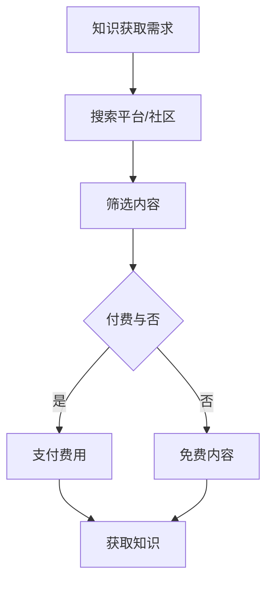
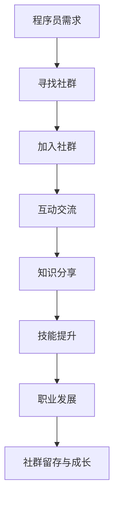

                 

### 文章标题 <此处是文章标题>

《知识付费：程序员的社群101》

关键词：知识付费，程序员社群，在线课程，电子书，专家咨询，平台发展，挑战与机遇

摘要：本文旨在深入探讨知识付费在程序员社群中的应用，分析其核心概念、市场现状及未来发展趋势。通过详细解析程序员社群的定义、价值、类型和发展现状，结合知识付费的核心功能和架构，探讨社群在程序员职业发展中的重要作用及未来趋势。文章结构紧凑，逻辑清晰，旨在为程序员提供全面的知识付费指南，助力其职业成长。

### 第一部分：知识付费概述与核心概念

#### 第1章：知识付费概述与核心概念

##### 1.1 知识付费的基本概念

**1.1.1 知识付费的定义**

知识付费，是指消费者为获取有价值的信息、技能或知识，通过支付费用来实现的交易行为。这种交易行为通常发生在数字化的平台上，如在线课程、电子书、专家咨询等。

**1.1.2 知识付费的起源与发展**

知识付费的起源可以追溯到20世纪末，随着互联网的普及和数字化学习的兴起，人们开始通过在线平台获取知识。21世纪初，随着移动互联网的发展，知识付费市场逐渐壮大，涌现出大量的知识付费平台，如网易云课堂、知乎Live等。

**1.1.3 知识付费的驱动力**

知识付费的驱动力主要有两个方面：一是用户对知识的渴求，随着社会的发展，人们越来越意识到知识的重要性，愿意为获取高质量的知识付费；二是互联网技术的发展，为知识付费提供了便捷的平台和工具。

##### 1.2 知识付费的类型

**1.2.1 在线课程**

在线课程是知识付费的主要形式之一，用户可以通过视频、直播、文档等多种形式学习。在线课程内容丰富，涵盖各类专业知识和技能，如编程、设计、营销等。

**1.2.2 电子书**

电子书是一种以数字形式存在的书籍，用户可以通过在线购买或下载获取。电子书具有携带方便、更新迅速等优点，是知识付费的重要形式之一。

**1.2.3 专家咨询**

专家咨询是指用户通过付费方式，向专业领域的专家寻求问题解答或专业建议。专家咨询具有较高的专业性和权威性，能够为用户提供切实可行的解决方案。

**1.2.4 其他知识付费形式**

除了在线课程、电子书和专家咨询，知识付费还包括知识付费问答、线上研讨会等多种形式。这些形式各具特色，满足用户多样化的知识需求。

##### 1.3 知识付费的市场现状

**1.3.1 市场规模与增长趋势**

近年来，知识付费市场呈现出快速增长的趋势。据相关数据显示，我国知识付费市场规模在2019年已经达到约2300亿元，预计未来还将继续保持高速增长。

**1.3.2 用户特征与需求**

知识付费用户主要集中在年轻人和中高收入人群。他们对知识的渴求较高，愿意为获取高质量的知识付费。用户需求主要集中在职业技能提升、兴趣爱好培养等方面。

**1.3.3 竞争格局与主要平台**

知识付费市场的主要竞争格局是平台竞争。目前，我国知识付费市场主要有网易云课堂、知乎Live、得到、喜马拉雅等平台。这些平台通过不断优化课程内容、提升用户体验等方式，争夺市场份额。

##### 1.4 知识付费的挑战与机遇

**1.4.1 内容质量与知识产权保护**

内容质量是知识付费的核心竞争力。平台需要确保课程内容的专业性、实用性和权威性。同时，知识产权保护也是一个重要问题，平台需要加强对知识产权的保护，防止侵权行为。

**1.4.2 用户留存与粘性**

用户留存和粘性是知识付费平台发展的重要指标。平台需要通过提供优质的内容、互动环节、个性化推荐等方式，提高用户的留存率和粘性。

**1.4.3 盈利模式与可持续发展**

知识付费平台的盈利模式主要包括课程销售、会员服务、广告投放等。平台需要不断创新盈利模式，确保可持续发展。

**1.4.4 技术创新与未来趋势**

随着人工智能、大数据等技术的不断发展，知识付费市场将迎来新的机遇。平台可以利用这些技术，提供更加个性化、智能化的服务，提升用户体验。

##### Mermaid 流程图：知识付费流程

##### 知识付费的核心概念联系

知识付费是一种通过数字化平台进行知识交易的经济模式，其中核心概念包括：

- **知识：** 是指通过学习和实践获得的信息、技能和经验。
- **付费：** 是指消费者为获取知识而支付的费用。
- **平台：** 是指提供知识交易场所的数字化平台。
- **用户：** 是指通过付费获取知识的个体。

这些概念相互关联，共同构成了知识付费的基本框架。用户在知识付费平台上根据需求获取知识，平台通过提供交易环境实现知识的价值交换。

### 第2章：程序员社群概述

#### 第2章：程序员社群概述

##### 2.1 程序员社群的定义与价值

**2.1.1 程序员社群的定义**

程序员社群是指由具有相同编程背景、技术兴趣或职业目标的程序员组成的在线或线下交流群体。这些社群为程序员提供了一个交流、学习、分享经验和资源的平台。

**2.1.2 程序员社群的价值**

程序员社群的价值主要体现在以下几个方面：

1. **知识共享：** 社群成员可以通过分享经验和知识，提高个人的技术水平和解决问题的能力。
2. **技能提升：** 社群提供了丰富的学习资源和实践机会，帮助程序员不断学习和掌握新技术。
3. **职业发展：** 社群可以提供职业指导、招聘信息和技术交流，帮助程序员在职业生涯中取得更大的发展。
4. **社交互动：** 社群为程序员提供了一个交流、互动和建立人脉的机会，有助于缓解工作压力和提升工作效率。

##### 2.2 程序员社群的类型

**2.2.1 开源社群**

开源社群是以开源项目为核心的组织，成员共同开发和维护开源软件。开源社群的特点是技术氛围浓厚，注重代码质量和开源精神的传播。

**2.2.2 技术论坛**

技术论坛是程序员交流技术问题和分享经验的重要平台，如 Stack Overflow、CSDN 等。技术论坛通常设有不同主题的讨论区，方便程序员根据兴趣和需求进行交流和讨论。

**2.2.3 在线课程平台**

在线课程平台是提供编程课程和培训服务的平台，如网易云课堂、慕课网等。这些平台为程序员提供了丰富的学习资源和在线学习环境。

**2.2.4 社交媒体群组**

社交媒体群组是基于社交媒体平台建立的程序员社群，如微信群、QQ 群、GitHub 上的组织等。社交媒体群组具有沟通便捷、互动性强等特点，方便程序员进行实时交流和协作。

##### 2.3 程序员社群的发展现状

**2.3.1 全球程序员社群的发展概况**

全球程序员社群的发展非常迅速，随着互联网技术的普及和开源文化的传播，越来越多的程序员加入到了社群中。全球知名的程序员社群包括 GitHub、Stack Overflow、Reddit 等，这些社群在全球范围内拥有大量的程序员成员。

**2.3.2 中国程序员社群的发展特点**

中国程序员社群的发展具有以下几个特点：

1. **数量庞大：** 中国拥有大量的程序员，程序员社群的数量也在快速增长。
2. **多样性：** 中国程序员社群涵盖了不同编程语言、技术领域和职业阶段的程序员，具有很高的多样性。
3. **活跃度高：** 中国程序员社群的活跃度较高，成员之间的交流和互动频繁。

**2.3.3 主要的程序员社群平台分析**

目前，中国主要的程序员社群平台包括：

1. **GitHub**：全球最大的代码托管平台，中国程序员广泛使用 GitHub 进行项目协作和技术交流。
2. **CSDN**：中国最大的 IT 社区，提供编程学习、技术问答和博客分享等服务。
3. **开源中国**：中国知名的 IT 开源社区，提供开源项目托管、技术文章分享和社群交流等功能。
4. **SegmentFault**：中国领先的技术问答社区，为程序员提供问题解答和技术交流平台。

##### 2.4 程序员社群的未来趋势

**2.4.1 社群生态的完善**

随着程序员社群的不断发展，社群生态将不断完善，包括课程培训、职业指导、技术分享等多个方面，为程序员提供更全面的服务。

**2.4.2 社群内容的专业化**

程序员社群将越来越注重内容的专业化，提供更高质量的技术教程、案例分析和实践经验，满足程序员对专业知识的渴求。

**2.4.3 技术社区的国际化**

随着全球化的推进，程序员社群将越来越走向国际化，跨国技术交流合作将更加频繁，有助于提高程序员的整体技术水平和全球影响力。

**2.4.4 社群经济的崛起**

程序员社群将逐步形成一种新的经济模式，社群成员通过知识付费、技术服务等多种方式实现经济收益，社群经济将蓬勃发展。

##### Mermaid 流程图：程序员社群发展流程

##### 程序员社群的核心概念联系

程序员社群是一种聚集有共同编程兴趣或专业背景的程序员群体，其主要核心概念包括：

- **程序员：** 是社群的主要成员，他们在社群中交流技术经验，分享知识。
- **社群：** 是程序员交流和学习的平台，通过社群，程序员可以获取新的技术信息、解决技术问题。
- **知识分享：** 是社群的核心活动，通过分享知识和经验，提升社群成员的技能水平。
- **职业发展：** 是社群的一个重要作用，社群中的资源可以帮助程序员在职业生涯中取得更大的发展。

这些概念相互关联，共同构成了程序员社群的基本运作机制。社群不仅为程序员提供了技术交流和学习的平台，还帮助他们实现职业上的成长和发展。

### 第3章：社群核心功能与架构

#### 第3章：社群核心功能与架构

##### 3.1 社群核心功能概述

**3.1.1 内容发布与分享**

内容发布与分享是社群的核心功能之一。社群成员可以在平台上发布技术文章、博客、教程等，与其他成员分享知识和经验。内容发布与分享有助于促进社群的活跃度，增强成员之间的互动和交流。

**3.1.2 互动与交流**

互动与交流是社群的另一个核心功能。社群成员可以通过评论、点赞、分享等方式进行互动，讨论技术问题、分享心得体会。互动与交流有助于建立社群的归属感和凝聚力，提高成员的粘性。

**3.1.3 知识库建设**

知识库建设是社群长期发展的重要保障。社群可以通过积累和整理成员发布的内容，建立一套系统的知识库，为成员提供丰富的学习资源。知识库建设有助于提高社群的价值，增强成员的学习效果。

**3.1.4 活动组织与参与**

活动组织与参与是社群的延伸功能。社群可以定期组织线上或线下活动，如技术讲座、分享会、代码马拉松等，吸引成员参与。活动组织与参与有助于提升社群的活跃度，增强成员之间的联系。

##### 3.2 社群平台架构

**3.2.1 系统架构设计**

社群平台系统架构设计是确保平台稳定、高效运行的关键。一个典型的社群平台系统架构包括以下几个方面：

1. **前端展示层**：负责展示用户界面，提供内容发布、互动交流等功能。
2. **应用服务层**：负责处理业务逻辑，如内容审核、用户管理、权限控制等。
3. **数据存储层**：负责存储用户数据、内容数据等，采用数据库或分布式存储系统。
4. **基础设施层**：包括服务器、网络、存储等基础设施，提供计算能力和数据存储能力。

**3.2.2 数据库设计与优化**

数据库设计是社群平台架构设计的重要组成部分。合理的数据库设计可以提高数据存储和查询的效率，降低系统开销。数据库设计主要包括以下几个方面：

1. **实体关系设计**：定义实体和实体之间的关系，如用户、内容、评论等。
2. **索引设计**：为常用的查询操作创建索引，提高查询速度。
3. **数据分区与分片**：对于大型社群平台，可以通过数据分区和分片技术，将数据分散存储在多个节点上，提高数据访问性能。

**3.2.3 安全性与隐私保护**

安全性是社群平台必须考虑的重要问题。社群平台需要确保用户数据的安全，防止数据泄露、篡改和滥用。主要的安全性和隐私保护措施包括：

1. **数据加密**：对存储在数据库中的敏感数据进行加密，确保数据安全。
2. **访问控制**：通过用户权限管理，限制不同用户对数据的访问权限。
3. **防火墙与入侵检测**：部署防火墙和入侵检测系统，防止外部攻击和恶意行为。
4. **安全审计**：定期对系统进行安全审计，检查潜在的安全漏洞和风险。

**3.2.4 性能优化与扩展性设计**

性能优化和扩展性设计是社群平台需要重点考虑的问题。高性能和可扩展性可以保证平台在大量用户和高并发访问下仍能稳定运行。性能优化和扩展性设计主要包括以下几个方面：

1. **缓存策略**：采用缓存策略，减少数据库访问压力，提高系统响应速度。
2. **负载均衡**：通过负载均衡技术，将访问流量分配到多个服务器上，提高系统处理能力。
3. **分布式架构**：采用分布式架构，将系统拆分为多个服务模块，提高系统扩展性和容错性。
4. **自动化运维**：通过自动化运维工具，实现系统的自动化部署、监控和故障恢复，提高运维效率。

##### 3.3 社群运营策略

**3.3.1 内容管理策略**

内容管理是社群运营的核心，直接影响社群的活跃度和成员的参与度。内容管理策略主要包括以下几个方面：

1. **内容审核**：对发布的内容进行审核，确保内容的合规性和质量。
2. **内容推荐**：根据用户的兴趣和行为，推荐相关的优质内容，提高用户的阅读体验。
3. **内容激励机制**：通过奖励机制，鼓励成员积极发布和分享内容，提高社群的活跃度。

**3.3.2 用户管理策略**

用户管理是社群运营的基础，包括用户注册、登录、权限管理等功能。用户管理策略主要包括以下几个方面：

1. **用户注册与登录**：提供简单、便捷的用户注册和登录流程，方便用户加入社群。
2. **用户权限管理**：根据用户角色和权限，限制不同用户对系统功能的访问。
3. **用户行为分析**：通过分析用户行为数据，了解用户需求，优化用户体验。

**3.3.3 活动策划与执行**

活动策划与执行是社群运营的重要手段，可以增强社群的凝聚力，提高成员的参与度。活动策划与执行主要包括以下几个方面：

1. **活动类型**：根据社群特点和成员需求，策划不同类型的活动，如技术讲座、分享会、代码马拉松等。
2. **活动宣传**：通过社群内部和外部的宣传渠道，提高活动的知名度和参与度。
3. **活动执行**：确保活动按照计划顺利进行，包括场地安排、人员组织、活动流程管理等。

**3.3.4 社群氛围营造**

社群氛围是影响成员参与度和留存率的重要因素。营造良好的社群氛围，可以提高成员的归属感和满意度。社群氛围营造主要包括以下几个方面：

1. **积极互动**：鼓励成员积极参与社群讨论，营造活跃的社群氛围。
2. **正面引导**：通过正面言论和行为引导，传递正能量，营造积极的社群文化。
3. **违规处理**：对于违规行为，及时进行处理，维护社群的秩序和氛围。

##### 3.3.5 盈利模式与可持续发展

**3.3.5.1 会员服务**

会员服务是社群盈利的重要模式之一。通过提供不同层次的会员服务，社群可以吸引更多用户付费，实现盈利。会员服务主要包括：

1. **高级会员**：提供更丰富的内容和特权，如专属课程、专属活动等。
2. **免费会员**：提供基础内容和福利，吸引更多用户加入社群。

**3.3.5.2 广告服务**

广告服务是社群的另一重要盈利模式。社群可以通过展示广告，为品牌和商家提供推广渠道。广告服务主要包括：

1. **内容广告**：在社群内容中展示广告，提高广告的曝光度。
2. **位置广告**：在社群活动、专题报道等位置展示广告，提高广告的关注度。

**3.3.5.3 知识付费**

知识付费是社群的主要盈利模式之一。社群可以提供付费内容，如课程、电子书、专家咨询等，满足用户对高质量知识的渴求。知识付费主要包括：

1. **在线课程**：提供专业、系统的在线课程，帮助用户提升技能。
2. **电子书**：提供专业、权威的电子书，满足用户的阅读需求。
3. **专家咨询**：提供专业领域的专家咨询服务，解决用户的问题。

**3.3.5.4 合作与联盟**

合作与联盟是社群实现可持续发展的关键。社群可以与其他企业、机构合作，共同打造生态系统，实现共赢。合作与联盟主要包括：

1. **战略合作**：与行业领先企业、机构建立战略合作关系，共同推动行业发展。
2. **内容合作**：与专业内容创作者、机构合作，提供更丰富、更优质的内容。
3. **技术合作**：与技术创新者、企业合作，引入新技术，提升社群的服务能力。

### 总结

本文从知识付费概述、程序员社群概述、社群核心功能与架构三个方面，详细阐述了知识付费在程序员社群中的应用。通过分析知识付费的核心概念、市场现状及未来趋势，揭示了程序员社群的定义、价值、类型和发展现状，深入探讨了社群的核心功能与架构，以及社群运营策略和盈利模式。本文旨在为程序员提供全面的知识付费指南，助力其职业成长和发展。在未来的发展中，程序员社群将继续发挥重要作用，推动知识付费市场的繁荣和发展。同时，社群运营者和参与者也需要不断创新和优化，以满足程序员对高质量知识的需求，实现社群的可持续发展。

