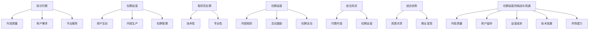
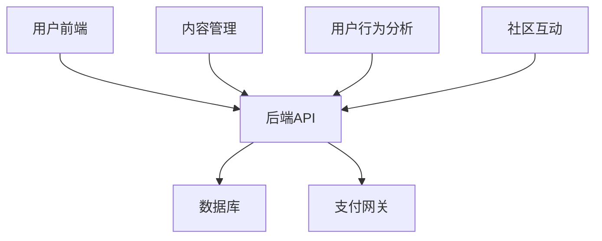

                 

## 文章标题

《知识付费：程序员的社群运营实操》

### 关键词

- **知识付费**
- **社群运营**
- **程序员**
- **内容质量**
- **用户需求**
- **平台服务**
- **技术性社群**
- **互动激励**
- **内容规划**
- **收益分配**
- **算法原理**
- **用户行为分析**

### 摘要

本文旨在探讨知识付费在程序员社群运营中的应用和实践。我们将深入分析知识付费的核心概念，包括其定义、核心要素以及与传统付费模式的区别。接着，我们将探讨程序员社群运营的定义、核心要素和策略，以及如何结合知识付费实现商业变现。文章最后，我们将详细讲解知识付费的核心算法原理，包括用户行为分析、内容推荐和收益分配等，并通过实际案例进行剖析。文章结构清晰，逻辑严密，旨在为程序员提供一份实操指南，助力他们在社群运营中实现知识付费的有效转化。

## 第一部分: 核心概念与联系

### 1.1 知识付费概念解析

知识付费，顾名思义，是指用户为了获取特定知识或技能，通过付费方式获取相应内容的一种商业模式。这种模式在互联网时代得到了广泛的应用，并逐渐成为信息获取的重要途径之一。知识付费的核心在于用户对内容价值的认可和付费意愿。

**知识付费的定义**：

知识付费是指内容创作者或知识提供者，通过在线平台提供有偿的知识、技能、课程或咨询服务，用户通过支付费用来获取这些有价值的信息。这种模式不仅改变了传统免费信息获取的旧有模式，也为内容创作者提供了持续的收入来源。

**知识付费的核心要素**：

1. **内容质量**：高质量的内容是知识付费成功的关键。内容需要具备专业性、实用性和深度，能够满足用户的需求，解决实际问题。
   
2. **用户需求**：了解用户需求是知识付费成功的前提。通过数据分析、用户调研等方式，精准把握用户的知识需求，提供符合用户期望的内容。

3. **平台服务**：平台服务包括用户交互体验、支付通道、内容更新速度等。良好的平台服务可以提高用户的满意度和留存率。

**知识付费与传统付费的差别**：

1. **形式差异**：传统付费通常是指用户购买实物产品或服务，而知识付费是一种在线虚拟服务，用户通过支付获取电子内容。

2. **用户体验**：知识付费强调用户体验，包括内容更新的及时性、互动性、服务响应速度等。传统付费则更多地关注商品或服务的质量和售后保障。

通过以上对知识付费概念的分析，我们可以看到，知识付费是一种新兴的商业模式，它不仅改变了信息获取的方式，也为用户和内容创作者创造了新的价值。

### 1.2 程序员的社群运营

**社群运营的定义**：

社群运营是指通过一系列策略和手段，维护和扩展社群成员之间的互动，提高社群的活跃度和用户粘性。社群运营的目标是构建一个具有凝聚力、互动性和归属感的社区，从而促进用户之间的交流和知识共享。

**社群运营的核心要素**：

1. **用户互动**：用户互动是社群运营的核心。通过多种互动方式，如问答、讨论、活动等，促进用户之间的交流，增加用户参与度。

2. **内容生产**：内容生产是社群运营的重要环节。提供有价值的内容，引导用户产生共鸣，增加社群的吸引力和用户粘性。

3. **社群管理**：社群管理包括维护社群秩序、处理成员间的冲突、定期更新和优化社群内容等，确保社群的健康发展和用户的满意度。

**社群运营与社群营销的联系**：

1. **共同目标**：社群运营和社群营销都旨在吸引和保留用户。不同的是，社群运营更注重长期用户关系的维护，而社群营销则更关注短期转化效果。

2. **手段差异**：社群运营通过内容生产、用户互动、社群活动等手段，建立用户的信任和归属感；而社群营销则更多依赖于广告投放、促销活动等手段，以快速吸引新用户并实现销售目标。

通过以上分析，我们可以看到，程序员的社群运营不仅需要关注用户互动和内容生产，还要结合社群管理和营销策略，以实现社群的持续发展和用户的长期价值。

### 1.3 程序员的社群运营实操

**程序员社群的特点**：

1. **技术性**：程序员社群成员大多具备编程技能，对技术话题有较高的专业素养。社群内讨论的内容通常涉及编程语言、框架、工具、算法等方面。

2. **专业性**：程序员社群的专业性体现在对技术解决方案和最佳实践有较高要求。成员之间交流的内容更注重实用性和深度，以解决实际问题为目标。

**社群运营策略**：

1. **内容规划**：根据用户需求和技术热点，制定内容发布计划。内容应涵盖编程语言、框架、工具、算法、最佳实践等，确保内容的多样性和实用性。

2. **互动激励**：通过奖励机制，鼓励用户参与讨论和分享。例如，设立最佳回答者、优秀分享者等奖项，激发用户的积极性和创造力。

3. **社群活动**：定期举办线上或线下活动，如技术沙龙、代码竞赛、分享会等，增强社群的凝聚力和成员之间的互动。活动形式应多样化，以适应不同成员的需求和兴趣。

通过以上策略，程序员的社群运营不仅能够满足成员的专业需求，还能提高社群的活跃度和用户粘性，实现社群的可持续发展。

### 1.4 社群运营与知识付费的结合

**结合形式**：

1. **付费内容**：社群运营者可以提供付费的技术教程、文档、课程等，满足专业人士对深度知识的需求。这些付费内容可以是独家发布，也可以是与其他平台的合作产品。

2. **社群运营**：通过社群运营，推广付费内容，提升用户黏性。社群运营者可以通过内容预告、互动讨论、用户反馈等方式，增强用户对付费内容的期待和兴趣。

**结合优势**：

1. **资源共享**：社群成员可以共享知识，提高整体技术水平。付费内容不仅为用户提供学习资源，也为社群的持续发展提供了动力。

2. **商业变现**：通过付费内容，实现社群成员的价值变现。内容创作者可以通过付费内容获得收入，而社群运营者则可以通过提供服务获得收益。

通过知识付费与社群运营的结合，不仅能够满足用户的专业需求，还能实现商业变现，为社群的可持续发展提供支持。

### 1.5 社群运营的挑战与机遇

**挑战**：

1. **内容质量**：保证内容的专业性和实用性，是社群运营面临的重大挑战。内容质量直接影响用户的参与度和满意度。

2. **用户留存**：提高用户的参与度和留存率，是社群运营的另一个挑战。需要通过不断优化内容和互动方式，保持用户的兴趣和活跃度。

3. **运营成本**：持续投入时间和资源进行社群运营，会带来较高的运营成本。运营者需要在资源有限的情况下，实现高效的社群管理。

**机遇**：

1. **技术发展**：随着人工智能、大数据等技术的不断发展，社群运营的效率和质量将得到显著提升。利用这些技术，可以更好地了解用户需求，优化内容推荐和互动方式。

2. **市场潜力**：知识付费市场持续增长，为社群运营带来了巨大的市场潜力。通过提供高质量的内容和良好的用户体验，社群运营者可以抓住这一市场机遇，实现商业变现。

通过面对挑战和把握机遇，社群运营者可以不断提升运营效果，实现社群的可持续发展。

### Mermaid 流程图

以下是“知识付费与社群运营”核心概念的 Mermaid 流程图：



### 1.6 总结

知识付费与社群运营的结合，为程序员提供了获取知识和交流的平台，也为内容提供者创造了新的收入来源。通过有效的社群运营策略，可以提升用户体验，增强用户粘性，实现知识付费的商业化运营。面对内容质量、用户留存和运营成本等挑战，社群运营者需要不断创新和优化，以实现社群的可持续发展。同时，利用技术发展带来的机遇，不断提升运营效率和市场竞争力。

### 知识付费的核心算法原理

知识付费的核心算法原理主要涉及用户行为分析、内容推荐和收益分配等方面。以下是对这些核心算法的详细解释：

#### 2.1 用户行为分析

用户行为分析是指通过对用户在平台上的行为数据进行分析，以了解用户的需求、兴趣和偏好。这一过程通常包括以下几个方面：

1. **用户登录和注册信息**：分析用户的登录和注册信息，包括注册时间、登录频率、设备信息等，以了解用户的活跃度和使用习惯。

2. **浏览和搜索行为**：记录用户的浏览和搜索行为，包括访问的页面、搜索的关键词、停留时间等，以了解用户对哪些内容更感兴趣。

3. **购买和支付行为**：分析用户的购买和支付行为，包括购买频率、购买内容、支付金额等，以了解用户的消费习惯和偏好。

4. **互动和评论行为**：记录用户在平台上的互动和评论行为，包括发布的问题、回答、评论等，以了解用户的参与度和贡献度。

**用户行为分析算法原理**：

用户行为分析通常采用以下算法原理：

- **用户画像**：通过收集和分析用户的基本信息、行为数据等，构建用户的详细画像，包括用户的兴趣、需求、行为习惯等。

- **行为预测**：利用机器学习算法，对用户的行为进行预测，例如预测用户下一步可能访问的页面、购买的内容等。

- **个性化推荐**：根据用户的兴趣和行为，推荐用户可能感兴趣的内容，提高用户粘性。

#### 2.2 内容推荐

内容推荐是指根据用户的行为数据和偏好，为用户推荐感兴趣的内容。内容推荐是知识付费平台的重要组成部分，能够提高用户满意度和留存率。

**内容推荐算法原理**：

1. **协同过滤**：协同过滤是一种常见的内容推荐算法，通过分析用户之间的行为相似性，推荐其他用户喜欢的内容给目标用户。

   - **用户基于的协同过滤**：通过分析用户之间的行为相似性，找到相似用户群体，为用户推荐他们喜欢的内容。
   
   - **物品基于的协同过滤**：通过分析物品之间的相似性，找到与用户已购买或浏览的物品相似的物品，为用户推荐。

2. **基于内容的推荐**：基于内容的推荐通过分析内容的特征，为用户推荐相似的内容。

   - **关键词匹配**：通过分析用户历史行为中的关键词，找到与关键词相似的内容进行推荐。
   
   - **语义分析**：利用自然语言处理技术，分析内容的语义，为用户推荐具有相似语义的内容。

3. **混合推荐**：结合协同过滤和基于内容的推荐，提高推荐的准确性和多样性。

#### 2.3 收益分配

收益分配是指将平台收入分配给内容创作者和平台运营者。合理的收益分配机制能够激励内容创作者提供高质量的内容，同时保障平台运营的可持续性。

**收益分配算法原理**：

1. **按劳分配**：按劳分配是根据内容创作者的贡献度进行收益分配，通常包括以下指标：

   - **内容质量**：根据内容的受欢迎程度、用户评价等因素评估内容质量。
   
   - **用户活跃度**：根据用户对内容的互动行为，如点赞、评论、分享等，评估用户的活跃度。

   - **贡献度**：根据内容创作者的贡献，如发布的文章数量、参与的活动等，评估创作者的贡献度。

2. **分成模式**：平台通常采用分成模式进行收益分配，根据平台和创作者之间的约定比例进行分配。

   - **固定比例分成**：平台和创作者之间约定固定的分成比例，例如五五分。
   
   - **动态比例分成**：根据创作者的贡献度和平台的运营状况，动态调整分成比例。

3. **激励措施**：为了鼓励内容创作者提供高质量的内容，平台可以设置奖励措施，如季度奖金、优秀创作者奖等。

通过上述算法原理，知识付费平台能够更好地满足用户需求，提高用户满意度，同时保障内容创作者的权益，实现平台和用户的共赢。

### 2.4 项目实战：知识付费平台架构设计与实现

在本节中，我们将通过一个具体的项目实战，介绍如何设计和实现一个知识付费平台。该项目将涵盖从需求分析、系统架构设计到核心功能的实现，旨在为读者提供一个全面的技术实战指南。

#### 1. 需求分析

在开始项目之前，我们需要明确平台的需求。以下是我们列出的一些关键需求：

- **用户注册与登录**：支持用户注册、登录和密码找回功能。
- **内容管理**：管理员可以上传、编辑、删除和分类管理内容。
- **知识付费**：用户可以购买和观看付费内容，平台支持在线支付功能。
- **用户行为分析**：平台需要记录和分析用户的行为数据，用于推荐系统和个性化服务。
- **社区互动**：用户可以在社区中提问、回答、评论和点赞，增加互动性。

#### 2. 系统架构设计

根据需求分析，我们可以将系统架构设计为以下几部分：

1. **前端**：用户界面，包括用户注册登录、内容浏览、购买和支付、社区互动等功能。
2. **后端**：服务器端，处理业务逻辑、数据存储和用户行为分析等。
3. **数据库**：存储用户数据、内容数据和交易数据等。
4. **支付网关**：与第三方支付平台对接，处理支付请求。

**系统架构图**：



#### 3. 核心功能实现

以下是对平台核心功能的实现细节：

1. **用户注册与登录**：

   - **注册**：用户通过邮箱或手机号注册，填写基本信息，系统生成用户ID。
   - **登录**：用户输入用户名和密码进行登录，系统验证用户身份。

   **伪代码**：

   ```python
   def register(email, password, info):
       # 验证邮箱格式
       if not validate_email(email):
           return "Invalid email"
       # 验证密码强度
       if not validate_password(password):
           return "Invalid password"
       # 存储用户信息
       store_user_info(email, password, info)
       return "Registered successfully"

   def login(username, password):
       # 从数据库查询用户信息
       user = get_user_info(username)
       # 验证密码
       if not verify_password(password, user.password):
           return "Invalid password"
       return "Logged in successfully"
   ```

2. **内容管理**：

   - **内容上传**：管理员可以上传新内容，包括文章、视频等。
   - **内容编辑**：管理员可以编辑已上传的内容。
   - **内容分类**：内容可以根据主题、难度等进行分类。

   **伪代码**：

   ```python
   def upload_content(admin_id, content_data):
       # 验证管理员身份
       if not is_admin(admin_id):
           return "Unauthorized"
       # 存储内容
       store_content(content_data)
       return "Content uploaded successfully"

   def edit_content(admin_id, content_id, new_data):
       # 验证管理员身份
       if not is_admin(admin_id):
           return "Unauthorized"
       # 更新内容
       update_content(content_id, new_data)
       return "Content updated successfully"
   ```

3. **知识付费**：

   - **内容购买**：用户可以购买付费内容，系统生成订单。
   - **支付**：用户选择支付方式，系统与支付网关交互处理支付。
   - **观看**：用户购买后可以观看付费内容。

   **伪代码**：

   ```python
   def purchase_content(user_id, content_id):
       # 验证用户身份
       if not is_user(user_id):
           return "Unauthorized"
       # 创建订单
       order = create_order(user_id, content_id)
       # 处理支付
       process_payment(order)
       return "Content purchased successfully"

   def watch_content(user_id, content_id):
       # 验证用户身份和购买状态
       if not is_purchased(user_id, content_id):
           return "Content not purchased"
       # 提供内容观看
       provide_content(content_id)
       return "Content available"
   ```

4. **用户行为分析**：

   - **记录行为**：系统记录用户的浏览、购买、互动等行为。
   - **数据分析**：分析用户行为数据，用于内容推荐和个性化服务。

   **伪代码**：

   ```python
   def record_action(user_id, action_type, action_data):
       # 记录行为
       store_action(user_id, action_type, action_data)

   def analyze_actions():
       # 分析用户行为
       actions = get_actions()
       # 根据行为推荐内容
       recommend_contents(actions)
   ```

5. **社区互动**：

   - **提问与回答**：用户可以提问，其他用户可以回答。
   - **评论与点赞**：用户可以对内容进行评论和点赞。

   **伪代码**：

   ```python
   def ask_question(user_id, question):
       # 验证用户身份
       if not is_user(user_id):
           return "Unauthorized"
       # 存储问题
       store_question(user_id, question)
       return "Question asked successfully"

   def answer_question(question_id, user_id, answer):
       # 验证用户身份
       if not is_user(user_id):
           return "Unauthorized"
       # 存储回答
       store_answer(question_id, user_id, answer)
       return "Answered successfully"

   def comment_content(content_id, user_id, comment):
       # 验证用户身份
       if not is_user(user_id):
           return "Unauthorized"
       # 存储评论
       store_comment(content_id, user_id, comment)
       return "Comment added successfully"

   def like_content(content_id, user_id):
       # 验证用户身份
       if not is_user(user_id):
           return "Unauthorized"
       # 记录点赞
       record_like(content_id, user_id)
       return "Content liked successfully"
   ```

#### 4. 代码解读与分析

在上述核心功能实现中，我们通过伪代码展示了系统的主要功能模块。以下是部分代码的详细解读和分析：

- **用户注册与登录**：通过`register`和`login`函数，实现了用户注册和登录的基本功能。注册时，首先验证邮箱格式和密码强度，然后存储用户信息；登录时，验证用户名和密码是否匹配。

- **内容管理**：`upload_content`和`edit_content`函数实现了管理员上传和编辑内容的功能。上传时，首先验证管理员身份，然后存储内容；编辑时，同样验证管理员身份，然后更新内容。

- **知识付费**：`purchase_content`和`watch_content`函数实现了内容购买和观看的功能。购买时，首先验证用户身份和购买状态，然后处理支付并生成订单；观看时，验证用户是否已购买该内容，并提供内容观看服务。

- **用户行为分析**：`record_action`函数记录用户行为，`analyze_actions`函数分析用户行为数据，用于内容推荐和个性化服务。

- **社区互动**：`ask_question`、`answer_question`、`comment_content`和`like_content`函数实现了社区互动功能。提问、回答、评论和点赞时，均需验证用户身份，并相应地存储和记录用户互动数据。

通过上述项目实战，我们展示了知识付费平台的设计与实现过程。该平台不仅提供了用户注册、内容管理、知识付费、用户行为分析和社区互动等功能，还通过具体的代码示例，说明了各个功能模块的实现细节。在实际开发过程中，开发者可以根据具体需求和技术栈，选择合适的框架和工具，实现知识付费平台的搭建和运营。

### 2.5 最佳实践 Tips

在知识付费社群运营中，以下是一些最佳实践和技巧，可以帮助运营者提高内容质量、用户参与度和留存率：

1. **精准定位用户需求**：通过市场调研、用户反馈和数据分析，深入了解用户需求，提供符合用户期望的内容。

2. **高质量内容生产**：注重内容的深度和实用性，确保内容的专业性和准确性，以提高用户的满意度和信任度。

3. **互动激励机制**：设置互动奖励，如积分、会员权益、优秀回答者等，激励用户积极参与讨论和分享。

4. **定期内容更新**：保持内容的及时性和新鲜感，定期发布新内容，以保持用户的持续关注。

5. **个性化推荐**：利用用户行为分析，实现个性化内容推荐，提高用户粘性和满意度。

6. **社区活动**：定期举办线上线下活动，如技术沙龙、分享会等，增强社群的凝聚力和活跃度。

7. **用户反馈机制**：建立有效的用户反馈渠道，及时收集和处理用户意见，不断优化产品和服务。

通过以上最佳实践，运营者可以提升社群运营效果，实现知识付费的商业化成功。

### 小结

本文通过深入分析知识付费与社群运营的核心概念、算法原理和项目实战，为程序员提供了一套完整的社群运营实操指南。我们探讨了知识付费的定义、核心要素、与传统付费的区别，以及社群运营的定义、核心要素和策略。同时，通过项目实战展示了如何设计和实现一个知识付费平台。总结来说，知识付费与社群运营的结合，不仅能够满足用户的专业需求，还能实现商业变现，为社群的可持续发展提供支持。对于程序员来说，掌握这些实操技巧，将有助于提升社群运营效果，实现知识付费的商业化成功。

### 注意事项与拓展阅读

**注意事项**：

1. **内容质量**：确保内容的专业性和实用性，避免发布低质量或无关的内容。
2. **用户隐私**：严格遵守用户隐私保护法规，确保用户数据安全。
3. **持续更新**：定期发布新内容，保持社区活跃度和用户的持续关注。
4. **互动激励**：合理设计互动激励机制，提高用户参与度和满意度。

**拓展阅读**：

1. 《Python编程：从入门到实践》—— Eric Matthes
2. 《深入理解计算机系统》—— 阿毛
3. 《人工智能：一种现代方法》—— Stuart J. Russell & Peter Norvig
4. 《社群运营实战》—— 程序员社区运营手册
5. 《知识付费：商业模式解析与实战》—— 张浩

通过以上拓展阅读，读者可以进一步深入了解相关领域的知识和技术，提升社群运营和知识付费的能力。

### 作者信息

**作者：**AI天才研究院/AI Genius Institute & 禅与计算机程序设计艺术 /Zen And The Art of Computer Programming

AI天才研究院（AI Genius Institute）致力于推动人工智能技术的发展和应用，旨在培养下一代人工智能领域的顶尖专家。同时，作者还撰写了《禅与计算机程序设计艺术》，深入探讨了计算机编程的哲学和艺术，为程序员提供了独特的视角和思考方式。

