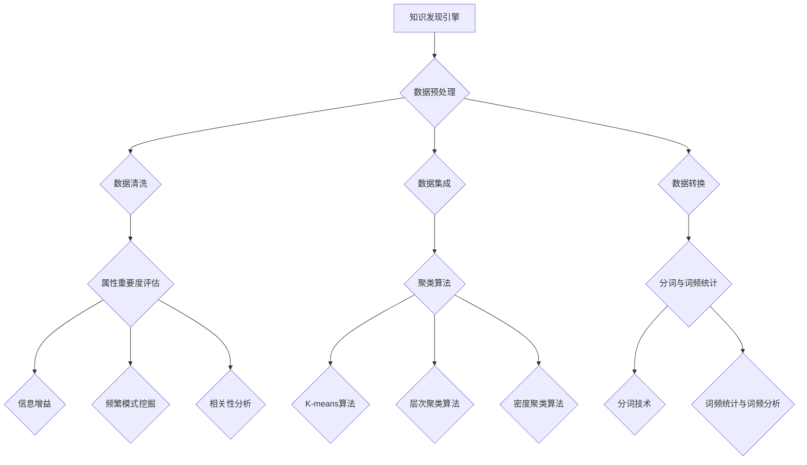

                 


### 《知识发现引擎助力程序员快速掌握行业动态》

> 关键词：知识发现引擎、程序员、行业动态、技术趋势、职业发展

> 摘要：本文将介绍知识发现引擎的基本概念、原理及应用，探讨如何利用知识发现引擎帮助程序员快速掌握行业动态，提升职业竞争力。

#### 第一部分：知识发现引擎基础

##### 第1章：知识发现引擎概述

知识发现引擎（Knowledge Discovery Engine）是一种基于数据挖掘和机器学习技术，用于自动从大规模数据集中发现知识、模式和规律的智能化工具。它广泛应用于数据驱动的决策支持、知识管理、数据可视化、智能推荐等领域。知识发现引擎的重要性在于它能够帮助用户从海量数据中挖掘出有价值的信息，提供决策支持，提高工作效率。

##### 第2章：知识发现算法原理

知识发现算法包括数据预处理技术、属性重要度评估方法、聚类算法和分词与词频统计等多个方面。以下将逐一介绍这些算法的基本原理。

- **数据预处理技术**：包括数据清洗、数据集成和数据转换。数据清洗旨在去除噪声和错误数据；数据集成是将来自多个源的数据整合到一个统一的格式中；数据转换则是将数据转换为适合挖掘和分析的格式。

  **伪代码**：
  ```
  function data_preprocessing(data):
      data = clean_data(data)
      data = integrate_data(data)
      data = transform_data(data)
      return data
  ```

- **属性重要度评估方法**：常用的方法有信息增益、频繁模式挖掘和相关性分析。信息增益用于评估属性对分类的预测能力；频繁模式挖掘用于发现数据集中的频繁项集；相关性分析用于评估属性之间的相关性。

  **伪代码**：
  ```
  function attribute_importance(attribute, data):
      gain = information_gain(attribute, data)
      return gain
  ```

- **聚类算法**：包括K-means、层次聚类和密度聚类等。K-means算法通过迭代优化聚类中心，将数据点分配到不同的簇中；层次聚类算法通过递归地将数据点合并或分裂，形成层次结构；密度聚类算法则通过识别数据点的高密度区域，形成聚类簇。

  **伪代码**：
  ```
  function k_means(data, k):
      centroids = initialize_centroids(data, k)
      while not converged:
          assign_data_to_centroids(data, centroids)
          update_centroids(centroids)
      return centroids
  ```

- **分词与词频统计**：分词技术用于将文本数据拆分成单词或短语；词频统计则是统计每个单词或短语的出现的频率，用于文本数据的分析和挖掘。

  **伪代码**：
  ```
  function tokenize(text):
      tokens = split_text(text)
      return tokens

  function count_frequency(tokens):
      frequency = count(tokens)
      return frequency
  ```

##### 第3章：知识发现引擎构建与实践

构建知识发现引擎包括数据收集与预处理、算法选择与实现、知识提取与可视化等步骤。以下以一个简单的知识发现引擎项目为例，介绍其实践过程。

- **项目需求分析**：确定项目目标和需求，例如，从技术博客中提取热门话题和趋势。
- **数据收集与预处理**：收集相关的数据源，如技术博客、社交媒体等，并进行数据清洗、集成和转换。
- **算法选择与实现**：根据项目需求，选择合适的算法，如文本分类、聚类等，并进行实现。
- **知识提取与可视化**：提取数据中的知识，并通过可视化技术展示分析结果。

**项目实战：构建一个简单的知识发现引擎**

**1. 项目需求分析**
- 目标：从技术博客中提取热门话题和趋势。
- 需求：提供关键词云、热门话题分布图等可视化结果。

**2. 数据收集与预处理**
- 数据源：技术博客、社交媒体等。
- 数据预处理：数据清洗、集成和转换。

**3. 算法选择与实现**
- 算法：文本分类、词频统计、关键词提取等。
- 实现：使用Python等编程语言，实现相关算法。

**4. 知识提取与可视化**
- 知识提取：提取关键词、热门话题等。
- 可视化：生成关键词云、热门话题分布图等。

**5. 项目小结**
- 总结：介绍了知识发现引擎的构建过程，并通过一个简单的项目展示了其实际应用。

#### 第二部分：知识发现引擎在程序员中的应用

##### 第4章：知识发现引擎助力程序员掌握技术动态

- **程序员面临的挑战**：程序员需要不断学习新知识，掌握技术动态，但信息量庞大，难以筛选。
- **利用知识发现引擎发现技术趋势**：通过知识发现引擎，程序员可以快速了解技术趋势、热点和技术风险。
- **知识发现引擎在程序员职业发展中的应用**：通过知识发现引擎，程序员可以进行技能评估、职业规划和机会发现。

##### 第5章：知识发现引擎在团队协作与项目管理中的应用

- **团队协作中的知识共享与传递**：知识发现引擎可以帮助团队共享和传递知识。
- **利用知识发现引擎优化项目流程**：通过知识发现引擎，团队可以识别项目风险、监控进度，并调整项目流程。
- **知识发现引擎在代码审查与质量保证中的应用**：知识发现引擎可以帮助团队进行代码审查和质量保证。

##### 第6章：知识发现引擎助力程序员职业成长

- **程序员职业规划与技能发展**：知识发现引擎可以帮助程序员制定职业规划，提升技能。
- **利用知识发现引擎发现职业机会**：知识发现引擎可以帮助程序员发现职业机会。
- **知识发现引擎在人才招聘与培养中的应用**：知识发现引擎可以帮助企业进行人才招聘和培养。

#### 第三部分：知识发现引擎的前沿技术与发展趋势

##### 第7章：知识发现引擎的前沿技术

- **基于深度学习的知识发现技术**：结合深度学习技术，提升知识发现的效果和精度。
- **多模态数据挖掘**：处理多种类型的数据，如文本、图像、音频等。
- **知识图谱与语义网技术**：构建知识图谱，实现知识的语义理解。

##### 第8章：知识发现引擎的发展趋势

- **人工智能与知识发现的融合**：将人工智能技术应用于知识发现过程。
- **知识发现引擎在云计算和大数据环境中的应用**：在云计算和大数据环境中，知识发现引擎将发挥更大的作用。
- **开源知识发现工具与平台的发展趋势**：开源知识发现工具和平台的发展，将降低知识发现技术的门槛。

##### 第9章：未来展望

- **知识发现引擎在新兴领域中的应用**：知识发现引擎将在新兴领域，如人工智能、物联网等，发挥重要作用。
- **知识发现引擎的发展挑战与解决方案**：面对数据隐私、算法透明度等挑战，知识发现引擎需要不断优化和改进。
- **知识发现引擎的未来发展方向**：知识发现引擎将向智能化、自动化和多样化的方向发展。

---

### 附录

##### 附录A：知识发现引擎常用工具与资源

- **常用知识发现工具介绍**：如Apache Mahout、ELKI等。
- **开源知识发现库与框架**：如MOA、Weka等。
- **知识发现相关会议与期刊**：如ACM SIGKDD、IEEE ICDM等。

---

#### Mermaid 流程图



---

**作者：AI天才研究院/AI Genius Institute & 禅与计算机程序设计艺术 /Zen And The Art of Computer Programming**

