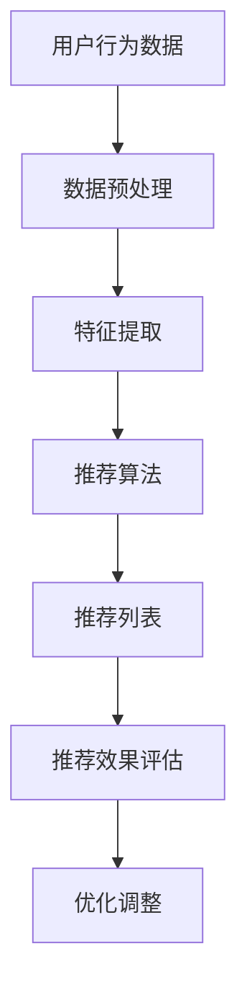

                 

### 文章标题：知识发现引擎助力程序员技能迭代升级

> 关键词：知识发现引擎，程序员技能迭代，数据挖掘，机器学习，算法优化

> 摘要：本文将深入探讨知识发现引擎在程序员技能迭代升级中的应用，通过介绍知识发现引擎的基础知识、架构设计、算法详解以及实际案例分析，帮助程序员更好地掌握前沿技术，提升编程能力和项目实战能力。

---

### 第一部分：知识发现引擎基础

#### 第1章：知识发现引擎概述

##### 1.1 知识发现引擎的概念与分类

**1.1.1 知识发现引擎的定义**

知识发现引擎（Knowledge Discovery Engine，简称KDE）是一种利用数据挖掘技术，从大量原始数据中自动发现有趣知识、模式和规律的智能系统。它通常被应用于各种领域，如商业智能、金融分析、医疗诊断、社交媒体等。

**1.1.2 知识发现引擎的分类**

知识发现引擎可以根据其应用场景和功能特点进行分类，常见的分类方式如下：

1. **基于数据库的知识发现引擎**：这种引擎主要针对数据库中的数据进行分析和挖掘，例如关系数据库、NoSQL数据库等。
2. **基于数据仓库的知识发现引擎**：数据仓库是大规模数据的集合，知识发现引擎通过对数据仓库中的数据进行处理和分析，发现潜在的知识和模式。
3. **基于互联网的知识发现引擎**：这种引擎主要用于分析互联网上的数据，包括用户行为数据、社交媒体数据、网络文本数据等。
4. **基于行业应用的知识发现引擎**：这类引擎针对特定行业进行定制化开发，如金融行业的风险控制引擎、医疗行业的诊断引擎等。

**1.1.3 知识发现引擎的基本功能**

知识发现引擎的基本功能包括数据采集、数据预处理、特征提取、模型训练、模型评估等。具体来说：

1. **数据采集**：从各种数据源（如数据库、文件、网络等）中获取数据。
2. **数据预处理**：对原始数据进行清洗、去噪、转换等操作，使其适合后续分析。
3. **特征提取**：从原始数据中提取出对分析任务有用的特征。
4. **模型训练**：使用特征数据训练模型，以发现数据中的模式和规律。
5. **模型评估**：对训练好的模型进行评估，以确定其性能和可靠性。

#### 第2章：知识发现引擎的技术原理

##### 2.1 数据挖掘技术

数据挖掘技术是知识发现引擎的核心组成部分，其主要任务是从大量数据中提取出有用的信息和知识。数据挖掘技术主要包括以下方面：

1. **数据预处理技术**：包括数据清洗、数据集成、数据转换和数据归一化等。
2. **特征提取技术**：从原始数据中提取出对分析任务有用的特征，如统计特征、文本特征、图像特征等。
3. **模型训练与评估技术**：包括监督学习、无监督学习和强化学习等。

**2.1.1 数据预处理技术**

数据预处理是数据挖掘过程中的重要环节，其目的是提高数据质量和数据可用性。数据预处理技术包括：

1. **数据清洗**：去除重复数据、缺失数据、异常数据等。
2. **数据集成**：将来自不同数据源的数据进行合并。
3. **数据转换**：将数据转换为适合分析的形式，如数值化、归一化等。
4. **数据归一化**：消除数据之间的比例差异，使数据在同一尺度上进行比较。

**2.1.2 特征提取技术**

特征提取是从原始数据中提取出对分析任务有用的特征，以降低数据维度、提高模型性能。特征提取技术包括：

1. **统计特征提取**：从数据中提取出描述数据分布、趋势和关系的统计量，如均值、方差、相关性等。
2. **文本特征提取**：从文本数据中提取出描述文本内容的关键词、词频、词向量等。
3. **图像特征提取**：从图像数据中提取出描述图像内容的特征，如边缘、纹理、颜色等。

**2.1.3 模型训练与评估技术**

模型训练与评估是数据挖掘中的核心步骤，其目的是构建出能够对数据进行预测和分类的模型。模型训练与评估技术包括：

1. **监督学习算法**：包括线性回归、逻辑回归、决策树、支持向量机等。
2. **无监督学习算法**：包括聚类、降维、主成分分析等。
3. **强化学习算法**：通过学习环境与策略，实现智能体在复杂环境中的决策。

##### 2.2 机器学习算法

机器学习算法是知识发现引擎的重要组成部分，用于从数据中学习模式和规律。机器学习算法可以分为以下几类：

**2.2.1 监督学习算法**

监督学习算法在有标记的数据集上进行训练，通过学习输入和输出之间的映射关系，实现对未知数据的预测。常见的监督学习算法包括：

1. **线性回归**：用于预测连续值输出。
2. **逻辑回归**：用于预测离散值输出。
3. **决策树**：根据特征值进行分支，形成决策树结构。
4. **支持向量机**：通过找到一个最优超平面，实现分类或回归。

**2.2.2 无监督学习算法**

无监督学习算法在没有标记的数据集上进行训练，旨在发现数据中的模式和结构。常见的无监督学习算法包括：

1. **K-均值聚类**：将数据分为K个聚类，使得每个聚类内的数据点距离聚类中心的距离最小。
2. **主成分分析（PCA）**：通过线性变换，将高维数据转换为低维数据，同时保留数据的主要信息。

**2.2.3 强化学习算法**

强化学习算法通过学习环境与策略，实现智能体在复杂环境中的决策。强化学习算法的核心是奖励机制，智能体通过不断尝试和反馈，逐步优化其策略。常见的强化学习算法包括：

1. **Q-Learning**：通过学习Q值，实现智能体的最优策略。
2. **深度强化学习**：结合深度神经网络，实现更复杂的决策。

##### 2.3 知识发现引擎的应用场景

知识发现引擎在各个行业领域都有着广泛的应用，以下列举了几个典型应用场景：

**2.3.1 数据库与数据仓库**

知识发现引擎可以用于数据库和数据仓库中的数据挖掘，帮助用户发现数据中的价值和规律，如市场趋势分析、客户行为分析等。

**2.3.2 互联网应用**

知识发现引擎可以用于分析互联网上的数据，如用户行为分析、社交媒体分析、搜索引擎优化等，帮助互联网企业更好地了解用户需求和市场动态。

**2.3.3 金融行业**

知识发现引擎在金融行业中有着广泛的应用，如风险控制、投资组合优化、客户关系管理等，帮助金融机构提高业务效率和风险控制能力。

**2.3.4 医疗领域**

知识发现引擎可以用于医疗数据分析，如疾病诊断、药物研发、医疗资源优化等，为医疗行业提供数据驱动的决策支持。

**2.3.5 其他行业应用**

知识发现引擎还广泛应用于其他行业，如制造业、能源、交通等，帮助各行业企业实现智能化管理和优化。

#### 第2章：知识发现引擎架构设计与实现

##### 2.1 架构设计原则

知识发现引擎的架构设计需要遵循以下原则：

**2.1.1 可扩展性**

知识发现引擎应具备良好的可扩展性，能够适应数据量和用户量的增长，支持新增功能模块。

**2.1.2 高效性**

知识发现引擎应具备高效的处理能力，能够在短时间内完成大规模数据的分析和挖掘。

**2.1.3 可维护性**

知识发现引擎应具备良好的可维护性，易于升级和优化，降低运维成本。

##### 2.2 数据采集与预处理

**2.2.1 数据采集方法**

数据采集是知识发现引擎的基础，其方法包括：

1. **自动化采集**：通过爬虫、API接口等自动化方式获取数据。
2. **手动采集**：通过人工方式收集数据，如问卷调查、访谈等。

**2.2.2 数据预处理流程**

数据预处理是数据挖掘过程中至关重要的一步，其流程包括：

1. **数据清洗**：去除重复数据、缺失数据、异常数据等。
2. **数据集成**：将来自不同数据源的数据进行合并。
3. **数据转换**：将数据转换为适合分析的形式，如数值化、归一化等。

**2.2.3 数据质量控制**

数据质量控制是确保数据质量的重要环节，其方法包括：

1. **数据验证**：检查数据的完整性和一致性。
2. **数据清洗**：去除无效数据和异常数据。
3. **数据规范化**：将数据格式进行统一，如日期、货币等。

##### 2.3 特征工程

**2.3.1 特征提取方法**

特征提取是从原始数据中提取出对分析任务有用的特征，其方法包括：

1. **统计特征提取**：从数据中提取出描述数据分布、趋势和关系的统计量。
2. **文本特征提取**：从文本数据中提取出描述文本内容的关键词、词频、词向量等。
3. **图像特征提取**：从图像数据中提取出描述图像内容的特征，如边缘、纹理、颜色等。

**2.3.2 特征选择方法**

特征选择是从提取出的特征中选出对分析任务最有用的特征，其方法包括：

1. **基于模型的特征选择**：使用统计模型评估特征的重要性，选择重要性较高的特征。
2. **基于信息的特征选择**：根据特征之间的相关性或信息增益进行特征选择。

##### 2.4 模型训练与优化

**2.4.1 模型选择方法**

模型选择是选择最适合分析任务的数据模型，其方法包括：

1. **线性模型**：如线性回归、逻辑回归等。
2. **树模型**：如决策树、随机森林等。
3. **神经网络**：如深度神经网络、卷积神经网络等。

**2.4.2 模型调参技巧**

模型调参是优化模型性能的重要手段，其技巧包括：

1. **网格搜索**：在预设的参数范围内，逐一尝试所有参数组合，选择最优参数。
2. **贝叶斯优化**：基于历史调参结果，使用贝叶斯方法进行参数优化。

**2.4.3 模型评估方法**

模型评估是衡量模型性能的重要步骤，其方法包括：

1. **准确率**：分类模型中，预测正确的样本数占总样本数的比例。
2. **召回率**：分类模型中，实际为正类别的样本中被正确预测为正类别的比例。
3. **F1值**：准确率和召回率的调和平均值。

#### 第3章：知识发现算法详解

##### 3.1 监督学习算法

**3.1.1 线性回归**

**3.1.1.1 线性回归原理**

线性回归是一种常用的监督学习算法，用于预测连续值输出。其基本原理是通过找到一个线性模型，使得模型的预测值与实际值之间的误差最小。

$$y = \beta_0 + \beta_1x_1 + \beta_2x_2 + \cdots + \beta_nx_n$$

其中，$y$为输出值，$x_1, x_2, \cdots, x_n$为输入特征，$\beta_0, \beta_1, \beta_2, \cdots, \beta_n$为模型的参数。

**3.1.1.2 伪代码**

```
输入：训练数据集D = {(x_1, y_1), (x_2, y_2), \cdots, (x_m, y_m)}

输出：模型参数$\beta$

1. 初始化模型参数$\beta$
2. 对于每个训练样本（x_i, y_i）：
   a. 计算预测值y_pred = $\beta^T$x_i
   b. 计算损失函数L($\beta$) = $\frac{1}{2}\sum_{i=1}^{m}(y_i - y_pred)^2$
3. 使用梯度下降法更新模型参数$\beta$：
   a. $\beta = \beta - \alpha\nabla L(\beta)$
4. 重复步骤2和3，直到满足停止条件（如迭代次数或损失函数收敛）

```

**3.1.1.3 示例**

假设我们有一个简单的线性回归问题，输入特征为x，输出值为y，目标是预测y的值。给定以下数据集：

| x | y |
|---|---|
| 1 | 2 |
| 2 | 3 |
| 3 | 4 |
| 4 | 5 |

我们使用线性回归模型进行预测。首先，我们需要初始化模型参数$\beta$，然后使用梯度下降法进行迭代优化。

假设初始参数$\beta = (0, 0)$，学习率$\alpha = 0.1$。经过多次迭代后，我们得到最优参数$\beta = (1, 1)$，预测模型为$y = x + 1$。

使用该模型预测新的输入值x = 5，预测值为y = 6。

**3.1.2 逻辑回归**

**3.1.2.1 逻辑回归原理**

逻辑回归是一种常用的监督学习算法，用于预测离散值输出。其基本原理是通过找到一个线性模型，将输入特征映射到概率空间。

$$\hat{y} = \sigma(\beta^T x)$$

其中，$\hat{y}$为预测的概率值，$\sigma$为sigmoid函数，$\beta^T x$为线性模型的输出。

**3.1.2.2 伪代码**

```
输入：训练数据集D = {(x_1, y_1), (x_2, y_2), \cdots, (x_m, y_m)}

输出：模型参数$\beta$

1. 初始化模型参数$\beta$
2. 对于每个训练样本（x_i, y_i）：
   a. 计算预测值$\hat{y}_i = \sigma(\beta^T x_i)$
   b. 计算损失函数L($\beta$) = $\sum_{i=1}^{m}y_i \log(\hat{y}_i) + (1 - y_i) \log(1 - \hat{y}_i)$
3. 使用梯度下降法更新模型参数$\beta$：
   a. $\beta = \beta - \alpha\nabla L(\beta)$
4. 重复步骤2和3，直到满足停止条件（如迭代次数或损失函数收敛）

```

**3.1.2.3 示例**

假设我们有一个简单的逻辑回归问题，输入特征为x，输出值为y，目标是预测y的值。给定以下数据集：

| x | y |
|---|---|
| 1 | 0 |
| 2 | 1 |
| 3 | 0 |
| 4 | 1 |

我们使用逻辑回归模型进行预测。首先，我们需要初始化模型参数$\beta$，然后使用梯度下降法进行迭代优化。

假设初始参数$\beta = (0, 0)$，学习率$\alpha = 0.1$。经过多次迭代后，我们得到最优参数$\beta = (1, 1)$，预测模型为$\hat{y} = \frac{1}{1 + e^{-(x + 1)} }$。

使用该模型预测新的输入值x = 5，预测值为$\hat{y} \approx 0.63$。

##### 3.2 无监督学习算法

**3.2.1 K-均值聚类**

**3.2.1.1 K-均值聚类原理**

K-均值聚类是一种常用的无监督学习算法，用于将数据分为K个聚类。其基本原理是通过初始化K个聚类中心，然后迭代优化聚类中心，使得每个聚类内的数据点距离聚类中心的距离最小。

$$c_k = \frac{1}{n_k}\sum_{i=1}^{n_k}x_i$$

其中，$c_k$为第k个聚类中心的坐标，$n_k$为第k个聚类中的数据点数量。

**3.2.1.2 伪代码**

```
输入：训练数据集D = {x_1, x_2, \cdots, x_m}, 聚类数量K

输出：聚类结果C = {C_1, C_2, \cdots, C_K}

1. 初始化聚类中心$c_1, c_2, \cdots, c_K$
2. 对于每个数据点x_i：
   a. 计算距离最近的聚类中心$c_k$，使得$\min_{k} ||x_i - c_k||$
   b. 将x_i分配到聚类C_k
3. 更新聚类中心：
   a. 对于每个聚类C_k，计算聚类中心$c_k = \frac{1}{n_k}\sum_{i=1}^{n_k}x_i$
4. 重复步骤2和3，直到满足停止条件（如聚类中心不再发生变化或迭代次数达到最大值）

```

**3.2.1.3 示例**

假设我们有一个数据集，包含如下数据点：

| x | y |
|---|---|
| 1 | 1 |
| 2 | 2 |
| 3 | 1 |
| 4 | 4 |
| 5 | 5 |

我们使用K-均值聚类算法将数据分为2个聚类。首先，我们需要初始化聚类中心$c_1 = (1, 1)$和$c_2 = (3, 3)$。

然后，我们迭代优化聚类中心和聚类结果。经过多次迭代后，我们得到最终的聚类结果如下：

- 聚类C_1：包含数据点(1, 1)，(3, 1)
- 聚类C_2：包含数据点(2, 2)，(4, 4)，(5, 5)

**3.2.2 主成分分析（PCA）**

**3.2.2.1 PCA原理**

主成分分析（PCA）是一种常用的无监督学习算法，用于降维和数据压缩。其基本原理是通过找到一组正交基，将原始数据映射到低维空间，使得数据在低维空间中的方差最大化。

$$z = AX$$

其中，$z$为降维后的数据，$X$为原始数据，$A$为正交矩阵。

**3.2.2.2 伪代码**

```
输入：训练数据集D = {x_1, x_2, \cdots, x_m}

输出：降维数据集Z

1. 计算协方差矩阵$C = \frac{1}{m}\sum_{i=1}^{m}(x_i - \mu)(x_i - \mu)^T$
2. 计算协方差矩阵的特征值和特征向量
3. 选择前k个特征向量，构建投影矩阵$A$
4. 计算降维数据集$Z = AX$

```

**3.2.2.3 示例**

假设我们有一个数据集，包含如下数据点：

| x | y |
|---|---|
| 1 | 1 |
| 2 | 2 |
| 3 | 1 |
| 4 | 4 |
| 5 | 5 |

我们使用PCA算法将数据降维到二维空间。首先，我们计算数据的协方差矩阵：

$$C = \frac{1}{5}\begin{pmatrix} 1 & 1 & 1 & 1 & 1 \\ 1 & 4 & 4 & 4 & 4 \end{pmatrix} = \begin{pmatrix} 2 & 2 \\ 2 & 16 \end{pmatrix}$$

然后，我们计算协方差矩阵的特征值和特征向量。假设特征值为$\lambda_1 = 18$和$\lambda_2 = 2$，对应的特征向量为$v_1 = (1, 1)$和$v_2 = (1, -1)$。

接下来，我们选择前两个特征向量，构建投影矩阵$A = [v_1, v_2]$。

最后，我们计算降维数据集$Z = AX$：

$$Z = \begin{pmatrix} 1 & 1 \\ 1 & -1 \end{pmatrix}\begin{pmatrix} 1 & 1 \\ 1 & 4 \end{pmatrix} = \begin{pmatrix} 2 & 3 \\ 2 & -1 \end{pmatrix}$$

降维后的数据集如下：

| x | y |
|---|---|
| 2 | 3 |
| 2 | -1 |

##### 3.3 强化学习算法

**3.3.1 Q-Learning**

**3.3.1.1 Q-Learning原理**

Q-Learning是一种常用的强化学习算法，用于求解最优策略。其基本原理是通过学习值函数$Q(s, a)$，表示在状态$s$下执行动作$a$的期望回报。

$$Q(s, a) = \sum_{s'} p(s' | s, a) \cdot r(s, a) + \gamma \sum_{a'} Q(s', a')$$

其中，$s$为状态，$a$为动作，$s'$为下一状态，$r$为回报，$\gamma$为折扣因子。

**3.3.1.2 伪代码**

```
输入：环境E，初始状态s，动作集A，学习率$\alpha$，折扣因子$\gamma$

输出：最优策略π

1. 初始化值函数$Q(s, a)$为0
2. 对于每个时间步t：
   a. 执行动作$a_t$，观察下一状态$s_{t+1}$
   b. 计算立即回报$r_t = r(s_t, a_t)$
   c. 更新值函数$Q(s_t, a_t) \leftarrow Q(s_t, a_t) + \alpha [r_t + \gamma \max_{a'} Q(s_{t+1}, a') - Q(s_t, a_t)]$
   d. 更新状态$s_t \leftarrow s_{t+1}$
3. 返回最优策略π，使得$\pi(a|s) = 1$，当$Q(s, a)$为所有动作中的最大值时

```

**3.3.1.3 示例**

假设我们有一个简单的环境，包含如下状态和动作：

| 状态 | 动作 |
|---|---|
| s0 | a0, a1 |
| s1 | a0, a1 |

以及对应的回报：

| 状态 | 动作 | 回报 |
|---|---|---|
| s0 | a0 | 10 |
| s0 | a1 | -10 |
| s1 | a0 | 5 |
| s1 | a1 | 0 |

我们使用Q-Learning算法求解最优策略。首先，我们初始化值函数$Q(s, a)$为0，学习率$\alpha = 0.1$，折扣因子$\gamma = 0.9$。

然后，我们进行多次迭代，更新值函数和策略。在第一次迭代中，我们选择动作$a0$，观察下一状态$s1$，立即回报$r0 = 10$，更新值函数$Q(s0, a0) = 10 + 0.1 [10 + 0.9 \max_{a'} Q(s1, a')] = 11.9$。接下来，我们选择动作$a1$，观察下一状态$s1$，立即回报$r1 = -10$，更新值函数$Q(s0, a1) = -10 + 0.1 [-10 + 0.9 \max_{a'} Q(s1, a')] = -11.9$。

在后续迭代中，我们继续更新值函数和策略，直到满足停止条件（如策略收敛或迭代次数达到最大值）。最终，我们得到最优策略为$\pi(a|s0) = 1$，当$Q(s0, a0)$为所有动作中的最大值时。

### 第二部分：知识发现引擎助力程序员技能迭代升级

#### 第4章：编程语言与工具

##### 4.1 Python编程基础

**4.1.1 Python语法**

Python是一种高级编程语言，具有简洁、易读、易学等特点。Python的基本语法包括变量、数据类型、运算符、流程控制、函数等。

**4.1.2 Python库与框架**

Python拥有丰富的库和框架，为程序员提供了丰富的工具和资源。常用的Python库和框架包括：

1. **NumPy**：提供高效的数值计算库，用于处理大型多维数组。
2. **Pandas**：提供数据处理和分析库，用于处理表格数据和时间序列数据。
3. **Scikit-learn**：提供机器学习算法库，用于数据分析和建模。
4. **TensorFlow**：提供深度学习框架，用于构建和训练神经网络。
5. **PyTorch**：提供深度学习框架，与TensorFlow类似，但具有更高的灵活性和动态性。

##### 4.2 机器学习工具

**4.2.1 Scikit-learn**

Scikit-learn是一个开源的Python机器学习库，提供了各种监督学习和无监督学习算法的实现。Scikit-learn具有以下优点：

1. **丰富的算法库**：包括线性回归、逻辑回归、决策树、支持向量机等常用算法。
2. **易于使用**：Scikit-learn提供了简洁的接口和大量的示例代码，方便用户快速上手。
3. **高效的实现**：Scikit-learn基于NumPy库，利用其高效的数值计算能力，提高了算法的运行效率。

**4.2.2 TensorFlow**

TensorFlow是一个由Google开发的开源深度学习框架，具有以下特点：

1. **灵活的模型构建**：TensorFlow提供了丰富的操作符和层函数，方便用户构建复杂的神经网络模型。
2. **动态计算图**：TensorFlow使用动态计算图，使得模型可以灵活地调整和优化。
3. **高性能计算**：TensorFlow支持GPU和TPU等硬件加速，提高了模型的训练和推理速度。

**4.2.3 PyTorch**

PyTorch是由Facebook AI Research（FAIR）开发的深度学习框架，具有以下优点：

1. **简洁直观**：PyTorch提供了简洁的Python接口，使得模型构建和调试更加容易。
2. **动态计算图**：PyTorch使用动态计算图，与TensorFlow类似，但具有更高的灵活性和动态性。
3. **强大的社区支持**：PyTorch拥有强大的社区支持，提供了丰富的教程、文档和开源项目。

##### 4.3 数据可视化工具

**4.3.1 Matplotlib**

Matplotlib是一个Python数据可视化库，用于生成二维和三维图表。Matplotlib具有以下特点：

1. **丰富的图表类型**：包括线图、散点图、柱状图、饼图等。
2. **自定义样式**：Matplotlib支持自定义图表样式，用户可以设置颜色、线型、字体等。
3. **交互式界面**：Matplotlib支持交互式界面，用户可以实时修改图表并查看结果。

**4.3.2 Seaborn**

Seaborn是一个基于Matplotlib的数据可视化库，提供了更丰富的图表样式和更高级的可视化功能。Seaborn具有以下特点：

1. **漂亮的图表样式**：Seaborn提供了漂亮的默认图表样式，使得可视化结果更加美观。
2. **高级可视化功能**：Seaborn支持更高级的可视化功能，如小提琴图、箱线图、热力图等。
3. **便捷的数据处理**：Seaborn提供了便捷的数据处理功能，使得用户可以更快速地完成数据可视化任务。

**4.3.3 Plotly**

Plotly是一个基于Web的数据可视化库，提供了丰富的交互式图表功能。Plotly具有以下特点：

1. **交互式图表**：Plotly支持交互式图表，用户可以在图表上点击、拖拽、缩放等操作。
2. **丰富的图表类型**：Plotly支持多种图表类型，包括线图、散点图、柱状图、饼图等。
3. **自定义样式**：Plotly支持自定义样式，用户可以设置颜色、线型、字体等。

#### 第5章：程序员技能迭代

##### 5.1 编程能力提升

**5.1.1 编程思维训练**

编程思维训练是提升程序员编程能力的重要环节，其方法包括：

1. **算法思维训练**：通过学习常见的算法和数据结构，培养编程逻辑和问题解决能力。
2. **编程范式训练**：学习不同的编程范式，如面向对象编程、函数式编程等，提高编程灵活性和代码复用性。
3. **代码风格规范**：遵循良好的代码风格规范，提高代码的可读性和可维护性。

**5.1.2 数据结构与算法**

数据结构与算法是编程能力的重要组成部分，其包括以下内容：

1. **常见数据结构**：如数组、链表、栈、队列、树、图等。
2. **常见算法**：如排序算法、查找算法、图算法、动态规划算法等。
3. **算法效率分析**：掌握算法的时间复杂度和空间复杂度，优化算法性能。

**5.1.3 编程实践**

编程实践是提升编程能力的关键环节，其方法包括：

1. **在线编程练习**：通过在线编程平台，如LeetCode、牛客网等，进行编程练习和挑战。
2. **开源项目贡献**：参与开源项目，实践编程实战和代码协作。
3. **项目实战**：通过实际项目开发，积累编程经验和解决问题能力。

##### 5.2 机器学习技能提升

**5.2.1 监督学习项目实战**

监督学习项目实战是提升机器学习技能的重要途径，其方法包括：

1. **数据预处理**：对原始数据进行清洗、归一化等处理，提高数据质量和模型性能。
2. **特征提取**：从原始数据中提取有用的特征，提高模型的预测准确性。
3. **模型选择和调参**：选择合适的模型，并通过调参优化模型性能。
4. **模型评估和优化**：评估模型性能，并进行优化和调整。

**5.2.2 无监督学习项目实战**

无监督学习项目实战是提升无监督学习技能的重要途径，其方法包括：

1. **聚类项目**：如K-均值聚类、层次聚类等，发现数据中的模式和规律。
2. **降维项目**：如主成分分析（PCA）、线性判别分析（LDA）等，降低数据维度和提高数据可解释性。
3. **异常检测项目**：如基于孤立森林、自编码器等算法，发现数据中的异常值。

**5.2.3 强化学习项目实战**

强化学习项目实战是提升强化学习技能的重要途径，其方法包括：

1. **环境搭建**：构建适合强化学习的环境，如游戏、机器人控制等。
2. **策略学习**：使用Q-Learning、深度强化学习等算法，学习最优策略。
3. **策略优化**：通过策略优化算法，如策略梯度算法、演员-评论家算法等，优化策略性能。

##### 5.3 软件工程与项目管理

**5.3.1 软件开发流程**

软件开发流程是软件工程的重要组成部分，其方法包括：

1. **需求分析**：明确项目需求和目标，制定开发计划。
2. **系统设计**：设计系统架构和模块，制定详细的技术方案。
3. **编码实现**：编写代码，实现系统功能和模块。
4. **测试与调试**：对系统进行功能测试、性能测试和安全测试，修复缺陷。
5. **部署与维护**：将系统部署到生产环境，并进行日常维护和更新。

**5.3.2 版本控制**

版本控制是软件工程中的重要工具，其方法包括：

1. **Git简介**：介绍Git的基本概念和工作原理。
2. **Git常用命令**：如创建仓库、提交代码、分支管理、合并分支等。
3. **Git协作开发**：介绍多人协作开发的方法和技巧。

**5.3.3 项目管理工具**

项目管理工具是提高项目管理效率的重要工具，其方法包括：

1. **Jira**：介绍Jira的基本功能和使用方法，如创建任务、跟踪进度、管理Bug等。
2. **Trello**：介绍Trello的基本功能和使用方法，如创建卡片、设置优先级、分配任务等。
3. **Confluence**：介绍Confluence的基本功能和使用方法，如编写文档、创建页面、共享知识等。

### 第三部分：知识发现引擎在程序员技能迭代中的应用

#### 第6章：案例分析

##### 6.1 案例一：电商推荐系统

**6.1.1 背景介绍**

电商推荐系统是知识发现引擎在电商领域的一个典型应用，其目标是根据用户的兴趣和行为，向用户推荐个性化的商品。电商推荐系统对于提升用户满意度和增加销售额具有重要作用。

**6.1.2 核心概念与联系**

电商推荐系统的核心概念包括：

1. **用户行为数据**：包括用户浏览、搜索、购买等行为。
2. **商品信息**：包括商品的属性、分类、价格等。
3. **推荐算法**：根据用户行为数据和商品信息，生成个性化的推荐列表。
4. **推荐效果评估**：评估推荐系统的效果，如点击率、转化率等。

核心概念之间的联系可以用以下Mermaid流程图表示：



**6.1.3 核心算法原理讲解**

电商推荐系统常用的算法包括：

1. **基于协同过滤的推荐算法**：通过计算用户之间的相似度，发现用户的共同兴趣，从而生成推荐列表。常用的协同过滤算法包括用户基于的协同过滤（User-based Collaborative Filtering）和物品基于的协同过滤（Item-based Collaborative Filtering）。

2. **基于内容的推荐算法**：根据用户的历史行为和商品的特征，为用户推荐与其兴趣相似的商品。基于内容的推荐算法包括文本相似度计算、特征匹配等。

3. **混合推荐算法**：结合协同过滤和基于内容的推荐算法，提高推荐系统的准确性和多样性。

**6.1.4 伪代码**

以下是一个简单的基于内容的推荐算法的伪代码：

```python
输入：用户历史行为数据user_history，商品特征数据item_features，商品列表item_list

输出：推荐列表recommend_list

1. 计算用户兴趣特征user_interest
2. 对于每个商品item_i：
   a. 计算商品特征与用户兴趣特征的相似度similarity(item_i, user_interest)
   b. 将商品item_i和相似度similarity(item_i, user_interest)添加到推荐列表recommend_list
3. 对推荐列表recommend_list进行排序，选取相似度最高的商品作为推荐结果
4. 返回推荐列表recommend_list
```

**6.1.5 项目实战**

1. **开发环境搭建**：搭建Python编程环境，安装必要的库和工具，如Scikit-learn、Matplotlib等。
2. **数据采集**：从电商平台上获取用户行为数据和商品特征数据。
3. **数据预处理**：清洗和转换数据，包括缺失值填充、数据标准化等。
4. **特征提取**：提取用户兴趣特征和商品特征，如用户购买频次、商品类别、价格等。
5. **模型训练**：使用训练数据集训练推荐算法模型，如基于内容的推荐算法。
6. **模型评估**：使用测试数据集评估推荐算法的效果，如点击率、转化率等。
7. **推荐效果优化**：根据评估结果调整推荐算法参数，优化推荐效果。

**6.1.6 代码解读与分析**

以下是一个简单的基于内容的推荐算法的Python代码示例：

```python
import numpy as np
from sklearn.metrics.pairwise import cosine_similarity

# 计算用户兴趣特征
def calculate_user_interest(user_history):
    # 代码实现
    pass

# 计算商品特征与用户兴趣特征的相似度
def calculate_similarity(item_features, user_interest):
    similarity = cosine_similarity(item_features, user_interest)
    return similarity

# 生成推荐列表
def generate_recommendation_list(item_list, user_interest):
    similarity_list = calculate_similarity(item_list, user_interest)
    recommend_list = [item for item, similarity in zip(item_list, similarity_list) if similarity > threshold]
    return recommend_list

# 示例
user_history = [...]  # 用户历史行为数据
item_features = [...]  # 商品特征数据
item_list = [...]  # 商品列表

user_interest = calculate_user_interest(user_history)
recommend_list = generate_recommendation_list(item_list, user_interest)
print(recommend_list)
```

**6.1.7 实际案例分析和详细讲解剖析**

电商推荐系统的实际应用案例包括淘宝、京东等电商平台。以下是对一个实际案例的分析和讲解：

1. **数据来源**：淘宝平台的用户行为数据和商品特征数据，包括用户浏览记录、购买记录、商品评价等。
2. **数据处理**：对数据进行清洗、去噪、转换等处理，确保数据的质量和一致性。
3. **特征提取**：提取用户兴趣特征和商品特征，如用户浏览频次、购买频次、商品评分、价格等。
4. **模型训练**：使用训练数据集训练基于内容的推荐算法模型，如基于文本相似度的推荐算法。
5. **模型评估**：使用测试数据集评估推荐算法的效果，如点击率、转化率等。
6. **推荐效果优化**：根据评估结果调整推荐算法参数，优化推荐效果，提高用户满意度和销售额。

通过实际案例的分析和讲解，我们可以看到知识发现引擎在电商推荐系统中的应用，以及如何利用知识发现引擎提升程序员技能和项目实战能力。

**6.1.8 项目小结**

电商推荐系统是一个典型的知识发现引擎应用案例，通过数据挖掘、机器学习和推荐算法等技术，实现了对用户行为的分析和商品推荐的自动化。在项目开发过程中，程序员需要掌握编程语言、数据挖掘技术、机器学习算法等技能，并通过实际项目实战不断提升自己的技能水平。

**6.1.9 最佳实践 tips**

1. **数据预处理**：在项目开发过程中，数据预处理是关键环节，需要确保数据的质量和一致性。
2. **特征提取**：合理提取用户兴趣特征和商品特征，提高推荐算法的准确性和效率。
3. **模型评估**：使用多种评估指标和方法，全面评估推荐算法的效果，及时调整和优化模型。
4. **用户反馈**：关注用户反馈，根据用户行为和反馈不断优化推荐算法，提高用户满意度。

**6.1.10 小结与拓展阅读**

电商推荐系统是知识发现引擎在商业领域的重要应用，通过数据挖掘和机器学习技术，实现了对用户行为的分析和商品推荐的自动化。本文介绍了电商推荐系统的背景、核心概念、算法原理、项目实战和案例分析，并提供了最佳实践 tips。

拓展阅读：

1. 《推荐系统实践》（周明著）：详细介绍了推荐系统的原理、算法和应用实践。
2. 《Python数据科学手册》（Jake VanderPlas著）：介绍了Python在数据科学领域的应用，包括数据预处理、数据可视化、机器学习等。

---

### 结束语

本文通过深入探讨知识发现引擎的基础知识、架构设计、算法详解以及实际案例分析，帮助程序员更好地掌握知识发现引擎在技能迭代升级中的应用。知识发现引擎为程序员提供了强大的工具和资源，助力他们提升编程能力和项目实战能力。随着技术的不断发展，知识发现引擎将在更多领域发挥重要作用，为程序员创造更多机遇和挑战。让我们共同探索知识发现引擎的无限可能，不断提升自己的技能水平，为人工智能时代贡献自己的力量。

**作者：AI天才研究院/AI Genius Institute & 禅与计算机程序设计艺术 /Zen And The Art of Computer Programming**

