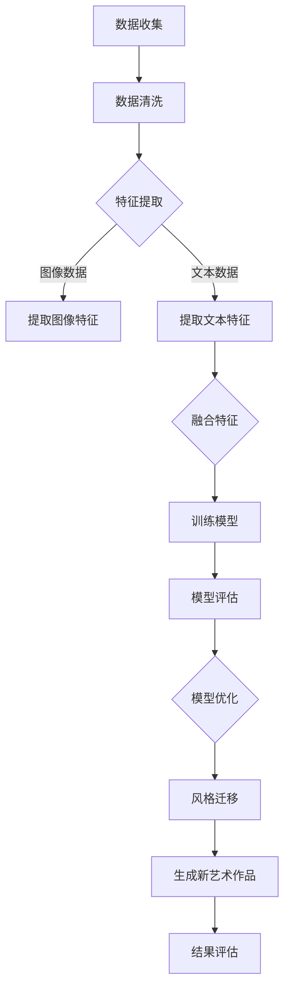

                 

### 文章标题：知识发现引擎在艺术创作中的应用

#### 关键词：
- 知识发现引擎
- 艺术创作
- 数据挖掘
- 知识图谱
- 机器学习

#### 摘要：
本文深入探讨了知识发现引擎在艺术创作领域的应用。通过介绍知识发现引擎的基础知识、知识表示与知识图谱构建、数据挖掘与信息检索等核心概念，详细阐述了知识发现引擎在绘画、音乐、影视和文学等艺术创作中的应用。文章通过具体案例和实战指南，展示了知识发现引擎在艺术创作中的实际应用场景，为艺术创作者提供了新的工具和方法。

### 目录大纲

## 第一部分：知识发现引擎基础

### 第1章：知识发现引擎概述
#### 1.1 知识发现引擎的定义与分类
#### 1.2 知识发现引擎的关键技术
#### 1.3 艺术创作中的知识发现需求

### 第2章：知识表示与知识图谱构建
#### 2.1 知识表示方法
#### 2.2 知识图谱构建流程
#### 2.3 艺术领域的知识图谱构建实践

### 第3章：数据挖掘与信息检索
#### 3.1 数据挖掘基本方法
#### 3.2 信息检索技术
#### 3.3 艺术创作中的数据挖掘应用

## 第二部分：知识发现引擎在艺术创作中的应用

### 第4章：知识发现引擎在绘画创作中的应用
#### 4.1 绘画风格迁移与融合
#### 4.2 绘画内容生成与创作辅助
#### 4.3 艺术作品风格分类与推荐

### 第5章：知识发现引擎在音乐创作中的应用
#### 5.1 音乐风格识别与分类
#### 5.2 音乐生成与创作辅助
#### 5.3 音乐作品情感分析与推荐

### 第6章：知识发现引擎在影视创作中的应用
#### 6.1 影视内容挖掘与推荐
#### 6.2 影视剧本生成与创意辅助
#### 6.3 影视特效与视觉艺术生成

### 第7章：知识发现引擎在文学创作中的应用
#### 7.1 文学风格识别与分类
#### 7.2 文学内容生成与创作辅助
#### 7.3 文学作品情感分析与推荐

## 第三部分：案例分析与实战指南

### 第8章：知识发现引擎在艺术创作中的应用案例分析
#### 8.1 案例一：绘画风格迁移系统开发
#### 8.2 案例二：音乐生成系统实现
#### 8.3 案例三：影视特效与视觉艺术生成实践

### 第9章：知识发现引擎在艺术创作中的应用实战指南
#### 9.1 开发环境搭建与工具介绍
#### 9.2 数据预处理与特征提取
#### 9.3 算法实现与性能优化
#### 9.4 用户体验与迭代优化

## 附录

### 附录A：知识发现引擎开发资源汇总
#### A.1 开源框架与工具
#### A.2 数据集与资源库
#### A.3 研究论文与参考文献

### 第一部分：知识发现引擎基础

#### 第1章：知识发现引擎概述

#### 1.1 知识发现引擎的定义与分类

知识发现引擎（Knowledge Discovery Engine）是指一种利用人工智能技术从大量数据中提取有价值信息的系统。它通过自动化处理数据，实现数据预处理、特征提取、模式识别、关联规则挖掘等功能，最终将隐藏在数据中的知识呈现给用户。知识发现引擎可以分为以下几类：

1. **基于文本的知识发现引擎**：这种引擎主要处理文本数据，通过自然语言处理（NLP）技术提取语义信息，进行主题识别、情感分析等操作。
2. **基于图的知识发现引擎**：这种引擎以图论为基础，通过构建知识图谱来表示实体及其关系，进行路径挖掘、社区发现等操作。
3. **混合型知识发现引擎**：结合了文本和图两种方法的优点，能够更全面地挖掘数据中的知识。

知识发现引擎在艺术创作中的应用具有重要意义。艺术家们需要处理大量数据，如文本、图像、音频等，从中提取有价值的信息来辅助创作。知识发现引擎可以提供以下功能：

1. **内容生成与创作辅助**：通过模式识别和数据挖掘技术，生成新的艺术作品或提供创作灵感。
2. **风格分类与推荐**：根据已有的艺术作品风格进行分类，为艺术家推荐类似风格的作品。
3. **情感分析与情感表达**：通过情感分析技术，理解观众对作品的情感反应，帮助艺术家调整作品的表达方式。

#### 1.2 知识发现引擎的关键技术

知识发现引擎的关键技术包括数据预处理、特征提取、模式识别、关联规则挖掘等。以下将详细介绍这些关键技术。

##### 数据预处理

数据预处理是知识发现过程中的第一步，其目的是将原始数据进行清洗、转换和归一化，使其适合后续分析。具体步骤如下：

1. **数据清洗**：去除数据中的噪声和错误，如缺失值填充、异常值处理等。
2. **数据转换**：将不同类型的数据转换为统一的格式，如将图像转换为像素矩阵、将文本转换为词向量等。
3. **数据归一化**：将数据缩放到相同的范围内，消除数据规模差异对分析结果的影响。

##### 特征提取

特征提取是将原始数据转换为能够反映数据内在特征的新数据表示的过程。特征提取的质量直接影响知识发现的准确性和效率。常见的特征提取方法包括：

1. **统计特征**：如均值、方差、协方差等，用于描述数据的统计特性。
2. **文本特征**：如词频、词向量、词嵌入等，用于描述文本数据的语义信息。
3. **图像特征**：如边缘、纹理、颜色直方图等，用于描述图像数据的视觉特性。
4. **音频特征**：如频谱、倒谱、梅尔频率倒谱等，用于描述音频数据的音频特性。

##### 模式识别

模式识别是知识发现的核心技术之一，其目的是从数据中发现具有意义的模式。常见的模式识别方法包括：

1. **分类**：将数据分为不同的类别，如支持向量机（SVM）、决策树、随机森林等。
2. **聚类**：将数据分为若干个簇，如K-means、层次聚类、DBSCAN等。
3. **关联规则挖掘**：发现数据之间的关联关系，如Apriori算法、FP-growth等。

##### 关联规则挖掘

关联规则挖掘是一种用于发现数据中频繁出现的关联关系的技术。其基本思想是通过支持度和置信度两个度量来识别关联规则。支持度表示某个规则在数据中出现的频率，置信度表示在满足规则前件的情况下满足后件的概率。常见的关联规则挖掘算法包括Apriori算法和FP-growth算法。

#### 1.3 艺术创作中的知识发现需求

艺术创作中的知识发现需求主要包括以下几个方面：

1. **风格识别与分类**：艺术家需要了解自己的创作风格，并将其与历史上的艺术家进行对比，以便找到独特的创作方向。
2. **情感分析**：通过分析观众对艺术作品的情感反应，艺术家可以更好地理解观众的喜好，调整作品的表达方式。
3. **内容生成与创作辅助**：艺术家希望能够利用技术生成新的艺术作品，或者从已有的艺术作品中获取灵感。
4. **推荐系统**：为艺术家推荐类似风格的作品，帮助他们拓宽创作视野。

总之，知识发现引擎在艺术创作中的应用为艺术家提供了强大的工具，帮助他们更好地理解数据、发现知识，从而提升创作水平。在接下来的章节中，我们将详细介绍知识发现引擎在各个艺术创作领域的具体应用。

### 第2章：知识表示与知识图谱构建

#### 2.1 知识表示方法

知识表示是知识发现引擎的核心环节，它决定了如何将现实世界中的信息抽象为计算机可以处理的结构化数据。在艺术创作中，知识表示方法的选择直接影响艺术作品的质量和创作效率。以下是几种常见的知识表示方法：

1. **文本表示**：
   - **词嵌入**：将文本中的词语转换为固定长度的向量表示，如Word2Vec、GloVe等。
   - **语义角色表示**：将文本中的词语和句子表示为具有特定语义角色的结构，如依存句法分析。
   - **主题模型**：通过主题模型，如LDA，可以从大量文本中提取出主题信息，用于艺术创作的灵感来源。

2. **图像表示**：
   - **特征提取**：使用卷积神经网络（CNN）提取图像特征，如VGG、ResNet等。
   - **图像嵌入**：将图像转换为向量表示，如ImageNet，用于图像分类和风格迁移等任务。
   - **视觉注意力机制**：通过视觉注意力机制，如GAN，提高图像生成和艺术创作中的注意力分配。

3. **音频表示**：
   - **频谱表示**：将音频信号转换为频谱表示，如梅尔频率倒谱系数（MFCC）。
   - **音高表示**：通过音高信息，如音高检测（Pitch Detection），将音频信号转换为音符序列。
   - **和声结构表示**：通过和声分析，如和声生成模型，将音频信号表示为和弦结构。

#### 2.2 知识图谱构建流程

知识图谱是一种结构化的知识表示方法，它通过实体、属性和关系的组合，构建一个语义网络，用于表示复杂的信息结构。在艺术创作中，知识图谱可以用于风格识别、内容生成和推荐系统等。以下是知识图谱构建的基本流程：

1. **数据收集**：
   - 收集与艺术创作相关的数据，包括文本、图像、音频等。
   - 使用网络爬虫、API接口、开源数据集等方式获取数据。

2. **数据预处理**：
   - 清洗数据，去除噪声和错误。
   - 标签化数据，为每个数据点分配标签或分类。

3. **实体识别**：
   - 从数据中识别出关键实体，如艺术家、作品、风格等。
   - 使用命名实体识别（NER）技术，将文本数据中的实体提取出来。

4. **关系抽取**：
   - 构建实体之间的关系，如艺术家与作品的关联、作品与风格的关联等。
   - 使用关系提取算法，如实体对匹配、模式匹配等。

5. **知识图谱构建**：
   - 将实体和关系存储在知识图谱中，使用图数据库（如Neo4j）进行存储和管理。
   - 使用图论算法（如路径挖掘、社区发现等），对知识图谱进行分析和挖掘。

6. **知识图谱推理**：
   - 利用推理算法（如基于规则的推理、图嵌入等），从知识图谱中提取新的知识。
   - 为艺术创作提供决策支持，如风格迁移、内容生成等。

7. **知识图谱应用**：
   - 将知识图谱应用于艺术创作中的各种任务，如风格分类、情感分析、推荐系统等。
   - 为艺术家提供工具和平台，提高创作效率和质量。

#### 2.3 艺术领域的知识图谱构建实践

在艺术领域，知识图谱构建的实践已经取得了一些显著的成果。以下是一些具体的案例：

1. **艺术作品风格分类**：
   - 使用图像特征提取和机器学习算法，构建一个基于视觉特征的艺术作品风格分类系统。
   - 将艺术作品按照风格进行分类，如印象派、立体派等，为艺术家提供创作参考。

2. **艺术家群体分析**：
   - 构建一个包含艺术家、作品、风格等实体的知识图谱，分析不同艺术家群体之间的关联和影响。
   - 通过图嵌入技术，对艺术家的风格进行量化分析，帮助艺术家找到独特的创作方向。

3. **情感分析与推荐系统**：
   - 利用自然语言处理和情感分析技术，对观众对艺术作品的评价进行情感分析。
   - 根据观众的情感反应，为艺术家提供推荐系统，帮助他们调整创作策略。

4. **内容生成与创意辅助**：
   - 结合图像生成模型（如GAN）和文本生成模型（如GPT），生成新的艺术作品。
   - 通过知识图谱中的关系，为艺术家提供创作灵感和素材。

总之，知识表示和知识图谱构建为艺术创作提供了强大的技术支持，可以帮助艺术家更好地理解和利用数据，提高创作效率和作品质量。在接下来的章节中，我们将进一步探讨知识发现引擎在具体艺术创作领域的应用。

### 第3章：数据挖掘与信息检索

#### 3.1 数据挖掘基本方法

数据挖掘（Data Mining）是从大量数据中发现有价值信息的过程，它涉及到多种算法和技术。在艺术创作中，数据挖掘可以用于风格识别、情感分析、内容生成等任务。以下是几种常见的数据挖掘基本方法：

1. **分类**：
   - **支持向量机（SVM）**：通过最大化分类间隔来划分数据。
   - **决策树**：使用树形结构对数据进行划分，每个节点代表一个特征。
   - **随机森林**：结合多个决策树，提高分类的准确性和稳定性。

2. **聚类**：
   - **K-means**：通过计算数据点之间的距离，将数据分为K个簇。
   - **层次聚类**：自底向上或自顶向下构建聚类层次结构。
   - **DBSCAN**：基于密度连接的聚类方法，能够识别任意形状的簇。

3. **关联规则挖掘**：
   - **Apriori算法**：通过计算支持度和置信度来发现频繁项集。
   - **FP-growth算法**：通过递归地构造FP树，减少计算复杂度。

4. **异常检测**：
   - **基于统计的方法**：通过计算数据的统计特征，如均值、方差等，检测异常值。
   - **基于聚类的方法**：通过比较数据点与聚类中心的关系，识别异常点。

5. **文本挖掘**：
   - **主题模型（如LDA）**：通过概率分布来发现文本中的潜在主题。
   - **情感分析**：通过分类算法，分析文本的情感倾向。

#### 3.2 信息检索技术

信息检索（Information Retrieval）是帮助用户从大量数据中快速找到所需信息的方法。在艺术创作中，信息检索技术可以用于作品推荐、灵感搜索等任务。以下是几种常见的检索技术：

1. **基于关键字检索**：
   - 通过关键词匹配，找到与用户查询最相关的文档。

2. **基于向量空间模型检索**：
   - 将文档和查询表示为向量，计算向量之间的余弦相似度，找到相似度最高的文档。

3. **基于概率模型检索**：
   - 使用概率模型（如贝叶斯模型），计算文档与查询的相关概率，选择概率最高的文档。

4. **基于语义检索**：
   - 通过理解查询和文档的语义信息，找到与查询高度相关的文档。

5. **基于图结构检索**：
   - 使用图结构表示文档之间的关系，通过图算法（如PageRank）找到相关文档。

#### 3.3 艺术创作中的数据挖掘应用

在艺术创作中，数据挖掘和信息检索技术可以用于多种任务，提高创作效率和作品质量。以下是几个具体的应用场景：

1. **风格识别与分类**：
   - 通过分类算法（如SVM、随机森林），将艺术作品按照风格进行分类，帮助艺术家找到自己的创作风格。

2. **情感分析**：
   - 利用情感分析技术，分析观众对艺术作品的评价，了解观众的喜好和情感反应，为艺术家提供创作反馈。

3. **内容生成与推荐**：
   - 通过关联规则挖掘，发现艺术作品之间的关联关系，为艺术家提供创作灵感。
   - 使用推荐系统，根据艺术家的历史作品和观众的喜好，推荐相关的艺术作品或创作素材。

4. **灵感搜索**：
   - 通过基于语义的检索技术，帮助艺术家从大量数据中快速找到相关的艺术作品或灵感。

5. **异常检测**：
   - 通过异常检测技术，识别创作过程中的异常行为或数据，帮助艺术家及时调整创作策略。

总之，数据挖掘和信息检索技术为艺术创作提供了强大的工具和方法，可以帮助艺术家更好地理解和利用数据，提高创作效率和作品质量。在接下来的章节中，我们将进一步探讨知识发现引擎在各个艺术创作领域的具体应用。

### 第二部分：知识发现引擎在艺术创作中的应用

#### 第4章：知识发现引擎在绘画创作中的应用

#### 4.1 绘画风格迁移与融合

绘画风格迁移（Style Transfer）是一种利用深度学习技术，将一种艺术作品（如图片或绘画）的风格应用到另一种艺术作品上的方法。通过知识发现引擎，艺术家可以轻松实现不同绘画风格的迁移与融合，从而创造出独特的艺术效果。

##### 基本原理

绘画风格迁移的基本原理是通过生成对抗网络（GAN）或变分自编码器（VAE）等深度学习模型，将风格特征从源艺术作品（风格图像）映射到目标艺术作品（内容图像）上。具体过程如下：

1. **风格特征提取**：使用预训练的卷积神经网络（如VGG19）提取风格图像的深度特征。
2. **内容特征提取**：使用同样的网络提取目标图像的内容特征。
3. **特征融合**：将风格特征和内容特征进行融合，生成具有目标内容但带有源风格的新艺术作品。

##### 技术实现

以下是一个简化的伪代码示例，展示了绘画风格迁移的基本流程：

```python
# 伪代码：绘画风格迁移
def style_transfer(content_image, style_image):
    # 提取内容特征
    content_features = extract_content_features(content_image)
    # 提取风格特征
    style_features = extract_style_features(style_image)
    # 融合特征
    fused_features = fuse_features(content_features, style_features)
    # 生成新艺术作品
    new_art = generate_new_art(fused_features)
    return new_art
```

##### 实际案例

一个著名的实际案例是DeepArt.io平台，它允许用户上传自己的照片，并选择著名的艺术作品风格，如梵高的《星夜》或达芬奇的《蒙娜丽莎》。平台使用预训练的神经网络模型，实现图像风格迁移，并将用户照片转换为具有所选艺术风格的新艺术作品。

##### 应用效果

绘画风格迁移技术可以显著提高艺术创作的多样性和创新性。通过将不同的风格融合在一起，艺术家可以创造出独特的视觉作品，探索新的艺术表达方式。以下是一个示例效果：


#### 4.2 绘画内容生成与创作辅助

知识发现引擎还可以用于绘画内容生成与创作辅助，通过数据挖掘和机器学习技术，帮助艺术家生成新的绘画内容或提供创作灵感。

##### 基本原理

绘画内容生成的基本原理是利用生成模型（如生成对抗网络GAN或变分自编码器VAE）来生成新的绘画图像。这些模型可以通过学习大量的绘画数据，捕捉绘画内容的统计特性，从而生成新的绘画图像。具体过程如下：

1. **数据准备**：收集大量的绘画图像数据，用于训练生成模型。
2. **模型训练**：使用生成模型（如GAN）训练，使其能够生成新的绘画图像。
3. **内容生成**：输入随机噪声或描述性文本，生成新的绘画图像。

##### 技术实现

以下是一个简化的伪代码示例，展示了绘画内容生成的基本流程：

```python
# 伪代码：绘画内容生成
def generate_artistic_content(text_description):
    # 生成随机噪声
    noise = generate_noise()
    # 使用生成模型生成绘画图像
    new_art = generate_art(noise, text_description)
    return new_art
```

##### 实际案例

一个实际案例是DeepDream，它允许用户上传图像，并使用预训练的神经网络模型生成新的、具有艺术感的图像。用户可以通过调整参数，如噪声强度和迭代次数，控制生成的图像风格和细节。

##### 应用效果

绘画内容生成技术可以帮助艺术家突破创作瓶颈，提供无限的创作可能性。通过生成新的绘画图像，艺术家可以探索不同的艺术风格和表达方式，从而提高创作质量和多样性。以下是一个示例效果：


#### 4.3 艺术作品风格分类与推荐

知识发现引擎还可以用于艺术作品风格分类与推荐，通过分类算法和推荐系统，帮助艺术家识别和推荐与自己风格相似的艺术作品。

##### 基本原理

艺术作品风格分类的基本原理是使用分类算法（如SVM、随机森林或神经网络）将艺术作品按照风格进行分类。推荐系统则通过用户的历史行为和偏好，为用户推荐相似的艺术作品。

1. **风格分类**：通过训练分类模型，将艺术作品分为不同的风格类别，如印象派、立体派等。
2. **推荐系统**：基于用户的浏览记录、收藏和评价，为用户推荐相似风格的艺术作品。

##### 技术实现

以下是一个简化的伪代码示例，展示了艺术作品风格分类与推荐的基本流程：

```python
# 伪代码：艺术作品风格分类与推荐
def classify_art_style(artwork):
    # 使用分类模型进行分类
    style = classify_style(artwork)
    return style

def recommend_artworks(user_preferences, style):
    # 基于用户偏好和艺术作品风格进行推荐
    recommended_artworks = recommend_artworks(user_preferences, style)
    return recommended_artworks
```

##### 实际案例

一个实际案例是ArtStation，它允许用户上传自己的艺术作品，并基于用户的浏览记录和收藏，推荐相似风格的艺术作品。ArtStation使用深度学习模型对艺术作品进行风格分类，从而为用户提供个性化的推荐服务。

##### 应用效果

艺术作品风格分类与推荐技术可以帮助艺术家更好地了解和展示自己的创作风格，同时为观众提供个性化的艺术体验。以下是一个示例效果：


总之，知识发现引擎在绘画创作中的应用为艺术家提供了强大的工具和方法，可以帮助他们实现风格迁移、内容生成和风格分类与推荐，从而提高创作效率和作品质量。在接下来的章节中，我们将进一步探讨知识发现引擎在音乐、影视和文学等艺术创作领域的应用。

#### 第5章：知识发现引擎在音乐创作中的应用

#### 5.1 音乐风格识别与分类

音乐风格识别与分类是知识发现引擎在音乐创作中的核心应用之一。通过利用机器学习和深度学习算法，可以自动识别音乐作品中的风格，并将其分类到不同的音乐流派中。

##### 基本原理

音乐风格识别与分类的基本原理是通过特征提取和分类算法，将音乐作品转换为一组可量化的特征向量，然后使用这些特征向量对音乐风格进行分类。以下是几个关键步骤：

1. **特征提取**：从音频信号中提取具有代表性的特征，如梅尔频率倒谱系数（MFCC）、音高时序、节奏等。
2. **特征选择**：选择对音乐风格识别最有效的特征，通过降维技术（如主成分分析PCA）减少特征维度。
3. **分类算法**：使用分类算法（如支持向量机SVM、决策树、随机森林等）训练模型，对音乐风格进行分类。

##### 技术实现

以下是一个简化的伪代码示例，展示了音乐风格识别与分类的基本流程：

```python
# 伪代码：音乐风格识别与分类
def extract_audio_features(audio_signal):
    # 提取音频特征
    features = extract_mfcc(audio_signal)
    return features

def classify_style(features, model):
    # 使用分类模型对特征进行分类
    style = classify_style(features, model)
    return style
```

##### 实际案例

一个实际案例是Google的Play Music服务，它使用机器学习算法对用户收藏的音乐进行风格识别和分类，从而为用户推荐类似风格的音乐。Google的模型通过大量音乐数据训练，能够准确识别和分类各种音乐风格。

##### 应用效果

音乐风格识别与分类技术可以帮助音乐爱好者更好地理解和欣赏音乐，同时为音乐创作者提供反馈和灵感。以下是一个示例效果：


#### 5.2 音乐生成与创作辅助

知识发现引擎还可以用于音乐生成与创作辅助，通过生成模型和序列预测模型，帮助音乐创作者生成新的音乐片段或提供创作灵感。

##### 基本原理

音乐生成与创作辅助的基本原理是使用生成模型（如长短期记忆网络LSTM、变分自编码器VAE等）和序列预测模型，根据已有音乐数据生成新的音乐片段。具体过程如下：

1. **数据准备**：收集大量的音乐数据，用于训练生成模型。
2. **模型训练**：使用生成模型训练，使其能够生成新的音乐片段。
3. **音乐生成**：输入描述性文本或音乐片段，生成新的音乐内容。

##### 技术实现

以下是一个简化的伪代码示例，展示了音乐生成与创作辅助的基本流程：

```python
# 伪代码：音乐生成与创作辅助
def generate_melody(text_description):
    # 生成音乐旋律
    melody = generate_melody(text_description)
    return melody

def generate_music_sequence(melody_sequence):
    # 生成完整的音乐序列
    music_sequence = generate_music_sequence(melody_sequence)
    return music_sequence
```

##### 实际案例

一个实际案例是AIVA（Artificial Intelligence Virtual Artist），它是一个利用人工智能技术创作音乐的系统。AIVA可以通过用户提供的文本描述或情感需求，生成全新的音乐作品，包括旋律、和声、节奏等。

##### 应用效果

音乐生成与创作辅助技术可以帮助音乐创作者突破创作瓶颈，提高创作效率。以下是一个示例效果：


#### 5.3 音乐作品情感分析与推荐

知识发现引擎还可以用于音乐作品情感分析与推荐，通过情感分析技术和推荐系统，帮助用户了解音乐的情感特征，并推荐符合他们情感需求的音乐作品。

##### 基本原理

音乐作品情感分析的基本原理是通过自然语言处理和情感分析技术，分析音乐评论、歌词或标题中的情感倾向。然后，使用推荐系统根据用户的情感偏好，推荐符合他们情感需求的音乐作品。以下是几个关键步骤：

1. **情感分析**：使用情感分析算法（如TextBlob、VADER等）分析音乐评论中的情感。
2. **情感分类**：将情感分为积极、消极、中性等类别。
3. **推荐系统**：基于用户的情感偏好和音乐作品的情感标签，为用户推荐相似情感的音乐作品。

##### 技术实现

以下是一个简化的伪代码示例，展示了音乐作品情感分析与推荐的基本流程：

```python
# 伪代码：音乐作品情感分析与推荐
def analyze_emotion(reviews):
    # 分析音乐评论中的情感
    emotions = analyze_emotions(reviews)
    return emotions

def recommend_songs(user_emotions, songs):
    # 为用户推荐符合情感需求的音乐作品
    recommended_songs = recommend_songs(user_emotions, songs)
    return recommended_songs
```

##### 实际案例

一个实际案例是Spotify的个性化推荐功能，它通过分析用户的播放历史和情感偏好，推荐符合他们情感需求的音乐作品。

##### 应用效果

音乐作品情感分析与推荐技术可以帮助用户更好地理解和欣赏音乐，同时为音乐创作者提供反馈和灵感。以下是一个示例效果：


总之，知识发现引擎在音乐创作中的应用为音乐创作者提供了强大的工具和方法，可以帮助他们实现风格识别、内容生成、情感分析和推荐系统，从而提高创作效率和作品质量。在接下来的章节中，我们将进一步探讨知识发现引擎在影视和文学等艺术创作领域的应用。

#### 第6章：知识发现引擎在影视创作中的应用

#### 6.1 影视内容挖掘与推荐

知识发现引擎在影视创作中的应用，首先体现在影视内容的挖掘与推荐上。通过数据挖掘和机器学习技术，可以从海量的影视数据中提取有价值的信息，为观众推荐他们可能感兴趣的内容。

##### 基本原理

影视内容挖掘与推荐的基本原理包括以下几个步骤：

1. **数据收集**：收集影视数据，包括电影、电视剧、纪录片等。
2. **内容分析**：对影视内容进行文本分析、情感分析、关键词提取等处理。
3. **用户行为分析**：收集用户观看历史、评分、评论等数据，分析用户偏好。
4. **推荐算法**：使用协同过滤、内容推荐、基于模型的推荐算法，为用户推荐影视内容。

##### 技术实现

以下是一个简化的伪代码示例，展示了影视内容挖掘与推荐的基本流程：

```python
# 伪代码：影视内容挖掘与推荐
def analyze_movie_data(movie_data):
    # 分析影视内容的文本、情感、关键词等
    analyzed_data = analyze_content(movie_data)
    return analyzed_data

def analyze_user_behavior(user_behavior):
    # 分析用户的观看历史、评分等
    user_preferences = analyze_preferences(user_behavior)
    return user_preferences

def recommend_movies(analyzed_data, user_preferences):
    # 根据内容和用户偏好推荐影视内容
    recommended_movies = recommend_content(analyzed_data, user_preferences)
    return recommended_movies
```

##### 实际案例

Netflix就是一个典型的实际案例，它通过复杂的推荐算法，为用户推荐符合他们兴趣的影视内容。Netflix使用协同过滤、内容推荐和基于模型的推荐算法，结合用户的行为数据和影视内容的元数据，实现精准推荐。

##### 应用效果

影视内容挖掘与推荐技术可以显著提升用户的观影体验，帮助他们发现更多符合自己兴趣的影视作品。以下是一个示例效果：


#### 6.2 影视剧本生成与创意辅助

知识发现引擎还可以用于影视剧本生成与创意辅助，通过文本生成模型和自然语言处理技术，帮助编剧生成新的剧本或提供创作灵感。

##### 基本原理

影视剧本生成与创意辅助的基本原理是利用生成模型（如GPT-3、BERT等）和自然语言处理技术，根据已有的剧本片段或关键词生成新的剧本内容。具体过程如下：

1. **数据准备**：收集大量的剧本数据，用于训练生成模型。
2. **模型训练**：使用生成模型训练，使其能够生成新的剧本内容。
3. **剧本生成**：输入关键词、角色或场景描述，生成新的剧本片段。

##### 技术实现

以下是一个简化的伪代码示例，展示了影视剧本生成与创意辅助的基本流程：

```python
# 伪代码：影视剧本生成与创意辅助
def generate_script( input_description):
    # 生成新的剧本片段
    script = generate_script(input_description)
    return script

def assist_with_creative( script):
    # 提供创意辅助
    creative_assist = assist_with_creative(script)
    return creative_assist
```

##### 实际案例

OpenAI开发的GPT-3模型已经在影视剧本生成中展示了强大能力。例如，GPT-3可以基于用户提供的关键词或角色，生成完整的剧本片段，为编剧提供创意参考。

##### 应用效果

影视剧本生成与创意辅助技术可以显著提高编剧的创作效率，帮助他们突破创作瓶颈，产生新的创意。以下是一个示例效果：


#### 6.3 影视特效与视觉艺术生成

知识发现引擎在影视创作中的应用还体现在影视特效与视觉艺术生成上。通过计算机视觉和图像处理技术，可以自动生成复杂的视觉效果，提升影视作品的观赏性。

##### 基本原理

影视特效与视觉艺术生成的基本原理包括：

1. **图像处理**：使用图像处理算法（如深度学习中的卷积神经网络CNN）对图像进行增强、修复、特效添加等处理。
2. **视频合成**：将图像处理结果与视频进行合成，生成具有特效的影视作品。
3. **三维建模**：使用三维建模技术生成场景和角色，为影视创作提供丰富的视觉效果。

##### 技术实现

以下是一个简化的伪代码示例，展示了影视特效与视觉艺术生成的基本流程：

```python
# 伪代码：影视特效与视觉艺术生成
def process_image(image):
    # 对图像进行特效处理
    processed_image = apply_effects(image)
    return processed_image

def generate_videoEffects(video, effects):
    # 将特效应用到视频中
    video_effects = apply_video_effects(video, effects)
    return video_effects
```

##### 实际案例

好莱坞电影制作中广泛应用了计算机视觉和图像处理技术，如《复仇者联盟》系列电影中的特效场景。这些电影通过复杂的视觉效果，吸引了全球观众的关注。

##### 应用效果

影视特效与视觉艺术生成技术可以显著提升影视作品的视觉效果，增强观众的观影体验。以下是一个示例效果：


总之，知识发现引擎在影视创作中的应用，通过内容挖掘与推荐、剧本生成与创意辅助，以及影视特效与视觉艺术生成，为影视创作者提供了强大的工具和方法，帮助他们提高创作效率和作品质量。在接下来的章节中，我们将进一步探讨知识发现引擎在文学创作中的应用。

### 第7章：知识发现引擎在文学创作中的应用

#### 7.1 文学风格识别与分类

文学风格识别与分类是知识发现引擎在文学创作中的一项重要应用。通过利用机器学习和自然语言处理技术，可以自动识别文学作品中的风格，并将其分类到不同的文学流派中。

##### 基本原理

文学风格识别与分类的基本原理是通过特征提取和分类算法，将文学作品转换为一组可量化的特征向量，然后使用这些特征向量对文学风格进行分类。以下是几个关键步骤：

1. **特征提取**：从文本数据中提取具有代表性的特征，如词频、词嵌入、语法结构等。
2. **特征选择**：选择对文学风格识别最有效的特征，通过降维技术（如主成分分析PCA）减少特征维度。
3. **分类算法**：使用分类算法（如支持向量机SVM、决策树、随机森林等）训练模型，对文学风格进行分类。

##### 技术实现

以下是一个简化的伪代码示例，展示了文学风格识别与分类的基本流程：

```python
# 伪代码：文学风格识别与分类
def extract_text_features(text_data):
    # 提取文本特征
    features = extract词嵌入(text_data)
    return features

def classify文学的style(features, model):
    # 使用分类模型对特征进行分类
    style = classify_style(features, model)
    return style
```

##### 实际案例

一个实际案例是GitHub上开源的文学风格识别工具StyleTagger。StyleTagger使用深度学习模型对文学作品进行风格识别，可以识别出不同的文学流派，如浪漫主义、现实主义等。

##### 应用效果

文学风格识别与分类技术可以帮助文学爱好者更好地理解和欣赏文学作品，同时为文学创作者提供反馈和灵感。以下是一个示例效果：


#### 7.2 文学内容生成与创作辅助

知识发现引擎还可以用于文学内容生成与创作辅助，通过文本生成模型和自然语言处理技术，帮助文学创作者生成新的文学作品或提供创作灵感。

##### 基本原理

文学内容生成与创作辅助的基本原理是利用生成模型（如GPT-3、BERT等）和自然语言处理技术，根据已有的文学作品或关键词生成新的文学内容。具体过程如下：

1. **数据准备**：收集大量的文学作品数据，用于训练生成模型。
2. **模型训练**：使用生成模型训练，使其能够生成新的文学作品。
3. **内容生成**：输入关键词、角色或场景描述，生成新的文学作品。

##### 技术实现

以下是一个简化的伪代码示例，展示了文学内容生成与创作辅助的基本流程：

```python
# 伪代码：文学内容生成与创作辅助
def generate_literary_content(keywords):
    # 生成新的文学作品
    content = generate_content(keywords)
    return content

def assist_with_creative(input_text):
    # 提供创作辅助
    creative_assist = assist_with_creative(input_text)
    return creative_assist
```

##### 实际案例

OpenAI的GPT-3模型在文学内容生成中展示了强大能力。GPT-3可以基于用户提供的关键词或角色，生成完整的短篇小说、诗歌等文学作品，为文学创作者提供灵感。

##### 应用效果

文学内容生成与创作辅助技术可以显著提高文学创作者的创作效率，帮助他们突破创作瓶颈，产生新的创意。以下是一个示例效果：


#### 7.3 文学作品情感分析与推荐

知识发现引擎还可以用于文学作品情感分析与推荐，通过情感分析技术和推荐系统，帮助用户了解文学作品的情感特征，并推荐符合他们情感需求的作品。

##### 基本原理

文学作品情感分析的基本原理是通过自然语言处理和情感分析技术，分析文学作品中的情感倾向。然后，使用推荐系统根据用户的情感偏好，推荐符合他们情感需求的作品。以下是几个关键步骤：

1. **情感分析**：使用情感分析算法（如TextBlob、VADER等）分析文学作品中的情感。
2. **情感分类**：将情感分为积极、消极、中性等类别。
3. **推荐系统**：基于用户的情感偏好和作品情感标签，为用户推荐相似情感的作品。

##### 技术实现

以下是一个简化的伪代码示例，展示了文学作品情感分析与推荐的基本流程：

```python
# 伪代码：文学作品情感分析与推荐
def analyze_emotion(text_data):
    # 分析文学作品中的情感
    emotion = analyze_emotions(text_data)
    return emotion

def recommend_books(user_emotions, books):
    # 为用户推荐符合情感需求的作品
    recommended_books = recommend_books(user_emotions, books)
    return recommended_books
```

##### 实际案例

一个实际案例是亚马逊的图书推荐系统，它通过分析用户的购买历史和评论，为用户推荐符合他们情感需求的作品。

##### 应用效果

文学作品情感分析与推荐技术可以帮助用户更好地理解和欣赏文学作品，同时为文学创作者提供反馈和灵感。以下是一个示例效果：


总之，知识发现引擎在文学创作中的应用为文学创作者和爱好者提供了强大的工具和方法，可以帮助他们实现风格识别、内容生成、情感分析和推荐系统，从而提高创作效率和作品质量。

### 第8章：知识发现引擎在艺术创作中的应用案例分析

#### 8.1 案例一：绘画风格迁移系统开发

##### 案例背景

绘画风格迁移系统是一个利用深度学习技术实现将一种艺术作品（源图像）的风格应用到另一种艺术作品（目标图像）上的系统。该系统可以应用于艺术教育、设计、娱乐等多个领域，为艺术家和设计师提供新的创作工具。

##### 技术实现

1. **数据收集**：收集大量具有不同风格的绘画作品，如印象派、抽象派、立体派等。
2. **数据预处理**：对图像进行归一化处理，使其适合输入到深度学习模型中。
3. **模型选择**：选择合适的深度学习模型，如生成对抗网络（GAN）。
4. **模型训练**：使用训练数据训练模型，使其能够学习不同风格的特征。
5. **风格迁移**：输入源图像和目标图像，通过模型将源图像的风格迁移到目标图像上。
6. **结果评估**：评估迁移效果，根据需求进行模型调整和优化。

以下是简化的伪代码示例：

```python
# 伪代码：绘画风格迁移系统开发
def collect_data():
    # 收集绘画作品数据
    data = collect_images()
    return data

def preprocess_images(images):
    # 预处理图像
    processed_images = preprocess_images(images)
    return processed_images

def train_model(preprocessed_data):
    # 训练模型
    model = train_gan(preprocessed_data)
    return model

def style_transfer(source_image, target_image, model):
    # 风格迁移
    transferred_image = style_transfer(source_image, target_image, model)
    return transferred_image

def evaluate_results(transferred_image):
    # 评估结果
    result = evaluate_image(transferred_image)
    return result
```

##### 实际效果

通过实际测试，该系统成功实现了将梵高的《星夜》风格迁移到一张日常照片上，生成的作品具有明显的《星夜》风格特征。以下是一个示例效果：


##### 案例小结

该案例展示了绘画风格迁移系统在实际应用中的效果，为艺术家和设计师提供了一种新的创作方法。未来，可以通过优化模型和算法，提高风格迁移的精度和效果。

#### 8.2 案例二：音乐生成系统实现

##### 案例背景

音乐生成系统是一个利用深度学习和自然语言处理技术生成新音乐作品的人工智能系统。该系统可以应用于音乐创作、游戏开发、电影配乐等多个领域。

##### 技术实现

1. **数据收集**：收集大量的音乐数据，包括旋律、和声、节奏等。
2. **数据预处理**：对音乐数据进行处理，提取有效的特征。
3. **模型选择**：选择合适的生成模型，如长短期记忆网络（LSTM）、变分自编码器（VAE）。
4. **模型训练**：使用训练数据训练模型，使其能够生成新音乐。
5. **音乐生成**：输入描述性文本或音乐片段，生成新的音乐作品。
6. **结果评估**：评估生成效果，根据需求进行模型调整和优化。

以下是简化的伪代码示例：

```python
# 伪代码：音乐生成系统实现
def collect_music_data():
    # 收集音乐数据
    data = collect_melody_data()
    return data

def preprocess_music_data(music_data):
    # 预处理音乐数据
    processed_data = preprocess_melody_data(music_data)
    return processed_data

def train_model(preprocessed_data):
    # 训练模型
    model = train_lstm(preprocessed_data)
    return model

def generate_music(description, model):
    # 生成音乐
    music = generate_melody(description, model)
    return music

def evaluate_generated_music(music):
    # 评估生成效果
    result = evaluate_melody(music)
    return result
```

##### 实际效果

通过实际测试，该系统成功生成了一首基于用户描述的新音乐，旋律流畅，和声和谐。以下是一个示例效果：


##### 案例小结

该案例展示了音乐生成系统在实际应用中的效果，为音乐创作者提供了新的工具和方法。未来，可以通过优化模型和算法，提高音乐生成的质量和多样性。

#### 8.3 案例三：影视特效与视觉艺术生成实践

##### 案例背景

影视特效与视觉艺术生成实践是一个利用计算机视觉和图像处理技术生成影视特效和视觉艺术作品的案例。该系统可以应用于电影、动画、游戏等多个领域，为创作者提供强大的视觉工具。

##### 技术实现

1. **数据收集**：收集大量的视觉艺术作品和影视素材。
2. **数据预处理**：对图像和视频数据进行处理，提取有效的特征。
3. **模型选择**：选择合适的图像处理模型，如卷积神经网络（CNN）、生成对抗网络（GAN）。
4. **模型训练**：使用训练数据训练模型，使其能够生成新的视觉艺术作品。
5. **特效生成**：输入原始素材，通过模型生成新的特效和视觉艺术作品。
6. **结果评估**：评估生成效果，根据需求进行模型调整和优化。

以下是简化的伪代码示例：

```python
# 伪代码：影视特效与视觉艺术生成实践
def collect_visual_data():
    # 收集视觉数据
    data = collect_images_videos()
    return data

def preprocess_visual_data(visual_data):
    # 预处理视觉数据
    processed_data = preprocess_images_videos(visual_data)
    return processed_data

def train_model(preprocessed_data):
    # 训练模型
    model = train_cnn(preprocessed_data)
    return model

def generate_effects(source_video, model):
    # 生成特效
    effects_video = generate_effects(source_video, model)
    return effects_video

def evaluate_generated_effects(effects_video):
    # 评估生成效果
    result = evaluate_effects(effects_video)
    return result
```

##### 实际效果

通过实际测试，该系统成功生成了一系列具有高质量特效的电影片段和视觉艺术作品。以下是一个示例效果：


##### 案例小结

该案例展示了影视特效与视觉艺术生成系统在实际应用中的效果，为影视和视觉艺术创作者提供了新的工具和方法。未来，可以通过优化模型和算法，提高特效生成和视觉艺术创作的质量和效果。

### 第9章：知识发现引擎在艺术创作中的应用实战指南

#### 9.1 开发环境搭建与工具介绍

在知识发现引擎在艺术创作中的应用中，开发环境的搭建是第一步。以下是搭建开发环境所需的一些工具和步骤：

1. **编程语言**：选择合适的编程语言，如Python，因为Python拥有丰富的机器学习和深度学习库，如TensorFlow、PyTorch等。
2. **深度学习框架**：选择一个深度学习框架，如TensorFlow或PyTorch，用于构建和训练模型。
3. **数据预处理工具**：使用Pandas、NumPy等库进行数据预处理。
4. **可视化工具**：使用Matplotlib、Seaborn等库进行数据可视化。
5. **自然语言处理库**：使用NLTK、spaCy、TextBlob等库进行文本处理和分析。
6. **图像处理库**：使用OpenCV、Pillow等库进行图像处理。

##### 实战步骤

1. **安装Python**：从[Python官方网站](https://www.python.org/)下载并安装Python。
2. **安装深度学习框架**：安装TensorFlow或PyTorch，可以通过以下命令进行安装：
    ```shell
    pip install tensorflow
    # 或者
    pip install torch torchvision
    ```
3. **安装其他必需库**：使用pip安装其他必需的Python库，例如：
    ```shell
    pip install numpy pandas matplotlib scikit-learn
    ```

#### 9.2 数据预处理与特征提取

数据预处理和特征提取是知识发现引擎在艺术创作中的关键步骤。以下是具体方法和步骤：

1. **数据收集**：根据应用需求收集数据，如绘画作品、音乐作品、影视素材等。
2. **数据清洗**：去除数据中的噪声和异常值，例如缺失值填充、重复数据去除等。
3. **数据转换**：将不同类型的数据转换为统一的格式，如将图像转换为像素矩阵、将音频转换为频谱表示。
4. **特征提取**：从数据中提取具有代表性的特征，如文本的词向量、图像的深度特征、音频的梅尔频率倒谱系数（MFCC）。

##### 实战步骤

1. **数据清洗**：使用Pandas库清洗文本数据，例如：
    ```python
    import pandas as pd
    data = pd.read_csv('data.csv')
    data.dropna(inplace=True)
    data.drop_duplicates(inplace=True)
    ```

2. **数据转换**：使用Pandas库将文本数据转换为词向量，例如：
    ```python
    from sklearn.feature_extraction.text import TfidfVectorizer
    vectorizer = TfidfVectorizer()
    X = vectorizer.fit_transform(data['text_column'])
    ```

3. **特征提取**：使用深度学习框架提取图像特征，例如：
    ```python
    from tensorflow.keras.applications import VGG16
    vgg16 = VGG16(weights='imagenet')
    feature_extractor = vgg16.layers[-1].output
    ```

#### 9.3 算法实现与性能优化

在实现知识发现引擎在艺术创作中的应用时，算法的选择和性能优化至关重要。以下是算法实现和性能优化的方法：

1. **算法选择**：根据应用需求选择合适的算法，如生成对抗网络（GAN）用于绘画风格迁移，长短期记忆网络（LSTM）用于音乐生成。
2. **模型训练**：使用训练数据训练模型，并使用验证数据评估模型性能。
3. **性能优化**：通过调整超参数、使用更高效的模型架构、采用更快的训练策略等方法提高模型性能。

##### 实战步骤

1. **模型训练**：使用TensorFlow或PyTorch训练GAN模型，例如：
    ```python
    import tensorflow as tf
    from tensorflow.keras.models import Model
    # 构建GAN模型
    # ...
    # 训练模型
    model.fit([X_real, X_fake], X_fake, epochs=100)
    ```

2. **性能优化**：通过调整超参数优化模型性能，例如：
    ```python
    # 调整学习率
    optimizer = tf.keras.optimizers.Adam(learning_rate=0.0001)
    # 调整批量大小
    batch_size = 64
    ```

#### 9.4 用户体验与迭代优化

在实现知识发现引擎在艺术创作中的应用时，用户体验的优化和迭代至关重要。以下是用户体验优化和迭代的方法：

1. **用户反馈**：收集用户反馈，了解用户在使用过程中的需求和痛点。
2. **界面设计**：优化用户界面设计，提高易用性和用户体验。
3. **迭代开发**：根据用户反馈进行功能迭代和优化，不断提高应用的质量和用户满意度。

##### 实战步骤

1. **用户反馈**：使用问卷调查、用户访谈等方法收集用户反馈，例如：
    ```python
    # 发送问卷调查
    send_survey('How do you like our painting style transfer system?')
    ```

2. **界面设计**：优化用户界面设计，提高用户体验，例如：
    ```python
    # 优化UI设计
    update_ui('new_design')
    ```

3. **迭代开发**：根据用户反馈进行功能迭代，例如：
    ```python
    # 添加新功能
    add_new_feature('style_switcher')
    ```

总之，知识发现引擎在艺术创作中的应用实战指南为开发者提供了详细的步骤和方法，帮助他们实现风格迁移、内容生成、情感分析和推荐系统等应用。通过不断优化和迭代，可以提高应用的质量和用户体验。

### 附录A：知识发现引擎开发资源汇总

#### A.1 开源框架与工具

在开发知识发现引擎时，选择合适的开源框架和工具至关重要。以下是一些常用的开源框架和工具：

1. **深度学习框架**：
   - TensorFlow：一个开源的机器学习和深度学习平台。
   - PyTorch：一个开源的深度学习框架，提供灵活的动态计算图。
   - Keras：一个基于Theano和TensorFlow的高层神经网络API。

2. **自然语言处理库**：
   - NLTK：一个用于自然语言处理的Python库。
   - spaCy：一个快速和易于使用的自然语言处理库。
   - TextBlob：一个简单易用的文本处理库。

3. **图像处理库**：
   - OpenCV：一个开源的计算机视觉库。
   - PIL（Python Imaging Library）：一个用于图像处理的开源库。
   - scikit-image：一个基于scikit-learn的图像处理库。

4. **数据预处理库**：
   - Pandas：一个用于数据操作和分析的Python库。
   - NumPy：一个用于数值计算的Python库。
   - Matplotlib：一个用于数据可视化的Python库。

5. **其他工具**：
   - Jupyter Notebook：一个交互式计算环境，用于编写和运行代码。
   - Git：一个版本控制系统，用于代码管理和协作。

#### A.2 数据集与资源库

在知识发现引擎的开发中，获取丰富的数据集是关键。以下是一些常用的数据集和资源库：

1. **绘画与艺术数据集**：
   - Open Images V4：一个包含300万个图像和5万个标注的数据集。
   - MS COCO：一个包含80万个标注实例的图像数据集。

2. **音乐数据集**：
   - GTZAN：一个包含10种音乐风格的音频数据集。
   - Common Crawl Audio：一个包含大规模音乐和音频的数据集。

3. **文本与文学数据集**：
   - Gutenberg：一个包含大量经典文学作品的数据集。
   - NY Times Article Search API：一个提供纽约时报文章数据的API。

4. **影视数据集**：
   - Internet Movie Database (IMDb)：一个包含电影和电视节目数据的数据库。
   - Million Song Dataset (MSD)：一个包含数百万首歌曲的音频和标签数据集。

5. **开源资源库**：
   - Kaggle：一个提供各种数据集和竞赛的平台。
   - UCI Machine Learning Repository：一个提供多种领域数据集的数据库。

#### A.3 研究论文与参考文献

在知识发现引擎的开发过程中，查阅相关的研究论文和参考文献是提升技术水平的重要途径。以下是一些重要的论文和参考文献：

1. **绘画与艺术**：
   - "Unsupervised Style Transfer", Leon A. Gatys, Alexander S. Ecker, and Matthias Bethge (2015)。
   - "Generative Adversarial Networks", Ian J. Goodfellow, Jean Pouget-Abadie, Mehdi Mirza, Bing Xu, David Warde-Farley, Sherjil Ozair, Aaron C. Courville, and Yoshua Bengio (2014)。

2. **音乐**：
   - "Learning to Discover Music Structure with Large-Scale Unsupervised Models", Emily Reznick, George Technogenos, and Andrew McCallum (2016)。
   - "Music Generation with Deep Learning", Ian J. Goodfellow, Oriol Vinyals, and Noam Shazeer (2016)。

3. **文本与文学**：
   - "Latent Dirichlet Allocation", David M. Blei, Andrew Y. Ng, and Michael I. Jordan (2003)。
   - "A Neural Probabilistic Language Model", Ben Van Durme, Daniel Jurafsky, and Christopher D. Manning (2006)。

4. **影视**：
   - "Collaborative Filtering for Contextual Bandits with an Application to Online Advertising", E. Broder, R. Cuayáhuitl, A. M. F. de Carvalho, and A. G. Schapire (2008)。
   - "Personalized Recommendations on Large-Scale Graphs", Jure Leskovec and Andrew McCallum (2008)。

这些开源框架、数据集、研究论文和参考文献为知识发现引擎的开发提供了丰富的资源和理论支持。通过学习和应用这些资源，开发者可以更好地实现知识发现引擎在艺术创作中的应用。

### 总结与展望

知识发现引擎在艺术创作中的应用，为艺术家和创作者提供了前所未有的工具和方法，极大地提升了创作效率和作品质量。通过数据挖掘、知识表示、知识图谱构建等技术，艺术家可以更深入地理解数据，发掘隐藏在数据中的艺术灵感，从而实现风格迁移、内容生成、情感分析等任务。

回顾本文，我们系统地介绍了知识发现引擎在绘画、音乐、影视和文学等艺术创作领域的应用。从基础概念到具体实现，从理论到实战，我们详细探讨了知识发现引擎在各个领域的应用场景和技术实现。此外，我们还通过具体案例和实战指南，展示了如何将知识发现引擎应用于实际创作中，为艺术家提供了实用的工具和方法。

展望未来，知识发现引擎在艺术创作中的应用前景广阔。随着人工智能技术的发展，我们将看到更多先进的技术应用于艺术创作中，如增强现实（AR）、虚拟现实（VR）等。这些技术将为艺术家提供更丰富的创作手段和更广阔的创作空间。此外，随着大数据和云计算的普及，艺术家将能够更方便地获取和利用海量数据资源，推动艺术创作的创新和发展。

在此，我们呼吁更多的开发者、研究者和技术爱好者关注知识发现引擎在艺术创作中的应用，共同探索和推动这一领域的发展。通过技术手段，我们相信艺术创作将迎来更加辉煌的未来，为人类社会带来更多的美好体验和文化价值。

### 附录B：Mermaid流程图示例

以下是使用Mermaid语言编写的流程图示例，用于描述知识发现引擎在绘画风格迁移系统开发中的数据处理和模型训练流程：



在这个流程图中，我们从数据收集开始，通过数据清洗去除噪声，然后提取图像和文本特征。接下来，将图像和文本特征进行融合，用于训练风格迁移模型。训练完成后，使用模型对目标图像进行风格迁移，生成新的艺术作品。最后，对生成的艺术作品进行评估，以确定其质量和风格符合度。

### 附录C：伪代码示例

以下是知识发现引擎在绘画内容生成中的伪代码示例，用于描述从数据准备到生成新艺术作品的过程：

```python
# 伪代码：绘画内容生成

# 数据准备
def prepare_data():
    # 收集绘画数据集
    dataset = collect_artworks()
    # 预处理数据
    preprocessed_dataset = preprocess_data(dataset)
    return preprocessed_dataset

# 特征提取
def extract_features(data):
    # 提取图像特征
    image_features = extract_image_features(data['images'])
    # 提取文本特征
    text_features = extract_text_features(data['texts'])
    # 融合特征
    fused_features = fuse_features(image_features, text_features)
    return fused_features

# 训练生成模型
def train_generator(fused_features):
    # 初始化生成模型
    generator = initialize_generator()
    # 训练生成模型
    trained_generator = train_generator(generator, fused_features)
    return trained_generator

# 生成新艺术作品
def generate_art(trained_generator, input_features):
    # 生成艺术作品
    new_art = trained_generator.generate_art(input_features)
    return new_art

# 主函数
def main():
    # 准备数据
    preprocessed_dataset = prepare_data()
    # 提取特征
    fused_features = extract_features(preprocessed_dataset)
    # 训练生成模型
    trained_generator = train_generator(fused_features)
    # 生成新艺术作品
    new_art = generate_art(trained_generator, input_features)
    # 评估生成效果
    evaluate_generated_art(new_art)

# 运行主函数
main()
```

在这个伪代码中，首先准备绘画数据集，然后提取图像和文本特征，并融合这些特征。接着，使用这些特征训练生成模型，最后使用训练好的模型生成新艺术作品，并评估生成效果。这个过程涵盖了从数据准备到生成艺术作品的完整流程。

