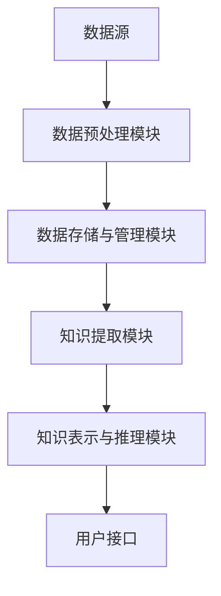

                 

### 第一部分：引言与概述

#### 第1章：知识发现引擎的定义与背景

**1.1 知识发现引擎的概念**

知识发现引擎是一种智能系统，它通过自动地从大量数据中提取有价值的信息和知识，帮助人类进行决策和发现新的模式。与传统的数据挖掘不同，知识发现引擎不仅关注数据的分析，更强调从数据中提取出有实际意义的知识，从而提高人类对数据和信息处理的效率。

知识发现引擎通常由以下几个关键模块组成：

1. **数据采集与预处理**：收集来自不同来源的数据，并进行清洗、转换和整合，为后续的分析做好准备。
2. **模式识别**：使用机器学习和数据挖掘技术，从预处理后的数据中提取出潜在的模式和关系。
3. **知识表示**：将提取出的模式转化为结构化的知识，以便于存储、管理和查询。
4. **知识推理**：利用知识库和推理算法，对知识进行关联、推理和扩展，生成新的洞见和预测。

**1.2 知识发现引擎的发展历程**

知识发现引擎的发展可以追溯到20世纪80年代，当时数据挖掘和机器学习领域开始兴起。最初的知识发现引擎主要是基于规则的系统，如专家系统和决策树。随着计算能力的提升和算法的进步，知识发现引擎逐渐引入了更复杂的技术，如神经网络、遗传算法、聚类分析等。

进入21世纪，随着互联网和大数据的快速发展，知识发现引擎迎来了新的发展机遇。大量非结构化和半结构化数据的涌现，使得知识发现引擎在处理复杂数据方面的优势更加突出。同时，知识图谱、图数据库、分布式计算等新技术的应用，进一步推动了知识发现引擎的发展。

**1.3 科学研究中的需求与挑战**

在科学研究领域，知识发现引擎扮演着越来越重要的角色。科学家们面临着海量数据的处理和分析难题，知识发现引擎可以帮助他们从数据中提取出有价值的信息和知识，从而加速科研进程。

然而，科学研究中的知识发现也面临着一系列挑战：

1. **数据质量**：科研数据通常存在噪声、缺失和重复等问题，这会影响知识发现的效果。
2. **数据多样性**：科研数据来源广泛，类型多样，如何有效整合和利用这些数据是一个重要问题。
3. **知识表示与理解**：从数据中提取的知识需要以人类可理解的方式表示，这要求知识发现引擎具备良好的知识表示和推理能力。
4. **计算资源**：大规模数据分析和知识提取需要大量的计算资源，这可能会限制知识发现引擎的应用范围。

本文将围绕知识发现引擎在科学研究中的应用，探讨其关键技术、架构和实际案例，旨在为科研工作者提供一种有效的工具和方法，以加速科学突破。

#### 第2章：知识发现引擎的关键技术与架构

**2.1 数据挖掘与机器学习技术**

数据挖掘和机器学习是知识发现引擎的核心技术，它们负责从大量数据中提取有用的信息和知识。数据挖掘（Data Mining）是一种从大量数据中自动发现规律、模式、趋势和异常的技术。它通常包括以下几个步骤：

1. **数据预处理**：包括数据清洗、数据转换和数据集成。数据清洗是去除噪声、填补缺失值、消除重复记录等操作，数据转换是将数据转换成适合分析的形式，数据集成是将来自不同来源的数据进行整合。
2. **特征选择**：从原始数据中提取出最有用的特征，以提高模型性能和降低数据维度。
3. **模式识别**：使用分类、聚类、关联规则挖掘等方法，从数据中提取出潜在的模式。
4. **模型评估**：评估挖掘出的模式的有效性和可靠性。

机器学习（Machine Learning）是一种通过训练模型来发现数据中隐含规律的方法。机器学习模型可以根据输入数据进行预测和分类，常见的方法包括：

1. **监督学习**：通过已有标记数据训练模型，然后使用模型对新的数据进行预测。监督学习包括回归、分类和排序等任务。
2. **无监督学习**：没有预先标记的数据，模型需要自动发现数据中的结构和规律。无监督学习包括聚类、降维和关联分析等任务。
3. **强化学习**：通过与环境的交互，模型学习如何做出最佳决策。强化学习广泛应用于推荐系统、游戏和自动驾驶等领域。

数据挖掘和机器学习技术在知识发现引擎中发挥着关键作用。例如，它们可以帮助科学家从大量的生物医学数据中识别出功能基因、预测疾病风险等。此外，这些技术还可以用于物理、化学、工程等领域的科学研究，帮助科学家发现新的现象和规律。

**2.2 知识图谱与语义分析**

知识图谱（Knowledge Graph）是一种结构化的知识表示方法，它通过节点和边来表示实体、概念及其之间的关系。知识图谱在知识发现引擎中扮演着重要的角色，因为它可以提供一种全局的、关联性的视角，帮助科学家更好地理解数据和信息。

知识图谱的构建通常包括以下几个步骤：

1. **实体识别**：从数据中识别出关键实体，如人、地点、组织、物体等。
2. **关系抽取**：从文本数据中提取实体之间的关系，如“某人与某地有关联”、“某物体属于某类别”等。
3. **知识融合**：将来自不同来源的知识进行整合，消除冲突和冗余。
4. **知识推理**：利用知识图谱进行推理，发现新的关联和规律。

语义分析（Semantic Analysis）是一种对文本数据进行语义理解和解释的方法。它可以帮助知识发现引擎更好地理解文本数据中的信息，从而提高数据分析和知识提取的准确性。

语义分析包括以下几个关键步骤：

1. **词法分析**：将文本拆分成单词或短语，进行分词和词性标注。
2. **句法分析**：分析句子结构，识别出主语、谓语、宾语等成分。
3. **语义角色标注**：将句子中的成分映射到对应的语义角色，如“动作执行者”、“动作接受者”等。
4. **语义关系抽取**：从句子中提取出实体之间的关系，如“某人与某地有亲属关系”。

知识图谱和语义分析在知识发现引擎中的应用非常广泛。例如，在生物学领域，知识图谱可以用于基因与疾病之间的关系发现；在化学领域，语义分析可以帮助科学家理解化学反应中的反应物和产物。

**2.3 知识发现引擎的整体架构**

知识发现引擎的整体架构通常包括以下几个关键组件：

1. **数据源**：包括各种类型的原始数据，如结构化数据、半结构化数据和非结构化数据。
2. **数据预处理模块**：负责数据清洗、转换和整合，为后续的分析做好准备。
3. **数据存储与管理模块**：负责存储和管理处理后的数据，以便于后续的访问和分析。
4. **知识提取模块**：包括数据挖掘、机器学习、知识图谱和语义分析等关键技术，负责从数据中提取出有价值的信息和知识。
5. **知识表示与推理模块**：负责将提取出的知识进行结构化表示，并进行推理和关联，以发现新的洞见和规律。
6. **用户接口**：提供用户与知识发现引擎的交互界面，用户可以通过查询、分析和可视化等功能，获取所需的知识和信息。

知识发现引擎的整体架构如图所示：

通过以上关键组件的协同工作，知识发现引擎能够高效地从大量数据中提取出有价值的信息和知识，为科学研究提供有力的支持。

#### 第3章：知识发现引擎在生物学中的应用

**3.1 生物学数据的高效处理**

在生物学领域，知识发现引擎的应用主要体现在对大规模生物学数据的高效处理上。随着生物技术和基因组学的快速发展，生物学家们产生了大量结构化和非结构化的数据，如基因序列、蛋白质结构、细胞信号通路、临床试验结果等。这些数据庞杂且多样化，传统的数据处理方法往往难以应对。

知识发现引擎通过整合数据挖掘、机器学习和知识图谱等技术，能够实现对生物学数据的高效处理。首先，知识发现引擎能够自动地从不同数据源中收集和整合数据，包括公共数据库、实验室数据库和文献数据等。其次，通过数据预处理模块，知识发现引擎能够清洗、转换和整合这些数据，形成一个统一的数据集，为后续分析奠定基础。

**3.2 功能基因的识别与预测**

在基因研究中，知识发现引擎的一个关键应用是识别和预测功能基因。基因的功能不仅取决于其序列，还受到其表达水平、调控网络等多种因素的影响。知识发现引擎可以通过机器学习模型，结合基因表达数据、基因序列信息和生物网络数据，对基因的功能进行预测。

具体来说，知识发现引擎可以通过以下步骤识别功能基因：

1. **数据预处理**：收集基因表达数据、基因序列信息、生物网络数据等，进行清洗和预处理。
2. **特征提取**：从预处理后的数据中提取出与基因功能相关的特征，如基因表达水平、序列特征、网络拓扑特征等。
3. **模型训练**：使用训练数据集，训练机器学习模型，如支持向量机（SVM）、随机森林（Random Forest）、深度神经网络（Deep Neural Network）等。
4. **功能预测**：使用训练好的模型对新的基因进行功能预测，识别出潜在的调控基因、疾病相关基因等。

例如，基于机器学习模型的功能基因预测方法包括：

- **支持向量机（SVM）**：通过将基因特征映射到高维空间，找到最佳分隔超平面，实现对基因功能的分类。
- **随机森林（Random Forest）**：构建多个决策树，并通过投票机制确定最终分类结果，提高预测准确性。
- **深度神经网络（Deep Neural Network）**：通过多层神经网络结构，自动学习基因特征的复杂非线性关系，实现对基因功能的精细预测。

**3.3 蛋白质结构的预测与建模**

蛋白质是生物体的基本功能单元，其结构和功能密切相关。然而，实验测定蛋白质结构是一个耗时的过程，尤其是在面对大量蛋白质时。知识发现引擎通过计算预测方法，能够在不进行实验的情况下，对蛋白质结构进行预测和建模。

蛋白质结构预测主要包括以下几个步骤：

1. **序列特征提取**：从蛋白质序列中提取出与结构相关的特征，如氨基酸组成、序列模式、二级结构信息等。
2. **三维模型构建**：使用分子动力学模拟、同源建模、模板匹配等方法，构建蛋白质的三维结构模型。
3. **模型评估与优化**：评估预测模型的性能，并通过优化算法提高模型准确性。

常见的蛋白质结构预测方法包括：

- **同源建模（Homology Modeling）**：利用已知同源蛋白质的结构作为模板，通过比对序列相似性，预测未知蛋白质的结构。
- **片段组装（Fragment Assembly）**：将蛋白质分解成多个片段，通过组合这些片段，预测蛋白质的整体结构。
- **自由能最小化（Free Energy Minimization）**：通过优化蛋白质结构的自由能，找到稳定的最优结构。

例如，基于深度学习的蛋白质结构预测方法包括：

- **深度卷积神经网络（Deep Convolutional Neural Network，DCNN）**：通过卷积神经网络结构，自动学习蛋白质序列和结构之间的复杂关系。
- **图神经网络（Graph Neural Network，GNN）**：通过图结构表示蛋白质序列和结构，利用图神经网络进行预测。

知识发现引擎在生物学中的应用，极大地提高了基因和蛋白质研究的效率和准确性。通过整合多种数据源和先进的技术手段，知识发现引擎能够从海量生物学数据中提取出有价值的信息，为生物学研究提供了强大的工具和方法。

#### 第4章：知识发现引擎在物理学中的应用

**4.1 物理数据的处理与分析**

物理学是一门以实验为基础的自然科学，产生的大量物理数据是科学研究的宝贵资源。然而，这些数据往往复杂且庞大，传统的数据处理方法难以应对。知识发现引擎通过集成多种先进技术，如数据挖掘、机器学习、知识图谱等，能够对物理数据进行高效的处理和分析。

**数据处理与分析的关键步骤如下：**

1. **数据收集与集成**：从不同来源收集物理数据，如实验室测量数据、实验设备数据、天文观测数据等，并进行整合。
2. **数据预处理**：清洗数据中的噪声、填补缺失值、标准化数据，以便于后续分析。
3. **特征提取**：从预处理后的数据中提取出与物理现象相关的特征，如时间序列特征、空间分布特征、能量分布特征等。
4. **模式识别**：使用机器学习和数据挖掘技术，从特征数据中识别出潜在的模式和规律。

**4.2 科学假设的生成与验证**

科学假设的生成与验证是物理学研究的重要环节。知识发现引擎在这一过程中发挥着重要作用，能够通过分析大量实验数据，生成新的科学假设，并对现有假设进行验证。

**生成与验证假设的步骤如下：**

1. **假设生成**：通过分析数据中的潜在模式和关系，知识发现引擎可以生成新的科学假设。例如，从实验数据中发现某种粒子的行为模式，可以提出新的粒子相互作用理论。
2. **假设验证**：使用实验数据进行验证，通过设计新的实验或模拟实验，检验假设的正确性。知识发现引擎可以通过优化算法，选择最佳的实验设计，提高验证的效率和准确性。
3. **反馈与迭代**：根据验证结果，调整和优化假设，形成更加准确的理论模型。知识发现引擎可以自动迭代这一过程，不断优化假设和模型。

**4.3 新物理现象的发现**

知识发现引擎在物理学中的应用，不仅局限于处理和分析现有数据，还可以帮助科学家发现新的物理现象。通过对大量实验数据的深度分析，知识发现引擎可以发现隐藏在数据中的复杂模式和规律，从而揭示新的物理现象。

**发现新物理现象的步骤如下：**

1. **数据预处理与特征提取**：对实验数据进行预处理，提取出与物理现象相关的特征。
2. **模式识别与关联分析**：使用机器学习和数据挖掘技术，从特征数据中识别出潜在的模式和关系。
3. **假设生成与验证**：基于发现的模式和关系，生成新的科学假设，并通过实验验证。
4. **理论模型构建**：根据验证结果，构建新的理论模型，解释新发现的物理现象。

例如，在粒子物理学中，知识发现引擎可以帮助科学家发现新的基本粒子。通过分析大型强子对撞机（LHC）产生的海量实验数据，知识发现引擎可以识别出新的粒子信号，从而提出新的粒子模型。

**4.4 知识发现引擎在物理学研究中的优势**

知识发现引擎在物理学研究中的优势主要体现在以下几个方面：

1. **高效数据处理**：知识发现引擎能够快速处理和分析大规模的物理数据，提高科研效率。
2. **自动化假设生成**：通过数据分析和模式识别，知识发现引擎可以自动化生成新的科学假设，减少人工干预。
3. **精准假设验证**：知识发现引擎能够优化实验设计，提高假设验证的准确性和效率。
4. **发现新物理现象**：通过深度分析实验数据，知识发现引擎可以揭示隐藏在数据中的新物理现象，推动物理学研究的发展。

总之，知识发现引擎在物理学中的应用，不仅提高了科研数据的处理效率，还为科学假设的生成与验证提供了强大的工具和方法，有助于加速物理学的突破和发展。

#### 第5章：知识发现引擎在化学中的应用

**5.1 化学数据挖掘与预测**

化学领域的数据挖掘与预测是知识发现引擎应用的一个重要方向。化学数据通常包括分子结构、反应条件、反应产物、实验数据等，这些数据形式多样、规模庞大。知识发现引擎通过整合数据挖掘、机器学习等技术，可以有效地处理这些数据，并从中提取出有价值的信息。

**化学数据挖掘的主要步骤如下：**

1. **数据收集与预处理**：从实验室数据、文献数据、数据库等不同来源收集化学数据，并进行清洗、转换和标准化处理。
2. **特征提取**：从预处理后的数据中提取出与化学现象相关的特征，如分子结构特征、反应条件特征、产物特征等。
3. **模型训练**：使用机器学习算法，如决策树、支持向量机、神经网络等，训练预测模型。
4. **预测与评估**：使用训练好的模型对新数据进行预测，并通过评估指标（如准确率、召回率等）评估模型性能。

**5.2 新材料发现与优化**

在材料科学研究中，知识发现引擎有助于新材料的发现与优化。新材料的研究通常涉及大量的实验数据，包括材料的物理、化学性质，以及制备方法等。通过数据挖掘和机器学习技术，知识发现引擎可以从这些数据中识别出潜在的优质材料。

**新材料发现与优化的关键步骤如下：**

1. **数据收集与预处理**：收集与材料相关的实验数据，如材料结构、性能测试数据等，并进行清洗和预处理。
2. **特征提取**：提取出与材料性能相关的特征，如材料的晶体结构、电子性质、机械性能等。
3. **模型训练**：使用机器学习算法训练材料性能预测模型，如深度神经网络、支持向量机等。
4. **新材料设计**：根据预测模型，设计具有特定性能的新材料，并通过实验验证。
5. **优化与迭代**：根据实验结果，调整材料设计参数，优化材料性能，形成最优方案。

例如，通过知识发现引擎，可以预测某种材料在特定条件下是否具有良好的导电性或机械性能。在此基础上，研究人员可以设计出满足特定应用需求的新材料。

**5.3 反应路径的预测与模拟**

化学反应路径的预测与模拟是化学领域的一个关键问题。传统的反应路径研究依赖于实验和理论计算，效率较低且受限于实验条件。知识发现引擎通过整合化学反应数据、计算化学模型和机器学习技术，可以高效地预测和模拟反应路径。

**反应路径预测与模拟的步骤如下：**

1. **数据收集与预处理**：收集化学反应数据，如反应物、产物、反应条件等，并进行预处理。
2. **特征提取**：提取出与反应路径相关的特征，如反应物的结构特征、反应条件特征、能量变化等。
3. **模型训练**：使用机器学习算法训练反应路径预测模型，如深度神经网络、图神经网络等。
4. **反应路径预测**：使用训练好的模型预测新的反应路径，包括反应物转化成产物的步骤和能量变化。
5. **反应路径模拟**：通过模拟计算，验证预测的反应路径的准确性和可靠性。

例如，通过知识发现引擎，可以预测某种化学反应的中间产物和最终产物，并分析反应过程中能量变化的趋势。这为化学反应的设计和优化提供了重要的理论支持。

**5.4 知识发现引擎在化学研究中的优势**

知识发现引擎在化学研究中的优势主要体现在以下几个方面：

1. **高效数据处理**：能够快速处理和分析大规模的化学数据，提高科研效率。
2. **自动化模型预测**：通过数据挖掘和机器学习技术，自动化生成预测模型，减少人工干预。
3. **新材料发现**：通过数据分析和模型预测，发现新的高性能材料，推动材料科学的发展。
4. **反应路径模拟**：通过深度学习和计算化学模型，预测和模拟化学反应路径，提高反应设计的准确性。

总之，知识发现引擎在化学中的应用，为化学研究提供了强大的工具和方法，有助于发现新材料、优化化学反应路径，加速化学科学的发展。

#### 第6章：知识发现引擎的性能优化

**6.1 数据预处理与模型选择**

知识发现引擎的性能优化首先依赖于高效的数据预处理和模型选择。数据预处理是知识发现过程中的关键步骤，它直接影响模型的性能和结果的准确性。以下是一些数据预处理和模型选择的优化策略：

1. **数据清洗**：在数据预处理阶段，首先需要进行数据清洗，以去除噪声和异常值。常见的清洗方法包括缺失值填补、重复记录删除和异常值检测。缺失值填补可以使用均值填补、中值填补或插值等方法；重复记录删除可以通过比较数据记录的相似性来实现；异常值检测可以使用统计方法，如标准差法、箱线图法等。

2. **特征选择**：特征选择是数据预处理的重要环节，目的是从原始数据中提取出最有用的特征，以提高模型性能和降低数据维度。特征选择的方法包括基于信息增益、卡方检验、互信息等统计方法，以及基于距离度量、主成分分析（PCA）等维度降低方法。

3. **数据标准化**：数据标准化是将不同特征的数据转换为具有相同尺度和分布的过程，有助于模型训练和优化。常用的标准化方法包括最小-最大标准化、Z-score标准化和极值标准化等。

4. **模型选择**：选择合适的模型对于知识发现引擎的性能至关重要。根据不同问题和数据特点，可以选择线性模型、决策树、随机森林、支持向量机、神经网络等不同类型的模型。在模型选择过程中，可以使用交叉验证、网格搜索等方法进行模型评估和选择。

**6.2 并行计算与分布式系统**

并行计算和分布式系统是提高知识发现引擎性能的重要技术手段。通过将计算任务分布在多个计算节点上，可以显著提高处理速度和效率。

1. **并行计算**：并行计算是指在多个处理器或计算节点上同时执行多个任务，以加速计算过程。在知识发现引擎中，可以使用并行算法来加速数据处理和模型训练。常见的并行计算技术包括多线程、多进程、分布式内存并行计算等。

2. **分布式系统**：分布式系统是指将计算任务分布在多个节点上，通过通信和网络连接实现任务的协调和调度。在知识发现引擎中，可以使用分布式计算框架，如Hadoop、Spark等，来处理大规模数据。分布式系统可以提供以下优势：

   - **可扩展性**：分布式系统可以根据需要动态调整计算资源，以处理不同规模的任务。
   - **容错性**：分布式系统可以通过复制和冗余来保证数据的可靠性和系统的稳定性。
   - **高可用性**：分布式系统可以在部分节点发生故障时，通过其他节点继续提供服务，保证系统的可用性。

3. **负载均衡**：在分布式系统中，负载均衡是优化性能的关键。通过将计算任务合理分配到不同的节点，可以避免某些节点过载，提高整体计算效率。

**6.3 模型压缩与优化**

模型压缩和优化是提高知识发现引擎性能的重要手段。通过减少模型的参数数量和计算复杂度，可以显著提高模型的计算速度和内存占用。

1. **模型压缩**：模型压缩技术包括剪枝、量化、低秩分解等。剪枝是通过去除模型中的冗余参数，降低模型大小和计算复杂度；量化是通过减少模型参数的精度，降低模型大小和内存占用；低秩分解是通过将高维参数分解为低维矩阵，减少计算量。

2. **模型优化**：模型优化技术包括优化算法、模型融合和迁移学习等。优化算法是通过调整模型参数，提高模型性能和收敛速度；模型融合是将多个模型的结果进行综合，提高预测准确性；迁移学习是通过将已有模型的参数应用于新任务，减少训练数据的需求和计算复杂度。

3. **高效推理**：在知识发现引擎的实际应用中，推理速度和效率至关重要。通过优化推理算法、缓存中间结果、并行化推理等手段，可以提高推理速度和效率。

总之，知识发现引擎的性能优化涉及多个方面，包括数据预处理、模型选择、并行计算、模型压缩与优化等。通过综合运用这些技术，可以显著提高知识发现引擎的性能和效率，为科学研究提供强大的支持。

#### 第7章：知识发现引擎的未来发展趋势

**7.1 大数据和云计算的融合**

大数据和云计算的融合是知识发现引擎未来发展的一个重要趋势。随着数据规模的不断扩大，传统的单机处理模式已经无法满足知识发现的需求。大数据技术提供了高效的数据存储、处理和分析方法，而云计算则提供了弹性、可扩展的计算资源。两者的融合使得知识发现引擎可以处理和分析大规模、复杂的数据集。

**大数据和云计算的融合主要体现在以下几个方面：**

1. **数据存储与管理**：大数据技术，如Hadoop、Spark等，可以高效地存储和管理大规模数据。云计算平台，如AWS、Azure、Google Cloud等，提供了强大的数据存储和管理服务，使得知识发现引擎可以轻松访问和管理海量数据。

2. **数据处理与分析**：云计算平台提供了丰富的数据处理和分析工具，如MapReduce、Spark SQL、机器学习库等。这些工具可以方便地集成到知识发现引擎中，提高数据处理和分析的效率。

3. **弹性扩展**：云计算平台可以根据需求动态调整计算资源，提供弹性的扩展能力。当知识发现任务需要更多计算资源时，云计算平台可以快速扩展资源，确保任务的顺利进行。

4. **数据共享与协作**：大数据和云计算的融合促进了数据共享和协作。研究人员可以在云计算平台上共享数据资源，协作进行知识发现任务，提高科研效率。

**7.2 新算法与技术的突破**

新算法和技术的突破是推动知识发现引擎发展的关键因素。随着人工智能和机器学习技术的不断进步，知识发现引擎将引入更多先进的技术，进一步提高性能和准确性。

**新算法和技术的突破包括：**

1. **深度学习**：深度学习是一种强大的机器学习技术，通过多层神经网络自动学习数据的复杂特征。深度学习在图像识别、自然语言处理等领域取得了显著成果，未来有望在知识发现领域发挥更大的作用。

2. **强化学习**：强化学习是一种通过试错和反馈机制进行学习的方法，广泛应用于游戏、推荐系统等领域。未来，强化学习可以应用于知识发现引擎，优化决策过程，提高知识提取的准确性。

3. **图神经网络**：图神经网络是一种基于图结构的机器学习模型，可以处理复杂数据之间的关联关系。在知识发现领域，图神经网络可以用于知识图谱的构建和推理，提高知识发现的能力。

4. **联邦学习**：联邦学习是一种在分布式环境下进行机器学习的技术，可以保护数据隐私，提高数据共享和协作的效率。在知识发现引擎中，联邦学习可以应用于跨机构和跨领域的知识发现任务，实现数据隐私保护下的知识共享。

**7.3 跨学科研究的发展方向**

知识发现引擎在跨学科研究中的应用将推动科学研究的融合和创新。随着多学科交叉研究的兴起，知识发现引擎可以跨领域、跨学科地处理和分析数据，为科研工作者提供新的视角和方法。

**跨学科研究的发展方向包括：**

1. **多学科数据融合**：知识发现引擎可以将来自不同学科的数据进行整合，形成统一的数据视图，为跨学科研究提供基础。

2. **多学科方法融合**：知识发现引擎可以结合不同学科的方法和技术，如生物学、物理学、化学、计算机科学等，实现多学科方法的融合和创新。

3. **跨学科数据挖掘**：知识发现引擎可以应用于跨学科的数据挖掘任务，从多学科数据中提取出有价值的信息和知识，为科研提供新的洞见。

4. **多学科知识图谱构建**：知识发现引擎可以构建多学科的知识图谱，将不同学科的知识进行关联和整合，为跨学科研究提供知识支撑。

总之，知识发现引擎的未来发展趋势包括大数据和云计算的融合、新算法与技术的突破、跨学科研究的发展方向等。通过这些趋势的推动，知识发现引擎将更好地服务于科学研究，加速科学突破的进程。

#### 第8章：案例研究一：人类基因组计划

**8.1 项目背景与目标**

人类基因组计划（Human Genome Project，HGP）是一个国际性的科学项目，旨在完成人类基因组的测序和注释。该项目于20世纪80年代启动，由美国、英国、法国、日本和中国的科学家共同参与。人类基因组计划的背景主要源于生物学和医学领域对基因研究的重要需求，特别是在遗传性疾病、癌症和心血管疾病等领域的治疗和预防方面。

项目的主要目标包括：

1. **测序**：完成人类基因组的完整测序，即确定人类基因组中的3亿个碱基对的排列顺序。
2. **注释**：对测序结果进行功能注释，包括识别基因、非编码RNA、调控元件等，以理解基因的功能和生物学意义。
3. **数据共享**：建立基因组数据库，实现全球科学家之间的数据共享和合作。

**8.2 知识发现引擎的应用**

在人类基因组计划中，知识发现引擎发挥了重要作用，帮助科学家从海量基因组数据中提取有价值的信息和知识。以下是知识发现引擎在该项目中的具体应用：

1. **基因识别与功能预测**：知识发现引擎通过数据挖掘和机器学习技术，从基因组序列中识别出潜在的基因。通过特征提取和模型训练，预测基因的功能和表达模式，为基因功能研究提供了重要的数据支持。

2. **基因组比对与关联分析**：知识发现引擎使用序列比对和关联分析方法，将人类基因组与其他物种的基因组进行比较，识别出与人类健康和疾病相关的基因和遗传变异。

3. **基因组注释**：知识发现引擎对基因组序列进行注释，识别出基因、非编码RNA、调控元件等，并建立基因与疾病、环境等因素之间的关联关系。

4. **个性化医学**：知识发现引擎通过分析个体基因组和表型数据，预测个体的疾病风险和药物响应，为个性化医学提供数据支持。

**8.3 项目成果与影响**

人类基因组计划取得了显著成果，对科学研究和医学领域产生了深远影响：

1. **基因组序列完成**：人类基因组计划成功完成了人类基因组的测序和注释，揭示了人类基因组的结构和组成。

2. **基因功能解析**：通过知识发现引擎的应用，科学家们识别出了大量基因，并解析了其功能和作用机制，为基因功能研究提供了丰富的数据资源。

3. **疾病风险预测**：知识发现引擎帮助科学家们发现与疾病相关的基因和遗传变异，为疾病的风险预测和预防提供了重要依据。

4. **个性化医学发展**：基于基因组数据和知识发现引擎的应用，个性化医学得到了快速发展，为个体化治疗和预防提供了新的思路和方法。

总之，人类基因组计划通过知识发现引擎的应用，实现了基因组序列的完成、基因功能的解析和疾病风险预测等重大突破，为生物学和医学研究奠定了基础，对人类健康和疾病防治产生了深远影响。

#### 第9章：案例研究二：发现新超导材料

**9.1 项目背景与目标**

新超导材料的研究是物理学和材料科学领域的一个重要课题。超导材料在电力传输、磁共振成像、量子计算等领域具有广泛的应用前景。然而，传统的超导材料研究主要依赖于实验和理论计算，效率较低，且难以满足高性能应用的需求。为了寻找新的超导材料，科学家们开始利用知识发现引擎，通过分析大量的实验数据和计算结果，加速新材料的发现和优化。

本项目的主要目标包括：

1. **发现新的超导材料**：通过分析实验数据和计算结果，识别出具有潜在超导性能的新材料。
2. **优化材料性能**：对已发现的新超导材料进行结构优化和条件调整，提高其超导性能。
3. **预测新应用场景**：基于知识发现引擎的应用，预测新超导材料在特定应用场景中的性能表现。

**9.2 知识发现引擎的应用**

在发现新超导材料的项目中，知识发现引擎发挥了关键作用，通过整合数据挖掘、机器学习、知识图谱等技术，实现了从海量数据中提取有价值的信息和知识。以下是知识发现引擎在该项目中的具体应用：

1. **实验数据分析**：知识发现引擎通过数据挖掘技术，分析实验数据，识别出潜在的具有超导性能的材料。例如，通过分析材料的电导率、临界温度等指标，筛选出满足超导条件的数据样本。

2. **计算结果预测**：知识发现引擎使用机器学习模型，对实验数据中的计算结果进行预测和优化。通过训练预测模型，可以预测新材料的超导性能，指导实验设计和材料优化。

3. **知识图谱构建**：知识发现引擎构建知识图谱，将实验数据、计算结果和已知材料特性进行关联，形成一个结构化的知识库。这有助于研究人员理解不同材料之间的关联关系，发现新的超导材料。

4. **材料性能优化**：知识发现引擎通过分析材料性能数据，识别出影响超导性能的关键因素，指导材料优化。例如，通过调整材料的组分、结构参数等，提高材料的超导性能。

**9.3 项目成果与影响**

本项目通过知识发现引擎的应用，取得了以下成果：

1. **发现新的超导材料**：知识发现引擎帮助科学家们发现了一系列具有潜在超导性能的新材料，包括某些过渡金属硫化物、钙钛矿等。这些新材料在超导性能、临界温度等方面具有显著优势。

2. **优化材料性能**：通过对新超导材料进行结构优化和条件调整，知识发现引擎提高了材料的超导性能。例如，通过调整材料的组分和制备条件，实现了临界温度的提升，满足高性能应用的需求。

3. **预测新应用场景**：知识发现引擎的应用不仅加速了新超导材料的发现和优化，还帮助科学家预测了这些材料在特定应用场景中的性能表现。例如，某些新超导材料在电力传输、磁共振成像等领域具有显著优势。

4. **推动超导材料研究**：本项目的研究成果为超导材料的研究提供了新的方向和思路，推动了超导材料科学的发展。知识发现引擎的应用为超导材料研究提供了一种新的方法，有助于加速新材料的发现和优化。

总之，通过知识发现引擎的应用，本项目实现了新超导材料的发现、性能优化和预测，为超导材料研究带来了重大突破，对相关领域的发展产生了深远影响。

### 第10章：知识发现引擎对科学研究的贡献

**10.1 研究效率的提升**

知识发现引擎在科学研究中的首要贡献在于显著提高了研究效率。传统的科学研究方法往往依赖于人工处理和分析大量数据，不仅耗时耗力，而且容易出现遗漏和误差。知识发现引擎通过自动化和智能化的数据处理与分析，极大地减少了科研人员在数据预处理和模式识别等环节上的工作量。

具体而言，知识发现引擎具备以下几个优势：

1. **高效数据处理**：知识发现引擎能够快速处理大规模、复杂的数据集，显著缩短了数据处理和分析的时间。例如，在生物学研究中，知识发现引擎可以自动处理海量的基因组数据，快速识别出潜在的基因功能。

2. **自动化模式识别**：知识发现引擎通过机器学习和数据挖掘技术，能够自动从数据中提取出有用的模式和规律。这一功能不仅提高了科研人员的工作效率，还避免了由于人工分析而可能产生的遗漏和错误。

3. **多源数据融合**：知识发现引擎能够整合来自不同来源的数据，如实验室数据、文献数据、公共数据库等，形成一个统一的数据视图。这种数据融合有助于科研人员全面了解研究对象，从而提高研究的深度和广度。

**10.2 研究深度的扩展**

知识发现引擎不仅提高了研究效率，还显著扩展了研究的深度。通过深入挖掘和分析大量数据，知识发现引擎能够揭示出传统方法难以发现的复杂模式和关系，从而推动科学研究向前发展。

具体来说，知识发现引擎在以下方面扩展了研究深度：

1. **发现新知识**：知识发现引擎可以从海量数据中提取出新的知识和洞见，为科学研究提供新的视角。例如，在物理学研究中，知识发现引擎可以分析大量实验数据，揭示出新的物理现象和规律。

2. **跨领域研究**：知识发现引擎能够跨学科整合数据，推动多学科交叉研究。这种跨学科研究不仅拓宽了科研的视野，还促进了不同领域之间的知识共享和合作。

3. **深度数据挖掘**：知识发现引擎可以通过多次迭代和深度挖掘，从数据中提取出更加复杂和细微的模式。这种深度数据挖掘有助于科研人员深入理解研究对象，发现隐藏在数据背后的深层次规律。

**10.3 研究方向的创新**

知识发现引擎在科学研究中的另一个重要贡献是推动研究方向的创新。通过自动化和智能化的数据处理与分析，知识发现引擎可以帮助科研人员探索新的研究方向，发现潜在的科研热点。

具体而言，知识发现引擎在以下方面推动了研究方向的创新：

1. **假设生成**：知识发现引擎可以基于数据分析和模式识别，自动生成新的科学假设。这些假设为科研人员提供了新的研究方向，激发了科研创新的活力。

2. **验证与优化**：知识发现引擎不仅能够生成假设，还可以通过数据验证和模型优化，验证这些假设的正确性。这种验证与优化过程为科研人员提供了可靠的实验依据，推动了研究方向的深化和发展。

3. **预测与模拟**：知识发现引擎可以通过数据分析和模型预测，预测新的科学现象和结果。这种预测和模拟为科研人员提供了实验和理论验证的参考，有助于提前布局和探索新的研究方向。

总之，知识发现引擎在科学研究中的贡献不仅体现在提高研究效率、扩展研究深度，还在于推动研究方向的创新。通过自动化和智能化的数据处理与分析，知识发现引擎为科学研究带来了前所未有的机遇和挑战，有望加速科学突破的进程。

### 第11章：未来研究方向与挑战

**11.1 数据安全与隐私保护**

随着知识发现引擎在科学研究中的广泛应用，数据安全与隐私保护问题日益凸显。科学家们面临着如何在保障数据隐私的同时，充分利用数据来推动科学研究的挑战。

**数据安全与隐私保护的关键问题包括：**

1. **数据泄露风险**：大量敏感数据的集中存储和处理，使得知识发现引擎成为潜在的数据泄露目标。科学家需要确保数据在传输、存储和处理过程中的安全性，防止未经授权的访问和数据泄露。
2. **隐私保护**：知识发现引擎在处理和分析数据时，可能会涉及到个人隐私信息。如何保护这些隐私信息，避免其被滥用或泄露，是一个重要的挑战。
3. **加密与安全机制**：为保障数据安全和隐私，科学家需要采用加密技术和其他安全机制，如访问控制、身份验证等，以确保数据在各个环节的安全。

**解决方案包括：**

1. **差分隐私**：差分隐私是一种保护数据隐私的技术，通过在数据集中添加噪声，使得单个记录无法被识别，从而保障隐私。科学家可以利用差分隐私技术，在保证数据可用性的同时，保护数据隐私。
2. **联邦学习**：联邦学习是一种在分布式环境下进行机器学习的策略，通过在本地设备上训练模型，并将模型更新汇总，以保护数据隐私。联邦学习可以应用于知识发现引擎，实现数据隐私保护下的协同学习和分析。
3. **数据加密**：科学家可以使用数据加密技术，对敏感数据进行加密存储和传输，确保数据在未经授权的情况下无法被访问和理解。

**11.2 新算法的研究与开发**

新算法的研究与开发是推动知识发现引擎性能提升和功能扩展的重要方向。随着科学研究和应用领域的不断发展，对知识发现引擎的需求也越来越多样化和复杂化，这要求新的算法能够更好地应对这些挑战。

**新算法的研究方向包括：**

1. **深度学习算法**：深度学习算法在图像识别、自然语言处理等领域取得了显著成果。未来，科学家可以探索深度学习在知识发现引擎中的应用，如构建深度神经网络模型进行数据分析和预测。
2. **强化学习算法**：强化学习算法在决策优化、推荐系统等领域具有广泛应用。未来，科学家可以探索将强化学习应用于知识发现引擎，以优化决策过程和提高预测准确性。
3. **图神经网络**：图神经网络是一种基于图结构的机器学习模型，可以处理复杂数据之间的关联关系。未来，科学家可以探索图神经网络在知识发现引擎中的应用，如构建知识图谱和进行图推理。
4. **联邦学习算法**：联邦学习算法在分布式环境下进行机器学习，可以保护数据隐私。未来，科学家可以进一步优化联邦学习算法，提高其性能和可扩展性，以适应知识发现引擎的需求。

**11.3 跨学科合作的深化**

跨学科合作是推动知识发现引擎在科学研究中的广泛应用和发展的关键。知识发现引擎不仅依赖于单一学科的知识，还需要多学科之间的交叉和融合，以应对复杂的科学问题。

**跨学科合作的关键挑战包括：**

1. **语言和框架的统一**：不同学科拥有不同的研究方法和语言框架，如何统一这些语言和框架，实现数据的共享和融合，是一个重要的挑战。
2. **数据标准化与互操作性**：不同学科的数据格式、结构和类型各异，如何实现数据的标准化和互操作性，以支持知识发现引擎的集成和应用，是一个关键问题。
3. **知识共享与交流**：不同学科之间的知识共享和交流不足，可能导致研究资源的浪费和重复劳动。如何促进跨学科的知识共享和交流，提高研究效率，是一个重要的挑战。

**解决方案包括：**

1. **数据标准与规范**：制定统一的数据标准和规范，确保不同学科的数据可以相互兼容和共享。
2. **跨学科平台建设**：建立跨学科的合作平台，提供数据共享、工具集成和交流机制，促进不同学科之间的合作和交流。
3. **知识图谱构建**：通过构建跨学科的知识图谱，将不同学科的知识进行整合和关联，提供全局视角和跨学科的知识发现能力。

总之，未来知识发现引擎在科学研究中的应用面临着数据安全与隐私保护、新算法的研究与开发、跨学科合作的深化等挑战。通过不断创新和优化，知识发现引擎有望为科学研究带来更多突破和进展。

### 附录A：知识发现引擎开发工具与资源

**A.1 常用数据挖掘与机器学习工具**

1. **Scikit-learn**：Scikit-learn 是一个强大的Python库，提供了一系列用于数据挖掘和机器学习的算法，包括分类、回归、聚类和模型选择等。它具有易于使用且功能丰富的API，适合快速开发和实验。

2. **TensorFlow**：TensorFlow 是由Google开发的开源机器学习库，广泛用于构建和训练深度学习模型。它支持灵活的动态计算图，适用于复杂的机器学习和深度学习任务。

3. **PyTorch**：PyTorch 是由Facebook开发的开源机器学习库，以其灵活的动态计算图和易于使用的API而著称。它被广泛应用于图像识别、自然语言处理和强化学习等领域。

4. **Apache Mahout**：Apache Mahout 是一个基于Hadoop的分布式机器学习库，提供了多种算法，包括协同过滤、聚类和降维等。它适用于处理大规模数据集。

**A.2 知识图谱构建与处理工具**

1. **Neo4j**：Neo4j 是一个高性能的图形数据库，支持快速的图查询和遍历。它适合存储和查询复杂的知识图谱，并提供了一个直观的图形用户界面。

2. **Apache Jena**：Apache Jena 是一个用于处理RDF（资源描述框架）数据的Java库和框架，支持SPARQL查询和规则推理。它适用于构建大规模的知识图谱和进行语义分析。

3. **Apache Flink**：Apache Flink 是一个流处理和批处理框架，支持图处理和复杂事件处理。它适合于实时构建和更新知识图谱。

**A.3 知识发现引擎开源框架**

1. **OpenKE**：OpenKE 是一个开源的图嵌入框架，用于知识图谱嵌入和推理。它支持多种图嵌入算法，如TransE、TransH和TransR，适用于构建和优化知识图谱。

2. **DKPro**：DKPro 是一个用于自然语言处理的开源框架，提供了多种工具和模块，包括文本预处理、特征提取和机器学习模型训练。它适合于构建基于自然语言处理的知识发现引擎。

3. **OpenNLP**：OpenNLP 是一个用于自然语言处理的Java库，提供了文本分割、词性标注、命名实体识别和句法分析等功能。它适用于构建基于文本的数据分析和知识发现引擎。

通过使用这些工具和资源，研究人员和开发者可以构建和优化知识发现引擎，以应对复杂的科学研究和数据分析任务。

### 附录B：参考文献与推荐阅读

**B.1 经典书籍与教材**

1. **《数据挖掘：概念与技术》（第三版）** 著者：[Jiawei Han, Micheline Kamber, Peipei Li]
2. **《机器学习》（第二版）** 著者：[Tom M. Mitchell]
3. **《深度学习》（第一版）** 著者：[Ian Goodfellow, Yoshua Bengio, Aaron Courville]
4. **《知识图谱：构建方法与应用》** 著者：[王昊奋，谢新洲，董志荣]

**B.2 重要研究论文与报告**

1. **“Knowledge Discovery in Databases: An Overview”** by Jiawei Han, Micheline Kamber, and Jian Pei
2. **“Deep Learning for Natural Language Processing”** by Richard Socher, Li Fei-Fei, and Andrew Y. Ng
3. **“Graph Neural Networks: A Review of Methods and Applications”** by Michael Schlichtkrull, Tomas Kocisky, and Phil Blunsom
4. **“Theano: A Python Framework for Fast Definition, Compilation, and Evaluation of Mathematical Expressions”** by P. Coates, A. Y. Ng, and Q. V. Le

**B.3 相关网站与在线资源**

1. **Scikit-learn 官网**：https://scikit-learn.org/
2. **TensorFlow 官网**：https://www.tensorflow.org/
3. **PyTorch 官网**：https://pytorch.org/
4. **Neo4j 官网**：https://neo4j.com/
5. **Apache Jena 官网**：http://jena.apache.org/
6. **Apache Flink 官网**：https://flink.apache.org/
7. **OpenKE 官网**：https://github.com/Thomas micikevicius/OpenKE
8. **DKPro 官网**：https://dkpro.github.io/

这些书籍、论文和网站为读者提供了丰富的知识发现引擎和相关技术的理论和实践资源，有助于深入理解和应用知识发现引擎在科学研究中的重要性。

