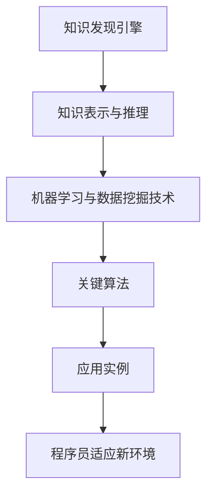

                 

### 《知识发现引擎如何帮助程序员快速适应新环境的策略》

#### 关键词
- **知识发现引擎**
- **程序员适应新环境**
- **核心技术**
- **算法**
- **应用实例**

#### 摘要
本文旨在探讨知识发现引擎在帮助程序员快速适应新环境中的重要作用。首先，我们将概述知识发现引擎的定义、基本原理和分类，并探讨其对程序员工作方式的改进。接着，我们将深入分析知识发现引擎的核心技术，包括知识表示与推理、机器学习与数据挖掘技术，以及关键算法。通过实例分析和开发与优化策略，我们将展示知识发现引擎如何在实际应用中提升程序员的工作效率和适应能力。最后，我们将展望知识发现引擎的未来发展趋势，并探讨程序员如何应对适应新环境的挑战。

### 第一部分：引言

#### 第1章：知识发现引擎概述

#### 1.1 知识发现引擎的定义与作用

知识发现引擎是一种用于从大量数据中自动识别模式和关联的智能系统。它在许多领域，如商业智能、金融分析、医疗诊断和科学研究等领域有着广泛的应用。知识发现引擎通过分析数据中的隐藏模式和关联，为用户提供洞察力和决策支持。

知识发现引擎的作用主要包括以下几点：

1. **数据挖掘与模式识别**：知识发现引擎能够自动从数据中挖掘出潜在的模式和关联，这些模式可以为决策者提供有价值的信息。
2. **自动化分析**：知识发现引擎能够自动分析大量的数据，节省人力和时间成本。
3. **实时决策支持**：知识发现引擎可以实时分析数据，为用户提供即时的决策支持。

#### 1.2 知识发现引擎的基本原理

知识发现引擎的基本原理包括以下几个步骤：

1. **数据收集与预处理**：首先，从各种数据源收集数据，并进行数据清洗、去重、转换等预处理操作。
2. **数据挖掘**：利用算法和技术，从预处理后的数据中挖掘出潜在的关联和模式。
3. **模式分析**：对挖掘出的模式进行深入分析，评估其重要性和可靠性。
4. **可视化与报告**：将分析结果以图表、报告等形式呈现给用户。

#### 1.3 知识发现引擎的分类与特点

知识发现引擎根据其功能和特点可以分为以下几类：

1. **关联规则挖掘**：通过分析数据中的关联关系，发现购买商品之间的关联。
2. **聚类分析**：根据数据点之间的相似性，将数据点分为若干个集群。
3. **分类与预测**：通过已知的特征和标签，预测未知数据的标签。
4. **异常检测**：检测数据中的异常值或异常模式。

每种类型的知识发现引擎都有其独特的应用场景和优势，程序员可以根据具体需求选择合适的技术。

### 第2章：知识发现引擎对程序员的影响

#### 2.1 知识发现引擎对程序员工作的改进

知识发现引擎在提高程序员工作效率、优化工作流程和提升代码质量方面发挥着重要作用：

1. **代码优化与重构**：知识发现引擎可以分析代码库，发现重复代码、冗余模块和潜在的bug，从而帮助程序员优化和重构代码。
2. **自动化测试**：知识发现引擎可以自动生成测试数据，模拟各种场景，提高测试覆盖率，减少手动测试的工作量。
3. **智能编码辅助**：知识发现引擎可以基于已有代码和最佳实践，为程序员提供编码建议和错误提示，提高编码效率。

#### 2.2 知识发现引擎如何帮助程序员适应新环境

程序员在新环境中面临诸多挑战，如技术栈更新、团队协作和文化差异等。知识发现引擎可以帮助程序员克服这些挑战：

1. **快速学习新技术**：知识发现引擎可以从大量的技术文档、博客和代码库中挖掘出关键信息，帮助程序员快速掌握新技术。
2. **优化团队协作**：知识发现引擎可以分析团队的工作流程和沟通模式，提出优化建议，提高团队协作效率。
3. **文化差异适应**：知识发现引擎可以分析不同团队的文化特征和沟通习惯，帮助程序员更好地适应新环境。

#### 2.3 知识发现引擎在编程领域的应用前景

随着人工智能和大数据技术的发展，知识发现引擎在编程领域的应用前景十分广阔：

1. **代码生成与自动化**：知识发现引擎可以自动生成代码，减少手动编码的工作量，提高开发效率。
2. **智能编程辅助**：知识发现引擎可以基于程序员的工作习惯和偏好，提供个性化的编程建议和工具，提高编程体验。
3. **软件质量保障**：知识发现引擎可以实时分析代码库，发现潜在的质量问题和安全漏洞，提高软件质量。

### 第二部分：知识发现引擎的核心技术

#### 第3章：知识表示与推理

#### 3.1 知识表示的方法与技巧

知识表示是知识发现引擎的基础，它涉及到如何将数据和信息转化为计算机可以处理的形式。以下是一些常用的知识表示方法与技巧：

1. **符号表示**：使用符号或标记来表示数据或知识，如使用数字、字母、单词等。
2. **语义网络**：使用网络结构来表示知识和关系，如使用节点表示概念，边表示关系。
3. **本体论**：使用本体来表示知识和概念，如使用OWL（Web Ontology Language）等语言来描述本体。
4. **模糊逻辑**：使用模糊逻辑来表示和处理不确定的信息。

#### 3.2 知识推理的基本原理与应用

知识推理是知识发现引擎的核心功能之一，它涉及到如何根据已有的知识和规则，推导出新的结论或信息。以下是一些常见的知识推理方法：

1. **演绎推理**：从一般性的规则推导出具体的结论，如使用逻辑推理规则。
2. **归纳推理**：从具体的实例中归纳出一般性的规则，如使用统计分析和模式识别。
3. **混合推理**：结合演绎推理和归纳推理，提高推理的准确性和效率。

知识推理在许多领域有着广泛的应用，如自然语言处理、智能决策支持系统和计算机视觉等。

#### 3.3 常见的知识表示语言介绍

以下是一些常见的知识表示语言：

1. **RDF（Resource Description Framework）**：一种用于表示资源和关系的数据模型和语言，常用于语义网和本体论。
2. **OWL（Web Ontology Language）**：一种用于定义本体和知识的语言，基于RDF，用于语义网和智能推理。
3. **Prolog**：一种基于逻辑编程的语言，常用于知识表示和推理。

### 第4章：机器学习与数据挖掘技术

#### 4.1 机器学习的基本概念与算法

机器学习是知识发现引擎的核心技术之一，它涉及到如何让计算机从数据中自动学习规律和模式。以下是一些常见的机器学习算法：

1. **监督学习**：使用标记数据进行训练，如分类和回归算法。
2. **无监督学习**：不使用标记数据进行训练，如聚类和降维算法。
3. **强化学习**：通过与环境交互，学习最优策略，如强化学习算法。

#### 4.2 数据挖掘的基本原理与方法

数据挖掘是知识发现引擎的关键步骤，它涉及到如何从大量数据中提取有价值的信息。以下是一些常见的数据挖掘方法：

1. **关联规则挖掘**：发现数据之间的关联关系，如Apriori算法。
2. **分类与预测**：根据特征和标签，预测未知数据的标签，如决策树和神经网络算法。
3. **聚类分析**：将数据点分为若干个集群，如K-means和层次聚类算法。

#### 4.3 机器学习与数据挖掘在知识发现中的应用

机器学习和数据挖掘技术在知识发现引擎中发挥着重要作用，以下是一些典型的应用场景：

1. **客户行为分析**：通过分析客户的行为数据，发现潜在的客户群体和购买习惯。
2. **市场趋势预测**：通过分析历史数据，预测未来的市场趋势和需求。
3. **风险识别与防范**：通过分析金融数据，识别潜在的风险和欺诈行为。

### 第5章：知识发现引擎的关键算法

#### 5.1 关联规则挖掘算法

关联规则挖掘是一种常见的数据挖掘技术，用于发现数据之间的关联关系。以下是一种简单的关联规则挖掘算法——Apriori算法的伪代码：

```python
def apriori(data_set, support_threshold):
    frequent_itemsets = []
    item_count = len(data_set)
    for k in range(1, max_length_of_itemset):
        candidate_itemsets = generate_candidate_itemsets(data_set, k)
        for itemset in candidate_itemsets:
            support = count_support(data_set, itemset, support_threshold)
            if support >= support_threshold:
                frequent_itemsets.append(itemset)
    return frequent_itemsets
```

该算法的主要步骤包括：

1. 生成候选集：根据支持阈值，生成所有可能的候选集。
2. 计算支持度：对于每个候选集，计算其在数据集中的支持度。
3. 生成频繁集：根据支持阈值，筛选出频繁集。

#### 5.2 聚类分析算法

聚类分析是一种无监督学习技术，用于将数据点分为若干个集群。以下是一种简单的聚类分析算法——K-means算法的伪代码：

```python
def kmeans(data_points, k):
    # 初始化聚类中心
    centroids = initialize_centroids(data_points, k)
    while not converged:
        # 分配数据点至最近的聚类中心
        clusters = assign_points_to_clusters(data_points, centroids)
        # 更新聚类中心
        centroids = update_centroids(clusters, k)
```

该算法的主要步骤包括：

1. 初始化聚类中心：随机选择k个数据点作为初始聚类中心。
2. 分配数据点：将每个数据点分配到距离其最近的聚类中心。
3. 更新聚类中心：计算每个聚类中心的新位置，作为下一轮分配的参考。

#### 5.3 异常检测算法

异常检测是一种用于识别数据中的异常值或异常模式的算法。以下是一种简单的异常检测算法——基于统计方法的Z-score算法的伪代码：

```python
def z_score(data_points):
    mean = sum(data_points) / len(data_points)
    variance = sum((x - mean)^2 for x in data_points) / len(data_points)
    standard_deviation = sqrt(variance)
    z_scores = [(x - mean) / standard_deviation for x in data_points]
    return z_scores
```

该算法的主要步骤包括：

1. 计算均值和方差：计算数据点的均值和方差。
2. 计算Z-score：对于每个数据点，计算其与均值的偏差。
3. 筛选异常值：根据阈值，筛选出Z-score超过阈值的异常值。

### 第6章：知识发现引擎的应用实例

#### 6.1 在软件开发中的应用

知识发现引擎在软件开发中有着广泛的应用，以下是一些典型的应用案例：

1. **代码质量分析**：知识发现引擎可以分析代码库，识别潜在的bug和性能问题，提高代码质量。
2. **自动化测试生成**：知识发现引擎可以从历史测试数据中挖掘出测试用例，提高测试覆盖率。
3. **需求变更管理**：知识发现引擎可以分析需求变更记录，识别潜在的冲突和风险，帮助团队更好地应对需求变更。

#### 6.2 在项目管理和协作中的应用

知识发现引擎在项目管理和团队协作中也发挥着重要作用，以下是一些典型的应用案例：

1. **团队效率分析**：知识发现引擎可以分析团队的工作记录和沟通数据，识别团队成员的工作状态和协作模式，提高团队效率。
2. **项目进度预测**：知识发现引擎可以分析历史项目数据，预测项目进度和风险，帮助项目经理更好地管理项目。
3. **资源分配优化**：知识发现引擎可以分析项目需求和资源情况，优化资源分配，提高资源利用率。

#### 6.3 在教育和培训中的应用

知识发现引擎在教育和培训中也发挥着重要作用，以下是一些典型的应用案例：

1. **学生学习分析**：知识发现引擎可以分析学生的学习行为和成绩数据，识别学生的学习状态和学习风格，为教师提供个性化的教学建议。
2. **课程优化建议**：知识发现引擎可以分析课程内容和学生学习情况，识别课程中的优势和不足，为教师提供课程优化的建议。
3. **智能推荐系统**：知识发现引擎可以分析用户的学习兴趣和需求，为用户推荐合适的课程和学习资源。

### 第7章：知识发现引擎的开发与优化

#### 7.1 知识发现引擎的开发流程

知识发现引擎的开发通常包括以下步骤：

1. **需求分析**：明确知识发现引擎的功能需求和技术要求。
2. **系统设计**：设计系统的整体架构，包括数据收集、处理、存储和展示等模块。
3. **算法实现**：根据需求分析，选择合适的算法和技术，实现知识发现引擎的核心功能。
4. **系统集成**：将各个模块集成在一起，确保系统的稳定性和可靠性。
5. **测试与优化**：对知识发现引擎进行测试和优化，确保其性能和效果。

#### 7.2 知识发现引擎的性能优化

知识发现引擎的性能优化主要包括以下几个方面：

1. **算法优化**：选择适合的算法和优化方法，提高算法的效率和准确性。
2. **数据预处理**：对数据进行预处理，如数据清洗、去重、归一化等，减少计算量。
3. **并行处理**：利用并行处理技术，如MapReduce等，提高数据处理速度。
4. **缓存机制**：使用缓存机制，减少重复计算，提高系统响应速度。

#### 7.3 知识发现引擎的维护与更新

知识发现引擎的维护与更新主要包括以下几个方面：

1. **故障监测与修复**：定期监测系统的运行状态，及时发现和修复故障。
2. **功能升级与扩展**：根据用户需求和市场需求，不断升级和扩展系统的功能。
3. **数据更新与维护**：定期更新和清洗数据，确保数据的质量和准确性。
4. **用户体验优化**：根据用户反馈，优化系统的界面和交互设计，提高用户体验。

### 第8章：程序员如何快速适应新环境

#### 8.1 学习新技术的策略

程序员在新环境中面临的一个主要挑战是学习新技术。以下是一些有效的学习新技术的策略：

1. **基础知识**：先掌握新技术的底层原理和基础知识，了解其工作原理和核心概念。
2. **实践项目**：通过实际项目来应用新技术，实践是检验学习成果的最佳方式。
3. **在线课程与资料**：利用在线课程、教程、博客等资源，系统地学习新技术。
4. **社区交流**：参与技术社区和论坛，与同行交流经验，获取更多学习资源和建议。

#### 8.2 提高编程技能的方法

提高编程技能是程序员适应新环境的另一个关键。以下是一些有效的方法：

1. **代码阅读**：阅读优秀代码和开源项目，学习他人的编程技巧和风格。
2. **代码重构**：定期对代码进行重构，提高代码的可读性和可维护性。
3. **编程练习**：通过编程练习，如LeetCode、HackerRank等平台，提高编程能力。
4. **代码审查**：参与代码审查，从他人的代码中发现问题和不足，提升自己的编程水平。

#### 8.3 团队协作与沟通技巧

团队协作和沟通技巧对于程序员适应新环境同样重要。以下是一些提高团队协作和沟通技巧的方法：

1. **明确职责**：明确自己在团队中的角色和职责，确保工作效率。
2. **有效沟通**：学会倾听和表达，确保团队成员之间的信息传递准确无误。
3. **定期会议**：定期举行团队会议，讨论项目进展、问题和需求，提高团队协作效率。
4. **冲突解决**：学会处理团队内部的冲突，确保团队的和谐与稳定。

### 第9章：知识发现引擎在新环境中的应用案例

#### 9.1 在创业公司中的应用

在创业公司中，知识发现引擎可以发挥重要作用，帮助团队快速适应新环境，以下是一些应用案例：

1. **市场分析**：利用知识发现引擎分析市场数据和用户行为，发现潜在的市场机会。
2. **产品优化**：通过分析用户反馈和产品使用数据，优化产品功能和用户体验。
3. **风险控制**：分析财务数据和市场动态，预测潜在的风险，帮助团队制定应对策略。

#### 9.2 在大型企业中的应用

在大型企业中，知识发现引擎可以帮助企业更好地管理复杂的数据和业务流程，以下是一些应用案例：

1. **供应链优化**：通过分析供应链数据，优化库存管理、物流和采购流程。
2. **客户关系管理**：通过分析客户数据，识别潜在客户、提高客户满意度和忠诚度。
3. **业务预测**：通过分析历史数据，预测业务趋势和需求，为决策提供支持。

#### 9.3 在不同行业中的应用

知识发现引擎在各个行业中都有广泛的应用，以下是一些行业应用案例：

1. **金融行业**：通过分析交易数据，识别异常交易和潜在欺诈行为，提高风险管理能力。
2. **医疗行业**：通过分析医疗数据，帮助医生诊断疾病、制定治疗方案。
3. **制造业**：通过分析生产数据，优化生产流程、提高产品质量和效率。

### 第10章：未来展望与挑战

#### 10.1 知识发现引擎的未来发展趋势

随着大数据、人工智能和云计算等技术的快速发展，知识发现引擎在未来有望实现以下发展趋势：

1. **智能融合**：知识发现引擎将与其他人工智能技术，如自然语言处理、计算机视觉等，实现智能融合，提供更强大的功能。
2. **自主进化**：知识发现引擎将具备自主学习和进化能力，根据用户反馈和数据动态调整算法和策略。
3. **实时分析**：知识发现引擎将实现实时分析，为用户提供即时的洞察和决策支持。

#### 10.2 程序员适应新环境的挑战与应对策略

面对不断变化的技术环境，程序员需要应对以下挑战：

1. **技术更新速度**：随着技术的快速发展，程序员需要不断学习新技术，以适应新的工作需求。
2. **团队协作**：在复杂的团队环境中，程序员需要提高团队协作和沟通技巧，确保项目顺利进行。
3. **持续学习**：程序员需要具备持续学习的能力，不断提升自己的技能和知识水平。

为应对这些挑战，程序员可以采取以下策略：

1. **终身学习**：将学习视为一种生活方式，持续关注行业动态，学习新技术。
2. **实践应用**：通过实际项目来应用新技术，提高实践能力。
3. **团队合作**：积极参与团队活动，提高团队协作和沟通技巧。

#### 10.3 知识发现引擎在计算机科学领域的应用前景

知识发现引擎在计算机科学领域具有广阔的应用前景，以下是一些应用领域：

1. **软件开发**：通过分析代码库和项目数据，优化软件开发流程，提高软件质量和开发效率。
2. **系统运维**：通过分析系统日志和性能数据，预测系统故障、优化系统性能。
3. **网络安全**：通过分析网络流量和日志数据，识别潜在的安全威胁，提高网络安全水平。

### 附录

#### 附录A：常用知识发现引擎介绍

1. **OpenCV**：OpenCV是一个开源的计算机视觉库，提供了丰富的图像处理和计算机视觉算法，可用于实现知识发现引擎中的图像识别和分析功能。
2. **TensorFlow**：TensorFlow是一个开源的深度学习框架，提供了丰富的机器学习和数据挖掘算法，可用于实现知识发现引擎的核心功能。
3. **Keras**：Keras是一个开源的深度学习库，基于TensorFlow构建，提供了简洁易用的API，可用于快速实现知识发现引擎中的机器学习算法。

#### 附录B：编程资源与工具

1. **Python编程资源**：Python是一种广泛使用的编程语言，提供了丰富的库和框架，可用于实现知识发现引擎的各种功能。
2. **数据库技术资源**：数据库技术是实现知识发现引擎的重要组件，包括关系型数据库（如MySQL、PostgreSQL）和NoSQL数据库（如MongoDB、Redis）。
3. **版本控制系统**：版本控制系统（如Git、SVN）用于管理代码和文档的版本，确保代码的完整性和可追溯性。

#### 附录C：实践项目

1. **实践项目概述**：介绍一个基于知识发现引擎的实践项目，包括项目背景、目标、技术选型等。
2. **实践项目实施**：详细描述实践项目的实施过程，包括数据收集、预处理、算法实现、系统集成等。
3. **实践项目总结与反思**：总结实践项目的成果和经验，反思项目中遇到的问题和挑战，为后续项目提供借鉴。

### 核心概念与联系 Mermaid 流程图



### 核心算法原理讲解伪代码

#### 关联规则挖掘算法伪代码

```python
def apriori(data_set, support_threshold):
    frequent_itemsets = []
    item_count = len(data_set)
    for k in range(1, max_length_of_itemset):
        candidate_itemsets = generate_candidate_itemsets(data_set, k)
        for itemset in candidate_itemsets:
            support = count_support(data_set, itemset, support_threshold)
            if support >= support_threshold:
                frequent_itemsets.append(itemset)
    return frequent_itemsets
```

#### 聚类分析算法伪代码

```python
def kmeans(data_points, k):
    # 初始化聚类中心
    centroids = initialize_centroids(data_points, k)
    while not converged:
        # 分配数据点至最近的聚类中心
        clusters = assign_points_to_clusters(data_points, centroids)
        # 更新聚类中心
        centroids = update_centroids(clusters, k)
```

### 数学公式

$$
1+1=2
$$

$$
1<2
$$

### 完整性要求

本文围绕知识发现引擎如何帮助程序员快速适应新环境这一主题，系统地阐述了知识发现引擎的定义、作用、核心技术、应用实例、开发与优化策略，以及程序员适应新环境的策略。文章内容丰富、具体详细，涵盖了核心概念、核心算法原理讲解、数学公式和举例说明等。同时，文章还附带了附录和流程图，为读者提供了更全面的学习资源。

### 最佳实践 Tips、小结、注意事项、拓展阅读

**最佳实践 Tips**：
1. 在学习新技术时，先掌握基础知识，再通过实践项目来应用。
2. 在团队协作中，保持良好的沟通和合作，共同解决问题。
3. 定期对代码进行重构和优化，提高代码质量。

**小结**：
本文系统地阐述了知识发现引擎在帮助程序员快速适应新环境中的作用，以及如何进行知识表示与推理、机器学习与数据挖掘、关键算法实现和应用实例。通过学习本文，读者可以更好地理解知识发现引擎的核心技术，并在实际工作中应用这些技术。

**注意事项**：
1. 在使用知识发现引擎时，确保数据的质量和准确性。
2. 根据项目需求和团队特点，选择合适的算法和技术。

**拓展阅读**：
1. 《机器学习：实战指南》（彼得·哈林顿）——介绍机器学习的基本概念和应用。
2. 《数据挖掘：实用工具与技术》（查尔斯·罗塞尔）——介绍数据挖掘的基本原理和算法。
3. 《程序员修炼之道：从小工到专家》（安德斯·海尔斯伯格）——介绍程序员如何提高编程技能和适应新环境。

### 文章标题：《知识发现引擎如何帮助程序员快速适应新环境的策略》

### 作者：AI天才研究院/AI Genius Institute & 禅与计算机程序设计艺术 /Zen And The Art of Computer Programming

