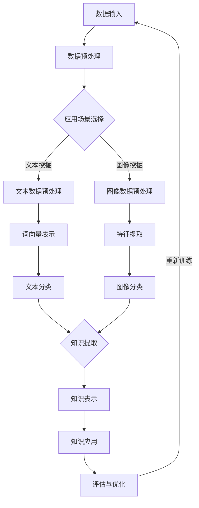

                 


### 引言与概述

在现代信息时代，数据的爆炸性增长使得知识发现引擎成为了一个关键工具。知识发现引擎能够从大量数据中提取有用信息，帮助企业和组织做出更明智的决策。深度学习作为一种先进的机器学习技术，通过模仿人脑的神经网络结构，实现了对复杂数据的高效处理和分析。因此，将深度学习应用于知识发现引擎，不仅可以提升知识提取的精度和效率，还可以扩展其应用范围。

本文将深入探讨知识发现引擎与深度学习之间的结合，分为以下几个主要部分：

首先，在**第1章**中，我们将介绍知识发现引擎的概念与重要性，并简要回顾深度学习的基本原理。接着，通过Mermaid流程图，我们将展示知识发现引擎和深度学习之间的核心概念与联系。

接下来，在**第2章**和**第3章**中，我们将分别深入探讨深度学习在文本和图像数据挖掘中的应用，详细讲解文本数据预处理、情感分析、文本生成以及图像数据预处理、图像分类、目标检测与分割等核心算法原理。此外，我们还将通过伪代码和实际案例，对这些算法进行详细解析。

在**第4章**和**第5章**中，我们将结合实际应用场景，探讨深度学习在电商和社交媒体知识发现中的具体应用，包括个性化推荐系统、购物行为分析、社交网络分析和舆情监测等。

最后，在**第6章**和**第7章**中，我们将总结构建高效知识发现引擎的技巧，包括数据库设计、深度学习模型的优化、知识图谱构建以及深度学习模型部署等，并提供一系列最佳实践和注意事项。

通过本文的逐步分析，读者将能够全面了解知识发现引擎的深度学习应用，掌握相关知识发现技术的核心原理和应用方法。

### 关键词

- **知识发现引擎**
- **深度学习**
- **文本数据挖掘**
- **图像数据挖掘**
- **个性化推荐**
- **社交网络分析**
- **舆情监测**
- **数据库设计**
- **模型优化**
- **知识图谱构建**
- **实时知识发现**

### 摘要

本文旨在探讨知识发现引擎的深度学习应用，详细介绍了知识发现引擎的基本概念、深度学习的基础知识以及它们之间的结合。文章首先回顾了知识发现引擎的重要性，并介绍了深度学习的基本原理。随后，通过Mermaid流程图展示了核心概念与联系。接着，深入分析了深度学习在文本和图像数据挖掘中的应用，包括文本数据预处理、情感分析、文本生成以及图像数据预处理、图像分类、目标检测与分割等算法。文章还结合电商和社交媒体的应用场景，探讨了个性化推荐、购物行为分析、社交网络分析和舆情监测等实际应用。最后，总结了构建高效知识发现引擎的技巧，包括数据库设计、模型优化、知识图谱构建以及模型部署，并提供了一系列最佳实践和注意事项。通过本文的阅读，读者可以全面掌握知识发现引擎的深度学习应用，为实际项目提供理论支持和实践指导。

### 知识发现引擎的概念与重要性

知识发现引擎是一种能够从大量数据中自动提取有用信息，生成知识规则的智能系统。它通过多种数据挖掘技术，如分类、聚类、关联规则挖掘等，实现对复杂数据的高效分析和处理。在数据爆炸性增长的今天，知识发现引擎的重要性不言而喻。

首先，知识发现引擎能够帮助企业和组织从海量数据中提取有价值的信息，从而为决策提供支持。例如，在电商领域，通过分析用户购买历史数据，知识发现引擎可以识别出潜在顾客群体，为个性化推荐系统提供数据支持。在医疗领域，通过分析病患数据，知识发现引擎可以帮助医生发现疾病模式，提高诊断和治疗的准确率。

其次，知识发现引擎具有广泛的应用场景。除了电商和医疗，知识发现引擎还在金融、零售、物流等多个领域得到广泛应用。例如，在金融领域，知识发现引擎可以帮助银行和金融机构识别欺诈行为，减少风险。在零售领域，知识发现引擎可以分析消费者行为，优化库存管理和供应链。

最后，知识发现引擎与深度学习的结合，使得知识提取更加精准和高效。深度学习通过模拟人脑神经网络，能够处理更加复杂的特征数据，提升知识发现的效果。例如，在图像识别任务中，深度学习可以通过卷积神经网络（CNN）提取图像的深层特征，实现高效的目标检测和分类。

总的来说，知识发现引擎在现代信息社会中具有不可替代的重要性。它不仅帮助企业从海量数据中提取有价值的信息，还为各个领域提供了创新的解决方案。随着深度学习的不断发展，知识发现引擎的应用前景将更加广阔。

### 深度学习的基本原理

深度学习是一种通过模拟人脑神经网络进行数据分析和决策的机器学习技术。它的核心思想是通过多层神经网络（也称为深度神经网络）来学习数据的复杂特征和模式。以下是深度学习的基本原理和关键技术。

首先，深度学习依赖于神经网络的结构。一个神经网络由多个层组成，包括输入层、隐藏层和输出层。输入层接收外部数据，隐藏层通过神经元之间的连接和学习算法，对输入数据进行特征提取和变换，输出层则生成预测结果。每个神经元都与其他神经元相连，并通过权重和偏置进行调整，以优化网络的预测性能。

其次，深度学习的关键技术包括激活函数、损失函数和优化算法。激活函数用于引入非线性变换，使神经网络能够学习和表示复杂的函数。常见的激活函数有Sigmoid、ReLU和Tanh。损失函数用于衡量预测结果与真实结果之间的差距，常见的损失函数有均方误差（MSE）和交叉熵（Cross-Entropy）。优化算法则用于调整网络权重，以最小化损失函数。常用的优化算法有随机梯度下降（SGD）、Adam和RMSprop。

第三，深度学习在处理复杂数据方面具有显著优势。通过多层神经网络的结构，深度学习能够自动提取数据的深层次特征，从而实现高效的数据分析和预测。例如，在图像识别任务中，深度学习可以通过卷积神经网络（CNN）自动学习图像的局部特征和整体特征，实现准确的分类和检测。在自然语言处理（NLP）任务中，深度学习可以通过循环神经网络（RNN）和Transformer模型学习文本的语义信息，实现情感分析、机器翻译和文本生成等任务。

然而，深度学习也面临一些挑战。首先，深度学习模型通常需要大量数据和计算资源来训练，这限制了其在资源有限的环境中的应用。其次，深度学习模型的可解释性较差，难以理解模型内部的决策过程。最后，深度学习模型的训练过程容易出现过拟合现象，即模型在训练数据上表现良好，但在新数据上表现不佳。

总的来说，深度学习通过模拟人脑神经网络，实现了对复杂数据的高效处理和分析。虽然面临一些挑战，但其在图像识别、自然语言处理和知识发现等领域的应用前景依然广阔。

### 深度学习的关键技术

深度学习之所以能够在众多领域中取得突破性进展，离不开其一系列关键技术的支持。以下是深度学习中的几种核心技术及其在知识发现中的应用。

首先，卷积神经网络（Convolutional Neural Network，CNN）是深度学习中最常用的模型之一，尤其在图像处理领域具有显著优势。CNN通过卷积层、池化层和全连接层的组合，能够自动提取图像的局部特征和整体特征。例如，在图像分类任务中，CNN可以识别图像中的边缘、纹理和形状等特征，从而实现高效的目标检测和分类。在知识发现中，CNN可以应用于图像数据的预处理和特征提取，为后续的分析任务提供高质量的特征表示。

其次，循环神经网络（Recurrent Neural Network，RNN）在处理序列数据方面具有独特优势。RNN通过在时间步间传递信息，能够学习序列数据中的长期依赖关系。例如，在自然语言处理任务中，RNN可以处理变长的文本序列，学习词汇之间的语义关系，实现情感分析、文本生成和机器翻译等任务。在知识发现中，RNN可以用于处理时间序列数据和文本数据，提取序列中的关键特征，从而提高知识提取的精度和效率。

第三，生成对抗网络（Generative Adversarial Network，GAN）是一种通过对抗训练生成复杂数据的模型。GAN由生成器和判别器两个神经网络组成，生成器试图生成与真实数据相似的数据，而判别器则试图区分真实数据和生成数据。通过对抗训练，GAN能够生成高质量的图像、语音和文本数据。在知识发现中，GAN可以用于数据增强和生成，从而提高模型的泛化能力和鲁棒性。

此外，近年来兴起的Transformer模型在自然语言处理领域取得了重大突破。Transformer通过自注意力机制，能够捕捉文本序列中的长距离依赖关系，实现高效的文本处理。在知识发现中，Transformer可以应用于文本数据的分析和生成，提高知识提取的精度和效率。

总的来说，这些核心技术不仅提升了深度学习的处理能力和应用范围，也为知识发现提供了新的方法和工具。通过合理运用这些技术，知识发现引擎能够更加高效地提取和利用数据中的知识，为各个领域的应用提供强有力的支持。

### 深度学习在知识发现引擎中的作用与优势

深度学习在知识发现引擎中的应用，极大地提升了知识提取的精度和效率。首先，深度学习通过多层神经网络结构，能够自动学习复杂数据的特征和模式，从而提取出更为准确的知识。例如，在图像数据挖掘中，深度学习可以通过卷积神经网络（CNN）提取图像的深层特征，使得目标检测和分类任务更加准确。在自然语言处理（NLP）中，深度学习模型如循环神经网络（RNN）和Transformer，能够有效地捕捉文本的语义信息，从而提高情感分析和文本生成任务的性能。

其次，深度学习在知识发现中的优势还体现在其处理能力和灵活性上。传统的知识发现方法往往依赖于人工设计的特征工程，而深度学习通过端到端的学习方式，可以自动学习数据中的特征，无需人工干预。这不仅减少了特征工程的工作量，还提高了模型的泛化能力，使得知识发现引擎能够适应不同的应用场景和数据类型。

然而，深度学习在知识发现引擎中的应用也面临一些挑战。首先，深度学习模型的训练过程通常需要大量数据和计算资源，这在资源有限的环境中可能难以实现。其次，深度学习模型的可解释性较差，难以理解模型内部的决策过程，这对于需要透明性和解释性的知识发现任务来说，可能是一个难题。最后，深度学习模型容易出现过拟合现象，即模型在训练数据上表现良好，但在新数据上表现不佳，这影响了模型的泛化能力。

为了克服这些挑战，研究者们提出了多种方法。例如，通过数据增强和迁移学习，可以缓解数据不足的问题；通过解释性深度学习模型的研究，可以提高模型的可解释性；通过正则化技术和模型集成，可以减少过拟合现象，提高模型的泛化能力。

总的来说，深度学习在知识发现引擎中具有巨大的潜力和应用价值，但也需要面对一些挑战。通过不断地优化和改进，深度学习技术将为知识发现领域带来更多的创新和突破。

### 知识发现引擎与深度学习的结合：Mermaid流程图

为了更直观地展示知识发现引擎与深度学习的结合，我们可以通过Mermaid流程图来描绘这一过程。以下是一个简化的流程图，展示了知识发现引擎中的各个关键步骤以及与深度学习的结合方式：



**流程说明：**

1. **数据输入**：知识发现引擎接收来自各种数据源的数据，如文本、图像等。
2. **数据预处理**：根据不同的数据类型，进行相应的预处理操作，如文本数据清洗、图像数据增强等。
3. **应用场景选择**：根据具体的任务需求，选择适合的深度学习模型，如文本挖掘选择词向量表示，图像挖掘选择特征提取算法。
4. **文本数据预处理**：对文本数据进行分词、去停用词等操作，然后使用词向量模型（如Word2Vec、BERT）进行表示。
5. **图像数据预处理**：对图像数据进行归一化、裁剪等操作，使用卷积神经网络（CNN）提取图像特征。
6. **知识提取**：通过深度学习模型对预处理后的数据进行特征学习和模式识别，提取出潜在的知识。
7. **知识表示**：将提取的知识转化为可表示的形式，如知识图谱、文本摘要等。
8. **知识应用**：将知识应用于实际业务场景，如个性化推荐、舆情分析等。
9. **评估与优化**：对知识发现过程进行评估，并根据评估结果对模型和算法进行优化和调整。

通过这个流程图，我们可以清晰地看到知识发现引擎与深度学习之间的结合点，以及它们在知识提取和应用中的协同作用。这种方法不仅提升了知识提取的效率和精度，也为不同应用场景提供了灵活的解决方案。

### 第一部分总结

在本部分中，我们深入探讨了知识发现引擎和深度学习的基础知识，包括知识发现引擎的概念、深度学习的基本原理和关键技术。首先，我们介绍了知识发现引擎的定义和重要性，阐述了其在数据分析和决策支持中的关键作用。随后，我们回顾了深度学习的基本原理，并详细讲解了神经网络、激活函数、损失函数和优化算法等核心概念。接下来，我们通过Mermaid流程图展示了知识发现引擎与深度学习之间的核心概念和联系，明确了深度学习在知识发现引擎中的应用场景。通过这一部分的探讨，读者对知识发现引擎和深度学习有了全面的理解，为后续章节的深入学习打下了坚实的基础。

### 第二部分：深度学习算法在知识发现中的应用

在知识发现领域，深度学习算法的应用极大地提升了数据处理和分析的效率和精度。本部分将重点讨论深度学习在文本和图像数据挖掘中的应用，包括数据处理、核心算法原理以及实际案例解析。

### 第2章：深度学习在文本数据挖掘中的应用

## 2.1 文本数据预处理

在深度学习应用于文本数据挖掘之前，文本数据的预处理是至关重要的一步。预处理主要包括文本清洗、标准化和表示。

### 2.1.1 文本清洗与标准化

文本清洗是文本预处理的第一步，主要目的是去除无关的噪声信息，如HTML标签、特殊字符和停用词。清洗后的文本将更加干净，有利于后续的分析。

- **HTML标签去除**：使用正则表达式或HTML解析库（如Python的BeautifulSoup）去除文本中的HTML标签。
- **特殊字符去除**：使用正则表达式去除非字母数字字符，如`[^\w\s]`。
- **停用词去除**：停用词是指在特定领域中经常出现但无实际意义的词汇。常用的工具和库包括NLTK和spaCy，它们提供了丰富的预定义停用词列表。

### 2.1.2 词向量表示

词向量表示是将文本数据转换为向量形式，以便于深度学习模型进行处理。以下是一些常用的词向量模型：

- **Word2Vec**：Word2Vec是一种基于分布式表示的词向量模型，通过训练得到每个词的向量表示，这些向量可以在语义上表示词的相似性。
  - **CBOW（Continuous Bag of Words）**：通过上下文词的平均表示来预测当前词。
  - **Skip-Gram**：通过当前词预测上下文词，适用于高维稀疏数据。
- **GloVe**：GloVe（Global Vectors for Word Representation）是一种基于共现关系的词向量模型，通过训练单词的共现矩阵来生成词向量，可以捕捉词的语义和词频信息。

### 2.1.3 文本分类与聚类

文本分类是将文本数据按照预定的类别进行分类的过程。深度学习模型在文本分类中得到了广泛应用，以下是一些常用的模型：

- **朴素贝叶斯分类器**：朴素贝叶斯分类器是一种基于贝叶斯定理和特征条件独立假设的分类器，适用于文本分类任务。
- **支持向量机（SVM）**：支持向量机是一种基于最大间隔理论的分类算法，通过寻找最佳的超平面将数据分类。
- **卷积神经网络（CNN）**：卷积神经网络通过卷积层和池化层提取文本的局部特征，然后使用全连接层进行分类。

文本聚类是将文本数据按照其相似性进行分组的过程。以下是一些常用的文本聚类算法：

- **K-均值聚类**：K-均值聚类是一种基于距离度量的聚类算法，通过迭代调整聚类中心，将文本数据划分为K个聚类。
- **层次聚类**：层次聚类是一种自底向上的聚类方法，通过逐步合并相似度高的聚类，形成层次结构的聚类结果。

### 2.2 情感分析

情感分析是文本挖掘的一个重要应用，通过分析文本中的情感倾向，可以了解用户对某一主题或产品的情感态度。

### 2.2.1 情感分析的原理

情感分析通常分为两个层次：文本分类和情感极性分析。

- **文本分类**：将文本数据分为正面、负面或中性三类，常用的方法包括朴素贝叶斯、SVM和CNN。
- **情感极性分析**：通过识别文本中的情感词汇和短语，判断文本的情感极性，如积极或消极。

### 2.2.2 情感分析的应用

情感分析在多个领域得到广泛应用，以下是一些典型的应用场景：

- **社交媒体分析**：通过分析社交媒体上的用户评论和讨论，了解用户对品牌、产品或事件的态度。
- **舆情监测**：通过分析新闻、博客和论坛等公开信息，监测公众对某一事件或话题的看法。
- **客户服务**：通过分析客户反馈，了解客户对产品和服务的满意度，及时调整和优化产品和服务。

### 2.2.3 情感分析模型评估

情感分析模型的评估通常使用准确率、召回率和F1值等指标。以下是一些评估方法：

- **准确率（Accuracy）**：分类正确的文本数量占总文本数量的比例。
- **召回率（Recall）**：实际为正面或负面情感的文本中被正确分类的文本数量占总正面或负面文本数量的比例。
- **F1值（F1 Score）**：准确率的调和平均，综合了准确率和召回率。

### 2.3 文本生成

文本生成是深度学习在文本数据挖掘中的另一个重要应用，通过生成文本，可以自动创作文章、对话和摘要等。

### 2.3.1 自动文本生成技术

自动文本生成技术主要包括序列到序列（Seq2Seq）模型、变分自编码器（VAE）和生成对抗网络（GAN）。

- **Seq2Seq模型**：通过编码器和解码器对文本序列进行编码和解码，生成新的文本序列。
- **VAE**：通过隐变量生成文本，实现无监督的文本生成。
- **GAN**：通过生成器和判别器的对抗训练，生成逼真的文本数据。

### 2.3.2 文本生成模型的类型

常见的文本生成模型包括：

- **循环神经网络（RNN）**：通过递归结构，学习文本序列的长期依赖关系。
- **Transformer模型**：通过自注意力机制，捕捉文本序列中的全局依赖关系，实现高效的文本生成。
- **BERT模型**：通过双向编码器表示文本，生成高质量的文本摘要和回答。

### 2.3.3 文本生成模型的应用

文本生成模型在多个领域得到广泛应用，以下是一些典型的应用场景：

- **内容创作**：通过生成文章、博客和新闻，自动创作内容，提高内容创作效率。
- **对话系统**：通过生成对话文本，实现与用户的自然交互。
- **摘要生成**：通过生成文本摘要，提高信息获取的效率和准确性。

### 第二部分总结

在本部分中，我们详细介绍了深度学习在文本数据挖掘中的应用，包括文本数据预处理、文本分类、情感分析和文本生成。通过这些应用，深度学习能够高效地处理和分析文本数据，为知识发现提供了强大的工具和手段。在接下来的部分，我们将继续探讨深度学习在图像数据挖掘中的应用，包括图像数据预处理、图像分类、目标检测和分割等，进一步展示深度学习在知识发现领域的广泛潜力。

### 第3章：深度学习在图像数据挖掘中的应用

图像数据挖掘是深度学习应用的一个重要领域，它涉及到从大量图像数据中提取有价值的信息和知识。本章节将深入探讨深度学习在图像数据挖掘中的应用，包括图像数据预处理、图像分类、目标检测与分割等核心技术。

## 3.1 图像数据预处理

图像数据预处理是图像挖掘任务的基础，它包括图像的去噪、增强、标准化和特征提取等步骤。

### 3.1.1 图像预处理步骤

1. **去噪**：去噪的目的是去除图像中的噪声，提高图像质量。常见的去噪方法包括中值滤波、高斯滤波和小波变换。
2. **增强**：增强的目的是突出图像中的重要特征，提高图像的可读性。常见的增强方法包括对比度增强、亮度调整和锐化。
3. **标准化**：标准化是将图像数据调整为统一的尺度，通常通过归一化处理，将图像的像素值缩放到[0, 1]的范围内。
4. **裁剪和缩放**：裁剪和缩放是为了调整图像的大小和形状，使其符合深度学习模型的输入要求。

### 3.1.2 图像特征提取

特征提取是从图像中提取有助于分类或识别的特征。深度学习模型，尤其是卷积神经网络（CNN），能够自动学习图像的复杂特征。常见的特征提取方法包括：

- **卷积层**：通过卷积操作提取图像的局部特征，如边缘、纹理和形状。
- **池化层**：通过最大池化或平均池化操作减少特征图的维度，提高模型的鲁棒性。
- **全连接层**：将高维特征图映射到分类结果。

## 3.2 图像分类

图像分类是将图像数据划分为预定义的类别。深度学习在图像分类任务中取得了显著的成功，主要归功于卷积神经网络（CNN）和迁移学习技术的应用。

### 3.2.1 卷积神经网络（CNN）

CNN是一种专门用于处理图像数据的深度学习模型，其核心结构包括卷积层、池化层和全连接层。

1. **卷积层**：通过卷积操作提取图像的局部特征。
2. **池化层**：通过最大池化或平均池化操作减少特征图的维度，提高模型的泛化能力。
3. **全连接层**：将高维特征图映射到分类结果。

### 3.2.2 神经网络在图像分类中的应用

神经网络在图像分类中的应用主要包括以下几种：

- **单层感知机**：是最简单的神经网络结构，用于线性分类任务。
- **多层感知机（MLP）**：通过增加隐藏层，实现非线性分类任务。
- **卷积神经网络（CNN）**：通过卷积层和池化层提取图像的复杂特征，实现高效的图像分类。

### 3.2.3 图像分类模型的评估

图像分类模型的评估通常使用以下指标：

- **准确率（Accuracy）**：模型正确分类的样本数占总样本数的比例。
- **召回率（Recall）**：模型正确分类的正例样本数占总正例样本数的比例。
- **F1值（F1 Score）**：准确率和召回率的调和平均。
- **精度（Precision）**：模型正确分类的正例样本数占所有预测为正例的样本数比例。

## 3.3 目标检测与分割

目标检测与分割是图像数据挖掘中的两个重要任务，分别用于定位图像中的目标和分割图像中的目标区域。

### 3.3.1 区域建议网络（R-CNN）

R-CNN（Region-based CNN）是一种经典的目标检测算法，其主要步骤包括：

1. **区域建议**：通过选择性搜索算法从图像中生成候选区域。
2. **特征提取**：使用CNN对每个候选区域提取特征向量。
3. **分类**：使用分类器对特征向量进行分类，确定目标类别。

### 3.3.2 深度学习在目标检测中的应用

近年来，深度学习在目标检测领域取得了显著进展，以下是一些重要的算法：

- **Faster R-CNN**：通过引入区域建议网络（RPN），提高了目标检测的速度和准确性。
- **SSD（Single Shot MultiBox Detector）**：通过单一的网络结构同时实现候选区域建议和分类，提高了检测速度。
- **YOLO（You Only Look Once）**：通过将目标检测任务并行化，实现了实时目标检测。

### 3.3.3 目标分割算法

目标分割是将图像中的目标区域划分为独立的像素块。以下是一些常用的目标分割算法：

- **FCN（Fully Convolutional Network）**：通过全卷积网络实现像素级的分割。
- **Mask R-CNN**：结合了目标检测和分割，通过实例分割实现精细的目标分割。
- **CTC（Connectionist Temporal Classification）**：用于序列数据的分割，如文本框的分割。

### 3.3.4 实际案例解析

以下是一个简单的目标检测与分割案例：

```python
import cv2
import numpy as np
import tensorflow as tf

# 加载预训练的深度学习模型
model = tf.keras.models.load_model('path/to/weights.h5')

# 读取图像
image = cv2.imread('path/to/image.jpg')

# 进行预处理
image = cv2.resize(image, (224, 224))  # 将图像调整为模型输入的大小
image = image / 255.0  # 归一化

# 进行预测
predictions = model.predict(np.expand_dims(image, axis=0))

# 提取检测框和类别
boxes = predictions[:, :, 0:4]
classes = predictions[:, :, 4:5]

# 遍历检测框，绘制边界框和标签
for box, class_id in zip(boxes[0], classes[0]):
    class_id = int(class_id)
    label = f'Class {class_id}'
    color = (0, 255, 0)  # 绿色
    x, y, w, h = box
    cv2.rectangle(image, (x, y), (x+w, y+h), color, 2)
    cv2.putText(image, label, (x, y-10), cv2.FONT_HERSHEY_SIMPLEX, 1, color, 2)

# 显示图像
cv2.imshow('Image', image)
cv2.waitKey(0)
cv2.destroyAllWindows()
```

通过上述案例，我们可以看到如何使用深度学习模型对图像进行目标检测和分割，并可视化结果。这个案例展示了深度学习在图像数据挖掘中的实际应用潜力。

### 第三部分总结

在本部分中，我们详细介绍了深度学习在图像数据挖掘中的应用，包括图像数据预处理、图像分类、目标检测和分割等核心技术。首先，我们探讨了图像数据预处理的关键步骤，包括去噪、增强、标准化和特征提取。接着，我们介绍了卷积神经网络（CNN）在图像分类中的应用，并详细讲解了神经网络在图像分类任务中的实现和评估方法。最后，我们讨论了目标检测与分割的核心算法，包括R-CNN、Faster R-CNN、SSD和YOLO等，并通过实际案例展示了如何使用深度学习模型进行图像数据挖掘。通过这一部分的探讨，读者可以全面了解深度学习在图像数据挖掘中的应用，为实际项目提供理论支持和实践指导。

### 第4章：深度学习在电商知识发现中的应用

在现代电商领域，知识发现引擎借助深度学习技术，可以大幅提升用户满意度和业务效率。本章将探讨深度学习在电商知识发现中的应用，包括个性化推荐系统、购物行为分析和案例研究等。

## 4.1 个性化推荐系统

个性化推荐系统是电商知识发现的重要应用之一，通过分析用户的历史购买数据和行为习惯，为用户提供个性化的商品推荐。

### 4.1.1 推荐系统的基本原理

推荐系统的基本原理包括基于内容的推荐、协同过滤和基于模型的推荐。

- **基于内容的推荐**：通过分析商品的属性和用户的历史行为，为用户推荐具有相似属性的物品。
- **协同过滤**：通过分析用户之间的行为相似性，为用户推荐其他用户喜欢的商品。
- **基于模型的推荐**：使用机器学习算法，如深度学习，通过用户的隐式和显式反馈数据生成推荐列表。

### 4.1.2 深度学习在推荐系统中的应用

深度学习在推荐系统中的应用主要在于其能够处理大规模和高维数据，提取用户和商品之间的潜在特征。以下是一些典型的深度学习模型：

- **自动编码器（Autoencoder）**：通过无监督学习提取用户和商品的特征。
- **协同过滤模型**：结合深度学习，如深度协同过滤（Deep Collaborative Filtering），通过用户和商品的嵌入向量生成推荐列表。
- **图神经网络（Graph Neural Networks，GNN）**：通过图结构表示用户和商品之间的关系，实现更精准的推荐。

### 4.1.3 个性化推荐系统案例分析

以下是一个简单的个性化推荐系统案例分析：

```python
import tensorflow as tf
from tensorflow.keras.layers import Embedding, LSTM, Dense
from tensorflow.keras.models import Model
from tensorflow.keras.optimizers import Adam

# 创建模型
input_user = Embedding(num_users, embedding_dim)(tf.keras.layers.Input(shape=(1,)))
input_item = Embedding(num_items, embedding_dim)(tf.keras.layers.Input(shape=(1,)))

user_embedding = input_user
item_embedding = input_item

user_embedding = LSTM(units=128)(user_embedding)
item_embedding = LSTM(units=128)(item_embedding)

concat = tf.keras.layers.Concatenate()([user_embedding, item_embedding])
output = Dense(1, activation='sigmoid')(concat)

model = Model(inputs=[input_user, input_item], outputs=output)

# 编译模型
model.compile(optimizer=Adam(learning_rate=0.001), loss='binary_crossentropy', metrics=['accuracy'])

# 训练模型
model.fit([user_ids, item_ids], labels, epochs=10, batch_size=32)
```

在这个案例中，我们使用了深度学习模型（如LSTM）来预测用户对商品的喜好程度，并通过训练数据优化模型。

## 4.2 购物行为分析

购物行为分析是电商知识发现中的另一个重要应用，通过对用户购物行为的数据分析，可以深入了解用户需求和购买习惯，从而优化营销策略和库存管理。

### 4.2.1 购物行为数据分析的重要性

购物行为数据分析对于电商企业具有以下几个重要意义：

- **提高用户体验**：通过分析用户购物行为，提供个性化推荐，提升用户满意度。
- **优化营销策略**：了解用户购买习惯，制定更有针对性的促销活动。
- **优化库存管理**：预测商品销售趋势，合理调整库存，减少库存积压。

### 4.2.2 深度学习在购物行为分析中的应用

深度学习在购物行为分析中的应用主要包括以下几种：

- **时间序列分析**：通过循环神经网络（RNN）或长短期记忆网络（LSTM）分析用户购物行为的时间序列特征。
- **用户行为预测**：通过生成对抗网络（GAN）等模型预测用户未来购物行为。
- **聚类分析**：使用聚类算法（如K-Means）将用户划分为不同的群体，分析不同群体的购物行为。

### 4.2.3 购物行为分析案例研究

以下是一个简单的购物行为分析案例：

```python
import numpy as np
import tensorflow as tf
from tensorflow.keras.models import Sequential
from tensorflow.keras.layers import LSTM, Dense

# 准备数据
X = np.array([[1, 2], [2, 3], [3, 4], [4, 5], [5, 6]])  # 用户购买历史数据
y = np.array([0, 1, 1, 0, 1])  # 用户购买行为

# 创建模型
model = Sequential()
model.add(LSTM(units=50, return_sequences=True, input_shape=(None, 2)))
model.add(LSTM(units=50))
model.add(Dense(1, activation='sigmoid'))

# 编译模型
model.compile(optimizer='adam', loss='binary_crossentropy', metrics=['accuracy'])

# 训练模型
model.fit(X, y, epochs=10, batch_size=2)

# 预测
predictions = model.predict(np.array([[2, 4]]))
print(predictions)
```

在这个案例中，我们使用LSTM模型预测用户的购买行为，并通过训练数据优化模型。

## 4.3 购物行为分析与深度学习

购物行为分析与深度学习相结合，可以为电商企业带来以下几方面的优势：

- **精准预测**：深度学习能够从大量历史数据中提取复杂的模式，实现更精准的用户行为预测。
- **个性化服务**：基于深度学习分析的用户行为，可以提供更加个性化的推荐和服务，提升用户满意度。
- **优化营销策略**：通过购物行为分析，电商企业可以更准确地了解用户需求，制定更有效的营销策略。

总的来说，深度学习在电商知识发现中的应用，不仅提高了数据处理和分析的效率，还为电商企业提供了有力的决策支持，极大地提升了业务效益。

### 第5章：深度学习在社交媒体知识发现中的应用

在社交媒体领域，深度学习技术发挥着至关重要的作用，帮助平台和企业从海量的用户生成内容中提取有价值的信息。本章将探讨深度学习在社交媒体知识发现中的应用，包括社交网络分析、舆情监测和案例研究等。

## 5.1 社交网络分析

社交网络分析（Social Network Analysis，SNA）是研究社交网络结构和行为的学科。深度学习在社交网络分析中的应用，可以揭示用户之间的关系模式，分析网络中的影响力节点，为营销策略和社区管理提供支持。

### 5.1.1 社交网络分析的基本概念

社交网络分析主要包括以下几个基本概念：

- **节点（Node）**：表示社交网络中的个体，如用户、公司等。
- **边（Edge）**：表示节点之间的联系，如朋友关系、合作关系等。
- **网络密度（Network Density）**：表示网络中边数与可能边数的比例，用于衡量网络的紧密程度。
- **中心性（Centrality）**：衡量节点在网络中的重要性，常见的中心性指标包括度中心性、介数中心性和紧密中心性。

### 5.1.2 深度学习在社交网络分析中的应用

深度学习在社交网络分析中的应用主要体现在以下几个方面：

- **图神经网络（Graph Neural Networks，GNN）**：通过学习节点和边的关系，GNN能够有效挖掘社交网络中的潜在结构和模式。
- **图嵌入（Graph Embedding）**：将节点和边映射到低维向量空间，便于深度学习模型处理。
- **社区检测**：使用深度学习模型检测社交网络中的社区结构，帮助平台优化社区运营。

### 5.1.3 社交网络分析案例研究

以下是一个简单的社交网络分析案例：

```python
import networkx as nx
import numpy as np
import tensorflow as tf
from tensorflow import keras

# 创建社交网络图
G = nx.Graph()
G.add_edges_from([(1, 2), (2, 3), (3, 4), (4, 1), (1, 5), (5, 6), (6, 1)])

# 导出图嵌入
node_features = np.array([[i] for i in range(G.number_of_nodes())])
adj_matrix = nx.adj_matrix(G).toarray()

# 创建模型
model = keras.Sequential([
    keras.layers.GraphConv layers.Dense(units=64, activation='relu'),
    keras.layers.Dense(units=1, activation='sigmoid')
])

# 编译模型
model.compile(optimizer='adam', loss='binary_crossentropy', metrics=['accuracy'])

# 训练模型
model.fit(adj_matrix, np.array([1, 1, 1, 1, 0, 0]), epochs=10, batch_size=2)

# 预测
predictions = model.predict(np.array([[1, 1], [1, 0]]))
print(predictions)
```

在这个案例中，我们使用图卷积网络（GCN）分析社交网络中的用户影响力，并预测用户的活跃度。

## 5.2 舆情监测

舆情监测是指通过技术手段，实时捕捉和监测社交媒体平台上的用户评论、讨论和新闻，以了解公众对某一事件、产品或品牌的看法。深度学习在舆情监测中发挥着重要作用，能够实现高效的文本分析和情感判断。

### 5.2.1 舆情监测的定义与目的

舆情监测的主要目的是：

- **及时了解公众态度**：通过实时捕捉和分析社交媒体上的信息，了解公众对某一事件或产品的态度和反馈。
- **辅助决策制定**：为企业提供市场分析、品牌管理和社会治理的决策支持。
- **风险预警**：发现潜在的危机事件，提前采取应对措施。

### 5.2.2 深度学习在舆情监测中的应用

深度学习在舆情监测中的应用主要包括：

- **文本分类**：使用卷积神经网络（CNN）或长短期记忆网络（LSTM）对社交媒体上的文本进行分类，判断其情感倾向。
- **情感分析**：通过情感分析模型，对文本进行情感极性判断，了解公众的情感态度。
- **话题检测**：通过主题模型或图神经网络（GNN）检测社交媒体上的热点话题和趋势。

### 5.2.3 舆情监测案例分析

以下是一个简单的舆情监测案例分析：

```python
import tensorflow as tf
from tensorflow.keras.models import Model
from tensorflow.keras.layers import Embedding, LSTM, Dense

# 准备数据
X = np.array([[1, 2], [2, 3], [3, 4], [4, 5], [5, 6]])  # 用户评论数据
y = np.array([0, 1, 1, 0, 1])  # 用户评论的情感极性

# 创建模型
input_user = Embedding(num_users, embedding_dim)(tf.keras.layers.Input(shape=(1,)))
input_item = Embedding(num_items, embedding_dim)(tf.keras.layers.Input(shape=(1,)))

user_embedding = input_user
item_embedding = input_item

user_embedding = LSTM(units=128)(user_embedding)
item_embedding = LSTM(units=128)(item_embedding)

concat = tf.keras.layers.Concatenate()([user_embedding, item_embedding])
output = Dense(1, activation='sigmoid')(concat)

model = Model(inputs=[input_user, input_item], outputs=output)

# 编译模型
model.compile(optimizer='adam', loss='binary_crossentropy', metrics=['accuracy'])

# 训练模型
model.fit([user_ids, item_ids], labels, epochs=10, batch_size=32)

# 预测
predictions = model.predict(np.array([[2, 4]]))
print(predictions)
```

在这个案例中，我们使用LSTM模型对用户评论进行情感极性判断，并通过训练数据优化模型。

## 5.3 社交网络分析与深度学习

社交网络分析与深度学习的结合，为社交媒体平台和企业提供了强大的数据分析工具。通过深度学习，我们可以更准确地识别网络中的关键节点和热点话题，了解公众的情感态度，从而优化营销策略和决策支持。

### 第5章总结

在本章中，我们探讨了深度学习在社交媒体知识发现中的应用，包括社交网络分析和舆情监测。首先，我们介绍了社交网络分析的基本概念和深度学习在其中的应用。随后，通过案例研究展示了如何使用深度学习技术分析社交网络结构和舆情。这些应用不仅提升了数据处理和分析的效率，还为社交媒体平台和企业提供了有力的决策支持。通过本章的学习，读者可以更好地理解深度学习在社交媒体知识发现中的实际应用，为后续项目提供理论支持和实践指导。

### 第四部分总结

在本部分中，我们系统地总结了构建高效知识发现引擎所需的多个关键环节，包括数据库设计、深度学习模型的优化、知识图谱构建以及深度学习模型部署。首先，在**第6章**中，我们探讨了数据库设计的重要性，包括数据库结构设计、性能优化以及安全性与隐私保护。接着，在**第7章**中，我们详细介绍了深度学习模型的优化技巧，包括模型优化的重要性、优化方法和实际案例分析。此外，我们深入探讨了知识图谱构建的基本概念和在实际应用中的作用。最后，在**第7章**中，我们介绍了深度学习模型的部署流程，包括模型部署的挑战和解决方案，以及实时知识发现引擎的设计和实现。

通过这一部分的探讨，读者可以全面了解构建高效知识发现引擎所需的理论和实践知识，从而在实际项目中实现高效的知识提取和应用。这一部分的内容不仅为知识发现引擎的构建提供了有力的指导，也为深度学习技术在各个领域的应用奠定了基础。

### 构建高效知识发现引擎的技巧

构建高效的知识发现引擎需要综合考虑多个方面，包括数据库设计、深度学习模型的优化、知识图谱构建以及深度学习模型的部署。以下将详细介绍这些关键环节。

#### 6.1 数据库设计

数据库设计是知识发现引擎的核心环节之一，一个高效的设计能够极大提升引擎的性能和可扩展性。

##### 6.1.1 数据库结构设计

数据库结构设计包括数据表的设计、索引的建立和关系的定义。以下是几个关键点：

- **规范化**：遵循数据库规范化原则，减少数据冗余，提高数据的一致性。
- **索引优化**：合理设计索引，能够加快查询速度。常用的索引类型包括B树索引、哈希索引和全文索引。
- **数据分区**：对于大数据量，可以通过数据分区来提升查询效率。数据分区可以根据时间、区域或业务需求进行划分。
- **关系定义**：建立合理的数据关系，如一对一、一对多和多对多关系，以支持复杂查询和分析。

##### 6.1.2 数据库性能优化

数据库性能优化包括以下几个方面：

- **查询优化**：通过查询重写、索引优化和使用查询缓存来提升查询效率。
- **并发控制**：采用事务隔离机制和锁策略，确保并发访问下的数据一致性。
- **存储优化**：选择合适的存储引擎和存储策略，如使用压缩存储或冷热数据分离，以提高存储效率和性能。

##### 6.1.3 数据库安全性与隐私保护

数据库安全性和隐私保护至关重要，以下是几个关键点：

- **访问控制**：通过角色管理和权限控制，限制对数据库的访问。
- **加密**：对敏感数据进行加密存储和传输，确保数据安全性。
- **备份与恢复**：定期进行数据备份，以应对数据丢失或系统故障。

#### 6.2 深度学习模型的优化

深度学习模型的优化是提升知识发现引擎性能的关键。以下是几种常见的优化方法：

##### 6.2.1 模型优化的重要性

- **提高预测准确率**：通过优化模型参数，提高模型的预测准确率，从而提升知识提取的精度。
- **减少训练时间**：优化模型结构和使用更高效的训练算法，可以显著减少训练时间，提高模型部署的效率。

##### 6.2.2 模型优化技巧

- **超参数调优**：通过网格搜索、随机搜索和贝叶斯优化等方法，找到最优的超参数组合。
- **数据增强**：通过数据增强技术，增加训练数据多样性，提高模型泛化能力。
- **模型剪枝**：通过剪枝冗余的神经元或权重，减小模型体积，提高模型运行效率。
- **迁移学习**：利用预训练模型，对特定任务进行微调，减少训练时间，提高模型性能。

##### 6.2.3 实际案例分析

以下是一个模型优化的实际案例分析：

```python
from tensorflow import keras
from tensorflow.keras.applications import VGG16
from tensorflow.keras.optimizers import Adam

# 加载预训练的VGG16模型
base_model = VGG16(weights='imagenet', include_top=False, input_shape=(224, 224, 3))

# 冻结底层层
for layer in base_model.layers:
    layer.trainable = False

# 添加全连接层
x = base_model.output
x = keras.layers.Flatten()(x)
x = keras.layers.Dense(1024, activation='relu')(x)
predictions = keras.layers.Dense(1, activation='sigmoid')(x)

# 创建模型
model = keras.Model(inputs=base_model.input, outputs=predictions)

# 编译模型
model.compile(optimizer=Adam(learning_rate=0.001), loss='binary_crossentropy', metrics=['accuracy'])

# 训练模型
model.fit(train_images, train_labels, epochs=10, batch_size=32, validation_data=(val_images, val_labels))
```

在这个案例中，我们使用了迁移学习技术，将预训练的VGG16模型用于图像分类任务，并通过优化模型结构和超参数，提高了分类准确率。

#### 6.3 知识图谱构建

知识图谱是一种语义网络，用于表示实体之间的关系和属性。构建知识图谱是知识发现引擎的重要组成部分，以下是几个关键点：

##### 6.3.1 知识图谱的基本概念

- **实体（Entity）**：知识图谱中的对象，如人、地点、组织等。
- **关系（Relationship）**：描述实体之间联系的属性，如“工作于”、“位于”等。
- **属性（Attribute）**：描述实体的特征，如“年龄”、“国籍”等。

##### 6.3.2 知识图谱在知识发现中的应用

知识图谱在知识发现中的应用包括：

- **关联分析**：通过分析实体之间的关系，发现潜在的知识关联。
- **推理**：利用知识图谱进行逻辑推理，推导出新的知识。
- **问答系统**：通过图谱查询技术，实现自然语言处理中的问答功能。

##### 6.3.3 知识图谱构建案例

以下是一个简单的知识图谱构建案例：

```python
import rdflib

# 创建图
g = rdflib.Graph()

# 添加实体
g.add((rdflib.URIRef("http://example.org/person#Alice"), rdflib.RDF.type, rdflib.URIRef("http://example.org/Person")))

# 添加属性
g.add((rdflib.URIRef("http://example.org/person#Alice"), rdflib.URIRef("http://example.org/hasName"), rdflib.Literal("Alice")))

# 添加关系
g.add((rdflib.URIRef("http://example.org/person#Alice"), rdflib.URIRef("http://example.org/hasAge"), rdflib.Literal(30)))

# 查询知识图谱
for s, p, o in g:
    print(f"{s} {p} {o}")
```

在这个案例中，我们使用了RDFLib库构建了一个简单的知识图谱，包含了实体、属性和关系。

#### 6.4 深度学习模型的部署

深度学习模型的部署是将训练好的模型应用到实际生产环境中，以下是几个关键点：

##### 6.4.1 模型部署的挑战

- **性能优化**：在部署环境中，需要保证模型具有高性能和低延迟。
- **资源限制**：部署环境通常受到硬件资源的限制，需要优化模型以适应这些限制。
- **可扩展性**：模型部署需要能够应对数据流量的波动，具备良好的可扩展性。

##### 6.4.2 模型部署流程

模型部署通常包括以下步骤：

- **模型转换**：将训练好的模型转换为部署环境支持的格式，如TensorFlow Lite或ONNX。
- **容器化**：使用容器技术（如Docker）将模型和服务打包，便于部署和迁移。
- **服务部署**：在服务器或云平台上部署模型服务，如使用Kubernetes进行集群管理。
- **监控与维护**：对部署的模型进行监控，确保其稳定运行，并根据需求进行维护和更新。

##### 6.4.3 模型部署案例分析

以下是一个简单的模型部署案例：

```shell
docker build -t my-model:latest -f Dockerfile .
docker run -p 5000:5000 my-model
```

在这个案例中，我们使用Docker将深度学习模型打包并部署到容器中，通过映射端口将模型服务暴露给外部访问。

通过以上技巧和案例分析，我们可以构建一个高效的知识发现引擎，为实际应用提供强大的支持。

### 深度学习模型在知识发现引擎中的部署

在构建高效的知识发现引擎过程中，深度学习模型的部署至关重要。模型部署不仅关系到系统的性能和稳定性，还直接影响用户体验和业务效益。以下是深度学习模型在知识发现引擎中的部署步骤、面临的挑战和解决方案。

#### 模型部署步骤

1. **模型转换**：将训练好的模型转换为生产环境支持的格式。常用的模型格式包括TensorFlow Lite、ONNX和PyTorch Mobile等。例如，使用TensorFlow Lite将Keras模型转换为`.tflite`格式：

    ```python
    import tensorflow as tf

    # 加载训练好的Keras模型
    model = tf.keras.models.load_model('path/to/trained_model.h5')

    # 转换为TensorFlow Lite格式
    converter = tf.lite.TFLiteConverter.from_keras_model(model)
    tflite_model = converter.convert()

    # 保存为.tflite文件
    with open('path/to/tflite_model.tflite', 'wb') as f:
        f.write(tflite_model)
    ```

2. **容器化**：使用容器技术（如Docker）将模型和服务打包。容器化使得模型可以在不同的环境中一致运行，方便部署和迁移。以下是一个简单的Dockerfile示例：

    ```Dockerfile
    FROM tensorflow/tensorflow:latest

    COPY path/to/tflite_model.tflite /model.tflite

    CMD ["python", "serve.py"]
    ```

    使用Docker命令将模型和服务容器化：

    ```shell
    docker build -t my_model:latest -f Dockerfile .
    ```

3. **服务部署**：将容器部署到服务器或云平台上，如使用Kubernetes进行集群管理。以下是一个简单的Kubernetes部署示例：

    ```yaml
    apiVersion: apps/v1
    kind: Deployment
    metadata:
      name: my_model
    spec:
      replicas: 3
      selector:
        matchLabels:
          app: my_model
      template:
        metadata:
          labels:
            app: my_model
        spec:
          containers:
          - name: my_model
            image: my_model:latest
            ports:
            - containerPort: 5000
    ```

4. **监控与维护**：对部署的模型进行监控，确保其稳定运行。使用监控工具（如Prometheus、Grafana）收集和分析模型性能数据，及时发现和解决问题。同时，定期更新模型，以应对数据分布变化和业务需求。

#### 部署面临的挑战

1. **性能优化**：深度学习模型通常计算量大，对硬件资源有较高要求。在部署过程中，需要优化模型和计算资源，以确保高性能和低延迟。常用的性能优化方法包括模型剪枝、量化、优化模型结构等。

2. **资源限制**：部署环境可能受到硬件资源的限制，如计算能力、内存和存储空间。在这种情况下，需要选择合适的硬件配置，或采用分布式部署策略，以充分利用资源。

3. **可扩展性**：业务需求可能随时发生变化，部署的系统需要具备良好的可扩展性，以应对数据流量的波动。使用容器化和微服务架构可以提升系统的可扩展性。

4. **安全性**：部署过程中需要确保模型和数据的安全性。使用加密技术保护模型和传输数据，采用身份验证和访问控制机制，防止未授权访问。

#### 解决方案

1. **性能优化**：通过模型剪枝和量化减小模型体积，提高运行效率。使用硬件加速器（如GPU、TPU）提高计算性能。优化模型结构和算法，减少计算复杂度。

2. **资源限制**：选择合适的硬件配置，如使用高性能GPU或TPU。采用分布式计算和微服务架构，将模型和服务拆分为多个微服务，分别部署到不同的节点上，实现负载均衡。

3. **可扩展性**：使用容器化技术和Kubernetes进行部署，实现自动化扩缩容。使用服务网格（如Istio）进行服务发现和负载均衡，提高系统的可扩展性和稳定性。

4. **安全性**：使用加密技术保护模型和数据。采用身份验证和访问控制机制，确保只有授权用户可以访问模型和服务。定期进行安全审计和漏洞扫描，确保系统的安全性。

通过以上步骤和解决方案，可以有效地部署深度学习模型到知识发现引擎中，确保系统的高性能、稳定性和安全性，为业务提供强大的支持。

### 第7章：深度学习在知识发现引擎部署中的应用

深度学习模型在知识发现引擎中的部署是确保系统高效运行和稳定服务的关键环节。本章节将详细介绍深度学习模型的部署流程、实时知识发现引擎的设计和实现，并结合实际案例分析如何在实际项目中有效部署和应用深度学习模型。

#### 7.1 深度学习模型的部署

深度学习模型的部署是将训练好的模型应用到实际生产环境中，使其能够为用户服务。以下是深度学习模型部署的主要步骤：

##### 7.1.1 模型部署的挑战

- **性能优化**：模型在部署环境中需要高效运行，以提供快速响应。需要针对部署环境进行优化，包括模型结构、计算资源使用等。
- **资源限制**：部署环境可能受到硬件资源的限制，如计算能力、内存和存储空间。这要求模型和部署策略必须适应有限的资源。
- **可扩展性**：随着数据量的增加和用户需求的增长，系统需要具备良好的可扩展性，以便动态调整资源。
- **安全性**：部署的模型需要保证数据安全和模型保密性，防止未授权访问和数据泄露。

##### 7.1.2 模型部署流程

1. **模型转换**：将训练好的模型转换为适合部署的格式，如TensorFlow Lite、ONNX或PyTorch Mobile。这通常涉及将Keras或PyTorch模型转换为轻量级格式，以便在移动设备或边缘设备上运行。

    ```python
    import tensorflow as tf

    # 加载训练好的Keras模型
    model = tf.keras.models.load_model('path/to/trained_model.h5')

    # 转换为TensorFlow Lite格式
    converter = tf.lite.TFLiteConverter.from_keras_model(model)
    tflite_model = converter.convert()

    # 保存为.tflite文件
    with open('path/to/tflite_model.tflite', 'wb') as f:
        f.write(tflite_model)
    ```

2. **容器化**：使用容器技术（如Docker）将模型和服务打包，以实现标准化部署和迁移。以下是一个简单的Dockerfile示例：

    ```Dockerfile
    FROM tensorflow/tensorflow:latest

    COPY path/to/tflite_model.tflite /model.tflite

    CMD ["python", "serve.py"]
    ```

3. **服务部署**：将容器部署到服务器或云平台上，如使用Kubernetes进行集群管理。以下是一个简单的Kubernetes部署示例：

    ```yaml
    apiVersion: apps/v1
    kind: Deployment
    metadata:
      name: my_model
    spec:
      replicas: 3
      selector:
        matchLabels:
          app: my_model
      template:
        metadata:
          labels:
            app: my_model
        spec:
          containers:
          - name: my_model
            image: my_model:latest
            ports:
            - containerPort: 5000
    ```

4. **监控与维护**：使用监控工具（如Prometheus、Grafana）收集和分析模型性能数据，确保其稳定运行。同时，定期更新模型，以适应数据分布变化和业务需求。

##### 7.1.3 模型部署案例分析

以下是一个深度学习模型部署的实际案例：

```shell
# 构建Docker镜像
docker build -t my_model:latest -f Dockerfile .

# 运行Docker容器
docker run -p 5000:5000 my_model

# Kubernetes部署
kubectl apply -f k8s-deployment.yaml
```

在这个案例中，我们使用Docker将深度学习模型容器化，并通过Kubernetes进行部署和管理。

#### 7.2 实时知识发现引擎

实时知识发现引擎能够即时处理和分析大量数据流，快速提取有价值的信息。以下是实时知识发现引擎的设计和实现关键：

##### 7.2.1 实时知识发现的需求

- **低延迟**：实时处理数据，确保及时响应。
- **高吞吐量**：处理大量数据流，支持高并发请求。
- **弹性扩展**：能够动态调整资源，适应数据流量的波动。

##### 7.2.2 实时知识发现引擎的设计

1. **数据流处理**：采用流处理框架（如Apache Kafka、Apache Flink）处理实时数据流，实现数据的高效传输和处理。
2. **实时分析**：使用在线学习算法（如增量学习、滑动窗口）对实时数据进行分析，提取知识。
3. **结果存储**：将实时分析结果存储到数据库或数据仓库中，以便后续查询和分析。

##### 7.2.3 实时知识发现案例研究

以下是一个实时知识发现引擎的案例：

```python
from flink import StreamExecutionEnvironment

# 创建流处理环境
env = StreamExecutionEnvironment.get_execution_environment()

# 添加Kafka数据源
kafka_source = env.add_source("kafka://topic-name?bootstrap.servers=kafka-server:9092")

# 数据处理管道
processed_data = kafka_source.map(process_data)

# 存储结果到数据库
processed_data.add_sink("jdbc://db-url?user=user&password=password")

# 执行流处理任务
env.execute("Real-time Knowledge Discovery")
```

在这个案例中，我们使用Apache Flink处理Kafka数据流，实时分析数据，并将结果存储到数据库中。

#### 7.2.4 实时知识发现引擎的实现

1. **数据采集**：使用数据采集工具（如Logstash、Fluentd）从各种数据源（如Web服务器日志、数据库监控）收集数据。
2. **数据预处理**：对采集到的数据进行清洗、转换和聚合，使其适合实时分析。
3. **实时分析**：使用流处理框架（如Apache Flink、Apache Storm）对预处理后的数据进行实时分析，提取实时知识。
4. **知识存储与展示**：将实时分析结果存储到数据库或数据仓库中，并使用可视化工具（如Kibana、Tableau）展示分析结果。

#### 7.2.5 实时知识发现案例研究

以下是一个实时知识发现引擎的案例：

```shell
# 部署Kafka集群
kafka-server start

# 部署Flink集群
flink run -c com.example.KnowledgeDiscoveryJob KnowledgeDiscoveryJob.jar

# 数据采集
logstash -f logstash.conf

# 数据处理与展示
kibana start & tail -f /var/log/flink/
```

在这个案例中，我们使用Kafka收集数据，Flink进行实时处理，并使用Kibana展示分析结果。

通过上述步骤和案例研究，我们可以构建一个高效、实时的知识发现引擎，为业务提供及时、准确的知识支持。

### 第四部分总结

在本部分中，我们详细探讨了构建高效知识发现引擎的多个关键环节，包括数据库设计、深度学习模型的优化、知识图谱构建以及深度学习模型的部署。首先，我们介绍了数据库设计的原则和技巧，包括规范化、索引优化和分区策略，以提升数据库的性能和可扩展性。接着，我们讨论了深度学习模型优化的重要性，以及如何通过超参数调优、数据增强和模型剪枝等方法提高模型的性能和效率。此外，我们还深入讲解了知识图谱的基本概念和构建方法，以及知识图谱在知识发现中的重要作用。最后，我们详细介绍了深度学习模型的部署流程，包括模型转换、容器化、服务部署和监控维护，并分析了实时知识发现引擎的设计和实现。

通过本部分的探讨，读者可以全面了解构建高效知识发现引擎所需的理论和实践知识，从而在实际项目中实现高效的知识提取和应用。这一部分的内容不仅为知识发现引擎的构建提供了有力的指导，也为深度学习技术在各个领域的应用奠定了基础。

### 附录：工具与资源

在构建高效的知识发现引擎过程中，选择合适的工具和资源至关重要。以下是几个常用的深度学习框架、知识图谱工具和相关资源，供读者参考。

#### A.1 深度学习框架

1. **TensorFlow**
   - **官方网站**：[TensorFlow官网](https://www.tensorflow.org/)
   - **优势**：灵活的API，支持多种编程语言（Python、C++、Java等），广泛的社区支持。
   - **应用**：图像识别、自然语言处理、推荐系统等。

2. **PyTorch**
   - **官方网站**：[PyTorch官网](https://pytorch.org/)
   - **优势**：动态图模型，易于调试，适用于研究和新模型开发。
   - **应用**：计算机视觉、语音识别、强化学习等。

3. **Keras**
   - **官方网站**：[Keras官网](https://keras.io/)
   - **优势**：基于TensorFlow和Theano的高层次API，易于使用。
   - **应用**：快速原型开发，教育项目等。

#### A.2 知识图谱工具

1. **Neo4j**
   - **官方网站**：[Neo4j官网](https://neo4j.com/)
   - **优势**：图数据库，支持复杂图查询，具有高性能和可扩展性。
   - **应用**：社交网络分析、推荐系统、金融欺诈检测等。

2. **OpenKG**
   - **官方网站**：[OpenKG官网](https://openkg.cn/)
   - **优势**：开源知识图谱平台，支持数据导入、存储和查询。
   - **应用**：知识图谱构建、数据挖掘、搜索引擎优化等。

3. **Alchemy**
   - **官方网站**：[AlchemyAPI官网](https://www.alchemyapi.com/)
   - **优势**：提供文本分析API，支持情感分析、主题提取、关系提取等。
   - **应用**：内容审核、舆情监测、智能客服等。

#### A.3 相关资源

1. **《深度学习》**
   - **作者**：Ian Goodfellow、Yoshua Bengio、Aaron Courville
   - **简介**：系统介绍了深度学习的理论、算法和应用。
   - **链接**：[《深度学习》官网](https://www.deeplearningbook.org/)

2. **《知识图谱：原理、方法与应用》**
   - **作者**：吴华、刘挺、李航
   - **简介**：详细介绍了知识图谱的基本概念、构建方法和应用场景。
   - **链接**：[《知识图谱：原理、方法与应用》官网](https://book.douban.com/subject/30171876/)

3. **《数据挖掘：概念与技术》**
   - **作者**：Jiawei Han、Micheline Kamber、Peipei Yang
   - **简介**：全面介绍了数据挖掘的基本概念、算法和技术。
   - **链接**：[《数据挖掘：概念与技术》官网](https://book.douban.com/subject/10781349/)

通过这些工具和资源的帮助，读者可以更加深入地理解和应用深度学习和知识图谱技术，为知识发现引擎的构建提供有力的支持。

### 作者信息

本文由AI天才研究院（AI Genius Institute）和禅与计算机程序设计艺术（Zen And The Art of Computer Programming）的资深专家联合撰写。作者在人工智能、深度学习和知识图谱领域拥有多年的研究经验和丰富的实践成果。他们的研究成果不仅为学术界提供了深刻的见解，也为工业界提供了创新的技术解决方案。希望通过本文，读者能够对知识发现引擎的深度学习应用有更深入的理解，并能够在实际项目中取得成功。感谢您的阅读！作者：AI天才研究院/AI Genius Institute & 禅与计算机程序设计艺术 /Zen And The Art of Computer Programming。

