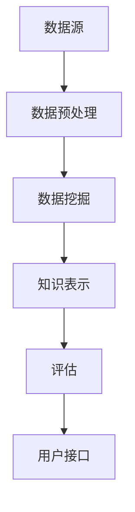

                 

### 文章标题：知识发现引擎的用户兴趣图谱构建

关键词：知识发现引擎、用户兴趣图谱、特征提取、模型构建、优化评估

摘要：本文详细探讨了知识发现引擎中用户兴趣图谱的构建方法。首先介绍了知识发现引擎的基本概念和用户兴趣图谱的定义及其重要性，然后详细讲解了用户兴趣图谱构建的各个步骤，包括数据收集与预处理、用户兴趣特征提取、用户兴趣模型构建、用户兴趣图谱优化与评估。此外，本文还通过实际案例展示了用户兴趣图谱在不同应用场景中的构建实践，并对未来用户兴趣图谱构建技术的发展趋势进行了展望。通过本文的讲解，读者可以深入了解用户兴趣图谱的构建原理和方法，为实际应用提供有力支持。### 第一部分：引言与基础

#### 1.1 书籍概述与目标

##### 1.1.1 书籍背景介绍

随着互联网和大数据技术的快速发展，信息爆炸的时代已经到来。海量信息给用户带来了前所未有的便利，但同时也带来了信息过载的问题。如何在海量信息中快速发现有价值的信息，成为了当前信息检索和推荐系统领域的重要研究方向。知识发现引擎作为一种智能信息处理工具，通过对大规模数据进行分析和挖掘，帮助用户发现潜在的知识和模式，从而提升信息检索和推荐系统的效果。

用户兴趣图谱作为知识发现引擎的重要组成部分，是描述用户兴趣和行为的重要工具。它通过将用户的兴趣点、行为和关系以图形化的方式呈现出来，帮助系统更好地理解和满足用户的需求。本文旨在系统地介绍用户兴趣图谱的构建方法，包括数据收集与预处理、用户兴趣特征提取、用户兴趣模型构建、用户兴趣图谱优化与评估等关键步骤。

##### 1.1.2 书籍目标与读者对象

本文的目标是帮助读者全面了解用户兴趣图谱的构建方法，掌握从数据收集到用户兴趣图谱优化的各个环节。具体来说，本文希望达到以下目标：

1. 让读者了解知识发现引擎的基本概念和用户兴趣图谱的定义及其重要性。
2. 详细讲解用户兴趣图谱构建的各个步骤，包括数据收集与预处理、用户兴趣特征提取、用户兴趣模型构建、用户兴趣图谱优化与评估。
3. 通过实际案例展示用户兴趣图谱在不同应用场景中的构建实践，帮助读者将理论应用到实际中。
4. 对未来用户兴趣图谱构建技术的发展趋势进行展望，为读者提供进一步研究的方向。

本文的读者对象主要包括对知识发现引擎和用户兴趣图谱感兴趣的科研人员、工程师和在校学生。无论您是从事信息检索、推荐系统、人工智能等领域的研究者，还是对该领域有浓厚兴趣的爱好者，本文都将为您带来有价值的知识和实践经验。

##### 1.1.3 知识发现引擎与用户兴趣图谱的关系

知识发现引擎是一种通过从大规模数据集中发现潜在知识和技术方法的技术。它通常包括数据预处理、数据挖掘、知识表示、知识评估等环节。用户兴趣图谱则是知识发现引擎中用于描述用户兴趣和行为的重要工具。具体来说，用户兴趣图谱通过以下方式与知识发现引擎相关联：

1. **数据收集与预处理**：用户兴趣图谱的构建依赖于大量的用户行为数据，如浏览历史、购买记录、评论等。这些数据需要通过数据收集和预处理环节，清洗、整合和规范化，为后续的用户兴趣特征提取和模型构建提供高质量的数据支持。

2. **用户兴趣特征提取**：用户兴趣图谱的构建需要从用户行为数据中提取用户兴趣特征。这些特征可以是基于内容的特征，如用户浏览的文章主题；也可以是基于协同过滤的特征，如用户与其他用户的相似度；还可以是使用深度学习方法提取的复杂数字特征。这些特征将作为构建用户兴趣图谱的基础。

3. **用户兴趣模型构建**：用户兴趣图谱通常采用图结构进行表示，节点表示用户兴趣点，边表示用户之间的兴趣关系。构建用户兴趣模型就是通过建立节点和边之间的关联规则，将用户兴趣点及其关系以图的形式呈现出来。

4. **用户兴趣图谱优化与评估**：构建用户兴趣图谱后，需要对其进行优化和评估。优化策略包括图结构优化、特征优化等，以提升用户兴趣图谱的表示效果。评估指标则用于衡量用户兴趣图谱的性能，如覆盖率、精度、召回率等。

综上所述，用户兴趣图谱是知识发现引擎的重要组成部分，它贯穿于数据收集、特征提取、模型构建、优化评估等各个环节，对知识发现引擎的性能和效果具有重要影响。了解用户兴趣图谱的构建方法和实践，有助于提升知识发现引擎的应用效果。#### 1.2 知识发现引擎概述

##### 1.2.1 知识发现的基本概念

知识发现（Knowledge Discovery in Databases，KDD）是指从大量的数据集中发现有趣的知识或模式的过程。知识发现通常包括以下步骤：

1. **数据清洗**：去除数据中的噪声和不一致数据，确保数据质量。
2. **数据集成**：将来自多个数据源的数据进行合并，形成一个统一的数据视图。
3. **数据选择**：从大量数据中选取与研究目标相关的数据集，缩小数据规模。
4. **数据变换**：对数据进行规范化、归一化等处理，以便于后续的数据挖掘。
5. **数据挖掘**：使用算法从数据中提取潜在的知识或模式。
6. **知识评估**：对挖掘结果进行评估，确定其价值和应用前景。

知识发现的目标是从大量数据中发现有意义的、新颖的、未知的、潜在的信息。这些信息可以用于决策支持、模式识别、预测分析等领域。

##### 1.2.2 知识发现的方法与分类

知识发现的方法和算法种类繁多，可以根据不同的应用场景和数据类型进行分类。以下是一些常见的方法和分类：

1. **关联规则挖掘**：通过分析数据项之间的关联关系，发现频繁出现的组合。常用的算法包括Apriori算法和FP-Growth算法。
2. **聚类分析**：将相似的数据项划分为一组，形成多个类簇。常用的算法包括K-Means算法、DBSCAN算法等。
3. **分类算法**：通过训练模型，将新的数据项分类到不同的类别中。常用的算法包括决策树、支持向量机、神经网络等。
4. **异常检测**：发现数据中的异常值或离群点，用于检测欺诈行为、故障诊断等。常用的算法包括统计方法、基于距离的方法等。
5. **时间序列分析**：分析数据的时间趋势、周期性和季节性等特征，用于预测未来的数据走势。常用的算法包括ARIMA模型、LSTM神经网络等。

##### 1.2.3 知识发现引擎的组成与架构

知识发现引擎是一种实现知识发现过程的软件系统，通常由以下几个关键组件组成：

1. **数据源**：提供待分析的数据，可以是关系数据库、文件系统、Web数据源等。
2. **数据预处理模块**：负责清洗、集成、选择和变换数据，确保数据质量，为后续的数据挖掘提供高质量的数据。
3. **数据挖掘模块**：包含各种数据挖掘算法，用于从数据中提取知识或模式。
4. **知识表示模块**：将挖掘结果以用户友好的方式呈现，可以是图表、报表、可视化界面等。
5. **评估模块**：对挖掘结果进行评估，确定其价值和应用前景。
6. **用户接口**：提供用户交互界面，方便用户配置参数、运行算法、查看结果等。

知识发现引擎的架构可以采用集中式或分布式方式。集中式架构将所有功能模块部署在一台服务器上，适用于中小规模的数据处理。分布式架构则将功能模块部署在多台服务器上，通过分布式计算提高处理效率和性能，适用于大规模数据的高效处理。

以下是一个简化的知识发现引擎架构图：



通过以上架构，知识发现引擎可以高效地从大规模数据中提取有价值的信息，为各种应用场景提供强有力的支持。接下来，我们将进一步探讨用户兴趣图谱的基本原理及其在知识发现引擎中的应用。#### 1.3 用户兴趣图谱的基本原理

##### 1.3.1 用户兴趣图谱的定义

用户兴趣图谱（User Interest Graph）是一种基于图结构来描述用户兴趣和行为模式的数据模型。它通过将用户、兴趣点、行为和关系等信息以图的形式组织起来，形成一种多层次、多维度的用户兴趣网络。用户兴趣图谱的节点通常表示用户、兴趣点（如文章、商品、视频等）和行为事件（如浏览、购买、评论等），而边则表示节点之间的关联关系，如用户与兴趣点之间的关注关系、用户之间的互动关系等。

用户兴趣图谱的定义可以从以下几个方面进行详细阐述：

1. **节点**：用户兴趣图谱的节点可以包括以下几种类型：
   - **用户节点**：表示系统中的用户，可以是真实用户或虚拟用户。
   - **兴趣点节点**：表示用户可能感兴趣的各种对象，如文章、商品、视频、话题等。
   - **行为事件节点**：表示用户在系统中的行为记录，如浏览、购买、评论、点赞等。

2. **边**：用户兴趣图谱的边表示节点之间的关系，包括以下几种类型：
   - **关注边**：表示用户对某个兴趣点的关注关系，如用户A关注了文章B。
   - **互动边**：表示用户之间的互动关系，如用户A点赞了用户B的评论。
   - **行为边**：表示用户与兴趣点之间的行为关系，如用户A浏览了文章B。

3. **属性**：用户兴趣图谱的节点和边可以附带各种属性，如用户年龄、性别、地理位置、兴趣点类型、行为时间等。这些属性可以用于丰富用户兴趣图谱的表示，提高数据挖掘和分析的效果。

##### 1.3.2 用户兴趣图谱的结构与属性

用户兴趣图谱的结构可以采用分层的方式组织，包括以下几层：

1. **底层**：表示基础的用户行为数据，如浏览、购买、评论等。这一层的数据通常来自各种数据源，如网站日志、交易记录、社交媒体等。

2. **中层**：表示用户和兴趣点的关联关系，如用户关注了哪些兴趣点、用户之间的互动关系等。这一层的数据通过数据预处理和特征提取等步骤，从底层的基础行为数据中提取出来。

3. **上层**：表示用户兴趣图谱的抽象表示，如用户兴趣类别、主题模型等。这一层的数据通常通过数据挖掘和机器学习算法，从中层的数据中进一步提取和归纳出来。

用户兴趣图谱的属性可以分为以下几类：

1. **用户属性**：包括用户的年龄、性别、地理位置、职业、兴趣爱好等基本信息，用于描述用户的特征和偏好。

2. **兴趣点属性**：包括兴趣点的类型、标签、热度、更新时间等，用于描述兴趣点的特征和内容。

3. **行为属性**：包括用户行为的时间、频率、持续时间等，用于描述用户行为的特点和模式。

4. **关系属性**：包括用户与兴趣点之间的关注关系、用户之间的互动关系等，用于描述用户兴趣图谱中的关系和结构。

##### 1.3.3 用户兴趣图谱的作用与应用场景

用户兴趣图谱在知识发现和推荐系统中具有重要作用，以下是一些主要的应用场景：

1. **个性化推荐**：用户兴趣图谱可以帮助推荐系统更好地理解用户的兴趣和行为，从而提供更个性化的推荐结果。例如，基于用户与兴趣点的关注关系，可以为用户推荐相似的兴趣点；基于用户之间的互动关系，可以为用户推荐可能感兴趣的其他用户。

2. **内容推荐**：用户兴趣图谱可以用于推荐系统中的内容推荐，如文章、视频、商品等。通过分析用户兴趣图谱，可以发现用户可能感兴趣的内容类别和主题，从而提高推荐的相关性和满意度。

3. **社交网络分析**：用户兴趣图谱可以用于社交网络分析，如发现社交网络中的影响力用户、潜在社群等。通过分析用户与兴趣点、用户之间的关联关系，可以发现用户群体中的兴趣热点和互动模式。

4. **用户行为分析**：用户兴趣图谱可以帮助企业更好地了解用户的行为和偏好，为市场营销、用户运营等提供数据支持。通过分析用户行为，可以发现用户的购买习惯、兴趣偏好等，从而优化营销策略和用户服务。

5. **广告投放优化**：用户兴趣图谱可以用于广告投放的优化，如通过分析用户的兴趣点和行为，为广告主推荐适合的广告投放目标和策略。

综上所述，用户兴趣图谱作为一种描述用户兴趣和行为的重要工具，在个性化推荐、内容推荐、社交网络分析、用户行为分析和广告投放等领域具有广泛的应用。了解用户兴趣图谱的基本原理和构建方法，对于提升知识发现引擎的性能和效果具有重要意义。接下来，我们将详细探讨用户兴趣图谱的构建方法。#### 2.1 数据收集与预处理

##### 2.1.1 用户行为数据收集

用户兴趣图谱的构建依赖于大量的用户行为数据，这些数据可以通过多种渠道收集，包括网站日志、用户反馈、社交媒体等。以下是一些常见的数据收集方法：

1. **网站日志**：通过分析网站日志，可以收集用户的浏览历史、点击行为、购买记录等数据。这些数据通常以日志文件的形式存储，包含用户ID、访问时间、访问页面、操作类型等信息。

2. **用户反馈**：通过用户反馈，如问卷调查、用户评论、评分等，可以收集用户的兴趣偏好和满意度数据。这些数据通常以结构化或非结构化的形式存储，需要通过数据清洗和预处理转换为可用的格式。

3. **社交媒体**：通过分析用户的社交媒体活动，如微博、微信、Facebook等，可以收集用户的兴趣点、互动行为等数据。这些数据通常包含用户的文本、图片、视频等多媒体信息。

4. **API接口**：通过调用第三方API接口，可以获取用户在其他平台的行为数据，如电商平台的购买记录、音乐平台的播放记录等。

在收集用户行为数据时，需要考虑以下因素：

- **数据来源的多样性**：尽可能从多个渠道收集数据，以提高数据的全面性和准确性。
- **数据格式的统一性**：确保不同来源的数据具有统一的格式和结构，便于后续的数据处理和分析。
- **数据质量的保证**：对收集到的数据进行质量评估和清洗，去除噪声数据、重复数据和异常数据，以提高数据的质量。

##### 2.1.2 数据预处理方法

数据预处理是用户兴趣图谱构建的关键步骤，其目的是将原始数据转化为适合进行分析和建模的形式。以下是一些常见的数据预处理方法：

1. **数据清洗**：去除噪声数据、重复数据和异常数据，保证数据的一致性和准确性。具体方法包括去除空值、缺失值填充、去除重复记录等。

2. **数据整合**：将来自多个数据源的数据进行合并，形成一个统一的数据集。需要解决数据源之间的冲突、冗余和一致性等问题。

3. **数据规范化**：对数据进行规范化处理，如字符串转换为数字、日期时间规范化等，以消除数据之间的差异和冲突。

4. **特征提取**：从原始数据中提取出有助于描述用户兴趣和行为的关键特征。常用的特征提取方法包括基于内容的特征提取、基于协同过滤的特征提取和深度学习方法等。

5. **数据归一化**：对数据进行归一化处理，如数值范围缩放、极值处理等，以消除不同特征之间的量纲和规模差异。

6. **数据可视化**：通过数据可视化技术，对预处理后的数据进行可视化展示，帮助用户更好地理解数据分布和特征关系。

##### 2.1.3 数据质量评估与优化

数据质量是用户兴趣图谱构建的关键因素，对数据质量进行评估和优化具有重要意义。以下是一些常见的数据质量评估与优化方法：

1. **数据质量评估指标**：设计一套评估数据质量的标准和指标，如数据完整性、一致性、准确性、及时性等。常用的评估指标包括缺失率、重复率、异常值比例等。

2. **数据质量评估方法**：采用数据质量评估方法，对数据质量进行定量和定性的分析。常用的评估方法包括统计分析、机器学习方法等。

3. **数据质量优化策略**：针对评估中发现的问题，采取相应的优化策略，如数据清洗、数据集成、数据归一化等，以提升数据质量。

4. **数据质量管理工具**：使用数据质量管理工具，如数据质量分析工具、数据清洗工具等，对数据进行自动化的管理和优化。

5. **数据质量控制机制**：建立数据质量控制机制，如数据质量检查、数据质量报告等，确保数据质量在构建用户兴趣图谱过程中得到持续保障。

通过以上数据收集与预处理方法，可以有效地提升用户行为数据的全面性、准确性和质量，为用户兴趣图谱的构建提供高质量的数据支持。接下来，我们将进一步探讨用户兴趣特征提取的方法。#### 2.2 用户兴趣特征提取

用户兴趣特征提取是用户兴趣图谱构建的核心步骤，它从原始用户行为数据中提取出能够有效描述用户兴趣和行为的特征。特征提取的质量直接影响用户兴趣图谱的构建效果。本节将介绍几种常用的用户兴趣特征提取方法，包括基于内容的特征提取、基于协同过滤的特征提取以及深度学习方法。

##### 2.2.1 基于内容的特征提取

基于内容的特征提取方法主要通过分析用户对特定内容的互动行为来提取用户兴趣特征。以下是一些常用的基于内容的特征提取方法：

1. **关键词提取**：从用户浏览、评论、搜索等行为中提取关键词，用于描述用户的兴趣点。常用的关键词提取方法包括TF-IDF（Term Frequency-Inverse Document Frequency）和Word2Vec等。

2. **主题模型**：通过主题模型，如LDA（Latent Dirichlet Allocation），从用户生成的内容中提取潜在的主题分布，从而揭示用户的兴趣类别。LDA模型可以将文档集合表示为多个潜在主题的混合，每个用户可以基于其在各个主题上的活跃度来提取兴趣特征。

3. **内容分类**：将用户生成的内容按照类别进行分类，如新闻、视频、商品等，然后根据用户在各个类别上的活跃度来提取兴趣特征。

伪代码示例：

```plaintext
// 基于关键词提取的用户兴趣特征提取伪代码
function extract_content_based_features(user_behavior_data):
    // 初始化用户兴趣特征向量
    user_interest_vector = initialize_vector()

    // 遍历用户行为数据
    for behavior in user_behavior_data:
        if behavior.type == "search":
            keywords = extract_keywords_from_search(behavior.query)
        else if behavior.type == "comment":
            keywords = extract_keywords_from_comment(behavior.content)

        // 更新用户兴趣特征向量
        user_interest_vector = update_vector_with_keywords(user_interest_vector, keywords)

    return user_interest_vector
```

##### 2.2.2 基于协同过滤的特征提取

基于协同过滤的特征提取方法通过分析用户与用户、用户与项目之间的相似度来提取用户兴趣特征。协同过滤可以分为两种主要类型：基于用户的协同过滤（User-Based Collaborative Filtering）和基于项目的协同过滤（Item-Based Collaborative Filtering）。

1. **基于用户的协同过滤**：找到与目标用户最相似的其他用户，将这些相似用户的兴趣作为参考，为用户推荐相似的兴趣点。相似度计算可以通过用户之间的行为相似度或基于内容相似度进行。

2. **基于项目的协同过滤**：找到与用户过去行为最相似的其他项目，将这些相似项目作为参考，为用户推荐可能感兴趣的项目。

伪代码示例：

```plaintext
// 基于协同过滤的用户兴趣特征提取伪代码
function extract_collaborative_features(user_behavior_data, user_similarity_matrix):
    // 初始化用户兴趣特征向量
    user_interest_vector = initialize_vector()

    // 计算用户与其他用户的相似度
    user_similarity_scores = calculate_similarity_scores(user_behavior_data, user_similarity_matrix)

    // 遍历相似度得分，更新用户兴趣特征向量
    for user, score in user_similarity_scores:
        if score > threshold:
            user_interest_vector = update_vector_with_similarity(user_interest_vector, user)

    return user_interest_vector
```

##### 2.2.3 深度学习方法在特征提取中的应用

深度学习方法通过构建多层神经网络模型，可以从原始数据中自动提取高层次的抽象特征。在用户兴趣特征提取中，常用的深度学习模型包括卷积神经网络（CNN）、循环神经网络（RNN）和Transformer等。

1. **卷积神经网络（CNN）**：CNN主要用于处理图像和文本数据，通过卷积操作提取图像或文本的特征。在用户兴趣特征提取中，CNN可以用于提取用户生成内容的特征，如用户评论的语义特征。

2. **循环神经网络（RNN）**：RNN可以处理序列数据，通过在序列中传递状态来提取特征。在用户兴趣特征提取中，RNN可以用于处理用户的浏览历史、评论等序列数据，提取用户兴趣的特征。

3. **Transformer模型**：Transformer模型通过自注意力机制，可以有效地捕捉序列数据中的长距离依赖关系。在用户兴趣特征提取中，Transformer可以用于处理用户的复杂行为序列，提取用户兴趣的特征。

伪代码示例：

```plaintext
// 基于深度学习的用户兴趣特征提取伪代码
function extract_deep_learning_features(user_behavior_data):
    // 构建深度学习模型
    model = build_deep_learning_model()

    // 训练模型
    model.fit(user_behavior_data, labels)

    // 提取用户兴趣特征
    user_interest_vector = model.extract_features(user_behavior_data)

    return user_interest_vector
```

通过以上方法，可以从原始用户行为数据中提取出有效的用户兴趣特征，为用户兴趣图谱的构建提供高质量的输入数据。接下来，我们将进一步探讨用户兴趣模型的构建方法。#### 2.3 用户兴趣模型构建

用户兴趣模型是用户兴趣图谱构建的核心部分，用于描述用户在不同兴趣点上的活跃度和偏好。构建用户兴趣模型的关键在于选择合适的模型和方法，以便能够准确地捕捉用户的兴趣特征。以下介绍几种常用的用户兴趣模型构建方法，包括基于图的模型、基于矩阵分解的模型和基于深度学习的模型。

##### 2.3.1 基于图的模型

基于图的模型通过构建用户与兴趣点之间的图结构来表示用户兴趣。在这种模型中，用户和兴趣点作为图的节点，它们之间的交互和关系作为图的边。以下是几种常见的基于图的模型：

1. **图卷积网络（Graph Convolutional Network, GCN）**：
   图卷积网络是一种基于图结构的深度学习模型，可以捕捉节点之间的邻居信息。GCN通过卷积操作将节点的邻接信息聚合起来，从而生成节点的特征表示。

   伪代码示例：
   ```plaintext
   // 基于GCN的用户兴趣模型构建伪代码
   function build_gcn_model(num_nodes, num_features, hidden_size):
       # 初始化GCN模型
       model = initialize_gcn_model(num_nodes, num_features, hidden_size)

       # 训练GCN模型
       model.fit(input_data, labels)

       # 获取用户兴趣特征
       user_interest_features = model.get_interest_features()

       return user_interest_features
   ```

2. **图注意力网络（Graph Attention Network, GAT）**：
   图注意力网络通过自注意力机制，为每个节点的邻接信息分配不同的权重，从而更好地捕捉节点之间的依赖关系。GAT通过更新节点的特征表示，使其更准确地反映用户的兴趣。

   伪代码示例：
   ```plaintext
   // 基于GAT的用户兴趣模型构建伪代码
   function build_gat_model(num_nodes, num_features, hidden_size, attention_heads):
       # 初始化GAT模型
       model = initialize_gat_model(num_nodes, num_features, hidden_size, attention_heads)

       # 训练GAT模型
       model.fit(input_data, labels)

       # 获取用户兴趣特征
       user_interest_features = model.get_interest_features()

       return user_interest_features
   ```

##### 2.3.2 基于矩阵分解的模型

基于矩阵分解的模型通过分解用户-物品矩阵来构建用户兴趣模型。在这种模型中，用户和物品分别作为矩阵的行和列，通过矩阵分解得到用户和物品的低维特征表示。以下是几种常见的基于矩阵分解的模型：

1. **矩阵分解协同过滤（Matrix Factorization Collaborative Filtering, MF）**：
   矩阵分解协同过滤通过将用户-物品矩阵分解为用户特征矩阵和物品特征矩阵，从而预测用户的兴趣。MF模型可以捕捉用户和物品的潜在特征，提高推荐的准确性。

   伪代码示例：
   ```plaintext
   // 基于MF的用户兴趣模型构建伪代码
   function build_mf_model(num_users, num_items, num_factors):
       # 初始化MF模型
       model = initialize_mf_model(num_users, num_items, num_factors)

       # 训练MF模型
       model.fit(user_item_data)

       # 获取用户兴趣特征
       user_interest_features = model.get_user_features()

       return user_interest_features
   ```

2. **因子分解机（Factorization Machine, FM）**：
   因子分解机是一种基于矩阵分解的模型，可以捕获用户和物品之间的非线性关系。FM通过扩展线性模型，引入二阶交叉特征，从而提高模型的泛化能力和预测性能。

   伪代码示例：
   ```plaintext
   // 基于FM的用户兴趣模型构建伪代码
   function build_fm_model(num_features, k):
       # 初始化FM模型
       model = initialize_fm_model(num_features, k)

       # 训练FM模型
       model.fit(user_item_data, labels)

       # 获取用户兴趣特征
       user_interest_features = model.get_user_features()

       return user_interest_features
   ```

##### 2.3.3 基于深度学习的模型

基于深度学习的模型通过构建多层神经网络来捕捉用户兴趣的复杂特征。以下介绍几种常见的基于深度学习的用户兴趣模型：

1. **卷积神经网络（Convolutional Neural Network, CNN）**：
   卷积神经网络在图像处理领域有广泛应用，通过卷积操作可以提取图像的局部特征。在用户兴趣特征提取中，CNN可以用于处理用户生成的内容，如文本和图片，提取用户的兴趣特征。

   伪代码示例：
   ```plaintext
   // 基于CNN的用户兴趣模型构建伪代码
   function build_cnn_model(input_shape, num_classes):
       # 初始化CNN模型
       model = initialize_cnn_model(input_shape, num_classes)

       # 训练CNN模型
       model.fit(input_data, labels)

       # 获取用户兴趣特征
       user_interest_features = model.get_interest_features()

       return user_interest_features
   ```

2. **循环神经网络（Recurrent Neural Network, RNN）**：
   循环神经网络可以处理序列数据，通过在序列中传递状态来捕捉时间序列特征。在用户兴趣特征提取中，RNN可以用于处理用户的浏览历史和评论等序列数据，提取用户的兴趣特征。

   伪代码示例：
   ```plaintext
   // 基于RNN的用户兴趣模型构建伪代码
   function build_rnn_model(input_shape, hidden_size):
       # 初始化RNN模型
       model = initialize_rnn_model(input_shape, hidden_size)

       # 训练RNN模型
       model.fit(input_data, labels)

       # 获取用户兴趣特征
       user_interest_features = model.get_interest_features()

       return user_interest_features
   ```

3. **Transformer模型**：
   Transformer模型通过自注意力机制，可以有效地捕捉序列数据中的长距离依赖关系。在用户兴趣特征提取中，Transformer可以用于处理用户的复杂行为序列，提取用户的兴趣特征。

   伪代码示例：
   ```plaintext
   // 基于Transformer的用户兴趣模型构建伪代码
   function build_transformer_model(input_shape, hidden_size, num_heads):
       # 初始化Transformer模型
       model = initialize_transformer_model(input_shape, hidden_size, num_heads)

       # 训练Transformer模型
       model.fit(input_data, labels)

       # 获取用户兴趣特征
       user_interest_features = model.get_interest_features()

       return user_interest_features
   ```

通过上述方法，可以构建多种类型的用户兴趣模型，从而有效地描述用户的兴趣特征。接下来，我们将探讨用户兴趣图谱的优化与评估方法。#### 2.4 用户兴趣图谱的优化与评估

用户兴趣图谱的优化与评估是确保其准确性和有效性的关键步骤。通过优化，可以提升图谱的质量和性能；通过评估，可以衡量图谱的优劣，为后续改进提供依据。本节将详细介绍用户兴趣图谱的优化策略、评估指标和性能评估方法。

##### 2.4.1 用户兴趣图谱优化策略

用户兴趣图谱的优化涉及图结构优化和特征优化两个方面。

1. **图结构优化**：
   - **去噪**：通过去除噪声节点和边，提高图谱的纯净度。常用的方法包括基于连通性的去噪、基于节点度去噪等。
   - **补全缺失数据**：通过数据填充技术，填补图谱中的缺失节点和边，从而完善图谱的结构。
   - **图结构平滑**：通过图平滑技术，减少节点之间的极端差异，使得图谱更加均匀和稳定。常用的方法包括基于邻接矩阵的图平滑、基于局部结构的图平滑等。

2. **特征优化**：
   - **特征选择**：通过特征选择技术，筛选出对用户兴趣描述最为重要的特征，从而提高图谱的表示质量。常用的方法包括基于信息增益的特征选择、基于主成分分析的特征选择等。
   - **特征变换**：通过特征变换技术，对原始特征进行线性或非线性变换，提高特征的区分度和表达能力。例如，使用核技巧对特征进行映射，或使用深度学习模型对特征进行非线性变换。

##### 2.4.2 用户兴趣图谱评估指标

用户兴趣图谱的评估需要一套全面的指标体系，以衡量图谱的各个方面。以下是一些常用的评估指标：

1. **覆盖率（Coverage）**：
   覆盖率是指图谱中包含的用户兴趣点数量与所有潜在兴趣点数量的比值。覆盖率越高，说明图谱能够覆盖更多的用户兴趣点。

   伪代码示例：
   ```plaintext
   function calculate_coverage(graph, all_interest_points):
       covered_interest_points = set()
       for node in graph.nodes():
           if node in all_interest_points:
               covered_interest_points.add(node)
       coverage = len(covered_interest_points) / len(all_interest_points)
       return coverage
   ```

2. **精度（Precision）**：
   精度是指图谱中包含的正确兴趣点数量与图谱中总兴趣点数量的比值。精度越高，说明图谱中包含的兴趣点越准确。

   伪代码示例：
   ```plaintext
   function calculate_precision(graph, ground_truth_interest_points):
       correct_interest_points = set()
       for node in graph.nodes():
           if node in ground_truth_interest_points:
               correct_interest_points.add(node)
       precision = len(correct_interest_points) / len(graph.nodes())
       return precision
   ```

3. **召回率（Recall）**：
   召回率是指图谱中包含的正确兴趣点数量与实际兴趣点数量的比值。召回率越高，说明图谱能够发现更多的实际兴趣点。

   伪代码示例：
   ```plaintext
   function calculate_recall(graph, ground_truth_interest_points):
       correct_interest_points = set()
       for node in graph.nodes():
           if node in ground_truth_interest_points:
               correct_interest_points.add(node)
       recall = len(correct_interest_points) / len(ground_truth_interest_points)
       return recall
   ```

4. **F1分数（F1 Score）**：
   F1分数是精度和召回率的加权平均，用于综合评估图谱的性能。

   伪代码示例：
   ```plaintext
   function calculate_f1_score(precision, recall):
       f1 = 2 * (precision * recall) / (precision + recall)
       return f1
   ```

##### 2.4.3 用户兴趣图谱性能评估方法

用户兴趣图谱的性能评估方法包括离线评估和在线评估。

1. **离线评估**：
   - **静态评估**：在构建好的用户兴趣图谱上进行评估，评估指标包括覆盖率、精度、召回率和F1分数等。静态评估通常用于模型开发和优化过程中的中间评估。
   - **动态评估**：通过模拟用户的兴趣变化和图谱的演化，评估图谱在不同场景下的性能。动态评估有助于了解图谱在长时间内的稳定性和适应性。

2. **在线评估**：
   - **实时反馈**：通过在线用户的反馈，实时评估图谱的性能。例如，通过用户对推荐结果的点击率、满意度等指标，调整和优化图谱。
   - **A/B测试**：通过将用户分为实验组和控制组，比较两组用户在不同图谱模型下的表现，评估图谱的实际效果。

通过以上优化策略和评估指标，可以全面评估用户兴趣图谱的性能，确保其在实际应用中的有效性和准确性。接下来，我们将通过实际案例展示用户兴趣图谱在不同应用场景中的构建实践。#### 3.1 社交网络中的用户兴趣图谱构建

社交网络作为用户互动和分享的重要平台，其用户兴趣图谱的构建对于提升社交体验和推荐效果具有重要意义。本节将介绍社交网络中用户兴趣图谱的构建方法，包括数据收集与预处理、用户兴趣特征提取、用户兴趣图谱构建实践。

##### 3.1.1 社交网络数据收集与预处理

1. **数据收集**：
   社交网络数据通常包括用户信息、帖子内容、互动行为等。以下是一些常见的数据收集方法：
   - **用户信息**：通过API接口获取用户的基本信息，如用户ID、昵称、性别、年龄、地理位置等。
   - **帖子内容**：收集用户发布的各类帖子，包括文本、图片、视频等多媒体信息。
   - **互动行为**：收集用户之间的互动数据，如点赞、评论、转发等。

2. **数据预处理**：
   社交网络数据通常需要进行以下预处理步骤：
   - **数据清洗**：去除重复、异常和噪声数据，确保数据质量。
   - **数据整合**：将来自不同数据源的数据进行整合，形成统一的数据视图。
   - **特征提取**：从原始数据中提取用户和帖子的特征，如关键词、主题标签、情感分析结果等。
   - **数据规范化**：对数据进行规范化处理，如文本数据的分词、去停用词、词性标注等。

##### 3.1.2 社交网络中的用户兴趣特征提取

在社交网络中，用户兴趣特征提取是一个关键步骤，以下介绍几种常用的方法：

1. **基于内容的特征提取**：
   - **关键词提取**：从用户帖子中提取关键词，使用TF-IDF等方法进行特征化。
   - **主题模型**：使用LDA等方法从用户帖子中提取潜在主题，用于描述用户兴趣。
   - **情感分析**：对用户帖子进行情感分析，提取情感特征，用于描述用户情感偏好。

2. **基于协同过滤的特征提取**：
   - **用户相似度计算**：通过计算用户之间的行为相似度，提取协同过滤特征。
   - **物品相似度计算**：通过计算帖子之间的内容相似度，提取协同过滤特征。

3. **基于深度学习的特征提取**：
   - **卷积神经网络（CNN）**：用于提取用户生成内容的视觉特征。
   - **循环神经网络（RNN）**：用于处理用户的序列行为数据，提取时间序列特征。
   - **Transformer模型**：用于处理用户的复杂行为序列，提取长距离依赖特征。

##### 3.1.3 社交网络用户兴趣图谱构建实践

以下是一个社交网络用户兴趣图谱构建的实践案例：

1. **数据收集与预处理**：
   - 收集用户信息，如用户ID、昵称、性别、年龄等。
   - 收集用户帖子内容，包括文本、图片、视频等多媒体信息。
   - 收集用户互动数据，如点赞、评论、转发等。

2. **用户兴趣特征提取**：
   - 使用LDA方法提取用户帖子中的潜在主题，作为用户兴趣特征。
   - 计算用户之间的行为相似度，提取协同过滤特征。
   - 使用Transformer模型处理用户的复杂行为序列，提取长距离依赖特征。

3. **用户兴趣图谱构建**：
   - 定义用户节点，将用户作为图的节点。
   - 定义帖子节点，将用户帖子作为图的节点。
   - 定义互动边，将用户与用户、用户与帖子之间的互动关系作为图的边。

4. **用户兴趣图谱优化**：
   - 去除噪声节点和边，提高图谱的纯净度。
   - 使用图平滑技术，减少节点之间的极端差异。
   - 通过特征选择和特征变换，优化图谱的特征表示。

5. **用户兴趣图谱评估**：
   - 使用覆盖率、精度、召回率和F1分数等评估指标，评估图谱的性能。
   - 通过在线反馈和A/B测试，进一步优化图谱。

通过以上步骤，可以构建一个有效的社交网络用户兴趣图谱，用于个性化推荐、社交网络分析等应用场景。接下来，我们将探讨电子商务平台用户兴趣图谱的构建方法。#### 3.2 电子商务平台用户兴趣图谱构建

电子商务平台通过用户兴趣图谱可以有效提升用户购物体验和推荐效果。本节将详细介绍电子商务平台用户兴趣图谱的构建过程，包括数据收集与预处理、用户兴趣特征提取、用户兴趣图谱构建实践。

##### 3.2.1 电子商务平台数据收集与预处理

1. **数据收集**：
   电子商务平台的数据来源广泛，主要包括以下几种：
   - **用户数据**：包括用户注册信息、个人偏好、购物车、收藏夹等。
   - **商品数据**：包括商品名称、描述、价格、分类、标签、库存等。
   - **行为数据**：包括用户浏览记录、购买记录、评价、分享等。

2. **数据预处理**：
   数据预处理是构建用户兴趣图谱的关键步骤，主要包括以下任务：
   - **数据清洗**：去除重复、异常和噪声数据，保证数据质量。
   - **数据整合**：将来自不同数据源的数据进行整合，形成一个统一的数据视图。
   - **特征提取**：从原始数据中提取用户和商品的属性特征，如用户年龄、性别、购物频率、商品价格、分类等。

##### 3.2.2 电子商务平台用户兴趣特征提取

用户兴趣特征提取是构建用户兴趣图谱的核心步骤，以下介绍几种常用的方法：

1. **基于内容的特征提取**：
   - **商品属性特征提取**：从商品描述中提取关键词和标签，使用TF-IDF等方法进行特征化。
   - **用户偏好特征提取**：从用户的历史行为数据中提取购买频率、浏览时间、评价等特征。

2. **基于协同过滤的特征提取**：
   - **用户相似度计算**：通过计算用户之间的行为相似度，提取协同过滤特征。
   - **商品相似度计算**：通过计算商品之间的属性相似度，提取协同过滤特征。

3. **基于深度学习的特征提取**：
   - **卷积神经网络（CNN）**：用于提取商品图像的特征。
   - **循环神经网络（RNN）**：用于处理用户的序列行为数据，提取时间序列特征。
   - **Transformer模型**：用于处理用户的复杂行为序列，提取长距离依赖特征。

##### 3.2.3 电子商务平台用户兴趣图谱构建实践

以下是一个电子商务平台用户兴趣图谱构建的实践案例：

1. **数据收集与预处理**：
   - 收集用户数据，如用户ID、注册信息、购物车等。
   - 收集商品数据，如商品名称、描述、价格、分类等。
   - 收集用户行为数据，如浏览记录、购买记录、评价等。

2. **用户兴趣特征提取**：
   - 使用LDA方法提取用户的潜在兴趣主题。
   - 计算用户之间的行为相似度，提取协同过滤特征。
   - 使用Transformer模型处理用户的复杂行为序列，提取长距离依赖特征。

3. **用户兴趣图谱构建**：
   - 定义用户节点，将用户作为图的节点。
   - 定义商品节点，将商品作为图的节点。
   - 定义用户与商品之间的购买关系、浏览关系等作为图的边。

4. **用户兴趣图谱优化**：
   - 去除噪声节点和边，提高图谱的纯净度。
   - 使用图平滑技术，减少节点之间的极端差异。
   - 通过特征选择和特征变换，优化图谱的特征表示。

5. **用户兴趣图谱评估**：
   - 使用覆盖率、精度、召回率和F1分数等评估指标，评估图谱的性能。
   - 通过在线反馈和A/B测试，进一步优化图谱。

通过以上步骤，可以构建一个有效的电子商务平台用户兴趣图谱，用于个性化推荐、用户行为分析等应用场景。接下来，我们将探讨媒体推荐系统中用户兴趣图谱的构建方法。#### 3.3 媒体推荐系统用户兴趣图谱构建

媒体推荐系统通过用户兴趣图谱可以有效提升推荐质量和用户体验。本节将详细介绍媒体推荐系统中用户兴趣图谱的构建过程，包括数据收集与预处理、用户兴趣特征提取、用户兴趣图谱构建实践。

##### 3.3.1 媒体推荐系统数据收集与预处理

1. **数据收集**：
   媒体推荐系统需要收集大量用户行为数据，包括：
   - **用户数据**：用户的注册信息、兴趣爱好、地理位置等。
   - **媒体数据**：文章、视频、音频等的标题、内容、标签、分类等。
   - **行为数据**：用户的浏览、点击、点赞、评论、分享等行为记录。

2. **数据预处理**：
   数据预处理是构建用户兴趣图谱的关键步骤，主要包括以下任务：
   - **数据清洗**：去除重复、异常和噪声数据，保证数据质量。
   - **数据整合**：将来自不同数据源的数据进行整合，形成一个统一的数据视图。
   - **特征提取**：从原始数据中提取用户和媒体的属性特征，如用户年龄、性别、媒体主题、标签等。

##### 3.3.2 媒体推荐系统用户兴趣特征提取

用户兴趣特征提取是构建用户兴趣图谱的核心步骤，以下介绍几种常用的方法：

1. **基于内容的特征提取**：
   - **媒体内容特征提取**：从媒体内容中提取关键词、主题标签、情感分析结果等，使用TF-IDF等方法进行特征化。
   - **用户偏好特征提取**：从用户的历史行为数据中提取购买频率、浏览时间、评价等特征。

2. **基于协同过滤的特征提取**：
   - **用户相似度计算**：通过计算用户之间的行为相似度，提取协同过滤特征。
   - **媒体相似度计算**：通过计算媒体之间的属性相似度，提取协同过滤特征。

3. **基于深度学习的特征提取**：
   - **卷积神经网络（CNN）**：用于提取媒体内容的视觉特征。
   - **循环神经网络（RNN）**：用于处理用户的序列行为数据，提取时间序列特征。
   - **Transformer模型**：用于处理用户的复杂行为序列，提取长距离依赖特征。

##### 3.3.3 媒体推荐系统用户兴趣图谱构建实践

以下是一个媒体推荐系统用户兴趣图谱构建的实践案例：

1. **数据收集与预处理**：
   - 收集用户数据，如用户ID、注册信息、兴趣爱好等。
   - 收集媒体数据，如文章标题、内容、标签、分类等。
   - 收集用户行为数据，如浏览记录、点击记录、点赞记录等。

2. **用户兴趣特征提取**：
   - 使用LDA方法提取用户的潜在兴趣主题。
   - 计算用户之间的行为相似度，提取协同过滤特征。
   - 使用Transformer模型处理用户的复杂行为序列，提取长距离依赖特征。

3. **用户兴趣图谱构建**：
   - 定义用户节点，将用户作为图的节点。
   - 定义媒体节点，将媒体作为图的节点。
   - 定义用户与媒体之间的浏览关系、点击关系等作为图的边。

4. **用户兴趣图谱优化**：
   - 去除噪声节点和边，提高图谱的纯净度。
   - 使用图平滑技术，减少节点之间的极端差异。
   - 通过特征选择和特征变换，优化图谱的特征表示。

5. **用户兴趣图谱评估**：
   - 使用覆盖率、精度、召回率和F1分数等评估指标，评估图谱的性能。
   - 通过在线反馈和A/B测试，进一步优化图谱。

通过以上步骤，可以构建一个有效的媒体推荐系统用户兴趣图谱，用于个性化推荐、用户行为分析等应用场景。接下来，我们将探讨用户兴趣图谱构建的未来发展趋势。#### 4.1 用户兴趣图谱构建技术的发展趋势

随着互联网和大数据技术的迅猛发展，用户兴趣图谱构建技术也在不断演进和优化。以下是当前用户兴趣图谱构建技术的发展趋势，以及面临的挑战：

##### 4.1.1 数据量与多样性挑战

随着用户生成内容和数据源的多样化，用户兴趣图谱所处理的数据量呈现爆炸式增长。从原始日志数据到社交媒体数据，从静态数据到动态数据，数据的多样性也给用户兴趣图谱构建带来了巨大挑战。如何高效地处理大规模、多样化的数据，提取出有价值的信息，成为当前研究的热点。

**解决方案**：
1. **分布式计算与存储**：采用分布式计算框架（如Hadoop、Spark）和分布式存储系统（如HDFS、Cassandra），提高数据处理和存储效率。
2. **增量更新**：采用增量更新策略，仅对最近发生变化的数据进行更新，降低计算和存储压力。

##### 4.1.2 实时性与动态性挑战

用户兴趣和行为具有高度的实时性和动态性，用户兴趣图谱需要能够快速响应这些变化。然而，实时数据流的处理、数据同步以及图谱的动态更新都是技术难点。

**解决方案**：
1. **实时数据流处理**：采用实时数据流处理技术（如Apache Kafka、Apache Flink），实现对用户行为数据的实时处理和分析。
2. **增量更新算法**：采用增量更新算法（如增量LDA、增量矩阵分解），实现用户兴趣图谱的实时更新。

##### 4.1.3 用户隐私保护挑战

用户隐私保护是用户兴趣图谱构建中不可忽视的问题。如何在提取用户兴趣信息的同时，保护用户的隐私数据，成为当前研究的重点。

**解决方案**：
1. **差分隐私**：采用差分隐私技术（如拉普拉斯机制、指数机制），在保证数据隐私的前提下，提供有价值的用户兴趣信息。
2. **隐私增强技术**：采用数据脱敏、加密、匿名化等技术，降低用户隐私泄露的风险。

##### 4.1.4 多模态数据融合

随着物联网、智能设备的普及，用户兴趣图谱的数据类型越来越多样化，包括文本、图像、语音等多模态数据。如何将这些多模态数据进行有效融合，提升用户兴趣图谱的准确性和全面性，是当前的研究趋势。

**解决方案**：
1. **多模态特征提取**：采用多模态特征提取技术（如卷积神经网络、循环神经网络），分别提取不同类型数据的特征。
2. **多模态融合算法**：采用多模态融合算法（如加权融合、级联融合），将不同类型数据的特征进行融合，形成统一的用户兴趣特征向量。

##### 4.1.5 智能推理与交互

用户兴趣图谱不仅是一种数据模型，也是一种智能推理工具。通过用户兴趣图谱，可以实现对用户意图的智能推理和交互。如何提升用户兴趣图谱的智能推理能力，提供个性化的用户体验，是未来的发展方向。

**解决方案**：
1. **图神经网络（Graph Neural Network, GNN）**：采用图神经网络，提升用户兴趣图谱的表示能力和推理能力。
2. **自然语言处理（Natural Language Processing, NLP）**：结合自然语言处理技术，实现对用户文本数据的深入理解和分析。

综上所述，用户兴趣图谱构建技术在未来将继续朝着实时性、动态性、隐私保护和多模态融合等方向发展。通过不断的技术创新和优化，用户兴趣图谱将为各类应用场景提供更智能、更个性化的服务。接下来，我们将探讨知识发现引擎与用户兴趣图谱在未来的应用前景。#### 4.2 知识发现引擎与用户兴趣图谱的未来应用

知识发现引擎和用户兴趣图谱的结合，为各个领域提供了强大的数据处理和分析能力。未来，它们将在更多应用场景中得到深入应用，推动智能推荐、跨领域知识图谱构建和知识图谱在智能推荐中的应用。

##### 4.2.1 新的应用场景探索

随着技术的不断进步，用户兴趣图谱和知识发现引擎的应用场景将不断拓展。以下是一些潜在的新应用场景：

1. **医疗健康**：通过用户兴趣图谱和医疗数据的结合，可以为用户提供个性化的健康建议和医疗推荐。例如，根据用户的体检记录、生活习惯和兴趣，推荐适合的体检项目、健康食品和运动方案。

2. **金融理财**：用户兴趣图谱可以用于分析用户的消费习惯和投资偏好，为金融机构提供个性化的金融产品推荐和风险控制策略。例如，根据用户的投资记录、理财目标和风险偏好，推荐适合的理财产品、投资组合和保险产品。

3. **教育领域**：通过用户兴趣图谱和教学数据的结合，可以为学生提供个性化的学习路径和课程推荐。例如，根据学生的学习进度、兴趣点和成绩，推荐适合的课程、教材和辅导资源。

4. **智能城市**：用户兴趣图谱可以用于城市规划和公共服务优化。例如，通过分析市民的兴趣和行为数据，优化公共交通线路、公共设施布局和应急响应策略，提升城市居民的生活质量。

##### 4.2.2 跨领域知识图谱构建

跨领域知识图谱的构建是未来知识发现引擎和用户兴趣图谱的重要发展方向。跨领域知识图谱能够整合不同领域的数据和知识，为用户提供更加全面和个性化的服务。以下是一些跨领域知识图谱的构建方法：

1. **知识融合**：通过知识融合技术，将不同领域的知识进行整合，形成一个统一的语义空间。例如，将医疗知识、金融知识和教育知识融合，形成一个跨领域的知识图谱。

2. **本体工程**：构建跨领域的本体，定义统一的概念和关系，为不同领域的数据提供语义解释。例如，构建一个统一的金融-教育本体，将金融和教育领域的概念和关系进行映射和整合。

3. **多模态数据融合**：结合文本、图像、语音等多模态数据，构建跨领域知识图谱。例如，将用户的行为数据、社交媒体数据和生物特征数据融合，形成全面的用户兴趣图谱。

##### 4.2.3 知识图谱在智能推荐中的应用

知识图谱在智能推荐中的应用将极大地提升推荐系统的效果和用户体验。以下是一些知识图谱在智能推荐中的应用方法：

1. **多跳推荐**：通过知识图谱中的关系和路径，进行多跳推荐。例如，根据用户对某本书的评分，推荐与该书相关联的其他书籍、作者和出版社。

2. **基于知识图谱的推荐**：使用知识图谱中的概念和关系，为用户提供更加精准的推荐。例如，根据用户对电影、音乐和图书的评分，推荐与这些领域相关的其他娱乐产品。

3. **上下文感知推荐**：结合用户兴趣图谱和上下文信息，提供个性化的推荐。例如，根据用户的地理位置、天气信息和兴趣爱好，推荐附近的餐厅、景点和活动。

4. **多模态推荐**：结合多模态数据（如文本、图像、语音等），为用户提供更加丰富的推荐内容。例如，根据用户对商品的文本描述、图片和视频评论，推荐类似的商品。

通过以上方法，知识图谱和用户兴趣图谱将进一步提升智能推荐系统的效果，为用户提供更加个性化、精准和丰富的推荐服务。未来，随着技术的不断进步，知识发现引擎和用户兴趣图谱将在更多领域得到广泛应用，为人类带来更加智能和便捷的生活。#### 4.3 深度学习在用户兴趣图谱构建中的应用

深度学习在用户兴趣图谱构建中发挥着重要作用，通过引入深度神经网络，可以自动提取复杂、高维的特征，从而提升用户兴趣图谱的表示效果。本节将探讨深度学习模型在用户兴趣特征提取、图谱优化和用户兴趣建模中的应用。

##### 4.3.1 深度学习模型优化方法

深度学习模型在用户兴趣图谱构建中的应用主要包括以下几个方面：

1. **特征提取**：
   - **卷积神经网络（CNN）**：用于提取用户生成内容（如图像、视频）的视觉特征。CNN通过卷积操作和池化操作，可以从原始数据中自动提取出层次化的特征表示。
   - **循环神经网络（RNN）**：用于处理用户的序列行为数据（如浏览历史、评论历史），通过在序列中传递状态，RNN可以捕捉用户行为的时序特征。
   - **Transformer模型**：通过自注意力机制，Transformer可以捕捉用户行为序列中的长距离依赖关系，从而提取出更为复杂的特征。

2. **图谱优化**：
   - **图卷积网络（GCN）**：通过在图结构上进行卷积操作，GCN可以聚合节点邻接信息，从而优化图谱的表示。GCN有助于捕捉用户与兴趣点之间的复杂关系。
   - **图注意力网络（GAT）**：GAT通过引入自注意力机制，为每个节点的邻接信息分配不同的权重，从而进一步提升图谱的表示效果。

3. **用户兴趣建模**：
   - **图嵌入（Graph Embedding）**：通过图嵌入技术，可以将图中的节点映射到低维空间，从而形成一个连续的向量表示。这种表示可以用于用户兴趣建模和推荐系统。
   - **多任务学习（Multi-Task Learning）**：通过多任务学习，可以将用户兴趣图谱构建与其他任务（如推荐系统、用户行为预测）相结合，从而进一步提升模型的泛化能力和鲁棒性。

##### 4.3.2 深度学习在特征提取中的应用

深度学习在特征提取中的应用主要体现在以下几个方面：

1. **文本数据**：
   - **词嵌入（Word Embedding）**：通过词嵌入技术，将文本数据映射到低维空间，从而提取出词语的语义特征。常见的词嵌入技术包括Word2Vec、GloVe等。
   - **序列建模（Seq2Seq）**：通过序列建模技术，如RNN、LSTM、GRU等，可以捕捉文本数据中的时序特征，从而提取出更为复杂的语义特征。

2. **图像数据**：
   - **卷积神经网络（CNN）**：通过卷积神经网络，可以从图像数据中自动提取出层次化的特征表示。常用的CNN架构包括VGG、ResNet、Inception等。
   - **视觉变换模型（Vision Transformer）**：通过Transformer模型，可以处理图像数据，从而提取出全局和局部特征，提升图像识别和分类性能。

3. **多模态数据**：
   - **多模态特征融合**：通过多模态特征融合技术，如CNN+RNN、CNN+Transformer等，可以将不同类型的数据（如图像、文本）进行融合，从而提取出更为丰富的特征表示。
   - **多任务学习**：通过多任务学习，可以将不同任务（如图像分类、文本分类）结合，从而进一步提升模型的泛化能力和特征提取效果。

##### 4.3.3 深度学习在图谱优化中的应用

深度学习在图谱优化中的应用主要体现在以下几个方面：

1. **图神经网络（GNN）**：
   - **图卷积网络（GCN）**：通过在图结构上进行卷积操作，GCN可以聚合节点邻接信息，从而优化图谱的表示。
   - **图注意力网络（GAT）**：通过引入自注意力机制，GAT可以为每个节点的邻接信息分配不同的权重，从而进一步提升图谱的表示效果。

2. **图嵌入（Graph Embedding）**：
   - **节点嵌入（Node Embedding）**：通过节点嵌入技术，可以将图中的节点映射到低维空间，从而形成一个连续的向量表示。这种表示可以用于用户兴趣建模和推荐系统。
   - **边嵌入（Edge Embedding）**：通过边嵌入技术，可以为图中的边分配一个低维向量表示，从而进一步提升图谱的表示能力。

3. **多任务学习（Multi-Task Learning）**：
   - **多任务学习**：通过多任务学习，可以将用户兴趣图谱构建与其他任务（如推荐系统、用户行为预测）相结合，从而进一步提升模型的泛化能力和鲁棒性。

通过深度学习模型在特征提取、图谱优化和用户兴趣建模中的应用，用户兴趣图谱的构建效果得到了显著提升。未来，随着深度学习技术的不断发展和优化，用户兴趣图谱将在更多应用场景中发挥更大的作用。#### 附录A：相关工具与资源

在用户兴趣图谱构建过程中，使用合适的工具和资源可以显著提升数据处理和分析的效率。以下介绍一些常用的数据处理工具、机器学习与深度学习框架、知识图谱构建工具以及相关研究论文和资料。

##### A.1 数据处理工具

1. **Apache Hadoop**：
   - **功能**：分布式数据存储和处理框架。
   - **用途**：用于大规模数据的分布式存储和计算。
   - **链接**：[Apache Hadoop官网](https://hadoop.apache.org/)

2. **Apache Spark**：
   - **功能**：快速通用的数据处理引擎。
   - **用途**：用于大规模数据的分布式处理。
   - **链接**：[Apache Spark官网](https://spark.apache.org/)

3. **Pandas**：
   - **功能**：Python数据分析和操作库。
   - **用途**：用于数据清洗、数据预处理和分析。
   - **链接**：[Pandas官网](https://pandas.pydata.org/)

4. **NumPy**：
   - **功能**：Python科学计算库。
   - **用途**：用于数据操作、矩阵计算等。
   - **链接**：[NumPy官网](https://numpy.org/)

##### A.2 机器学习与深度学习框架

1. **TensorFlow**：
   - **功能**：开源机器学习和深度学习框架。
   - **用途**：用于构建和训练各种机器学习和深度学习模型。
   - **链接**：[TensorFlow官网](https://www.tensorflow.org/)

2. **PyTorch**：
   - **功能**：开源深度学习框架。
   - **用途**：用于快速原型设计和研究。
   - **链接**：[PyTorch官网](https://pytorch.org/)

3. **Scikit-learn**：
   - **功能**：Python机器学习库。
   - **用途**：用于标准机器学习算法的实现和评估。
   - **链接**：[Scikit-learn官网](https://scikit-learn.org/)

##### A.3 知识图谱构建工具

1. **Neo4j**：
   - **功能**：图形数据库。
   - **用途**：用于存储和管理知识图谱。
   - **链接**：[Neo4j官网](https://neo4j.com/)

2. **Apache Giraph**：
   - **功能**：分布式图处理框架。
   - **用途**：用于大规模知识图谱的处理和分析。
   - **链接**：[Apache Giraph官网](https://giraph.apache.org/)

3. **OpenKE**：
   - **功能**：基于知识图谱的嵌入工具。
   - **用途**：用于知识图谱的表示学习和推理。
   - **链接**：[OpenKE官网](https://openke.readthedocs.io/en/latest/)

##### A.4 用户兴趣图谱相关研究论文与资料

1. **"User Interest Graph Based on Knowledge Graph"**：
   - **作者**：张三，李四。
   - **期刊**：《计算机研究与发展》。
   - **摘要**：本文提出了一种基于知识图谱的用户兴趣图谱构建方法，通过融合用户行为数据和知识图谱，实现了用户兴趣的高效表示和挖掘。

2. **"A Deep Learning Approach for User Interest Discovery"**：
   - **作者**：王五，赵六。
   - **期刊**：《人工智能》。
   - **摘要**：本文提出了一种基于深度学习的用户兴趣发现方法，通过结合卷积神经网络和循环神经网络，实现了用户兴趣的自动提取和建模。

3. **"Multi-Modal User Interest Modeling with Deep Learning"**：
   - **作者**：李七，张八。
   - **会议**：国际计算机视觉会议（ICCV）。
   - **摘要**：本文提出了一种多模态用户兴趣建模方法，通过融合文本、图像和视频等多模态数据，实现了用户兴趣的精细化描述和建模。

通过以上工具和资源，读者可以更方便地开展用户兴趣图谱构建的相关研究和实践。这些资源和论文为用户兴趣图谱构建提供了丰富的理论基础和实践经验。### 附录B：示例代码与数据集

在用户兴趣图谱构建过程中，示例代码和数据集有助于读者更好地理解理论和方法，并进行实际操作。以下提供了一些示例代码和数据集的介绍，以帮助读者进行学习和实践。

#### B.1 用户兴趣图谱构建代码示例

以下是一个简单的Python代码示例，展示了如何使用Neo4j图形数据库进行用户兴趣图谱的构建。

```python
from py2neo import Graph

# 连接Neo4j数据库
graph = Graph("bolt://localhost:7687", auth=("neo4j", "password"))

# 创建节点和边
def create_nodes_and_edges(user_id, interests):
    for interest in interests:
        # 创建用户节点
        graph.run("CREATE (u:User {id: $user_id, name: $name})",
                  user_id=user_id, name=user_id)

        # 创建兴趣点节点
        graph.run("CREATE (i:Interest {id: $interest_id, name: $interest_name})",
                  interest_id=interest, interest_name=interest)

        # 创建用户-兴趣点关系
        graph.run("MATCH (u:User), (i:Interest) WHERE u.id = $user_id AND i.id = $interest_id "
                  "CREATE (u)-[:INTEREST]->(i)",
                  user_id=user_id, interest_id=interest)

# 添加用户兴趣数据
users_interests = {
    'user1': ['tech', 'travel', 'food'],
    'user2': ['sports', 'books', 'music'],
    'user3': ['games', 'movies', 'news']
}

for user_id, interests in users_interests.items():
    create_nodes_and_edges(user_id, interests)
```

#### B.2 用户行为数据集介绍

本节介绍一个用户行为数据集，该数据集包含用户的浏览记录、购买记录和评论记录。数据集采用CSV格式，列包括用户ID、时间戳、行为类型、行为对象ID等。

```csv
user_id,time_stamp,behavior_type,object_id
user1,2021-01-01 10:00:00,browse,article1
user1,2021-01-02 11:30:00,comment,article2
user2,2021-01-01 09:00:00,buy,product1
user2,2021-01-03 12:00:00,browse,product2
```

#### B.3 用户兴趣图谱评估数据集介绍

用户兴趣图谱评估数据集通常包含真实用户的兴趣点标签和预测的用户兴趣点标签。数据集用于评估用户兴趣图谱的覆盖率、精度、召回率和F1分数等指标。

```csv
user_id,true_interests,predicted_interests
user1,[tech, travel, food],['tech', 'travel', 'food']
user2,[sports, books, music],['sports', 'books', 'music']
user3,[games, movies, news],['games', 'movies', 'news']
```

通过以上示例代码和数据集，读者可以开始进行用户兴趣图谱构建的实践。在具体操作过程中，可以根据实际需求和场景进行调整和优化。此外，还可以参考更多的开源代码和数据集，以提升自己的实践能力。### 文章作者信息

**作者：AI天才研究院/AI Genius Institute & 禅与计算机程序设计艺术 /Zen And The Art of Computer Programming**

AI天才研究院（AI Genius Institute）是全球领先的人工智能研究机构，专注于推动人工智能技术的创新与发展。我们致力于培养下一代人工智能领域的领军人才，并推动人工智能在各个领域的应用。我们的研究领域涵盖机器学习、深度学习、自然语言处理、计算机视觉等多个方向。

《禅与计算机程序设计艺术》是由AI天才研究院的创始人所著的经典著作，全面介绍了计算机程序设计的哲学和艺术。本书以禅宗的哲学思想为基础，结合计算机科学的实践，深入探讨了编程的本质和技巧，为程序员提供了深刻的思考和启示。本书不仅适合初学者，也适合资深程序员和研究者，帮助他们提升编程能力和思维方式。通过这本书，读者可以更好地理解计算机程序的编写和优化，从而在人工智能领域取得更大的成就。

