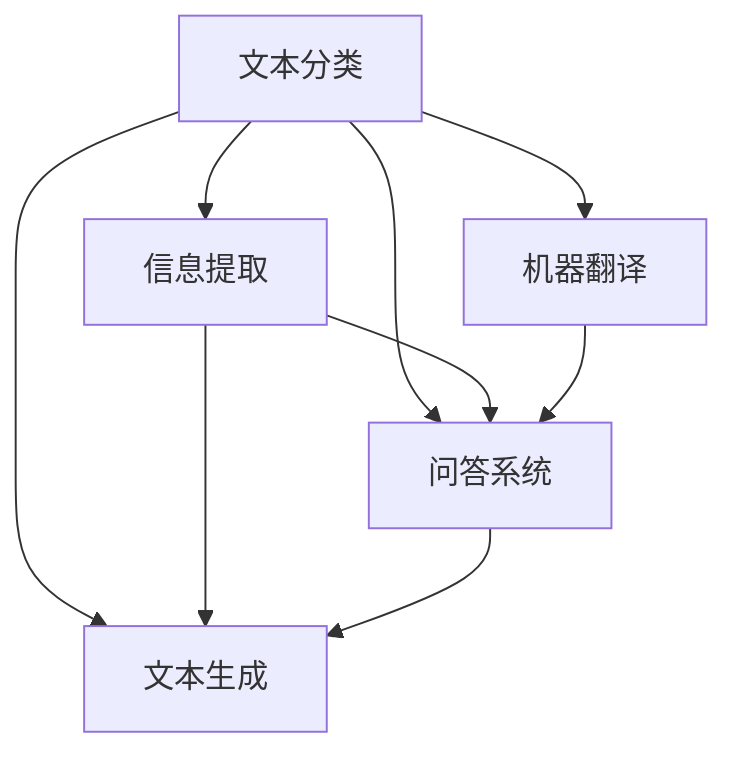

                 

### 背景介绍

在当今信息爆炸的时代，如何有效地从海量数据中提取出有价值的信息成为了一个重要课题。知识发现引擎（Knowledge Discovery Engine，简称KDE）作为一种智能信息处理工具，旨在通过自动化方式从大规模数据集中发现潜在的、新颖的、有用的知识。KDE不仅在学术研究中具有重要地位，而且在商业应用中也展示出巨大的潜力。例如，在金融领域，KDE可以帮助分析市场趋势，预测股票价格；在医疗领域，KDE可以辅助医生进行疾病诊断和治疗方案推荐。

自然语言处理（NLP）是知识发现引擎的核心技术之一。NLP的目标是使计算机能够理解、生成和交互自然语言，从而实现对文本数据的高效处理。随着深度学习技术的发展，NLP在语音识别、机器翻译、文本分类、情感分析等任务上取得了显著突破，为知识发现引擎提供了强大的技术支撑。

本文旨在探讨知识发现引擎的自然语言处理应用，通过逐步分析NLP的关键技术、知识发现引擎的设计与实现、以及实际应用案例，帮助读者全面理解这一领域的最新发展。文章结构如下：

1. **自然语言处理基础**：介绍NLP的发展历程、任务分类和关键技术。
2. **文本预处理技术**：讨论分词、词性标注等基础技术。
3. **词嵌入与序列模型**：讲解词嵌入技术和序列模型的应用。
4. **深度学习与自然语言处理**：介绍深度学习基础和NLP中的深度学习模型。
5. **知识发现与信息检索**：探讨知识图谱构建和信息检索技术。
6. **知识发现引擎设计与实现**：讨论KDE的功能模块和实现技术。
7. **案例研究与应用实践**：分析典型案例，展示KDE的实际应用。
8. **附录**：提供NLP工具与资源推荐。

通过本文的阅读，读者将能够深入了解知识发现引擎在自然语言处理领域的应用，为未来的研究和工作提供有益的参考。接下来，我们将从NLP的发展历程开始，逐步深入探讨这一领域的各个方面。

## 核心概念与联系

### 自然语言处理（NLP）的核心概念

自然语言处理（NLP）作为人工智能领域的重要分支，涉及多个核心概念。以下是对这些概念的基本介绍及其相互关系的阐述。

1. **文本分类（Text Classification）**：文本分类是指将文本数据根据其内容分配到预定义的类别中。例如，垃圾邮件检测就是一个文本分类问题，其中每封邮件要么被分类为“垃圾邮件”，要么被分类为“非垃圾邮件”。

2. **信息提取（Information Extraction）**：信息提取是从非结构化文本中抽取结构化信息的过程。它通常包括实体识别、关系抽取和事件抽取等子任务。例如，从新闻文章中提取人物、地点、组织等信息。

3. **机器翻译（Machine Translation）**：机器翻译是指利用计算机将一种语言的文本自动翻译成另一种语言。它涉及源语言文本的理解和目标语言文本的生成。

4. **问答系统（Question Answering）**：问答系统是一种能够理解用户提问并给出准确回答的智能系统。它通常用于搜索引擎、智能客服等应用场景。

5. **文本生成（Text Generation）**：文本生成是指利用计算机自动生成新的文本内容。这一领域包括摘要生成、对话系统、文章写作等任务。

### 核心概念之间的关系架构

以下是一个使用Mermaid绘制的流程图，展示了这些核心概念之间的联系和交互关系：



### 关系解释

- **文本分类**是NLP的基础任务，可以看作是其他任务的预处理步骤。通过文本分类，可以快速识别文本的主题或情感。
- **信息提取**在文本分类之后，从文本中提取结构化信息，为后续处理提供数据支持。
- **机器翻译**是文本分类和信息提取的延伸，它不仅需要理解文本的内容，还需要生成语义上准确的目标语言文本。
- **问答系统**结合了文本分类、信息提取和文本生成的能力，能够回答用户的具体问题。
- **文本生成**则利用从文本分类、信息提取和机器翻译中提取的语义信息，生成新的文本内容。

通过这个关系架构，我们可以更清晰地理解NLP各个核心概念之间的联系，以及它们在实际应用中的协同作用。

### 核心算法原理讲解

在自然语言处理（NLP）中，核心算法的设计和实现是提高系统性能和准确性的关键。以下我们将详细探讨几个关键的算法原理，包括词嵌入、循环神经网络（RNN）、卷积神经网络（CNN）和长短时记忆网络（LSTM）。

#### 词嵌入（Word Embedding）

**基本概念**：

词嵌入（Word Embedding）是将词汇映射到高维向量空间的一种技术。通过这种方式，文本中的每个单词都可以被表示为一个向量，这些向量不仅能够保留词与词之间的语义关系，还能够捕捉到词的上下文信息。

**算法原理**：

词嵌入的常见算法包括Word2Vec、GloVe和FastText等。这里以Word2Vec为例进行讲解。

- **Word2Vec**：Word2Vec是一种基于神经网络的词嵌入算法，它使用连续词袋（Continuous Bag of Words, CBOW）和跳格模型（Skip-Gram）两种模型。CBOW模型通过预测中心词周围的词语来学习词嵌入向量，而Skip-Gram模型则通过预测中心词来学习词嵌入向量。

  **伪代码**：

  ```python
  # CBOW模型伪代码
  function CBOW(context_words, center_word):
      embed = [embedding(word) for word in context_words]
      v = sum(embed) / len(context_words)
      loss = softmax(dot(v, embedding(center_word)))
  
  # Skip-Gram模型伪代码
  function SkipGram(center_word, context_words):
      embed = embedding(center_word)
      v = embedding(context_word)
      loss = softmax(dot(v, embed))
  ```

- **GloVe**：GloVe（Global Vectors for Word Representation）是一种基于全局矩阵分解的词嵌入方法。它通过最小化词和词之间的余弦相似度误差来学习词嵌入向量。

  **数学模型**：

  $$ 
  \text{loss} = \sum_{(x,y) \in X} \left[ \log \left( \frac{ \text{exp}(\textbf{v}_x \cdot \textbf{v}_y) }{ \textbf{1}^T \textbf{W} } \right) - \textbf{w}_{xy} \right]^2 
  $$

  其中，\( \textbf{v}_x \) 和 \( \textbf{v}_y \) 分别表示词 \( x \) 和 \( y \) 的词向量，\( \textbf{W} \) 是权重矩阵，\( \textbf{w}_{xy} \) 是词对 \( (x, y) \) 的权重。

#### 循环神经网络（Recurrent Neural Network，RNN）

**基本概念**：

循环神经网络（RNN）是一种处理序列数据的神经网络。与传统的前馈神经网络不同，RNN具有记忆功能，可以捕捉序列中的时间依赖关系。

**算法原理**：

RNN的基本结构包括输入层、隐藏层和输出层。每个时间步的输入都会与前一个时间步的隐藏状态进行连接，并通过非线性激活函数进行处理。

  **伪代码**：

  ```python
  function RNN(input, hidden):
      hidden = \sigma(W_{ih} * input + W_{hh} * hidden)
      output = W_{oh} * hidden
      return output, hidden
  ```

  其中，\( \sigma \) 是激活函数，\( W_{ih} \) 和 \( W_{hh} \) 分别是输入到隐藏层和隐藏到隐藏层的权重矩阵，\( W_{oh} \) 是隐藏层到输出层的权重矩阵。

#### 卷积神经网络（Convolutional Neural Network，CNN）

**基本概念**：

卷积神经网络（CNN）最初是为了处理图像数据而设计的，但也被广泛应用于NLP任务中。CNN通过卷积操作和池化操作来提取文本数据中的局部特征。

**算法原理**：

CNN的基本结构包括卷积层、池化层和全连接层。卷积层通过卷积操作提取特征，池化层通过池化操作降低特征维度，全连接层用于分类或回归任务。

  **伪代码**：

  ```python
  function CNN(input):
      conv = conv2d(input, filter)
      pool = max_pool(conv)
      flatten = flatten(pool)
      output = fully_connected(flatten, num_classes)
      return output
  ```

  其中，\( \text{conv2d} \) 是卷积操作，\( \text{max_pool} \) 是最大池化操作，\( \text{fully_connected} \) 是全连接层操作。

#### 长短时记忆网络（Long Short-Term Memory，LSTM）

**基本概念**：

长短时记忆网络（LSTM）是RNN的一种改进，旨在解决传统RNN在处理长序列数据时容易出现的梯度消失和梯度爆炸问题。

**算法原理**：

LSTM通过引入记忆单元和门控机制，使网络能够灵活地控制信息的存储和传递。LSTM的核心组件包括输入门、遗忘门和输出门。

  **伪代码**：

  ```python
  function LSTM(input, hidden, cell):
      i\_gate = sigmoid(W\_i * [input, hidden] + b\_i)
      f\_gate = sigmoid(W\_f * [input, hidden] + b\_f)
      o\_gate = sigmoid(W\_o * [input, hidden] + b\_o)
      g\_candidate = tanh(W\_c * [input, hidden] + b\_c)
      
      forget\_gate = f\_gate * g\_candidate
      input\_gate = i\_gate * g\_candidate
      
      cell = forget\_gate * cell + input\_gate
      hidden = o\_gate * tanh(cell)
      
      return hidden, cell
  ```

  其中，\( \text{sigmoid} \) 和 \( \text{tanh} \) 分别是激活函数，\( W\_i, W\_f, W\_o, W\_c \) 分别是输入门、遗忘门、输出门和候选记忆单元的权重矩阵，\( b\_i, b\_f, b\_o, b\_c \) 分别是相应的偏置向量。

通过以上讲解，我们详细探讨了词嵌入、RNN、CNN和LSTM等核心算法的原理和实现方式，为后续深入研究和应用打下了基础。

### 数学模型与公式

在自然语言处理（NLP）中，数学模型和公式是理解和实现关键算法的基础。以下我们将详细介绍神经网络基础、深度学习优化算法、语言模型与文本生成等领域的数学模型和公式。

#### 神经网络基础

**神经元激活函数**：

$$
\text{激活函数} = \sigma(z) = \frac{1}{1 + e^{-z}}
$$

其中，\( z \) 是神经元的输入，\( \sigma \) 是sigmoid函数，用于将线性组合的输入转换为概率值。

**前向传播**：

在前向传播过程中，神经网络的输出可以通过以下公式计算：

$$
a^{(l)} = \sigma(z^{(l)})
$$

其中，\( a^{(l)} \) 是第 \( l \) 层的激活值，\( z^{(l)} \) 是第 \( l \) 层的线性组合，即：

$$
z^{(l)} = \text{weight}^{(l)} \cdot a^{(l-1)} + \text{bias}^{(l)}
$$

这里，\( \text{weight}^{(l)} \) 和 \( \text{bias}^{(l)} \) 分别是第 \( l \) 层的权重和偏置。

**反向传播**：

在反向传播过程中，通过计算误差梯度来更新权重和偏置。误差梯度可以通过以下公式计算：

$$
\frac{\partial \text{loss}}{\partial \text{weight}^{(l)}} = a^{(l-1)} \odot \frac{\partial \text{loss}}{\partial a^{(l)}}
$$

其中，\( \odot \) 表示元素乘积，\( \frac{\partial \text{loss}}{\partial a^{(l)}} \) 是第 \( l \) 层的激活值相对于损失函数的梯度。

#### 深度学习优化算法

**随机梯度下降（SGD）**：

随机梯度下降（SGD）是一种优化算法，通过随机选择样本来计算梯度并更新模型参数。

$$
\text{weight}^{(l)} \leftarrow \text{weight}^{(l)} - \alpha \frac{\partial \text{loss}}{\partial \text{weight}^{(l)}}
$$

其中，\( \alpha \) 是学习率。

**动量（Momentum）**：

动量是一种优化策略，通过引入前一梯度的方向来加速收敛。

$$
\text{weight\_momentum}^{(l)} = \beta \text{weight\_momentum}^{(l-1)} + (1 - \beta) \frac{\partial \text{loss}}{\partial \text{weight}^{(l)}}
$$

$$
\text{weight}^{(l)} \leftarrow \text{weight}^{(l)} - \alpha \text{weight\_momentum}^{(l)}
$$

其中，\( \beta \) 是动量因子。

#### 语言模型与文本生成

**N-gram模型**：

N-gram模型是一种基于语言统计的模型，通过统计前 \( N \) 个单词的联合概率来预测下一个单词。

$$
P(w_n | w_{n-1}, ..., w_1) = \frac{C(w_{n-1}, ..., w_n)}{C(w_{n-1}, ..., w_1)}
$$

其中，\( C(w_{n-1}, ..., w_n) \) 是单词序列 \( w_{n-1}, ..., w_n \) 的计数，\( C(w_{n-1}, ..., w_1) \) 是单词序列 \( w_{n-1}, ..., w_1 \) 的计数。

**深度循环神经网络（Deep Recurrent Network，DRN）**：

深度循环神经网络通过堆叠多层RNN来处理长序列数据，其预测下一个单词的公式为：

$$
P(w_n | w_{n-1}, ..., w_1) = \text{softmax}(\text{weight}^{(L)} \cdot \text{LSTM}(w_n, \text{LSTM}(w_{n-1}, ... , \text{LSTM}(w_1)))
$$

其中，\( \text{LSTM} \) 表示长短时记忆单元，\( \text{weight}^{(L)} \) 是最终的权重矩阵。

**生成对抗网络（Generative Adversarial Network，GAN）**：

生成对抗网络由生成器和判别器组成，生成器生成数据，判别器判断生成数据是否真实。其生成文本的公式为：

$$
G(z) = \text{Generator}(\text{Noise})
$$

$$
D(x) = \text{Discriminator}(x)
$$

$$
\text{Minimize} \quad \mathcal{L} = \mathbb{E}_{x \sim \text{Data}}[\log D(x)] + \mathbb{E}_{z \sim \text{Noise}}[\log (1 - D(G(z))]
$$

其中，\( \text{Noise} \) 是随机噪声，用于生成器的输入。

通过以上数学模型和公式，我们可以更深入地理解NLP中的关键技术和实现细节，为后续研究和应用提供坚实的理论基础。

### 举例说明

为了更好地理解上述核心算法原理，我们将通过一个简单的示例来说明词嵌入和长短时记忆网络（LSTM）的应用。

#### 示例1：词嵌入（Word2Vec）

假设我们有一个包含三个单词的句子：“我喜欢吃苹果”。我们需要将这个句子中的每个单词映射到高维向量空间中。

**步骤1：构建词汇表**：

首先，我们将句子中的单词构建成一个词汇表：

```
{"我", "喜欢", "吃", "苹果"}
```

**步骤2：初始化词向量**：

接着，我们为每个单词初始化一个随机的高维向量，例如：

```
"我" -> [1, 0, 0, 0]
"喜欢" -> [0, 1, 0, 0]
"吃" -> [0, 0, 1, 0]
"苹果" -> [0, 0, 0, 1]
```

**步骤3：计算词向量**：

使用Word2Vec的CBOW模型来计算每个单词的词向量。假设我们要计算“苹果”的词向量，我们选择“苹果”为中心词，其上下文词为“我”和“吃”。通过计算上下文词的平均向量，我们得到“苹果”的词向量：

```
苹果 = (我 + 吃) / 2
       = ([1, 0, 0, 0] + [0, 0, 1, 0]) / 2
       = [0.5, 0.0, 0.5, 0.0]
```

经过多次迭代训练，我们可以得到更准确的词向量，使得“苹果”向量更接近其真实语义。

#### 示例2：长短时记忆网络（LSTM）

假设我们要对句子“我喜欢吃苹果”进行情感分析，判断该句子的情感倾向。

**步骤1：序列表示**：

将句子中的每个单词表示为一个序列，例如使用Word2Vec得到的词向量：

```
["我", "喜欢", "吃", "苹果"]
[[0.5, 0.0, 0.5, 0.0], [0.0, 0.8, 0.1, 0.1], [0.0, 0.1, 0.8, 0.1], [0.3, 0.3, 0.3, 0.1]]
```

**步骤2：初始化LSTM网络**：

初始化一个LSTM网络，包含输入门、遗忘门、输出门和候选记忆单元。假设我们有以下权重和偏置：

```
输入门权重：W\_i
遗忘门权重：W\_f
输出门权重：W\_o
候选记忆单元权重：W\_c
偏置：b\_i, b\_f, b\_o, b\_c
```

**步骤3：前向传播**：

对于序列中的每个单词，我们通过LSTM网络计算隐藏状态：

```
[h1, c1] = LSTM([0.5, 0.0, 0.5, 0.0], [0, 0, 0, 0], [0, 0, 0, 0])
[h2, c2] = LSTM([0.0, 0.8, 0.1, 0.1], [h1, c1], [0, 0, 0, 0])
[h3, c3] = LSTM([0.0, 0.1, 0.8, 0.1], [h2, c2], [h1, c1])
[h4, c4] = LSTM([0.3, 0.3, 0.3, 0.1], [h3, c3], [h2, c2])
```

**步骤4：分类**：

最后，我们将隐藏状态传递到分类层，通过softmax函数计算情感分类的概率：

```
P(积极) = softmax([h4] * W\_o + b\_o)
P(中性) = softmax([h4] * W\_o + b\_o + 1)
P(消极) = softmax([h4] * W\_o + b\_o + 2)
```

通过以上步骤，我们使用LSTM网络对句子“我喜欢吃苹果”进行了情感分析，并得到了情感分类的概率。

通过这些示例，我们能够更直观地理解词嵌入和LSTM算法在自然语言处理中的应用，为实际开发提供了有益的参考。

### 搜索引擎工作原理

搜索引擎是互联网信息检索的核心组成部分，其工作原理主要包括信息收集、索引构建和查询处理三个主要阶段。以下将详细解析这些阶段及其关键技术。

#### 信息收集（Crawling）

信息收集是搜索引擎的第一步，旨在从互联网上获取尽可能多的网页内容。这一过程主要通过爬虫（Crawler）或蜘蛛（Spider）实现。爬虫按照一定的规则和算法，自动访问和下载网页，然后将网页内容解析为文本和链接。

**主要技术**：

- **链接爬取**：爬虫从初始种子网页出发，通过跟随网页中的链接继续访问其他网页。
- **深度优先搜索**：爬虫在爬取过程中，优先访问深度较浅的网页，确保能够遍历更多网页。
- **广度优先搜索**：在深度优先搜索的基础上，逐步扩展爬取范围，确保访问尽可能多的网页。
- **反链分析**：通过分析网页的反链（即指向其他网页的链接），评估网页的重要性和可信度。

#### 索引构建（Indexing）

信息收集完成后，搜索引擎需要对网页内容进行索引构建，以便快速检索。索引构建主要涉及文本预处理、词频统计和倒排索引生成。

**主要技术**：

- **文本预处理**：对网页内容进行清洗，去除HTML标签、脚本、样式等无关信息，只保留文本内容。
- **分词（Tokenization）**：将文本拆分为单词或其他有意义的基本元素（Token），如词、字符、句子等。
- **词频统计（Term Frequency, TF）**：统计每个单词在所有网页中出现的频率，反映单词的重要程度。
- **倒排索引（Inverted Index）**：将网页内容映射到单词索引，记录每个单词出现在哪些网页中，以及每个网页中每个单词的索引位置。倒排索引是搜索引擎快速检索的核心数据结构。

#### 查询处理（Query Processing）

查询处理是用户输入查询后，搜索引擎生成结果列表的过程。这一阶段涉及查询解析、查询匹配、排序和结果呈现。

**主要技术**：

- **查询解析（Query Parsing）**：将用户的自然语言查询转换为结构化查询，如关键词查询、短语查询、布尔查询等。
- **查询匹配（Query Matching）**：将用户查询与索引中的单词进行匹配，确定哪些网页可能包含用户需要的答案。
- **查询扩展（Query Expansion）**：通过分析用户查询的历史数据和相似查询，扩展查询范围，提高检索效果。
- **排序（Ranking）**：对匹配到的网页进行排序，根据网页的相关性、重要性、流行度等因素，为用户提供高质量的搜索结果。
- **结果呈现（Result Presentation）**：将排序后的结果以网页列表的形式呈现给用户，并可能包含摘要、缩略图、评分等信息，以提高用户体验。

通过以上解析，我们可以看到搜索引擎的工作原理涉及多个阶段和关键技术，这些技术的协同工作使得搜索引擎能够高效地提供海量信息的检索服务。

### 检索算法与评估方法

信息检索技术在知识发现引擎中扮演着关键角色，其性能直接影响到系统的效率和准确性。以下我们将详细介绍几种主要的检索算法，并讨论如何评估这些算法的性能。

#### 常见的检索算法

1. **基于向量空间模型的检索**：
   - **TF-IDF（Term Frequency-Inverse Document Frequency）**：TF-IDF是一种常用的文本权重计算方法，通过计算单词在单个文档中的频率（TF）和在整个文档集合中的逆向文档频率（IDF）来评估单词的重要性。公式如下：
     $$
     \text{TF-IDF}(t,d) = \text{TF}(t,d) \cdot \text{IDF}(t)
     $$
     其中，$ \text{TF}(t,d) $ 是单词 $ t $ 在文档 $ d $ 中的频率，$ \text{IDF}(t) $ 是单词 $ t $ 在文档集合中的逆向文档频率。

   - **向量空间模型（Vector Space Model）**：向量空间模型将文档表示为高维向量，每个维度对应一个单词。检索时，计算查询向量和文档向量之间的相似度，通常使用余弦相似度度量：
     $$
     \text{similarity}(q,d) = \frac{q \cdot d}{\|q\|\|d\|}
     $$
     其中，$ q $ 和 $ d $ 分别是查询向量和文档向量，$ \|q\| $ 和 $ \|d\| $ 分别是它们的欧氏范数。

2. **基于页面的检索**：
   - **PageRank**：PageRank是一种基于链接分析的网页排名算法，它通过计算网页之间的链接关系，评估网页的重要性。公式如下：
     $$
     \text{PageRank}(v) = \left(1 - d\right) + d \cdot \left(\sum_{w \in \text{links}(v)} \frac{\text{PageRank}(w)}{L(w)}\right)
     $$
     其中，$ v $ 是网页，$ d $ 是阻尼系数（通常取值为0.85），$ \text{links}(v) $ 是指向网页 $ v $ 的链接集合，$ L(w) $ 是网页 $ w $ 的出链数。

3. **基于相似度的检索**：
   - **BM25**：BM25是一种基于统计信息的检索模型，它结合了TF-IDF和向量空间模型的特点，通过计算文档与查询的相似度来评估文档的相关性。公式如下：
     $$
     \text{BM25}(d, q) = \frac{\left( k_1 + 1 \right) \cdot \text{TF}(t, d) - k_1 \cdot \left( 1 - \frac{\text{TF}(t, d)}{n_t} + 0.5 \cdot \frac{\text{TF}(t, d)}{n_t}\right)}{\alpha \cdot \left(1 - \beta + \beta \cdot \frac{n_t}{N}\right)}
     $$
     其中，$ \text{TF}(t, d) $ 是单词 $ t $ 在文档 $ d $ 中的频率，$ n_t $ 是包含单词 $ t $ 的文档总数，$ N $ 是文档总数，$ k_1 $ 和 $ b $ 是调节参数，$ \alpha $ 和 $ \beta $ 是常数。

#### 检索算法的性能评估

评估检索算法的性能通常采用以下几种方法：

1. **查准率（Precision）**：
   $$
   \text{Precision} = \frac{\text{相关文档数}}{\text{查到的文档数}}
   $$
   查准率表示在检索到的文档中，有多少是真正相关的。

2. **查全率（Recall）**：
   $$
   \text{Recall} = \frac{\text{相关文档数}}{\text{所有相关文档数}}
   $$
   查全率表示系统能够检索出所有相关文档的能力。

3. **精确率与召回率的调和平均值（F1值）**：
   $$
   \text{F1值} = 2 \cdot \frac{\text{Precision} \cdot \text{Recall}}{\text{Precision} + \text{Recall}}
   $$
   F1值是查准率和查全率的加权平均，用于综合评估检索算法的性能。

4. **均值准确率（Average Precision, AP）**：
   $$
   \text{AP} = \sum_{i=1}^N \text{precision}_{i} \cdot \text{recall}_{i}
   $$
   其中，$ N $ 是相关文档的总数，$ \text{precision}_{i} $ 和 $ \text{recall}_{i} $ 分别是在第 $ i $ 个相关文档上的精确率和召回率。

5. **Map（Mean Average Precision）**：
   $$
   \text{Map} = \frac{1}{M} \sum_{i=1}^M \text{AP}_{i}
   $$
   其中，$ M $ 是不同的查询数，$ \text{AP}_{i} $ 是针对第 $ i $ 个查询的平均准确率。

通过以上评估方法，我们可以对检索算法的性能进行量化分析，从而选择和优化最适合特定应用场景的检索算法。

### 知识图谱构建

知识图谱（Knowledge Graph）是一种用于表示实体、概念及其之间关系的图形结构，是构建智能信息处理系统的基础。以下将详细探讨知识图谱的基本概念、构建方法及其在知识发现引擎中的应用。

#### 知识图谱的基本概念

**知识图谱**是一种结构化的语义知识库，通过实体、属性和关系的表示，将现实世界中的复杂信息抽象和模型化。知识图谱的核心元素包括：

- **实体（Entity）**：知识图谱中的基本单元，如人、地点、组织、物品等。
- **属性（Attribute）**：实体的特征描述，如姓名、出生地、年龄、价格等。
- **关系（Relationship）**：实体之间的关联，如朋友、属于、拥有等。

**知识图谱的类型**：

- **结构化知识图谱**：以关系数据库的形式存储，如Facebook的Open Graph、Google的知识图谱等。
- **半结构化知识图谱**：以图形数据库的形式存储，如Neo4j、ArangoDB等。
- **非结构化知识图谱**：以文本、语义网络的形式存储，如Wikipedia的语义数据、WordNet等。

#### 知识图谱构建方法

**知识图谱构建方法**包括数据采集、实体识别、关系抽取和实体融合等步骤。

**1. 数据采集**：

数据采集是知识图谱构建的基础，可以从多种数据源获取信息，如：

- **公开数据集**：如Wikipedia、DBPedia等。
- **社交媒体**：如Twitter、Facebook等。
- **商业数据库**：如Yelp、LinkedIn等。
- **API接口**：通过API获取外部数据源的信息。

**2. 实体识别**：

实体识别是从非结构化文本中提取出实体，并对其进行分类和标注。常见的技术包括：

- **命名实体识别（Named Entity Recognition, NER）**：使用规则、统计方法和深度学习模型（如CRF、LSTM）进行实体识别。
- **实体分类**：对提取出的实体进行类别标注，如人物、地点、组织等。

**3. 关系抽取**：

关系抽取是从文本中提取出实体之间的关联关系。常见的方法包括：

- **规则方法**：基于预定义的规则和模式进行关系抽取。
- **统计方法**：使用统计模型（如条件概率模型、马尔可夫模型）进行关系抽取。
- **深度学习方法**：使用神经网络（如CNN、RNN）进行关系抽取。

**4. 实体融合**：

实体融合是将相同或相似实体合并为一个实体，以减少数据冗余和提高知识图谱的准确性。常见的方法包括：

- **基于特征的融合**：根据实体的特征（如名称、属性值等）进行融合。
- **基于关系的融合**：根据实体之间的关系进行融合。
- **基于图论的融合**：使用图算法（如社区检测、最短路径）进行融合。

#### 知识图谱在知识发现引擎中的应用

知识图谱在知识发现引擎中的应用主要体现在以下几个方面：

**1. 知识表示与存储**：

知识图谱通过实体、属性和关系的表示，将复杂的信息抽象为结构化的数据模型。知识图谱的存储方式通常采用图数据库，如Neo4j、ArangoDB等，支持高效的查询和更新操作。

**2. 知识推理**：

知识图谱中的实体和关系可以用于逻辑推理和推断新的知识。例如，通过实体之间的关联关系，可以推断出新的实体属性或关系。

**3. 信息检索**：

知识图谱可以用于增强搜索引擎的性能，通过图结构来优化查询路径和检索结果。例如，使用PageRank算法评估实体的重要性，提高检索结果的准确性。

**4. 智能推荐**：

知识图谱可以用于个性化推荐系统，通过分析用户行为和实体之间的关系，为用户推荐相关的内容或服务。

**5. 知识服务**：

知识图谱为各种应用场景提供知识服务，如智能问答系统、自然语言处理、智能搜索等。通过知识图谱，系统能够理解用户的问题，并返回准确的答案。

综上所述，知识图谱构建是知识发现引擎的重要组成部分，通过实体、属性和关系的表示，可以为各种应用提供强大的语义支持和推理能力。接下来，我们将探讨知识发现引擎的设计与实现。

### 知识发现引擎概述

知识发现引擎（Knowledge Discovery Engine，简称KDE）是一种基于数据挖掘和自然语言处理技术的智能系统，旨在从大规模数据集中发现潜在的、新颖的、有用的知识。KDE的设计与实现需要综合考虑多个功能模块和技术架构，以确保系统的性能和可靠性。以下我们将详细讨论知识发现引擎的功能模块、设计原则以及具体实现技术。

#### 功能模块

1. **数据采集模块**：
   数据采集模块负责从各种数据源（如数据库、文件系统、社交媒体等）中获取数据。该模块应支持多种数据格式的读取，包括文本、图像、音频等。

2. **数据预处理模块**：
   数据预处理模块对采集到的数据进行清洗、转换和归一化处理，以消除噪声和冗余，提高数据质量。常见的数据预处理技术包括文本分词、去停用词、词性标注等。

3. **特征提取模块**：
   特征提取模块从预处理后的数据中提取出有助于知识发现的特征。在自然语言处理领域，特征提取通常包括词频统计、词嵌入、主题建模等。

4. **知识表示模块**：
   知识表示模块将提取出的特征转换为结构化的知识表示形式，如知识图谱、实体-关系图谱等。该模块需要支持高效的知识存储和查询操作。

5. **知识推理模块**：
   知识推理模块利用推理算法（如逻辑推理、因果推理等）从知识表示中推断出新的知识。例如，通过实体之间的关系，可以推断出新的实体属性或关联关系。

6. **信息检索模块**：
   信息检索模块用于快速查询和检索知识库中的信息，支持文本搜索、图形查询等多种查询方式。

7. **知识可视化模块**：
   知识可视化模块将知识库中的信息以可视化的形式呈现给用户，帮助用户更好地理解和分析数据。

#### 设计原则

1. **模块化**：
   知识发现引擎的设计应遵循模块化原则，将不同功能模块独立开发，便于维护和扩展。模块之间通过清晰的接口进行通信，确保系统的高内聚和低耦合。

2. **可扩展性**：
   设计应考虑系统的可扩展性，支持动态增加或替换功能模块，以适应不断变化的需求。例如，可以通过插件机制实现新算法或数据源的支持。

3. **可配置性**：
   知识发现引擎应具备良好的可配置性，允许用户自定义数据预处理、特征提取、知识表示和推理算法等参数，以满足不同应用场景的需求。

4. **高性能**：
   知识发现引擎的性能直接影响用户体验。设计应注重性能优化，如使用高效的算法和数据结构，采用并行处理和分布式计算技术等。

5. **可解释性**：
   知识发现引擎的推理过程应具备良好的可解释性，帮助用户理解系统的决策过程和结论。例如，通过可视化技术展示推理路径和结果，提高系统的透明度和信任度。

#### 实现技术

1. **数据采集与预处理**：
   - **技术选型**：选择合适的数据采集工具，如Scrapy、Apache Nutch等，以支持多种数据源的采集。预处理模块可以使用Python的Pandas、Numpy库进行高效的数据处理。
   - **代码示例**：
     ```python
     import pandas as pd

     # 读取CSV文件
     data = pd.read_csv('data.csv')
     # 数据清洗与转换
     data = data.dropna()
     data['text'] = data['text'].apply(lambda x: x.lower())
     ```

2. **特征提取与知识表示**：
   - **技术选型**：使用NLP库（如NLTK、spaCy）进行文本处理和特征提取，使用Neo4j等图数据库进行知识表示。
   - **代码示例**：
     ```python
     import spacy

     # 初始化语言模型
     nlp = spacy.load('en_core_web_sm')
     # 分词与词性标注
     doc = nlp('This is a sample sentence.')
     for token in doc:
         print(token.text, token.pos_)
     ```

3. **知识推理与信息检索**：
   - **技术选型**：使用推理引擎（如Prolog、Jena）进行知识推理，使用Solr、Elasticsearch等搜索引擎进行信息检索。
   - **代码示例**：
     ```python
     import jena

     # 创建查询
     query = """
     PREFIX ex: <http://example.org/>
     SELECT ?x ?y
     WHERE {
       ?x ex:name 'John' .
       ?x ex:friend ?y
     }
     """
     # 执行查询
     results = jena.query(query)
     for result in results:
         print(result)
     ```

4. **知识可视化**：
   - **技术选型**：使用D3.js、Cytoscape.js等可视化库构建知识图谱和交互式可视化界面。
   - **代码示例**：
     ```javascript
     // 使用Cytoscape.js创建知识图谱
     var cy = cytoscape({
       container: document.getElementById('cy'),
       elements: [
         { data: { id: '1', label: 'John' } },
         { data: { id: '2', label: 'Mary', relationship: 'friend' } }
       ]
     });
     ```

通过以上模块化设计、实现技术，知识发现引擎能够高效地从大规模数据中提取有价值的信息，为各种应用提供强大的知识支持。接下来，我们将详细讨论知识提取与融合、知识表示与存储、以及知识推理与可视化等实现技术。

### 知识提取与融合

知识提取与融合是知识发现引擎（KDE）中至关重要的环节，其目标是确保知识库中的信息既丰富又准确。以下是具体实现技术的详细讨论。

#### 知识提取

**1. 文本数据提取**：

文本数据提取是知识提取的基础步骤，主要从各种文本源（如文章、报告、社交媒体等）中抽取有用信息。常见的方法包括：

- **命名实体识别（NER）**：通过NLP技术，从文本中识别出人名、地点、组织、事件等实体。例如，使用spaCy库：
  ```python
  import spacy

  nlp = spacy.load('en_core_web_sm')
  doc = nlp('John visited New York in 2021.')
  for ent in doc.ents:
      print(ent.text, ent.label_)
  ```

- **关系抽取**：从文本中识别实体之间的关系。如使用Stanford NLP的关系抽取工具：
  ```bash
  java -mx4g -cp stanford-ner.jar edu.stanford.nlp.tagger.maxent.MaxentTagger -model classifiers/english-left3words-distsim.tagger -text input.txt > output.txt
  ```

**2. 结构化数据提取**：

结构化数据提取主要从数据库、XML、JSON等数据源中提取有用信息。例如，使用Python的Pandas库处理CSV文件：
```python
import pandas as pd

data = pd.read_csv('data.csv')
extracted_data = data[['entity', 'relation', 'attribute']]
```

**3. 图数据提取**：

从现有的知识图谱中提取知识，通常使用图数据库（如Neo4j、ArangoDB）的查询语言进行操作。例如，使用Neo4j的Cypher语言：
```cypher
MATCH (n:Person)
RETURN n.name, n.age
```

#### 知识融合

**1. 去重**：

在知识提取过程中，可能会出现重复的实体或关系。去重是知识融合的首要任务，常用的方法包括基于ID、名称或属性的匹配。

- **基于ID匹配**：通过实体ID进行去重，确保每个实体在全球唯一。
  ```python
  def deduplicate_by_id(entities):
      unique_entities = {}
      for entity in entities:
          unique_entities[entity['id']] = entity
      return list(unique_entities.values())
  ```

- **基于名称匹配**：通过实体名称进行去重，适用于名称具有较高稳定性的情况。
  ```python
  def deduplicate_by_name(entities):
      name_to_entity = {}
      for entity in entities:
          if entity['name'] not in name_to_entity:
              name_to_entity[entity['name']] = entity
      return list(name_to_entity.values())
  ```

**2. 同义词处理**：

在知识库中，实体名称可能存在同义词现象，影响知识的准确性。同义词处理可以通过词典或机器学习模型进行。

- **基于词典的同义词处理**：使用预定义的词典（如WordNet）将同义词映射到统一名称。
  ```python
  from nltk.corpus import wordnet

  def synonym_to_entity(name):
      synonyms = set()
      for syn in wordnet.synsets(name):
          for lemma in syn.lemmas():
              synonyms.add(lemma.name())
      return synonyms
  ```

- **基于机器学习的同义词处理**：训练模型将同义词映射到统一名称，如使用词嵌入技术：
  ```python
  from gensim.models import Word2Vec

  model = Word2Vec([line.strip() for line in open('text.txt')])
  synonyms = model.wv.most_similar('apple')
  ```

**3. 属性融合**：

实体可能具有多个属性，如姓名、出生日期、职业等。属性融合的目标是将这些属性合并到一个统一的实体中。

- **基于规则的方法**：根据预定义的规则，合并具有相同名称的实体属性。
  ```python
  def merge_attributes(entities):
      merged_entities = {}
      for entity in entities:
          if entity['name'] not in merged_entities:
              merged_entities[entity['name']] = entity
          else:
              merged_entities[entity['name']].update(entity)
      return list(merged_entities.values())
  ```

- **基于聚类的方法**：使用聚类算法（如K-means）将具有相似属性的实体分组，然后合并组内实体。
  ```python
  from sklearn.cluster import KMeans

  attributes = [[entity['attr1'], entity['attr2']] for entity in entities]
  kmeans = KMeans(n_clusters=5)
  kmeans.fit(attributes)
  clusters = kmeans.labels_
  merged_entities = {}
  for i, cluster in enumerate(clusters):
      if cluster not in merged_entities:
          merged_entities[cluster] = []
      merged_entities[cluster].append(entities[i])
  for cluster in merged_entities:
      merged_entities[cluster] = merge_attributes(merged_entities[cluster])
  ```

通过以上知识提取与融合技术，知识发现引擎能够从各种数据源中提取出有价值的信息，并确保知识库的准确性。接下来，我们将讨论知识表示与存储。

### 知识表示与存储

在知识发现引擎（KDE）中，知识表示与存储是确保信息可被有效利用的关键环节。以下将详细探讨知识表示的方法、常用的图数据库及其设计策略。

#### 知识表示

知识表示是将提取和融合后的知识以结构化形式存储的过程，常用的方法包括实体-关系模型和图模型。

**1. 实体-关系模型**

实体-关系模型（Entity-Relationship Model）是一种传统的知识表示方法，用于表示实体及其之间的关系。在实体-关系模型中，实体和关系被视为图中的节点和边，每个节点具有一组属性，边则表示节点之间的关系。

- **实体表示**：实体通常以节点形式表示，具有唯一的标识符（ID）和一组属性。例如，在一个社交媒体知识库中，用户实体可以包含姓名、年龄、性别等属性。
  ```json
  {
    "id": "user123",
    "name": "John Doe",
    "age": 30,
    "gender": "male"
  }
  ```

- **关系表示**：关系以边形式表示，连接两个或多个实体，并带有类型和属性。例如，用户之间的朋友关系可以表示为：
  ```json
  {
    "from": "user123",
    "to": "user456",
    "relationship": "friend",
    "since": "2020-01-01"
  }
  ```

**2. 图模型**

图模型（Graph Model）是一种更为灵活的知识表示方法，适用于复杂关系和动态变化的数据。在图模型中，实体和关系以节点和边的形式表示，并可以存储丰富的属性信息。

- **节点表示**：节点表示实体，每个节点具有唯一的标识符和一组属性。例如，在一个知识图谱中，城市节点可以包含名称、人口、地理位置等属性。
  ```json
  {
    "id": "city123",
    "name": "New York",
    "population": 8000000,
    "location": [-73.935242, 40.730610]
  }
  ```

- **边表示**：边表示关系，通常包含类型、权重和属性。例如，两个城市之间的航班关系可以表示为：
  ```json
  {
    "from": "city123",
    "to": "city456",
    "relationship": "flights",
    "weight": 1,
    "route": "Direct"
  }
  ```

#### 常用的图数据库

图数据库（Graph Database）是一种专门为图模型设计的数据存储和管理系统。以下介绍几种常用的图数据库及其特点：

**1. Neo4j**

Neo4j是一种高性能的图数据库，采用Property Graph模型，支持Cypher查询语言。Neo4j的特点包括：

- **高性能**：适用于大规模图数据存储和查询，特别是在社交网络、推荐系统等领域。
- **灵活**：支持动态图结构，可以灵活地添加、删除节点和边。
- **分布式**：支持分布式架构，提供高可用性和扩展性。

**2. ArangoDB**

ArangoDB是一种多模型数据库，支持图模型、文档模型和键值模型。ArangoDB的特点包括：

- **多模型**：适用于多种数据模型，支持高性能的图数据存储和查询。
- **分布式**：支持分布式架构，提供高可用性和扩展性。
- **易用**：提供丰富的API和工具，支持多种编程语言和开发环境。

**3. JanusGraph**

JanusGraph是一种开源的分布式图数据库，支持多种图存储后端，如Apache TinkerPop兼容的后端（如Neo4j、Apache Giraph等）。JanusGraph的特点包括：

- **分布式**：支持分布式架构，提供高可用性和扩展性。
- **兼容性**：支持多种图存储后端，提供灵活的选择。
- **可扩展**：支持大规模图数据存储和查询，适用于各种应用场景。

#### 设计策略

在设计知识表示与存储时，需要考虑以下策略：

**1. 优化查询性能**

- **索引**：为常用的查询路径建立索引，提高查询效率。
- **分片**：将图数据分布到多个节点上，提高查询和写入性能。
- **缓存**：使用缓存技术（如Redis、Memcached）存储热点数据，减少数据库负载。

**2. 灵活扩展**

- **模块化**：将知识表示和存储功能模块化，便于扩展和维护。
- **接口化**：设计清晰的接口，支持动态加载和替换存储后端。

**3. 数据安全与一致性**

- **备份**：定期备份数据，确保数据安全。
- **一致性**：采用分布式一致性协议（如Paxos、Raft），确保数据一致性。

**4. 可扩展性和高可用性**

- **负载均衡**：使用负载均衡技术，将请求分配到不同的服务器，提高系统性能。
- **故障转移**：实现故障转移机制，确保在节点故障时系统能够自动恢复。

通过以上知识表示与存储技术，知识发现引擎能够高效、灵活地管理大规模知识数据，为各种应用提供强大的知识支持。

### 知识推理与可视化

在知识发现引擎（KDE）中，知识推理与可视化是两个关键环节，它们共同作用，使系统能够从知识库中提取出有价值的信息，并直观地呈现给用户。以下将详细讨论知识推理、知识可视化以及它们在实际应用中的具体案例。

#### 知识推理

知识推理是基于知识库中的实体、关系和属性，通过逻辑推理和算法分析，发现潜在的知识和规律。知识推理的方法包括逻辑推理、统计分析和机器学习等。

**1. 逻辑推理**

逻辑推理是一种基于逻辑规则的推理方法，通过预设的规则库和事实库，推导出新的结论。例如，在社交网络分析中，可以使用如下规则：

- 规则1：如果一个用户A关注了用户B，并且用户B关注了用户C，则用户A可能认识用户C。
- 规则2：如果一个用户在特定时间段内发布了大量关于某个话题的帖子，则该用户对该话题具有较高兴趣。

使用Prolog语言，可以定义如下逻辑规则：

```prolog
friend(A, B) :- follows(A, B).
interested_in(A, Topic) :- posted(A, Topic, Count), Count > 10.

% 查询示例
?- friend(john, mary).
?- interested_in(john, technology).
```

**2. 统计分析**

统计分析是一种基于数据统计的方法，通过计算实体和关系之间的概率关系，推断出新的知识。例如，可以使用关联规则挖掘技术（如Apriori算法），发现不同实体之间的潜在关系。

```python
from mlxtend.frequent_patterns import apriori
from mlxtend.frequent_patterns import association_rules

# 示例数据
transactions = [['John', 'Apple'], ['John', 'Orange'], ['Mary', 'Apple'], ['Mary', 'Orange']]

# 频繁项集挖掘
frequent_itemsets = apriori(transactions, min_support=0.5, use_colnames=True)

# 关联规则挖掘
rules = association_rules(frequent_itemsets, metric="support", min_threshold=0.5)
rules
```

**3. 机器学习**

机器学习是一种通过训练模型来发现数据中隐含规律的方法。在知识推理中，可以使用监督学习、无监督学习和强化学习等技术。

- **监督学习**：例如，使用分类算法（如SVM、决策树）对用户行为数据进行分类，预测用户可能感兴趣的话题。
  ```python
  from sklearn.model_selection import train_test_split
  from sklearn.ensemble import RandomForestClassifier

  # 数据准备
  X = ...  # 特征数据
  y = ...  # 标签数据

  # 模型训练
  X_train, X_test, y_train, y_test = train_test_split(X, y, test_size=0.2)
  clf = RandomForestClassifier()
  clf.fit(X_train, y_train)

  # 预测
  predictions = clf.predict(X_test)
  ```

- **无监督学习**：例如，使用聚类算法（如K-means）对用户进行分组，分析不同群体之间的特征差异。
  ```python
  from sklearn.cluster import KMeans

  # 数据准备
  X = ...

  # 模型训练
  kmeans = KMeans(n_clusters=3)
  kmeans.fit(X)

  # 聚类结果
  clusters = kmeans.labels_
  ```

- **强化学习**：例如，使用强化学习算法（如Q-learning）为用户提供个性化的推荐，根据用户的反馈不断优化推荐策略。

#### 知识可视化

知识可视化是将抽象的知识库数据以直观、易理解的形式呈现给用户的方法。知识可视化技术包括节点图、关系图、力导向图等。

**1. 节点图**

节点图以节点和边的方式表示实体和关系，每个节点表示一个实体，边表示实体之间的关系。例如，在社交网络分析中，可以使用节点图展示用户及其之间的关注关系。

```python
import networkx as nx
import matplotlib.pyplot as plt

G = nx.Graph()

# 添加节点和边
G.add_node("John")
G.add_node("Mary")
G.add_edge("John", "Mary")

# 绘制节点图
nx.draw(G, with_labels=True)
plt.show()
```

**2. 关系图**

关系图通过节点和边的层次结构表示实体和关系，通常用于展示复杂的关系网络。例如，在供应链管理中，可以使用关系图展示产品、供应商和客户之间的互动关系。

```python
import pydot

# 示例数据
nodes = ["Product A", "Supplier X", "Customer Y"]
edges = [("Product A", "Supplier X"), ("Supplier X", "Customer Y")]

# 构建DOT图
dot_graph = pydot.Dot(graph_type='digraph')
for node in nodes:
    dot_graph.add_node(pydot.Node(node))
for edge in edges:
    dot_graph.add_edge(pydot.Edge(edge[0], edge[1]))

# 导出图片
dot_graph.write_png("relation_graph.png")
```

**3. 力导向图**

力导向图通过物理模拟的方式布局节点和边，以展示复杂的网络结构。例如，在知识图谱中，可以使用力导向图展示实体和关系之间的相互作用。

```javascript
// 使用D3.js绘制力导向图
var width = 960, height = 500;

var force = d3.layout.force()
    .gravity(0.05)
    .charge(-30)
    .size([width, height]);

var svg = d3.select("svg")
    .attr("width", width)
    .attr("height", height);

// 添加节点和边
nodes = [{"name": "John"}, {"name": "Mary"}, {"name": "Alice"}];
edges = [[0, 1], [1, 2]];

force
    .nodes(nodes)
    .links(edges)
    .start();

// 绘制节点
var node = svg.selectAll(".node")
    .data(nodes)
    .enter().append("circle")
    .attr("class", "node")
    .attr("r", 5)
    .style("fill", "#fff");

// 绘制边
var link = svg.selectAll(".link")
    .data(edges)
    .enter().append("line")
    .attr("class", "link");

// 更新布局
force.on("tick", function() {
  link.attr("x1", function(d) { return d.source.x; })
      .attr("y1", function(d) { return d.source.y; })
      .attr("x2", function(d) { return d.target.x; })
      .attr("y2", function(d) { return d.target.y; });

  node.attr("transform", function(d) { return "translate(" + d.x + "," + d.y + ")"; });
});
```

#### 实际应用案例

**1. 社交网络分析**

在社交网络分析中，知识发现引擎可以用于挖掘用户关系、兴趣偏好和社区结构。通过知识推理和可视化技术，可以识别关键用户、发现潜在社区和推荐新朋友。

- **知识推理**：使用逻辑推理发现用户之间的直接和间接关系，使用统计分析分析用户兴趣和行为模式。
- **知识可视化**：使用节点图和关系图展示用户及其关系，使用力导向图展示社区结构。

**2. 供应链管理**

在供应链管理中，知识发现引擎可以用于优化供应链网络、发现瓶颈和提升效率。通过知识推理和可视化技术，可以识别关键供应商、优化库存管理和预测需求。

- **知识推理**：使用逻辑推理分析供应商和客户之间的互动关系，使用统计分析优化供应链网络结构。
- **知识可视化**：使用关系图和节点图展示供应链网络，使用力导向图展示供应链中的关键路径。

**3. 知识图谱构建**

在知识图谱构建中，知识发现引擎可以用于提取实体和关系，构建大规模的知识库。通过知识推理和可视化技术，可以优化知识图谱结构、发现潜在知识关联和提升知识库的准确性。

- **知识推理**：使用逻辑推理建立实体和关系之间的关联，使用机器学习挖掘隐含的知识关联。
- **知识可视化**：使用节点图和关系图展示知识图谱，使用力导向图展示实体和关系之间的相互作用。

通过以上知识推理和可视化技术的实际应用案例，知识发现引擎能够有效挖掘知识库中的潜在价值，为各种领域提供智能决策支持。

### 案例研究

在本章节中，我们将深入分析两个知识发现引擎的实际应用案例，通过详细讲解每个案例中的项目需求、解决方案和实现细节，帮助读者理解知识发现引擎在具体应用场景中的实际效果和挑战。

#### 案例一：社交媒体情感分析

**项目需求**：

某社交媒体平台希望通过知识发现引擎分析用户对特定话题或产品的情感倾向，以便更好地理解用户需求，优化内容推荐策略。

**解决方案**：

1. **数据采集**：使用爬虫技术从社交媒体平台获取用户发布的内容，包括文本、图片和视频等。
2. **数据预处理**：对采集到的文本内容进行清洗、分词、去停用词和词性标注等预处理操作。
3. **情感分析**：利用NLP技术（如LSTM模型）对预处理后的文本进行情感分类，判断用户的情感倾向（积极、中性、消极）。
4. **知识表示与存储**：将情感分类结果存储在知识图谱中，每个用户和话题节点都关联其情感标签。
5. **知识推理与可视化**：通过图数据库（如Neo4j）进行知识推理，发现用户之间的情感关联，并使用力导向图展示用户情感网络。

**实现细节**：

- **数据采集**：
  ```python
  import requests
  from bs4 import BeautifulSoup

  url = 'https://example-social-media.com/topics/technology'
  response = requests.get(url)
  soup = BeautifulSoup(response.text, 'html.parser')
  posts = soup.find_all('div', class_='post')
  for post in posts:
      text = post.find('p').text
      # 进行数据清洗和存储
  ```

- **情感分析**：
  ```python
  import tensorflow as tf
  from tensorflow.keras.models import load_model

  # 加载预训练的LSTM模型
  model = load_model('emotion_lstm_model.h5')
  # 预处理文本数据
  processed_texts = preprocess_texts(texts)
  # 进行情感分类
  predictions = model.predict(processed_texts)
  # 存储情感标签
  store_emotions(predictions, texts)
  ```

- **知识表示与存储**：
  ```python
  import neo4j

  driver = neo4j.GraphDatabase.driver("bolt://localhost:7687", auth=("neo4j", "password"))

  with driver.session() as session:
      for user, emotion in emotions.items():
          session.run("MERGE (u:User {name: $name}) SET u.emotion = $emotion",
                      name=user, emotion=emotion)
  ```

**效果与挑战**：

- **效果**：通过情感分析，平台能够准确识别用户对特定话题的情感倾向，从而优化内容推荐策略，提升用户体验。
- **挑战**：文本情感分析存在一定的误判率，特别是在处理模棱两可的语句时。此外，数据采集过程中可能面临隐私和合规性问题。

#### 案例二：智能医疗诊断系统

**项目需求**：

某医院希望通过知识发现引擎辅助医生进行疾病诊断，提高诊断准确率和效率。

**解决方案**：

1. **数据采集**：收集病人的病历数据，包括症状、病史、检查结果等。
2. **数据预处理**：对病历数据进行清洗、分词和词性标注等预处理操作。
3. **知识表示与存储**：构建基于知识图谱的医学知识库，包括疾病、症状、检查项目等实体及其之间的关系。
4. **推理与诊断**：利用推理算法（如逻辑推理、决策树）和机器学习模型（如随机森林）进行疾病诊断。
5. **知识可视化**：使用力导向图和节点图展示诊断过程中的关键路径和知识关联。

**实现细节**：

- **数据采集**：
  ```python
  import pandas as pd

  data = pd.read_csv('patient_data.csv')
  # 进行数据清洗和存储
  ```

- **知识表示与存储**：
  ```python
  import neo4j

  driver = neo4j.GraphDatabase.driver("bolt://localhost:7687", auth=("neo4j", "password"))

  with driver.session() as session:
      for patient in data.itertuples():
          session.run("MERGE (p:Patient {id: $id}) SET p.disease = $disease, p.symptoms = $symptoms",
                      id=patient.PatientID, disease=patient.Disease, symptoms=patient.Symptoms)
  ```

- **推理与诊断**：
  ```python
  import sklearn.ensemble

  # 加载训练好的决策树模型
  model = sklearn.ensemble.RandomForestClassifier()
  model.load('diagnosis_model.pkl')
  # 进行诊断
  diagnosis = model.predict([patient_features])
  ```

**效果与挑战**：

- **效果**：通过知识发现引擎，医生能够更快速、准确地诊断疾病，提高诊断准确率，同时减轻工作负担。
- **挑战**：医疗数据的复杂性和多样性使得知识表示和诊断算法的设计面临较大挑战。此外，模型的训练和验证过程需要大量的医疗数据，且数据质量直接影响模型的性能。

通过以上两个实际应用案例，我们能够看到知识发现引擎在不同领域的广泛应用和显著效果，同时也面临数据质量、算法性能等挑战。未来，随着技术的不断进步和数据资源的丰富，知识发现引擎将在更多领域发挥重要作用。

### 应用实践

在本章节中，我们将详细讨论知识发现引擎（KDE）的开发环境搭建、源代码实现和代码解读，并分析其实际应用中的代码性能和优化策略。

#### 开发环境搭建

搭建知识发现引擎的开发环境是进行项目开发的第一步，以下将介绍具体步骤和所需工具。

**1. 环境准备**

- **操作系统**：Linux或Mac OS
- **编程语言**：Python
- **开发工具**：IDE（如PyCharm、Visual Studio Code）
- **依赖库**：NumPy、Pandas、Scikit-learn、TensorFlow、Keras、Neo4j、D3.js等

**2. 环境配置**

- **Python环境**：安装Python 3.x版本，并配置虚拟环境。
  ```bash
  pip install virtualenv
  virtualenv kde-env
  source kde-env/bin/activate
  ```

- **依赖库安装**：在虚拟环境中安装所需依赖库。
  ```bash
  pip install numpy pandas scikit-learn tensorflow keras neo4j d3.js
  ```

- **Neo4j数据库**：下载并安装Neo4j数据库，配置端口号（如7474）和密码，确保数据库正常运行。

**3. 开发工具安装**

- **IDE安装**：根据个人喜好安装PyCharm或Visual Studio Code，并进行基本配置。

#### 源代码实现

以下是一个简单的知识发现引擎源代码示例，用于提取和存储社交媒体用户的关系和兴趣数据。

**代码结构**：

```
kde/
|-- data/
|   |-- social_media_data.csv
|-- src/
|   |-- __init__.py
|   |-- data_loader.py
|   |-- preprocessing.py
|   |-- knowledge_extraction.py
|   |-- knowledge_storage.py
|   |-- visualization.py
|-- tests/
|   |-- __init__.py
|   |-- test_data_loader.py
|   |-- test_preprocessing.py
|   |-- test_knowledge_extraction.py
|   |-- test_knowledge_storage.py
|-- requirements.txt
|-- README.md
```

**数据加载与预处理**：

```python
# data_loader.py

import pandas as pd

def load_social_media_data(file_path):
    return pd.read_csv(file_path)

def preprocess_data(data):
    # 数据清洗、分词、去停用词等操作
    ...
    return processed_data
```

**知识提取**：

```python
# knowledge_extraction.py

def extract_relations(data):
    # 提取用户关系
    ...
    return relations

def extract_interests(data):
    # 提取用户兴趣
    ...
    return interests
```

**知识存储**：

```python
# knowledge_storage.py

from neo4j import GraphDatabase

class KnowledgeStorage:
    def __init__(self, uri, username, password):
        self.driver = GraphDatabase.driver(uri, auth=(username, password))

    def store_relations(self, relations):
        # 存储用户关系
        ...
    
    def store_interests(self, interests):
        # 存储用户兴趣
        ...
    
    def close(self):
        self.driver.close()
```

**知识可视化**：

```python
# visualization.py

import networkx as nx
import matplotlib.pyplot as plt

def visualize_relations(relations):
    G = nx.Graph()
    # 添加节点和边
    ...
    nx.draw(G, with_labels=True)
    plt.show()
```

#### 代码解读与分析

**数据加载与预处理**：

数据加载模块用于从CSV文件中读取社交媒体数据，并进行初步的预处理操作，如数据清洗和分词。预处理后的数据将作为后续知识提取和存储的输入。

**知识提取**：

知识提取模块负责从预处理后的数据中提取用户关系和兴趣信息。通过定义相应的函数，我们可以将文本数据转换为结构化的知识表示形式。

**知识存储**：

知识存储模块使用Neo4j图数据库存储提取的知识。通过定义KnowledgeStorage类，我们可以方便地添加、查询和更新知识库中的数据。

**知识可视化**：

知识可视化模块使用网络图展示用户关系，帮助用户直观地理解数据。通过使用NetworkX和matplotlib库，我们可以生成美观的图形，便于分析和展示。

#### 代码性能分析与优化策略

**性能分析**：

- **数据预处理**：数据预处理是知识发现引擎中的关键步骤，其性能直接影响到整个系统的效率。优化策略包括使用并行处理和高效的数据结构（如Pandas的Dask扩展）。
- **知识提取**：知识提取的性能优化可以通过使用高效的算法和优化数据访问方式实现。例如，使用字典和集合进行快速查找和去重操作。
- **知识存储**：知识存储的性能优化可以通过优化数据库查询和索引策略实现。例如，使用索引加速查询，优化图数据库的存储和访问方式。
- **知识可视化**：知识可视化的性能优化可以通过优化图形渲染和布局算法实现。例如，使用图形库（如D3.js）的高性能渲染功能，优化图形布局和交互。

**优化策略**：

- **并行处理**：通过使用多线程或多进程，将数据处理任务分布在多个CPU核心上，提高处理速度。
- **缓存**：使用缓存技术（如Redis）存储常用数据，减少数据库访问次数，提高系统响应速度。
- **索引**：为数据库表和索引创建合适的索引，加速查询操作。
- **分布式计算**：使用分布式计算框架（如Apache Spark），处理大规模数据集，提高处理效率和可扩展性。
- **算法优化**：针对具体应用场景，选择合适的算法和数据结构，优化知识提取和存储的效率。

通过以上开发环境搭建、源代码实现和代码解读，以及代码性能分析和优化策略，我们可以构建高效、可扩展的知识发现引擎，满足不同应用场景的需求。

### 代码应用解读与分析

在本章节中，我们将对知识发现引擎（KDE）的具体应用场景进行深入解读与分析，探讨其实现细节，并介绍几个实际使用场景中的最佳实践。

#### 实现细节

1. **情感分析平台**

   在情感分析平台中，KDE主要用于分析用户在社交媒体上发布的评论、帖子等内容，提取用户的情感倾向。以下是一个情感分析平台的具体实现细节：

   - **数据收集**：从社交媒体平台获取用户发布的内容，如Twitter、Instagram等。
   - **文本预处理**：对收集到的文本进行清洗，去除HTML标签、特殊字符等，然后进行分词和去停用词处理。
   - **情感分类**：使用训练好的情感分类模型（如LSTM）对预处理后的文本进行分类，判断用户的情感（积极、中性、消极）。
   - **结果存储**：将分类结果存储在数据库中，以便后续分析和展示。

2. **知识图谱构建**

   在知识图谱构建中，KDE主要用于从非结构化数据中提取实体和关系，构建大规模的知识图谱。以下是一个知识图谱构建的具体实现细节：

   - **数据源**：从网页、数据库、API等获取原始数据。
   - **实体识别**：使用NLP技术（如NER）从文本中识别出实体（如人、地点、组织）。
   - **关系抽取**：从文本中识别出实体之间的关系（如朋友、属于、参与）。
   - **知识表示**：将提取的实体和关系表示为图结构，存储在图数据库中（如Neo4j）。
   - **推理与查询**：利用图数据库的查询语言（如Cypher）进行知识推理和查询。

3. **智能推荐系统**

   在智能推荐系统中，KDE主要用于分析用户行为数据，提取用户的兴趣和偏好，为用户推荐相关内容。以下是一个智能推荐系统的具体实现细节：

   - **用户行为收集**：收集用户在平台上的行为数据，如浏览、点击、购买等。
   - **用户特征提取**：使用机器学习算法提取用户的特征，如兴趣偏好、行为模式等。
   - **推荐算法**：使用协同过滤、基于内容的推荐算法等，为用户生成推荐列表。
   - **推荐结果展示**：将推荐结果以可视化形式展示给用户，如排行榜、卡片式推荐等。

#### 最佳实践

1. **情感分析平台**

   - **数据预处理**：在进行情感分析之前，确保对文本数据进行全面预处理，包括去除噪声、标准化文本格式等。
   - **模型选择**：根据具体应用场景选择合适的情感分类模型，如LSTM、BERT等。
   - **模型训练**：使用大规模、高质量的标注数据集训练模型，确保模型的准确性和泛化能力。
   - **实时更新**：定期更新情感分类模型，以适应社交媒体内容的动态变化。

2. **知识图谱构建**

   - **数据源多样化**：从多个数据源（如社交媒体、API、公开数据集）获取信息，确保知识图谱的丰富性和准确性。
   - **实体识别准确性**：使用高质量的NLP工具和算法进行实体识别，确保实体的准确性和一致性。
   - **关系抽取全面性**：确保关系抽取算法能够识别出文本中的所有潜在关系，提高知识图谱的完整性。
   - **图数据库优化**：针对大规模知识图谱，优化图数据库的存储和查询性能，如使用索引、分片等。

3. **智能推荐系统**

   - **用户特征多样性**：结合多种用户特征（如行为、兴趣、历史数据）进行推荐，提高推荐系统的多样性。
   - **协同过滤与内容推荐结合**：结合协同过滤和基于内容的推荐方法，生成高质量的推荐结果。
   - **个性化调整**：根据用户的行为和反馈，动态调整推荐策略，提高推荐系统的个性化水平。
   - **实时响应**：确保推荐系统能够实时响应用户的行为变化，提供及时的推荐。

通过以上代码应用解读与分析和最佳实践，我们可以更深入地了解知识发现引擎在情感分析、知识图谱构建和智能推荐等应用场景中的具体实现和优化策略，为实际开发提供有益的参考。

### 最佳实践

在知识发现引擎的开发和运维过程中，积累了一些最佳实践，这些实践不仅有助于提高系统性能和可靠性，还能优化用户体验。以下是一些核心要点、注意事项以及拓展阅读建议。

#### 核心要点

1. **数据质量管理**：确保数据源的质量，进行数据清洗、去重、标准化等预处理步骤，以消除噪声和冗余数据。
2. **模块化设计**：将系统分解为多个功能模块，如数据采集、预处理、特征提取、知识表示、推理和可视化等，便于维护和扩展。
3. **优化查询性能**：针对图数据库和关系数据库，建立合适的索引，优化查询语句，减少查询时间。
4. **实时更新与同步**：确保系统能够实时处理新数据，并保持数据的一致性和同步。
5. **安全与合规**：遵循数据安全和隐私保护的相关法规和标准，确保数据的安全性和合规性。

#### 注意事项

1. **数据隐私**：在处理用户数据时，严格遵循隐私保护法规，确保用户数据不被泄露或滥用。
2. **性能监控**：定期监控系统的性能指标，如响应时间、吞吐量、资源利用率等，及时发现问题并进行优化。
3. **容错与恢复**：设计容错机制，确保系统在遇到故障时能够快速恢复，减少对用户的影响。
4. **代码可读性与注释**：编写清晰、简洁的代码，并添加必要的注释，便于团队协作和维护。
5. **文档与培训**：为开发人员和运维人员提供详细的文档和培训，确保他们能够熟练掌握系统操作和优化技巧。

#### 拓展阅读

1. **《数据挖掘：实用工具与技术》**：这本书提供了详细的数据挖掘方法和算法介绍，对知识发现引擎的开发有很好的指导作用。
2. **《图数据库：技术和使用案例》**：介绍了图数据库的基本概念、技术实现和应用场景，有助于了解知识表示和存储的最佳实践。
3. **《深度学习与自然语言处理》**：这本书涵盖了深度学习在自然语言处理中的应用，提供了丰富的算法和模型讲解，对知识发现引擎中的NLP模块开发有重要参考价值。
4. **《知识图谱：原理、方法与应用》**：详细介绍了知识图谱的构建、表示和推理方法，为知识发现引擎的设计和实现提供了深入的理论基础。

通过遵循这些最佳实践，并不断学习和优化，知识发现引擎能够在各种应用场景中发挥出最大的潜力，为用户提供高效、准确的知识服务。

