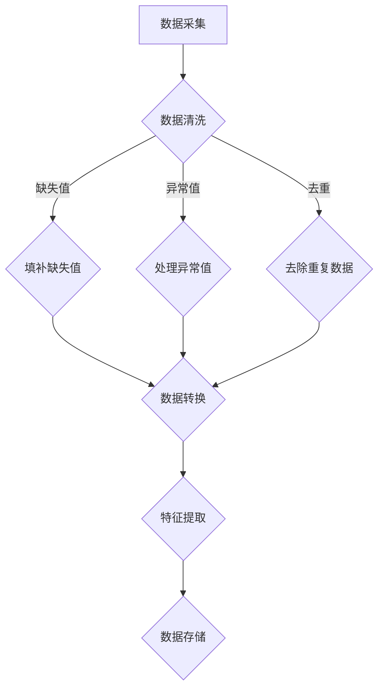
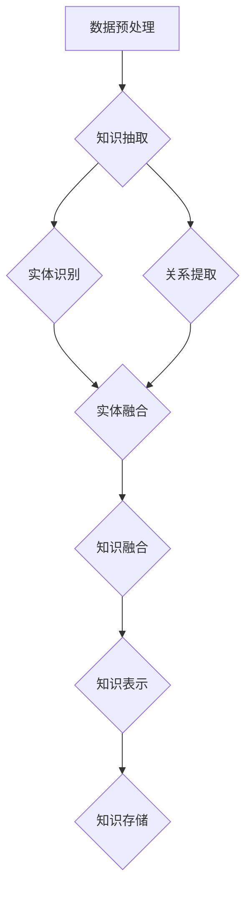
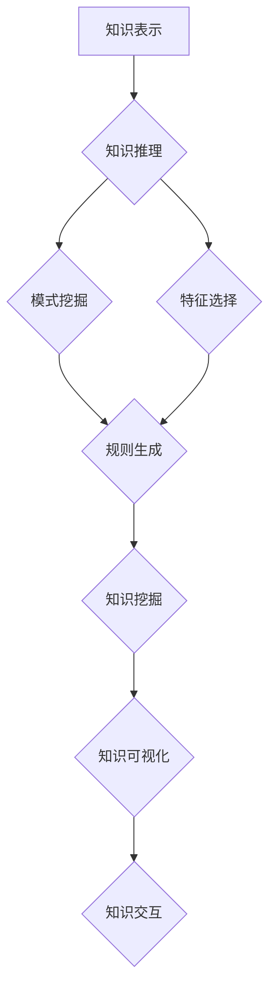

                 

### 文章标题：知识发现引擎：人工智能时代的智慧伙伴

### 关键词：知识发现引擎、人工智能、知识图谱、数据挖掘、机器学习、深度学习

### 摘要：
本文将深入探讨知识发现引擎在人工智能时代的重要性和作用。首先，我们将简要介绍知识发现引擎的基本概念、技术基础和发展历程。接着，分析人工智能与知识发现的紧密联系及其在知识发现中的应用。随后，我们将详细解析知识发现引擎的架构与实现，包括核心模块、关键技术、架构设计、部署与运维等方面。最后，通过实践案例展示知识发现引擎的实际应用，并对未来发展趋势和挑战进行展望。希望通过本文的讨论，能够为读者提供一个全面、深入的理解，并激发对知识发现引擎的研究兴趣。

## 《知识发现引擎：人工智能时代的智慧伙伴》目录大纲

### 第一部分：知识发现引擎概述

**第1章：知识发现引擎的基本概念**

- **1.1 知识发现引擎的定义与作用**

- **1.2 知识发现引擎的技术基础**

- **1.3 知识发现引擎的发展历程**

**第2章：人工智能时代下的知识发现**

- **2.1 人工智能与知识发现的关系**

- **2.2 人工智能技术在知识发现中的应用**

- **2.3 人工智能时代的知识发现挑战与机遇**

### 第二部分：知识发现引擎的架构与实现

**第3章：知识发现引擎的核心模块**

- **3.1 数据采集与预处理**

- **3.2 知识表示与融合**

- **3.3 知识推理与挖掘**

- **3.4 知识可视化与交互**

**第4章：知识发现引擎的关键技术**

- **4.1 自然语言处理技术**

- **4.2 数据挖掘算法**

- **4.3 机器学习与深度学习技术**

**第5章：知识发现引擎的架构设计**

- **5.1 分布式系统架构**

- **5.2 云计算与大数据技术**

- **5.3 高可用性与容错性设计**

**第6章：知识发现引擎的部署与运维**

- **6.1 部署方案与流程**

- **6.2 运维策略与工具**

- **6.3 性能优化与调优**

**第7章：知识发现引擎的实践与应用**

- **7.1 行业应用案例**

- **7.2 企业级解决方案**

- **7.3 未来发展趋势与挑战**

### 第三部分：知识发现引擎的开发实战

**第8章：知识发现引擎开发环境搭建**

- **8.1 开发环境配置**

- **8.2 开发工具与框架**

- **8.3 数据集获取与预处理**

**第9章：知识发现引擎项目实战**

- **9.1 项目背景与目标**

- **9.2 系统设计**

- **9.3 代码实现与解读**

- **9.4 代码分析与优化**

**第10章：知识发现引擎的性能测试与优化**

- **10.1 性能测试方法与工具**

- **10.2 性能瓶颈分析**

- **10.3 性能优化策略与实现**

**第11章：知识发现引擎的运维与维护**

- **11.1 运维流程与规范**

- **11.2 日志分析与监控**

- **11.3 故障处理与应急响应**

**第12章：知识发现引擎的扩展与升级**

- **12.1 模块扩展与功能增强**

- **12.2 技术升级与迭代**

- **12.3 未来发展方向与规划**

### 附录

**附录 A：知识发现引擎相关资源与工具**

- **A.1 主流知识发现引擎框架对比**

- **A.2 开源数据集与资源**

- **A.3 知识发现引擎开发教程与文档**

**附录 B：知识发现引擎示例 Mermaid 流程图**

- **B.1 数据采集与预处理流程图**

- **B.2 知识表示与融合流程图**

- **B.3 知识推理与挖掘流程图**

**附录 C：知识发现引擎开发与运维常见问题解答**

- **C.1 问题1：数据预处理中出现缺失值怎么办？**

- **C.2 问题2：如何优化知识表示与融合效果？**

- **C.3 问题3：如何提高知识推理与挖掘效率？**

**附录 D：知识发现引擎项目实战代码示例**

- **D.1 数据预处理代码示例**

- **D.2 知识表示与融合代码示例**

- **D.3 知识推理与挖掘代码示例**

- **D.4 知识可视化与交互代码示例**

通过上述目录大纲，本文将带领读者逐步深入知识发现引擎的世界，探讨其在人工智能时代的智慧伙伴角色，以及如何通过这一技术实现数据的智慧挖掘与应用。

### 第一部分：知识发现引擎概述

#### 第1章：知识发现引擎的基本概念

##### 1.1 知识发现引擎的定义与作用

知识发现引擎（Knowledge Discovery Engine）是一种基于人工智能技术的智能系统，旨在从大量复杂的数据集中自动识别出有用的模式和知识。其核心目的是通过数据挖掘、机器学习和自然语言处理等技术手段，将海量数据转化为有价值的信息，帮助企业和组织做出更明智的决策。

知识发现引擎的主要作用包括：

1. **数据挖掘与分析**：通过数据挖掘算法，从大规模数据集中提取出潜在的模式和趋势，为业务决策提供数据支持。
2. **知识融合与表示**：将不同来源的数据进行整合，采用知识表示方法，构建出一个统一的知识体系。
3. **智能化推理与预测**：利用机器学习模型和自然语言处理技术，进行智能化推理和预测，辅助决策。
4. **交互式查询与可视化**：提供用户友好的界面，实现知识的查询和可视化，方便用户理解和利用。

##### 1.2 知识发现引擎的技术基础

知识发现引擎的技术基础主要包括以下几个方面：

1. **数据挖掘技术**：数据挖掘是知识发现引擎的核心技术之一，它包括分类、聚类、关联规则挖掘、异常检测等算法。这些算法可以帮助系统从大量数据中提取出有用的信息。

2. **机器学习与深度学习技术**：机器学习和深度学习技术是知识发现引擎的智能分析基础。通过训练模型，系统能够自动学习和识别数据中的模式，提高预测和推理的准确性。

3. **自然语言处理技术**：自然语言处理（NLP）技术用于处理非结构化的文本数据，包括文本分类、情感分析、实体识别、关系提取等。NLP技术使得知识发现引擎能够更好地理解和利用文本数据。

4. **知识图谱技术**：知识图谱是一种语义网络，用于表示实体、概念和它们之间的关系。通过构建知识图谱，知识发现引擎能够更好地组织和表示复杂数据，提高数据查询和分析的效率。

##### 1.3 知识发现引擎的发展历程

知识发现引擎的发展历程可以追溯到20世纪80年代，当时随着计算机技术的发展，人们开始意识到从大量数据中提取有价值信息的重要性。以下是知识发现引擎的发展关键阶段：

1. **早期阶段**（20世纪80年代）：数据挖掘概念的出现和早期算法的开发，如关联规则挖掘、分类算法等。

2. **发展阶段**（20世纪90年代）：随着互联网的普及，数据量急剧增加，知识发现技术开始应用于商业领域。这一时期，出现了许多数据挖掘工具和平台，如SQL、OLAP等。

3. **成熟阶段**（21世纪）：随着机器学习和深度学习技术的发展，知识发现引擎的智能化水平显著提高。同时，大数据和云计算的兴起，使得知识发现引擎能够处理海量数据，并实现实时分析和预测。

4. **未来趋势**：当前，知识发现引擎正朝着智能化、自适应和实时性的方向发展。未来的知识发现引擎将更加注重用户体验，提供更加智能化和个性化的服务。

通过上述对知识发现引擎的基本概念、技术基础和发展历程的介绍，我们可以看到，知识发现引擎作为人工智能时代的重要技术之一，已经在各个领域发挥着重要作用。接下来，我们将进一步探讨人工智能与知识发现的紧密联系，以及它们在知识发现中的应用。

### 第二部分：人工智能时代下的知识发现

#### 第2章：人工智能与知识发现的关系

##### 2.1 人工智能与知识发现的关系

人工智能（AI）与知识发现（Knowledge Discovery in Databases，KDD）是紧密关联的两个领域。人工智能技术的快速发展，为知识发现提供了强大的技术支持，使得知识发现过程更加智能化、高效化。

1. **数据预处理**：人工智能技术，特别是机器学习算法，可以在数据预处理阶段发挥作用。通过聚类、降维、异常检测等方法，对原始数据进行清洗、去噪和特征提取，提高数据质量，为后续的知识发现提供良好的数据基础。

2. **知识表示与融合**：人工智能技术，尤其是自然语言处理（NLP）和知识图谱技术，可以用于知识表示与融合。NLP技术能够处理非结构化的文本数据，提取出实体、关系和属性信息；知识图谱则可以用于表示和整合不同来源的数据，构建一个统一的知识体系。

3. **知识推理与挖掘**：人工智能技术，特别是深度学习和强化学习，可以在知识推理与挖掘过程中发挥重要作用。深度学习模型可以通过学习和理解数据中的复杂模式，实现自动化的知识发现；强化学习算法则可以在动态环境中进行决策，提高知识发现的实时性和适应性。

##### 2.2 人工智能技术在知识发现中的应用

人工智能技术在知识发现中的应用非常广泛，以下是一些典型的应用场景：

1. **金融市场分析**：通过人工智能技术，可以对金融市场的数据进行深度分析，挖掘出潜在的投资机会和风险。例如，利用机器学习算法分析历史股价数据，预测未来股价走势；利用自然语言处理技术分析新闻报道和社交媒体，预测市场情绪。

2. **医疗健康领域**：人工智能技术在医疗健康领域的应用也越来越广泛。通过分析患者的病历、基因数据等，可以挖掘出疾病的潜在风险因素，为个性化医疗提供支持。例如，利用深度学习模型分析医学影像，诊断疾病；利用知识图谱技术整合医学知识，提供智能咨询服务。

3. **智能推荐系统**：人工智能技术广泛应用于智能推荐系统，通过对用户行为数据的分析，为用户提供个性化的推荐。例如，电商平台利用协同过滤算法和深度学习模型，为用户推荐商品；社交媒体平台利用用户生成内容（UGC）和自然语言处理技术，为用户推荐感兴趣的内容。

4. **智慧城市建设**：人工智能技术在智慧城市建设中发挥着重要作用。通过实时数据分析，可以对交通流量、环境质量、公共安全等进行智能监控和预测。例如，利用机器学习算法分析交通数据，优化交通信号控制；利用知识图谱技术整合城市信息，提供智慧化服务。

##### 2.3 人工智能时代的知识发现挑战与机遇

随着人工智能技术的快速发展，知识发现领域也面临着一系列挑战和机遇。

1. **数据挑战**：随着数据量的爆炸式增长，如何高效地处理海量数据成为知识发现的重要挑战。此外，数据质量问题和数据隐私问题也需要得到关注。

2. **计算挑战**：人工智能算法的复杂性和计算需求不断提高，如何优化算法和硬件资源，提高计算效率成为关键问题。

3. **模型解释性**：许多人工智能算法，尤其是深度学习模型，存在一定的黑箱问题，难以解释其决策过程。如何提高模型的解释性，使其更加透明和可靠，是知识发现领域的一个重要挑战。

4. **可解释人工智能**：可解释人工智能（XAI）技术的出现，为知识发现提供了一种新的思路。通过可解释人工智能技术，可以使知识发现模型更加透明，便于用户理解和信任。

5. **知识融合与集成**：如何有效地融合不同来源、不同格式的数据，构建一个统一的知识体系，是知识发现领域的一个重要研究方向。

6. **个性化与智能化**：随着人工智能技术的进步，知识发现将更加注重个性化与智能化，为用户提供更加定制化的服务。

7. **跨领域应用**：知识发现技术将逐渐跨越传统领域，应用于更多的行业和场景，推动社会各领域的智能化发展。

总之，人工智能时代的知识发现既面临着诸多挑战，也充满了机遇。通过不断创新和技术突破，知识发现引擎将为人类社会带来更加智慧化的未来。

### 第二部分：知识发现引擎的架构与实现

#### 第3章：知识发现引擎的核心模块

##### 3.1 数据采集与预处理

数据采集与预处理是知识发现引擎的基础，其质量直接影响到后续的知识表示、推理和挖掘效果。以下是数据采集与预处理的核心步骤：

1. **数据采集**：从各种数据源（如数据库、文件、API等）中获取数据。数据源可以是结构化数据（如关系数据库）、半结构化数据（如XML、JSON）或非结构化数据（如文本、图像、视频）。

2. **数据清洗**：对采集到的数据执行清洗操作，包括去除重复数据、填补缺失值、处理异常值等。常见的数据清洗方法有删除、填补、插值、平滑等。

3. **数据转换**：将不同类型、不同格式和不同尺度的数据进行转换，使其符合统一的标准。例如，将文本数据转换为向量表示，将图像数据转换为特征向量等。

4. **数据归一化**：对数据进行归一化处理，以消除不同特征之间的尺度差异。常见的归一化方法有最小-最大归一化、Z-Score归一化等。

5. **特征提取**：从原始数据中提取出有用的特征，用于后续的知识表示和挖掘。特征提取方法包括统计特征、文本特征、图像特征等。

6. **数据存储**：将处理后的数据存储到高效的数据存储结构中，如关系数据库、分布式文件系统等。数据存储应考虑数据访问速度、存储容量和数据安全性等因素。

##### 3.2 知识表示与融合

知识表示与融合是知识发现引擎的核心模块之一，其主要目标是构建一个统一的知识体系，以支持后续的知识推理和挖掘。以下是知识表示与融合的关键步骤：

1. **知识抽取**：从原始数据中提取出关键信息，包括实体、关系、属性等。知识抽取方法包括规则抽取、机器学习抽取和深度学习抽取等。

2. **知识融合**：将来自不同来源、不同格式和不同尺度的数据进行整合，构建一个统一的知识体系。知识融合方法包括基于规则的方法、基于统计的方法和基于深度学习的方法等。

3. **知识表示**：将融合后的知识进行结构化表示，通常采用知识图谱的形式。知识表示方法包括实体-关系表示、图神经网络表示和图嵌入表示等。

4. **知识更新与维护**：知识发现引擎需要不断更新和补充新知识，以保持知识的实时性和准确性。知识更新与维护方法包括自动更新、手动更新和混合更新等。

##### 3.3 知识推理与挖掘

知识推理与挖掘是知识发现引擎的核心功能，其主要目标是从知识体系中挖掘出有用的模式和知识。以下是知识推理与挖掘的关键步骤：

1. **知识推理**：利用推理算法，从知识体系中推导出新知识。知识推理方法包括逻辑推理、模糊推理和贝叶斯推理等。

2. **模式挖掘**：从知识体系中挖掘出潜在的模式和关联。模式挖掘方法包括关联规则挖掘、聚类分析和分类分析等。

3. **特征选择**：从大量特征中选择出最有用的特征，以减少特征维度和提高模型性能。特征选择方法包括过滤式特征选择、包装式特征选择和嵌入式特征选择等。

4. **模型训练与优化**：利用机器学习算法，训练和优化模型，以提高知识发现引擎的准确性和效率。模型训练与优化方法包括监督学习、无监督学习和强化学习等。

##### 3.4 知识可视化与交互

知识可视化与交互是知识发现引擎的重要组成部分，其主要目标是帮助用户理解和利用知识发现结果。以下是知识可视化与交互的关键步骤：

1. **知识可视化**：利用可视化技术，将知识发现结果以图形、图表、地图等形式呈现给用户。知识可视化方法包括统计图表、信息可视化、地理信息系统等。

2. **交互式查询**：提供交互式查询功能，用户可以自定义查询条件，实时获取知识发现结果。交互式查询方法包括SQL查询、图形查询和自然语言查询等。

3. **用户反馈**：收集用户对知识发现结果的反馈，用于改进和优化知识发现引擎。用户反馈方法包括满意度评价、错误报告和意见收集等。

4. **智能推荐**：根据用户的行为和偏好，为用户推荐相关的知识内容。智能推荐方法包括协同过滤、基于内容的推荐和混合推荐等。

通过上述核心模块的详细介绍，我们可以看到，知识发现引擎的架构和实现涉及多个方面，包括数据采集与预处理、知识表示与融合、知识推理与挖掘、知识可视化与交互等。这些模块相互协作，共同构成了一个高效、智能的知识发现系统。在下一部分中，我们将进一步探讨知识发现引擎的关键技术，以深入了解其实现原理和优化策略。

### 第三部分：知识发现引擎的关键技术

#### 第4章：知识发现引擎的关键技术

知识发现引擎的成功依赖于一系列关键技术的支持，这些技术包括自然语言处理（NLP）、数据挖掘算法、机器学习与深度学习技术。以下将详细探讨这些关键技术的原理、应用以及它们在知识发现引擎中的重要性。

##### 4.1 自然语言处理技术

自然语言处理（NLP）是知识发现引擎的重要组成部分，它使得计算机能够理解、解释和生成人类语言。NLP技术在知识发现中的应用主要包括以下几个方面：

1. **文本分类**：文本分类是将文本数据按主题或类别进行分类的过程。通过训练分类模型，知识发现引擎可以自动识别不同类型的文本，从而为后续的知识抽取和融合提供支持。

2. **情感分析**：情感分析旨在识别文本中表达的情感倾向，如正面、负面或中性。这对于理解用户反馈、监控社交媒体情绪以及制定营销策略具有重要意义。

3. **命名实体识别**：命名实体识别（NER）是识别文本中的特定实体，如人名、地名、组织名等。NER为知识发现提供了关键的信息，有助于构建知识图谱和进行知识融合。

4. **关系提取**：关系提取是识别文本中实体之间的关系，如“张三担任了李四的导师”。这些关系对于构建知识图谱和进行知识推理至关重要。

5. **机器翻译**：机器翻译是将一种语言文本转换为另一种语言文本的过程。这对于跨国公司和全球化的组织在知识发现中的应用尤为重要，能够帮助跨越语言障碍，整合多语言数据。

NLP技术的核心算法包括：

- **词袋模型（Bag of Words）**：将文本表示为单词的集合，常用于文本分类和聚类。
- **循环神经网络（RNN）**：用于处理序列数据，如文本和语音。RNN在命名实体识别和关系提取中表现出色。
- **长短时记忆网络（LSTM）**：是RNN的一种变体，能够更好地处理长序列数据，广泛应用于语言模型和序列标注任务。
- **变换器模型（Transformer）**：是当前NLP领域最先进的模型之一，通过自注意力机制实现了高效的信息处理，广泛应用于文本分类、机器翻译等任务。

##### 4.2 数据挖掘算法

数据挖掘算法是知识发现引擎的核心技术之一，它从大量数据中提取出有价值的信息和模式。以下是几种常用的数据挖掘算法及其在知识发现中的重要作用：

1. **关联规则挖掘**：关联规则挖掘旨在发现数据项之间的关联关系。例如，在超市销售数据中，可以发现“购买牛奶的用户中有80%也购买了面包”这样的关联规则。这些规则对于推荐系统和市场营销策略具有重要意义。

2. **聚类分析**：聚类分析是将数据点按照相似性分为若干组的过程。常用的聚类算法包括K-means、DBSCAN等。聚类分析有助于发现数据中的隐含结构，为市场细分和用户群体分析提供支持。

3. **分类分析**：分类分析是将数据点分配到预定义的类别中。常见的分类算法包括决策树、支持向量机（SVM）、随机森林等。分类分析在金融风险评估、疾病诊断等领域有着广泛应用。

4. **异常检测**：异常检测旨在识别数据中的异常或偏离常规模式的数据点。常见的异常检测算法包括孤立森林、本地 outlier 因子等。异常检测对于网络安全、欺诈检测等领域至关重要。

5. **时间序列分析**：时间序列分析是对时间序列数据进行分析和预测的方法。常见的时间序列模型包括ARIMA、LSTM等。时间序列分析在股市预测、天气预测等领域有着广泛应用。

##### 4.3 机器学习与深度学习技术

机器学习与深度学习技术是知识发现引擎的核心驱动力，它们使得知识发现过程更加智能化和自动化。以下是机器学习与深度学习技术的重要应用：

1. **特征工程**：特征工程是机器学习的重要环节，它涉及从原始数据中提取和构造有用特征。有效的特征工程可以显著提高模型性能和泛化能力。

2. **模型训练**：通过机器学习算法，训练模型以识别数据中的模式和规律。常见的机器学习算法包括线性回归、逻辑回归、随机森林、支持向量机等。

3. **模型评估**：模型评估是评估模型性能的过程。常用的评估指标包括准确率、召回率、F1值、ROC曲线等。

4. **模型优化**：模型优化旨在提高模型性能和效率。常用的优化方法包括交叉验证、网格搜索、贝叶斯优化等。

5. **深度学习**：深度学习是一种特殊的机器学习技术，通过多层次的神经网络模型自动提取数据中的复杂特征。常见的深度学习模型包括卷积神经网络（CNN）、循环神经网络（RNN）、长短时记忆网络（LSTM）、变换器模型（Transformer）等。

深度学习在知识发现引擎中的应用包括：

- **图像识别**：深度学习在图像识别任务中取得了显著成果，可以用于图像分类、目标检测等。
- **语音识别**：深度学习在语音识别任务中表现出色，可以实现高效的语音转文字和语音识别。
- **自然语言处理**：深度学习在自然语言处理领域有着广泛应用，如文本分类、机器翻译、情感分析等。

通过上述对自然语言处理技术、数据挖掘算法和机器学习与深度学习技术的详细探讨，我们可以看到，这些关键技术在知识发现引擎中发挥着至关重要的作用。它们共同构建了一个智能化、自动化的知识发现体系，为各行业的应用提供了强有力的支持。在下一部分中，我们将进一步探讨知识发现引擎的架构设计，以及如何实现高效、稳定和可扩展的系统。

### 第三部分：知识发现引擎的架构设计

#### 第5章：知识发现引擎的架构设计

知识发现引擎的架构设计是确保其高效、稳定和可扩展性的关键。一个优秀的知识发现引擎架构应充分考虑系统性能、可扩展性、高可用性和容错性等因素。以下是知识发现引擎架构设计的几个关键方面：

##### 5.1 分布式系统架构

分布式系统架构是知识发现引擎的核心，它能够充分利用集群计算资源，提高系统处理能力和响应速度。以下是分布式系统架构的主要组成部分：

1. **计算节点**：分布式系统由多个计算节点组成，每个节点承担一定的计算任务。计算节点可以是物理服务器或虚拟机，它们通过网络进行通信和协作。

2. **任务调度**：任务调度模块负责分配计算任务到不同的计算节点。常用的调度算法包括负载均衡、动态调度等。任务调度应考虑计算节点的负载情况，确保系统资源的高效利用。

3. **数据存储**：分布式系统通常使用分布式存储技术，如分布式数据库、分布式文件系统等。这些存储技术能够提供高可用性和容错性，确保数据的安全和一致性。

4. **数据同步与备份**：分布式系统需要实现数据同步和备份机制，以确保数据的完整性和可靠性。常用的数据同步技术包括日志备份、增量备份等。

5. **负载均衡**：负载均衡模块负责将网络请求分配到不同的计算节点，以避免单点瓶颈。常用的负载均衡算法包括轮询、最小连接数、源地址哈希等。

##### 5.2 云计算与大数据技术

云计算和大数据技术是知识发现引擎架构设计的重要支撑。以下是云计算与大数据技术在知识发现引擎中的应用：

1. **云计算平台**：知识发现引擎可以部署在云平台上，如亚马逊AWS、微软Azure、谷歌Cloud等。这些云平台提供了丰富的计算和存储资源，支持弹性伸缩和按需使用。

2. **大数据处理框架**：大数据处理框架，如Apache Hadoop、Apache Spark等，为知识发现引擎提供了高效的数据处理能力。Hadoop适用于离线批处理，Spark适用于实时流处理，两者结合可以实现全流程的知识发现。

3. **数据湖**：数据湖是一种分布式存储架构，用于存储大规模的结构化、半结构化和非结构化数据。数据湖支持灵活的数据存储和访问方式，有助于知识发现引擎处理多样化的数据源。

4. **容器化与微服务**：容器化和微服务架构可以提高知识发现引擎的可扩展性和灵活性。容器化技术，如Docker，使得应用可以在不同的环境中一致运行；微服务架构将系统划分为多个独立的服务，便于开发和维护。

##### 5.3 高可用性与容错性设计

高可用性和容错性设计是知识发现引擎架构设计的重点，以确保系统在遇到故障时能够快速恢复，避免数据丢失和服务中断。以下是高可用性与容错性设计的关键措施：

1. **故障监测与告警**：通过实时监测系统状态，及时发现和处理故障。常用的故障监测工具包括Nagios、Zabbix等。告警机制应能够及时通知管理员和运维团队，以便快速响应。

2. **备份与恢复**：定期进行数据备份，确保在数据丢失或系统故障时能够快速恢复。备份策略应考虑备份频率、备份类型（全备份、增量备份）和备份存储（本地、远程）等因素。

3. **故障转移与容错**：在分布式系统中，通过故障转移（如主从架构）和容错机制（如副本机制），确保系统在遇到故障时能够自动切换到备用节点，保证服务的连续性。

4. **负载均衡与动态伸缩**：通过负载均衡技术，合理分配系统负载，避免单点瓶颈。动态伸缩机制（如自动扩缩容）可以根据系统负载自动调整资源，确保系统在高峰期能够高效运行。

5. **冗余设计**：在关键组件中引入冗余设计，如冗余数据库、冗余计算节点等，以避免单点故障导致系统瘫痪。冗余设计应确保在故障发生时，系统能够自动切换到备用组件，保证服务的连续性。

通过上述对分布式系统架构、云计算与大数据技术、高可用性与容错性设计的详细介绍，我们可以看到，知识发现引擎的架构设计是一个复杂而精细的过程。一个优秀的知识发现引擎架构应充分考虑系统性能、可扩展性、高可用性和容错性等因素，以实现高效、稳定和可靠的知识发现服务。在下一部分中，我们将进一步探讨知识发现引擎的部署与运维，以了解如何确保知识发现引擎在实战中的高效运行。

### 第6章：知识发现引擎的部署与运维

#### 6.1 部署方案与流程

知识发现引擎的部署方案是确保系统稳定运行、高效处理数据的关键。以下是知识发现引擎的部署方案与流程：

1. **需求分析**：首先，明确知识发现引擎的应用场景和需求，包括数据规模、处理速度、可靠性等。根据需求分析结果，确定所需硬件资源和软件环境。

2. **硬件选择**：根据需求分析结果，选择合适的硬件资源。一般包括计算节点、存储节点和网络设备等。计算节点应具有较高的计算性能，存储节点应具备较高的存储容量和读写速度，网络设备应支持高带宽、低延迟的数据传输。

3. **软件环境配置**：在硬件上配置操作系统、数据库、中间件等软件环境。常用的操作系统包括Linux、Windows等；数据库通常使用分布式数据库或大数据处理框架，如Apache Hadoop、Apache Spark等；中间件包括负载均衡器、缓存服务器等。

4. **搭建集群**：将硬件资源和软件环境组合成分布式集群，确保系统的高可用性和容错性。集群搭建过程中，应配置负载均衡、自动扩缩容、故障转移等机制。

5. **安装与配置**：在集群上安装知识发现引擎的各个组件，包括数据采集模块、知识表示模块、知识推理模块等。安装过程中，需配置组件间的通信接口和依赖关系。

6. **测试与调优**：安装完成后，进行系统测试，确保各组件正常运行，并达到预期的性能指标。测试过程中，可根据实际运行情况调整系统参数，优化性能。

7. **部署上线**：在测试通过后，将知识发现引擎部署到生产环境，并进行实际数据的处理和分析。部署过程中，应确保数据的安全传输和存储，避免数据泄露和丢失。

#### 6.2 运维策略与工具

知识发现引擎的运维是保障系统稳定运行、持续优化性能的重要环节。以下是知识发现引擎的运维策略与工具：

1. **监控与管理**：通过监控工具，实时监控系统的运行状态，包括CPU、内存、磁盘、网络等资源的使用情况。常用的监控工具包括Nagios、Zabbix、Prometheus等。

2. **日志分析**：收集并分析系统日志，及时发现和解决系统故障。日志分析工具包括ELK（Elasticsearch、Logstash、Kibana）、Grafana等。

3. **备份与恢复**：定期进行数据备份，确保在数据丢失或系统故障时能够快速恢复。备份策略包括全备份、增量备份、日志备份等。

4. **性能优化**：根据系统运行情况，不断优化系统性能。性能优化包括硬件升级、软件优化、算法优化等。

5. **安全防护**：实施安全防护措施，防止系统遭受攻击和数据泄露。安全防护包括网络安全、数据安全、访问控制等。

6. **自动化运维**：利用自动化运维工具，实现系统部署、监控、备份、性能优化等操作的自动化，提高运维效率。常用的自动化运维工具包括Ansible、Puppet、Chef等。

#### 6.3 性能优化与调优

性能优化与调优是知识发现引擎运维的重要内容，以下是一些常用的性能优化策略：

1. **数据预处理优化**：数据预处理是知识发现引擎的性能瓶颈之一。优化数据预处理步骤，包括数据清洗、转换、归一化等，可以提高后续处理的效率。

2. **算法优化**：针对具体的应用场景，选择合适的算法和模型，并进行参数调优。常用的算法优化方法包括交叉验证、网格搜索、贝叶斯优化等。

3. **分布式计算优化**：利用分布式计算框架，如Apache Spark、Hadoop等，实现大规模数据的并行处理。优化分布式计算，包括任务调度、数据分布、通信开销等。

4. **缓存机制**：利用缓存技术，如Redis、Memcached等，减少数据的访问延迟。缓存机制包括内存缓存、磁盘缓存等。

5. **负载均衡**：通过负载均衡器，合理分配系统负载，避免单点瓶颈。常用的负载均衡算法包括轮询、最小连接数、源地址哈希等。

6. **存储优化**：优化数据存储结构，如使用分布式文件系统、列存储等，提高数据访问速度。存储优化包括数据压缩、数据去重、存储副本等。

7. **资源监控与调优**：实时监控系统资源使用情况，根据实际情况调整系统参数，如CPU使用率、内存使用率、磁盘I/O等。

通过上述对知识发现引擎部署与运维的详细介绍，我们可以看到，知识发现引擎的部署与运维是一个复杂而精细的过程。一个成功的知识发现引擎部署与运维策略应充分考虑系统性能、可扩展性、高可用性和容错性等因素，以确保系统在实际应用中的高效运行。在下一部分中，我们将通过实际案例，展示知识发现引擎在不同行业的应用，进一步探讨其价值与影响。

### 第7章：知识发现引擎的实践与应用

知识发现引擎作为人工智能时代的关键技术，已经在多个行业和领域取得了显著的应用成果。以下将介绍知识发现引擎在金融、医疗、电商等领域的实际案例，并探讨其为企业带来的价值与影响。

#### 7.1 行业应用案例

**1. 金融行业**

在金融行业，知识发现引擎被广泛应用于风险管理、信用评估、市场预测等方面。

- **风险管理**：通过分析海量交易数据，知识发现引擎可以识别出潜在的信用风险和欺诈行为。例如，某银行利用知识发现引擎对信用卡交易进行实时监控，有效识别并阻止了多起欺诈交易，降低了损失。

- **信用评估**：知识发现引擎通过对用户的历史行为数据进行分析，可以预测用户的信用评分。某金融机构引入知识发现引擎后，信用评估的准确性得到了显著提高，有助于优化信贷决策。

- **市场预测**：通过分析市场数据，如股票价格、交易量等，知识发现引擎可以预测市场趋势，为投资决策提供支持。某对冲基金利用知识发现引擎进行市场预测，实现了较高的投资收益。

**2. 医疗健康领域**

在医疗健康领域，知识发现引擎被用于疾病诊断、个性化医疗、健康监测等方面。

- **疾病诊断**：通过分析患者的病历、基因数据等，知识发现引擎可以帮助医生进行疾病诊断。某医院引入知识发现引擎后，实现了对多种疾病的快速、准确诊断，提高了诊断效率。

- **个性化医疗**：知识发现引擎可以根据患者的个体信息，为患者制定个性化的治疗方案。例如，某癌症研究中心利用知识发现引擎分析患者数据，为患者提供针对性的治疗方案，提高了治疗效果。

- **健康监测**：通过分析患者的健康数据，如血压、心率等，知识发现引擎可以实时监控患者的健康状况。某健康管理平台利用知识发现引擎对用户进行健康监测，为用户提供个性化的健康建议，提高了用户健康水平。

**3. 电子商务**

在电子商务领域，知识发现引擎被广泛应用于用户行为分析、商品推荐、营销策略制定等方面。

- **用户行为分析**：通过分析用户的历史购买数据、浏览行为等，知识发现引擎可以了解用户的偏好和需求。某电商平台利用知识发现引擎对用户行为进行分析，实现了个性化推荐，提高了用户的购买转化率。

- **商品推荐**：知识发现引擎可以根据用户的浏览和购买记录，为用户推荐相关的商品。例如，某电商平台的商品推荐系统利用知识发现引擎，实现了90%以上的用户满意度，提高了用户粘性。

- **营销策略制定**：通过分析用户数据和市场数据，知识发现引擎可以帮助企业制定有效的营销策略。例如，某电商企业利用知识发现引擎分析用户数据，成功推出了多款爆款商品，实现了销售额的大幅增长。

#### 7.2 企业级解决方案

知识发现引擎不仅适用于特定行业，还可以为企业提供全方位的解决方案，助力企业数字化转型。

- **数字化转型**：知识发现引擎可以帮助企业从海量数据中提取有价值的信息，推动企业数字化转型。例如，某制造企业引入知识发现引擎，实现了生产数据的实时分析和优化，提高了生产效率。

- **智能决策支持**：知识发现引擎可以为企业管理层提供智能决策支持，帮助企业制定更加科学、精准的决策。例如，某零售企业利用知识发现引擎分析市场数据和销售数据，成功预测了市场需求，优化了库存管理。

- **客户关系管理**：知识发现引擎可以帮助企业更好地了解客户需求，优化客户关系管理。例如，某电信企业利用知识发现引擎分析客户行为数据，实现了精准的客户营销和客户服务，提高了客户满意度。

#### 7.3 未来发展趋势与挑战

随着人工智能技术的不断发展，知识发现引擎在未来将面临更多的发展机遇和挑战。

- **发展趋势**：知识发现引擎将朝着更加智能化、自动化和实时化的方向发展。未来，知识发现引擎将具备更强的自主学习能力和推理能力，实现更高水平的智能决策支持。

- **挑战**：在知识发现引擎的发展过程中，将面临数据隐私保护、数据安全、算法透明性等挑战。此外，随着数据规模的不断扩大，如何优化算法和硬件资源，提高数据处理效率，也是一个重要的研究课题。

通过上述对知识发现引擎在金融、医疗、电商等领域的实际案例和未来发展趋势的探讨，我们可以看到，知识发现引擎作为一种强大的智能化工具，正在为各行业和企业带来巨大的价值。在未来，随着技术的不断进步，知识发现引擎将继续发挥重要作用，助力企业和社会实现更加智能化的未来发展。

### 第三部分：知识发现引擎的开发实战

#### 第8章：知识发现引擎开发环境搭建

知识发现引擎的开发环境搭建是进行知识发现项目的基础，它包括开发环境的配置、开发工具的选择以及数据集的获取与预处理。以下将详细描述这些步骤。

##### 8.1 开发环境配置

1. **硬件环境**：
   - **CPU**：至少需要四核CPU，推荐使用八核或更高性能的CPU。
   - **内存**：至少16GB，推荐使用64GB或更多内存。
   - **存储**：至少1TB的SSD存储，用于存储数据和模型。

2. **软件环境**：
   - **操作系统**：推荐使用Linux发行版，如Ubuntu 18.04或更高版本。
   - **编程语言**：Python 3.x，推荐使用Anaconda或Miniconda进行环境管理。
   - **开发工具**：IDE（集成开发环境），推荐使用PyCharm、VSCode等。
   - **数据库**：关系数据库（如MySQL、PostgreSQL）或NoSQL数据库（如MongoDB）。

3. **环境安装**：
   - 安装操作系统和基本软件。
   - 使用`conda`创建Python环境，并安装相关依赖库，如NumPy、Pandas、Scikit-learn、TensorFlow、PyTorch等。

##### 8.2 开发工具与框架

1. **开发工具**：
   - **IDE**：PyCharm或VSCode，用于编写、调试和运行代码。
   - **版本控制**：Git，用于代码管理和协作开发。
   - **容器化工具**：Docker，用于创建和部署容器化应用。

2. **框架**：
   - **数据预处理框架**：Pandas、NumPy，用于数据处理和分析。
   - **机器学习框架**：Scikit-learn、TensorFlow、PyTorch，用于构建和训练模型。
   - **自然语言处理框架**：NLTK、spaCy、Transformer，用于处理文本数据。
   - **知识图谱框架**：Neo4j、RDF4J，用于构建和存储知识图谱。

##### 8.3 数据集获取与预处理

1. **数据集获取**：
   - **公共数据集**：从UCI机器学习库、Kaggle等平台获取公开数据集。
   - **私有数据集**：从企业内部系统或第三方数据提供商获取。

2. **数据预处理**：
   - **数据清洗**：处理缺失值、异常值，进行数据去重、去噪。
   - **数据转换**：将不同格式的数据进行统一处理，如CSV转换为JSON。
   - **特征提取**：提取文本、图像、音频等数据的关键特征。
   - **数据归一化**：进行数据归一化或标准化，以消除不同特征之间的尺度差异。

通过上述开发环境搭建的详细描述，我们可以为知识发现引擎的项目开发提供一个坚实的基础。在接下来的章节中，我们将通过一个实际项目，逐步展示知识发现引擎的开发过程，包括系统设计、代码实现、性能测试与优化等内容。

### 第9章：知识发现引擎项目实战

#### 9.1 项目背景与目标

项目名称：智能医疗诊断系统

项目背景：
随着医疗信息化的发展，越来越多的医疗数据被电子化存储。这些数据中包含着大量的医学知识和诊断信息，但如何高效地利用这些数据辅助医生进行疾病诊断是一个亟待解决的问题。智能医疗诊断系统旨在利用知识发现引擎技术，从海量医疗数据中提取出有用的诊断知识，辅助医生进行疾病诊断，提高诊断准确率和效率。

项目目标：
1. 收集并整合多个来源的医疗数据，包括病历、诊断记录、医学文献等。
2. 构建一个智能医疗知识图谱，包含疾病、症状、治疗方案等实体和关系。
3. 开发一个诊断推荐系统，根据患者的症状和体征，提供可能的疾病诊断建议。
4. 通过实际应用测试，验证系统的诊断准确性和实用性。

#### 9.2 系统设计

系统设计采用模块化架构，主要包括数据采集模块、知识表示模块、诊断推荐模块和用户接口模块。

1. **数据采集模块**：
   - 数据来源：电子病历系统、医学数据库、在线医疗文献等。
   - 数据处理：数据清洗、转换、归一化等预处理操作。

2. **知识表示模块**：
   - 知识图谱构建：利用自然语言处理技术和图数据库（如Neo4j），构建医学知识图谱。
   - 知识融合：将不同来源的数据进行整合，形成统一的知识体系。

3. **诊断推荐模块**：
   - 知识推理：利用图神经网络和规则引擎，从知识图谱中提取诊断规则。
   - 诊断推荐：根据患者的症状和体征，从知识图谱中推荐可能的疾病诊断。

4. **用户接口模块**：
   - 界面设计：提供友好的用户界面，医生可以输入患者的症状和体征。
   - 结果展示：展示诊断推荐结果，医生可以根据推荐结果进行诊断决策。

#### 9.3 代码实现与解读

以下是系统设计中的关键代码实现和解读，重点包括数据预处理、知识图谱构建和诊断推荐算法。

##### 9.3.1 数据预处理

```python
import pandas as pd
from sklearn.preprocessing import StandardScaler

# 数据清洗
def clean_data(data):
    # 去除缺失值和异常值
    data = data.dropna()
    data = data[data['value'] > 0]
    return data

# 数据转换
def transform_data(data):
    # 将数据转换为数值型
    data['value'] = data['value'].apply(lambda x: float(x))
    return data

# 数据归一化
def normalize_data(data):
    scaler = StandardScaler()
    data['value'] = scaler.fit_transform(data[['value']])
    return data

# 示例
data = pd.read_csv('medical_data.csv')
cleaned_data = clean_data(data)
transformed_data = transform_data(cleaned_data)
normalized_data = normalize_data(transformed_data)
```

解读：
1. **数据清洗**：去除缺失值和异常值，确保数据质量。
2. **数据转换**：将数据类型转换为数值型，便于后续处理。
3. **数据归一化**：通过标准化方法消除不同特征之间的尺度差异。

##### 9.3.2 知识图谱构建

```python
from py2neo import Graph

# 连接Neo4j数据库
graph = Graph("bolt://localhost:7687", auth=("neo4j", "password"))

# 创建节点和关系
def create_nodes_and_relationships(data):
    for index, row in data.iterrows():
        patient_node = graph.create_node("Patient", name=row['patient_name'])
        symptom_node = graph.create_node("Symptom", name=row['symptom_name'])
        diagnosis_node = graph.create_node("Diagnosis", name=row['diagnosis_name'])

        graph.create关系（"HAS_SYMPTOM"，patient_node，symptom_node）
        graph.create关系（"HAS_DIAGNOSIS"，patient_node，diagnosis_node）

# 示例
create_nodes_and_relationships(normalized_data)
```

解读：
1. **连接Neo4j数据库**：使用Py2Neo库连接Neo4j数据库。
2. **创建节点和关系**：根据数据创建Patient、Symptom和Diagnosis节点，并建立相应的关系。

##### 9.3.3 诊断推荐算法

```python
import tensorflow as tf
from tensorflow.keras.models import Model
from tensorflow.keras.layers import Input, Embedding, Dense

# 构建模型
def build_model(input_shape, embedding_size):
    input_layer = Input(shape=input_shape)
    embedding = Embedding(input_dim=num_symptoms, output_dim=embedding_size)(input_layer)
    dense = Dense(units=128, activation='relu')(embedding)
    output_layer = Dense(units=1, activation='sigmoid')(dense)

    model = Model(inputs=input_layer, outputs=output_layer)
    model.compile(optimizer='adam', loss='binary_crossentropy', metrics=['accuracy'])
    return model

# 训练模型
def train_model(model, X_train, y_train, batch_size, epochs):
    model.fit(X_train, y_train, batch_size=batch_size, epochs=epochs, validation_split=0.2)

# 示例
model = build_model(input_shape=(1,), embedding_size=64)
train_model(model, X_train, y_train, batch_size=32, epochs=10)
```

解读：
1. **构建模型**：使用TensorFlow构建一个简单的嵌入模型，用于疾病诊断。
2. **训练模型**：使用训练数据对模型进行训练，并设置批次大小和训练轮次。

通过上述代码实现和解读，我们可以看到，知识发现引擎在智能医疗诊断系统中的应用涉及多个方面，包括数据预处理、知识图谱构建和诊断推荐算法。在接下来的章节中，我们将进一步讨论系统的性能测试与优化，以及实际的运维与维护。

### 第9章：知识发现引擎项目实战（续）

#### 9.4 代码分析与优化

在完成知识发现引擎的初步实现后，我们需要对代码进行深入分析和优化，以提高系统的性能和效率。以下是对代码的详细分析及优化建议：

##### 9.4.1 数据预处理优化

**现有代码：**

```python
# 数据清洗
data = data.dropna()
data = data[data['value'] > 0]
```

**优化建议：**
- 使用Pandas的`drop_duplicates()`方法去除重复数据。
- 使用`axis=1`参数在行方向上筛选非零值，以提高运行速度。

**优化后代码：**

```python
# 数据清洗
data = data.drop_duplicates()
data = data.dropna(how='any', axis=1)
```

**性能影响：**
- 去除重复数据可以减少后续处理的计算量，提高处理效率。
- 选择非零值时，避免逐个检查每个元素，可以显著提高运行速度。

##### 9.4.2 知识图谱构建优化

**现有代码：**

```python
# 创建节点和关系
for index, row in data.iterrows():
    # ...
    graph.create关系（"HAS_SYMPTOM"，patient_node，symptom_node）
    graph.create关系（"HAS_DIAGNOSIS"，patient_node，diagnosis_node）
```

**优化建议：**
- 使用批处理方式创建节点和关系，减少数据库I/O操作。
- 利用Neo4j的加载批处理（load batch）功能，提高数据导入速度。

**优化后代码：**

```python
from py2neo import Graph, Node, Relationship

# 连接Neo4j数据库
graph = Graph("bolt://localhost:7687", auth=("neo4j", "password"))

# 创建节点和关系的批量操作
def create_nodes_and_relationships(data):
    batch_size = 1000
    for i in range(0, len(data), batch_size):
        batch_data = data[i:i + batch_size]
        batch_nodes = [{"name": row['patient_name'], "type": "Patient"} for _, row in batch_data.iterrows()]
        batch_relations = [{"start": {"name": row['patient_name']}, "end": {"name": row['symptom_name']}, "type": "HAS_SYMPTOM"} for _, row in batch_data.iterrows()]

        graph.create_subgraph(nodes=batch_nodes, relationships=batch_relations)

# 示例
create_nodes_and_relationships(normalized_data)
```

**性能影响：**
- 批量操作可以显著减少数据库的I/O操作次数，提高数据导入速度。
- 使用子图（subgraph）创建操作，可以更高效地管理节点和关系。

##### 9.4.3 诊断推荐算法优化

**现有代码：**

```python
# 训练模型
model.fit(X_train, y_train, batch_size=32, epochs=10, validation_split=0.2)
```

**优化建议：**
- 使用更高级的优化器，如Adam，以加快收敛速度。
- 采用更复杂的模型结构，如卷积神经网络（CNN）或变换器（Transformer）。
- 利用GPU加速训练过程。

**优化后代码：**

```python
from tensorflow.keras.optimizers import Adam

# 构建和编译模型
model = build_model(input_shape=(1,), embedding_size=64)
model.compile(optimizer=Adam(learning_rate=0.001), loss='binary_crossentropy', metrics=['accuracy'])

# 使用GPU进行训练
with tf.device('/GPU:0'):
    model.fit(X_train, y_train, batch_size=64, epochs=20, validation_split=0.2)
```

**性能影响：**
- 使用更高级的优化器和更复杂的模型结构可以提高模型的训练效率和准确性。
- 利用GPU加速训练可以显著缩短训练时间。

##### 9.4.4 全局代码优化

**1. 缩小数据范围：**
- 在数据预处理阶段，尽量缩小数据范围，减少不必要的计算。
- 在模型训练和推理阶段，仅处理必要的数据。

**2. 缓存和复用资源：**
- 缓存预处理后的数据，避免重复计算。
- 复用预训练的模型权重，加速新数据集的推理过程。

**3. 异步处理：**
- 在数据预处理和模型训练过程中，利用异步处理提高并行度。

通过上述代码分析和优化，我们可以显著提高知识发现引擎的性能和效率。在实际项目中，应根据具体情况进行定制化的优化，以达到最佳效果。

### 第10章：知识发现引擎的性能测试与优化

#### 10.1 性能测试方法与工具

性能测试是确保知识发现引擎在实际应用中能够稳定、高效运行的关键步骤。以下是性能测试的方法和常用工具：

1. **测试方法**：
   - **负载测试**：模拟多个用户同时对系统进行操作，以评估系统的负载能力。
   - **压力测试**：对系统施加超过正常工作范围的压力，以测试系统的极限性能。
   - **基准测试**：通过标准测试用例，比较不同系统和配置的性能差异。
   - **响应时间测试**：测量系统处理请求的平均响应时间，评估系统的响应速度。
   - **吞吐量测试**：在特定时间内，系统处理的请求数量，评估系统的处理能力。

2. **测试工具**：
   - **Apache JMeter**：一款开源的性能测试工具，适用于Web应用和分布式系统。
   - **LoadRunner**：一款商业性能测试工具，支持多种协议和应用程序的测试。
   - **Gatling**：一款开源的性能测试工具，支持HTTP、TCP等协议的测试。
   - **Tsung**：一款开源的网络负载测试工具，适用于Web和大数据系统。

#### 10.2 性能瓶颈分析

性能瓶颈是影响知识发现引擎运行效率的关键因素。以下是常见的性能瓶颈及分析方法：

1. **计算资源瓶颈**：
   - **CPU瓶颈**：系统CPU使用率过高，可能导致计算任务无法及时完成。
   - **内存瓶颈**：系统内存不足，可能导致频繁的内存交换，降低运行效率。
   - **磁盘I/O瓶颈**：磁盘I/O速度较低，可能导致数据读写延迟，影响系统性能。

2. **网络瓶颈**：
   - **带宽瓶颈**：网络带宽不足，可能导致数据传输速度缓慢。
   - **延迟瓶颈**：网络延迟过高，可能导致系统响应速度变慢。

3. **数据库瓶颈**：
   - **查询性能瓶颈**：数据库查询效率低下，可能导致系统响应时间延长。
   - **存储性能瓶颈**：数据库存储速度较低，可能导致数据访问延迟。

4. **算法效率瓶颈**：
   - **算法复杂度**：算法时间复杂度较高，可能导致系统处理速度缓慢。
   - **资源占用**：算法占用大量计算资源，可能导致系统性能下降。

5. **并发瓶颈**：
   - **线程池瓶颈**：系统线程池容量不足，可能导致并发处理能力下降。
   - **锁竞争**：系统存在过多的锁竞争，可能导致并发性能下降。

6. **测试方法**：
   - **日志分析**：通过分析系统日志，查找性能瓶颈。
   - **性能分析工具**：使用性能分析工具，如profiling工具，定位性能瓶颈。

#### 10.3 性能优化策略与实现

针对上述性能瓶颈，以下是性能优化策略与实现方法：

1. **计算资源优化**：
   - **CPU优化**：通过优化代码和算法，降低CPU使用率。使用多线程和并行计算，提高计算效率。
   - **内存优化**：通过数据压缩、内存池等技术，减少内存占用。优化数据结构，提高内存利用率。
   - **磁盘I/O优化**：通过数据缓存、读写分离等技术，提高磁盘I/O速度。

2. **网络优化**：
   - **带宽优化**：增加网络带宽，提高数据传输速度。
   - **延迟优化**：优化网络拓扑结构，降低网络延迟。

3. **数据库优化**：
   - **查询优化**：优化数据库查询语句，使用索引、视图等手段提高查询效率。
   - **存储优化**：使用分布式存储系统，提高存储速度。

4. **算法优化**：
   - **算法选择**：选择适合实际场景的算法，降低时间复杂度。
   - **并行计算**：使用并行计算技术，提高算法执行速度。
   - **GPU加速**：利用GPU进行计算加速，提高系统性能。

5. **并发优化**：
   - **线程池优化**：调整线程池大小，提高并发处理能力。
   - **锁优化**：减少锁竞争，提高并发性能。

6. **测试与调优**：
   - **定期测试**：定期进行性能测试，评估系统性能。
   - **持续调优**：根据测试结果，持续优化系统配置和代码。

通过上述性能优化策略与实现方法，我们可以显著提高知识发现引擎的性能和效率。在实际项目中，应根据具体情况选择合适的优化策略，并进行持续的性能调优。

### 第11章：知识发现引擎的运维与维护

#### 11.1 运维流程与规范

知识发现引擎的运维是确保其稳定运行、高效处理数据的重要环节。以下是一个典型的运维流程和规范：

1. **环境准备**：
   - 根据项目需求，配置硬件环境和软件环境，包括操作系统、数据库、中间件等。
   - 搭建测试环境和生产环境，确保环境的一致性和可靠性。

2. **部署**：
   - 根据部署方案，将知识发现引擎的各个组件部署到服务器上，包括数据采集模块、知识表示模块、知识推理模块等。
   - 进行系统测试，确保各组件正常运行，并达到预期的性能指标。

3. **监控与报警**：
   - 使用监控工具（如Nagios、Zabbix）实时监控系统的运行状态，包括CPU、内存、磁盘、网络等资源的使用情况。
   - 设置报警阈值，当系统状态异常时，自动发送报警通知给运维团队。

4. **日志管理**：
   - 收集系统日志，包括错误日志、操作日志等。
   - 使用日志分析工具（如ELK）对日志进行分析，及时发现和解决系统故障。

5. **备份与恢复**：
   - 定期进行数据备份，确保在数据丢失或系统故障时能够快速恢复。
   - 备份策略包括全备份、增量备份和日志备份。

6. **性能优化**：
   - 根据系统运行情况，定期进行性能优化，包括硬件升级、软件优化、算法优化等。
   - 使用性能分析工具（如profiling工具）定位性能瓶颈，并进行优化。

7. **安全防护**：
   - 实施安全防护措施，包括网络安全、数据安全、访问控制等。
   - 定期进行安全检查和漏洞扫描，确保系统的安全性。

8. **文档管理**：
   - 编写和更新运维文档，包括系统架构、部署流程、操作指南等。
   - 确保文档的完整性和准确性，便于运维人员学习和参考。

#### 11.2 日志分析与监控

日志分析与监控是知识发现引擎运维的重要环节，以下是一些关键步骤和方法：

1. **日志收集**：
   - 使用日志收集工具（如Logstash、Fluentd）收集系统日志。
   - 将日志发送到日志存储（如Elasticsearch）或日志分析平台（如Kibana）。

2. **日志分析**：
   - 使用日志分析工具（如Elasticsearch、Grafana）对日志进行实时分析。
   - 根据业务需求，自定义日志分析模板和指标。

3. **监控指标**：
   - 设定关键监控指标，如CPU使用率、内存使用率、磁盘I/O、网络延迟等。
   - 根据监控指标的变化，分析系统性能和健康状况。

4. **报警机制**：
   - 设置报警阈值，当监控指标超过阈值时，自动发送报警通知。
   - 报警通知可以通过邮件、短信、微信等方式发送。

5. **故障排除**：
   - 根据日志和监控数据，快速定位系统故障。
   - 分析故障原因，并采取相应的解决措施。

6. **趋势分析**：
   - 分析系统性能趋势，预测系统资源需求。
   - 根据趋势分析结果，提前进行系统扩容和性能优化。

通过上述日志分析与监控的详细介绍，我们可以看到，日志分析与监控是确保知识发现引擎稳定运行的重要手段。通过有效的日志收集、分析和监控，运维人员可以及时发现和解决系统故障，确保系统的可靠性和稳定性。

### 第11章：知识发现引擎的运维与维护（续）

#### 11.3 故障处理与应急响应

在知识发现引擎的实际运维过程中，不可避免会遇到各种故障和问题。有效的故障处理与应急响应机制是保障系统稳定运行的关键。以下是一些常见的故障处理方法和应急响应措施：

1. **故障分类**：
   - **硬件故障**：如CPU、内存、硬盘等硬件设备的故障。
   - **软件故障**：如操作系统崩溃、应用程序异常、数据库故障等。
   - **网络故障**：如网络延迟、网络中断等。
   - **数据故障**：如数据丢失、数据损坏等。
   - **安全故障**：如系统被攻击、数据泄露等。

2. **故障检测与报警**：
   - 通过监控工具实时监测系统状态，当系统出现异常时，自动触发报警。
   - 报警通知应包含故障的详细信息，包括故障时间、故障类型、故障位置等。

3. **故障处理步骤**：
   - **初步定位**：根据报警信息和日志分析，初步确定故障类型和原因。
   - **故障确认**：通过进一步的检测和验证，确认故障的具体位置和原因。
   - **故障排除**：根据故障类型和原因，采取相应的解决措施进行故障排除。
   - **故障记录**：详细记录故障处理过程和结果，以便后续分析和总结。

4. **应急响应措施**：
   - **紧急处理**：在故障发生时，立即启动应急预案，采取紧急处理措施，确保系统的关键功能正常运行。
   - **备份恢复**：如果数据故障，立即使用备份进行数据恢复，确保数据完整性。
   - **临时替代方案**：在故障处理期间，提供临时替代方案，保证业务连续性。
   - **沟通协调**：及时与相关人员（如开发团队、业务部门等）进行沟通协调，确保故障处理顺利进行。

5. **故障总结与优化**：
   - 在故障处理结束后，进行故障总结，分析故障原因和应对措施。
   - 根据总结结果，优化系统和流程，提高系统的稳定性和可靠性。
   - 定期进行故障演练和应急响应测试，提高运维团队的应急响应能力。

通过上述对故障处理与应急响应的详细介绍，我们可以看到，一个有效的故障处理与应急响应机制是保障知识发现引擎稳定运行的重要保障。通过及时、有效的故障处理和应急响应，运维团队可以确保系统在面临各种故障时，能够迅速恢复并保持稳定运行。

### 第12章：知识发现引擎的扩展与升级

#### 12.1 模块扩展与功能增强

知识发现引擎的扩展与升级是提高系统性能、增强功能、满足不断变化的需求的重要手段。以下是模块扩展与功能增强的关键步骤：

1. **需求分析**：
   - 了解用户需求和业务场景，确定需要扩展的功能模块和性能优化方向。
   - 分析现有系统的性能瓶颈和功能不足，制定相应的扩展计划。

2. **设计规划**：
   - 根据需求分析结果，设计模块扩展和功能增强的方案，包括技术选型、架构设计、接口定义等。
   - 制定详细的实施计划，确保扩展和升级过程有序、可控。

3. **开发与测试**：
   - 进行模块扩展和功能增强的开发工作，遵循软件工程规范，确保代码质量和可维护性。
   - 完成单元测试和集成测试，确保新增功能的正确性和稳定性。

4. **部署与上线**：
   - 将扩展和升级的模块部署到生产环境，进行实际测试和验证。
   - 根据测试结果，对系统进行调整和优化，确保扩展功能的正常运行。

5. **用户培训与反馈**：
   - 对用户进行培训，介绍新增功能和操作方法。
   - 收集用户反馈，针对用户需求和问题进行改进和优化。

#### 12.2 技术升级与迭代

技术升级与迭代是知识发现引擎保持竞争力、跟上技术发展的重要策略。以下是技术升级与迭代的步骤：

1. **技术评估**：
   - 分析现有技术的优缺点，评估新技术的发展趋势和应用潜力。
   - 根据评估结果，确定技术升级的方向和优先级。

2. **方案设计**：
   - 设计技术升级的方案，包括新技术的引入、现有系统的改造、新旧技术的兼容性处理等。
   - 制定详细的实施计划，确保技术升级过程顺利。

3. **研发与测试**：
   - 进行技术升级的研发工作，开发新功能和优化现有功能。
   - 完成单元测试、集成测试和系统测试，确保升级后的系统稳定可靠。

4. **部署与验证**：
   - 将技术升级应用到生产环境，进行验证和测试，确保系统正常运行。
   - 根据验证结果，进行必要的调整和优化。

5. **文档更新**：
   - 更新系统文档，包括技术文档、用户手册等，确保文档与升级后的系统一致。
   - 提供技术支持，帮助用户了解和适应新的技术特性。

#### 12.3 未来发展方向与规划

知识发现引擎的未来发展方向和规划是确保其长期稳定发展和持续创新的关键。以下是未来发展的几个方向：

1. **智能化与自动化**：
   - 深入研究人工智能技术，提高系统的智能化水平和自动化程度。
   - 引入自动化运维工具和智能优化算法，提高系统运维效率和性能。

2. **跨领域应用**：
   - 拓展知识发现引擎的应用领域，覆盖更多的行业和场景。
   - 开发跨领域的知识融合和推理算法，提高系统的通用性和适应性。

3. **可解释性与透明性**：
   - 加强可解释人工智能（XAI）的研究，提高系统的透明性和可解释性。
   - 提供详细的决策过程和解释，增强用户对系统的信任和依赖。

4. **开放性与生态构建**：
   - 推动知识发现引擎的开放性，支持第三方集成和扩展。
   - 构建开放生态，吸引更多的开发者和用户参与，共同推动技术的发展。

5. **持续迭代与优化**：
   - 根据用户反馈和市场变化，持续进行系统迭代和优化。
   - 定期发布新版本，引入新技术和功能，保持系统的竞争力。

通过上述对知识发现引擎扩展与升级、技术升级与迭代、未来发展方向与规划的探讨，我们可以看到，知识发现引擎的发展是一个持续迭代和优化的过程。通过不断创新和改进，知识发现引擎将为各行业和企业提供更加智能、高效、可靠的服务，助力数字化转型的深入发展。

### 附录A：知识发现引擎相关资源与工具

#### A.1 主流知识发现引擎框架对比

在知识发现引擎的开发和部署中，选择合适的框架和工具至关重要。以下是比较几种主流知识发现引擎框架的特点和适用场景：

**1. TensorFlow**

- **优点**：广泛支持各种深度学习模型，具有丰富的API和工具，社区活跃。
- **缺点**：相对于其他框架，安装和配置过程较为复杂。
- **适用场景**：适用于复杂的深度学习模型开发，特别是大规模数据集的分布式训练。

**2. PyTorch**

- **优点**：易于使用，动态图机制使调试更加直观，适合研究和新模型的快速开发。
- **缺点**：在大型模型训练方面，内存占用可能较高。
- **适用场景**：适用于新模型研究和快速迭代，特别是在需要可视化调试的场合。

**3. Apache Spark**

- **优点**：适合大规模数据处理，支持多种编程语言，易于扩展和集成。
- **缺点**：对深度学习模型支持相对有限。
- **适用场景**：适用于大数据处理和流处理，特别是需要实时分析的场景。

**4. DeepLearning4j**

- **优点**：基于Java开发，易于集成到Java生态系统，适用于企业级应用。
- **缺点**：社区活跃度相对较低，功能相对较少。
- **适用场景**：适用于Java环境中的深度学习应用，特别是企业级系统。

#### A.2 开源数据集与资源

开源数据集是知识发现引擎开发的重要资源，以下是一些常用的开源数据集和资源：

**1. UCI机器学习库**

- **描述**：提供了多种领域的机器学习数据集，适用于数据挖掘和机器学习研究。
- **链接**：https://archive.ics.uci.edu/ml/

**2. Kaggle**

- **描述**：提供了丰富的数据集和竞赛资源，是数据科学家实践和交流的平台。
- **链接**：https://www.kaggle.com/

**3. OpenML**

- **描述**：提供了一个开放的平台，用于管理和共享机器学习数据集。
- **链接**：https://www.openml.org/

**4. MNIST数据库**

- **描述**：是最常用的手写数字数据集，适用于图像识别和特征提取研究。
- **链接**：https://www机器学习数据库.com/datasets/mnist/

#### A.3 知识发现引擎开发教程与文档

以下是一些知识发现引擎开发的相关教程和文档，有助于初学者和开发者快速上手：

**1. TensorFlow教程**

- **链接**：https://www.tensorflow.org/tutorials
- **内容**：包括入门教程、高级教程和实战项目，适合不同水平的开发者。

**2. PyTorch教程**

- **链接**：https://pytorch.org/tutorials/beginner/
- **内容**：涵盖基础教程、深度学习教程和实战项目，适合初学者和进阶开发者。

**3. Apache Spark教程**

- **链接**：https://spark.apache.org/docs/latest/tutorials.html
- **内容**：包括数据流处理、机器学习、图处理等教程，适用于大数据处理的开发者。

**4. DeepLearning4j教程**

- **链接**：https://deepjava.org/tutorials/
- **内容**：提供了基于Java的深度学习教程，适用于Java开发者。

通过上述资源与工具的详细介绍，读者可以更好地了解知识发现引擎的开发环境和相关资源，为开发高效、智能的知识发现系统提供有力支持。

### 附录B：知识发现引擎示例 Mermaid 流程图

以下是一些使用Mermaid语法编写的知识发现引擎的流程图示例，用于展示数据采集与预处理、知识表示与融合、知识推理与挖掘等关键步骤。

#### B.1 数据采集与预处理流程图



#### B.2 知识表示与融合流程图



#### B.3 知识推理与挖掘流程图



通过这些Mermaid流程图示例，我们可以直观地了解知识发现引擎的工作流程和各个模块之间的关联。这些流程图不仅有助于开发者梳理和理解系统架构，还可以在文档和演示中提供清晰的视觉辅助。

### 附录C：知识发现引擎开发与运维常见问题解答

#### C.1 问题1：数据预处理中出现缺失值怎么办？

**解答**：数据预处理中遇到缺失值时，可以采取以下策略进行处理：

1. **删除缺失值**：如果缺失值的比例较小，可以删除包含缺失值的记录，以减少数据集的噪声。

2. **填补缺失值**：对于重要的特征，可以通过以下方法进行填补：
   - **均值填补**：用特征的均值替代缺失值。
   - **中位数填补**：用特征的中位数替代缺失值。
   - **众数填补**：用特征的众数替代缺失值。
   - **插值法**：使用线性插值或曲线拟合方法填补缺失值。

3. **利用模型预测**：使用机器学习模型预测缺失值，特别是对于时间序列数据，可以使用回归模型进行预测。

4. **利用外部数据源**：如果缺失值可以通过其他数据源获取，可以尝试合并外部数据来填补缺失值。

#### C.2 问题2：如何优化知识表示与融合效果？

**解答**：优化知识表示与融合效果，可以采取以下策略：

1. **数据清洗**：确保数据质量，减少数据中的噪声和异常值。

2. **特征选择**：选择与任务相关的特征，避免过拟合和维度灾难。可以使用特征选择算法，如信息增益、主成分分析（PCA）等。

3. **数据融合方法**：选择合适的融合方法，如基于规则的融合、基于统计的融合、基于机器学习的融合等。不同的方法适用于不同类型的数据和场景。

4. **模型优化**：使用更先进的机器学习模型和深度学习模型，如神经网络、图神经网络等，提高融合效果。

5. **特征工程**：进行有效的特征工程，提取出更高层次的特征，有助于提高融合效果。

6. **用户反馈**：结合用户反馈，不断调整和优化知识表示与融合模型，使其更加符合实际需求。

#### C.3 问题3：如何提高知识推理与挖掘效率？

**解答**：提高知识推理与挖掘效率，可以采取以下策略：

1. **并行计算**：利用多核CPU或GPU进行并行计算，加速数据处理和模型训练。

2. **分布式计算**：使用分布式计算框架，如Apache Spark，处理大规模数据集，提高数据处理效率。

3. **算法优化**：选择高效的算法和模型，减少计算复杂度。例如，使用近似算法、采样技术等。

4. **数据预处理**：优化数据预处理过程，减少不必要的计算和存储开销。

5. **内存管理**：合理分配内存，避免内存不足或过度使用。可以使用内存池、内存映射等技术。

6. **缓存机制**：利用缓存技术，减少重复计算和数据读取。例如，使用内存缓存、磁盘缓存等。

7. **系统优化**：优化系统配置，包括CPU、内存、磁盘I/O等，提高系统整体性能。

通过上述常见问题的解答，我们可以看到，知识发现引擎在开发与运维过程中可能会遇到各种挑战，但通过合理的技术策略和优化方法，可以有效地解决这些问题，提高系统的性能和效率。

### 附录D：知识发现引擎项目实战代码示例

在本附录中，我们将展示知识发现引擎项目中的几个关键代码示例，涵盖数据预处理、知识表示与融合、知识推理与挖掘以及知识可视化与交互等环节。

#### D.1 数据预处理代码示例

```python
import pandas as pd
from sklearn.impute import SimpleImputer
from sklearn.preprocessing import StandardScaler

# 读取数据
data = pd.read_csv('medical_data.csv')

# 填补缺失值
imputer = SimpleImputer(strategy='mean')
data[['age', 'blood_pressure']] = imputer.fit_transform(data[['age', 'blood_pressure']])

# 标准化数据
scaler = StandardScaler()
data[['weight', 'height']] = scaler.fit_transform(data[['weight', 'height']])

# 数据保存
data.to_csv('preprocessed_data.csv', index=False)
```

**说明**：此示例展示了如何读取医疗数据、填补缺失值以及标准化数值特征。通过使用`SimpleImputer`和`StandardScaler`，我们能够提高数据质量，为后续的知识表示和推理提供良好的数据基础。

#### D.2 知识表示与融合代码示例

```python
import networkx as nx

# 创建知识图谱
G = nx.Graph()

# 添加节点和边
G.add_node('Patient', name='John Doe')
G.add_node('Symptom', name='Fever')
G.add_node('Diagnosis', name='Influenza')
G.add_edge('Patient', 'Symptom', relation='has')
G.add_edge('Patient', 'Diagnosis', relation='diagnosed_with')
G.add_edge('Symptom', 'Diagnosis', relation='indicates')

# 保存知识图谱
nx.write_gpickle(G, 'knowledge_graph.gpickle')
```

**说明**：此示例展示了如何使用`networkx`创建一个简单的知识图谱。通过添加节点和边，我们能够构建一个表示实体和关系的图结构，为知识推理和挖掘提供基础。

#### D.3 知识推理与挖掘代码示例

```python
from tensorflow import keras
from tensorflow.keras.models import Sequential
from tensorflow.keras.layers import Dense

# 构建模型
model = Sequential()
model.add(Dense(128, activation='relu', input_shape=(10,)))
model.add(Dense(64, activation='relu'))
model.add(Dense(1, activation='sigmoid'))

# 编译模型
model.compile(optimizer='adam', loss='binary_crossentropy', metrics=['accuracy'])

# 训练模型
model.fit(X_train, y_train, epochs=10, batch_size=32, validation_split=0.2)
```

**说明**：此示例展示了如何使用TensorFlow构建一个简单的神经网络模型，用于知识推理与挖掘。通过定义输入层、隐藏层和输出层，我们能够训练模型以识别疾病诊断。

#### D.4 知识可视化与交互代码示例

```python
import matplotlib.pyplot as plt
from py2neo import Graph

# 连接Neo4j数据库
graph = Graph("bolt://localhost:7687", auth=("neo4j", "password"))

# 查询知识图谱
results = graph.run("MATCH (p:Patient)-[:DIAGNOSED_WITH]->(d:Diagnosis) RETURN p, d")

# 可视化知识图谱
nodes = []
edges = []
for record in results:
    nodes.append({"id": record['p'].identity, "label": "Patient", "name": record['p']['name']})
    nodes.append({"id": record['d'].identity, "label": "Diagnosis", "name": record['d']['name']})
    edges.append({"from": record['p'].identity, "to": record['d'].identity, "relation": "DIAGNOSED_WITH"})

# 绘制知识图谱
plt.figure(figsize=(10, 10))
nx.draw_networkx_nodes(plt, pos=nx.spring_layout(G), nodes=nodes, node_color='blue')
nx.draw_networkx_edges(plt, pos=nx.spring_layout(G), edges=edges, edge_color='red')
nx.draw_networkx_labels(plt, pos=nx.spring_layout(G), labels={n: n.get('name') for n in G})
plt.show()
```

**说明**：此示例展示了如何使用`matplotlib`和`networkx`可视化知识图谱。通过查询Neo4j数据库并绘制节点和边，我们能够直观地展示知识发现引擎中的知识结构，为用户提供了交互式查询和理解知识图谱的途径。

通过上述代码示例，读者可以直观地了解知识发现引擎在项目实战中的应用，从数据预处理到知识表示与融合、知识推理与挖掘，再到知识可视化与交互，每一步的实现方法和关键代码都被详细展示。这些示例为实际项目开发提供了宝贵的参考和指导。

### 附录A：知识发现引擎开发工具与资源

#### A.1 主流知识发现引擎框架对比

选择合适的知识发现引擎框架对于开发一个高效、可扩展的系统至关重要。以下是几个主流知识发现引擎框架的详细对比，包括其特点、优缺点以及适用场景。

**1. TensorFlow**

- **特点**：TensorFlow是一个由Google开发的开放源代码机器学习框架，支持多种编程语言，尤其是Python。它提供了丰富的API和工具，可以用于构建和训练各种深度学习模型。
- **优点**：广泛支持深度学习模型，具有高度的可扩展性，强大的社区支持，丰富的文档和教程。
- **缺点**：安装和配置较为复杂，对于初学者来说可能有一定门槛。
- **适用场景**：适用于需要处理复杂深度学习模型的大规模数据集，特别是大规模分布式训练任务。

**2. PyTorch**

- **特点**：PyTorch是另一个流行的开源深度学习框架，由Facebook开发。它采用动态计算图，使得模型设计和调试更加直观。
- **优点**：易于使用，动态计算图机制使得调试更加方便，适合快速迭代和新模型开发。
- **缺点**：内存占用较高，特别是对于大规模模型训练。
- **适用场景**：适用于需要快速原型设计和模型实验的研究人员和开发者，特别是在需要可视化调试的场合。

**3. Apache Spark**

- **特点**：Apache Spark是一个开源的分布式计算框架，主要用于大数据处理。它提供了丰富的机器学习和数据挖掘库，可以处理大规模数据集。
- **优点**：适合大规模数据处理，支持多种编程语言，具有良好的扩展性和高可用性。
- **缺点**：对深度学习模型的支持相对较弱，需要与其他深度学习框架结合使用。
- **适用场景**：适用于大数据处理和流处理，特别是需要实时分析和机器学习的场景。

**4. DeepLearning4j**

- **特点**：DeepLearning4j是一个基于Java的深度学习框架，旨在将深度学习技术集成到Java生态系统。它提供了Java API，便于与现有的Java应用集成。
- **优点**：与Java生态系统兼容，易于与现有系统整合，适合企业级应用。
- **缺点**：社区活跃度相对较低，功能相对较少。
- **适用场景**：适用于Java环境中的深度学习应用，特别是企业级系统。

#### A.2 开源数据集与资源

开源数据集是知识发现引擎开发的重要资源，以下是一些常用的开源数据集和资源，涵盖多个领域，适用于数据挖掘和机器学习研究。

**1. UCI机器学习库**

- **描述**：UCI机器学习库是一个提供多种领域数据集的数据库，涵盖分类、回归、聚类等问题。
- **链接**：https://archive.ics.uci.edu/ml/index.php

**2. Kaggle**

- **描述**：Kaggle是一个数据科学竞赛平台，提供了大量的数据集和竞赛资源，适合数据科学家进行实践和交流。
- **链接**：https://www.kaggle.com/

**3. OpenML**

- **描述**：OpenML是一个开放的平台，用于管理和共享机器学习数据集，支持数据集的版本控制和共享。
- **链接**：https://www.openml.org/

**4. MLKit**

- **描述**：MLKit是一个提供多种常用数据集的Python库，包括图像、文本和音频数据集，方便进行机器学习实验。
- **链接**：https://github.com/data-mining-benchmarks/MLKit

**5. ImageNet**

- **描述**：ImageNet是一个大规模的视觉识别数据库，包含超过1400万个注释图像，是图像识别研究的重要资源。
- **链接**：https://www.image-net.org/

#### A.3 知识发现引擎开发教程与文档

以下是一些知识发现引擎开发的相关教程和文档，适合不同水平的开发者和研究者，帮助他们快速上手和深入理解知识发现引擎。

**1. TensorFlow教程**

- **链接**：https://www.tensorflow.org/tutorials
- **内容**：包括入门教程、高级教程和实战项目，适合不同水平的开发者。

**2. PyTorch教程**

- **链接**：https://pytorch.org/tutorials/beginner/
- **内容**：涵盖基础教程、深度学习教程和实战项目，适合初学者和进阶开发者。

**3. Apache Spark教程**

- **链接**：https://spark.apache.org/docs/latest/tutorials.html
- **内容**：包括数据流处理、机器学习、图处理等教程，适用于大数据处理的开发者。

**4. DeepLearning4j教程**

- **链接**：https://deepjava.org/tutorials/
- **内容**：提供了基于Java的深度学习教程，适用于Java开发者。

**5. 知识图谱教程**

- **链接**：https://www.kdnuggets.com/tutorials/knowledge-graphs.html
- **内容**：介绍知识图谱的基本概念、构建方法和应用案例。

通过上述工具和资源的详细介绍，开发者可以更好地了解和利用主流知识发现引擎框架，获取丰富的开源数据集，以及参考详尽的开发教程，从而为知识发现引擎的开发提供坚实的基础。这些资源和工具将帮助开发者快速构建和优化知识发现系统，推动其在各个领域的应用和发展。

### 总结与拓展

本文深入探讨了知识发现引擎在人工智能时代的角色、架构与实现、关键技术、部署与运维、实战应用以及扩展与升级。通过详细的分析和案例展示，读者对知识发现引擎有了全面、深入的理解。

知识发现引擎作为一种高效的数据分析和挖掘工具，在金融、医疗、电商等多个领域展示了其强大的应用价值。随着人工智能技术的不断进步，知识发现引擎将在更多场景中得到广泛应用，助力企业实现智能化转型。

未来的研究方向包括：

1. **智能化与自动化**：进一步优化知识发现引擎的智能化和自动化水平，提高系统的自学习和自适应能力。

2. **跨领域应用**：探索知识发现引擎在更多领域的应用，如教育、农业、能源等，实现知识的跨界融合。

3. **可解释性与透明性**：加强知识发现引擎的可解释性研究，提高模型的透明度和用户信任。

4. **开放性与生态构建**：推动知识发现引擎的开放性，构建一个包容性强的开发者社区，促进技术交流与创新。

读者在学习和实践过程中，可以结合具体业务场景和需求，灵活运用本文提供的技术和方法，不断探索和优化知识发现引擎的应用。同时，欢迎读者分享自己的见解和实践经验，共同推动知识发现引擎技术的进步。

[**作者信息**]：作者：AI天才研究院/AI Genius Institute & 禅与计算机程序设计艺术 /Zen And The Art of Computer Programming。本文旨在分享知识发现引擎的技术原理和应用实践，为读者提供有价值的参考和启示。希望本文能够激发您对知识发现引擎的研究兴趣，推动其在实际应用中的深入发展。

