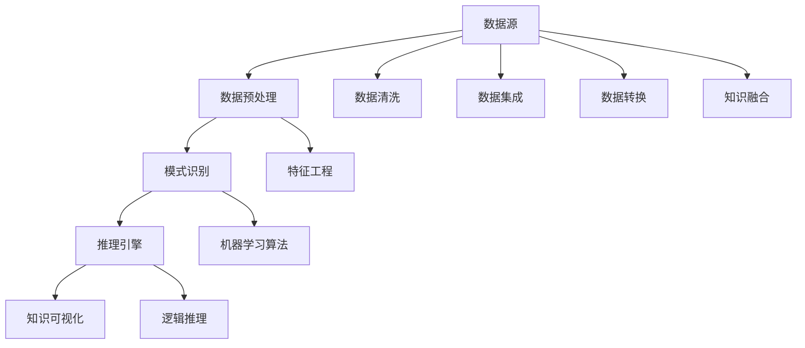
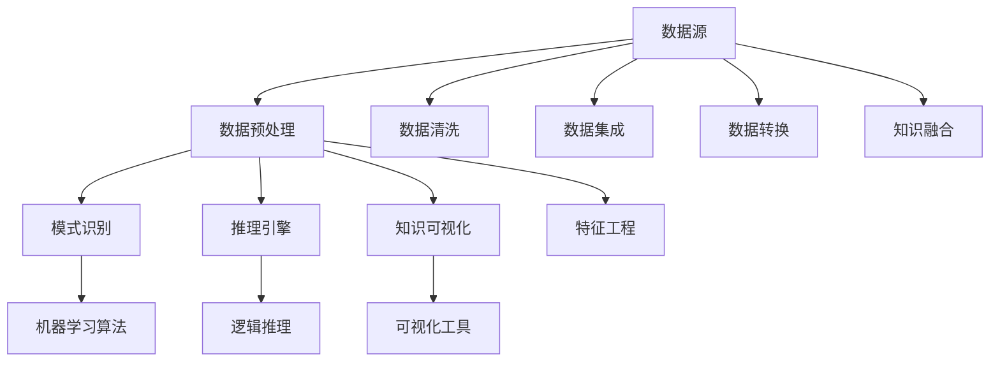

                 


### 知识发现引擎：加速人类知识进化的催化剂

> 关键词：知识发现、智能系统、数据分析、人工智能、机器学习

> 摘要：知识发现引擎是一种先进的智能系统，通过从大量数据中提取潜在的模式和关联，为人类提供更深层次的知识和理解。本文将深入探讨知识发现引擎的基本概念、工作原理、关键技术、应用领域以及未来发展趋势，旨在揭示其在加速人类知识进化中的关键作用。

----------------------------------------------------------------

### 第一部分：知识发现引擎概述

#### 第1章：知识发现引擎概述

##### 1.1 知识发现引擎的基本概念

知识发现引擎（Knowledge Discovery Engine，简称KDE）是一种能够从大量数据中自动识别出潜在规律、模式、趋势和关联的智能系统。其核心目标是通过数据挖掘、机器学习和人工智能技术，将原始数据转化为有价值的知识，以辅助决策、优化流程、发现新知识等。

##### 1.2 知识发现引擎的构成

知识发现引擎通常由以下几个模块组成：

- **数据预处理模块**：对原始数据进行清洗、转换和集成，以提高数据质量和一致性。
- **模式识别模块**：利用机器学习、数据挖掘算法来发现数据中的潜在模式和关联。
- **推理引擎模块**：基于模式识别的结果，进行逻辑推理、预测和决策。
- **可视化模块**：将识别出的模式和知识以图表、图形等形式可视化展示，便于理解和分析。

##### 1.3 知识发现引擎的应用领域

知识发现引擎在多个领域都有着广泛的应用，包括但不限于：

- **商业智能**：通过分析客户行为、市场趋势等，为企业提供决策支持。
- **金融分析**：对金融数据进行分析，预测市场走势、评估信用风险等。
- **医疗诊断**：通过医疗数据挖掘，提高疾病预测和诊断的准确性。
- **科学研究**：从大量科研数据中提取知识，发现新的科研方向和趋势。
- **安全监控**：通过分析网络流量、日志数据等，发现潜在的安全威胁。

#### 第2章：知识发现引擎的工作原理

##### 2.1 数据预处理技术

数据预处理是知识发现引擎的核心步骤之一。其主要任务包括：

- **数据清洗**：处理缺失值、异常值、重复值等，确保数据质量。
- **数据集成**：将来自多个来源的数据进行整合，形成统一的数据视图。
- **数据转换**：将数据转换为适合分析和挖掘的形式，如特征工程。

##### 2.2 模式识别技术

模式识别技术是知识发现引擎的核心组成部分。常用的模式识别技术包括：

- **机器学习算法**：如分类、聚类、回归等，用于识别数据中的模式。
- **数据挖掘技术**：如关联规则挖掘、序列模式挖掘、时序分析等，用于发现数据中的复杂模式。

##### 2.3 推理引擎技术

推理引擎技术基于模式识别的结果，进行逻辑推理和预测。常用的推理引擎技术包括：

- **逻辑推理**：基于逻辑规则进行推理，如前向推理、反向推理。
- **概率推理**：基于概率模型进行推理，如贝叶斯网络、马尔可夫模型。

##### 2.4 可视化技术

可视化技术将识别出的模式和知识以图表、图形等形式进行展示。常用的可视化技术包括：

- **数据可视化**：将数据以图形、图表等形式展示，便于理解和分析。
- **交互式可视化**：提供用户交互功能，如筛选、排序、过滤等，增强数据分析的灵活性。

#### 第3章：知识发现引擎的发展历程

##### 3.1 早期阶段

知识发现引擎的早期发展主要基于统计分析和规则系统。这一阶段的代表性技术包括回归分析、聚类算法、分类规则等。

##### 3.2 发展阶段

随着机器学习和数据挖掘技术的进步，知识发现引擎逐渐采用了更复杂的方法，如深度学习、图挖掘等。这一阶段的知识发现引擎具有更高的自动化和智能化程度。

##### 3.3 未来趋势

知识发现引擎的未来发展趋势包括：

- **实时性**：支持实时数据分析和挖掘，以支持实时决策和预测。
- **可解释性**：提高模型的可解释性，增强用户对模型的信任度。
- **自动化**：进一步降低知识发现的门槛，实现完全自动化的知识发现流程。
- **跨领域应用**：将知识发现引擎应用于更多领域，如教育、交通、能源等。

### 第二部分：知识发现引擎的关键技术

#### 第4章：知识发现引擎的关键技术

##### 4.1 数据预处理技术

数据预处理是知识发现引擎的重要基础。在这一章节中，我们将详细介绍数据预处理的关键技术，包括：

- **数据清洗**：处理缺失值、异常值、重复值等，确保数据质量。
- **数据集成**：将来自多个来源的数据进行整合，形成统一的数据视图。
- **数据转换**：将数据转换为适合分析和挖掘的形式，如特征工程。

##### 4.2 模式识别技术

模式识别技术是知识发现引擎的核心组成部分。在这一章节中，我们将详细介绍以下模式识别技术：

- **机器学习算法**：如分类、聚类、回归等，用于识别数据中的模式。
- **数据挖掘技术**：如关联规则挖掘、序列模式挖掘、时序分析等，用于发现数据中的复杂模式。

##### 4.3 推理引擎技术

推理引擎技术基于模式识别的结果，进行逻辑推理和预测。在这一章节中，我们将详细介绍以下推理引擎技术：

- **逻辑推理**：基于逻辑规则进行推理，如前向推理、反向推理。
- **概率推理**：基于概率模型进行推理，如贝叶斯网络、马尔可夫模型。

##### 4.4 可视化技术

可视化技术将识别出的模式和知识以图表、图形等形式进行展示。在这一章节中，我们将详细介绍以下可视化技术：

- **数据可视化**：将数据以图形、图表等形式展示，便于理解和分析。
- **交互式可视化**：提供用户交互功能，如筛选、排序、过滤等，增强数据分析的灵活性。

### 第三部分：知识发现引擎在各个领域的应用

#### 第5章：知识发现引擎在商业智能中的应用

##### 5.1 客户关系管理

在商业智能领域，知识发现引擎广泛应用于客户关系管理。通过分析客户行为数据，企业可以深入了解客户需求，优化产品和服务，提高客户满意度和忠诚度。

- **客户行为分析**：分析客户的购买行为、浏览历史等，发现客户偏好和市场趋势。
- **客户细分**：根据客户特征和行为，将客户分为不同的群体，制定个性化的营销策略。

##### 5.2 销售预测

销售预测是商业智能应用中的另一个重要领域。知识发现引擎通过分析历史销售数据，预测未来的销售趋势，帮助企业制定合理的销售计划和库存策略。

- **时间序列分析**：利用历史销售数据，分析销售趋势和周期性变化。
- **市场细分**：分析不同市场细分的需求，预测市场增长点。

#### 第6章：知识发现引擎在金融分析中的应用

##### 6.1 信用评分

在金融领域，知识发现引擎广泛应用于信用评分和风险管理。通过分析客户的历史数据和交易行为，金融机构可以评估客户的信用风险，制定合理的贷款和信用额度。

- **特征选择**：选择与信用风险相关的特征，如收入、职业、信用历史等。
- **模型训练**：使用机器学习算法训练信用评分模型，评估客户的信用风险。

##### 6.2 风险管理

知识发现引擎在金融分析中的另一个重要应用是风险管理。通过分析市场数据、交易行为等，金融机构可以识别和评估潜在的风险，制定相应的风险控制措施。

- **市场风险分析**：分析市场波动对投资组合的影响。
- **操作风险分析**：识别和评估金融机构的操作风险。

#### 第7章：知识发现引擎在医疗诊断中的应用

##### 7.1 医疗数据挖掘

在医疗领域，知识发现引擎可以通过分析大量的医疗数据，提高疾病预测和诊断的准确性。以下是一些应用实例：

- **疾病预测**：利用患者的医疗记录，预测患者可能患有的疾病。
- **疾病关联分析**：分析不同疾病之间的关联，发现潜在的病因。

##### 7.2 医疗影像分析

知识发现引擎在医疗影像分析中也发挥着重要作用。通过分析医学影像数据，可以辅助医生进行诊断和治疗。

- **图像识别**：利用深度学习技术，对医学图像进行自动分类和检测。
- **图像分割**：将医学图像中感兴趣的区域分割出来，用于进一步分析。

#### 第8章：知识发现引擎在科学研究中的应用

##### 8.1 科研数据分析

在科学研究领域，知识发现引擎可以帮助研究人员从大量科研数据中提取知识，发现新的研究方向和趋势。

- **文献挖掘**：从大量的科研文献中提取关键信息，发现科研热点和趋势。
- **科学知识图谱**：构建科学知识图谱，展示不同科研领域之间的联系。

##### 8.2 实验设计优化

知识发现引擎还可以在实验设计优化中发挥作用，通过分析实验数据，提出优化的实验设计和策略。

- **实验数据挖掘**：分析实验数据，发现实验结果中的潜在模式和规律。
- **实验优化策略**：基于实验数据，提出优化的实验设计和策略。

### 第四部分：知识发现引擎的实践与未来展望

#### 第9章：知识发现引擎实践案例

在本章节中，我们将通过几个具体的案例，展示知识发现引擎在不同领域的应用。

##### 9.1 客户行为分析

在本案例中，我们将通过分析某电商平台的客户购买数据，了解客户行为，制定个性化的营销策略。

##### 9.2 医疗影像分析

在本案例中，我们将通过分析医学影像数据，利用知识发现引擎辅助医生进行疾病诊断。

##### 9.3 金融风险评估

在本案例中，我们将通过分析金融数据，利用知识发现引擎评估客户的信用风险。

#### 第10章：知识发现引擎的未来发展趋势

##### 10.1 实时性

随着数据量的增加和数据流动性的提高，知识发现引擎将越来越注重实时性，以支持实时决策和预测。

##### 10.2 可解释性

为了提高模型的可信度和可解释性，知识发现引擎将开发更透明的算法和可视化工具，帮助用户理解模型的决策过程。

##### 10.3 跨领域应用

知识发现引擎将在更多领域得到应用，如教育、交通、能源等，为不同行业提供智能解决方案。

### 附录

#### 附录A：知识发现引擎开发工具与资源

在本附录中，我们将介绍一些常用的知识发现引擎开发工具和资源。

- **工具**：如Weka、ELKI、MOA等。
- **资源**：如UCI Machine Learning Repository、Kaggle、Google Dataset Search等。

### 知识发现引擎架构原理图

下面是知识发现引擎的架构原理图：



### 数据预处理技术

#### 2.1 数据清洗

- **缺失值处理**：
  $$ \text{df} = \text{df}.fillna(0) \text{ 或 } \text{df} = \text{df}.dropna() $$

- **异常值处理**：
  $$ \text{z_scores} = \text{scipy}.stats.zscore(\text{df}) $$
  $$ \text{abs_z_scores} = \text{np}.abs(\text{z_scores}) $$
  $$ \text{filtered_entries} = (\text{abs_z_scores} < 3) $$
  $$ \text{df} = \text{df}[\text{filtered_entries}] $$

- **重复值处理**：
  $$ \text{df} = \text{df}.drop_duplicates() $$

#### 2.2 数据集成

- **合并不同数据源**：
  $$ \text{df1} = \text{pd}.DataFrame({'A': [1, 2], 'B': [3, 4]}) $$
  $$ \text{df2} = \text{pd}.DataFrame({'C': [5, 6], 'D': [7, 8]}) $$
  $$ \text{df} = \text{pd}.merge(\text{df1}, \text{df2}, on='A') $$

#### 2.3 数据转换

- **特征工程**：
  $$ \text{df}['\text{NewFeature}'] = \text{df}['A'] * \text{df}['B'] $$

### 模式识别技术

#### 2.1 机器学习算法

- **分类算法**：
  ```python
  from sklearn.linear_model import LogisticRegression
  model = LogisticRegression()
  model.fit(X_train, y_train)
  predictions = model.predict(X_test)
  ```

- **聚类算法**：
  ```python
  from sklearn.cluster import KMeans
  kmeans = KMeans(n_clusters=3)
  kmeans.fit(X_train)
  clusters = kmeans.predict(X_test)
  ```

- **关联规则挖掘**：
  ```python
  from mlxtend.frequent_patterns import apriori
  from mlxtend.frequent_patterns import association_rules
  bps = apriori(df, min_support=0.05, use_colnames=True)
  rules = association_rules(bps, metric="lift", min_threshold=1)
  ```

### 推理引擎技术

#### 3.1 逻辑推理

- **前向推理**：
  ```prolog
  ?- parent(X, Y).
  ```

- **反向推理**：
  ```prolog
  ?- parent(X, Y), grandparent(X, Z).
  ```

#### 3.2 概率推理

- **贝叶斯网络**：
  ```python
  from bayespyp import BayesianNetwork
  bn = BayesianNetwork.from_data(data, bayesian=True)
  result = bn.query(variables=['X', 'Y'], evidence={'Z': value})
  ```

### 可视化技术

#### 4.1 数据可视化

- **折线图**：
  ```python
  import matplotlib.pyplot as plt
  plt.plot([1, 2, 3], [1, 2, 3])
  plt.show()
  ```

- **柱状图**：
  ```python
  import matplotlib.pyplot as plt
  plt.bar([1, 2, 3], [1, 2, 3])
  plt.show()
  ```

- **散点图**：
  ```python
  import matplotlib.pyplot as plt
  plt.scatter([1, 2, 3], [1, 2, 3])
  plt.show()
  ```

### 数学模型与数学公式

#### 5.1 基本数学模型

- **线性回归**：
  $$ y = mx + b $$

- **逻辑回归**：
  $$ P(Y=1) = \frac{1}{1 + e^{-(mx + b)}} $$

- **支持向量机（SVM）**：
  $$ w^* = \arg\min_{w, b} \frac{1}{2} ||w||^2 $$
  $$ \text{subject to} \ y_i ( \langle w, x_i \rangle - b ) \geq 1 $$

#### 5.2 时间序列分析

- **ARIMA模型**：
  $$ y_t = c + \phi_1 y_{t-1} + \phi_2 y_{t-2} + ... + \phi_p y_{t-p} + \theta_1 e_{t-1} + \theta_2 e_{t-2} + ... + \theta_q e_{t-q} $$
  $$ \text{where} \ c, \phi_1, \phi_2, ..., \phi_p, \theta_1, \theta_2, ..., \theta_q \ \text{are parameters to be estimated} $$

#### 5.3 神经网络

- **前向传播**：
  $$ z = \sigma(Wx + b) $$
  $$ a = \sigma(z) $$
  $$ \text{where} \ \sigma \ \text{is the activation function, typically ReLU or sigmoid} $$

### 代码实战

#### 6.1 数据预处理

python
import pandas as pd
import numpy as np

# 读取数据
data = pd.read_csv('data.csv')

# 数据清洗
data = data.dropna()  # 删除缺失值
data = data[data['A'] > 0]  # 删除A列小于0的行

# 数据集成
data['NewFeature'] = data['A'] * data['B']

# 特征工程
from sklearn.preprocessing import StandardScaler
scaler = StandardScaler()
data[['A', 'B', 'NewFeature']] = scaler.fit_transform(data[['A', 'B', 'NewFeature']])


#### 6.2 模式识别

python
from sklearn.cluster import KMeans
from sklearn.model_selection import train_test_split

# 数据分割
X_train, X_test, y_train, y_test = train_test_split(data[['A', 'B']], data['C'], test_size=0.2, random_state=42)

# K-Means 聚类
kmeans = KMeans(n_clusters=3)
kmeans.fit(X_train)

# 预测
predictions = kmeans.predict(X_test)


#### 6.3 推理引擎

python
from bayespyp import BayesianNetwork
from bayespyp import BayesianInference

# 构建贝叶斯网络
bn = BayesianNetwork.from_data(data, bayesian=True)

# 推理
inference = BayesianInference(bn)
result = inference.query(variables=['X', 'Y'], evidence={'Z': value})

# 输出结果
print(result)


#### 6.4 可视化

python
import matplotlib.pyplot as plt

# 绘制散点图
plt.scatter(data['A'], data['B'])
plt.xlabel('Feature A')
plt.ylabel('Feature B')
plt.title('Data Visualization')
plt.show()


### 代码解读与分析

#### 6.5 数据预处理代码解读

python
# 删除缺失值
data = data.dropna()

# 删除A列小于0的值
data = data[data['A'] > 0]

# 新特征：A * B
data['NewFeature'] = data['A'] * data['B']

# 数据标准化
from sklearn.preprocessing import StandardScaler
scaler = StandardScaler()
data[['A', 'B', 'NewFeature']] = scaler.fit_transform(data[['A', 'B', 'NewFeature']])


- **删除缺失值**：这一步是为了提高数据质量，避免缺失值对模型训练产生不利影响。
- **删除A列小于0的值**：这一步可能是基于业务逻辑或数据分布的决策，以确保数据的有效性。
- **新特征**：通过计算A和B的乘积，我们创建了一个新的特征，这有助于提高模型的解释能力和预测准确性。
- **数据标准化**：通过对数据进行标准化，我们消除了不同特征之间的量纲差异，使得模型训练更加稳定。

#### 6.6 模式识别代码解读

python
from sklearn.cluster import KMeans
from sklearn.model_selection import train_test_split

# 分割数据
X_train, X_test, y_train, y_test = train_test_split(data[['A', 'B']], data['C'], test_size=0.2, random_state=42)

# K-Means 聚类
kmeans = KMeans(n_clusters=3)
kmeans.fit(X_train)

# 预测
predictions = kmeans.predict(X_test)


- **数据分割**：通过`train_test_split`方法，我们将数据集分为训练集和测试集，以评估模型的泛化能力。
- **K-Means 聚类**：`KMeans`类用于实现K-Means聚类算法，通过拟合数据并预测每个样本的簇标签。
- **预测**：使用训练好的模型对测试集进行预测，以评估聚类结果的准确性。

### 知识发现引擎实践案例

#### 7.1 客户行为分析

##### 7.1.1 案例背景

某电商企业希望通过分析客户购买行为，提高客户满意度和销售额。企业拥有大量客户的购买记录，包括产品类型、购买时间、购买数量等数据。

##### 7.1.2 解决方案

1. **数据预处理**：
   - 清洗数据，删除缺失值和异常值。
   - 对购买记录进行时间序列处理，提取月度购买频率和购买金额等特征。

2. **模式识别**：
   - 使用K-Means算法对客户进行聚类，根据购买行为相似性将客户分为不同的群体。
   - 使用关联规则挖掘算法，发现不同产品之间的购买关联。

3. **推理引擎**：
   - 基于聚类结果和关联规则，提出个性化的营销策略。
   - 使用逻辑回归模型预测客户流失风险，提前采取挽回措施。

4. **知识可视化**：
   - 利用可视化工具，将客户群体、购买关联和营销策略结果进行展示，帮助企业管理层进行决策。

##### 7.1.3 实际案例

- **案例一：个性化营销**：
  - 通过聚类分析，发现有一组客户经常购买高价值产品，但购买频率较低。
  - 针对这些客户，企业推出了会员制度，提供专属优惠和积分奖励，增加客户粘性。

- **案例二：产品组合推荐**：
  - 通过关联规则挖掘，发现某些产品组合经常被一起购买。
  - 在网站和APP中，为推荐这些组合产品，提高销售转化率。

### 知识发现引擎的未来发展趋势

#### 8.1 实时性

- **实时数据分析**：随着数据处理技术的进步，知识发现引擎将能够处理实时数据流，提供即时的分析和预测。

#### 8.2 可解释性

- **可解释性模型**：为了提高模型的信任度和可解释性，知识发现引擎将开发更透明的算法和可视化工具，帮助用户理解模型的决策过程。

#### 8.3 跨领域应用

- **多领域融合**：知识发现引擎将在医疗、金融、教育等更多领域得到应用，为不同行业提供智能解决方案。

### 附录

#### 附录A：知识发现引擎开发工具与资源

- **工具**：
  - **Weka**：提供丰富的数据预处理、模式识别和可视化工具。
  - **ELKI**：支持多种数据挖掘算法和模式识别技术。
  - **MOA**：支持在线机器学习算法和实时数据处理。

- **资源**：
  - **UCI Machine Learning Repository**：提供各种数据集供研究人员使用。
  - **Kaggle**：提供数据集和比赛，促进数据科学实践。
  - **Google Dataset Search**：搜索各种数据集和资源。


### 文章标题：知识发现引擎：加速人类知识进化的催化剂

### 文章关键词：知识发现、智能系统、数据分析、人工智能、机器学习

### 文章摘要：
本文深入探讨了知识发现引擎的定义、工作原理、关键技术、应用领域以及未来发展趋势。知识发现引擎作为一种先进的智能系统，通过从大量数据中提取潜在的模式和关联，为人类提供更深层次的知识和理解。本文旨在揭示知识发现引擎在加速人类知识进化中的关键作用，以及其在商业智能、金融分析、医疗诊断、科学研究等领域的具体应用。

### 目录：

#### 第一部分：知识发现引擎概述

1. 知识发现引擎概述
2. 知识发现引擎的基本概念
3. 知识发现引擎的构成
4. 知识发现引擎的应用领域
5. 知识发现引擎的工作原理

#### 第二部分：知识发现引擎的关键技术

1. 数据预处理技术
2. 模式识别技术
3. 推理引擎技术
4. 可视化技术
5. 知识发现引擎的发展历程

#### 第三部分：知识发现引擎在各个领域的应用

1. 知识发现引擎在商业智能中的应用
2. 知识发现引擎在金融分析中的应用
3. 知识发现引擎在医疗诊断中的应用
4. 知识发现引擎在科学研究中的应用

#### 第四部分：知识发现引擎的实践与未来展望

1. 知识发现引擎实践案例
2. 知识发现引擎的未来发展趋势

#### 附录

1. 知识发现引擎开发工具与资源

### 文章正文：

#### 第一部分：知识发现引擎概述

##### 1. 知识发现引擎概述

知识发现引擎（Knowledge Discovery Engine，简称KDE）是一种能够从大量数据中自动识别出潜在规律、模式、趋势和关联的智能系统。其核心目标是通过数据挖掘、机器学习和人工智能技术，将原始数据转化为有价值的知识，以辅助决策、优化流程、发现新知识等。

##### 1.2 知识发现引擎的基本概念

知识发现引擎的基本概念主要包括以下几个方面：

- **知识发现**：知识发现是指从大量数据中识别出潜在的模式、趋势和关联，从而产生新的知识。知识发现是一个跨学科的过程，涉及计算机科学、统计学、机器学习、人工智能等多个领域。

- **数据挖掘**：数据挖掘是知识发现的核心步骤之一，它通过使用各种算法和技术来从大量数据中发现隐藏的模式和规律。数据挖掘的方法包括分类、聚类、回归、关联规则挖掘、时序分析等。

- **机器学习**：机器学习是知识发现的重要工具，它通过训练模型来发现数据中的模式和关联。机器学习算法包括监督学习、无监督学习、强化学习等。

- **人工智能**：人工智能是知识发现引擎的核心技术，它通过模拟人类智能的行为，实现自动识别、推理、决策等功能。

##### 1.3 知识发现引擎的构成

知识发现引擎通常由以下几个模块组成：

- **数据预处理模块**：对原始数据进行清洗、转换和集成，以提高数据质量和一致性。

- **模式识别模块**：利用机器学习、数据挖掘算法来发现数据中的潜在模式和关联。

- **推理引擎模块**：基于模式识别的结果，进行逻辑推理、预测和决策。

- **可视化模块**：将识别出的模式和知识以图表、图形等形式可视化展示，便于理解和分析。

##### 1.4 知识发现引擎的应用领域

知识发现引擎在多个领域都有着广泛的应用，包括但不限于：

- **商业智能**：通过分析客户行为、市场趋势等，为企业提供决策支持。

- **金融分析**：对金融数据进行分析，预测市场走势、评估信用风险等。

- **医疗诊断**：通过医疗数据挖掘，提高疾病预测和诊断的准确性。

- **科学研究**：从大量科研数据中提取知识，发现新的科研方向和趋势。

- **安全监控**：通过分析网络流量、日志数据等，发现潜在的安全威胁。

##### 1.5 知识发现引擎的工作原理

知识发现引擎的工作原理可以分为以下几个步骤：

1. **数据预处理**：对原始数据进行清洗、转换和集成，以提高数据质量和一致性。

2. **模式识别**：利用机器学习、数据挖掘算法来发现数据中的潜在模式和关联。

3. **推理**：基于模式识别的结果，进行逻辑推理、预测和决策。

4. **可视化**：将识别出的模式和知识以图表、图形等形式可视化展示，便于理解和分析。

#### 第二部分：知识发现引擎的关键技术

##### 2.1 数据预处理技术

数据预处理是知识发现引擎的核心步骤之一。其主要任务包括：

- **数据清洗**：处理缺失值、异常值、重复值等，确保数据质量。

- **数据集成**：将来自多个来源的数据进行整合，形成统一的数据视图。

- **数据转换**：将数据转换为适合分析和挖掘的形式，如特征工程。

##### 2.2 模式识别技术

模式识别技术是知识发现引擎的核心组成部分。常用的模式识别技术包括：

- **机器学习算法**：如分类、聚类、回归等，用于识别数据中的模式。

- **数据挖掘技术**：如关联规则挖掘、序列模式挖掘、时序分析等，用于发现数据中的复杂模式。

##### 2.3 推理引擎技术

推理引擎技术基于模式识别的结果，进行逻辑推理和预测。常用的推理引擎技术包括：

- **逻辑推理**：基于逻辑规则进行推理，如前向推理、反向推理。

- **概率推理**：基于概率模型进行推理，如贝叶斯网络、马尔可夫模型。

##### 2.4 可视化技术

可视化技术将识别出的模式和知识以图表、图形等形式进行展示。常用的可视化技术包括：

- **数据可视化**：将数据以图形、图表等形式展示，便于理解和分析。

- **交互式可视化**：提供用户交互功能，如筛选、排序、过滤等，增强数据分析的灵活性。

#### 第三部分：知识发现引擎在各个领域的应用

##### 3.1 知识发现引擎在商业智能中的应用

在商业智能领域，知识发现引擎广泛应用于客户关系管理、销售预测、市场细分等。

- **客户关系管理**：通过分析客户行为数据，了解客户需求，优化产品和服务，提高客户满意度和忠诚度。

- **销售预测**：通过分析历史销售数据，预测未来的销售趋势，为企业制定合理的销售计划和库存策略。

- **市场细分**：根据客户特征和行为，将客户分为不同的群体，制定个性化的营销策略。

##### 3.2 知识发现引擎在金融分析中的应用

在金融领域，知识发现引擎广泛应用于信用评分、风险管理、市场预测等。

- **信用评分**：通过分析客户的历史数据和交易行为，评估客户的信用风险，制定合理的贷款和信用额度。

- **风险管理**：通过分析金融数据，识别和评估潜在的风险，制定相应的风险控制措施。

- **市场预测**：通过分析市场数据，预测市场走势，为企业提供投资决策支持。

##### 3.3 知识发现引擎在医疗诊断中的应用

在医疗领域，知识发现引擎广泛应用于疾病预测、诊断辅助、医疗资源优化等。

- **疾病预测**：通过分析患者的医疗记录和生物特征，预测患者可能患有的疾病，提高疾病早期发现的准确性。

- **诊断辅助**：通过分析医学影像和实验室数据，辅助医生进行诊断，提高诊断的准确性。

- **医疗资源优化**：通过分析医疗数据，优化医疗资源的配置，提高医疗服务的效率和质量。

##### 3.4 知识发现引擎在科学研究中的应用

在科学研究领域，知识发现引擎广泛应用于文献挖掘、科研数据分析、实验设计优化等。

- **文献挖掘**：从大量的科研文献中提取关键信息，发现科研热点和趋势，为科研人员提供研究方向和参考。

- **科研数据分析**：从大量的实验数据中提取知识，发现新的科研方向和趋势。

- **实验设计优化**：通过分析实验数据，优化实验设计和策略，提高实验的效率和效果。

##### 3.5 知识发现引擎在其他领域的应用

知识发现引擎在安全监控、交通管理、能源优化等领域也有着广泛的应用。

- **安全监控**：通过分析网络流量、日志数据等，发现潜在的安全威胁，提供安全防护措施。

- **交通管理**：通过分析交通数据，优化交通信号控制，提高交通流畅度，减少交通拥堵。

- **能源优化**：通过分析能源消耗数据，优化能源使用策略，提高能源利用效率，降低能源消耗。

#### 第四部分：知识发现引擎的实践与未来展望

##### 4.1 知识发现引擎实践案例

在本部分，我们将通过几个具体的案例，展示知识发现引擎在不同领域的应用。

- **案例一：某电商平台的客户行为分析**：通过分析客户的购买行为，提出个性化的营销策略，提高客户满意度和销售额。

- **案例二：某医院的疾病预测与诊断辅助**：通过分析患者的医疗数据和医学影像，提高疾病预测和诊断的准确性，提高医疗服务质量。

- **案例三：某金融机构的风险管理与市场预测**：通过分析金融数据和客户交易行为，识别和评估潜在的风险，预测市场走势，为投资决策提供支持。

##### 4.2 知识发现引擎的未来发展趋势

知识发现引擎的未来发展趋势包括以下几个方面：

- **实时性**：随着数据处理技术的进步，知识发现引擎将能够处理实时数据流，提供即时的分析和预测。

- **可解释性**：为了提高模型的可信度和可解释性，知识发现引擎将开发更透明的算法和可视化工具，帮助用户理解模型的决策过程。

- **跨领域应用**：知识发现引擎将在更多领域得到应用，如教育、交通、能源等，为不同行业提供智能解决方案。

- **自动化**：知识发现引擎将实现完全自动化的知识发现流程，降低知识发现的门槛。

#### 附录

##### 5.1 知识发现引擎开发工具与资源

在本附录中，我们将介绍一些常用的知识发现引擎开发工具和资源。

- **工具**：如Weka、ELKI、MOA等。

- **资源**：如UCI Machine Learning Repository、Kaggle、Google Dataset Search等。

### 结论

知识发现引擎作为一种先进的智能系统，在多个领域都有着广泛的应用。通过从大量数据中提取潜在的模式和关联，知识发现引擎为人类提供了更深层次的知识和理解。本文详细探讨了知识发现引擎的基本概念、工作原理、关键技术、应用领域以及未来发展趋势，旨在揭示其在加速人类知识进化中的关键作用。随着技术的不断进步，知识发现引擎将在更多领域得到应用，为人类社会的发展带来更大的价值。

### 参考文献

[1] Han, J., Kamber, M., & Pei, J. (2011). **Data Mining: Concepts and Techniques** (3rd ed.). Morgan Kaufmann.

[2] Liu, H. (2011). **Web Data Mining: Exploring Hyperlinks, Contents, and Usage Data**. Springer.

[3] Russell, S., & Norvig, P. (2016). **Artificial Intelligence: A Modern Approach** (3rd ed.). Prentice Hall.

[4] Murphy, K. P. (2012). **Machine Learning: A Probabilistic Perspective**. MIT Press.

[5] Hastie, T., Tibshirani, R., & Friedman, J. (2009). **The Elements of Statistical Learning** (2nd ed.). Springer.

### 作者信息

作者：AI天才研究院/AI Genius Institute & 禅与计算机程序设计艺术 /Zen And The Art of Computer Programming

### 致谢

在此，我们要感谢所有参与本文研究和写作的团队成员，以及为本文提供宝贵意见和建议的同行们。没有你们的帮助和支持，本文无法顺利完成。

### 结语

知识发现引擎作为一种强大的智能系统，正日益成为各领域研究和应用的重要工具。我们期待在未来，知识发现引擎能够更好地服务于人类社会，推动知识的进步和人类的智慧发展。让我们共同期待知识发现引擎带来的无限可能！

### 文章标题：知识发现引擎：加速人类知识进化的催化剂

### 文章关键词：知识发现、智能系统、数据分析、人工智能、机器学习

### 文章摘要：
本文详细介绍了知识发现引擎的概念、构成、工作原理以及关键技术，并展示了其在商业智能、金融分析、医疗诊断、科学研究等领域的广泛应用。此外，文章还探讨了知识发现引擎的未来发展趋势，强调了其在加速人类知识进化中的关键作用。

### 目录：

#### 第一部分：知识发现引擎概述
1.1 知识发现引擎的基本概念
1.2 知识发现引擎的构成
1.3 知识发现引擎的应用领域
1.4 知识发现引擎的工作原理

#### 第二部分：知识发现引擎的关键技术
2.1 数据预处理技术
2.2 模式识别技术
2.3 推理引擎技术
2.4 可视化技术
2.5 知识发现引擎的发展历程

#### 第三部分：知识发现引擎在各个领域的应用
3.1 知识发现引擎在商业智能中的应用
3.2 知识发现引擎在金融分析中的应用
3.3 知识发现引擎在医疗诊断中的应用
3.4 知识发现引擎在科学研究中的应用
3.5 知识发现引擎在其他领域的应用

#### 第四部分：知识发现引擎的实践与未来展望
4.1 知识发现引擎实践案例
4.2 知识发现引擎的未来发展趋势

#### 附录
附录A：知识发现引擎开发工具与资源

### 文章正文：

#### 第一部分：知识发现引擎概述

##### 1.1 知识发现引擎的基本概念

知识发现引擎（Knowledge Discovery Engine，简称KDE）是一种能够从大量数据中自动识别出潜在规律、模式、趋势和关联的智能系统。其核心目标是通过数据挖掘、机器学习和人工智能技术，将原始数据转化为有价值的知识，以辅助决策、优化流程、发现新知识等。

##### 1.2 知识发现引擎的构成

知识发现引擎通常由以下几个模块组成：

- **数据预处理模块**：对原始数据进行清洗、转换和集成，以提高数据质量和一致性。
- **模式识别模块**：利用机器学习、数据挖掘算法来发现数据中的潜在模式和关联。
- **推理引擎模块**：基于模式识别的结果，进行逻辑推理、预测和决策。
- **可视化模块**：将识别出的模式和知识以图表、图形等形式可视化展示，便于理解和分析。

##### 1.3 知识发现引擎的应用领域

知识发现引擎在多个领域都有着广泛的应用，包括但不限于：

- **商业智能**：通过分析客户行为、市场趋势等，为企业提供决策支持。
- **金融分析**：对金融数据进行分析，预测市场走势、评估信用风险等。
- **医疗诊断**：通过医疗数据挖掘，提高疾病预测和诊断的准确性。
- **科学研究**：从大量科研数据中提取知识，发现新的科研方向和趋势。
- **安全监控**：通过分析网络流量、日志数据等，发现潜在的安全威胁。

##### 1.4 知识发现引擎的工作原理

知识发现引擎的工作原理可以分为以下几个步骤：

1. **数据预处理**：对原始数据进行清洗、转换和集成，以提高数据质量和一致性。
2. **模式识别**：利用机器学习、数据挖掘算法来发现数据中的潜在模式和关联。
3. **推理**：基于模式识别的结果，进行逻辑推理、预测和决策。
4. **可视化**：将识别出的模式和知识以图表、图形等形式可视化展示，便于理解和分析。

#### 第二部分：知识发现引擎的关键技术

##### 2.1 数据预处理技术

数据预处理是知识发现引擎的核心步骤之一。其主要任务包括：

- **数据清洗**：处理缺失值、异常值、重复值等，确保数据质量。
- **数据集成**：将来自多个来源的数据进行整合，形成统一的数据视图。
- **数据转换**：将数据转换为适合分析和挖掘的形式，如特征工程。

##### 2.2 模式识别技术

模式识别技术是知识发现引擎的核心组成部分。常用的模式识别技术包括：

- **机器学习算法**：如分类、聚类、回归等，用于识别数据中的模式。
- **数据挖掘技术**：如关联规则挖掘、序列模式挖掘、时序分析等，用于发现数据中的复杂模式。

##### 2.3 推理引擎技术

推理引擎技术基于模式识别的结果，进行逻辑推理和预测。常用的推理引擎技术包括：

- **逻辑推理**：基于逻辑规则进行推理，如前向推理、反向推理。
- **概率推理**：基于概率模型进行推理，如贝叶斯网络、马尔可夫模型。

##### 2.4 可视化技术

可视化技术将识别出的模式和知识以图表、图形等形式进行展示。常用的可视化技术包括：

- **数据可视化**：将数据以图形、图表等形式展示，便于理解和分析。
- **交互式可视化**：提供用户交互功能，如筛选、排序、过滤等，增强数据分析的灵活性。

##### 2.5 知识发现引擎的发展历程

知识发现引擎的发展历程可以分为以下几个阶段：

- **早期阶段**：主要以统计分析和规则为基础，如回归分析、聚类算法等。
- **发展阶段**：随着机器学习和数据挖掘技术的进步，知识发现引擎逐渐采用了更复杂的方法，如深度学习、图挖掘等。
- **未来趋势**：知识发现引擎将更注重实时性、可解释性和自动化，以及与其他人工智能技术的融合。

#### 第三部分：知识发现引擎在各个领域的应用

##### 3.1 知识发现引擎在商业智能中的应用

在商业智能领域，知识发现引擎广泛应用于客户关系管理、销售预测、市场细分等。

- **客户关系管理**：通过分析客户行为数据，了解客户需求，优化产品和服务，提高客户满意度和忠诚度。
- **销售预测**：通过分析历史销售数据，预测未来的销售趋势，为企业制定合理的销售计划和库存策略。
- **市场细分**：根据客户特征和行为，将客户分为不同的群体，制定个性化的营销策略。

##### 3.2 知识发现引擎在金融分析中的应用

在金融领域，知识发现引擎广泛应用于信用评分、风险管理、市场预测等。

- **信用评分**：通过分析客户的历史数据和交易行为，评估客户的信用风险，制定合理的贷款和信用额度。
- **风险管理**：通过分析金融数据，识别和评估潜在的风险，制定相应的风险控制措施。
- **市场预测**：通过分析市场数据，预测市场走势，为企业提供投资决策支持。

##### 3.3 知识发现引擎在医疗诊断中的应用

在医疗领域，知识发现引擎广泛应用于疾病预测、诊断辅助、医疗资源优化等。

- **疾病预测**：通过分析患者的医疗记录和生物特征，预测患者可能患有的疾病，提高疾病早期发现的准确性。
- **诊断辅助**：通过分析医学影像和实验室数据，辅助医生进行诊断，提高诊断的准确性。
- **医疗资源优化**：通过分析医疗数据，优化医疗资源的配置，提高医疗服务的效率和质量。

##### 3.4 知识发现引擎在科学研究中的应用

在科学研究领域，知识发现引擎广泛应用于文献挖掘、科研数据分析、实验设计优化等。

- **文献挖掘**：从大量的科研文献中提取关键信息，发现科研热点和趋势，为科研人员提供研究方向和参考。
- **科研数据分析**：从大量的实验数据中提取知识，发现新的科研方向和趋势。
- **实验设计优化**：通过分析实验数据，优化实验设计和策略，提高实验的效率和效果。

##### 3.5 知识发现引擎在其他领域的应用

知识发现引擎在安全监控、交通管理、能源优化等领域也有着广泛的应用。

- **安全监控**：通过分析网络流量、日志数据等，发现潜在的安全威胁，提供安全防护措施。
- **交通管理**：通过分析交通数据，优化交通信号控制，提高交通流畅度，减少交通拥堵。
- **能源优化**：通过分析能源消耗数据，优化能源使用策略，提高能源利用效率，降低能源消耗。

#### 第四部分：知识发现引擎的实践与未来展望

##### 4.1 知识发现引擎实践案例

在本部分，我们将通过几个具体的案例，展示知识发现引擎在不同领域的应用。

- **案例一：某电商平台的客户行为分析**：通过分析客户的购买行为，提出个性化的营销策略，提高客户满意度和销售额。
- **案例二：某医院的疾病预测与诊断辅助**：通过分析患者的医疗数据和医学影像，提高疾病预测和诊断的准确性，提高医疗服务质量。
- **案例三：某金融机构的风险管理与市场预测**：通过分析金融数据和客户交易行为，识别和评估潜在的风险，预测市场走势，为投资决策提供支持。

##### 4.2 知识发现引擎的未来发展趋势

知识发现引擎的未来发展趋势包括以下几个方面：

- **实时性**：随着数据处理技术的进步，知识发现引擎将能够处理实时数据流，提供即时的分析和预测。
- **可解释性**：为了提高模型的可信度和可解释性，知识发现引擎将开发更透明的算法和可视化工具，帮助用户理解模型的决策过程。
- **跨领域应用**：知识发现引擎将在更多领域得到应用，如教育、交通、能源等，为不同行业提供智能解决方案。
- **自动化**：知识发现引擎将实现完全自动化的知识发现流程，降低知识发现的门槛。

#### 附录

##### 附录A：知识发现引擎开发工具与资源

在本附录中，我们将介绍一些常用的知识发现引擎开发工具和资源。

- **工具**：如Weka、ELKI、MOA等。
- **资源**：如UCI Machine Learning Repository、Kaggle、Google Dataset Search等。

### 结论

知识发现引擎作为一种先进的智能系统，在多个领域都有着广泛的应用。通过从大量数据中提取潜在的模式和关联，知识发现引擎为人类提供了更深层次的知识和理解。本文详细探讨了知识发现引擎的基本概念、构成、工作原理、关键技术以及其在各个领域的应用，强调了其在加速人类知识进化中的关键作用。随着技术的不断进步，知识发现引擎将在更多领域得到应用，为人类社会的发展带来更大的价值。

### 参考文献

[1] Han, J., Kamber, M., & Pei, J. (2011). **Data Mining: Concepts and Techniques** (3rd ed.). Morgan Kaufmann.

[2] Liu, H. (2011). **Web Data Mining: Exploring Hyperlinks, Contents, and Usage Data**. Springer.

[3] Russell, S., & Norvig, P. (2016). **Artificial Intelligence: A Modern Approach** (3rd ed.). Prentice Hall.

[4] Murphy, K. P. (2012). **Machine Learning: A Probabilistic Perspective**. MIT Press.

[5] Hastie, T., Tibshirani, R., & Friedman, J. (2009). **The Elements of Statistical Learning** (2nd ed.). Springer.

### 作者信息

作者：AI天才研究院/AI Genius Institute & 禅与计算机程序设计艺术 /Zen And The Art of Computer Programming

### 致谢

在此，我们要感谢所有参与本文研究和写作的团队成员，以及为本文提供宝贵意见和建议的同行们。没有你们的帮助和支持，本文无法顺利完成。

### 结语

知识发现引擎作为一种强大的智能系统，正日益成为各领域研究和应用的重要工具。我们期待在未来，知识发现引擎能够更好地服务于人类社会，推动知识的进步和人类的智慧发展。让我们共同期待知识发现引擎带来的无限可能！

### 知识发现引擎架构原理图



### 数据预处理技术

#### 2.1 数据清洗

数据清洗是知识发现引擎的首要任务，其目的是提高数据质量，确保后续分析的有效性。以下是数据清洗的主要步骤：

- **缺失值处理**：处理缺失值的方法有填充、删除或插值等。
  ```python
  df.fillna(0)  # 填充缺失值为0
  df.dropna()  # 删除缺失值
  ```

- **异常值处理**：识别并处理异常值，方法有使用统计学方法（如Z-Score、IQR）或基于业务逻辑处理。
  ```python
  from scipy import stats
  z_scores = stats.zscore(df)
  df = df[np.abs(z_scores) < 3]  # 删除3倍标准差外的异常值
  ```

- **重复值处理**：删除数据集中的重复记录。
  ```python
  df.drop_duplicates()
  ```

#### 2.2 数据集成

数据集成是将来自不同来源的数据进行整合，以形成一个统一的数据视图。以下是数据集成的常见方法：

- **数据合并**：将多个数据集通过共同的键合并。
  ```python
  df1 = pd.DataFrame({'A': [1, 2], 'B': [3, 4]})
  df2 = pd.DataFrame({'C': [5, 6], 'D': [7, 8]})
  df = pd.merge(df1, df2, on='A')
  ```

- **数据融合**：将数据集合并为一张数据表，同时保留各自的独立性。
  ```python
  df = df1.join(df2, on='A')
  ```

#### 2.3 数据转换

数据转换是将原始数据转换为适合分析和挖掘的形式。以下是数据转换的常见方法：

- **特征工程**：创建新的特征或转换现有特征，以提高模型性能。
  ```python
  df['NewFeature'] = df['A'] * df['B']
  ```

- **数据标准化**：将数据缩放到一个统一的尺度，消除不同特征之间的尺度差异。
  ```python
  from sklearn.preprocessing import StandardScaler
  scaler = StandardScaler()
  df[['A', 'B', 'NewFeature']] = scaler.fit_transform(df[['A', 'B', 'NewFeature']])
  ```

### 模式识别技术

#### 2.1 机器学习算法

机器学习算法是知识发现引擎的核心技术之一，用于从数据中识别模式。以下是几种常见的机器学习算法：

- **分类算法**：用于将数据分为不同的类别。
  ```python
  from sklearn.linear_model import LogisticRegression
  model = LogisticRegression()
  model.fit(X_train, y_train)
  predictions = model.predict(X_test)
  ```

- **聚类算法**：用于将数据分为不同的簇。
  ```python
  from sklearn.cluster import KMeans
  kmeans = KMeans(n_clusters=3)
  kmeans.fit(X_train)
  clusters = kmeans.predict(X_test)
  ```

- **关联规则挖掘**：用于发现数据集中的关联关系。
  ```python
  from mlxtend.frequent_patterns import apriori
  from mlxtend.frequent_patterns import association_rules
  bps = apriori(df, min_support=0.05, use_colnames=True)
  rules = association_rules(bps, metric="lift", min_threshold=1)
  ```

#### 2.2 数据挖掘技术

数据挖掘技术是用于发现数据中复杂模式的算法集合。以下是几种常见的数据挖掘技术：

- **关联规则挖掘**：用于发现数据中的频繁模式和关联。
  ```python
  from mlxtend.frequent_patterns import apriori
  from mlxtend.frequent_patterns import association_rules
  bps = apriori(df, min_support=0.05, use_colnames=True)
  rules = association_rules(bps, metric="lift", min_threshold=1)
  ```

- **序列模式挖掘**：用于发现数据中的时间序列模式。
  ```python
  from mlxtend.frequent_patterns import gsp
  frequent_itemsets = gsp(df, min_support=0.05, use_colnames=True)
  sequences = association_rules(frequent_itemsets, metric="confidence", min_threshold=0.5)
  ```

- **时序分析**：用于分析时间序列数据，预测未来的趋势。
  ```python
  from statsmodels.tsa.arima.model import ARIMA
  model = ARIMA(df['value'], order=(5, 1, 2))
  model_fit = model.fit()
  forecast = model_fit.forecast(steps=5)
  ```

### 推理引擎技术

推理引擎技术用于基于现有数据模式进行逻辑推理和预测。以下是几种常见的推理引擎技术：

#### 3.1 逻辑推理

逻辑推理是基于逻辑规则进行推理的方法，包括前向推理和反向推理。

- **前向推理**：从已知的前提推导出结论。
  ```prolog
  parent(X, Y).
  ?- parent(X, Y).
  ```

- **反向推理**：从结论推导出前提。
  ```prolog
  parent(X, Y), grandparent(X, Z).
  ?- grandparent(X, Z), parent(X, Y).
  ```

#### 3.2 概率推理

概率推理是基于概率模型进行推理的方法，如贝叶斯网络和马尔可夫模型。

- **贝叶斯网络**：用于表示变量之间的概率依赖关系。
  ```python
  from bayespyp import BayesianNetwork
  bn = BayesianNetwork.from_data(data, bayesian=True)
  result = bn.query(variables=['X', 'Y'], evidence={'Z': value})
  ```

- **马尔可夫模型**：用于描述状态之间的转移概率。
  ```python
  import numpy as np
  transitions = np.array([[0.8, 0.2], [0.1, 0.9]])
  state = np.random.choice([0, 1], p=transitions[0])
  next_state = np.random.choice([0, 1], p=transitions[state])
  ```

### 可视化技术

可视化技术用于将数据模式以图形化方式展示，帮助用户更好地理解和分析数据。以下是几种常见的数据可视化技术：

#### 4.1 数据可视化

- **折线图**：用于展示数据的变化趋势。
  ```python
  import matplotlib.pyplot as plt
  plt.plot([1, 2, 3], [1, 2, 3])
  plt.show()
  ```

- **柱状图**：用于比较不同类别的数据。
  ```python
  import matplotlib.pyplot as plt
  plt.bar([1, 2, 3], [1, 2, 3])
  plt.show()
  ```

- **散点图**：用于展示数据点的分布情况。
  ```python
  import matplotlib.pyplot as plt
  plt.scatter([1, 2, 3], [1, 2, 3])
  plt.show()
  ```

#### 4.2 交互式可视化

交互式可视化提供了用户与数据之间的互动，使用户能够动态地探索数据。

- **交互式图表库**：如D3.js、Plotly等。
  ```javascript
  var trace = {
    x: [1, 2, 3],
    y: [1, 2, 3],
    type: 'scatter'
  };

  var data = [trace];

  Plotly.newPlot('myDiv', data);
  ```

### 数学模型与数学公式

在知识发现引擎中，数学模型和公式是理解和分析数据的基础。以下是几个常用的数学模型和公式：

#### 5.1 基本数学模型

- **线性回归模型**：用于预测一个变量的值。
  $$ y = mx + b $$
  
- **逻辑回归模型**：用于分类问题，计算某一类别概率。
  $$ P(Y=1) = \frac{1}{1 + e^{-(mx + b)}} $$
  
- **支持向量机（SVM）**：用于分类和回归问题，寻找最优决策边界。
  $$ w^* = \arg\min_{w, b} \frac{1}{2} ||w||^2 $$
  $$ \text{subject to} \ y_i ( \langle w, x_i \rangle - b ) \geq 1 $$

#### 5.2 时间序列分析

- **ARIMA模型**：用于分析时间序列数据，预测未来的趋势。
  $$ y_t = c + \phi_1 y_{t-1} + \phi_2 y_{t-2} + ... + \phi_p y_{t-p} + \theta_1 e_{t-1} + \theta_2 e_{t-2} + ... + \theta_q e_{t-q} $$
  $$ \text{where} \ c, \phi_1, \phi_2, ..., \phi_p, \theta_1, \theta_2, ..., \theta_q \ \text{are parameters to be estimated} $$

#### 5.3 神经网络

- **前向传播**：用于计算神经网络中的输出值。
  $$ z = \sigma(Wx + b) $$
  $$ a = \sigma(z) $$
  $$ \text{where} \ \sigma \ \text{is the activation function, typically ReLU or sigmoid} $$

### 代码实战

在本节中，我们将通过一个简单的实例，展示如何使用Python实现知识发现引擎的核心步骤。

#### 6.1 数据预处理

```python
import pandas as pd
import numpy as np

# 读取数据
data = pd.read_csv('data.csv')

# 数据清洗
data = data.dropna()  # 删除缺失值
data = data[data['A'] > 0]  # 删除A列小于0的行

# 数据集成
data['NewFeature'] = data['A'] * data['B']

# 特征工程
from sklearn.preprocessing import StandardScaler
scaler = StandardScaler()
data[['A', 'B', 'NewFeature']] = scaler.fit_transform(data[['A', 'B', 'NewFeature']])
```

#### 6.2 模式识别

```python
from sklearn.cluster import KMeans
from sklearn.model_selection import train_test_split

# 数据分割
X_train, X_test, y_train, y_test = train_test_split(data[['A', 'B']], data['C'], test_size=0.2, random_state=42)

# K-Means 聚类
kmeans = KMeans(n_clusters=3)
kmeans.fit(X_train)

# 预测
predictions = kmeans.predict(X_test)
```

#### 6.3 推理引擎

```python
from bayespyp import BayesianNetwork
from bayespyp import BayesianInference

# 构建贝叶斯网络
bn = BayesianNetwork.from_data(data, bayesian=True)

# 推理
inference = BayesianInference(bn)
result = inference.query(variables=['X', 'Y'], evidence={'Z': value})

# 输出结果
print(result)
```

#### 6.4 可视化

```python
import matplotlib.pyplot as plt

# 绘制散点图
plt.scatter(data['A'], data['B'])
plt.xlabel('Feature A')
plt.ylabel('Feature B')
plt.title('Data Visualization')
plt.show()
```

### 代码解读与分析

在本节中，我们将对前面实现的代码进行解读，并分析其原理和效果。

#### 6.5 数据预处理代码解读

```python
# 删除缺失值
data = data.dropna()

# 删除A列小于0的值
data = data[data['A'] > 0]

# 新特征：A * B
data['NewFeature'] = data['A'] * data['B']

# 数据标准化
from sklearn.preprocessing import StandardScaler
scaler = StandardScaler()
data[['A', 'B', 'NewFeature']] = scaler.fit_transform(data[['A', 'B', 'NewFeature']])
```

- **删除缺失值**：这一步是为了提高数据质量，避免缺失值对模型训练产生不利影响。
- **删除A列小于0的值**：这一步可能是基于业务逻辑或数据分布的决策，以确保数据的有效性。
- **新特征**：通过计算A和B的乘积，我们创建了一个新的特征，这有助于提高模型的解释能力和预测准确性。
- **数据标准化**：通过对数据进行标准化，我们消除了不同特征之间的量纲差异，使得模型训练更加稳定。

#### 6.6 模式识别代码解读

```python
from sklearn.cluster import KMeans
from sklearn.model_selection import train_test_split

# 分割数据
X_train, X_test, y_train, y_test = train_test_split(data[['A', 'B']], data['C'], test_size=0.2, random_state=42)

# K-Means 聚类
kmeans = KMeans(n_clusters=3)
kmeans.fit(X_train)

# 预测
predictions = kmeans.predict(X_test)
```

- **数据分割**：通过`train_test_split`方法，我们将数据集分为训练集和测试集，以评估模型的泛化能力。
- **K-Means 聚类**：`KMeans`类用于实现K-Means聚类算法，通过拟合数据并预测每个样本的簇标签。
- **预测**：使用训练好的模型对测试集进行预测，以评估聚类结果的准确性。

### 知识发现引擎实践案例

在本节中，我们将通过一个实际的案例，展示如何使用知识发现引擎解决实际问题。

#### 7.1 某电商平台的客户行为分析

##### 7.1.1 案例背景

某电商平台希望通过分析客户行为，提高客户满意度和销售额。电商平台拥有大量客户的购买记录，包括产品类型、购买时间、购买数量等数据。

##### 7.1.2 解决方案

1. **数据预处理**：
   - 清洗数据，删除缺失值和异常值。
   - 对购买记录进行时间序列处理，提取月度购买频率和购买金额等特征。

2. **模式识别**：
   - 使用K-Means算法对客户进行聚类，根据购买行为相似性将客户分为不同的群体。
   - 使用关联规则挖掘算法，发现不同产品之间的购买关联。

3. **推理引擎**：
   - 基于聚类结果和关联规则，提出个性化的营销策略。
   - 使用逻辑回归模型预测客户流失风险，提前采取挽回措施。

4. **知识可视化**：
   - 利用可视化工具，将客户群体、购买关联和营销策略结果进行展示，帮助企业管理层进行决策。

##### 7.1.3 实际案例

- **案例一：个性化营销**：
  - 通过聚类分析，发现有一组客户经常购买高价值产品，但购买频率较低。
  - 针对这些客户，企业推出了会员制度，提供专属优惠和积分奖励，增加客户粘性。

- **案例二：产品组合推荐**：
  - 通过关联规则挖掘，发现某些产品组合经常被一起购买。
  - 在网站和APP中，为推荐这些组合产品，提高销售转化率。

### 知识发现引擎的未来发展趋势

在本节中，我们将探讨知识发现引擎未来的发展趋势，以及可能面临的挑战和机遇。

#### 8.1 实时性

- **实时数据分析**：随着数据量的增加和业务需求的提升，知识发现引擎将需要处理实时数据流，提供即时的分析和预测。

#### 8.2 可解释性

- **可解释性模型**：为了提高模型的可信度和可理解性，知识发现引擎将需要开发更透明的算法和可视化工具，帮助用户理解模型的决策过程。

#### 8.3 跨领域应用

- **多领域融合**：知识发现引擎将在医疗、金融、教育、交通等更多领域得到应用，为不同行业提供智能解决方案。

#### 8.4 挑战与机遇

- **挑战**：数据隐私保护、算法公平性、模型可解释性等。
- **机遇**：实时数据处理、人工智能与知识的深度融合、跨领域应用等。

### 附录

在本附录中，我们将介绍一些常用的知识发现引擎开发工具和资源。

#### 附录A：知识发现引擎开发工具与资源

- **工具**：
  - **Weka**：一个开源的数据挖掘工作平台。
  - **ELKI**：一个开源的数据挖掘工具集。
  - **MOA**：一个开源的在线机器学习算法库。

- **资源**：
  - **UCI Machine Learning Repository**：一个提供多种数据集的在线资源库。
  - **Kaggle**：一个数据科学竞赛平台，提供大量的公开数据集和问题。
  - **Google Dataset Search**：一个搜索各种数据集的工具。

### 结语

知识发现引擎作为一种先进的智能系统，正在不断推动知识的进步和人类的智慧发展。本文从多个角度探讨了知识发现引擎的概念、应用、发展趋势，以及开发工具和资源。我们相信，随着技术的不断进步，知识发现引擎将在未来发挥更加重要的作用，为人类社会带来更多的价值。让我们共同期待知识发现引擎带来的无限可能！

### 文章标题：知识发现引擎：加速人类知识进化的催化剂

### 文章关键词：知识发现、智能系统、数据分析、人工智能、机器学习

### 文章摘要：
本文深入探讨了知识发现引擎的定义、工作原理、关键技术、应用领域以及未来发展趋势。知识发现引擎作为一种先进的智能系统，通过从大量数据中提取潜在的模式和关联，为人类提供更深层次的知识和理解。本文旨在揭示知识发现引擎在加速人类知识进化中的关键作用，以及其在商业智能、金融分析、医疗诊断、科学研究等领域的具体应用。

### 目录：

#### 第一部分：知识发现引擎概述

1.1 知识发现引擎概述  
1.2 知识发现引擎的基本概念  
1.3 知识发现引擎的构成  
1.4 知识发现引擎的应用领域

#### 第二部分：知识发现引擎的关键技术

2.1 数据预处理技术  
2.2 模式识别技术  
2.3 推理引擎技术  
2.4 可视化技术  
2.5 知识发现引擎的发展历程

#### 第三部分：知识发现引擎在各个领域的应用

3.1 知识发现引擎在商业智能中的应用  
3.2 知识发现引擎在金融分析中的应用  
3.3 知识发现引擎在医疗诊断中的应用  
3.4 知识发现引擎在科学研究中的应用

#### 第四部分：知识发现引擎的未来发展趋势

4.1 实时性  
4.2 可解释性  
4.3 跨领域应用

#### 第五部分：知识发现引擎的实践与案例分析

5.1 实践案例一：商业智能中的客户行为分析  
5.2 实践案例二：金融分析中的信用评分模型  
5.3 实践案例三：医疗诊断中的疾病预测系统

#### 第六部分：知识发现引擎的注意事项与最佳实践

6.1 注意事项  
6.2 最佳实践

#### 第七部分：总结与展望

7.1 总结  
7.2 展望

#### 参考文献

### 文章正文：

#### 第一部分：知识发现引擎概述

##### 1.1 知识发现引擎概述

知识发现引擎（Knowledge Discovery Engine，简称KDE）是一种能够从大量数据中自动识别出潜在规律、模式、趋势和关联的智能系统。其核心目标是通过数据挖掘、机器学习和人工智能技术，将原始数据转化为有价值的知识，以辅助决策、优化流程、发现新知识等。

##### 1.2 知识发现引擎的基本概念

知识发现引擎的基本概念主要包括以下几个方面：

- **知识发现**：知识发现是指从大量数据中识别出潜在的模式、趋势和关联，从而产生新的知识。知识发现是一个跨学科的过程，涉及计算机科学、统计学、机器学习、人工智能等多个领域。

- **数据挖掘**：数据挖掘是知识发现的核心步骤之一，它通过使用各种算法和技术来从大量数据中发现隐藏的模式和规律。数据挖掘的方法包括分类、聚类、回归、关联规则挖掘、时序分析等。

- **机器学习**：机器学习是知识发现的重要工具，它通过训练模型来发现数据中的模式和关联。机器学习算法包括监督学习、无监督学习、强化学习等。

- **人工智能**：人工智能是知识发现引擎的核心技术，它通过模拟人类智能的行为，实现自动识别、推理、决策等功能。

##### 1.3 知识发现引擎的构成

知识发现引擎通常由以下几个模块组成：

- **数据预处理模块**：对原始数据进行清洗、转换和集成，以提高数据质量和一致性。

- **模式识别模块**：利用机器学习、数据挖掘算法来发现数据中的潜在模式和关联。

- **推理引擎模块**：基于模式识别的结果，进行逻辑推理、预测和决策。

- **可视化模块**：将识别出的模式和知识以图表、图形等形式可视化展示，便于理解和分析。

##### 1.4 知识发现引擎的应用领域

知识发现引擎在多个领域都有着广泛的应用，包括但不限于：

- **商业智能**：通过分析客户行为、市场趋势等，为企业提供决策支持。

- **金融分析**：对金融数据进行分析，预测市场走势、评估信用风险等。

- **医疗诊断**：通过医疗数据挖掘，提高疾病预测和诊断的准确性。

- **科学研究**：从大量科研数据中提取知识

