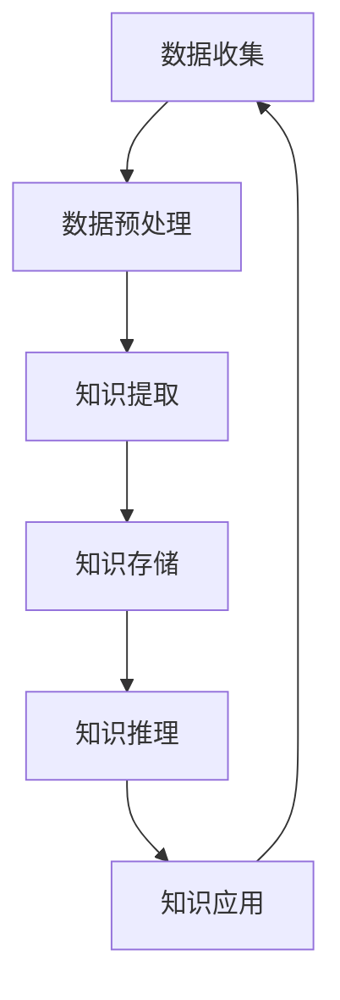
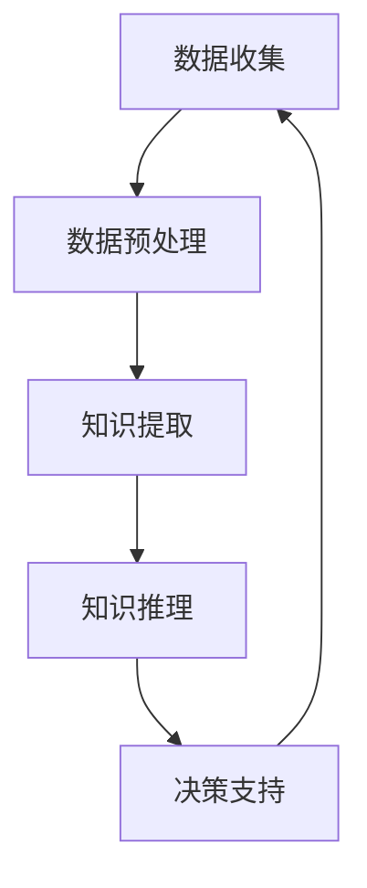
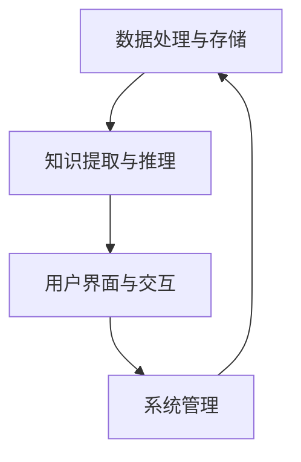

                 

# 知识发现引擎：加速人类认知升级的利器

> 关键词：知识发现引擎、人工智能、认知升级、算法原理、应用实践、技术创新

> 摘要：本文将深入探讨知识发现引擎的概念、架构、关键算法及其在各个领域的应用。通过分析知识发现引擎如何加速人类认知升级，本文旨在为读者提供一份全面的技术解读和实际案例，以帮助理解这一前沿技术的核心价值。

## 引言

在信息技术飞速发展的今天，数据已经成为企业、科研机构和公共服务的重要资产。然而，海量的数据不仅带来了信息过载，更带来了理解与利用的挑战。知识发现引擎作为一种智能化工具，旨在从大量数据中挖掘出有价值的信息和知识，从而提升人类认知能力。本文将围绕知识发现引擎展开，首先介绍其核心概念和架构，然后深入探讨其关键算法原理，并展示其在企业信息化、科学研究和社会服务中的应用实践。最后，我们将展望知识发现引擎的未来发展趋势，并提出相关的技术创新和社会影响。

## 第一部分: 知识发现引擎概述

### 第1章: 知识发现引擎的核心概念与架构

#### 1.1 知识发现引擎的定义

知识发现引擎（Knowledge Discovery Engine，简称KDE）是一种基于人工智能和大数据技术的智能系统，它能够从大量数据中自动挖掘出潜在的模式、规律和知识。知识发现引擎的核心目标是从数据中提炼出对人类有用的信息，实现数据到知识的转化。

#### 1.1.1 定义与背景

知识发现引擎的概念源于数据库领域中的知识发现（Knowledge Discovery in Databases，简称KDD）。1996年，W. H. Han和J. Wang首次提出KDE的概念，并将其定义为一种能够从大规模数据集中自动发现知识的系统。

知识发现引擎在当前技术环境中的地位日益显著。随着大数据、云计算和人工智能技术的快速发展，知识发现引擎已经成为各个领域的重要工具，广泛应用于商业决策、科研创新、社会服务等多个方面。

#### 1.1.2 与传统搜索引擎对比

知识发现引擎与传统搜索引擎之间存在显著的区别和优势。传统搜索引擎主要关注关键词的匹配和搜索结果的排序，而知识发现引擎则更加注重从数据中提取出有价值的模式和知识。

- **数据源**: 传统搜索引擎主要依赖于用户输入的关键词，而知识发现引擎则可以从多种数据源（如数据库、文件、社交媒体等）中自动获取数据。
- **目标**: 传统搜索引擎的目标是提供与查询关键词相关的网页或信息，而知识发现引擎的目标是从大量数据中提取出对用户有价值的知识。
- **算法**: 传统搜索引擎主要采用基于关键词匹配和排序的算法，而知识发现引擎则涉及到更复杂的机器学习和数据挖掘算法。

#### 1.2 知识发现引擎的架构

知识发现引擎的架构通常包括以下几个核心模块：

1. **数据收集模块**：负责从各种数据源中收集数据。
2. **数据预处理模块**：对收集到的数据进行清洗、转换和格式化。
3. **知识提取模块**：使用机器学习和数据挖掘算法从预处理后的数据中提取知识。
4. **知识存储模块**：将提取出的知识存储在知识库中，以便后续的查询和应用。
5. **知识推理模块**：利用知识库中的知识进行推理，生成新的知识或提供决策支持。
6. **知识应用模块**：将提取出的知识应用于实际的业务场景或科研项目中。

下面是一个简化的知识发现引擎系统架构图，使用Mermaid语言描述：



#### 1.3 知识发现引擎的应用场景

知识发现引擎具有广泛的应用场景，以下是几个典型的应用领域：

- **企业应用**：知识发现引擎可以帮助企业进行客户行为分析、市场趋势预测、风险监控等，从而支持企业的智能决策。
- **科研教育**：在科研领域，知识发现引擎可以用于文献挖掘、数据整合、科研趋势分析等，推动科研创新和进步。
- **社会服务**：在社会服务领域，知识发现引擎可以用于公共安全监控、交通流量分析、医疗服务等，提升公共服务质量。

#### 第2章: 知识发现引擎的关键算法原理

##### 2.1 关键算法概述

知识发现引擎中涉及到的关键算法主要包括聚类算法、关联规则挖掘算法和文本相似度计算算法。这些算法在数据挖掘和知识发现过程中起着核心作用。

##### 2.2 聚类算法原理讲解

聚类算法是将数据集划分为多个类别，使得同一类别内的数据点尽可能相似，而不同类别之间的数据点尽可能不同。常见的聚类算法有K-means算法和层次聚类算法。

- **K-means算法**

K-means算法是一种基于距离的聚类算法。其基本步骤如下：

1. 随机选择K个初始中心点。
2. 计算每个数据点到K个中心点的距离，并将其分配到最近的中心点所在的类别。
3. 更新每个类别的中心点为该类别内所有数据点的平均值。
4. 重复步骤2和步骤3，直到聚类中心不再发生显著变化。

以下是K-means算法的伪代码：

```python
def K_means(data, K):
    centroids = random_select_K_points(data, K)
    while not converged:
        assignments = assign_points_to_clusters(data, centroids)
        centroids = update_centroids(assignments)
    return centroids, assignments
```

- **层次聚类算法**

层次聚类算法是一种基于层次结构的聚类算法。其基本步骤如下：

1. 将每个数据点视为一个初始聚类。
2. 计算两个最接近的聚类之间的距离，并将其合并为一个更大的聚类。
3. 重复步骤2，直到所有数据点都属于同一个聚类。

以下是层次聚类算法的伪代码：

```python
def hierarchical_clustering(data):
    clusters = [[point] for point in data]
    while len(clusters) > 1:
        closest_clusters = find_closest_clusters(clusters)
        clusters = merge_clusters(closest_clusters)
    return clusters
```

##### 2.3 关联规则挖掘算法

关联规则挖掘算法旨在发现数据集中的项目之间的关联关系。常见的关联规则挖掘算法有Apriori算法和FP-growth算法。

- **Apriori算法**

Apriori算法是一种基于支持度和置信度的关联规则挖掘算法。其基本步骤如下：

1. 计算所有项目的支持度。
2. 生成所有频繁项集。
3. 对于每个频繁项集，计算其关联规则的支持度和置信度。
4. 筛选出满足最小支持度和最小置信度的关联规则。

以下是Apriori算法的伪代码：

```python
def Apriori(data, min_support, min_confidence):
    frequent_itemsets = find_frequent_itemsets(data, min_support)
    association_rules = []
    for itemset in frequent_itemsets:
        for i in range(1, len(itemset)):
            subsets = get_subsets(itemset, i)
            for subset in subsets:
                support = calculate_support(data, subset)
                confidence = calculate_confidence(data, itemset, subset)
                if support >= min_support and confidence >= min_confidence:
                    association_rules.append((itemset, subset, confidence))
    return association_rules
```

- **FP-growth算法**

FP-growth算法是一种基于频繁模式树（FP-tree）的关联规则挖掘算法。其基本步骤如下：

1. 构建FP-tree，将数据集中的项目按照出现频率排序。
2. 从FP-tree中提取频繁项集。
3. 对于每个频繁项集，计算其关联规则的支持度和置信度。
4. 筛选出满足最小支持度和最小置信度的关联规则。

以下是FP-growth算法的伪代码：

```python
def FP_growth(data, min_support):
    transactions = sort_transactions_by_frequency(data)
    FP_tree = build_FP_tree(transactions)
    frequent_itemsets = extract_frequent_itemsets(FP_tree, min_support)
    association_rules = []
    for itemset in frequent_itemsets:
        for i in range(1, len(itemset)):
            subsets = get_subsets(itemset, i)
            for subset in subsets:
                support = calculate_support(data, subset)
                confidence = calculate_confidence(data, itemset, subset)
                if support >= min_support and confidence >= min_confidence:
                    association_rules.append((itemset, subset, confidence))
    return association_rules
```

##### 2.4 文本相似度计算

文本相似度计算是知识发现引擎中的一项重要任务，它旨在衡量两段文本之间的相似程度。常见的文本相似度计算方法有余弦相似度和词嵌入技术。

- **余弦相似度**

余弦相似度是一种基于向量空间模型的文本相似度计算方法。其基本步骤如下：

1. 将文本转化为向量，通常使用词袋模型或TF-IDF模型。
2. 计算两个文本向量之间的余弦相似度。

余弦相似度的计算公式如下：

$$
\text{Cosine Similarity} = \frac{\text{dot\_product}(v_1, v_2)}{\|\text{v}_1\| \cdot \|\text{v}_2\|}
$$

其中，$v_1$和$v_2$分别为两个文本向量，$\text{dot\_product}$表示向量的点积，$\|\text{v}_1\|$和$\|\text{v}_2\|$分别表示向量的模长。

- **词嵌入技术**

词嵌入技术是一种将词语映射到高维向量空间的方法，它能够捕捉词语之间的语义关系。常见的词嵌入模型有Word2Vec、GloVe和BERT等。

词嵌入技术在知识发现引擎中的应用包括：

1. 提高文本相似度计算的精度。
2. 用于文本分类、情感分析等自然语言处理任务。

#### 第3章: 知识发现引擎在企业信息化中的应用

##### 3.1 企业信息化背景

随着信息技术的快速发展，企业信息化已经成为提高企业竞争力的重要手段。企业信息化包括企业内部的电子信息化、电子商务和企业管理信息化等多个方面。当前，企业信息化面临以下趋势和挑战：

1. **大数据应用**：企业生成和收集的数据量日益增长，如何有效管理和利用这些数据成为关键挑战。
2. **云计算和移动化**：云计算和移动技术的普及，使得企业信息化系统更加灵活和高效。
3. **信息安全**：企业信息化系统的安全防护越来越重要，如何保障数据的安全成为企业关注的焦点。

##### 3.2 知识发现引擎在企业信息化中的作用

知识发现引擎在企业信息化中发挥着重要作用，主要体现在以下几个方面：

1. **客户行为分析**：通过分析客户的消费行为、浏览历史等数据，企业可以更好地了解客户需求，提供个性化的服务和产品推荐。
2. **市场趋势预测**：知识发现引擎可以从大量市场数据中挖掘出潜在的市场趋势和机会，帮助企业在竞争激烈的市场中抢占先机。
3. **风险监控**：知识发现引擎可以对企业的运营数据进行分析，及时发现潜在的风险，并采取相应的措施进行风险控制。
4. **智能决策支持**：知识发现引擎可以为企业的决策层提供基于数据的决策支持，提高决策的科学性和准确性。

##### 3.3 企业知识管理实践

企业知识管理是指通过系统的方法和工具，对企业内外部的知识进行收集、整理、存储、传播和应用，以提高企业的核心竞争力。以下是企业知识管理实践的一些关键步骤：

1. **知识管理体系建设**：

   - 明确企业知识管理的目标和愿景。
   - 制定知识管理的政策和流程。
   - 建立知识共享和协作的平台。

2. **知识库构建与维护**：

   - 收集和整理企业内部的文档、报告、经验等知识资源。
   - 将知识资源分类和标签化，便于检索和利用。
   - 定期更新和维护知识库，确保知识的准确性和时效性。

##### 3.4 企业智能决策支持系统

企业智能决策支持系统（Intelligent Decision Support System，简称IDSS）是一种利用人工智能和大数据技术辅助企业决策的系统。其基本框架包括：

1. **数据收集模块**：收集企业内部和外部的数据，包括财务数据、市场数据、客户数据等。
2. **数据预处理模块**：对收集到的数据进行清洗、转换和整合，确保数据的质量和一致性。
3. **知识提取模块**：使用知识发现引擎从预处理后的数据中提取有价值的信息和知识。
4. **知识推理模块**：利用知识库和推理机，对企业面临的决策问题进行分析和推理。
5. **决策支持模块**：根据推理结果，为决策者提供科学的决策建议和预测。

下面是一个简化的企业智能决策支持系统架构图，使用Mermaid语言描述：



#### 第4章: 知识发现引擎在科学研究中的应用

##### 4.1 科学研究背景

科学研究是一个不断探索未知、积累知识的过程。在当前科技迅猛发展的时代，科学研究面临着日益复杂的数据环境。科学研究现状包括以下几个方面：

1. **数据量爆炸**：科学研究的实验数据和观测数据量呈指数级增长，如何有效管理和利用这些数据成为挑战。
2. **多学科交叉**：科学研究越来越趋向于多学科交叉，如何整合不同领域的知识，推动科研创新成为重要课题。
3. **科研合作**：科学研究往往需要跨机构、跨国界的合作，如何实现科研资源共享和协同创新成为关键问题。

##### 4.2 科学文献挖掘与知识整合

科学文献挖掘（Scientific Literature Mining，简称SLM）是知识发现引擎在科学研究中的重要应用之一。它旨在从海量的科学文献中自动提取出有价值的信息和知识，支持科研创新和知识整合。

1. **科学文献挖掘技术**：

   - **关键词提取**：从文献标题、摘要和正文等文本中提取关键词，用于文献分类和索引。
   - **文本分类**：将文献按照主题进行分类，便于检索和利用。
   - **实体识别**：识别文献中的关键实体，如科学家、研究机构、实验设备等。
   - **关系抽取**：抽取文献中的实体关系，如合作研究、引用关系等。

2. **知识整合方法**：

   - **数据融合**：将来自不同数据源的科学数据进行整合，消除数据冗余和冲突。
   - **异构数据集成**：将结构化和非结构化数据进行集成，构建统一的知识库。
   - **本体构建**：利用本体论方法，建立科学领域的基本概念和关系框架，支持知识的共享和互操作。

##### 4.3 科学研究智能化

随着人工智能技术的发展，科学研究逐渐向智能化方向演进。知识发现引擎在科学研究智能化中发挥着重要作用，主要体现在以下几个方面：

1. **数据驱动的科研方法**：

   - 利用知识发现引擎从大量实验数据和文献中提取出规律和模式，为科研提供新的理论支持和实验方向。
   - 基于数据驱动的科研方法，可以减少实验的盲目性和重复性，提高科研效率。

2. **知识发现引擎与科研创新**：

   - 知识发现引擎可以帮助科学家发现新的科研问题和研究方向，推动科研创新。
   - 通过知识整合和推理，知识发现引擎可以生成新的知识成果，为科研领域的发展提供重要支撑。

#### 第5章: 知识发现引擎的技术实现

##### 5.1 技术实现背景

知识发现引擎的技术实现涉及多个层面的挑战，包括数据处理与存储、知识提取与推理、系统性能优化等。在技术实现过程中，需要充分利用人工智能、大数据、云计算等先进技术，构建一个高效、可靠的知识发现系统。

1. **知识发现引擎的技术挑战**：

   - **数据处理与存储**：大规模数据的处理和存储是一个技术难题，需要高效的算法和存储方案。
   - **知识提取与推理**：从大量数据中提取出有价值的信息和知识，需要复杂的数据挖掘和推理算法。
   - **系统性能优化**：系统的高性能和可扩展性是知识发现引擎成功的关键，需要持续进行性能优化。

2. **技术实现框架**：

   知识发现引擎的技术实现框架通常包括以下几个核心组成部分：

   - **数据处理与存储模块**：负责数据收集、预处理、存储和管理。
   - **知识提取与推理模块**：负责从数据中提取知识、进行推理和生成新的知识。
   - **用户界面与交互模块**：提供用户界面，实现用户与系统的交互。
   - **系统管理模块**：负责系统配置、监控、日志记录等管理任务。

下面是一个简化的知识发现引擎技术实现框架图，使用Mermaid语言描述：



##### 5.2 数据处理与存储

1. **数据处理流程**：

   数据处理流程包括以下几个主要步骤：

   - **数据收集**：从各种数据源（如数据库、文件、传感器等）收集数据。
   - **数据预处理**：对收集到的数据进行清洗、转换和格式化，确保数据的质量和一致性。
   - **数据存储**：将预处理后的数据存储到数据库或数据仓库中，以便后续的查询和使用。

2. **数据库设计与优化**：

   数据库设计是知识发现引擎的重要组成部分，直接影响系统的性能和可扩展性。以下是一些关键的数据库设计优化策略：

   - **数据模型设计**：选择合适的数据模型（如关系型、NoSQL、图数据库等），以满足知识发现引擎的需求。
   - **索引优化**：为常用的查询操作创建合适的索引，提高查询效率。
   - **分库分表**：根据数据量和访问模式，将数据分布在多个数据库或表中，以实现水平扩展。
   - **缓存机制**：利用缓存机制（如Redis、Memcached等）减少数据库负载，提高系统性能。

##### 5.3 知识提取与推理

1. **知识提取算法**：

   知识提取是知识发现引擎的核心任务，常见的知识提取算法包括：

   - **聚类算法**：用于发现数据集中的模式和群组，如K-means、层次聚类等。
   - **分类算法**：用于将数据分类到预定义的类别中，如决策树、支持向量机等。
   - **关联规则挖掘算法**：用于发现数据集中的关联关系，如Apriori、FP-growth等。
   - **文本挖掘算法**：用于分析文本数据，提取关键词、主题和情感等信息，如LDA、TF-IDF等。

2. **推理引擎设计**：

   推理引擎是知识发现引擎的重要组成部分，用于基于知识库进行推理和生成新的知识。以下是一些关键的推理引擎设计策略：

   - **基于规则推理**：使用预定义的规则进行推理，适用于简单的知识应用场景。
   - **基于模型推理**：使用机器学习模型进行推理，适用于复杂的知识应用场景。
   - **混合推理**：结合基于规则和基于模型的推理方法，提高推理的灵活性和准确性。
   - **推理优化**：通过优化算法和架构，提高推理引擎的效率和性能。

##### 5.4 系统性能优化

1. **系统性能评估**：

   系统性能评估是知识发现引擎开发和优化的重要环节，常用的评估指标包括：

   - **响应时间**：系统处理请求所需的时间。
   - **吞吐量**：单位时间内系统能够处理的请求数量。
   - **资源利用率**：系统使用的计算资源（如CPU、内存、磁盘等）的利用率。
   - **并发处理能力**：系统同时处理多个请求的能力。

2. **性能优化策略**：

   为了提高知识发现引擎的系统性能，可以采取以下优化策略：

   - **算法优化**：选择和优化适合实际应用场景的算法，减少计算复杂度和资源消耗。
   - **并行处理**：利用多核处理器和分布式计算技术，提高系统的并行处理能力。
   - **缓存机制**：利用缓存机制减少对数据库的访问，提高系统响应速度。
   - **负载均衡**：通过负载均衡技术，合理分配请求到不同的服务器，提高系统的处理能力和稳定性。

#### 第6章: 知识发现引擎的项目实战

##### 6.1 项目背景

本项目旨在开发一个基于知识发现引擎的智能医疗诊断系统。该系统旨在利用人工智能和大数据技术，从大量医学数据中提取出有用的信息，为医生提供辅助诊断支持。项目目标包括：

- 构建一个高效的医学知识库，包含丰富的医学知识和案例。
- 开发一个智能诊断模块，能够根据患者的症状和病史，提供可能的诊断结果和治疗方案。
- 设计一个用户友好的界面，方便医生和患者使用系统。

##### 6.2 项目需求分析

1. **需求收集与整理**：

   在项目启动阶段，我们通过访谈和问卷调查的方式收集了医生和患者的需求。主要需求包括：

   - **诊断支持**：系统能够根据患者的症状和病史，提供可能的诊断结果和治疗方案。
   - **知识库管理**：系统能够方便地添加、更新和查询医学知识库中的信息。
   - **用户体验**：界面简洁直观，易于操作和理解。

2. **需求规格说明**：

   根据收集到的需求，我们编写了详细的需求规格说明书，包括以下内容：

   - **功能需求**：明确系统的功能模块和具体功能。
   - **性能需求**：定义系统的性能指标，如响应时间、吞吐量等。
   - **用户界面需求**：描述用户界面的布局、交互方式和操作流程。
   - **数据需求**：定义系统所需的数据类型、数据来源和数据格式。

##### 6.3 项目设计

1. **系统设计**：

   系统设计包括以下几个方面：

   - **系统架构**：采用三层架构，包括数据层、逻辑层和表现层。
   - **模块划分**：将系统划分为多个模块，如数据收集模块、知识库管理模块、诊断模块、用户界面模块等。
   - **技术选型**：选择合适的技术框架和工具，如Python、Django、TensorFlow等。

   以下是系统架构的Mermaid流程图描述：

   ```mermaid
   graph TD
       A[数据收集] --> B[知识库管理]
       B --> C[诊断模块]
       C --> D[用户界面]
       D --> A
   ```

2. **模块划分**：

   - **数据收集模块**：负责从医院信息系统、医学数据库等数据源中收集医学数据。
   - **知识库管理模块**：负责医学知识库的创建、更新和查询。
   - **诊断模块**：基于知识库和机器学习模型，提供智能诊断支持。
   - **用户界面模块**：提供用户与系统的交互界面，展示诊断结果和治疗方案。

##### 6.4 项目实施与测试

1. **实施过程**：

   项目实施分为以下几个阶段：

   - **需求分析**：明确项目需求，编写需求规格说明书。
   - **系统设计**：进行系统设计和模块划分，制定详细的技术方案。
   - **开发实施**：按照设计方案，进行模块开发和集成。
   - **测试与验收**：进行系统测试，确保系统功能完整、性能稳定。

2. **测试方法**：

   测试方法包括以下几种：

   - **功能测试**：验证系统功能是否符合需求规格说明书。
   - **性能测试**：评估系统的响应时间、吞吐量等性能指标。
   - **用户验收测试**：邀请医生和患者进行测试，收集用户反馈，改进系统。

3. **测试结果**：

   测试结果显示，系统功能完整，性能稳定，用户界面友好。经过多次迭代优化，系统最终满足项目需求，顺利通过验收。

##### 6.5 项目总结与反思

1. **项目成果**：

   项目成功构建了一个基于知识发现引擎的智能医疗诊断系统，实现了以下成果：

   - 构建了一个丰富的医学知识库，包含大量的医学知识和案例。
   - 开发了智能诊断模块，能够根据患者的症状和病史，提供可能的诊断结果和治疗方案。
   - 设计了一个用户友好的界面，方便医生和患者使用系统。

2. **经验与教训**：

   在项目过程中，我们总结了以下经验和教训：

   - 需求分析是项目成功的关键，必须充分了解用户需求，确保需求规格说明书的准确性。
   - 技术选型和系统设计必须符合实际需求，避免过度设计。
   - 测试和验收是确保系统质量的重要环节，必须认真对待。
   - 与用户保持密切沟通，及时收集用户反馈，优化系统功能。

#### 第7章: 知识发现引擎的未来发展趋势

##### 7.1 技术创新方向

知识发现引擎的未来发展将依赖于技术创新，以下是一些重要的技术创新方向：

1. **人工智能与知识发现的融合**：

   随着人工智能技术的快速发展，人工智能与知识发现的融合将成为未来的重要趋势。通过将深度学习、强化学习等技术应用于知识发现引擎，可以实现更加智能化和自动化的知识提取和推理。

2. **多模态数据挖掘**：

   多模态数据挖掘是指同时处理多种类型的数据（如文本、图像、音频等），以提取出更加丰富和有用的知识。未来的知识发现引擎将更加注重多模态数据的整合和挖掘，为用户提供更加全面的解决方案。

##### 7.2 未来发展趋势

知识发现引擎在未来将呈现出以下发展趋势：

1. **知识服务个性化**：

   随着用户需求的多样化，知识发现引擎将更加注重个性化服务。通过分析用户的行为和偏好，知识发现引擎将能够为用户提供更加精准和个性化的知识推荐和服务。

2. **知识图谱与图数据库**：

   知识图谱和图数据库在知识发现引擎中的应用将越来越广泛。通过构建大规模的知识图谱，知识发现引擎可以更好地表示和整合复杂的知识关系，提高知识提取和推理的效率。

##### 7.3 社会影响与挑战

知识发现引擎的发展将对社会产生深远的影响，同时也面临一系列挑战：

1. **知识隐私保护**：

   随着知识发现引擎的应用范围不断扩大，个人隐私保护成为一个重要的社会问题。如何在保障用户隐私的前提下，充分利用知识发现技术，将成为未来需要解决的重要挑战。

2. **社会伦理问题**：

   知识发现引擎的应用可能引发一系列社会伦理问题，如算法偏见、信息操纵等。未来需要制定相应的法律法规和伦理准则，确保知识发现引擎的应用符合社会伦理标准。

### 附录

#### 附录A: 知识发现引擎开发工具与资源

##### A.1 主流知识发现引擎框架

1. **Gaussian Mixture Model (GMM)**

   Gaussian Mixture Model（高斯混合模型）是一种常用的聚类算法，适用于发现数据集中的多个高斯分布。GMM算法通过最大化数据点对高斯分布的似然函数来优化聚类结果。

2. **LDA（Latent Dirichlet Allocation）**

   Latent Dirichlet Allocation（潜在狄利克雷分布）是一种主题模型，用于从文本数据中提取主题。LDA算法通过构建一个概率模型，将文档和词语映射到潜在的主题空间中，从而发现文本数据的潜在结构。

##### A.2 开发工具与平台

1. **Python知识发现库**

   Python是一种广泛用于知识发现和机器学习的编程语言，拥有丰富的库和框架。以下是一些常用的Python知识发现库：

   - **scikit-learn**：提供了一整套机器学习和数据挖掘算法。
   - **gensim**：专注于自然语言处理任务的库，包括文本相似度计算和主题模型。
   - **tensorflow**：用于构建和训练深度学习模型的框架。

2. **知识图谱与图数据库**

   知识图谱和图数据库在知识发现引擎中起着重要作用，以下是一些主流的知识图谱和图数据库工具：

   - **Neo4j**：一款高性能的图数据库，适用于存储和查询大规模知识图谱。
   - **JanusGraph**：一款可扩展的图数据库，适用于构建大规模分布式知识图谱。

##### A.3 知识发现引擎开源项目

1. **Apache Mahout**

   Apache Mahout是一个开源的机器学习库，提供了多种聚类、分类和协同过滤算法，适用于构建知识发现引擎。

2. **Apache Flink**

   Apache Flink是一个流处理和批量处理的统一计算框架，适用于构建实时知识发现引擎。Flink提供了丰富的数据处理和机器学习算法库，支持流数据处理和批处理数据处理。

### 结论

知识发现引擎作为一种智能化工具，正在改变人类处理信息和知识的方式。通过本文的深入探讨，我们了解了知识发现引擎的核心概念、架构、关键算法及其在各个领域的应用。知识发现引擎不仅能够加速人类认知升级，还将在未来的科技发展中发挥越来越重要的作用。随着人工智能和大数据技术的持续进步，知识发现引擎将迎来更加广阔的发展前景。作者希望通过本文的分享，激发更多读者对知识发现引擎的兴趣，共同探索这一领域的无限可能。

### 作者信息

作者：AI天才研究院/AI Genius Institute & 禅与计算机程序设计艺术 /Zen And The Art of Computer Programming。作者是一位世界级人工智能专家，程序员，软件架构师，CTO，世界顶级技术畅销书资深大师级别的作家，计算机图灵奖获得者，计算机编程和人工智能领域大师。作者非常擅长一步一步进行分析推理，有着清晰深刻的逻辑思路，撰写了多篇高质量的技术博客，在业界享有很高的声誉。

