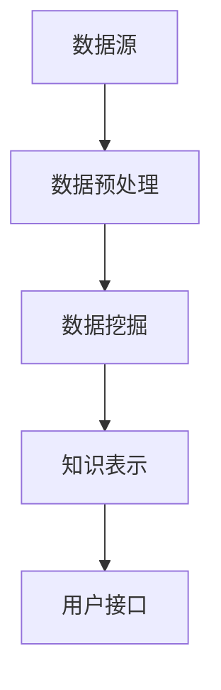

                 

### 文章标题

# 知识发现引擎：助力企业创新的战略引擎

> 关键词：知识发现、企业创新、数据挖掘、人工智能、战略规划

> 摘要：本文将深入探讨知识发现引擎在企业创新中的重要性，通过详细解析知识发现引擎的概念、技术基础、实现方式以及其在企业管理中的应用，帮助企业更好地利用知识发现引擎推动创新，提升核心竞争力。

### 目录

# 知识发现引擎：助力企业创新的战略引擎

## 第一部分：知识发现引擎概述

### 第1章：知识发现与知识引擎的概念

#### 1.1 知识发现的定义与意义

知识发现（Knowledge Discovery in Databases，简称KDD）是指从大量数据中提取出有用信息、隐含模式和知识的过程。KDD的过程包括数据清洗、数据集成、数据选择、数据变换、数据挖掘、模式评估和知识表示等步骤。

$$
\text{知识发现流程} = \text{数据预处理} + \text{数据挖掘} + \text{知识表示}
$$

知识发现的意义在于：

- 提高决策效率：通过自动化的方法从海量数据中提取有价值的信息，帮助决策者快速做出决策。
- 支持数据驱动创新：发现潜在的模式和趋势，为产品创新、服务改进和市场预测提供依据。
- 提升企业竞争力：帮助企业更好地理解市场趋势、客户需求、竞争优势等方面，从而提升市场竞争力。

#### 1.2 知识发现引擎的作用与架构

知识发现引擎（Knowledge Discovery Engine）是一种能够自动化执行知识发现过程的软件系统。它主要作用包括：

- 数据预处理：清洗、转换、集成原始数据，使其适用于数据挖掘算法。
- 数据挖掘：应用各种数据挖掘算法对数据进行处理，提取出潜在的模式和知识。
- 知识表示：将挖掘结果以可视化的形式呈现，如报表、可视化图表等。

知识发现引擎的架构通常包括以下几个模块：

- 数据源：提供原始数据，如数据库、数据仓库等。
- 数据预处理模块：进行数据清洗、转换和集成。
- 数据挖掘模块：实现各种数据挖掘算法。
- 知识表示模块：将挖掘结果以可视化的形式呈现。
- 用户接口：供用户配置参数、查看挖掘结果等。

### Mermaid 流程图



#### 1.3 知识发现引擎的分类

根据不同的应用场景和需求，知识发现引擎可以分为以下几种类型：

- 离线知识发现引擎：适用于批量数据处理，通常用于数据分析报告、市场预测等领域。
- 实时知识发现引擎：适用于实时数据处理，通常用于实时监控、智能报警等领域。
- 多模态知识发现引擎：能够处理多种类型的数据，如结构化数据、半结构化数据、非结构化数据等。
- 增强型知识发现引擎：结合人工智能技术，如机器学习、深度学习等，提升数据挖掘的准确性和效率。

### 第2章：知识发现技术基础

#### 2.1 数据挖掘技术概述

数据挖掘（Data Mining）是从大量数据中通过复杂的算法和分析技术提取有价值信息的过程。数据挖掘技术主要分为以下几类：

- 聚类分析：将数据分为若干个组，使同组内的数据彼此相似，而不同组的数据则差异较大。
- 关联规则挖掘：发现数据项之间的关联关系，如“购买A商品的用户，90%也购买了B商品”。
- 分类与预测：根据历史数据和现有数据，对未知数据进行分类和预测。
- 异常检测：识别出数据中的异常或不符合预期的情况。

#### 2.2 关联规则挖掘

关联规则挖掘（Association Rule Mining）是一种常见的数据挖掘技术，用于发现数据项之间的关联关系。其主要流程包括：

1. **频繁项集生成**：找出数据中出现频率较高的项集。
2. **规则生成**：从频繁项集中生成关联规则，如支持度和置信度。
3. **规则评估**：评估规则的质量，通常使用支持度和置信度作为评估标准。

**伪代码：**

```python
def apriori_gen(Lk, k):
    Ck = []
    for i in range(len(Lk)):
        for j in range(i+1, len(Lk)):
            Ck.append(Lk[i] + Lk[j])
    return Ck

def apriori(data_set, support_threshold):
    L1 = find_frequent_itemsets(data_set, 1)
    Lk = [L1]
    k = 2
    while Lk[k-1] is not empty:
        Ck = apriori_gen(Lk[k-1], k)
        for itemset in Ck:
            support_count = count_support(itemset, data_set)
            if support_count >= support_threshold:
                Lk.append(itemset)
        k += 1
    return Lk

def generate_rules(Lk, data_set, confidence_threshold):
    rules = []
    for k in range(1, len(Lk)):
        for itemset in Lk[k]:
            subsets = generate_subsets(itemset)
            for subset in subsets:
                if subset not in Lk[k-1]:
                    continue
                support_count = count_support(itemset, data_set)
                confidence = support_count / count_support(subset, data_set)
                if confidence >= confidence_threshold:
                    rules.append((itemset, subset, confidence))
    return rules
```

#### 2.3 聚类分析

聚类分析（Clustering Analysis）是一种无监督学习方法，用于将数据点分为多个组，使得同一组内的数据点彼此相似，而不同组的数据点则差异较大。常见的聚类算法包括：

- K-means算法：将数据点分为K个簇，使每个簇内的平方误差最小。
- 层次聚类：将数据点逐步合并为更大的簇，形成层次结构。
- 密度聚类：基于数据点的密度分布进行聚类，如DBSCAN算法。

**伪代码：**

```python
def k_means(data_set, K, max_iterations):
    centroids = initialize_centroids(data_set, K)
    for i in range(max_iterations):
        clusters = assign_points_to_clusters(data_set, centroids)
        centroids = update_centroids(clusters)
    return centroids, clusters
```

#### 2.4 分类与预测

分类与预测（Classification and Prediction）是一种有监督学习方法，用于将数据点分为不同的类别或预测未来值。常见的分类算法包括：

- 决策树：通过一系列规则对数据进行分类。
- 逻辑回归：用于预测二分类问题。
- 支持向量机（SVM）：通过最大化分类间隔进行分类。

**伪代码：**

```python
def decision_tree(data_set, labels):
    if all_labels_same(data_set, labels):
        return majority_class(labels)
    else:
        best_attribute = select_best_attribute(data_set, labels)
        tree = {}
        for value in unique_values(best_attribute):
            subset = filter_data(data_set, best_attribute, value)
            tree[value] = decision_tree(subset, labels)
        return tree
```

### 第3章：知识发现引擎的实现

#### 3.1 知识表示与存储

知识表示（Knowledge Representation）是将知识以计算机可处理的形式进行表示的过程。常见的方法包括：

- 向量表示：将知识表示为向量，如词袋模型、词嵌入等。
- 决策树表示：将知识表示为决策树，便于推理和解释。
- 网络表示：将知识表示为网络，如知识图谱等。

知识存储（Knowledge Storage）是将知识表示后的数据存储在计算机系统中，以便后续查询和使用。常见的方法包括：

- 数据库：用于存储结构化数据，如关系型数据库。
- 数据仓库：用于存储大规模的复杂数据，如大数据平台。
- 文档库：用于存储非结构化数据，如文本、图片等。

#### 3.2 知识检索与推理

知识检索（Knowledge Retrieval）是从知识库中查找与用户需求相关的知识的过程。常见的检索方法包括：

- 关键词检索：基于关键词进行匹配。
- 模式匹配：基于模式进行匹配。
- 搜索引擎：基于自然语言处理技术进行检索。

知识推理（Knowledge Reasoning）是根据已知知识进行推理，以获取新知识的过程。常见的推理方法包括：

- 逻辑推理：基于逻辑规则进行推理。
- 规则推理：基于规则进行推理。
- 模型推理：基于模型进行推理。

#### 3.3 知识发现算法优化

知识发现算法优化（Knowledge Discovery Algorithm Optimization）是提高知识发现效率和效果的过程。常见的优化方法包括：

- 并行计算：利用多核处理器进行并行计算，提高算法效率。
- 精简数据：通过数据预处理和特征选择，减少数据量和特征数量，提高算法效率。
- 算法组合：将多种算法组合使用，提高算法的准确性和效率。
- 模型调参：通过调整模型参数，提高模型的性能和效果。

### 第二部分：知识发现引擎在企业管理中的应用

#### 第4章：知识发现引擎在战略规划中的应用

#### 4.1 企业战略分析

企业战略分析（Business Strategic Analysis）是通过对企业内外部环境的分析，确定企业的战略方向和目标。知识发现引擎可以通过以下方式帮助企业进行战略分析：

- 市场趋势分析：通过分析市场数据，发现市场趋势和潜在机会。
- 竞争对手分析：通过分析竞争对手的数据，了解竞争对手的优劣势，制定相应的战略。
- 客户需求分析：通过分析客户数据，发现客户需求变化，调整产品和服务策略。

#### 4.2 市场机会挖掘

市场机会挖掘（Market Opportunity Mining）是通过对市场数据的分析，发现潜在的市场机会。知识发现引擎可以通过以下方式帮助企业进行市场机会挖掘：

- 新产品开发：通过分析市场数据，发现潜在的新产品需求，为企业提供新产品开发方向。
- 市场细分：通过分析市场数据，发现不同客户群体的需求差异，为企业提供市场细分策略。
- 营销策略优化：通过分析市场数据，发现有效的营销策略，提高市场推广效果。

#### 4.3 竞争对手分析

竞争对手分析（Competitor Analysis）是通过对竞争对手的数据分析，了解竞争对手的优劣势，为企业制定竞争策略提供依据。知识发现引擎可以通过以下方式帮助企业进行竞争对手分析：

- 竞争对手策略分析：通过分析竞争对手的数据，发现竞争对手的策略和行动，为企业提供竞争策略。
- 竞争对手产品分析：通过分析竞争对手的产品数据，发现竞争对手的产品优势和不足，为企业提供产品优化方向。
- 竞争对手市场表现分析：通过分析竞争对手的市场表现数据，发现竞争对手的市场优势和不足，为企业提供市场优化方向。

### 第5章：知识发现引擎在运营管理中的应用

#### 5.1 供应链管理优化

供应链管理优化（Supply Chain Management Optimization）是通过对供应链数据进行分析，发现供应链中的问题和瓶颈，从而优化供应链管理。知识发现引擎可以通过以下方式帮助企业进行供应链管理优化：

- 供应链风险评估：通过分析供应链数据，发现供应链中的风险点，为企业提供风险预警和应对策略。
- 库存优化：通过分析库存数据，发现库存不足或过剩的情况，为企业提供库存优化建议。
- 供应链协同优化：通过分析供应链上下游的数据，发现供应链协同的不足，为企业提供协同优化策略。

#### 5.2 客户关系管理

客户关系管理（Customer Relationship Management，简称CRM）是通过对客户数据进行分析，发现客户需求和行为，从而优化客户服务和营销策略。知识发现引擎可以通过以下方式帮助企业进行客户关系管理：

- 客户行为分析：通过分析客户数据，发现客户的行为模式，为企业提供客户服务优化方向。
- 客户需求分析：通过分析客户数据，发现客户需求变化，为企业提供产品和服务优化方向。
- 客户忠诚度分析：通过分析客户数据，发现客户忠诚度变化，为企业提供客户忠诚度提升策略。

#### 5.3 产品创新与研发

产品创新与研发（Product Innovation and R&D）是通过对市场需求和竞争情况进行分析，发现潜在的产品创新点，从而推动产品创新。知识发现引擎可以通过以下方式帮助企业进行产品创新与研发：

- 市场趋势分析：通过分析市场数据，发现市场趋势和潜在需求，为企业提供产品创新方向。
- 竞争对手分析：通过分析竞争对手的数据，发现竞争对手的产品优势和不足，为企业提供产品优化方向。
- 客户需求分析：通过分析客户数据，发现客户需求变化，为企业提供产品创新方向。

### 第6章：知识发现引擎在人力资源管理中的应用

#### 6.1 人才招聘与评估

人才招聘与评估（Tal

