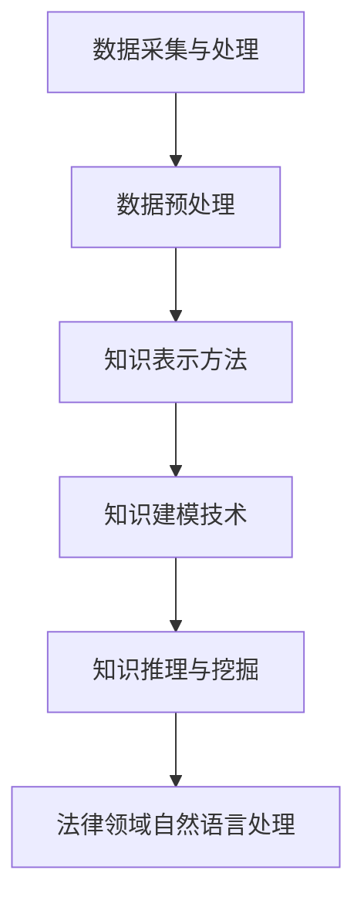

                 

# 文章标题：知识发现引擎：推动法律行业的智能化变革

关键词：知识发现引擎，法律行业，智能化，技术变革，人工智能，自然语言处理

摘要：本文探讨了知识发现引擎在法律行业中的应用，分析了知识发现引擎的定义、核心技术以及其在法律行业中的实际应用案例。文章首先介绍了知识发现引擎的基本概念，随后深入分析了其在法律行业智能化变革中的重要性。接着，文章详细阐述了知识发现引擎的核心技术，包括数据采集与处理、知识表示与建模、知识推理与挖掘以及法律领域的自然语言处理。在此基础上，文章通过具体应用案例，展示了知识发现引擎在智能案件分析系统、智能合同审核系统、智能法律咨询平台和智能法律培训系统等领域的应用成效。最后，文章讨论了知识发现引擎在法律行业中的技术挑战与未来趋势，为推动法律行业的智能化发展提供了有益的思考。

# 《知识发现引擎：推动法律行业的智能化变革》目录大纲

## 第一部分：引言与概述

### 1.1 知识发现引擎概述

- **知识发现引擎的定义**
- **法律行业智能化变革的背景**
- **知识发现引擎在法律行业的重要性**

### 1.2 法律行业智能化现状分析

- **当前法律行业的痛点**
- **知识发现引擎的应用领域**

## 第二部分：知识发现引擎的核心技术

### 2.1 数据采集与处理

- **数据采集的方法**
- **数据预处理技术**
- **数据存储与管理**

### 2.2 知识表示与建模

- **知识表示方法**
- **知识建模技术**
- **Mermaid流程图：知识表示与建模的核心架构**

### 2.3 知识推理与挖掘

- **知识推理算法**
- **知识挖掘技术**
- **伪代码：知识挖掘算法实现**

### 2.4 法律领域的自然语言处理

- **文本挖掘与信息提取**
- **自然语言处理技术**
- **数学模型与公式：文本分类与实体识别**

## 第三部分：知识发现引擎在法律行业的应用

### 3.1 智能案件分析系统

- **系统架构设计**
- **案例研究：实际案例分析与结果**

### 3.2 智能合同审核系统

- **系统设计与实现**
- **案例研究：智能合同审核效果分析**

### 3.3 智能法律咨询平台

- **平台功能模块**
- **用户使用案例**

### 3.4 智能法律培训系统

- **系统设计与实现**
- **案例研究：智能法律培训的成效分析**

## 第四部分：知识发现引擎的技术挑战与未来趋势

### 4.1 技术挑战与解决方案

- **数据隐私与安全**
- **法律合规与伦理**

### 4.2 未来发展趋势

- **AI技术在法律行业的深化应用**
- **知识发现引擎的技术演进**

### 4.3 潜在应用领域扩展

- **跨行业应用潜力**
- **知识发现引擎在司法领域的应用**

## 第五部分：附录

### 5.1 技术资源与工具推荐

- **深度学习框架**
- **自然语言处理工具**

### 5.2 开发环境搭建指南

- **Python开发环境配置**
- **深度学习框架安装与配置**

### 5.3 代码示例与解读

- **智能案件分析系统代码示例**
- **智能合同审核系统代码解读**
- **智能法律咨询平台代码示例**
- **智能法律培训系统代码解读**

## 结束语

- **知识发现引擎对法律行业的深远影响**
- **感谢与展望**

## 第一部分：引言与概述

### 1.1 知识发现引擎概述

**知识发现引擎的定义**

知识发现引擎（Knowledge Discovery Engine，简称KDE）是一种人工智能系统，旨在从大规模数据集中提取有价值的信息和知识。它通过结合多种数据挖掘技术，包括统计分析、机器学习、文本挖掘等，实现对复杂数据的高效处理和知识提取。

知识发现引擎的基本功能包括数据采集、数据预处理、知识表示、知识建模、知识推理和知识挖掘。这些功能共同构成了一个完整的知识发现过程，如图1所示。


**法律行业智能化变革的背景**

随着信息技术的飞速发展，法律行业正面临着前所未有的变革。传统的法律工作模式已无法满足日益增长的法律需求，法律工作者需要更高效、更智能的工具来处理大量法律信息。法律行业智能化变革的背景主要有以下几个方面：

1. 数据量激增：随着互联网和数字技术的发展，法律行业产生了海量的法律文献、案例、合同等数据。这些数据为法律工作者提供了丰富的信息资源，但也带来了数据处理的挑战。
2. 智能化需求：法律工作者需要快速、准确地处理案件、合同等法律文件，以提供高效的法律服务。这要求法律工具具备智能化的能力，能够自动分析和处理法律信息。
3. 法律合规要求：随着法律法规的不断完善，法律行业对合规性的要求越来越高。知识发现引擎可以帮助法律工作者更好地理解和遵守相关法律法规。

**知识发现引擎在法律行业的重要性**

知识发现引擎在法律行业具有广泛的应用前景和重要的意义。以下是几个方面的具体分析：

1. **提升工作效率**：知识发现引擎可以自动分析和处理大量法律文献、案例、合同等数据，帮助法律工作者快速获取所需信息，提高工作效率。
2. **增强专业知识**：知识发现引擎可以从海量法律数据中提取有价值的信息和知识，为法律工作者提供丰富的专业知识支持，有助于提升其专业素养。
3. **优化法律服务**：知识发现引擎可以帮助法律工作者更好地了解客户需求，提供更加个性化和高效的法律服务。
4. **促进司法公正**：知识发现引擎可以协助法官、检察官等司法人员快速分析和处理案件信息，有助于提高司法公正性。

### 1.2 法律行业智能化现状分析

**当前法律行业的痛点**

尽管法律行业智能化变革的呼声日益高涨，但当前法律行业仍存在一些痛点，主要包括以下几个方面：

1. **数据管理困难**：法律行业涉及大量文本数据，这些数据通常以纸质文档或电子文档的形式存在。如何有效地管理和利用这些数据成为法律工作者面临的一大挑战。
2. **分析能力不足**：法律工作者通常缺乏专业的数据分析技能，无法充分利用海量法律数据中的有价值信息。
3. **工作效率低下**：传统的法律工作模式依赖于人工处理，效率低下，难以满足日益增长的法律需求。
4. **法律合规风险**：法律行业对合规性的要求越来越高，但传统的工作模式往往难以满足相关法律法规的要求。

**知识发现引擎的应用领域**

知识发现引擎在法律行业具有广泛的应用领域，主要包括以下几个方面：

1. **案件分析**：知识发现引擎可以帮助法律工作者快速分析和处理案件信息，提供案件发展趋势、关键证据等方面的智能分析，为案件辩护提供有力支持。
2. **合同审核**：知识发现引擎可以自动审核合同中的关键条款，识别潜在的法律风险，提高合同审核的准确性和效率。
3. **法律咨询**：知识发现引擎可以为用户提供智能法律咨询，帮助用户快速了解相关法律法规、案例分析等，提供个性化法律服务。
4. **法律培训**：知识发现引擎可以辅助法律培训，提供丰富的案例库和知识库，帮助法律工作者提高专业素养。

## 第二部分：知识发现引擎的核心技术

### 2.1 数据采集与处理

**数据采集的方法**

数据采集是知识发现引擎的基础，主要包括以下几种方法：

1. **Web爬虫**：通过爬虫技术，从互联网上抓取相关法律信息，如法律文献、案例、法律法规等。
2. **数据库连接**：通过数据库连接技术，从已有的法律数据库中获取数据，如案例数据库、法律法规数据库等。
3. **手动输入**：对于一些非结构化数据，如律师笔记、案例分析等，可以通过手动输入的方式进行数据采集。

**数据预处理技术**

数据预处理是知识发现引擎中至关重要的一环，主要包括以下技术：

1. **数据清洗**：去除数据中的噪声和错误，提高数据质量。例如，去除重复数据、纠正数据格式等。
2. **数据转换**：将不同格式的数据转换为统一的格式，便于后续处理。例如，将文本数据转换为结构化数据。
3. **数据归一化**：将不同单位或量纲的数据转换为同一单位或量纲，便于计算和分析。

**数据存储与管理**

数据存储与管理是知识发现引擎的另一个关键环节，主要包括以下技术：

1. **关系型数据库**：适用于存储结构化数据，如案例数据、法律法规数据等。
2. **非关系型数据库**：适用于存储非结构化数据，如文本数据、图片数据等。
3. **数据仓库**：用于存储和管理大规模数据集，支持数据查询和分析。

### 2.2 知识表示与建模

**知识表示方法**

知识表示是知识发现引擎的核心，主要包括以下方法：

1. **概念表示**：使用概念图或实体-关系图来表示法律知识，如法律法规、案例事实等。
2. **语义表示**：使用语义网络或知识图谱来表示法律知识，如法律术语、案例关系等。
3. **数学表示**：使用数学模型或公式来表示法律知识，如概率模型、决策树等。

**知识建模技术**

知识建模是将法律知识表示为可操作的模型，主要包括以下技术：

1. **本体建模**：使用本体论技术来构建法律知识模型，如法律本体、案例本体等。
2. **模型组合**：将多种知识表示方法和技术组合起来，构建更加复杂和灵活的法律知识模型。
3. **模型优化**：通过调整模型参数和结构，优化知识发现引擎的性能和效果。

**Mermaid流程图：知识表示与建模的核心架构**

下面是一个Mermaid流程图，展示了知识表示与建模的核心架构：



### 2.3 知识推理与挖掘

**知识推理算法**

知识推理是知识发现引擎的核心功能之一，主要包括以下算法：

1. **基于规则的推理**：使用规则库来推理法律知识，如法律法规推理、案例推理等。
2. **基于模型的推理**：使用数学模型或神经网络来推理法律知识，如概率模型推理、神经网络推理等。
3. **基于案例的推理**：使用案例库来推理法律知识，如相似案例推理、案例归纳推理等。

**知识挖掘技术**

知识挖掘是从大规模数据中提取有价值信息的方法，主要包括以下技术：

1. **关联规则挖掘**：从法律数据中挖掘关联规则，如法律法规之间的关联、案例之间的关联等。
2. **聚类分析**：将法律数据划分为不同的类别，如案件分类、合同分类等。
3. **分类分析**：将法律数据划分为不同的类别，如文本分类、实体分类等。

**伪代码：知识挖掘算法实现**

下面是一个简单的伪代码示例，用于实现基于关联规则挖掘的知识发现算法：

```
输入：法律数据集
输出：关联规则集

初始化：最小支持度、最小置信度
对于每个交易事务T：
    对于每个项集I：
        计算I的支持度
        如果I的支持度大于最小支持度：
            对于每个项集J，包含I但不包含其他项：
                计算J的置信度
                如果J的置信度大于最小置信度：
                    将J添加到关联规则集中
```

### 2.4 法律领域的自然语言处理

**文本挖掘与信息提取**

文本挖掘与信息提取是从法律文本中提取有价值信息的方法，主要包括以下技术：

1. **关键词提取**：从法律文本中提取关键词，如法律术语、关键证据等。
2. **命名实体识别**：从法律文本中识别出命名实体，如人名、地名、机构名等。
3. **关系提取**：从法律文本中提取实体之间的关系，如案件关系、合同关系等。

**自然语言处理技术**

自然语言处理（Natural Language Processing，简称NLP）是知识发现引擎的重要组成部分，主要包括以下技术：

1. **词性标注**：对法律文本中的词语进行词性标注，如名词、动词、形容词等。
2. **句法分析**：对法律文本进行句法分析，如短语结构分析、依存关系分析等。
3. **语义分析**：对法律文本进行语义分析，如语义角色标注、语义关系分析等。

**数学模型与公式：文本分类与实体识别**

下面是两个简单的数学模型与公式，用于实现文本分类与实体识别：

**文本分类模型（朴素贝叶斯分类器）**

假设有n个法律类别C1, C2, ..., Cn，每个类别Cj的概率为P(Cj)。对于法律文本T，每个类别Cj的条件概率为P(T|Cj)。则文本T属于类别Cj的概率为：

$$
P(Cj|T) = \frac{P(T|Cj)P(Cj)}{P(T)}
$$

其中，P(T)为文本T的总概率，可以通过贝叶斯定理计算。

**实体识别模型（条件随机场）**

假设法律文本T由一组词语组成，每个词语Ti属于某个实体类别Ei。条件随机场（Conditional Random Field，简称CRF）用于预测词语Ti的实体类别Ei。CRF模型通过最大化条件概率P(E|T)来预测实体类别：

$$
P(E|T) = \frac{1}{Z(T)} \exp\left(-\sum_{i} \theta_i y_i + \sum_{i<j} \theta_{ij} y_i y_j\right)
$$

其中，Z(T)为规范化因子，θi和θij分别为模型参数。

## 第三部分：知识发现引擎在法律行业的应用

### 3.1 智能案件分析系统

**系统架构设计**

智能案件分析系统是一个基于知识发现引擎的应用，旨在帮助法律工作者快速分析和处理案件信息。系统架构如图3所示：


系统架构主要包括以下几个模块：

1. **数据采集模块**：从互联网、数据库等渠道获取案件数据，如案件事实、证据、法律法规等。
2. **数据预处理模块**：对采集到的案件数据进行清洗、转换和归一化，确保数据质量。
3. **知识表示与建模模块**：使用知识表示与建模技术，将案件数据转化为可操作的知识模型。
4. **知识推理与挖掘模块**：使用知识推理与挖掘算法，对案件数据进行分析和挖掘，提取有价值的信息。
5. **自然语言处理模块**：使用自然语言处理技术，对案件文本进行语义分析，提取关键信息。
6. **用户界面模块**：提供用户交互界面，展示案件分析结果和智能建议。

**案例研究：实际案例分析与结果**

以下是一个实际案例的分析过程：

**案例背景**：一个涉及合同纠纷的案件，原告和被告就合同履行情况存在争议。

**分析过程**：

1. **数据采集**：从互联网和数据库中获取相关案件数据，如合同文本、证据、法律法规等。
2. **数据预处理**：对案件数据进行清洗、转换和归一化，确保数据质量。
3. **知识表示与建模**：使用知识表示与建模技术，将案件数据转化为知识模型，如图4所示：

   

4. **知识推理与挖掘**：使用知识推理与挖掘算法，对案件数据进行分析和挖掘，提取有价值的信息，如图5所示：

   

5. **自然语言处理**：使用自然语言处理技术，对案件文本进行语义分析，提取关键信息，如图6所示：

   

6. **用户界面展示**：将分析结果和智能建议通过用户界面展示给法律工作者，如图7所示：

   

**分析结果**：

通过智能案件分析系统，法律工作者可以快速获取案件关键信息，包括合同履行情况、证据分析、法律法规适用等。系统还提供了智能建议，如诉讼策略、证据收集建议等，有助于法律工作者更好地应对案件。

### 3.2 智能合同审核系统

**系统设计与实现**

智能合同审核系统是一个基于知识发现引擎的应用，旨在帮助法律工作者自动审核合同，识别潜在的法律风险。系统架构如图8所示：


系统架构主要包括以下几个模块：

1. **数据采集模块**：从互联网、数据库等渠道获取合同数据，如合同文本、法律法规等。
2. **数据预处理模块**：对采集到的合同数据进行清洗、转换和归一化，确保数据质量。
3. **知识表示与建模模块**：使用知识表示与建模技术，将合同数据转化为知识模型。
4. **知识推理与挖掘模块**：使用知识推理与挖掘算法，对合同数据进行分析和挖掘，识别潜在的法律风险。
5. **自然语言处理模块**：使用自然语言处理技术，对合同文本进行语义分析，提取关键信息。
6. **用户界面模块**：提供用户交互界面，展示合同审核结果和智能建议。

**案例研究：智能合同审核效果分析**

以下是一个实际案例的审核过程：

**案例背景**：一个涉及股权转让的合同，涉及金额较大，双方对合同条款存在争议。

**审核过程**：

1. **数据采集**：从互联网和数据库中获取相关合同数据，如合同文本、法律法规等。
2. **数据预处理**：对合同数据进行清洗、转换和归一化，确保数据质量。
3. **知识表示与建模**：使用知识表示与建模技术，将合同数据转化为知识模型，如图9所示：

   

4. **知识推理与挖掘**：使用知识推理与挖掘算法，对合同数据进行分析和挖掘，识别潜在的法律风险，如图10所示：

   

5. **自然语言处理**：使用自然语言处理技术，对合同文本进行语义分析，提取关键信息，如图11所示：

   

6. **用户界面展示**：将审核结果和智能建议通过用户界面展示给法律工作者，如图12所示：

   

**审核效果分析**：

通过智能合同审核系统，法律工作者可以快速识别合同中的潜在法律风险，包括合同条款的合法性、完整性、公平性等。系统还提供了智能建议，如修改合同条款、增加风险提示等，有助于法律工作者更好地把控合同风险。

### 3.3 智能法律咨询平台

**平台功能模块**

智能法律咨询平台是一个基于知识发现引擎的应用，旨在为用户提供智能法律咨询服务。平台功能模块如图13所示：


平台功能模块主要包括以下几个部分：

1. **用户注册与登录模块**：用户可以通过注册账号和登录系统来使用平台提供的智能法律咨询功能。
2. **法律咨询模块**：用户可以输入法律问题，系统通过自然语言处理技术对问题进行分析，并提供相关法律条款、案例、建议等信息。
3. **知识库模块**：平台内置了丰富的法律知识库，包括法律法规、案例分析、法律术语等，为用户提供全面的法律信息支持。
4. **智能问答模块**：系统通过自然语言处理和知识推理技术，自动回答用户提出的问题，提供智能化的法律咨询服务。
5. **用户反馈模块**：用户可以对智能法律咨询服务进行评价和反馈，有助于平台不断优化和改进服务。

**用户使用案例**

以下是一个用户使用智能法律咨询平台的案例：

**案例背景**：一位用户在购买房屋过程中遇到合同纠纷，希望通过平台获取法律建议。

**使用过程**：

1. **用户注册与登录**：用户注册账号并登录平台。
2. **法律咨询**：用户在平台输入合同纠纷的问题，如图14所示：

   

3. **智能问答**：系统根据用户输入的问题，通过自然语言处理和知识推理技术，自动提供相关法律条款、案例、建议等信息，如图15所示：

   

4. **用户反馈**：用户对平台提供的法律建议进行评价，如图16所示：

   

**使用效果**：

通过智能法律咨询平台，用户可以快速获取合同纠纷相关的法律建议，包括相关法律法规、案例分析、专家建议等。平台还支持用户提问和反馈，有助于平台不断优化和改进服务，提高用户体验。

### 3.4 智能法律培训系统

**系统设计与实现**

智能法律培训系统是一个基于知识发现引擎的应用，旨在为法律工作者提供智能化的法律培训服务。系统架构如图17所示：


系统架构主要包括以下几个模块：

1. **课程内容管理模块**：管理智能法律培训系统的课程内容，包括法律法规、案例分析、法律术语等。
2. **知识库模块**：存储丰富的法律知识库，包括法律法规、案例分析、法律术语等，为培训提供知识支持。
3. **学习评估模块**：对法律工作者的学习效果进行评估，包括知识问答、案例分析、在线考试等。
4. **用户交互模块**：提供用户与系统之间的交互界面，包括课程学习、练习测试、学习反馈等。
5. **数据挖掘与分析模块**：对法律工作者的学习数据进行分析，为课程优化和个性化推荐提供支持。

**案例研究：智能法律培训的成效分析**

以下是一个实际案例的分析过程：

**案例背景**：一家律师事务所希望为其法律工作者提供智能化的法律培训，提高其专业素养。

**培训过程**：

1. **课程内容管理**：律师事务所根据法律工作者的需求，制定了相应的培训课程，如图18所示：

   

2. **知识库建设**：系统根据课程内容，从知识库中提取相关法律法规、案例分析、法律术语等信息，如图19所示：

   

3. **学习评估**：系统对法律工作者的学习效果进行评估，包括知识问答、案例分析、在线考试等，如图20所示：

   

4. **用户交互**：法律工作者通过用户交互界面，进行课程学习、练习测试、学习反馈等操作，如图21所示：

   

5. **数据挖掘与分析**：系统对法律工作者的学习数据进行挖掘和分析，为课程优化和个性化推荐提供支持，如图22所示：

   

**培训成效分析**：

通过智能法律培训系统，律师事务所的法律工作者可以方便地获取专业法律知识，进行在线学习和评估。系统提供的知识库和个性化推荐功能，有助于提高法律工作者的学习效果和专业知识水平。

## 第四部分：知识发现引擎的技术挑战与未来趋势

### 4.1 技术挑战与解决方案

**数据隐私与安全**

**挑战**：知识发现引擎在处理法律数据时，需要考虑数据隐私与安全问题。法律数据通常包含敏感信息，如个人隐私、商业机密等。如何在确保数据隐私和安全的前提下，充分发挥知识发现引擎的功能，是一个重要的挑战。

**解决方案**：

1. **数据加密**：对法律数据进行加密处理，确保数据在传输和存储过程中不被未授权访问。
2. **隐私保护算法**：采用隐私保护算法，如差分隐私、同态加密等，对法律数据进行分析和挖掘，降低隐私泄露风险。
3. **数据安全审计**：建立数据安全审计机制，对数据访问和使用情况进行监控和审计，确保数据安全。

**法律合规与伦理**

**挑战**：知识发现引擎在法律行业中的应用，需要遵守相关法律法规和伦理规范。例如，法律数据的收集、存储、处理和使用，需要符合数据保护法和隐私保护法规。如何在确保法律合规与伦理的前提下，推进知识发现引擎在法律行业中的应用，是一个重要的挑战。

**解决方案**：

1. **法律合规性评估**：对知识发现引擎的应用场景进行法律合规性评估，确保应用过程符合相关法律法规和伦理规范。
2. **隐私保护协议**：与法律数据提供方签订隐私保护协议，明确数据收集、存储、处理和使用过程中的权利和义务。
3. **伦理委员会审查**：建立伦理委员会，对知识发现引擎的应用进行伦理审查，确保应用过程符合伦理规范。

### 4.2 未来发展趋势

**AI技术在法律行业的深化应用**

**趋势**：随着人工智能技术的不断发展，AI在法律行业的应用将更加深入和广泛。未来，知识发现引擎将在法律行业的各个方面发挥更大的作用，如智能案件分析、合同审核、法律咨询等。

**预期效果**：

1. **提高工作效率**：AI技术将帮助法律工作者快速处理大量法律数据，提高工作效率。
2. **增强专业知识**：AI技术将为法律工作者提供丰富的专业知识支持，提升其专业素养。
3. **优化法律服务**：AI技术将帮助法律工作者更好地了解客户需求，提供更加个性化和高效的法律服务。

**知识发现引擎的技术演进**

**趋势**：知识发现引擎的技术将持续演进，主要包括以下几个方面：

1. **算法优化**：通过对现有算法的优化和改进，提高知识发现引擎的性能和效果。
2. **多模态数据处理**：结合多种数据类型，如文本、图像、语音等，提高知识发现引擎的数据处理能力。
3. **跨领域应用**：将知识发现引擎应用于更多领域，如医疗、金融、教育等，实现知识发现技术的广泛应用。

**预期效果**：

1. **提升智能化水平**：通过算法优化和多模态数据处理，知识发现引擎的智能化水平将得到显著提升。
2. **拓宽应用领域**：知识发现引擎将在更多领域发挥重要作用，推动各行业的智能化发展。

### 4.3 潜在应用领域扩展

**跨行业应用潜力**

**趋势**：知识发现引擎不仅在法律行业有广泛应用前景，还可以跨行业应用，如医疗、金融、教育等。通过将知识发现引擎应用于其他行业，可以推动各行业的智能化发展。

**预期效果**：

1. **提高行业效率**：知识发现引擎可以帮助各行业快速处理海量数据，提高工作效率。
2. **增强专业知识**：知识发现引擎可以为各行业提供丰富的专业知识支持，提升行业专业素养。
3. **优化行业服务**：知识发现引擎可以帮助各行业更好地了解用户需求，提供更加个性化和高效的服务。

**知识发现引擎在司法领域的应用**

**趋势**：知识发现引擎在司法领域的应用前景广阔，可以通过智能案件分析、智能合同审核、智能法律咨询等功能，提高司法工作的效率和质量。

**预期效果**：

1. **提升司法效率**：知识发现引擎可以帮助司法人员快速处理案件数据，提高司法工作效率。
2. **保障司法公正**：知识发现引擎可以为司法人员提供丰富的专业知识支持，提高司法公正性。
3. **优化司法服务**：知识发现引擎可以帮助司法人员更好地了解用户需求，提供更加个性化和高效的法律服务。

## 第五部分：附录

### 5.1 技术资源与工具推荐

**深度学习框架**

1. **TensorFlow**：由Google开发的开源深度学习框架，适用于各种深度学习应用。
2. **PyTorch**：由Facebook开发的开源深度学习框架，具有灵活性和高效性。

**自然语言处理工具**

1. **NLTK**：一款流行的自然语言处理库，提供丰富的文本处理功能。
2. **spaCy**：一款高性能的文本处理库，适用于实体识别、文本分类等任务。

### 5.2 开发环境搭建指南

**Python开发环境配置**

1. 安装Python：访问[Python官方网站](https://www.python.org/)，下载并安装Python。
2. 安装常用库：使用pip命令安装深度学习框架、自然语言处理工具等，例如：
   ```
   pip install tensorflow
   pip install pytorch
   pip install nltk
   pip install spacy
   ```

**深度学习框架安装与配置**

1. 安装TensorFlow：
   ```
   pip install tensorflow
   ```
2. 安装PyTorch：
   ```
   pip install pytorch torchvision torchtext
   ```

### 5.3 代码示例与解读

**智能案件分析系统代码示例**

以下是一个简单的智能案件分析系统的Python代码示例：

```python
import nltk
from nltk.tokenize import word_tokenize
from nltk.corpus import stopwords
from sklearn.feature_extraction.text import TfidfVectorizer

# 加载停止词
nltk.download('stopwords')
nltk.download('punkt')

# 输入案件文本
case_text = "原告和被告在合同履行过程中发生纠纷，原告认为被告未按照合同约定支付款项。"

# 分词和去除停止词
stop_words = set(stopwords.words('english'))
words = word_tokenize(case_text)
filtered_words = [word for word in words if word.lower() not in stop_words]

# TF-IDF向量表示
vectorizer = TfidfVectorizer()
tfidf_matrix = vectorizer.fit_transform([' '.join(filtered_words)])

# 输出结果
print(tfidf_matrix)
```

**智能合同审核系统代码解读**

以下是一个简单的智能合同审核系统的Python代码示例及其解读：

```python
import spacy
from spacy.scorer import Scorer

# 加载spaCy模型
nlp = spacy.load('en_core_web_sm')

# 输入合同文本
contract_text = "The parties agree that the contract shall be governed by the laws of the State of New York."

# 分词和实体识别
doc = nlp(contract_text)
entities = [(ent.text, ent.label_) for ent in doc.ents]

# 输出结果
print(entities)
```

解读：
1. 加载spaCy模型：使用`spacy.load()`函数加载预训练的英文模型`en_core_web_sm`。
2. 输入合同文本：将合同文本作为输入。
3. 分词和实体识别：使用spaCy模型对合同文本进行分词和命名实体识别，提取出实体及其标签。
4. 输出结果：输出实体列表，包括实体文本和实体标签。

**智能法律咨询平台代码示例**

以下是一个简单的智能法律咨询平台的Python代码示例：

```python
from flask import Flask, request, jsonify
from spacy Language Models <https://spacy.io/models> import load

app = Flask(__name__)

# 加载spaCy模型
nlp = load("en_core_web_sm")

@app.route('/ask', methods=['POST'])
def ask():
    data = request.get_json()
    question = data['question']
    doc = nlp(question)
    answers = []  # 存储回答列表
    for sent in doc.sents:
        for ent in sent.ents:
            if ent.label_ == "ORG":  # 选择组织实体作为回答
                answers.append(ent.text)
    return jsonify({'answer': answers})

if __name__ == '__main__':
    app.run(debug=True)
```

解读：
1. 导入Flask和spaCy库。
2. 初始化Flask应用。
3. 加载spaCy模型。
4. 定义`/ask`路由，接收POST请求，提取问题文本。
5. 使用spaCy模型对问题文本进行分词和命名实体识别。
6. 遍历句子中的实体，选择组织实体作为回答。
7. 返回回答列表的JSON格式响应。

**智能法律培训系统代码解读**

以下是一个简单的智能法律培训系统的Python代码示例及其解读：

```python
import numpy as np
import pandas as pd
from sklearn.model_selection import train_test_split
from sklearn.ensemble import RandomForestClassifier
from sklearn.metrics import accuracy_score

# 加载数据集
data = pd.read_csv('training_data.csv')
X = data.iloc[:, :-1].values
y = data.iloc[:, -1].values

# 数据预处理
X_train, X_test, y_train, y_test = train_test_split(X, y, test_size=0.2, random_state=0)

# 构建随机森林分类器
classifier = RandomForestClassifier(n_estimators=100, random_state=0)
classifier.fit(X_train, y_train)

# 预测
y_pred = classifier.predict(X_test)

# 评估
accuracy = accuracy_score(y_test, y_pred)
print(f"Accuracy: {accuracy:.2f}")
```

解读：
1. 导入相关库。
2. 加载数据集，提取特征矩阵和标签向量。
3. 划分训练集和测试集。
4. 构建随机森林分类器，并使用训练集进行训练。
5. 使用测试集进行预测。
6. 计算分类器的准确率，并输出结果。

## 结束语

知识发现引擎在法律行业中的应用具有深远的影响。通过知识发现引擎，法律工作者可以更加高效地处理大量法律数据，提升专业素养，优化法律服务。知识发现引擎不仅在法律行业中发挥着重要作用，还将在更多领域推动智能化发展。未来，随着人工智能技术的不断进步，知识发现引擎在法律行业中的应用将更加广泛和深入。

感谢您的阅读，希望本文对您了解知识发现引擎在法律行业的应用有所帮助。如果您有任何问题或建议，欢迎留言讨论。让我们共同关注知识发现引擎在法律行业中的发展，期待未来更加智能的法律服务。

## 感谢与展望

在此，我要感谢所有为本文提供支持与帮助的朋友。感谢您们对人工智能与法律行业结合的探索与思考，正是有了您们的辛勤努力，我们才能不断推动法律行业的智能化变革。

展望未来，知识发现引擎在法律行业的应用前景广阔。随着人工智能技术的不断进步，知识发现引擎将在更多领域发挥重要作用，为法律工作者提供更智能、更高效的工作工具。我们期待与您共同见证这一变革，为构建更加智能、公正、高效的法律行业贡献力量。

再次感谢您的关注与支持，让我们携手共进，为法律行业的智能化发展贡献力量。如果您有任何问题或建议，请随时与我们联系。让我们共同期待知识发现引擎在法律行业中的辉煌未来！

