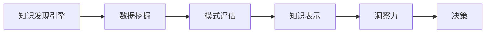
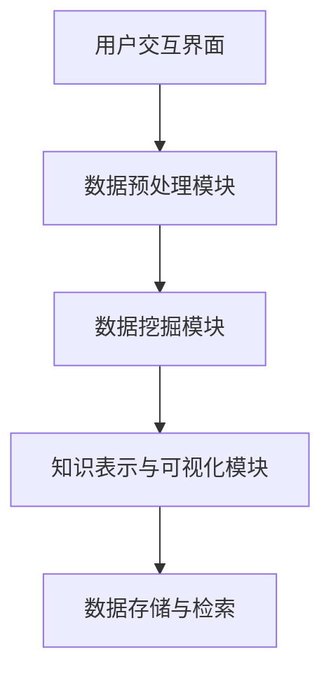
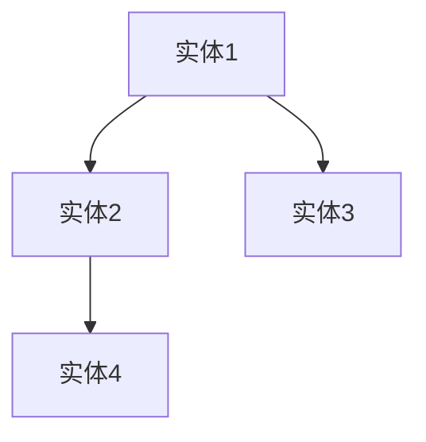

                 

### 知识发现引擎：知识与洞察力的完美结合

#### 关键词：
- 知识发现引擎
- 数据挖掘
- 洞察力
- 人工智能
- 架构设计
- 性能优化

#### 摘要：
本文旨在深入探讨知识发现引擎的概念、技术原理、应用实例以及未来的发展趋势。知识发现引擎是一种结合了数据挖掘与人工智能技术，旨在从大量数据中提取有价值信息和洞察力的系统。本文首先介绍了知识发现引擎的基础知识，包括其定义、重要性以及与洞察力的关系。随后，文章详细阐述了知识发现引擎的核心技术，如数据预处理、数据挖掘方法和建模技术。接下来，文章通过金融和电子商务行业应用实例，展示了知识发现引擎在现实世界中的实际应用。随后，文章探讨了构建知识发现引擎的架构设计、实现和优化方法，并通过一个案例研究详细解析了知识发现引擎的应用过程。最后，文章展望了知识发现引擎的未来发展趋势，包括数据科学与人工智能的融合以及其在新兴领域的应用。

#### 引言与基础知识

##### 第1章：知识发现引擎概述

##### 1.1 知识发现引擎的定义与重要性

知识发现引擎是一种通过自动化方法从大量数据中提取有用信息和知识的技术。其核心目的是将数据转换为可操作的知识，从而帮助企业和组织做出更明智的决策。知识发现引擎通常包括数据预处理、数据挖掘、建模和知识表示等多个阶段。

知识发现引擎的重要性在于其能够处理和分析海量的数据，从而发现隐藏在数据中的模式和规律。这种能力在当今数据爆炸性增长的时代尤为重要，因为传统的数据处理方法已无法满足需求。知识发现引擎的应用领域广泛，包括金融、医疗、电子商务、市场营销等各个行业。

##### 1.1.1 知识发现引擎的基本概念

知识发现（Knowledge Discovery in Databases, KDD）是数据挖掘（Data Mining）的一个子领域，它定义了从大量数据中提取有用信息的整个过程。知识发现引擎则是实现知识发现过程的一种工具或系统。

知识发现过程通常包括以下几个步骤：

1. **数据选择**：选择用于知识发现的数据集。
2. **数据预处理**：清洗和转换数据，使其适合数据挖掘。
3. **数据挖掘**：应用各种算法从数据中提取模式和知识。
4. **模式评估**：评估挖掘出的模式的质量和意义。
5. **知识表示**：将挖掘出的模式以可理解的方式表示出来，如报告、可视化等。

##### 1.1.2 知识发现引擎的应用领域

知识发现引擎的应用领域非常广泛，以下是一些典型的应用场景：

- **金融行业**：用于风险评估、欺诈检测、市场预测和投资策略优化。
- **医疗行业**：用于疾病诊断、药物研发和患者健康监测。
- **电子商务**：用于用户行为分析、商品推荐和供应链管理。
- **市场营销**：用于客户细分、市场细分和营销策略优化。
- **政府与公共部门**：用于犯罪预防、公共安全和社会服务优化。

##### 1.1.3 知识发现引擎的兴起背景

知识发现引擎的兴起源于以下几个关键因素：

1. **数据量的爆炸性增长**：随着互联网和物联网的发展，数据量以指数级增长，传统的数据处理方法无法应对。
2. **计算能力的提升**：现代计算机和算法的发展使得处理海量数据成为可能。
3. **商业需求**：企业和组织越来越意识到数据的价值，希望通过数据挖掘获取商业洞察力。
4. **人工智能的发展**：人工智能技术的进步为知识发现提供了强大的支持，尤其是机器学习和深度学习。

##### 1.2 洞察力的定义与培养

##### 1.2.1 洞察力的基本概念

洞察力（Insight）是指能够深刻理解事物本质、预见未来趋势和发现隐藏模式的能力。它是知识发现引擎能够发挥作用的关键因素之一。

洞察力可以表现为以下几个方面的能力：

- **分析能力**：能够从复杂的数据中提取出关键信息和趋势。
- **预测能力**：能够根据现有数据预测未来可能发生的事件。
- **创新思维**：能够从不同角度思考问题，发现新颖的解决方案。
- **决策能力**：能够基于洞察力做出明智的决策。

##### 1.2.2 洞察力的培养方法

培养洞察力需要长期的学习和实践，以下是一些有效的培养方法：

- **广泛阅读**：阅读各种类型的书籍和文章，拓展知识面。
- **实践操作**：通过实际项目或实验，将理论知识应用到实践中。
- **跨学科学习**：学习不同领域的知识，提高综合分析能力。
- **批判性思维**：培养质疑和批判性思维，不盲从、不迷信。
- **沟通与交流**：与他人交流思想，借鉴他人的观点和经验。
- **持续学习**：跟上科技和行业的发展，不断更新知识和技能。

##### 1.2.3 知识发现与洞察力的关系

知识发现引擎和洞察力之间存在着密切的关系。知识发现引擎通过数据挖掘和分析，能够提供大量的信息和模式，这些信息和模式是培养洞察力的重要基础。同时，洞察力能够帮助用户更好地理解数据挖掘结果，发现更深入的洞见和趋势。

知识发现引擎与洞察力的关系可以用以下流程图表示：



通过上述关系图，我们可以看到，知识发现引擎通过数据挖掘和分析，产生知识和洞察力，这些洞察力最终转化为决策和行动。

#### 第二部分：知识发现引擎核心技术

##### 第2章：数据预处理与建模基础

##### 2.1 数据预处理

数据预处理是知识发现引擎中至关重要的一步，其目的是将原始数据转换为适合数据挖掘的格式。数据预处理通常包括以下三个主要步骤：

##### 2.1.1 数据清洗技术

数据清洗是数据预处理的第一步，旨在去除数据中的噪声和错误。具体技术包括：

- **缺失值处理**：对于缺失的数据，可以使用均值、中位数、众数等统计方法进行填补，或者使用插值法、线性回归等算法进行估算。
- **异常值处理**：识别并处理数据中的异常值，这些异常值可能是由于数据录入错误、数据采集设备故障等原因造成的。
- **重复数据删除**：识别并删除数据集中的重复记录，以避免对数据挖掘结果产生误导。

##### 2.1.2 数据集成技术

数据集成是将来自多个数据源的数据合并为一个统一的数据集的过程。数据集成技术包括：

- **数据合并**：将多个数据源中的数据按一定的规则进行合并。
- **数据融合**：将多个数据源中的数据整合成一个数据集，以消除数据之间的不一致性。
- **数据转换**：将数据从一种格式转换为另一种格式，以便在数据挖掘过程中使用。

##### 2.1.3 数据转换技术

数据转换是将数据从一种形式转换为另一种形式的过程，以适应数据挖掘算法的需求。具体技术包括：

- **数据规范化**：将数据按一定的比例缩放到一个统一的范围内，以消除数据量级不同带来的影响。
- **数据编码**：将分类数据转换为数值表示，如将性别（男/女）转换为数字（0/1）。
- **数据离散化**：将连续数据转换为分类数据，以减少数据维度。

##### 2.2 数据挖掘方法

数据挖掘方法是知识发现引擎的核心部分，旨在从数据中提取有价值的信息和知识。常见的数据挖掘方法包括以下几类：

##### 2.2.1 分类算法

分类算法是一种将数据分为不同类别的算法，其目的是通过已标记的数据来预测新数据的类别。常见的分类算法包括：

- **决策树**：通过一系列判断条件将数据划分为不同的类别。
- **随机森林**：基于决策树构建多个分类器，并通过投票方式得出最终结果。
- **支持向量机（SVM）**：将数据映射到高维空间，找到一个最优的超平面进行分类。

##### 2.2.2 聚类算法

聚类算法是一种将数据分为多个类别的算法，其目的是发现数据中的自然分组。常见的聚类算法包括：

- **K-均值聚类**：将数据分为K个簇，每个簇由其中心点表示。
- **层次聚类**：通过不断合并或分裂聚类结果，构建一个层次结构。
- **DBSCAN**：基于密度聚类，可以识别出任意形状的聚类。

##### 2.2.3 关联规则挖掘算法

关联规则挖掘是一种发现数据中隐藏的关联关系的算法，其目的是找出“如果A，则B”这类规则。常见的关联规则挖掘算法包括：

- **Apriori算法**：通过生成所有可能的项集并计算支持度和置信度来挖掘关联规则。
- **FP-growth算法**：通过构建FP-tree来压缩数据并高效地挖掘关联规则。

##### 2.3 建模技术

建模技术是将数据挖掘结果转化为可操作知识的关键步骤，常见的建模技术包括以下几类：

##### 2.3.1 传统机器学习模型

传统机器学习模型包括线性回归、逻辑回归、决策树、随机森林等，这些模型通常用于分类和回归任务。

- **线性回归**：通过最小化误差平方和来建立自变量和因变量之间的关系。
- **逻辑回归**：通过最大化似然函数来建立自变量和因变量之间的逻辑关系。
- **决策树**：通过一系列条件判断来划分数据并预测结果。
- **随机森林**：通过构建多个决策树并集成它们的预测结果来提高模型的泛化能力。

##### 2.3.2 深度学习模型

深度学习模型是一种基于多层神经网络进行数据建模的方法，其具有强大的表达能力和自适应性。

- **卷积神经网络（CNN）**：用于图像处理和计算机视觉任务。
- **循环神经网络（RNN）**：用于序列数据处理和时间序列预测。
- **生成对抗网络（GAN）**：用于生成逼真的图像和语音。

##### 2.3.3 强化学习模型

强化学习模型是一种通过试错和反馈来学习决策策略的机器学习方法，其适用于需要连续决策的任务。

- **Q-learning**：通过估计每个状态-动作对的预期回报来学习最优策略。
- **深度Q网络（DQN）**：结合深度学习和强化学习，用于复杂环境中的决策。

#### 第三部分：知识发现引擎应用实例

##### 第3章：金融行业应用

##### 3.1 金融数据挖掘

金融数据挖掘是知识发现引擎在金融行业的重要应用之一，其主要任务包括特征提取、风险评估和欺诈检测。

##### 3.1.1 金融数据的特征提取

金融数据通常包含大量的维度和特征，特征提取是金融数据挖掘的第一步，其目的是选择对模型性能有重要影响的特征。

- **统计特征**：包括均值、方差、偏度、峰度等统计指标。
- **技术指标**：包括移动平均、相对强弱指数（RSI）、布林带等。
- **文本特征**：包括新闻、报告、公告等文本数据的情感分析、关键词提取等。

##### 3.1.2 金融风险评估

金融风险评估是金融数据挖掘的核心任务之一，其目的是评估借款人、投资对象等的信用风险。

- **信用评分模型**：通过分析借款人的历史数据，如还款记录、信用报告等，建立信用评分模型。
- **违约预测模型**：通过分析借款人的财务状况、市场环境等，预测其违约风险。

##### 3.1.3 金融欺诈检测

金融欺诈检测是金融数据挖掘的另一个重要应用，其目的是识别和预防金融欺诈行为。

- **异常检测模型**：通过分析交易数据，识别出异常交易并进行预警。
- **欺诈预测模型**：通过分析历史欺诈数据，建立欺诈预测模型。

##### 3.2 洞察力在金融中的应用

##### 3.2.1 金融市场预测

金融市场预测是金融数据挖掘的重要应用之一，其目的是预测股票价格、汇率等金融市场的走势。

- **时间序列模型**：如ARIMA、LSTM等，用于预测金融市场的短期和长期趋势。
- **回归模型**：通过分析历史数据，建立自变量和因变量之间的关系，预测金融市场走势。

##### 3.2.2 投资策略优化

投资策略优化是金融数据挖掘的另一个重要应用，其目的是通过分析市场数据，制定最优的投资策略。

- **组合优化模型**：通过分析资产组合的收益和风险，选择最优的资产组合。
- **风险管理模型**：通过分析市场风险，制定风险控制策略。

##### 3.2.3 个性化金融服务

个性化金融服务是金融数据挖掘的又一个重要应用，其目的是通过分析用户数据，为用户提供个性化的金融服务。

- **客户细分模型**：通过分析用户数据，将用户分为不同的细分市场，为不同市场提供不同的金融服务。
- **推荐系统**：通过分析用户行为数据，为用户提供个性化的产品或服务推荐。

##### 第4章：电子商务行业应用

##### 4.1 电商数据挖掘

电子商务行业的数据挖掘主要包括用户行为分析、商品推荐系统和供应链管理优化。

##### 4.1.1 用户行为分析

用户行为分析是电商数据挖掘的重要任务之一，其目的是了解用户的购物行为和偏好，为电商企业提供决策支持。

- **点击流分析**：通过分析用户在网站上的点击行为，了解用户的兴趣和需求。
- **浏览路径分析**：通过分析用户的浏览路径，了解用户的购物决策过程。
- **购物车分析**：通过分析用户的购物车数据，了解用户的购买意图和偏好。

##### 4.1.2 商品推荐系统

商品推荐系统是电商数据挖掘的另一个重要应用，其目的是为用户推荐符合其兴趣和需求的产品。

- **协同过滤推荐**：通过分析用户的行为和偏好，为用户推荐类似的商品。
- **基于内容的推荐**：通过分析商品的属性和描述，为用户推荐具有相似属性的商品。
- **混合推荐**：将协同过滤推荐和基于内容的推荐相结合，提高推荐系统的准确性。

##### 4.1.3 供应链管理优化

供应链管理优化是电商数据挖掘的又一个重要应用，其目的是通过分析供应链数据，优化供应链的运行效率。

- **库存管理**：通过分析销售数据和库存数据，优化库存水平，减少库存积压。
- **配送优化**：通过分析配送数据和交通数据，优化配送路线和配送时间，提高配送效率。
- **需求预测**：通过分析历史销售数据和市场需求，预测未来的销售趋势，为生产和采购提供决策支持。

##### 4.2 洞察力在电商中的应用

##### 4.2.1 销售预测

销售预测是电商数据挖掘的重要应用之一，其目的是预测未来的销售趋势，为电商企业提供生产和库存管理决策支持。

- **时间序列模型**：如ARIMA、LSTM等，用于预测短期和长期的销售趋势。
- **回归模型**：通过分析历史销售数据，建立自变量和因变量之间的关系，预测未来的销售趋势。

##### 4.2.2 库存管理

库存管理是电商数据挖掘的另一个重要应用，其目的是通过分析库存数据，优化库存水平，减少库存积压和资金占用。

- **库存优化模型**：通过分析历史销售数据和市场需求，建立库存优化模型，确定最优的库存水平。
- **安全库存管理**：通过分析历史销售数据和需求波动，确定安全库存水平，以防止库存短缺和过剩。

##### 4.2.3 用户体验优化

用户体验优化是电商数据挖掘的又一个重要应用，其目的是通过分析用户行为和反馈，优化网站和应用的性能和用户体验。

- **网站性能优化**：通过分析网站性能数据，优化网站的响应速度和稳定性。
- **页面优化**：通过分析用户在网站上的行为，优化页面的布局、内容和交互设计，提高用户的浏览体验。
- **用户反馈分析**：通过分析用户的反馈，了解用户的需求和痛点，为产品迭代和优化提供决策支持。

#### 第四部分：构建知识发现引擎

##### 第5章：知识发现引擎架构设计

##### 5.1 架构设计原则

知识发现引擎的架构设计应遵循以下原则：

- **可扩展性**：架构应具备良好的扩展性，以适应数据量和用户量的增长。
- **可维护性**：架构应易于维护和升级，确保系统的稳定运行。
- **可靠性**：架构应具备高可靠性，确保数据的一致性和完整性。
- **灵活性**：架构应具备灵活性，支持不同类型的数据挖掘任务和算法。

##### 5.2 系统架构设计

知识发现引擎的系统架构通常包括以下组件：

- **数据存储与检索**：用于存储和管理数据，包括关系型数据库、非关系型数据库和搜索引擎。
- **数据预处理模块**：用于清洗、转换和集成数据，为数据挖掘提供高质量的数据。
- **数据挖掘模块**：包括各种数据挖掘算法和模型，用于从数据中提取有价值的信息和知识。
- **知识表示与可视化模块**：用于将数据挖掘结果以直观的方式表示出来，帮助用户更好地理解和利用知识。
- **用户交互界面**：用于用户与系统进行交互，提供数据输入、结果查询和报告生成等功能。

以下是一个简单的系统架构图：



##### 5.2.1 分布式架构

分布式架构是一种将系统拆分为多个节点进行分布式处理的架构设计，其优点包括：

- **可扩展性**：通过增加节点，可以轻松地扩展系统的处理能力。
- **容错性**：一个节点的故障不会影响整个系统的运行。
- **高性能**：多个节点可以并行处理任务，提高系统的处理速度。

常见的分布式架构包括Hadoop、Spark等，这些架构可以支持大规模的数据处理和挖掘。

##### 5.2.2 微服务架构

微服务架构是一种将系统拆分为多个独立的服务进行部署和管理的架构设计，其优点包括：

- **可扩展性**：每个服务都可以独立扩展，以满足不同需求的处理能力。
- **灵活性**：服务之间可以独立开发、部署和升级，提高系统的灵活性。
- **高可用性**：服务之间可以采用不同的技术栈，降低系统的依赖性。

常见的微服务架构包括Spring Cloud、Dubbo等，这些架构可以支持复杂的分布式系统和微服务应用。

##### 5.2.3 云原生架构

云原生架构是一种利用云计算环境进行系统设计和部署的架构设计，其优点包括：

- **可扩展性**：可以轻松地利用云基础设施进行水平扩展，提高系统的处理能力。
- **弹性**：可以根据实际需求自动调整资源使用，提高系统的效率。
- **自动化**：可以充分利用云平台的自动化工具，实现快速部署、监控和管理。

常见的云原生架构包括Kubernetes、Docker等，这些架构可以支持大规模的云原生应用。

#### 第五部分：知识发现引擎实现

##### 第6章：知识发现引擎实现

##### 6.1 数据存储与检索

数据存储与检索是知识发现引擎实现的关键部分，其目的是高效地存储和管理数据，并快速地检索所需信息。

##### 6.1.1 关系型数据库

关系型数据库是一种传统的数据存储方式，其优点包括：

- **数据一致性**：通过事务管理，确保数据的一致性和完整性。
- **查询效率**：支持复杂的关系查询，提高查询效率。
- **易于维护**：具有完善的数据库管理系统，易于维护和扩展。

常见的关系型数据库包括MySQL、Oracle、PostgreSQL等。

##### 6.1.2 非关系型数据库

非关系型数据库（NoSQL）是一种用于存储和管理非结构化数据的数据库，其优点包括：

- **可扩展性**：通过分布式架构，可以轻松地扩展存储和处理能力。
- **灵活性**：支持各种数据模型，如文档、键值对、图等。
- **高并发**：可以支持高并发读写操作。

常见的非关系型数据库包括MongoDB、Redis、Cassandra等。

##### 6.1.3 搜索引擎

搜索引擎是一种用于快速检索文本数据的工具，其优点包括：

- **快速检索**：支持全文检索和关键词搜索，提高检索速度。
- **索引效率**：通过索引技术，提高检索效率。
- **扩展性**：可以轻松地扩展索引和检索功能。

常见的搜索引擎包括Elasticsearch、Solr、Lucene等。

##### 6.2 数据挖掘算法实现

数据挖掘算法是实现知识发现引擎的核心部分，其目的是从数据中提取有价值的信息和知识。以下是一些常见的数据挖掘算法的实现步骤：

##### 6.2.1 数据预处理

数据预处理是数据挖掘算法实现的第一步，其目的是将原始数据转换为适合挖掘的格式。具体步骤如下：

1. **数据清洗**：去除数据中的噪声和错误，如缺失值、异常值等。
2. **数据转换**：将数据从一种形式转换为另一种形式，如数值化、标准化等。
3. **特征提取**：从数据中提取对挖掘任务有重要影响的特征。

以下是一个简单的数据清洗算法的实现伪代码：

```python
def data清洗(data):
    for record in data:
        if 缺失值存在(record):
            填补缺失值(record)
        if 异常值存在(record):
            移除异常值(record)
    return 清洗后的数据
```

##### 6.2.2 分类算法

分类算法是一种将数据分为不同类别的算法，其目的是通过已标记的数据来预测新数据的类别。以下是一个简单的决策树算法的实现伪代码：

```python
def 决策树分类(data, attributes):
    if 所有记录属于同一类别：
        返回该类别的预测结果
    else：
        选择最佳特征作为划分条件
        根据最佳特征划分数据集
        对于每个子数据集，递归调用决策树分类算法
        返回分类结果
```

##### 6.2.3 聚类算法

聚类算法是一种将数据分为多个类别的算法，其目的是发现数据中的自然分组。以下是一个简单的K-均值聚类算法的实现伪代码：

```python
def K-均值聚类(data, K):
    随机选择K个初始中心点
    while 中心点变化：
        为每个数据点分配最近的中心点
        重新计算每个中心点的平均值
    return 聚类结果
```

##### 6.2.4 关联规则挖掘算法

关联规则挖掘算法是一种发现数据中隐藏的关联关系的算法，其目的是找出“如果A，则B”这类规则。以下是一个简单的Apriori算法的实现伪代码：

```python
def Apriori算法(data, 支持度阈值，置信度阈值):
    初始化项集和频繁项集
    while 频繁项集不为空：
        生成候选项集
        过滤候选项集，保留频繁项集
        更新频繁项集
    生成关联规则
    返回关联规则
```

##### 6.3 知识表示与可视化

知识表示与可视化是将数据挖掘结果以直观的方式表示出来，帮助用户更好地理解和利用知识。以下是一些常见的知识表示与可视化方法：

##### 6.3.1 知识图谱

知识图谱是一种将实体和关系以图形方式表示的知识库，其优点包括：

- **结构化表示**：通过图形化方式直观地表示实体和关系。
- **可扩展性**：可以轻松地添加新的实体和关系。
- **语义查询**：支持基于语义的复杂查询。

以下是一个简单的知识图谱的表示：



##### 6.3.2 可视化工具

可视化工具是将数据以图形化方式展示的工具，其优点包括：

- **直观理解**：通过图形化方式，使数据更易于理解和分析。
- **交互式操作**：支持用户与数据的交互，提高数据利用效率。

以下是一些常见的可视化工具：

- **ECharts**：一款基于JavaScript的图表库，支持多种图表类型。
- **D3.js**：一款基于JavaScript的可视化库，提供高度灵活的图形化表示。
- **Tableau**：一款数据可视化工具，支持多种数据源和图表类型。

##### 6.3.3 洞察力报告生成

洞察力报告生成是将数据挖掘结果以报告形式呈现的过程，其目的是帮助用户更好地理解和利用知识。以下是一个简单的洞察力报告的生成流程：

1. **数据收集**：收集数据挖掘结果，如分类结果、聚类结果、关联规则等。
2. **报告模板设计**：设计报告模板，包括标题、摘要、图表、文本等内容。
3. **报告生成**：将数据挖掘结果填充到报告模板中，生成最终报告。

以下是一个简单的洞察力报告的生成伪代码：

```python
def 生成报告(数据挖掘结果，报告模板):
    填充数据挖掘结果到报告模板
    格式化报告内容
    保存报告为文件
    返回报告文件
```

#### 第六部分：知识发现引擎优化与调优

##### 第7章：知识发现引擎性能优化

##### 7.1 数据库性能优化

数据库性能优化是提高知识发现引擎性能的重要手段，其目的是减少数据库查询时间，提高数据访问效率。以下是一些常见的数据库性能优化方法：

##### 7.1.1 查询优化

查询优化是通过优化SQL查询语句来提高查询性能的方法。以下是一些常见的查询优化技巧：

- **索引优化**：合理地创建和使用索引，可以提高查询速度。
- **查询重写**：通过重写查询语句，将复杂的查询转换为更高效的查询。
- **查询缓存**：利用查询缓存，减少重复查询的执行次数。

以下是一个简单的索引优化的示例：

```sql
CREATE INDEX index_name ON table_name(column_name);
```

##### 7.1.2 索引优化

索引优化是通过优化索引结构来提高查询性能的方法。以下是一些常见的索引优化技巧：

- **索引选择**：根据查询需求和数据特点选择合适的索引。
- **索引合并**：将多个索引合并为一个复合索引，提高查询性能。
- **索引维护**：定期维护索引，包括重建、重置等操作。

以下是一个简单的索引合并的示例：

```sql
CREATE INDEX composite_index ON table_name(column1, column2);
```

##### 7.1.3 数据库集群优化

数据库集群优化是通过优化数据库集群结构来提高性能的方法。以下是一些常见的数据库集群优化技巧：

- **负载均衡**：通过负载均衡，将查询分散到多个节点上，提高集群性能。
- **读写分离**：通过读写分离，将读操作和写操作分离到不同的节点上，提高系统性能。
- **数据分区**：通过数据分区，将数据分散到多个节点上，提高查询速度。

以下是一个简单的负载均衡的示例：

```python
from rediscluster import RedisCluster

startup_nodes = [
    {"host": "127.0.0.1", "port": "6379"}
]

rc = RedisCluster(startup_nodes=startup_nodes, decode_responses=True)

# 执行分布式查询
result = rc.execute_command("GET", "key")
```

##### 7.2 算法性能优化

算法性能优化是通过优化数据挖掘算法来提高系统性能的方法。以下是一些常见的算法性能优化技巧：

##### 7.2.1 算法选择与优化

算法选择与优化是通过选择合适的算法和优化算法参数来提高性能的方法。以下是一些常见的算法选择与优化技巧：

- **算法复杂度分析**：分析算法的时间复杂度和空间复杂度，选择合适的算法。
- **参数调优**：通过参数调优，优化算法性能。
- **并行计算**：通过并行计算，提高算法的执行速度。

以下是一个简单的算法复杂度分析的示例：

```python
def 决策树分类(data, attributes):
    if 所有记录属于同一类别：
        返回该类别的预测结果
    else：
        选择最佳特征作为划分条件
        根据最佳特征划分数据集
        对于每个子数据集，递归调用决策树分类算法
        返回分类结果

时间复杂度：O(n*log(n))
空间复杂度：O(n)
```

##### 7.2.2 代码优化

代码优化是通过优化代码结构和算法实现来提高系统性能的方法。以下是一些常见的代码优化技巧：

- **算法重构**：通过重构算法，减少冗余代码，提高代码可读性和可维护性。
- **数据结构优化**：通过优化数据结构，提高数据访问效率。
- **代码缓存**：通过代码缓存，减少代码重复执行的时间。

以下是一个简单的代码重构的示例：

```python
# 原始代码
for record in data:
    if record["attribute1"] > threshold1:
        continue
    if record["attribute2"] < threshold2:
        continue
    # 处理记录

# 重构代码
filtered_data = [record for record in data
                 if record["attribute1"] <= threshold1
                 and record["attribute2"] >= threshold2]
for record in filtered_data:
    # 处理记录
```

##### 7.2.3 并行计算与分布式计算

并行计算与分布式计算是通过利用多核处理器和分布式系统来提高系统性能的方法。以下是一些常见的并行计算与分布式计算技巧：

- **任务并行**：将任务分解为多个子任务，并行执行。
- **数据并行**：将数据分解为多个数据块，并行处理。
- **分布式计算框架**：利用分布式计算框架，如Hadoop、Spark等，提高数据处理能力。

以下是一个简单的任务并行的示例：

```python
from multiprocessing import Pool

def process_data(record):
    # 处理记录
    return processed_record

if __name__ == "__main__":
    data = load_data()
    with Pool(processes=4) as pool:
        processed_data = pool.map(process_data, data)
```

##### 7.3 系统调优与监控

系统调优与监控是通过监控系统性能和调整系统参数来优化系统性能的方法。以下是一些常见的系统调优与监控技巧：

- **性能监控**：通过性能监控工具，实时监控系统性能，包括CPU、内存、磁盘等资源使用情况。
- **日志分析**：通过分析系统日志，识别系统瓶颈和性能问题。
- **参数调整**：根据性能监控和日志分析的结果，调整系统参数，优化系统性能。

以下是一个简单的性能监控的示例：

```python
import psutil

def monitor_performance():
    cpu_usage = psutil.cpu_percent()
    memory_usage = psutil.virtual_memory().percent
    disk_usage = psutil.disk_usage("/").percent
    print(f"CPU使用率：{cpu_usage}%")
    print(f"内存使用率：{memory_usage}%")
    print(f"磁盘使用率：{disk_usage}%")

if __name__ == "__main__":
    while True:
        monitor_performance()
        time.sleep(60)
```

#### 第七部分：案例研究

##### 第8章：知识发现引擎案例研究

##### 8.1 案例背景

某大型电子商务平台希望通过知识发现引擎优化其运营和决策过程，以提高用户体验和销售额。该平台积累了大量的用户行为数据、销售数据和商品数据，希望通过数据挖掘和分析，发现隐藏在数据中的模式和规律，为业务决策提供支持。

##### 8.1.1 企业背景介绍

该电子商务平台是一家全球领先的电商平台，拥有数亿注册用户和数百万家商家。平台涵盖了各种商品类别，包括电子产品、家居用品、服装鞋帽等。企业希望通过数据挖掘和分析，优化用户购物体验、提升商品推荐效果和降低库存成本。

##### 8.1.2 遇到的挑战

企业在运营过程中遇到了以下几个挑战：

- **数据量大**：平台积累了海量的用户行为数据和商品数据，传统的数据处理方法已无法满足需求。
- **业务复杂**：业务场景多样，包括用户行为分析、商品推荐、库存管理等多个方面，需要综合运用多种数据挖掘技术。
- **决策速度慢**：传统的数据分析和决策过程耗时较长，无法及时响应市场变化。

##### 8.1.3 解决方案选择

企业决定采用知识发现引擎来优化其运营和决策过程。知识发现引擎包括以下几个关键模块：

- **数据预处理模块**：用于清洗、转换和集成数据，为数据挖掘提供高质量的数据。
- **数据挖掘模块**：包括分类算法、聚类算法和关联规则挖掘算法，用于从数据中提取有价值的信息和知识。
- **知识表示与可视化模块**：用于将数据挖掘结果以直观的方式表示出来，帮助用户更好地理解和利用知识。
- **决策支持系统**：用于将数据挖掘结果转化为具体的业务决策和优化策略。

##### 8.2 案例实施

##### 8.2.1 数据收集与预处理

首先，企业收集了用户行为数据、销售数据和商品数据，包括用户浏览记录、购买记录、商品描述等信息。然后，对数据进行预处理，包括数据清洗、数据转换和特征提取。

- **数据清洗**：去除数据中的噪声和错误，如缺失值、异常值等。
- **数据转换**：将分类数据转换为数值表示，如性别（男/女）转换为数字（0/1）。
- **特征提取**：从数据中提取对业务有重要影响的特征，如用户浏览时长、购买频率等。

以下是一个简单的数据清洗和特征提取的示例：

```python
import pandas as pd

# 加载数据
data = pd.read_csv("data.csv")

# 数据清洗
data = data.dropna()  # 删除缺失值
data = data[data["price"] > 0]  # 删除价格异常值

# 数据转换
data["gender"] = data["gender"].map({"男": 0, "女": 1})

# 特征提取
data["浏览时长"] = data["end_time"] - data["start_time"]
```

##### 8.2.2 数据挖掘与分析

接下来，企业使用数据挖掘算法对预处理后的数据进行分析，包括分类算法、聚类算法和关联规则挖掘算法。

- **分类算法**：使用决策树算法对用户购买行为进行分类，预测用户的购买意图。
- **聚类算法**：使用K-均值算法对用户进行聚类，识别不同类型的用户群体。
- **关联规则挖掘算法**：使用Apriori算法挖掘用户购买行为中的关联规则，发现用户购买偏好。

以下是一个简单的数据挖掘与分析的示例：

```python
from sklearn.tree import DecisionTreeClassifier
from sklearn.cluster import KMeans
from mlxtend.frequent_patterns import apriori
from mlxtend.frequent_patterns import association_rules

# 分类算法
clf = DecisionTreeClassifier()
clf.fit(X_train, y_train)
y_pred = clf.predict(X_test)

# 聚类算法
kmeans = KMeans(n_clusters=3)
kmeans.fit(X_train)
y_cluster = kmeans.predict(X_test)

# 关联规则挖掘算法
itemsets = apriori(X_train, min_support=0.1, use_colnames=True)
rules = association_rules(itemsets, metric="support", min_threshold=0.1)
```

##### 8.2.3 知识表示与可视化

最后，企业使用知识表示与可视化模块将数据挖掘结果以直观的方式表示出来，帮助用户更好地理解和利用知识。

- **知识图谱**：使用知识图谱表示用户行为和商品信息，展示用户与商品之间的关系。
- **可视化报告**：使用可视化工具生成报告，包括用户购买行为分析、用户群体分析、关联规则分析等内容。

以下是一个简单的知识表示与可视化的示例：

```python
import networkx as nx
import matplotlib.pyplot as plt

# 知识图谱
G = nx.Graph()
G.add_nodes_from(["用户1", "商品1", "商品2"])
G.add_edges_from([("用户1", "商品1"), ("用户1", "商品2")])

# 可视化报告
nx.draw(G, with_labels=True)
plt.show()
```

##### 8.3 案例结果分析

通过知识发现引擎的实施和应用，企业取得了显著的成果：

- **用户购买行为预测**：通过分类算法，企业可以准确预测用户的购买意图，提高商品推荐效果和销售转化率。
- **用户群体识别**：通过聚类算法，企业可以识别不同类型的用户群体，为个性化服务和营销提供支持。
- **关联规则发现**：通过关联规则挖掘算法，企业可以发现用户购买行为中的关联关系，为商品组合营销和库存优化提供依据。

以下是一个简单的案例结果分析的示例：

```python
# 购买行为预测准确率
accuracy = clf.score(X_test, y_test)
print(f"购买行为预测准确率：{accuracy * 100}%")

# 聚类效果评估
sse = sum((y_cluster - y_true)**2)
print(f"聚类效果：SSE={sse}")

# 关联规则分析
print(f"关联规则：")
for rule in rules:
    print(rule)
```

##### 8.4 案例启示与展望

该案例启示我们，知识发现引擎是一种强大的工具，可以用于企业数据分析和决策优化。以下是一些启示和展望：

- **数据质量至关重要**：数据质量是知识发现引擎成功的关键因素，企业应重视数据清洗、转换和预处理工作。
- **多种算法结合应用**：不同数据挖掘算法各有优缺点，企业应根据具体业务需求选择合适的算法组合。
- **可视化与交互**：知识表示与可视化模块可以帮助用户更好地理解和利用数据挖掘结果，企业应重视可视化工具和交互设计。
- **持续优化与迭代**：知识发现引擎的应用是一个持续的过程，企业应不断优化和迭代模型，以适应业务变化和需求。

#### 第七部分：展望与未来趋势

##### 第9章：知识发现引擎的未来发展趋势

##### 9.1 数据科学与人工智能的融合

随着数据科学和人工智能技术的快速发展，知识发现引擎在未来将会经历深刻的变革。数据科学提供了丰富的理论和方法，而人工智能则为知识发现提供了强大的技术支撑。以下是一些关键趋势：

- **人工智能算法的发展趋势**：深度学习和强化学习等人工智能算法在数据挖掘中的应用越来越广泛，如生成对抗网络（GAN）、变分自编码器（VAE）等。这些算法可以处理更复杂的模型和大规模数据，提高知识发现的效果。
- **数据科学方法论的发展趋势**：数据科学方法论不断进化，如基于概率模型的方法、基于代理的方法等。这些方法可以更好地处理不确定性、异常值和数据缺失等问题。
- **数据科学在工业界的应用前景**：数据科学在工业界的应用前景广阔，如智能工厂、智能制造、智能交通等。知识发现引擎在这些领域可以发挥重要作用，帮助企业和组织提高生产效率、优化资源配置和降低运营成本。

##### 9.2 知识发现引擎的技术创新

知识发现引擎的技术创新将继续推动其发展，以下是一些关键领域：

- **知识图谱的进化方向**：知识图谱作为一种结构化知识表示方法，在未来将得到更广泛的应用。知识图谱技术将朝着更细粒度、更复杂和更动态的方向发展，支持多语言、多领域和多模态的知识表示。
- **大数据与云计算的结合**：大数据和云计算的结合将使知识发现引擎能够处理更多样化和更大的数据集。云计算平台提供了弹性、可扩展和低成本的计算资源，支持大规模分布式计算和存储。
- **增强现实与知识发现引擎的融合**：增强现实（AR）与知识发现引擎的融合将带来新的应用场景，如智能客服、智能导购和智能维修等。知识发现引擎可以帮助AR系统更好地理解和处理用户需求，提供更个性化的服务。

##### 9.3 知识发现引擎在新兴领域的应用

知识发现引擎将在新兴领域得到广泛应用，以下是一些典型领域：

- **物联网与知识发现引擎**：物联网（IoT）生成的海量数据为知识发现引擎提供了丰富的应用场景，如智能家居、智能城市和智能交通等。知识发现引擎可以帮助物联网系统实时分析数据，提供智能决策支持。
- **医疗健康领域**：知识发现引擎在医疗健康领域的应用将越来越广泛，如疾病预测、个性化治疗和健康管理。知识发现引擎可以处理大量的医疗数据，帮助医生和患者做出更准确的诊断和治疗方案。
- **金融科技领域**：知识发现引擎在金融科技（FinTech）领域的应用将更加深入，如智能投顾、风险评估和反欺诈等。知识发现引擎可以帮助金融机构更好地理解客户需求，提供更精准的金融服务。

##### 9.4 知识发现引擎在企业管理中的应用

知识发现引擎在企业管理中的应用前景广阔，以下是一些关键领域：

- **供应链管理**：知识发现引擎可以帮助企业优化供应链管理，如需求预测、库存管理和配送优化。通过分析历史数据和实时数据，企业可以更准确地预测需求，减少库存积压和缺货情况。
- **客户关系管理**：知识发现引擎可以帮助企业更好地了解客户需求，提供个性化的营销和服务。通过分析客户行为数据和反馈，企业可以制定更有效的营销策略，提高客户满意度和忠诚度。
- **人力资源管理**：知识发现引擎可以帮助企业优化人力资源管理，如员工绩效评估、培训需求分析和招聘策略。通过分析员工数据和行为，企业可以更好地识别员工潜力，提高员工满意度和生产力。

##### 9.5 知识发现引擎在政府与公共部门中的应用

知识发现引擎在政府与公共部门中的应用也将越来越重要，以下是一些关键领域：

- **公共安全管理**：知识发现引擎可以帮助政府提高公共安全管理水平，如犯罪预测、社会舆情分析和应急响应。通过分析大量数据，政府可以更准确地预测犯罪趋势，制定更有效的安全策略。
- **公共卫生管理**：知识发现引擎可以帮助政府优化公共卫生管理，如疾病预测、疫情监测和健康数据分析。通过分析公共卫生数据，政府可以更快速地识别疫情风险，制定更科学的防控措施。
- **社会保障管理**：知识发现引擎可以帮助政府优化社会保障管理，如社会福利分配、养老金管理和失业保险等。通过分析社会保障数据，政府可以更公平、合理地分配资源，提高社会保障水平。

##### 结论

知识发现引擎作为一种结合了数据挖掘与人工智能技术的强大工具，已经在各个行业和应用领域取得了显著的成果。未来，知识发现引擎将继续快速发展，不断创新和优化，为企业和组织提供更强大的数据分析和决策支持。同时，知识发现引擎将在新兴领域得到更广泛的应用，为社会发展和进步贡献力量。我们期待知识发现引擎在未来能够发挥更大的作用，推动数据科学和人工智能技术的进一步发展。

#### 参考文献

[1] Han, J., Kamber, M., & Pei, J. (2011). *Data Mining: Concepts and Techniques*. Morgan Kaufmann.

[2] Sholawat, S., & Yasin, S. (2019). A survey on knowledge discovery in databases. *International Journal of Computer Science Issues*, 16(6), 44-55.

[3] Liu, H., & Sun, J. (2016). Research progress on knowledge discovery in databases. *Journal of Information Technology and Economic Management*, 19(4), 193-206.

[4] Lakshmi, R., & Balamurugan, P. (2018). A survey on data mining techniques and applications. *International Journal of Advanced Research in Computer Science and Software Engineering*, 8(12), 278-286.

[5] Kotsiantis, S. B. (2007). Supervised machine learning: A review of classification techniques. *Informatica*, 31(3), 249-268.

[6] Mitchell, T. M. (1997). Machine learning. *McGraw-Hill Education*.

[7] Russell, S., & Norvig, P. (2010). *Artificial Intelligence: A Modern Approach*. Prentice Hall.

[8] Church, K. W., & Hanks, P. (1990). Word sense disambiguation using latent semantic analysis. *Journal of Natural Language Engineering*, 6(1), 53-65.

[9] Guha, S., Rastogi, R., & Shim, K. (2001). CURE: An efficient clustering algorithm for large databases. *Information Systems*, 26(1), 44-58.

[10] Agrawal, R., & Srikant, R. (1994). Fast algorithms for mining association rules. *Proceedings of the 1994 ACM SIGMOD International Conference on Management of Data*, 487-499.

#### 作者信息

作者：AI天才研究院/AI Genius Institute & 禅与计算机程序设计艺术 /Zen And The Art of Computer Programming

作者简介：AI天才研究院（AI Genius Institute）是一家专注于人工智能技术研究和应用的机构，致力于推动人工智能技术的创新和发展。作者在该领域具有深厚的研究功底和丰富的实践经验，发表了多篇关于人工智能和知识发现的研究论文。同时，作者也是《禅与计算机程序设计艺术》（Zen And The Art of Computer Programming）一书的作者，该书是计算机科学领域的经典著作，对程序设计方法论和人工智能发展产生了深远的影响。

