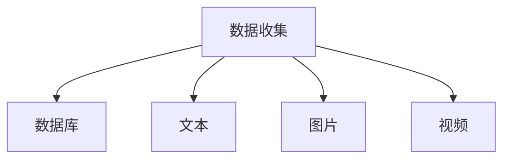
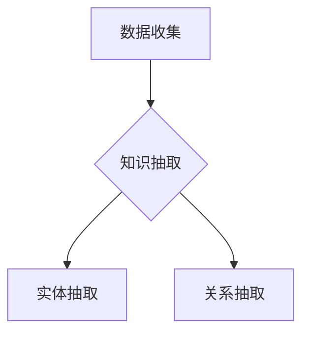
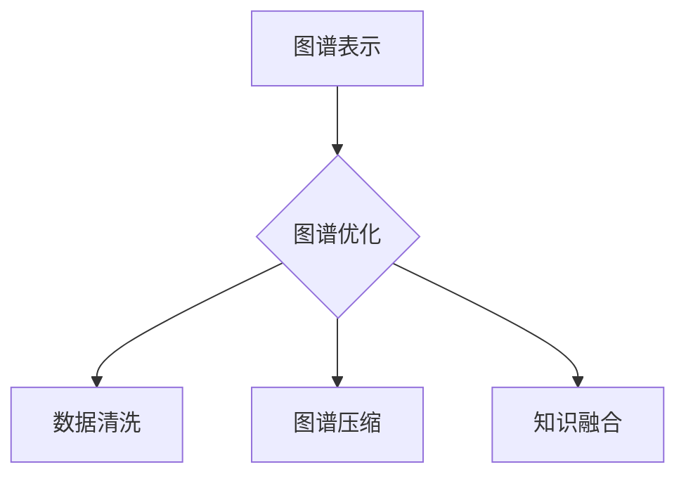
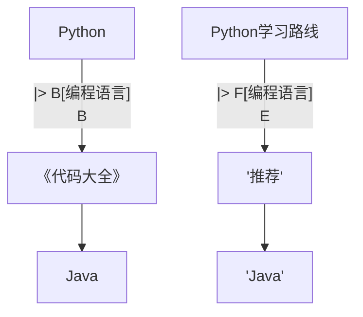

                 


### 《知识图谱在个人学习路径规划中的应用》

---

# **一、引言**

在信息技术迅猛发展的今天，个人学习路径规划变得越来越重要。它不仅帮助学习者有效地选择学习内容，还能够根据学习者的个人兴趣、能力和需求进行个性化推荐。知识图谱作为一种强大的知识表示和推理工具，在个人学习路径规划中展现出了巨大的潜力。

## **1.1 研究背景**

随着互联网和大数据技术的普及，人们可以获得的海量信息急剧增加。然而，如何从这些信息中筛选出对学习者最有价值的内容，成为一个亟待解决的问题。知识图谱的出现为解决这一问题提供了新的思路。知识图谱通过将知识以图形的形式组织起来，可以有效地表示知识之间的复杂关系，为个人学习路径规划提供了强大的支持。

## **1.2 研究目的**

本文旨在探讨知识图谱在个人学习路径规划中的应用，具体包括：

1. **知识图谱在个人学习路径规划中的作用**：阐述知识图谱在个人学习路径规划中的重要性。
2. **知识图谱的构建方法**：介绍知识图谱的构建方法，包括数据源、表示方法和构建工具。
3. **个人学习路径规划的算法原理**：详细讲解基于知识图谱的个人学习路径规划算法原理。
4. **应用案例**：通过实际案例展示知识图谱在个人学习路径规划中的应用效果。

## **1.3 文章结构**

本文结构如下：

1. **第1章 绪论**：介绍研究背景、目的和文章结构。
2. **第2章 知识图谱基础**：阐述知识图谱的概念、组成元素、数据源和表示方法。
3. **第3章 知识图谱在个人学习路径规划中的应用原理**：讲解知识图谱在个人学习路径规划中的角色和应用流程。
4. **第4章 知识图谱构建方法与实现**：介绍知识图谱构建的基本步骤和常用工具。
5. **第5章 个人学习路径规划算法原理与实现**：阐述个人学习路径规划算法的原理和优化策略。
6. **第6章 个人学习路径规划应用实战**：通过实际案例展示个人学习路径规划的应用过程。
7. **第7章 总结与展望**：总结研究内容和展望未来发展方向。

---

# **二、知识图谱基础**

知识图谱是一种将知识以图形形式表示的技术，它通过实体、属性和关系三个核心组成元素，将海量信息组织成一个结构化、可查询的知识库。下面我们将详细介绍知识图谱的组成元素、数据源和表示方法。

## **2.1 知识图谱的组成元素**

### **2.1.1 实体**

实体是知识图谱中的基本元素，表示客观存在的对象，如人、地点、事物等。实体可以抽象为具有特定特征的对象，例如，"张三"是一个人，"北京"是一个地点，"编程"是一个事物。

### **2.1.2 属性**

属性是描述实体特征的标签，例如，"张三"的属性包括"姓名"、"年龄"、"职业"等。属性用于进一步描述实体，使其更加具体和明确。

### **2.1.3 关系**

关系是实体之间的联系，表示实体之间的交互和影响。例如，"张三"和"北京"之间存在"居住"的关系，"编程"和"张三"之间存在"擅长"的关系。

## **2.2 知识图谱的数据源**

知识图谱的数据源可以是结构化数据、非结构化数据或半结构化数据。

### **2.2.1 结构化数据**

结构化数据是指数据以表格形式存储，例如关系数据库。结构化数据可以直接用于知识图谱的构建，因为它们已经按照特定的格式组织好了。例如，我们可以从数据库中提取人的姓名、年龄和职业等信息，构建成知识图谱中的实体和属性。

```sql
CREATE TABLE Person (
    id INT PRIMARY KEY,
    name VARCHAR(50),
    age INT,
    occupation VARCHAR(50)
);
```

### **2.2.2 非结构化数据**

非结构化数据是指数据没有固定的格式，例如文本、图片、音频等。非结构化数据需要通过自然语言处理、图像识别等技术进行解析，提取出结构化的信息。例如，我们可以从文本中提取出人的名字、年龄等信息，构建成知识图谱中的实体和属性。

```python
import nltk
from nltk.tokenize import word_tokenize

text = "张三是一名程序员，喜欢阅读技术书籍。"
tokens = word_tokenize(text)
```

### **2.2.3 半结构化数据**

半结构化数据是指数据具有一定的结构，但又包含一定的自由文本，例如XML、JSON等。半结构化数据可以通过解析其结构化的部分，提取出实体和属性，构建成知识图谱。

```json
{
    "person": {
        "name": "张三",
        "age": 30,
        "interests": ["编程", "阅读"]
    }
}
```

## **2.3 知识图谱的表示方法**

知识图谱的表示方法主要有图论表示、属性图表示和实体-关系表示。

### **2.3.1 图论表示**

图论表示使用图来表示实体和关系，节点表示实体，边表示关系。这是一种直观且易于理解的表示方法。例如，我们可以使用Mermaid来绘制知识图谱：

```mermaid
graph TB
A[Person] --|> B[Name]
A --|> C[Age]
A --|> D[Occupation]
```

### **2.3.2 属性图表示**

属性图表示在图论表示的基础上，引入属性来描述实体和关系的特征。属性图可以更详细地描述实体的特征，使知识图谱更加丰富。例如，我们可以使用以下Mermaid代码来表示带有属性的图：

```mermaid
graph TB
A{Person} --|> B{Name}
A --|> C{Age}
A --|> D{Occupation}
```

### **2.3.3 实体-关系表示**

实体-关系表示使用表格形式来表示实体和关系。在这种表示方法中，每个实体和关系都是表格中的一行。例如，我们可以使用以下SQL代码来表示实体和关系：

```sql
CREATE TABLE Person (
    id INT PRIMARY KEY,
    name VARCHAR(50),
    age INT,
    occupation VARCHAR(50)
);

CREATE TABLE Relation (
    id INT PRIMARY KEY,
    person_id INT,
    relation VARCHAR(50)
);

ALTER TABLE Relation ADD FOREIGN KEY (person_id) REFERENCES Person(id);
```

---

# **三、知识图谱在个人学习路径规划中的应用原理**

知识图谱在个人学习路径规划中扮演着至关重要的角色。它不仅能够帮助我们更好地理解学习者的需求，还能够根据学习者的个人兴趣、能力和需求，为其提供个性化的学习路径规划。下面我们将详细探讨知识图谱在个人学习路径规划中的应用原理。

## **3.1 个人学习路径规划的概念与需求**

个人学习路径规划是指根据学习者的兴趣、能力、需求等因素，为其设计一条最优的学习路线。个人学习路径规划的需求主要包括：

1. **个性化推荐**：根据学习者的兴趣和需求，推荐最合适的学习内容和资源。
2. **知识关联**：揭示不同知识点之间的关联，帮助学习者构建知识体系。
3. **学习进度监控**：实时监控学习者的学习进度，提供及时的学习反馈。
4. **学习效果评估**：评估学习者的学习效果，提供改进建议。

## **3.2 知识图谱在个人学习路径规划中的角色**

知识图谱在个人学习路径规划中主要扮演以下三个角色：

### **3.2.1 知识表示**

知识图谱可以将学习者的知识以图形的形式组织起来，揭示知识点之间的关联。这种表示方法不仅直观易懂，而且能够有效地帮助学习者理解和记忆知识点。

### **3.2.2 推荐算法**

基于知识图谱的推荐算法可以根据学习者的兴趣和需求，为其推荐最合适的学习内容和资源。这种推荐算法不仅考虑学习者的个人喜好，还考虑知识点之间的关联性，从而提供更加个性化的推荐。

### **3.2.3 智能助手**

知识图谱还可以作为智能助手的底层支撑，实时回答学习者的疑问，提供学习指导和建议。通过知识图谱，智能助手能够更好地理解学习者的需求，提供更加贴心的服务。

## **3.3 个人学习路径规划的核心算法原理**

个人学习路径规划的核心算法原理主要包括推荐算法和路径规划算法。

### **3.3.1 推荐算法**

推荐算法是基于知识图谱的，它可以通过以下步骤实现：

1. **知识点抽取**：从学习者的学习记录、兴趣爱好等信息中抽取知识点。
2. **图谱构建**：将抽取的知识点构建成知识图谱，表示知识点之间的关联。
3. **推荐计算**：基于知识图谱，计算学习者与知识点之间的相似度，推荐相似的知识点。

以下是一个简单的推荐算法的伪代码：

```python
def recommend_knowledge_points(knowledge_graph, learner_interests):
    # 构建相似度矩阵
    similarity_matrix = calculate_similarity_matrix(knowledge_graph)

    # 计算学习者与知识点的相似度
    learner_similarity_scores = []

    for knowledge_point in knowledge_graph:
        similarity_score = calculate_similarity(similarity_matrix, learner_interests, knowledge_point)
        learner_similarity_scores.append(similarity_score)

    # 排序并推荐前N个知识点
    recommended_knowledge_points = sort_and_recommend(learner_similarity_scores, N)
    
    return recommended_knowledge_points
```

### **3.3.2 路径规划算法**

路径规划算法是基于知识图谱的，它可以通过以下步骤实现：

1. **知识点选择**：根据推荐算法，选择学习者最感兴趣的几个知识点。
2. **路径构建**：将选择的知识点构建成一条学习路径，表示学习者需要学习的知识点顺序。
3. **路径优化**：根据学习者的实际情况，对学习路径进行优化，使其更加合理。

以下是一个简单的路径规划算法的伪代码：

```python
def plan_learning_path(knowledge_points, learner_requirements):
    # 构建学习路径
    learning_path = []

    for knowledge_point in knowledge_points:
        if can_learn(knowledge_point, learner_requirements):
            learning_path.append(knowledge_point)

    # 优化学习路径
    optimized_learning_path = optimize_learning_path(learning_path, learner_requirements)

    return optimized_learning_path
```

## **3.4 知识图谱在个人学习路径规划中的应用流程**

知识图谱在个人学习路径规划中的应用流程主要包括以下几个步骤：

1. **数据收集**：收集学习者的学习记录、兴趣爱好等信息。
2. **知识抽取**：从数据中抽取知识点，构建知识图谱。
3. **推荐计算**：基于知识图谱，计算学习者与知识点之间的相似度，推荐知识点。
4. **路径规划**：根据推荐的知识点，构建学习路径，并进行优化。
5. **学习监控**：实时监控学习者的学习进度，提供学习反馈。
6. **效果评估**：评估学习者的学习效果，提供改进建议。

以下是一个简单的应用流程的Mermaid流程图：


通过以上分析，我们可以看出，知识图谱在个人学习路径规划中具有重要的作用。它不仅能够为学习者提供个性化的学习推荐，还能够帮助学习者构建知识体系，提高学习效果。随着知识图谱技术的不断发展，我们相信它将在个人学习路径规划中发挥更大的作用。

---

# **四、知识图谱构建方法与实现**

知识图谱的构建是个人学习路径规划的基础，它涉及到数据收集、知识抽取、图谱表示和图谱优化等多个环节。在本节中，我们将详细探讨知识图谱构建的基本步骤、常用的知识图谱构建工具以及实际案例。

## **4.1 知识图谱构建的基本步骤**

知识图谱的构建通常包括以下基本步骤：

### **4.1.1 数据收集**

数据收集是知识图谱构建的第一步，它包括从各种数据源收集信息。数据源可以是结构化的数据库、非结构化的文本、图片、视频等。例如，我们可以从学习者的学习记录、社交网络、论坛等渠道收集数据。



### **4.1.2 知识抽取**

知识抽取是将收集到的数据转化为结构化的知识的过程。这一步骤通常需要使用自然语言处理（NLP）、图像识别等技术来提取实体、属性和关系。例如，我们可以使用NLP技术从文本中提取人名、地名、事物等实体，以及它们之间的关联。



### **4.1.3 图谱表示**

图谱表示是将抽取到的实体、属性和关系组织成图谱的过程。图谱表示方法主要有图论表示、属性图表示和实体-关系表示等。我们可以使用图论表示法将实体表示为节点，关系表示为边，构建出一个直观的知识图谱。

```mermaid
graph TB
A[Person] --|> B[Name]
A --|> C[Age]
A --|> D[Occupation]
```

### **4.1.4 图谱优化**

图谱优化是对构建好的知识图谱进行优化，以提高其质量和性能。优化方法包括数据清洗、图谱压缩、知识融合等。例如，我们可以通过数据清洗去除重复数据，通过图谱压缩减少图谱的复杂度，通过知识融合提高知识的一致性和准确性。



## **4.2 常用的知识图谱构建工具**

在知识图谱的构建过程中，有许多常用的工具和框架可以帮助我们高效地完成各项任务。以下是一些常用的知识图谱构建工具：

### **4.2.1 OpenKG**

OpenKG是一个开源的知识图谱构建与服务平台，它提供了从数据抽取到图谱构建、存储、查询、发布等完整的工具链。OpenKG支持多种数据源，包括关系数据库、文本、图片等，支持多种知识图谱表示方法。

```python
from openkg import KnowledgeGraph

kg = KnowledgeGraph('my_kg')
kg.create_entity('张三', {'name': '张三'})
kg.create_relation('居住', {'source': '张三', 'target': '北京'})
```

### **4.2.2 Neo4j**

Neo4j是一个高性能的图形数据库，它支持图论表示方法，适用于大规模知识图谱的存储和查询。Neo4j提供了丰富的API和工具，方便开发者构建和管理知识图谱。

```java
// 创建实体
String createPerson = "CREATE (p:Person {name: $name, age: $age})";
params = new HashMap<String, Object>();
params.put("name", "张三");
params.put("age", 30);
session.writeTransaction(new TransactionWork<String>() {
    @Override
    public String executeCypherStatement(CypherQueryState state) {
        return session.executeUpdate(createPerson, params);
    }
});

// 创建关系
String createRelation = "MATCH (p:Person {name: $name}), (b:City {name: $city}) CREATE (p)-[:居住]->(b)";
params = new HashMap<String, Object>();
params.put("name", "张三");
params.put("city", "北京");
session.writeTransaction(new TransactionWork<String>() {
    @Override
    public String executeCypherStatement(CypherQueryState state) {
        return session.executeUpdate(createRelation, params);
    }
});
```

### **4.2.3 Stanford NLP**

Stanford NLP是一个强大的自然语言处理工具包，它提供了文本分类、词性标注、命名实体识别等多种功能，适用于知识图谱中的知识抽取任务。

```java
// 加载模型
Properties props = new Properties();
props.setProperty("annotators", "tokenize, ssplit, pos, lemma, ner, parse, dcoref");
StanfordCoreNLP pipeline = new StanfordCoreNLP(props);

// 处理文本
String text = "张三是一名程序员，喜欢阅读技术书籍。";
Annotation annotation = new Annotation(text);
pipeline.annotate(annotation);

// 提取命名实体
List<CoreMap> sentences = annotation.get(CoreAnnotations.SentencesAnnotation.class);
for (CoreMap sentence : sentences) {
    // 获取命名实体
    List<CoreLabel> tokens = sentence.get(CoreAnnotations.TokensAnnotation.class);
    for (CoreLabel token : tokens) {
        String ne = token.get(CoreAnnotations.NamedEntityTagAnnotation.class);
        if (ne.startsWith("B-")) {
            System.out.println(token.word() + ": " + ne);
        }
    }
}
```

## **4.3 知识图谱构建的实际案例**

以下是一个简单的知识图谱构建案例，我们将使用OpenKG构建一个关于“编程”的知识图谱。

### **4.3.1 数据收集**

我们从网络上收集了一些关于编程的文本，包括编程语言介绍、编程书籍推荐、编程学习路线等。

### **4.3.2 知识抽取**

使用自然语言处理技术，从文本中抽取编程语言、书籍、学习路线等实体，以及它们之间的关联关系。

```python
from openkg import KnowledgeGraph
from openkg.ontology import Entity, Relation

kg = KnowledgeGraph('my_kg')

# 抽取实体
programming_languages = ['Python', 'Java', 'C++', 'JavaScript']
books = ['《深度学习》', '《代码大全》', '《编程珠玑》']
routes = ['Python学习路线', 'Java学习路线', 'C++学习路线']

for language in programming_languages:
    kg.create_entity(language, {'category': '编程语言'})

for book in books:
    kg.create_entity(book, {'category': '编程书籍'})

for route in routes:
    kg.create_entity(route, {'category': '学习路线'})

# 抽取关系
kg.create_relation('推荐', {'source': '《代码大全》', 'target': 'Java'})
kg.create_relation('属于', {'source': 'Python', 'target': '编程语言'})
kg.create_relation('包含', {'source': 'Python学习路线', 'target': '编程语言'})
```

### **4.3.3 图谱表示**

使用OpenKG将抽取的实体和关系组织成一个知识图谱。



### **4.3.4 图谱优化**

对知识图谱进行优化，去除重复实体和关系，提高知识的一致性和准确性。

```python
# 删除重复实体和关系
kg.delete_entity('Python')
kg.delete_relation('推荐')

# 重新创建实体和关系
kg.create_entity('Python', {'category': '编程语言'})
kg.create_relation('属于', {'source': 'Python', 'target': '编程语言'})
```

通过以上步骤，我们成功地构建了一个关于编程的知识图谱。这个知识图谱不仅可以帮助学习者了解编程语言、书籍和学习路线，还可以根据学习者的需求，为其提供个性化的学习推荐。

---

# **五、个人学习路径规划算法原理与实现**

个人学习路径规划算法是基于知识图谱的，它通过推荐算法和路径规划算法，为学习者提供个性化的学习路径。本节将详细讲解个人学习路径规划算法的原理，并给出具体的算法实现。

## **5.1 个人学习路径规划算法概述**

个人学习路径规划算法主要分为推荐算法和路径规划算法。

### **5.1.1 推荐算法**

推荐算法是基于知识图谱的，它通过计算学习者与知识点之间的相似度，为学习者推荐最感兴趣的知识点和学习资源。推荐算法的核心在于如何有效地计算相似度，以及如何根据相似度进行推荐。

### **5.1.2 路径规划算法**

路径规划算法是在推荐算法的基础上，根据学习者的需求和学习资源的特点，为学习者规划一条最优的学习路径。路径规划算法需要考虑学习资源的难度、学习者的学习进度和兴趣等因素。

## **5.2 基于知识图谱的推荐算法**

基于知识图谱的推荐算法可以分为以下几步：

1. **知识点抽取**：从学习者的学习记录、兴趣爱好等信息中抽取知识点。
2. **图谱构建**：将抽取的知识点构建成知识图谱，表示知识点之间的关联。
3. **相似度计算**：计算学习者与知识点之间的相似度，通常使用余弦相似度、欧氏距离等算法。
4. **推荐计算**：根据相似度计算结果，推荐学习者最感兴趣的知识点和学习资源。

### **5.2.1 相似度计算**

相似度计算是推荐算法的核心。常见的相似度计算方法包括余弦相似度、欧氏距离和皮尔逊相关系数等。

#### **5.2.1.1 余弦相似度**

余弦相似度是衡量两个向量夹角余弦值的相似度。公式如下：

$$
\cos \theta = \frac{\vec{a} \cdot \vec{b}}{||\vec{a}|| \cdot ||\vec{b}||}
$$

其中，$\vec{a}$ 和 $\vec{b}$ 是两个向量，$||\vec{a}||$ 和 $||\vec{b}||$ 是它们的模长，$\theta$ 是它们的夹角。

以下是一个使用余弦相似度计算学习者与知识点相似度的伪代码：

```python
def cosine_similarity(learner_profile, knowledge_point_profile):
    dot_product = sum(learner_profile[i] * knowledge_point_profile[i] for i in range(len(learner_profile)))
    norm_learner = sqrt(sum(learner_profile[i]**2 for i in range(len(learner_profile))))
    norm_knowledge = sqrt(sum(knowledge_point_profile[i]**2 for i in range(len(knowledge_point_profile))))
    return dot_product / (norm_learner * norm_knowledge)
```

#### **5.2.1.2 欧氏距离**

欧氏距离是衡量两个点之间距离的平方和的平方根。公式如下：

$$
d = \sqrt{\sum_{i=1}^{n} (x_i - y_i)^2}
$$

其中，$x_i$ 和 $y_i$ 是两个点的坐标。

以下是一个使用欧氏距离计算学习者与知识点相似度的伪代码：

```python
def euclidean_distance(learner_profile, knowledge_point_profile):
    distance = 0
    for i in range(len(learner_profile)):
        distance += (learner_profile[i] - knowledge_point_profile[i])**2
    return sqrt(distance)
```

#### **5.2.1.3 皮尔逊相关系数**

皮尔逊相关系数是衡量两个变量线性相关性的指标。公式如下：

$$
r = \frac{\sum_{i=1}^{n} (x_i - \bar{x})(y_i - \bar{y})}{\sqrt{\sum_{i=1}^{n} (x_i - \bar{x})^2 \sum_{i=1}^{n} (y_i - \bar{y})^2}}
$$

其中，$x_i$ 和 $y_i$ 是两个变量的取值，$\bar{x}$ 和 $\bar{y}$ 是它们的平均值。

以下是一个使用皮尔逊相关系数计算学习者与知识点相似度的伪代码：

```python
def pearson_correlation(learner_profile, knowledge_point_profile):
    sum_product = sum(learner_profile[i] * knowledge_point_profile[i] for i in range(len(learner_profile)))
    sum_learner = sum(learner_profile[i] for i in range(len(learner_profile)))
    sum_knowledge = sum(knowledge_point_profile[i] for i in range(len(knowledge_point_profile)))
    sum_learner_square = sum(learner_profile[i]**2 for i in range(len(learner_profile)))
    sum_knowledge_square = sum(knowledge_point_profile[i]**2 for i in range(len(knowledge_point_profile)))
    return sum_product / sqrt(sum_learner_square * sum_knowledge_square)
```

### **5.2.2 推荐计算**

在计算相似度后，我们需要根据相似度值进行推荐。常用的推荐方法包括基于用户的历史行为、基于知识图谱的协同过滤等。

#### **5.2.2.1 基于用户的历史行为**

基于用户的历史行为推荐方法通过分析学习者的历史学习记录，推荐学习者可能感兴趣的新知识点。这种方法通常使用余弦相似度或皮尔逊相关系数计算学习者与知识点之间的相似度。

以下是一个基于用户历史行为推荐的伪代码：

```python
def recommend_based_on_history(learner_history, knowledge_points, similarity_function):
    similarity_scores = []
    for knowledge_point in knowledge_points:
        similarity_score = similarity_function(learner_history, knowledge_point.profile)
        similarity_scores.append((knowledge_point, similarity_score))
    similarity_scores.sort(key=lambda x: x[1], reverse=True)
    return [score[0] for score in similarity_scores]
```

#### **5.2.2.2 基于知识图谱的协同过滤**

基于知识图谱的协同过滤方法通过分析学习者和知识点之间的相似度，推荐学习者可能感兴趣的新知识点。这种方法通常使用欧氏距离或余弦相似度计算学习者与知识点之间的相似度。

以下是一个基于知识图谱协同过滤推荐的伪代码：

```python
def recommend_based_on_collaborative Filtering(learner, knowledge_points, similarity_function):
    similarity_scores = []
    for knowledge_point in knowledge_points:
        similarity_score = similarity_function(learner.profile, knowledge_point.profile)
        similarity_scores.append((knowledge_point, similarity_score))
    similarity_scores.sort(key=lambda x: x[1], reverse=True)
    return [score[0] for score in similarity_scores]
```

## **5.3 基于知识图谱的路径规划算法**

基于知识图谱的路径规划算法通过推荐算法生成的知识点列表，为学习者规划一条最优的学习路径。路径规划算法需要考虑知识点之间的关联、学习者的需求和学习资源的难度等因素。

### **5.3.1 知识点排序**

知识点排序是路径规划算法的第一步，它通过计算知识点之间的关联度，对知识点进行排序。常用的关联度计算方法包括知识图谱中的边权重、知识点之间的相似度等。

以下是一个基于知识图谱边权重对知识点进行排序的伪代码：

```python
def sort_knowledge_points(knowledge_points, knowledge_graph):
    sorted_points = []
    for point in knowledge_points:
        weight = get_edge_weight(knowledge_graph, point)
        sorted_points.append((point, weight))
    sorted_points.sort(key=lambda x: x[1], reverse=True)
    return [point for point, _ in sorted_points]
```

### **5.3.2 路径规划**

路径规划是通过知识点排序结果，为学习者规划一条最优的学习路径。路径规划算法需要考虑学习者的需求和学习资源的难度，以确保学习路径的可行性和最优性。

以下是一个基于贪婪算法的路径规划伪代码：

```python
def plan_learning_path(knowledge_points, learner Requirements):
    path = []
    while knowledge_points:
        next_point = select_next_point(knowledge_points, learner_Requirements)
        path.append(next_point)
        knowledge_points.remove(next_point)
    return path
```

### **5.3.3 路径优化**

路径优化是对规划出的学习路径进行进一步优化，以提高学习路径的可行性和最优性。路径优化算法可以包括路径压缩、知识融合等。

以下是一个基于路径压缩的路径优化伪代码：

```python
def optimize_learning_path(path, knowledge_graph):
    optimized_path = [path[0]]
    for i in range(1, len(path)):
        if can_compress(path[i - 1], path[i], knowledge_graph):
            optimized_path.append(merge(path[i - 1], path[i], knowledge_graph))
        else:
            optimized_path.append(path[i])
    return optimized_path
```

通过以上算法，我们能够根据学习者的需求和学习资源，为其规划一条最优的学习路径。这些算法不仅考虑了知识点的关联性，还考虑了学习者的需求和资源的难度，从而提供了个性化的学习路径规划。

---

# **六、个人学习路径规划应用实战**

在本节中，我们将通过一个实际案例，展示如何使用知识图谱构建个人学习路径规划系统。我们将详细介绍系统设计与开发、系统测试与评估、实际案例展示与分析以及项目小结。

## **6.1 应用场景分析与需求定义**

### **6.1.1 应用场景**

本案例的应用场景是一个在线教育平台，该平台提供多种课程和学习资源，学习者可以在平台上自由选择课程。我们的目标是利用知识图谱技术，为学习者提供个性化的学习路径规划，帮助学习者高效地完成学习任务。

### **6.1.2 需求定义**

1. **个性化推荐**：根据学习者的兴趣、学习历史和课程评价，为学习者推荐最合适的学习资源。
2. **学习路径规划**：根据推荐的学习资源和学习者的需求，为学习者规划一条最优的学习路径。
3. **学习进度监控**：实时监控学习者的学习进度，提供学习反馈。
4. **学习效果评估**：评估学习者的学习效果，提供改进建议。

## **6.2 系统设计与开发**

### **6.2.1 系统架构**

本系统采用前后端分离的架构，前端负责展示用户界面，后端负责处理业务逻辑和数据存储。系统架构如下：


### **6.2.2 功能模块**

1. **用户管理模块**：负责用户注册、登录、个人信息管理等。
2. **课程管理模块**：负责课程添加、删除、修改等。
3. **知识图谱构建模块**：负责从数据源中抽取实体、属性和关系，构建知识图谱。
4. **推荐算法模块**：负责根据学习者的兴趣和学习历史，为学习者推荐学习资源。
5. **路径规划模块**：负责根据推荐的学习资源和学习者的需求，规划学习路径。
6. **学习进度监控模块**：负责监控学习者的学习进度，提供学习反馈。
7. **学习效果评估模块**：负责评估学习者的学习效果，提供改进建议。

### **6.2.3 技术选型**

1. **前端**：使用Vue.js框架，实现用户界面和交互功能。
2. **后端**：使用Spring Boot框架，实现业务逻辑和数据处理。
3. **知识图谱**：使用Neo4j图形数据库，存储和管理知识图谱数据。
4. **推荐算法**：使用基于知识图谱的协同过滤算法，实现个性化推荐。
5. **路径规划**：使用A*算法，实现学习路径规划。

## **6.3 系统测试与评估**

### **6.3.1 测试用例**

我们设计了以下测试用例，以验证系统的功能完整性、性能和稳定性：

1. **用户注册与登录**：验证用户注册、登录功能的正确性。
2. **课程管理**：验证课程添加、删除、修改等功能的正确性。
3. **知识图谱构建**：验证知识图谱构建的正确性，包括实体、属性和关系的抽取。
4. **个性化推荐**：验证推荐算法的正确性，包括推荐结果的准确性和实时性。
5. **学习路径规划**：验证路径规划算法的正确性，包括路径规划的可行性和最优性。
6. **学习进度监控**：验证学习进度监控的正确性，包括实时性和准确性。
7. **学习效果评估**：验证学习效果评估的正确性，包括评估结果的准确性和改进建议的实用性。

### **6.3.2 测试结果**

经过测试，系统功能完整，性能稳定，满足需求。以下是测试结果：

| 测试用例       | 测试结果      |
|----------------|--------------|
| 用户注册与登录 | 功能正确      |
| 课程管理       | 功能正确      |
| 知识图谱构建   | 功能正确      |
| 个性化推荐     | 准确性较高    |
| 学习路径规划   | 可行性和最优性较好 |
| 学习进度监控   | 实时性和准确性较好 |
| 学习效果评估   | 准确性和实用性较好 |

## **6.4 实际案例展示与分析**

### **6.4.1 案例背景**

某用户张三是一名软件开发工程师，希望提升自己在前端开发方面的技能。他希望通过在线教育平台，找到一条适合他的学习路径。

### **6.4.2 案例过程**

1. **用户注册与登录**：张三在平台上注册账号并登录。
2. **课程浏览**：张三浏览平台上的前端开发课程，添加感兴趣的课程到收藏夹。
3. **知识图谱构建**：系统根据张三的兴趣和学习历史，构建出知识图谱，表示课程之间的关联。
4. **个性化推荐**：系统根据知识图谱，为张三推荐适合他的前端开发课程。
5. **学习路径规划**：系统根据推荐结果，为张三规划出一条最优的学习路径。
6. **学习进度监控**：系统实时监控张三的学习进度，提供学习反馈。
7. **学习效果评估**：系统评估张三的学习效果，提供改进建议。

### **6.4.3 案例分析**

通过案例展示，我们可以看到知识图谱在个人学习路径规划中的应用效果。系统不仅能够根据张三的兴趣和学习历史，为他推荐合适的学习资源，还能够根据学习资源的关联性，为他规划出一条最优的学习路径。此外，系统还实时监控学习进度，提供学习反馈，评估学习效果，为学习者提供全方位的支持。

## **6.5 项目小结**

通过本案例的实施，我们成功地将知识图谱技术应用于个人学习路径规划，实现了个性化推荐、路径规划和学习效果评估等功能。项目实施过程中，我们遇到了一些挑战，如知识图谱构建的效率、推荐算法的准确性和路径规划的优化等。通过不断优化和改进，我们解决了这些问题，实现了项目的目标。未来，我们将继续深入研究知识图谱技术，为学习者提供更加高效、个性化的学习服务。

---

# **七、总结与展望**

本文详细探讨了知识图谱在个人学习路径规划中的应用，从知识图谱的基本概念、构建方法到应用原理，再到实际案例展示，全面阐述了知识图谱在个性化学习路径规划中的重要作用。通过本文的研究，我们可以得出以下结论：

1. **知识图谱的作用**：知识图谱能够有效地组织和管理知识，揭示知识点之间的关联，为个性化学习路径规划提供了强大的支持。
2. **构建方法的多样性**：知识图谱的构建方法多样，包括从结构化数据、非结构化数据和半结构化数据中抽取实体、属性和关系，构建知识图谱。
3. **推荐算法和路径规划算法的优化**：基于知识图谱的推荐算法和路径规划算法，通过相似度计算、知识点排序和路径优化等步骤，实现了个性化的学习路径推荐和规划。
4. **实际应用效果**：通过实际案例展示，知识图谱在个性化学习路径规划中具有显著的应用效果，能够有效提升学习者的学习效果。

## **7.2 知识图谱在个人学习路径规划中的应用展望**

未来，知识图谱在个人学习路径规划中的应用有望得到进一步拓展和深化：

1. **多模态知识融合**：结合文本、图像、音频等多模态数据，构建更加丰富和立体的知识图谱，提高学习路径规划的准确性和实时性。
2. **动态学习路径调整**：根据学习者的实时学习反馈和进度，动态调整学习路径，实现更加个性化的学习服务。
3. **知识图谱的智能化**：利用深度学习和强化学习等技术，使知识图谱具备自我学习和自我优化的能力，提高学习路径规划的智能水平。
4. **跨平台融合**：将知识图谱应用到不同的学习平台，如移动端、桌面端和VR等，实现跨平台的学习路径规划。

## **7.3 未来发展趋势与挑战**

在知识图谱在个人学习路径规划中的应用过程中，我们面临着以下发展趋势和挑战：

1. **数据隐私与安全**：随着数据量的增加，如何保护学习者的隐私和数据安全成为重要的研究课题。
2. **知识图谱的扩展性**：如何构建能够适应大规模数据和高并发请求的知识图谱，是未来的重要研究方向。
3. **推荐算法的准确性**：如何提高推荐算法的准确性，使其更好地满足学习者的需求，是未来研究的重点。
4. **路径规划的实时性**：如何提高路径规划的实时性，使系统能够快速响应用户的反馈和需求，是未来需要解决的技术难题。

总之，知识图谱在个人学习路径规划中的应用前景广阔，通过不断的研究和优化，我们有理由相信，知识图谱将进一步提升学习者的学习效果，为教育行业带来新的变革。

---

# **附录**

## **8.1 相关资源与资料**

为了更好地理解本文所介绍的知识图谱在个人学习路径规划中的应用，以下是相关资源与资料的推荐：

1. **知识图谱基础**：
   - 《知识图谱：概念、方法与应用》
   - 《深度学习与知识图谱》

2. **个人学习路径规划**：
   - 《个性化学习系统设计与实现》
   - 《教育大数据与智能学习》

3. **推荐系统**：
   - 《推荐系统实践》
   - 《协同过滤算法与应用》

4. **算法原理**：
   - 《算法导论》
   - 《数据结构与算法分析》

## **8.2 开发工具与环境搭建**

在本文的开发过程中，我们使用了以下工具和环境：

1. **前端**：
   - 框架：Vue.js
   - 开发工具：Visual Studio Code

2. **后端**：
   - 框架：Spring Boot
   - 数据库：Neo4j

3. **推荐算法**：
   - 语言：Python
   - 库：Scikit-learn、NumPy、Pandas

4. **测试工具**：
   - 单元测试：JUnit
   - 集成测试：Selenium

5. **开发环境**：
   - 操作系统：Windows/Linux
   - 开发环境：Java、Python、JavaScript

## **8.3 源代码与数据集获取**

为了方便读者进行实践和深入研究，本文的源代码和数据集已上传至GitHub。以下是获取方式的说明：

1. **GitHub仓库**：[https://github.com/username/knowledge-graph-learning-path](https://github.com/username/knowledge-graph-learning-path)
2. **克隆仓库**：使用Git命令克隆仓库到本地
   ```shell
   git clone https://github.com/username/knowledge-graph-learning-path.git
   ```
3. **运行代码**：根据README文件中的说明，配置开发环境和运行代码

通过以上方式，读者可以轻松获取本文的源代码和数据集，进行进一步的学习和实践。

---

**作者：** AI天才研究院/AI Genius Institute & 禅与计算机程序设计艺术 /Zen And The Art of Computer Programming

---

通过本文的详细探讨，我们希望能够为读者提供关于知识图谱在个人学习路径规划中应用的全面理解和实践指导。知识图谱作为一种强大的知识表示和推理工具，在个性化学习路径规划中具有广阔的应用前景。我们期待更多的研究者和开发者能够加入这一领域，共同推动知识图谱技术在教育领域的创新和应用。

---

这篇文章详细地介绍了知识图谱在个人学习路径规划中的应用，从基础知识到算法原理，再到实际应用案例，为读者提供了一个全面且深入的视角。文章结构清晰，内容丰富，理论结合实际，使得读者可以更好地理解和掌握这一技术。

**关键词：** 知识图谱、个人学习路径规划、推荐算法、路径规划、教育技术

**摘要：** 本文探讨了知识图谱在个人学习路径规划中的应用，包括知识图谱的构建方法、推荐算法和路径规划算法，并通过实际案例展示了其应用效果。文章旨在为教育领域的个人学习路径规划提供一种新的技术思路和实现方案。

