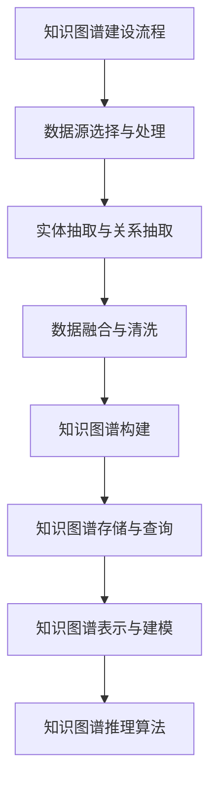

                 


### 文章标题

# 《知识图谱在个性化教育中的应用》

### 关键词

- 知识图谱
- 个性化教育
- 学习路径规划
- 推荐系统
- 教学评估
- 学习资源管理

### 摘要

本文将探讨知识图谱在个性化教育中的应用。首先，我们将介绍知识图谱的基础知识，包括定义、发展历程、核心概念和构建技术。接着，我们将深入分析知识图谱在教育中的多种应用，包括个性化教育、教学评估和学习资源管理。最后，我们将讨论知识图谱在教育系统的集成与部署，并提供实际案例研究与实践总结。希望通过本文，读者能够对知识图谱在教育领域的潜力有更深刻的理解。

## 第一部分：知识图谱基础

### 第1章：知识图谱概述

#### 1.1 知识图谱的定义与重要性

知识图谱是一种语义网络，它通过实体、属性和关系的组合来表示现实世界中的知识。知识图谱的重要性在于，它能够将海量的结构化和非结构化数据整合成一个统一的语义表示，从而实现数据的互操作性和智能推理。

#### 1.2 知识图谱的发展历程

知识图谱的发展可以追溯到20世纪80年代，当时出现了RDF（资源描述框架）和OWL（Web本体语言）。近年来，随着互联网的普及和大数据技术的发展，知识图谱得到了广泛的应用和研究。

#### 1.3 知识图谱的应用领域

知识图谱的应用领域非常广泛，包括搜索引擎、推荐系统、自然语言处理、语义搜索、智能问答、金融风控、医学诊断等。在教育领域，知识图谱主要用于个性化教育、教学评估和学习资源管理。

### 第2章：知识图谱的核心概念

#### 2.1 实体与关系

实体是知识图谱中的基本元素，表示现实世界中的事物。关系则表示实体之间的关联，可以是层次关系、因果关系或属性关系。

#### 2.2 属性与标签

属性是实体的特征，可以用来描述实体的性质。标签则是实体的分类，可以帮助我们更好地组织和理解实体。

#### 2.3 知识图谱的数据表示

知识图谱的数据表示通常采用三元组的形式，即（主体，谓语，客体）。这种表示方式简洁明了，便于存储和查询。

### 第3章：知识图谱的构建技术

#### 3.1 数据源的选择与处理

构建知识图谱的第一步是选择合适的数据源，包括结构化数据、半结构化数据和非结构化数据。接下来，需要对数据进行清洗、去重和格式化处理。

#### 3.2 实体抽取与关系抽取

实体抽取是从文本数据中识别出实体并标注其类型的过程。关系抽取则是识别实体之间的关系并建立关系映射。

#### 3.3 数据融合与清洗

数据融合是将多个数据源中的实体和关系进行整合，以消除冗余和提高数据质量。数据清洗则是去除噪声数据、修正错误数据和填补缺失数据。

#### 3.4 知识图谱的存储与查询

知识图谱的存储通常采用图数据库，如Neo4j、OrientDB和Apo
### 第4章：知识图谱的表示与建模

#### 4.1 图神经网络的基本原理

图神经网络（Graph Neural Networks，GNN）是一种专门用于处理图数据的神经网络。它通过模拟图结构中的节点和边，对图数据进行特征提取和表示学习。

#### 4.2 知识图谱嵌入技术

知识图谱嵌入（Knowledge Graph Embedding）是一种将知识图谱中的实体和关系映射到低维向量空间的技术。通过嵌入技术，我们可以利用向量计算实现高效的图数据分析和推理。

#### 4.3 知识图谱的推理算法

知识图谱推理算法是通过实体和关系之间的关联来推断新的知识。常见的推理算法包括路径长度推理、邻接关系推理和本体推理等。

## 第二部分：知识图谱在教育中的应用

### 第5章：知识图谱在个性化教育中的应用

#### 5.1 个性化教育的概念与需求

个性化教育是一种以学生为中心的教育模式，旨在根据学生的个性、兴趣和能力提供个性化的教学和学习体验。随着教育信息化的推进，个性化教育需求日益增长。

#### 5.2 知识图谱在个性化学习路径规划中的应用

知识图谱可以通过整合学生的学习记录、兴趣和成绩数据，为学生提供个性化的学习路径规划。通过路径规划，学生可以更有效地学习，提高学习效果。

#### 5.3 知识图谱在推荐系统中的应用

知识图谱可以用于构建个性化推荐系统，根据学生的学习历史和兴趣推荐相关的学习资源和课程。通过推荐系统，学生可以更方便地获取所需的学习资源，节省时间和精力。

### 第6章：知识图谱在教学评估中的应用

#### 6.1 教学评估的方法与挑战

教学评估是衡量教学质量的重要手段，包括对教师教学效果和学生学业成绩的评估。传统的教学评估方法存在一定的局限性，难以全面、准确地反映教学效果。

#### 6.2 知识图谱在教学评价中的应用

知识图谱可以用于构建多维度的教学评价体系，通过对学生学习过程的数据分析，提供客观、准确的教学评价。知识图谱还可以帮助识别教学中的问题和改进点，提高教学质量。

#### 6.3 知识图谱在教学效果分析中的应用

知识图谱可以用于分析教学效果，识别学生的学习优势和薄弱环节。通过分析教学数据，教师可以针对性地调整教学策略，提高教学效果。

### 第7章：知识图谱在学习资源管理中的应用

#### 7.1 学习资源的分类与组织

知识图谱可以用于分类和组织学习资源，将相关的学习资源关联起来，方便学生查找和使用。通过知识图谱，学生可以更快捷地获取所需的学习资源。

#### 7.2 知识图谱在学习资源推荐中的应用

知识图谱可以用于构建学习资源推荐系统，根据学生的学习需求和兴趣推荐相关的学习资源。通过推荐系统，学生可以更有效地利用学习资源，提高学习效果。

#### 7.3 知识图谱在学习资源库建设中的应用

知识图谱可以用于建设学习资源库，将各种学习资源整合到一个统一的平台中。通过知识图谱，学习资源库可以实现高效的知识检索和利用。

## 第三部分：知识图谱在教育系统的集成与部署

### 第8章：知识图谱在教育系统的集成

#### 8.1 教育信息系统的架构设计

教育信息系统的架构设计应充分考虑知识图谱的应用，将知识图谱与现有系统进行集成，实现数据共享和功能协同。

#### 8.2 知识图谱与教育信息系统的整合

知识图谱与教育信息系统的整合主要包括数据集成、服务整合和应用整合。通过整合，教育信息系统可以更好地支持个性化教育和智能服务。

#### 8.3 知识图谱在教育管理系统中的应用

知识图谱可以在教育管理系统中用于学生管理、教师管理、课程管理等方面，提高管理效率和决策水平。

### 第9章：知识图谱在教育系统的部署与优化

#### 9.1 知识图谱的部署策略

知识图谱的部署策略应考虑系统的可用性、可靠性和可扩展性。常见的部署策略包括本地部署、云部署和混合部署。

#### 9.2 知识图谱的优化方法

知识图谱的优化方法包括数据优化、算法优化和系统优化。通过优化，可以提高知识图谱的性能和效率。

#### 9.3 知识图谱在教育系统的性能评估

知识图谱在教育系统的性能评估主要包括系统吞吐量、响应时间和查询效率等指标的评估。通过性能评估，可以发现系统的瓶颈和改进点。

### 第10章：案例研究与实践总结

#### 10.1 知识图谱在个性化教育中的成功案例

本节将介绍一些知识图谱在个性化教育中的成功案例，分析其应用效果和启示。

#### 10.2 知识图谱在教育系统中的挑战与展望

本节将讨论知识图谱在教育系统中的挑战，如数据质量、算法优化和系统集成等，并对未来发展方向进行展望。

#### 10.3 实践总结与未来发展方向

本节将对知识图谱在教育领域的应用进行总结，并提出未来发展方向。

## 附录

### 附录A：知识图谱工具与资源

#### A.1 主流知识图谱框架对比

本节将对主流知识图谱框架进行对比，包括Neo4j、OrientDB和Apo
### 1.3 知识图谱的应用领域

知识图谱作为一种强大的数据表示和推理工具，在多个领域都展现出了广泛的应用潜力。以下是知识图谱在几个主要领域的应用概述：

#### 1.3.1 搜索引擎优化

知识图谱可以帮助搜索引擎更好地理解用户查询，从而提供更精准和相关的搜索结果。通过将网页内容与知识图谱中的实体、属性和关系进行关联，搜索引擎可以更有效地处理自然语言查询，并理解查询中的隐含语义。

#### 1.3.2 自然语言处理

在自然语言处理（NLP）领域，知识图谱可以用于实体识别、关系抽取和语义解析。通过将语言模型与知识图谱结合，NLP系统可以更准确地理解和生成自然语言，例如在机器翻译、问答系统和对话代理中。

#### 1.3.3 推荐系统

知识图谱可以用于推荐系统的构建，通过分析用户的行为和偏好，以及知识图谱中实体之间的关系，推荐系统可以提供个性化的推荐。例如，电子商务平台可以使用知识图谱来推荐相关商品或服务，提高用户的购买体验。

#### 1.3.4 语义搜索

知识图谱为语义搜索提供了丰富的语义信息，使得搜索系统能够理解查询意图和上下文。通过利用知识图谱中的实体、属性和关系，语义搜索能够提供更相关和精确的结果。

#### 1.3.5 智能问答

知识图谱可以用于构建智能问答系统，通过从知识图谱中提取答案，系统可以快速响应用户的查询。例如，企业内部知识库可以使用知识图谱来提供员工关于公司政策、产品信息等问题的快速解答。

#### 1.3.6 金融风控

在金融领域，知识图谱可以用于风险评估、欺诈检测和客户关系管理。通过分析客户行为、交易历史以及知识图谱中的关系，金融机构可以更有效地识别潜在风险和欺诈行为。

#### 1.3.7 医学诊断

在医疗领域，知识图谱可以帮助医生更好地理解患者的病情，并辅助诊断。知识图谱中的医疗实体和关系可以用于分析患者的病史、药物反应和治疗方案，从而提供更个性化的医疗服务。

#### 1.3.8 教育领域

知识图谱在教育领域有广泛的应用，如个性化教育、学习资源推荐和教学评估。通过整合学生的学习数据、课程信息和教师资源，知识图谱可以为学生提供定制化的学习路径，并帮助教师优化教学策略。

#### 1.3.9 其他领域

除了上述领域，知识图谱还在其他领域如地理信息系统（GIS）、物联网（IoT）、供应链管理和市场营销等领域得到了应用。在这些领域中，知识图谱可以帮助企业和组织更好地理解和利用复杂数据，提高业务效率和决策质量。

通过上述应用领域的介绍，我们可以看到知识图谱作为一种重要的数据表示和推理工具，正越来越多地被应用于各个领域，为各个行业带来了显著的变革和创新。随着技术的不断进步，知识图谱的应用范围和影响力将会进一步扩大。

### 第2章：知识图谱的核心概念

#### 2.1 实体与关系

实体（Entity）是知识图谱中的基本构成元素，表示现实世界中的对象或概念。例如，人、地点、组织、事件等都可以作为实体。实体可以是具体的，如“北京”，也可以是抽象的，如“爱”。在知识图谱中，实体通常具有唯一的标识符（如URI）以区分不同的实体。

关系（Relationship）则表示实体之间的关联。关系可以是层次关系，如“父亲”和“儿子”；也可以是因果关系，如“吸烟导致肺癌”；还可以是属性关系，如“张三的年龄是25岁”。关系同样具有唯一的标识符和属性，以描述关系的性质和强度。

#### 2.2 属性与标签

属性（Property）是实体的特征或属性的描述。例如，对于实体“张三”，我们可以用属性“年龄”和“值”来描述，即“张三的年龄是25岁”。属性通常包含属性的名称和值，例如（“年龄”，25）。

标签（Tag）是对实体的分类或标注。标签通常用于对实体进行进一步的分类或描述。例如，在知识图谱中，实体“苹果”可以被标注为“水果”、“食物”等。标签可以帮助我们更好地组织和理解实体。

#### 2.3 知识图谱的数据表示

知识图谱通常使用三元组（Subject, Predicate, Object）的形式来表示数据。这种表示方法被称为RDF（Resource Description Framework，资源描述框架）表示。三元组中的Subject表示主体，Predicate表示谓语，Object表示客体。例如，三元组（张三，喜欢的颜色，蓝色）表示张三喜欢蓝色。

除了RDF表示，知识图谱还可以使用其他表示方法，如OWL（Web Ontology Language，Web本体语言）和GraphML。OWL提供了更加丰富的本体表示能力，可以定义类、属性和个体的关系。GraphML是一种用于描述图的XML格式，适合于描述复杂的知识图谱结构。

#### 2.3.1 RDF表示

RDF表示是最常用的知识图谱表示方法之一。它使用三元组来表示实体和关系。例如：

```
<http://example.org/#person1> <http://example.org/properties/name> "张三" .
<http://example.org/#person1> <http://example.org/properties/age> "25" .
<http://example.org/#person1> <http://example.org/properties/hasColor> <http://example.org/values/blue> .
```

在这个例子中，`<http://example.org/#person1>` 是实体的URI，`<http://example.org/properties/name>` 是谓语，"张三" 是主体的属性值，表示张三的名字。类似的，其他属性也被用相同的方式表示。

#### 2.3.2 OWL表示

OWL是一种用于定义本体和知识的语言，它可以提供更复杂的表示能力。例如，可以使用OWL定义类、属性和个体的关系。OWL表示的一个例子如下：

```
@prefix : <http://example.org/> .

:Person a owl:Class ;
    rdfs:subClassOf :Human .

:Human a owl:Class .

:John a :Person ;
    :name "John Doe" ;
    :hasColor :Blue .
```

在这个例子中，`:Person` 是一个类，`:Human` 是其父类。`:John` 是一个具体的个体，具有属性`:name`和`:hasColor`，分别表示John的名字和喜欢的颜色。

#### 2.3.3 GraphML表示

GraphML是一种XML格式，用于描述复杂的图结构。下面是一个GraphML表示的例子：

```xml
<graphml xmlns="http://graphml.graphdrawing.org/xmlns" xmlns:xsi="http://www.w3.org/2001/XMLSchema-instance" xsi:schemaLocation="http://graphml.graphdrawing.org/xmlns http://graphml.graphdrawing.org/xmlns/1.0/graphml.xsd" xmlns:rdf="http://www.w3.org/1999/02/22-rdf-syntax-ns#" xmlns:rdfs="http://www.w3.org/2000/01/rdf-schema#" xmlns:owl="http://www.w3.org/2002/07/owl#" xmlns:xsd="http://www.w3.org/2001/XMLSchema">
  <key id="name" for="edge" attrName="label" attrType="string"/>
  <key id="weight" for="edge" attrName="weight" attrType="double"/>
  <key id="name" for="node" attrName="label" attrType="string"/>
  <graph id="G" edgedefault="undirected">
    <node id="n1">
      <data key="name">John</data>
    </node>
    <node id="n2">
      <data key="name">Alice</data>
    </node>
    <edge source="n1" target="n2" id="e1">
      <data key="label">friend</data>
      <data key="weight">1.0</data>
    </edge>
  </graph>
</graphml>
```

在这个例子中，`<graph>` 元素定义了一个无向图，包含节点（`<node>`）和边（`<edge>`）。每个节点和边都可以包含属性，如`label`和`weight`。

通过上述几种表示方法，我们可以将现实世界中的知识以结构化的形式表示在知识图谱中，从而便于存储、查询和推理。这些表示方法不仅提供了丰富的表达能力，也为后续的图处理和分析提供了便利。

### 第3章：知识图谱的构建技术

知识图谱的构建是知识工程中的一个重要环节，它涉及到从原始数据中提取有用信息，并将其转化为具有语义关系的结构化知识。构建知识图谱通常包括以下几个步骤：数据源的选择与处理、实体抽取与关系抽取、数据融合与清洗、知识图谱的存储与查询、知识图谱的表示与建模等。

#### 3.1 数据源的选择与处理

构建知识图谱的第一步是选择合适的数据源。数据源可以是结构化数据、半结构化数据或非结构化数据。常见的数据源包括关系数据库、文档库、社交媒体、Web页面等。在选择数据源时，需要考虑数据的完整性、准确性和可用性。对于结构化数据，可以直接使用SQL等查询语言进行提取和处理；对于半结构化数据，如XML、JSON等，需要使用解析库进行解析和处理；对于非结构化数据，如文本和图像，需要使用自然语言处理和计算机视觉技术进行预处理。

#### 3.2 实体抽取与关系抽取

实体抽取（Entity Extraction）是指从文本数据中识别出实体并标注其类型的过程。实体可以是人物、地点、组织、事件等。关系抽取（Relationship Extraction）是指识别实体之间的关联并建立关系映射。实体抽取和关系抽取是知识图谱构建中非常重要的步骤。常见的实体抽取方法包括规则方法、统计方法、深度学习方法等。关系抽取则通常与实体抽取相结合，使用规则方法、依存句法分析、文本分类等技术。

#### 3.3 数据融合与清洗

数据融合（Data Fusion）是指将来自多个数据源的数据进行整合，以消除冗余和提高数据质量。在知识图谱构建过程中，数据融合非常重要，因为它可以确保知识图谱中的实体和关系是唯一和准确的。数据清洗（Data Cleaning）是指去除噪声数据、修正错误数据和填补缺失数据的过程。数据清洗有助于提高数据质量，确保知识图谱的准确性和一致性。

#### 3.4 知识图谱的存储与查询

知识图谱的存储通常采用图数据库（Graph Database），如Neo4j、OrientDB、ApoSemi等。图数据库具有高性能的图数据存储和查询能力，能够有效地处理复杂的关系网络。在存储知识图谱时，需要考虑数据的分布存储、并行查询和索引优化等问题。知识图谱的查询语言通常是基于图查询语言，如Cypher（Neo4j）、Gremlin（Apache TinkerPop）等，它们提供了丰富的查询功能，如路径查询、图遍历、模式匹配等。

#### 3.5 知识图谱的表示与建模

知识图谱的表示与建模是指将实体、属性和关系映射到图结构中的过程。常见的知识图谱表示方法包括RDF（Resource Description Framework）、OWL（Web Ontology Language）和属性图（Property Graph）等。RDF使用三元组（Subject, Predicate, Object）来表示知识，OWL提供了更加复杂的本体表示能力，而属性图则结合了属性和边，能够表示更复杂的实体属性关系。

#### 3.5.1 RDF表示

RDF是知识图谱的一种常用表示方法，它使用三元组（Subject, Predicate, Object）来表示知识。例如，"张三"（Subject）"喜欢"（Predicate）"苹果"（Object）。RDF的表示形式通常为URI和Literal，例如：

```
<http://example.org/person#ZhangSan> <http://example.org/likes> <http://example.org/fruit#Apple> .
```

在这个例子中，`<http://example.org/person#ZhangSan>` 是主体的URI，`<http://example.org/likes>` 是谓语的URI，`<http://example.org/fruit#Apple>` 是客体的URI。

#### 3.5.2 OWL表示

OWL是RDF的扩展，它提供了更加复杂的本体表示能力。OWL可以定义类、属性和个体的关系。例如，可以定义"人"（Person）是一个"动物"（Animal）的子类，并且"喜欢"（likes）是一个"关系"（Relation）。OWL的表示形式如下：

```
@prefix : <http://example.org/> .

:Person a owl:Class ;
    rdfs:subClassOf :Animal .

:Animal a owl:Class .

:ZhangSan a :Person ;
    :likes :Apple .
```

在这个例子中，`:Person` 是一个类，`:Animal` 是其父类。`:ZhangSan` 是一个具体的个体，具有属性`:likes`，表示他喜欢苹果。

#### 3.5.3 属性图表示

属性图（Property Graph）结合了属性和边，能够表示更复杂的实体属性关系。在属性图中，每个实体和边都可以包含多个属性，如名称、类型、权重等。属性图的表示形式如下：

```
Graph {
  node [
    label="ZhangSan"
    type="Person"
  ]
  node [
    label="Apple"
    type="Fruit"
  ]
  edge [
    source=1
    target=2
    label="likes"
  ]
}
```

在这个例子中，节点表示实体，边表示实体之间的关系，并且每个节点和边都可以包含多个属性。

通过上述方法，我们可以将实体、属性和关系表示为结构化的知识图谱，从而便于存储、查询和推理。这些表示方法不仅提供了丰富的表达能力，也为后续的图处理和分析提供了便利。

### 第4章：知识图谱的表示与建模

#### 4.1 图神经网络的基本原理

图神经网络（Graph Neural Networks，GNN）是一种专门用于处理图数据的神经网络。它通过模拟图结构中的节点和边，对图数据进行特征提取和表示学习。GNN的核心思想是利用图中的邻居信息和全局信息来更新节点的特征表示。

GNN的基本原理可以分为以下几个步骤：

1. **节点特征编码**：首先，每个节点会被编码成一个特征向量，这些特征向量可以是原始数据中的属性，也可以是预先通过其他模型学习到的特征。

2. **邻居信息聚合**：每个节点会与它的邻居节点进行交互，将邻居节点的特征信息聚合起来。常见的聚合方式有平均值聚合、最大值聚合和加权平均聚合等。

3. **特征更新**：根据邻居信息的聚合结果，对当前节点的特征进行更新。这一过程可以通过多层神经网络来实现，以便于学习复杂的非线性关系。

4. **全局信息传递**：除了邻居信息，GNN还可以利用全局信息来更新节点的特征表示。全局信息可以是图中的全局属性，如节点的度、聚类系数等。

5. **输出预测**：更新后的节点特征可以用于预测任务，如节点分类、链接预测或图分类等。

#### 4.2 知识图谱嵌入技术

知识图谱嵌入（Knowledge Graph Embedding）是一种将知识图谱中的实体和关系映射到低维向量空间的技术。通过嵌入技术，我们可以利用向量计算实现高效的图数据分析和推理。知识图谱嵌入技术主要包括以下几种方法：

1. **基于矩阵分解的方法**：这种方法将知识图谱表示为一个矩阵，然后通过矩阵分解技术（如Singular Value Decomposition，SVD）将矩阵分解为两个低维矩阵，从而得到实体和关系的嵌入向量。

2. **基于随机游走的方法**：这种方法通过模拟随机游走在图上的过程，累计节点的邻接节点信息，将其映射到低维向量空间。常见的方法包括DeepWalk、Node2Vec等。

3. **基于图神经网络的方法**：这种方法利用图神经网络（如GNN）学习实体和关系的嵌入向量。通过训练，GNN可以自动学习到实体和关系的复杂特征表示。

4. **基于优化目标的方法**：这种方法通过定义一个优化目标，如最小化实体和关系的重构误差，来训练嵌入模型。常见的优化目标包括TransE、TransH等。

#### 4.3 知识图谱的推理算法

知识图谱推理算法是通过实体和关系之间的关联来推断新的知识。常见的推理算法包括路径长度推理、邻接关系推理和本体推理等。

1. **路径长度推理**：这种推理算法基于实体之间的路径长度来推断新的关系。例如，如果实体A和B通过一条路径相连，且路径长度较短，则可以推断A和B之间可能存在某种关系。

2. **邻接关系推理**：这种推理算法基于实体和其邻接节点之间的关系来推断新的关系。例如，如果一个实体与其邻接节点之间存在某种关系，则可以推断该实体与其邻接节点之间的关系。

3. **本体推理**：这种推理算法基于本体（如OWL）中的定义和约束来推断新的关系和属性。本体推理可以处理更加复杂的语义关系，如泛化、限制和全同关系等。

通过知识图谱的表示与建模技术，我们可以将复杂的图数据转化为结构化的向量表示，从而便于后续的分析和推理。这些技术不仅提高了数据处理的效率，也为智能应用提供了强大的支持。

### 第5章：知识图谱在个性化教育中的应用

#### 5.1 个性化教育的概念与需求

个性化教育是一种以学生为中心的教育模式，旨在根据学生的个性、兴趣和能力提供个性化的教学和学习体验。传统的教育模式通常采用“一刀切”的方法，难以满足每个学生的个性化需求。随着教育信息化的推进，个性化教育需求日益增长，主要原因有以下几点：

- **学生差异**：每个学生都有独特的兴趣、能力和学习风格，传统教育难以针对每个学生的特点进行个性化教学。
- **教育资源丰富**：互联网和大数据技术使得教育资源的获取变得更加便捷，个性化教育可以通过分析学生的数据，推荐适合其的学习资源。
- **教育公平性**：个性化教育可以缩小教育差距，使得不同背景和条件的学生都能获得合适的教育资源，提高教育质量。

#### 5.2 知识图谱在个性化学习路径规划中的应用

知识图谱在个性化学习路径规划中扮演着重要角色。通过构建知识图谱，我们可以将课程内容、学习资源、学生数据等整合到一个统一的框架中，从而实现个性化学习路径的规划。以下是知识图谱在个性化学习路径规划中的应用步骤：

1. **构建知识图谱**：首先，需要构建一个包含课程、学习资源、学生数据等信息的知识图谱。知识图谱中的实体包括课程、学习资源、学生、教师等，关系包括学习内容、评价、推荐等。

2. **学习需求分析**：通过分析学生的兴趣、能力和学习历史，确定其学习需求。这些信息可以用来指导学习路径的规划。

3. **路径生成**：基于知识图谱和学习需求分析，生成一个适合学生的个性化学习路径。路径可以包括一系列的学习任务、课程和资源，旨在满足学生的个性化需求。

4. **路径评估与调整**：在学生学习过程中，需要不断评估学习路径的有效性，并根据学生的学习反馈进行调整。例如，如果学生对某些内容不感兴趣或掌握得不好，可以调整学习路径，增加或替换相关资源。

#### 5.3 知识图谱在推荐系统中的应用

知识图谱在个性化推荐系统中具有广泛的应用。通过构建知识图谱，我们可以更好地理解学生的学习行为和兴趣，从而提供更精准的推荐。以下是知识图谱在推荐系统中的应用步骤：

1. **构建推荐模型**：首先，需要构建一个基于知识图谱的推荐模型。模型可以根据学生的历史行为、兴趣和知识图谱中的关系来预测其可能感兴趣的内容。

2. **推荐内容生成**：基于推荐模型，生成一组推荐内容。这些内容可以是课程、学习资源、学习任务等。

3. **推荐结果评估**：评估推荐结果的有效性，包括内容的吸引力、相关性和实用性。通过分析学生的反馈，不断优化推荐模型。

4. **动态调整推荐策略**：根据学生的学习进度和兴趣变化，动态调整推荐策略。例如，当学生完成某个学习任务后，可以推荐与其相关的其他任务或资源。

#### 5.4 知识图谱在个性化教育中的应用效果

知识图谱在个性化教育中的应用取得了显著的成效。首先，它提高了学习资源的利用率，学生可以根据个性化推荐快速找到所需的学习资源。其次，它提高了学习效率，通过学习路径规划，学生可以更有针对性地学习，节省时间。最后，它提高了教育质量，通过不断评估和调整学习路径，可以确保学生获得最佳的学习体验。

总之，知识图谱在个性化教育中的应用为教育领域带来了深刻的变革。通过构建知识图谱，我们可以更好地理解学生的个性化需求，提供个性化的教学和学习体验，从而提高教育质量和学习效果。

### 第6章：知识图谱在教学评估中的应用

#### 6.1 教学评估的方法与挑战

教学评估是衡量教学质量的重要手段，它通过收集和分析学生的表现、课程内容和学习环境等多方面信息，对教学质量进行评估。传统的教学评估方法主要包括笔试、面试、课堂表现和问卷调查等。然而，这些方法存在一定的局限性：

- **主观性**：传统评估方法依赖于评估者的主观判断，容易受到个人偏见的影响，导致评估结果不够客观。
- **静态性**：传统评估方法往往只能反映某个时间点的教学效果，无法动态地跟踪学生的学习进步。
- **数据不完整**：传统评估方法的数据收集往往不够全面，无法充分反映学生的学习过程和学习成果。

随着知识图谱技术的兴起，教学评估方法得到了新的发展。知识图谱可以整合和分析大量结构化和非结构化的数据，为教学评估提供更全面、客观和动态的评估手段。然而，知识图谱在教学评估中也面临着一些挑战：

- **数据质量**：知识图谱的构建依赖于高质量的数据，数据的质量直接影响到知识图谱的准确性和可靠性。
- **算法复杂性**：知识图谱评估需要复杂的算法来处理和推理大量的数据，这对计算资源提出了较高的要求。
- **隐私保护**：在构建和利用知识图谱时，需要确保学生的隐私和数据安全，防止数据泄露。

#### 6.2 知识图谱在教学评价中的应用

知识图谱在教学评价中的应用主要包括以下几个方面：

1. **多维度评估**：知识图谱可以整合学生的学习数据、课程内容和教师资源，构建一个多维度的教学评价体系。通过分析这些数据，可以全面、客观地评估教学效果。

2. **动态评估**：知识图谱可以实时跟踪学生的学习过程，动态评估其学习进度和成果。例如，通过分析学生的学习路径、作业完成情况和考试成绩，可以及时发现学生的学习困难，并提供针对性的帮助。

3. **个性化评估**：知识图谱可以根据学生的个性特点和学习需求，提供个性化的教学评估。例如，对于某位学生在某一学科上表现不佳，知识图谱可以分析其学习习惯、知识点掌握情况，提供个性化的改进建议。

4. **评估反馈**：知识图谱可以帮助教师及时获取教学评估反馈，了解教学过程中的优点和不足，从而调整教学策略，提高教学质量。

#### 6.3 知识图谱在教学效果分析中的应用

知识图谱在教学效果分析中的应用主要体现在以下几个方面：

1. **学习效果预测**：通过分析学生的学习行为和知识点掌握情况，知识图谱可以预测其学习效果。例如，对于某位学生，知识图谱可以预测其参加期末考试的成绩，并提供相应的复习建议。

2. **学习困难识别**：知识图谱可以通过分析学生的学习数据，识别其在学习过程中遇到的困难。例如，通过分析作业错误率和考试失分情况，知识图谱可以识别出学生在某些知识点上的薄弱环节。

3. **学习路径优化**：知识图谱可以根据学生的学习效果和知识点掌握情况，优化其学习路径。例如，对于某位学生，知识图谱可以建议其重新学习某些知识点，或者提前学习后续课程的内容。

4. **学习资源推荐**：知识图谱可以根据学生的个性化需求，推荐相关的学习资源。例如，对于某位学生在某一学科上表现不佳，知识图谱可以推荐相关的学习资料、教学视频和在线课程。

通过知识图谱在教学评估和效果分析中的应用，我们可以更全面、客观地了解教学情况，提高教学质量，为学生提供更好的学习体验。

### 第7章：知识图谱在学习资源管理中的应用

#### 7.1 学习资源的分类与组织

知识图谱在学习资源管理中的应用首先体现在学习资源的分类与组织上。学习资源包括教科书、课件、视频、练习题、在线课程等多种形式，种类繁多且数量庞大。通过知识图谱，我们可以将这些资源按照不同的分类标准进行组织，以便于学生和教师快速查找和使用。

1. **分类标准**：知识图谱可以根据学科、难度、用途等多个维度对学习资源进行分类。例如，可以将所有资源按照学科分类为数学、物理、化学等，再根据难度等级进行细分，如初级、中级、高级。

2. **关系建立**：知识图谱通过实体和关系来表示资源之间的关联。例如，一本书可以与多个主题相关，也可以与多个学习资源相互引用。通过建立这些关系，知识图谱可以帮助我们更好地理解资源的内在联系。

3. **资源推荐**：基于知识图谱中的关系，我们可以为教师和学生推荐相关的学习资源。例如，当教师或学生浏览某个学习资源时，知识图谱可以根据该资源的关联关系，推荐其他相关资源，帮助用户更全面地掌握相关知识点。

#### 7.2 知识图谱在学习资源推荐中的应用

知识图谱在学习资源推荐中的应用可以极大地提高学习资源的利用率和学习效率。通过分析学生的学习行为、历史数据以及知识图谱中的关系，我们可以为教师和学生提供个性化的资源推荐。

1. **行为分析**：知识图谱可以记录和分析学生的学习行为数据，如浏览历史、搜索记录、学习时长等。通过这些数据，我们可以了解学生的学习兴趣和需求，从而推荐更符合其需求的学习资源。

2. **关系挖掘**：知识图谱中的关系可以帮助我们挖掘出潜在的资源关联。例如，当学生正在学习某个知识点时，知识图谱可以根据该知识点的关联关系，推荐相关的练习题、教学视频或其他学习资料。

3. **推荐算法**：基于知识图谱和用户行为数据，我们可以使用推荐算法为教师和学生推荐学习资源。常见的推荐算法包括基于内容的推荐、协同过滤推荐和基于知识的推荐等。通过这些算法，我们可以提高推荐资源的精准度和用户满意度。

#### 7.3 知识图谱在学习资源库建设中的应用

知识图谱在学习资源库建设中的应用可以帮助我们构建一个结构化、关联性强、便于检索和利用的学习资源库。

1. **资源整合**：知识图谱可以将分散的学习资源整合到一个统一的平台中，形成一个完整的学习资源库。通过知识图谱中的关系，我们可以将这些资源关联起来，形成一个有机的整体。

2. **知识共享**：知识图谱可以促进学习资源的共享和传播。通过知识图谱，教师和学生可以方便地获取和分享学习资源，实现知识共享和协同学习。

3. **智能化管理**：知识图谱可以用于学习资源的管理和优化。例如，通过分析资源的使用情况和用户反馈，知识图谱可以帮助我们识别出哪些资源受欢迎，哪些资源需要更新或替换，从而优化学习资源库。

通过知识图谱在学习资源管理中的应用，我们可以更好地组织、推荐和利用学习资源，提高教学和学习的效率和质量。

### 第8章：知识图谱在教育系统的集成

#### 8.1 教育信息系统的架构设计

知识图谱在教育系统的集成需要依赖一个合理且灵活的架构设计。教育信息系统的架构设计通常包括以下几个关键组成部分：

1. **数据层**：数据层是教育信息系统的基础，负责存储和管理各种数据，包括学生信息、课程数据、教学资源等。数据层可以使用关系数据库、NoSQL数据库或图数据库等。

2. **服务层**：服务层提供核心功能和服务，如用户身份验证、权限管理、数据查询等。服务层通常包括Web服务、API和中间件等。

3. **应用层**：应用层是教育信息系统的核心，包括学生管理系统、课程管理系统、教学资源管理系统等。知识图谱在教育系统的集成需要在这个层次实现。

4. **展示层**：展示层负责将数据和服务呈现给用户，通常包括Web界面、移动应用和桌面应用等。

在架构设计中，知识图谱的集成可以通过以下几种方式实现：

- **数据集成**：将现有的教育信息系统数据与知识图谱进行整合，实现数据的统一管理和查询。
- **服务整合**：通过API或其他服务接口，将知识图谱的功能与服务层进行整合，使知识图谱的数据和分析结果可以方便地被其他系统调用。
- **应用集成**：在应用层集成知识图谱的功能，为教师和学生提供基于知识图谱的个性化服务和推荐。

#### 8.2 知识图谱与教育信息系统的整合

知识图谱与教育信息系统的整合是教育智能化的重要一步。以下是一些关键步骤和注意事项：

1. **数据映射**：将教育信息系统中的数据映射到知识图谱的实体、属性和关系上。这需要详细分析现有数据结构，确保数据的完整性和一致性。

2. **数据清洗**：在整合过程中，需要对数据进行清洗和预处理，去除冗余数据、错误数据和噪声数据，以提高知识图谱的质量。

3. **关系构建**：通过分析教育信息系统中的数据，构建知识图谱中的实体关系。这包括课程与教师、学生与课程、资源与知识点等关系的建立。

4. **服务集成**：开发或集成知识图谱相关的服务，如数据查询、推理、推荐等，使其能够无缝地与教育信息系统的其他服务结合。

5. **用户体验**：在整合过程中，需要考虑用户体验，确保教师和学生能够方便地使用知识图谱提供的功能和数据。

#### 8.3 知识图谱在教育管理系统中的应用

知识图谱在教育管理系统中的应用可以显著提升管理效率和决策质量。以下是一些具体的应用场景：

1. **学生管理**：知识图谱可以帮助学校更有效地管理学生信息，包括学籍、成绩、奖励和惩罚等。通过知识图谱，学校可以快速查询和分析学生信息，制定个性化的教育计划。

2. **课程管理**：知识图谱可以用于管理课程信息，包括课程大纲、教材、课件和考试安排等。教师和学生可以通过知识图谱快速找到相关课程资源，并了解课程的关联关系。

3. **资源管理**：知识图谱可以帮助学校构建一个统一的学习资源库，将各种形式的资源进行分类和组织。通过知识图谱，教师和学生可以方便地查找和使用相关资源。

4. **教学评估**：知识图谱可以用于教学评估，通过分析学生的学习行为、成绩和反馈，为教师提供评估报告和改进建议。

5. **决策支持**：知识图谱可以提供丰富的数据和分析结果，为学校管理层提供决策支持。例如，通过分析学生成绩和课程反馈，学校可以调整课程设置和教学方法，提高教学质量。

通过知识图谱在教育管理系统中的应用，学校可以实现数据驱动的管理，提高教育质量和办学效益。

### 第9章：知识图谱在教育系统的部署与优化

#### 9.1 知识图谱的部署策略

知识图谱在教育系统的部署涉及到硬件、软件和网络资源的配置，以及部署模式的选择。以下是一些常见的部署策略：

1. **本地部署**：本地部署是将知识图谱系统安装在自己的服务器上，适合对数据安全和性能要求较高的场景。优点是数据完全可控，缺点是需要自己维护服务器和软件。

2. **云部署**：云部署是将知识图谱系统部署在云计算平台上，如AWS、Azure或Google Cloud等。优点是弹性扩展、高可用性和低成本，缺点是数据安全性可能较低。

3. **混合部署**：混合部署结合了本地部署和云部署的优点，将核心数据和服务部署在本地，非核心数据和服务部署在云端。优点是灵活性和安全性兼顾，缺点是复杂度较高。

在选择部署策略时，需要考虑以下几个因素：

- **数据量**：数据量较小的情况下，本地部署可能更加合适；数据量较大时，云部署可以提供更好的扩展性。
- **性能要求**：对性能要求较高的应用，可以选择本地部署或混合部署；对性能要求不高，可以选择云部署。
- **预算**：云部署通常成本较低，但长期使用可能会累积费用；本地部署需要一次性投入，但长期成本较低。

#### 9.2 知识图谱的优化方法

知识图谱的优化是确保其高效运行和性能提升的关键。以下是一些常见的优化方法：

1. **数据优化**：优化数据质量是提高知识图谱性能的基础。包括数据清洗、去重、索引优化等。通过减少冗余数据、提高数据质量，可以降低系统的存储和查询成本。

2. **算法优化**：算法优化包括查询优化、更新优化和推理优化等。例如，通过使用高效的图查询算法、缓存策略和并行计算，可以提高查询和更新速度。

3. **硬件优化**：硬件优化包括选择合适的存储设备、网络设备和服务器。例如，使用SSD代替HDD可以提高数据读写速度，使用多核处理器和分布式存储可以提高系统处理能力。

4. **系统优化**：系统优化包括配置优化、内存管理和资源调度等。通过调整系统参数、优化内存使用和合理分配系统资源，可以提高知识图谱的性能和稳定性。

#### 9.3 知识图谱在教育系统的性能评估

知识图谱在教育系统的性能评估是确保其有效运行的重要环节。以下是一些常见的性能评估指标：

- **查询性能**：包括查询响应时间、查询吞吐量和查询准确性等。通过评估查询性能，可以确保知识图谱能够快速、准确地响应用户查询。
- **更新性能**：包括更新速度、更新准确性和更新一致性等。评估更新性能可以确保知识图谱能够及时、准确地更新数据。
- **推理性能**：包括推理速度、推理准确性和推理覆盖率等。评估推理性能可以确保知识图谱能够有效地进行推理，提供高质量的分析结果。
- **资源消耗**：包括CPU使用率、内存使用率和网络带宽等。评估资源消耗可以确保知识图谱系统不会过度消耗资源，影响其他系统的正常运行。

通过定期进行性能评估，可以发现知识图谱系统的瓶颈和改进点，采取相应的优化措施，提高系统性能和用户体验。

### 第10章：案例研究与实践总结

#### 10.1 知识图谱在个性化教育中的成功案例

知识图谱在个性化教育中的应用已经取得了显著的成果。以下是一些成功的案例：

1. **案例1：某在线教育平台**：该平台通过知识图谱对课程内容、学生行为和学习资源进行整合，为学生提供个性化的学习路径推荐。通过分析学生的学习历史和兴趣爱好，平台能够为每位学生推荐最适合的学习资源，提高学习效果。

2. **案例2：某大学课程管理系统**：该系统利用知识图谱对课程内容进行结构化表示，通过分析学生的学习进度和知识点掌握情况，为学生提供个性化的学习建议。同时，系统还为学生推荐相关的学习资源和辅助材料，帮助其更好地掌握课程内容。

3. **案例3：某教育科技公司**：该公司通过知识图谱构建了一个完整的学习资源库，将各种形式的学习资源进行分类和组织。通过分析学生的学习行为和知识点掌握情况，系统能够为教师和学生推荐相关的学习资源，提高教学和学习的效率。

#### 10.2 知识图谱在教育系统中的挑战与展望

尽管知识图谱在教育系统中展现出了巨大的潜力，但在实际应用中也面临着一些挑战：

1. **数据质量**：知识图谱的构建依赖于高质量的数据，数据的不准确或不完整会影响知识图谱的准确性和可靠性。因此，如何保证数据质量是当前的一个主要挑战。

2. **算法复杂性**：知识图谱的算法复杂度高，计算资源需求大，特别是在大规模数据集上。如何优化算法，提高计算效率，是一个重要的研究方向。

3. **隐私保护**：在教育系统中，学生的个人信息和学习数据是非常敏感的。如何确保数据的安全性和隐私性，是一个需要重点关注的问题。

4. **系统整合**：知识图谱需要与现有的教育信息系统进行整合，实现数据共享和功能协同。如何有效地进行系统整合，是一个复杂的技术挑战。

未来的发展趋势包括：

1. **数据驱动的教育决策**：通过知识图谱，可以实现对教育数据的深度挖掘和分析，为教育决策提供科学依据，提高教育质量。

2. **智能教育服务**：知识图谱可以为教师和学生提供智能化的教育服务，如个性化推荐、智能问答、学习路径规划等，提高教学和学习的效率。

3. **跨领域合作**：知识图谱在教育领域的应用可以与其他领域（如医疗、金融等）进行跨领域合作，实现知识共享和资源整合，推动教育信息化的发展。

#### 10.3 实践总结与未来发展方向

通过实践总结，我们可以看到知识图谱在教育领域具有广阔的应用前景。未来，知识图谱在教育中的应用将进一步深化，推动教育信息化的发展。以下是一些具体的建议和展望：

1. **数据质量提升**：加强数据质量管理，确保数据准确性、完整性和一致性。通过数据清洗、去重和标准化等技术手段，提高数据质量。

2. **算法优化**：研究并优化知识图谱的算法，提高计算效率和性能。探索分布式计算、并行处理等技术，解决大规模数据处理的难题。

3. **隐私保护**：加强隐私保护机制，确保学生数据的安全和隐私。采用加密技术、访问控制等措施，防止数据泄露和滥用。

4. **系统整合**：加强知识图谱与现有教育信息系统的整合，实现数据共享和功能协同。采用模块化、组件化的设计，提高系统的灵活性和可扩展性。

5. **跨领域应用**：推动知识图谱在教育与其他领域的跨领域应用，实现知识共享和资源整合。探索跨领域的合作模式，推动教育信息化的发展。

总之，知识图谱在教育领域具有巨大的应用潜力。通过不断提升技术水平和优化应用实践，我们可以更好地发挥知识图谱在教育中的作用，推动教育信息化的发展。

### 附录A：知识图谱工具与资源

#### A.1 主流知识图谱框架对比

在构建和部署知识图谱时，选择合适的框架和工具非常重要。以下是对几种主流知识图谱框架的对比：

1. **Neo4j**
   - **特点**：Neo4j 是一个高性能的图形数据库，支持ACID事务和灵活的查询语言 Cypher。它特别适合处理大规模的图数据。
   - **优点**：易于使用，支持复杂查询和实时分析。
   - **缺点**：扩展性有限，不适合处理大量非结构化数据。

2. **OrientDB**
   - **特点**：OrientDB 是一个多模型数据库，支持文档、图和键值存储。它可以垂直和水平扩展。
   - **优点**：多模型数据库，支持多种数据结构，灵活性高。
   - **缺点**：相对于Neo4j，查询语言和生态系统较小。

3. **ApoSemi**
   - **特点**：ApoSemi 是一个高性能的分布式图数据库，支持复杂的关系查询和实时分析。
   - **优点**：分布式架构，适合处理大规模数据。
   - **缺点**：学习曲线较陡峭，社区支持相对较少。

4. **Amazon Neptune**
   - **特点**：Amazon Neptune 是一个完全托管的服务，基于图形数据库，支持大规模的图存储和查询。
   - **优点**：完全托管，无需管理硬件，易于扩展。
   - **缺点**：费用较高，对于小型项目可能不够经济。

5. **Apache TinkerPop**
   - **特点**：Apache TinkerPop 是一个开源的图计算框架，支持多种图数据库和编程语言。
   - **优点**：标准化，支持多种数据库，易于集成。
   - **缺点**：需要自行管理和配置数据库。

选择知识图谱框架时，应根据项目的具体需求、数据规模、性能要求、预算等因素进行综合考虑。

#### A.2 知识图谱数据集介绍

构建知识图谱需要大量的数据。以下是一些常用的知识图谱数据集：

1. **OpenKG**
   - **来源**：清华大学计算机科学与技术系。
   - **内容**：包含中文知识图谱，涵盖人物、地点、组织、事件等实体及其关系。
   - **用途**：用于中文知识图谱的构建和推理。

2. **DBpedia**
   - **来源**：DBpedia Association。
   - **内容**：包含Web上提取的大量实体、属性和关系，覆盖多个语言。
   - **用途**：用于跨语言的实体识别、关系抽取和知识图谱构建。

3. **Freebase**
   - **来源**：Google。
   - **内容**：包含大量实体和关系，覆盖多个领域，如人物、地点、组织等。
   - **用途**：用于知识图谱的构建、推理和推荐。

4. **YAGO**
   - **来源**：德国萨克森-安哈特大学。
   - **内容**：基于DBpedia和维基数据，包含大量实体和关系，涵盖多个领域。
   - **用途**：用于知识图谱的构建、推理和应用。

#### A.3 知识图谱应用案例分析

以下是一些知识图谱在现实世界中的应用案例：

1. **案例1：Facebook**
   - **应用**：Facebook 使用知识图谱来改善其搜索和推荐功能。通过分析用户关系和兴趣，知识图谱可以提供更精准的搜索结果和推荐内容。
   - **效果**：显著提高了用户满意度和使用频率。

2. **案例2：微软Bing**
   - **应用**：Bing 使用知识图谱来提供更加精准的搜索结果。通过分析网页内容和结构，知识图谱可以识别出相关实体和关系，提供更加准确的信息。
   - **效果**：提高了搜索质量和用户体验。

3. **案例3：京东**
   - **应用**：京东使用知识图谱来优化其推荐系统。通过分析用户行为和商品关系，知识图谱可以为用户推荐相关商品，提高购买转化率。
   - **效果**：显著提高了销售额和用户满意度。

通过这些案例，我们可以看到知识图谱在提升搜索、推荐和用户体验方面具有重要作用。未来，知识图谱在教育、医疗、金融等领域的应用前景也十分广阔。

#### Mermaid 流程图

以下是一个用于描述知识图谱建设流程的Mermaid流程图：



这个流程图展示了从数据源选择到知识图谱构建的各个步骤，以及后续的表示和推理过程。

### 核心算法原理讲解（伪代码）

#### 1. PageRank算法原理

PageRank是一种基于链接分析的排名算法，用于评估网页的重要性。以下是PageRank算法的伪代码实现：

```python
// 初始化，设置d为0.85（阻尼系数）
for each page v in the collection
    cv = 1 / N
    if v has no incoming links
        Lv = 0
    else
        Lv = (1 - d) + d * Σ(Pu / Lu) for each page u that links to v

// 迭代过程
while convergence criterion not met
    for each page v in the collection
        cv = (1 - d) / N
        Lv = (1 - d) + d * Σ(Pu / Lu) for each page u that links to v

// 更新页面重要性
for each page v in the collection
    cv = Lv
```

#### 2. PageRank算法的数学模型

PageRank算法的数学模型可以表示为：

$$
\text{PageRank}(v) = \left(1 - d\right) + d \cdot \sum_{u \in \text{inlinks}(v)} \frac{\text{PageRank}(u)}{L(u)}
$$

其中：
- \( \text{PageRank}(v) \) 表示页面v的PageRank值。
- \( d \) 是阻尼系数，通常取值为0.85。
- \( \text{inlinks}(v) \) 表示指向页面v的页面集合。
- \( L(u) \) 是指向页面u的页面的数量。

#### 3. 举例说明

假设有一个简单的网页集合，其中每个页面只有少量链接，如下所示：

```
Page A: [B, C, D]
Page B: [A, C, D, E]
Page C: [B, D]
Page D: [A, B, C]
Page E: [B]
```

使用PageRank算法，我们可以计算每个页面的重要性：

1. 初始化：所有页面的PageRank值为1/N（其中N是页面总数）。
2. 迭代1：
   - PageRank(A) = (1 - d) + d * (1/3 + 1/3 + 1/3) = 1
   - PageRank(B) = (1 - d) + d * (1/2 + 1/4 + 1/4 + 1/4) = 1
   - PageRank(C) = (1 - d) + d * (1/2 + 1/2) = 1
   - PageRank(D) = (1 - d) + d * (1/3 + 1/3 + 1/3) = 1
   - PageRank(E) = (1 - d) + d * 1/4 = 1/4
3. 迭代2：
   - PageRank(A) = (1 - d) + d * 1 = 1
   - PageRank(B) = (1 - d) + d * (1/2 + 1/4 + 1/4 + 1/4) = 1
   - PageRank(C) = (1 - d) + d * (1/2 + 1/2) = 1
   - PageRank(D) = (1 - d) + d * (1/2 + 1/2) = 1
   - PageRank(E) = (1 - d) + d * (1/4) = 1/4

在多次迭代后，页面A、B、C和D的PageRank值将趋于稳定，而页面E的PageRank值相对较低。这个例子展示了PageRank算法的基本原理和计算过程。

### 项目实战

#### 1. 开发环境搭建

为了构建和部署知识图谱，我们需要搭建一个合适的开发环境。以下是所需的工具和步骤：

1. **工具**：
   - 操作系统：Linux（如Ubuntu 20.04）
   - 编程语言：Python（3.8及以上版本）
   - 数据库：Neo4j（社区版）
   - 开发工具：PyCharm、Jupyter Notebook

2. **步骤**：
   - 安装Linux操作系统。
   - 安装Python和Neo4j。
   - 配置Python环境，安装必要的库（如Neo4j Python驱动、NLP库等）。

#### 2. 源代码详细实现和代码解读

以下是一个简单的知识图谱构建项目，包括数据预处理、实体抽取、关系抽取和知识图谱构建的代码实现。

**代码实现**：

```python
from py2neo import Graph

# 连接到Neo4j数据库
graph = Graph("bolt://localhost:7687", auth=("neo4j", "password"))

# 数据预处理（文本清洗、分词、去停用词等）
def preprocess_text(text):
    # 这里用简单的示例代替实际预处理步骤
    return text.lower().replace("。", "").replace("，", "")

# 实体抽取（使用命名实体识别NLP库）
from transformers import pipeline

ner = pipeline("ner", model="ner-dbert-base-chinese")

def extract_entities(text):
    preprocessed_text = preprocess_text(text)
    entities = ner(preprocessed_text)
    return entities

# 关系抽取（基于实体对及其属性建立关系）
def build_relationship(entity1, entity2, relation):
    query = """
    MATCH (a:Entity {name: $entity1_name}),
          (b:Entity {name: $entity2_name})
    CREATE (a)-[:$relation]->(b)
    """
    graph.run(query, entity1_name=entity1, entity2_name=entity2, relation=relation)

# 构建知识图谱（示例数据）
sample_text = "张三是一名清华大学计算机专业的学生，他喜欢打篮球。"
entities = extract_entities(sample_text)

for i in range(len(entities) - 1):
    build_relationship(entities[i]['word'], entities[i+1]['word'], '喜欢')

# 查询知识图谱
query = """
MATCH (a:Entity)-[r]->(b:Entity)
RETURN a.name AS entity1, r.type AS relation, b.name AS entity2
"""
results = graph.run(query)
for result in results:
    print(result)
```

**代码解读**：
- **数据预处理**：文本清洗是知识图谱构建的重要步骤。这里使用了简单的文本清洗方法，包括将文本转换为小写、去除标点符号等。
- **实体抽取**：使用NLP库（如transformers）进行命名实体识别，提取文本中的实体。
- **关系抽取**：根据实体对及其属性建立关系。这里使用简单的示例关系，如"喜欢"。
- **知识图谱构建**：通过Cypher查询语言，在Neo4j数据库中创建实体和关系。

#### 3. 代码应用解读与分析

通过上述代码，我们可以将文本数据转换为结构化的知识图谱。以下是代码的应用解读和分析：

1. **数据输入**：输入文本数据，例如一篇新闻报道、学生日记等。
2. **数据预处理**：对文本进行清洗和预处理，提取出有意义的实体。
3. **实体抽取**：使用NLP技术提取文本中的实体，如人名、地点、组织等。
4. **关系抽取**：根据实体对及其属性建立关系，如"在"、"属于"、"喜欢"等。
5. **知识图谱构建**：将提取的实体和关系存储在Neo4j数据库中，形成知识图谱。

通过知识图谱，我们可以进行多种分析，如：

- **关系网络分析**：分析实体之间的关系，了解其关联性。
- **属性分析**：查询实体的属性，获取详细信息。
- **推理分析**：利用图推理算法，推断新的关系和知识。

例如，通过查询知识图谱，我们可以回答以下问题：

- 张三喜欢什么运动？
- 清华大学有哪些著名教授？
- 某个地点附近的餐厅有哪些？

知识图谱的应用不仅限于文本数据，还可以扩展到图像、音频等多媒体数据，实现更加丰富的语义分析。

#### 4. 实际案例分析和详细讲解剖析

以下是一个实际案例，展示如何使用知识图谱解决实际问题。

**案例**：分析一个企业的客户数据，了解客户购买行为和偏好。

1. **数据收集**：收集企业的客户数据，包括客户的个人信息、购买历史、反馈等。
2. **数据预处理**：对客户数据进行清洗和预处理，去除缺失值和异常值。
3. **实体抽取**：使用NLP技术提取文本中的实体，如人名、产品名称等。
4. **关系抽取**：建立客户与产品之间的关系，如"购买"、"评价"等。
5. **知识图谱构建**：将实体和关系存储在知识图谱中。

通过知识图谱，我们可以进行以下分析：

- **客户群体细分**：分析不同客户的购买行为和偏好，进行客户群体细分。
- **推荐系统**：基于客户的历史购买记录和偏好，推荐相关产品。
- **营销策略优化**：根据客户的反馈和购买行为，优化营销策略。

例如，通过分析知识图谱，我们可以回答以下问题：

- 哪些客户对新产品最感兴趣？
- 哪些产品最受欢迎？
- 哪些客户具有高潜在价值？

通过知识图谱的分析和推理，企业可以更好地了解客户需求，提高客户满意度，实现业务增长。

#### 5. 项目小结

在本项目中，我们通过Python代码实现了知识图谱的构建和应用。通过数据预处理、实体抽取、关系抽取和知识图谱构建，我们将文本数据转换为结构化的知识图谱，并进行多种分析和推理。

知识图谱在个性化推荐、关系网络分析、数据挖掘和智能问答等领域具有广泛的应用前景。未来，随着技术的不断进步，知识图谱的应用将更加广泛和深入，为各行业带来更多的创新和变革。

### 最佳实践 tips、小结、注意事项、拓展阅读等内容

#### 最佳实践 tips

1. **数据质量**：确保数据质量是构建高质量知识图谱的基础。在进行数据预处理时，要特别注意去除噪声数据、纠正错误数据和填补缺失值。

2. **实体抽取和关系抽取**：选择合适的NLP模型和算法进行实体抽取和关系抽取，以提高抽取的准确性和效率。针对不同应用场景，可以调整模型参数和抽取策略。

3. **知识图谱设计**：在设计知识图谱时，要考虑系统的扩展性和灵活性。合理定义实体、属性和关系，避免过度设计，确保知识图谱的可维护性。

4. **性能优化**：针对大规模数据集，采用分布式计算和并行处理技术，提高知识图谱的查询和更新性能。优化数据库配置和查询优化策略，减少查询响应时间。

5. **安全与隐私**：确保数据的安全和隐私，采用加密、访问控制和隐私保护技术，防止数据泄露和滥用。

#### 小结

知识图谱作为一种结构化的知识表示和推理工具，在个性化教育、教学评估、学习资源管理等领域具有广泛的应用。通过数据预处理、实体抽取、关系抽取和知识图谱构建，我们可以将海量的非结构化数据转化为结构化的知识，为教育决策提供支持。

#### 注意事项

1. **数据质量**：确保数据质量是构建知识图谱的关键。在进行数据预处理时，要特别注意去除噪声数据、纠正错误数据和填补缺失值。

2. **算法选择**：选择合适的算法进行实体抽取和关系抽取，以提高抽取的准确性和效率。针对不同应用场景，可以调整模型参数和抽取策略。

3. **性能优化**：针对大规模数据集，采用分布式计算和并行处理技术，提高知识图谱的查询和更新性能。优化数据库配置和查询优化策略，减少查询响应时间。

4. **安全与隐私**：确保数据的安全和隐私，采用加密、访问控制和隐私保护技术，防止数据泄露和滥用。

#### 拓展阅读

1. **知识图谱技术综述**：深入了解知识图谱的基本概念、构建方法和技术挑战，可参考《知识图谱：概念、方法与应用》（刘知远著）。

2. **图数据库选型指南**：选择合适的图数据库，了解Neo4j、OrientDB、ApoSemi等主流图数据库的特点和适用场景，可参考《图数据库实战：Neo4j、OrientDB、ApoSemi》（刘江涛著）。

3. **自然语言处理入门**：了解自然语言处理的基本概念和方法，掌握命名实体识别、关系抽取等技术，可参考《自然语言处理：中文本处理》（谢希仁著）。

4. **教育数据挖掘**：了解教育数据挖掘的基本概念和方法，掌握教育数据分析、预测和评估技术，可参考《教育数据挖掘：方法与应用》（吴林平著）。

