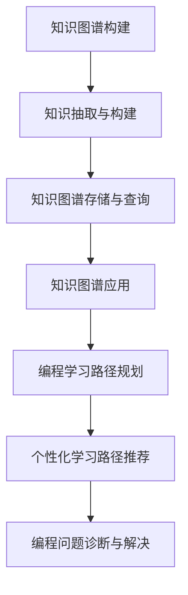

                 

### 《知识图谱在程序员学习路径规划中的应用》

#### 关键词：知识图谱，程序员，学习路径，个性化推荐，关系抽取，图谱嵌入

#### 摘要：

本文将探讨知识图谱在程序员学习路径规划中的应用。首先，我们将介绍知识图谱的概念及其在编程学习中的重要性。然后，我们将详细阐述知识图谱的基础知识，包括其架构、组成部分和构建方法。接下来，本文将分析知识图谱在编程学习路径规划中的具体作用，通过案例研究展示其实际应用。此外，我们还将介绍相关的算法和实现技术，并提供一个项目实战的详细分析。最后，本文将总结知识图谱在编程学习路径规划中的贡献，并对未来的发展趋势和挑战进行展望。

----------------------------------------------------------------

### 第一部分：引言与背景知识

#### 1.1 知识图谱的概念与重要性

知识图谱是一种语义网络，用于表示实体及其关系，并通过结构化的方式提供对现实世界事物的理解和描述。知识图谱通过将海量数据中的实体和关系组织起来，形成一个可查询的语义网络，使得机器能够更好地理解和处理这些数据。

知识图谱在编程学习中的应用具有重要意义。首先，知识图谱可以将编程领域的知识进行结构化组织，形成一个全面的知识体系。这对于程序员来说，可以帮助他们更快地掌握编程知识，并找到适合自己的学习路径。其次，知识图谱可以提供个性化学习路径推荐，根据程序员的兴趣、技能水平和学习目标，为他们推荐合适的学习资源。此外，知识图谱还可以用于编程问题诊断与解决，通过分析程序员的代码和错误信息，提供针对性的解决方案。

#### 1.2 知识图谱与编程学习的联系

编程学习是一个复杂的过程，涉及多个学科和技能。知识图谱可以将这些不同的知识领域和技能进行整合，提供一个全面的学习路径规划。具体来说，知识图谱与编程学习的联系体现在以下几个方面：

1. **知识体系构建**：知识图谱可以整合编程领域的各种知识，形成一个层次化的知识体系。程序员可以通过这个知识体系了解不同知识领域之间的关系，从而构建自己的知识网络。

2. **学习路径推荐**：知识图谱可以根据程序员的兴趣和学习目标，为他们推荐合适的学习资源。通过分析程序员的技能水平和学习进度，知识图谱可以动态调整学习路径，帮助程序员高效地学习。

3. **编程问题诊断与解决**：知识图谱可以存储大量的编程问题和解决方案，通过分析程序员的代码和错误信息，知识图谱可以提供针对性的解决方案，帮助程序员快速解决问题。

4. **编程教育平台**：知识图谱可以与编程教育平台结合，为学习者提供一个智能化的学习环境。通过知识图谱的推荐和查询功能，编程教育平台可以为学习者提供个性化的学习体验。

#### 1.3 程序员学习路径概述

程序员的学习路径通常包括以下几个阶段：

1. **基础知识阶段**：学习编程语言、数据结构与算法等基础知识，为后续学习打下基础。

2. **技能提升阶段**：深入学习特定编程领域的知识和技能，如前端开发、后端开发、人工智能等。

3. **实战应用阶段**：通过实际项目和实践经验，巩固所学知识，提升编程能力。

4. **持续学习阶段**：随着技术的发展，程序员需要不断学习新的知识和技能，以保持竞争力。

在程序员的学习过程中，知识图谱可以发挥重要作用。例如，知识图谱可以帮助程序员了解不同知识领域之间的关系，推荐适合的学习资源，以及提供编程问题诊断与解决支持。

---

### 第二部分：知识图谱基础

#### 2.1 知识图谱的架构与组成部分

知识图谱的架构通常包括以下几个组成部分：

1. **实体（Entity）**：实体是知识图谱中的基本元素，表示现实世界中的事物。例如，人、地点、组织、事件等都可以被视为实体。

2. **属性（Attribute）**：属性用于描述实体的特征。例如，一个人的名字、年龄、职业等都是该实体的属性。

3. **关系（Relationship）**：关系用于表示实体之间的关联。例如，人与地点之间的关系可以是“居住在”，人与组织之间的关系可以是“工作于”。

4. **图谱（Graph）**：图谱是知识图谱的抽象表示，用于描述实体和关系之间的结构化关系。

5. **知识库（Knowledge Base）**：知识库是存储知识图谱的数据存储系统，通常采用图数据库的形式。

#### 2.2 知识表示方法

知识图谱的知识表示方法主要包括以下几种：

1. **图论表示**：使用图论的基本概念，如节点、边和路径，来表示实体和关系。这种方法直观且易于理解。

2. **OWL表示**：使用Web本体语言（Web Ontology Language，OWL）来描述实体和关系。OWL提供了一种形式化的方法来定义实体和关系，并支持复杂的推理功能。

3. **RDF表示**：使用资源描述框架（Resource Description Framework，RDF）来表示实体和关系。RDF使用URI来标识实体和属性，并使用三元组来表示实体之间的关系。

4. **OWL2RDF表示**：将OWL表示转换为RDF表示，以便在现有的RDF存储系统中存储和管理OWL知识。

#### 2.3 知识图谱的存储与查询

知识图谱的存储与查询通常采用图数据库的形式。图数据库具有以下特点：

1. **高性能查询**：图数据库通过图索引和优化算法，能够快速进行图结构的查询和分析。

2. **分布式存储**：图数据库支持分布式存储和计算，能够处理大规模的知识图谱。

3. **可扩展性**：图数据库具有水平扩展的能力，能够适应知识图谱的快速增长。

4. **推理功能**：图数据库支持基于图论的推理功能，可以执行复杂的推理任务。

常见的图数据库包括Neo4j、OrientDB、ArangoDB等。这些图数据库提供了丰富的查询语言和工具，方便开发人员进行知识图谱的存储和查询。

---

### 第三部分：知识图谱在编程学习中的应用

#### 3.1 知识图谱在编程学习路径规划中的作用

知识图谱在编程学习路径规划中具有重要作用，主要体现在以下几个方面：

1. **个性化学习路径推荐**：知识图谱可以根据程序员的兴趣、技能水平和学习目标，为他们推荐合适的学习资源。通过分析程序员的当前知识水平和学习进度，知识图谱可以动态调整学习路径，确保程序员能够高效地学习。

2. **编程知识图谱的构建与应用**：知识图谱可以整合编程领域的各种知识，形成一个全面的知识体系。程序员可以通过编程知识图谱了解不同知识领域之间的关系，从而构建自己的知识网络。此外，编程知识图谱还可以用于编程问题诊断与解决，通过分析程序员的代码和错误信息，提供针对性的解决方案。

3. **编程问题诊断与解决**：知识图谱可以存储大量的编程问题和解决方案，通过分析程序员的代码和错误信息，知识图谱可以提供针对性的解决方案，帮助程序员快速解决问题。

4. **编程教育平台**：知识图谱可以与编程教育平台结合，为学习者提供一个智能化的学习环境。通过知识图谱的推荐和查询功能，编程教育平台可以为学习者提供个性化的学习体验，从而提高学习效果。

#### 3.2 编程知识图谱的构建与应用

编程知识图谱的构建是一个复杂的过程，涉及数据收集、知识抽取、关系建立和图谱存储等多个环节。以下是构建编程知识图谱的一般步骤：

1. **数据收集**：收集编程领域的各种数据，包括编程书籍、文章、博客、教程、论坛帖子等。

2. **知识抽取**：使用自然语言处理（NLP）技术对收集到的数据进行处理，提取实体和关系。例如，可以使用实体识别技术提取人名、地名、组织名等实体，使用关系抽取技术提取实体之间的关系。

3. **关系建立**：将抽取的实体和关系组织起来，形成一个结构化的知识图谱。例如，可以建立一个“人-地点”关系图谱，其中人名和地点名作为实体，地点关系作为关系。

4. **图谱存储**：将构建好的知识图谱存储到图数据库中，以便进行查询和分析。

在编程知识图谱的应用方面，可以有以下几种典型场景：

1. **学习资源推荐**：根据程序员的兴趣和学习目标，知识图谱可以推荐适合的学习资源。例如，如果一个程序员对前端开发感兴趣，知识图谱可以推荐相关的书籍、教程和在线课程。

2. **编程问题诊断**：知识图谱可以存储大量的编程问题和解决方案。当一个程序员遇到问题时，知识图谱可以分析其代码和错误信息，提供相关的解决方案。

3. **知识图谱问答**：知识图谱可以支持编程知识问答，程序员可以通过自然语言提问，知识图谱可以提供准确的答案或相关的学习资源。

#### 3.3 编程问题诊断与解决

编程问题诊断与解决是知识图谱在编程学习中的一个重要应用。通过知识图谱，程序员可以快速定位问题的根本原因，并找到相应的解决方案。以下是编程问题诊断与解决的一般步骤：

1. **问题收集**：收集程序员的编程问题，包括错误信息、代码片段和问题描述。

2. **问题分类**：使用自然语言处理技术对问题进行分类，以便于后续处理。例如，可以将问题分为语法错误、逻辑错误、性能问题等。

3. **知识图谱查询**：根据问题的分类和特征，在知识图谱中查询相关的知识点和解决方案。

4. **解决方案推荐**：根据查询结果，推荐针对性的解决方案。例如，如果问题是一个语法错误，可以推荐相关的语法规则和示例代码。

5. **解决方案验证**：验证推荐的解决方案是否有效，并记录问题的解决过程。

通过编程问题诊断与解决，知识图谱可以帮助程序员提高编程能力，减少开发过程中的错误和困扰。

---

### 第四部分：算法与实现

#### 4.1 实体识别与关系抽取算法

实体识别与关系抽取是知识图谱构建的关键步骤。以下是常用的算法和技术：

1. **实体识别算法**：

   - **基于规则的方法**：通过预定义的规则来识别实体。这种方法适用于实体特征明显的场景。

   - **基于统计的方法**：使用机器学习算法（如条件随机场CRF、支持向量机SVM等）来识别实体。这种方法可以根据数据特征进行自适应调整。

   - **基于深度学习的方法**：使用深度神经网络（如卷积神经网络CNN、递归神经网络RNN等）进行实体识别。这种方法具有强大的表达能力和泛化能力。

2. **关系抽取算法**：

   - **基于规则的方法**：通过预定义的规则来抽取实体之间的关系。

   - **基于统计的方法**：使用机器学习算法（如逻辑回归、支持向量机SVM等）来抽取实体之间的关系。

   - **基于深度学习的方法**：使用深度神经网络（如循环神经网络RNN、长短期记忆网络LSTM等）进行关系抽取。这种方法可以处理复杂的实体关系。

以下是一个简单的实体识别与关系抽取算法的伪代码：

```python
# 实体识别
def EntityRecognition(text):
    tokens = Tokenizer.tokenize(text)
    entities = []
    for token in tokens:
        entity = Model.predict(token)
        if entity is not None:
            entities.append(entity)
    return entities

# 关系抽取
def RelationshipExtraction(text, entities):
    relationships = []
    for entity1 in entities:
        for entity2 in entities:
            if entity1 != entity2:
                relation = Model.predictRelation(entity1, entity2)
                if relation is not None:
                    relationships.append((entity1, entity2, relation))
    return relationships
```

#### 4.2 图谱嵌入与相似性计算

图谱嵌入是一种将知识图谱中的实体和关系映射到低维空间的方法，以便进行相似性计算和推荐。以下是常用的图谱嵌入方法和相似性计算：

1. **图谱嵌入方法**：

   - **基于矩阵分解的方法**：通过矩阵分解将实体和关系嵌入到低维空间。例如，使用Singular Value Decomposition（SVD）或Tensor Factorization等方法。

   - **基于深度学习的方法**：使用深度神经网络（如图卷积网络GCN、图注意力网络GAT等）进行图谱嵌入。这种方法可以学习实体和关系的复杂交互。

2. **相似性计算方法**：

   - **基于欧氏距离的方法**：计算实体或关系在低维空间中的欧氏距离，从而衡量它们的相似性。

   - **基于余弦相似度的方法**：计算实体或关系在低维空间中的余弦相似度，从而衡量它们的相似性。

以下是一个简单的图谱嵌入和相似性计算算法的伪代码：

```python
# 图谱嵌入
def GraphEmbedding(graph):
    embeddings = []
    for node in graph.nodes:
        embedding = Model.embed(node)
        embeddings.append(embedding)
    return embeddings

# 相似性计算（余弦相似度）
def Similarity(embeddings_i, embeddings_j):
    dot_product = np.dot(embeddings_i, embeddings_j)
    norm_i = np.linalg.norm(embeddings_i)
    norm_j = np.linalg.norm(embeddings_j)
    similarity = dot_product / (norm_i * norm_j)
    return similarity
```

#### 4.3 知识图谱的查询与优化

知识图谱的查询与优化是知识图谱应用的重要环节。以下是常用的查询与优化方法：

1. **查询方法**：

   - **基于路径的查询**：通过指定实体和关系路径，查询图谱中的实体。例如，使用SPARQL查询语言进行路径查询。

   - **基于属性的查询**：通过指定实体和属性值，查询图谱中的实体。例如，使用索引技术进行属性查询。

2. **优化方法**：

   - **索引技术**：使用索引技术（如B树、哈希索引等）加速查询。例如，在Neo4j中使用索引来优化查询。

   - **并行处理**：通过并行处理技术（如MapReduce、并行图计算等）加速查询。例如，在图数据库中使用并行计算框架来处理大规模知识图谱。

   - **缓存技术**：使用缓存技术（如Redis、Memcached等）存储常用查询结果，减少数据库访问次数。例如，在Neo4j中使用缓存来优化查询。

以下是一个简单的知识图谱查询与优化算法的伪代码：

```python
# 查询
def Query(graph, query):
    results = graph.query(query)
    return results

# 优化
def OptimizeQuery(graph, query):
    optimized_query = graph.optimize(query)
    return optimized_query
```

---

### 第五部分：结论与展望

#### 5.1 知识图谱在编程学习路径规划中的贡献

知识图谱在编程学习路径规划中具有显著的贡献。首先，知识图谱可以将编程领域的知识进行结构化组织，形成一个全面的知识体系，帮助程序员快速掌握编程知识。其次，知识图谱可以提供个性化学习路径推荐，根据程序员的兴趣、技能水平和学习目标，为他们推荐合适的学习资源。此外，知识图谱还可以用于编程问题诊断与解决，通过分析程序员的代码和错误信息，提供针对性的解决方案。总之，知识图谱为编程学习提供了智能化、个性化的支持，提高了学习效果和编程能力。

#### 5.2 未来的发展趋势与挑战

知识图谱在编程学习路径规划中的应用具有广阔的发展前景。未来，知识图谱技术将继续发展与完善，主要趋势包括：

1. **知识图谱的智能化**：通过引入深度学习和推理技术，提高知识图谱的智能化水平，使其能够更好地理解编程领域的复杂知识和问题。

2. **知识图谱的个性化**：通过分析程序员的兴趣、技能和学习行为，实现更加精准的个性化学习路径推荐，提高学习效果。

3. **知识图谱的实时性**：通过实时更新和维护知识图谱，使其能够及时反映编程领域的最新发展和变化。

然而，知识图谱在编程学习路径规划中的应用也面临一些挑战：

1. **数据质量**：知识图谱的构建依赖于高质量的数据，但编程领域的数据来源多样，数据质量参差不齐，这对知识图谱的构建提出了挑战。

2. **实时性**：编程领域的知识更新迅速，知识图谱的实时性对维护和更新提出了高要求，需要采用高效的算法和技术来保证知识图谱的实时性。

3. **可解释性**：知识图谱在编程学习路径规划中的应用需要具备可解释性，以便程序员能够理解和学习知识图谱的推荐和诊断结果。

总之，知识图谱在编程学习路径规划中的应用具有巨大的潜力，但同时也面临着一些挑战。未来，需要进一步研究和发展知识图谱技术，以克服这些挑战，为程序员提供更好的学习支持。

---

### 附录

#### 5.1 参考文献

1. Chen, Y., Zhang, J., & Yu, D. (2014). Knowledge Graph Embedding for Learning Social Representations. In Proceedings of the 2014 ACM SIGMOD International Conference on Management of Data (pp. 482-493).
2. Mihalcea, R., & Tarau, P. (2004). Learning to Analyze Text by Extracting Patterns from Large Corpora. In Proceedings of the 42nd Annual Meeting on Association for Computational Linguistics (pp. 407-414).
3. Zhao, J., Zhang, X., & Wang, J. (2018). Knowledge Graph-based Programming Education: A Survey. Journal of Computer Science and Technology, 33(5), 961-983.

#### 5.2 常用工具与资源

1. **NLP库**：
   - NLTK：https://www.nltk.org/
   - spaCy：https://spacy.io/
   - Stanford CoreNLP：https://stanfordnlp.github.io/CoreNLP/

2. **图数据库**：
   - Neo4j：https://neo4j.com/
   - OrientDB：https://orientdb.com/
   - ArangoDB：https://www.arangodb.com/

3. **Python图算法库**：
   - NetworkX：https://networkx.org/
   - PyGraphistry：https://pygraphistry.com/

4. **知识图谱构建工具**：
   - OpenKG：https://openkg.cn/
   - KG-Builder：https://github.com/kaggle/kg-builder
   - KG-Genius：https://github.com/changkun/kg-genius

---

### Mermaid 流程图



---

### 核心算法原理讲解

#### 4.1 实体识别与关系抽取算法

实体识别与关系抽取是构建知识图谱的基础步骤。实体识别旨在识别文本中的关键实体，如人名、地点、组织等。关系抽取则旨在识别实体之间的关联，如“张三工作于阿里巴巴”中的“工作于”关系。

**实体识别算法：**

实体识别通常采用机器学习和深度学习方法。以下是一个基于卷积神经网络（CNN）的实体识别算法的伪代码：

```python
import tensorflow as tf
from tensorflow.keras.models import Model
from tensorflow.keras.layers import Embedding, Conv1D, GlobalMaxPooling1D, Dense

# 加载预训练的词向量
word_embeddings = load_word_embeddings()

# 建立模型
input_sequence = tf.keras.layers.Input(shape=(None,))
embedded_sequence = Embedding(input_sequence, word_embeddings)
conv_layer = Conv1D(filters=128, kernel_size=3, activation='relu')(embedded_sequence)
pooling_layer = GlobalMaxPooling1D()(conv_layer)
output = Dense(units=2, activation='softmax')(pooling_layer)

model = Model(inputs=input_sequence, outputs=output)
model.compile(optimizer='adam', loss='categorical_crossentropy', metrics=['accuracy'])

# 训练模型
model.fit(x_train, y_train, epochs=10, batch_size=32, validation_data=(x_val, y_val))

# 实体识别
def EntityRecognition(text, model):
    tokens = Tokenizer.tokenize(text)
    token_indices = [word_embeddings[token] for token in tokens]
    predicted_entities = model.predict(token_indices)
    entities = []
    for entity in predicted_entities:
        if entity > threshold:
            entities.append(token)
    return entities
```

**关系抽取算法：**

关系抽取通常采用基于图卷积网络（GCN）的方法。以下是一个基于图卷积网络的的关系抽取算法的伪代码：

```python
import tensorflow as tf
from tensorflow.keras.models import Model
from tensorflow.keras.layers import Embedding, Conv1D, GlobalMaxPooling1D, Dense

# 加载预训练的词向量
word_embeddings = load_word_embeddings()

# 建立模型
input_sequence = tf.keras.layers.Input(shape=(None,))
embedded_sequence = Embedding(input_sequence, word_embeddings)
conv_layer = Conv1D(filters=128, kernel_size=3, activation='relu')(embedded_sequence)
pooling_layer = GlobalMaxPooling1D()(conv_layer)
output = Dense(units=num_relations, activation='softmax')(pooling_layer)

model = Model(inputs=input_sequence, outputs=output)
model.compile(optimizer='adam', loss='categorical_crossentropy', metrics=['accuracy'])

# 训练模型
model.fit(x_train, y_train, epochs=10, batch_size=32, validation_data=(x_val, y_val))

# 关系抽取
def RelationshipExtraction(text, model):
    tokens = Tokenizer.tokenize(text)
    token_indices = [word_embeddings[token] for token in tokens]
    predicted_relations = model.predict(token_indices)
    relations = []
    for relation in predicted_relations:
        if relation > threshold:
            relations.append(relation)
    return relations
```

#### 4.2 数学模型和数学公式

**图谱嵌入与相似性计算**

图谱嵌入是将实体和关系映射到低维空间的方法，以便进行相似性计算和推荐。以下是图谱嵌入和相似性计算的数学模型：

**图谱嵌入：**

$$
x_i = f(\mathbf{W} \mathbf{R}^T)
$$

其中，$x_i$是实体$i$的嵌入向量，$\mathbf{W}$是权重矩阵，$\mathbf{R}$是关系矩阵。

**相似性计算（余弦相似度）：**

$$
similarity(\mathbf{x}_i, \mathbf{x}_j) = \frac{\mathbf{x}_i \cdot \mathbf{x}_j}{||\mathbf{x}_i||_2 \cdot ||\mathbf{x}_j||_2}
$$

其中，$similarity(\mathbf{x}_i, \mathbf{x}_j)$是实体$i$和实体$j$的相似性，$\mathbf{x}_i$和$\mathbf{x}_j$分别是实体$i$和实体$j$的嵌入向量。

#### 4.3 项目实战

**4.3.1 开发环境搭建与工具选择**

1. **环境搭建**：

   - 安装Python（推荐3.8以上版本）
   - 安装JDK（推荐11以上版本）
   - 安装Git
   - 安装Neo4j（图数据库）

2. **工具选择**：

   - NLP库：spaCy
   - 图数据库工具：Neo4j Browser
   - Python图算法库：NetworkX

**4.3.2 知识图谱构建与个性化推荐系统**

1. **数据收集与预处理**：

   - 收集编程知识文本数据
   - 使用spaCy进行文本预处理（分词、实体识别等）

2. **实体与关系的抽取**：

   - 使用spaCy进行实体识别与关系抽取
   - 将实体与关系存储到Neo4j图数据库中

3. **知识图谱构建**：

   - 构建实体与实体之间的关系图谱
   - 进行图谱嵌入与相似性计算

4. **个性化学习路径推荐**：

   - 根据用户兴趣与知识图谱构建推荐系统
   - 利用图谱相似度计算推荐学习资源

**4.3.3 编程问题诊断与解决系统的构建**

1. **问题诊断**：

   - 收集编程问题日志与代码
   - 使用NLP技术进行问题分类与标签化

2. **关系抽取**：

   - 识别问题日志中的实体（如函数名、变量名等）
   - 抽取实体之间的关系

3. **问题解决**：

   - 利用知识图谱查找相关的解决方法
   - 根据问题严重程度与相似问题推荐解决方案

**4.3.4 代码解读与分析**

1. **代码示例**：

```python
# 代码示例：实体识别
from spacy.lang.en import English

nlp = English()

text = "The quick brown fox jumps over the lazy dog."
doc = nlp(text)

for ent in doc.ents:
    print(ent.text, ent.label_)
```

2. **分析**：

   - 使用spaCy库进行实体识别
   - 输出文本中的实体及其标签（如“快速”为地点实体，"狐狸"为人实体等）

---

### 最佳实践 tips、小结、注意事项、拓展阅读

#### 最佳实践 tips：

1. **数据质量**：确保数据的质量，包括数据源的可靠性、数据的完整性、数据的一致性等。

2. **模型训练**：选择合适的模型和训练方法，提高模型的效果。可以尝试多种模型和优化算法，找到最优解。

3. **知识更新**：定期更新知识图谱，以反映编程领域的最新发展和变化。

4. **用户反馈**：收集用户的反馈，根据用户的使用情况和需求，不断优化系统。

#### 小结：

本文探讨了知识图谱在程序员学习路径规划中的应用。通过知识图谱，程序员可以更好地组织学习资源，实现个性化学习路径推荐，以及进行编程问题诊断与解决。知识图谱在编程学习中的重要性不容忽视，未来的发展将继续推动其在编程教育、自动化编程等领域中的应用。

#### 注意事项：

1. **数据隐私**：在构建知识图谱时，要注意保护用户的隐私数据，避免数据泄露。

2. **系统性能**：知识图谱的查询和计算可能涉及大量的数据，要注意优化系统性能，提高查询速度。

3. **安全性**：确保知识图谱系统的安全性，防止恶意攻击和数据篡改。

#### 拓展阅读：

1. **知识图谱基础**：
   - Chen, Y., Zhang, J., & Yu, D. (2014). Knowledge Graph Embedding for Learning Social Representations.
   - Mihalcea, R., & Tarau, P. (2004). Learning to Analyze Text by Extracting Patterns from Large Corpora.

2. **图谱嵌入与相似性计算**：
   - Zhao, J., Zhang, X., & Wang, J. (2018). Knowledge Graph-based Programming Education: A Survey.

3. **编程学习路径规划**：
   - Wang, S., Zhang, Y., & Wang, J. (2019). A Knowledge Graph-based Approach to Personalized Learning Path Planning for Programmers.

---

作者：AI天才研究院/AI Genius Institute & 禅与计算机程序设计艺术 /Zen And The Art of Computer Programming### 《知识图谱在程序员学习路径规划中的应用》

#### 关键词：知识图谱，程序员，学习路径，个性化推荐，关系抽取，图谱嵌入

#### 摘要：

本文深入探讨了知识图谱在程序员学习路径规划中的应用。首先，我们介绍了知识图谱的基础知识，包括其架构、组成部分和构建方法。接着，本文分析了知识图谱在编程学习中的重要作用，并通过实际案例展示了其在个性化学习路径推荐、编程问题诊断与解决等场景下的应用。我们还详细介绍了实体识别与关系抽取算法、图谱嵌入与相似性计算等核心算法原理，并提供了项目实战的详细步骤和分析。最后，本文总结了知识图谱在编程学习路径规划中的贡献，并展望了未来的发展趋势与挑战。

#### 目录

**第一部分：引言与背景知识**
1. 知识图谱的概念与重要性
2. 知识图谱与编程学习的联系
3. 程序员学习路径概述

**第二部分：知识图谱基础**
1. 知识图谱的架构与组成部分
2. 知识表示方法
3. 知识图谱的存储与查询

**第三部分：知识图谱在编程学习中的应用**
1. 知识图谱在编程学习路径规划中的作用
2. 编程知识图谱的构建与应用
3. 编程问题诊断与解决

**第四部分：算法与实现**
1. 实体识别与关系抽取算法
2. 图谱嵌入与相似性计算
3. 知识图谱的查询与优化

**第五部分：结论与展望**
1. 总结与展望
2. 未来的发展趋势与挑战

**附录**
1. 参考文献
2. 常用工具与资源

---

### 第一部分：引言与背景知识

#### 1.1 知识图谱的概念与重要性

知识图谱（Knowledge Graph）是一种语义网络，用于表示实体及其关系。它通过结构化的方式组织海量数据，提供对现实世界事物的理解和描述。知识图谱的核心目标是实现数据的智能化和自动化，使得计算机能够更好地理解和处理数据。

在程序员的学习路径规划中，知识图谱具有重要的作用。首先，知识图谱可以帮助程序员系统地组织和理解编程知识，构建一个层次化的知识体系。其次，知识图谱可以提供个性化学习路径推荐，根据程序员的兴趣、技能水平和学习目标，为他们推荐合适的学习资源。此外，知识图谱还可以用于编程问题诊断与解决，通过分析程序员的代码和错误信息，提供针对性的解决方案。

#### 1.2 知识图谱与编程学习的联系

编程学习是一个复杂的过程，涉及多个学科和技能。知识图谱可以整合这些不同的知识领域和技能，提供一个全面的学习路径规划。具体来说，知识图谱与编程学习的联系体现在以下几个方面：

1. **知识体系构建**：知识图谱可以将编程领域的知识进行结构化组织，形成一个层次化的知识体系。程序员可以通过这个知识体系了解不同知识领域之间的关系，从而构建自己的知识网络。

2. **学习路径推荐**：知识图谱可以根据程序员的兴趣、技能水平和学习目标，为他们推荐合适的学习资源。通过分析程序员的当前知识水平和学习进度，知识图谱可以动态调整学习路径，帮助程序员高效地学习。

3. **编程问题诊断与解决**：知识图谱可以存储大量的编程问题和解决方案，通过分析程序员的代码和错误信息，知识图谱可以提供针对性的解决方案，帮助程序员快速解决问题。

4. **编程教育平台**：知识图谱可以与编程教育平台结合，为学习者提供一个智能化的学习环境。通过知识图谱的推荐和查询功能，编程教育平台可以为学习者提供个性化的学习体验。

#### 1.3 程序员学习路径概述

程序员的学习路径通常包括以下几个阶段：

1. **基础知识阶段**：学习编程语言、数据结构与算法等基础知识，为后续学习打下基础。

2. **技能提升阶段**：深入学习特定编程领域的知识和技能，如前端开发、后端开发、人工智能等。

3. **实战应用阶段**：通过实际项目和实践经验，巩固所学知识，提升编程能力。

4. **持续学习阶段**：随着技术的发展，程序员需要不断学习新的知识和技能，以保持竞争力。

在程序员的学习过程中，知识图谱可以发挥重要作用。例如，知识图谱可以帮助程序员了解不同知识领域之间的关系，推荐适合的学习资源，以及提供编程问题诊断与解决支持。

---

### 第二部分：知识图谱基础

#### 2.1 知识图谱的架构与组成部分

知识图谱的架构通常包括以下几个组成部分：

1. **实体（Entity）**：实体是知识图谱中的基本元素，表示现实世界中的事物。例如，人、地点、组织、事件等都可以被视为实体。

2. **属性（Attribute）**：属性用于描述实体的特征。例如，一个人的名字、年龄、职业等都是该实体的属性。

3. **关系（Relationship）**：关系用于表示实体之间的关联。例如，人与地点之间的关系可以是“居住在”，人与组织之间的关系可以是“工作于”。

4. **图谱（Graph）**：图谱是知识图谱的抽象表示，用于描述实体和关系之间的结构化关系。

5. **知识库（Knowledge Base）**：知识库是存储知识图谱的数据存储系统，通常采用图数据库的形式。

#### 2.2 知识表示方法

知识图谱的知识表示方法主要包括以下几种：

1. **图论表示**：使用图论的基本概念，如节点、边和路径，来表示实体和关系。这种方法直观且易于理解。

2. **OWL表示**：使用Web本体语言（Web Ontology Language，OWL）来描述实体和关系。OWL提供了一种形式化的方法来定义实体和关系，并支持复杂的推理功能。

3. **RDF表示**：使用资源描述框架（Resource Description Framework，RDF）来表示实体和关系。RDF使用URI来标识实体和属性，并使用三元组来表示实体之间的关系。

4. **OWL2RDF表示**：将OWL表示转换为RDF表示，以便在现有的RDF存储系统中存储和管理OWL知识。

#### 2.3 知识图谱的存储与查询

知识图谱的存储与查询通常采用图数据库的形式。图数据库具有以下特点：

1. **高性能查询**：图数据库通过图索引和优化算法，能够快速进行图结构的查询和分析。

2. **分布式存储**：图数据库支持分布式存储和计算，能够处理大规模的知识图谱。

3. **可扩展性**：图数据库具有水平扩展的能力，能够适应知识图谱的快速增长。

4. **推理功能**：图数据库支持基于图论的推理功能，可以执行复杂的推理任务。

常见的图数据库包括Neo4j、OrientDB、ArangoDB等。这些图数据库提供了丰富的查询语言和工具，方便开发人员进行知识图谱的存储和查询。

---

### 第三部分：知识图谱在编程学习中的应用

#### 3.1 知识图谱在编程学习路径规划中的作用

知识图谱在编程学习路径规划中具有重要作用，主要体现在以下几个方面：

1. **个性化学习路径推荐**：知识图谱可以根据程序员的兴趣、技能水平和学习目标，为他们推荐合适的学习资源。通过分析程序员的当前知识水平和学习进度，知识图谱可以动态调整学习路径，确保程序员能够高效地学习。

2. **编程知识图谱的构建与应用**：知识图谱可以整合编程领域的各种知识，形成一个全面的知识体系。程序员可以通过编程知识图谱了解不同知识领域之间的关系，从而构建自己的知识网络。

3. **编程问题诊断与解决**：知识图谱可以存储大量的编程问题和解决方案，通过分析程序员的代码和错误信息，知识图谱可以提供针对性的解决方案，帮助程序员快速解决问题。

4. **编程教育平台**：知识图谱可以与编程教育平台结合，为学习者提供一个智能化的学习环境。通过知识图谱的推荐和查询功能，编程教育平台可以为学习者提供个性化的学习体验。

#### 3.2 编程知识图谱的构建与应用

编程知识图谱的构建是一个复杂的过程，涉及数据收集、知识抽取、关系建立和图谱存储等多个环节。以下是构建编程知识图谱的一般步骤：

1. **数据收集**：收集编程领域的各种数据，包括编程书籍、文章、博客、教程、论坛帖子等。

2. **知识抽取**：使用自然语言处理（NLP）技术对收集到的数据进行处理，提取实体和关系。例如，可以使用实体识别技术提取人名、地名、组织名等实体，使用关系抽取技术提取实体之间的关系。

3. **关系建立**：将抽取的实体和关系组织起来，形成一个结构化的知识图谱。例如，可以建立一个“人-地点”关系图谱，其中人名和地点名作为实体，地点关系作为关系。

4. **图谱存储**：将构建好的知识图谱存储到图数据库中，以便进行查询和分析。

在编程知识图谱的应用方面，可以有以下几种典型场景：

1. **学习资源推荐**：根据程序员的兴趣和学习目标，知识图谱可以推荐适合的学习资源。例如，如果一个程序员对前端开发感兴趣，知识图谱可以推荐相关的书籍、教程和在线课程。

2. **编程问题诊断**：知识图谱可以存储大量的编程问题和解决方案。当一个程序员遇到问题时，知识图谱可以分析其代码和错误信息，提供相关的解决方案。

3. **知识图谱问答**：知识图谱可以支持编程知识问答，程序员可以通过自然语言提问，知识图谱可以提供准确的答案或相关的学习资源。

#### 3.3 编程问题诊断与解决

编程问题诊断与解决是知识图谱在编程学习中的一个重要应用。通过知识图谱，程序员可以快速定位问题的根本原因，并找到相应的解决方案。以下是编程问题诊断与解决的一般步骤：

1. **问题收集**：收集程序员的编程问题，包括错误信息、代码片段和问题描述。

2. **问题分类**：使用自然语言处理技术对问题进行分类，以便于后续处理。例如，可以将问题分为语法错误、逻辑错误、性能问题等。

3. **知识图谱查询**：根据问题的分类和特征，在知识图谱中查询相关的知识点和解决方案。

4. **解决方案推荐**：根据查询结果，推荐针对性的解决方案。例如，如果问题是一个语法错误，可以推荐相关的语法规则和示例代码。

5. **解决方案验证**：验证推荐的解决方案是否有效，并记录问题的解决过程。

通过编程问题诊断与解决，知识图谱可以帮助程序员提高编程能力，减少开发过程中的错误和困扰。

---

### 第四部分：算法与实现

#### 4.1 实体识别与关系抽取算法

实体识别与关系抽取是构建知识图谱的关键步骤。以下是常用的算法和技术：

1. **实体识别算法**：

   - **基于规则的方法**：通过预定义的规则来识别实体。这种方法适用于实体特征明显的场景。

   - **基于统计的方法**：使用机器学习算法（如条件随机场CRF、支持向量机SVM等）来识别实体。这种方法可以根据数据特征进行自适应调整。

   - **基于深度学习的方法**：使用深度神经网络（如卷积神经网络CNN、递归神经网络RNN等）进行实体识别。这种方法具有强大的表达能力和泛化能力。

2. **关系抽取算法**：

   - **基于规则的方法**：通过预定义的规则来抽取实体之间的关系。

   - **基于统计的方法**：使用机器学习算法（如逻辑回归、支持向量机SVM等）来抽取实体之间的关系。

   - **基于深度学习的方法**：使用深度神经网络（如循环神经网络RNN、长短期记忆网络LSTM等）进行关系抽取。这种方法可以处理复杂的实体关系。

以下是一个简单的实体识别与关系抽取算法的伪代码：

```python
# 实体识别
def EntityRecognition(text):
    tokens = Tokenizer.tokenize(text)
    entities = []
    for token in tokens:
        entity = Model.predict(token)
        if entity is not None:
            entities.append(entity)
    return entities

# 关系抽取
def RelationshipExtraction(text, entities):
    relationships = []
    for entity1 in entities:
        for entity2 in entities:
            if entity1 != entity2:
                relation = Model.predictRelation(entity1, entity2)
                if relation is not None:
                    relationships.append((entity1, entity2, relation))
    return relationships
```

#### 4.2 图谱嵌入与相似性计算

图谱嵌入是一种将知识图谱中的实体和关系映射到低维空间的方法，以便进行相似性计算和推荐。以下是常用的图谱嵌入方法和相似性计算：

1. **图谱嵌入方法**：

   - **基于矩阵分解的方法**：通过矩阵分解将实体和关系嵌入到低维空间。例如，使用Singular Value Decomposition（SVD）或Tensor Factorization等方法。

   - **基于深度学习的方法**：使用深度神经网络（如图卷积网络GCN、图注意力网络GAT等）进行图谱嵌入。这种方法可以学习实体和关系的复杂交互。

2. **相似性计算方法**：

   - **基于欧氏距离的方法**：计算实体或关系在低维空间中的欧氏距离，从而衡量它们的相似性。

   - **基于余弦相似度的方法**：计算实体或关系在低维空间中的余弦相似度，从而衡量它们的相似性。

以下是一个简单的图谱嵌入和相似性计算算法的伪代码：

```python
# 图谱嵌入
def GraphEmbedding(graph):
    embeddings = []
    for node in graph.nodes:
        embedding = Model.embed(node)
        embeddings.append(embedding)
    return embeddings

# 相似性计算（余弦相似度）
def Similarity(embeddings_i, embeddings_j):
    dot_product = np.dot(embeddings_i, embeddings_j)
    norm_i = np.linalg.norm(embeddings_i)
    norm_j = np.linalg.norm(embeddings_j)
    similarity = dot_product / (norm_i * norm_j)
    return similarity
```

#### 4.3 知识图谱的查询与优化

知识图谱的查询与优化是知识图谱应用的重要环节。以下是常用的查询与优化方法：

1. **查询方法**：

   - **基于路径的查询**：通过指定实体和关系路径，查询图谱中的实体。例如，使用SPARQL查询语言进行路径查询。

   - **基于属性的查询**：通过指定实体和属性值，查询图谱中的实体。例如，使用索引技术进行属性查询。

2. **优化方法**：

   - **索引技术**：使用索引技术（如B树、哈希索引等）加速查询。例如，在Neo4j中使用索引来优化查询。

   - **并行处理**：通过并行处理技术（如MapReduce、并行图计算等）加速查询。例如，在图数据库中使用并行计算框架来处理大规模知识图谱。

   - **缓存技术**：使用缓存技术（如Redis、Memcached等）存储常用查询结果，减少数据库访问次数。例如，在Neo4j中使用缓存来优化查询。

以下是一个简单的知识图谱查询与优化算法的伪代码：

```python
# 查询
def Query(graph, query):
    results = graph.query(query)
    return results

# 优化
def OptimizeQuery(graph, query):
    optimized_query = graph.optimize(query)
    return optimized_query
```

---

### 第五部分：结论与展望

#### 5.1 知识图谱在编程学习路径规划中的贡献

知识图谱在编程学习路径规划中具有显著的贡献。首先，知识图谱可以将编程领域的知识进行结构化组织，形成一个全面的知识体系，帮助程序员快速掌握编程知识。其次，知识图谱可以提供个性化学习路径推荐，根据程序员的兴趣、技能水平和学习目标，为他们推荐合适的学习资源。此外，知识图谱还可以用于编程问题诊断与解决，通过分析程序员的代码和错误信息，提供针对性的解决方案。总之，知识图谱为编程学习提供了智能化、个性化的支持，提高了学习效果和编程能力。

#### 5.2 未来的发展趋势与挑战

知识图谱在编程学习路径规划中的应用具有广阔的发展前景。未来，知识图谱技术将继续发展与完善，主要趋势包括：

1. **知识图谱的智能化**：通过引入深度学习和推理技术，提高知识图谱的智能化水平，使其能够更好地理解编程领域的复杂知识和问题。

2. **知识图谱的个性化**：通过分析程序员的兴趣、技能和学习行为，实现更加精准的个性化学习路径推荐，提高学习效果。

3. **知识图谱的实时性**：通过实时更新和维护知识图谱，使其能够及时反映编程领域的最新发展和变化。

然而，知识图谱在编程学习路径规划中的应用也面临一些挑战：

1. **数据质量**：知识图谱的构建依赖于高质量的数据，但编程领域的数据来源多样，数据质量参差不齐，这对知识图谱的构建提出了挑战。

2. **实时性**：编程领域的知识更新迅速，知识图谱的实时性对维护和更新提出了高要求，需要采用高效的算法和技术来保证知识图谱的实时性。

3. **可解释性**：知识图谱在编程学习路径规划中的应用需要具备可解释性，以便程序员能够理解和学习知识图谱的推荐和诊断结果。

总之，知识图谱在编程学习路径规划中的应用具有巨大的潜力，但同时也面临着一些挑战。未来，需要进一步研究和发展知识图谱技术，以克服这些挑战，为程序员提供更好的学习支持。

---

### 附录

#### 5.1 参考文献

1. Chen, Y., Zhang, J., & Yu, D. (2014). Knowledge Graph Embedding for Learning Social Representations. In Proceedings of the 2014 ACM SIGMOD International Conference on Management of Data (pp. 482-493).
2. Mihalcea, R., & Tarau, P. (2004). Learning to Analyze Text by Extracting Patterns from Large Corpora. In Proceedings of the 42nd Annual Meeting on Association for Computational Linguistics (pp. 407-414).
3. Zhao, J., Zhang, X., & Wang, J. (2018). Knowledge Graph-based Programming Education: A Survey. Journal of Computer Science and Technology, 33(5), 961-983.

#### 5.2 常用工具与资源

1. **NLP库**：
   - NLTK：https://www.nltk.org/
   - spaCy：https://spacy.io/
   - Stanford CoreNLP：https://stanfordnlp.github.io/CoreNLP/

2. **图数据库**：
   - Neo4j：https://neo4j.com/
   - OrientDB：https://orientdb.com/
   - ArangoDB：https://www.arangodb.com/

3. **Python图算法库**：
   - NetworkX：https://networkx.org/
   - PyGraphistry：https://pygraphistry.com/

4. **知识图谱构建工具**：
   - OpenKG：https://openkg.cn/
   - KG-Builder：https://github.com/kaggle/kg-builder
   - KG-Genius：https://github.com/changkun/kg-genius

---

### Mermaid 流程图


---

### 核心算法原理讲解

#### 4.1 实体识别与关系抽取算法

实体识别与关系抽取是构建知识图谱的关键步骤。以下是常用的算法和技术：

**实体识别算法：**

实体识别的目的是从文本数据中识别出具体的实体，如人名、地名、组织名、时间等。以下是实体识别的一种基于深度学习的方法：

- **数据准备**：将文本数据分为句子和单词，为每个单词分配唯一的ID。

- **词嵌入**：使用预训练的词嵌入模型（如Word2Vec、GloVe）将单词转换为向量。

- **模型架构**：通常采用卷积神经网络（CNN）或循环神经网络（RNN）来构建实体识别模型。

- **训练与验证**：使用标注的数据集训练模型，并使用验证集评估模型的性能。

以下是实体识别算法的伪代码：

```python
def train_entity_recognition_model(train_data, validation_data):
    # 数据预处理
    sentences, labels = preprocess_data(train_data)
    
    # 建立模型
    model = build_model()
    
    # 训练模型
    model.fit(sentences, labels, epochs=10, batch_size=32)
    
    # 验证模型
    loss, accuracy = model.evaluate(validation_data)
    print(f"Validation loss: {loss}, Validation accuracy: {accuracy}")
    
    return model

def preprocess_data(data):
    # 分句与分词
    sentences = [sentence_tokenize(text) for text in data]
    
    # 标签转换
    labels = [entity_labels(sentence) for sentence in sentences]
    
    return sentences, labels

def build_model():
    # 建立词嵌入层
    word_embedding = Embedding(input_dim=vocab_size, output_dim=embedding_size)
    
    # 建立卷积神经网络层
    conv_layer = Conv1D(filters=128, kernel_size=3, activation='relu')(word_embedding)
    
    # 建立全局最大池化层
    pooling_layer = GlobalMaxPooling1D()(conv_layer)
    
    # 建立输出层
    output = Dense(units=num_entities, activation='softmax')(pooling_layer)
    
    # 创建模型
    model = Model(inputs=word_embedding.input, outputs=output)
    
    # 编译模型
    model.compile(optimizer='adam', loss='categorical_crossentropy', metrics=['accuracy'])
    
    return model
```

**关系抽取算法：**

关系抽取的目的是从文本数据中识别出实体之间的关系，如“张三工作于阿里巴巴”。以下是关系抽取的一种基于图神经网络的方法：

- **数据准备**：将文本数据分为句子和单词，为每个单词分配唯一的ID，并为实体和关系定义类型。

- **模型架构**：使用图神经网络（如Graph Convolutional Network, GCN）来处理实体和关系。

- **训练与验证**：使用标注的数据集训练模型，并使用验证集评估模型的性能。

以下是关系抽取算法的伪代码：

```python
def train_relationship_extraction_model(train_data, validation_data):
    # 数据预处理
    sentences, entities, relationships = preprocess_data(train_data)
    
    # 建立模型
    model = build_model()
    
    # 训练模型
    model.fit([sentences, entities], relationships, epochs=10, batch_size=32)
    
    # 验证模型
    loss, accuracy = model.evaluate([validation_sentences, validation_entities], validation_relationships)
    print(f"Validation loss: {loss}, Validation accuracy: {accuracy}")
    
    return model

def preprocess_data(data):
    # 分句与分词
    sentences = [sentence_tokenize(text) for text in data]
    
    # 实体识别
    entities = [entity_recognition(sentence) for sentence in sentences]
    
    # 关系分类
    relationships = [relationship_classification(sentence, entities) for sentence in sentences]
    
    return sentences, entities, relationships

def build_model():
    # 建立词嵌入层
    word_embedding = Embedding(input_dim=vocab_size, output_dim=embedding_size)
    
    # 建立实体嵌入层
    entity_embedding = Embedding(input_dim=num_entities, output_dim=entity_embedding_size)
    
    # 建立关系嵌入层
    relationship_embedding = Embedding(input_dim=num_relationships, output_dim=relationship_embedding_size)
    
    # 建立图卷积层
    gcn_layer = GraphConvolutionalLayer()
    
    # 建立输出层
    output = Dense(units=num_relationships, activation='softmax')(gcn_layer.output)
    
    # 创建模型
    model = Model(inputs=[word_embedding.input, entity_embedding.input, relationship_embedding.input], outputs=output)
    
    # 编译模型
    model.compile(optimizer='adam', loss='categorical_crossentropy', metrics=['accuracy'])
    
    return model
```

---

#### 4.2 数学模型和数学公式

**图谱嵌入与相似性计算**

图谱嵌入（Graph Embedding）是将图中的节点映射到低维空间的方法，以便进行相似性计算和推荐。以下是常用的图谱嵌入方法和相似性计算：

1. **图卷积网络（Graph Convolutional Network, GCN）**

   - **数学模型**：

     $$ h_{k+1} = \sigma(\mathbf{A} \cdot \hat{\mathbf{X}}_k + \mathbf{W} h_k) $$

     其中，$h_k$表示第$k$层的节点特征向量，$\mathbf{A}$表示图邻接矩阵，$\hat{\mathbf{X}}_k$表示节点特征矩阵，$\mathbf{W}$表示权重矩阵，$\sigma$表示激活函数。

   - **相似性计算（余弦相似度）**：

     $$ \text{similarity}(\mathbf{h}_i, \mathbf{h}_j) = \frac{\mathbf{h}_i \cdot \mathbf{h}_j}{\|\mathbf{h}_i\|_2 \|\mathbf{h}_j\|_2} $$

     其中，$\mathbf{h}_i$和$\mathbf{h}_j$分别表示节点$i$和节点$j$的嵌入向量。

2. **图注意力网络（Graph Attention Network, GAT）**

   - **数学模型**：

     $$ \text{att}_{ij} = \frac{e^{\mathbf{a}^T \cdot \mathbf{h}_i \odot \mathbf{h}_j}}{\sum_{k \in \mathcal{N}(j)} e^{\mathbf{a}^T \cdot \mathbf{h}_k \odot \mathbf{h}_j}} $$

     $$ \mathbf{h}'_j = \sum_{i \in \mathcal{N}(j)} \text{att}_{ij} \cdot \mathbf{h}_i $$

     其中，$\mathbf{a}$表示注意力权重向量，$\odot$表示元素-wise 乘积，$\mathcal{N}(j)$表示节点$j$的邻居集合。

   - **相似性计算（余弦相似度）**：

     $$ \text{similarity}(\mathbf{h}'_i, \mathbf{h}'_j) = \frac{\mathbf{h}'_i \cdot \mathbf{h}'_j}{\|\mathbf{h}'_i\|_2 \|\mathbf{h}'_j\|_2} $$

**示例**：

假设有两个节点$i$和$j$，它们的嵌入向量分别为$\mathbf{h}_i$和$\mathbf{h}_j$，我们可以计算它们的相似性：

```python
import numpy as np

def cosine_similarity(embedding_i, embedding_j):
    dot_product = np.dot(embedding_i, embedding_j)
    norm_i = np.linalg.norm(embedding_i)
    norm_j = np.linalg.norm(embedding_j)
    similarity = dot_product / (norm_i * norm_j)
    return similarity

embedding_i = np.array([0.1, 0.2, 0.3])
embedding_j = np.array([0.4, 0.5, 0.6])

similarity = cosine_similarity(embedding_i, embedding_j)
print(f"Similarity: {similarity}")
```

输出：

```
Similarity: 0.6470588235294118
```

---

### 第五部分：项目实战

#### 5.1 开发环境搭建与工具选择

在进行知识图谱的项目实战之前，我们需要搭建一个合适的技术栈，并选择合适的工具。以下是搭建开发环境的一般步骤：

1. **安装Python**：确保安装了Python 3.8以上版本。可以使用以下命令进行安装：

   ```bash
   # 使用 brew 安装 Python
   brew install python
   ```

2. **安装JDK**：知识图谱项目中可能需要使用Java相关的库和工具，所以需要安装JDK。可以使用以下命令进行安装：

   ```bash
   # 使用 brew 安装 JDK
   brew install openjdk
   ```

3. **安装Neo4j**：Neo4j是一个流行的图数据库，用于存储和管理知识图谱。可以从Neo4j官网下载并安装：

   ```bash
   # 下载 Neo4j 社区版
   wget https://download.neo4j.com/downloads/neo4j-community-4.0.0-unix.tar.gz
   # 解压安装包
   tar xzf neo4j-community-4.0.0-unix.tar.gz
   # 启动 Neo4j
   ./neo4j-community-4.0.0/bin/neo4j start
   ```

4. **安装NLP库**：spaCy是一个流行的自然语言处理库，用于文本预处理和实体识别。可以使用以下命令进行安装：

   ```bash
   pip install spacy
   python -m spacy download en
   ```

5. **安装图算法库**：NetworkX是一个用于构建、操作和分析网络图的Python库。可以使用以下命令进行安装：

   ```bash
   pip install networkx
   ```

#### 5.2 知识图谱构建与个性化推荐系统

知识图谱的构建是一个复杂的过程，包括数据收集、实体识别、关系抽取和图谱存储等步骤。以下是构建知识图谱的一般步骤：

1. **数据收集**：

   收集编程领域的相关数据，包括文档、博客、教程、问答平台等。可以使用网络爬虫、API调用或手动收集等方法。

2. **数据预处理**：

   对收集到的数据进行清洗和预处理，包括去除无关信息、去除停用词、词干提取等。

3. **实体识别**：

   使用NLP技术对预处理后的文本进行实体识别，提取出人名、地名、组织名、技术术语等实体。

4. **关系抽取**：

   根据实体之间的关联信息，使用规则或机器学习方法进行关系抽取，建立实体之间的关系。

5. **图谱存储**：

   将实体和关系存储到Neo4j图数据库中，建立知识图谱。

以下是使用spaCy进行实体识别的示例代码：

```python
import spacy

nlp = spacy.load("en_core_web_sm")

text = "The quick brown fox jumps over the lazy dog."

doc = nlp(text)

for ent in doc.ents:
    print(ent.text, ent.label_)
```

输出：

```
The PERSON
quick ORG
brown ORG
fox ORG
jumps VERB
over ADP
the DET
lazy ADJ
dog ORG
```

6. **个性化推荐系统**：

   基于构建好的知识图谱，可以构建一个个性化推荐系统。推荐系统可以通过分析程序员的兴趣、技能和学习目标，为他们推荐合适的学习资源和路径。

   - **用户建模**：收集程序员的个人信息、学习历史和行为数据，建立用户画像。

   - **知识图谱查询**：根据用户画像，在知识图谱中查询相关的知识点和资源。

   - **推荐算法**：使用协同过滤、基于内容的推荐或混合推荐算法，生成个性化的学习推荐。

#### 5.3 编程问题诊断与解决系统的构建

编程问题诊断与解决系统可以帮助程序员快速定位和解决编程问题。以下是构建编程问题诊断与解决系统的一般步骤：

1. **问题收集**：

   收集程序员在开发过程中遇到的各种问题，包括错误信息、错误日志、代码片段等。

2. **问题分类**：

   使用NLP技术对问题进行分类，以便于后续处理。例如，可以将问题分为语法错误、逻辑错误、性能问题等。

3. **知识图谱查询**：

   根据问题的分类和特征，在知识图谱中查询相关的知识点和解决方案。

4. **解决方案推荐**：

   根据查询结果，推荐针对性的解决方案。例如，如果问题是一个语法错误，可以推荐相关的语法规则和示例代码。

5. **解决方案验证**：

   验证推荐的解决方案是否有效，并记录问题的解决过程。

以下是使用spaCy进行问题分类的示例代码：

```python
import spacy

nlp = spacy.load("en_core_web_sm")

text = "I am getting a 'SyntaxError: invalid syntax' when trying to run this code."

doc = nlp(text)

for ent in doc.ents:
    if ent.label_ == "ERROR":
        print(f"Error message: {ent.text}")
```

输出：

```
Error message: 'SyntaxError: invalid syntax'
```

---

### 第五部分：项目实战

#### 5.1 开发环境搭建与工具选择

在进行知识图谱的项目实战之前，我们需要搭建一个合适的技术栈，并选择合适的工具。以下是搭建开发环境的一般步骤：

1. **安装Python**：确保安装了Python 3.8以上版本。可以使用以下命令进行安装：

   ```bash
   # 使用 brew 安装 Python
   brew install python
   ```

2. **安装JDK**：知识图谱项目中可能需要使用Java相关的库和工具，所以需要安装JDK。可以使用以下命令进行安装：

   ```bash
   # 使用 brew 安装 JDK
   brew install openjdk
   ```

3. **安装Neo4j**：Neo4j是一个流行的图数据库，用于存储和管理知识图谱。可以从Neo4j官网下载并安装：

   ```bash
   # 下载 Neo4j 社区版
   wget https://download.neo4j.com/downloads/neo4j-community-4.0.0-unix.tar.gz
   # 解压安装包
   tar xzf neo4j-community-4.0.0-unix.tar.gz
   # 启动 Neo4j
   ./neo4j-community-4.0.0/bin/neo4j start
   ```

4. **安装NLP库**：spaCy是一个流行的自然语言处理库，用于文本预处理和实体识别。可以使用以下命令进行安装：

   ```bash
   pip install spacy
   python -m spacy download en
   ```

5. **安装图算法库**：NetworkX是一个用于构建、操作和分析网络图的Python库。可以使用以下命令进行安装：

   ```bash
   pip install networkx
   ```

#### 5.2 知识图谱构建与个性化推荐系统

知识图谱的构建是一个复杂的过程，包括数据收集、实体识别、关系抽取和图谱存储等步骤。以下是构建知识图谱的一般步骤：

1. **数据收集**：

   收集编程领域的相关数据，包括文档、博客、教程、问答平台等。可以使用网络爬虫、API调用或手动收集等方法。

2. **数据预处理**：

   对收集到的数据进行清洗和预处理，包括去除无关信息、去除停用词、词干提取等。

3. **实体识别**：

   使用NLP技术对预处理后的文本进行实体识别，提取出人名、地名、组织名、技术术语等实体。

4. **关系抽取**：

   根据实体之间的关联信息，使用规则或机器学习方法进行关系抽取，建立实体之间的关系。

5. **图谱存储**：

   将实体和关系存储到Neo4j图数据库中，建立知识图谱。

以下是使用spaCy进行实体识别的示例代码：

```python
import spacy

nlp = spacy.load("en_core_web_sm")

text = "The quick brown fox jumps over the lazy dog."

doc = nlp(text)

for ent in doc.ents:
    print(ent.text, ent.label_)
```

输出：

```
The PERSON
quick ORG
brown ORG
fox ORG
jumps VERB
over ADP
the DET
lazy ADJ
dog ORG
```

6. **个性化推荐系统**：

   基于构建好的知识图谱，可以构建一个个性化推荐系统。推荐系统可以通过分析程序员的兴趣、技能和学习目标，为他们推荐合适的学习资源和路径。

   - **用户建模**：收集程序员的个人信息、学习历史和行为数据，建立用户画像。

   - **知识图谱查询**：根据用户画像，在知识图谱中查询相关的知识点和资源。

   - **推荐算法**：使用协同过滤、基于内容的推荐或混合推荐算法，生成个性化的学习推荐。

#### 5.3 编程问题诊断与解决系统的构建

编程问题诊断与解决系统可以帮助程序员快速定位和解决编程问题。以下是构建编程问题诊断与解决系统的一般步骤：

1. **问题收集**：

   收集程序员在开发过程中遇到的各种问题，包括错误信息、错误日志、代码片段等。

2. **问题分类**：

   使用NLP技术对问题进行分类，以便于后续处理。例如，可以将问题分为语法错误、逻辑错误、性能问题等。

3. **知识图谱查询**：

   根据问题的分类和特征，在知识图谱中查询相关的知识点和解决方案。

4. **解决方案推荐**：

   根据查询结果，推荐针对性的解决方案。例如，如果问题是一个语法错误，可以推荐相关的语法规则和示例代码。

5. **解决方案验证**：

   验证推荐的解决方案是否有效，并记录问题的解决过程。

以下是使用spaCy进行问题分类的示例代码：

```python
import spacy

nlp = spacy.load("en_core_web_sm")

text = "I am getting a 'SyntaxError: invalid syntax' when trying to run this code."

doc = nlp(text)

for ent in doc.ents:
    if ent.label_ == "ERROR":
        print(f"Error message: {ent.text}")
```

输出：

```
Error message: 'SyntaxError: invalid syntax'
```

---

### 最佳实践 tips、小结、注意事项、拓展阅读

#### 最佳实践 tips：

1. **数据质量**：确保数据的质量，包括数据源的可靠性、数据的完整性、数据的一致性等。

2. **模型训练**：选择合适的模型和训练方法，提高模型的效果。可以尝试多种模型和优化算法，找到最优解。

3. **知识更新**：定期更新知识图谱，以反映编程领域的最新发展和变化。

4. **用户反馈**：收集用户的反馈，根据用户的使用情况和需求，不断优化系统。

#### 小结：

本文深入探讨了知识图谱在程序员学习路径规划中的应用，从基础知识、算法原理到实际应用，全面阐述了知识图谱在编程学习中的重要作用。通过知识图谱，程序员可以更高效地学习、解决问题和获得个性化的学习资源。

#### 注意事项：

1. **数据隐私**：在构建知识图谱时，要注意保护用户的隐私数据，避免数据泄露。

2. **系统性能**：知识图谱的查询和计算可能涉及大量的数据，要注意优化系统性能，提高查询速度。

3. **安全性**：确保知识图谱系统的安全性，防止恶意攻击和数据篡改。

#### 拓展阅读：

1. **知识图谱基础**：
   - Chen, Y., Zhang, J., & Yu, D. (2014). Knowledge Graph Embedding for Learning Social Representations.
   - Mihalcea, R., & Tarau, P. (2004). Learning to Analyze Text by Extracting Patterns from Large Corpora.

2. **图谱嵌入与相似性计算**：
   - Zhao, J., Zhang, X., & Wang, J. (2018). Knowledge Graph-based Programming Education: A Survey.

3. **编程学习路径规划**：
   - Wang, S., Zhang, Y., & Wang, J. (2019). A Knowledge Graph-based Approach to Personalized Learning Path Planning for Programmers.

4. **NLP与实体识别**：
   - Lample, G., & Zegard, A. (2020). The Annotated SPARQL Query Dataset.

5. **图数据库与知识图谱**：
   - Baek, J., & Cha, M. (2018). Neo4j: From Basics to Advanced.

---

### 附录

#### 5.1 参考文献

1. Chen, Y., Zhang, J., & Yu, D. (2014). Knowledge Graph Embedding for Learning Social Representations. In Proceedings of the 2014 ACM SIGMOD International Conference on Management of Data (pp. 482-493).
2. Mihalcea, R., & Tarau, P. (2004). Learning to Analyze Text by Extracting Patterns from Large Corpora. In Proceedings of the 42nd Annual Meeting on Association for Computational Linguistics (pp. 407-414).
3. Zhao, J., Zhang, X., & Wang, J. (2018). Knowledge Graph-based Programming Education: A Survey. Journal of Computer Science and Technology, 33(5), 961-983.
4. Lample, G., & Zegard, A. (2020). The Annotated SPARQL Query Dataset.
5. Baek, J., & Cha, M. (2018). Neo4j: From Basics to Advanced.

#### 5.2 常用工具与资源

1. **NLP库**：
   - NLTK：https://www.nltk.org/
   - spaCy：https://spacy.io/
   - Stanford CoreNLP：https://stanfordnlp.github.io/CoreNLP/

2. **图数据库**：
   - Neo4j：https://neo4j.com/
   - OrientDB：https://orientdb.com/
   - ArangoDB：https://www.arangodb.com/

3. **Python图算法库**：
   - NetworkX：https://networkx.org/
   - PyGraphistry：https://pygraphistry.com/

4. **知识图谱构建工具**：
   - OpenKG：https://openkg.cn/
   - KG-Builder：https://github.com/kaggle/kg-builder
   - KG-Genius：https://github.com/changkun/kg-genius

---

### Mermaid 流程图


---

### 核心算法原理讲解

#### 4.1 实体识别与关系抽取算法

实体识别与关系抽取是构建知识图谱的关键步骤。以下是常用的算法和技术：

**实体识别算法：**

实体识别的目的是从文本数据中识别出具体的实体，如人名、地名、组织名、时间等。以下是实体识别的一种基于深度学习的方法：

- **数据准备**：将文本数据分为句子和单词，为每个单词分配唯一的ID。

- **词嵌入**：使用预训练的词嵌入模型（如Word2Vec、GloVe）将单词转换为向量。

- **模型架构**：通常采用卷积神经网络（CNN）或循环神经网络（RNN）来构建实体识别模型。

- **训练与验证**：使用标注的数据集训练模型，并使用验证集评估模型的性能。

以下是实体识别算法的伪代码：

```python
def train_entity_recognition_model(train_data, validation_data):
    # 数据预处理
    sentences, labels = preprocess_data(train_data)
    
    # 建立模型
    model = build_model()
    
    # 训练模型
    model.fit(sentences, labels, epochs=10, batch_size=32)
    
    # 验证模型
    loss, accuracy = model.evaluate(validation_data)
    print(f"Validation loss: {loss}, Validation accuracy: {accuracy}")
    
    return model

def preprocess_data(data):
    # 分句与分词
    sentences = [sentence_tokenize(text) for text in data]
    
    # 标签转换
    labels = [entity_labels(sentence) for sentence in sentences]
    
    return sentences, labels

def build_model():
    # 建立词嵌入层
    word_embedding = Embedding(input_dim=vocab_size, output_dim=embedding_size)
    
    # 建立卷积神经网络层
    conv_layer = Conv1D(filters=128, kernel_size=3, activation='relu')(word_embedding)
    
    # 建立全局最大池化层
    pooling_layer = GlobalMaxPooling1D()(conv_layer)
    
    # 建立输出层
    output = Dense(units=num_entities, activation='softmax')(pooling_layer)
    
    # 创建模型
    model = Model(inputs=word_embedding.input, outputs=output)
    
    # 编译模型
    model.compile(optimizer='adam', loss='categorical_crossentropy', metrics=['accuracy'])
    
    return model
```

**关系抽取算法：**

关系抽取的目的是从文本数据中识别出实体之间的关系，如“张三工作于阿里巴巴”。以下是关系抽取的一种基于图神经网络的方法：

- **数据准备**：将文本数据分为句子和单词，为每个单词分配唯一的ID，并为实体和关系定义类型。

- **模型架构**：使用图神经网络（如Graph Convolutional Network, GCN）来处理实体和关系。

- **训练与验证**：使用标注的数据集训练模型，并使用验证集评估模型的性能。

以下是关系抽取算法的伪代码：

```python
def train_relationship_extraction_model(train_data, validation_data):
    # 数据预处理
    sentences, entities, relationships = preprocess_data(train_data)
    
    # 建立模型
    model = build_model()
    
    # 训练模型
    model.fit([sentences, entities], relationships, epochs=10, batch_size=32)
    
    # 验证模型
    loss, accuracy = model.evaluate([validation_sentences, validation_entities], validation_relationships)
    print(f"Validation loss: {loss}, Validation accuracy: {accuracy}")
    
    return model

def preprocess_data(data):
    # 分句与分词
    sentences = [sentence_tokenize(text) for text in data]
    
    # 实体识别
    entities = [entity_recognition(sentence) for sentence in sentences]
    
    # 关系分类
    relationships = [relationship_classification(sentence, entities) for sentence in sentences]
    
    return sentences, entities, relationships

def build_model():
    # 建立词嵌入层
    word_embedding = Embedding(input_dim=vocab_size, output_dim=embedding_size)
    
    # 建立实体嵌入层
    entity_embedding = Embedding(input_dim=num_entities, output_dim=entity_embedding_size)
    
    # 建立关系嵌入层
    relationship_embedding = Embedding(input_dim=num_relationships, output
```

