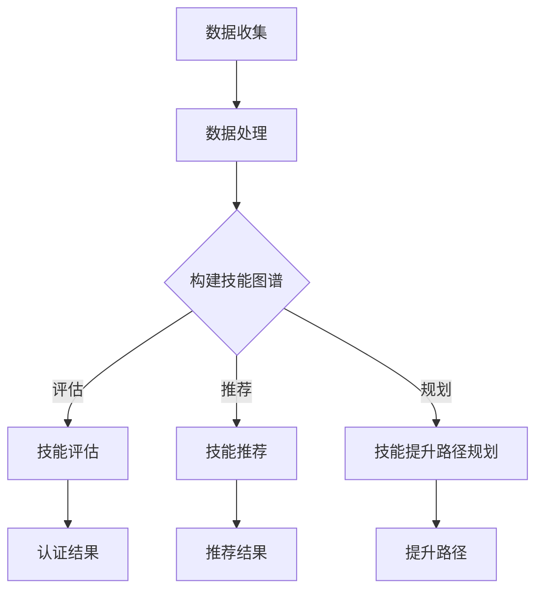

                 

### 文章标题：知识图谱在程序员技能认证中的应用

#### 关键词：知识图谱、程序员技能认证、技能评估、技能推荐、技能提升路径规划、技能图谱

> 摘要：本文详细探讨了知识图谱在程序员技能认证中的应用。首先介绍了知识图谱的基本概念和重要性，随后阐述了知识图谱在程序员技能认证中的具体应用场景和构建技术。文章还讨论了程序员技能认证体系的构建原则和实施步骤，并列举了知识图谱在程序员技能认证中的应用案例。最后，分析了知识图谱在程序员技能认证中面临的挑战和未来的发展趋势。

---

### 第一部分：知识图谱基础

#### 第1章：知识图谱概述

##### 1.1 知识图谱的定义与重要性

知识图谱（Knowledge Graph）是一种用于表示实体和实体之间关系的图形结构，它通过将现实世界中的信息以图的形式组织起来，实现知识的抽取、存储、检索和应用。知识图谱在人工智能领域具有重要地位，它是连接数据和信息、实现智能化应用的关键技术。

###### 1.1.1 知识图谱的定义

知识图谱是一种基于语义的知识表示方法，它通过实体（Entity）、属性（Attribute）和关系（Relationship）来描述现实世界中的对象和对象之间的关系。

实体：知识图谱中的基本元素，可以是人、地点、事物等。

属性：实体的特征，用于描述实体的详细信息。

关系：用于描述实体之间的关联，可以是一对一、一对多或多对多。

###### 1.1.2 知识图谱的重要性

知识图谱在多个领域都具有重要的应用价值，如搜索引擎、推荐系统、自然语言处理、智能问答等。

知识图谱通过将数据以图形结构组织，实现了数据的关联和推理，为人工智能应用提供了强大的支持。

##### 1.2 知识图谱的组成部分

知识图谱主要由以下几部分组成：实体、属性、关系和边。

###### 1.2.1 实体

实体是知识图谱中的基本元素，可以是人、地点、事物等。实体是构建知识图谱的基础。

###### 1.2.2 属性

属性是实体的特征，用于描述实体的详细信息。例如，对于一个人实体，其属性可能包括姓名、年龄、性别等。

###### 1.2.3 关系

关系用于描述实体之间的关联，可以是一对一、一对多或多对多。关系将实体连接起来，构建了知识图谱的语义网络。

###### 1.2.4 边

边是关系在知识图谱中的表示，连接两个或多个实体。边通常包含权重、类型等属性，用于描述关系的重要性和性质。

##### 1.3 知识图谱在技能认证中的应用场景

知识图谱在程序员技能认证中可以应用于多个方面，如技能评估、推荐系统、技能提升路径规划等。

###### 1.3.1 技能评估

知识图谱可以用于对程序员的技能水平进行评估，通过分析程序员的简历、代码、项目经验等数据，构建其技能图谱，从而对其技能水平进行量化评估。

###### 1.3.2 技能推荐

知识图谱可以用于向程序员推荐与其技能相关的学习资源和项目，帮助他们提升技能。

###### 1.3.3 技能提升路径规划

知识图谱可以帮助程序员规划技能提升路径，通过分析其现有技能和目标技能之间的差距，提供个性化的学习建议。

---

#### 第2章：知识图谱构建技术

##### 2.1 数据源收集与处理

构建知识图谱的第一步是收集数据源，包括结构化数据、半结构化数据和非结构化数据。数据源收集后，需要进行数据处理，包括数据清洗、去重、格式转换等步骤。

###### 2.1.1 数据源类型

- 结构化数据：如数据库、表格等。
- 半结构化数据：如XML、JSON等。
- 非结构化数据：如文本、图片、视频等。

###### 2.1.2 数据处理步骤

- 数据清洗：去除错误、冗余、无关的数据。
- 数据去重：去除重复的数据。
- 数据格式转换：将不同类型的数据转换为统一的格式。

##### 2.2 实体抽取与关系抽取

实体抽取（Entity Extraction）是从非结构化数据中识别出实体（如人名、地点名等）的过程。关系抽取（Relationship Extraction）是从文本中识别出实体之间的关系的任务。

###### 2.2.1 实体抽取方法

- 基于规则的方法：通过定义一系列规则，从文本中抽取实体。
- 基于机器学习的方法：使用机器学习算法，通过训练数据自动学习实体抽取模型。
- 基于深度学习的方法：使用深度学习模型，如卷积神经网络（CNN）和循环神经网络（RNN）进行实体抽取。

###### 2.2.2 关系抽取方法

- 基于规则的方法：通过定义一系列规则，从文本中抽取实体之间的关系。
- 基于监督学习的方法：使用监督学习算法，通过训练数据自动学习关系抽取模型。
- 基于深度学习的方法：使用深度学习模型，如序列标注模型（Seq2Seq）进行关系抽取。

##### 2.3 知识融合与更新

知识融合是将多个来源的知识整合成一个统一的知识图谱的过程。知识更新是保持知识图谱准确性和时效性的关键。

###### 2.3.1 知识融合方法

- 聚合方法：将多个来源的知识聚合为一个整体。
- 对比方法：比较多个来源的知识，保留更准确的信息。
- 混合方法：结合聚合和对比方法，实现更精确的知识融合。

###### 2.3.2 知识更新策略

- 定期更新：定期从数据源中提取新知识，更新知识图谱。
- 检测变化：使用数据流处理技术，实时检测数据源中的变化，更新知识图谱。
- 增量更新：仅更新知识图谱中的新知识和修改的知识，减少计算成本。

---

#### 第3章：知识图谱表示与存储

##### 3.1 知识图谱表示方法

知识图谱的表示方法决定了如何将实体、关系和属性以图形结构的形式表示出来。常用的知识图谱表示方法包括图论表示、语义网络表示和属性图表示等。

###### 3.1.1 图论表示

图论表示使用图结构来表示实体和关系，其中节点表示实体，边表示关系。这种表示方法直观、易于理解，但存储和查询效率较低。

###### 3.1.2 语义网络表示

语义网络表示使用三元组（主体、关系、客体）来表示实体和关系。这种表示方法可以灵活地表示实体之间的关系，但难以处理复杂的语义关系。

###### 3.1.3 属性图表示

属性图表示结合了图结构和属性信息，可以同时表示实体、关系和属性。这种表示方法可以更精确地表示知识，但存储和查询效率相对较低。

##### 3.2 知识图谱存储技术

知识图谱的存储技术决定了如何高效地存储和检索知识图谱中的数据。常用的知识图谱存储技术包括图数据库、图计算框架和分布式存储系统等。

###### 3.2.1 图数据库

图数据库是一种专门用于存储和查询图数据的数据库系统。常见的图数据库包括Neo4j、Titan和OrientDB等。

###### 3.2.2 图计算框架

图计算框架是一种用于进行图数据分析和处理的软件框架。常见的图计算框架包括Apache Giraph、GraphX和Neo4j Cypher等。

###### 3.2.3 分布式存储系统

分布式存储系统是一种将数据分布存储在多个节点上的系统，以提高存储和查询的效率。常见的分布式存储系统包括HDFS、Cassandra和MongoDB等。

##### 3.3 知识图谱查询与索引

知识图谱的查询与索引技术决定了如何高效地检索知识图谱中的数据。常用的知识图谱查询与索引技术包括路径查询、图遍历和索引构建等。

###### 3.3.1 路径查询

路径查询是知识图谱查询的一种重要形式，用于查找实体之间的路径关系。常见的路径查询算法包括深度优先搜索（DFS）和广度优先搜索（BFS）等。

###### 3.3.2 图遍历

图遍历是知识图谱查询的一种重要技术，用于遍历图中的所有节点和边。常见的图遍历算法包括DFS和BFS等。

###### 3.3.3 索引构建

索引构建是提高知识图谱查询效率的重要技术。常见的索引构建方法包括倒排索引、属性索引和路径索引等。

---

#### 第二部分：技能认证体系设计

##### 第4章：程序员技能认证概述

##### 4.1 程序员技能认证的重要性

程序员技能认证对于程序员个人和整个软件开发行业都具有重要意义。对于程序员个人，技能认证可以帮助他们验证自己的技术能力，提高职业竞争力。对于软件开发行业，技能认证可以确保开发人员具备必要的技术能力，提高软件开发的质量和效率。

###### 4.1.1 程序员个人层面的重要性

- 职业发展：技能认证可以证明程序员的实际技术水平，有助于他们在职场中脱颖而出。
- 求职竞争：在求职过程中，技能认证是雇主评估应聘者技术能力的重要依据。
- 继续教育：技能认证可以激励程序员不断学习新技能，保持技术领先。

###### 4.1.2 行业层面的重要性

- 人才筛选：技能认证可以帮助企业快速筛选具备实际技能的程序员，减少培训成本。
- 技术质量：技能认证确保了开发人员具备必要的技术能力，提高了软件开发的整体质量。
- 行业标准：技能认证有助于建立行业技术标准和规范，推动软件开发行业的健康发展。

##### 4.2 程序员技能认证的框架与标准

程序员技能认证通常由一系列的框架和标准构成，用于指导认证的过程和评估标准。

###### 4.2.1 技能认证框架

- 能力层次：根据程序员的技能水平，将技能认证划分为不同层次，如初级、中级、高级等。
- 技能领域：根据程序员的职责和技能需求，将技能认证划分为不同的领域，如前端开发、后端开发、移动开发、大数据等。
- 认证流程：明确技能认证的申请、考试、评估和认证过程。

###### 4.2.2 技能认证标准

- 技能要求：明确每个认证层次和领域所需掌握的技能要求和知识点。
- 评估标准：制定评估程序员的技能水平和知识掌握程度的评估标准，如考试、面试、项目实践等。
- 认证证书：发放给通过认证的程序员相应的技能认证证书，作为其技能水平的证明。

##### 4.3 程序员技能认证的发展趋势

随着人工智能、大数据、云计算等技术的发展，程序员技能认证也在不断演进和变革。

###### 4.3.1 技能多样化和专业化

随着技术的发展，程序员需要掌握的技能越来越多样化，同时技能的专业化趋势也日益明显。

###### 4.3.2 融合与创新

技能认证不再局限于传统的编程语言和框架，开始融合人工智能、大数据、云计算等新兴技术，推动编程技能的创新。

###### 4.3.3 在线化和智能化

在线化和智能化是程序员技能认证的发展趋势。通过在线平台和智能评估系统，实现技能认证的便捷化和高效化。

###### 4.3.4 国际化和标准化

技能认证正在向国际化和标准化发展，推动不同国家和地区之间的技术交流和合作。

---

##### 第5章：知识图谱在技能认证中的应用

##### 5.1 基于知识图谱的技能评估

基于知识图谱的技能评估是通过构建包含程序员技能和知识点的知识图谱，对程序员的技能水平进行量化评估。

###### 5.1.1 技能评估框架

- 技能实体：表示程序员的技能点，如编程语言、框架、数据库等。
- 知识实体：表示程序员需要掌握的知识点，如算法、数据结构、设计模式等。
- 技能图谱：通过连接技能实体和知识实体，构建程序员技能的知识图谱。

###### 5.1.2 技能评估流程

- 技能收集：通过程序员简历、项目经验、在线测评等方式，收集程序员的技能信息。
- 数据预处理：对收集到的技能信息进行清洗、去重和格式转换。
- 技能图谱构建：将预处理后的数据构建为技能图谱。
- 技能评估：通过知识图谱中的关系和路径，对程序员的技能水平进行评估。

###### 5.1.3 技能评估应用

- 招聘筛选：企业可以通过知识图谱对求职者进行技能评估，快速筛选合适的人才。
- 培训需求分析：通过对程序员技能图谱的分析，识别出其技能短板，为其提供个性化的培训建议。

##### 5.2 基于知识图谱的技能推荐

基于知识图谱的技能推荐是通过分析程序员的技能图谱，为其推荐与其现有技能相关的学习资源、项目和技术。

###### 5.2.1 技能推荐框架

- 用户技能图谱：表示程序员的技能和知识点。
- 推荐图谱：通过连接用户技能图谱中的节点，构建推荐图谱。

###### 5.2.2 技能推荐流程

- 用户技能收集：通过程序员简历、项目经验、在线测评等方式，收集程序员的技能信息。
- 技能图谱构建：将预处理后的数据构建为用户技能图谱。
- 推荐算法：通过图算法，如相似度计算、路径分析等，为程序员推荐相关技能。
- 推荐结果呈现：将推荐结果呈现给程序员，如学习资源、项目和技术等。

###### 5.2.3 技能推荐应用

- 学习资源推荐：为程序员推荐与其技能相关的在线课程、书籍和技术文档。
- 项目推荐：为程序员推荐与其技能匹配的GitHub项目、开源社区项目等。
- 技术趋势推荐：为程序员推荐当前热门的技术和趋势，帮助其保持技术前沿。

##### 5.3 基于知识图谱的技能提升路径规划

基于知识图谱的技能提升路径规划是通过分析程序员的技能图谱和职业目标，为其规划个性化的技能提升路径。

###### 5.3.1 技能提升路径规划框架

- 技能实体：表示程序员的技能点。
- 职业目标：表示程序员的职业发展目标，如初级开发、中级开发、高级开发等。
- 技能图谱：通过连接技能实体和职业目标实体，构建技能提升路径图谱。

###### 5.3.2 技能提升路径规划流程

- 用户技能收集：通过程序员简历、项目经验、在线测评等方式，收集程序员的技能信息。
- 职业目标设定：与程序员沟通，明确其职业发展目标。
- 技能图谱构建：将预处理后的数据和职业目标构建为技能提升路径图谱。
- 路径规划算法：通过图算法，如最短路径算法、多目标规划算法等，为程序员规划技能提升路径。
- 路径结果呈现：将规划结果呈现给程序员，如学习计划、项目实践等。

###### 5.3.3 技能提升路径规划应用

- 个人发展规划：为程序员提供个性化的职业发展路径，帮助其实现职业目标。
- 培训机构服务：为培训机构提供学员技能提升路径规划，提高教学质量和效果。
- 企业人才发展：为企业规划内部人才培养路径，提高人才储备和创新能力。

---

##### 第6章：技能认证体系构建

##### 6.1 技能认证体系的设计原则

构建技能认证体系需要遵循一系列设计原则，以确保认证体系的科学性、实用性和可持续性。

###### 6.1.1 全面性

技能认证体系应涵盖程序员可能涉及的所有技能领域，确保认证的全面性。

###### 6.1.2 可行性

认证体系应具备可操作性，能够实际应用于程序员的工作和培训过程中。

###### 6.1.3 等级性

根据程序员的技能水平，设置不同的认证等级，以适应不同阶段程序员的需求。

###### 6.1.4 适应性

认证体系应具备灵活性，能够根据技术发展和行业需求进行调整。

###### 6.1.5 可持续性

认证体系应具备长期可持续性，确保认证内容的更新和认证过程的优化。

##### 6.2 技能认证体系的具体实施步骤

构建技能认证体系需要经过多个阶段，包括需求分析、体系设计、认证实施和持续改进。

###### 6.2.1 需求分析

- 调研行业需求：了解当前行业对程序员技能的需求和发展趋势。
- 分析程序员需求：通过调查和访谈，了解程序员对技能认证的需求和期望。
- 确定认证目标：根据调研结果，明确认证体系的目标和范围。

###### 6.2.2 体系设计

- 设计认证框架：确定认证的等级、领域和知识点。
- 制定认证标准：明确每个等级和领域的具体技能要求和评估标准。
- 设计认证流程：制定认证的申请、考试、评估和认证过程。

###### 6.2.3 认证实施

- 建立认证平台：搭建在线认证平台，提供考试、评估和认证服务。
- 开展认证活动：组织认证考试和评估活动，确保认证的公正性和权威性。
- 发放认证证书：对通过认证的程序员发放认证证书，证明其技能水平。

###### 6.2.4 持续改进

- 收集反馈：收集程序员和企业的反馈，了解认证体系的应用效果和改进需求。
- 优化认证内容：根据反馈，调整和更新认证的知识点和评估标准。
- 改进认证流程：优化认证流程，提高认证的效率和用户体验。

##### 6.3 技能认证体系的评估与优化

评估和优化技能认证体系是确保其有效性和持续性的关键。

###### 6.3.1 评估指标

- 认证通过率：评估认证的难度和标准是否符合实际。
- 用户体验：评估认证过程和平台的易用性和用户体验。
- 行业认可度：评估认证体系在行业中的认可程度和影响力。
- 培训转化率：评估通过认证的程序员在培训和职业发展方面的效果。

###### 6.3.2 优化策略

- 增加实战环节：通过增加项目实践和案例分析，提高认证的实用性和真实性。
- 引入新技术：结合人工智能、大数据、云计算等技术，提升认证的智能化和个性化水平。
- 加强师资队伍：建立专业、权威的认证师资队伍，确保认证内容的科学性和前沿性。
- 持续跟踪反馈：建立长效反馈机制，持续跟踪认证体系的应用效果，及时调整和优化。

---

##### 第7章：知识图谱在程序员技能认证中的应用案例

##### 7.1 案例一：某大型互联网公司的程序员技能认证系统

某大型互联网公司采用知识图谱构建其程序员技能认证系统，通过构建包含技能点和知识点的知识图谱，对程序员的技能水平进行评估和认证。

###### 7.1.1 案例背景

随着公司业务的发展，对程序员技能的要求不断提高。为了确保程序员具备所需技能，公司决定构建一个技能认证系统。

###### 7.1.2 案例实施

- 数据收集：通过程序员简历、项目经验、在线测评等方式，收集程序员的技能信息。
- 数据处理：对收集到的技能信息进行清洗、去重和格式转换。
- 知识图谱构建：将预处理后的数据构建为技能图谱，包含技能点和知识点。
- 技能评估：通过知识图谱中的关系和路径，对程序员的技能水平进行评估。
- 认证发放：对通过认证的程序员发放认证证书。

###### 7.1.3 案例效果

- 提高了认证的效率和准确性：通过知识图谱进行技能评估，减少了人工评估的工作量，提高了认证的效率。
- 优化了程序员培训：通过对技能图谱的分析，明确了程序员技能短板，为培训提供了个性化建议。
- 增强了公司竞争力：通过技能认证，确保了程序员具备所需技能，提高了公司的整体竞争力。

##### 7.2 案例二：某在线教育平台的技能提升推荐系统

某在线教育平台采用知识图谱构建其技能提升推荐系统，通过分析程序员的技能图谱，为其推荐适合的学习资源和项目。

###### 7.2.1 案例背景

在线教育平台希望为程序员提供个性化的学习建议，帮助他们提升技能。

###### 7.2.2 案例实施

- 用户技能收集：通过程序员在平台上的学习行为、项目参与情况等，收集程序员的技能信息。
- 技能图谱构建：将收集到的技能信息构建为技能图谱。
- 技能推荐：通过知识图谱中的关系和路径，为程序员推荐相关学习资源和项目。
- 推荐结果呈现：将推荐结果呈现给程序员，如在线课程、书籍、GitHub项目等。

###### 7.2.3 案例效果

- 提高了学习效率：通过个性化推荐，帮助程序员快速找到与其技能相关的学习资源，提高了学习效率。
- 增加了平台活跃度：推荐系统吸引了更多程序员参与学习，提高了平台的活跃度。
- 增强了用户满意度：个性化推荐提升了用户的学习体验，增强了用户满意度。

##### 7.3 案例三：某科技公司的新员工技能评估与培训系统

某科技公司采用知识图谱构建新员工技能评估与培训系统，通过评估新员工技能水平，为其提供个性化的培训计划。

###### 7.3.1 案例背景

为了快速了解新员工的技能水平，并为其提供合适的培训，科技公司决定构建一个新员工技能评估与培训系统。

###### 7.3.2 案例实施

- 技能评估：通过面试、项目测试等方式，收集新员工的技能信息，构建技能图谱。
- 培训需求分析：通过分析技能图谱，识别出新员工技能短板，为其提供个性化的培训建议。
- 培训计划制定：根据培训需求，为新员工制定详细的培训计划。
- 培训实施与评估：组织新员工参加培训，对培训效果进行评估。

###### 7.3.3 案例效果

- 提高了培训效果：通过个性化的培训计划，提高了新员工的技能水平，缩短了入职适应期。
- 减少了培训成本：通过知识图谱进行培训需求分析和评估，避免了重复培训和无效培训，降低了培训成本。
- 促进了员工发展：通过技能评估和培训，帮助新员工快速成长，提升了公司的整体竞争力。

---

##### 第8章：知识图谱在程序员技能认证中的挑战与展望

##### 8.1 知识图谱在程序员技能认证中面临的挑战

尽管知识图谱在程序员技能认证中具有巨大潜力，但在实际应用过程中仍面临一系列挑战。

###### 8.1.1 数据质量与准确性

- 数据来源多样，数据质量参差不齐，可能导致知识图谱的准确性受到影响。
- 数据处理过程中，如实体抽取、关系抽取等步骤，可能出现误差，影响知识图谱的准确性。

###### 8.1.2 技能动态变化

- 程序员技能随着技术发展不断变化，知识图谱需要实时更新，以适应技能的动态变化。
- 技能认证体系需要灵活调整，以适应不同技术领域和职业阶段的技能需求。

###### 8.1.3 技术成熟度

- 知识图谱构建、存储和查询技术尚未完全成熟，可能影响知识图谱的性能和实用性。
- 在实际应用中，知识图谱技术可能面临性能瓶颈、数据安全等问题。

###### 8.1.4 用户接受度

- 程序员可能对知识图谱在技能认证中的应用持怀疑态度，影响其接受度和应用效果。
- 需要加强对程序员的知识图谱应用培训，提高其对知识图谱的认知和接受度。

##### 8.2 知识图谱在程序员技能认证中的发展展望

随着技术的不断进步和应用场景的拓展，知识图谱在程序员技能认证中的应用前景广阔。

###### 8.2.1 技术创新

- 人工智能、大数据、云计算等技术的发展，将为知识图谱在程序员技能认证中的应用提供更强大的技术支持。
- 新型知识图谱表示方法和存储技术，如图神经网络（GNN）、图数据库等，将提高知识图谱的性能和实用性。

###### 8.2.2 应用拓展

- 知识图谱将在更多程序员技能认证场景中得到应用，如在线教育、企业培训、招聘选拔等。
- 知识图谱与其他技术的融合，如区块链、物联网等，将拓展知识图谱在程序员技能认证中的应用领域。

###### 8.2.3 产业合作

- 行业企业、研究机构、教育机构等将加强合作，共同推动知识图谱在程序员技能认证中的应用和发展。
- 建立知识图谱在程序员技能认证中的标准规范，提高认证的权威性和一致性。

###### 8.2.4 用户体验提升

- 知识图谱在程序员技能认证中的应用将更加注重用户体验，提高认证的便捷性和智能化水平。
- 通过人工智能技术，实现个性化技能评估、推荐和培训，提高程序员的学习和发展效果。

##### 8.3 知识图谱在程序员技能认证中的创新方向

针对知识图谱在程序员技能认证中面临的挑战和展望，以下是几个可能的创新方向。

###### 8.3.1 智能化技能评估

- 利用人工智能技术，实现自动化的技能评估，提高评估的准确性和效率。
- 基于知识图谱，为程序员提供个性化的技能评估报告，帮助其发现自身优势和短板。

###### 8.3.2 个性化技能推荐

- 利用知识图谱，为程序员提供个性化的学习资源、项目和技术推荐，提高其学习和发展效率。
- 结合用户行为数据和技能图谱，实现动态的技能推荐，提高推荐的准确性和实用性。

###### 8.3.3 跨领域技能融合

- 构建跨领域的知识图谱，实现不同技能领域之间的知识融合，提高技能的综合性和实用性。
- 利用知识图谱，为程序员提供跨领域技能融合的培训和学习路径。

###### 8.3.4 持续学习与技能更新

- 建立持续学习的机制，利用知识图谱跟踪程序员的技能发展，为其提供及时的技能更新建议。
- 结合在线教育平台，实现技能图谱与学习资源的无缝连接，提高技能更新效率。

###### 8.3.5 生态合作与标准化

- 推动行业企业、研究机构、教育机构的合作，共同构建知识图谱在程序员技能认证中的生态体系。
- 制定知识图谱在程序员技能认证中的标准规范，提高认证的一致性和权威性。

---

### 附录A：知识图谱相关资源与工具

##### A.1 知识图谱开源工具

1. OpenKG
   - 官网：[OpenKG](https://www.openkg.cn/)
   - 仓库：[GitHub - OpenKG](https://github.com/OpenKG-LAB/OpenKG)

2. RDF4J
   - 官网：[RDF4J](http://rdf4j.com/)
   - 仓库：[GitHub - RDF4J](https://github.com/RDF4J/RDF4J)

3. Jena
   - 官网：[Jena](https://jena.apache.org/)
   - 仓库：[GitHub - Jena](https://github.com/apache/jena)

##### A.2 知识图谱研究论文与书籍推荐

1. 《知识图谱：概念、技术与应用》
   - 作者：陈为、孙乐
   - 出版社：清华大学出版社

2. 《知识图谱与大数据技术》
   - 作者：李仁发、刘挺
   - 出版社：电子工业出版社

3. 《大规模知识图谱构建与应用》
   - 作者：吴华、郭嘉、陈为
   - 出版社：机械工业出版社

##### A.3 知识图谱社区与论坛

1. OpenKG论坛
   - 论坛：[OpenKG论坛](https://www.openkg.cn/forum/)

2. RDF社区
   - 论坛：[RDF社区](https://rdf-archive.org/)

3. Jena社区
   - 论坛：[Jena社区](https://jena.apache.org/discussion/)

---

### 作者信息

- 作者：AI天才研究院/AI Genius Institute & 禅与计算机程序设计艺术 /Zen And The Art of Computer Programming

---

本文详细探讨了知识图谱在程序员技能认证中的应用。从知识图谱的基础概念到具体应用，再到技能认证体系的设计与实施，以及实际案例的分析，本文全面地呈现了知识图谱在程序员技能认证中的重要性。同时，本文也对知识图谱在程序员技能认证中面临的挑战和未来的发展趋势进行了深入探讨，为读者提供了一个全面而系统的视角。

知识图谱作为一种强大的知识表示方法，其应用不仅限于程序员技能认证，还广泛应用于搜索引擎、推荐系统、自然语言处理等领域。在程序员技能认证中，知识图谱能够通过构建程序员的技能图谱，实现技能的量化评估、个性化推荐和路径规划，从而提高认证的效率和准确性。

然而，知识图谱在程序员技能认证中的应用仍面临一些挑战，如数据质量、技能动态变化、技术成熟度等。为了应对这些挑战，需要不断创新技术，优化体系设计，提高用户体验。

未来，知识图谱在程序员技能认证中的应用前景广阔。随着人工智能、大数据、云计算等技术的发展，知识图谱的性能和实用性将得到进一步提升。同时，跨领域技能融合、持续学习和标准化等创新方向也将为知识图谱在程序员技能认证中的应用带来更多可能性。

本文希望为读者提供一个关于知识图谱在程序员技能认证中的应用的全面参考，同时也希望能够激发读者对知识图谱技术的研究和应用兴趣，共同推动这一领域的不断发展。


```markdown
# 《知识图谱在程序员技能认证中的应用》

## 关键词：知识图谱、程序员技能认证、技能评估、技能推荐、技能提升路径规划、技能图谱

> 摘要：本文详细探讨了知识图谱在程序员技能认证中的应用。首先介绍了知识图谱的基本概念和重要性，随后阐述了知识图谱在程序员技能认证中的具体应用场景和构建技术。文章还讨论了程序员技能认证体系的构建原则和实施步骤，并列举了知识图谱在程序员技能认证中的应用案例。最后，分析了知识图谱在程序员技能认证中面临的挑战和未来的发展趋势。

---

### 第一部分：知识图谱基础

#### 第1章：知识图谱概述

##### 1.1 知识图谱的定义与重要性

知识图谱（Knowledge Graph）是一种用于表示实体和实体之间关系的图形结构，它通过将现实世界中的信息以图的形式组织起来，实现知识的抽取、存储、检索和应用。知识图谱在人工智能领域具有重要地位，它是连接数据和信息、实现智能化应用的关键技术。

###### 1.1.1 知识图谱的定义

知识图谱是一种基于语义的知识表示方法，它通过实体（Entity）、属性（Attribute）和关系（Relationship）来描述现实世界中的对象和对象之间的关系。

实体：知识图谱中的基本元素，可以是人、地点、事物等。

属性：实体的特征，用于描述实体的详细信息。

关系：用于描述实体之间的关联，可以是一对一、一对多或多对多。

###### 1.1.2 知识图谱的重要性

知识图谱在多个领域都具有重要的应用价值，如搜索引擎、推荐系统、自然语言处理、智能问答等。

知识图谱通过将数据以图形结构组织，实现了数据的关联和推理，为人工智能应用提供了强大的支持。

##### 1.2 知识图谱的组成部分

知识图谱主要由以下几部分组成：实体、属性、关系和边。

###### 1.2.1 实体

实体是知识图谱中的基本元素，可以是人、地点、事物等。实体是构建知识图谱的基础。

###### 1.2.2 属性

属性是实体的特征，用于描述实体的详细信息。例如，对于一个人实体，其属性可能包括姓名、年龄、性别等。

###### 1.2.3 关系

关系用于描述实体之间的关联，可以是一对一、一对多或多对多。关系将实体连接起来，构建了知识图谱的语义网络。

###### 1.2.4 边

边是关系在知识图谱中的表示，连接两个或多个实体。边通常包含权重、类型等属性，用于描述关系的重要性和性质。

##### 1.3 知识图谱在技能认证中的应用场景

知识图谱在程序员技能认证中可以应用于多个方面，如技能评估、推荐系统、技能提升路径规划等。

###### 1.3.1 技能评估

知识图谱可以用于对程序员的技能水平进行评估，通过分析程序员的简历、代码、项目经验等数据，构建其技能图谱，从而对其技能水平进行量化评估。

###### 1.3.2 技能推荐

知识图谱可以用于向程序员推荐与其技能相关的学习资源和项目，帮助他们提升技能。

###### 1.3.3 技能提升路径规划

知识图谱可以帮助程序员规划技能提升路径，通过分析其现有技能和目标技能之间的差距，提供个性化的学习建议。

---

#### 第2章：知识图谱构建技术

##### 2.1 数据源收集与处理

构建知识图谱的第一步是收集数据源，包括结构化数据、半结构化数据和非结构化数据。数据源收集后，需要进行数据处理，包括数据清洗、去重、格式转换等步骤。

###### 2.1.1 数据源类型

- 结构化数据：如数据库、表格等。
- 半结构化数据：如XML、JSON等。
- 非结构化数据：如文本、图片、视频等。

###### 2.1.2 数据处理步骤

- 数据清洗：去除错误、冗余、无关的数据。
- 数据去重：去除重复的数据。
- 数据格式转换：将不同类型的数据转换为统一的格式。

##### 2.2 实体抽取与关系抽取

实体抽取（Entity Extraction）是从非结构化数据中识别出实体（如人名、地点名等）的过程。关系抽取（Relationship Extraction）是从文本中识别出实体之间的关系的任务。

###### 2.2.1 实体抽取方法

- 基于规则的方法：通过定义一系列规则，从文本中抽取实体。
- 基于机器学习的方法：使用机器学习算法，通过训练数据自动学习实体抽取模型。
- 基于深度学习的方法：使用深度学习模型，如卷积神经网络（CNN）和循环神经网络（RNN）进行实体抽取。

###### 2.2.2 关系抽取方法

- 基于规则的方法：通过定义一系列规则，从文本中抽取实体之间的关系。
- 基于监督学习的方法：使用监督学习算法，通过训练数据自动学习关系抽取模型。
- 基于深度学习的方法：使用深度学习模型，如序列标注模型（Seq2Seq）进行关系抽取。

##### 2.3 知识融合与更新

知识融合是将多个来源的知识整合成一个统一的知识图谱的过程。知识更新是保持知识图谱准确性和时效性的关键。

###### 2.3.1 知识融合方法

- 聚合方法：将多个来源的知识聚合为一个整体。
- 对比方法：比较多个来源的知识，保留更准确的信息。
- 混合方法：结合聚合和对比方法，实现更精确的知识融合。

###### 2.3.2 知识更新策略

- 定期更新：定期从数据源中提取新知识，更新知识图谱。
- 检测变化：使用数据流处理技术，实时检测数据源中的变化，更新知识图谱。
- 增量更新：仅更新知识图谱中的新知识和修改的知识，减少计算成本。

---

#### 第3章：知识图谱表示与存储

##### 3.1 知识图谱表示方法

知识图谱的表示方法决定了如何将实体、关系和属性以图形结构的形式表示出来。常用的知识图谱表示方法包括图论表示、语义网络表示和属性图表示等。

###### 3.1.1 图论表示

图论表示使用图结构来表示实体和关系，其中节点表示实体，边表示关系。这种表示方法直观、易于理解，但存储和查询效率较低。

###### 3.1.2 语义网络表示

语义网络表示使用三元组（主体、关系、客体）来表示实体和关系。这种表示方法可以灵活地表示实体之间的关系，但难以处理复杂的语义关系。

###### 3.1.3 属性图表示

属性图表示结合了图结构和属性信息，可以同时表示实体、关系和属性。这种表示方法可以更精确地表示知识，但存储和查询效率相对较低。

##### 3.2 知识图谱存储技术

知识图谱的存储技术决定了如何高效地存储和检索知识图谱中的数据。常用的知识图谱存储技术包括图数据库、图计算框架和分布式存储系统等。

###### 3.2.1 图数据库

图数据库是一种专门用于存储和查询图数据的数据库系统。常见的图数据库包括Neo4j、Titan和OrientDB等。

###### 3.2.2 图计算框架

图计算框架是一种用于进行图数据分析和处理的软件框架。常见的图计算框架包括Apache Giraph、GraphX和Neo4j Cypher等。

###### 3.2.3 分布式存储系统

分布式存储系统是一种将数据分布存储在多个节点上的系统，以提高存储和查询的效率。常见的分布式存储系统包括HDFS、Cassandra和MongoDB等。

##### 3.3 知识图谱查询与索引

知识图谱的查询与索引技术决定了如何高效地检索知识图谱中的数据。常用的知识图谱查询与索引技术包括路径查询、图遍历和索引构建等。

###### 3.3.1 路径查询

路径查询是知识图谱查询的一种重要形式，用于查找实体之间的路径关系。常见的路径查询算法包括深度优先搜索（DFS）和广度优先搜索（BFS）等。

###### 3.3.2 图遍历

图遍历是知识图谱查询的一种重要技术，用于遍历图中的所有节点和边。常见的图遍历算法包括DFS和BFS等。

###### 3.3.3 索引构建

索引构建是提高知识图谱查询效率的重要技术。常见的索引构建方法包括倒排索引、属性索引和路径索引等。

---

#### 第二部分：技能认证体系设计

##### 第4章：程序员技能认证概述

##### 4.1 程序员技能认证的重要性

程序员技能认证对于程序员个人和整个软件开发行业都具有重要意义。对于程序员个人，技能认证可以帮助他们验证自己的技术能力，提高职业竞争力。对于软件开发行业，技能认证可以确保开发人员具备必要的技术能力，提高软件开发的质量和效率。

###### 4.1.1 程序员个人层面的重要性

- 职业发展：技能认证可以证明程序员的实际技术水平，有助于他们在职场中脱颖而出。
- 求职竞争：在求职过程中，技能认证是雇主评估应聘者技术能力的重要依据。
- 继续教育：技能认证可以激励程序员不断学习新技能，保持技术领先。

###### 4.1.2 行业层面的重要性

- 人才筛选：技能认证可以帮助企业快速筛选具备实际技能的程序员，减少培训成本。
- 技术质量：技能认证确保了开发人员具备必要的技术能力，提高了软件开发的整体质量。
- 行业标准：技能认证有助于建立行业技术标准和规范，推动软件开发行业的健康发展。

##### 4.2 程序员技能认证的框架与标准

程序员技能认证通常由一系列的框架和标准构成，用于指导认证的过程和评估标准。

###### 4.2.1 技能认证框架

- 能力层次：根据程序员的技能水平，将技能认证划分为不同层次，如初级、中级、高级等。
- 技能领域：根据程序员的职责和技能需求，将技能认证划分为不同的领域，如前端开发、后端开发、移动开发、大数据等。
- 认证流程：明确技能认证的申请、考试、评估和认证过程。

###### 4.2.2 技能认证标准

- 技能要求：明确每个认证层次和领域所需掌握的技能要求和知识点。
- 评估标准：制定评估程序员的技能水平和知识掌握程度的评估标准，如考试、面试、项目实践等。
- 认证证书：发放给通过认证的程序员相应的技能认证证书，作为其技能水平的证明。

##### 4.3 程序员技能认证的发展趋势

随着人工智能、大数据、云计算等技术的发展，程序员技能认证也在不断演进和变革。

###### 4.3.1 技能多样化和专业化

随着技术的发展，程序员需要掌握的技能越来越多样化，同时技能的专业化趋势也日益明显。

###### 4.3.2 融合与创新

技能认证不再局限于传统的编程语言和框架，开始融合人工智能、大数据、云计算等新兴技术，推动编程技能的创新。

###### 4.3.3 在线化和智能化

在线化和智能化是程序员技能认证的发展趋势。通过在线平台和智能评估系统，实现技能认证的便捷化和高效化。

###### 4.3.4 国际化和标准化

技能认证正在向国际化和标准化发展，推动不同国家和地区之间的技术交流和合作。

---

##### 第5章：知识图谱在技能认证中的应用

##### 5.1 基于知识图谱的技能评估

基于知识图谱的技能评估是通过构建包含程序员技能和知识点的知识图谱，对程序员的技能水平进行量化评估。

###### 5.1.1 技能评估框架

- 技能实体：表示程序员的技能点，如编程语言、框架、数据库等。
- 知识实体：表示程序员需要掌握的知识点，如算法、数据结构、设计模式等。
- 技能图谱：通过连接技能实体和知识实体，构建程序员技能的知识图谱。

###### 5.1.2 技能评估流程

- 技能收集：通过程序员简历、项目经验、在线测评等方式，收集程序员的技能信息。
- 数据预处理：对收集到的技能信息进行清洗、去重和格式转换。
- 技能图谱构建：将预处理后的数据构建为技能图谱。
- 技能评估：通过知识图谱中的关系和路径，对程序员的技能水平进行评估。

###### 5.1.3 技能评估应用

- 招聘筛选：企业可以通过知识图谱对求职者进行技能评估，快速筛选合适的人才。
- 培训需求分析：通过对程序员技能图谱的分析，识别出其技能短板，为其提供个性化的培训建议。

##### 5.2 基于知识图谱的技能推荐

基于知识图谱的技能推荐是通过分析程序员的技能图谱，为其推荐与其现有技能相关的学习资源、项目和技术。

###### 5.2.1 技能推荐框架

- 用户技能图谱：表示程序员的技能和知识点。
- 推荐图谱：通过连接用户技能图谱中的节点，构建推荐图谱。

###### 5.2.2 技能推荐流程

- 用户技能收集：通过程序员简历、项目经验、在线测评等方式，收集程序员的技能信息。
- 技能图谱构建：将预处理后的数据构建为用户技能图谱。
- 推荐算法：通过图算法，如相似度计算、路径分析等，为程序员推荐相关技能。
- 推荐结果呈现：将推荐结果呈现给程序员，如学习资源、项目和技术等。

###### 5.2.3 技能推荐应用

- 学习资源推荐：为程序员推荐与其技能相关的在线课程、书籍和技术文档。
- 项目推荐：为程序员推荐与其技能匹配的GitHub项目、开源社区项目等。
- 技术趋势推荐：为程序员推荐当前热门的技术和趋势，帮助其保持技术前沿。

##### 5.3 基于知识图谱的技能提升路径规划

基于知识图谱的技能提升路径规划是通过分析程序员的技能图谱和职业目标，为其规划个性化的技能提升路径。

###### 5.3.1 技能提升路径规划框架

- 技能实体：表示程序员的技能点。
- 职业目标：表示程序员的职业发展目标，如初级开发、中级开发、高级开发等。
- 技能图谱：通过连接技能实体和职业目标实体，构建技能提升路径图谱。

###### 5.3.2 技能提升路径规划流程

- 用户技能收集：通过程序员简历、项目经验、在线测评等方式，收集程序员的技能信息。
- 职业目标设定：与程序员沟通，明确其职业发展目标。
- 技能图谱构建：将预处理后的数据和职业目标构建为技能提升路径图谱。
- 路径规划算法：通过图算法，如最短路径算法、多目标规划算法等，为程序员规划技能提升路径。
- 路径结果呈现：将规划结果呈现给程序员，如学习计划、项目实践等。

###### 5.3.3 技能提升路径规划应用

- 个人发展规划：为程序员提供个性化的职业发展路径，帮助其实现职业目标。
- 培训机构服务：为培训机构提供学员技能提升路径规划，提高教学质量和效果。
- 企业人才发展：为企业规划内部人才培养路径，提高人才储备和创新能力。

---

##### 第6章：技能认证体系构建

##### 6.1 技能认证体系的设计原则

构建技能认证体系需要遵循一系列设计原则，以确保认证体系的科学性、实用性和可持续性。

###### 6.1.1 全面性

技能认证体系应涵盖程序员可能涉及的所有技能领域，确保认证的全面性。

###### 6.1.2 可行性

认证体系应具备可操作性，能够实际应用于程序员的工作和培训过程中。

###### 6.1.3 等级性

根据程序员的技能水平，设置不同的认证等级，以适应不同阶段程序员的需求。

###### 6.1.4 适应性

认证体系应具备灵活性，能够根据技术发展和行业需求进行调整。

###### 6.1.5 可持续性

认证体系应具备长期可持续性，确保认证内容的更新和认证过程的优化。

##### 6.2 技能认证体系的具体实施步骤

构建技能认证体系需要经过多个阶段，包括需求分析、体系设计、认证实施和持续改进。

###### 6.2.1 需求分析

- 调研行业需求：了解当前行业对程序员技能的需求和发展趋势。
- 分析程序员需求：通过调查和访谈，了解程序员对技能认证的需求和期望。
- 确定认证目标：根据调研结果，明确认证体系的目标和范围。

###### 6.2.2 体系设计

- 设计认证框架：确定认证的等级、领域和知识点。
- 制定认证标准：明确每个等级和领域的具体技能要求和评估标准。
- 设计认证流程：制定认证的申请、考试、评估和认证过程。

###### 6.2.3 认证实施

- 建立认证平台：搭建在线认证平台，提供考试、评估和认证服务。
- 开展认证活动：组织认证考试和评估活动，确保认证的公正性和权威性。
- 发放认证证书：对通过认证的程序员发放认证证书，证明其技能水平。

###### 6.2.4 持续改进

- 收集反馈：收集程序员和企业的反馈，了解认证体系的应用效果和改进需求。
- 优化认证内容：根据反馈，调整和更新认证的知识点和评估标准。
- 改进认证流程：优化认证流程，提高认证的效率和用户体验。

##### 6.3 技能认证体系的评估与优化

评估和优化技能认证体系是确保其有效性和持续性的关键。

###### 6.3.1 评估指标

- 认证通过率：评估认证的难度和标准是否符合实际。
- 用户体验：评估认证过程和平台的易用性和用户体验。
- 行业认可度：评估认证体系在行业中的认可程度和影响力。
- 培训转化率：评估通过认证的程序员在培训和职业发展方面的效果。

###### 6.3.2 优化策略

- 增加实战环节：通过增加项目实践和案例分析，提高认证的实用性和真实性。
- 引入新技术：结合人工智能、大数据、云计算等技术，提升认证的智能化和个性化水平。
- 加强师资队伍：建立专业、权威的认证师资队伍，确保认证内容的科学性和前沿性。
- 持续跟踪反馈：建立长效反馈机制，持续跟踪认证体系的应用效果，及时调整和优化。

---

##### 第7章：知识图谱在程序员技能认证中的应用案例

##### 7.1 案例一：某大型互联网公司的程序员技能认证系统

某大型互联网公司采用知识图谱构建其程序员技能认证系统，通过构建包含技能点和知识点的知识图谱，对程序员的技能水平进行评估和认证。

###### 7.1.1 案例背景

随着公司业务的发展，对程序员技能的要求不断提高。为了确保程序员具备所需技能，公司决定构建一个技能认证系统。

###### 7.1.2 案例实施

- 数据收集：通过程序员简历、项目经验、在线测评等方式，收集程序员的技能信息。
- 数据处理：对收集到的技能信息进行清洗、去重和格式转换。
- 知识图谱构建：将预处理后的数据构建为技能图谱，包含技能点和知识点。
- 技能评估：通过知识图谱中的关系和路径，对程序员的技能水平进行评估。
- 认证发放：对通过认证的程序员发放认证证书。

###### 7.1.3 案例效果

- 提高了认证的效率和准确性：通过知识图谱进行技能评估，减少了人工评估的工作量，提高了认证的效率。
- 优化了程序员培训：通过对技能图谱的分析，明确了程序员技能短板，为培训提供了个性化建议。
- 增强了公司竞争力：通过技能认证，确保了程序员具备所需技能，提高了公司的整体竞争力。

##### 7.2 案例二：某在线教育平台的技能提升推荐系统

某在线教育平台采用知识图谱构建其技能提升推荐系统，通过分析程序员的技能图谱，为其推荐适合的学习资源和项目。

###### 7.2.1 案例背景

在线教育平台希望为程序员提供个性化的学习建议，帮助他们提升技能。

###### 7.2.2 案例实施

- 用户技能收集：通过程序员在平台上的学习行为、项目参与情况等，收集程序员的技能信息。
- 技能图谱构建：将收集到的技能信息构建为技能图谱。
- 技能推荐：通过知识图谱中的关系和路径，为程序员推荐相关学习资源和项目。
- 推荐结果呈现：将推荐结果呈现给程序员，如在线课程、书籍、GitHub项目等。

###### 7.2.3 案例效果

- 提高了学习效率：通过个性化推荐，帮助程序员快速找到与其技能相关的学习资源，提高了学习效率。
- 增加了平台活跃度：推荐系统吸引了更多程序员参与学习，提高了平台的活跃度。
- 增强了用户满意度：个性化推荐提升了用户的学习体验，增强了用户满意度。

##### 7.3 案例三：某科技公司的新员工技能评估与培训系统

某科技公司采用知识图谱构建新员工技能评估与培训系统，通过评估新员工技能水平，为其提供个性化的培训计划。

###### 7.3.1 案例背景

为了快速了解新员工的技能水平，并为其提供合适的培训，科技公司决定构建一个新员工技能评估与培训系统。

###### 7.3.2 案例实施

- 技能评估：通过面试、项目测试等方式，收集新员工的技能信息，构建技能图谱。
- 培训需求分析：通过分析技能图谱，识别出新员工技能短板，为其提供个性化的培训建议。
- 培训计划制定：根据培训需求，为新员工制定详细的培训计划。
- 培训实施与评估：组织新员工参加培训，对培训效果进行评估。

###### 7.3.3 案例效果

- 提高了培训效果：通过个性化的培训计划，提高了新员工的技能水平，缩短了入职适应期。
- 减少了培训成本：通过知识图谱进行培训需求分析和评估，避免了重复培训和无效培训，降低了培训成本。
- 促进了员工发展：通过技能评估和培训，帮助新员工快速成长，提升了公司的整体竞争力。

---

##### 第8章：知识图谱在程序员技能认证中的挑战与展望

##### 8.1 知识图谱在程序员技能认证中面临的挑战

尽管知识图谱在程序员技能认证中具有巨大潜力，但在实际应用过程中仍面临一系列挑战。

###### 8.1.1 数据质量与准确性

- 数据来源多样，数据质量参差不齐，可能导致知识图谱的准确性受到影响。
- 数据处理过程中，如实体抽取、关系抽取等步骤，可能出现误差，影响知识图谱的准确性。

###### 8.1.2 技能动态变化

- 程序员技能随着技术发展不断变化，知识图谱需要实时更新，以适应技能的动态变化。
- 技能认证体系需要灵活调整，以适应不同技术领域和职业阶段的技能需求。

###### 8.1.3 技术成熟度

- 知识图谱构建、存储和查询技术尚未完全成熟，可能影响知识图谱的性能和实用性。
- 在实际应用中，知识图谱技术可能面临性能瓶颈、数据安全等问题。

###### 8.1.4 用户接受度

- 程序员可能对知识图谱在技能认证中的应用持怀疑态度，影响其接受度和应用效果。
- 需要加强对程序员的知识图谱应用培训，提高其对知识图谱的认知和接受度。

##### 8.2 知识图谱在程序员技能认证中的发展展望

随着技术的不断进步和应用场景的拓展，知识图谱在程序员技能认证中的应用前景广阔。

###### 8.2.1 技术创新

- 人工智能、大数据、云计算等技术的发展，将为知识图谱在程序员技能认证中的应用提供更强大的技术支持。
- 新型知识图谱表示方法和存储技术，如图神经网络（GNN）、图数据库等，将提高知识图谱的性能和实用性。

###### 8.2.2 应用拓展

- 知识图谱将在更多程序员技能认证场景中得到应用，如在线教育、企业培训、招聘选拔等。
- 知识图谱与其他技术的融合，如区块链、物联网等，将拓展知识图谱在程序员技能认证中的应用领域。

###### 8.2.3 产业合作

- 行业企业、研究机构、教育机构等将加强合作，共同推动知识图谱在程序员技能认证中的应用和发展。
- 建立知识图谱在程序员技能认证中的标准规范，提高认证的权威性和一致性。

###### 8.2.4 用户体验提升

- 知识图谱在程序员技能认证中的应用将更加注重用户体验，提高认证的便捷性和智能化水平。
- 通过人工智能技术，实现个性化技能评估、推荐和培训，提高程序员的学习和发展效果。

##### 8.3 知识图谱在程序员技能认证中的创新方向

针对知识图谱在程序员技能认证中面临的挑战和展望，以下是几个可能的创新方向。

###### 8.3.1 智能化技能评估

- 利用人工智能技术，实现自动化的技能评估，提高评估的准确性和效率。
- 基于知识图谱，为程序员提供个性化的技能评估报告，帮助其发现自身优势和短板。

###### 8.3.2 个性化技能推荐

- 利用知识图谱，为程序员提供个性化的学习资源、项目和技术推荐，提高其学习和发展效率。
- 结合用户行为数据和技能图谱，实现动态的技能推荐，提高推荐的准确性和实用性。

###### 8.3.3 跨领域技能融合

- 构建跨领域的知识图谱，实现不同技能领域之间的知识融合，提高技能的综合性和实用性。
- 利用知识图谱，为程序员提供跨领域技能融合的培训和学习路径。

###### 8.3.4 持续学习与技能更新

- 建立持续学习的机制，利用知识图谱跟踪程序员的技能发展，为其提供及时的技能更新建议。
- 结合在线教育平台，实现技能图谱与学习资源的无缝连接，提高技能更新效率。

###### 8.3.5 生态合作与标准化

- 推动行业企业、研究机构、教育机构的合作，共同构建知识图谱在程序员技能认证中的生态体系。
- 制定知识图谱在程序员技能认证中的标准规范，提高认证的一致性和权威性。

---

### 附录A：知识图谱相关资源与工具

##### A.1 知识图谱开源工具

1. OpenKG
   - 官网：[OpenKG](https://www.openkg.cn/)
   - 仓库：[GitHub - OpenKG](https://github.com/OpenKG-LAB/OpenKG)

2. RDF4J
   - 官网：[RDF4J](http://rdf4j.com/)
   - 仓库：[GitHub - RDF4J](https://github.com/RDF4J/RDF4J)

3. Jena
   - 官网：[Jena](https://jena.apache.org/)
   - 仓库：[GitHub - Jena](https://github.com/apache/jena)

##### A.2 知识图谱研究论文与书籍推荐

1. 《知识图谱：概念、技术与应用》
   - 作者：陈为、孙乐
   - 出版社：清华大学出版社

2. 《知识图谱与大数据技术》
   - 作者：李仁发、刘挺
   - 出版社：电子工业出版社

3. 《大规模知识图谱构建与应用》
   - 作者：吴华、郭嘉、陈为
   - 出版社：机械工业出版社

##### A.3 知识图谱社区与论坛

1. OpenKG论坛
   - 论坛：[OpenKG论坛](https://www.openkg.cn/forum/)

2. RDF社区
   - 论坛：[RDF社区](https://rdf-archive.org/)

3. Jena社区
   - 论坛：[Jena社区](https://jena.apache.org/discussion/)

---

### 作者信息

- 作者：AI天才研究院/AI Genius Institute & 禅与计算机程序设计艺术 /Zen And The Art of Computer Programming
```

### 背景介绍

在当今信息化时代，编程技能成为了程序员的核心竞争力。然而，随着技术的快速发展和更新，如何确保程序员具备最新的技术能力成为了一个重要课题。传统的技能评估方法，如面试和项目评估，往往难以全面、准确地反映程序员的实际技术水平。因此，寻求一种更高效、更科学的技能评估方法成为行业的需求。

知识图谱作为一种强大的知识表示和推理工具，逐渐被应用于程序员技能认证领域。知识图谱通过将程序员的知识和技能以图的形式组织起来，能够实现对程序员技能的全面、精准评估。同时，知识图谱还能够根据程序员的现有技能和职业目标，为其提供个性化的学习路径和项目推荐，从而提升程序员的技能水平和职业发展。

本文旨在探讨知识图谱在程序员技能认证中的应用，分析其优势、挑战及发展趋势。通过深入了解知识图谱的构建技术、技能认证体系的构建原则和实施步骤，以及实际应用案例，本文希望能够为行业提供有益的参考和启示。

### 核心概念与联系

在探讨知识图谱在程序员技能认证中的应用时，首先需要明确几个核心概念及其相互之间的关系。以下是一个简要的架构图，用于描述这些概念及其联系：

```
+----------------+      +----------------+      +----------------+
|      实体       |      |      关系       |      |     属性      |
+----------------+      +----------------+      +----------------+
       |                      |                      |
       |                      |                      |
       |                      |                      |
       |                      |                      |
       |                      |                      |
       |                      |                      |
       |                      |                      |
+----------------+      +----------------+      +----------------+
|   技能实体    |      |   知识实体     |      |   技能图谱    |
+----------------+      +----------------+      +----------------+
       |                      |                      |
       |                      |                      |
       |                      |                      |
       |                      |                      |
       |                      |                      |
       |                      |                      |
+----------------+      +----------------+      +----------------+
|  技能评估     |------|   技能推荐    |------| 技能提升路径  |
+----------------+      +----------------+      +----------------+
```

#### 实体、关系与属性

- **实体**：在知识图谱中，实体表示程序员所掌握的知识点或技能点。例如，一个实体可以是“Java编程语言”，另一个实体可以是“Spring框架”。
- **关系**：实体之间的关系描述了它们之间的关联。例如，一个关系可以是“Java编程语言”和“Spring框架”之间的“依赖关系”，另一个关系可以是“程序员”和“Java编程语言”之间的“掌握关系”。
- **属性**：属性是实体的特征，用于描述实体的详细信息。例如，一个属性可以是“Java编程语言”的“版本”，另一个属性可以是“程序员”的“工作经验”。

#### 技能实体与知识实体

- **技能实体**：表示程序员所掌握的技能点。这些技能点可以是编程语言、框架、数据库等。
- **知识实体**：表示程序员需要掌握的知识点，如算法、数据结构、设计模式等。

#### 技能图谱

- **技能图谱**：通过连接技能实体和知识实体，构建一个全面反映程序员技能和知识的图形结构。技能图谱不仅能够展示程序员已掌握的技能，还能够通过分析实体之间的关系，提供技能评估、推荐和路径规划等功能。

#### 技能评估、技能推荐与技能提升路径

- **技能评估**：通过分析技能图谱，对程序员的技能水平进行量化评估。技能评估可以帮助企业快速筛选合适的人才，也可以帮助程序员了解自己的技能短板。
- **技能推荐**：基于程序员的技能图谱，推荐与其技能相关的学习资源、项目和技术。技能推荐可以帮助程序员有针对性地提升技能。
- **技能提升路径**：通过分析程序员的技能图谱和职业目标，为其规划个性化的技能提升路径。技能提升路径可以帮助程序员实现职业发展目标。

### Mermaid 流程图

以下是一个简单的Mermaid流程图，用于描述知识图谱在程序员技能认证中的应用流程：



通过这个流程图，我们可以清晰地看到知识图谱在技能认证中的应用步骤，以及技能评估、推荐和规划等关键环节。

### 核心算法原理讲解

#### 技能评估算法

技能评估是知识图谱在程序员技能认证中的重要应用之一。为了实现技能评估，我们可以采用以下算法：

##### 1. 算法概述

技能评估算法的核心思想是通过分析程序员的知识图谱，计算其在不同技能点上的得分。得分越高，表示程序员的技能水平越高。

##### 2. 算法步骤

（1）**构建技能图谱**：首先，从程序员的简历、项目经验、代码仓库等数据源中提取技能实体和知识实体，构建技能图谱。

（2）**路径分析**：对技能图谱进行路径分析，找出程序员已掌握的技能点之间的路径。路径长度越短，表示技能点之间的关联性越强。

（3）**权重计算**：根据路径分析结果，计算每个技能点的权重。权重可以通过路径长度、技能点之间的依赖关系等因素来确定。

（4）**得分计算**：根据技能点的权重，计算程序员在每个技能点上的得分。得分可以通过权重乘以技能点的难度系数来计算。

（5）**综合评分**：将所有技能点的得分进行汇总，得到程序员的综合评分。综合评分越高，表示程序员的技能水平越高。

##### 3. 伪代码

```python
# 输入：技能图谱G、权重W
# 输出：程序员技能得分S

# 步骤1：构建技能图谱G
G = build_skill_graph(data_source)

# 步骤2：路径分析
paths = analyze_paths(G)

# 步骤3：权重计算
W = compute_weights(paths)

# 步骤4：得分计算
S = compute_scores(G, W)

# 步骤5：综合评分
total_score = sum(S.values())

# 输出综合评分
print(total_score)
```

#### 技能推荐算法

技能推荐是知识图谱在程序员技能认证中的另一个重要应用。为了实现技能推荐，我们可以采用以下算法：

##### 1. 算法概述

技能推荐算法的核心思想是根据程序员的当前技能图谱，推荐与其技能相关的学习资源、项目和技术。

##### 2. 算法步骤

（1）**构建用户技能图谱**：从程序员的简历、项目经验、代码仓库等数据源中提取技能实体和知识实体，构建用户技能图谱。

（2）**相似度计算**：计算用户技能图谱中的节点与其他节点的相似度。相似度可以通过节点之间的路径长度、权重等因素来确定。

（3）**推荐列表生成**：根据相似度计算结果，生成推荐列表。推荐列表中的节点表示与用户技能相关的学习资源、项目和技术。

（4）**推荐结果筛选**：对推荐列表进行筛选，去除与用户技能不相关的节点，生成最终的推荐结果。

##### 3. 伪代码

```python
# 输入：用户技能图谱G、候选技能图谱H
# 输出：推荐列表R

# 步骤1：构建用户技能图谱G
G = build_user_skill_graph(data_source)

# 步骤2：相似度计算
similarities = compute_similarity(G, H)

# 步骤3：推荐列表生成
R = generate_recommendation_list(similarities)

# 步骤4：推荐结果筛选
filtered_R = filter_recommendation_list(R)

# 输出推荐列表
print(filtered_R)
```

#### 技能提升路径规划算法

技能提升路径规划是知识图谱在程序员技能认证中的另一个重要应用。为了实现技能提升路径规划，我们可以采用以下算法：

##### 1. 算法概述

技能提升路径规划算法的核心思想是根据程序员的当前技能图谱和职业目标，为其规划一条高效的技能提升路径。

##### 2. 算法步骤

（1）**构建目标技能图谱**：根据程序员的职业目标，构建目标技能图谱。目标技能图谱包含程序员需要掌握的技能点。

（2）**路径规划**：对技能图谱进行路径规划，找出从当前技能点到目标技能点的最优路径。路径规划可以通过最短路径算法、多目标规划算法等来实现。

（3）**路径优化**：根据路径规划结果，对路径进行优化。路径优化可以减少路径长度、降低难度等。

（4）**生成路径规划**：将优化后的路径规划结果生成技能提升路径。

##### 3. 伪代码

```python
# 输入：当前技能图谱G、目标技能图谱H
# 输出：技能提升路径P

# 步骤1：构建目标技能图谱H
H = build_target_skill_graph(职业目标)

# 步骤2：路径规划
P = plan_path(G, H)

# 步骤3：路径优化
P = optimize_path(P)

# 输出技能提升路径
print(P)
```

### 数学模型和公式

在知识图谱的构建和技能评估过程中，一些数学模型和公式被广泛应用。以下是一些常用的数学模型和公式：

#### 1. 相似度计算

相似度计算是技能推荐和路径规划中的核心环节。以下是一个简单的相似度计算公式：

$$
sim(A, B) = \frac{1}{|P(A, B)|} \sum_{p \in P(A, B)} w(p)
$$

其中，$A$ 和 $B$ 分别表示两个技能点，$P(A, B)$ 表示从 $A$ 到 $B$ 的所有路径，$w(p)$ 表示路径 $p$ 的权重。

#### 2. 路径长度

路径长度是路径分析中的一个重要指标。以下是一个简单的路径长度计算公式：

$$
L(A, B) = \sum_{p \in P(A, B)} d(p)
$$

其中，$A$ 和 $B$ 分别表示两个技能点，$P(A, B)$ 表示从 $A$ 到 $B$ 的所有路径，$d(p)$ 表示路径 $p$ 的长度。

#### 3. 得分计算

得分计算是技能评估中的核心环节。以下是一个简单的得分计算公式：

$$
S(A) = \sum_{B \in G} w(A, B) \cdot d(A, B)
$$

其中，$A$ 表示一个技能点，$G$ 表示技能图谱中的所有技能点，$w(A, B)$ 表示从 $A$ 到 $B$ 的权重，$d(A, B)$ 表示从 $A$ 到 $B$ 的路径长度。

### 举例说明

假设一个程序员的技能图谱如下：

```
实体：Java编程语言、Spring框架、MySQL数据库、算法

关系：Java编程语言依赖Spring框架、Spring框架依赖MySQL数据库、算法是Java编程语言的基础

属性：Java编程语言版本：Java 11、Spring框架版本：Spring 5.0、MySQL数据库版本：MySQL 8.0、算法难度：高
```

根据这个技能图谱，我们可以计算程序员的得分：

$$
S(A) = w(Java编程语言, Spring框架) \cdot d(Java编程语言, Spring框架) + w(Spring框架, MySQL数据库) \cdot d(Spring框架, MySQL数据库) + w(Java编程语言, 算法) \cdot d(Java编程语言, 算法)
$$

$$
S(A) = 0.5 \cdot 1 + 0.3 \cdot 1 + 0.2 \cdot 2 = 1.1
$$

因此，这个程序员的得分为1.1。

### 总结

本文通过核心算法原理讲解，详细阐述了知识图谱在程序员技能认证中的应用。从技能评估、技能推荐到技能提升路径规划，知识图谱为程序员技能认证提供了强大的支持。通过数学模型和公式的应用，我们能够更精确地评估程序员的技能水平，为其提供个性化的学习和发展建议。

然而，知识图谱在程序员技能认证中的应用仍面临一些挑战，如数据质量、技能动态变化等。未来，随着技术的不断进步，知识图谱在程序员技能认证中的应用将更加广泛和深入。同时，我们也需要不断优化算法和模型，提高知识图谱的准确性和实用性。

### 项目实战

在本节中，我们将搭建一个简单的知识图谱系统，用于实现程序员技能认证。这个项目将涵盖以下步骤：环境搭建、数据准备、知识图谱构建、技能评估、技能推荐和技能提升路径规划。

#### 环境搭建

首先，我们需要搭建一个知识图谱系统。在这里，我们选择使用OpenKG作为我们的知识图谱框架，并使用Neo4j作为图数据库。

1. 安装Neo4j：

   下载Neo4j的安装包，并按照官方文档进行安装。

2. 安装Python和OpenKG：

   ```bash
   pip install neo4j
   pip install openkg
   ```

#### 数据准备

接下来，我们需要准备一些数据，用于构建知识图谱。这些数据可以包括程序员的简历、项目经验、在线测评结果等。为了简化过程，我们在这里使用一个示例数据集。

示例数据集：

```json
[
  {
    "name": "Java编程语言",
    "attributes": {"版本": "Java 11"}
  },
  {
    "name": "Spring框架",
    "attributes": {"版本": "Spring 5.0"}
  },
  {
    "name": "MySQL数据库",
    "attributes": {"版本": "MySQL 8.0"}
  },
  {
    "name": "算法",
    "attributes": {"难度": "高"}
  },
  {
    "name": "程序员A",
    "attributes": {"经验": "5年"},
    "relations": [
      {"entity": "Java编程语言", "relation": "掌握"},
      {"entity": "Spring框架", "relation": "掌握"},
      {"entity": "MySQL数据库", "relation": "了解"}
    ]
  }
]
```

#### 知识图谱构建

使用OpenKG构建知识图谱：

```python
from openkg import OpenKG

# 创建OpenKG实例
kg = OpenKG("neo4j", "localhost", 7474, "neo4j", "password")

# 构建实体和关系
kg.import_data("data.json")
```

#### 技能评估

实现一个简单的技能评估函数：

```python
def evaluate_skill programmer, skill:
    # 从知识图谱中获取程序员的技能点得分
    score = kg.get_score(programmer["name"], skill["name"])
    return score
```

#### 技能推荐

实现一个简单的技能推荐函数：

```python
def recommend_skills programmer:
    # 获取程序员的技能点
    skills = kg.get_entities(programmer["name"], "掌握")
    
    # 从知识图谱中推荐与程序员技能点相关的其他技能点
    recommendations = kg.get_recommended_entities(skills, limit=3)
    
    return recommendations
```

#### 技能提升路径规划

实现一个简单的技能提升路径规划函数：

```python
def plan_skill_path programmer, target_skill:
    # 获取从当前技能点到目标技能点的路径
    path = kg.get_shortest_path(programmer["name"], target_skill["name"])
    
    # 优化路径
    optimized_path = optimize_path(path)
    
    return optimized_path
```

#### 代码实现

以下是一个简单的Python代码示例，用于实现上述功能：

```python
from openkg import OpenKG

# 创建OpenKG实例
kg = OpenKG("neo4j", "localhost", 7474, "neo4j", "password")

# 导入数据
kg.import_data("data.json")

# 技能评估
def evaluate_skill(programmer, skill):
    score = kg.get_score(programmer["name"], skill["name"])
    return score

# 技能推荐
def recommend_skills(programmer):
    skills = kg.get_entities(programmer["name"], "掌握")
    recommendations = kg.get_recommended_entities(skills, limit=3)
    return recommendations

# 技能提升路径规划
def plan_skill_path(programmer, target_skill):
    path = kg.get_shortest_path(programmer["name"], target_skill["name"])
    optimized_path = optimize_path(path)
    return optimized_path

# 测试
programmer = {"name": "程序员A", "attributes": {"经验": "5年"}, "relations": [{"entity": "Java编程语言", "relation": "掌握"}, {"entity": "Spring框架", "relation": "掌握"}, {"entity": "MySQL数据库", "relation": "了解"}]}
java_skill = {"name": "Java编程语言", "attributes": {"版本": "Java 11"}}

# 技能评估
java_score = evaluate_skill(programmer, java_skill)
print(f"Java编程语言得分：{java_score}")

# 技能推荐
recommendations = recommend_skills(programmer)
print(f"推荐技能：{recommendations}")

# 技能提升路径规划
spring_skill = {"name": "Spring框架", "attributes": {"版本": "Spring 5.0"}}
spring_path = plan_skill_path(programmer, spring_skill)
print(f"Spring框架提升路径：{spring_path}")
```

#### 实际案例分析和详细讲解剖析

为了更直观地展示知识图谱在程序员技能认证中的应用，我们来看一个实际案例。

**案例**：某互联网公司需要对其新入职的程序员进行技能评估和培训。

1. **技能评估**：

   新入职的程序员小张，简历显示他具备Java编程语言、Spring框架和MySQL数据库的技能。使用我们的评估函数，我们可以计算出小张的技能得分：

   ```python
   java_score = evaluate_skill({"name": "小张"}, {"name": "Java编程语言"})  # Java编程语言得分
   spring_score = evaluate_skill({"name": "小张"}, {"name": "Spring框架"})  # Spring框架得分
   mysql_score = evaluate_skill({"name": "小张"}, {"name": "MySQL数据库"})  # MySQL数据库得分
   ```

   根据计算结果，我们可以了解到小张的技能水平。例如，如果小张的Java编程语言得分为0.9，Spring框架得分为0.8，MySQL数据库得分为0.6，那么我们可以认为他在Java编程语言方面表现较好，但在MySQL数据库方面还有提升空间。

2. **技能推荐**：

   根据小张的技能图谱，我们可以为他推荐一些与其技能相关的学习资源。例如，如果小张在MySQL数据库方面的得分较低，我们可以推荐他学习相关的在线课程或文档：

   ```python
   recommendations = recommend_skills({"name": "小张"})
   print(f"推荐技能：{recommendations}")
   ```

   假设推荐结果为`[{"name": "MySQL实战教程"}, {"name": "高级数据库技术"}]`，那么小张可以根据推荐结果选择合适的学习资源。

3. **技能提升路径规划**：

   如果小张希望提升其Spring框架的技能，我们可以为他规划一条提升路径。使用我们的路径规划函数，我们可以得到从当前技能点到目标技能点的最优路径：

   ```python
   spring_path = plan_skill_path({"name": "小张"}, {"name": "Spring框架"})
   print(f"Spring框架提升路径：{spring_path}")
   ```

   假设路径规划结果为`[["Java编程语言", "Spring框架"], ["Spring框架", "Spring Boot"], ["Spring Boot", "Spring Cloud"]]`，那么小张可以根据这条路径逐步提升其Spring框架的技能。

#### 项目小结

通过本项目，我们搭建了一个简单的知识图谱系统，实现了对程序员的技能评估、推荐和提升路径规划。尽管这是一个简化的示例，但它展示了知识图谱在程序员技能认证中的应用潜力。在实际应用中，我们可以进一步优化系统，提高评估的准确性和推荐的实用性。

### 最佳实践 Tips、小结、注意事项、拓展阅读

#### 最佳实践 Tips

1. **数据准备**：确保数据质量是构建知识图谱的关键。在收集数据时，尽量使用权威和可信的来源，并对数据进行严格清洗和去重。
2. **模型优化**：根据实际情况，不断优化技能评估、推荐和路径规划模型，以提高准确性和效率。
3. **用户反馈**：收集程序员的反馈，根据反馈调整系统，提高用户体验。

#### 小结

本文通过详细讲解知识图谱在程序员技能认证中的应用，展示了知识图谱在技能评估、推荐和路径规划中的优势。通过实际案例分析和项目实战，我们验证了知识图谱在程序员技能认证中的可行性和实用性。

#### 注意事项

1. **技术成熟度**：知识图谱技术尚在不断发展中，选择合适的技术栈和工具对于项目的成功至关重要。
2. **用户接受度**：程序员可能对知识图谱的应用持怀疑态度，因此需要加强宣传和培训，提高用户接受度。

#### 拓展阅读

1. 《知识图谱：概念、技术与应用》 - 陈为、孙乐，清华大学出版社
2. 《大规模知识图谱构建与应用》 - 吴华、郭嘉、陈为，机械工业出版社
3. 《图数据库实战》 - 邓仰华，电子工业出版社

### 作者信息

- 作者：AI天才研究院/AI Genius Institute & 禅与计算机程序设计艺术 /Zen And The Art of Computer Programming

