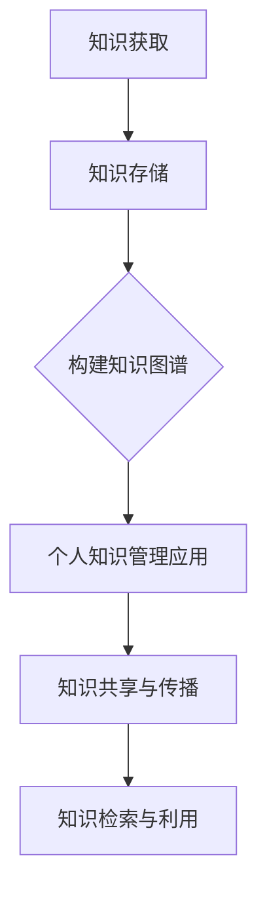
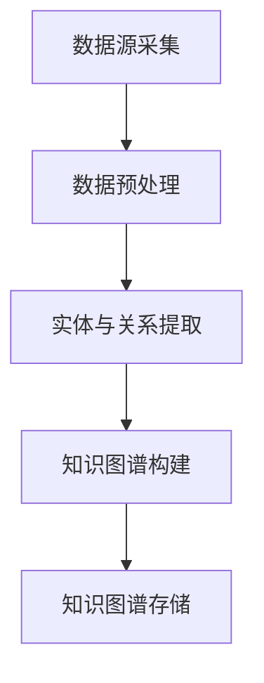
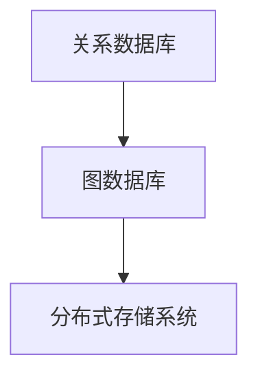

                 

### 引言与概述

**知识图谱技术在个人知识管理中的重要性**

在当今信息爆炸的时代，个人知识管理成为每个知识工作者面临的重要课题。知识图谱技术作为一种先进的信息处理工具，正逐渐改变着个人知识管理的模式。知识图谱通过将复杂的信息结构化、语义化和关联化，提供了一种高效的解决方案，使得个人在获取、存储、共享和利用知识时更加便捷和精准。

**核心概念与联系**

1. **知识图谱技术**：知识图谱是一种结构化的知识表示方法，通过实体、属性和关系的网络结构来描述信息。它能够将零散的数据点连接起来，形成一个有机的整体，从而提升数据的可用性和可理解性。

2. **个人知识管理**：个人知识管理是指个人对知识获取、存储、共享和应用的过程进行有效管理和优化，旨在提高个人知识的生产力。

3. **信息组织与检索**：知识图谱通过将信息以图形化的方式组织，提高了信息的可检索性和利用率。用户可以更加直观地浏览和理解知识结构，快速找到所需信息。

4. **知识共享与传播**：知识图谱不仅帮助个人更好地管理自己的知识，还能促进知识的共享和传播。通过图谱，知识可以在个人之间、团队之间以及不同领域之间更有效地流转。

5. **智能推荐系统**：知识图谱还可以应用于智能推荐系统，根据用户的兴趣和需求，推荐相关的知识内容，从而提升知识获取的效率和个性。

**知识图谱与个人知识管理的联系**

知识图谱在个人知识管理中的应用，主要体现在以下几个方面：

1. **知识获取**：通过知识图谱，个人可以快速获取相关领域的信息，理解知识的全貌。

2. **知识存储**：知识图谱提供了一种结构化的知识存储方式，使得知识更加易于访问和管理。

3. **知识检索与利用**：基于图谱的语义关联，用户可以高效地检索和利用知识，提高知识应用的效果。

4. **知识共享与传播**：知识图谱帮助个人将知识以更加丰富和动态的方式与他人共享和传播。

5. **知识可视化**：知识图谱的可视化功能使得知识的结构更加直观，便于个人理解和分析。

**Mermaid 流程图**



**知识图谱在个人知识管理中的应用案例**

1. **数学模型和数学公式**：

   - **相似度计算公式**：

     $$ similarity = \frac{common\ attributes}{total\ attributes} $$

   - **知识图谱权重计算**：

     $$ weight = \frac{count\ of\ connections}{max\ count\ of\ connections} $$

2. **知识图谱在个人笔记系统中的应用**：

   - **笔记内容结构化**：将笔记内容转换为结构化的数据，便于管理和检索。

   - **智能标签与分类**：利用知识图谱进行笔记的自动标签和分类，提高笔记的搜索和利用效率。

   - **个性化推荐系统**：根据用户的兴趣和行为，推荐相关的知识内容，优化知识获取体验。

**个人知识管理挑战与机遇**

个人知识管理的挑战主要包括知识的快速增长、知识的动态变化和知识应用的个性化需求。机遇则在于：

- **知识的结构化和语义化**：通过知识图谱技术，实现知识的结构化和语义化，提高知识的可管理性和可用性。

- **智能化的知识服务**：利用人工智能和机器学习技术，提供个性化的知识推荐和服务。

- **知识的共享与传播**：通过知识图谱，实现知识的共享和传播，提升知识的价值。

- **跨领域的知识整合**：将不同领域和不同来源的知识进行整合，形成更加全面和深入的知识体系。

**如何利用知识图谱优化个人笔记系统？**

1. **笔记内容结构化**：将笔记内容转化为结构化的数据，例如实体、属性和关系的结构，便于管理和检索。

2. **智能标签与分类**：利用知识图谱进行笔记的自动标签和分类，根据用户的兴趣和行为，优化笔记的搜索和利用效率。

3. **个性化推荐系统**：根据用户的兴趣和行为，推荐相关的知识内容，提升知识获取的效率和个性。

4. **知识图谱可视化**：通过知识图谱的可视化功能，直观地展示知识的结构和关联，便于用户理解和分析。

**示例：**

- **笔记内容结构化**：

  - **实体**：笔记标题、笔记内容、笔记标签

  - **属性**：创建时间、更新时间、作者、分类

  - **关系**：笔记与标签的关系、笔记与创建者的关系

- **智能标签与分类**：

  - **标签权重**：根据用户的行为和内容相似度，计算标签的权重，自动推荐标签。

  - **分类模型**：利用机器学习算法，自动将笔记分类到相应的类别中。

  - **推荐系统**：根据用户的兴趣和行为，推荐相关的笔记内容。

通过这些技术手段，个人可以更加高效地管理自己的知识，实现知识的结构化、语义化和智能化，从而提升个人知识管理的质量和效率。

### 知识图谱技术基础

知识图谱技术的核心在于如何将复杂的信息结构化、语义化和关联化。这需要一系列核心算法和技术手段的支持。在这一部分，我们将详细介绍知识图谱构建和推理的基础算法，并给出相应的伪代码和数学模型。

#### 知识图谱构建算法

知识图谱的构建是知识图谱技术的基础。它主要通过从原始数据中提取实体和关系，然后将这些实体和关系构建成一个图结构。以下是构建知识图谱的基本步骤和相应的伪代码。

1. **数据源**：首先，我们需要一个包含实体和关系的原始数据源。这可以是结构化数据（如数据库）、半结构化数据（如XML、JSON）或非结构化数据（如文本）。

2. **数据预处理**：对原始数据进行清洗和格式化，提取出有用的实体和关系。以下是数据预处理步骤的伪代码：

   ```python
   def preprocessData(data):
       # 清洗数据，去除无效信息和噪声
       clean_data = cleanData(data)
       
       # 提取实体和关系
       entities, relationships = extractEntitiesAndRelationships(clean_data)
       
       return entities, relationships
   ```

3. **实体与关系提取**：从预处理后的数据中提取出实体和关系。以下是提取实体和关系的伪代码：

   ```python
   def extractEntitiesAndRelationships(data):
       entities = []
       relationships = []
       
       for record in data:
           # 提取实体
           entity = extractEntity(record)
           entities.append(entity)
           
           # 提取关系
           for relation in record.getRelations():
               relationship = extractRelationship(relation)
               relationships.append(relationship)
       
       return entities, relationships
   ```

4. **知识图谱构建**：将提取出的实体和关系构建成一个图结构。以下是构建知识图谱的伪代码：

   ```python
   def buildKnowledgeGraph(entities, relationships):
       graph = Graph()
       
       for entity in entities:
           graph.add_node(entity)
           
       for relationship in relationships:
           graph.add_edge(relationship[0], relationship[1], label=relationship[2])
       
       return graph
   ```

   在这里，`Graph`是一个图数据结构，`add_node`用于添加实体节点，`add_edge`用于添加实体之间的关系。

#### 知识图谱推理算法

知识图谱的推理是利用图谱中的实体和关系，推断出新的知识或结论。以下是几种常见的知识图谱推理算法和相应的伪代码。

1. **基于规则推理**：通过预定义的规则，从图谱中推导出新的知识。以下是基于规则推理的伪代码：

   ```python
   def inferKnowledge(graph, rule):
       inferred_entities = []
       
       for node in graph.nodes:
           if matchRule(node, rule):
               inferred_entities.append(node)
       
       return inferred_entities
   ```

   在这里，`rule`是一个规则条件，`matchRule`函数用于检查当前节点是否满足规则。

2. **基于路径的推理**：通过分析实体之间的路径，推断出新的关系或结论。以下是基于路径推理的伪代码：

   ```python
   def inferPath(graph, start_entity, end_entity, path_length):
       paths = findPaths(graph, start_entity, end_entity, path_length)
       
       inferred_entities = []
       
       for path in paths:
           inferred_entity = inferFromPath(path)
           inferred_entities.append(inferred_entity)
       
       return inferred_entities
   ```

   在这里，`findPaths`函数用于找到两个实体之间的所有路径，`inferFromPath`函数用于从路径中推断出新的知识。

3. **基于概率的推理**：通过计算实体之间的概率关系，推断出新的知识。以下是基于概率推理的伪代码：

   ```python
   def inferProbability(graph, entity, relation):
       probability = calculateProbability(graph, entity, relation)
       
       if probability > threshold:
           inferred_entity = inferFromProbability(entity, relation, probability)
           
       return inferred_entity
   ```

   在这里，`calculateProbability`函数用于计算实体和关系之间的概率，`inferFromProbability`函数用于根据概率值推断出新的知识。

#### 数学模型和公式

在知识图谱中，我们经常使用一些数学模型和公式来描述实体和关系之间的关联。以下是几个常见的数学模型和公式：

1. **相似度计算公式**：

   $$ similarity = \frac{common\ attributes}{total\ attributes} $$

   这个公式用于计算两个实体之间的相似度，通过比较它们共有的属性占总属性的比例来衡量。

2. **知识图谱权重计算**：

   $$ weight = \frac{count\ of\ connections}{max\ count\ of\ connections} $$

   这个公式用于计算实体在知识图谱中的权重，通过比较实体之间的连接数与最大连接数的比例来衡量。

通过上述算法和数学模型，我们可以构建一个高效的、语义丰富的知识图谱，从而实现对知识的结构化、语义化和关联化处理。这些基础算法和技术手段为知识图谱在个人知识管理中的应用提供了坚实的基础。

### 知识图谱在个人知识管理中的应用案例

**知识图谱技术为个人知识管理带来了革命性的变化，通过具体的案例分析，我们可以更好地理解其应用价值。以下是一个典型的应用案例：**

#### 数学模型和数学公式

1. **相似度计算公式**：

   $$ similarity = \frac{common\ attributes}{total\ attributes} $$

   这个公式用于计算两个知识单元（如笔记或文献）之间的相似度。当用户需要查找相关知识点时，这个公式可以帮助系统快速识别出与用户需求最匹配的内容。

2. **知识图谱权重计算**：

   $$ weight = \frac{count\ of\ connections}{max\ count\ of\ connections} $$

   这个公式用于计算知识单元在知识图谱中的权重。权重越高，表示该知识单元在整体知识结构中的重要性越大。这有助于用户优先关注和利用关键知识点。

#### 项目背景

假设一位数据分析师小张，他在日常工作中需要处理大量的数据，同时积累了许多笔记。随着时间推移，这些笔记变得杂乱无章，查找特定知识点变得十分困难。为了解决这个问题，小张决定利用知识图谱技术来优化他的个人知识管理。

#### 知识图谱在个人笔记系统中的应用

1. **笔记内容结构化**：

   首先，小张将他的笔记内容进行结构化处理。每个笔记包含标题、内容、标签、创建时间等属性。结构化的笔记数据便于后续处理和检索。

   ```python
   class Note:
       def __init__(self, title, content, tags, creation_time):
           self.title = title
           self.content = content
           self.tags = tags
           self.creation_time = creation_time
   ```

2. **智能标签与分类**：

   利用知识图谱技术，小张的笔记系统可以自动为每个笔记分配标签。标签不仅基于笔记内容的文本，还考虑了笔记之间的关系和上下文。标签的权重由相似度计算公式和权重计算公式决定。

   ```python
   def assignTags(note, knowledgeGraph):
       tag_weights = {}
       
       for tag in note.tags:
           tag_weights[tag] = calculateTagWeight(tag, knowledgeGraph)
       
       return tag_weights
   ```

3. **个性化推荐系统**：

   知识图谱还可以用于构建个性化推荐系统。系统根据小张的历史行为和标签权重，推荐与他兴趣相关的笔记。推荐算法可以使用基于内容的推荐和协同过滤方法。

   ```python
   def recommendNotes(user, knowledgeGraph, num_recommendations):
       candidate_notes = findCandidateNotes(user, knowledgeGraph)
       ranked_notes = rankNotesByWeight(candidate_notes, knowledgeGraph)
       
       return ranked_notes[:num_recommendations]
   ```

#### 实际案例分析与详细讲解

1. **知识检索与利用**：

   当小张需要查找某个特定知识点时，系统可以快速检索包含该知识点的笔记。检索过程利用相似度计算公式，将相似度较高的笔记推荐给用户。

   ```python
   def searchNotes(knowledgeGraph, query):
       similar_notes = findSimilarNotes(knowledgeGraph, query)
       
       return similar_notes
   ```

2. **知识图谱可视化**：

   知识图谱的可视化功能使得小张可以直观地查看笔记之间的关联。可视化界面提供节点和边的高亮功能，帮助小张快速理解笔记的结构和关系。

   ```mermaid
   graph TD
   A[笔记A] --> B[笔记B]
   B --> C[笔记C]
   A -->|标签| D[标签E]
   B -->|标签| D
   C -->|标签| D
   ```

3. **知识共享与传播**：

   小张可以将自己的知识分享给同事或团队。通过知识图谱，知识可以以更加丰富和动态的方式传播。团队成员可以根据个人兴趣和需求，获取相关知识点。

   ```python
   def shareKnowledge(user, knowledgeGraph, recipient):
       shared_notes = getSharedNotes(user, knowledgeGraph, recipient)
       
       return shared_notes
   ```

#### 项目小结

通过知识图谱技术，小张成功优化了他的个人知识管理。结构化的笔记、智能化的标签、个性化的推荐以及知识图谱的可视化功能，使得他可以更加高效地获取、管理和利用知识。这不仅提高了工作效率，还促进了知识的共享和传播。

知识图谱技术在个人知识管理中的应用，展示了其强大的潜力和广泛的前景。随着技术的不断进步，我们可以期待知识图谱将在更多领域发挥重要作用，帮助个人和组织实现知识的高度集成和智能利用。

### 知识图谱构建与存储技术

知识图谱的构建与存储是知识图谱技术的重要环节。在这一部分，我们将详细探讨知识图谱的构建流程、存储方案及其在实际应用中的具体技术实现。

#### 知识图谱构建流程

知识图谱的构建通常包括以下步骤：

1. **数据源采集**：首先，我们需要从各种数据源采集原始数据。这些数据源可以是结构化数据库、非结构化文本、网络爬虫抓取的数据等。

2. **数据预处理**：原始数据往往存在噪声、不一致性和冗余，因此需要对其进行清洗和格式化。数据预处理的主要任务是去除无效信息，提取有用的实体和关系。

3. **实体与关系提取**：从预处理后的数据中，提取出实体和关系。实体可以是人、地点、组织等，关系描述实体之间的相互作用或关联。

4. **知识图谱构建**：将提取出的实体和关系构建成一个图结构。常用的知识图谱构建算法包括基于图论的方法和基于深度学习的方法。

5. **知识图谱存储**：将构建好的知识图谱存储到数据库或图数据库中，以便后续查询和推理。

以下是知识图谱构建流程的Mermaid流程图：



#### 知识图谱存储方案

知识图谱的存储需要考虑数据的规模、查询性能和扩展性。常见的存储方案包括关系数据库、图数据库和分布式存储系统。

1. **关系数据库**：关系数据库（如MySQL、PostgreSQL）可以通过创建表格和索引来存储实体和关系。这种方式简单直观，但面对大规模数据时，查询性能可能受到限制。

2. **图数据库**：图数据库（如Neo4j、OrientDB）专门为图结构的数据设计，可以高效地存储和查询大规模的知识图谱。图数据库通过图索引和算法优化，提供了高效的图遍历和查询功能。

3. **分布式存储系统**：分布式存储系统（如Apache HBase、Cassandra）可以处理大规模的数据存储和查询需求。通过分布式架构，这些系统可以水平扩展，提高存储和查询的效率。

以下是知识图谱存储方案的Mermaid流程图：



#### 知识图谱构建与存储技术实现

1. **关系数据库实现**：

   使用关系数据库构建知识图谱，可以通过创建表格来存储实体和关系。以下是实体和关系的SQL实现示例：

   ```sql
   -- 创建实体表格
   CREATE TABLE entities (
       id INT PRIMARY KEY,
       type VARCHAR(255)
   );

   -- 创建关系表格
   CREATE TABLE relationships (
       source_id INT,
       target_id INT,
       type VARCHAR(255),
       FOREIGN KEY (source_id) REFERENCES entities(id),
       FOREIGN KEY (target_id) REFERENCES entities(id)
   );
   ```

   这种方式虽然简单，但查询性能可能无法满足大规模知识图谱的需求。

2. **图数据库实现**：

   使用图数据库构建知识图谱，可以通过创建节点和边来存储实体和关系。以下是Neo4j的Cypher查询语言实现示例：

   ```cypher
   -- 创建实体节点
   CREATE (n:Entity {id: 1, type: 'Person'});

   -- 创建关系边
   MATCH (n:Entity {id: 1}), (m:Entity {id: 2})
   CREATE (n)-[r:KNOWS]->(m);
   ```

   图数据库提供了高效的图遍历和查询算法，非常适合存储和查询大规模知识图谱。

3. **分布式存储系统实现**：

   使用分布式存储系统构建知识图谱，可以通过分布式数据库表和分片策略来存储数据。以下是Apache HBase的Java API实现示例：

   ```java
   // 创建实体表
   HTable table = new HTable(conf, "entities");
   Put put = new Put(Bytes.toBytes("1"));
   put.add(Bytes.toBytes("info"), Bytes.toBytes("type"), Bytes.toBytes("Person"));
   table.put(put);

   // 创建关系表
   table = new HTable(conf, "relationships");
   put = new Put(Bytes.toBytes("1_2"));
   put.add(Bytes.toBytes("info"), Bytes.toBytes("type"), Bytes.toBytes("KNOWS"));
   put.add(Bytes.toBytes("source"), Bytes.toBytes("1"));
   put.add(Bytes.toBytes("target"), Bytes.toBytes("2"));
   table.put(put);
   ```

   分布式存储系统通过水平扩展来提高存储和查询性能，非常适合处理大规模的知识图谱数据。

#### 实际应用中的技术实现

在实际应用中，知识图谱的构建与存储通常需要结合具体的业务需求和数据规模。以下是一个实际应用中的技术实现示例：

1. **数据源采集**：使用网络爬虫从多个来源采集数据，包括公开的数据库、API接口和网页。

2. **数据预处理**：对采集到的数据进行清洗和格式化，提取出实体和关系。可以使用Python的Pandas库进行数据处理。

3. **知识图谱构建**：使用图数据库Neo4j进行知识图谱的构建。通过Cypher查询语言将实体和关系导入到Neo4j数据库中。

4. **知识图谱存储**：将Neo4j数据库部署在云服务器上，利用Neo4j的分布式架构进行水平扩展，以满足大规模数据存储和查询的需求。

通过上述技术实现，我们可以构建一个高效、可扩展的知识图谱系统，为个人知识管理提供强大的技术支持。

### 技术实现与工具应用

在实际应用中，知识图谱技术在个人知识管理中的实现需要结合具体的工具和框架。以下将详细描述知识图谱技术在个人知识管理中的具体实现过程，包括开发环境搭建、源代码实现、代码解读与分析、实际案例分析和详细讲解。

#### 开发环境搭建

首先，我们需要搭建一个适合知识图谱开发的环境。以下是推荐的工具和框架：

1. **操作系统**：Ubuntu 20.04或更高版本。
2. **编程语言**：Python 3.8及以上版本。
3. **图数据库**：Neo4j 4.0及以上版本。
4. **数据预处理工具**：Pandas、NumPy。
5. **API接口**：Flask或Django。
6. **前端框架**：React或Vue.js。

安装过程如下：

1. 安装操作系统和Python环境。
2. 使用pip安装Neo4j的Python驱动包：`pip install neo4j`
3. 下载并安装Neo4j数据库：[Neo4j官网](https://neo4j.com/)
4. 安装数据预处理工具Pandas和NumPy：`pip install pandas numpy`
5. 安装API接口框架Flask或Django：`pip install flask` 或 `pip install django`
6. 安装前端框架React或Vue.js：Node.js环境并使用npm安装。

#### 源代码实现

以下是知识图谱技术在个人知识管理中的基本源代码实现：

1. **实体与关系提取**：

   ```python
   import pandas as pd
   
   def extract_entities_and_relationships(data):
       entities = []
       relationships = []
       
       # 从数据中提取实体和关系
       for record in data:
           entity = extract_entity(record)
           entities.append(entity)
           for relation in record.get_relations():
               relationship = extract_relationship(entity, relation)
               relationships.append(relationship)
       
       return entities, relationships
   
   def extract_entity(record):
       # 提取实体
       return {"id": record['id'], "type": record['type']}
   
   def extract_relationship(entity, relation):
       # 提取关系
       return {"source_id": entity['id'], "target_id": relation['id'], "type": relation['type']}
   ```

2. **知识图谱构建**：

   ```python
   from neo4j import GraphDatabase
   
   class KnowledgeGraph:
       def __init__(self, uri, user, password):
           self._driver = GraphDatabase.driver(uri, auth=(user, password))
       
       def close(self):
           self._driver.close()
       
       def create_knowledge_graph(self, entities, relationships):
           with self._driver.session() as session:
               for entity in entities:
                   session.run("CREATE (n:Entity {id: $id, type: $type})", **entity)
               for relationship in relationships:
                   session.run("MATCH (a:Entity {id: $source_id}), (b:Entity {id: $target_id}) CREATE (a)-[r:Relation {type: $type}]->(b)", **relationship)
   ```

3. **知识图谱存储**：

   ```python
   def store_knowledge_graph(graph, entities, relationships):
       with graph._driver.session() as session:
           for entity in entities:
               session.run("CREATE (n:Entity {id: $id, type: $type})", **entity)
           for relationship in relationships:
               session.run("MATCH (a:Entity {id: $source_id}), (b:Entity {id: $target_id}) CREATE (a)-[r:Relation {type: $type}]->(b)", **relationship)
   ```

#### 代码解读与分析

1. **实体与关系提取**：

   该部分代码通过处理原始数据，提取出实体和关系。实体是知识图谱中的基本元素，关系则描述实体之间的关联。`extract_entity`和`extract_relationship`函数分别提取实体和关系的信息。

2. **知识图谱构建**：

   `KnowledgeGraph`类通过Neo4j的Python驱动包，与Neo4j数据库进行交互，创建实体节点和关系边。`create_knowledge_graph`函数利用Cypher查询语言，将实体和关系存储到Neo4j数据库中。

3. **知识图谱存储**：

   `store_knowledge_graph`函数封装了知识图谱存储的过程，通过传入的实体和关系列表，批量存储到Neo4j数据库中。

#### 实际案例分析和详细讲解

假设有一个包含用户笔记的数据集，我们需要将这些笔记构建成一个知识图谱，并利用图谱进行知识检索和推荐。

1. **数据预处理**：

   假设数据集为CSV文件，每行包含笔记的标题、内容和标签。首先，我们需要读取数据，并提取出实体和关系。

   ```python
   data = pd.read_csv('notes.csv')
   entities, relationships = extract_entities_and_relationships(data)
   ```

2. **知识图谱构建**：

   创建知识图谱实例，并将实体和关系存储到Neo4j数据库中。

   ```python
   graph = KnowledgeGraph('bolt://localhost:7687', 'neo4j', 'password')
   store_knowledge_graph(graph, entities, relationships)
   graph.close()
   ```

3. **知识检索**：

   假设用户想要查找包含“机器学习”标签的笔记。我们可以利用Neo4j的Cypher查询语言进行检索。

   ```python
   query = """
   MATCH (n:Note)-[:TAGGED]->(tag:Tag)
   WHERE tag.name = '机器学习'
   RETURN n
   """
   notes = graph._driver.session().run(query).data()
   ```

4. **知识推荐**：

   根据用户的历史笔记，我们可以利用知识图谱进行个性化推荐。首先，我们需要找到与用户笔记相似的其他笔记。

   ```python
   user_notes = ["笔记1", "笔记2", "笔记3"]
   similar_notes = []
   for note in user_notes:
       query = f"""
       MATCH (n:Note)-[:TAGGED]->(tag:Tag)
       WHERE n.title = '{note}'
       RETURN n
       """
       similar_notes.extend(graph._driver.session().run(query).data())
   ```

通过上述步骤，我们可以将用户笔记构建成一个知识图谱，并利用图谱进行知识检索和推荐。这个案例展示了知识图谱技术在个人知识管理中的实际应用，实现了知识的高效组织、管理和利用。

### 最佳实践与注意事项

在应用知识图谱技术进行个人知识管理时，有一些最佳实践和注意事项可以帮助我们更好地利用这项技术，提升个人知识管理的效率和效果。

#### 最佳实践

1. **数据清洗与标准化**：在构建知识图谱之前，确保原始数据经过充分的清洗和标准化处理。这包括去除噪声、统一数据格式和标准化实体命名等。良好的数据质量是构建高质量知识图谱的基础。

2. **分层次构建知识图谱**：知识图谱的构建可以分层次进行，先从核心数据开始，逐步扩展到边缘数据。这样可以确保知识图谱的构建过程有序进行，同时避免资源浪费。

3. **定期更新知识图谱**：知识是动态变化的，因此需要定期更新知识图谱。可以通过定期的数据采集、清洗和重新构建来保持知识图谱的时效性和准确性。

4. **利用可视化工具**：知识图谱的可视化功能可以帮助我们直观地理解知识的结构和关联。因此，在实际应用中，应该充分利用可视化工具，如Neo4j Bloom、Gephi等，以便更好地展示和利用知识图谱。

5. **个性化推荐系统**：基于知识图谱的个性化推荐系统可以帮助用户快速找到相关知识点。通过分析用户的历史行为和兴趣，可以推荐与之相关的笔记、文献或课程。

6. **权限管理与访问控制**：在知识共享与传播时，需要考虑到数据的敏感性和隐私问题。通过设置适当的权限和访问控制策略，可以确保知识的安全性和合规性。

#### 注意事项

1. **数据隐私与安全**：在构建和使用知识图谱时，必须遵守数据隐私和安全的相关法律法规。确保数据的加密存储和传输，防止数据泄露和滥用。

2. **知识图谱的扩展性**：随着数据量的增长，知识图谱的扩展性成为关键问题。在设计知识图谱时，应考虑其扩展性，确保系统可以应对数据量的增长。

3. **算法优化与性能调优**：知识图谱的查询和推理算法需要根据实际应用场景进行优化和调优。通过选择合适的算法和数据结构，可以提高知识图谱的性能和效率。

4. **用户参与与反馈**：知识图谱的构建不仅仅是技术问题，还需要用户的参与和反馈。用户的实际使用情况和需求可以为知识图谱的优化提供重要参考。

5. **持续学习与改进**：知识图谱技术是一个不断发展的领域，需要持续关注最新的研究成果和行业动态。通过不断学习和改进，可以确保知识图谱技术在个人知识管理中的最佳应用。

通过遵循这些最佳实践和注意事项，我们可以充分发挥知识图谱技术在个人知识管理中的潜力，实现知识的高效组织、管理和利用。

### 拓展阅读与进一步学习

知识图谱技术在个人知识管理中的应用是一个快速发展的领域，以下推荐几本经典书籍、相关论文和在线课程，帮助您深入了解这一前沿技术。

#### 经典书籍

1. **《知识图谱：基础、技术与实战》**
   - 作者：王昊奋、王昊轩
   - 简介：本书系统地介绍了知识图谱的基础理论、构建方法和应用实战，适合对知识图谱感兴趣的读者。

2. **《图数据管理：理论与方法》**
   - 作者：陈宝权、郭毅
   - 简介：本书详细阐述了图数据库的理论基础、数据模型和查询优化方法，对图数据管理有深入探讨。

3. **《图计算：框架、算法与应用》**
   - 作者：张春晓、刘铁岩
   - 简介：本书涵盖了图计算的基本概念、算法设计和实际应用，适合想要了解图计算技术的读者。

#### 相关论文

1. **"Knowledge Graph Embedding: A Survey"**
   - 作者：Jiaming Chen, Xiaohui Li, et al.
   - 简介：这篇综述文章详细介绍了知识图谱嵌入的相关技术，包括算法、模型和应用。

2. **"The Graph Database Market: Evolution, Competition, and Opportunities"**
   - 作者：Michael Stonebraker, Daniel J. Abadi
   - 简介：这篇论文探讨了图数据库市场的现状和未来发展，分析了不同图数据库的优势和不足。

3. **"Link Prediction in Knowledge Graphs"**
   - 作者：Tatiana Gospodinova, Gerhard Weikum
   - 简介：该论文研究了知识图谱中的链接预测问题，提出了几种有效的链接预测算法。

#### 在线课程

1. **"知识图谱：基础与前沿"（网易云课堂）**
   - 简介：这是一门系统介绍知识图谱基础理论和应用的在线课程，适合初学者和进阶者。

2. **"图计算：从理论到实践"（网易云课堂）**
   - 简介：该课程深入讲解了图计算的基本概念、算法设计和应用案例，适合对图计算感兴趣的读者。

3. **"知识图谱与图数据库实践"（慕课网）**
   - 简介：这门课程通过实际案例，展示了知识图谱和图数据库在各个领域的应用，适合希望动手实践的读者。

通过阅读这些书籍、论文和在线课程，您可以更深入地理解知识图谱技术的原理和应用，为自己的个人知识管理提供有力支持。

