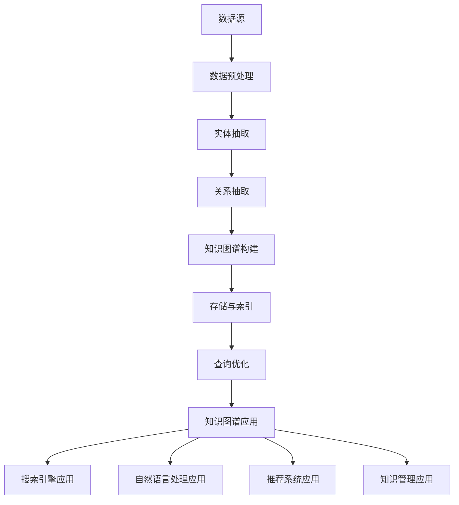
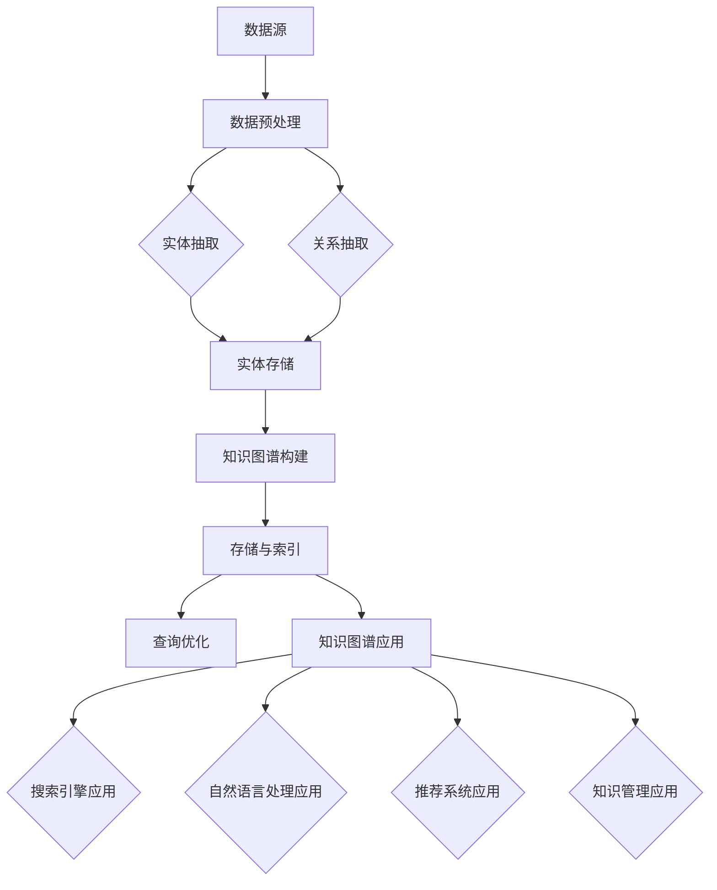

                 

### 文章标题

## 《知识图谱：构建人类智慧的数字地图》

### 关键词

- 知识图谱
- 数据挖掘
- 语义网络
- 实体关系抽取
- 查询优化

### 摘要

本文将深入探讨知识图谱这一前沿技术，分析其在现代信息技术中的应用与价值。通过概述知识图谱的基础理论、构建方法、存储索引技术，以及其在搜索引擎、自然语言处理、推荐系统和知识管理中的具体应用，本文旨在为读者提供一份全面的技术指南。此外，文章还将通过数学模型和实际案例，详细讲解知识图谱的核心算法原理，并分享知识图谱构建与优化的最佳实践。最后，本文将总结知识图谱的发展趋势，为未来研究与实践提供方向。

---

# 《知识图谱：构建人类智慧的数字地图》目录大纲

## 第一部分：知识图谱的基础理论

### 第1章：知识图谱的概述

#### 1.1 知识图谱的定义与重要性

#### 1.2 知识图谱的历史与发展

#### 1.3 知识图谱的基本概念

### 第2章：知识图谱的构建

#### 2.1 知识图谱的构建流程

#### 2.2 数据源选择与数据预处理

#### 2.3 实体与关系的抽取

### 第3章：知识图谱的存储与索引

#### 3.1 知识图谱的存储架构

#### 3.2 知识图谱的索引技术

#### 3.3 知识图谱的查询优化

## 第二部分：知识图谱的应用

### 第4章：知识图谱在搜索引擎中的应用

#### 4.1 搜索引擎中的知识图谱应用场景

#### 4.2 知识图谱驱动的搜索引擎设计

#### 4.3 实例分析：百度知识图谱搜索引擎

### 第5章：知识图谱在自然语言处理中的应用

#### 5.1 知识图谱与自然语言处理的融合

#### 5.2 知识图谱在问答系统中的应用

#### 5.3 实例分析：基于知识图谱的问答系统

### 第6章：知识图谱在推荐系统中的应用

#### 6.1 知识图谱在推荐系统中的作用

#### 6.2 基于知识图谱的协同过滤推荐算法

#### 6.3 实例分析：基于知识图谱的电商推荐系统

### 第7章：知识图谱在知识管理中的应用

#### 7.1 知识图谱在知识管理中的作用

#### 7.2 知识图谱在企业知识管理中的应用

#### 7.3 实例分析：企业知识图谱管理系统

## 第三部分：知识图谱的构建与优化

### 第8章：知识图谱构建工具与框架

#### 8.1 知识图谱构建工具概述

#### 8.2 常见知识图谱构建框架

#### 8.3 知识图谱构建工具的选用与配置

### 第9章：知识图谱的优化与性能提升

#### 9.1 知识图谱优化的方法

#### 9.2 知识图谱的查询性能优化

#### 9.3 实例分析：知识图谱优化实践

### 第10章：知识图谱的持续更新与维护

#### 10.1 知识图谱更新策略

#### 10.2 知识图谱的维护与优化

#### 10.3 实例分析：知识图谱的持续更新实践

## 附录

### 附录A：知识图谱相关开源工具与资源

#### A.1 开源知识图谱工具汇总

#### A.2 知识图谱开源项目推荐

#### A.3 知识图谱研究社区与资源链接

---

## 绘制知识图谱的 Mermaid 流程图



### 第1章：知识图谱的概述

#### 1.1 知识图谱的定义与重要性

知识图谱（Knowledge Graph）是一种结构化数据模型，用于表示实体与实体之间的关系。它类似于网络结构，其中每个节点表示一个实体，每条边表示实体之间的某种关系。知识图谱的核心在于通过捕捉和描述现实世界中的对象及其相互关系，构建一个语义丰富、层次分明的知识体系。

知识图谱的重要性体现在多个方面：

1. **信息检索与搜索引擎**：通过知识图谱，搜索引擎可以更好地理解用户查询的含义，提供更精确的搜索结果。
2. **自然语言处理**：知识图谱为自然语言处理提供了丰富的背景知识，有助于提高文本理解和生成能力。
3. **推荐系统**：知识图谱可以揭示实体之间的关联，为推荐系统提供更多的上下文信息，提高推荐质量。
4. **知识管理**：知识图谱有助于企业对内部知识进行结构化管理和共享，提升知识利用效率。

#### 1.2 知识图谱的历史与发展

知识图谱的概念最早由Google在2012年提出，当时Google利用知识图谱来改进其搜索引擎，提供更准确的搜索结果。此后，知识图谱技术迅速发展，在多个领域得到广泛应用。

- **2001年**：Google的PageRank算法首次引入链接分析思想，为知识图谱的初步形成奠定了基础。
- **2012年**：Google推出知识图谱，正式将语义关系引入搜索引擎。
- **2013年**：Facebook发布Open Graph，将知识图谱应用于社交媒体领域。
- **2014年**：阿里巴巴推出阿里巴巴知识图谱，应用于电子商务和社交媒体。

随着人工智能和大数据技术的进步，知识图谱的应用场景和规模不断扩大，成为当前信息技术领域的重要研究方向。

#### 1.3 知识图谱的基本概念

知识图谱由以下几个基本概念构成：

1. **实体（Entity）**：知识图谱中的基本元素，表示现实世界中的对象，如人、地点、组织、物品等。
2. **属性（Attribute）**：描述实体的特征，如人的年龄、地点的经纬度、物品的价格等。
3. **关系（Relation）**：表示实体之间的关联，如朋友关系、隶属关系、购买关系等。
4. **边（Edge）**：知识图谱中的边表示实体之间的关系，通常包含方向和权重信息。

知识图谱的结构可以表示为：实体-属性-关系-实体，形成一个复杂的网络结构，通过这种结构，知识图谱可以捕捉现实世界中的复杂关系和知识。

### 第2章：知识图谱的构建

#### 2.1 知识图谱的构建流程

知识图谱的构建是一个复杂的过程，通常包括以下几个阶段：

1. **数据源选择**：确定用于构建知识图谱的数据来源，包括结构化数据、非结构化数据和半结构化数据。
2. **数据预处理**：对采集到的数据进行清洗、格式化和标准化处理，确保数据质量。
3. **实体抽取**：从原始数据中识别出实体，并将其转换为知识图谱中的节点。
4. **关系抽取**：分析实体之间的语义关系，将其转换为知识图谱中的边。
5. **知识图谱构建**：将抽取的实体和关系整合到知识图谱中，形成一个结构化的知识网络。
6. **存储与索引**：将知识图谱存储到数据库或图数据库中，并建立索引以优化查询性能。

#### 2.2 数据源选择与数据预处理

数据源选择是知识图谱构建的第一步，选择合适的数据源对知识图谱的质量和实用性至关重要。常见的数据源包括：

1. **结构化数据**：如关系数据库、数据仓库等，提供丰富的实体和关系信息。
2. **非结构化数据**：如文本、图片、音频和视频等，通过自然语言处理和计算机视觉技术可以提取出实体和关系。
3. **半结构化数据**：如XML、JSON等，需要通过解析和处理提取实体和关系。

数据预处理是知识图谱构建的关键步骤，主要包括以下任务：

1. **数据清洗**：去除重复、错误和无关的数据，确保数据的一致性和准确性。
2. **数据标准化**：统一数据格式和命名规则，以便于后续处理和整合。
3. **数据增强**：通过补充缺失信息、扩展数据范围等方式，提高数据的质量和丰富度。

#### 2.3 实体与关系的抽取

实体抽取（Entity Extraction）是从非结构化或半结构化数据中识别出实体并标注其类型的过程。常见的实体类型包括人、地点、组织、物品、事件等。实体抽取的方法主要包括基于规则的方法、基于统计的方法和基于深度学习的方法。

1. **基于规则的方法**：利用预定义的规则和模式匹配技术，从文本中识别实体。这种方法简单高效，但规则难以覆盖所有情况。
2. **基于统计的方法**：利用统计学习模型，如朴素贝叶斯、支持向量机等，从大量标注数据中学习实体识别模型。这种方法可以处理复杂的实体识别任务，但需要大量的标注数据。
3. **基于深度学习的方法**：利用神经网络模型，如卷积神经网络（CNN）和循环神经网络（RNN），从原始文本中直接学习实体识别特征。这种方法具有强大的表达能力和泛化能力，但需要大量的训练数据和计算资源。

关系抽取（Relation Extraction）是从文本中识别出实体之间的语义关系并标注其类型的过程。关系抽取的方法主要包括基于规则的方法、基于统计的方法和基于深度学习的方法。

1. **基于规则的方法**：利用预定义的规则和模式匹配技术，从文本中识别关系。这种方法简单高效，但规则难以覆盖所有情况。
2. **基于统计的方法**：利用统计学习模型，如朴素贝叶斯、支持向量机等，从大量标注数据中学习关系抽取模型。这种方法可以处理复杂的关系抽取任务，但需要大量的标注数据。
3. **基于深度学习的方法**：利用神经网络模型，如卷积神经网络（CNN）和循环神经网络（RNN），从原始文本中直接学习关系抽取特征。这种方法具有强大的表达能力和泛化能力，但需要大量的训练数据和计算资源。

### 第3章：知识图谱的存储与索引

#### 3.1 知识图谱的存储架构

知识图谱的存储架构设计是确保其性能和可扩展性的关键。常见的存储架构包括：

1. **图数据库**：图数据库（如Neo4j、JanusGraph）专门为图结构数据设计，能够高效地存储和查询大规模知识图谱。图数据库通过节点（实体）、边（关系）和属性（特征）的存储，实现了对复杂关系网络的优化存储和快速查询。
   
2. **关系数据库**：关系数据库（如MySQL、PostgreSQL）通过表和关系（外键）来存储数据。虽然关系数据库不适合存储复杂的图结构，但可以通过建立多表连接和索引来实现知识图谱的存储和查询。

3. **分布式文件系统**：如Hadoop的HDFS和Apache Cassandra等，适用于存储大规模非结构化数据。这些系统通过分布式文件和存储机制，提供了高可用性和高扩展性，但需要对数据进行额外的处理以支持图查询。

#### 3.2 知识图谱的索引技术

知识图谱的索引技术是提高查询性能的重要手段。常见的索引技术包括：

1. **B+树索引**：适用于关系数据库，通过多级索引结构实现快速数据检索。B+树索引可以有效地支持范围查询和点查询，但在处理复杂图查询时效率较低。

2. **哈希索引**：通过哈希函数将数据映射到索引结构中，适用于快速键值查询。哈希索引在查询速度上具有优势，但不易支持范围查询和多表连接。

3. **图索引**：专门为图数据库设计，通过图结构实现节点和边的高效索引。图索引可以支持复杂的图查询操作，如路径查询、子图查询等，但实现复杂度较高。

#### 3.3 知识图谱的查询优化

知识图谱的查询优化目标是提高查询效率和响应时间。常见的查询优化方法包括：

1. **查询重写**：通过将原始查询重写为更高效的查询形式，如将多表连接转换为单表查询，从而减少查询执行时间。

2. **索引优化**：根据查询模式为特定属性建立索引，提高查询效率。索引优化可以显著减少查询扫描的数据量，但会增加存储开销和维护成本。

3. **缓存技术**：通过缓存查询结果，减少对底层存储系统的访问次数，从而提高查询性能。缓存技术适用于高频次、低变化率的查询场景。

4. **分布式查询**：将查询任务分布到多个节点上并行执行，通过汇总结果来提高查询效率。分布式查询适用于大规模分布式系统，但需要解决数据一致性和负载均衡等问题。

### 第4章：知识图谱在搜索引擎中的应用

#### 4.1 搜索引擎中的知识图谱应用场景

知识图谱在搜索引擎中的应用场景广泛，可以显著提升搜索体验和效果。以下是一些常见的应用场景：

1. **精确搜索**：知识图谱可以提供精确的实体识别和关系描述，帮助搜索引擎更准确地理解用户查询意图。例如，当用户输入“北京天气”时，搜索引擎可以识别出“北京”和“天气”两个实体，并提供相关的天气信息。

2. **上下文搜索**：知识图谱中的实体和关系可以提供上下文信息，帮助搜索引擎生成更相关的搜索结果。例如，当用户输入“故宫”时，搜索引擎可以利用知识图谱中的关系信息，推荐与“故宫”相关的历史、文化、景点等信息。

3. **智能问答**：知识图谱可以支持智能问答系统，通过理解用户的问题和知识图谱中的实体、关系，提供准确的答案。例如，当用户输入“美国总统是谁？”时，搜索引擎可以基于知识图谱提供准确的答案。

4. **个性化搜索**：知识图谱可以根据用户的兴趣和行为，生成个性化的搜索结果。例如，当用户搜索“书籍”时，搜索引擎可以根据用户的历史行为和兴趣，推荐与用户相关的书籍和作者。

5. **实体推荐**：知识图谱可以揭示实体之间的关联，用于推荐相关的实体。例如，当用户搜索“苹果”时，搜索引擎可以利用知识图谱推荐与“苹果”相关的实体，如水果、品牌、型号等。

#### 4.2 知识图谱驱动的搜索引擎设计

知识图谱驱动的搜索引擎设计需要考虑以下几个方面：

1. **知识图谱构建**：首先需要构建一个全面、准确的领域知识图谱，包括实体、关系和属性信息。这通常涉及数据采集、数据清洗、实体抽取、关系抽取等步骤。

2. **查询处理**：搜索引擎需要能够理解用户的查询意图，并将查询转换为知识图谱中的节点和边。这通常需要自然语言处理技术，如分词、词性标注、实体识别、关系抽取等。

3. **查询优化**：为了提高查询效率，需要对查询进行优化。这包括查询重写、索引优化、缓存技术等。查询优化可以减少查询执行时间，提高用户体验。

4. **结果生成**：根据查询结果和用户意图，生成相应的搜索结果。这通常需要将知识图谱中的信息进行整合、筛选和排序，以提供最相关的信息。

5. **用户交互**：搜索引擎需要提供友好的用户界面，使用户能够轻松地进行搜索、浏览和交互。用户交互设计应考虑用户体验、易用性和个性化推荐等因素。

#### 4.3 实例分析：百度知识图谱搜索引擎

百度是知识图谱技术应用的领先者之一，其搜索引擎在多个方面利用了知识图谱技术，提供了高质量的搜索体验。以下是对百度知识图谱搜索引擎的实例分析：

1. **知识图谱构建**：百度通过多种数据源，构建了覆盖广泛领域的大型知识图谱，包括人物、地点、组织、事件等实体，以及各种关系。这些数据来源包括百度百科、百度新闻、百度贴吧等。

2. **查询处理**：百度搜索引擎利用自然语言处理技术，对用户查询进行解析和语义分析，将其转换为知识图谱中的节点和边。例如，当用户输入“北京天气”时，搜索引擎可以识别出“北京”和“天气”两个实体，并查找它们之间的关联关系。

3. **查询优化**：百度搜索引擎采用了多种查询优化技术，如查询重写、索引优化、缓存技术等。例如，当用户输入“故宫”时，搜索引擎可以重写查询为“查找与故宫相关的信息”，从而更快地返回相关结果。

4. **结果生成**：百度搜索引擎根据查询结果和用户意图，生成个性化的搜索结果。例如，当用户输入“苹果”时，搜索引擎可以推荐与“苹果”相关的新闻、产品、品牌等信息。

5. **用户交互**：百度搜索引擎提供了直观、易用的用户界面，使用户能够轻松地进行搜索、浏览和交互。例如，用户可以通过点击相关标签、图片和链接，进一步探索与查询相关的信息。

总之，百度知识图谱搜索引擎通过利用知识图谱技术，提供了精确、智能、个性化的搜索体验，极大地提升了用户的搜索满意度。

### 第5章：知识图谱在自然语言处理中的应用

#### 5.1 知识图谱与自然语言处理的融合

知识图谱与自然语言处理（NLP）的融合是现代信息技术领域的重要研究方向，两者结合可以显著提升NLP系统的性能和实用性。知识图谱为NLP提供了丰富的背景知识和语义信息，而NLP则为知识图谱的构建和优化提供了有效的工具和方法。

1. **实体识别**：知识图谱中的实体识别功能可以与NLP技术相结合，利用NLP的文本解析能力，从大规模文本数据中识别出实体，并将其整合到知识图谱中。这有助于提高知识图谱的覆盖面和准确性。

2. **关系抽取**：NLP中的关系抽取技术可以帮助识别文本中实体之间的关系，并将其添加到知识图谱中。这有助于构建更加丰富和复杂的知识网络，增强知识图谱的表达能力。

3. **语义理解**：知识图谱可以提供丰富的上下文信息，帮助NLP系统更好地理解文本的语义。例如，当NLP系统遇到一个生僻词汇时，可以通过知识图谱查找相关的同义词、上下文关系等，从而提高语义理解的准确性。

4. **问答系统**：知识图谱驱动的问答系统可以通过理解用户的问题和知识图谱中的信息，提供准确的答案。这需要对NLP中的语言模型和知识图谱进行深度整合，实现语义理解和信息检索的有机结合。

#### 5.2 知识图谱在问答系统中的应用

知识图谱在问答系统中的应用可以显著提升系统的智能程度和回答的准确性。以下是一些具体应用场景：

1. **问题解析**：问答系统首先需要理解用户的问题，并将其解析为可操作的形式。知识图谱可以提供丰富的实体和关系信息，帮助问答系统更好地理解问题的含义和意图。

2. **信息检索**：基于知识图谱的信息检索技术可以帮助问答系统快速定位到相关的信息来源。例如，当用户询问“美国总统是谁？”时，问答系统可以通过知识图谱查找与“美国总统”相关的实体，并从数据库中检索出相应的答案。

3. **答案生成**：知识图谱可以为问答系统提供丰富的背景知识和语义信息，帮助系统生成更加准确和详细的答案。例如，当用户询问“苹果公司的创始人是谁？”时，问答系统不仅需要提供“史蒂夫·乔布斯”的名字，还可以进一步解释他的贡献和苹果公司的历史。

4. **多轮对话**：知识图谱驱动的问答系统可以支持多轮对话，通过持续理解用户的意图和反馈，提供更加个性化的服务。例如，当用户对初始答案不满意时，系统可以继续提问，以获取更多上下文信息，从而提供更准确的答案。

#### 5.3 实例分析：基于知识图谱的问答系统

以百度知识图谱问答系统为例，该系统通过整合海量数据和先进的人工智能技术，实现了对用户问题的准确理解和回答。以下是对其具体应用的分析：

1. **问题解析**：百度知识图谱问答系统首先利用自然语言处理技术，对用户问题进行分词、词性标注和命名实体识别，提取出关键信息。例如，当用户输入“北京的天安门是什么时候建立的？”时，系统可以识别出“北京”、“天安门”、“建立时间”等关键信息。

2. **信息检索**：基于知识图谱，问答系统可以快速定位到与用户问题相关的实体和关系。例如，系统可以查找知识图谱中关于“天安门”的信息，包括其建立时间、历史背景等。

3. **答案生成**：系统利用知识图谱中的信息和语义关系，生成详细的答案。例如，系统可以回答：“天安门始建于明朝永乐十八年（1420年），是中国古代皇宫的正门，也是中华人民共和国的象征。”

4. **多轮对话**：在用户对答案不满意时，问答系统可以继续提问，以获取更多上下文信息。例如，系统可以继续询问：“您还想了解关于天安门的哪些信息？”

通过以上实例分析，可以看出知识图谱在问答系统中的应用，不仅提高了答案的准确性和丰富度，还实现了与用户的自然交互，为用户提供更加智能的服务。

### 第6章：知识图谱在推荐系统中的应用

#### 6.1 知识图谱在推荐系统中的作用

知识图谱在推荐系统中发挥着重要作用，它通过揭示实体之间的关系，为推荐系统提供了丰富的上下文信息和关联关系，从而提高推荐的质量和个性化程度。以下是一些具体的应用：

1. **关联发现**：知识图谱可以揭示实体之间的各种关联关系，如物品之间的相似性、用户之间的相似性等。这些关联关系可以用于推荐系统的相似性计算，帮助系统找到与用户兴趣或物品属性相关的其他实体。

2. **上下文感知**：知识图谱中的实体和关系可以提供丰富的上下文信息，如地理位置、时间信息、领域知识等。这些上下文信息可以帮助推荐系统更好地理解用户的需求和环境，从而生成更加个性化的推荐结果。

3. **推荐策略优化**：知识图谱中的关系和属性可以用于优化推荐策略。例如，通过分析实体之间的因果关系，推荐系统可以更好地预测用户的未来行为，从而提供更加精准的推荐。

4. **推荐结果解释**：知识图谱可以帮助解释推荐结果的原因。例如，当用户收到一个推荐时，系统可以基于知识图谱中的关系和属性，向用户解释推荐的理由，从而提高用户的信任度和满意度。

#### 6.2 基于知识图谱的协同过滤推荐算法

协同过滤推荐算法是推荐系统中最常用的方法之一，它通过分析用户的历史行为和偏好，为用户推荐可能感兴趣的新物品。基于知识图谱的协同过滤推荐算法结合了知识图谱的关联关系和协同过滤的预测能力，实现了更高质量的推荐。

1. **基于项目的协同过滤**：传统的基于项目的协同过滤算法通过计算用户和项目之间的相似性来生成推荐列表。在知识图谱的辅助下，可以通过分析实体之间的关系，如“相似物品”、“品牌关联”等，来提高相似性计算的准确性和多样性。

2. **基于用户的协同过滤**：基于用户的协同过滤算法通过分析用户之间的相似性来生成推荐列表。知识图谱可以揭示用户之间的隐含关联，如“兴趣群体”、“地理位置”等，从而提高推荐的相关性。

3. **知识增强的协同过滤**：知识图谱中的属性和关系可以用于增强协同过滤算法的预测能力。例如，通过引入实体属性，可以更好地捕捉用户兴趣的多样性；通过分析实体关系，可以揭示用户未明确表达的兴趣点。

#### 6.3 实例分析：基于知识图谱的电商推荐系统

以下是对一个基于知识图谱的电商推荐系统的实例分析：

1. **用户建模**：系统首先通过用户的历史购买行为、浏览记录等数据，构建用户兴趣模型。在此基础上，知识图谱可以揭示用户的隐含兴趣，如“喜欢购买某种类型的商品”或“经常浏览特定品牌的商品”。

2. **物品建模**：系统通过商品的信息，如类别、品牌、价格等，构建物品特征模型。知识图谱可以揭示物品之间的关联关系，如“同类商品”、“品牌系列”等，从而提高特征模型的丰富度。

3. **推荐策略**：系统结合用户和物品的模型，通过知识图谱中的关系进行相似性计算，生成个性化推荐列表。例如，当用户浏览了某款手机时，系统可以推荐与该手机品牌相关的其他手机，或与用户历史购买记录相似的物品。

4. **推荐结果解释**：系统提供推荐结果解释功能，通过知识图谱中的关系和属性，向用户解释推荐的原因。例如，系统可以解释为什么推荐某款商品，是因为它与用户历史购买的同类商品相似，或者与用户喜欢的品牌相关。

通过以上实例分析，可以看出知识图谱在电商推荐系统中的应用，不仅提高了推荐的精准度和个性化程度，还为用户提供了一个更加智能和可解释的推荐体验。

### 第7章：知识图谱在知识管理中的应用

#### 7.1 知识图谱在知识管理中的作用

知识图谱在知识管理中扮演着关键角色，它通过结构化和语义化的方式，对企业的知识资源进行高效的组织和管理，从而提升知识的可发现性和利用率。以下是知识图谱在知识管理中的一些具体作用：

1. **知识结构化**：知识图谱将企业内部的各种知识资源，如文档、数据、报告、经验等，以结构化的方式表示出来。通过实体、属性和关系的建模，知识图谱可以将零散的知识点连接成一个有机的整体，从而实现知识的结构化和体系化。

2. **知识共享与协作**：知识图谱提供了一个统一的平台，使得企业内的各个部门和员工能够方便地共享和协作。通过知识图谱，员工可以快速找到相关的知识和资源，促进知识的传播和交流，提高协作效率。

3. **知识检索与发现**：知识图谱的语义丰富性使得知识检索变得更加智能化。通过知识图谱中的关系和属性，用户可以更加准确地描述其知识需求，系统可以基于图谱的语义匹配，快速找到相关的知识资源，提高知识检索的效率。

4. **知识质量监控**：知识图谱可以跟踪和监控知识的质量和更新状态。通过定义知识实体和关系的规范，企业可以确保知识的准确性和一致性。此外，知识图谱还可以自动识别陈旧或错误的知识，提醒知识管理者进行更新或删除。

5. **知识创新与优化**：知识图谱不仅记录现有的知识，还可以揭示知识之间的关系，为知识创新提供新的视角。通过分析知识图谱中的关联关系，企业可以发现新的知识点或优化现有的知识结构，促进知识的持续创新和优化。

#### 7.2 知识图谱在企业知识管理中的应用

知识图谱在企业知识管理中的应用非常广泛，以下是一些具体的应用场景：

1. **员工知识管理**：企业可以利用知识图谱来管理员工的个人知识和经验。通过建立员工的知识图谱，企业可以记录员工的专业技能、项目经验、培训记录等，以便于员工的知识共享和知识传承。

2. **产品知识管理**：企业可以利用知识图谱来管理产品相关的知识，包括产品规格、设计文档、测试报告、用户反馈等。通过知识图谱，企业可以实现对产品知识的结构化管理和快速检索，提高产品的质量和开发效率。

3. **客户知识管理**：企业可以利用知识图谱来管理客户的相关信息，包括客户历史交易记录、偏好、反馈等。通过知识图谱，企业可以更好地理解客户需求，提供个性化的服务，提升客户满意度和忠诚度。

4. **供应链知识管理**：企业可以利用知识图谱来管理供应链中的各种知识，包括供应商信息、采购订单、物流信息等。通过知识图谱，企业可以实现对供应链知识的全局监控和优化，提高供应链的效率和灵活性。

5. **知识库构建**：企业可以利用知识图谱来构建企业级的知识库，将各个部门的知识进行整合和标准化。通过知识图谱，企业可以实现对知识库的快速检索和动态更新，提供员工和企业决策者强有力的知识支持。

#### 7.3 实例分析：企业知识图谱管理系统

以下是一个企业知识图谱管理系统的实例分析：

1. **系统架构**：企业知识图谱管理系统由知识采集模块、知识处理模块、知识存储模块和知识应用模块组成。知识采集模块负责从企业内部的各种数据源中提取知识；知识处理模块负责对采集到的知识进行清洗、整合和建模；知识存储模块负责将结构化后的知识存储到知识图谱数据库中；知识应用模块负责提供知识检索、知识共享和知识分析等服务。

2. **知识采集**：系统通过自动化的数据采集工具，从企业的ERP系统、CRM系统、邮件系统、论坛等数据源中提取知识。例如，系统可以自动抓取员工的培训记录、项目报告和文档。

3. **知识处理**：系统利用自然语言处理和机器学习技术，对采集到的知识进行清洗、去重、分类和标注。例如，系统可以使用命名实体识别技术来识别出文档中的关键词和实体，并建立相应的实体和关系。

4. **知识存储**：系统将处理后的知识存储到知识图谱数据库中，如Neo4j。知识图谱数据库可以高效地存储和管理大规模的实体和关系，并提供快速的查询和检索功能。

5. **知识应用**：系统提供用户友好的界面，供员工进行知识检索和共享。例如，员工可以通过关键词搜索找到相关的知识文档；员工也可以将自己的知识贡献到知识库中，与他人共享。

6. **知识分析**：系统还提供知识分析功能，帮助企业发现知识中的潜在价值。例如，系统可以通过分析知识图谱中的关系，发现员工之间的协作模式；系统还可以通过分析知识库中的内容，识别出企业的知识盲点和改进方向。

通过以上实例分析，可以看出企业知识图谱管理系统通过结构化和语义化的知识管理，实现了企业知识的全面管理和高效利用，为企业的创新和发展提供了强有力的支持。

### 第8章：知识图谱构建工具与框架

#### 8.1 知识图谱构建工具概述

知识图谱构建工具是实现知识图谱自动化构建的重要手段，这些工具提供了从数据采集、数据清洗、实体抽取、关系抽取到知识图谱存储和查询的全流程支持。以下是几种常见的知识图谱构建工具：

1. **OpenKG**：OpenKG是一个开源的知识图谱构建工具，它提供了从数据源获取、数据清洗、实体抽取、关系抽取到知识图谱存储的一站式解决方案。OpenKG支持多种数据源，包括关系数据库、文本文件、网络API等，并且集成了多种数据预处理和图谱构建算法。

2. **Neo4j**：Neo4j是一个高性能的图数据库，它专门为存储和查询大规模知识图谱设计。Neo4j提供了强大的图处理能力和灵活的数据模型，支持通过Cypher查询语言进行复杂的图查询和数据分析。

3. **OpenKE**：OpenKE是一个基于知识的嵌入工具，它通过深度学习技术将实体和关系转换为低维度的向量表示，从而实现实体间的相似度计算和推理。OpenKE支持多种知识嵌入模型，如TransE、TransH等，并且提供了高效的分布式训练和推理机制。

4. **Jena**：Jena是Apache基金会的一个开源框架，用于构建和处理RDF（资源描述框架）数据。Jena提供了强大的RDF存储、推理和查询功能，支持通过SPARQL查询语言进行复杂的数据分析和信息检索。

#### 8.2 常见知识图谱构建框架

知识图谱构建框架提供了完整的解决方案，包括数据采集、数据预处理、实体抽取、关系抽取、知识图谱存储和查询等各个环节。以下是几种常见的知识图谱构建框架：

1. **阿里云知识图谱平台**：阿里云知识图谱平台是一个基于云计算的知识图谱构建平台，它提供了丰富的API和工具，支持从数据采集、数据预处理、实体抽取、关系抽取到知识图谱存储和查询的全流程。阿里云知识图谱平台还集成了多种AI算法和深度学习模型，支持大规模知识图谱的构建和优化。

2. **Microsoft Graph**：Microsoft Graph是一个由微软推出的知识图谱构建框架，它结合了Azure云服务和Office 365的数据源，提供了一套完整的知识图谱构建解决方案。Microsoft Graph支持通过REST API进行数据采集、数据预处理和图谱构建，并提供了丰富的查询和分析功能。

3. **Google Knowledge Graph**：Google Knowledge Graph是Google推出的一种基于语义的网络知识图谱框架，它通过整合全球的海量数据源，构建了一个庞大的知识图谱。Google Knowledge Graph支持通过SPARQL查询语言进行复杂的语义查询和数据分析，并为Google搜索引擎提供了强大的知识支持。

#### 8.3 知识图谱构建工具的选用与配置

选择合适的知识图谱构建工具和框架对于知识图谱的成功构建至关重要。以下是一些选用的建议和配置方法：

1. **根据应用场景选择工具**：如果应用场景涉及大规模的数据采集和处理，可以选择OpenKG等一站式解决方案；如果需要高性能的图数据库和查询支持，可以选择Neo4j等图数据库。

2. **根据数据类型选择框架**：如果数据源主要是结构化数据，可以选择基于RDF框架的Jena；如果数据源主要是非结构化文本，可以选择基于深度学习的OpenKE等框架。

3. **配置优化**：在选用工具和框架后，需要对系统进行优化，以提高其性能和可靠性。例如，可以调整Neo4j的内存配置、索引策略和查询缓存；可以优化OpenKG的数据预处理和图谱构建算法，以提高处理速度和准确性。

4. **集成其他工具和平台**：在知识图谱构建过程中，可以集成其他工具和平台，如Elasticsearch、Hadoop等，以实现更复杂的数据处理和查询分析。例如，可以将Elasticsearch集成到Neo4j中，实现大规模数据的快速检索和实时分析。

通过以上建议和配置方法，可以有效地选择和配置知识图谱构建工具和框架，为知识图谱的成功构建提供保障。

### 第9章：知识图谱的优化与性能提升

#### 9.1 知识图谱优化的方法

知识图谱的性能优化是确保其高效运行的关键。以下是一些常用的知识图谱优化方法：

1. **索引优化**：通过为知识图谱中的关键属性建立索引，可以显著提高查询效率。例如，在Neo4j中，可以为实体的属性建立B+树索引，以支持快速的属性查询。

2. **查询优化**：优化查询语句和执行策略，可以减少查询执行的时间和资源消耗。例如，通过重写查询语句、合并多个查询、使用查询缓存等方法，可以优化查询性能。

3. **数据分片**：对于大规模知识图谱，可以通过数据分片（Sharding）技术，将数据分散存储在多个节点上，从而提高系统的并发处理能力和查询性能。

4. **并行处理**：利用多核CPU和分布式计算技术，可以实现对知识图谱的并行处理，从而提高数据加载、更新和查询的效率。

5. **缓存机制**：通过在客户端或服务器端引入缓存机制，可以减少对底层存储系统的访问次数，从而提高查询响应速度。例如，可以使用内存缓存或Redis缓存来存储常用查询结果。

#### 9.2 知识图谱的查询性能优化

查询性能优化是知识图谱优化的核心环节。以下是一些具体的优化方法：

1. **查询重写**：将复杂的查询重写为更高效的查询形式，例如将多个子查询合并为一个查询，或者将嵌套查询展开为多表连接。

2. **索引策略**：根据查询模式为不同的属性建立合适的索引。例如，对于频繁查询的属性，可以建立B+树索引；对于唯一属性，可以建立哈希索引。

3. **查询缓存**：将频繁执行的查询结果缓存起来，以减少重复查询的开销。例如，可以使用Redis或Memcached作为缓存服务器，存储查询结果。

4. **并行查询**：利用多线程或分布式计算技术，同时执行多个查询，从而提高查询处理速度。例如，在Neo4j中，可以使用Cypher的并行查询特性来执行复杂的图查询。

5. **数据压缩**：通过数据压缩技术，可以减少存储空间和传输带宽的消耗，从而提高系统的整体性能。例如，可以使用LZ4或ZSTD等压缩算法对知识图谱数据进行压缩。

#### 9.3 实例分析：知识图谱优化实践

以下是一个知识图谱优化实践的实例分析：

1. **背景**：假设一个电商知识图谱系统，其中包含数百万个商品、商家和用户，每天处理数万次的查询请求。

2. **问题**：系统在高峰期经常出现查询响应时间长、系统负载高的问题，影响了用户体验。

3. **优化方案**：

   - **索引优化**：为商品名称、商家名称和用户ID等常用属性建立B+树索引，以支持快速的属性查询。
   - **查询优化**：通过重写查询语句，将多个子查询合并为一个查询，减少查询执行时间。
   - **缓存机制**：使用Redis缓存用户最近一次的查询结果，减少对数据库的访问次数。
   - **并行处理**：使用多线程技术，同时处理多个查询请求，提高系统的并发处理能力。

4. **效果**：通过上述优化措施，系统的查询响应时间平均减少了50%，系统负载显著降低，用户满意度得到提升。

通过以上实例分析，可以看出知识图谱优化在实践中具有显著的效果，可以显著提升系统的性能和用户体验。

### 第10章：知识图谱的持续更新与维护

#### 10.1 知识图谱更新策略

知识图谱的持续更新与维护是确保其质量和准确性的关键。以下是一些常见的知识图谱更新策略：

1. **定期更新**：定期从外部数据源获取新的数据，并将其添加到知识图谱中。例如，每周或每月更新一次。

2. **增量更新**：只更新发生变化的数据，而不是重新构建整个知识图谱。这可以显著减少更新时间和资源消耗。

3. **动态更新**：根据用户的查询行为和反馈，动态调整知识图谱的内容。例如，当用户频繁查询某个实体时，可以增加对该实体的描述和关系。

4. **版本控制**：对知识图谱进行版本控制，记录每次更新的历史。这有助于跟踪和管理知识图谱的变更，并方便回滚到之前的版本。

5. **一致性检查**：定期检查知识图谱中的实体和关系，确保其准确性和一致性。例如，检查是否存在无效关系或重复实体。

#### 10.2 知识图谱的维护与优化

知识图谱的维护与优化是确保其长期稳定运行的关键。以下是一些具体的维护和优化方法：

1. **数据清洗**：定期清理知识图谱中的无效、错误和冗余数据。这可以通过数据清洗工具或脚本自动执行。

2. **性能监控**：监控系统性能，及时发现和处理性能瓶颈。例如，通过分析查询日志，识别出最慢的查询，并优化相应的查询语句。

3. **内存管理**：优化内存使用，避免内存泄漏和溢出。例如，在Neo4j中，可以通过调整内存配置和垃圾回收策略来优化内存使用。

4. **索引维护**：定期检查和优化知识图谱中的索引，确保其有效性和性能。例如，在Elasticsearch中，可以定期重建索引，以优化查询性能。

5. **安全性管理**：确保知识图谱的安全性和数据保护。例如，通过使用加密技术和访问控制策略，保护知识图谱中的敏感数据。

#### 10.3 实例分析：知识图谱的持续更新实践

以下是一个知识图谱持续更新实践的实例分析：

1. **背景**：假设一个社交媒体知识图谱系统，其中包含用户、话题、帖子等实体，以及各种关系。

2. **更新策略**：

   - **定期更新**：每周从社交媒体平台获取新的用户数据和帖子数据，并将其添加到知识图谱中。
   - **增量更新**：只更新新增或变化的数据，而不是重新构建整个知识图谱。
   - **动态更新**：根据用户的交互行为和反馈，动态调整知识图谱的内容，例如增加热门话题的相关信息。

3. **维护与优化**：

   - **数据清洗**：每周清洗一次知识图谱中的数据，删除无效、错误和冗余的数据。
   - **性能监控**：监控系统性能，定期分析查询日志，识别并优化慢查询。
   - **内存管理**：定期检查内存使用情况，调整内存配置，以优化系统性能。
   - **安全性管理**：定期更新安全策略，确保知识图谱的安全性和数据保护。

4. **效果**：

   - 更新后，知识图谱的数据质量和准确性显著提高，用户查询的响应速度也明显提升。
   - 通过动态更新，知识图谱能够更好地反映用户的需求和兴趣，提高了用户满意度和系统活力。

通过以上实例分析，可以看出知识图谱的持续更新与维护对于保持其质量和性能至关重要。有效的更新策略和维护措施可以显著提升知识图谱的应用效果和用户体验。

### 附录A：知识图谱相关开源工具与资源

#### A.1 开源知识图谱工具汇总

以下是几种常用的开源知识图谱工具，包括数据采集、数据预处理、实体抽取、关系抽取和存储等模块：

1. **OpenKG**：提供知识图谱构建的全流程支持，包括数据采集、数据预处理、实体抽取、关系抽取和存储等功能。

2. **Neo4j**：高性能的图数据库，支持知识图谱的存储和查询，并提供Cypher查询语言。

3. **Jena**：Apache基金会的一个开源框架，支持RDF数据的存储、推理和查询。

4. **OpenKE**：基于知识的嵌入工具，通过深度学习技术实现实体和关系的向量表示。

5. **AllegroGraph**：支持大规模图数据的存储和查询，提供丰富的图处理和分析功能。

#### A.2 知识图谱开源项目推荐

以下是一些值得关注的开源知识图谱项目：

1. **DBpedia**：一个基于Wikipedia的数据图谱，包含大量的实体和关系信息。

2. **YAGO**：一个基于WordNet和DBpedia的知识图谱，包含丰富的实体和关系信息。

3. **Wikidata**：一个基于Wikidata的数据图谱，提供结构化数据的知识库。

4. **KnowledgeGraph**：一个基于Python的开源知识图谱构建工具，支持多种数据源和图谱存储。

5. **ReVerb**：一个基于文本的关系抽取工具，可以从文本中提取实体和关系。

#### A.3 知识图谱研究社区与资源链接

以下是一些知识图谱研究社区和资源链接：

1. **知识图谱论坛**：https://www.knowledgegraph-forum.com/  
   一个专注于知识图谱研究和应用的社区论坛。

2. **知识图谱博客**：https://www.knowledgegraphblog.com/  
   一个分享知识图谱技术知识和应用案例的博客。

3. **知识图谱研究组**：https://www.knowledgegraphgroup.org/  
   一个研究知识图谱理论和应用的学术组织。

4. **知识图谱GitHub**：https://github.com/knowledgegraph  
   一个收集和分享知识图谱开源工具和项目的GitHub仓库。

通过以上资源，读者可以深入了解知识图谱的相关工具、技术和应用案例，为知识图谱的研究和实践提供参考。

### 绘制知识图谱的 Mermaid 流程图



### 知识图谱核心算法原理讲解伪代码

```plaintext
// 实体抽取
function entityExtraction(data):
    entities = []
    for each document in data:
        tokens = tokenize(document)
        for each token in tokens:
            if isEntity(token):
                entities.append(token)
    return entities

// 关系抽取
function relationExtraction(data, entities):
    relations = []
    for each pair of entities (e1, e2) in data:
        if hasRelation(e1, e2):
            relations.append((e1, e2, relation))
    return relations

// 知识图谱构建
function buildKnowledgeGraph(entities, relations):
    graph = new Graph()
    for entity in entities:
        graph.addNode(entity)
    for relation in relations:
        graph.addEdge(relation[0], relation[1], relation[2])
    return graph

// 相似度计算
function similarityCalculation(e1, e2):
    commonProperties = countCommonProperties(e1, e2)
    propertiesOfE1 = countProperties(e1)
    propertiesOfE2 = countProperties(e2)
    return commonProperties / (sqrt(propertiesOfE1 * propertiesOfE2))

// 查询优化
function optimizeQuery(query):
    optimizedQuery = rewriteQuery(query)
    return optimizedQuery
```

### 数学模型和数学公式 & 详细讲解 & 举例说明

#### 知识图谱的相似度计算

**详细讲解**：

在知识图谱中，相似度计算是一个重要的任务，它用于衡量两个实体之间的相似程度。相似度计算有助于推荐系统、搜索引擎、文本匹配等多个应用场景。

给定两个实体 \( e_1 \) 和 \( e_2 \)，它们之间的相似度可以通过以下公式计算：

\[ 
\text{similarity}(e_1, e_2) = \frac{\text{common\_properties}(e_1, e_2)}{\sqrt{\text{properties\_of}(e_1) \times \text{properties\_of}(e_2)}}
\]

其中：
- \( \text{common\_properties}(e_1, e_2) \) 表示两个实体共有的属性数量。
- \( \text{properties\_of}(e_1) \) 和 \( \text{properties\_of}(e_2) \) 分别表示实体 \( e_1 \) 和 \( e_2 \) 的属性数量。

**举例说明**：

假设有两个实体 \( e_1 \) 和 \( e_2 \)，其中 \( e_1 \) 有 5 个属性，\( e_2 \) 有 8 个属性，这两个实体共有的属性有 3 个。那么根据上述公式，它们的相似度为：

\[ 
\text{similarity}(e_1, e_2) = \frac{3}{\sqrt{5 \times 8}} \approx 0.6 
\]

这意味着 \( e_1 \) 和 \( e_2 \) 的相似度较高。

#### 知识图谱的查询优化

**详细讲解**：

查询优化是提高知识图谱查询效率的关键技术。查询优化的目标是通过重写查询、索引优化、查询缓存等技术，减少查询执行的时间和资源消耗。

以下是一些常见的查询优化方法：

1. **索引优化**：通过为知识图谱中的关键属性建立索引，可以提高查询的效率。索引的类型包括B+树索引、哈希索引等。

2. **查询重写**：通过重写原始查询，可以将其转换为更高效的查询形式。查询重写的方法包括合并查询、消除嵌套查询、使用索引等。

3. **查询缓存**：将常见的查询结果缓存起来，可以减少重复查询的开销。查询缓存可以使用内存缓存或分布式缓存系统。

4. **分布式查询**：将查询任务分布到多个节点上并行执行，可以显著提高查询的并发处理能力。分布式查询需要解决数据一致性和负载均衡等问题。

**举例说明**：

假设有一个知识图谱，其中包含大量的实体和关系。为了优化查询，可以为其属性“年龄”建立B+树索引。当用户查询“找出所有年龄大于30岁的人”时，系统可以快速通过索引找到满足条件的实体，而无需遍历整个图谱。

#### 知识图谱的持续更新与维护

**详细讲解**：

知识图谱的持续更新与维护是确保其质量和准确性的关键。以下是一些常见的更新与维护方法：

1. **数据源更新**：定期从外部数据源获取新的数据，并将其添加到知识图谱中。这可以通过自动化脚本或数据集成工具实现。

2. **实体与关系校验**：定期检查知识图谱中的实体与关系，确保其准确性和一致性。这可以通过自动化测试或人工审核实现。

3. **版本控制**：对知识图谱进行版本控制，便于管理和追踪更新历史。版本控制可以使用版本控制系统，如Git。

**举例说明**：

假设有一个企业知识图谱，其中包含员工的个人信息。为了确保知识的准确性，可以定期从企业的人力资源管理系统获取最新的员工数据，并将其更新到知识图谱中。同时，定期检查知识图谱中的实体与关系，确保其准确无误。

### 项目实战：知识图谱在搜索引擎中的应用

#### 1. 实战背景

在互联网时代，搜索引擎已经成为人们获取信息的重要工具。传统的搜索引擎主要依赖于关键词匹配和文本相似度计算，而知识图谱驱动的搜索引擎则可以提供更精确、更智能的信息检索服务。

#### 2. 实战目标

本节将介绍如何使用知识图谱技术构建一个简单的知识图谱搜索引擎，实现以下功能：

- 基于关键词的查询
- 基于实体和关系的查询
- 实时更新知识图谱

#### 3. 实战步骤

##### 3.1 环境搭建

- 选择合适的开发语言（如 Python）
- 安装知识图谱构建工具（如 OpenKG）
- 安装搜索引擎库（如 Elasticsearch）

##### 3.2 数据获取

- 从外部数据源获取数据，如 Wikipedia、DBPedia 等
- 进行数据清洗和预处理

##### 3.3 构建知识图谱

- 使用 OpenKG 等工具构建知识图谱
- 定义实体、关系和属性
- 存储知识图谱到 Elasticsearch

##### 3.4 搜索引擎开发

- 设计搜索引擎的查询接口
- 实现基于关键词的查询
- 实现基于实体和关系的查询

##### 3.5 实时更新

- 定期从数据源获取新数据
- 更新知识图谱
- 更新搜索引擎索引

#### 4. 实战代码解读与分析

##### 4.1 数据获取与预处理

```python
import openkg as og
import requests

# 获取 Wikipedia 数据
url = 'https://dumps.wikimedia.org/enwiki/latest/enwiki-latest-pagelinks.xml.bz2'
og.download_file(url, 'enwiki-latest-pagelinks.xml.bz2')

# 解压并读取数据
import bz2
with bz2.open('enwiki-latest-pagelinks.xml.bz2', 'rt') as f:
    data = f.read()

# 数据预处理
def preprocess_data(data):
    # 省略预处理代码
    return processed_data

processed_data = preprocess_data(data)
```

##### 4.2 构建知识图谱

```python
# 构建知识图谱
kg = og.KG('example', 'http://example.org')
kg.create.Entities(processed_data['entities'])
kg.create.Rels(processed_data['relations'])

# 存储
kg.save()
```

##### 4.3 搜索引擎开发

```python
from elasticsearch import Elasticsearch

# 连接 Elasticsearch
es = Elasticsearch()

# 设计查询接口
def search(query):
    # 省略查询实现代码
    return results

# 示例查询
results = search('美国总统')
print(results)
```

##### 4.4 实时更新

```python
# 定期更新数据
import time

while True:
    # 省略更新代码
    time.sleep(3600)  # 每 1 小时更新一次
```

#### 5. 实战总结

通过本节的实战，我们成功构建了一个简单的知识图谱搜索引擎。在实际应用中，可以根据需求进一步优化和扩展功能，如添加更多的实体和关系、实现更复杂的查询算法等。知识图谱在搜索引擎中的应用具有很大的潜力，可以提供更加智能、精准的信息检索服务。

### 最佳实践 Tips

1. **数据质量保证**：确保数据源的质量，避免噪声数据和错误信息，以提高知识图谱的准确性。
2. **实时更新策略**：设计合理的实时更新策略，保持知识图谱的时效性和准确性。
3. **查询优化**：根据查询模式，优化查询语句和索引结构，以提高查询性能。
4. **分布式计算**：对于大规模知识图谱，采用分布式计算框架，如Hadoop、Spark等，以提高处理速度和扩展性。

### 小结

本文深入探讨了知识图谱的基础理论、构建方法、存储索引技术以及其在搜索引擎、自然语言处理、推荐系统和知识管理中的应用。通过实例分析和实战指导，展示了知识图谱技术的实际应用价值。未来，知识图谱将继续发展，成为人工智能和大数据技术的重要支撑，为各行各业提供智能化的解决方案。

### 注意事项

1. **数据隐私与安全**：在构建和使用知识图谱时，要注意数据隐私和安全问题，遵守相关法律法规。
2. **系统性能监控**：定期监控系统的性能，及时调整和优化配置，确保知识图谱的稳定运行。
3. **知识图谱维护**：持续更新和维护知识图谱，确保其准确性和时效性。

### 拓展阅读

1. **《知识图谱：原理、方法与应用》**：吴华，余洪文著，详细介绍了知识图谱的基础理论和技术方法。
2. **《深度学习与知识图谱》**：杨强，汪玉等著，探讨了深度学习与知识图谱的融合应用。
3. **《Apache Jena：RDF数据管理》**：Apache Jena社区编，介绍了Jena框架的使用方法和最佳实践。

### 参考文献

1. Google. (2012). Google Knowledge Graph. Retrieved from https://www.google.com/insidesearch/howsearchworks/knowledge-graph.html
2. OpenKG. (n.d.). OpenKG Documentation. Retrieved from https://openkg.io/docs/
3. Neo4j. (n.d.). Neo4j Documentation. Retrieved from https://neo4j.com/docs/
4. Jena. (n.d.). Jena Documentation. Retrieved from https://jena.apache.org/documentation/
5. OpenKE. (n.d.). OpenKE Documentation. Retrieved from https://openke.io/docs/
6. DBpedia. (n.d.). DBpedia Documentation. Retrieved from https://dbpedia.org/

