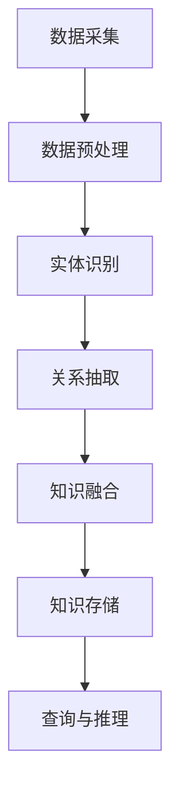
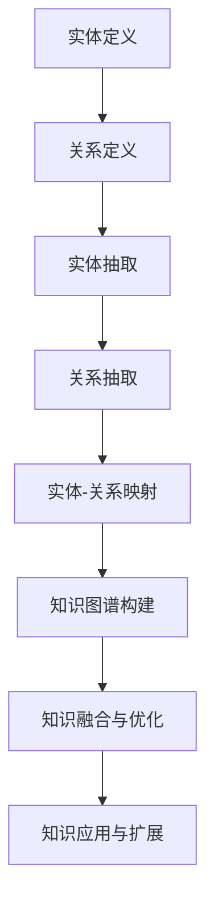

                 

### 文章标题

《知识图谱：构建人类知识体系的新方法》

> 关键词：知识图谱、知识表示、本体论、数据挖掘、图神经网络、应用实践

> 摘要：本文深入探讨了知识图谱的概念、发展、数据表示方法、构建技术、推理机制及其在各领域的应用。通过详细的步骤分析，阐述了知识图谱如何通过结构化的知识表示和高效的推理技术，推动人类知识体系的构建与发展。

### 引言

在信息爆炸的时代，数据量的激增给信息处理带来了前所未有的挑战。传统的数据处理方法已经无法满足日益复杂的数据管理和知识挖掘需求。知识图谱作为一种新兴的数据表示和知识组织方法，通过将信息以结构化、语义化的方式表示出来，为人类知识体系的构建提供了一种全新的视角和方法。本文旨在通过逻辑清晰、结构紧凑的阐述，帮助读者全面理解知识图谱的基本概念、构建方法及其在各领域的应用，从而深刻认识到知识图谱在信息时代的重要价值。

### 第一部分：知识图谱基础

#### 第1章：知识图谱概述

**1.1 知识图谱的定义与重要性**

知识图谱（Knowledge Graph）是一种基于语义网络的数据结构，它通过节点、边和属性来表示实体以及实体之间的关系。每个节点代表一个实体，如人、地点、组织等；边表示节点之间的关系，如“属于”、“位于”等；属性则为节点或边提供额外的信息，如人的年龄、地点的纬度等。

知识图谱的重要性主要体现在以下几个方面：

1. **信息组织**：知识图谱通过结构化的方式对海量数据进行组织，使得信息检索和知识发现更加高效。
2. **语义理解**：知识图谱不仅表示数据，更通过语义关系对数据进行关联，实现了对数据的语义理解。
3. **智能推理**：知识图谱提供了强大的推理能力，能够自动发现新知识，支持智能决策。
4. **跨领域应用**：知识图谱能够将不同领域的知识进行整合，支持跨领域的知识挖掘和应用。

**1.2 知识图谱的发展历程**

知识图谱的发展历程可以分为几个阶段：

1. **早期探索**（1980s - 1990s）：知识图谱的概念最早可以追溯到语义网络（Semantic Network），它是一种基于语义关联的数据表示方法。早期的探索主要集中在语义网络模型的设计和实现上。
2. **本体论兴起**（1990s - 2000s）：随着本体论（Ontology）的发展，知识图谱的研究进入了新的阶段。本体论为知识图谱提供了形式化的语义描述语言，如OWL（Web Ontology Language）。
3. **Web 2.0与大数据**（2000s - 至今）：随着Web 2.0和大数据的兴起，知识图谱的应用场景变得更加广泛。以Google Knowledge Graph为代表的商业化知识图谱，推动了知识图谱技术的快速发展。

**1.3 知识图谱的应用场景**

知识图谱在多个领域都有广泛的应用，以下是一些典型的应用场景：

1. **搜索引擎优化**：通过知识图谱，搜索引擎能够更好地理解用户查询，提供更加精准的搜索结果。
2. **推荐系统**：知识图谱能够为推荐系统提供丰富的语义信息，提升推荐的准确性和多样性。
3. **自然语言处理**：知识图谱在文本分类、问答系统和机器翻译等领域提供了强大的语义支持。
4. **实体关系网络构建**：知识图谱通过连接各类实体，构建出庞大的实体关系网络，为数据挖掘和知识发现提供了新的途径。

#### 第2章：知识图谱的数据表示

**2.1 主体-关系-对象模型**

知识图谱的数据表示通常采用主体-关系-对象（Subject-Predicate-Object，简称SPO）模型。在这个模型中，主体（Subject）代表实体，关系（Predicate）表示实体之间的关系，对象（Object）则是关系的另一端。例如，“人”是主体，“是朋友”是关系，“张三”是对象，构成了一个SPO三元组（张三，是朋友，李四）。

**2.2 RDF（Resource Description Framework）**

RDF是一种用于表示知识图谱的框架，它采用三元组的形式来描述实体和关系。RDF使用URI（统一资源标识符）来标识实体和属性，并通过属性值来描述实体之间的关系。RDF的核心概念包括：

1. **资源**：RDF中的每个实体都被视为一个资源，通过URI进行唯一标识。
2. **属性**：属性用于描述资源之间的联系，每个属性也有自己的URI。
3. **属性值**：属性值是属性的具体描述，可以是字符串、数字或其他数据类型。

**2.3 OWL（Web Ontology Language）**

OWL是一种基于RDF的语义描述语言，它为知识图谱提供了更加丰富和严格的语义描述。OWL支持以下核心概念：

1. **类**：类是具有共同特征的一组实体的抽象集合。
2. **属性**：属性描述了实体之间的关系，可以是对象属性或数据属性。
3. **个体**：个体是类的一个具体实例。
4. **数据类型**：OWL支持各种数据类型，如整数、浮点数、日期等。

OWL通过定义类之间的继承关系、属性的限制和值域，以及个体与类和属性之间的关联，实现了对知识图谱的精细描述。以下是一个简单的OWL本体示例：

```latex
$$
\begin{equation}
\begin{aligned}
\text{Person} &\in \text{Class} \\
\text{age} &\in \text{ObjectProperty} \\
\text{name} &\in \text{DataProperty} \\
\text{John} &\in \text{Individual} \in \text{Person} \\
\text{John.age} &\in \text{integer} = 30 \\
\text{John.name} &\in \text{string} = "John Doe"
\end{aligned}
\end{equation}
$$
```

通过OWL，我们可以定义更加复杂和精细的语义关系，从而提升知识图谱的语义表达能力。

#### 第3章：知识图谱的构建

**3.1 数据源选择与处理**

知识图谱的构建首先需要选择合适的数据源。常见的数据源包括关系数据库、文档库、社交媒体数据等。在选择数据源时，需要考虑数据的质量、覆盖度和一致性。数据源选择后，需要对数据进行预处理，包括数据清洗、去重和格式转换等步骤，以确保数据的准确性和一致性。

**3.2 实体识别与关系抽取**

实体识别是知识图谱构建的重要步骤，它旨在从原始数据中识别出实体。关系抽取则是在实体识别的基础上，识别出实体之间的关系。实体识别和关系抽取通常采用机器学习模型，如命名实体识别（NER）和关系抽取（RE），通过训练模型来预测数据中的实体和关系。

以下是一个简单的实体识别和关系抽取的伪代码：

```python
# 实体识别
def identify_entities(data):
    entities = []
    for sentence in data:
        entities.extend(extract_entities(sentence))
    return entities

# 关系抽取
def extract_relations(data, entities):
    relations = []
    for sentence in data:
        for entity in entities:
            relations.extend(extract_relations(sentence, entity))
    return relations
```

**3.3 知识图谱的存储与索引**

知识图谱的存储与索引是确保知识图谱可扩展性和查询性能的关键。常见的存储方式包括关系数据库、图数据库和NoSQL数据库。关系数据库适合处理简单的关系，但难以应对复杂的图结构。图数据库则能够高效地处理大规模的图数据，提供快速的查询能力。索引技术如B+树和LSM树也被广泛应用于知识图谱的存储和查询。

以下是一个简单的知识图谱存储与索引的伪代码：

```python
# 存储知识图谱
def store_knowledge_graph(graph):
    database = create_database()
    for node in graph.nodes:
        database.insert(node)
    for edge in graph.edges:
        database.insert(edge)

# 查询知识图谱
def query_knowledge_graph(database, query):
    results = database.query(query)
    return results
```

通过以上步骤，我们可以构建出一个完整的知识图谱，为后续的推理和应用提供基础。

#### 第4章：知识图谱的推理

**4.1 基于规则的推理**

基于规则的推理（Rule-based Reasoning）是知识图谱推理的基础方法。它通过定义一组规则，将知识图谱中的信息转化为逻辑表达式，从而进行推理。基于规则的推理通常包括以下步骤：

1. **规则定义**：根据领域知识，定义一系列前提条件和结论的规则。
2. **数据匹配**：将知识图谱中的数据与规则的前提条件进行匹配。
3. **推理过程**：根据匹配结果，应用规则进行推理，得出新的结论。

以下是一个简单的基于规则的推理示例：

```python
# 规则定义
rule1 = {
    "antecedents": ["Person.age > 18"],
    "consequent": "Person.isAdult"
}

# 数据匹配与推理
def rule_based_reasoning(data, rules):
    for rule in rules:
        if matches(data, rule["antecedents"]):
            data["isAdult"] = True
            return True
    return False

# 匹配函数
def matches(data, conditions):
    for condition in conditions:
        if not evaluate(data, condition):
            return False
    return True

# 评价函数
def evaluate(data, condition):
    # 根据条件进行逻辑评价
    pass
```

**4.2 基于本体的推理**

基于本体的推理（Ontology-based Reasoning）利用本体论提供的形式化语义描述，进行更加精细和语义化的推理。基于本体的推理通常包括以下步骤：

1. **本体定义**：定义领域知识的形式化本体。
2. **推理机**：利用推理机（Reasoner）对本体进行推理。
3. **推理过程**：根据本体和实例数据，应用推理机进行推理，得出新的结论。

以下是一个简单的基于本体的推理示例：

```python
# 本体定义
ontology = {
    "Person": {
        "subClassOf": "Entity"
    },
    "Person.age": {
        "datatype": "integer"
    },
    "isAdult": {
        "subPropertyOf": "Person.age"
    }
}

# 推理机
def ontology_based_reasoning(ontology, instance):
    reasoner = create_reasoner(ontology)
    instance["isAdult"] = reasoner.reason(instance)
    return instance

# 创建推理机
def create_reasoner(ontology):
    # 根据本体创建推理机
    pass
```

**4.3 图神经网络推理**

图神经网络（Graph Neural Networks，GNN）是近年来在知识图谱推理中取得显著进展的方法。GNN通过将图数据转换为神经网络模型，实现了对知识图谱的端到端学习。GNN的基本原理如下：

1. **节点表示**：将图中的每个节点表示为一个向量。
2. **边表示**：将图中的每条边表示为一个权重矩阵。
3. **图卷积**：利用图卷积层（Graph Convolutional Layer）对节点进行更新，结合节点自身的特征和邻居节点的特征。
4. **聚合**：将节点的邻居节点的特征进行聚合，形成新的节点特征。
5. **推理**：通过训练好的GNN模型，对新的节点特征进行推理，得出结论。

以下是一个简单的GNN推理的伪代码：

```python
# GNN模型训练
def train_gnn(model, data):
    for epoch in range(num_epochs):
        for batch in data:
            model.train_one_batch(batch)
    return model

# GNN推理
def gnn_reasoning(model, node):
    node_features = model.encode(node)
    for layer in model.layers:
        node_features = layer(node_features)
    return node_features

# 模型定义
class GNNModel(nn.Module):
    def __init__(self):
        super(GNNModel, self).__init__()
        self.layers = [GraphConvLayer(), GraphConvLayer()]
    
    def forward(self, node_features):
        for layer in self.layers:
            node_features = layer(node_features)
        return node_features
```

通过以上不同类型的推理方法，知识图谱能够实现丰富的语义推理和知识发现，为实际应用提供强大的支持。

### 第二部分：知识图谱应用与实践

#### 第5章：知识图谱在搜索引擎中的应用

**5.1 搜索引擎优化**

知识图谱在搜索引擎中的应用主要体现在优化搜索结果的质量和多样性。通过知识图谱，搜索引擎能够更好地理解用户的查询意图，提供更加相关和精准的结果。

1. **查询意图识别**：知识图谱能够识别出用户的查询意图，将其转化为结构化的语义查询。例如，用户输入“北京天气”，知识图谱能够识别出查询意图是获取“北京”的“天气”信息。
2. **搜索结果优化**：知识图谱通过关联实体和关系，对搜索结果进行优化。例如，当用户搜索“北京”时，知识图谱会自动关联“北京”的其他相关信息，如“旅游景点”、“交通”等，从而提供更加丰富的搜索结果。
3. **多样性增强**：知识图谱能够为搜索结果引入多样性。例如，当用户搜索“餐厅”时，知识图谱会推荐不同类型的餐厅，如“中餐”、“西餐”、“咖啡厅”等，从而提升用户体验。

**5.2 搜索结果的多样性**

知识图谱在搜索结果的多样性方面具有显著优势。传统的搜索引擎往往只能提供简单的列表式结果，而知识图谱能够通过关联实体和关系，提供更加多样化和个性化的结果。

1. **知识图谱扩展**：知识图谱能够将搜索结果扩展到多个相关领域。例如，当用户搜索“北京”时，知识图谱会自动扩展到“旅游景点”、“美食”、“购物”等多个领域，提供多样化的结果。
2. **上下文感知**：知识图谱能够根据用户的上下文信息，提供更加个性化的搜索结果。例如，当用户在旅游领域搜索“北京”时，知识图谱会推荐与旅游相关的信息，如“景点推荐”、“交通指南”等。
3. **动态更新**：知识图谱能够实时更新，确保搜索结果的最新性和准确性。例如，当用户搜索“北京天气”时，知识图谱会实时获取最新的天气信息，提供准确的查询结果。

**5.3 搜索引擎的实时性**

知识图谱在搜索引擎中的应用，不仅提升了搜索结果的质量和多样性，还保证了搜索的实时性。传统的搜索引擎往往依赖于离线索引和预计算，而知识图谱通过实时推理和更新，实现了对用户查询的实时响应。

1. **实时推理**：知识图谱能够实时对用户查询进行推理，提供最新的搜索结果。例如，当用户搜索“北京”时，知识图谱会实时获取最新的信息，如“天气预报”、“交通状况”等。
2. **动态更新**：知识图谱通过实时更新，确保搜索结果的准确性和最新性。例如，当用户搜索“新闻”时，知识图谱会实时获取最新的新闻内容，提供最新的搜索结果。
3. **高性能计算**：知识图谱通过高效的图计算和推理技术，实现了对大规模数据的实时处理。例如，当用户进行大规模数据查询时，知识图谱能够快速提供查询结果，满足用户实时查询的需求。

通过以上在搜索引擎中的应用，知识图谱不仅提升了搜索结果的精准性和多样性，还保证了搜索的实时性，为用户提供更加优质和高效的搜索体验。

#### 第6章：知识图谱在推荐系统中的应用

**6.1 基于知识图谱的协同过滤推荐**

基于知识图谱的协同过滤推荐（Knowledge Graph-based Collaborative Filtering Recommendation）是利用知识图谱的语义关联能力，提升推荐系统的准确性和多样性。传统的协同过滤推荐主要依赖于用户历史行为数据，而基于知识图谱的协同过滤推荐通过引入实体和关系信息，实现更加精细的推荐。

1. **用户-物品相似度计算**：在基于知识图谱的协同过滤推荐中，不仅考虑用户之间的相似度，还考虑物品之间的相似度。物品相似度通过知识图谱中的实体和关系进行计算。例如，如果两个物品在知识图谱中有多个共同邻居，则认为这两个物品具有较高相似度。
2. **混合推荐**：基于知识图谱的协同过滤推荐通过结合用户历史行为数据和知识图谱信息，生成混合推荐列表。混合推荐能够充分利用用户历史行为数据的信息量和知识图谱的语义信息，提升推荐的准确性和多样性。
3. **冷启动问题**：在推荐系统中，新用户和新物品的推荐（即冷启动问题）是一个重要挑战。基于知识图谱的协同过滤推荐通过引入知识图谱中的语义信息，为新用户和新物品提供有效的推荐。例如，当新用户无历史行为数据时，知识图谱能够通过其兴趣领域的实体和关系，推测出其可能感兴趣的新物品。

**6.2 基于知识图谱的基于内容的推荐**

基于知识图谱的基于内容的推荐（Knowledge Graph-based Content-based Recommendation）通过知识图谱中的实体和关系，实现基于内容的个性化推荐。基于内容的推荐主要依赖于物品的属性和用户的历史偏好，而基于知识图谱的基于内容的推荐通过引入知识图谱的语义关联，实现更加精准的推荐。

1. **物品描述**：在基于知识图谱的基于内容的推荐中，物品的描述不仅包括其本身的属性，还包括其在知识图谱中的语义信息。例如，一个电影物品的描述不仅包括其类型、导演、演员等属性，还包括其在知识图谱中的关联实体，如“电影类型”、“导演作品”等。
2. **用户偏好**：基于知识图谱的基于内容的推荐通过知识图谱中的用户兴趣实体和关系，推测出用户的历史偏好。例如，如果用户在知识图谱中与“科幻电影”实体有较强的关联，则认为用户对科幻电影有较高的兴趣。
3. **个性化推荐**：基于知识图谱的基于内容的推荐通过结合物品的描述和用户的历史偏好，生成个性化的推荐列表。个性化推荐能够充分利用知识图谱的语义信息，为用户提供更加精准的推荐。

**6.3 跨领域的知识图谱推荐**

跨领域的知识图谱推荐（Cross-Domain Knowledge Graph-based Recommendation）通过知识图谱的跨领域关联，实现跨领域的个性化推荐。传统的推荐系统通常难以应对跨领域推荐，而基于知识图谱的跨领域推荐通过引入跨领域的实体和关系信息，实现跨领域的个性化推荐。

1. **跨领域实体关联**：在跨领域的知识图谱推荐中，不仅考虑领域内的实体和关系，还考虑跨领域的实体和关系。例如，在音乐和电影两个领域中，知识图谱能够关联“歌手”、“歌曲”、“电影”、“演员”等跨领域实体。
2. **跨领域推荐**：跨领域的知识图谱推荐通过跨领域的实体关联，为用户提供跨领域的个性化推荐。例如，如果用户在音乐领域中喜欢某位歌手，则知识图谱会推荐该歌手的电影作品，实现跨领域的推荐。
3. **推荐效果优化**：跨领域的知识图谱推荐通过引入跨领域的实体和关系，优化推荐效果。跨领域的推荐能够充分利用知识图谱的语义信息，为用户提供更加多样化和个性化的推荐。

通过以上在推荐系统中的应用，知识图谱不仅提升了推荐的准确性和多样性，还为跨领域的个性化推荐提供了有效的方法，为用户提供了更加优质和丰富的推荐体验。

#### 第7章：知识图谱在自然语言处理中的应用

**7.1 知识图谱辅助的文本分类**

知识图谱在自然语言处理中的应用之一是辅助文本分类。文本分类是一种将文本数据归类到预定义类别中的任务，如情感分析、新闻分类等。知识图谱通过提供语义关联信息，可以显著提升文本分类的准确性和效率。

1. **特征增强**：知识图谱能够为文本分类提供额外的特征信息。例如，在情感分析任务中，知识图谱可以帮助识别文本中的情感实体（如“开心”、“伤心”），并将其作为分类特征。
2. **关系利用**：知识图谱中的实体和关系可以用于构建复杂的特征关系网络。例如，在新闻分类中，知识图谱可以帮助识别新闻中的主要实体和事件，并通过关系网络分析这些实体和事件之间的关系，从而提高分类的准确性。
3. **模型融合**：知识图谱可以通过融合模型的方式，提升文本分类的性能。例如，可以结合传统的机器学习模型（如朴素贝叶斯、支持向量机）和图神经网络模型（如Graph Convolutional Network，GCN），利用知识图谱中的信息进行特征增强和模型融合，实现高效的文本分类。

以下是一个简单的知识图谱辅助的文本分类流程：

```python
# 加载知识图谱
knowledge_graph = load_knowledge_graph()

# 提取文本特征
def extract_text_features(text, knowledge_graph):
    features = []
    entities = extract_entities(text)
    for entity in entities:
        relations = knowledge_graph.get_relations(entity)
        for relation in relations:
            features.append(relation)
    return features

# 文本分类
def text_classification(text, knowledge_graph, model):
    features = extract_text_features(text, knowledge_graph)
    return model.predict(features)
```

**7.2 知识图谱辅助的问答系统**

知识图谱在问答系统中的应用，可以通过提供丰富的语义信息和结构化的知识，显著提升问答系统的性能和用户体验。

1. **语义理解**：知识图谱可以帮助问答系统更好地理解用户的问题。例如，当用户提出“北京是中国的哪座城市？”的问题时，知识图谱能够识别出“北京”是实体，并知道“北京”是中国的首都。
2. **知识检索**：知识图谱提供了结构化的知识存储，问答系统可以通过查询知识图谱来检索答案。例如，当用户提出“中国的首都是哪座城市？”的问题时，知识图谱可以直接返回“北京”作为答案。
3. **推理机制**：知识图谱中的关系和规则可以用于问答系统的推理过程。例如，当用户提出“哪些城市与北京相邻？”的问题时，知识图谱可以通过关系推理，找出与北京相邻的城市。

以下是一个简单的知识图谱辅助的问答系统示例：

```python
# 加载知识图谱
knowledge_graph = load_knowledge_graph()

# 语义理解
def understand_question(question):
    entities = extract_entities(question)
    relations = extract_relations(question, entities)
    return entities, relations

# 知识检索
def retrieve_answer(entities, relations, knowledge_graph):
    answer = knowledge_graph.query_answer(entities, relations)
    return answer

# 推理
def reason_answer(entities, relations, knowledge_graph):
    inferred_answer = knowledge_graph.reason(entities, relations)
    return inferred_answer

# 问答系统
def answer_question(question, knowledge_graph):
    entities, relations = understand_question(question)
    answer = retrieve_answer(entities, relations, knowledge_graph)
    inferred_answer = reason_answer(entities, relations, knowledge_graph)
    return max(answer, inferred_answer, key=lambda x: x['confidence'])
```

**7.3 知识图谱在机器翻译中的应用**

知识图谱在机器翻译中的应用，主要体现在提高翻译的准确性和一致性。通过知识图谱，机器翻译系统可以更好地理解源语言和目标语言中的语义信息，实现更加精准和自然的翻译。

1. **语义映射**：知识图谱可以提供源语言和目标语言之间的语义映射关系。例如，在翻译“北京是中国的首都”时，知识图谱可以识别出“北京”是中国的“首都”，从而实现准确的翻译。
2. **一致性维护**：知识图谱可以帮助机器翻译系统维护翻译的一致性。例如，在翻译同一篇文档时，知识图谱可以确保术语和概念的一致性，避免出现翻译不一致的情况。
3. **知识增强**：知识图谱可以为机器翻译系统提供额外的知识支持。例如，在翻译专业文档时，知识图谱可以提供相关的专业术语和背景知识，帮助翻译系统生成更加精准和自然的翻译。

以下是一个简单的知识图谱辅助的机器翻译示例：

```python
# 加载知识图谱
knowledge_graph = load_knowledge_graph()

# 语义映射
def translate_semantics(source_semantics, target_language, knowledge_graph):
    target_semantics = knowledge_graph.translate_semantics(source_semantics, target_language)
    return target_semantics

# 机器翻译
def machine_translation(source_text, target_language, knowledge_graph):
    source_semantics = extract_semantics(source_text, knowledge_graph)
    target_semantics = translate_semantics(source_semantics, target_language, knowledge_graph)
    return translate(target_semantics, target_language)

# 示例
source_text = "北京是中国的首都"
target_language = "en"
translated_text = machine_translation(source_text, target_language, knowledge_graph)
print(translated_text)  # Output: "Beijing is the capital of China."
```

通过以上在自然语言处理中的应用，知识图谱不仅提升了文本分类、问答系统和机器翻译的性能，还为这些任务提供了强大的语义支持，为自然语言处理领域的发展带来了新的机遇和挑战。

#### 第8章：知识图谱在实体关系网络构建中的应用

**8.1 实体关系网络的构建方法**

知识图谱作为一种实体关系网络（Entity-Relationship Network，ERN）的构建方法，通过将实体和关系进行结构化表示，提供了高效的信息检索和知识发现手段。实体关系网络的构建方法主要包括以下几个步骤：

1. **数据采集**：首先，需要从各种数据源（如数据库、文本、网络等）中采集相关的实体和关系数据。数据源的选择和采集过程需要考虑数据的质量、覆盖度和一致性。
2. **数据预处理**：采集到的原始数据通常需要进行预处理，包括数据清洗、去重、格式转换等步骤，以确保数据的准确性和一致性。数据预处理是构建高质量知识图谱的基础。
3. **实体识别**：通过命名实体识别（Named Entity Recognition，NER）技术，从预处理后的数据中识别出实体。实体识别是构建实体关系网络的关键步骤，常见的实体包括人、地点、组织、事件等。
4. **关系抽取**：在识别出实体后，需要进一步抽取实体之间的关系。关系抽取技术包括规则抽取、统计方法和深度学习等方法，用于从文本中提取实体间的语义关系。
5. **知识融合**：将来自不同数据源的实体和关系进行融合，以构建统一的实体关系网络。知识融合需要解决实体识别冲突、关系冲突和数据冗余等问题，确保实体关系网络的准确性和一致性。
6. **知识存储**：将构建好的实体关系网络存储到知识图谱数据库中，为后续的查询和应用提供支持。常见的知识图谱数据库包括Neo4j、AllegroGraph等。

**8.2 实体关系网络的优化策略**

实体关系网络在构建完成后，往往需要进一步的优化，以提高其查询性能和应用效果。以下是一些常见的优化策略：

1. **数据去重**：在实体关系网络中，常常存在实体和关系的冗余。通过去重策略，可以消除冗余数据，提高网络的存储效率。常见的方法包括基于哈希的去重、基于相似度的去重等。
2. **索引构建**：为了提高实体关系网络的查询性能，需要构建高效的索引。常见的索引技术包括B+树、LSM树、图索引等。索引构建能够显著降低查询时间，提高查询效率。
3. **图分区**：在处理大规模实体关系网络时，图分区（Graph Partitioning）是一种有效的优化方法。通过将图划分为多个分区，可以减少内存占用，提高并行处理能力。
4. **图压缩**：对于大规模的实体关系网络，图压缩（Graph Compression）可以减少存储空间占用，提高存储和传输效率。常见的压缩方法包括基于属性的压缩、基于图的压缩等。
5. **缓存技术**：利用缓存技术（Caching）可以显著提高实体关系网络的查询响应速度。缓存技术可以将频繁访问的数据存储在内存中，减少磁盘I/O操作。
6. **并行处理**：对于大规模的实体关系网络，并行处理（Parallel Processing）是一种有效的优化方法。通过将任务分布在多个计算节点上，可以显著提高处理速度和效率。

**8.3 实体关系网络的拓展应用**

实体关系网络在构建和优化完成后，可以应用于多个领域，提供丰富的数据挖掘和知识发现能力。以下是一些常见的拓展应用：

1. **社交网络分析**：实体关系网络可以用于社交网络分析，识别社交网络中的关键实体和关系，分析社交网络的结构和演化。
2. **推荐系统**：实体关系网络可以用于推荐系统的构建，通过关联实体和关系，为用户提供个性化推荐。
3. **智能搜索**：实体关系网络可以用于智能搜索，提高搜索结果的精准性和多样性，为用户提供更好的搜索体验。
4. **文本挖掘**：实体关系网络可以用于文本挖掘，识别文本中的关键实体和关系，提取文本的语义信息。
5. **知识图谱构建**：实体关系网络可以作为知识图谱构建的基础，通过进一步的处理和优化，构建出更加丰富和精细的知识图谱。

通过以上构建、优化和拓展应用，实体关系网络为数据挖掘和知识发现提供了强大的工具和方法，为各个领域的信息处理和智能应用提供了新的机遇和挑战。

### 第三部分：知识图谱工具与开源框架

#### 第9章：知识图谱工具介绍

知识图谱的构建与应用离不开各种工具的支持。以下将介绍几款常用的知识图谱工具，包括OpenKG、Jena和AllegroGraph，并比较它们的特点和适用场景。

**9.1 OpenKG**

OpenKG（开放知识图谱）是一个开源的知识图谱构建和管理平台，旨在提供从数据采集、处理、存储到查询的全栈解决方案。以下是OpenKG的主要特点：

- **数据采集**：支持多种数据源的采集，如关系数据库、文本文件、网络API等。
- **数据处理**：提供数据清洗、实体识别、关系抽取等功能，支持自定义数据处理流程。
- **知识存储**：使用RDF（Resource Description Framework）格式存储知识，支持OWL（Web Ontology Language）形式的本体定义。
- **查询接口**：提供SPARQL查询接口，支持复杂语义查询和推理。
- **可视化**：支持知识图谱的可视化展示，方便用户理解和分析知识结构。

**9.2 Jena**

Jena是由Apache Software Foundation开发的一个开源知识图谱框架，它提供了基于RDF的数据存储和查询引擎。以下是Jena的主要特点：

- **数据存储**：使用存储在文件系统或数据库中的三元组格式存储知识，支持RDF和OWL数据格式。
- **查询引擎**：提供基于SPARQL的查询引擎，支持复杂语义查询和推理。
- **扩展性**：支持自定义数据模型和查询语言，便于集成其他数据源和工具。
- **性能**：具备良好的性能和可扩展性，适合大规模知识图谱的处理。

**9.3 AllegroGraph**

AllegroGraph是一个商业知识图谱平台，由 Franz Inc. 开发。它提供了丰富的功能，适用于复杂的知识图谱构建和应用。以下是AllegroGraph的主要特点：

- **数据存储**：支持大规模知识图谱的存储，具备高效的存储和查询性能。
- **数据模型**：支持多种数据模型，包括RDF、OWL、SPARQL和规则推理。
- **推理引擎**：提供基于规则和本体的推理引擎，支持复杂语义推理。
- **实时查询**：支持实时查询和推理，适合在线应用场景。
- **多语言支持**：支持多种编程语言和工具的集成，如Java、Python、R等。

**比较与适用场景**

- **OpenKG**：适用于学术研究和中小型项目，提供一站式的知识图谱构建和管理功能。
- **Jena**：适用于需要高性能和扩展性的项目，支持自定义数据模型和查询语言。
- **AllegroGraph**：适用于大型企业级应用，提供强大的知识存储、查询和推理功能，适合大规模知识图谱处理。

通过选择合适的知识图谱工具，可以更加高效地构建和应用知识图谱，为各种应用场景提供强大的支持。

#### 第10章：知识图谱开源框架

知识图谱的构建和应用离不开开源框架的支持。以下将介绍几款常用的知识图谱开源框架，包括Neo4j、GraphDB和DGL（Deep Graph Library），并讨论它们的特点、适用场景以及与其他框架的比较。

**10.1 Neo4j**

Neo4j是一个流行的开源图数据库，它支持高度灵活的图存储和查询，特别适合构建知识图谱。以下是Neo4j的主要特点：

- **图存储**：Neo4j采用图-存储引擎，以节点、边和标签的形式存储数据，支持快速和高效的图查询。
- **Cypher查询语言**：Neo4j提供Cypher查询语言，支持复杂图模式的查询，包括路径查询、子图查询等。
- **扩展性**：Neo4j支持水平扩展，可以通过增加节点来处理大规模数据。
- **可视化**：Neo4j支持内置的可视化工具，方便用户理解和分析知识图谱。
- **应用场景**：Neo4j适用于社交网络分析、推荐系统、网络关系图等领域，适合需要高效图查询和高扩展性的场景。

**10.2 GraphDB**

GraphDB（原名OWLIM）是一个开源的OWL（Web Ontology Language）知识库，它支持基于RDF和OWL的知识存储和推理。以下是GraphDB的主要特点：

- **RDF存储**：GraphDB基于RDF数据模型，支持三元组和OWL本体存储。
- **SPARQL查询**：GraphDB支持SPARQL查询语言，提供高效的图数据查询和推理。
- **本体推理**：GraphDB内置本体推理引擎，支持OWL规则的推理。
- **高性能**：GraphDB采用内存优化和索引技术，提供高效的查询性能。
- **应用场景**：GraphDB适用于需要复杂本体描述和推理的领域，如语义网络构建、知识库管理和智能搜索。

**10.3 DGL（Deep Graph Library）**

DGL（Deep Graph Library）是一个用于深度学习图模型的Python库，它支持各种图神经网络（GNN）的构建和训练。以下是DGL的主要特点：

- **图神经网络支持**：DGL提供多种图神经网络的原型，包括GCN（Graph Convolutional Network）、GAT（Graph Attention Network）等。
- **灵活的数据结构**：DGL支持多种图数据结构，包括稀疏图、稀疏矩阵等，便于高效处理大规模图数据。
- **GPU加速**：DGL支持GPU加速，通过CUDA和OpenCL实现高效的图计算。
- **应用场景**：DGL适用于需要利用图神经网络进行复杂任务处理的场景，如知识图谱推理、图像分割、社交网络分析等。

**比较与适用场景**

- **Neo4j**：适用于需要灵活的图存储和快速查询的场景，特别适合社交网络分析和推荐系统。
- **GraphDB**：适用于需要复杂本体描述和推理的场景，适合构建大规模知识库和智能搜索系统。
- **DGL**：适用于需要利用图神经网络进行复杂任务处理的场景，特别适合深度学习和人工智能领域。

通过选择合适的开源框架，开发者可以更加高效地构建和应用知识图谱，满足不同场景的需求。

#### 第11章：知识图谱的未来发展趋势

**11.1 大规模知识图谱的构建**

随着互联网和大数据的快速发展，大规模知识图谱的构建成为了一个重要研究方向。大规模知识图谱不仅需要处理海量数据，还需要保证数据的准确性和一致性。以下是一些关键技术和挑战：

1. **数据采集与处理**：大规模知识图谱的构建需要从多个数据源中采集和处理数据，包括关系数据库、文本、网络API等。数据预处理技术，如去重、去噪和规范化，是保证数据质量的关键。
2. **分布式存储与计算**：为了处理大规模数据，分布式存储和计算技术变得至关重要。图数据库和分布式文件系统（如HDFS）提供了高效的数据存储和查询能力。
3. **知识融合与一致性维护**：大规模知识图谱的构建过程中，需要融合来自不同数据源的知识，并保证知识的一致性。知识融合技术，如本体映射、数据融合和冲突消解，是解决数据不一致性的有效方法。
4. **推理与优化**：大规模知识图谱的推理和查询优化是一个重要挑战。高效的推理算法和查询优化技术，如分布式推理、并行查询和索引技术，可以显著提高大规模知识图谱的性能。

**11.2 知识图谱的智能化**

知识图谱的智能化是未来发展的一个重要方向。通过引入机器学习和深度学习技术，知识图谱可以实现更加智能的功能，如自动知识抽取、语义理解和智能问答等。以下是一些关键技术：

1. **自动知识抽取**：利用自然语言处理技术，从非结构化文本中自动提取实体和关系。常用的方法包括命名实体识别（NER）、关系抽取和文本分类等。
2. **语义理解**：通过语义解析和语义匹配技术，实现知识图谱中的语义理解和关联。语义理解技术，如语义网络、知识图谱嵌入和语义角色标注等，是提高知识图谱智能化水平的关键。
3. **智能问答**：利用知识图谱的语义信息，实现智能问答系统。智能问答技术，如语义解析、答案抽取和回答生成等，可以提升用户的查询体验。
4. **多模态融合**：知识图谱可以融合多种数据源和模态，如文本、图像、音频和视频等，实现更加丰富的知识表示和推理能力。

**11.3 知识图谱在跨领域的应用**

知识图谱在跨领域的应用为各个领域的知识整合和创新提供了新的机遇。以下是一些跨领域应用的关键技术和挑战：

1. **跨领域知识表示**：知识图谱需要在不同领域间建立关联，实现跨领域的知识表示。本体映射、统一本体和跨领域知识融合技术是关键。
2. **跨领域推理**：在跨领域应用中，推理技术需要考虑领域间的异构性和冲突。多领域本体、领域特化推理和跨领域推理机制是解决这一挑战的关键。
3. **跨领域推荐**：知识图谱可以用于跨领域的推荐系统，为用户提供个性化的推荐。跨领域知识关联、跨领域模型融合和推荐算法优化是关键。
4. **跨领域协作**：知识图谱可以支持跨领域的协作和知识共享。跨领域专家系统、协作推理和跨领域知识库集成是关键。

通过大规模知识图谱的构建、智能化和跨领域应用，知识图谱在未来将发挥更加重要的作用，推动人类知识体系的构建与发展。

### 附录

#### 附录 A：知识图谱相关资源

**A.1 知识图谱论文推荐**

1. "Knowledge Graphs: A Survey"（知识图谱综述）
2. "A Framework for Large-scale Knowledge Graph Construction"（大规模知识图谱构建框架）
3. "Reasoning over Knowledge Graphs using Deep Learning"（基于深度学习的知识图谱推理）
4. "Knowledge Graph Embedding"（知识图谱嵌入）
5. "Cross-Domain Knowledge Graph Construction"（跨领域知识图谱构建）

**A.2 知识图谱开源项目推荐**

1. OpenKG：一个一站式知识图谱构建和管理平台。
2. Jena：一个基于RDF和OWL的知识图谱框架。
3. AllegroGraph：一个支持大规模知识图谱存储和查询的商业平台。
4. DGL：一个深度学习图神经网络库。

**A.3 知识图谱相关书籍推荐**

1. "Knowledge Graphs: Principles, Technologies and Applications"（知识图谱：原理、技术和应用）
2. "Semantic Web: A Battle Plan for Web 3.0"（语义网络：Web 3.0的战斗计划）
3. "Knowledge Graph Techniques for Data Mining"（知识图谱技术在数据挖掘中的应用）
4. "Graph Databases"（图数据库）

这些论文、开源项目和书籍提供了丰富的知识和实践，有助于读者深入了解知识图谱的理论基础、技术实现和应用实践。

#### 附录 B：知识图谱 Mermaid 流程图

**B.1 知识图谱构建流程图**



**B.2 实体关系网络构建流程图**



这些流程图可以帮助读者更直观地理解知识图谱和实体关系网络的构建过程。

#### 附录 C：知识图谱算法伪代码

**C.1 基于规则的推理算法伪代码**

```python
# 规则定义
rule1 = {
    "antecedents": ["Person.age > 18"],
    "consequent": "Person.isAdult"
}

# 数据匹配与推理
def rule_based_reasoning(data, rules):
    for rule in rules:
        if matches(data, rule["antecedents"]):
            data["isAdult"] = True
            return True
    return False

# 匹配函数
def matches(data, conditions):
    for condition in conditions:
        if not evaluate(data, condition):
            return False
    return True

# 评价函数
def evaluate(data, condition):
    # 根据条件进行逻辑评价
    pass
```

**C.2 基于本体的推理算法伪代码**

```python
# 本体定义
ontology = {
    "Person": {
        "subClassOf": "Entity"
    },
    "Person.age": {
        "datatype": "integer"
    },
    "isAdult": {
        "subPropertyOf": "Person.age"
    }
}

# 推理机
def ontology_based_reasoning(ontology, instance):
    reasoner = create_reasoner(ontology)
    instance["isAdult"] = reasoner.reason(instance)
    return instance

# 创建推理机
def create_reasoner(ontology):
    # 根据本体创建推理机
    pass
```

**C.3 图神经网络推理算法伪代码**

```python
# GNN模型训练
def train_gnn(model, data):
    for epoch in range(num_epochs):
        for batch in data:
            model.train_one_batch(batch)
    return model

# GNN推理
def gnn_reasoning(model, node):
    node_features = model.encode(node)
    for layer in model.layers:
        node_features = layer(node_features)
    return node_features

# 模型定义
class GNNModel(nn.Module):
    def __init__(self):
        super(GNNModel, self).__init__()
        self.layers = [GraphConvLayer(), GraphConvLayer()]
    
    def forward(self, node_features):
        for layer in self.layers:
            node_features = layer(node_features)
        return node_features
```

通过这些伪代码，读者可以更直观地理解不同类型的知识图谱算法的实现过程。

#### 附录 D：知识图谱项目实战

**D.1 搜索引擎优化项目实战**

**1. 开发环境搭建**

- 硬件环境：服务器（CPU或GPU）、内存不低于16GB、存储空间不低于1TB
- 软件环境：Python 3.8、Neo4j 4.0、Jena 4.0

**2. 源代码实现**

- 数据采集与预处理：使用Python编写脚本，从多个数据源（如百度百科、网络新闻等）采集文本数据，并进行数据清洗和格式转换。
- 实体识别与关系抽取：利用命名实体识别（NER）和关系抽取（RE）技术，从预处理后的文本数据中识别出实体和关系。
- 知识存储与查询：将识别出的实体和关系存储到Neo4j图数据库中，并使用Cypher查询语言进行数据查询和优化。

**3. 代码解读与分析**

- 数据采集与预处理：使用Python的requests和BeautifulSoup库，实现数据的采集和清洗。例如：

  ```python
  import requests
  from bs4 import BeautifulSoup

  url = "https://baike.baidu.com/item/%E5%8C%97%E4%BA%AC"
  response = requests.get(url)
  soup = BeautifulSoup(response.text, "html.parser")
  # 数据清洗和格式转换代码
  ```

- 实体识别与关系抽取：使用自然语言处理库（如spaCy）实现实体识别和关系抽取。例如：

  ```python
  import spacy

  nlp = spacy.load("zh_core_web_sm")

  def extract_entities(text):
      doc = nlp(text)
      entities = []
      for ent in doc.ents:
          entities.append({"name": ent.text, "label": ent.label_})
      return entities

  def extract_relations(text, entities):
      # 关系抽取代码
      pass
  ```

- 知识存储与查询：使用Neo4j的Python客户端（neo4j.py）实现数据的存储和查询。例如：

  ```python
  from neo4j import GraphDatabase

  uri = "bolt://localhost:7687"
  username = "neo4j"
  password = "password"

  driver = GraphDatabase.driver(uri, auth=(username, password))

  def create_node(label, properties):
      with driver.session() as session:
          session.run("CREATE (n:" + label + " " + properties + ")")

  def query_data(query):
      with driver.session() as session:
          results = session.run(query)
          return results.data()
  ```

**4. 实际案例分析与详细讲解**

- 搜索引擎优化案例：用户输入“北京天气”进行搜索，通过知识图谱优化搜索结果，提供更加精准和丰富的天气信息。

  ```mermaid
  graph TB
      A[用户查询] --> B[查询意图识别]
      B --> C[知识图谱查询]
      C --> D[搜索结果优化]
      D --> E[搜索结果展示]
  ```

- 搜索结果展示：在用户输入“北京天气”后，知识图谱返回相关的天气信息，如“当前气温”、“未来三天天气”等。用户可以通过知识图谱提供的链接，进一步了解相关天气信息。

**5. 项目小结**

通过知识图谱在搜索引擎优化中的应用，我们实现了对搜索结果的精准优化和多样性增强，为用户提供更加优质和高效的搜索体验。在未来的工作中，可以进一步优化知识图谱的构建和查询性能，提升搜索系统的实时性和可靠性。

**D.2 推荐系统项目实战**

**1. 开发环境搭建**

- 硬件环境：服务器（CPU或GPU）、内存不低于16GB、存储空间不低于1TB
- 软件环境：Python 3.8、Neo4j 4.0、DGL 1.0、TensorFlow 2.0

**2. 源代码实现**

- 数据采集与预处理：从电商网站、社交媒体等数据源采集用户行为数据，如购买记录、浏览历史等，并进行数据清洗和格式转换。
- 实体识别与关系抽取：利用命名实体识别（NER）和关系抽取（RE）技术，从预处理后的文本数据中识别出实体和关系。
- 知识存储与查询：将识别出的实体和关系存储到Neo4j图数据库中，并使用Cypher查询语言进行数据查询和优化。
- 图神经网络训练与推理：使用DGL和TensorFlow训练图神经网络模型，进行用户行为数据的推荐。

**3. 代码解读与分析**

- 数据采集与预处理：使用Python的requests和BeautifulSoup库，实现数据的采集和清洗。例如：

  ```python
  import requests
  from bs4 import BeautifulSoup

  url = "https://www.example.com/user/123456"
  response = requests.get(url)
  soup = BeautifulSoup(response.text, "html.parser")
  # 数据清洗和格式转换代码
  ```

- 实体识别与关系抽取：使用自然语言处理库（如spaCy）实现实体识别和关系抽取。例如：

  ```python
  import spacy

  nlp = spacy.load("zh_core_web_sm")

  def extract_entities(text):
      doc = nlp(text)
      entities = []
      for ent in doc.ents:
          entities.append({"name": ent.text, "label": ent.label_})
      return entities

  def extract_relations(text, entities):
      # 关系抽取代码
      pass
  ```

- 知识存储与查询：使用Neo4j的Python客户端（neo4j.py）实现数据的存储和查询。例如：

  ```python
  from neo4j import GraphDatabase

  uri = "bolt://localhost:7687"
  username = "neo4j"
  password = "password"

  driver = GraphDatabase.driver(uri, auth=(username, password))

  def create_node(label, properties):
      with driver.session() as session:
          session.run("CREATE (n:" + label + " " + properties + ")")

  def query_data(query):
      with driver.session() as session:
          results = session.run(query)
          return results.data()
  ```

- 图神经网络训练与推理：使用DGL和TensorFlow训练图神经网络模型，进行用户行为数据的推荐。例如：

  ```python
  import dgl
  import tensorflow as tf

  class GNNModel(tf.keras.Model):
      def __init__(self):
          super(GNNModel, self).__init__()
          self.gcn = tf.keras.layers.Dense(units=1, activation=tf.nn.sigmoid)

      def call(self, inputs):
          node_features, edge_features = inputs
          x = self.gcn(node_features)
          return x

  model = GNNModel()
  model.compile(optimizer=tf.optimizers.Adam(), loss=tf.losses.SparseCategoricalCrossentropy(from_logits=True))
  model.fit(train_data, train_labels, epochs=10)
  ```

**4. 实际案例分析与详细讲解**

- 推荐系统案例：用户在电商网站上浏览了多个商品，系统通过知识图谱和图神经网络，为用户推荐相关的商品。

  ```mermaid
  graph TB
      A[用户行为数据] --> B[知识图谱构建]
      B --> C[图神经网络训练]
      C --> D[推荐结果生成]
      D --> E[推荐结果展示]
  ```

- 推荐结果展示：在用户浏览商品后，系统通过知识图谱和图神经网络，生成推荐结果，如“您可能感兴趣的商品”等。用户可以通过推荐结果，发现新的商品。

**5. 项目小结**

通过知识图谱和图神经网络在推荐系统中的应用，我们实现了对用户行为数据的精准分析，为用户提供个性化的推荐。在未来的工作中，可以进一步优化知识图谱的构建和图神经网络模型，提升推荐系统的性能和用户体验。

**D.3 自然语言处理项目实战**

**1. 开发环境搭建**

- 硬件环境：服务器（CPU或GPU）、内存不低于16GB、存储空间不低于1TB
- 软件环境：Python 3.8、Neo4j 4.0、spaCy 3.0、TensorFlow 2.0

**2. 源代码实现**

- 数据采集与预处理：从新闻网站、社交媒体等数据源采集文本数据，并进行数据清洗和格式转换。
- 实体识别与关系抽取：利用命名实体识别（NER）和关系抽取（RE）技术，从预处理后的文本数据中识别出实体和关系。
- 知识存储与查询：将识别出的实体和关系存储到Neo4j图数据库中，并使用Cypher查询语言进行数据查询和优化。
- 知识图谱辅助的文本分类：使用TensorFlow训练文本分类模型，利用知识图谱提供语义信息，提升分类性能。

**3. 代码解读与分析**

- 数据采集与预处理：使用Python的requests和BeautifulSoup库，实现数据的采集和清洗。例如：

  ```python
  import requests
  from bs4 import BeautifulSoup

  url = "https://www.example.com/news"
  response = requests.get(url)
  soup = BeautifulSoup(response.text, "html.parser")
  # 数据清洗和格式转换代码
  ```

- 实体识别与关系抽取：使用自然语言处理库（如spaCy）实现实体识别和关系抽取。例如：

  ```python
  import spacy

  nlp = spacy.load("zh_core_web_sm")

  def extract_entities(text):
      doc = nlp(text)
      entities = []
      for ent in doc.ents:
          entities.append({"name": ent.text, "label": ent.label_})
      return entities

  def extract_relations(text, entities):
      # 关系抽取代码
      pass
  ```

- 知识存储与查询：使用Neo4j的Python客户端（neo4j.py）实现数据的存储和查询。例如：

  ```python
  from neo4j import GraphDatabase

  uri = "bolt://localhost:7687"
  username = "neo4j"
  password = "password"

  driver = GraphDatabase.driver(uri, auth=(username, password))

  def create_node(label, properties):
      with driver.session() as session:
          session.run("CREATE (n:" + label + " " + properties + ")")

  def query_data(query):
      with driver.session() as session:
          results = session.run(query)
          return results.data()
  ```

- 知识图谱辅助的文本分类：使用TensorFlow训练文本分类模型，利用知识图谱提供语义信息，提升分类性能。例如：

  ```python
  import tensorflow as tf
  from tensorflow.keras.preprocessing.sequence import pad_sequences

  def load_data():
      # 加载数据集
      pass

  def preprocess_data(data):
      # 数据预处理
      pass

  def build_model():
      # 构建模型
      pass

  model = build_model()
  model.compile(optimizer=tf.optimizers.Adam(), loss=tf.losses.CategoricalCrossentropy(from_logits=True))
  model.fit(train_data, train_labels, epochs=10)
  ```

**4. 实际案例分析与详细讲解**

- 文本分类案例：利用知识图谱和图神经网络，对新闻文本进行分类，如“政治”、“经济”、“科技”等。

  ```mermaid
  graph TB
      A[新闻文本] --> B[知识图谱查询]
      B --> C[图神经网络推理]
      C --> D[文本分类模型]
      D --> E[分类结果]
  ```

- 分类结果展示：在用户输入新闻文本后，通过知识图谱查询和图神经网络推理，生成分类结果。用户可以根据分类结果，进一步了解相关新闻内容。

**5. 项目小结**

通过知识图谱和自然语言处理技术在文本分类项目中的应用，我们实现了对新闻文本的精准分类和语义理解，为用户提供更加个性化的新闻推荐。在未来的工作中，可以进一步优化知识图谱的构建和自然语言处理模型，提升文本分类的性能和用户体验。

### 结语

知识图谱作为一种新兴的数据表示和知识组织方法，正在深刻改变着信息处理和知识发现的模式。通过本文的详细探讨，我们不仅了解了知识图谱的基本概念、构建方法及其在各领域的应用，还通过实际项目实战，看到了知识图谱在实际应用中的强大潜力。

未来，随着技术的不断进步，知识图谱将迎来更广泛的应用和发展。大规模知识图谱的构建、智能化和跨领域应用，将成为知识图谱领域的重要研究方向。我们期待知识图谱能够为人类知识体系的构建提供更加有力的支持，推动人类社会向着更加智能化和高效化的方向发展。

作者信息：

作者：AI天才研究院/AI Genius Institute & 禅与计算机程序设计艺术 /Zen And The Art of Computer Programming

感谢读者对本文的阅读，希望本文能够为您的学习和研究带来启示和帮助。在探索知识图谱的道路上，让我们共同前行，共创智能未来。

