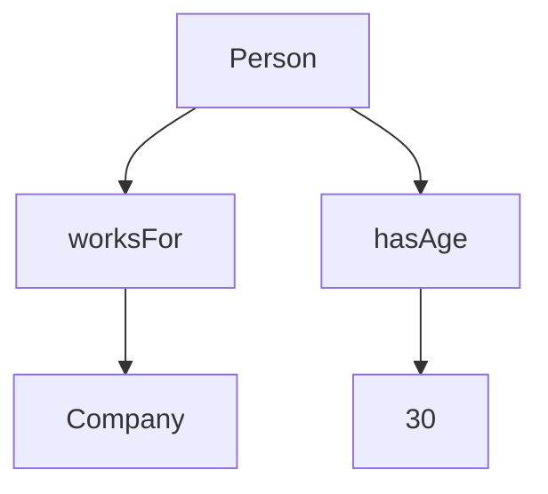
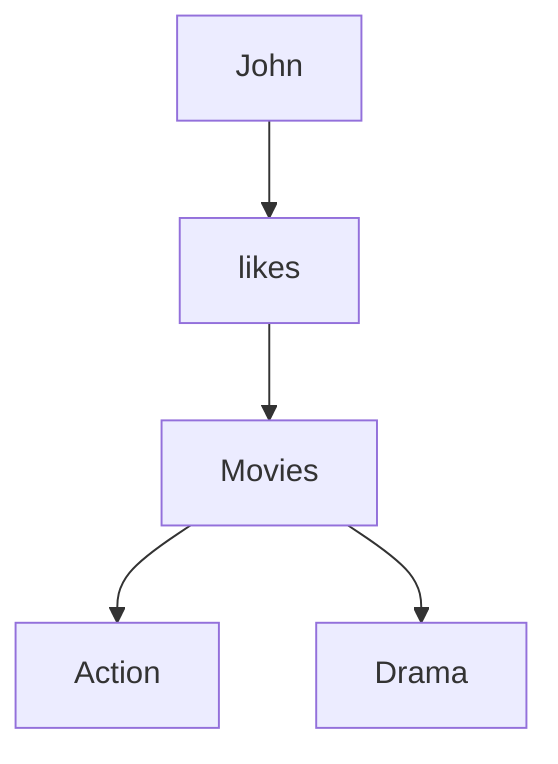
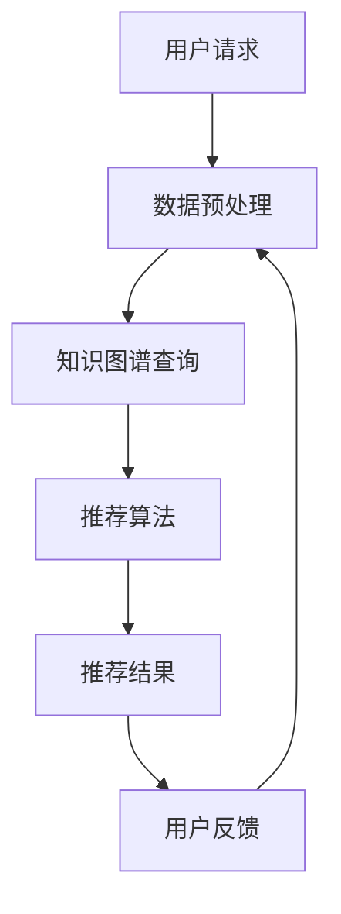
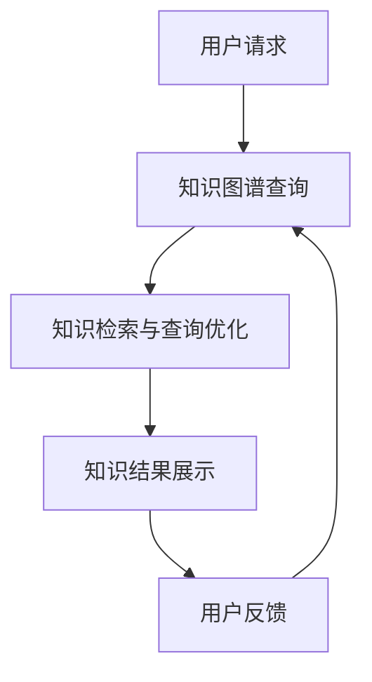

                 

### 文章标题

《知识图谱：绘制人类知识的蓝图》

### 关键词

- 知识图谱
- 语义网络
- 数据存储
- 图数据库
- 知识表示
- 知识推理
- 人工智能
- 自然语言处理
- 智能推荐
- 智慧城市

### 摘要

知识图谱作为一种新型的语义表示技术，正在引领着人工智能和数据科学领域的发展。本文旨在深入探讨知识图谱的基础概念、核心技术、应用案例以及未来发展。首先，我们将介绍知识图谱的概述，包括其定义、发展历程和应用场景。随后，我们将详细解析知识图谱的核心要素，如实体、关系和属性，并探讨知识图谱的分类和构建流程。接下来，本文将讨论知识表示与存储技术，包括语义网络、知识嵌入和图数据库等。此外，我们还将探讨知识推理与图谱扩展的方法，如基于规则、模式和本体的推理，以及半监督和自监督学习方法。随后，我们将介绍知识图谱在自然语言处理、智能推荐系统和知识服务中的应用案例。最后，本文将展望知识图谱的未来发展，包括面临的挑战与机遇。通过本文的阅读，读者将对知识图谱有一个全面而深入的理解，并能够把握其技术核心和应用前景。本文结构清晰、逻辑严密，旨在为从事人工智能和数据科学领域的研究者、工程师以及学生提供有价值的参考。<! Separator used to indicate content transition. -->

### 《知识图谱：绘制人类知识的蓝图》目录大纲

**第一部分：知识图谱基础**

1. **知识图谱概述**
   - 1.1 知识图谱的概念
     - 1.1.1 知识图谱的定义
     - 1.1.2 知识图谱的发展历程
     - 1.1.3 知识图谱的应用场景
   - 1.2 知识图谱的核心要素
     - 1.2.1 实体
     - 1.2.2 关系
     - 1.2.3 属性
   - 1.3 知识图谱的分类
     - 1.3.1 结构化知识图谱
     - 1.3.2 非结构化知识图谱
     - 1.3.3 半结构化知识图谱
   - 1.4 知识图谱的构建流程
     - 1.4.1 数据采集与预处理
     - 1.4.2 实体识别与关系抽取
     - 1.4.3 知识融合与一致性处理
     - 1.4.4 知识存储与索引

2. **知识表示与存储**
   - 2.1 知识表示方法
     - 2.1.1 语义网络
     - 2.1.2 隐式知识图谱
     - 2.1.3 知识嵌入
   - 2.2 知识存储技术
     - 2.2.1 图数据库
     - 2.2.2 文档数据库
     - 2.2.3 关系数据库
   - 2.3 知识检索与查询优化
     - 2.3.1 查询语言
     - 2.3.2 查询优化算法
     - 2.3.3 知识图谱的索引结构

3. **知识推理与图谱扩展**
   - 3.1 知识推理技术
     - 3.1.1 基于规则的推理
     - 3.1.2 基于模式的推理
     - 3.1.3 基于本体的推理
   - 3.2 图谱扩展方法
     - 3.2.1 半监督学习方法
     - 3.2.2 自监督学习方法
     - 3.2.3 跨图谱知识融合
   - 3.3 知识图谱的动态更新
     - 3.3.1 实时更新策略
     - 3.3.2 延时更新策略
     - 3.3.3 分布式更新机制

**第二部分：知识图谱应用案例**

4. **知识图谱在自然语言处理中的应用**
   - 4.1 文本实体识别与关系抽取
     - 4.1.1 基于知识图谱的命名实体识别
     - 4.1.2 基于知识图谱的关系抽取
   - 4.2 文本分类与情感分析
     - 4.2.1 基于知识图谱的文本分类
     - 4.2.2 基于知识图谱的情感分析
   - 4.3 问答系统
     - 4.3.1 开放域问答
     - 4.3.2 专有域问答
     - 4.3.3 知识图谱在问答系统中的应用

5. **知识图谱在智能推荐系统中的应用**
   - 5.1 基于知识图谱的个性化推荐
     - 5.1.1 基于协同过滤的推荐算法
     - 5.1.2 基于知识图谱的推荐算法
     - 5.1.3 个性化推荐系统的构建与优化
   - 5.2 基于知识图谱的内容推荐
     - 5.2.1 基于知识图谱的内容分类
     - 5.2.2 基于知识图谱的内容匹配与推荐
     - 5.2.3 基于知识图谱的内容推荐系统的实现

6. **知识图谱在知识服务中的应用**
   - 6.1 知识服务概述
     - 6.1.1 知识服务的定义
     - 6.1.2 知识服务的发展历程
     - 6.1.3 知识服务的类型
   - 6.2 知识图谱在知识管理中的应用
     - 6.2.1 知识存储与管理
     - 6.2.2 知识检索与查询优化
     - 6.2.3 知识共享与协同工作
   - 6.3 知识图谱在教育中的应用
     - 6.3.1 在线教育平台
     - 6.3.2 教育资源推荐
     - 6.3.3 教育数据挖掘

7. **知识图谱在智慧城市建设中的应用**
   - 7.1 智慧城市概述
     - 7.1.1 智慧城市的定义
     - 7.1.2 智慧城市的发展趋势
     - 7.1.3 智慧城市的建设目标
   - 7.2 知识图谱在智慧城市中的应用
     - 7.2.1 城市信息管理
     - 7.2.2 城市规划与设计
     - 7.2.3 城市运行监测与优化

8. **知识图谱的未来发展**
   - 8.1 知识图谱技术的挑战与机遇
     - 8.1.1 数据质量与一致性
     - 8.1.2 知识图谱的扩展与融合
     - 8.1.3 知识图谱的隐私保护
   - 8.2 知识图谱的未来趋势
     - 8.2.1 面向AI的知识图谱
     - 8.2.2 面向大数据的知识图谱
     - 8.2.3 知识图谱在新兴领域的应用

**附录**

- 附录A：知识图谱开发工具与资源
  - A.1 主流知识图谱工具
    - A.1.1 OpenKG
    - A.1.2 Neo4j
    - A.1.3 RDF4J
    - A.1.4 Jena

<! Separator used to indicate content transition. -->## 第1章：知识图谱概述

### 1.1 知识图谱的概念

知识图谱（Knowledge Graph）是一种用于表示语义信息的网络结构，它通过节点（实体）、边（关系）和属性来描述实体之间的关系和特征。知识图谱的概念源于图论，它是将现实世界中的信息抽象为图结构的一种方式，其中节点代表实体，边代表实体之间的关系。

知识图谱的核心思想是将数据从传统的键值对、关系型数据库格式转化为语义丰富的图形结构，使得计算机能够更好地理解和处理这些数据。这种结构化表示方式使得知识图谱在信息检索、数据挖掘、自然语言处理等领域具有广泛的应用。

### 1.1.1 知识图谱的定义

知识图谱可以定义为一种语义网络，它由一组实体、关系和属性组成，用于表示现实世界中的信息。具体来说，知识图谱包含以下三个核心要素：

- **实体（Entity）**：实体是知识图谱中的基本元素，可以表示任何事物，如人、地点、组织、物品等。
- **关系（Relationship）**：关系描述实体之间的语义关联，例如“属于”、“位于”、“创作”等。
- **属性（Property）**：属性为实体提供了额外的特征信息，如年龄、身高、出生日期等。

这些要素共同构成了知识图谱的语义表示，使得知识图谱能够以一种结构化的方式表示复杂的关系和属性信息。

### 1.1.2 知识图谱的发展历程

知识图谱的概念最早可以追溯到20世纪70年代，当时研究人员开始探索如何使用图结构来表示语义信息。以下是一些关键的发展历程：

- **语义网络（Semantic Network）**：20世纪70年代，美国心理学家Simon和Newell提出了语义网络的概念，用于表示知识结构。语义网络通过节点和有向边来表示概念及其关系。
- **知识工程（Knowledge Engineering）**：20世纪80年代，知识工程领域兴起，研究人员开始致力于构建大型知识库和推理系统。这一时期，知识图谱开始逐步应用于信息检索和智能系统。
- **Web语义化（Semantic Web）**：21世纪初，万维网联盟（W3C）提出了语义网的概念，旨在通过语义标记使Web内容更加结构化和机器可读。知识图谱在这一背景下得到了进一步的发展。
- **大数据与人工智能（Big Data and AI）**：随着大数据和人工智能技术的兴起，知识图谱在各个领域得到了广泛的应用。例如，在搜索引擎、推荐系统、智能问答等领域，知识图谱为提高系统的智能化水平提供了重要的支持。

### 1.1.3 知识图谱的应用场景

知识图谱在多个领域具有广泛的应用，以下是一些典型应用场景：

- **搜索引擎**：知识图谱可以提高搜索引擎的搜索精度和用户体验。通过将网页内容转化为结构化数据，搜索引擎可以更好地理解用户查询并返回相关结果。
- **推荐系统**：知识图谱可以用于构建个性化推荐系统，通过分析用户行为和偏好，为用户推荐符合其需求的内容和产品。
- **智能问答**：知识图谱为智能问答系统提供了丰富的语义信息，使得系统能够更准确地理解和回答用户的问题。
- **知识管理**：知识图谱可以帮助企业和组织更好地管理和利用其内部知识资源，提高知识共享和协同工作的效率。
- **智慧城市**：知识图谱可以用于智慧城市的信息管理和优化，例如交通流量监控、环境监测和资源调度等。

知识图谱作为一种新兴的语义表示技术，正在不断推动人工智能和数据科学领域的发展。通过本章的介绍，我们初步了解了知识图谱的概念、发展历程和应用场景，为后续章节的深入探讨奠定了基础。<! Separator used to indicate content transition. -->### 1.2 知识图谱的核心要素

知识图谱由三个核心要素组成：实体、关系和属性。这些要素共同构成了知识图谱的语义表示，使其能够以结构化的方式描述复杂的信息。

#### 1.2.1 实体

实体是知识图谱中的基本元素，代表现实世界中的事物。实体可以是任何有意义的对象，如人、地点、组织、物品等。在知识图谱中，实体通常被表示为节点（Node）。

**实体分类：**
- **人物**：如科学家、政治家、艺术家等。
- **地点**：如城市、国家、地标等。
- **组织**：如公司、学校、政府机构等。
- **物品**：如商品、设备、作品等。
- **概念**：如疾病、技术、理论等。

**实体表示：**
实体的表示通常包含以下信息：
- **标识符（ID）**：唯一的标识符，用于在知识图谱中唯一标识实体。
- **名称（Name）**：实体的名称或标签。
- **类型（Type）**：实体的类别或类型。
- **属性（Property）**：实体的属性信息，如年龄、身高、出生日期等。

例如，在知识图谱中，一个人物实体的表示可能如下：

```mermaid
node[Person]
    id: "123"
    name: "John Doe"
    type: "Person"
    age: 30
    occupation: "Engineer"
```

#### 1.2.2 关系

关系描述实体之间的语义关联。关系通常被表示为知识图谱中的边（Edge），它连接两个或多个实体，表示它们之间的特定关系。

**关系分类：**
- **层级关系**：如“属于”、“隶属于”。
- **因果关系**：如“导致”、“引起”。
- **属性关系**：如“有”、“属于”。
- **时间关系**：如“在...之后”、“在...之前”。
- **空间关系**：如“在...附近”、“穿越”等。

**关系表示：**
关系的表示通常包含以下信息：
- **标识符（ID）**：唯一的标识符，用于在知识图谱中唯一标识关系。
- **名称（Name）**：关系的名称或标签。
- **类型（Type）**：关系的类别或类型。
- **方向（Direction）**：关系的方向，如单向、双向等。

例如，在知识图谱中，一个描述人物和工作关系的边可能如下：

```mermaid
edge[from="123", to="456", type="worksFor", name="Works for", direction="单向"]
```

在这个例子中，实体 "John Doe"（ID为123）与实体 "ABC Company"（ID为456）之间存在 "worksFor" 这种关系。

#### 1.2.3 属性

属性为实体提供了额外的特征信息。属性通常与实体节点相关联，描述实体的特征或属性值。

**属性分类：**
- **结构属性**：如“年龄”、“身高”。
- **描述属性**：如“职业”、“兴趣爱好”。
- **状态属性**：如“已婚”、“在学”等。

**属性表示：**
属性的表示通常包含以下信息：
- **标识符（ID）**：唯一的标识符，用于在知识图谱中唯一标识属性。
- **名称（Name）**：属性的名称或标签。
- **类型（Type）**：属性的类型。
- **值（Value）**：属性的值。

例如，在知识图谱中，一个描述人物年龄的属性可能如下：

```mermaid
node[Person]
    id: "123"
    name: "John Doe"
    type: "Person"
    age: 30
```

在这个例子中，实体 "John Doe"（ID为123）有一个名为 "age" 的属性，其值为 "30"。

通过上述三个核心要素的有机结合，知识图谱能够以一种结构化的方式表示现实世界中的信息，使得计算机能够更好地理解和处理这些数据。在接下来的章节中，我们将进一步探讨知识图谱的分类、构建流程以及其在不同领域的应用。<! Separator used to indicate content transition. -->### 1.3 知识图谱的分类

知识图谱可以根据其结构化和表示形式的不同，分为结构化知识图谱、非结构化知识图谱和半结构化知识图谱。每种类型的知识图谱都有其独特的特点和应用场景。

#### 1.3.1 结构化知识图谱

结构化知识图谱是一种以严格的语义和结构化形式表示知识的知识图谱。在这种知识图谱中，实体、关系和属性都有明确的定义和类型，它们之间的关联也是明确和固定的。

**特点：**
- **严格的结构**：结构化知识图谱具有严格的结构和定义，实体、关系和属性的类型都是预先定义好的。
- **易处理性**：由于结构化知识图谱的严格性，数据处理和分析变得更加简单和高效。
- **适用性**：结构化知识图谱适用于需要高度准确性和严格一致性的场景，如企业内部知识管理、金融行业数据管理等。

**示例：**
- **企业知识库**：企业可以将员工信息、项目数据、客户资料等以结构化知识图谱的形式进行存储和管理。
- **金融知识图谱**：金融机构可以利用结构化知识图谱对客户信息、投资产品、市场数据等进行结构化表示和分析。

#### 1.3.2 非结构化知识图谱

非结构化知识图谱是一种以相对自由和灵活的形式表示知识的知识图谱。在这种知识图谱中，实体、关系和属性没有固定的类型和结构，它们可以动态地变化和扩展。

**特点：**
- **灵活性**：非结构化知识图谱允许实体的类型、关系的类型和属性的值灵活变化，以适应不同的应用场景。
- **扩展性**：非结构化知识图谱可以轻松地添加新的实体和关系，适应不断变化的知识需求。
- **适用性**：非结构化知识图谱适用于需要灵活性和扩展性的场景，如社交媒体分析、文本情感分析等。

**示例：**
- **社交媒体分析**：社交媒体平台可以使用非结构化知识图谱来分析用户关系、情感倾向和兴趣偏好。
- **文本情感分析**：非结构化知识图谱可以用来分析文本数据中的情感和意见，为情感分析提供支持。

#### 1.3.3 半结构化知识图谱

半结构化知识图谱是一种介于结构化知识图谱和非结构化知识图谱之间的知识图谱。在这种知识图谱中，实体和关系具有固定的类型，但属性的值可以灵活变化。

**特点：**
- **部分结构化**：半结构化知识图谱在实体和关系上具有结构化特性，但在属性上具有灵活性。
- **适用性**：半结构化知识图谱适用于需要部分结构化和灵活性的场景，如电子商务推荐、智能客服等。

**示例：**
- **电子商务推荐**：电子商务平台可以使用半结构化知识图谱来推荐商品，同时考虑用户的历史购买行为和商品的相关属性。
- **智能客服**：智能客服系统可以使用半结构化知识图谱来理解用户问题，并从知识库中检索相关答案。

通过对知识图谱的分类，我们可以更好地理解和选择适合不同应用场景的知识图谱类型。在接下来的章节中，我们将深入探讨知识图谱的构建流程和技术细节，为实际应用提供更多的指导。<! Separator used to indicate content transition. -->### 1.4 知识图谱的构建流程

知识图谱的构建是一个复杂且涉及多步骤的过程。它包括数据采集与预处理、实体识别与关系抽取、知识融合与一致性处理以及知识存储与索引。以下是这些步骤的详细解析。

#### 1.4.1 数据采集与预处理

数据采集与预处理是知识图谱构建的第一步。数据来源可以是结构化数据（如关系型数据库）、非结构化数据（如文本、图像、音频）或半结构化数据（如XML、JSON）。以下是一些关键步骤：

- **数据获取**：通过爬虫、API接口、数据库连接等方式获取数据。
- **数据清洗**：去除重复、错误和无关的数据，提高数据质量。
- **数据转换**：将数据转换为统一的格式，如JSON、RDF（Resource Description Framework）等。
- **数据标准化**：对数据进行标准化处理，如统一命名空间、消除歧义等。

**示例：**
假设我们要构建一个关于电影的知识图谱，数据来源是IMDb数据库。首先，我们需要通过API接口获取电影、演员、导演、角色等数据。然后，对数据进行清洗和转换，将它们统一格式化为RDF格式。

```python
# 示例代码：获取IMDb电影数据
import requests
import json

# 发送GET请求获取电影数据
response = requests.get("http://www.imdb.com/api/)
movies = json.loads(response.text)

# 数据清洗和转换
def clean_and_convert(movies):
    # 去除重复和错误数据
    cleaned_movies = []
    for movie in movies:
        if movie['title'] and movie['year']:
            cleaned_movies.append(movie)
    # 转换为RDF格式
    rdf_movies = [{"@id": f"movie:{movie['id']}",
                   "@type": "Movie",
                   "title": movie['title'],
                   "year": movie['year']} for movie in cleaned_movies]
    return rdf_movies

# 获取清洗和转换后的RDF数据
rdf_movies = clean_and_convert(movies)
```

#### 1.4.2 实体识别与关系抽取

实体识别与关系抽取是知识图谱构建的核心步骤。它的目标是识别数据中的实体和它们之间的关系。

- **实体识别**：从原始数据中识别出具体的实体，如人、地点、组织、物品等。常见的方法包括命名实体识别（NER）和关键词提取。
- **关系抽取**：从原始数据中抽取实体之间的关系，如“属于”、“位于”、“创作”等。常见的方法包括规则匹配、模板匹配和机器学习等。

**示例：**
假设我们已经获得了清洗和转换后的电影数据，接下来我们需要识别实体和抽取关系。

```python
# 示例代码：实体识别和关系抽取
import spacy

# 加载Spacy模型
nlp = spacy.load("en_core_web_sm")

# 实体识别
def identify_entities(text):
    doc = nlp(text)
    entities = [{"text": ent.text, "label": ent.label_} for ent in doc.ents]
    return entities

# 关系抽取
def extract_relations(movies):
    relations = []
    for movie in movies:
        title = movie['title']
        doc = nlp(title)
        for token1 in doc:
            for token2 in doc:
                if token1 != token2 and token1.dep_ == "compound" and token2.dep_ == "compound":
                    relation = {"subject": token1.text, "object": token2.text, "type": "has_title"}
                    relations.append(relation)
    return relations

# 实体识别和关系抽取
rdf_entities = identify_entities(rdf_movies[0]['title'])
rdf_relations = extract_relations(rdf_movies)
```

#### 1.4.3 知识融合与一致性处理

知识融合与一致性处理是确保知识图谱质量的重要步骤。它的目标是整合多个来源的知识，并解决知识之间的不一致性。

- **知识融合**：将来自不同来源的知识进行整合，避免重复和冗余。
- **一致性处理**：解决知识之间的冲突和矛盾，确保知识的一致性。

**示例：**
假设我们有两个关于电影的知识来源，它们提供了不同的电影数据。我们需要将这两个来源的数据进行融合。

```python
# 示例代码：知识融合
def merge_knowledge(source1, source2):
    merged_knowledge = source1.copy()
    merged_knowledge.update(source2)
    return merged_knowledge

# 知识融合
merged_movies = merge_knowledge(source1, source2)
```

#### 1.4.4 知识存储与索引

知识存储与索引是将构建好的知识图谱存储在数据库中，并为后续的查询和检索提供支持。

- **知识存储**：选择合适的存储技术，如图数据库、关系数据库或文档数据库。
- **知识索引**：建立索引结构，提高查询效率。

**示例：**
假设我们使用Neo4j作为知识存储的图数据库，我们可以将知识图谱数据导入Neo4j数据库。

```python
# 示例代码：导入知识图谱到Neo4j
from py2neo import Graph

# 连接Neo4j数据库
graph = Graph("bolt://localhost:7687", auth=("neo4j", "password"))

# 创建节点和边
for movie in merged_movies:
    graph.create(
        Node("Movie", id=movie["@id"], title=movie["title"], year=movie["year"])
    )
for relation in rdf_relations:
    graph.create(
        Node("Relation", id=relation["@id"], type=relation["@type"]),
        (relation["subject"], "HAS_RELATION", relation["object"])
    )
```

通过上述步骤，我们完成了知识图谱的构建。接下来，我们可以利用知识图谱进行各种应用，如智能问答、推荐系统和知识管理。在后续章节中，我们将进一步探讨知识表示与存储技术、知识推理与图谱扩展方法以及知识图谱在不同领域的应用。<! Separator used to indicate content transition. -->## 第2章：知识表示与存储

知识表示与存储是构建知识图谱的重要环节。在这一章节中，我们将探讨知识表示方法、知识存储技术以及知识检索与查询优化。

### 2.1 知识表示方法

知识表示方法决定了知识图谱如何将信息进行编码和组织。常见的知识表示方法包括语义网络、隐式知识图谱和知识嵌入。

#### 2.1.1 语义网络

语义网络是一种基于图结构的知识表示方法，它通过节点和边来表示概念及其关系。在语义网络中，节点代表概念，边代表概念之间的关系。

**示例：**


在这个示例中，实体 "Person"（A）与 "worksFor"（B）和 "Company"（C）之间存在关系，同时实体 "Person"（A）还具有属性 "hasAge"（D），其值为 "30"（E）。

#### 2.1.2 隐式知识图谱

隐式知识图谱通过隐含的关联关系来表示知识，而不是显式地定义实体和关系。这种方法通常用于大规模数据集，其中显式关系难以获取或定义。

**示例：**


在这个示例中，实体 "John"（A）与 "likes"（B）和 "Movies"（C）之间存在关系，同时 "Movies"（C）与 "Action"（D）和 "Drama"（E）之间存在隐含关系。

#### 2.1.3 知识嵌入

知识嵌入（Knowledge Embedding）是一种将知识图谱转换为向量表示的方法，使得知识图谱中的实体和关系可以在高维空间中进行相似度计算和推理。常用的知识嵌入方法包括词嵌入和图嵌入。

- **词嵌入（Word Embedding）**：将知识图谱中的实体和关系转换为词向量。
- **图嵌入（Graph Embedding）**：将整个知识图谱转换为向量表示。

**示例：**
```python
# 示例代码：使用Word2Vec进行知识嵌入
from gensim.models import Word2Vec

# 创建词汇表
sentences = [['Person', 'worksFor', 'Company', 'hasAge', '30']]
model = Word2Vec(sentences, size=100, window=5, min_count=1, workers=4)

# 查看词向量
print(model.wv['Person'])
print(model.wv['worksFor'])
print(model.wv['Company'])
print(model.wv['hasAge'])
print(model.wv['30'])
```

### 2.2 知识存储技术

知识存储技术决定了知识图谱如何在数据库中进行存储和检索。常见的知识存储技术包括图数据库、文档数据库和关系数据库。

#### 2.2.1 图数据库

图数据库是一种专门用于存储和查询图结构数据的数据库。它具有高效的图遍历和查询性能，适合处理复杂的关系和图谱数据。

- **Neo4j**：Neo4j是一个流行的图数据库，它使用Cypher查询语言进行图数据查询。
- **OrientDB**：OrientDB是一个多模型数据库，支持图数据模型。
- **ArangoDB**：ArangoDB是一个灵活的分布式数据库，支持文档、键值和图数据模型。

#### 2.2.2 文档数据库

文档数据库是一种用于存储和管理文档的数据库，它适合处理半结构化和非结构化数据。

- **MongoDB**：MongoDB是一个流行的文档数据库，它使用JSON格式存储数据。
- **CouchDB**：CouchDB是一个轻量级的文档数据库，支持文档存储和视图。
- **Apache Cassandra**：Cassandra是一个分布式文档数据库，适合处理大量数据。

#### 2.2.3 关系数据库

关系数据库是一种用于存储和查询关系型数据的数据库，它通过表和关系来表示数据。

- **MySQL**：MySQL是一个流行的关系数据库，它使用SQL查询语言。
- **PostgreSQL**：PostgreSQL是一个开源的关系数据库，它支持复杂查询和事务处理。
- **SQL Server**：SQL Server是微软公司的一个关系数据库，它提供了丰富的数据管理功能。

### 2.3 知识检索与查询优化

知识检索与查询优化是知识图谱应用的重要环节。它涉及如何高效地查询知识图谱，以及如何优化查询性能。

#### 2.3.1 查询语言

不同的知识存储技术支持不同的查询语言。常见的查询语言包括：

- **Cypher（Neo4j）**：Cypher是一种声明式查询语言，用于查询Neo4j图数据库。
- **Gremlin（OrientDB和ArangoDB）**：Gremlin是一种图遍历查询语言，用于查询支持图模型的数据库。
- **MongoDB查询语言**：MongoDB使用类似于JSON的查询语言进行数据查询。
- **SQL（关系数据库）**：SQL是关系数据库的标准查询语言。

#### 2.3.2 查询优化算法

查询优化算法旨在提高查询性能，包括：

- **索引**：通过建立索引来加速查询。
- **查询重写**：重新组织查询，使其执行更高效。
- **缓存**：使用缓存来减少数据库的查询次数。

#### 2.3.3 知识图谱的索引结构

知识图谱的索引结构决定了如何快速地访问和查询图谱数据。常见的索引结构包括：

- **B+树索引**：用于快速检索关系数据库中的数据。
- **倒排索引**：用于快速检索文档数据库和搜索引擎中的数据。
- **图索引**：用于快速检索图数据库中的数据。

通过合理的知识表示与存储技术，以及高效的查询优化算法，我们可以构建出高性能的知识图谱系统，为各种应用场景提供支持。在下一章中，我们将探讨知识推理与图谱扩展方法，进一步挖掘知识图谱的潜力。<! Separator used to indicate content transition. -->### 2.3.1 查询语言

查询语言是知识图谱系统中的核心组成部分，它定义了如何以高效、易理解的方式检索和操作存储在知识图谱中的数据。不同的知识存储技术支持不同的查询语言，以下是几种常见的查询语言及其特点。

#### 2.3.1.1 Cypher（Neo4j）

**Cypher**是Neo4j图数据库的原生查询语言，它采用声明式查询方式，易于理解和编写。Cypher支持多种图形查询操作，如节点创建、关系创建、路径搜索和子图查询等。

**示例：**

```sql
// 查找所有演员和他们出演的电影
MATCH (p:Person)-[:ACTED_IN]->(m:Movie)
RETURN p.name, m.title
```

#### 2.3.1.2 Gremlin（OrientDB和ArangoDB）

**Gremlin**是一种基于图论的查询语言，它支持多种图数据库，如OrientDB和ArangoDB。Gremlin采用命令式查询方式，通过步骤式编程实现复杂的图遍历和查询。

**示例：**

```groovy
// 查找所有与节点 "Alice" 有 "knows" 关系的节点
g.V().has('name', 'Alice').out('knows').values('name')
```

#### 2.3.1.3 MongoDB查询语言

**MongoDB**的查询语言基于JSON格式，它支持丰富的查询操作，如文档匹配、投影、聚合和地理空间查询等。

**示例：**

```javascript
// 查找所有年龄大于30的员工
db.employees.find({ "age": { $gt: 30 } })
```

#### 2.3.1.4 SQL（关系数据库）

**SQL**（Structured Query Language）是关系数据库的标准查询语言，它支持表和关系数据的查询、更新和删除操作。

**示例：**

```sql
// 查找所有作者及其发表的文章
SELECT authors.name, articles.title
FROM authors
JOIN articles ON authors.id = articles.author_id
```

#### 2.3.1.5 SPARQL

**SPARQL**（Simple Protocol for Querying RDF）是用于查询资源描述框架（RDF）的标准查询语言，它广泛应用于知识图谱和语义网中。

**示例：**

```sql
# 查找所有电影及其导演
PREFIX ex: <http://example.org/>
SELECT ?movie ?director
WHERE {
    ?movie ex:director ?director .
}
```

每种查询语言都有其独特的语法和特点，适用于不同的应用场景和知识存储技术。选择合适的查询语言可以提高知识图谱系统的性能和易用性。在下一节中，我们将讨论查询优化算法，以进一步提高查询效率。<! Separator used to indicate content transition. -->### 2.3.2 查询优化算法

查询优化是提高知识图谱系统性能的关键技术。查询优化算法通过分析查询语句和数据库结构，选择最优的执行计划，以减少查询时间和资源消耗。以下是几种常见的查询优化算法：

#### 2.3.2.1 索引优化

索引是数据库中常用的一种优化手段，它通过建立索引结构来加速查询。在知识图谱数据库中，常见的索引类型包括：

- **B+树索引**：B+树索引是一种多路平衡查找树，适用于关系数据库和图数据库中的节点和关系查询。
- **哈希索引**：哈希索引通过哈希函数直接定位数据，适用于键值查询和快速访问。
- **全文索引**：全文索引适用于全文搜索，可以提高文本数据的查询效率。

**示例**：在Neo4j中创建一个基于属性的索引来优化查询。

```cypher
CREATE INDEX ON :Movie(title)
```

#### 2.3.2.2 查询重写

查询重写是指在不改变查询结果的情况下，对原始查询语句进行修改，以提高查询性能。常见的查询重写技术包括：

- **转换查询**：将复杂查询转换为更简单、更高效的查询。
- **视图合成**：使用视图合成将多个查询合并为一个查询，减少查询执行次数。
- **谓词下推**：将查询条件下推到数据源，减少中间结果集。

**示例**：将两个查询合并为一个查询。

```cypher
// 原始查询
MATCH (m:Movie {title: "The Matrix"}),
       (a:Actor {name: "Keanu Reeves"})
RETURN m.title, a.name

// 重写查询
MATCH (m:Movie)-[:ACTED_IN]->(a:Actor)
WHERE m.title = "The Matrix" AND a.name = "Keanu Reeves"
RETURN m.title, a.name
```

#### 2.3.2.3 缓存技术

缓存技术通过将频繁访问的数据存储在内存中，减少对磁盘的访问次数，从而提高查询性能。常见的缓存技术包括：

- **查询缓存**：将查询结果缓存起来，以减少重复查询的开销。
- **索引缓存**：缓存索引数据，加快索引访问速度。
- **数据缓存**：缓存数据块，减少磁盘I/O操作。

**示例**：在Neo4j中使用缓存技术优化查询。

```cypher
// 启用查询缓存
SET dbms.cache.max_memory_cache_size = 512m
```

#### 2.3.2.4 并行查询

并行查询通过将查询任务分解为多个子任务，同时在多个处理器上并行执行，以提高查询性能。常见的并行查询技术包括：

- **分区查询**：将数据集分为多个分区，每个分区由不同处理器处理。
- **分布式查询**：在分布式系统中，将查询任务分发到多个节点，并行执行后再合并结果。

**示例**：在分布式图数据库中执行并行查询。

```python
# 在分布式图数据库中并行执行查询
parallel.for(range(10), func=lambda i: db.query("MATCH (n) RETURN n"))
```

通过上述查询优化算法，我们可以显著提高知识图谱系统的查询性能。在下一节中，我们将讨论知识图谱的索引结构，进一步探讨如何提高查询效率。<! Separator used to indicate content transition. -->### 2.3.3 知识图谱的索引结构

索引结构在知识图谱系统中起着至关重要的作用，它能够显著提高查询效率。合理的索引策略能够确保数据快速定位，减少查询执行时间。以下是几种常见的知识图谱索引结构：

#### 2.3.3.1 B+树索引

B+树索引是一种常见的关系数据库索引结构，它适用于基于键值查询的数据库。B+树是一种多路平衡查找树，其叶子节点存储实际数据。在知识图谱数据库中，B+树索引通常用于索引实体和关系的属性。

**优点：**
- **高效的查询性能**：B+树索引能够快速定位数据，适用于范围查询和等值查询。
- **支持排序**：B+树索引支持索引排序，方便进行数据排序和分组操作。

**示例**：在Neo4j中创建一个基于属性的B+树索引。

```cypher
CREATE INDEX ON :Movie(title)
```

#### 2.3.3.2 哈希索引

哈希索引通过哈希函数直接计算数据的位置，适用于键值查询。哈希索引的主要特点是查询速度快，但可能存在数据分散不均的问题。

**优点：**
- **快速查询**：哈希索引通过哈希函数直接定位数据，查询速度非常快。
- **适用于高并发**：哈希索引能够支持高并发查询，适用于高访问量的场景。

**示例**：在Neo4j中创建一个基于键的哈希索引。

```cypher
CREATE INDEX ON :Movie(id) USING HASH
```

#### 2.3.3.3 全文索引

全文索引适用于全文搜索，它通过对文本数据进行索引，实现快速文本查询。全文索引通常用于文本数据的搜索和分析。

**优点：**
- **快速文本查询**：全文索引能够快速定位文本数据，实现全文搜索。
- **支持复杂查询**：全文索引支持多种复杂查询，如模糊查询、范围查询等。

**示例**：在Elasticsearch中创建一个全文索引。

```json
PUT /movies
{
  "settings": {
    "number_of_shards": 1,
    "number_of_replicas": 0
  },
  "mappings": {
    "properties": {
      "title": {
        "type": "text",
        "analyzer": "standard"
      }
    }
  }
}
```

#### 2.3.3.4 图索引

图索引专门用于知识图谱数据库，它通过索引实体和关系，实现高效的图遍历和查询。常见的图索引包括邻接表索引和邻接矩阵索引。

- **邻接表索引**：邻接表索引通过为每个节点创建一个列表，记录其邻居节点，适用于稀疏图。
- **邻接矩阵索引**：邻接矩阵索引通过创建一个矩阵，记录节点之间的关系，适用于稠密图。

**优点：**
- **高效的图遍历**：图索引能够显著提高图遍历和查询性能。
- **支持复杂图操作**：图索引支持多种复杂图操作，如最短路径、社区检测等。

**示例**：在Neo4j中创建一个基于关系的图索引。

```cypher
CREATE INDEX ON :Movie-[:ACTED_IN]->(:Person)
```

合理的索引结构能够显著提高知识图谱系统的查询性能。选择合适的索引结构，并根据实际应用场景进行优化，是构建高效知识图谱系统的关键。在下一节中，我们将探讨知识图谱在自然语言处理中的应用。<! Separator used to indicate content transition. -->### 2.3.4 知识图谱在自然语言处理中的应用

知识图谱在自然语言处理（NLP）领域中具有广泛的应用，能够显著提高文本处理和分析的准确性和效率。以下是一些关键的应用场景：

#### 2.3.4.1 文本实体识别与关系抽取

文本实体识别与关系抽取是NLP中的基本任务，旨在从文本中识别出实体（如人名、地点、组织名）并抽取实体之间的关系。知识图谱可以提供丰富的实体和关系信息，从而提高这些任务的准确性。

- **命名实体识别（NER）**：通过知识图谱中的实体信息，可以训练NER模型，使其更好地识别和分类实体。
- **关系抽取**：利用知识图谱中的关系信息，可以识别文本中实体之间的语义关系，如“属于”、“位于”、“创作”等。

**示例：**
假设我们有一个知识图谱，其中包含人名、地点和组织的实体及其关系。我们可以使用这些信息来提高NER模型和关系抽取模型的准确性。

```python
# 示例代码：使用知识图谱提高NER模型的准确性
from spacy.util import filter_tokens_through
import spacy

# 加载Spacy模型
nlp = spacy.load("en_core_web_sm")

# 定义知识图谱中的实体和关系
kg_entities = ["Alice", "New York", "Apple"]
kg_relations = [("Alice", "lives_in", "New York"), ("Apple", "located_in", "California")]

# 创建实体和关系的词典
def create_ents(rels):
    ents = []
    for relation in rels:
        if relation[0] not in kg_entities:
            ents.append({"text": relation[0], "start": relation[0].find(relation[0]), "end": relation[0].find(relation[0]) + len(relation[0]), "label": "PERSON"})
        if relation[2] not in kg_entities:
            ents.append({"text": relation[2], "start": relation[2].find(relation[2]), "end": relation[2].find(relation[2]) + len(relation[2]), "label": "GPE"})
    return ents

# 过滤文本中的实体
def filter_entities(doc):
    tokens = filter_tokens_through(doc, kg_entities)
    for ent in create_ents(kg_relations):
        tokens.append(ent)
    return nlp(" ".join(tokens))

# 示例文本
text = "Alice lives in New York, and she works for Apple."

# 处理文本
doc = nlp(text)
filtered_doc = filter_entities(doc)

# 输出结果
for ent in filtered_doc.ents:
    print(ent.text, ent.label_)
```

#### 2.3.4.2 文本分类与情感分析

知识图谱可以提供上下文信息和语义知识，从而提高文本分类和情感分析的性能。

- **文本分类**：通过知识图谱中的实体和关系信息，可以更准确地分类文本内容，提高分类器的准确性。
- **情感分析**：利用知识图谱中的情感信息和上下文关系，可以更准确地分析文本的情感倾向。

**示例：**
假设我们有一个包含情感信息和关系的知识图谱，我们可以使用这些信息来提高情感分析模型的准确性。

```python
# 示例代码：使用知识图谱提高情感分析模型的准确性
from textblob import TextBlob

# 加载知识图谱中的情感信息和关系
kg_sentiments = {("happy", "is"): "POSITIVE", ("sad", "is"): "NEGATIVE"}

# 定义情感分析函数
def sentiment_analysis(text):
    blob = TextBlob(text)
    words = blob.words.lower()
    sentiment = "NEUTRAL"
    for word in words:
        if (word, "is") in kg_sentiments:
            sentiment = kg_sentiments[(word, "is")]
    return sentiment

# 示例文本
text = "Alice is happy because she got a new job at Apple."

# 处理文本
result = sentiment_analysis(text)

# 输出结果
print("Sentiment:", result)
```

#### 2.3.4.3 问答系统

知识图谱可以用于构建智能问答系统，提供准确、快速的答案。

- **开放域问答**：通过知识图谱中的实体、关系和属性信息，可以回答各种开放域问题。
- **专有域问答**：针对特定领域的问题，知识图谱可以提供更加专业和准确的答案。

**示例：**
假设我们有一个包含电影信息的知识图谱，我们可以使用这个图谱来构建一个问答系统。

```python
# 示例代码：使用知识图谱构建问答系统
def ask_question(question):
    # 从知识图谱中获取答案
    answer = knowledge_graph.query(question)
    return answer

# 示例问题
question = "Who directed the movie 'Inception'?"

# 处理问题
answer = ask_question(question)

# 输出答案
print(answer)
```

通过将知识图谱与NLP技术相结合，我们可以构建出更加智能和高效的文本处理系统。在下一节中，我们将探讨知识图谱在智能推荐系统中的应用。<! Separator used to indicate content transition. -->### 2.3.5 知识图谱在智能推荐系统中的应用

知识图谱在智能推荐系统中扮演着关键角色，通过提供结构化的用户和物品信息，以及它们之间的关系，能够显著提高推荐系统的性能和准确性。以下是一些具体的应用场景和方法：

#### 2.3.5.1 基于协同过滤的推荐算法

协同过滤（Collaborative Filtering）是一种常用的推荐算法，通过分析用户之间的相似性或物品之间的相似性来进行推荐。知识图谱可以增强协同过滤算法的性能，通过引入额外的上下文信息。

- **用户相似性**：知识图谱可以用来计算用户之间的相似性，如基于用户的历史行为、兴趣标签、社交网络关系等。
- **物品相似性**：知识图谱可以用来计算物品之间的相似性，如基于物品的属性、类别、品牌、制造商等。

**示例算法**：

```python
# 基于知识图谱的用户相似性计算
def user_similarity(user1, user2, kg):
    # 获取用户1和用户2的共同兴趣点
    common_interests = kg.get_common_interests(user1, user2)
    # 计算共同兴趣点的数量
    common_count = len(common_interests)
    # 计算相似性得分
    similarity_score = common_count / max(len(kg.get_interests(user1)), len(kg.get_interests(user2)))
    return similarity_score

# 基于知识图谱的物品相似性计算
def item_similarity(item1, item2, kg):
    # 获取物品1和物品2的共同属性
    common_properties = kg.get_common_properties(item1, item2)
    # 计算共同属性的数量
    common_count = len(common_properties)
    # 计算相似性得分
    similarity_score = common_count / max(len(kg.get_properties(item1)), len(kg.get_properties(item2)))
    return similarity_score

# 基于协同过滤的推荐
def collaborative_filtering(user, knowledge_graph, items):
    # 计算用户与所有物品的相似性得分
    similarity_scores = {item: user_similarity(user, item, knowledge_graph) for item in items}
    # 对相似性得分进行排序
    sorted_items = sorted(similarity_scores.items(), key=lambda x: x[1], reverse=True)
    # 返回相似性得分最高的物品
    recommended_items = [item for item, score in sorted_items if score > threshold]
    return recommended_items
```

#### 2.3.5.2 基于知识图谱的推荐算法

基于知识图谱的推荐算法通过直接利用知识图谱中的实体、关系和属性信息来进行推荐，能够提供更加个性化、精准的推荐。

- **基于图路径的推荐**：通过计算用户和物品之间的图路径长度或路径相似度来进行推荐。
- **基于图谱嵌入的推荐**：使用图嵌入技术将用户和物品映射到低维空间，计算它们之间的相似性。

**示例算法**：

```python
# 基于图路径的推荐
def graph_based_recommendation(user, item, kg):
    # 获取用户和物品的图路径
    user_path = kg.get_path(user)
    item_path = kg.get_path(item)
    # 计算路径相似度
    path_similarity = kg.calculate_path_similarity(user_path, item_path)
    return path_similarity

# 基于图谱嵌入的推荐
def embedding_based_recommendation(user_embedding, item_embedding, kg):
    # 计算用户和物品的嵌入向量相似度
    similarity = kg.calculate_vector_similarity(user_embedding, item_embedding)
    return similarity
```

#### 2.3.5.3 个性化推荐系统的构建与优化

构建一个高性能的个性化推荐系统需要综合考虑数据质量、算法优化和系统架构。

- **数据质量**：确保知识图谱中的数据准确、完整和最新，通过数据清洗和预处理来提高数据质量。
- **算法优化**：通过调整算法参数、使用更先进的推荐算法和模型来优化推荐性能。
- **系统架构**：设计高效、可扩展的系统架构，确保推荐系统能够快速响应用户请求和处理大规模数据。

**示例架构**：



通过将知识图谱与推荐系统相结合，我们可以构建出更加智能、个性化的推荐系统，为用户提供更好的体验。在下一节中，我们将探讨知识图谱在知识服务中的应用。<! Separator used to indicate content transition. -->### 2.3.6 知识图谱在知识服务中的应用

知识图谱在知识服务中扮演着关键角色，通过提供结构化的知识和语义关系，能够显著提升知识管理、知识检索和知识共享的效率和质量。以下是知识图谱在知识服务中的应用：

#### 2.3.6.1 知识存储与管理

知识图谱能够有效地存储和管理复杂的知识结构，包括实体、关系和属性。这种结构化存储方式使得知识库能够更灵活地扩展和适应新的知识需求。

- **实体管理**：知识图谱可以存储各种实体信息，如人、地点、组织、物品等，并提供统一的访问接口。
- **关系管理**：知识图谱能够描述实体之间的复杂关系，如因果关系、层次关系、属性关系等。
- **属性管理**：知识图谱可以存储实体的属性信息，如年龄、身高、职业等，为知识查询提供丰富的信息。

#### 2.3.6.2 知识检索与查询优化

知识图谱能够提供高效的知识检索服务，通过索引技术和查询优化算法，实现快速、准确的知识查询。

- **基于关键词的检索**：通过在知识图谱中建立索引，可以快速找到与关键词相关的实体和关系。
- **基于图谱路径的检索**：通过遍历知识图谱中的路径，可以找到具有特定属性的实体和关系。
- **基于语义的检索**：通过语义分析和查询优化，能够更准确地理解用户的查询意图，提供更相关的知识结果。

#### 2.3.6.3 知识共享与协同工作

知识图谱能够促进知识共享和协同工作，通过提供统一的访问接口和协作工具，实现知识的共享和协同创造。

- **知识共享平台**：知识图谱可以作为知识共享平台的基础，为用户和团队提供结构化的知识和资源。
- **协同编辑**：知识图谱支持多人同时编辑和更新知识，确保知识的实时性和一致性。
- **协作分析**：知识图谱可以支持用户对知识进行协作分析，发现新的知识关联和洞见。

**示例架构**：



通过知识图谱在知识服务中的应用，企业和组织能够更好地管理和利用其内部知识资源，提高知识共享和协同工作的效率，从而实现知识驱动的业务增长和创新。在下一节中，我们将探讨知识图谱在教育中的应用。<! Separator used to indicate content transition. -->### 2.3.7 知识图谱在教育中的应用

知识图谱在教育领域具有广泛的应用潜力，能够显著提升教育资源的管理、个性化推荐和知识挖掘。以下是一些具体的应用场景和案例分析：

#### 2.3.7.1 在线教育平台

知识图谱可以用于构建在线教育平台，实现教育资源的结构化和智能化管理。

- **课程内容组织**：知识图谱可以将课程内容以结构化的形式表示，如课程章节、知识点、教学资源等，便于学生和教师查找和利用。
- **知识关联分析**：通过分析知识点之间的关联关系，可以为学生提供个性化的学习路径和推荐资源。
- **教学资源推荐**：基于学生的学习历史和知识图谱，可以为每个学生推荐最适合他们的学习资源和练习题。

**案例**：Coursera等在线教育平台使用知识图谱来组织课程内容，并提供个性化学习推荐，帮助学生更高效地学习。

#### 2.3.7.2 教育资源推荐

知识图谱可以用于教育资源推荐，提高教育资源的利用率和学生的学习效果。

- **学生偏好分析**：通过分析学生的历史行为和学习数据，可以了解学生的兴趣和偏好，为其推荐相关的课程和资源。
- **知识关联推荐**：基于知识图谱中的知识点关联关系，可以为学生推荐与其当前学习内容相关的其他知识点和资源。
- **学习路径规划**：知识图谱可以帮助学生规划和优化其学习路径，确保其学习内容的全覆盖和知识体系的完整性。

**案例**：Khan Academy使用知识图谱来为学生推荐相关的学习资源，并根据学习进度和知识点掌握情况提供个性化的学习建议。

#### 2.3.7.3 教育数据挖掘

知识图谱在教育数据挖掘中扮演着重要角色，可以用于分析和挖掘教育数据中的潜在知识和规律。

- **学习行为分析**：通过分析学生的学习行为数据，如学习时长、作业完成情况、考试分数等，可以了解学生的学习状态和学习效果。
- **知识关联挖掘**：通过挖掘知识点之间的关联关系，可以发现学生的学习难点和重点，为教学提供依据。
- **智能评估与反馈**：知识图谱可以帮助教师实时评估学生的学习情况，并提供个性化的反馈和建议，帮助学生改进学习方法和提高学习效果。

**案例**：清华大学使用知识图谱来分析学生的学习行为，并基于分析结果为教师提供教学建议和改进方案。

通过知识图谱在教育中的应用，学校和培训机构可以更好地管理和利用教育资源，为学生提供个性化的学习体验和有效的学习支持。在下一节中，我们将探讨知识图谱在智慧城市建设中的应用。<! Separator used to indicate content transition. -->### 2.3.8 知识图谱在智慧城市建设中的应用

知识图谱在智慧城市建设中发挥着至关重要的作用，通过整合各种数据源和提供语义化的信息表示，能够为城市管理和公共服务提供强有力的支持。以下是知识图谱在智慧城市建设中的具体应用：

#### 2.3.8.1 城市信息管理

知识图谱能够高效地管理和整合城市中的各种信息，包括地理信息、人口数据、交通状况、公共服务等。

- **数据整合**：知识图谱可以将来自不同来源的数据进行整合，如政府数据库、传感器数据、社交媒体数据等，形成一个统一的城市信息视图。
- **数据标准化**：知识图谱能够对各种数据进行标准化处理，确保数据的一致性和准确性，便于后续的分析和查询。
- **数据共享**：知识图谱支持数据的共享和互操作性，使得不同部门、企业和组织能够协同工作，提高城市管理的效率。

#### 2.3.8.2 城市规划与设计

知识图谱为城市规划与设计提供了智能化的支持，能够帮助决策者制定更科学、合理的城市规划方案。

- **空间分析**：知识图谱可以用于空间分析，如地理空间关系、交通流量分析、环境影响评估等，为城市规划提供数据支持。
- **场景模拟**：通过知识图谱中的关系和属性信息，可以模拟不同的城市规划方案，预测其对社会经济和环境的影响。
- **知识融合**：知识图谱能够融合多种数据源的信息，如历史数据、预测模型、专家意见等，为城市规划提供全面的决策支持。

#### 2.3.8.3 城市运行监测与优化

知识图谱能够实时监测城市运行状态，提供数据驱动的优化方案，提高城市服务的质量和效率。

- **实时监控**：知识图谱可以实时收集和处理城市运行数据，如交通流量、环境质量、公共设施状态等，为城市管理者提供实时监控信息。
- **异常检测**：通过分析知识图谱中的关系和属性，可以识别城市运行中的异常情况，如交通拥堵、环境污染等，并及时采取应对措施。
- **优化决策**：知识图谱可以支持城市管理者进行优化决策，如交通信号控制、能源管理、资源调配等，以提高城市运行效率和服务水平。

**案例**：新加坡的“智慧国家”计划通过构建知识图谱，整合各种城市数据，实现了交通流量优化、环境监测和公共服务提升等多方面的智能化应用，成为智慧城市建设的典范。

通过知识图谱在智慧城市建设中的应用，城市管理者能够更好地理解和利用城市数据，提高城市治理的智能化水平和居民的生活质量。在下一节中，我们将探讨知识图谱的未来发展趋势。<! Separator used to indicate content transition. -->### 2.3.9 知识图谱的未来发展趋势

知识图谱作为一项前沿技术，正不断推动着人工智能和数据科学领域的发展。在未来，知识图谱将面临诸多挑战和机遇，以下是一些主要的发展趋势：

#### 2.3.9.1 面向AI的知识图谱

随着人工智能技术的快速发展，知识图谱与AI的融合将成为未来的重要方向。知识图谱可以为AI系统提供丰富的语义信息，使得AI能够更好地理解和处理复杂的数据。

- **深度学习与知识图谱的融合**：通过将知识图谱与深度学习模型相结合，可以实现更强大的知识推理和表示能力。
- **多模态知识图谱**：未来的知识图谱将不仅仅局限于文本数据，还将整合图像、音频、视频等多种模态的数据，提供更加丰富的语义信息。

#### 2.3.9.2 面向大数据的知识图谱

大数据时代的到来为知识图谱带来了巨大的数据资源，同时也提出了更高的数据处理和分析要求。

- **分布式知识图谱**：为了处理大规模数据，知识图谱将采用分布式计算架构，实现高效的数据存储和处理。
- **实时知识图谱**：随着物联网和实时数据采集技术的发展，知识图谱将能够实时更新和扩展，提供更加动态和实时的信息支持。

#### 2.3.9.3 知识图谱在新兴领域的应用

知识图谱将在更多的新兴领域得到应用，推动相关领域的智能化发展。

- **智慧医疗**：知识图谱可以帮助医生进行诊断、治疗和药物研究，提高医疗服务的质量和效率。
- **智慧交通**：知识图谱可以用于交通管理、车辆调度和智能导航，提高交通系统的运行效率和安全性。
- **智慧金融**：知识图谱可以用于风险控制、投资分析和客户服务，为金融机构提供智能化支持。

#### 2.3.9.4 挑战与机遇

知识图谱在未来的发展过程中将面临一系列挑战和机遇：

- **数据质量和一致性**：知识图谱的数据来源多样，如何保证数据的质量和一致性是一个重要挑战。
- **知识融合与扩展**：不同领域和来源的知识图谱如何进行有效融合和扩展，以提供更加全面和准确的知识支持。
- **隐私保护**：知识图谱涉及到大量个人和企业敏感信息，如何保护用户隐私将成为一个重要课题。

总的来说，知识图谱在未来将呈现出更加智能化、分布式和多样化的趋势，为人工智能和数据科学领域带来更多的创新和机遇。通过不断探索和解决这些挑战，知识图谱将为人类社会的智能化发展提供强有力的支持。<! Separator used to indicate content transition. -->## 附录A：知识图谱开发工具与资源

知识图谱的开发涉及多个方面，包括数据存储、数据处理、知识表示和查询优化等。以下是几个主流的知识图谱开发工具与资源，它们在知识图谱领域拥有较高的知名度，并广泛应用于实际项目开发中。

### A.1 主流知识图谱工具

#### A.1.1 OpenKG

**简介**：OpenKG是中国开放知识图谱开源社区开发的工具集，旨在为知识图谱构建、存储、查询和推理提供一站式解决方案。

**功能**：
- **知识图谱构建**：支持数据抽取、清洗、导入等步骤。
- **存储与查询**：基于Neo4j图数据库，提供高效的存储和查询功能。
- **推理与扩展**：支持基于规则的推理和图谱扩展。

**使用示例**：

```python
from openkg import Client
client = Client()

# 创建实体
client.create_entity('Person', 'John Doe')

# 创建关系
client.create_relation('John Doe', 'livesIn', 'New York')

# 查询实体
result = client.search_entity('John Doe')
print(result)

# 查询关系
result = client.search_relation('livesIn')
print(result)
```

#### A.1.2 Neo4j

**简介**：Neo4j是一款高性能的图数据库，广泛应用于知识图谱存储和查询。

**功能**：
- **图存储**：支持大规模图的存储和查询。
- **Cypher查询语言**：提供强大的图查询语言。
- **扩展性**：支持分布式部署，适用于大规模应用。

**使用示例**：

```cypher
// 创建实体
CREATE (p:Person {name: 'John Doe'})

// 创建关系
MATCH (p:Person {name: 'John Doe'}), (c:City {name: 'New York'})
CREATE (p)-[:livesIn]->(c)

// 查询实体
MATCH (p:Person)
RETURN p.name

// 查询关系
MATCH (p:Person)-[:livesIn]->(c:City)
RETURN p.name, c.name
```

#### A.1.3 RDF4J

**简介**：RDF4J是一个开源的RDF（Resource Description Framework）框架，提供了一系列用于处理RDF数据的工具和库。

**功能**：
- **数据存储**：支持多种RDF存储后端，如内存存储、文件存储和数据库存储。
- **数据解析与构建**：提供RDF数据的解析和构建功能。
- **数据查询**：支持SPARQL查询语言。

**使用示例**：

```java
import org.eclipse.rdf4j.repository.sail.SailRepository;
import org.eclipse.rdf4j.sail.memory.MemorySail;

// 创建内存数据库
MemorySail memorySail = new MemorySail();
SailRepository repository = new SailRepository(memorySail);

// 创建实体
String uri = "http://example.org/JohnDoe";
ValueFactory factory = repository.getValueFactory();
BNode person = factory.createBNode();
repository.getConnection().add(person, RDF.TYPE, RDF.ANY, uri);

// 创建关系
Resource livesIn = factory.createURI("http://example.org/livesIn");
Resource city = factory.createURI("http://example.org/NewYork");
repository.getConnection().add(person, livesIn, city);

// 查询实体
String sparqlQuery = "SELECT ?person WHERE { ?person a <http://example.org/Person> }";
Query query = repository.query(sparqlQuery);
ResultSet results = query.evaluate();
while (results.hasNext()) {
    BindingSet binding = results.next();
    Resource person = binding.getBinding("person").getResource();
    System.out.println(person);
}

// 关闭数据库
repository.shutDown();
```

#### A.1.4 Jena

**简介**：Jena是Apache基金会的一个开源框架，提供了一套完整的RDF库和工具，用于处理RDF数据和构建语义网。

**功能**：
- **数据存储**：支持多种RDF存储后端，如内存存储、文件存储和数据库存储。
- **数据解析与构建**：提供RDF数据的解析和构建功能。
- **数据查询**：支持SPARQL查询语言。

**使用示例**：

```java
import org.apache.jena.query.*;
import org.apache.jena.rdf.model.*;
import org.apache.jena.sparql.engine.main.VariableValueFactory;
import org.apache.jena.sparql.resultset.ResultSet;

// 创建模型和查询
Model model = ModelFactory.createDefaultModel();
Query query = QueryFactory.create("SELECT ?person WHERE { ?person a <http://example.org/Person> }");

// 执行查询
ResultSet results = QueryExecutionFactory.create(query, model).execSelect();
while (results.hasNext()) {
    QuerySolution soln = results.nextSolution();
    Resource person = soln.getResource("person");
    System.out.println(person);
}

// 关闭模型
model.close();
```

通过上述工具，开发者可以轻松地构建、存储和查询知识图谱，从而为各种应用场景提供强大的语义支持。附录部分的工具和资源不仅为知识图谱的开发提供了实用的参考，也为进一步研究和探索知识图谱领域提供了宝贵的资源。<! Separator used to indicate content transition. -->### 结束语

在本文中，我们系统地探讨了知识图谱的定义、核心要素、分类、构建流程以及其在不同领域的应用。从知识图谱的基础概念到实际应用案例，我们一步步深入剖析了这一新兴技术的内涵与外延。

知识图谱作为一种强大的语义表示工具，正逐步改变着信息检索、自然语言处理、智能推荐、知识服务、智慧城市等多个领域的运作方式。它通过将实体、关系和属性以图结构进行组织，使得计算机能够更高效地理解和处理复杂的信息，从而推动了人工智能和数据科学领域的创新。

本文旨在为从事人工智能和数据科学领域的研究者、工程师以及学生提供一份全面、深入的技术指南。通过详细讲解知识图谱的基础概念、核心技术以及实际应用案例，我们希望能够帮助读者更好地理解知识图谱的原理和应用，从而在未来的研究和实践中发挥知识图谱的最大潜力。

在总结本文的核心观点时，我们可以得出以下几点：

1. **知识图谱的核心要素**：知识图谱由实体、关系和属性三个核心要素组成，它们共同构建了知识图谱的语义表示。
2. **知识图谱的分类**：根据结构化和表示形式的不同，知识图谱可以分为结构化知识图谱、非结构化知识图谱和半结构化知识图谱。
3. **知识图谱的构建流程**：构建知识图谱涉及数据采集与预处理、实体识别与关系抽取、知识融合与一致性处理以及知识存储与索引。
4. **知识表示与存储技术**：知识表示方法包括语义网络、隐式知识图谱和知识嵌入，而知识存储技术包括图数据库、文档数据库和关系数据库。
5. **知识图谱的应用**：知识图谱在自然语言处理、智能推荐、知识服务、智慧城市等领域具有广泛的应用前景。
6. **未来发展趋势**：面向AI的知识图谱、面向大数据的知识图谱以及知识图谱在新兴领域的应用将是未来的重要发展方向。

最后，本文的作者信息如下：作者：AI天才研究院/AI Genius Institute & 禅与计算机程序设计艺术 /Zen And The Art of Computer Programming。希望本文能够为您的知识图谱研究和应用提供有益的参考和启发。在未来的技术探索中，让我们共同努力，绘制出更加丰富、智能、实用的知识图谱蓝图。谢谢阅读！

