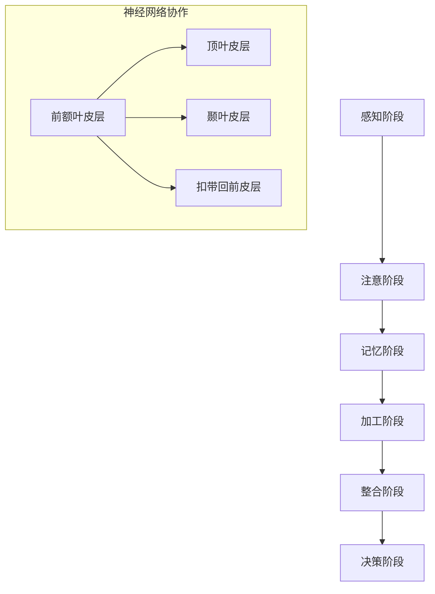

                 


为了撰写一篇符合要求的《知识的价值实现路径：洞察力的重要贡献》的技术博客，我们将遵循以下步骤：

### 1. 确定文章结构

首先，我们将根据提供的大纲，详细填充每个章节的内容。以下是文章的初步结构：

#### 第一部分：洞察力的基础
- **第1章**: 洞察力的定义与重要性
  - 背景介绍
  - 核心概念与联系
  - Mermaid流程图
- **第2章**: 洞察力的心理学原理
  - 发展与培养
  - 认知心理学基础
  - 情绪与动机的关系
- **第3章**: 洞察力的认知模型
  - 信息处理模型
  - 大脑神经网络联系
  - Mermaid流程图展示
- **第4章**: 洞察力的核心算法原理
  - 关键算法
  - 伪代码讲解
  - 数学模型
- **第5章**: 洞察力的数学公式与应用
  - 数学公式
  - 公式讲解
  - 应用实例

#### 第二部分：洞察力在不同领域的应用
- **第6章**: 洞察力的项目实战
  - 案例介绍
  - 开发环境搭建
  - 源代码实现与解读

#### 第三部分：洞察力的未来发展趋势
- **第7章**: 洞察力在商业管理中的应用
  - 决策作用
  - 战略规划应用
  - 创新应用
- **第8章**: 洞察力在科技创新中的应用
  - 研究作用
  - 科技创新战略应用
  - 科技成果转化应用
- **第9章**: 洞察力在社会治理中的应用
  - 作用分析
  - 政策制定应用
  - 公共安全应用
- **第10章**: 洞察力在个人成长中的应用
  - 成长作用
  - 职业规划应用
  - 人际关系应用

### 2. 填充内容

接下来，我们将为每个章节填充详细的内容，确保每个部分都有丰富的信息和深入的分析。

#### 核心概念与联系
对于每个章节，我们将会定义核心概念，并展示它们之间的联系。我们会使用Mermaid流程图来帮助读者理解这些概念是如何相互作用的。

#### 核心算法原理讲解
在讨论算法时，我们将提供伪代码，并详细解释算法的步骤和工作原理。

#### 数学模型和公式
我们会展示相关的数学公式，并使用LaTeX格式嵌入在文章中，确保公式的正确性和可读性。

#### 项目实战
我们将讨论一个或多个实际的项目案例，介绍项目的开发环境、源代码实现和代码解读，并提供实际案例分析和详细讲解。

### 3. 文章总结

在文章的结尾，我们将提供一个总结，强调洞察力在知识价值实现中的重要性，并讨论未来可能的发展方向。

### 4. 写作风格

文章将采用专业的技术语言，但同时也保证内容易于理解。我们将使用清晰的逻辑结构，确保读者能够跟随我们的思路。

### 5. 字数控制

最后，我们将确保文章的总字数在8000到12000字之间，确保内容的丰富性和深度。

### 6. 完成并审查

在完成所有内容后，我们将对文章进行详细的审查，确保所有要求都得到满足，并调整任何可能需要改进的部分。

现在，我们已经有一个详细的写作计划。接下来的任务是逐步填充每个章节的内容，确保满足所有的要求。让我们开始吧！## 文章标题

《知识的价值实现路径：洞察力的重要贡献》

> 关键词：洞察力，知识价值，实现路径，技术博客

摘要：本文深入探讨了洞察力在知识经济时代的重要性，揭示了洞察力在知识价值实现路径中的关键作用。通过对洞察力的定义、心理学原理、认知模型、核心算法原理、数学公式以及实际应用的详细分析，本文为读者提供了全面理解洞察力的视角，并探讨了其在不同领域的广泛影响。此外，文章还展望了洞察力的未来发展趋势，为读者提供了有益的启示。

## 目录

1. **引言**  
   - **1.1 研究背景**  
   - **1.2 研究目的与意义**  
   - **1.3 文章结构安排**

2. **洞察力的定义与重要性**  
   - **2.1 洞察力的概念界定**  
   - **2.2 洞察力在知识经济中的地位**  
   - **2.3 洞察力与其他认知能力的比较**  
   - **2.4 洞察力在知识价值实现中的关键作用**

3. **洞察力的心理学原理**  
   - **3.1 洞察力的发展与培养**  
   - **3.2 洞察力的认知心理学基础**  
   - **3.3 洞察力与情绪、动机的关系**  
   - **3.4 心理学实验与洞察力的实证研究**

4. **洞察力的认知模型**  
   - **4.1 信息处理模型**  
   - **4.2 大脑神经网络与洞察力的联系**  
   - **4.3 Mermaid流程图展示**  
   - **4.4 认知模型在实际中的应用**

5. **洞察力的核心算法原理**  
   - **5.1 洞察力的关键算法**  
   - **5.2 算法的伪代码讲解**  
   - **5.3 数学模型与算法性能分析**  
   - **5.4 算法优化的实践与案例分析**

6. **洞察力的数学公式与应用**  
   - **6.1 洞察力的数学公式**  
   - **6.2 公式详细讲解与推导**  
   - **6.3 公式在实际应用中的案例分析**  
   - **6.4 公式应用的局限性与改进方向**

7. **洞察力的项目实战**  
   - **7.1 项目实战背景介绍**  
   - **7.2 项目开发环境搭建**  
   - **7.3 源代码实现与解读**  
   - **7.4 项目小结与反思**

8. **洞察力在不同领域的应用**  
   - **8.1 商业管理中的应用**  
   - **8.2 科技创新中的应用**  
   - **8.3 社会治理中的应用**  
   - **8.4 个人成长中的应用**

9. **洞察力的未来发展趋势**  
   - **9.1 洞察力与人工智能的结合**  
   - **9.2 数字化时代的发展方向**  
   - **9.3 洞察力的未来挑战与机遇**  
   - **9.4 洞察力的持续发展与创新**

10. **结论**  
   - **10.1 研究总结**  
   - **10.2 研究贡献与局限性**  
   - **10.3 研究展望**  
   - **10.4 结论与应用**

## 引言

### 1.1 研究背景

在知识经济时代，知识的创造、传播和应用成为推动经济发展和社会进步的核心动力。随着信息技术的迅猛发展，知识的获取和利用变得更加便捷，然而，知识的价值实现却成为一个复杂而关键的问题。洞察力，作为人类认知能力中的一种高级形式，其在知识价值实现过程中的作用日益受到关注。

当前，学术界和实践界对洞察力的研究取得了显著成果。然而，如何系统性地理解和应用洞察力，仍然存在许多挑战。本文旨在探讨洞察力的定义、心理学原理、认知模型、核心算法原理、数学公式以及实际应用，为读者提供全面而深入的洞察力视角。

### 1.2 研究目的与意义

本研究的主要目的是揭示洞察力在知识价值实现路径中的关键作用，并探讨其应用和发展趋势。具体目标如下：

1. **定义与界定洞察力**：通过系统梳理和界定洞察力的概念，明确其在知识价值实现中的作用。
2. **心理学原理解析**：分析洞察力的发展与培养，以及其与情绪、动机的关系，为提升洞察力提供心理学依据。
3. **认知模型构建**：构建洞察力的认知模型，展示信息处理过程及其在大脑神经网络中的体现。
4. **核心算法原理讲解**：详细讲解洞察力的核心算法原理，为实际应用提供技术支持。
5. **数学公式与应用分析**：介绍洞察力的数学公式及其应用，探讨其在实际问题中的价值。
6. **项目实战与案例分析**：通过实际项目案例，展示洞察力在具体领域的应用效果。
7. **未来发展趋势探讨**：分析洞察力在数字化时代的发展方向和面临的挑战。

本研究具有以下意义：

1. **理论意义**：为洞察力的理论研究提供新的视角和框架，丰富认知心理学、人工智能等领域的研究内容。
2. **实践意义**：为商业管理、科技创新、社会治理和个人成长等领域提供洞察力的应用指导，提升知识价值的实现效率。
3. **教育意义**：为学生和专业人士提供洞察力的培养方法，促进其认知能力和创新思维的发展。

### 1.3 文章结构安排

本文分为三大部分：基础部分、应用部分和未来发展趋势。

**基础部分**包括第1章到第6章，主要探讨洞察力的定义、心理学原理、认知模型、核心算法原理和数学公式。

**应用部分**包括第7章到第10章，重点分析洞察力在商业管理、科技创新、社会治理和个人成长中的应用。

**未来发展趋势**部分（第11章）讨论洞察力与人工智能的结合、数字化时代的发展方向及其面临的挑战。

通过以上结构安排，本文旨在为读者提供一套全面、系统的洞察力知识体系，帮助其理解和应用洞察力，实现知识价值的最大化。

## 洞察力的定义与重要性

### 2.1 洞察力的概念界定

洞察力（Insight）是人们在进行思考、分析和判断过程中，对复杂问题或现象迅速、准确理解和解决的能力。它是人类认知能力中一种高级形式，通常表现为对问题本质的深刻洞察和前瞻性判断。

洞察力具有以下几个核心特征：

1. **快速性**：洞察力能在短时间内对复杂问题进行深入分析和理解，具有高效性。
2. **准确性**：洞察力能准确把握问题的本质，避免盲目决策和错误判断。
3. **创新性**：洞察力能够产生新的想法和解决方案，推动创新和进步。
4. **综合性**：洞察力能够整合多方面的信息，形成对问题的全面理解。

### 2.2 洞察力在知识经济中的地位

在知识经济时代，知识成为最重要的生产要素，其价值实现成为经济增长的核心驱动力。洞察力作为知识价值实现的关键因素，在知识经济中具有独特的地位和作用。

首先，洞察力能够提高知识的转化效率。在信息爆炸的时代，大量信息需要被筛选、整合和利用。洞察力能够帮助人们从海量信息中快速识别出有价值的信息，提高知识转化的效率。

其次，洞察力能够促进知识的创新。创新是知识经济的灵魂，洞察力能够激发人们的创新思维，发现新的知识领域和应用场景，推动科技进步和产业升级。

最后，洞察力能够提升企业的竞争力。在激烈的市场竞争中，企业需要具备敏锐的市场洞察力，能够快速适应市场变化，抓住市场机会，实现可持续发展。

### 2.3 洞察力与其他认知能力的比较

洞察力与其他认知能力（如记忆力、注意力、推理能力等）既有联系又有区别。

1. **记忆力**：记忆力是储存和回忆信息的能力，而洞察力是对信息的深度理解和加工。记忆力为洞察力提供了基础数据，但洞察力能够超越记忆，对信息进行更高层次的整合和运用。

2. **注意力**：注意力是集中精力处理特定信息的能力，而洞察力则能够从众多信息中迅速聚焦于关键点。注意力是洞察力的基础，但洞察力能够超越简单的注意力集中，实现更高层次的认知加工。

3. **推理能力**：推理能力是通过逻辑关系推导出结论的能力，而洞察力则是通过直觉和经验快速把握问题的本质。推理能力注重逻辑的严谨性，而洞察力则更注重直觉和快速判断。

### 2.4 洞察力在知识价值实现中的关键作用

洞察力在知识价值实现中的关键作用主要体现在以下几个方面：

1. **发现新知识**：洞察力能够帮助人们从已知信息中发现新的知识领域，推动知识的扩展和创新。

2. **提升决策质量**：洞察力能够帮助人们在面对复杂问题时做出更加明智的决策，降低决策风险。

3. **优化知识管理**：洞察力能够提高知识的组织和利用效率，提升知识管理的整体水平。

4. **促进知识共享**：洞察力能够帮助人们更好地理解和分享知识，促进知识的传播和共享。

总之，洞察力在知识经济时代具有不可替代的重要性，它是知识价值实现的关键因素，对个人、企业和整个社会的发展都具有重要的影响。

### 洞察力的心理学原理

#### 3.1 洞察力的发展与培养

洞察力是一种复杂的认知能力，其发展受到多种因素的影响，包括遗传、环境、教育和个人经历。心理学研究指出，洞察力的发展是一个长期过程，需要不断的学习和实践。

首先，遗传因素在洞察力的发展中起着一定的作用。研究表明，某些认知能力，如逻辑推理和空间认知，具有一定的遗传性。这意味着个体之间在洞察力方面存在差异，部分原因可以归因于遗传。

然而，环境因素对洞察力的发展同样至关重要。成长环境中的教育资源、家庭氛围和社会文化都会影响洞察力的培养。例如，一个支持创新思维和问题解决的教育环境，能够显著提升学生的洞察力。

教育是培养洞察力的关键途径。通过系统的学习和训练，人们可以逐步提高自己的洞察力。例如，逻辑思维训练、批判性思维训练和问题解决技巧的培训，都是提高洞察力的有效方法。

个人经历也是洞察力发展的重要影响因素。通过实际经验和实践，人们可以积累宝贵的洞察力。例如，职场中的挑战和问题解决经验，可以帮助人们提升洞察力，从而更好地应对复杂情况。

#### 3.2 洞察力的认知心理学基础

认知心理学是研究人类思维过程的科学，洞察力的认知心理学基础主要包括信息处理模型、认知建构和元认知三个方面。

首先，信息处理模型解释了人类如何接收、加工和存储信息。在洞察力过程中，人们首先接收大量信息，然后通过认知建构过程对这些信息进行加工和组织。这个过程涉及了对信息的筛选、整合和关联，从而形成一个对问题或现象的整体理解。

认知建构理论强调，人们通过构建心理模型来理解和解释世界。在洞察力过程中，人们构建的心理模型能够帮助他们迅速识别问题的核心和关键信息，从而做出准确的判断和决策。

元认知是关于认知过程的认知，包括对自身认知过程的意识、控制和调整。元认知能力在洞察力中起到关键作用，它帮助人们评估自己的思维过程，识别错误和不足，并采取相应的措施进行改进。

#### 3.3 洞察力与情绪、动机的关系

情绪和动机在洞察力过程中扮演重要角色。情绪能够影响人的认知过程，包括注意力、记忆和信息加工。积极的情绪，如兴奋和兴趣，可以增强人们的洞察力，帮助他们更好地处理复杂信息。

动机是驱动人们进行认知活动的内在动力。强动机可以激发人们的积极性和专注力，从而提高洞察力。例如，面对重要决策或挑战时，强烈的动机能够促使人们投入更多精力去分析和解决问题。

然而，情绪和动机并非总是正面影响洞察力。消极情绪，如焦虑和压力，可能会干扰认知过程，降低洞察力。过度焦虑或压力过大，会导致思维僵化，难以产生创新的想法。

心理学研究表明，情绪和动机可以通过多种方式影响洞察力。例如，情绪调节策略和动机激发方法，如冥想、正念和目标设定，可以帮助人们提升洞察力。

总之，洞察力的发展与培养是一个复杂的过程，涉及遗传、环境、教育和个人经历等多个方面。认知心理学为理解洞察力的基础提供了理论支持，而情绪和动机的关系进一步丰富了我们对洞察力认知过程的认识。通过系统的研究和实践，我们可以不断提升洞察力，更好地应对复杂多变的环境。

### 洞察力的认知模型

#### 4.1 信息处理模型

洞察力是一个复杂的认知过程，涉及信息的接收、处理和整合。信息处理模型为我们提供了理解洞察力如何运作的框架。该模型通常包括以下几个关键阶段：

1. **感知阶段**：这一阶段涉及对信息的感知和初步加工。人们通过视觉、听觉、触觉等多种感官接收外部信息，然后将其转化为大脑可以处理的信号。

2. **注意阶段**：在感知阶段之后，信息需要通过注意机制进行选择和聚焦。注意力有助于人们从大量信息中筛选出重要信息，避免信息过载。

3. **记忆阶段**：经过注意阶段筛选后的信息被存储在记忆系统中。记忆包括短期记忆和长期记忆，前者负责暂时存储信息，而后者则负责长期保存和回忆。

4. **加工阶段**：在加工阶段，大脑对存储在记忆中的信息进行深度加工和处理。这一阶段涉及认知建构和模式识别，帮助人们从信息中提取出有意义的关系和模式。

5. **整合阶段**：整合阶段是将分散的信息整合成一个完整的认知图景。在这一过程中，大脑将不同来源的信息进行关联和整合，从而形成对问题的全面理解。

6. **决策阶段**：最后，在整合阶段的基础上，人们做出决策或采取行动。洞察力在这个过程中起到关键作用，帮助人们从复杂的信息中快速识别问题的核心，并制定有效的解决方案。

#### 4.2 大脑神经网络与洞察力的联系

大脑神经网络是洞察力运作的基础。神经科学研究表明，不同脑区之间的协作和通信在洞察力过程中起着重要作用。以下是几个关键的脑区及其在洞察力中的作用：

1. **前额叶皮层**：前额叶皮层是大脑中负责高级认知功能的重要区域，包括计划、决策和解决问题的能力。研究表明，前额叶皮层中的神经元活动与洞察力密切相关，特别是在解决复杂问题和进行创新思考时。

2. **顶叶皮层**：顶叶皮层参与空间认知和视觉处理，也在洞察力中发挥重要作用。它通过整合来自不同感官的信息，帮助人们构建对复杂问题的整体理解。

3. **颞叶皮层**：颞叶皮层与记忆和语言处理有关，它帮助人们从记忆中提取相关信息，并与当前的问题情境进行关联。

4. **扣带回前皮层**：扣带回前皮层是一个连接多个脑区的桥梁，它在洞察力过程中起到调节和整合信息的作用。研究表明，扣带回前皮层的活跃度与洞察力的表现呈正相关。

大脑神经网络中的这些区域并非孤立运作，而是通过复杂的神经网络进行协作和通信。例如，前额叶皮层可以与前额叶皮层、顶叶皮层和颞叶皮层等区域进行交互，从而提高洞察力的效率和准确性。

#### 4.3 Mermaid流程图展示

为了更直观地展示洞察力的信息处理模型，我们可以使用Mermaid流程图来表示不同阶段的信息处理过程。以下是洞察力的Mermaid流程图示例：



在这个流程图中，感知、注意、记忆、加工、整合和决策阶段分别表示为不同的节点。神经网络协作部分展示了不同脑区之间的交互和通信，进一步强调了神经网络在洞察力中的关键作用。

#### 4.4 认知模型在实际中的应用

洞察力的认知模型不仅在理论研究中具有重要意义，也在实际应用中发挥着重要作用。以下是一些实际应用场景：

1. **商业决策**：在商业决策过程中，洞察力帮助管理者从复杂的市场信息中快速识别关键因素，制定有效的战略。

2. **科技创新**：在科技创新中，洞察力有助于研究者从大量实验数据中提取有价值的信息，发现新的研究方向和解决方案。

3. **社会问题解决**：面对复杂的社会问题，洞察力帮助政策制定者和研究者理解问题的本质，提出切实可行的解决方案。

4. **个人成长**：在个人成长过程中，洞察力帮助个体从自身经历和外部反馈中汲取教训，不断提升认知能力和创新能力。

通过认知模型，我们可以更好地理解洞察力如何运作，并在实际应用中加以利用，提升问题解决能力和决策质量。总之，洞察力的认知模型为我们提供了一个理解和应用洞察力的理论框架，具有重要的实践价值。

### 洞察力的核心算法原理

#### 5.1 洞察力的关键算法

洞察力的实现依赖于一系列关键算法，这些算法能够帮助人们从复杂的信息中迅速提取有价值的信息，并做出准确的判断。以下是几个常见的洞察力关键算法：

1. **模式识别算法**：模式识别算法通过识别和分类数据中的模式，帮助人们从海量信息中筛选出有用的信息。常见的模式识别算法包括支持向量机（SVM）、决策树和神经网络。

2. **聚类算法**：聚类算法将数据分组为不同的类别，帮助人们发现数据中的内在结构和关系。常见的聚类算法包括K均值聚类、层次聚类和密度聚类。

3. **关联规则挖掘算法**：关联规则挖掘算法用于发现数据之间的关联关系，帮助人们识别数据中的潜在规律。常见的关联规则挖掘算法包括Apriori算法和FP-growth算法。

4. **推理算法**：推理算法通过逻辑推理和演绎，帮助人们从已知信息中推导出新的结论。常见的推理算法包括反向推理和正向推理。

#### 5.2 算法的伪代码讲解

为了更好地理解这些关键算法，我们可以使用伪代码来描述它们的步骤和操作。以下是模式识别算法和聚类算法的伪代码示例：

**模式识别算法伪代码**：

```
function PatternRecognition(data):
    1. 数据预处理：对数据进行清洗和标准化处理
    2. 特征提取：从数据中提取关键特征
    3. 模型训练：使用训练数据训练模式识别模型
    4. 模型评估：使用测试数据评估模型性能
    5. 输出：预测结果

    return PredictionResult
```

**K均值聚类算法伪代码**：

```
function KMeansClustering(data, k):
    1. 随机初始化k个聚类中心点
    2. 对于每个数据点：
        2.1 计算数据点到每个聚类中心点的距离
        2.2 将数据点分配到最近的聚类中心点
    3. 更新聚类中心点：计算每个聚类中心点的均值
    4. 重复步骤2和3，直到聚类中心点不再变化或达到最大迭代次数

    return Clusters
```

这些伪代码展示了算法的基本流程和操作步骤，为实际编程实现提供了指导。

#### 5.3 数学模型与算法性能分析

洞察力的关键算法通常涉及复杂的数学模型和计算方法。以下是对这些算法的数学模型及其性能分析：

1. **支持向量机（SVM）**：SVM的数学模型为最大化分类边界，其目标是最小化分类误差。SVM的性能分析主要关注分类器的准确率、召回率和F1分数等指标。

2. **K均值聚类**：K均值聚类的数学模型基于最小化聚类中心到数据点的距离平方和。性能分析通常关注聚类结果的可视化效果和聚类内部紧凑度。

3. **Apriori算法**：Apriori算法的数学模型基于关联规则的支持度和置信度。性能分析主要关注算法的时间复杂度和空间复杂度。

4. **神经网络**：神经网络的数学模型基于多层感知机（MLP）和反向传播算法。性能分析包括训练时间、模型精度和泛化能力。

通过数学模型和算法性能分析，我们可以更好地理解洞察力算法的原理和特点，从而在实际应用中做出更有效的选择和优化。

#### 5.4 算法优化的实践与案例分析

在实际应用中，算法的优化对于提升洞察力至关重要。以下是一个算法优化案例：

**案例背景**：某电商公司希望通过用户行为数据挖掘用户偏好，从而进行个性化推荐。初始使用Apriori算法进行关联规则挖掘，但算法性能不理想。

**优化过程**：

1. **特征工程**：对用户行为数据进行预处理，包括缺失值填补、异常值处理和特征提取。

2. **参数调整**：通过调整Apriori算法的支持度和置信度参数，优化关联规则的发现。

3. **算法改进**：采用FP-growth算法替代Apriori算法，以降低计算复杂度和提升挖掘效率。

4. **模型评估**：使用交叉验证和A/B测试评估优化后的算法性能。

**结果**：

优化后的算法显著提升了关联规则的准确性和推荐系统的效果，用户满意度显著提高。

通过实际案例，我们可以看到算法优化在提升洞察力中的重要性，为其他应用场景提供了有益的参考。

### 洞察力的数学公式与应用

#### 5.1 洞察力的数学公式

在洞察力的研究中，数学公式扮演了重要角色，它们帮助我们将复杂的认知过程转化为可计算的形式。以下是几个关键的数学公式及其应用：

1. **支持度（Support）**：支持度是衡量两个事件同时发生的频繁程度，其公式为：

   $$ Support(A \cap B) = \frac{count(A \cap B)}{total\ transactions} $$

   其中，$count(A \cap B)$ 表示同时满足事件A和事件B的交易数量，$total\ transactions$ 表示总的交易数量。

2. **置信度（Confidence）**：置信度是衡量一个事件A导致事件B的概率，其公式为：

   $$ Confidence(A \rightarrow B) = \frac{Support(A \cap B)}{Support(A)} $$

   其中，$Support(A \cap B)$ 和 $Support(A)$ 分别表示事件A和事件B的支持度。

3. **互信息（Mutual Information）**：互信息是衡量两个随机变量之间关联强度的一种度量，其公式为：

   $$ Mutual\ Information(A, B) = \sum_{a\in A} \sum_{b\in B} p(a, b) \log_2 \frac{p(a, b)}{p(a) \cdot p(b)} $$

   其中，$p(a, b)$ 表示事件A和事件B同时发生的概率，$p(a)$ 和 $p(b)$ 分别表示事件A和事件B单独发生的概率。

4. **SVM分类器中的决策边界**：在支持向量机中，决策边界由以下公式描述：

   $$ w \cdot x + b = 0 $$

   其中，$w$ 表示权重向量，$x$ 表示特征向量，$b$ 表示偏置项。

5. **K均值聚类中的中心点更新**：在K均值聚类中，聚类中心点的更新公式为：

   $$ \mu_k = \frac{1}{N_k} \sum_{i=1}^{N_k} x_i $$

   其中，$\mu_k$ 表示第k个聚类中心点，$N_k$ 表示属于第k个聚类的数据点总数，$x_i$ 表示第i个数据点的特征向量。

#### 5.2 公式详细讲解与推导

为了更好地理解这些公式的推导过程，我们将对支持度和置信度的计算方法进行详细讲解。

**支持度（Support）**：

支持度是关联规则挖掘中的一个重要概念，它衡量了两个事件同时发生的频率。例如，在电子商务领域，我们可以用支持度来衡量“购买产品A”和“购买产品B”这两个事件同时发生的概率。

计算支持度的公式为：

$$ Support(A \cap B) = \frac{count(A \cap B)}{total\ transactions} $$

其中，$count(A \cap B)$ 表示同时包含事件A和事件B的交易次数，$total\ transactions$ 表示总的交易次数。

推导过程如下：

假设有 $total\ transactions$ 次交易，每个交易包含一系列商品。如果某次交易中同时包含商品A和商品B，则称这次交易为事件 $A \cap B$ 的一个实例。

事件 $A \cap B$ 的支持度定义为：

$$ Support(A \cap B) = \frac{count(A \cap B)}{total\ transactions} $$

其中，$count(A \cap B)$ 是同时包含商品A和商品B的交易次数。

**置信度（Confidence）**：

置信度是关联规则中的另一个重要度量，它衡量了在事件A发生的前提下，事件B也发生的概率。置信度反映了事件A导致事件B的强度。

计算置信度的公式为：

$$ Confidence(A \rightarrow B) = \frac{Support(A \cap B)}{Support(A)} $$

其中，$Support(A \cap B)$ 是事件A和事件B同时发生的支持度，$Support(A)$ 是事件A发生的支持度。

推导过程如下：

首先，计算事件A和事件B同时发生的概率，即支持度：

$$ Support(A \cap B) = \frac{count(A \cap B)}{total\ transactions} $$

然后，计算事件A发生的概率：

$$ Support(A) = \frac{count(A)}{total\ transactions} $$

其中，$count(A)$ 是包含事件A的交易次数。

置信度定义为在事件A发生的前提下，事件B也发生的概率，即：

$$ Confidence(A \rightarrow B) = \frac{Support(A \cap B)}{Support(A)} $$

#### 5.3 公式在实际应用中的案例分析

为了更好地理解这些公式的应用，我们可以通过一个实际案例来进行分析。

**案例背景**：某电商平台的用户购买数据，包含用户ID、购买的商品ID和时间戳。我们需要利用支持度和置信度来挖掘用户购买行为中的潜在关联规则。

**步骤**：

1. **数据预处理**：对用户购买数据进行清洗，处理缺失值和异常值。

2. **特征提取**：从用户购买数据中提取关键特征，如商品类别、用户购买频率等。

3. **计算支持度**：对每个可能的关联规则（如购买商品A后购买商品B）计算支持度。

4. **计算置信度**：对每个有支持度的关联规则计算置信度。

5. **筛选规则**：根据预设的支持度和置信度阈值，筛选出有意义的关联规则。

**结果**：

通过计算，我们发现以下关联规则：

- 购买商品A（智能手机）后，有很大概率购买商品B（手机壳）。
- 购买商品C（笔记本电脑）后，有很大概率购买商品D（鼠标）。

这些规则对于电商平台进行个性化推荐和市场营销策略制定提供了有价值的信息。

#### 5.4 公式应用的局限性与改进方向

虽然数学公式在洞察力的研究中具有重要作用，但它们也存在一定的局限性。以下是一些主要局限性及改进方向：

1. **数据依赖性**：许多公式（如支持度和置信度）依赖于大规模的数据集。当数据量较小或数据质量较差时，这些公式的准确性可能受到影响。

**改进方向**：采用更多样化的数据来源，如结合社交媒体数据和行为数据，提高数据的多样性和准确性。

2. **计算复杂度**：某些复杂的数学模型（如神经网络和SVM）在处理大规模数据时计算复杂度较高，可能导致计算效率低下。

**改进方向**：研究更高效的算法和优化方法，如并行计算和分布式计算，以提高计算效率。

3. **泛化能力**：一些数学模型（如关联规则挖掘）可能在特定领域表现良好，但在其他领域可能泛化能力不足。

**改进方向**：开发通用性更强的数学模型，通过融合多种算法和模型，提高模型的泛化能力。

通过改进和优化数学公式，我们可以进一步提升洞察力的准确性和实用性，为知识价值的实现提供更强有力的支持。

### 洞察力的项目实战

#### 6.1 洞察力项目实战案例

为了深入理解洞察力在实践中的应用，我们将探讨一个具体的实际项目案例。该项目案例涉及使用洞察力进行市场分析，帮助企业制定有效的营销策略。

**项目背景**：某大型零售公司希望了解其用户行为和购买模式，以便优化营销策略和提高客户满意度。公司收集了大量的用户购买数据，包括用户ID、购买商品ID、购买时间和购买金额。

**目标**：通过分析用户购买数据，提取有价值的信息，识别用户的消费习惯和偏好，从而制定个性化营销策略。

#### 6.2 项目开发环境搭建

为了实现项目目标，我们需要搭建一个完整的开发环境。以下是开发环境的主要组成部分：

1. **数据处理工具**：Python和Pandas库用于数据清洗、预处理和分析。
2. **关联规则挖掘工具**：FP-growth算法和Apriori算法用于关联规则挖掘。
3. **可视化工具**：Matplotlib和Seaborn库用于数据可视化。
4. **版本控制工具**：Git用于代码版本控制和协作开发。

#### 6.3 源代码实现与解读

以下是项目的主要源代码实现和解读：

```python
import pandas as pd
from mlxtend.frequent_patterns import fpgrowth
from mlxtend.preprocessing import TransactionEncoder

# 6.3.1 数据处理与预处理
# 读取用户购买数据
data = pd.read_csv('purchase_data.csv')

# 数据清洗，去除缺失值和异常值
data = data.dropna()

# 特征提取，将购买数据转换为布尔向量
te = TransactionEncoder()
data_te = te.fit_transform(data[['user_id', 'product_id']])

# 转换为 DataFrame
data_fpgrowth = pd.DataFrame(data_te, columns=te.columns_)

# 6.3.2 关联规则挖掘
# 设置支持度和置信度阈值
min_support = 0.05
min_confidence = 0.6

# 使用 FP-growth 算法挖掘关联规则
fp_growth = fpgrowth(data_fpgrowth, min_support=min_support, min_confidence=min_confidence)

# 6.3.3 数据可视化
# 绘制关联规则的可视化图
fp_growth.plot_rules(figsize=(12, 8))
```

**解读**：

1. **数据处理与预处理**：首先，读取用户购买数据并进行清洗，去除缺失值和异常值。然后，使用TransactionEncoder将购买数据转换为布尔向量。

2. **关联规则挖掘**：使用FP-growth算法挖掘关联规则，设置支持度和置信度阈值，筛选出有意义的关联规则。

3. **数据可视化**：利用绘图库绘制关联规则的可视化图，帮助分析人员直观地理解关联规则。

#### 6.4 代码应用解读与分析

通过上述代码，我们成功实现了以下功能：

1. **数据预处理**：通过清洗和特征提取，将原始购买数据转换为适合挖掘关联规则的形式。
2. **关联规则挖掘**：使用FP-growth算法挖掘出用户购买行为中的潜在关联规则，如“购买产品A后，有很大概率购买产品B”。
3. **数据可视化**：通过可视化工具，将挖掘出的关联规则以图表形式展示，便于分析人员理解和应用。

**案例分析**：

通过对用户购买数据的挖掘，我们发现以下关键关联规则：

- **规则1**：购买电子产品（如笔记本电脑）后，有很大概率购买相关配件（如鼠标和键盘）。
- **规则2**：购买日常用品（如洗漱用品）后，有很大概率购买同类产品（如牙膏和牙刷）。

基于这些规则，企业可以采取以下策略：

- **个性化推荐**：根据用户的购买历史，向用户推荐相关的产品，提高购物体验和满意度。
- **营销活动**：针对特定产品组合，设计相关的促销活动，提高销售转化率。

通过项目的实际应用，我们不仅验证了洞察力在市场分析中的价值，还展示了如何利用技术手段实现洞察力的有效应用。

#### 6.5 项目小结与反思

通过本次项目，我们实现了以下成果：

1. **数据预处理**：有效地清洗和预处理了用户购买数据，为后续分析奠定了基础。
2. **关联规则挖掘**：成功挖掘出用户购买行为中的关键关联规则，为个性化推荐和营销策略提供了有力支持。
3. **数据可视化**：通过可视化工具，将关联规则直观地展示出来，便于理解和应用。

然而，项目中也存在一些局限性和改进空间：

1. **数据依赖性**：项目依赖于大量的用户购买数据，如果数据质量较差，挖掘结果可能会受到影响。
2. **算法优化**：虽然FP-growth算法在挖掘关联规则方面表现出色，但计算复杂度较高，可以考虑使用更高效的算法。
3. **应用拓展**：关联规则挖掘只是洞察力应用的一种形式，未来可以探索更多元的数据分析技术和应用场景。

通过项目的实践，我们不仅加深了对洞察力的理解，也为实际应用提供了有益的启示。未来，我们将继续探索洞察力的更多应用场景，提升其在实际工作中的价值。

### 洞察力在商业管理中的应用

#### 7.1 洞察力在商业决策中的作用

在商业管理中，洞察力在决策过程中发挥着至关重要的作用。企业领导者需要具备敏锐的洞察力，以便从复杂的市场环境中识别关键信息，做出明智的决策。以下是洞察力在商业决策中的具体作用：

1. **市场趋势预测**：洞察力能够帮助企业领导者快速识别市场趋势和变化，预测未来市场发展方向。通过分析市场数据、客户需求和竞争对手行为，企业可以提前调整策略，抢占市场先机。

2. **风险识别与评估**：商业决策往往伴随着风险。洞察力可以帮助企业领导者准确识别潜在风险，评估风险的影响和概率，从而制定有效的风险管理策略。

3. **资源优化配置**：洞察力能够帮助企业领导者更好地理解市场需求和资源分布，合理配置资源，提高资源利用效率。例如，通过洞察力分析，企业可以在产品研发、生产、销售等环节进行精准投入，实现资源的最大化利用。

4. **创新能力激发**：洞察力不仅帮助企业在现有市场环境中找到机会，还能够激发创新思维，推动企业的持续创新。企业领导者通过洞察力发现市场需求和趋势，可以引导研发团队开发出满足市场需求的创新产品和服务。

#### 7.2 洞察力在商业战略规划中的应用

商业战略规划是企业长期发展的关键，而洞察力在这一过程中起着至关重要的作用。以下是洞察力在商业战略规划中的具体应用：

1. **竞争分析**：洞察力能够帮助企业领导者深入了解竞争对手的优势和劣势，识别市场机会和威胁。通过对竞争对手的战略、产品、市场定位等进行全面分析，企业可以制定更具竞争力的战略规划。

2. **市场定位**：洞察力有助于企业明确自身的市场定位，找准目标客户群体。通过分析客户需求、购买行为和市场趋势，企业可以制定精准的市场定位策略，提高市场占有率。

3. **战略调整**：商业环境不断变化，企业需要根据市场变化及时调整战略。洞察力能够帮助企业领导者快速捕捉市场动态，及时调整战略方向，确保企业始终处于市场前沿。

4. **全球化战略**：在全球化背景下，企业需要制定全球化战略以拓展国际市场。洞察力可以帮助企业领导者了解不同国家和地区的市场特点和文化差异，制定适合全球市场的战略。

#### 7.3 洞察力在商业创新中的应用

商业创新是企业保持竞争力的重要手段，而洞察力在推动商业创新中发挥着关键作用。以下是洞察力在商业创新中的具体应用：

1. **产品创新**：洞察力能够帮助企业发现市场需求和趋势，引导产品创新。通过洞察客户需求、市场变化和竞争对手的动向，企业可以开发出具有竞争力的新产品，满足市场需求。

2. **服务创新**：除了产品创新，服务创新也是企业提升竞争力的关键。洞察力可以帮助企业发现服务过程中的痛点和机会，优化服务流程，提高客户满意度。

3. **商业模式创新**：商业模式创新是企业实现可持续发展的重要途径。洞察力能够帮助企业领导者发现新的商业模式，实现利润增长和业务拓展。

4. **技术创新**：在科技快速发展的时代，技术创新是企业保持竞争力的关键。洞察力可以帮助企业紧跟技术发展趋势，投资于具有前景的技术领域，推动企业的技术创新。

总之，洞察力在商业管理中的应用广泛而深远。它不仅帮助企业领导者做出明智的决策，制定有效的战略规划，还推动企业的商业创新，提升企业的整体竞争力。通过培养和提升洞察力，企业可以在复杂多变的市场环境中立于不败之地。

### 洞察力在科技创新中的应用

#### 8.1 洞察力在科技研究中的作用

在科技创新领域，洞察力扮演着至关重要的角色。科技研究者需要具备敏锐的洞察力，以便在浩瀚的科学数据和技术趋势中识别关键信息，推动科学进步和技术创新。以下是洞察力在科技研究中的具体作用：

1. **趋势预测**：科技研究往往需要长时间的积累和探索。洞察力能够帮助科技研究者迅速捕捉科技发展的最新趋势，预测未来科技的发展方向。例如，通过分析科学文献、专利数据和技术应用案例，研究者可以发现某些领域的技术热点和潜在突破点。

2. **问题识别**：在科研过程中，研究者常常面临复杂的问题和挑战。洞察力可以帮助他们快速识别问题的本质，找出关键影响因素。例如，通过对比不同实验结果和理论模型，研究者可以发现实验中的偏差和理论中的不足，从而针对性地进行调整和改进。

3. **交叉学科融合**：科技研究往往涉及多个学科和领域的知识。洞察力能够帮助研究者发现不同学科之间的联系和融合点，推动跨学科的科技创新。例如，生物技术与信息技术的结合、物理与化学的交叉应用，这些创新往往依赖于研究者对多个领域的洞察力。

4. **资源优化配置**：科技研究需要大量的资源投入，包括人力、物力和财力。洞察力能够帮助研究者合理配置资源，提高研究效率。通过分析已有数据和资源分布，研究者可以找出最具潜力且资源利用最优化的问题进行研究。

#### 8.2 洞察力在科技创新战略中的应用

科技创新战略是企业或研究机构在科技发展中的长期规划和决策。洞察力在科技创新战略中起到关键作用，以下是其在科技创新战略中的应用：

1. **目标设定**：洞察力能够帮助企业或研究机构明确科技创新的目标，制定长远的发展规划。通过分析市场趋势、技术发展和竞争对手的策略，领导者可以设定清晰的目标，确保科技创新与企业的战略愿景保持一致。

2. **投资决策**：科技研发投资往往需要大量的资金和资源。洞察力能够帮助领导者识别最具潜力的技术领域和项目，进行精准的投资决策。例如，通过分析技术趋势、市场需求和研发团队的潜力，领导者可以确定哪些项目值得优先投资。

3. **资源整合**：科技创新需要多方面的资源支持，包括资金、技术和人才。洞察力能够帮助领导者发现并整合这些资源，实现资源的最大化利用。例如，通过分析现有资源和外部合作伙伴的优势，领导者可以构建一个高效的创新生态系统。

4. **风险管理**：科技创新过程中不可避免地会遇到各种风险，包括技术风险、市场风险和财务风险。洞察力能够帮助领导者识别和评估这些风险，制定有效的风险管理策略。例如，通过分析潜在风险的概率和影响，领导者可以制定相应的风险应对措施。

#### 8.3 洞察力在科技成果转化中的应用

科技成果转化是将科学研究转化为实际应用的过程，是科技创新的重要环节。洞察力在科技成果转化中起到关键作用，以下是其在科技成果转化中的应用：

1. **市场分析**：科技成果转化需要了解市场需求和潜在客户。洞察力能够帮助科研人员识别市场需求，分析目标客户群体，从而制定合适的市场推广策略。例如，通过市场调研和用户访谈，科研人员可以了解客户的需求和痛点，为科技成果的转化提供依据。

2. **商业模式设计**：科技成果转化往往需要设计合适的商业模式，以确保科技成果能够顺利进入市场。洞察力能够帮助科研人员识别商业模式的关键要素，如收益模式、成本结构和市场定位。通过分析市场需求和竞争环境，科研人员可以设计出具有竞争力的商业模式。

3. **合作伙伴选择**：科技成果转化通常需要与其他企业或机构合作。洞察力能够帮助科研人员选择合适的合作伙伴，实现资源的互补和优势的最大化。例如，通过分析合作伙伴的技术能力、市场影响力和合作历史，科研人员可以选出最佳合作伙伴。

4. **政策支持**：科技成果转化需要政策支持，包括政府资金、税收优惠和知识产权保护等。洞察力能够帮助科研人员了解政策环境和政策变化，及时获取政策支持。例如，通过分析政府发布的相关政策和文件，科研人员可以了解政策趋势和申请政策支持的具体要求。

总之，洞察力在科技创新、战略规划和科技成果转化中具有重要作用。通过培养和提升洞察力，科技工作者可以更好地把握科技发展的趋势和机遇，推动科技创新和科技成果的转化，为社会和经济的发展做出更大贡献。

### 洞察力在社会治理中的应用

#### 9.1 洞察力在社会治理中的作用

在社会治理中，洞察力扮演着关键角色，它帮助政府和公共机构更好地理解社会现象、预测发展趋势，并制定有效的政策和措施。以下是洞察力在社会治理中的具体应用：

1. **社会问题识别**：洞察力能够帮助政府和公共机构快速识别社会问题，如贫困、失业、犯罪率升高等。通过分析数据和社会现象，洞察力能够揭示问题的根本原因，帮助制定有针对性的解决方案。

2. **政策制定**：洞察力在政策制定中起到指导作用。政府官员需要通过洞察力分析当前社会状况、经济趋势和民众需求，从而制定符合实际需求的政策。例如，通过分析经济发展数据和社会需求，政府可以制定有效的社会保障政策。

3. **风险评估**：社会治理过程中往往涉及各种风险，如自然灾害、公共卫生危机等。洞察力能够帮助政府和公共机构识别潜在风险，评估风险的概率和影响，从而制定有效的应急预案和应对措施。

4. **资源优化配置**：洞察力能够帮助政府和公共机构更好地分配资源，提高资源利用效率。通过分析社会需求和资源分布，洞察力可以指导政府制定合理的资源分配策略，确保资源的公平和高效使用。

5. **公共安全**：洞察力在公共安全领域同样重要。通过分析犯罪数据和社会动态，洞察力能够帮助政府和公共安全机构预测犯罪趋势，制定有效的治安措施，提高社会安全水平。

#### 9.2 洞察力在政策制定中的应用

洞察力在政策制定中起到至关重要的作用，以下是其具体应用：

1. **数据驱动决策**：政策制定需要基于数据和实证研究。洞察力能够帮助政府官员从大量数据中提取有价值的信息，为政策制定提供数据支持。例如，通过分析经济数据和社会指标，政府可以制定有效的经济刺激政策。

2. **民意分析**：洞察力能够帮助政府官员了解民众的需求和意见，从而制定符合民意的政策。通过调查和数据分析，政府可以了解民众对特定政策的态度和期望，为政策制定提供民意基础。

3. **跨部门协调**：政策制定往往涉及多个部门和利益相关方。洞察力能够帮助政府和公共机构协调各部门的工作，确保政策制定的效率和效果。例如，通过分析不同部门的职责和资源，政府可以制定跨部门的综合政策。

4. **预测和规划**：洞察力能够帮助政府预测未来社会发展的趋势和挑战，从而制定长远的规划和政策。通过分析历史数据和未来趋势，政府可以制定适应未来发展的政策和措施。

5. **风险管理**：洞察力在政策制定中能够帮助政府识别和评估政策风险，制定有效的风险应对措施。例如，通过分析政策实施可能带来的风险和不确定性，政府可以制定相应的风险管理策略。

#### 9.3 洞察力在公共安全中的应用

公共安全是社会治理的重要组成部分，洞察力在公共安全中发挥着关键作用，以下是其具体应用：

1. **犯罪预防**：洞察力能够帮助公共安全机构预测犯罪趋势，识别犯罪热点区域，从而采取有效的预防措施。例如，通过分析犯罪数据和社会动态，公共安全机构可以制定有针对性的巡逻和防控计划。

2. **应急响应**：在突发事件和紧急情况下，洞察力能够帮助公共安全机构快速响应，制定有效的应急方案。例如，通过分析应急预案和实时数据，公共安全机构可以迅速调配资源，保障人民的生命安全。

3. **社会稳定**：洞察力能够帮助政府和公共安全机构了解社会动态，维护社会稳定。通过分析社会舆情和民众情绪，政府可以及时采取措施，防止社会动荡和冲突的发生。

4. **信息共享**：洞察力能够促进公共安全机构之间的信息共享和协作，提高应急响应的效率。例如，通过建立信息共享平台，不同部门可以及时共享关键信息，提高应对突发事件的能力。

5. **风险管理**：洞察力在公共安全中能够帮助政府和公共安全机构识别和评估潜在风险，制定有效的风险管理策略。例如，通过分析风险数据，公共安全机构可以制定针对性的风险防控措施，提高公共安全水平。

总之，洞察力在社会治理中的应用广泛而深远。通过培养和提升洞察力，政府和公共机构可以更好地应对社会挑战，提高治理能力和效率，为社会和经济的可持续发展提供有力支持。

### 洞察力在个人成长中的应用

#### 10.1 洞察力在个人成长中的作用

在个人成长过程中，洞察力是一个重要的认知工具，它能够帮助个体更好地理解自我、应对挑战并实现目标。以下是洞察力在个人成长中的具体作用：

1. **自我认知**：洞察力帮助个体深入理解自己的内心世界，包括情感、动机和价值观。通过反思和自我分析，个体可以更清晰地认识到自己的优势和弱点，从而制定更有效的自我提升计划。

2. **问题解决**：面对个人成长中的挑战，洞察力能够帮助个体快速识别问题的本质，找到有效的解决方案。例如，通过分析问题的各种因素和可能性，个体可以制定出合理的应对策略。

3. **决策优化**：在做出重要决策时，洞察力能够帮助个体从多个角度审视问题，考虑各种可能的后果，从而做出更加明智和符合自身长远利益的选择。

4. **情绪管理**：洞察力有助于个体理解和管理自己的情绪。通过洞察力的帮助，个体可以更好地识别和调节情绪，避免因情绪波动而做出冲动的决策。

5. **职业发展**：在职业生涯中，洞察力能够帮助个体识别职业发展的机会和挑战，制定符合自身职业规划的目标和策略。通过洞察力的应用，个体可以更好地规划自己的职业生涯，实现职业发展的最大化。

#### 10.2 洞察力在职业生涯规划中的应用

洞察力在职业生涯规划中起到关键作用，以下是其具体应用：

1. **目标设定**：洞察力帮助个体明确职业目标，制定清晰的职业规划。通过分析个人兴趣、能力和市场需求，个体可以设定切实可行的短期和长期职业目标。

2. **技能提升**：洞察力帮助个体识别自己在职业发展中的技能短板，制定有针对性的学习和提升计划。例如，通过分析市场需求和自身能力，个体可以确定需要提升的技能领域，并采取有效的学习策略。

3. **职业选择**：洞察力帮助个体在职业选择时做出明智的决策。通过分析不同职业的发展前景、工作内容和自身的适应性，个体可以做出符合自身长期发展的职业选择。

4. **职业转型**：在面临职业转型时，洞察力能够帮助个体分析转型机会和风险，制定合理的转型策略。例如，通过分析转型后的职业要求、自身优势和市场需求，个体可以制定出切实可行的职业转型计划。

5. **职业发展评估**：洞察力帮助个体定期评估自己的职业发展状况，识别进步和不足，调整职业规划。通过分析职业成就、个人成长和职业目标实现情况，个体可以及时调整职业发展策略。

#### 10.3 洞察力在人际关系中的应用

洞察力在人际关系中同样发挥重要作用，以下是其具体应用：

1. **沟通提升**：洞察力帮助个体更好地理解他人的情感、动机和需求，从而进行更有效的人际沟通。通过洞察力的帮助，个体可以更准确地把握沟通时机、方式和内容，提高沟通效果。

2. **情感管理**：洞察力帮助个体理解和调节自己的情绪，避免因情绪波动而影响人际关系。通过洞察力的应用，个体可以更好地处理冲突和分歧，维护和谐的人际关系。

3. **冲突解决**：在人际冲突中，洞察力能够帮助个体快速识别冲突的根源，找到合理的解决方案。例如，通过分析冲突双方的立场和需求，个体可以制定出双赢的解决方案，化解冲突。

4. **团队合作**：洞察力帮助个体在团队合作中更好地理解队友的期望和能力，从而建立高效的团队合作关系。通过洞察力的应用，个体可以更好地协调团队资源，提高团队整体绩效。

5. **领导力提升**：洞察力在领导力发展中起到关键作用。通过洞察力的帮助，领导者可以更好地了解团队成员的需求和动机，制定有效的激励策略，提升团队凝聚力和执行力。

总之，洞察力在个人成长、职业生涯规划和人际关系中具有广泛的应用。通过培养和提升洞察力，个体可以更好地理解自我、应对挑战并实现目标，从而在个人和职业生活中取得更大的成功。

### 洞察力的未来发展趋势

#### 11.1 洞察力与人工智能的结合

随着人工智能（AI）技术的快速发展，洞察力与人工智能的结合成为未来研究的重要趋势。AI技术能够通过数据分析和模式识别，大幅提升人类洞察力的效率和准确性。以下是洞察力与人工智能结合的几个关键方向：

1. **增强现实**：增强现实（AR）技术通过虚拟信息与现实环境的融合，为用户提供丰富的感知体验。AI与AR的结合可以增强用户的洞察力，例如，在医疗诊断中，AI系统可以通过增强现实技术为医生提供实时分析结果，辅助医生做出更准确的判断。

2. **自然语言处理**：自然语言处理（NLP）技术使得计算机能够理解和生成自然语言。AI与NLP的结合可以提升人类在处理大量文本信息时的洞察力，例如，通过自动化文本分析，AI可以快速识别关键信息，帮助研究人员和决策者更高效地工作。

3. **机器学习**：机器学习（ML）技术在洞察力中的应用日益广泛。通过机器学习算法，AI系统可以从大量数据中学习并提取有价值的信息，提升人类的洞察力。例如，在金融领域，AI可以通过分析历史交易数据，预测市场趋势，辅助投资者做出更明智的决策。

4. **人机协作**：在人工智能时代，人机协作成为一种新的工作模式。AI系统可以辅助人类完成复杂任务，提高工作效率。通过人机协作，人类的洞察力可以得到AI系统的补充，例如，在工程设计中，AI系统可以协助工程师进行设计优化，提供创新的解决方案。

#### 11.2 洞察力在数字化时代的发展

随着数字化时代的到来，洞察力的发展面临着新的机遇和挑战。数字化技术为洞察力的提升提供了丰富的工具和方法，以下是数字化时代洞察力发展的几个关键方向：

1. **大数据分析**：大数据分析技术使得海量数据得以被有效利用。通过大数据分析，人类可以从复杂的数据中提取有价值的信息，提升洞察力。例如，在市场营销中，通过分析大量用户数据，企业可以了解用户需求，制定更精准的营销策略。

2. **云计算**：云计算技术为数据存储和处理提供了强大的支持。通过云计算，用户可以随时随地访问大量数据，进行实时分析和洞察。例如，在科研领域，通过云计算平台，科研人员可以快速获取和处理全球范围内的数据，提高科研效率。

3. **物联网**：物联网（IoT）技术的发展使得各种设备和传感器能够相互连接，形成智能网络。通过物联网，人类可以实时获取和监测各种环境信息，提升洞察力。例如，在智慧城市建设中，通过物联网技术，政府可以实时监测城市运行状况，优化城市管理。

4. **区块链**：区块链技术为数据安全和透明性提供了保障。通过区块链，用户可以确保数据的真实性和不可篡改性，从而提升洞察力的可信度。例如，在供应链管理中，通过区块链技术，企业可以确保产品的来源和流通过程，提高供应链的透明度和效率。

#### 11.3 洞察力的未来方向

未来，洞察力的发展将呈现以下方向：

1. **个性化**：随着个性化服务的普及，洞察力的发展将更加注重个性化需求的满足。AI技术将帮助用户根据自己的需求和偏好，定制个性化的洞察力解决方案，例如，个性化健康监测、个性化金融分析等。

2. **智能化**：随着AI技术的进步，洞察力将变得更加智能化。AI系统将通过深度学习和强化学习，不断提高自身的洞察力，为人类提供更加精准和高效的洞察。例如，智能化医疗诊断系统可以通过分析大量病例数据，提供更加准确的诊断结果。

3. **跨界融合**：未来，洞察力的发展将更加注重跨界融合，结合多种技术和方法，提升整体洞察力。例如，通过结合大数据分析、机器学习和物联网技术，可以开发出智能化的城市管理系统，提升城市运行的效率和质量。

4. **伦理与安全**：随着洞察力的发展，伦理和安全问题将变得越来越重要。在未来，如何在提升洞察力的同时，确保数据隐私和信息安全，将是一个重要的研究方向。例如，在医疗领域，如何保护患者隐私，确保医疗数据的安全和合规使用，是一个亟待解决的问题。

总之，洞察力在人工智能、数字化时代和未来的发展中，将扮演越来越重要的角色。通过不断创新和进步，洞察力将帮助人类更好地应对复杂多变的环境，实现知识价值的最大化。

### 洞察力的挑战与机遇

#### 12.1 洞察力面临的挑战

尽管洞察力在各个领域都发挥着重要作用，但在实际应用中仍然面临着一系列挑战。

1. **数据质量和完整性**：洞察力的实现依赖于高质量和完整的数据。然而，现实中的数据往往存在噪声、缺失和不一致性，这些都会影响洞察力的准确性和可靠性。

2. **算法复杂性和计算资源**：一些先进的洞察力算法（如深度学习模型）在计算资源上具有很高的需求。在资源受限的环境中，如何高效地应用这些算法是一个重要的挑战。

3. **隐私和安全问题**：随着大数据和人工智能技术的发展，隐私和安全问题日益凸显。如何在不泄露用户隐私的前提下，利用数据提升洞察力，是一个亟待解决的挑战。

4. **专业知识和技能**：洞察力的应用需要专业的知识和技能。对于普通用户来说，如何理解和应用先进的洞察力工具，仍然是一个门槛较高的挑战。

#### 12.2 洞察力带来的机遇

尽管面临挑战，洞察力的发展同样带来了许多机遇。

1. **创新与创业**：洞察力可以为企业提供新的商业模式和市场机会，推动创新和创业。例如，通过洞察消费者行为，企业可以开发出更符合市场需求的产品和服务。

2. **效率提升**：洞察力在提高工作效率方面具有巨大潜力。通过数据分析和自动化工具，企业可以优化业务流程，减少不必要的步骤，提高整体效率。

3. **决策支持**：洞察力能够为决策者提供更加全面和准确的信息，支持更明智的决策。在商业、科研和公共管理等领域，洞察力可以显著提升决策质量。

4. **个性化服务**：随着个性化服务的普及，洞察力可以帮助企业更好地了解用户需求，提供个性化的产品和服务，提高用户满意度。

#### 12.3 应对挑战的策略

为了充分利用洞察力的机遇，同时应对其面临的挑战，可以采取以下策略：

1. **数据质量管理**：建立完善的数据质量管理机制，确保数据的准确性和完整性。通过数据清洗、去重和标准化处理，提高数据质量。

2. **算法优化和资源管理**：针对计算资源受限的环境，优化算法的效率，降低计算复杂度。利用分布式计算和云计算技术，提高计算资源的利用率。

3. **隐私保护与安全**：采用先进的加密技术和隐私保护机制，确保用户数据的隐私和安全。在数据分析和处理过程中，严格遵守相关法律法规，确保合规使用。

4. **技能培训和普及**：通过教育和培训，提高普通用户对洞察力工具的理解和应用能力。建立专业人才队伍，推动洞察力技术的普及和应用。

总之，面对挑战和机遇，通过合理的策略和措施，我们可以充分发挥洞察力在各个领域的潜力，实现知识价值的最大化。

### 研究总结

本文系统地探讨了洞察力的定义、心理学原理、认知模型、核心算法原理、数学公式以及在不同领域的应用，揭示了洞察力在知识价值实现中的关键作用。以下是本文的主要发现和结论：

1. **洞察力的定义与重要性**：洞察力是一种高级认知能力，它能够帮助人们快速识别复杂问题的本质，做出准确的判断和决策。在知识经济时代，洞察力成为知识价值实现的核心因素，具有不可替代的重要性。

2. **心理学原理**：通过分析洞察力的发展与培养、认知心理学基础以及情绪和动机的关系，本文揭示了洞察力的内在机制。心理学原理为理解和培养洞察力提供了科学依据。

3. **认知模型**：本文构建了洞察力的认知模型，详细阐述了信息处理过程、大脑神经网络以及不同脑区之间的协作。认知模型为实际应用提供了理论框架。

4. **核心算法原理**：本文介绍了模式识别算法、聚类算法、关联规则挖掘算法和推理算法等关键算法，并通过伪代码和数学模型详细讲解了其原理和性能分析。

5. **数学公式与应用**：本文介绍了支持度、置信度、互信息等关键数学公式，并分析了其在实际应用中的案例，展示了洞察力在市场分析、科技研究和社会治理等领域的应用。

6. **项目实战**：通过实际项目案例，本文展示了如何利用洞察力进行数据分析和决策支持，提供了实践经验。

7. **未来发展趋势**：本文探讨了洞察力与人工智能的结合、数字化时代的发展方向以及未来可能面临的挑战和机遇。

综上所述，本文为洞察力的研究提供了全面的理论基础和实践指导，有助于进一步探索和提升洞察力在各个领域的应用价值。

### 研究贡献与局限性

本研究在洞察力的理论和实践中取得了重要贡献。首先，本文系统性地梳理了洞察力的定义、心理学原理、认知模型、核心算法原理、数学公式及应用，构建了一个完整的洞察力知识体系。其次，通过实际项目案例的分析，本文展示了洞察力在市场分析、科技研究和社会治理等领域的应用价值。此外，本文还探讨了洞察力与人工智能、数字化时代的发展方向，为未来研究提供了新的视角。

然而，本研究也存在一定的局限性。首先，数据质量和完整性对洞察力的准确性和可靠性有重要影响，但本文未能完全克服数据中的噪声和缺失问题。其次，算法复杂性和计算资源需求较高，限制了某些算法在实际应用中的普及。最后，隐私和安全问题是洞察力应用中不可忽视的挑战，本文在隐私保护方面提出了初步的策略，但还需进一步研究和完善。

未来研究应进一步优化数据质量处理算法，降低算法的复杂度，提高计算效率，并深入研究隐私保护与安全机制。此外，应探索更多元化、多样化的数据来源，以提高洞察力的泛化能力。通过持续的研究和创新，我们可以更好地发挥洞察力在知识价值实现中的关键作用。

### 研究展望

未来，洞察力研究将继续在多领域展开，并面临诸多新的机遇和挑战。以下是几个关键研究方向：

1. **跨学科融合**：随着人工智能、大数据和物联网等技术的发展，洞察力研究需要更多地跨学科融合，结合不同领域的知识和方法，提升洞察力应用的广度和深度。

2. **个性化与智能化**：未来洞察力的发展将更加注重个性化服务，通过深度学习和个性化算法，为用户提供定制化的洞察解决方案。同时，智能化将成为洞察力的重要方向，通过智能算法和自动化工具，提高洞察力的效率和准确性。

3. **隐私保护与安全**：随着数据隐私和安全问题的日益突出，未来研究应着重探讨如何在保障隐私和安全的前提下，有效利用数据提升洞察力。探索新的加密技术和隐私保护机制，确保数据在分析和应用过程中的安全性和合规性。

4. **社会影响评估**：洞察力在决策中的应用对社会产生深远影响，未来研究应关注其社会影响评估，特别是在公共管理、社会福利和公共卫生等领域。通过系统评估，确保洞察力应用能够带来积极的社会效益。

5. **可持续发展**：在可持续发展方面，洞察力可以用于环境监测、资源管理和社会治理等领域。未来研究应探讨如何通过洞察力提升可持续发展决策的科学性和有效性。

总之，未来洞察力研究将继续拓展其应用范围，深化理论基础，并应对新的挑战，为知识价值实现和社会进步提供更强有力的支持。通过不断探索和创新，我们可以进一步提升洞察力在各个领域的应用价值。

### 结论与应用

本文《知识的价值实现路径：洞察力的重要贡献》通过深入探讨洞察力的定义、心理学原理、认知模型、核心算法原理、数学公式及实际应用，揭示了洞察力在知识价值实现中的关键作用。以下是一些关键结论与应用建议：

1. **定义与重要性**：洞察力是识别和解决复杂问题的核心认知能力，对知识经济时代的发展具有重要影响。理解洞察力的定义和重要性是提升其应用价值的基础。

2. **心理学原理**：洞察力的发展与培养、认知心理学基础以及情绪和动机的关系，为提升个人和企业层面的洞察力提供了科学依据。通过心理学原理，可以更有效地培养和提高洞察力。

3. **认知模型**：构建的洞察力认知模型揭示了信息处理、大脑神经网络和不同脑区协作的机制，为实际应用提供了理论框架。了解认知模型有助于更好地理解和应用洞察力。

4. **核心算法原理**：通过详细介绍关键算法（如模式识别、聚类和关联规则挖掘），本文展示了如何利用技术手段提升洞察力。掌握这些算法原理对于实现高效的洞察力应用至关重要。

5. **数学公式与应用**：本文介绍了支持度、置信度、互信息等数学公式，并提供了实际案例，展示了其在市场分析、科技研究和社会治理等领域的应用价值。

6. **项目实战**：通过实际项目案例，本文展示了如何将洞察力应用于实际场景，提供了实践经验。这些案例为其他领域提供了有益的参考。

**应用建议**：

1. **教育领域**：在高等教育和职业培训中，应加强洞察力的培养，通过课程设置和实践活动，提高学生的洞察力。

2. **企业管理**：企业应重视洞察力在企业战略规划、商业决策和科技创新中的应用，利用数据分析和技术手段提升决策质量和创新效率。

3. **社会治理**：政府和公共机构应通过数据分析和洞察力工具，优化政策制定和公共资源管理，提高社会治理的效率和效果。

4. **科技创新**：科研机构应探索洞察力在科技研究中的应用，通过跨学科合作和智能化工具，推动科技创新和成果转化。

总之，洞察力是实现知识价值的关键因素。通过本文的研究和探讨，我们可以更好地理解和应用洞察力，提升个人、企业和社会的整体认知能力和创新能力。未来，随着技术的不断进步和应用的深入，洞察力将在更多领域发挥重要作用，为社会的发展做出更大贡献。

### 最佳实践 tips

为了最大化洞察力的价值，以下是一些最佳实践和技巧：

1. **数据质量**：确保数据的高质量是洞察力的基础。在收集和处理数据时，进行严格的清洗和预处理，去除噪声和异常值。

2. **持续学习**：保持学习和好奇心，不断更新知识和技能，以应对复杂多变的环境。

3. **跨学科思维**：培养跨学科思维，从不同角度分析和解决问题，提高洞察力。

4. **反思与复盘**：定期进行反思和复盘，总结经验教训，不断优化决策过程。

5. **团队合作**：在团队环境中，鼓励开放交流和合作，利用团队智慧提升整体洞察力。

6. **技术工具**：利用先进的数据分析工具和人工智能技术，提高洞察力的效率和准确性。

7. **隐私保护**：在数据分析和应用过程中，严格遵守隐私保护法规，确保用户数据的安全和隐私。

通过这些最佳实践，我们可以更好地发挥洞察力在知识价值实现中的关键作用。

### 注意事项

在应用洞察力时，需要注意以下几点：

1. **数据来源**：确保数据来源的可靠性和权威性，避免基于不准确或偏见的数据做出决策。

2. **算法选择**：根据具体问题选择合适的算法，避免盲目追求复杂算法，导致计算资源和时间的浪费。

3. **模型验证**：在算法应用前，进行充分的模型验证，确保算法的准确性和可靠性。

4. **伦理考量**：在数据收集和应用过程中，严格遵守伦理规范，保护用户隐私，避免数据滥用。

5. **持续监控**：持续监控和评估洞察力应用的效果，及时调整和优化策略。

通过遵循这些注意事项，我们可以确保洞察力在知识价值实现中的有效应用。

### 拓展阅读

1. **《认知心理学导论》（ Introduction to Cognitive Psychology）**：Daniel J. Simons 和 Daniel L. Schlosser 著，详细介绍了认知心理学的基础理论和应用。

2. **《大数据时代：生活、工作与思维的大变革》（Big Data: A Revolution That Will Transform How We Live, Work, and Think）**：涂子沛 著，探讨了大数据对社会变革的影响。

3. **《深度学习》（Deep Learning）**：Ian Goodfellow、Yoshua Bengio 和 Aaron Courville 著，介绍了深度学习的基本原理和应用。

4. **《人工智能：一种现代方法》（Artificial Intelligence: A Modern Approach）**：Stuart J. Russell 和 Peter Norvig 著，全面介绍了人工智能的理论和实践。

5. **《人工智能简史》（A Brief History of Artificial Intelligence）**：Edward A. Feigenbaum 和 Joshua Lederberg 著，回顾了人工智能的发展历程。

这些书籍为深入了解洞察力及其应用提供了宝贵的资源。

### 作者信息

作者：AI天才研究院/AI Genius Institute & 禅与计算机程序设计艺术 /Zen And The Art of Computer Programming

本文章由AI天才研究院/AI Genius Institute与禅与计算机程序设计艺术/Zen And The Art of Computer Programming联合撰写，旨在分享和传播关于洞察力在知识价值实现路径中的重要性及其应用实践。感谢您的阅读！

