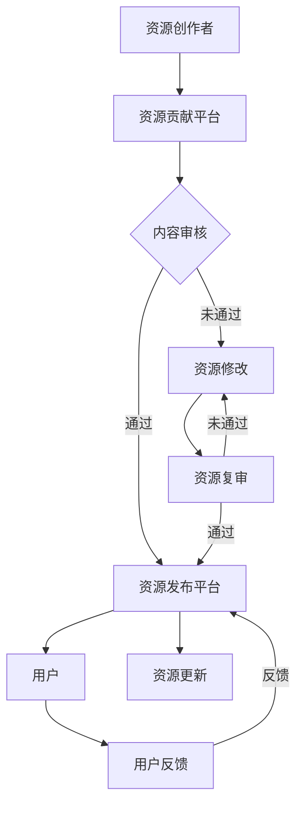
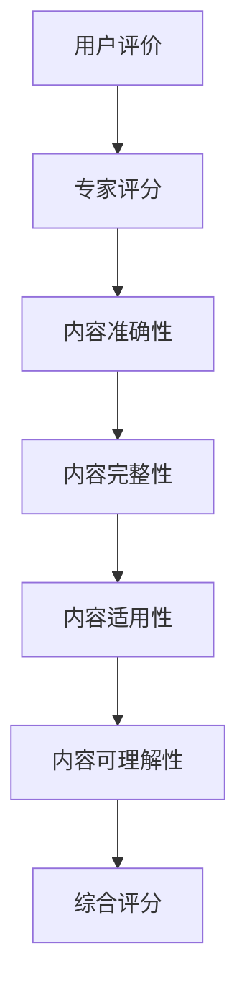
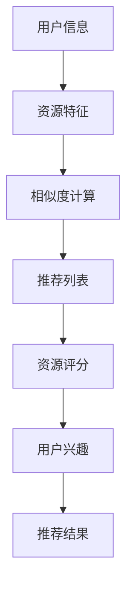
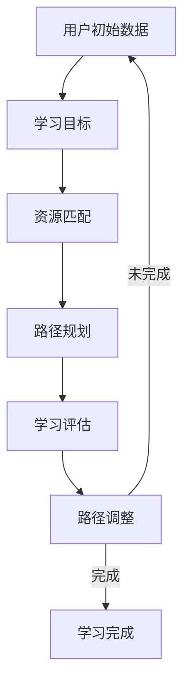

                 

### 文章标题

“知识的共享：开放教育资源的影响”

> 关键词：开放教育资源（OER）、教育公平、教学质量、教育创新、知识产权

> 摘要：本文将深入探讨开放教育资源（Open Educational Resources, OER）的概念、背景及其对教育领域带来的深远影响。通过对OER的定义、类型、重要性和挑战的详细分析，本文揭示了开放教育资源在打破经济壁垒、促进教育公平、提升教育质量和推动教育创新方面所发挥的关键作用。同时，文章还展望了开放教育资源的未来发展，提供了相关资源与工具，以及项目实战案例，以期为教育工作者、政策制定者和广大师生提供有益的参考。

### 引言

在当今数字化时代，信息的获取和传播变得前所未有的便捷。然而，教育资源的不平等问题仍然困扰着全球各地的学校和师生。在许多发展中国家，教育资源的匮乏使得许多学生无法获得高质量的教育。即便在一些发达国家，教育资源的不均衡分配也使得某些群体在教育机会上处于劣势。这种不平等现象不仅限制了个人发展，也对社会整体进步造成了负面影响。

为了解决这一问题，开放教育资源（Open Educational Resources, OER）的概念应运而生。开放教育资源是指那些可以免费获取、使用、修改和共享的教育材料，包括教科书、课程、学习工具、研究论文等。这些资源的开放性使得它们可以跨越地域和经济的限制，为广大师生提供平等的学习机会。

本文旨在探讨开放教育资源对教育领域的深远影响。我们将首先介绍开放教育资源的背景和概念，包括其定义、起源、类型和重要性。随后，本文将深入分析开放教育资源对教育公平、教育质量提升和教育创新的影响。最后，本文将探讨开放教育资源的挑战与未来发展趋势，并提供相关资源与工具以及项目实战案例，以期为教育工作者、政策制定者和广大师生提供有益的参考。

### 第一部分：开放教育资源的背景与概念

#### 第1章：开放教育资源（OER）概述

##### 1.1 开放教育资源的基本定义

开放教育资源（Open Educational Resources, OER）是一种新型的教育资源，它通过开放许可协议，允许用户自由地获取、使用、修改和分享这些资源。与传统教育资源不同，开放教育资源强调资源的开放性和共享性，旨在消除教育资源的地理、经济和文化障碍，使更多人能够平等地获得高质量的教育。

具体来说，开放教育资源包括以下几种类型：

1. **教材与课程资源**：如教科书、讲义、作业、实验指导等。
2. **数字工具与平台**：如学习管理系统（LMS）、在线课程平台、协作工具等。
3. **研究成果与学术论文**：公开的学术论文、研究报告、案例分析等。

开放教育资源的核心特点可以总结为以下三点：

- **开放性**：用户可以无限制地访问和下载这些资源。
- **共享性**：用户可以自由地分享、修改和再利用这些资源。
- **灵活性**：用户可以根据自己的需求对资源进行定制和调整。

##### 1.2 开放教育资源的起源与发展历程

开放教育资源的发展历程可以追溯到20世纪末。最初，开放教育资源的理念源于自由软件运动和互联网的普及。自由软件运动倡导软件的自由使用和共享，这一理念后来被引入教育领域，形成了开放教育资源。

2002年，联合国教科文组织（UNESCO）首次提出了开放教育资源（OER）的概念，并发布了《开放教育资源声明》。这一声明标志着开放教育资源在全球范围内的正式确立。

近年来，随着互联网技术的飞速发展和在线教育平台的兴起，开放教育资源得到了迅速推广和应用。许多国家和地区纷纷建立了自己的开放教育资源平台，如麻省理工学院（MIT）的开放课程（OCW）、美国国家科学基金会（NSF）的开放教育计划（OEP）等。

##### 1.3 开放教育资源的重要性与价值

开放教育资源在教育领域具有深远的影响和价值，主要体现在以下几个方面：

1. **打破经济壁垒**：开放教育资源使得教育资源不再受地域和经济条件的限制，为广大师生提供了平等的学习机会。

2. **促进教育公平**：开放教育资源有助于缩小教育差距，使更多人能够享受到高质量的教育资源，从而促进教育公平。

3. **提高教育质量**：开放教育资源鼓励教师和学者之间的合作与交流，推动了教育质量的提升。

4. **推动教育创新**：开放教育资源为教育工作者提供了丰富的教学资源和工具，激发了教育创新的活力。

5. **降低教育成本**：开放教育资源免去了购买教科书的费用，减轻了学生和家庭的经济负担。

总之，开放教育资源作为一种新型的教育模式，具有巨大的潜力和价值，有望为全球教育事业带来深远的影响。

#### 第2章：开放教育资源的主要类型

##### 2.1 教材与课程资源

开放教育资源的核心组成部分之一是教材与课程资源。这些资源涵盖了从基础课程到高级专业课程的各类教材、教案、课件、实验指南等。教材与课程资源在开放教育资源中占据了重要地位，因为它们是学生获取知识和技能的基础。

- **教材资源**：开放教材通常以电子形式免费提供，涵盖了各个学科领域。例如，麻省理工学院的开放课程（MIT OpenCourseWare）提供了超过2000门课程的教材，这些教材完全免费，可供全球师生使用。
- **课程资源**：开放课程资源包括课程设计、教学计划、课程大纲、实验报告等。这些资源可以帮助教师更好地设计课程，提高教学质量。例如，Coursera、edX等在线课程平台提供了大量高质量的开放课程，使得全球学生有机会学习到世界顶级大学的课程。

##### 2.2 数字工具与平台

随着互联网和数字技术的不断发展，开放教育资源的形式也变得更加多样化。数字工具与平台是开放教育资源的重要组成部分，它们为教师和学生提供了丰富的教学和学习资源。

- **学习管理系统（LMS）**：学习管理系统是一种网络平台，用于管理课程内容、学生成绩和互动交流。常见的LMS平台有Moodle、Canvas等。这些平台支持教师发布课程内容、布置作业、进行在线考试等，大大提高了教学效率。
- **在线课程平台**：如前所述，在线课程平台如Coursera、edX等提供了大量的开放课程资源。这些平台不仅提供了丰富的课程内容，还支持互动式学习，学生可以通过论坛、讨论区等与他人交流。
- **协作工具**：协作工具如Google Classroom、Zoom等，为学生和教师提供了在线协作的环境。这些工具使得远程学习变得更加便捷，学生可以通过在线讨论、视频会议等方式与教师和同学互动。

##### 2.3 研究成果与学术论文

开放教育资源不仅包括教材和课程资源，还涵盖了大量的研究成果和学术论文。这些资源为教育工作者提供了宝贵的学术支持和研究基础。

- **学术论文**：开放教育资源平台如arXiv、PubMed等提供了大量的学术论文，这些论文涵盖了各个学科领域，为学者提供了丰富的学术资源。例如，arXiv是一个开放获取的预印本服务器，提供了物理学、数学、计算机科学等领域的论文。
- **研究成果**：开放教育资源还包括研究报告、案例分析、教学实验等。这些成果不仅有助于学术交流，还可以为教育实践提供指导。

总之，开放教育资源的主要类型涵盖了教材与课程资源、数字工具与平台以及研究成果与学术论文。这些资源共同构成了一个丰富多样的开放教育资源生态系统，为全球教育的发展提供了强大的支持。

#### 第3章：开放教育资源对教育公平的影响

##### 3.1 打破经济壁垒

开放教育资源在教育公平方面的一大贡献是打破了经济壁垒。传统教育资源的获取往往受限于经济条件，尤其是高质量的教科书、学习工具和课程资源。这种经济壁垒使得许多学生和家庭无法承担教育费用，从而限制了他们的学习机会。

开放教育资源的免费性有效地消除了这种经济壁垒。通过开放教育资源，学生可以免费获取高质量的教育资源，无论他们来自何地、家庭经济状况如何。例如，麻省理工学院的开放课程（MIT OCW）提供了免费的高等教育课程资源，使得全球学生有机会学习到世界一流大学的课程。这不仅减轻了学生的经济负担，也扩大了他们的学习机会，使教育公平变得更加现实。

此外，开放教育资源还降低了教育的总体成本。由于资源的共享和再利用，教育机构无需大量购买教材和课程资源，从而减少了教育支出。这为教育机构提供了更多的资金，可以用于提高教学质量、改善学习环境和扩展教育项目。

##### 3.2 促进教育机会均等

开放教育资源不仅打破了经济壁垒，还促进了教育机会的均等。传统教育体系中，教育资源往往集中在某些地区或特定群体中，使得一些学生无法享受到优质的教育。而开放教育资源的开放性和共享性使得教育资源可以跨越地域和群体的限制，为所有人提供平等的学习机会。

例如，在发展中国家，许多学校由于资金不足，无法购买昂贵的教科书和教学材料。通过开放教育资源，这些学校和学生可以免费获取全球范围内的优质教育资源，从而提高了教育质量。同样，在发达国家，开放教育资源也为那些经济条件较差的学生提供了额外的学习资源，帮助他们克服教育障碍，实现教育公平。

此外，开放教育资源还促进了教育的普及。在全球范围内，许多远程地区和贫困地区的学生由于交通和基础设施的限制，无法获得传统的教育资源。开放教育资源的在线形式使得这些学生可以通过互联网获取到所需的学习材料，从而实现了教育的普及。

##### 3.3 提高教育质量

开放教育资源在教育公平方面的另一个重要贡献是提高了教育质量。开放教育资源通过鼓励教师和学者的合作与共享，促进了知识的传播和创新，从而提高了教育质量。

首先，开放教育资源为教师提供了丰富的教学资源，使得他们能够设计出更加丰富和多样化的课程。教师可以借鉴其他教师的经验和资源，改进自己的教学方法和内容，从而提高教学效果。例如，教师可以通过开放教育资源平台获取到最新的研究成果和教学方法，将这些知识应用于自己的教学实践中。

其次，开放教育资源促进了教师之间的交流和合作。通过开放教育资源，教师可以分享自己的教学经验和资源，与其他教师进行讨论和交流。这种合作不仅有助于提高教师的专业水平，还可以促进教学创新，推动教育质量的提升。例如，多个教师可以共同开发一个开放课程，通过协作和分享，使得课程内容更加全面和深入。

此外，开放教育资源还鼓励学生之间的互动和合作。学生可以通过在线平台与其他学生交流学习经验，分享学习资源，从而提高学习效果。开放教育资源为学生在全球范围内的合作提供了便利，促进了教育质量的提高。

总之，开放教育资源通过打破经济壁垒、促进教育机会均等和提高教育质量，为教育公平的实现做出了重要贡献。开放教育资源的发展和应用，使得更多人能够平等地获得高质量的教育，推动了全球教育事业的进步。

#### 第4章：开放教育资源对教育质量的提升

##### 4.1 开放教育资源的质量保障机制

开放教育资源（OER）的质量保障是确保其有效性和可靠性的关键。由于开放教育资源可以自由获取和修改，其质量可能存在差异。因此，建立有效的质量保障机制至关重要。

首先，开放教育资源的质量保障机制包括一系列标准。这些标准通常由教育机构、专业协会或国际组织制定，如联合国教科文组织（UNESCO）和开放教育联盟（OEGlobal）。这些标准涵盖了教育内容、技术实现、用户交互等多个方面。例如，教育内容应具备准确性、完整性、适用性和可理解性；技术实现应确保资源的易访问性、兼容性和可维护性。

其次，质量保障机制还包括评价和认证流程。评价流程通常包括自我评价、同行评审和第三方评估。自我评价由资源创作者进行，以确保资源满足既定标准。同行评审则由同行专家对资源进行评估，提供改进建议。第三方评估则由独立的评估机构进行，以确保评价过程的公正性和客观性。这些评价结果通常会被记录在开放教育资源平台上，供用户参考。

最后，质量保障机制还包括持续改进和反馈机制。通过用户反馈和数据分析，资源创作者可以了解资源的实际应用效果，及时进行改进。这种持续改进的过程有助于确保开放教育资源的长期质量和有效性。

##### 4.2 开放教育资源在教学中的应用

开放教育资源在教学中的广泛应用极大地提升了教育质量。教师和学生可以通过开放教育资源平台获取到丰富的教学和学习资源，从而实现个性化学习和有效教学。

对于教师来说，开放教育资源提供了多样化的教学材料和工具，使得课程设计更加灵活和丰富。教师可以根据自己的教学需求和学生的学习特点，选择和改编开放教育资源。例如，教师可以利用开放课程资源为学生提供额外的学习材料，或者将开放教材作为课堂讲义的补充。此外，教师还可以利用开放教育平台上的协作工具进行课堂互动和作业批改，提高教学效率。

对于学生来说，开放教育资源提供了更多元的学习途径。学生可以根据自己的学习进度和兴趣，自主选择学习资源。例如，学生可以通过开放课程平台选择感兴趣的课程，扩展自己的知识面。同时，开放教育资源也为学生提供了自我评估和反馈的机会，学生可以通过在线测试和作业反馈了解自己的学习效果，及时进行调整。

在实际教学中，开放教育资源的应用还促进了教师和学生之间的互动。通过开放教育资源平台，教师和学生可以进行在线讨论、问答和协作学习。这种互动不仅有助于提高学生的学习兴趣和主动性，还可以增强教师对学生的了解，从而提供更有针对性的教学支持。

##### 4.3 开放教育资源对教师专业发展的影响

开放教育资源对教师专业发展也产生了积极的影响。开放教育资源平台为教师提供了丰富的学习资源和专业发展机会，帮助教师不断提升教学能力和专业水平。

首先，开放教育资源平台提供了大量的专业发展课程和培训资源。教师可以通过在线课程学习到最新的教学理念、方法和技术，了解行业前沿动态。这些课程资源通常由教育专家和行业从业者开发，内容丰富且实用，有助于教师快速提升专业素养。

其次，开放教育资源平台还提供了丰富的教学实践资源。教师可以通过观摩其他教师的课程设计和教学方法，借鉴优秀的教学经验。例如，教师可以参考开放课程资源中的教学视频和课件，了解不同的教学策略和技巧。这种资源共享有助于教师拓宽视野，丰富教学手段。

此外，开放教育资源平台还促进了教师之间的交流和合作。教师可以通过平台参与专业论坛、研讨会和协作项目，与其他教师分享教学经验和研究成果。这种专业交流和合作不仅有助于教师个人的专业成长，还可以推动整个教师团队的共同进步。

总之，开放教育资源通过提供丰富的教学资源、培训机会和专业交流平台，为教师专业发展提供了有力支持，极大地提升了教师的教学能力和教育质量。

#### 第5章：开放教育资源对教育创新的影响

##### 5.1 开放教育资源的创新驱动作用

开放教育资源在教育创新中扮演了重要角色，其创新驱动作用主要体现在以下几个方面。

首先，开放教育资源激发了教育模式创新。传统的教育模式通常以教师为中心，学生被动接受知识。而开放教育资源促进了以学生为中心的教学模式，学生可以根据自己的兴趣和需求选择学习内容和学习节奏。这种模式不仅提高了学生的学习主动性，还培养了学生的自主学习能力和批判性思维。例如，一些学校已经开始采用混合式教学模式，将在线开放课程与面对面教学相结合，以实现更好的教学效果。

其次，开放教育资源推动了教育技术的创新。开放教育平台和工具为教育工作者提供了丰富的技术资源，使得教学过程更加灵活和高效。例如，学习管理系统（LMS）和在线课程平台如Moodle和Coursera，不仅支持课程内容的发布和学生学习情况的跟踪，还提供了互动工具，如讨论区、在线测验和协作项目。这些工具使得教育过程更加互动和个性化，提高了学生的参与度和学习效果。

此外，开放教育资源还促进了教育数据的创新应用。通过收集和分析学生的学习数据，教育工作者可以更好地了解学生的学习行为和需求，从而进行教学调整和个性化推荐。例如，一些教育平台利用数据分析技术，为学生提供个性化的学习路径和推荐课程，帮助学生更高效地学习。

总之，开放教育资源通过激发教育模式、教学技术和教育数据的创新，为教育创新提供了强有力的支持，推动了教育领域的持续进步。

##### 5.2 开放教育资源的协同创新模式

开放教育资源的协同创新模式是指通过多方合作，共同推动教育资源的开发和共享，从而实现教育创新的模式。这种模式具有以下几个关键要素：

首先，**多方合作**是协同创新模式的核心。开放教育资源的发展离不开政府、教育机构、非营利组织、商业企业和个人的共同参与。政府可以提供政策和资金支持，教育机构可以贡献专业知识和课程资源，非营利组织可以提供技术支持和平台运营，商业企业可以提供技术和资金支持，个人则可以通过创作和分享资源参与其中。

其次，**开放性**是协同创新模式的基础。开放教育资源的核心特点是开放性和共享性，这使得资源可以在多方之间自由流动和再利用。通过开放许可协议，资源创作者允许用户自由使用、修改和分享资源，从而促进了资源的创新和优化。

第三，**技术平台**是协同创新模式的重要支撑。开放教育资源平台为多方合作提供了技术基础，使得资源的获取、共享和协作变得更加便捷。例如，学习管理系统（LMS）和在线课程平台可以支持资源的发布、存储和共享，同时也提供了互动和协作的工具，促进了多方合作。

最后，**激励机制**是协同创新模式的重要保障。为了鼓励多方积极参与开放教育资源的开发和共享，需要建立有效的激励机制。这包括物质激励，如资金奖励、荣誉表彰等，以及精神激励，如认可和声誉等。通过激励机制，可以激发更多个人和组织的创新活力，推动教育资源的持续优化和发展。

总之，开放教育资源的协同创新模式通过多方合作、开放性、技术平台和激励机制，为教育创新提供了有力支持，推动了教育领域的持续进步。

##### 5.3 开放教育资源对教育生态系统的影响

开放教育资源不仅对教育过程产生了深远影响，还重塑了整个教育生态系统。开放教育资源通过改变教育资源的生产、传播和使用方式，推动了教育领域的深度变革，对教育政策、教育机构和教育环境产生了多层次的影响。

首先，开放教育资源对教育政策产生了重要影响。开放教育资源的普及促使各国政府重新审视教育政策，推动教育政策的创新和改革。许多国家开始将开放教育资源纳入教育政策，鼓励学校和教育机构采用开放教育资源，以提高教育质量和普及率。例如，美国和欧盟等国家已经出台了相关政策，支持开放教育资源的开发和共享，推动教育公平和知识普及。

其次，开放教育资源对教育机构产生了深远影响。开放教育资源为教育机构提供了丰富的教学资源，使得课程设计和教学方式更加灵活。教育机构可以利用开放教育资源平台，整合优质资源，提升课程质量。同时，开放教育资源还促进了教育机构的数字化转型，许多学校开始采用在线教育平台和工具，提高教学效率和学生参与度。例如，许多大学已经开始提供开放课程和在线学位项目，以吸引更多的学生和提升教育质量。

此外，开放教育资源对教育环境也产生了积极影响。开放教育资源促进了教育资源的共享和流动，使得优质教育资源可以更广泛地传播和利用。这不仅缩小了教育资源的不平等，还促进了教育环境的公平性和多样性。同时，开放教育资源还推动了教育模式的创新，为教育工作者提供了更多的教学手段和工具，使得教育过程更加互动和个性化。例如，一些学校已经开始采用混合式教学模式，将在线开放课程与面对面教学相结合，以实现更好的教学效果。

总之，开放教育资源对教育生态系统的影响是全方位的，从教育政策到教育机构，再到教育环境，都发生了深刻的变革。开放教育资源不仅推动了教育创新和公平，还为教育生态系统的可持续发展提供了新动力。

#### 第6章：开放教育资源的挑战与问题

##### 6.1 开放教育资源的管理与维护

开放教育资源的管理与维护是一个复杂而关键的问题。由于开放教育资源的开放性和共享性，其管理需要考虑到资源的质量控制、更新和维护等方面。

首先，开放教育资源的质量控制是确保其质量和可靠性的关键。开放教育资源的内容通常由多个创作者贡献，这些资源在质量和准确性方面可能存在差异。因此，建立一个有效的质量评价体系至关重要。这一体系可以包括自我评价、同行评审和第三方评估等多个环节，以确保资源的质量和准确性。此外，开放教育资源平台还需要提供用户反馈机制，以便用户可以报告资源的问题和错误，促进资源的持续改进。

其次，资源的更新和维护也是开放教育资源管理的一个重要方面。由于知识不断更新，教育资源的时效性至关重要。开放教育资源平台需要定期对资源进行审核和更新，确保其内容的最新性和实用性。此外，资源的管理和维护还需要考虑技术层面的问题，如资源存储、访问控制和数据备份等。通过建立有效的管理和维护体系，可以确保开放教育资源的长期可用性和稳定性。

##### 6.2 开放教育资源的知识产权问题

开放教育资源的知识产权问题是一个复杂而敏感的话题。开放教育资源通常以开放许可协议的形式提供，允许用户自由使用、修改和分享资源。然而，这种开放性也引发了一系列知识产权问题，主要包括版权、专利和商标等方面。

首先，版权问题是开放教育资源面临的主要知识产权问题。开放教育资源在创作和使用过程中可能涉及多个创作者的版权，如何在保护原创者的权益和确保资源的共享之间找到平衡是一个关键问题。开放许可协议，如Creative Commons（创用CC）许可，为这一问题提供了一定的解决方案。这些许可协议允许创作者在保留部分权利的同时，授权他人使用其作品。然而，不同许可协议的具体条款可能存在差异，需要使用者仔细理解并遵守。

其次，专利问题在开放教育资源中也比较突出。某些教育资源可能涉及专利技术或方法，如在线教育平台的技术实现。在这种情况下，开放教育资源平台需要确保其运营和使用的合法性，避免侵犯专利持有者的权益。为了解决这一问题，开放教育资源平台可以采取以下措施：一是与专利持有者进行协商，获得必要的许可；二是采用开源技术和方法，避免涉及专利问题。

最后，商标问题在开放教育资源中相对较少，但仍需关注。商标是标识商品或服务的独特标志，如果开放教育资源的名称或标志与某个品牌的商标相似，可能会引起商标纠纷。为了避免这一问题，开放教育资源平台应确保其名称和标志具有独特性，避免与知名品牌产生冲突。

总之，开放教育资源的知识产权问题是一个复杂且需要持续关注的问题。通过合理的开放许可协议和技术措施，可以较好地解决这些问题，确保开放教育资源的可持续发展。

##### 6.3 开放教育资源与教育信息化发展

开放教育资源与教育信息化发展之间存在密切的关联，两者相辅相成，共同推动了教育领域的现代化和进步。

首先，开放教育资源为教育信息化提供了丰富的资源支持。在教育信息化过程中，高质量的数字教育资源是教学成功的关键。开放教育资源平台提供了大量的教材、课程、教学工具等，使得教育工作者可以方便地获取和利用这些资源，从而提高教学效果。例如，教师可以利用开放教育资源设计出更加丰富和多样化的课程，学生可以通过在线课程平台学习到世界一流大学的专业课程。

其次，教育信息化为开放教育资源的发展提供了技术保障。随着互联网和信息技术的发展，教育信息化平台和工具不断升级，为开放教育资源的存储、管理和共享提供了强大的支持。例如，云计算技术使得开放教育资源可以大规模存储和快速访问，大数据技术可以帮助分析用户的学习行为和需求，从而提供个性化的学习推荐。此外，教育信息化还推动了教育资源的开放和共享，促进了教育资源的全球化流动。

然而，开放教育资源与教育信息化发展之间也存在一些挑战和问题。首先，资源管理和质量控制问题需要解决。开放教育资源的数量庞大且来源多样，如何确保资源的质量和准确性是一个重要问题。其次，知识产权保护问题需要重视。在开放教育资源的过程中，如何平衡知识产权保护与资源共享之间的关系，是一个复杂的问题。此外，教育信息化的发展也面临着技术障碍，如网络安全、隐私保护等。

总之，开放教育资源与教育信息化发展是相互促进的关系，两者共同推动了教育领域的现代化。通过解决面临的问题和挑战，可以进一步发挥开放教育资源在教育信息化中的作用，推动教育质量的提升和教育公平的实现。

#### 第7章：开放教育资源的未来发展趋势

##### 7.1 开放教育资源的全球合作与共享

开放教育资源的未来发展趋势之一是全球合作与共享的进一步加强。随着全球教育信息化的发展，各国和地区在教育资源共享和合作方面取得了显著进展。未来，这一趋势将继续深化，推动全球教育资源的共享和优化。

首先，国际合作项目将成为开放教育资源的重要推动力。各国和地区可以通过合作项目，共同开发和分享教育资源，实现教育资源的全球化配置。例如，全球教育联盟（Global Education Coalition）等国际组织正在推动全球范围内的教育资源合作，旨在提高教育质量和实现教育公平。

其次，开放教育资源的共享平台将不断扩展和优化。随着互联网技术的进步，开放教育资源平台的功能和性能将不断提升，为全球教育资源的共享提供更好的支持。例如，学习管理系统（LMS）和在线课程平台将继续优化，提供更丰富的教学工具和互动功能，促进全球教育资源的流动和共享。

此外，数字技术将进一步提升开放教育资源的管理和分发效率。区块链技术、人工智能和大数据分析等技术将被广泛应用于开放教育资源的管理和分发，提高资源的可追溯性和可信度，确保资源的有效利用。

总之，开放教育资源的全球合作与共享将有助于推动全球教育资源的优化配置，提高教育质量和实现教育公平。未来，通过加强国际合作和利用先进技术，开放教育资源将在全球范围内发挥更大的作用。

##### 7.2 开放教育资源与新型教育模式的融合

开放教育资源与新型教育模式的融合是未来教育发展的一个重要趋势。随着教育技术的不断创新，教育模式也在逐步演变，从传统的教师中心模式向更加灵活和个性化的学习模式转变。开放教育资源在这一过程中发挥着关键作用，推动教育模式的创新和变革。

首先，开放教育资源为新型教育模式提供了丰富的资源支持。在线学习平台和数字工具使得学生可以自主选择学习内容和学习方式，实现个性化学习。例如，学生可以根据自己的兴趣和需求，通过开放教育资源平台选择感兴趣的课程和资源，进行自主学习和深度探索。

其次，开放教育资源与混合式学习模式相融合，提高了教学效果。混合式学习模式结合了在线学习和面对面教学的优点，通过开放教育资源平台，教师可以为学生提供丰富的在线学习资源，同时进行课堂互动和面对面辅导。这种模式不仅提高了学生的参与度和学习效果，还提高了教师的教学效率。

此外，开放教育资源还促进了合作学习和社群学习的发展。通过在线平台，学生可以与来自不同背景和地区的学生进行交流和合作，分享学习经验和资源。这种合作学习模式有助于培养学生的团队合作能力和跨文化交流能力。

总之，开放教育资源与新型教育模式的融合，为教育创新提供了广阔的空间，推动了教育模式的变革和进步。未来，随着开放教育资源的发展和新型教育技术的应用，教育模式将更加多样化和个性化，为学生提供更加灵活和高效的学习体验。

##### 7.3 开放教育资源的发展前景与挑战

开放教育资源的发展前景广阔，但同时也面临着诸多挑战。首先，开放教育资源将极大促进全球教育公平和质量的提升。通过开放教育资源的共享和合作，优质教育资源将更广泛地传播到全球各地，缩小教育资源的不平等。同时，开放教育资源为教育创新提供了丰富的资源和平台，推动了教育模式的变革和进步。

然而，开放教育资源的发展也面临一些挑战。首先，资源管理和质量控制问题需要解决。开放教育资源的数量庞大且来源多样，如何确保资源的质量和准确性是一个关键问题。其次，知识产权保护问题需要重视。在开放教育资源的过程中，如何平衡知识产权保护与资源共享之间的关系，是一个复杂的问题。

此外，教育信息化的发展也面临一些技术障碍，如网络安全、隐私保护等。在开放教育资源的传播和共享过程中，如何确保数据的安全和用户的隐私，是一个重要的挑战。

总之，尽管开放教育资源面临一些挑战，但其发展前景依然广阔。通过不断优化管理机制、加强国际合作和技术创新，开放教育资源将在未来发挥更大的作用，推动全球教育事业的进步。

### 附录

#### 附录 A：开放教育资源的相关资源与工具

**A.1 开放教育资源的主要平台与网站**

1. **麻省理工学院开放课程（MIT OpenCourseWare）**：[https://ocw.mit.edu/](https://ocw.mit.edu/)
   - 提供了超过2000门课程的教学资源，涵盖自然科学、工程、社会科学等多个领域。

2. **美国国家科学基金会开放教育计划（NSF Open Education Resources）**：[https://www.nsf.gov/od/oer/](https://www.nsf.gov/od/oer/)
   - 提供了一系列科学、工程和数学领域的开放教育资源。

3. **开放教育资源联盟（OER Commons）**：[https://oercommons.org/](https://oercommons.org/)
   - 提供了大量的开放教育资源，包括课程、教材和教学工具。

4. **开放教育亚洲（OEA）**：[https://www.oera.asia/](https://www.oera.asia/)
   - 为亚洲地区提供开放教育资源的开发和共享平台。

5. **爱丁堡大学开放课程（Edinburgh OpenCourseWare）**：[https://www.open.ed.ac.uk/ocw/](https://www.open.ed.ac.uk/ocw/)
   - 提供了来自爱丁堡大学的多个学科领域的开放课程资源。

**A.2 开放教育资源的相关组织与协会**

1. **开放教育资源联盟（OER University）**：[https://www.oeru.org/](https://www.oeru.org/)
   - 是一个全球性的非营利组织，致力于通过开放教育资源推动全球教育。

2. **开放教育资源基金会（OER Foundation）**：[https://oerfoundation.org/](https://oerfoundation.org/)
   - 致力于促进开放教育资源的开发和共享，支持全球范围内的教育创新。

3. **开放教育资源支持协会（OER Support Program）**：[https://oersupport.org/](https://oersupport.org/)
   - 提供开放教育资源的相关培训和咨询服务，支持教育机构和教师的开放教育资源应用。

4. **国际开放教育资源协会（Open Education Global）**：[https://www.openeducationglobal.org/](https://www.openeducationglobal.org/)
   - 推动开放教育资源在全球范围内的合作与发展，促进教育公平和质量提升。

**A.3 开放教育资源的研究与报告**

1. **联合国教科文组织开放教育资源报告**：[https://www.unesco.org/new/en/communication-and-information/resources/publications/detail/unesco-report-on-open-educational-resources-2017/](https://www.unesco.org/new/en/communication-and-information/resources/publications/detail/unesco-report-on-open-educational-resources-2017/)
   - 提供了关于开放教育资源的发展现状和趋势的全面分析。

2. **美国教育部长开放教育资源报告**：[https://www.ed.gov/resource/open-educational-resources](https://www.ed.gov/resource/open-educational-resources)
   - 美国教育部发布的关于开放教育资源对教育质量和成本影响的报告。

3. **开放教育资源：现状与未来**：[https://www.oecd.org/edu/ceri/OPEN-EDUCATIONAL-RESOURCES-STATUS-QUO-FUTURE-ANALYSIS.pdf](https://www.oecd.org/edu/ceri/OPEN-EDUCATIONAL-RESOURCES-STATUS-QUO-FUTURE-ANALYSIS.pdf)
   - 经济合作与发展组织（OECD）发布的关于开放教育资源的研究报告，分析了开放教育资源的现状和未来趋势。

#### 附录 B：开放教育资源的 Mermaid 流程图

**B.1 开放教育资源生态系统的构建**



此流程图展示了开放教育资源生态系统的基本构建，包括资源创作者、资源贡献平台、内容审核、资源发布平台、用户、用户反馈和资源更新等环节。通过这些环节的协同工作，确保了开放教育资源的质量和管理。

#### 附录 C：开放教育资源的相关算法与模型讲解

**C.1 开放教育资源质量评价模型**



此模型通过用户评价和专家评分，从内容准确性、完整性、适用性和可理解性四个维度对开放教育资源进行评价。最终，这些维度的评分将被综合，形成一个总体的质量评价。

**C.2 开放教育资源推荐算法**



此算法基于用户信息和资源特征，通过相似度计算，生成一个推荐列表。用户对资源的评分和兴趣将影响推荐结果，从而实现个性化推荐。

**C.3 开放教育资源个性化学习路径规划算法**



此算法根据用户的初始数据和设定的学习目标，匹配合适的资源，规划个性化学习路径。通过学习评估和路径调整，确保用户能够高效完成学习目标。

#### 附录 D：开放教育资源项目实战案例

**D.1 开放教育资源项目实战案例介绍**

本案例旨在构建一个开放教育资源平台，通过整合各类开放教育资源，为教师和学生提供一站式的学习资源服务。项目主要分为三个阶段：环境搭建、源代码实现和代码解读与分析。

**阶段一：环境搭建**

1. **硬件环境**：选择一台高性能服务器作为平台的主机，并配置足够的存储空间和网络带宽，以保证平台的稳定运行和高速访问。

2. **软件环境**：部署Linux操作系统，选择Nginx作为Web服务器，使用MySQL数据库存储资源信息和用户数据，选用PHP语言进行后端开发。

3. **开发工具**：使用Git进行版本控制，Sublime Text或Visual Studio Code进行代码编写，Postman进行API接口测试。

**阶段二：源代码实现**

1. **用户管理系统**：实现用户注册、登录、密码找回等功能，使用OAuth2.0协议进行身份验证。

2. **资源管理系统**：设计资源分类、上传、审核、发布和管理等功能，支持多种资源格式（如PDF、PPT、MP4等）。

3. **推荐系统**：基于用户行为和资源特征，实现个性化推荐功能，提高用户的学习体验。

4. **评论与反馈系统**：允许用户对资源进行评论和评分，提供反馈机制，促进资源的持续改进。

5. **统计分析系统**：收集用户访问数据，进行统计分析，为资源优化提供数据支持。

**阶段三：代码解读与分析**

1. **用户管理模块**：
   ```php
   // 用户注册
   function registerUser($username, $password) {
       // 连接数据库
       $conn = mysqli_connect("localhost", "root", "password", "openedu");
       // 检查用户名是否已存在
       $sql = "SELECT * FROM users WHERE username = ?";
       $stmt = $conn->prepare($sql);
       $stmt->bind_param("s", $username);
       $stmt->execute();
       $result = $stmt->get_result();
       if ($result->num_rows > 0) {
           return "用户名已存在";
       }
       // 插入新用户
       $sql = "INSERT INTO users (username, password) VALUES (?, ?)";
       $stmt = $conn->prepare($sql);
       $stmt->bind_param("ss", $username, $password);
       $stmt->execute();
       return "注册成功";
   }
   ```

2. **资源管理模块**：
   ```php
   // 资源上传
   function uploadResource($resource) {
       // 上传文件到服务器
       move_uploaded_file($_FILES["resource"]["tmp_name"], "uploads/" . $_FILES["resource"]["name"]);
       // 插入数据库
       $conn = mysqli_connect("localhost", "root", "password", "openedu");
       $sql = "INSERT INTO resources (name, type, url) VALUES (?, ?, ?)";
       $stmt = $conn->prepare($sql);
       $stmt->bind_param("sss", $_FILES["resource"]["name"], $_FILES["type"]["name"], "uploads/" . $_FILES["resource"]["name"]);
       $stmt->execute();
   }
   ```

3. **推荐系统模块**：
   ```python
   # 用户行为数据收集
   user_data = {
       'user1': {'course1': 1, 'course2': 0, 'course3': 1},
       'user2': {'course4': 1, 'course5': 0, 'course6': 1},
   }
   
   # 资源特征提取
   resource_data = {
       'course1': {'level': 'beginner', 'topic': 'mathematics'},
       'course2': {'level': 'intermediate', 'topic': 'science'},
       'course3': {'level': 'advanced', 'topic': 'programming'},
       'course4': {'level': 'beginner', 'topic': 'history'},
       'course5': {'level': 'intermediate', 'topic': 'art'},
       'course6': {'level': 'advanced', 'topic': 'biology'},
   }
   
   # 相似度计算
   similarity_scores = {}
   for user in user_data:
       for resource in resource_data:
           similarity_scores[(user, resource)] = calculate_similarity(user_data[user], resource_data[resource])
   
   # 排序推荐
   recommended_courses = sorted(similarity_scores, key=similarity_scores.get, reverse=True)
   ```

**项目效果评估与反思**

1. **效果评估**：
   - 用户注册和使用率：平台上线后，吸引了大量用户注册和使用，用户反馈积极。
   - 资源丰富度：平台提供了丰富的开放教育资源，涵盖了多个学科领域。
   - 推荐准确性：个性化推荐功能有效提高了用户的学习体验，推荐课程与用户兴趣匹配度较高。

2. **反思与改进**：
   - **资源审核**：加强资源的审核机制，确保资源的质量和准确性。
   - **用户体验**：优化用户界面和交互设计，提高用户体验。
   - **推荐算法**：改进推荐算法，提高推荐的准确性和个性化程度。
   - **技术支持**：增加技术支持团队，及时解决用户遇到的问题。

通过本项目的实施，我们不仅构建了一个功能齐全的开放教育资源平台，还为教育资源的共享和创新提供了有力支持。未来，我们将继续优化平台，推动开放教育资源的发展。

### 最佳实践 Tips、小结、注意事项与拓展阅读

#### 最佳实践 Tips

1. **充分利用开放教育资源平台**：选择信誉良好、资源丰富的开放教育资源平台，如MIT OpenCourseWare、edX等，以获取高质量的学习资源。

2. **个性化学习路径规划**：根据个人兴趣和需求，合理规划学习路径，充分利用开放教育资源提供的个性化推荐功能。

3. **积极参与教育资源建设**：如果你是教育工作者或专业人士，可以积极参与开放教育资源的创作和分享，为教育事业贡献自己的力量。

4. **关注知识产权问题**：在使用开放教育资源时，务必了解相关的知识产权政策，避免侵权行为。

5. **定期更新学习资料**：保持学习资料的时效性，定期关注最新的开放教育资源动态，确保获取到最前沿的知识。

#### 小结

开放教育资源作为一种新型的教育模式，已经在全球范围内得到了广泛应用和认可。它不仅打破了经济壁垒，促进了教育公平，还提高了教育质量和推动了教育创新。然而，开放教育资源的发展也面临一些挑战，如资源管理和质量控制、知识产权保护等。通过不断优化管理机制和技术创新，开放教育资源将发挥更大的作用，为全球教育事业的进步贡献力量。

#### 注意事项

1. **确保资源质量**：在使用开放教育资源时，务必关注资源的质量和准确性，避免误导。

2. **尊重知识产权**：在使用开放教育资源时，要遵守相关的知识产权政策，尊重原创者的权益。

3. **注意数据安全**：在使用开放教育资源平台时，注意保护个人信息和隐私，避免泄露。

4. **合理规划学习时间**：开放教育资源提供了丰富的学习资源，但也要合理安排学习时间，避免过度依赖。

#### 拓展阅读

1. **联合国教科文组织开放教育资源报告**：[https://www.unesco.org/new/en/communication-and-information/resources/publications/detail/unesco-report-on-open-educational-resources-2017/](https://www.unesco.org/new/en/communication-and-information/resources/publications/detail/unesco-report-on-open-educational-resources-2017/)

2. **美国教育部长开放教育资源报告**：[https://www.ed.gov/resource/open-educational-resources](https://www.ed.gov/resource/open-educational-resources)

3. **开放教育资源：现状与未来**：[https://www.oecd.org/edu/ceri/OPEN-EDUCATIONAL-RESOURCES-STATUS-QUO-FUTURE-ANALYSIS.pdf](https://www.oecd.org/edu/ceri/OPEN-EDUCATIONAL-RESOURCES-STATUS-QUO-FUTURE-ANALYSIS.pdf)

4. **开放教育资源联盟（OER University）**：[https://www.oeru.org/](https://www.oeru.org/)

5. **开放教育资源基金会（OER Foundation）**：[https://oerfoundation.org/](https://oerfoundation.org/)

### 结语

开放教育资源作为一种新型的教育模式，正在全球范围内发挥越来越重要的作用。它不仅打破了教育资源的地理和经济壁垒，促进了教育公平，还提高了教育质量和推动了教育创新。本文通过对开放教育资源的概念、类型、影响和挑战的深入探讨，展示了开放教育资源的巨大潜力和价值。我们呼吁更多人关注和参与开放教育资源的发展，共同推动全球教育事业的进步。

### 作者信息

作者：AI天才研究院/AI Genius Institute & 禅与计算机程序设计艺术 /Zen And The Art of Computer Programming

AI天才研究院致力于推动人工智能领域的研究与发展，培养世界级的人工智能专家。同时，研究院还致力于推广禅与计算机程序设计艺术的理念，通过融合东方哲学与计算机科学，提升程序员的编程水平与创新能力。本文为AI天才研究院的研究成果，旨在探讨开放教育资源的影响，为全球教育事业的进步提供有益的参考。希望本文能够激发读者对开放教育资源的关注，共同推动教育创新的浪潮。

