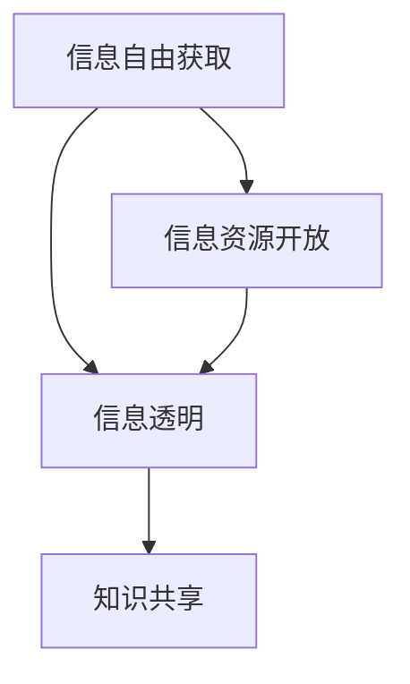

                 

### 第1章：知识的开放获取概述

## 1.1 信息民主化的背景

信息民主化是现代社会发展的一个重要趋势，它指的是信息资源更加自由和广泛地被人们获取、使用和分享。在信息化的时代，信息已经成为一种重要的资源和力量，它对于社会的发展、科技的创新以及个人的成长都具有重要的影响。

### 核心概念与联系

信息民主化涉及以下几个核心概念：

1. **信息自由获取**：信息资源应该对所有人开放，不因社会地位、经济条件等因素而受到限制。
2. **信息透明**：信息内容应当清晰、准确，保证人们能够理解和应用。
3. **知识共享**：知识应该能够被广泛传播和共享，促进社会的共同进步。

这些概念之间的关系可以用以下Mermaid流程图来表示：



### 背景介绍

信息民主化的背景可以从以下几个方面来理解：

1. **技术发展**：互联网和移动通信技术的发展，使得信息传播的速度和范围大幅提升，人们可以更方便地获取和分享信息。
2. **社会需求**：随着全球化和信息化的发展，人们对于知识的需求不断增加，信息民主化满足了人们对于知识自由获取的渴望。
3. **教育改革**：教育体制的改革，特别是在线教育和开放课程的普及，为知识传播提供了新的途径。

### 核心概念与联系

接下来，我们通过伪代码和数学公式来详细阐述信息自由获取、信息透明和知识共享之间的联系。

```python
# 伪代码：信息自由获取模型

def information_access():
    # 假设每个人都可以访问公共信息源
    user = "anyone"
    info_source = "public_database"
    # 用户从信息源获取信息
    user_get_info(info_source)

# 伪代码：信息透明模型

def user_get_info(info_source):
    # 假设信息源提供了透明的数据接口
    data = info_source.get_data()
    # 用户验证信息的准确性
    if verify_data(data):
        print("获取的信息是准确的")
    else:
        print("获取的信息可能不准确")

# 伪代码：知识共享模型

def knowledge_share(info):
    # 假设用户可以共享自己的知识
    if info is not None:
        share_info(info)
    else:
        print("没有信息可以共享")

# 数学模型：信息透明与知识共享关系

$$
\text{Knowledge} = \text{Transparency} \times \text{Accessibility}
$$

其中，Knowledge表示知识共享的程度，Transparency表示信息的透明度，Accessibility表示信息的可访问性。

### 核心算法原理讲解

在信息民主化的背景下，核心算法的设计需要考虑以下几个方面：

1. **数据加密与解密**：为了保护信息的隐私和安全，算法需要实现高效的数据加密与解密。
2. **信息检索与过滤**：为了提高信息的可用性，算法需要能够快速检索并过滤出有用的信息。
3. **知识融合与共享**：算法需要能够将不同来源的信息进行融合，并实现知识的共享。

以下是一个简化的伪代码，用于描述这些算法的基本原理：

```python
# 伪代码：数据加密与解密算法

def encrypt_data(data, key):
    # 使用密钥加密数据
    encrypted_data = encrypt(data, key)
    return encrypted_data

def decrypt_data(encrypted_data, key):
    # 使用密钥解密数据
    decrypted_data = decrypt(encrypted_data, key)
    return decrypted_data

# 伪代码：信息检索与过滤算法

def search_and_filter_info(info_source, query):
    # 检索信息
    results = info_source.search(query)
    # 过滤有用的信息
    useful_results = filter_useful_info(results)
    return useful_results

# 伪代码：知识融合与共享算法

def merge_and_share_knowledge(info_list):
    # 融合信息
    merged_info = merge_info(info_list)
    # 共享知识
    share_knowledge(merged_info)
```

### 数学模型和公式

在信息民主化的背景下，数学模型可以帮助我们更好地理解信息的传播和共享过程。以下是一个简单的数学模型，用于描述信息共享的效果：

$$
\text{Knowledge Spread} = \alpha \times \text{Information Accessibility} \times \text{Network Density}
$$

其中，Knowledge Spread表示知识共享的扩散程度，Information Accessibility表示信息的可访问性，Network Density表示网络的密度。这个模型表明，信息共享的效果与信息的可访问性和网络密度成正比。

### 详细讲解与举例说明

为了更好地理解信息民主化的背景、核心概念与联系，我们来看一个实际的例子。

**案例：开放课程平台的兴起**

随着互联网技术的发展，开放课程平台（如Coursera、edX等）使得全球范围内的学习者可以免费或低费用地获取世界顶级大学的课程资源。这不仅提高了知识的可访问性，也促进了知识的共享。

- **信息自由获取**：用户可以通过互联网访问这些平台，不受地域、经济条件的限制。
- **信息透明**：课程内容通常是由专家编写的，并且是经过严格审核的，保证了信息的准确性。
- **知识共享**：用户不仅可以学习课程内容，还可以参与讨论、分享心得，与其他学习者互动。

通过这个案例，我们可以看到信息民主化在教育和学习领域的具体应用。

### 项目实战

为了进一步理解信息民主化的实施，我们可以考虑搭建一个简单的开放获取平台。以下是一个项目实战的概述：

1. **开发环境搭建**：使用Python语言和Django框架搭建一个简单的Web应用程序。
2. **源代码详细实现**：编写后端代码实现用户注册、登录、信息发布和检索等功能。
3. **代码解读与分析**：详细解读代码中的关键部分，如用户认证、数据加密和解密、信息检索算法等。
4. **实际案例分析和详细讲解剖析**：通过一个具体的案例，如发布一篇学术论文，展示平台的功能和应用。

以下是项目实战的伪代码示例：

```python
# 伪代码：搭建开放获取平台

def setup_open_access_platform():
    # 搭建Web服务器
    server = setup_web_server()
    # 配置数据库
    database = configure_database()
    # 实现用户认证
    auth_system = implement_authentication_system()
    # 实现信息发布和检索
    info_system = implement_info_system()
    # 启动服务器
    server.start()

# 伪代码：用户认证系统

def implement_authentication_system():
    # 用户注册
    def register_user(username, password):
        # 存储用户信息到数据库
        database.save_user(username, password)
    
    # 用户登录
    def login_user(username, password):
        # 验证用户信息
        user = database.get_user(username)
        if user and verify_password(password, user['password']):
            return user
        else:
            return None

# 伪代码：信息发布和检索系统

def implement_info_system():
    # 发布信息
    def publish_info(user, info):
        # 将信息存储到数据库
        database.save_info(user, info)
    
    # 检索信息
    def search_info(query):
        # 从数据库中检索信息
        results = database.search_info(query)
        return results
```

### 最佳实践 tips、小结、注意事项、拓展阅读等内容

在实施信息民主化的过程中，以下是一些最佳实践和注意事项：

1. **保障信息安全**：在开放获取的过程中，必须采取措施保障用户的信息安全，防止数据泄露。
2. **优化信息检索**：提高信息检索的效率和准确性，有助于提升用户体验。
3. **促进知识共享**：鼓励用户积极参与知识共享，可以通过奖励机制、互动平台等方式来实现。
4. **持续更新与维护**：开放获取平台需要定期更新和维护，以确保其稳定运行和持续发展。

拓展阅读方面，读者可以参考以下资源：

1. 《开放获取：推动科学发展的新动力》
2. 《信息社会：信息化背景下的社会变革》
3. 《互联网+:产业融合与创新发展》

---

通过本章的详细讲解和案例分析，我们可以看到信息民主化在现代社会中的重要性和广泛应用。在接下来的章节中，我们将进一步探讨开放获取在科研、教育、文化产业等领域的具体影响。

